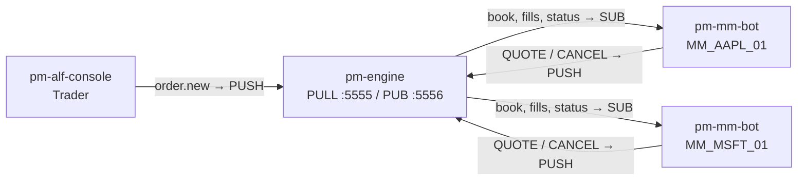
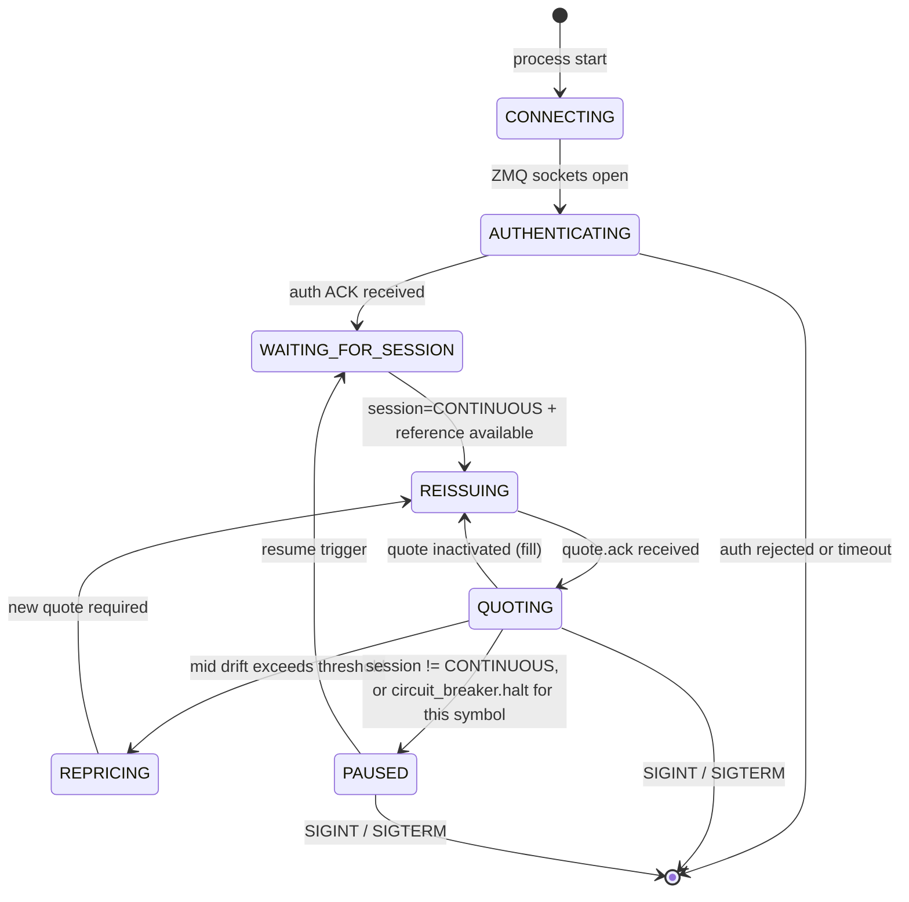

# Market-Maker Bot (pm-mm-bot)

!!! note "Learning objectives"
    After reading this page you will understand:

    - What `pm-mm-bot` is and how it differs from manual `QUOTE` commands
    - How to launch one or more autonomous market-maker bot instances
    - How one instance can quote several symbols at once with `--symbols`,
      and when to prefer that over one process per symbol
    - The bot's lifecycle: startup handshake, quoting, repricing, and shutdown
    - How quote refresh works after fills and mid-price drift
    - How the `passive` strategy lets other traders trade first, stepping
      behind their prices and backing off after a fill
    - How to configure gateway entries in `engine_config.yaml` for MM bots
    - How to bootstrap a fresh exchange with no existing book data
    - How to keep a bot's parameters in a version-controlled `--config` file

    **Prerequisites**: [Market Making](090-market-maker.md) — understand the `QUOTE` command,
    `quote_refresh_policy`, and `disconnect_behaviour` before using the bot.
    [Configuration](010-configuration.md) — each bot instance needs a pre-registered
    `MARKET_MAKER` gateway in the engine config.

---

## What is pm-mm-bot?

`pm-mm-bot` is an **autonomous market-maker process** that keeps one or more
symbols liquid without human intervention. It connects to the engine as a
single `MARKET_MAKER` gateway, posts a two-sided quote (bid and ask) per
symbol it covers, and automatically reprices each one when:

- One side of that symbol's quote is filled
- That symbol's mid-price drifts beyond a configurable threshold
- The session state changes (e.g. entering or leaving an auction phase)

A single instance can quote **one symbol or several** from the same process,
behind the same gateway ID — nothing on the engine side ties a
`MARKET_MAKER` gateway to a single symbol (the engine's `QuoteIndex` keys
every active quote by `(gateway_id, symbol)` and tracks a *set* of such keys
per gateway). Each symbol progresses through its own copy of the bot's state
machine independently: a fill, cancel, drift, or QLEGS divergence on one
symbol never touches another symbol's quoting.

```bash
# One process, one symbol (the classic form, still the default)
pm-mm-bot --symbol AAPL

# One process, several symbols sharing one set of settings
pm-mm-bot --symbols AAPL,MSFT,TSLA

# One process, several symbols, each on its own terms
pm-mm-bot --symbol AAPL --gap 0.10 \
          --symbol MSFT --gap 0.20 --qty 200 \
          --symbol TSLA --gap 0.50 --qty 100 --strategy inventory_skew --max-position 5000

# The same thing, from a file
pm-mm-bot --config mm_tech.yaml
```

Running one instance per symbol (as separate processes) is still fully
supported and is the right choice when you want independent OS-level
failure domains — a crash in one symbol's process cannot affect another's:

```bash
pm-mm-bot --symbol AAPL &
pm-mm-bot --symbol MSFT &
pm-mm-bot --symbol TSLA &
```

Multiple instances can also compete on the same symbol — they appear as
independent market makers in the book (use `--id-suffix` to distinguish them).

| Feature | Manual `QUOTE` | `pm-mm-bot` |
|---|---|---|
| Requires human operator | Yes | No |
| Automatic reissue after fill | No | Yes |
| Drift-based repricing | No | Yes |
| Session-aware (pause in auctions) | Manual | Automatic |
| Multiple symbols per process | N/A | Built-in (`--symbol` repeated, or `--symbols`) |
| Different settings per symbol | N/A | Built-in (see [Per-symbol settings](#per-symbol-settings)) |
| Multiple instances per symbol | Possible | Built-in (`--id-suffix`) |

!!! note "One process vs. several — which to use"
    Both are legitimate, for different scenarios. One process is the right
    default: it is the only way to get a genuinely shared process (one
    PUSH/SUB connection, one auth handshake, one gateway identity) across
    symbols, and each symbol can still be tuned individually — spread,
    size, strategy and timers are all per-symbol settings. One process per
    symbol is the right choice when you want a separate **OS-level** failure
    domain per symbol, or when the scenario specifically calls for several
    independently-attributable market-maker identities (for example when
    teaching self-match prevention). Note that a multi-symbol bot already
    isolates a *failing* symbol without a separate process — see
    [Per-symbol failure isolation](#per-symbol-failure-isolation).

---

## Quick start

```bash
# Start a market maker for AAPL with default settings
pm-mm-bot --symbol AAPL

# With explicit spread and quantity
pm-mm-bot --symbol AAPL --gap 0.10 --qty 500

# In Poetry development mode
poetry run pm-mm-bot --symbol AAPL --gap 0.10 --qty 500 -v
```

Before launching, ensure the gateway ID is registered in `engine_config.yaml`:

```yaml
gateways:
  alf:
    - id: MM_AAPL_01
      description: "AAPL market-maker bot"
      role: MARKET_MAKER
      disconnect_behaviour: CANCEL_QUOTES_ONLY
      quote_refresh_policy: INACTIVATE_ON_ANY_FILL
```

---

## Gateway identity convention

A single-symbol bot instance uses the gateway ID format:

```
MM_<SYMBOL>_<nn>
```

Where `<SYMBOL>` is the symbol in uppercase and `<nn>` is the two-digit suffix
from `--id-suffix` (default `01`).

| `--symbol` | `--id-suffix` | Gateway ID |
|---|---|---|
| `AAPL` | `01` (default) | `MM_AAPL_01` |
| `AAPL` | `02` | `MM_AAPL_02` |
| `MSFT` | `01` | `MM_MSFT_01` |

A `--symbols` bot derives the same shape from every symbol it covers, joined
with underscores, unless `--label` overrides that segment directly:

| `--symbols` | `--label` | Gateway ID |
|---|---|---|
| `AAPL,MSFT` | *unset* | `MM_AAPL_MSFT_01` |
| `AAPL,MSFT,TSLA` | `TECH` | `MM_TECH_01` |

`--label` exists because `MM_<SYMBOL>_<nn>` has no natural multi-symbol form
once the symbol list grows — a five-symbol gateway ID built by joining every
symbol is legal but unwieldy in logs and `pm-admin`. Pick a short label (e.g.
a sector or desk name) once the symbol list stops being self-describing at a
glance.

This convention makes bot gateways immediately identifiable in logs, the admin
console (`pm-admin`), and the order book viewer (`pm-board`).

---

## Architecture

Each `pm-mm-bot` instance is a standalone process that communicates with the
engine using the same ZMQ PUSH/SUB pattern as all other participants — one
PUSH/SUB pair per process regardless of how many symbols that process quotes:


```mermaid
flowchart LR
    E["pm-engine\nPULL :5555 / PUB :5556"]
    B1["pm-mm-bot\nMM_AAPL_01"]
    B2["pm-mm-bot\nMM_MSFT_01"]
    GW["pm-alf-console\nTrader"]

    B1 -- "QUOTE / CANCEL → PUSH" --> E
    B2 -- "QUOTE / CANCEL → PUSH" --> E
    GW -- "order.new → PUSH" --> E
    E -- "book, fills, status → SUB" --> B1
    E -- "book, fills, status → SUB" --> B2
```

Here `B1` and `B2` are two separate processes, each quoting one symbol —
the same diagram describes a single `--symbols AAPL,MSFT` process just as
well by collapsing `B1`/`B2` into one box `MM_AAPL_MSFT_01` with two QUOTE
streams into the same PUSH socket instead of two sockets.

---

## Bot lifecycle

### State machine

The bot progresses through a well-defined set of states:


```mermaid
stateDiagram-v2
    [*] --> CONNECTING : process start
    CONNECTING --> AUTHENTICATING : ZMQ sockets open
    AUTHENTICATING --> WAITING_FOR_SESSION : auth ACK received
    AUTHENTICATING --> [*] : auth rejected or timeout
    WAITING_FOR_SESSION --> REISSUING : session=CONTINUOUS + reference available
    QUOTING --> REPRICING : mid drift exceeds threshold
    QUOTING --> REISSUING : quote inactivated (fill)
    QUOTING --> PAUSED : session != CONTINUOUS, or circuit_breaker.halt for this symbol
    REPRICING --> REISSUING : new quote required
    REISSUING --> QUOTING : quote.ack received
    PAUSED --> WAITING_FOR_SESSION : resume trigger
    QUOTING --> [*] : SIGINT / SIGTERM
    PAUSED --> [*] : SIGINT / SIGTERM
```

### Startup sequence

1. Open ZMQ sockets (PUSH and SUB) — once per process, not once per symbol
2. Send `gateway_connect` and wait for `gateway_auth` ACK — once per process
3. Request symbol list and verify every `--symbol`/`--symbols` entry exists
4. For each symbol: send `QBOOT` — if an active quote already exists for
   this `(gateway_id, symbol)` pair, adopt it instead of creating a
   duplicate
5. For each symbol: send `QLEGS` to reconcile quote-leg mapping
6. Wait for `session.state` event (fail fast if not received within
   timeout) — once per process, since session state applies to the whole
   exchange rather than to one symbol
7. For each symbol still active after steps 3–5: resolve its initial
   reference price and begin quoting

Steps 3–5 and 7 run once per symbol and are where
[per-symbol failure isolation](#per-symbol-failure-isolation) applies: a
symbol that fails one of these checks is excluded from quoting rather than
aborting the whole process, as long as at least one other symbol succeeds.

### Per-symbol failure isolation

A `--symbols` bot does not treat a startup problem with one symbol as fatal
to the others. If, say, `AAPL`'s `--gap` violates its `mm_max_spread_ticks`
obligation while `MSFT`'s does not, the bot logs `AAPL` as excluded and
continues quoting `MSFT` — the process only exits with a startup failure if
*every* symbol fails its checks (exactly the single-symbol behavior, applied
to the whole symbol set rather than to one symbol). The same isolation
applies to any other per-symbol startup failure: an unknown symbol, an
invalid strategy/gap/tick combination, or no reference price available.

This is a startup-time check only — once a symbol is quoting, a runtime
problem specific to that symbol (a rejected quote, a circuit-breaker halt)
already only affects that symbol's own state, the same way it always has;
see [Session state handling](#session-state-handling) and
[Quote refresh logic](#quote-refresh-logic) above.

### Graceful shutdown

On `SIGINT` (Ctrl+C) or `SIGTERM`, the bot:

1. Sends `quote.cancel` for every symbol still quoting
2. Waits up to `--shutdown-timeout-sec` for cancel confirmation
3. Closes ZMQ sockets and exits

---

## Pricing logic

### Mid-price tracking

The bot tracks the current mid-price from the order book:

- **Both sides present**: `mid = (best_bid + best_ask) / 2`
- **Ask only**: `mid = best_ask`
- **Bid only**: `mid = best_bid`
- **No data**: keep previous mid

The `symmetric` and `inventory_skew` strategies apply this to the whole
book, including the bot's own quote. The `passive` strategy applies it to
other traders' orders only — see [The passive strategy](#the-passive-strategy).

### Quote placement

Given the mid-price and `--gap` (total spread), the bot places:

- **Bid** at `mid − gap/2`, rounded to the nearest tick
- **Ask** at `mid + gap/2`, rounded to the nearest tick

A minimum spread of 2 ticks is always guaranteed, even after rounding.

This is the `symmetric` placement. `passive` treats it as the *home* price
and may quote further out — see [The passive strategy](#the-passive-strategy).

### Drift detection

After posting a quote, the bot records the mid at the time of posting. On each
book update, it checks whether the mid has moved by more than `--drift-ticks`
ticks. If so, it cancels and reissues at the new mid. (`passive` uses its
own, per-side re-quote rules — see
[When the bot re-quotes](#when-the-bot-re-quotes).)

---

## Quote refresh logic

### Refresh triggers

| Trigger | Action |
|---|---|
| Quote inactivated (one side filled) | Reissue after `--reissue-delay-ms` |
| Mid-price drift exceeds threshold | Cancel active quote, then reissue at new mid |
| `passive` only: a side becomes/stops being covered, must step back, or a fade starts/ends | Cancel active quote, then reissue (see [When the bot re-quotes](#when-the-bot-re-quotes)) |
| Quote rejected | Retry after delay |
| Periodic heartbeat (no active quote) | Reissue |
| Periodic QLEGS reconciliation mismatch | Clear local state and reissue |

### Reissue delay

After a fill, the bot waits `--reissue-delay-ms` (default: 200 ms) before
reissuing. If multiple fills arrive in quick succession, the timer resets on
each fill — resulting in exactly one reissue after the burst settles.

### Cancel timeout guard

When the bot is replacing an active quote, it first sends `quote.cancel` and
waits up to `--cancel-timeout-sec` for lifecycle confirmation. If no
confirmation arrives within that window, it forces a safe replacement by
clearing local quote IDs and sending a fresh `quote.new`.

### Self-healing against dropped messages

ZMQ delivery is best-effort, so the bot is built to recover if an engine reply
is ever lost:

- **Dropped `quote.ack`** — after sending a quote the bot waits for the ack to
  confirm it. If the ack never arrives, the heartbeat guard notices it holds no
  live quote and, once a full `--heartbeat-interval-sec` has elapsed since the
  last quote was sent (so an in-flight ack is never pre-empted), it reissues.
- **Periodic QLEGS reconciliation** — every `--qlegs-reconcile-interval-sec` the
  bot requests a fresh quote-leg snapshot (`QLEGS`). The request is
  non-blocking: the reply is processed in the normal event loop, so fills and
  status updates are never missed while the snapshot is outstanding. If the
  snapshot shows no legs, a different `quote_id`, or different leg order IDs than
  the bot is tracking, it clears its local state and reissues to converge.

---

## Session state handling

The bot respects the exchange session lifecycle:

| Session State              | Bot Behaviour                       |
|----------------------------|-------------------------------------|
| `PRE_OPEN`                 | Wait — do not quote                 |
| `OPENING_AUCTION`          | Cancel any live quote; wait         |
| `CONTINUOUS`               | Post and maintain a two-sided quote |
| `CLOSING_AUCTION`          | Cancel any live quote; wait         |
| `CLOSED`                   | Cancel any live quote; wait         |

A circuit-breaker halt is **not** a `session.state` value — it arrives on a
separate, per-symbol `circuit_breaker.halt.<SYMBOL>` topic (and clears on the
matching `circuit_breaker.resume.<SYMBOL>` topic), independent of the session
state. On a halt for one of its symbols, the bot cancels that symbol's live
quote and pauses immediately; it resumes on the matching resume event.

When the session transitions to `CONTINUOUS`, the bot resumes quoting
automatically.

---

## Bootstrap: starting with an empty book

When the exchange starts fresh (no existing book or trades), the bot needs an
initial reference price. It resolves one using this priority:

1. **QBOOT** — active quote from a previous session (restart recovery)
2. **Book mid / last trade** — the current book mid if another participant has
   posted orders, otherwise the most recent `trade.executed` price
3. **Bootstrap quote** — inactive quote prices from QBOOT
4. **Random range** — `--initial_min` to `--initial_max` (configurable)

If no source is available and no random range is configured, the bot exits with
a clear error message.

```bash
# Bootstrap from random price range when the book is empty
pm-mm-bot --symbol AAPL --initial_min 95.00 --initial_max 105.00
```

---

## Per-symbol settings

Settings fall into two tiers, and the tier decides where a setting may be
given.

**Gateway-wide settings** describe the process itself. There is one gateway
identity, one pair of sockets and one log stream, so these cannot vary per
symbol:

| Flag | Config-file location |
|---|---|
| `--label` | `gateway.label` |
| `--id-suffix` | `gateway.id_suffix` |
| `--engine-pull` | `gateway.engine_pull` |
| `--engine-pub` | `gateway.engine_pub` |
| `--startup-session-timeout-sec` | `gateway.startup_session_timeout_sec` |
| `--shutdown-timeout-sec` | `gateway.shutdown_timeout_sec` |
| `--log-level`, `-v`, `-q` | `logging.level` |
| `--log-target`, `--log-file`, `--log-failover-timeout` | `logging.target`, `logging.file`, `logging.failover_timeout_sec` |
| `--config` | — |

**Per-symbol settings** describe how one instrument is quoted, and may
differ for every symbol:

`--strategy`, `--gap`, `--qty`, `--max-position`, `--drift-ticks`, `--tif`,
`--reissue-delay-ms`, `--heartbeat-interval-sec`, `--bootstrap-timeout-sec`,
`--cancel-timeout-sec`, `--qlegs-reconcile-interval-sec`, `--initial_min`,
`--initial_max`.

### Scoping flags to a symbol on the command line

`--symbol` may be repeated. Every per-symbol flag **after** a `--symbol`
applies to that symbol until the next `--symbol`; anything **before** the
first `--symbol` is the default for all of them:

```bash
pm-mm-bot \
  --label TECH --id-suffix 01 \
  --qty 500 --tif DAY --drift-ticks 3 \
  --symbol AAPL --gap 0.10 \
  --symbol MSFT --gap 0.20 --qty 200 \
  --symbol TSLA --gap 0.50 --qty 100 \
                --strategy inventory_skew --max-position 5000 \
                --initial_min 180 --initial_max 220
```

That resolves to gateway `MM_TECH_01` and:

| Symbol | strategy | gap | qty | tif | drift_ticks | max_position |
|---|---|---|---|---|---|---|
| AAPL | symmetric | 0.10 | 500 | DAY | 3 | — |
| MSFT | symmetric | 0.20 | 200 | DAY | 3 | — |
| TSLA | inventory_skew | 0.50 | 100 | DAY | 3 | 5000 |

Rules:

- A symbol that names no flags of its own inherits everything.
- `--symbols A,B,C` is shorthand for repeating `--symbol` with no per-symbol
  flags. It cannot be combined with `--symbol`.
- Naming the same symbol twice on one command line is a usage error.
- A gateway-wide flag typed after a `--symbol` still applies to the whole
  process (it is logged as a warning so nobody is misled) — this is what
  keeps every pre-existing single-symbol command line working unchanged.

!!! tip "Long command lines belong in a file"
    Anything beyond two or three symbols is much easier to read, review and
    version-control as a [config file](#config-file).

---

## CLI reference

| Argument                           | Tier         | Default                | Description                                                        |
|------------------------------------|--------------|------------------------|--------------------------------------------------------------------|
| `--config PATH`                    | gateway      | *unset*                | YAML config file (see [Config file](#config-file))                 |
| `--symbol SYM`                     | *required¹*  | —                      | Instrument to make a market in; repeatable, and opens a scope for the per-symbol flags that follow it |
| `--symbols SYM1,SYM2,...`          | *required¹*  | —                      | Comma-separated symbols sharing one set of settings — mutually exclusive with `--symbol` |
| `--label NAME`                     | gateway      | *derived*              | Override the gateway-ID symbol segment (default: the single symbol, or every symbol joined with `_`) |
| `--id-suffix NN`                   | gateway      | `01`                   | Running number for gateway ID (`MM_AAPL_01`)                       |
| `--engine-pull ADDR`               | gateway      | `tcp://127.0.0.1:5555` | Engine PUSH/PULL address                                           |
| `--engine-pub ADDR`                | gateway      | `tcp://127.0.0.1:5556` | Engine PUB address                                                 |
| `--startup-session-timeout-sec F`  | gateway      | `5.0`                  | Max wait for first `session.state`                                 |
| `--shutdown-timeout-sec F`         | gateway      | `2.0`                  | Max wait for cancel on SIGINT/SIGTERM                              |
| `--strategy NAME`                  | per-symbol   | `symmetric`            | Pricing strategy: `symmetric`, `inventory_skew` or `passive` (see [Pricing strategies](#pricing-strategies)) |
| `--gap PRICE`                      | per-symbol   | `0.10`                 | Total spread (bid at mid−gap/2, ask at mid+gap/2)                  |
| `--max-position N`                 | per-symbol   | *unset*                | Net position at which inventory skewing saturates — required with `--strategy inventory_skew`, rejected otherwise |
| `--qty N`                          | per-symbol   | `500`                  | Quote size on each leg                                             |
| `--drift-ticks N`                  | per-symbol   | `3`                    | Reprice when mid moves by more than this many ticks (`passive`: when a side's target price does) |
| `--retreat-ticks N`                | per-symbol   | `5`                    | `passive` only: how far beyond home each side may step back (see [The control knobs](#the-control-knobs)) |
| `--behind-ticks N`                 | per-symbol   | `1`                    | `passive` only: ticks behind other traders' best price on a covered side |
| `--min-cover-qty N`                | per-symbol   | `1`                    | `passive` only: others' quantity inside the band before a side counts as covered |
| `--fade-ticks N`                   | per-symbol   | `2`                    | `passive` only: extra ticks a side steps back after it is filled (`0` = no fade) |
| `--fade-sec F`                     | per-symbol   | `3.0`                  | `passive` only: how long a fade lasts (`0` = no fade)              |
| `--reissue-delay-ms N`             | per-symbol   | `200`                  | Wait after fill before re-issuing                                  |
| `--tif {DAY,GTC}`                  | per-symbol   | `DAY`                  | Time-in-force for quote legs                                       |
| `--heartbeat-interval-sec F`       | per-symbol   | `5.0`                  | Periodic live-quote check interval                                 |
| `--bootstrap-timeout-sec F`        | per-symbol   | `1.0`                  | Max wait for QBOOT reply                                           |
| `--cancel-timeout-sec F`           | per-symbol   | `1.0`                  | Max wait for cancel confirmation before forced replacement reissue |
| `--qlegs-reconcile-interval-sec F` | per-symbol   | `15.0`                 | Periodic QLEGS reconciliation interval                             |
| `--initial_min PRICE`              | per-symbol   | *unset*                | Lower bound for random bootstrap price                             |
| `--initial_max PRICE`              | per-symbol   | *unset*                | Upper bound for random bootstrap price                             |
| `--log-level`                      | gateway      | `WARNING`              | Explicit level: `CRITICAL`, `ERROR`, `WARNING`, `INFO`, `DEBUG`    |
| `-v`, `--verbose`                  | gateway      | `false`                | Increase verbosity (`-v` enables bot debug prints, `-vv` sets DEBUG) |
| `-q`, `--quiet`                    | gateway      | `false`                | Reduce output to warnings/errors                                   |

¹ At least one symbol is required, from `--symbol`, `--symbols`, or the
config file's `symbols:` block. Giving both `--symbol` and `--symbols`, or
neither, is a startup usage error.

---

## Config file

`--config <path>` reads a YAML file. It is the recommended way to configure
anything beyond a couple of symbols: the file is readable, reviewable, and
can be committed alongside the `engine_config.yaml` it pairs with.

Worked examples live in `docs/examples/mm-bot/`.

### File structure

A config file has four optional blocks and one required one:

```yaml
version: 1        # schema version — always 1 today

gateway: {}       # gateway-wide settings (optional)
logging: {}       # logging settings (optional)
defaults: {}      # per-symbol settings applied to every symbol (optional)
symbols: {}       # REQUIRED — the symbols to quote, and their overrides
```

The split is the point: `gateway:` and `logging:` hold settings that *cannot*
vary per symbol, `defaults:` holds the house settings for every symbol, and
each block under `symbols:` overrides the house settings for one instrument.

### A full example

```yaml
# docs/examples/mm-bot/tech-desk.yaml
version: 1

# Gateway-wide settings. Nothing here can vary per symbol: there is one
# gateway identity and one pair of sockets for the whole process.
gateway:
  label: TECH                      # gateway id becomes MM_TECH_01
  id_suffix: "01"                  # quote it, or YAML reads 01 as the number 1
  engine_pull: tcp://127.0.0.1:5555
  engine_pub: tcp://127.0.0.1:5556
  startup_session_timeout_sec: 5.0
  shutdown_timeout_sec: 2.0

logging:
  level: INFO                      # CRITICAL | ERROR | WARNING | INFO | DEBUG
  target: server                   # server | stdout | file
  file: null                       # required when target: file
  failover_timeout_sec: 30

# Applied to every symbol below unless that symbol overrides the key.
defaults:
  strategy: symmetric
  gap: 0.10
  qty: 500
  drift_ticks: 3
  reissue_delay_ms: 200
  tif: DAY
  heartbeat_interval_sec: 5.0
  bootstrap_timeout_sec: 1.0
  cancel_timeout_sec: 1.0
  qlegs_reconcile_interval_sec: 15.0

# The symbol universe this bot quotes. Mapping order is the order symbols
# are started in.
symbols:
  # A liquid name, happy with every default.
  AAPL: {}

  # Wider and smaller than the house default.
  MSFT:
    gap: 0.20
    qty: 200

  # A volatile name: quote wide, in small size, skewing quotes to work
  # inventory back toward flat, and reprice less twitchily.
  TSLA:
    gap: 0.50
    qty: 100
    strategy: inventory_skew
    max_position: 5000
    drift_ticks: 5
    initial_min: 180
    initial_max: 220
```

```bash
pm-mm-bot --config docs/examples/mm-bot/tech-desk.yaml
```

That file produces gateway `MM_TECH_01` quoting `AAPL` on house defaults,
`MSFT` twice as wide in less than half the size, and `TSLA` wide, small,
inventory-skewing and less twitchy about repricing.

### The smallest useful file

```yaml
# docs/examples/mm-bot/single-symbol.yaml
# Equivalent to:  pm-mm-bot --symbol AAPL --gap 0.08 --qty 300
version: 1

defaults:
  gap: 0.08
  qty: 300

symbols:
  AAPL: {}
```

### Shorthand when every symbol is the same

When no symbol needs its own block, `symbols:` may be a plain list instead of
a mapping of empty blocks:

```yaml
# docs/examples/mm-bot/uniform-desk.yaml
version: 1

gateway:
  label: CORE

defaults:
  gap: 0.10
  qty: 500
  tif: GTC

symbols: [AAPL, MSFT, TSLA]
```

### `gateway:` fields

| Field | Type | Default | Notes |
|---|---|---|---|
| `label` | string | derived from the symbols | Gateway ID becomes `MM_<label>_<id_suffix>` |
| `id_suffix` | string | `"01"` | **Quote it** — unquoted `01` is the number `1` to YAML, and is rejected |
| `engine_pull` | string | `tcp://127.0.0.1:5555` | Engine PUSH/PULL address |
| `engine_pub` | string | `tcp://127.0.0.1:5556` | Engine PUB address |
| `startup_session_timeout_sec` | number | `5.0` | Must be > 0 |
| `shutdown_timeout_sec` | number | `2.0` | Must be > 0 |

### `logging:` fields

| Field | Type | Default | Notes |
|---|---|---|---|
| `level` | enum | `WARNING` | `CRITICAL`, `ERROR`, `WARNING`, `INFO`, `DEBUG` |
| `target` | enum | `server` | `server`, `stdout`, `file` |
| `file` | string | `null` | Required when `target: file` |
| `failover_timeout_sec` | number | from log-client config | Grace window before falling back to a local file |

### `defaults:` and `symbols.<SYM>:` fields

The same keys are accepted in both places; a key in a symbol's own block wins
for that symbol.

| Field | Type | Default | Constraints |
|---|---|---|---|
| `strategy` | string | `symmetric` | `symmetric`, `inventory_skew` or `passive` |
| `gap` | number | `0.10` | > 0; must also satisfy the symbol's MM obligation (see [Gap validation](#gap-validation)) |
| `qty` | integer | `500` | > 0 |
| `max_position` | integer | `null` | > 0; **only** valid with `strategy: inventory_skew`, and **required** by it |
| `drift_ticks` | integer | `3` | > 0 |
| `tif` | enum | `DAY` | `DAY` or `GTC` |
| `reissue_delay_ms` | integer | `200` | ≥ 0 |
| `heartbeat_interval_sec` | number | `5.0` | > 0 |
| `bootstrap_timeout_sec` | number | `1.0` | > 0 |
| `cancel_timeout_sec` | number | `1.0` | > 0 |
| `qlegs_reconcile_interval_sec` | number | `15.0` | > 0 |
| `initial_min` | number | `null` | Must be set together with `initial_max` |
| `initial_max` | number | `null` | Must be greater than `initial_min` |
| `retreat_ticks` | integer | `5` | ≥ 0; `passive` only (ignored otherwise) |
| `behind_ticks` | integer | `1` | ≥ 1; `passive` only |
| `min_cover_qty` | integer | `1` | ≥ 1; `passive` only |
| `fade_ticks` | integer | `2` | ≥ 0; `passive` only |
| `fade_sec` | number | `3.0` | ≥ 0; `passive` only |

Symbol keys are upper-cased on load, so `symbols: {aapl: {...}}` configures
`AAPL`. Mapping order is preserved and is the order symbols start in.

### Precedence

When the same per-symbol setting is given in more than one place, the first
of these that supplies it wins:

| Rank | Source | Example |
|---|---|---|
| 1 | The symbol's own CLI scope | `--symbol MSFT --gap 0.20` |
| 2 | The symbol's block in the config file | `symbols.MSFT.gap` |
| 3 | The global CLI scope | `--gap 0.20` before the first `--symbol` |
| 4 | The config file's `defaults:` block | `defaults.gap` |
| 5 | The built-in default | `0.10` |

Gateway-wide settings use the simpler ladder: the CLI flag, then the file's
`gateway:`/`logging:` block, then the built-in default.

!!! important "A per-symbol file value beats a gateway-wide flag"
    Rank 2 sits above rank 3 deliberately. If `symbols.TSLA.gap: 0.50` is
    written into a reviewed config file, a throwaway `--gap 0.10` on the
    command line widens the symbols that were *not* individually tuned —
    it does not silently un-tune TSLA. To override one symbol from the
    command line, name it: `--symbol TSLA --gap 0.10`.

A gap chosen at *any* of ranks 1–4 counts as an explicit choice, so the bot
will not replace it with the MM-obligation default described in
[Gap validation](#gap-validation). Only a gap nobody set is auto-derived.

### Errors

The file is validated up front; a bad file is a fast, explicit startup
failure rather than a bot that runs with settings you did not intend.

| Mistake | What you see |
|---|---|
| Typo in a key | `unknown key 'gapp' under symbols.AAPL (did you mean 'gap'?)` |
| Gateway-wide key in `defaults:` or a symbol block | `'engine_pull' is a gateway-wide setting; move it under 'gateway:'` |
| Per-symbol key in `gateway:` | `'gap' is a per-symbol setting; move it under 'defaults:' or into a symbol's own block` |
| Logging key in the wrong place | `'log_level' is a logging setting; move it under 'logging:'` |
| Unquoted `id_suffix` | `gateway.id_suffix must be a string — quote it (e.g. "01")` |
| A future schema version | `unsupported version 2 (this build understands version 1)` |
| An out-of-range value | `[MSFT] qty must be positive (got -1)` |
| `inventory_skew` without a cap | `[TSLA] max_position is required when strategy inventory_skew is selected` |

### Legacy flat files

The original flat format — one mapping of CLI flag names, all of them
gateway-wide — still loads unchanged:

```yaml
# mm_aapl.yaml (legacy format)
symbol: AAPL
id_suffix: "01"
strategy: symmetric
gap: 0.08
qty: 300
tif: GTC
drift_ticks: 4
```

It is recognised by shape (no `version:`, and `symbols:` given as a string or
list rather than a mapping) and behaves exactly as it did: every value
applies to every symbol. Prefer `version: 1` for new files — it is the only
format that can express per-symbol settings.

### Pricing strategies

`--strategy` (or the file's `strategy:` key) selects which pricing logic the
bot uses to compute bid/ask from the tracked mid-price. Three strategies
ship today:

- **`symmetric`** (the default) — quote symmetrically around mid at a fixed
  `--gap`, described in [Pricing logic](#pricing-logic) above.
- **`inventory_skew`** — quote asymmetrically to lean the book toward
  flattening whatever position the bot has accumulated, described in
  [Inventory skewing](#inventory-skewing) below.
- **`passive`** — act as a backstop: quote at home when nobody else is
  there, step behind other traders when they are, and back off briefly
  after a fill. Described in [The passive strategy](#the-passive-strategy)
  below.

The bot fails fast at startup if `--strategy` names anything else. The
selection point exists so a future strategy (e.g. one that widens the gap
with volatility) can be added as a new pricing module without changing the
bot's state machine, ZMQ handling, or CLI plumbing.

### Inventory skewing

A market maker that always quotes symmetrically around mid has no opinion
about the position it is carrying. If the bot has been repeatedly lifted on
its ask (selling to takers), it accumulates a growing short position while
continuing to offer the exact same bid and ask it always did — nothing
about its quoting nudges the market back toward flattening that position.
In a real market this matters because holding inventory is risk: the
longer the bot stays short (or long), the more exposed it is to an adverse
price move, and the point of market-making in the first place is to earn
the spread, not to take a directional bet.

`--strategy inventory_skew` addresses this by tracking the bot's own net
position per symbol (derived locally from its own fills — it does not ask
the engine) and shifting where it places its bid and ask relative to mid:

- **Long** (net_position > 0, the bot has bought more than it's sold): the
  effective mid shifts *down*. Both the bid and the ask come down —
  the ask becomes more attractive to lift (encouraging someone to buy from
  the bot, reducing the long) and the bid becomes less attractive to hit
  (discouraging the bot from buying still more).
- **Short** (net_position < 0): the shift is the mirror image — both
  quotes move *up*, encouraging the bot to buy back what it's short and
  discouraging it from selling further.
- **Flat** (net_position == 0): identical to `symmetric` — no shift at all.

The shift scales linearly with how large the position is relative to
`--max-position` (required for this strategy — there is no meaningful
"unbounded" skew to normalize against):

```
fraction = clamp(net_position / max_position, -1.0, +1.0)
skew     = -fraction × (gap / 2)
effective_mid = tracked_mid + skew
```

The bid and ask are then computed from `effective_mid` exactly as
`symmetric` computes them from the tracked mid (same tick-rounding, same
2-tick minimum spread) — inventory skewing only changes *where* the quote
is centred, never the rules for how it's rounded or how wide it can get.

**Worked example.** AAPL, `--gap 0.10`, `--max-position 1000`, tracked mid
= `150.00`. At `net_position = +500` (half of max_position, long):
`fraction = 0.5`, `skew = -0.5 × 0.05 = -0.025`, `effective_mid = 149.975`.
The bid and ask (still `±0.05` from that effective mid, then tick-rounded)
come out at `149.92` / `150.02` — both about three cents lower than the
flat-position quote of `149.95` / `150.05`, making the ask cheaper to lift
and the bid less attractive to hit. (The rounded values land three cents,
not the two-and-a-half the raw `149.975 ± 0.05` arithmetic suggests, because
`149.975 - 0.05` evaluates to `149.92499999999998` in floating point and
rounds down a tick.)

**What happens when `--max-position` is reached?** The bot does **not**
stop quoting. `fraction` is clamped to `±1.0`, so once `|net_position| >=
max_position` the skew simply stays pinned at its maximum (the full
`±gap/2` shift) — the spread stays maximally lopsided in the direction that
favors flattening, and further fills past the cap do not skew it any
further, but the bot keeps posting a live two-sided quote throughout. This
is a deliberate choice: pulling quotes entirely at the position cap would
leave the symbol with no MM liquidity at exactly the moment the bot most
needs fills to flatten, which defeats the purpose. If you want the bot to
stop trading altogether at some limit, that is a different, not-yet-built
feature (a hard risk cutoff) — `--max-position` here only ever affects how
the quote is skewed, never whether one is sent.

`inventory_skew` accepts `--gap`, `--drift-ticks`, and all the other
`symmetric` flags unchanged — only the price-computation step differs.

### The passive strategy

`symmetric` and `inventory_skew` both centre their quote on the mid of the
*whole* book — including the bot's own quote — and always quote at
`mid ± gap/2`. On a quiet book that makes the bot the best bid and the best
offer almost all the time: it re-quotes 200 ms after every fill, so
whenever a trader wants to trade immediately the bot is the one that gets
hit, and a trader who rests a limit order at the bot's price rarely gets
filled first.

Real market makers are not obliged to be the *best* price. Their
obligation is to be *present*: quote both sides, within a maximum spread,
for most of the session. Being at the top of the book is a business
choice. `--strategy passive` models that: the bot acts as a **backstop**.
It makes the market when nobody else does, and steps back behind other
traders when they are already providing liquidity.

The strategy combines two behaviours:

- **Step behind** — when other traders already quote near the bot's price,
  the bot moves its quote *behind* theirs, so their orders trade first.
- **Fade** — after one of its legs is filled, the bot quotes that side a
  little further out for a few seconds, instead of immediately
  re-offering the same price.

```bash
pm-mm-bot --symbol AAPL --strategy passive
```

With no other flags every knob below takes its default.

#### Vocabulary

The rules are easiest to follow with four terms. The examples use a
`0.01` tick, `--gap 0.10` and the defaults
(`--retreat-ticks 5 --behind-ticks 1 --min-cover-qty 1 --fade-ticks 2 --fade-sec 3`).

| Term | Meaning | Example (mid `100.00`) |
|---|---|---|
| **Others' book** | The order book with the bot's own two legs removed | — |
| **Home price** | Where `symmetric` would quote: `mid ± gap/2`, tick-rounded. The *tightest* the bot ever quotes | bid `99.95`, ask `100.05` |
| **Band** | From the home price out to `retreat_ticks` further away. The bot never quotes outside it | bid `99.90`–`99.95`, ask `100.05`–`100.10` |
| **Covered side** | A side where other traders show at least `min_cover_qty` in total at prices inside that side's band (or better) | — |

```
          bid band              ask band
      |<--- retreat --->|   |<--- retreat --->|
   99.90             99.95 | 100.05            100.10
   floor              home | home              ceiling
                          mid
                        100.00
```

#### Step 1 — the mid comes from other traders only

Before pricing anything the bot removes its own legs from every book
snapshot. It knows where they rest (it sent them) and how much of each is
left (it sees its own fills). The mid is then computed from what remains,
with the usual rule (both sides → average; one side → that side; nothing →
keep the previous mid).

This is what stops the bot chasing itself. Under `symmetric`, the bot's
own quote *is* part of the book it prices from; under `passive`, a book
containing only the bot's quote is an empty book, and the mid stays where
it was.

!!! note "How own-leg removal works"
    A snapshot level is reduced by the bot's leg only if it is at the
    bot's price and holds at least the leg's remaining quantity. If that
    level holds exactly one order, the level is dropped. A snapshot taken
    just before the leg reached the book (or just after it left) is
    therefore passed through unchanged instead of having another trader's
    quantity subtracted. The next snapshot corrects any leftover
    difference.

#### Step 2 — place each side

Each side is priced independently. For the bid:

```
home   = mid − gap/2                        (tick-rounded)
floor  = home − retreat_ticks
covered = (others' bid qty at prices ≥ floor) ≥ min_cover_qty

if covered:  bid = clamp(others' best bid − behind_ticks,  floor,  home)
else:        bid = home
```

The ask is the mirror image: `ceiling = home + retreat_ticks`, count
others' offers at prices ≤ ceiling, and quote `behind_ticks` *above*
their best offer, clamped to `[home, ceiling]`.

Three consequences follow from the clamp:

- The bot **never quotes tighter than home**. If other traders are already
  tighter than the bot's gap, the bot simply stays at home, which is
  already behind them.
- The bot **never quotes outside the band**. If other traders sit at the
  edge of the band, the bot joins them at the edge. It arrives later, so
  under price-time priority it is still behind them in the queue.
- Liquidity **outside the band doesn't count**. A resting order far from
  the mid doesn't make the bot step back; the bot is still the market
  between the mid and that order.

#### Step 3 — fade after a fill

When a leg is filled, that side is pushed `fade_ticks` further out, still
clamped to the band, for `fade_sec` seconds. The other side is unchanged.
Another fill on the same side restarts the timer (fades don't stack).
When the timer runs out the bot re-quotes that side back at its normal
price.

Fading composes with the reissue delay rather than replacing it. After a
fill the engine inactivates the quote. The bot waits `--reissue-delay-ms`
as always, then sends a new quote that already includes the fade.

#### Worked examples

All with mid `100.00` unless stated; qty is the other trader's order size.

| Others' book | Mid | Bid | Ask | Why |
|---|---|---|---|---|
| empty | `100.00` (kept) | `99.95` | `100.05` | Nobody else → the bot is the market, at home |
| bid 200 @ `99.97`, ask 200 @ `100.03` | `100.00` | `99.95` | `100.05` | Both sides covered, but others are tighter than home → stay at home, already behind them |
| bid 200 @ `99.93`, ask 200 @ `100.07` | `100.00` | `99.92` | `100.08` | Covered inside the band → one tick behind them |
| bid 200 @ `99.91`, ask 200 @ `100.09` | `100.00` | `99.90` | `100.10` | Behind them would be `99.90`/`100.10`, exactly the band edge |
| bid 200 @ `99.85`, ask 200 @ `100.15` | `100.00` | `99.95` | `100.05` | Their orders are outside the band → not covered → the bot quotes at home, in front of them |
| bid 200 @ `99.97`, no asks | `99.97` | `99.92` | `100.02` | One-sided book → mid is that bid. Bid covered (home `99.92` is already behind), ask not covered → at home |
| empty, bot's bid just filled | `100.00` | `99.93` | `100.05` | Bid faded 2 ticks for 3 s |
| bid 200 @ `99.93`, ask 200 @ `100.07`, bot's bid just filled | `100.00` | `99.90` | `100.08` | Behind (`99.92`) minus fade (2) = `99.90`, the floor |

!!! tip "What a trader sees"
    With `passive` the bot's quote is the price a trader can always rely
    on, but not necessarily the best one. A trader who posts a buy inside
    the bot's spread becomes the best bid and gets filled first. If the
    trader posts *at* the bot's bid, the bot notices on the next book
    update and steps back one tick. The trader then has the top of the
    book to themselves.

#### When the bot re-quotes

Moving a quote means cancelling and re-issuing it, so the bot doesn't
react to every change in the book. After each quote it remembers, per
side, the price it sent, whether the side was covered, and whether it was
faded. It re-quotes when any of these hold for either side:

| Condition | Reaction | Reason |
|---|---|---|
| The side became covered, or stopped being covered | Immediately | The bot must step back behind a newcomer, or step forward when the other trader leaves |
| A covered side must move *further back* (by any amount) | Immediately | The bot never stays level with or ahead of the traders it is yielding to |
| A fade started or ended | Immediately (a fade ending is checked on the bot's timer, even with no book activity) | The fade is time-driven, not book-driven |
| Any other move of the target price by **more than** `--drift-ticks` | Re-quote | Same laziness as `symmetric`; a covered side creeping *closer* to the market, or a small mid move, waits until it's worth a cancel/replace |

So for `passive`, `--drift-ticks` measures how far a *side's target price*
has moved, not how far the mid has moved.

#### Interaction with the MM spread obligation

If the symbol has an `mm_max_spread_ticks` obligation (see
[Gap validation](#gap-validation)), the engine rejects any quote wider
than it. The bot therefore narrows the band until even the widest quote it
could send (both sides fully retreated, or faded to the band edge) still
satisfies the obligation:

```
effective retreat = min(retreat_ticks, (mm_max_spread_ticks − home spread in ticks) // 2)
```

Example: obligation `14` ticks, home spread `10` ticks → at most `2` ticks
of retreat per side, whatever `--retreat-ticks` says. The bot logs one line
at startup when this narrowing applies:

```
[AAPL] retreat_ticks 5 narrowed to 2 by mm_max_spread_ticks=14
```

When no gap is set, the gap defaults to half the obligation, which leaves
a quarter of the obligation for retreat on each side. With a `20`-tick
obligation, for example, the home spread is `10` ticks and each side can
retreat `5`, which is exactly the default `--retreat-ticks 5`.

#### The control knobs

All are per-symbol (CLI scope, `defaults:` or `symbols.<SYM>:`), have the
defaults below, and are **ignored by every strategy except `passive`**.

| Knob | CLI flag | Default | Range | Effect | Turn it up to… | Turn it down to… |
|---|---|---|---|---|---|---|
| `gap` | `--gap` | `0.10` | > 0 | Width of the home quote — the tightest the bot ever quotes | Quote less aggressively when alone | Make a tighter market when alone |
| `retreat_ticks` | `--retreat-ticks` | `5` | ≥ 0 | How far out each side may step back. `0` disables stepping behind (and fading) | Yield to traders further from the mid | Stay close to home; `0` = never yield |
| `behind_ticks` | `--behind-ticks` | `1` | ≥ 1 | How many ticks behind others' best price a covered side sits | Leave a visible gap behind other traders | Sit right behind them |
| `min_cover_qty` | `--min-cover-qty` | `1` | ≥ 1 | Total quantity others must show inside the band before the bot yields | Keep a small order from pushing the bot away | Yield to any order at all |
| `fade_ticks` | `--fade-ticks` | `2` | ≥ 0 | How far a side steps back after it is filled. `0` disables fading | Back off harder after being hit | Refill closer to the original price |
| `fade_sec` | `--fade-sec` | `3.0` | ≥ 0 | How long a fade lasts. `0` disables fading | Stay backed off longer, giving others time to post | Return sooner |
| `drift_ticks` | `--drift-ticks` | `3` | > 0 | Target-price move (per side) that triggers a lazy re-quote | Fewer cancel/replace cycles | Track the book more closely |
| `reissue_delay_ms` | `--reissue-delay-ms` | `200` | ≥ 0 | Pause after a fill before the new quote goes out | Leave a longer gap with no MM quote at all after each fill | Refill faster |

!!! important "Fade vs. reissue delay"
    Both slow the bot down after a fill, but differently.
    `reissue_delay_ms` is a period with **no MM quote at all**, and on a
    real exchange that counts against a market maker's presence obligation.
    Fading keeps a quote in the book, just further out. To give other
    traders room after a fill, prefer a longer `fade_sec` over a longer
    `reissue_delay_ms`.

#### Recipes

Yield to anyone, but only a little:

```bash
pm-mm-bot --symbol AAPL --strategy passive --retreat-ticks 2
```

Only yield to real size (at least one round lot inside the band):

```bash
pm-mm-bot --symbol AAPL --strategy passive --min-cover-qty 100
```

Pure step-behind, no fading:

```bash
pm-mm-bot --symbol AAPL --strategy passive --fade-ticks 0
```

Pure fading, never step behind others. The band still has to leave room
for the fade:

```bash
pm-mm-bot --symbol AAPL --strategy passive --min-cover-qty 1000000000 --retreat-ticks 3 --fade-ticks 3
```

The same in a config file, with one symbol tuned differently:

```yaml
version: 1
gateway:
  id_suffix: "01"
defaults:
  strategy: passive
  gap: 0.10
  retreat_ticks: 5
  behind_ticks: 1
  min_cover_qty: 1
  fade_ticks: 2
  fade_sec: 3.0
symbols:
  AAPL: {}
  TSLA:
    gap: 0.30
    retreat_ticks: 10
    min_cover_qty: 200
    fade_sec: 5.0
```

#### Limitations

- The bot has no fair value of its own; its reference is the others' mid.
  A lone order far from the market on an otherwise empty side moves the
  mid to that order, exactly as for `symmetric`.
- Covered is judged from aggregated price levels, so the bot cannot tell
  one trader with 500 from five traders with 100.
- `passive` doesn't skew for inventory; that is `inventory_skew`'s job,
  and the two can't be combined today.

### Querying a bot's position

Whether or not `inventory_skew` is in use, an operator can ask any running
gateway — including an MM bot — what it is currently holding, from
`pm-alf-console`:

```
POS|GW=MM_AAPL_01
```

This sends `system.position_request` for that `gateway_id` and prints
whatever the engine's own per-gateway position ledger reports back on
`system.position_snapshot.MM_AAPL_01`: net quantity and average cost, per
symbol, for every symbol the bot has a non-zero position in. `POS` with no
`GW=` is unchanged — it still shows the console's own local fills and P&L.

This does not require any special support from the MM bot itself: the
engine tracks a signed net position and volume-weighted average cost for
every gateway from its own fill records, and answers `system.
position_request` for any `gateway_id`, not just the requester's own — a
console (or another script) can query about a bot the same way it would
query its own position. The `--strategy inventory_skew` bot's local
position tracking (used for skewing, described above) is a separate,
parallel bookkeeping of the same fills — the two should always agree, since
both are derived from the same fill stream, but only the engine's ledger
is reachable remotely via `POS|GW=`.

The same query is available over REST for an admin-role caller, via
[`GET /api/v1/admin/positions?gateway_id=MM_AAPL_01`](950-app-REST-API-reference.md#get-apiv1adminpositions)
— useful for a dashboard or a script that wants to watch a bot's position
without an interactive console session. It reads the same
`system.position_request`/`system.position_snapshot` pair `POS|GW=` uses,
so both surfaces always agree.

A fourth surface,
[`pm-admin-cli position --gw MM_AAPL_01`](160-exchange-commands.md#position-show-a-gateways-net-position-and-live-quote),
adds the bot's **live quote** to the same net-position figures — bid, ask,
spread, and mid derived from its currently resting quote order, alongside
`net_qty`/`avg_cost` — in one command, with a `--format json` option for
scripting. Handy for confirming that inventory skewing is actually doing
something: watch `spread`/`mid` shift as `net_qty` moves away from zero.

---

## Engine configuration

### Gateway registration

Each bot instance — whether it quotes one symbol or several — must be
pre-registered as a single gateway entry in `engine_config.yaml`:

```yaml
gateways:
  alf:
    - id: MM_AAPL_01
      description: "AAPL market-maker bot instance 1"
      role: MARKET_MAKER
      disconnect_behaviour: CANCEL_QUOTES_ONLY
      quote_refresh_policy: INACTIVATE_ON_ANY_FILL
      enforce_mm_obligation: true
      mm_max_spread_ticks: 10
      mm_min_qty: 100
      smp_action: CANCEL_RESTING

    - id: MM_AAPL_02
      description: "AAPL market-maker bot instance 2"
      role: MARKET_MAKER
      disconnect_behaviour: CANCEL_QUOTES_ONLY
      quote_refresh_policy: INACTIVATE_ON_ANY_FILL
```

A `pm-mm-bot --symbols AAPL,MSFT --label TECH` process registers as *one*
gateway entry the same way — nothing in `gateways:` names which symbols a
`MARKET_MAKER` gateway quotes, since that's the bot's own `--symbol`/
`--symbols` choice, not an engine-config concept:

```yaml
gateways:
  alf:
    - id: MM_TECH_01
      description: "AAPL+MSFT market-maker bot"
      role: MARKET_MAKER
      disconnect_behaviour: CANCEL_QUOTES_ONLY
      quote_refresh_policy: INACTIVATE_ON_ANY_FILL
      enforce_mm_obligation: true
      mm_max_spread_ticks: 10
      mm_min_qty: 100
```

One easy-to-miss consequence: the per-symbol `market_maker_quotes` seed
(needed to bootstrap a fresh exchange — see
[Bootstrap](#bootstrap-starting-with-an-empty-book)) is required on **every**
symbol once **any** `MARKET_MAKER` gateway exists in the config, regardless
of which gateway is meant to quote which symbol (`pm-cverifier`'s check
`M001` enforces this). So `MM_TECH_01`'s config needs a seed under both
`symbols.AAPL.market_maker_quotes` and `symbols.MSFT.market_maker_quotes`,
each referencing `MM_TECH_01` — `pm-config-gen --seed-mm-mid-range` generates
these automatically for every symbol, so this is only a concern when writing
`engine_config.yaml` by hand.

### Recommended settings

- **`disconnect_behaviour: CANCEL_QUOTES_ONLY`** — ensures stale quotes are
  removed if the bot crashes or restarts
- **`quote_refresh_policy: INACTIVATE_ON_ANY_FILL`** — the engine cancels the
  remaining leg when either side fills, triggering an immediate reissue
- **`smp_action`** — self-match-prevention default for this gateway (`NONE`
  if unset). Since `mm_bot` only ever submits `QUOTE`s (no plain `NEW`/combo
  orders), this is the *only* SMP control it has — quote legs have no
  per-request `SMP=` field of their own, so a bid/ask leg sweeping into a
  resting order from the *same* gateway id (e.g. a stale leg left over from
  a prior quote) is always handled per this gateway-level setting instead of
  self-trading. See
  [Configuration Spec §5.2](990-app-config-spec.md#52-gatewaysalf-required)
  for the full `SmpAction` value list and how this default also applies to
  `NEW`/combo orders from other gateway roles when they omit `SMP=`. See
  [Risk Controls — Self-Match Prevention](120-risk-controls.md#self-match-prevention-smp)
  for the full conceptual explanation, including a worked example of exactly
  this stale-quote-leg scenario

### Gap validation

The bot enforces pricing validity at startup, per symbol (each symbol has
its own `tick_size` and, potentially, its own `mm_max_spread_ticks`):

- `gap >= 2 * tick_size` (via pricer validation)
- if `mm_max_spread_ticks` is available in that symbol's metadata, the bot
  validates `gap <= mm_max_spread_ticks * tick_size`

Defaulting rules:

- An explicitly supplied `--gap` (in either the `--gap 0.10` or `--gap=0.10`
  form) is always respected for every symbol — it is only validated against
  each symbol's obligation, never overridden.
- If `--gap` is not provided and `mm_max_spread_ticks` is available for a
  symbol, that symbol's gap defaults to half its max spread:
  `(mm_max_spread_ticks / 2) * tick_size`. On a `--symbols` bot this can
  differ per symbol — `AAPL` and `MSFT` need not end up with the same
  effective gap.
- If no MM spread metadata is available for a symbol, that symbol uses the
  standard `0.10` default.

A symbol whose validated gap violates its own obligation is excluded from
quoting rather than failing the whole process — see
[Per-symbol failure isolation](#per-symbol-failure-isolation) above.

---

## Usage examples

### Single symbol, default settings

```bash
pm-mm-bot --symbol AAPL
```

### One process quoting several symbols, same settings

```bash
pm-mm-bot --symbols AAPL,MSFT,TSLA --label TECH
```

### One process, different settings per symbol

```bash
pm-mm-bot --label TECH --qty 500 \
  --symbol AAPL --gap 0.10 \
  --symbol MSFT --gap 0.20 --qty 200 \
  --symbol TSLA --gap 0.50 --qty 100 --strategy inventory_skew --max-position 5000
```

### The same desk, from a config file

```bash
pm-mm-bot --config docs/examples/mm-bot/tech-desk.yaml
```

### Two competing MMs on the same symbol

```bash
pm-mm-bot --symbol AAPL --gap 0.08 --qty 500 &
pm-mm-bot --symbol AAPL --gap 0.12 --qty 300 --id-suffix 02 &
```

### Faster repricing for volatile sessions

```bash
pm-mm-bot --symbol MSFT --gap 0.20 --drift-ticks 1 --reissue-delay-ms 100
```

### Fresh exchange with no book data

```bash
pm-mm-bot --symbol AAPL --initial_min 95.00 --initial_max 105.00
```

### Verbose mode for troubleshooting

```bash
pm-mm-bot --symbol AAPL --gap 0.10 --qty 500 -v
```

### Config file, with one value overridden on the CLI

```bash
# Widens every symbol that has no gap of its own in the file
pm-mm-bot --config mm_tech.yaml --gap 0.12

# Widens only MSFT, whatever the file says for it
pm-mm-bot --config mm_tech.yaml --symbol MSFT --gap 0.12
```

### A market maker that lets other traders go first

```bash
pm-mm-bot --symbol AAPL --strategy passive --gap 0.10 --retreat-ticks 5 --fade-sec 5
```

### Inventory skewing with a position cap

```bash
pm-mm-bot --symbol AAPL --strategy inventory_skew --max-position 1000 --gap 0.10
```

### Querying that bot's position from another console

```
POS|GW=MM_AAPL_01
```

---

## Understanding bot output

Every log line has the standard EduMatcher format
(`<timestamp> <LEVEL> <logger-name> - <message>`), and every message the bot
itself emits is further prefixed with its own gateway ID in brackets, e.g.
`[MM_AAPL_01] <message>`. At true default verbosity (no `-v`/`-q`/`--log-level`
flag at all) the bot's own lifecycle messages are logged at `INFO`, but the
default logging level is `WARNING` — so **none of them are visible** unless
something fails outright (those paths log at `ERROR`). Pass `-v` to see the
bot's milestones and problems (routine per-quote activity needs `-vv` or the
dedicated `--verbose` sections below):

```
2026-09-20 09:30:00,001 INFO edumatcher.mm_bot.bot - [MM_AAPL_01] starting: gateway=MM_AAPL_01 symbols=AAPL
2026-09-20 09:30:00,002 INFO edumatcher.mm_bot.bot - [MM_AAPL_01] [AAPL] strategy=symmetric gap=0.1 qty=500 tif=DAY drift_ticks=3
2026-09-20 09:30:01,002 INFO edumatcher.mm_bot.bot - [MM_AAPL_01] authenticated
2026-09-20 09:30:01,003 INFO edumatcher.mm_bot.bot - [MM_AAPL_01] bootstrap from random range: 150.00
2026-09-20 09:30:20,004 INFO edumatcher.mm_bot.bot - [MM_AAPL_01] [AAPL] circuit breaker HALT
2026-09-20 09:30:45,005 INFO edumatcher.mm_bot.bot - [MM_AAPL_01] [AAPL] circuit breaker RESUME
2026-09-20 09:35:00,006 INFO edumatcher.mm_bot.bot - [MM_AAPL_01] shutdown complete
```

The `starting:` line names the gateway and every symbol the process covers,
followed by **one line per symbol** reporting that symbol's resolved
settings. This is the confirmation that a long command line or a config file
resolved the way you intended — read it first when a bot is not quoting the
way you expected. Every per-symbol log line thereafter carries an additional
`[SYMBOL]` tag ahead of the message:

```
2026-09-20 09:30:00,001 INFO edumatcher.mm_bot.bot - [MM_TECH_01] starting: gateway=MM_TECH_01 symbols=AAPL,MSFT
2026-09-20 09:30:00,002 INFO edumatcher.mm_bot.bot - [MM_TECH_01] [AAPL] strategy=symmetric gap=0.1 qty=500 tif=DAY drift_ticks=3
2026-09-20 09:30:00,003 INFO edumatcher.mm_bot.bot - [MM_TECH_01] [MSFT] strategy=symmetric gap=0.2 qty=200 tif=DAY drift_ticks=3
2026-09-20 09:30:01,002 INFO edumatcher.mm_bot.bot - [MM_TECH_01] authenticated
2026-09-20 09:30:01,003 INFO edumatcher.mm_bot.bot - [MM_TECH_01] [AAPL] bootstrap from random range: 150.00
2026-09-20 09:30:01,004 INFO edumatcher.mm_bot.bot - [MM_TECH_01] [MSFT] bootstrap from random range: 310.00
2026-09-20 09:30:14,005 INFO edumatcher.mm_bot.bot - [MM_TECH_01] [AAPL] startup failed: --gap exceeds mm_max_spread_ticks obligation
2026-09-20 09:30:14,006 INFO edumatcher.mm_bot.bot - [MM_TECH_01] [AAPL] excluded from quoting: --gap exceeds mm_max_spread_ticks obligation
2026-09-20 09:30:14,007 INFO edumatcher.mm_bot.bot - [MM_TECH_01] running symbols=['MSFT'] session=CONTINUOUS
2026-09-20 09:30:20,008 INFO edumatcher.mm_bot.bot - [MM_TECH_01] [MSFT] circuit breaker HALT
2026-09-20 09:30:45,009 INFO edumatcher.mm_bot.bot - [MM_TECH_01] [MSFT] circuit breaker RESUME
2026-09-20 09:35:00,010 INFO edumatcher.mm_bot.bot - [MM_TECH_01] shutdown complete
```

Note that a symbol excluded during startup (as `AAPL` is here) never reaches
the point of sending a `QUOTE` to the engine, so there is no engine-side
`quote REJECTED` for it — the `startup failed:`/`excluded from quoting:`
pair above is the complete picture for that symbol.

Here `AAPL` failed its gap-vs-obligation check at startup (see
[Per-symbol failure isolation](#per-symbol-failure-isolation)) and was
excluded, while `MSFT` continued on its own — the `running symbols=[...]`
line always reports exactly which symbols made it into the main quoting
loop.

With `--verbose` (`-v`), the bot additionally logs routine quoting activity —
symbol/session updates, every quote sent, every fill, and every repricing
decision:

```
2026-09-20 09:30:01,001 INFO edumatcher.mm_bot.bot - [MM_AAPL_01] symbols received: ['AAPL', 'MSFT', 'TSLA']
2026-09-20 09:30:01,002 INFO edumatcher.mm_bot.bot - [MM_AAPL_01] [AAPL] reference from book/trade: 150.00
2026-09-20 09:30:01,003 INFO edumatcher.mm_bot.bot - [MM_AAPL_01] [AAPL] QUOTE sent bid=149.95 ask=150.05
2026-09-20 09:30:01,004 INFO edumatcher.mm_bot.bot - [MM_AAPL_01] [AAPL] quote ACK id=q-001
2026-09-20 09:30:14,005 INFO edumatcher.mm_bot.bot - [MM_AAPL_01] [AAPL] fill: ASK 200@150.05
2026-09-20 09:30:15,006 INFO edumatcher.mm_bot.bot - [MM_AAPL_01] [AAPL] QUOTE sent bid=149.95 ask=150.05
2026-09-20 09:31:02,007 INFO edumatcher.mm_bot.bot - [MM_AAPL_01] [AAPL] drift detected — repricing
2026-09-20 09:31:02,008 INFO edumatcher.mm_bot.bot - [MM_AAPL_01] [AAPL] state: QUOTING -> REPRICING
2026-09-20 09:31:02,009 INFO edumatcher.mm_bot.bot - [MM_AAPL_01] [AAPL] QUOTE sent bid=149.99 ask=150.09
```

(`symbols received:` covers the whole gateway and carries no `[SYMBOL]` tag;
every other line above is per-symbol and always carries one, even when the
bot is only quoting a single symbol.)

`-v` also raises the underlying log level and enables the bot's own debug
prints together — it is not just a "print more" switch, it also turns on
low-level flow tracing (e.g. `book mid=...`, `session: OLD -> NEW`, and
`state: OLD -> NEW` transitions of the bot's own state machine).

---

## Troubleshooting

| Symptom | Cause | Fix |
|---|---|---|
| `auth rejected` | Gateway ID not in `engine_config.yaml` | Add the `MM_<SYM>_<nn>` (or `MM_<LABEL>_<nn>`) entry with `role: MARKET_MAKER` |
| `invalid config file: ... unknown key(s)` | A `--config` file has a typo'd or unsupported key | Check the key against [Config file](#config-file) — long flag name, dashes as underscores |
| `no symbols configured: use --symbol, --symbols, or a config file with a 'symbols:' block` | Neither `--symbol` nor `--symbols` nor the config file's `symbols:` block was given | Add one of the two |
| `--symbol and --symbols are mutually exclusive` | Both `--symbol` and `--symbols` ended up set, from any combination of CLI and `--config` | Use only one |
| `startup failed: no reference price available (no book, no trade, no bootstrap, no random range)` | Empty book + no `--initial_min`/`--initial_max`, for a symbol with no other symbol left quoting | Add bootstrap range flags |
| `startup failed: no session.state` | Engine not running or scheduler not started | Start the engine and scheduler |
| `startup failed: no symbol survived startup checks` | Every symbol failed startup (see [Per-symbol failure isolation](#per-symbol-failure-isolation)) | Fix whichever per-symbol cause each excluded-symbol log line names |
| `[SYM] excluded from quoting: ...` | One symbol (not all) failed a startup check on a `--symbols` bot | Expected if intentional (e.g. testing failure isolation); otherwise fix that symbol's cause and restart |
| `quote REJECTED` | Gap or qty violates MM obligation policy | Reduce `--gap` / increase `--qty` or adjust gateway MM settings |
| Bot quotes but prices look wrong | Tick size mismatch | Check symbol `tick_size` in engine config |
| `passive` bot never steps back behind other traders | Their orders are outside the band, below `--min-cover-qty`, or the band was narrowed to `0` by the MM spread obligation (look for `retreat_ticks ... narrowed to 0` at startup) | Raise `--retreat-ticks`, lower `--min-cover-qty`, or narrow `--gap` so the obligation leaves room |
| `passive` bot still gets hit first after a trader joins its price | The bot was at that price first, so it has time priority until its cancel/replace goes through | Expected briefly — the bot steps back as soon as it processes the book update |
| `[SYM] behind_ticks must be >= 1` (or similar) | A `passive` knob is out of range | See the range column in [The control knobs](#the-control-knobs) |
| Bot stops quoting for a while, then resumes on its own | An engine reply (`quote.ack`/`quote.status`) was dropped | Expected self-healing; the heartbeat and QLEGS reconciliation recover automatically. Lower `--heartbeat-interval-sec` for faster recovery |

---

## See also

- [Market Making](090-market-maker.md) — the `QUOTE` command, the MM obligations framework, and Market-Maker Protection (MMP)
- [AI Traders](110-ai-traders.md) — the `pm-ai-trader` and `pm-ai-swarm` processes
- [Configuration](010-configuration.md) — engine and gateway configuration
- [Processes](170-processes.md) — architecture overview of all EduMatcher processes
- [Risk Controls](120-risk-controls.md) — the kill switch
