# Persistence — Data Across Trading Sessions

!!! note "Learning objectives"
    After reading this page you will understand:

    - Which data files survive an engine restart and what each one contains
    - How GTC orders preserve their price-time priority across sessions
    - The exact shutdown and startup sequence that keeps the order book consistent
    - How book statistics allow stop orders to trigger correctly on the first trade of a new day
    - How to safely inspect, edit, or delete persistence files between sessions

EduMatcher models a real exchange behaviour: **Good-Till-Cancelled (GTC)** orders
survive the end of a trading session and are automatically restored when the system
restarts for the next day.  Several other data files are also maintained across
sessions to preserve market state and historical records.

!!! tip "Where is the data directory?"
    All persistence files live under the **data directory**, which varies by
    installation mode:

    | Mode               | Default path                |
    |--------------------|-----------------------------|
    | Developer (Poetry) | `<repo>/src/data/`          |
    | Installed (pipx)   | `~/.local/share/edumatcher` |
    | Custom             | `$EDUMATCHER_DATA_DIR`      |

    See [Getting Started → Environment variables](00-getting-started.md#environment-variables) for override details.


## How It Works

### At Shutdown (Ctrl-C on the engine)

1. The engine collects all **resting** orders (status `NEW` or `PARTIAL`) from every order book.
2. Orders with `TIF = DAY` receive an `order.expired.<GW_ID>` event and are discarded.
3. DAY combo children that expire trigger cascade-cancel of their parent combo.
4. Orders with `TIF = GTC` are serialized to `data/gtc_orders.json`.
5. GTC combos (status `PENDING` or `PARTIALLY_MATCHED`) are serialized to `data/gtc_combos.json`.
6. Book statistics (`last_buy_price`, `last_sell_price` per symbol) are saved to `data/book_stats.json`.
7. A `system.eod` message is published with final book snapshots for all symbols (allows stats/viewers to record closing state).
8. ZMQ sockets are closed.

### At Startup

1. The engine reads `data/gtc_orders.json` (if it exists).
2. Each GTC order is re-injected into its symbol's order book **with its original timestamp preserved**.
3. The engine reads `data/gtc_combos.json` (if it exists) and rebuilds parent-child tracking maps.
4. If any GTC orders were restored, initial book snapshots are published.
5. The engine reads `data/book_stats.json` (if it exists) and restores `last_buy_price` / `last_sell_price` per symbol.  Persisted values take priority over config-seeded values.
6. Market-maker quotes from each symbol's `market_maker_quotes` config section are injected as linked bid/ask quote legs.  **No gateway connection is required** — seeds enter the book before any participant dials in.  If a restored GTC order already crosses a seed price, a trade executes immediately during this step.
7. Market-maker combos from the `market_maker_combos` config section are injected.
8. Book snapshots are published for any symbol where MM quotes were injected.
9. Original timestamps ensure that price-time priority carries over correctly — an order
   submitted yesterday still has seniority over a new order at the same price submitted today.


## Operational edge cases

- If `data/gtc_orders.json`, `data/gtc_combos.json`, or `data/book_stats.json`
  is malformed JSON, startup does **not** fail. The loader returns empty state
  for that file and the engine continues.
- Restored GTC orders for symbols that no longer exist in the current config are
  skipped during restore rather than aborting startup.
- Because config quote seeds run **after** persisted GTC restore, seeded `GTC`
  liquidity can duplicate already-restored inventory on restart. Use `DAY` for
  seeded demo liquidity unless you are intentionally managing persisted state.


## Order ID Stability

GTC order IDs are UUID4 strings generated at submission time by the gateway.
They **do not change** across restarts. Gateways and the order monitor will see
the same order ID in all events throughout the order's life.


## Submitting a GTC Order

Add `TIF=GTC` to any LIMIT, STOP, STOP_LIMIT, or ICEBERG order:

```
NEW|SYM=AAPL|SIDE=BUY|TYPE=LIMIT|QTY=100|PRICE=148.00|TIF=GTC
NEW|SYM=AAPL|SIDE=BUY|TYPE=ICEBERG|QTY=1000|PRICE=149.00|VISIBLE=100|TIF=GTC
```

MARKET, FOK, and IOC orders are always DAY orders — they cannot be GTC because they do not rest.


## The data/gtc_orders.json File

Format: a JSON array of serialized `Order` objects.

```json
[
  {
    "id": "3f2a1b4c-...",
    "symbol": "AAPL",
    "side": "BUY",
    "order_type": "LIMIT",
    "tif": "GTC",
    "quantity": 100,
    "remaining_qty": 100,
    "gateway_id": "GW01",
    "timestamp": 1714393921345678000,
    "status": "NEW",
    "price": 14800,
    ...
  }
]
```

!!! note "Internal representations in the JSON"
    Prices (`price`, `stop_price`, `trail_offset`) are stored as **integer tick
    values** — e.g. `14800` represents `148.00` for a symbol with `tick_decimals: 2`.
    Timestamps are **nanoseconds** since the Unix epoch, not seconds.

You can inspect or edit this file between trading sessions. To cancel all GTC orders
for the next day, simply delete the file before restarting the engine.


## Trading Day Lifecycle

```mermaid
flowchart TD
    START([Engine start\nno gateways connected])
    GTC1[Load gtc_orders.json]
    GTC2[Load gtc_combos.json\nrebuild parent-child maps]
    REINJ[Re-inject GTC orders\nwith original timestamps]
    SNAP1{Any GTC orders\nrestored?}
    BSTAT[Load book_stats.json\nrestore last_buy/sell prices]
    MMQ[Inject MM quotes from config\nseeds posted without MM online]
    CROSS{GTC rests cross\nMM seeds?}
    TRADE1[Trades fire immediately]
    MMC[Inject MM combos from config]
    SNAP2[Publish book snapshots\nfor symbols with MM quotes]
    GW([Gateways connect\nMM re-quotes if seed consumed])
    SESSION([Trading session\norders arrive, match, fill])
    SIGTERM([Ctrl-C / SIGTERM])
    EXP[Publish order.expired\nfor all DAY orders]
    CASC[Cascade-cancel\nDAY combo children]
    SAVEGTC[Save GTC orders → gtc_orders.json]
    SAVECMB[Save GTC combos → gtc_combos.json]
    SAVEBST[Save book stats → book_stats.json]
    EOD[Publish system.eod\nfinal book snapshots]
    DONE([Shutdown])

    START --> GTC1 --> GTC2 --> REINJ --> SNAP1
    SNAP1 -->|yes| BSTAT
    SNAP1 -->|no| BSTAT
    BSTAT --> MMQ --> CROSS
    CROSS -->|yes| TRADE1 --> MMC
    CROSS -->|no| MMC
    MMC --> SNAP2 --> GW --> SESSION --> SIGTERM
    SIGTERM --> EXP --> CASC --> SAVEGTC --> SAVECMB --> SAVEBST --> EOD --> DONE
```




## Cancelling a GTC Order

Cancel it like any other order while the engine is running:

```
CANCEL|ID=<full-order-id>
```

Cancelled orders are **not** included in the GTC save at shutdown — they are
already marked `CANCELLED`.

!!! tip
    To find the full order ID, type `ORDERS` in your gateway terminal or check the audit log.


## The data/book_stats.json File

Preserves the **last trade price context** per symbol across sessions.  This allows the
engine to correctly trigger stop orders on the first trade of a new day (stops compare
against `last_trade_price`, which would otherwise be unknown).

Format: a JSON object keyed by symbol.  Prices are stored as **integer tick
values** (the engine's internal representation):

```json
{
  "AAPL": {"last_buy_price": 15025, "last_sell_price": 14980},
  "MSFT": {"last_buy_price": null, "last_sell_price": 41550}
}
```

For a symbol with `tick_decimals: 2`, the value `15025` represents `150.25`.

- `last_buy_price`: tick-integer price of the most recent trade where the buyer was the aggressor
- `last_sell_price`: tick-integer price of the most recent trade where the seller was the aggressor
- `null` means no trade of that type occurred during the session

On startup, persisted values **override** any `last_buy_price` / `last_sell_price` seeded
in `engine_config.yaml`.  Config seeds are only used when no persisted file exists (first run).

!!! note "Config seeds are the IPO price; persisted stats are the carried-over close"
    The `last_buy_price` / `last_sell_price` in `engine_config.yaml` are the
    symbol's opening ([IPO](01-configuration.md#adding-or-removing-symbols))
    reference, used **only** on the very first startup. On every later restart
    the persisted `book_stats.json` value wins, so a symbol re-opens from where
    it last traded rather than snapping back to a now-stale config price. Both
    the collar and circuit-breaker references use this same resolved value — see
    [Risk Controls - Day one (IPO) behaviour](12-risk-controls.md#day-one-ipo-behaviour).


## The data/gtc_combos.json File

Format: a JSON array of serialized `ComboOrder` objects (only combos with TIF=GTC and
status `PENDING` or `PARTIALLY_MATCHED`):

```json
[
  {
    "id": "internal-uuid",
    "combo_id": "MY-PAIR-01",
    "gateway_id": "GW01",
    "combo_type": "AON",
    "tif": "GTC",
    "timestamp": 1714393921345678000,
    "legs": [ ... ],
    "status": "PARTIALLY_MATCHED",
    "child_order_ids": ["uuid-1", "uuid-2"],
    "leg_fill_qty": {"0": 50, "1": 0},
    "leg_statuses": {"0": "PARTIAL", "1": "NEW"}
  }
]
```

On restore, the engine rebuilds the `_combos` and `_order_to_combo` tracking maps so
that fill events on restored child orders correctly propagate to their parent combo.


## Other Persistent Files

These files are maintained by subscriber processes (not the engine) and accumulate
data continuously across sessions. They are **never truncated automatically** — to
reset them, delete them manually between sessions.

---

### `src/data/audit.log`

**Written by**: `pm-audit`  
**Written**: continuously — one line per ZeroMQ message received  
**Read by**: `pm-audit-cli`, manual inspection, `grep`, log-analysis tools  
**Reset**: delete or rotate manually; the process creates a fresh file on startup  

`pm-audit` subscribes to **all topics** on the engine PUB socket (`:5556`) and
appends every message as a single line:

```
[TIMESTAMP] [TOPIC] {JSON_PAYLOAD}
```

Example lines:

```
[2026-04-29T14:30:00.123+00:00] [system.gateway_auth.GW01] {"accepted": true, "gateway_id": "GW01"}
[2026-04-29T14:30:01.456+00:00] [order.ack.GW01] {"id": "3f2a1b4c-...", "symbol": "AAPL", "accepted": true, "status": "RESTING"}
[2026-04-29T14:30:02.789+00:00] [trade.executed] {"id": "abc123", "symbol": "AAPL", "price": 150.05, "quantity": 200, "buy_gateway_id": "GW01", "sell_gateway_id": "MM01", "timestamp": 1714399802789000000}
[2026-04-29T14:30:02.791+00:00] [order.fill.GW01] {"id": "3f2a1b4c-...", "symbol": "AAPL", "side": "BUY", "fill_qty": 200, "fill_price": 150.05, "remaining_qty": 0, "status": "FILLED"}
[2026-04-29T16:05:00.000+00:00] [session.state] {"state": "CLOSED"}
```

**Format details**:

| Component        | Description                                                                        |
|------------------|------------------------------------------------------------------------------------|
| `TIMESTAMP`      | ISO 8601 UTC with millisecond precision (`2026-04-29T14:30:01.456+00:00`)          |
| `TOPIC`          | The ZeroMQ topic string, e.g. `order.fill.GW01`, `trade.executed`, `session.state` |
| `{JSON_PAYLOAD}` | The full message payload as compact JSON — no pretty-printing                      |

The topic is **not** a JSON field inside the payload; it appears as a separate
bracket-delimited token on the same line.

**File rotation**: `RotatingFileHandler` — maximum 10 MB per file, 5 backup files
(`audit.log.1` through `audit.log.5`). Oldest backup is deleted when a sixth
would be created.

**Useful grep patterns**:

```bash
# All trades
grep '\[trade\.executed\]' src/data/audit.log

# All fills for gateway GW01
grep '\[order\.fill\.GW01\]' src/data/audit.log

# All session-state changes
grep '\[session\.state\]' src/data/audit.log

# Events in a specific time window
grep '^\[2026-04-29T14:3' src/data/audit.log
```

---

### `src/data/clearing_report.csv`

**Written by**: `pm-clearing`  
**Written**: one row appended per `trade.executed` event  
**Read by**: manual inspection, spreadsheets, post-trade analysis scripts  
**Reset**: delete manually; `pm-clearing` writes the header row to a new file on startup  

A plain CSV with one row per executed trade. The file **accumulates across
sessions** — it is never truncated. If `pm-clearing` is not running when a trade
executes, that trade is not recorded here (it is still in `stats.db` and `audit.log`).

**Header and column definitions**:

| Column          | Type          | Description                                          |
|-----------------|---------------|------------------------------------------------------|
| `trade_id`      | string (UUID) | Engine-assigned unique trade identifier              |
| `symbol`        | string        | Traded instrument, e.g. `AAPL`                       |
| `buy_order_id`  | string (UUID) | Order ID of the buy-side order                       |
| `sell_order_id` | string (UUID) | Order ID of the sell-side order                      |
| `buy_gateway`   | string        | Gateway ID of the buyer, e.g. `GW01`                 |
| `sell_gateway`  | string        | Gateway ID of the seller, e.g. `MM01`                |
| `price`         | decimal       | Execution price as a display decimal (e.g. `150.05`) |
| `quantity`      | integer       | Executed quantity                                    |
| `timestamp`     | ISO 8601      | UTC timestamp of the trade execution                 |

**Example**:

```csv
trade_id,symbol,buy_order_id,sell_order_id,buy_gateway,sell_gateway,price,quantity,timestamp
abc12345-...,AAPL,3f2a1b4c-...,7e9d0f11-...,GW01,MM01,150.05,200,2026-04-29T14:30:02+00:00
def67890-...,MSFT,a1b2c3d4-...,e5f6g7h8-...,GW02,MM01,415.50,100,2026-04-29T14:31:15+00:00
```

The header row is written only once (when the file does not exist or is empty).
Subsequent runs of `pm-clearing` open the file in append mode.

---

### `src/data/stats.db`

**Written by**: `pm-stats`  
**Written**: on every `trade.executed` event and every 15-minute book snapshot  
**Read by**: `pm-ticker`, `pm-board`, direct SQL queries, `pm-stats-cli`  
**Reset**: delete manually; `pm-stats` creates a fresh database with the schema on startup  

A SQLite database containing three tables. The schema is created automatically
by `pm-stats` using `CREATE TABLE IF NOT EXISTS` on startup; it is safe to
restart `pm-stats` against an existing database.

#### Table: `daily_stats`

One row per `(date, symbol)` pair. Upserted on every trade and at end-of-day.

```sql
CREATE TABLE IF NOT EXISTS daily_stats (
    date                TEXT NOT NULL,    -- ISO date string, e.g. '2026-04-29'
    symbol              TEXT NOT NULL,    -- e.g. 'AAPL'
    open_price          REAL,             -- first trade price of the day
    high_price          REAL,             -- highest trade price of the day
    low_price           REAL,             -- lowest trade price of the day
    close_price         REAL,             -- most recent trade price (updated on every trade)
    open_bid            REAL,             -- best bid at session open
    open_ask            REAL,             -- best ask at session open
    close_bid           REAL,             -- most recent best bid
    close_ask           REAL,             -- most recent best ask
    volume              INTEGER NOT NULL DEFAULT 0,   -- total shares traded today
    trade_count         INTEGER NOT NULL DEFAULT 0,   -- number of individual executions
    vwap                REAL,             -- volume-weighted average price
    largest_trade_qty   INTEGER,          -- single largest execution quantity
    largest_trade_price REAL,             -- price of that largest execution
    PRIMARY KEY (date, symbol)
);
```

Example row:

```sql
SELECT * FROM daily_stats WHERE symbol = 'AAPL' ORDER BY date DESC LIMIT 1;
-- date='2026-04-29', symbol='AAPL', open_price=149.50, high_price=152.00,
-- low_price=148.75, close_price=151.25, open_bid=149.45, open_ask=149.55,
-- close_bid=151.20, close_ask=151.30, volume=42300, trade_count=184,
-- vwap=150.37, largest_trade_qty=500, largest_trade_price=150.00
```

#### Table: `price_snapshots`

One row per `(timestamp, symbol)` pair, written approximately every 15 minutes
from book-state events. Used by `pm-ticker` and `pm-board` for intraday charts.

```sql
CREATE TABLE IF NOT EXISTS price_snapshots (
    ts          TEXT NOT NULL,   -- ISO datetime string, e.g. '2026-04-29T14:30:00'
    symbol      TEXT NOT NULL,   -- e.g. 'AAPL'
    mid_price   REAL,            -- (best_bid + best_ask) / 2; NULL if no quote
    best_bid    REAL,            -- top-of-book bid price; NULL if empty
    best_ask    REAL,            -- top-of-book ask price; NULL if empty
    pct_change  REAL,            -- % change from open_price; NULL if no open yet
    PRIMARY KEY (ts, symbol)
);
```

The mid-price fallback chain when the book has no two-sided quote:
1. `(best_bid + best_ask) / 2` if both sides present
2. `best_bid` if only bids present
3. `best_ask` if only asks present
4. `NULL` if the book is completely empty

`INSERT OR IGNORE` is used — duplicate `(ts, symbol)` entries are silently
discarded, so re-sending a snapshot for the same timestamp is safe.

#### Table: `trade_log`

One row per individual trade execution. Written on every `trade.executed` event.

```sql
CREATE TABLE IF NOT EXISTS trade_log (
    ts              TEXT NOT NULL,       -- ISO datetime string
    trade_id        TEXT NOT NULL PRIMARY KEY,  -- engine-assigned UUID
    symbol          TEXT NOT NULL,       -- e.g. 'AAPL'
    price           REAL NOT NULL,       -- execution price as display decimal
    quantity        INTEGER NOT NULL,    -- executed quantity
    buy_gateway_id  TEXT,                -- gateway that was the buyer
    sell_gateway_id TEXT                 -- gateway that was the seller
);
```

`INSERT OR IGNORE` on `trade_id` makes replayed or duplicate events safe.

**Example queries**:

```sql
-- Today's OHLCV for all symbols
SELECT symbol, open_price, high_price, low_price, close_price, volume
FROM daily_stats
WHERE date = date('now')
ORDER BY symbol;

-- Trade history for AAPL in the last hour
SELECT ts, price, quantity, buy_gateway_id, sell_gateway_id
FROM trade_log
WHERE symbol = 'AAPL'
  AND ts >= datetime('now', '-1 hour')
ORDER BY ts;

-- Intraday mid-price series for charting
SELECT ts, mid_price, pct_change
FROM price_snapshots
WHERE symbol = 'AAPL'
  AND ts >= date('now')
ORDER BY ts;
```

---

## Summary of All Data Files

| File (developer path under `src/data/`) | Written by    | When written       | Survives restart?      | Purpose                                   |
|------------------------------------------|---------------|--------------------|------------------------|-------------------------------------------|
| `gtc_orders.json`     | Engine        | Shutdown           | Used at next startup   | Resting GTC order book state              |
| `gtc_combos.json`     | Engine        | Shutdown           | Used at next startup   | Resting GTC combo parent state            |
| `book_stats.json`     | Engine        | Shutdown           | Used at next startup   | Last buy/sell prices; seed-once detection |
| `audit.log`           | `pm-audit`    | Continuously       | Accumulates (rotating) | Full event audit trail                    |
| `audit_index.db`      | `pm-audit-cli`| On demand          | Rebuilt / incremental  | Optional SQLite index for fast queries    |
| `clearing_report.csv` | `pm-clearing` | Per trade          | Accumulates            | Trade settlement records                  |
| `stats.db`            | `pm-stats`    | Per trade + 15 min | Accumulates            | OHLCV, intraday charts, trade log         |

!!! note "Data directory path depends on how EduMatcher is run"
    The paths shown above use `src/data/` because that is the default for a
    **developer source checkout** (detected by `config.py` checking whether its
    own parent directory is named `src`).

    The full resolution order is:

    | Priority | Condition | Resolved path |
    |---|---|---|
    | 1 — Explicit | `EDUMATCHER_DATA_DIR` env var is set | Value of `$EDUMATCHER_DATA_DIR` |
    | 2 — Installed | Running from a `pipx`/`pip` install | `~/.local/share/edumatcher/` |
    | 3 — Developer | Running from a source checkout | `<repo>/src/data/` |

    For a **clean product install** (`pipx install edumatcher`) the data
    directory is `~/.local/share/edumatcher/` — no `src/` prefix is involved.
    Run `pm-setup` once after installation to create this directory and copy a
    sample config file.

    A project-root `data/` directory also exists in the repository (used for
    sample CSVs) but is never written to by any runtime process.

## See also

- [Order Types — TIF](04-order-types.md#time-in-force-tif) — GTC, ATO, and ATC lifetime rules
- [Auctions & Scheduling](06-auctions-scheduling.md) — how ATO/ATC orders expire at phase transitions
- [Processes](10-processes.md#pm-stats-statistics-recorder) — `pm-stats` writes `stats.db`; `pm-audit` writes `audit.log`
- [Configuration](01-configuration.md) — `last_buy_price`/`last_sell_price` config seeds vs persisted values


