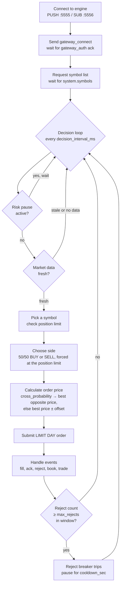
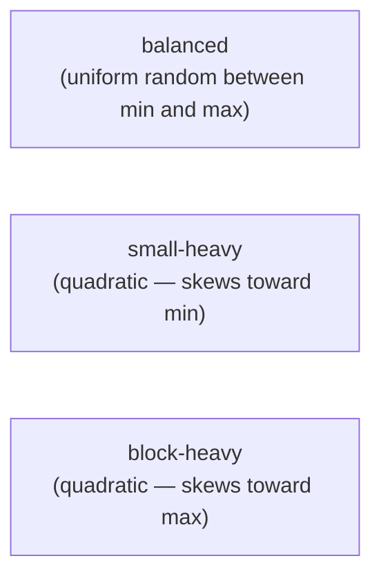
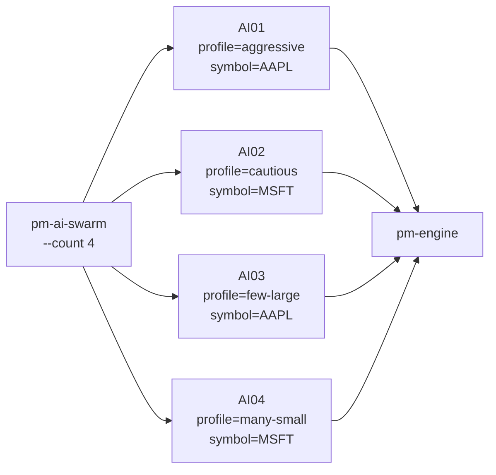

# AI Traders

!!! note "Learning objectives"
    After reading this page you will understand:

    - What `pm-ai-trader` and `pm-ai-swarm` are and when to use them
    - The four personality profiles and how they differ
    - How to launch a single bot or a swarm of bots
    - How bots manage risk (position limits, reject breaker)
    - How to configure your engine to allow AI gateway IDs
    - How to set up a realistic classroom simulation

    **Prerequisites**: [Running the Engine](040-running-the-exchange.md) — the engine must be running
    before AI traders can connect.
    [Configuration](010-configuration.md) — AI traders connect as regular gateways; their IDs
    must be listed in the deployed engine configuration (or the engine must be in unrestricted mode).

---

## What are the AI trader processes?

EduMatcher ships two processes that generate autonomous order flow:

| Process | Command | Purpose |
|---|---|---|
| `pm-ai-trader` | `poetry run pm-ai-trader` | A **single autonomous bot** — connects as a gateway, watches the book, submits limit orders |
| `pm-ai-swarm` | `poetry run pm-ai-swarm` | A **swarm launcher** — spawns `N` bots in one command, assigns each a profile and exactly one symbol (round-robin) |

They are designed to simulate realistic human order behaviour so that a
classroom exchange has live activity even when students are not yet trading.
Each bot behaves differently — some trade frequently in small sizes, others
occasionally in large blocks — giving the order book variety and depth.

---

## How a bot works

Each bot is a fully independent participant. It connects to the engine via
ZeroMQ, authenticates as a gateway, requests the symbol list, then enters a
decision loop:



All orders are `LIMIT DAY` orders at prices derived from the current book.
AI traders **never** submit market orders, FOK, or IOC — only resting limit
orders that contribute to book depth.

---

## Personality profiles

A profile controls *how* the bot trades: how often, how large, and how
aggressively it crosses the spread. The four built-in profiles are:

| Profile | Decision interval | Order size | Cross probability | Offset | Size distribution | Character |
|---|---|---|---|---|---|---|
| `aggressive` | 250 ms | 20–120 | 35% | 0 ticks | balanced | Frequent trader; crosses the spread often; medium sizes |
| `cautious` | 900 ms | 10–60 | 5% | 2 ticks away | balanced | Slow, patient; rarely crosses; small passive orders |
| `many-small` | 180 ms | 1–25 | 18% | 1 tick away | small-heavy | High-frequency tiny orders; generates many executions |
| `few-large` | 1400 ms | 150–700 | 12% | 1 tick away | block-heavy | Infrequent institutional-style block orders |

**cross_probability** is the probability that the bot places a **marketable
limit order**, priced exactly at the opposite best price (a buy at the best
ask, a sell at the best bid), rather than a passive limit order.

**passive_offset_ticks** is how many ticks *behind* its own side's best price a
passive order is placed (a buy at best bid − offset, a sell at best ask +
offset). Offset = 0 means posting at the best bid/ask; offset = 2 means
posting 2 ticks behind the best price.

### Size distributions



---

## Risk management

Each bot has two built-in safety mechanisms:

### Position limit

The bot tracks its own `position` per symbol (net quantity of shares held).
Each order's quantity is capped so that `|position|` cannot exceed
`max_position` (default: 1000). Once the limit is reached the bot forces the
opposite side: a long bot at +1000 will only submit sell orders; a short bot at
−1000 will only submit buy orders. Positions are tracked from fills within the
current run only.

### Reject breaker

If the engine rejects `max_rejects` orders within `reject_window_sec`, the bot
pauses for `reject_cooldown_sec` before submitting again. This prevents a
misconfigured bot from flooding the engine with invalid orders.

```
2026-09-20 14:30:05,120 WARNING edumatcher.ai_trader.main - reject breaker tripped gateway_id=AI01 cooldown=5.0s
```

The tripped warning is visible at the default log level. The bot also logs
`[AI01] reject breaker tripped; pausing submissions for 5.0s` at `INFO`
(shown with `-v`).

---

## Launching a single bot

```bash
poetry run pm-ai-trader --id AI01 --profile aggressive
```

Common options:

| Option | Default | Description |
|---|---|---|
| `--id` | required | Gateway ID — must be listed under `gateways.alf` in the deployed engine configuration (or the engine must be unrestricted) |
| `--profile` | `cautious` | One of: `aggressive`, `cautious`, `many-small`, `few-large` |
| `--symbols` | all | Comma-separated list of symbols this bot watches; default is all symbols from engine |
| `--seed` | `1` | Random seed — same seed produces identical order sequence (useful for reproducibility) |
| `--duration` | `0` (forever) | Stop automatically after this many seconds |
| `--run-id` | *autogenerated* | Optional run identifier; a value is generated automatically if omitted |
| `--max-position` | `1000` | Absolute position limit per symbol |
| `--max-rejects` | `25` | Reject breaker threshold within the window |
| `--reject-window` | `10.0` | Rolling window in seconds for reject counting |
| `--reject-cooldown` | `5.0` | Pause duration in seconds after reject breaker trips |
| `--stale-data` | `4.0` | Seconds before a symbol's market data is considered too old to trade on (0 disables the check) |
| `--log-level` | `WARNING` | Explicit level: `CRITICAL`, `ERROR`, `WARNING`, `INFO`, `DEBUG` |
| `-v`, `--verbose` | off | Increase verbosity (`-v` enables bot debug prints, `-vv` sets DEBUG) |
| `-q`, `--quiet` | off | Reduce output to warnings/errors (the default level already, so currently a no-op) |
| `--log-target` | `server` | Where operational logs go: `server` (auto-detected `pm-log-srv`), `stdout`, or `file` |
| `--log-file PATH` | — | Log file path; required with `--log-target file` |
| `--log-failover-timeout SECONDS` | `30` | Grace window before falling back to a local log file when `pm-log-srv` is unreachable |

Example with all options:

```bash
poetry run pm-ai-trader \
  --id AI01 \
  --profile many-small \
  --symbols AAPL,MSFT \
  --seed 42 \
  --duration 120 \
  --max-position 500
```

When the run ends by reaching `--duration`, the bot logs a summary at `INFO`
(visible with `-v`, or `--log-target stdout -v` to see it in the terminal):

```
2026-09-20 14:32:01,004 INFO edumatcher.ai_trader.main - [AI01] stopped submitted=284 acked=281 rejected=3 fills=68
```

---

## Launching a swarm

`pm-ai-swarm` starts `N` bots simultaneously, distributing profiles and symbols
round-robin:

```bash
poetry run pm-ai-swarm --count 10 --duration 60
```

The swarm assigns gateway IDs `AI01` through `AI10` automatically and, when
`--profiles` is not given, cycles through all four profiles in **alphabetical
order**: `aggressive`, `cautious`, `few-large`, `many-small`.

### Swarm options

| Option | Default | Description |
|---|---|---|
| `--count` | `10` | Number of bots to launch |
| `--prefix` | `AI` | Gateway ID prefix (e.g. `BOT` → `BOT01`, `BOT02`, …) |
| `--start-index` | `1` | Starting index for gateway IDs |
| `--profiles` | all | Comma-separated profile cycle, e.g. `aggressive,cautious` |
| `--symbols` | all from the engine config | Comma-separated symbols to trade; when omitted, the symbols in `<DATA_DIR>/ref_data/engine_config.yaml` are used (the path is fixed — there is no `--config` option) |
| `--seed-base` | `1000` | Seeds are `seed_base + i` for bot `i` |
| `--duration` | `60.0` | Seconds each bot runs; 0 = run until Ctrl-C |
| `--max-position` | `1000` | Position limit per bot per symbol |
| `--python` | current Python | Path to Python executable |
| `--log-level` | `WARNING` | Logging level for swarm launcher; also forwarded to child bots |
| `-v`, `--verbose` | off | Increase verbosity (`-v` → `INFO`, `-vv` → `DEBUG`); forwarded to child bots |
| `-q`, `--quiet` | off | Reduce output to warnings/errors (the default level already); forwarded to child bots |
| `--log-target` | `server` | Where operational logs go: `server` (auto-detected `pm-log-srv`), `stdout`, or `file` |
| `--log-file PATH` | — | Log file path; required with `--log-target file` |
| `--log-failover-timeout SECONDS` | `30` | Grace window before falling back to a local log file when `pm-log-srv` is unreachable |



(Profile order shown is the default alphabetical cycle. Passing an explicit
`--profiles` list uses that order verbatim instead.)

The swarm waits for all bots to finish (or until Ctrl-C), then exits. Each
bot's output is interleaved in the terminal.

!!! tip "Graceful shutdown"
    Pressing Ctrl-C makes the swarm send SIGTERM to all child bots, wait up to
    2 seconds, and then kill any that remain. Bots do **not** cancel their
    resting orders and do not log the `stopped` summary when interrupted;
    resting DAY orders stay on the book until they fill or expire at the
    `CLOSED` transition. Use `--duration` for a clean exit that logs the summary.

---

## Configuring gateway IDs

### Unrestricted mode (no config file)

Unrestricted mode applies only when the engine finds no configuration at all
(neither a deployed compiled artifact nor `<DATA_DIR>/ref_data/engine_config.yaml`).
In that case any gateway ID can connect and trade any symbol. If a
configuration is deployed, every bot ID must be listed under `gateways.alf`
and the engine reads only the deployed artifact (`pm-config-deploy`). This is the
easiest way to test:

```bash
poetry run pm-engine               # unrestricted
poetry run pm-ai-swarm --count 5
```

### With a config file

Add the bot gateway IDs to the `gateways:` section. AI traders are ordinary
`TRADER` participants:

```yaml
symbols:
  AAPL:
    tick_decimals: 2
  MSFT:
    tick_decimals: 2

gateways:
  alf:
    - id: AI01
      description: AI bot 1
    - id: AI02
      description: AI bot 2
    - id: AI03
      description: AI bot 3
    # ... as many as --count
    - id: ST01
      description: Student 1
    - id: ST02
      description: Student 2
```

!!! tip "Using a range pattern"
    If you use the swarm default prefix `AI` and `--count 10`, the IDs will be
    `AI01` through `AI10`. Add all ten to your config. With `--start-index 1`
    (default) and `--prefix AI` the IDs are zero-padded to two digits.

---

## Classroom demo setup

A typical classroom simulation uses a swarm of bots to provide realistic
background order flow while students trade alongside them. The bots generate
price discovery, spread variation, and occasional large moves that students
must react to.

### Recommended setup

```yaml
# engine_config.yaml
sessions_enabled: true   # run opening and closing auctions

symbols:
  AAPL:
    tick_decimals: 2
    last_buy_price: 149.90
    last_sell_price: 150.10
  MSFT:
    tick_decimals: 2
    last_buy_price: 415.00
    last_sell_price: 415.50
  TSLA:
    tick_decimals: 2
    last_buy_price: 250.00
    last_sell_price: 250.50

gateways:
  alf:
    # Instructor / operator
    - id: OPS01
      description: Operator console
      role: ADMIN

    # Market maker (optional, adds liquidity — see pm-mm-bot below).
    # Gateway ID follows pm-mm-bot's MM_<SYMBOL>_<nn> convention; see
    # [Market-Maker Bot](100-mm-bot.md#gateway-identity-convention).
    - id: MM_AAPL_01
      description: Market maker (AAPL)
      role: MARKET_MAKER
      quote_refresh_policy: INACTIVATE_ON_ANY_FILL
      enforce_mm_obligation: true
      mm_max_spread_ticks: 20
      mm_min_qty: 100

    # AI bots (30 bots, IDs AI01–AI30)
    - id: AI01
      description: AI bot 1
    - id: AI02
      description: AI bot 2
    # ... repeat through AI30

    # Students (adjust count for your class size)
    - id: ST01
      description: Student 1
    - id: ST02
      description: Student 2
    # ...
```

### Launch sequence

```bash
# Terminal 1: matching engine
poetry run pm-engine

# Terminal 2: session scheduler (default schedule: PRE_OPEN 09:00, OPENING_AUCTION 09:25,
# CONTINUOUS 09:30, CLOSING_AUCTION 16:00, CLOSED 16:05). With sessions enabled the
# engine starts CLOSED and rejects orders ("Market is closed") until the scheduler
# opens it — start the swarm only after that, or use `pm-scheduler --now`.
poetry run pm-scheduler

# Terminal 3: clearing and stats
poetry run pm-clearing &
poetry run pm-stats &

# Terminal 4: market maker for AAPL (optional — omit if you skipped the
# MM_AAPL_01 gateway entry above)
poetry run pm-mm-bot --symbol AAPL

# Terminal 5: AI swarm (30 bots, all 4 profiles, run for 30 minutes)
poetry run pm-ai-swarm \
  --count 30 \
  --duration 1800 \
  --profiles aggressive,cautious,many-small,few-large

# Students connect individually
poetry run pm-alf-console --id ST01
```

For a quick demo without scheduling, use the launch script:

```bash
./tools/launch_all.sh
```

---

## Understanding bot output

Bots log through the standard EduMatcher logger
(`<timestamp> <LEVEL> <logger> - <message>`), and every bot message is tagged
with the gateway ID in brackets. Records go to `pm-log-srv` by default; add
`--log-target stdout` to see them in the terminal. The default level is
`WARNING`, so the bot's milestone lines (all `INFO`) appear only with `-v`
(or `--log-level INFO`); at the default level you see just the reject-breaker
warning. With `-v` you get the milestones and a startup summary of the bot's
own configuration, but not individual order submissions:

```
2026-09-20 14:30:00,001 INFO edumatcher.ai_trader.main - [AI01] starting: profile=aggressive symbols=all duration=120s run_id=botrun-...
2026-09-20 14:30:00,050 INFO edumatcher.ai_trader.main - [AI01] authenticated
2026-09-20 14:30:01,200 INFO edumatcher.ai_trader.main - [AI01] reject breaker tripped; pausing submissions for 5.0s
2026-09-20 14:30:06,201 INFO edumatcher.ai_trader.main - [AI01] reject breaker cooldown ended; resuming submissions
2026-09-20 14:31:59,900 INFO edumatcher.ai_trader.main - [AI01] stopped submitted=312 acked=308 rejected=4 (Market is closed=3, Gateway not configured: AI01=1) fills=72
```

(`symbols=all` is what a single bot without `--symbols` logs; a swarm child is
assigned one symbol and logs e.g. `symbols=['AAPL']`.)

Rejects normally come from submitting while the market is closed (sessions
enabled and the scheduler has not opened it yet), from a gateway ID that is not
in the engine configuration, or from price-collar breaches. A halted symbol
does not reject the bot's LIMIT orders — they rest without matching. If the
count is very high, check that the bot's gateway IDs are configured in the
engine and that the market is open. The `stopped` line's parenthetical breaks the
rejects down by reason, taken directly from the engine's `order.ack`
rejection payloads.

With `--verbose` (`-v`), the bot additionally logs every order submission,
fill, individual rejection, and reasons for skipping a trading decision
(stale market data, position limit reached). The `SUBMIT` price is in
**ticks** (with `tick_decimals: 2`, `14997` means 149.97); fill prices are
shown in display money:

```
2026-09-20 14:30:01,010 INFO edumatcher.ai_trader.main - [AI01] order SUBMIT BUY 45@14997 AAPL
2026-09-20 14:30:01,020 INFO edumatcher.ai_trader.main - [AI01] order REJECTED: Market is closed
2026-09-20 14:30:05,030 INFO edumatcher.ai_trader.main - [AI01] fill: BUY 45@149.97 AAPL pos=45
2026-09-20 14:30:12,040 INFO edumatcher.ai_trader.main - [AI01] position limit reached on AAPL (pos=1000); forcing SELL
2026-09-20 14:30:18,050 INFO edumatcher.ai_trader.main - [AI01] skip AAPL: stale market data (4.2s > 4.0s)
```

---

## See also

- [Market-Maker Bot (pm-mm-bot)](100-mm-bot.md) — autonomous market-maker process; complements AI traders by providing liquidity
- [Running the Engine](040-running-the-exchange.md) — startup order and launch scripts
- [Configuration](010-configuration.md) — how to register gateway IDs and symbols
- [Order Types](060-order-types.md) — AI bots submit LIMIT DAY orders only
- [Risk Controls](120-risk-controls.md) — price collars and halts that affect bot activity
- [Processes](170-processes.md) — where `pm-ai-trader` and `pm-ai-swarm` fit in the architecture
- [Getting Started](000-getting-started.md) — quick walkthrough including a swarm demo
