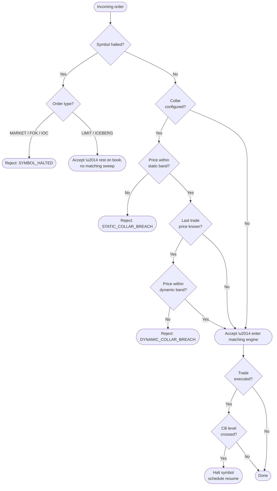
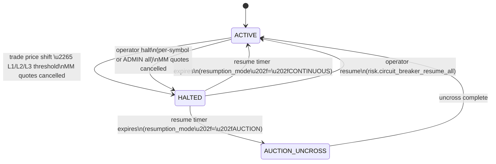
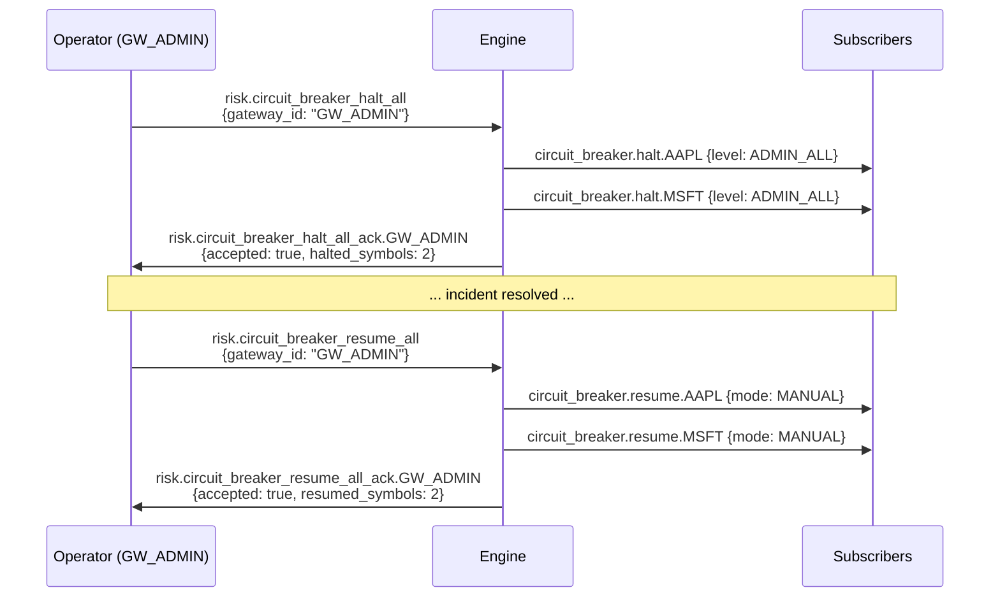

# Risk Controls

!!! note "Learning objectives"
    After reading this page you will understand:

    - How an instrument halt state prevents trading while a symbol is suspended
    - How price collars reject orders that stray too far from a reference or last-traded price
    - How circuit breakers detect violent price moves and automatically halt and resume a symbol
    - How the kill switch lets any gateway instantly cancel all its own resting orders
    - How all four mechanisms interact with the order types described in [Order Types](04-order-types.md)
    - How to configure each feature in `engine_config.yaml`

    **Prerequisite**: [Concepts — Order Book](../concepts/01-concepts-order-book.md) explains the
    order lifecycle that underpins these controls.


## Overview

Real exchanges operate several layers of protection against runaway prices and
disorderly markets.  EduMatcher implements four complementary mechanisms:

| Mechanism | Who sets it | What it checks | How it resolves |
|---|---|---|---|
| **Instrument halt** | Operator (external message) | Symbol is marked `HALTED` | Operator sends resume |
| **Price collar** | Config per symbol | Incoming order price vs. reference band | Order is rejected |
| **Circuit breaker** | Config per symbol | Last trade price vs. rolling reference | Automatic halt + scheduled resume |
| **Kill switch** | Any authenticated gateway | — | Cancels all resting orders for that gateway |

All four operate at the engine level — *before* any order enters the book.

The following diagram shows the order admission path through all three controls:




##  Instrument halt state

### What it does

Each symbol in EduMatcher can be in one of two states:

| State | Orders accepted? | Quotes accepted? |
|---|---|---|
| `ACTIVE` | Yes | Yes |
| `HALTED` | LIMIT and ICEBERG rest (do not match); MARKET, FOK, IOC are rejected | Rejected immediately |

A halt is an operator-initiated pause.  It is broader than a circuit breaker
pause: it can be applied manually at any time, for any reason (e.g., a pending
news announcement, a technology incident at a venue, a regulatory instruction).

### State model

```python
class InstrumentState(str, Enum):
    ACTIVE = "ACTIVE"
    HALTED = "HALTED"
```

The engine maintains a `_halted_symbols` dictionary (keyed on symbol name) that
records which symbols are currently halted.  Any key not present in the
dictionary is implicitly `ACTIVE`.

### Halt behaviour by order type

When the engine receives a new order for a halted symbol:

- **MARKET / FOK / IOC** — rejected immediately with reason
  `SYMBOL_HALTED`.  These order types require immediate execution and cannot
  be held on the book.
- **LIMIT / ICEBERG** — accepted and placed on the book but the engine
  suppresses the continuous-matching sweep.  The order will rest until the
  symbol is resumed, at which point it participates in the reopening.

When the engine receives a new quote for a halted symbol, the entire quote is
rejected (both sides).

Quote eligibility by participant role (for example, `MARKET_MAKER` vs
`TRADER`) is described in
[Configuration - Role Privileges](01-configuration.md#role-privileges).

### Interaction with auctions

If a symbol is halted during an auction phase the engine will still accept
LIMIT orders so they can participate in the uncross when the halt is lifted and
trading resumes.  Market-maker quotes are rejected because a quote always
implies willingness to trade immediately and a halted market does not offer that
guarantee.


##  Price collars

### Motivation

Price collars are a pre-trade filter.  They prevent an erroneous ("fat-finger")
order from moving the market far from its fair value.  Without collars a
mistyped limit price could instantly sweep the entire book.

### Band definitions

EduMatcher supports two independent collar bands, both configured per symbol:

| Band | Measured from | Purpose |
|---|---|---|
| **Static band** | Reference price (typically last closing price, set in config) | Wide safety net; catches gross errors |
| **Dynamic band** | Last traded price in this session | Tighter rolling band; tracks intra-day moves |

Both bands are expressed as a *percentage of the relevant reference price*.
The boundary tick values are computed with **truncation toward zero**
(`int()`) so that the protected range is always at least as tight as the
nominal percentage:

| Band | Reference price used |
|---|---|
| Static | `last_buy_price` from config (converted to ticks at startup) |
| Dynamic | Last executed trade price in the current session |

The dynamic band is skipped entirely when no trade has occurred yet in the session.

```
static_upper  = int(reference_price × (1 + static_band_pct))
static_lower  = int(reference_price × (1 - static_band_pct))

dynamic_upper = int(last_trade_price × (1 + dynamic_band_pct))
dynamic_lower = int(last_trade_price × (1 - dynamic_band_pct))
```

An incoming order price is rejected if it falls outside *either* band.  The
static band is checked first.

!!! warning "Tick-based prices"
    All prices in EduMatcher are stored as integer tick counts.  The collar
    boundaries are in ticks, not display prices.  See
    [Configuration](01-configuration.md) for the relationship between ticks and
    display prices.

### Validation logic

```
validate_collar(price, collar, last_trade_price) → CollarResult
```

1. If `price < static_lower` or `price > static_upper` → `STATIC_COLLAR_BREACH`
2. If `last_trade_price` is known and `price < dynamic_lower` or
   `price > dynamic_upper` → `DYNAMIC_COLLAR_BREACH`
3. Otherwise → accepted

The dynamic check is skipped when `last_trade_price` is `None` (no trade has
occurred yet in this session).

### Which orders are checked

Collars apply to **LIMIT and ICEBERG** orders (any order that carries an
explicit price).  MARKET orders do not carry a price and are therefore not
subject to collar validation.

### Configuration

Add a `collar` sub-section to any symbol in `engine_config.yaml`:

```yaml
symbols:
  MSFT:
    tick_decimals: 2
    last_buy_price: 420.00
    collar:
      static_band_pct: 0.20   # ±20% from reference price (default)
      dynamic_band_pct: 0.02  # ±2% from last traded price (default)
```

Both fields are optional.  When the `collar` key is absent entirely, no collar
is applied to that symbol.  When the `collar` key is present but empty (`{}`),
the defaults above are used.

### Global level profiles (L1/L2/L3 style)

Collar values can be sourced from reusable global risk levels:

```yaml
risk_controls:
  default_level: L2
  levels:
    L1:
      collar:
        static_band_pct: 0.30
        dynamic_band_pct: 0.05
    L2:
      collar:
        static_band_pct: 0.20
        dynamic_band_pct: 0.02

symbols:
  AAPL:
    # inherits L2
    tick_decimals: 2
  TSLA:
    level: L1
    # override dynamic band only
    collar:
      dynamic_band_pct: 0.06
```

Resolution precedence is:

1. `symbols.<symbol>.collar` (symbol override)
2. `symbols.<symbol>.level` profile from `risk_controls.levels`
3. `risk_controls.default_level` profile
4. built-in defaults (`static_band_pct=0.20`, `dynamic_band_pct=0.02`)

| Parameter | Type | Default | Meaning |
|---|---|---|---|
| `static_band_pct` | float | `0.20` | Maximum distance from reference price, as a fraction (0 < x < 1) |
| `dynamic_band_pct` | float | `0.02` | Maximum distance from last trade price, as a fraction (0 < x < 1) |

The reference price for the static band is taken from `last_buy_price`
(converted to ticks) at engine startup.


##  Circuit breakers

### Motivation

A circuit breaker is an *automatic* mechanism that pauses trading when prices
move too fast.  Unlike a collar (which rejects individual orders), a circuit
breaker monitors executed trades and halts the *entire symbol* when a trade
deviates too sharply from recent history.  It then automatically resumes after
a configurable pause, giving participants time to update their orders.

Real-world examples: the US market-wide circuit breakers (Level 1/2/3), the
London Stock Exchange's Automated Auction Call mechanism, and per-stock
volatility interruptions on Euronext.

In many production exchanges, the primary circuit-breaker trigger is linked to
an index (market-wide reference) with per-symbol volatility controls layered on
top. EduMatcher does not yet implement index-level circuit-breaker triggers, so
its current circuit-breaker logic is symbol-linked: each symbol evaluates its
own rolling trade reference and can halt independently.

### How it works — step by step

1. **Every trade is recorded.**  When the engine publishes a fill, it calls
   `record_trade(price, now)` on the circuit breaker for that symbol.

2. **Reference price is computed from history.**  The engine looks back over a
   rolling time window (`reference_window_ns`) and averages the prices of trades
   that occurred within that window — *excluding the new trade being evaluated*.
   This ensures the check is "does this trade deviate from where the market has
   been?" rather than including the potentially erroneous trade in its own
   reference.

3. **Deviation is tested against levels.**  The absolute shift from reference is
  compared against configured levels (for example `L1=7%`, `L2=13%`,
  `L3=20%`). The highest crossed level fires.

4. **Symbol is halted.**  The engine sets `_halted_symbols[symbol] = True`,
   cancels all outstanding market-maker quotes for that symbol, and broadcasts a
   `circuit_breaker.halt.{symbol}` message over the pub socket.

5. **Resume is scheduled by level.**  The fired level defines the halt length.
  Example: L1 might halt for 5 minutes, L2 for 15 minutes, and L3 for the rest
  of the trading day.

6. **Engine polls for resumption.**  Each iteration of the main event loop calls
   `_flush_circuit_breakers()`, which checks `should_resume(now)` for every
   active circuit breaker.  When the pause expires:
     - The symbol is un-halted.
     - If `resumption_mode == "AUCTION"`, an uncross is run to reprice resting
       orders at a new equilibrium.
     - A `circuit_breaker.resume.{symbol}` message is broadcast.



### Rolling reference window

The reference window is a sliding time window.  Any trade older than
`now - reference_window_ns` is discarded before computing the average.  This
means the reference tracks recent price behaviour — a slow steady trend will
not accumulate stale data that masks a sudden move.

```
           reference_window_ns
        ←──────────────────────→
────────●──●───●───●──●────●──── now
        (old trades)  (new trade being evaluated)

reference = average of all trades in window (excluding new trade)
```

If the window is empty (no previous trades), the circuit breaker has no
reference to compare against, so the new trade is always accepted and simply
added to the history.

### Resumption modes

| Mode | What happens at resume |
|---|---|
| `AUCTION` | The engine runs a mini uncross for the symbol, computing an equilibrium price from resting limit orders.  This is the default and mirrors how real exchanges reopen after a volatility interruption. |
| `CONTINUOUS` | The symbol resumes continuous matching immediately.  Resting orders participate in normal sweeping as the next order arrives. |

### Configuration

Define a global threshold ladder under `circuit_breaker_defaults`, then override
per symbol only where needed:

```yaml
circuit_breaker_defaults:
  reference_window_ns: 300000000000
  levels:
    L1:
      price_shift_pct: 0.07
      halt_duration_ns: 300000000000   # 5 minutes
      resumption_mode: AUCTION
    L2:
      price_shift_pct: 0.13
      halt_duration_ns: 900000000000   # 15 minutes
      resumption_mode: AUCTION
    L3:
      price_shift_pct: 0.20
      halt_duration_ns:                 # null => rest of trading day
      resumption_mode: AUCTION

symbols:
  TSLA:
    tick_decimals: 2
    circuit_breaker:
      levels:
        L1:
          halt_duration_ns: 600000000000  # symbol-specific override
```

For each trade, the engine computes:

$$
	ext{price\_shift} = \frac{|\text{trade\_price} - \text{reference\_price}|}{\text{reference\_price}}
$$

The highest level where `price_shift >= price_shift_pct` fires.

| Parameter | Type | Default | Meaning |
|---|---|---|---|
| `reference_window_ns` | int | `300_000_000_000` | Lookback window for rolling reference price |
| `levels.<L>.price_shift_pct` | float | required | Trigger threshold fraction in `(0, 1)` |
| `levels.<L>.halt_duration_ns` | int or null | required | Halt time in ns, or `null` for rest-of-day halt |
| `levels.<L>.resumption_mode` | string | `"AUCTION"` | `AUCTION` or `CONTINUOUS` when timed halt resumes |

When `circuit_breaker_defaults` and symbol-level `circuit_breaker` are both
present, per-symbol values override global defaults by level key.

### Why there is no selected "default breaker level"

Circuit-breaker levels are **trigger outcomes**, not configuration profiles to
pick one from. A symbol defines a ladder of levels; the observed price shift
determines which level is activated at runtime.


##  Price collars vs circuit breakers

Both controls are configured on symbols, but they protect the market at
different points in the flow and for different failure modes.

- A **price collar** is a pre-trade admission guardrail on priced orders.
- A **circuit breaker** is a post-trade volatility interrupt that can halt the
  full symbol after an extreme move is observed.

### Side-by-side comparison

| Dimension | Price collar (symbol) | Circuit breaker (symbol) |
|---|---|---|
| Trigger moment | Before matching (order admission) | After a trade is executed |
| Data checked | Incoming order price vs static/dynamic bands | Trade price shift vs rolling reference |
| Scope of effect | Single incoming order | Entire symbol |
| Typical action | Reject offending order (`STATIC_COLLAR_BREACH` or `DYNAMIC_COLLAR_BREACH`) | Halt symbol, cancel MM quotes, schedule/manual resume |
| Market state after trigger | Symbol keeps trading for other valid orders | Symbol is halted until resume condition is met |
| Configuration anchor | `symbols.<SYM>.collar` (or inherited level defaults) | `circuit_breaker_defaults` + `symbols.<SYM>.circuit_breaker` overrides |
| Primary objective | Prevent fat-finger / outlier order entry | Pause disorderly market after extreme realized move |
| Dependence on trade history | Dynamic band needs last trade, static band does not | Uses rolling trade history/reference window |

### Practical interpretation

Use collars to stop clearly invalid prices from entering the book. Use circuit
breakers to pause trading when validly admitted orders still produce an
abnormally large executed move. In practice, collars reduce bad inputs and
circuit breakers contain fast market dislocations.

For field-level schema and merge precedence details, see
[Configuration - Circuit Breakers](01-configuration.md#circuit-breakers) and
[Configuration - Risk Controls and Collars](01-configuration.md#risk-controls-and-collars).


##  Interaction between mechanisms

All three controls can be active simultaneously on the same symbol.  The engine
applies them in this order for every incoming order:

```
1. Is the symbol halted?           → reject MARKET/FOK/IOC; suppress matching for LIMIT
2. Is a collar configured?         → validate price against static and dynamic bands
3. (After match) Did a trade fire
   a circuit breaker?              → halt symbol, schedule resume
```

A circuit breaker halt feeds back into step 1: any subsequent orders on a
circuit-breaker-halted symbol are subject to the same halt rules as an
operator-initiated halt.

### Combined example

```
Reference price: 10000 ticks (100.00 in display)
Static collar:   ±20%  → [8000, 12000] ticks
Dynamic collar:  ±2%   → depends on last trade
CB levels:       L1=7%, L2=13%, L3=20%

A limit sell order arrives at price 7500 ticks:
  → Static collar: 7500 < 8000 → STATIC_COLLAR_BREACH → rejected

A limit buy at 10100 ticks trades. Last trade = 10100.
  → CB rolling reference (from history) = 10050
  → deviation = |10100 - 10050| / 10050 ≈ 0.5% < 5% → no halt

A limit buy at 10800 ticks trades. Reference = 10100.
  → deviation = |10800 - 10100| / 10100 ≈ 6.9% < 7% → no breaker

A limit buy at 11000 ticks trades. Reference = 10100.
  → deviation = |11000 - 10100| / 10100 ≈ 8.9% ≥ L1 (7%)
  → L1 circuit breaker fires, symbol halted for L1 duration (e.g. 5 min)

A limit buy at 12200 ticks trades. Reference = 10100.
  → deviation = |12200 - 10100| / 10100 ≈ 20.8% ≥ L3 (20%)
  → L3 circuit breaker fires, symbol halted for rest of trading day
  → next order at this symbol: if MARKET → rejected; if LIMIT → accepted, no match
```

What the gateway operator sees when a collar rejects an order:

```text
TRADER01> NEW|SYM=AAPL|SIDE=SELL|TYPE=LIMIT|QTY=100|PRICE=75.00
[14:02:00.301] ORDER REJECTED  reason="STATIC_COLLAR_BREACH"
```


##  ZeroMQ messages

Risk events are broadcast on the engine's PUB socket (port 5556).

### Circuit breaker halt

```
topic:   b"circuit_breaker.halt.MSFT"
payload: {
    "symbol":           "MSFT",
    "trigger_price":    10800,
    "reference_price":  10100,
    "resume_at_ns":     <timestamp>,
    "resumption_mode":  "AUCTION",
    "level":            "L1"
}
```

### Circuit breaker resume

```
topic:   b"circuit_breaker.resume.MSFT"
payload: {
    "symbol": "MSFT",
    "mode":   "AUCTION"
}
```


##  ADMIN-role operator controls

An operator gateway configured with `role: ADMIN` can trigger and lift an
**exchange-wide** halt without waiting for a per-symbol circuit breaker to fire
or expire.  This is the manual emergency control used when a venue-wide
technology incident, regulatory instruction, or extreme market dislocation
requires every symbol to be frozen simultaneously.

### Prerequisites

Configure a dedicated gateway with `role: ADMIN` in `engine_config.yaml`:

```yaml
gateways:
  alf:
    - id: GW_ADMIN
      description: "Operations desk"
      role: ADMIN
      disconnect_behaviour: CANCEL_QUOTES_ONLY
```

The gateway connects to the engine via the standard PUSH socket (port 5555) and
subscribes to the PUB socket (port 5556) to receive ack messages.

See [Role Privileges](01-configuration.md#role-privileges)
for the full permissions matrix.


### Triggering an exchange-wide halt

Send the following frame to the engine's PUSH socket (port **5555**):

```
Frame 0 (topic):   b"risk.circuit_breaker_halt_all"
Frame 1 (payload): {"gateway_id": "GW_ADMIN"}
```

Python snippet using `pyzmq`:

```python
import zmq, json

ctx = zmq.Context()
push = ctx.socket(zmq.PUSH)
push.connect("tcp://localhost:5555")

push.send_multipart([
    b"risk.circuit_breaker_halt_all",
    json.dumps({"gateway_id": "GW_ADMIN"}).encode(),
])
```

What the engine does:

1. Verifies `GW_ADMIN` is connected and carries role `ADMIN`.
2. Collects every known symbol (order books, circuit-breaker state, engine
   configuration).
3. Marks each symbol `HALTED` with `resumption_mode = "MANUAL"` (no auto-resume
   timer).
4. Cancels all outstanding market-maker quote legs for every symbol.
5. Publishes one `circuit_breaker.halt.<SYMBOL>` event per symbol on the PUB
   socket.
6. Sends the ack to the PUB socket.

Expected inbound events (subscribe to `circuit_breaker.*` and
`risk.circuit_breaker_halt_all_ack.*`):

```
topic:   b"circuit_breaker.halt.AAPL"
payload: {
    "symbol":          "AAPL",
    "trigger_price":   null,
    "reference_price": null,
    "resume_at_ns":    null,
    "resumption_mode": "MANUAL",
    "level":           "ADMIN_ALL"
}

topic:   b"circuit_breaker.halt.MSFT"
payload: { ...same structure... }

topic:   b"risk.circuit_breaker_halt_all_ack.GW_ADMIN"
payload: {
    "accepted":        true,
    "reason":          "",
    "halted_symbols":  4,
    "cancelled_quotes": 12
}
```

If the gateway is not connected or does not carry role `ADMIN`, the engine
returns `accepted: false` and no symbols are halted:

```
topic:   b"risk.circuit_breaker_halt_all_ack.GW_ADMIN"
payload: {
    "accepted": false,
    "reason":   "Global circuit-breaker halt is only allowed for ADMIN participants"
}
```


### Resuming all trading

Once the situation is resolved, send `risk.circuit_breaker_resume_all` on the
same PUSH socket:

```
Frame 0 (topic):   b"risk.circuit_breaker_resume_all"
Frame 1 (payload): {"gateway_id": "GW_ADMIN"}
```

Python snippet:

```python
push.send_multipart([
    b"risk.circuit_breaker_resume_all",
    json.dumps({"gateway_id": "GW_ADMIN"}).encode(),
])
```

What the engine does:

1. Verifies `GW_ADMIN` is connected and carries role `ADMIN`.
2. Collects every symbol currently marked as halted.
3. Clears the halt flag and deactivates any circuit-breaker state for each
   symbol.
4. Publishes one `circuit_breaker.resume.<SYMBOL>` event per symbol.
5. Sends the ack.

Expected inbound events:

```
topic:   b"circuit_breaker.resume.AAPL"
payload: { "symbol": "AAPL", "mode": "MANUAL" }

topic:   b"circuit_breaker.resume.MSFT"
payload: { "symbol": "MSFT", "mode": "MANUAL" }

topic:   b"risk.circuit_breaker_resume_all_ack.GW_ADMIN"
payload: {
    "accepted":         true,
    "reason":           "",
    "resumed_symbols":  4
}
```

After the ack is received, normal order flow and quote submission resume for all
previously halted symbols.  Market makers are expected to re-enter fresh quotes;
the engine will begin enforcing MM obligation checks again immediately.


### Sequence diagram




### Key differences from automatic circuit breakers

| Property | Automatic CB (per-symbol) | ADMIN global halt |
|---|---|---|
| Trigger | Trade price deviation | Operator command |
| Scope | Single symbol | All symbols |
| Resume | Scheduled timer (or AUCTION uncross) | Explicit `risk.circuit_breaker_resume_all` |
| Quotes cancelled on halt | Yes | Yes |
| `resumption_mode` | `AUCTION` or `CONTINUOUS` | Always `MANUAL` |
| Who can send | Any connected gateway | `ADMIN` role only |


##  Kill switch

The kill switch is a gateway-level emergency control that immediately cancels
all resting orders and quotes owned by a specific gateway, without halting the
symbol.  It is designed for situations where a malfunctioning trading bot or
gateway needs to be flushed without stopping the whole market.

### Permissions

Unlike the exchange-wide halt, the kill switch does **not** require `ADMIN`
role.  Any authenticated, connected gateway can trigger a kill switch against
its own orders.

### Sending the command

```
Frame 0 (topic):   b"risk.kill_switch"
Frame 1 (payload): {"gateway_id": "GW01"}
```

An optional `"symbol"` field scopes the cancellation to a single instrument:

```json
{"gateway_id": "GW01", "symbol": "AAPL"}
```

When `"symbol"` is empty or absent, all symbols are included.

### What the engine does

1. Collects all resting orders and quote legs for the specified gateway (and
   optionally symbol).
2. Cancels each order and quote leg, excluding child orders that were derived
   from a quote (those are cancelled as part of the quote leg cancellation).
3. Sends a `risk.kill_switch_ack.{GW_ID}` reply with the count of cancelled
   items.

### Reply

```
topic:   b"risk.kill_switch_ack.GW01"
payload: {
    "accepted":          true,
    "cancelled_orders":  <count>,
    "cancelled_quotes":  <count>
}
```

### Differences from a halt

| Property | Kill switch | Instrument halt |
|---|---|---|
| Scope | One gateway's orders | All orders on a symbol |
| Symbol trading | Continues uninterrupted | Paused |
| New orders accepted | Yes | LIMIT/ICEBERG only |
| Requires ADMIN role | No | No (per-symbol); Yes (exchange-wide) |
| Auto-resume | Not applicable | Yes (CB) / Manual (operator) |

!!! note "No cross-gateway kill switch"
    A kill switch always targets a single gateway.  There is no command to
    cancel all orders across *all* gateways at once — use an exchange-wide
    `HALT` (requires ADMIN role) for that scenario.


##  Market-maker interaction

When any halt fires — whether triggered by a circuit breaker, a per-symbol operator halt, or the exchange-wide ADMIN halt — **all outstanding market-maker quote legs for the affected symbols are cancelled immediately**. This protects market makers from having stale quotes executed against them during a disorderly market. The cancellation reason included in the `order.cancelled` message distinguishes the halt source:

| Halt source | Cancellation reason text |
|---|---|
| Circuit breaker | `"Circuit breaker halt"` |
| Per-symbol operator halt | `"Per-symbol halt"` |
| Exchange-wide ADMIN halt | `"Global circuit breaker halt"` |

When a symbol resumes, market makers are expected to submit fresh quotes at updated prices. The engine will begin enforcing MM obligation checks again immediately upon resumption.


## See also

- [Configuration](01-configuration.md) — full `engine_config.yaml` reference including collar and CB ladder config
- [Order Types](04-order-types.md) — how different order types behave under halt
- [Drop Copy](13-drop-copy.md) — how fill events are forwarded to risk systems
- [Auctions & Session Scheduling](06-auctions-scheduling.md) — the uncross that can occur at circuit breaker resumption
- [Gateway Reference](08-gateway.md) — `KILL` command for triggering the kill switch via the ALF terminal
