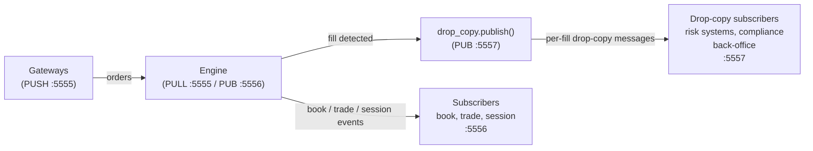

# Drop Copy

!!! note "Learning objectives"
    After reading this page you will understand:

    - What drop copy is and why it exists in real exchange ecosystems
    - How EduMatcher's drop copy publisher works
    - The message format published on the drop copy channel
    - What replay support exists today and what its limits are
    - How to configure and monitor the drop copy stream

    **Prerequisite**: [Processes](10-processes.md) gives an overview of the
    ZeroMQ topology that drop copy sits within.


## What is drop copy?

**Drop copy** is the name for a secondary stream of trade and fill event
notifications sent to risk management systems, compliance monitors, and
back-office infrastructure in parallel with the primary trade confirmation
path.

In real exchange connectivity the "drop" in drop copy refers to the idea that
a copy of every execution report is *dropped* to a side channel as it is
processed, without the recipient needing to be part of the order flow itself.
This separation is important:

- A risk system must receive fills even when the originating gateway has
  disconnected or failed.
- A compliance monitor should see every fill across all gateways in a single
  stream, not one per gateway connection.
- Back-office systems need guaranteed delivery with sequence numbers so they
  can detect gaps and request replays.


## Architecture

EduMatcher's drop copy publisher runs inside the matching engine in
`src/edumatcher/engine/drop_copy.py`. It binds a
dedicated ZeroMQ PUB socket on port **5557** and publishes events as the
engine processes fills.



The drop copy socket is **lazily initialised** in `Engine.run()`.  It is not
created during `__init__`, which means tests that instantiate `Engine` without
calling `run()` do not bind a ZMQ socket.

### Socket addresses

| Socket        | Address                | Purpose                                        |
|---------------|------------------------|------------------------------------------------|
| Engine PULL   | `tcp://127.0.0.1:5555` | Engine receives orders from gateways           |
| Engine PUB    | `tcp://127.0.0.1:5556` | Engine broadcasts book snapshots, trades, etc. |
| Drop copy PUB | `tcp://127.0.0.1:5557` | Engine broadcasts fill events to risk systems  |

The drop copy address is configurable via `DROP_COPY_PUB_ADDR` in
`src/edumatcher/config.py`.


## Message format

Every drop copy message is a two-frame ZeroMQ multipart message:

```
Frame 0 (topic):    b"drop_copy.event.<gateway_id>"
Frame 1 (payload):  orjson-encoded JSON object
```

### Payload fields

| Field                | Type   | Description                                                          |
|----------------------|--------|----------------------------------------------------------------------|
| `seq`                | int    | Monotonically increasing sequence number (starts at 1, never resets) |
| `timestamp`          | int    | Nanosecond timestamp from `now_ns()`                                 |
| `gateway_id`         | str    | ID of the gateway that submitted the order                           |
| `event_type`         | str    | Type of event (currently `"order.fill"`)                             |
| *…additional fields* | varies | Event-specific data merged into the top-level object                 |

### `order.fill` event

Published whenever an order receives a full or partial fill. This is the only
live drop-copy event type currently emitted by the engine.

```json
{
  "seq": 42,
  "timestamp": 1700000000000000000,
  "gateway_id": "TRADER01",
  "event_type": "order.fill",
  "order_id": "ord-001",
  "symbol": "MSFT",
  "fill_qty": 100,
  "fill_price": 420.0,
  "remaining_qty": 0,
  "liquidity_flag": "MAKER"
}
```

!!! note "Price units and fields"
    `fill_price` is published as a display-price float, not as raw integer
    ticks. The payload also uses `remaining_qty` and `liquidity_flag`; it does
    not include `side` or `leaves_qty`.


## Sequence numbers

The `seq` field is a global counter shared across all events published by a
single engine instance.  It increments by 1 for every event and starts at 1
when the engine starts.  It is never reset during the engine's lifetime.

Sequence numbers allow downstream consumers to:

1. **Detect gaps** — if the consumer receives `seq=5` after `seq=3`, it knows
   `seq=4` was missed and should request a replay.
2. **De-duplicate** — if a message is received twice (due to a reconnect replay),
   the consumer can discard the duplicate by checking whether the `seq` has
   already been processed.


## In-memory buffer

The drop copy publisher maintains a **circular in-memory buffer** of the last
10,000 events.  This buffer supports replay requests from consumers that
reconnect after a gap.

The buffer is implemented as a `collections.deque` with `maxlen=10_000`.  When
the buffer is full, the oldest event is discarded automatically.


## Replay

A downstream system that loses its connection and reconnects can request a
replay of events it missed.

!!! warning "In-process only — no external replay protocol"
    Replay is implemented as a publisher method
    (`DropCopyPublisher.replay(recipient_id, from_seq)`).  There is currently
    **no** ZMQ message handler that accepts replay requests from external
    consumers.  It is useful for tests and embedded consumers but not yet a
    full reconnect protocol.

### Replay request (programmatic)

Call `DropCopyPublisher.replay(recipient_id, from_seq)` from within the
engine.  This publishes all buffered events with `seq >= from_seq` on a
dedicated replay topic:

```
Frame 0 (topic):    b"drop_copy.replay.<recipient_id>"
Frame 1 (payload):  same format as live events
```

The call returns the number of messages replayed.

There is currently **no external replay-request message handler** wired into the
engine loop. Replay exists as an in-process publisher method, which is useful
for tests or embedded consumers but is not yet a full reconnect protocol.

### Replay topic design

Replay messages use a different topic prefix (`drop_copy.replay.*`) from live
messages (`drop_copy.event.*`).  A consumer subscribes to its own replay topic
so that replay messages from one reconnecting client do not pollute the live
stream received by other consumers.

### Replay limitations

The buffer holds only the last 10,000 events.  If a consumer has been
disconnected long enough that its `from_seq` predates the oldest buffered
message, it will receive only the available subset.  In production systems this
gap would typically be filled from a persistent audit log (see
[Persistence](11-persistence.md)).


## Topic subscription patterns

ZeroMQ PUB/SUB uses prefix-based topic filtering.  Common subscription patterns
for the drop copy stream:

| Pattern                           | Receives                                 |
|-----------------------------------|------------------------------------------|
| `b"drop_copy.event."`             | All live fill events from all gateways   |
| `b"drop_copy.event.TRADER01"`     | Live fills from gateway TRADER01 only    |
| `b"drop_copy.replay.MY_RISK_SYS"` | Replay messages addressed to MY_RISK_SYS |


## Startup and shutdown

The drop copy publisher is created in `Engine.run()` before the main event
loop starts.  If the ZMQ bind fails (e.g., port 5557 is already in use), the
engine logs a warning and continues without a drop copy publisher.  This is a
deliberate design choice: a port conflict should not prevent the matching engine
from operating.

On shutdown the publisher is explicitly closed via `DropCopyPublisher.close()`,
which releases the ZMQ socket cleanly.


## Configuration reference

```yaml
# engine_config.yaml — no explicit drop copy section needed
# The drop copy address is controlled in src/edumatcher/config.py:
#   DROP_COPY_PUB_ADDR = "tcp://127.0.0.1:5557"
```

To change the drop copy port, edit `DROP_COPY_PUB_ADDR` in `config.py`.


## Subscribing to the drop copy feed

A minimal Python subscriber that prints every fill event:

```python
import json
import zmq

ctx = zmq.Context()
sock = ctx.socket(zmq.SUB)
sock.connect("tcp://127.0.0.1:5557")

# Subscribe to all drop copy events (or filter by gateway ID)
sock.subscribe(b"drop_copy.event.")

print("Listening for drop-copy events on :5557 ...")
while True:
    frames = sock.recv_multipart()
    topic = frames[0].decode()
    payload = json.loads(frames[1])
    print(f"[{topic}] seq={payload['seq']}  {payload['symbol']}  "
          f"{payload['fill_qty']}@{payload['fill_price']}  "
          f"gateway={payload['gateway_id']}")
```

Example output:

```
Listening for drop-copy events on :5557 ...
[drop_copy.event.TRADER01] seq=1  AAPL  100@150.05  gateway=TRADER01
[drop_copy.event.TRADER02] seq=2  AAPL  100@150.05  gateway=TRADER02
[drop_copy.event.TRADER01] seq=3  MSFT  50@415.20   gateway=TRADER01
```

!!! tip
    For production use, subscribe to a specific gateway prefix
    (e.g., `b"drop_copy.event.TRADER01"`) to limit traffic to only
    fills relevant to your risk system.


## See also

- [Processes](10-processes.md) — full ZeroMQ topology
- [Risk Controls](12-risk-controls.md) — halt, collar, and circuit breaker events
- [Persistence](11-persistence.md) — durable audit trail as a complement to drop copy
- [Messages](09-messages.md) — all message types used in EduMatcher
