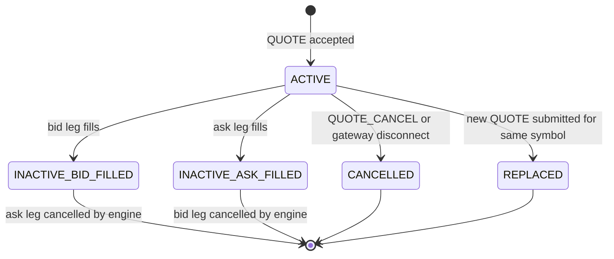
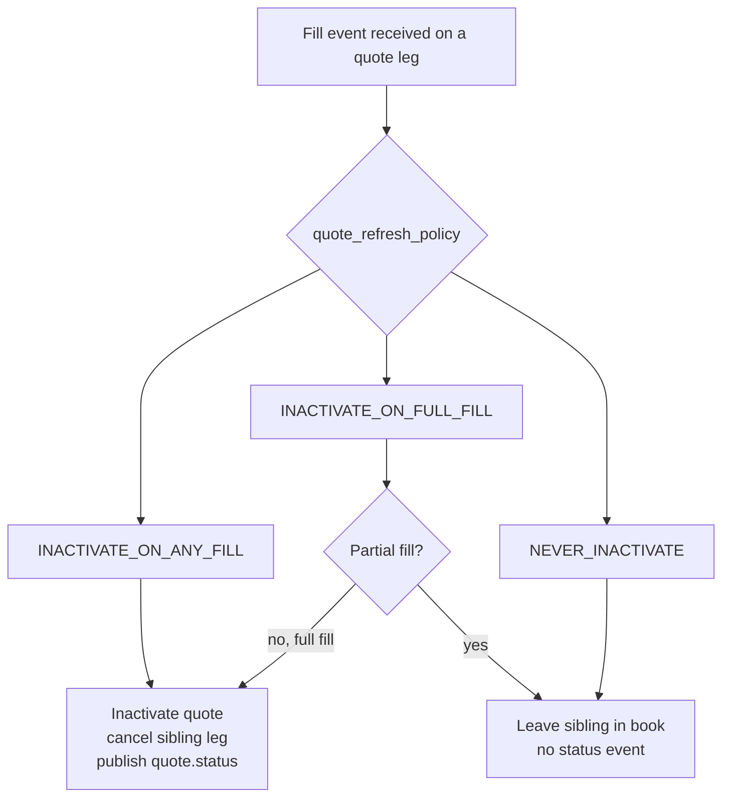
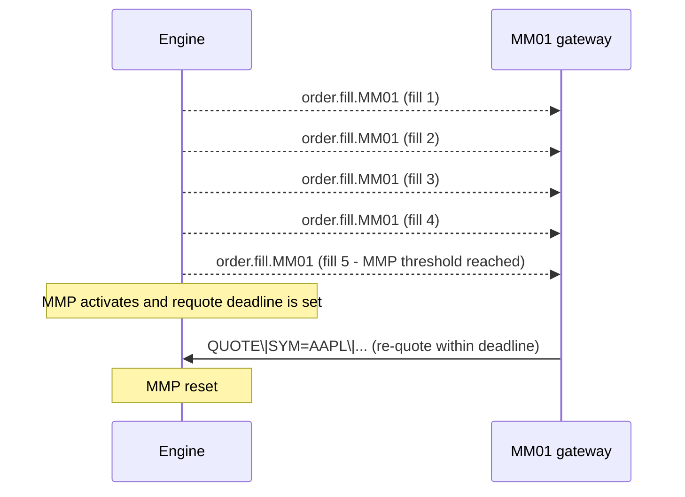
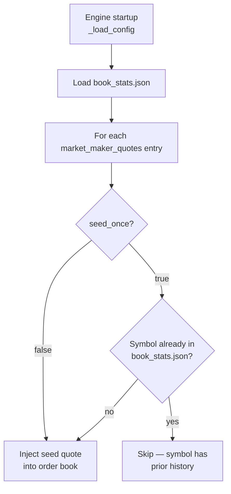
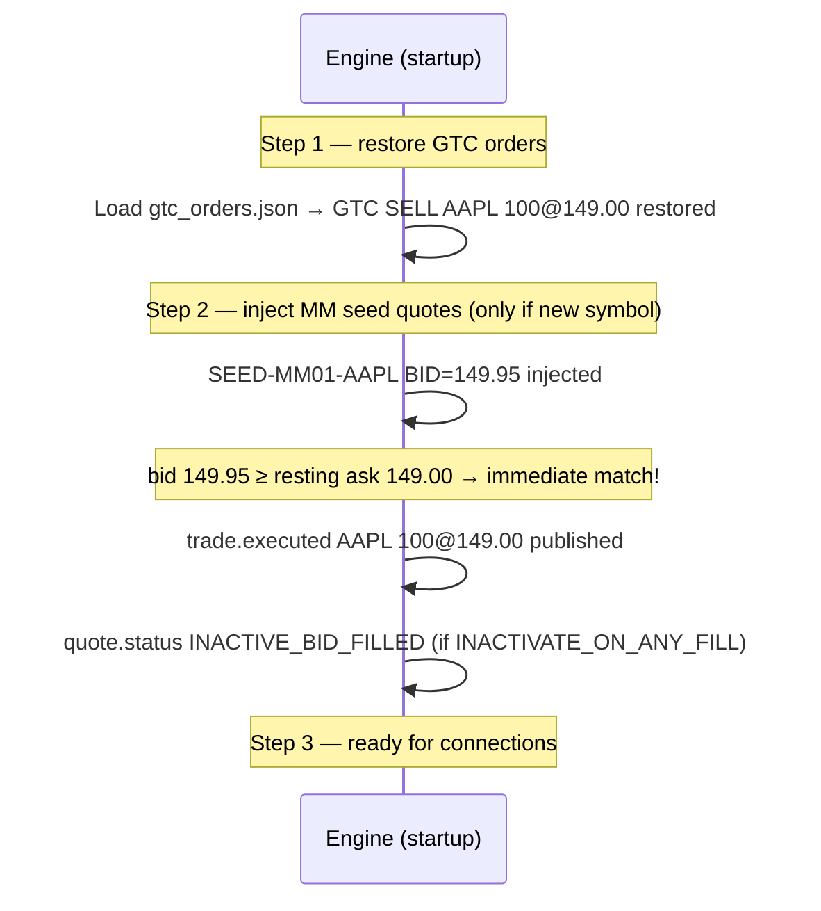

# Market Making

!!! note "Learning objectives"
    After reading this page you will understand:

    - What a market maker is and why exchanges rely on them
    - How to submit a two-sided quote with the `QUOTE` command
    - What happens to a quote when one side fills (inactivation)
    - How `quote_refresh_policy` controls inactivation behaviour
    - How MM obligations enforce minimum spread width and size
    - How Market-Maker Protection (MMP) prevents excessive fills in a burst
    - How `disconnect_behaviour` determines what happens to your quotes if your gateway drops

    **Prerequisites**: [Configuration](01-configuration.md) — you need a gateway configured
    with `role: MARKET_MAKER` before the engine accepts quotes.
    [Gateway Commands](08-gateway.md) — understand how to connect a gateway terminal.

---

## What is a market maker?

In a real exchange, **market makers** are specialist participants who commit to
continuously posting a two-sided market — a price at which they will buy
(**bid**) and a price at which they will sell (**ask**). In return for this
commitment, they often receive reduced transaction fees or regulatory benefits.

Their presence is what makes a market *liquid*: without market makers, a buyer
who arrives when no seller is resting would have to wait indefinitely. Market
makers ensure there is almost always a price to trade at.

EduMatcher models this with the `MARKET_MAKER` participant role, the `QUOTE`
command (which posts a bid and ask as a linked pair), and an optional
obligations framework that enforces spread and size constraints.

---

## Configuring a market-maker gateway

A gateway must be assigned the `MARKET_MAKER` role in `engine_config.yaml`
before the engine will accept quotes from it:

```yaml
gateways:
  MM01:
    role: MARKET_MAKER
    quote_refresh_policy: INACTIVATE_ON_ANY_FILL   # default
    disconnect_behaviour: CANCEL_QUOTES_ONLY        # default
    enforce_mm_obligation: true
    mm_max_spread_ticks: 10        # max spread in ticks (10 ticks = $0.10 for tick_size=0.01)
    mm_min_qty: 100                # minimum size on each side
```

A `TRADER` gateway that tries to send a `QUOTE` command will receive a
rejection: `Quotes are only allowed for MARKET_MAKER participants`.

---

## The QUOTE command

A quote is a single atomic operation that posts **one bid order and one ask
order** under a shared `QUOTE_ID`. Both legs are ordinary `LIMIT` orders in the
book — the only difference is that they are tracked together for lifecycle
management.

```
QUOTE|SYM=AAPL|BID=149.90|ASK=150.10|BID_QTY=500|ASK_QTY=500
```

Optional fields:

| Field | Default | Description |
|---|---|---|
| `QUOTE_ID=` | Auto-generated | Label for this quote pair; used in status events and cancel |
| `TIF=` | `DAY` | Either `DAY` or `GTC`; controls whether the quote survives to the next session |

### Validation rules

The engine rejects a quote if:

| Condition | Rejection reason |
|---|---|
| Gateway role is not `MARKET_MAKER` | `Quotes are only allowed for MARKET_MAKER participants` |
| `BID_PRICE >= ASK_PRICE` | `Quote requires bid_price < ask_price` |
| Either quantity $\leq$ 0 | `Quote quantities must be positive` |
| Symbol is halted | `{SYMBOL} is halted — quotes rejected during circuit breaker halt` |
| Spread exceeds `mm_max_spread_ticks` | `Spread {n} ticks exceeds max {m}` |
| Either side below `mm_min_qty` | `Quote size must be >= {n}` |
| Sending a new quote replaces any existing quote for the same (gateway, symbol) pair | *(no rejection; the existing quote is cancelled silently)* |

### Quote acknowledgement

On success:

```
[HH:MM:SS] QUOTE ACK  q-aapl-001  bid=ord-aaa ask=ord-bbb
```

The `bid=` and `ask=` values are the individual order IDs assigned to each leg.
These can be referenced individually in cancellation or via book queries.

---

## Quote lifecycle



When inactivation occurs, the gateway receives a `quote.status` event:

```
[HH:MM:SS] QUOTE INACTIVE_BID_FILLED  q-aapl-001
```

This tells the market maker: *"your bid was hit; your ask is now cancelled; you
need to re-quote."*

---

## Quote refresh policy

The `quote_refresh_policy` config key controls **what triggers inactivation**:

| Policy | Inactivation trigger | Typical use |
|---|---|---|
| `INACTIVATE_ON_ANY_FILL` | Any partial or full fill on either leg | Conservative; re-quote after every fill event |
| `INACTIVATE_ON_FULL_FILL` | Only when a leg is **completely** filled | Allows partial fills to accumulate before re-quoting |
| `NEVER_INACTIVATE` | Never — both legs stay in the book until manually cancelled | High-volume automated MMs that manage their own inventory |



---

## MM obligations enforcement

When `enforce_mm_obligation: true` is set, the engine validates every `QUOTE`
command against two constraints:

### Spread constraint

$$
\text{spread\_ticks} = \frac{\text{ask\_price} - \text{bid\_price}}{\text{tick\_size}}
$$

The spread in ticks must not exceed `mm_max_spread_ticks`. Example: if
`tick_size = 0.01` and `mm_max_spread_ticks = 10`, then a quote of
`BID=149.90 ASK=150.10` has a spread of **20 ticks** and will be **rejected**.

### Minimum size constraint

Both `BID_QTY` and `ASK_QTY` must be ≥ `mm_min_qty`. Posting 50 on one side
when `mm_min_qty = 100` will be **rejected**.

### Per-symbol overrides

Obligations can be configured with four levels of precedence, from lowest to
highest:

```
global mm_obligation_defaults
  └── per-symbol global policy (mm_obligation_policies[symbol])
       └── per-gateway defaults (gateways[MM01]: mm_max_spread_ticks, ...)
            └── per-gateway per-symbol policy (gateways[MM01].mm_obligations[symbol])
```

This lets you enforce tight spreads on liquid symbols while being more lenient
on illiquid ones, all from a single config file.

Example:

```yaml
mm_obligation_defaults:
  enforce_mm_obligation: true
  mm_max_spread_ticks: 20
  mm_min_qty: 50

gateways:
  MM01:
    role: MARKET_MAKER
    mm_obligations:
      AAPL:
        mm_max_spread_ticks: 5    # tighter spread required on AAPL
        mm_min_qty: 200
```

---

## Market-Maker Protection (MMP)

Real market makers are exposed to **adverse selection**: a rapid stream of fills
on one side can mean an informed trader is hitting their price while they cannot
adjust fast enough. Market-Maker Protection provides an automatic pause when
fill activity exceeds a threshold.

The MMP parameters live in `mm_obligation_defaults` or per-gateway config:

| Parameter | Default | Meaning |
|---|---|---|
| `mmp_fill_count` | 5 | Number of fills within the window that triggers MMP |
| `mmp_window_ns` | 1,000,000,000 | Rolling window in nanoseconds (default: 1 second) |
| `max_requote_delay_ns` | 500,000,000 | How long (ns) the MM has to re-quote before being flagged |



---

## Cancelling a quote

```
QUOTE_CANCEL|SYM=AAPL
```

This cancels both legs atomically. The gateway receives a `quote.status`
event with state `CANCELLED`.

---

## Startup seeding — pre-loading quotes from config

A live market maker's first action after connecting is to post a quote. In a
classroom or demo environment it is useful to have quotes already in the book
*before any participant connects*, so the book is never completely empty and
price discovery can begin from a known starting point.

This is done with the `market_maker_quotes` key under each symbol in
`engine_config.yaml`:

```yaml
symbols:
  AAPL:
    tick_size: 0.01
    market_maker_quotes:
      - gateway_id: MM01      # must be a configured MARKET_MAKER gateway
        quote_id: SEED-MM01-AAPL
        bid_price: 149.95
        ask_price: 150.05
        bid_qty: 500
        ask_qty: 500
        tif: DAY              # or GTC — see below
        seed_once: true       # default — inject only on the very first startup
```

The engine injects these quotes during `_load_config()`, which runs at every
startup after GTC orders are restored. Each entry creates a linked bid/ask pair
in the order book exactly as if the market-maker gateway had sent a `QUOTE`
command — the only difference is that no live gateway connection is needed.

If the MM gateway later connects and sends a new `QUOTE` command for the same
symbol, the seed is silently replaced (same behaviour as any re-quote).

### Controlling when seeds are applied: `seed_once`

The `seed_once` field controls whether a seed is a **one-off primer** or a
**permanent daily seed**:

| `seed_once` | When is the seed injected? | Typical use |
|---|---|---|
| `true` *(default)* | Only on the **very first startup** for that symbol — never again once the book has history | Initial liquidity for a brand-new symbol; the MM takes over from day 2 onwards |
| `false` | On **every startup**, regardless of whether the symbol has been traded before | Demo setups where a specific spread must always be the opening quote |

**"First startup" is detected via `book_stats.json`**: at every shutdown the
engine writes `src/data/book_stats.json` with an entry for every configured
symbol. If that entry is absent when the engine starts, the symbol is new.
Once it exists — even if no trades happened yet — the symbol is considered
known and `seed_once` seeds are skipped.



!!! tip "Resetting to \"first day\" for testing"
    Delete `src/data/book_stats.json` before starting the engine. Every
    symbol will appear new again and `seed_once` seeds will be re-injected.
    This is the standard way to reset a demo exchange to day-one state.

### Seeding and the startup order

Seed quotes are injected *after* GTC resting orders are restored. This means a
GTC resting order from a previous session may immediately cross against a seed
quote — that trade fires at startup, before any gateway connects:



!!! warning "Startup trades fire before any gateway is connected"
    If a GTC sell order rests at a price that a seed bid would cross, the
    trade executes at startup. Fill events are published to the bus —
    `pm-clearing` and `pm-stats` record them — but no participant terminal is
    connected yet. The MM gateway's inbox will have the fill event waiting
    when it connects.

### What happens on subsequent days?

The table below summarises the full session-boundary behaviour:

| Component | Saved at shutdown? | Day 2+ behaviour |
|---|---|---|
| GTC participant orders | Yes → `gtc_orders.json` | Restored into book before seed injection |
| GTC combo parent state | Yes → `gtc_combos.json` | Restored; parent-child links rebuilt |
| Book stats (OHLCV, last prices) | Yes → `book_stats.json` | Restored; provides the "known symbol" flag |
| MM seed quotes (`seed_once: true`) | **No** | Skipped — symbol is already known |
| MM seed quotes (`seed_once: false`) | **No** | Re-injected on every startup |
| DAY participant orders | No (expired at shutdown) | Must be re-submitted by participants |

!!! note "Why quote legs are never saved to `gtc_orders.json`"
    At shutdown the engine skips quote-origin orders when writing
    `gtc_orders.json`. Config seeds are the authoritative source for seed
    quotes — saving the legs would create duplicate orders in the book on the
    next startup when seeds are also re-injected.

### Choosing `tif` for seed quotes

| `tif` value | Behaviour during the session | Cross-session behaviour |
|---|---|---|
| `DAY` | Quote expires at end of trading day (Ctrl-C / SIGTERM) | Re-seeded from config on next startup (if conditions met) |
| `GTC` | Quote survives an ATC/session reset within the same engine run | Still re-seeded from config on next startup (legs not persisted) |

For most setups `tif: DAY` is the right choice. Use `tif: GTC` only if you
want the seed to survive an intra-session `CLOSED → PRE_OPEN` cycle within
the same running engine instance.

---

## Disconnect behaviour

If a market maker's gateway disconnects (Ctrl-C or network failure), the engine
must decide what to do with any resting quotes:

| `disconnect_behaviour` | What happens to quotes | What happens to plain orders |
|---|---|---|
| `CANCEL_QUOTES_ONLY` | All quotes cancelled | Resting orders remain in book |
| `CANCEL_ALL` | All quotes cancelled | All resting orders also cancelled |
| `LEAVE_ALL` | Nothing cancelled | Nothing cancelled |

The default is `CANCEL_QUOTES_ONLY`, which is the most appropriate for
market making: quotes represent ongoing commitment and should not linger after
the MM disconnects.

---

## Full worked example

**Scenario**: `MM01` provides a continuous two-sided market in `AAPL`.
`GW02` is a customer who buys 200 shares.

```
# Configure engine_config.yaml:
#   gateways.MM01.role = MARKET_MAKER
#   gateways.MM01.enforce_mm_obligation = true
#   gateways.MM01.mm_max_spread_ticks = 10
#   gateways.MM01.mm_min_qty = 100
#   gateways.MM01.quote_refresh_policy = INACTIVATE_ON_ANY_FILL

# 1. MM01 posts a quote
MM01> QUOTE|SYM=AAPL|BID=149.95|ASK=150.05|BID_QTY=500|ASK_QTY=500|QUOTE_ID=q1
[14:30:00] QUOTE ACK  q1  bid=ord-001 ask=ord-002

# 2. GW02 buys 200 at market — hits the ASK leg
GW02> NEW|SYM=AAPL|SIDE=BUY|TYPE=MARKET|QTY=200
[14:30:01] FILL  ord-003  AAPL BUY  200@150.05

# MM01 sees:
[14:30:01] FILL  ord-002  AAPL SELL  200@150.05  (partial fill on ask)
[14:30:01] QUOTE INACTIVE_ASK_FILLED  q1          (bid leg auto-cancelled)

# 3. MM01 re-quotes
MM01> QUOTE|SYM=AAPL|BID=149.95|ASK=150.05|BID_QTY=500|ASK_QTY=300|QUOTE_ID=q2
[14:30:01] QUOTE ACK  q2  bid=ord-004 ask=ord-005
```

After the customer fill, `MM01`'s bid leg (`ord-001`) was cancelled by the
engine automatically. The market maker posted a new quote `q2` with 300 on the
ask to reflect the inventory consumed.

---

## Config reference summary

```yaml
gateways:
  MM01:
    role: MARKET_MAKER
    quote_refresh_policy: INACTIVATE_ON_ANY_FILL   # or INACTIVATE_ON_FULL_FILL / NEVER_INACTIVATE
    disconnect_behaviour: CANCEL_QUOTES_ONLY        # or CANCEL_ALL / LEAVE_ALL
    enforce_mm_obligation: true
    mm_max_spread_ticks: 10
    mm_min_qty: 100
    mm_obligations:              # per-symbol overrides (optional)
      TSLA:
        mm_max_spread_ticks: 20
        mm_min_qty: 50
```

---

## See also

- [Configuration](01-configuration.md) — full gateway and `mm_obligation_defaults` config schema
- [Order Types](04-order-types.md) — the LIMIT orders that quote legs create under the hood
- [Risk Controls](12-risk-controls.md) — how circuit breakers cancel quotes during a halt
- [Persistence](11-persistence.md) — GTC quotes survive restarts; MM seeds are injected at startup
- [Gateway Commands](08-gateway.md) — full QUOTE and QUOTE_CANCEL command syntax
- [Messages](09-messages.md) — `quote.ack` and `quote.status` message payloads
