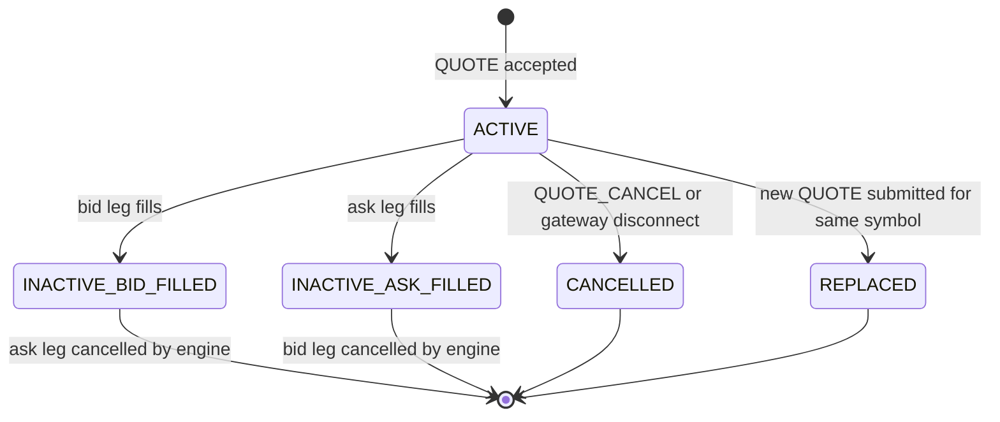
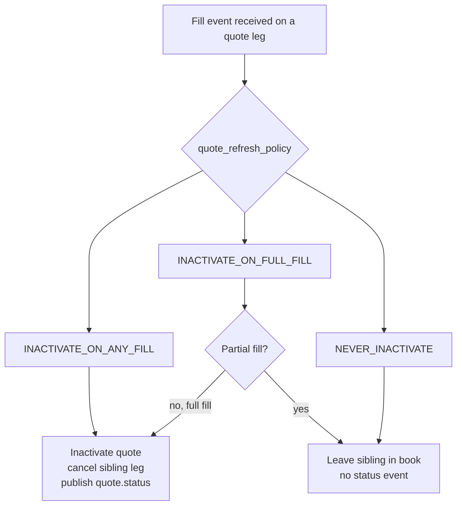
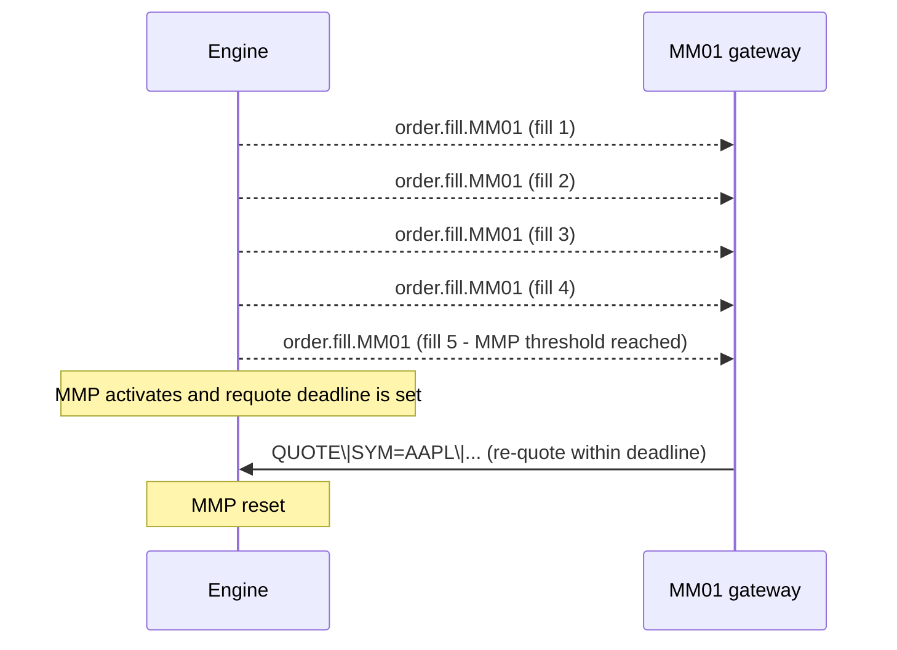
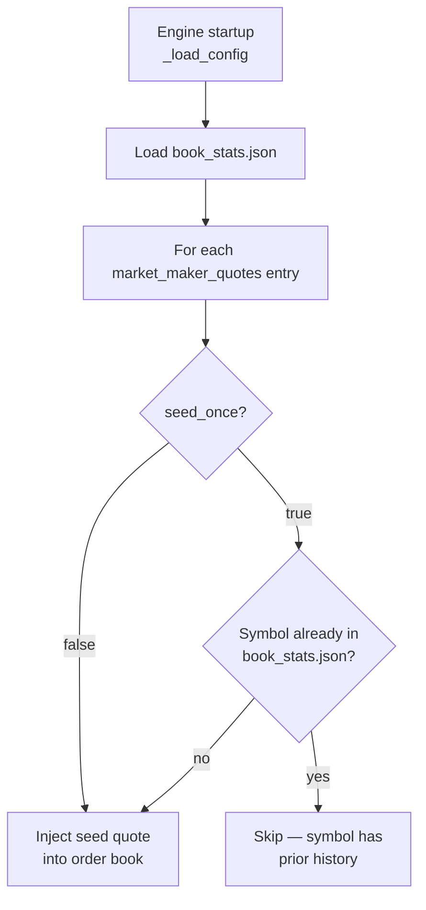
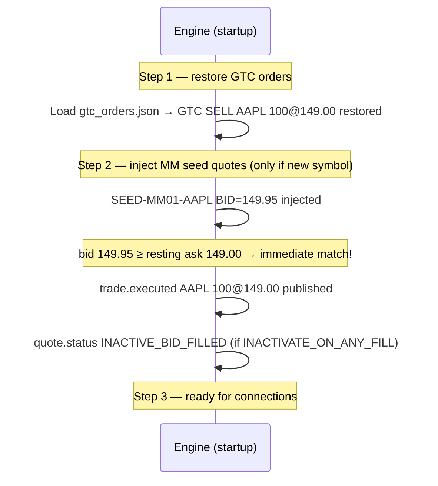
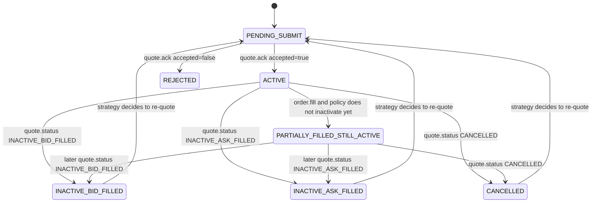
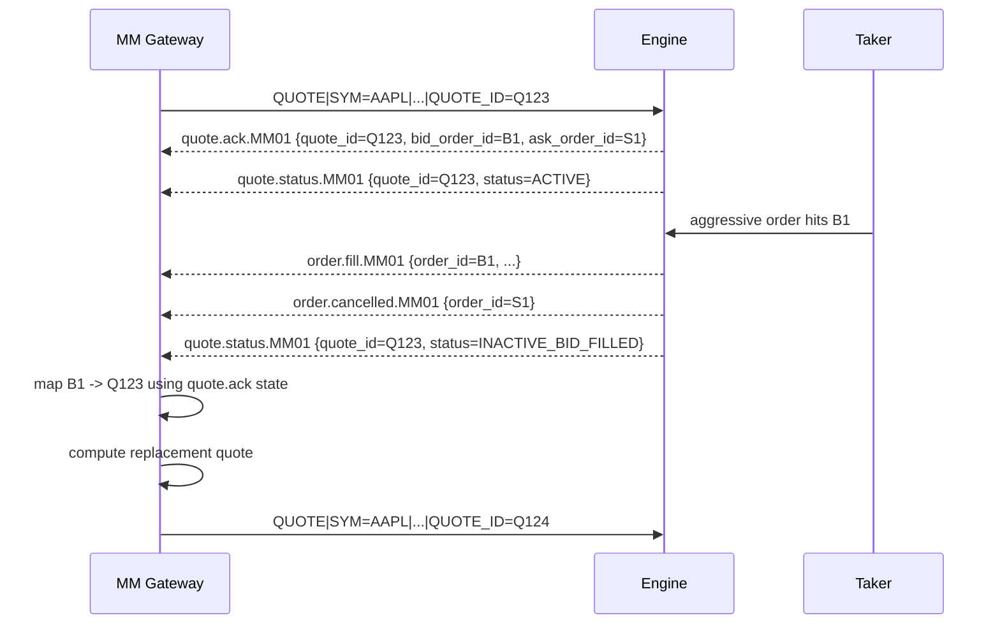

# Market Making

!!! note "Learning objectives"
    After reading this page you will understand:

    - What a market maker is and why exchanges rely on them
    - How to submit a two-sided quote with the `QUOTE` command
    - What happens to a quote when one side fills (inactivation)
    - How `quote_refresh_policy` controls inactivation behaviour
    - How MM obligations enforce minimum spread width and size
    - How Market-Maker Protection (MMP) prevents excessive fills in a burst
    - How `disconnect_behaviour` determines what happens to your quotes if your gateway drops

    **Prerequisites**: [Configuration](01-configuration.md) — you need a gateway configured
    with `role: MARKET_MAKER` before the engine accepts quotes.
    [Gateway Commands](08-gateway.md) — understand how to connect a gateway terminal.

---

## What is a market maker?

In a real exchange, **market makers** are specialist participants who commit to
continuously posting a two-sided market — a price at which they will buy
(**bid**) and a price at which they will sell (**ask**). In return for this
commitment, they often receive reduced transaction fees or regulatory benefits.

Their presence is what makes a market *liquid*: without market makers, a buyer
who arrives when no seller is resting would have to wait indefinitely. Market
makers ensure there is almost always a price to trade at.

EduMatcher models this with the `MARKET_MAKER` participant role, the `QUOTE`
command (which posts a bid and ask as a linked pair), and an optional
obligations framework that enforces spread and size constraints.

---

## Configuring a market-maker gateway

A gateway must be assigned the `MARKET_MAKER` role in `engine_config.yaml`
before the engine will accept quotes from it:

```yaml
gateways:
  alf:
    - id: MM01
      description: Market maker
      role: MARKET_MAKER
      quote_refresh_policy: INACTIVATE_ON_ANY_FILL   # default
      disconnect_behaviour: CANCEL_QUOTES_ONLY        # default
      enforce_mm_obligation: true
      mm_max_spread_ticks: 10        # max spread in ticks (10 ticks = $0.10 for tick_size=0.01)
      mm_min_qty: 100                # minimum size on each side
```

A `TRADER` gateway that tries to send a `QUOTE` command will receive a
rejection: `Quotes are only allowed for MARKET_MAKER participants`.

---

## The QUOTE command

A quote is a single atomic operation that posts **one bid order and one ask
order** under a shared `QUOTE_ID`. Both legs are ordinary `LIMIT` orders in the
book — the only difference is that they are tracked together for lifecycle
management.

```
QUOTE|SYM=AAPL|BID=149.90|ASK=150.10|BID_QTY=500|ASK_QTY=500
```

Optional fields:

| Field       | Default        | Description                                                                    |
|-------------|----------------|--------------------------------------------------------------------------------|
| `QUOTE_ID=` | Auto-generated | Label for this quote pair; used in status events and cancel                    |
| `TIF=`      | `DAY`          | Either `DAY` or `GTC`; controls whether the quote survives to the next session |

### Validation rules

The engine rejects a quote if:

| Condition                                                                           | Rejection reason                                                   |
|-------------------------------------------------------------------------------------|--------------------------------------------------------------------|
| Gateway role is not `MARKET_MAKER`                                                  | `Quotes are only allowed for MARKET_MAKER participants`            |
| `BID_PRICE >= ASK_PRICE`                                                            | `Quote requires bid_price < ask_price`                             |
| Either quantity $\leq$ 0                                                            | `Quote quantities must be positive`                                |
| Symbol is halted                                                                    | `{SYMBOL} is halted — quotes rejected during circuit breaker halt` |
| Spread exceeds `mm_max_spread_ticks`                                                | `Spread {n} ticks exceeds max {m}`                                 |
| Either side below `mm_min_qty`                                                      | `Quote size must be >= {n}`                                        |
| Sending a new quote replaces any existing quote for the same (gateway, symbol) pair | *(no rejection; the existing quote is cancelled silently)*         |

### Quote acknowledgement

On success:

```
[HH:MM:SS] QUOTE ACK  q-aapl-001  bid=ord-aaa ask=ord-bbb
```

The `bid=` and `ask=` values are the individual order IDs assigned to each leg.
These can be referenced individually in cancellation or via book queries.

---

## Quote lifecycle



When inactivation occurs, the gateway receives a `quote.status` event:

```
[HH:MM:SS] QUOTE INACTIVE_BID_FILLED  q-aapl-001
```

This tells the market maker: *"your bid was hit; your ask is now cancelled; you
need to re-quote."*

---

## Quote refresh policy

The `quote_refresh_policy` config key controls **what triggers inactivation**:

| Policy                    | Inactivation trigger                                        | Typical use                                               |
|---------------------------|-------------------------------------------------------------|-----------------------------------------------------------|
| `INACTIVATE_ON_ANY_FILL`  | Any partial or full fill on either leg                      | Conservative; re-quote after every fill event             |
| `INACTIVATE_ON_FULL_FILL` | Only when a leg is **completely** filled                    | Allows partial fills to accumulate before re-quoting      |
| `NEVER_INACTIVATE`        | Never — both legs stay in the book until manually cancelled | High-volume automated MMs that manage their own inventory |



---

## MM obligations enforcement

When `enforce_mm_obligation: true` is set, the engine validates every `QUOTE`
command against two constraints:

### Spread constraint

$$
\text{spread\_ticks} = \frac{\text{ask\_price} - \text{bid\_price}}{\text{tick\_size}}
$$

The spread in ticks must not exceed `mm_max_spread_ticks`. Example: if
`tick_size = 0.01` and `mm_max_spread_ticks = 10`, then a quote of
`BID=149.90 ASK=150.10` has a spread of **20 ticks** and will be **rejected**.

### Minimum size constraint

Both `BID_QTY` and `ASK_QTY` must be ≥ `mm_min_qty`. Posting 50 on one side
when `mm_min_qty = 100` will be **rejected**.

### Per-symbol overrides

Obligations can be configured with four levels of precedence, from lowest to
highest:

```
global mm_obligation_defaults
  └── per-symbol global policy (mm_obligation_policies[symbol])
       └── per-gateway defaults (gateways[MM01]: mm_max_spread_ticks, ...)
            └── per-gateway per-symbol policy (gateways[MM01].mm_obligations[symbol])
```

This lets you enforce tight spreads on liquid symbols while being more lenient
on illiquid ones, all from a single config file.

Example:

```yaml
mm_obligation_defaults:
  enforce_mm_obligation: true
  mm_max_spread_ticks: 20
  mm_min_qty: 50

gateways:
  MM01:
    role: MARKET_MAKER
    mm_obligations:
      AAPL:
        mm_max_spread_ticks: 5    # tighter spread required on AAPL
        mm_min_qty: 200
```

---

## Market-Maker Protection (MMP)

Real market makers are exposed to **adverse selection**: a rapid stream of fills
on one side can mean an informed trader is hitting their price while they cannot
adjust fast enough. Market-Maker Protection provides an automatic pause when
fill activity exceeds a threshold.

The MMP parameters live in `mm_obligation_defaults` or per-gateway config:

| Parameter              | Default       | Meaning                                                   |
|------------------------|---------------|-----------------------------------------------------------|
| `mmp_fill_count`       | 5             | Number of fills within the window that triggers MMP       |
| `mmp_window_ns`        | 1,000,000,000 | Rolling window in nanoseconds (default: 1 second)         |
| `max_requote_delay_ns` | 500,000,000   | How long (ns) the MM has to re-quote before being flagged |



What the MM operator sees in the terminal when MMP fires:

```text
[09:30:01.002] FILL      7c4a91e2  qty=100 @209.8  remaining=400  [PARTIAL]
[09:30:01.003] FILL      7c4a91e2  qty=100 @209.8  remaining=300  [PARTIAL]
[09:30:01.004] FILL      7c4a91e2  qty=100 @209.8  remaining=200  [PARTIAL]
[09:30:01.005] FILL      7c4a91e2  qty=100 @209.8  remaining=100  [PARTIAL]
[09:30:01.006] FILL      7c4a91e2  qty=100 @209.8  remaining=0    [FILLED]
[09:30:01.006] CANCELLED be2170fd
[09:30:01.006] QUOTE INACTIVE_BID_FILLED  Q1
```

The bot (or operator) must re-quote within `max_requote_delay_ns` to avoid
an obligation breach flag.

---

## Cancelling a quote

```
QUOTE_CANCEL|SYM=AAPL
```

This cancels both legs atomically. The gateway receives a `quote.status`
event with state `CANCELLED`.

---

## Startup seeding — pre-loading quotes from config

A live market maker's first action after connecting is to post a quote. In a
classroom or demo environment it is useful to have quotes already in the book
*before any participant connects*, so the book is never completely empty and
price discovery can begin from a known starting point.

This is done with the `market_maker_quotes` key under each symbol in
`engine_config.yaml`:

```yaml
symbols:
  AAPL:
    tick_size: 0.01
    market_maker_quotes:
      - gateway_id: MM01      # must be a configured MARKET_MAKER gateway
        quote_id: SEED-MM01-AAPL
        bid_price: 149.95
        ask_price: 150.05
        bid_qty: 500
        ask_qty: 500
        tif: DAY              # or GTC — see below
        seed_once: true       # default — inject only on the very first startup
```

The engine injects these quotes during `_load_config()`, which runs at every
startup after GTC orders are restored. Each entry creates a linked bid/ask pair
in the order book exactly as if the market-maker gateway had sent a `QUOTE`
command — the only difference is that no live gateway connection is needed.

If the MM gateway later connects and sends a new `QUOTE` command for the same
symbol, the seed is silently replaced (same behaviour as any re-quote).

### Controlling when seeds are applied: `seed_once`

The `seed_once` field controls whether a seed is a **one-off primer** or a
**permanent daily seed**:

| `seed_once` | When is the seed injected? | Typical use |
|---|---|---|
| `true` *(default)* | Only on the **very first startup** for that symbol — never again once the book has history | Initial liquidity for a brand-new symbol; the MM takes over from day 2 onwards |
| `false` | On **every startup**, regardless of whether the symbol has been traded before | Demo setups where a specific spread must always be the opening quote |

**"First startup" is detected via `book_stats.json`**: at every shutdown the
engine writes `src/data/book_stats.json` with an entry for every configured
symbol. If that entry is absent when the engine starts, the symbol is new.
Once it exists — even if no trades happened yet — the symbol is considered
known and `seed_once` seeds are skipped.



!!! tip "Resetting to \"first day\" for testing"
    Delete `src/data/book_stats.json` before starting the engine. Every
    symbol will appear new again and `seed_once` seeds will be re-injected.
    This is the standard way to reset a demo exchange to day-one state.

### Seeding and the startup order

Seed quotes are injected *after* GTC resting orders are restored. This means a
GTC resting order from a previous session may immediately cross against a seed
quote — that trade fires at startup, before any gateway connects:



!!! warning "Startup trades fire before any gateway is connected"
    If a GTC sell order rests at a price that a seed bid would cross, the
    trade executes at startup. Fill events are published to the bus —
    `pm-clearing` and `pm-stats` record them — but no participant terminal is
    connected yet. The MM gateway's inbox will have the fill event waiting
    when it connects.

### What happens on subsequent days?

The table below summarises the full session-boundary behaviour:

| Component                           | Saved at shutdown?       | Day 2+ behaviour                           |
|-------------------------------------|--------------------------|--------------------------------------------|
| GTC participant orders              | Yes → `gtc_orders.json`  | Restored into book before seed injection   |
| GTC combo parent state              | Yes → `gtc_combos.json`  | Restored; parent-child links rebuilt       |
| Book stats (OHLCV, last prices)     | Yes → `book_stats.json`  | Restored; provides the "known symbol" flag |
| MM seed quotes (`seed_once: true`)  | **No**                   | Skipped — symbol is already known          |
| MM seed quotes (`seed_once: false`) | **No**                   | Re-injected on every startup               |
| DAY participant orders              | No (expired at shutdown) | Must be re-submitted by participants       |

!!! note "Why quote legs are never saved to `gtc_orders.json`"
    At shutdown the engine skips quote-origin orders when writing
    `gtc_orders.json`. Config seeds are the authoritative source for seed
    quotes — saving the legs would create duplicate orders in the book on the
    next startup when seeds are also re-injected.

### Choosing `tif` for seed quotes

| `tif` value | Behaviour during the session                                   | Cross-session behaviour                                          |
|-------------|----------------------------------------------------------------|------------------------------------------------------------------|
| `DAY`       | Quote expires at end of trading day (Ctrl-C / SIGTERM)         | Re-seeded from config on next startup (if conditions met)        |
| `GTC`       | Quote survives an ATC/session reset within the same engine run | Still re-seeded from config on next startup (legs not persisted) |

For most setups `tif: DAY` is the right choice. Use `tif: GTC` only if you
want the seed to survive an intra-session `CLOSED → PRE_OPEN` cycle within
the same running engine instance.

---

## Disconnect behaviour

If a market maker's gateway disconnects (Ctrl-C or network failure), the engine
must decide what to do with any resting quotes:

| `disconnect_behaviour` | What happens to quotes | What happens to plain orders      |
|------------------------|------------------------|-----------------------------------|
| `CANCEL_QUOTES_ONLY`   | All quotes cancelled   | Resting orders remain in book     |
| `CANCEL_ALL`           | All quotes cancelled   | All resting orders also cancelled |
| `LEAVE_ALL`            | Nothing cancelled      | Nothing cancelled                 |

The default is `CANCEL_QUOTES_ONLY`, which is the most appropriate for
market making: quotes represent ongoing commitment and should not linger after
the MM disconnects.

---

## Full worked example

**Scenario**: `MM01` provides a continuous two-sided market in `AAPL`.
`GW02` is a customer who buys 200 shares.

```
# Configure engine_config.yaml:
#   gateways.MM01.role = MARKET_MAKER
#   gateways.MM01.enforce_mm_obligation = true
#   gateways.MM01.mm_max_spread_ticks = 10
#   gateways.MM01.mm_min_qty = 100
#   gateways.MM01.quote_refresh_policy = INACTIVATE_ON_ANY_FILL

# 1. MM01 posts a quote
MM01> QUOTE|SYM=AAPL|BID=149.95|ASK=150.05|BID_QTY=500|ASK_QTY=500|QUOTE_ID=q1
[14:30:00] QUOTE ACK  q1  bid=ord-001 ask=ord-002

# 2. GW02 buys 200 at market — hits the ASK leg
GW02> NEW|SYM=AAPL|SIDE=BUY|TYPE=MARKET|QTY=200
[14:30:01] FILL  ord-003  AAPL BUY  200@150.05

# MM01 sees:
[14:30:01] FILL  ord-002  AAPL SELL  200@150.05  (partial fill on ask)
[14:30:01] QUOTE INACTIVE_ASK_FILLED  q1          (bid leg auto-cancelled)

# 3. MM01 re-quotes
MM01> QUOTE|SYM=AAPL|BID=149.95|ASK=150.05|BID_QTY=500|ASK_QTY=300|QUOTE_ID=q2
[14:30:01] QUOTE ACK  q2  bid=ord-004 ask=ord-005
```

After the customer fill, `MM01`'s bid leg (`ord-001`) was cancelled by the
engine automatically. The market maker posted a new quote `q2` with 300 on the
ask to reflect the inventory consumed.

---

## Config reference summary

```yaml
gateways:
  MM01:
    role: MARKET_MAKER
    quote_refresh_policy: INACTIVATE_ON_ANY_FILL   # or INACTIVATE_ON_FULL_FILL / NEVER_INACTIVATE
    disconnect_behaviour: CANCEL_QUOTES_ONLY        # or CANCEL_ALL / LEAVE_ALL
    enforce_mm_obligation: true
    mm_max_spread_ticks: 10
    mm_min_qty: 100
    mm_obligations:              # per-symbol overrides (optional)
      TSLA:
        mm_max_spread_ticks: 20
        mm_min_qty: 50
```


## MM quote identification and quote-leg mapping

### Scope

The rest of this chapter explains exactly how EduMatcher represents a market-maker quote,
how a quote is mapped to its two child orders, how the MM can identify that a
fill belongs to the currently active quote, and what the MM must do to cancel
or re-issue a quote.

It answers these questions:

1. Is a quote identified by `quote_id`, or by `(gateway_id, symbol)`?
2. How is a quote mapped to the resting order(s)?
3. How does the MM learn that one quote leg was taken?
4. When is sibling cancellation automatic, and when must the MM do it?
5. What state and data must the MM keep in order to re-quote safely?

The chapter describes the engine behavior in full details

### Executive summary

#### Identity model

EduMatcher uses two identifiers for a quote, and they serve different roles:

- Active quote slot in the engine: `(gateway_id, symbol)`
- External correlation identifier: `quote_id`

Practical meaning:

- The engine allows at most one active quote slot per `(gateway_id, symbol)`.
- A new `QUOTE` on the same gateway and symbol replaces the previous active slot.
- `quote_id` identifies the specific logical quote instance occupying that slot.

So the answer is:

- The engine routes and replaces quotes by `(gateway_id, symbol)`.
- The MM should correlate business events by `quote_id`.

#### Mapping model

Each quote becomes two ordinary limit orders:

- bid leg: `side=BUY`
- ask leg: `side=SELL`

The mapping is explicit in both directions:

- `QuoteIndex[(gateway_id, symbol)] -> QuoteEntry(quote_id, bid_order_id, ask_order_id)`
- each leg order stores `origin=QUOTE` and `quote_id=<same quote_id>`

#### How the MM identifies a fill as belonging to the active quote

The fill arrives as a normal `order.fill.<gateway_id>` event for a leg `order_id`.

Important implementation detail:

- `order.fill` does **not** include `quote_id` in its published payload.

Therefore the MM must identify quote-leg fills by keeping the mapping returned
by `quote.ack`:

- `quote_id -> {symbol, bid_order_id, ask_order_id}`
- `order_id -> {quote_id, leg_side, symbol}`

Then the rule is simple:

- if `fill.order_id == bid_order_id`, the fill belongs to the bid leg of that quote
- if `fill.order_id == ask_order_id`, the fill belongs to the ask leg of that quote

#### When cancellation is automatic

Automatic sibling cancellation depends on `quote_refresh_policy`:

- `INACTIVATE_ON_ANY_FILL`: sibling leg is auto-cancelled on any fill
- `INACTIVATE_ON_FULL_FILL`: sibling leg is auto-cancelled only when the filled leg reaches `remaining_qty=0`
- `NEVER_INACTIVATE`: no automatic sibling cancellation due to fills

The `quote_refresh_policy` is set per gateway in `engine_config.yaml` under `gateways.alf[].quote_refresh_policy`.

#### What the MM needs in order to re-issue a quote

To re-issue a quote, the MM needs:

- the symbol
- the new bid price and ask price
- the new bid quantity and ask quantity
- the desired `TIF`
- a new or reused client-side quote label strategy for `QUOTE_ID`
- the current quote mapping so fills and cancels can be correlated correctly

In practice the MM should keep:

- current active quote per symbol
- reverse map from child `order_id` to `quote_id`
- local state showing whether the quote is active, cancelled, or inactivated
- local pending-submission state for edge cases where a fill arrives before `quote.ack`

### Exact implementation model

### Quote identity: `quote_id` vs `(gateway_id, symbol)`

Both are used, but they are not interchangeable.

#### `(gateway_id, symbol)` is the engine's active-slot key

Internally the engine stores active quotes in `QuoteIndex`, keyed by:

- `gateway_id`
- `symbol`

Consequences:

- there can be only one active quote slot per gateway and symbol
- `QUOTE_CANCEL` targets the active slot by symbol, not by `quote_id`
- a new `QUOTE` on the same symbol replaces the currently indexed slot

#### `quote_id` is the MM's logical correlation key

`quote_id` is:

- optional on submission
- auto-generated by the engine if omitted
- returned in `quote.ack`
- carried in `quote.status`
- copied into both child orders internally

The engine therefore treats `quote_id` as the identifier for the specific quote
generation, but not as the routing key for cancel/replace.

### Quote-to-leg mapping

#### Engine-side mapping

The engine stores one `QuoteEntry` per active quote slot:

- `quote_id`
- `gateway_id`
- `symbol`
- `bid_order_id`
- `ask_order_id`

That gives deterministic lookup from quote slot to its two child orders.

#### Order-side mapping

Each child order stores:

- `origin=QUOTE`
- `quote_id=<quote_id>`

That gives deterministic lookup from child order back to the originating quote.

#### What the MM actually receives

The MM does **not** receive the full internal `Order` object on `order.fill`.
The fill payload includes fields such as:

- `order_id`
- `fill_qty`
- `fill_price`
- `remaining_qty`
- `status`
- `symbol`
- `side`
- `order_type`
- `tif`
- `qty`
- `price`

It does **not** include `quote_id`.

So the MM must not assume that `order.fill` alone is enough to identify the
logical quote instance unless the MM already persisted the order-id mapping from
`quote.ack`.

### Quote lifecycle messages and what they mean

#### `quote.ack.<gateway_id>`

Purpose: acceptance or rejection of a quote request.

Fields:

- `quote_id`
- `accepted`
- `reason`
- `bid_order_id`
- `ask_order_id`

Important details:

- on rejection, `accepted=false` and no leg IDs are usable
- on acceptance, `bid_order_id` and `ask_order_id` are the critical correlation keys
- on explicit `QUOTE_CANCEL`, the engine currently sends an acceptance ack with the `quote_id`, but no leg IDs

#### `quote.status.<gateway_id>`

Purpose: quote lifecycle transition.

Current status values emitted by the engine:

- `ACTIVE`
- `INACTIVE_BID_FILLED`
- `INACTIVE_ASK_FILLED`
- `CANCELLED`

Important detail:

- `REJECTED` is **not** a `quote.status` value in the engine
- rejection is reported only through `quote.ack accepted=false`

#### `order.fill.<gateway_id>`

Purpose: execution detail for one child order.

This is the message that tells the MM that one quote leg traded.

#### `order.cancelled.<gateway_id>`

Purpose: cancellation detail for one child order.

This is how the MM learns that the sibling leg was actually cancelled as an
order-book event.

### Real message ordering in the engine

This is the most important correctness section in the note.

The engine does **not** always emit messages in the intuitive order
`quote.ack -> quote.status ACTIVE -> later fill -> later inactive/cancel`.

#### Normal resting-quote case

If neither leg matches immediately on insert, the MM will typically see:

1. `quote.ack accepted=true`
2. `quote.status ACTIVE`
3. later, if a leg trades, one or more `order.fill`
4. if policy inactivates the quote, `order.cancelled` for the sibling leg
5. `quote.status INACTIVE_*`

#### Immediate-match-on-insert edge case

The engine inserts the two quote legs into the books **before** it emits
`quote.ack` and `quote.status ACTIVE`.

Therefore, if one leg matches immediately on entry, the MM may observe:

1. `order.fill` for the filled leg
2. possibly `order.cancelled` for the sibling leg
3. `quote.status INACTIVE_*`
4. only then `quote.ack accepted=true`
5. and then `quote.status ACTIVE`

That ordering is counter-intuitive, but it is what the current engine code does.

Practical consequence for the MM:

- the MM must tolerate fills arriving before `quote.ack`
- the MM must be able to reconcile those early fills once `quote.ack` provides `bid_order_id` and `ask_order_id`

#### Explicit cancel case

On `QUOTE_CANCEL|SYM=<symbol>`, the engine currently does:

1. cancel any still-resting bid/ask child orders, emitting `order.cancelled` per resting child
2. emit `quote.status CANCELLED`
3. emit `quote.ack accepted=true`

So in this path, `quote.status CANCELLED` comes **before** the final successful
`quote.ack`.

#### Replace-by-new-quote case

On a new `QUOTE` for the same `(gateway_id, symbol)`:

1. the engine removes the previous `QuoteIndex` entry
2. cancels any still-resting old quote legs
3. emits old-quote `quote.status CANCELLED`
4. creates new legs
5. eventually emits new-quote `quote.ack accepted=true`
6. emits new-quote `quote.status ACTIVE`

Again, the lifecycle is not simply “ack first, status second” across all paths.

### ALF interaction examples

### Example 1: normal quote, later bid-leg fill, automatic sibling cancel

Assume:

- gateway: `MM01`
- symbol: `AAPL`
- policy: `INACTIVATE_ON_ANY_FILL`
- MM chooses `QUOTE_ID=Q123`

#### MM submits quote

```text
MM01> QUOTE|SYM=AAPL|BID=209.80|ASK=210.20|BID_QTY=500|ASK_QTY=500|TIF=DAY|QUOTE_ID=Q123
```

#### Engine accepts and returns mapping

Gateway output will look like:

```text
[09:30:00] QUOTE ACK   Q123  bid=B1A8C2D4 ask=S9F3E1AA
[09:30:00] QUOTE ACTIVE  Q123
```

At this point the MM must persist:

- `Q123 -> {symbol=AAPL, bid_order_id=B1A8C2D4, ask_order_id=S9F3E1AA, tif=DAY}`
- `B1A8C2D4 -> {quote_id=Q123, leg=BID, symbol=AAPL}`
- `S9F3E1AA -> {quote_id=Q123, leg=ASK, symbol=AAPL}`

#### Later the bid leg is hit

Suppose another participant sells into the MM bid. The MM may see:

```text
[09:31:02] FILL  B1A8C2D4  AAPL BUY 100@209.80
[09:31:02] CANCELLED  S9F3E1AA
[09:31:02] QUOTE INACTIVE_BID_FILLED  Q123
```

#### How the MM identifies the fill as belonging to the active quote

The fill correlation logic is:

1. read `order.fill.order_id`
2. look it up in `order_id -> quote_id`
3. conclude that `B1A8C2D4` belongs to `Q123`
4. because it is the stored `bid_order_id`, conclude that the bid leg of `Q123` was taken

#### Does the MM need to cancel the sibling leg?

No, not in this policy.

Under `INACTIVATE_ON_ANY_FILL`, the engine already did both of these things:

- removed the quote from the active quote index
- cancelled the sibling ask leg automatically

The `order.cancelled` and `quote.status INACTIVE_BID_FILLED` messages are the
observable confirmation of that automatic cleanup.

### Example 2: full-fill-only policy

Assume policy `INACTIVATE_ON_FULL_FILL`.

If the bid leg is only partially filled, the MM may see:

```text
[09:31:02] FILL  B1A8C2D4  AAPL BUY 100@209.80  remaining=400  status=PARTIAL
```

And that may be all.

In that case:

- no sibling auto-cancel occurs yet
- no `quote.status INACTIVE_*` is emitted yet
- the quote remains active in the engine

The MM therefore continues to treat the quote as active until either:

- the filled leg becomes fully filled, causing inactivation, or
- the MM explicitly cancels or replaces the quote

### Example 3: `NEVER_INACTIVATE`

Assume policy `NEVER_INACTIVATE`.

The MM may see:

```text
[09:31:02] FILL  B1A8C2D4  AAPL BUY 100@209.80
```

And no automatic sibling cancel, and no `INACTIVE_*` status.

Meaning:

- the quote slot remains active in the engine
- the sibling ask leg remains resting unless something else removes it
- the MM must decide whether to keep quoting, cancel, or replace

If the MM wants a fresh two-sided quote immediately, it has two valid options:

#### Option A: explicit cancel then new quote

```text
MM01> QUOTE_CANCEL|SYM=AAPL
```

Typical resulting events:

```text
[09:31:02] CANCELLED  S9F3E1AA
[09:31:02] QUOTE CANCELLED  Q123  Cancelled by participant
[09:31:02] QUOTE ACK  Q123
```

Then the MM submits a new quote.

#### Option B: direct replacement quote

```text
MM01> QUOTE|SYM=AAPL|BID=209.70|ASK=210.10|BID_QTY=500|ASK_QTY=500|TIF=DAY|QUOTE_ID=Q124
```

The engine will:

- remove the current active quote slot for `(MM01, AAPL)`
- cancel any surviving old child orders
- emit `quote.status CANCELLED` for the old quote
- install the new quote

This means the MM does **not** have to send `QUOTE_CANCEL` first if it is
immediately replacing the quote with another quote on the same symbol.

### Example 4: immediate fill before `quote.ack`

This is the tricky case that every robust MM must handle.

Suppose the quote is marketable as soon as it is inserted. The MM may see:

```text
[09:30:00] FILL  B1A8C2D4  AAPL BUY 500@209.80
[09:30:00] CANCELLED  S9F3E1AA
[09:30:00] QUOTE INACTIVE_BID_FILLED  Q123
[09:30:00] QUOTE ACK  Q123  bid=B1A8C2D4 ask=S9F3E1AA
[09:30:00] QUOTE ACTIVE  Q123
```

Yes, that ordering is possible in the current engine.

#### What the MM must do in this case

The MM needs one more local concept:

- `pending_quote_by_symbol`

When it sends:

```text
QUOTE|SYM=AAPL|...|QUOTE_ID=Q123
```

it should locally remember that there is a pending quote submission for AAPL.

Then if an early fill arrives before `quote.ack`, the MM can:

1. temporarily buffer the fill by `(gateway_id, symbol)`
2. wait for `quote.ack`
3. use `bid_order_id` and `ask_order_id` from the ack to retroactively resolve that buffered fill
4. then continue normal state handling

Without this pending-submit buffer, the MM cannot deterministically map an
early fill to the quote until the ack arrives.

### MM operator workflow via `pm-gateway`

This section is intentionally operator-oriented. It shows what a market maker
using the interactive ALF gateway will actually type, what the gateway will
print back, and what the operator must remember while managing live quotes.

### What the operator sees on screen

The gateway displays quote and order lifecycle events in a compact terminal
format.

Important display behavior:

- `QUOTE ACK` shows the `quote_id` and the first 8 characters of each child order ID
- `FILL` shows the first 8 characters of the filled child order ID
- `CANCELLED` shows the first 8 characters of the cancelled child order ID
- `QUOTE INACTIVE_*` and `QUOTE CANCELLED` show the `quote_id`

So a human operator correlates events using:

- `quote_id` for the logical quote instance
- the displayed 8-character order-id prefixes for the bid and ask legs

To reduce manual correlation load in fast markets, the gateway supports:

```text
QLEGS[|SYM=<symbol>][|SHOW=ACTIVE|RECENT|ALL]
```

`QLEGS` shows per-gateway quote legs with explicit `Filled` and `Filled?`
columns, so the operator can identify the traded leg without mentally joining
multiple event lines.

A programmatic MM should keep the full IDs from the message payload. A human
operator using the terminal will usually work from the 8-character prefixes
printed by the gateway.

### Typical manual quoting session

Assume the MM operator is connected as `MM01` and wants to quote `AAPL`.

#### Step 1: submit a quote

Operator input:

```text
MM01> QUOTE|SYM=AAPL|BID=209.80|ASK=210.20|BID_QTY=500|ASK_QTY=500|TIF=DAY|QUOTE_ID=Q123
```

Typical gateway output when the quote rests normally:

```text
[09:30:00.101] QUOTE ACK   Q123  bid=7c4a91e2 ask=be2170fd
[09:30:00.102] QUOTE ACTIVE  Q123
```

#### What the operator must remember immediately

At this moment the operator should record or mentally associate:

- symbol: `AAPL`
- quote id: `Q123`
- bid leg prefix: `7c4a91e2`
- ask leg prefix: `be2170fd`
- intended prices: `209.80 / 210.20`
- intended sizes: `500 / 500`
- current refresh policy for that gateway

The minimum safe correlation set for a human operator is:

- `Q123`
- bid leg short ID
- ask leg short ID

### Step 2: identify which leg filled

Later the operator may see:

```text
[09:31:02.417] FILL      7c4a91e2  qty=100 @209.8  remaining=400  [PARTIAL]
```

The operator identifies this as the quote bid leg because:

- the filled order-id prefix `7c4a91e2` matches the bid ID shown in `QUOTE ACK`
- therefore the bid side of `Q123` traded

If instead the operator saw:

```text
[09:31:02.417] FILL      be2170fd  qty=100 @210.2  remaining=400  [PARTIAL]
```

that would mean the ask side of `Q123` traded.

With `QLEGS`, this becomes a direct read:

```text
MM01> QLEGS|SYM=AAPL|SHOW=ALL
```

Interpretation pattern:

- `Filled?=YES` with `Leg=BUY` means the bid leg traded
- `Filled?=YES` with `Leg=SELL` means the ask leg traded
- `Rem>0` with leg status `NEW` or `PARTIAL` identifies still-active exposure

### Step 3: interpret what happens next

What the operator should do next depends on the configured refresh policy.

#### Case A: `INACTIVATE_ON_ANY_FILL`

Typical terminal output:

```text
[09:31:02.417] FILL      7c4a91e2  qty=100 @209.8  remaining=400  [PARTIAL]
[09:31:02.418] CANCELLED be2170fd
[09:31:02.418] QUOTE INACTIVE_BID_FILLED  Q123
```

Operator interpretation:

- the bid leg traded
- the engine automatically cancelled the sibling ask leg
- the quote is no longer active
- the operator may now prepare and submit a replacement quote

Operator action:

- no manual `QUOTE_CANCEL` is needed
- compute the new bid/ask and send a fresh `QUOTE`
- optionally run `QLEGS|SYM=AAPL|SHOW=ALL` before re-quoting to confirm final leg state

#### Case B: `INACTIVATE_ON_FULL_FILL`

Typical terminal output after a partial fill:

```text
[09:31:02.417] FILL      7c4a91e2  qty=100 @209.8  remaining=400  [PARTIAL]
```

Operator interpretation:

- one quote leg traded
- the quote may still be active
- no sibling cancellation has happened yet
- the quote stays live until full fill or explicit operator action

Operator action choices:

- leave the quote working if that is desired
- send `QUOTE_CANCEL|SYM=AAPL` if the quote should be withdrawn now
- send a replacement `QUOTE` if the operator wants to replace the current quote immediately

#### Case C: `NEVER_INACTIVATE`

Typical terminal output:

```text
[09:31:02.417] FILL      7c4a91e2  qty=100 @209.8  remaining=400  [PARTIAL]
```

Operator interpretation:

- the bid leg traded
- the quote remains active unless manually changed or removed by another engine event
- the sibling ask leg is still live

Operator action choices:

- do nothing and keep the surviving structure live
- cancel explicitly with `QUOTE_CANCEL|SYM=AAPL`
- replace directly by sending a new `QUOTE` on `AAPL`

### Explicit cancel workflow from the terminal

If the operator wants to cancel the current active quote for `AAPL`:

```text
MM01> QUOTE_CANCEL|SYM=AAPL
```

Typical output:

```text
[09:31:20.010] CANCELLED 7c4a91e2
[09:31:20.011] CANCELLED be2170fd
[09:31:20.011] QUOTE CANCELLED  Q123  Cancelled by participant
[09:31:20.012] QUOTE ACK  Q123
```

Important operator note:

- `QUOTE_CANCEL` is symbol-based, not `quote_id`-based
- it targets whatever quote is currently active in the `(gateway_id, symbol)` slot

So before typing `QUOTE_CANCEL|SYM=AAPL`, the operator should be sure that the
currently active AAPL quote is the one they intend to remove.

### Direct replacement workflow from the terminal

In many cases the operator does not need a separate cancel command. The engine
already supports replace-by-new-quote semantics.

Example:

```text
MM01> QUOTE|SYM=AAPL|BID=209.70|ASK=210.10|BID_QTY=500|ASK_QTY=500|TIF=DAY|QUOTE_ID=Q124
```

Typical interpretation:

- if `Q123` was still the active AAPL quote, the engine will remove it first
- any still-resting old legs are cancelled
- old quote lifecycle ends with `QUOTE CANCELLED  Q123`
- new leg IDs are allocated for `Q124`
- the operator then receives a new `QUOTE ACK` for `Q124`

This is often the cleanest manual workflow for active MM operation.

### What the operator must remember after every `QUOTE ACK`

After every accepted quote, the operator should refresh their working state.

The operator should remember:

- current symbol being quoted
- current `quote_id`
- bid leg short ID
- ask leg short ID
- whether the current policy auto-inactivates on any fill, only full fill, or never
- whether a fill already happened and whether the quote is still active

If the operator loses track of which leg IDs belong to which quote, then later
`FILL` and `CANCELLED` lines become ambiguous.

### Operator fill-handling checklist

When a `FILL` line appears, the operator should follow this sequence:

1. Match the displayed order-id prefix against the latest `QUOTE ACK` for that symbol.
2. Determine whether the bid leg or ask leg traded.
3. Check `remaining=` and `[status]` on the fill line.
4. Watch immediately for either:
   - `CANCELLED` on the sibling leg
   - `QUOTE INACTIVE_BID_FILLED`
   - `QUOTE INACTIVE_ASK_FILLED`
5. Decide whether the quote is now inactive or still live.
6. If inactive, compute and submit the next quote.
7. If still live, decide whether to leave it working, cancel it, or replace it.

### What is needed by the MM to re-issue a quote

To re-issue a usable two-sided quote, the operator or MM logic must know:

- `SYM`
- new `BID`
- new `ASK`
- new `BID_QTY`
- new `ASK_QTY`
- `TIF`
- new `QUOTE_ID` if the MM uses explicit client-side quote labels

Typical re-quote command:

```text
MM01> QUOTE|SYM=AAPL|BID=209.75|ASK=210.15|BID_QTY=500|ASK_QTY=500|TIF=DAY|QUOTE_ID=Q124
```

Operationally, the MM also needs to know whether the old quote is actually gone.

Safe trigger points for re-quoting are:

- after `QUOTE INACTIVE_*`
- after `QUOTE CANCELLED`
- after a deliberate replace-by-new-quote decision

### Recommended operator habit

For manual terminal operation, the safest habit is:

1. always supply your own `QUOTE_ID`
2. after each `QUOTE ACK`, note the bid and ask short IDs
3. after each `FILL`, identify which leg traded by matching the short ID
4. wait for `QUOTE INACTIVE_*` if the gateway auto-inactivates
5. submit the next `QUOTE` only once you know whether the old quote is still active

This reduces confusion during fast markets and makes post-trade reconciliation much easier.

```mermaid
flowchart TD
  A[Operator sends QUOTE] --> B[Gateway prints QUOTE ACK with quote_id bid_id ask_id]
  B --> C[Operator records quote_id and both leg IDs]
  C --> D[Gateway prints FILL for one leg]
  D --> E[Operator matches fill order_id to bid or ask leg]
  E --> F{Did engine auto-inactivate?}
  F -->|Yes| G[See sibling CANCELLED and QUOTE INACTIVE_*]
  F -->|No| H[Quote may still be active]
  G --> I[Compute replacement quote]
  H --> J{Leave live, cancel, or replace?}
  J -->|Cancel| K[Send QUOTE_CANCEL&#124;SYM=...]
  J -->|Replace| L[Send new QUOTE on same symbol]
  J -->|Leave live| M[Continue monitoring fills]
  I --> L
  K --> L
```



### Recommended MM-side local state

The MM should maintain these structures.

#### Active quote record per symbol

```text
active_quote[symbol] = {
  quote_id,
  bid_order_id,
  ask_order_id,
  bid_price,
  ask_price,
  bid_qty,
  ask_qty,
  tif,
  state,
}
```

#### Reverse index by order ID

```text
order_to_quote[order_id] = {
  quote_id,
  symbol,
  leg_side,   ## BID or ASK
}
```

#### Pending submit state

```text
pending_quote[symbol] = {
  client_quote_id,
  bid_price,
  ask_price,
  bid_qty,
  ask_qty,
  tif,
  sent_at,
}
```

This exists specifically to survive the immediate-fill-before-ack edge case.

### What the MM must know to re-issue a quote

To issue a new quote, the MM must compute and send:

- `SYM`
- `BID`
- `ASK`
- `BID_QTY`
- `ASK_QTY`
- optional `TIF`
- optional `QUOTE_ID`

Example:

```text
MM01> QUOTE|SYM=AAPL|BID=209.70|ASK=210.10|BID_QTY=500|ASK_QTY=500|TIF=DAY|QUOTE_ID=Q124
```

#### What the MM should normally do before re-issuing

##### If policy auto-inactivates

Recommended sequence:

1. receive `order.fill` for the quote leg
2. receive `quote.status INACTIVE_*` or otherwise confirm old quote is no longer active
3. compute the new two-sided quote
4. send the new `QUOTE`

Manual `QUOTE_CANCEL` is usually unnecessary here.

##### If policy does not auto-inactivate

The MM must choose one of:

1. send `QUOTE_CANCEL|SYM=<symbol>`, wait for cancellation lifecycle, then send a new `QUOTE`
2. send a replacement `QUOTE` directly on the same symbol, relying on the engine's replace semantics

#### What the MM must not assume

The MM must not assume:

- that `order.fill` contains `quote_id`
- that `quote.ack` always arrives before every other quote-related message
- that `quote.status ACTIVE` always means the quote is still active at the moment it is received
- that `QUOTE_CANCEL` is keyed by `quote_id` rather than by symbol

### Recommended local state machine

The engine publishes only a few quote lifecycle statuses. The MM usually needs a
slightly richer local state machine.

Recommended local states:

- `PENDING_SUBMIT`
- `ACTIVE`
- `PARTIALLY_FILLED_STILL_ACTIVE`
- `INACTIVE_BID_FILLED`
- `INACTIVE_ASK_FILLED`
- `CANCELLED`
- `REJECTED`

Notes:

- `PARTIALLY_FILLED_STILL_ACTIVE` is an MM-local state, not an engine `quote.status`
- `REJECTED` is also MM-local; the engine reports rejection only through `quote.ack accepted=false`



### Sequence graph: normal auto-inactivate flow

This is the cleanest sequence to reason about and the best default example for
docs or code comments.



### Practical conclusions

- The engine's unique active quote slot is `(gateway_id, symbol)`.
- `quote_id` identifies the logical quote instance occupying that slot.
- The MM identifies quote-leg fills by `order_id`, not by `quote_id` in the fill payload.
- `quote.ack` is the critical mapping message because it provides `bid_order_id` and `ask_order_id`.
- Under `INACTIVATE_ON_ANY_FILL`, sibling cancellation is automatic.
- Under `INACTIVATE_ON_FULL_FILL`, sibling cancellation happens only after full fill.
- Under `NEVER_INACTIVATE`, the MM must decide when to cancel or replace.
- Re-quoting can be done either by explicit `QUOTE_CANCEL` followed by new `QUOTE`, or by sending a replacement `QUOTE` directly on the same symbol.
- The MM must tolerate edge cases where `order.fill` and even `quote.status INACTIVE_*` arrive before `quote.ack`.

### Operational checklist for the MM implementation

- Always send your own `QUOTE_ID` for clean reconciliation.
- Persist `quote.ack` mappings immediately.
- Maintain `order_id -> quote_id` reverse lookup.
- Correlate fills by `order_id`, never by assumed `quote_id` in the fill payload.
- Subscribe to all of:
  - `order.fill.<gateway_id>`
  - `order.cancelled.<gateway_id>`
  - `quote.ack.<gateway_id>`
  - `quote.status.<gateway_id>`
- Add pending-submit buffering for the immediate-fill-before-ack edge case.
- Treat `quote.status INACTIVE_*` or `quote.status CANCELLED` as the authoritative signal that the previous quote slot is no longer active.
- Use direct replacement `QUOTE` when you want the engine to perform atomic replace semantics on the same symbol.

```text
[09:31:02] FILL  B1A8C2D4  AAPL BUY 100@209.80  remaining=400  status=PARTIAL
```

And that may be all.

In that case:

- no sibling auto-cancel occurs yet
- no `quote.status INACTIVE_*` is emitted yet
- the quote remains active in the engine

The MM therefore continues to treat the quote as active until either:

- the filled leg becomes fully filled, causing inactivation, or
- the MM explicitly cancels or replaces the quote

### Example 3: `NEVER_INACTIVATE`

Assume policy `NEVER_INACTIVATE`.

The MM may see:

```text
[09:31:02] FILL  B1A8C2D4  AAPL BUY 100@209.80
```

And no automatic sibling cancel, and no `INACTIVE_*` status.

Meaning:

- the quote slot remains active in the engine
- the sibling ask leg remains resting unless something else removes it
- the MM must decide whether to keep quoting, cancel, or replace

If the MM wants a fresh two-sided quote immediately, it has two valid options:

#### Option A: explicit cancel then new quote

```text
MM01> QUOTE_CANCEL|SYM=AAPL
```

Typical resulting events:

```text
[09:31:02] CANCELLED  S9F3E1AA
[09:31:02] QUOTE CANCELLED  Q123  Cancelled by participant
[09:31:02] QUOTE ACK  Q123
```

Then the MM submits a new quote.

#### Option B: direct replacement quote

```text
MM01> QUOTE|SYM=AAPL|BID=209.70|ASK=210.10|BID_QTY=500|ASK_QTY=500|TIF=DAY|QUOTE_ID=Q124
```

The engine will:

- remove the current active quote slot for `(MM01, AAPL)`
- cancel any surviving old child orders
- emit `quote.status CANCELLED` for the old quote
- install the new quote

This means the MM does not have to send `QUOTE_CANCEL` first if it is
immediately replacing the quote with another quote on the same symbol.

### Example 4: immediate fill before `quote.ack`

This is the tricky case that every robust MM must handle.

Suppose the quote is marketable as soon as it is inserted. The MM may see:

```text
[09:30:00] FILL  B1A8C2D4  AAPL BUY 500@209.80
[09:30:00] CANCELLED  S9F3E1AA
[09:30:00] QUOTE INACTIVE_BID_FILLED  Q123
[09:30:00] QUOTE ACK  Q123  bid=B1A8C2D4 ask=S9F3E1AA
[09:30:00] QUOTE ACTIVE  Q123
```

Yes, that ordering is possible in the current engine.

#### What the MM must do in this case

The MM needs one more local concept:

- `pending_quote_by_symbol`

When it sends:

```text
QUOTE|SYM=AAPL|...|QUOTE_ID=Q123
```

it should locally remember that there is a pending quote submission for AAPL.

Then if an early fill arrives before `quote.ack`, the MM can:

1. temporarily buffer the fill by `(gateway_id, symbol)`
2. wait for `quote.ack`
3. use `bid_order_id` and `ask_order_id` from the ack to retroactively resolve that buffered fill
4. then continue normal state handling

Without this pending-submit buffer, the MM cannot deterministically map an
early fill to the quote until the ack arrives.

### Recommended MM-side local state

The MM should maintain these structures.

#### Active quote record per symbol

```text
active_quote[symbol] = {
  quote_id,
  bid_order_id,
  ask_order_id,
  bid_price,
  ask_price,
  bid_qty,
  ask_qty,
  tif,
  state,
}
```

#### Reverse index by order ID

```text
order_to_quote[order_id] = {
  quote_id,
  symbol,
  leg_side,   ## BID or ASK
}
```

#### Pending submit state

```text
pending_quote[symbol] = {
  client_quote_id,
  bid_price,
  ask_price,
  bid_qty,
  ask_qty,
  tif,
  sent_at,
}
```

This exists specifically to survive the immediate-fill-before-ack edge case.

### What the MM must know to re-issue a quote

To issue a new quote, the MM must compute and send:

- `SYM`
- `BID`
- `ASK`
- `BID_QTY`
- `ASK_QTY`
- optional `TIF`
- optional `QUOTE_ID`

Example:

```text
MM01> QUOTE|SYM=AAPL|BID=209.70|ASK=210.10|BID_QTY=500|ASK_QTY=500|TIF=DAY|QUOTE_ID=Q124
```

#### What the MM should normally do before re-issuing

##### If policy auto-inactivates

Recommended sequence:

1. receive `order.fill` for the quote leg
2. receive `quote.status INACTIVE_*` or otherwise confirm old quote is no longer active
3. compute the new two-sided quote
4. send the new `QUOTE`

Manual `QUOTE_CANCEL` is usually unnecessary here.

##### If policy does not auto-inactivate

The MM must choose one of:

1. send `QUOTE_CANCEL|SYM=<symbol>`, wait for cancellation lifecycle, then send a new `QUOTE`
2. send a replacement `QUOTE` directly on the same symbol, relying on the engine's replace semantics

#### What the MM must not assume

The MM must not assume:

- that `order.fill` contains `quote_id`
- that `quote.ack` always arrives before every other quote-related message
- that `quote.status ACTIVE` always means the quote is still active at the moment it is received
- that `QUOTE_CANCEL` is keyed by `quote_id` rather than by symbol

### Recommended local state machine

The engine publishes only a few quote lifecycle statuses. The MM usually needs a
slightly richer local state machine.

Recommended local states:

- `PENDING_SUBMIT`
- `ACTIVE`
- `PARTIALLY_FILLED_STILL_ACTIVE`
- `INACTIVE_BID_FILLED`
- `INACTIVE_ASK_FILLED`
- `CANCELLED`
- `REJECTED`

Notes:

- `PARTIALLY_FILLED_STILL_ACTIVE` is an MM-local state, not an engine `quote.status`
- `REJECTED` is also MM-local; the engine reports rejection only through `quote.ack accepted=false`


### Sequence graph: normal auto-inactivate flow

This is the cleanest sequence to reason about and the best default example for
docs or code comments.


### Practical conclusions

- The engine's unique active quote slot is `(gateway_id, symbol)`.
- `quote_id` identifies the logical quote instance occupying that slot.
- The MM identifies quote-leg fills by `order_id`, not by `quote_id` in the fill payload.
- `quote.ack` is the critical mapping message because it provides `bid_order_id` and `ask_order_id`.
- Under `INACTIVATE_ON_ANY_FILL`, sibling cancellation is automatic.
- Under `INACTIVATE_ON_FULL_FILL`, sibling cancellation happens only after full fill.
- Under `NEVER_INACTIVATE`, the MM must decide when to cancel or replace.
- Re-quoting can be done either by explicit `QUOTE_CANCEL` followed by new `QUOTE`, or by sending a replacement `QUOTE` directly on the same symbol.
- The MM must tolerate edge cases where `order.fill` and even `quote.status INACTIVE_*` arrive before `quote.ack`.

### Operational checklist for the MM implementation

- Always send your own `QUOTE_ID` for clean reconciliation.
- Persist `quote.ack` mappings immediately.
- Maintain `order_id -> quote_id` reverse lookup.
- Correlate fills by `order_id`, never by assumed `quote_id` in the fill payload.
- Subscribe to all of:
  - `order.fill.<gateway_id>`
  - `order.cancelled.<gateway_id>`
  - `quote.ack.<gateway_id>`
  - `quote.status.<gateway_id>`
- Add pending-submit buffering for the immediate-fill-before-ack edge case.
- Treat `quote.status INACTIVE_*` or `quote.status CANCELLED` as the authoritative signal that the previous quote slot is no longer active.
- Use direct replacement `QUOTE` when you want the engine to perform atomic replace semantics on the same symbol.

---

## See also

- [Market-Maker Bot (pm-mm-bot)](17-mm-bot.md) — autonomous quoting process that implements the strategies described on this page
- [Configuration](01-configuration.md) — full gateway and `mm_obligation_defaults` config schema
- [Order Types](04-order-types.md) — the LIMIT orders that quote legs create under the hood
- [Risk Controls](12-risk-controls.md) — how circuit breakers cancel quotes during a halt
- [Persistence](11-persistence.md) — GTC quotes survive restarts; MM seeds are injected at startup
- [Gateway Commands](08-gateway.md) — full QUOTE and QUOTE_CANCEL command syntax
- [Messages](09-messages.md) — `quote.ack` and `quote.status` message payloads
