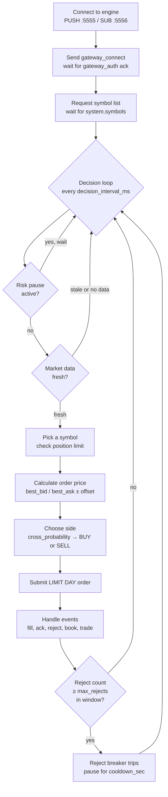
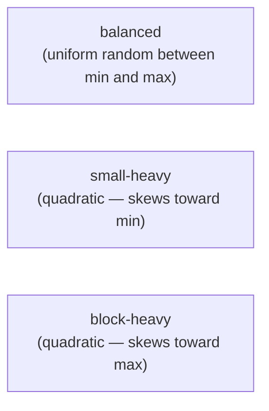
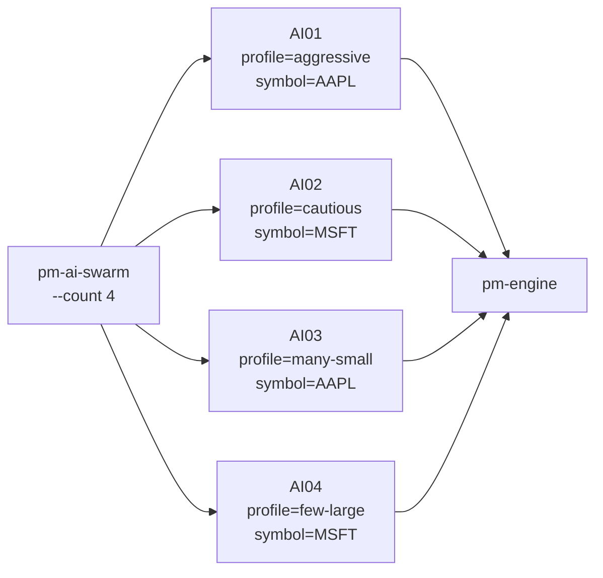

# AI Traders

!!! note "Learning objectives"
    After reading this page you will understand:

    - What `pm-ai-trader` and `pm-ai-swarm` are and when to use them
    - The four personality profiles and how they differ
    - How to launch a single bot or a swarm of bots
    - How bots manage risk (position limits, reject breaker)
    - How to configure your engine to allow AI gateway IDs
    - How to set up a realistic classroom simulation

    **Prerequisites**: [Running the Engine](03-running-the-engine.md) — the engine must be running
    before AI traders can connect.
    [Configuration](01-configuration.md) — AI traders connect as regular gateways; their IDs
    must be listed in `engine_config.yaml` (or the engine must be in unrestricted mode).

---

## What are the AI trader processes?

EduMatcher ships two processes that generate autonomous order flow:

| Process | Command | Purpose |
|---|---|---|
| `pm-ai-trader` | `poetry run pm-ai-trader` | A **single autonomous bot** — connects as a gateway, watches the book, submits limit orders |
| `pm-ai-swarm` | `poetry run pm-ai-swarm` | A **swarm launcher** — spawns `N` bots in one command, distributes profiles and symbols across them |

They are designed to simulate realistic human order behaviour so that a
classroom exchange has live activity even when students are not yet trading.
Each bot behaves differently — some trade frequently in small sizes, others
occasionally in large blocks — giving the order book variety and depth.

---

## How a bot works

Each bot is a fully independent participant. It connects to the engine via
ZeroMQ, authenticates as a gateway, requests the symbol list, then enters a
decision loop:



All orders are `LIMIT DAY` orders at prices derived from the current book.
AI traders **never** submit market orders, FOK, or IOC — only resting limit
orders that contribute to book depth.

---

## Personality profiles

A profile controls *how* the bot trades: how often, how large, and how
aggressively it crosses the spread. The four built-in profiles are:

| Profile | Decision interval | Order size | Cross probability | Offset | Size distribution | Character |
|---|---|---|---|---|---|---|
| `aggressive` | 250 ms | 20–120 | 35% | 0 ticks | balanced | Frequent trader; crosses the spread often; medium sizes |
| `cautious` | 900 ms | 10–60 | 5% | 2 ticks away | balanced | Slow, patient; rarely crosses; small passive orders |
| `many-small` | 180 ms | 1–25 | 18% | 1 tick away | small-heavy | High-frequency tiny orders; generates many executions |
| `few-large` | 1400 ms | 150–700 | 12% | 1 tick away | block-heavy | Infrequent institutional-style block orders |

**cross_probability** is the probability that the bot places a **marketable
limit order** (price ≥ best ask for a buy, price $\leq$ best bid for a sell) rather
than a passive limit order beyond the spread.

**passive_offset_ticks** is how many ticks *inside* the spread the passive
order is placed. Offset = 0 means posting at the best bid/ask; offset = 2 means
posting 2 ticks behind the best price.

### Size distributions



---

## Risk management

Each bot has two built-in safety mechanisms:

### Position limit

The bot tracks its own `position` per symbol (net quantity of shares held).
Once `|position|` reaches `max_position` (default: 1000), it stops adding to
the position in that direction. A long bot that is at +1000 will only submit
sell orders; a short bot at −1000 will only submit buy orders.

### Reject breaker

If the engine rejects `max_rejects` orders within `reject_window_sec`, the bot
pauses for `reject_cooldown_sec` before submitting again. This prevents a
misconfigured bot from flooding the engine with invalid orders.

```
[AI:AI01 14:30:05] reject breaker tripped; pausing submissions for 5.0s
```

---

## Launching a single bot

```bash
poetry run pm-ai-trader --id AI01 --profile aggressive
```

Common options:

| Option | Default | Description |
|---|---|---|
| `--id` | required | Gateway ID — must match an entry in `engine_config.yaml` or engine must be unrestricted |
| `--profile` | `cautious` | One of: `aggressive`, `cautious`, `many-small`, `few-large` |
| `--symbols` | all | Comma-separated list of symbols this bot watches; default is all symbols from engine |
| `--seed` | `1` | Random seed — same seed produces identical order sequence (useful for reproducibility) |
| `--duration` | `0` (forever) | Stop automatically after this many seconds |
| `--max-position` | `1000` | Absolute position limit per symbol |
| `--max-rejects` | `25` | Reject breaker threshold within the window |
| `--reject-window` | `10.0` | Rolling window in seconds for reject counting |
| `--reject-cooldown` | `5.0` | Pause duration in seconds after reject breaker trips |
| `--stale-data` | `4.0` | Seconds before market data is considered too old to trade on |

Example with all options:

```bash
poetry run pm-ai-trader \
  --id AI01 \
  --profile many-small \
  --symbols AAPL,MSFT \
  --seed 42 \
  --duration 120 \
  --max-position 500
```

The bot prints a summary on exit:

```
[AI:AI01 14:32:01] stopped submitted=284 acked=281 rejected=3 fills=68
```

---

## Launching a swarm

`pm-ai-swarm` starts `N` bots simultaneously, distributing profiles and symbols
round-robin:

```bash
poetry run pm-ai-swarm --count 10 --duration 60
```

The swarm assigns gateway IDs `AI01` through `AI10` automatically and cycles
through all four profiles.

### Swarm options

| Option | Default | Description |
|---|---|---|
| `--count` | `10` | Number of bots to launch |
| `--prefix` | `AI` | Gateway ID prefix (e.g. `BOT` → `BOT01`, `BOT02`, …) |
| `--start-index` | `1` | Starting index for gateway IDs |
| `--profiles` | all | Comma-separated profile cycle, e.g. `aggressive,cautious` |
| `--symbols` | all from config | Comma-separated symbols to trade |
| `--config` | `engine_config.yaml` | Path to config file used to discover symbols |
| `--seed-base` | `1000` | Seeds are `seed_base + i` for bot `i` |
| `--duration` | `60.0` | Seconds each bot runs; 0 = run until Ctrl-C |
| `--max-position` | `1000` | Position limit per bot per symbol |
| `--python` | current Python | Path to Python executable |



The swarm waits for all bots to finish (or until Ctrl-C), then exits. Each
bot's output is interleaved in the terminal.

!!! tip "Graceful shutdown"
    Pressing Ctrl-C sends SIGINT to the swarm process, which forwards it to all
    child bots.  Each bot cancels pending orders, prints its summary line, and
    disconnects cleanly.  A second Ctrl-C force-kills immediately.

---

## Configuring gateway IDs

### Unrestricted mode (no config file)

If you start the engine with no `engine_config.yaml`, any gateway ID can
connect and trade any symbol. This is the easiest way to test:

```bash
poetry run pm-engine               # unrestricted
poetry run pm-ai-swarm --count 5
```

### With a config file

Add the bot gateway IDs to the `gateways:` section. AI traders are ordinary
`TRADER` participants:

```yaml
symbols:
  AAPL:
    tick_decimals: 2
  MSFT:
    tick_decimals: 2

gateways:
  alf:
    - id: AI01
      description: AI bot 1
    - id: AI02
      description: AI bot 2
    - id: AI03
      description: AI bot 3
    # ... as many as --count
    - id: ST01
      description: Student 1
    - id: ST02
      description: Student 2
```

!!! tip "Using a range pattern"
    If you use the swarm default prefix `AI` and `--count 10`, the IDs will be
    `AI01` through `AI10`. Add all ten to your config. With `--start-index 1`
    (default) and `--prefix AI` the IDs are zero-padded to two digits.

---

## Classroom demo setup

A typical classroom simulation uses a swarm of bots to provide realistic
background order flow while students trade alongside them. The bots generate
price discovery, spread variation, and occasional large moves that students
must react to.

### Recommended setup

```yaml
# engine_config.yaml
sessions_enabled: true   # run opening and closing auctions

symbols:
  AAPL:
    tick_decimals: 2
    last_buy_price: 149.90
    last_sell_price: 150.10
  MSFT:
    tick_decimals: 2
    last_buy_price: 415.00
    last_sell_price: 415.50
  TSLA:
    tick_decimals: 2
    last_buy_price: 250.00
    last_sell_price: 250.50

gateways:
  alf:
    # Instructor / operator
    - id: OPS01
      description: Operator console
      role: ADMIN

    # Market maker (optional, adds liquidity)
    - id: MM01
      description: Market maker
      role: MARKET_MAKER
      quote_refresh_policy: INACTIVATE_ON_ANY_FILL
      enforce_mm_obligation: true
      mm_max_spread_ticks: 20
      mm_min_qty: 100

    # AI bots (30 bots, IDs AI01–AI30)
    - id: AI01
      description: AI bot 1
    - id: AI02
      description: AI bot 2
    # ... repeat through AI30

    # Students (adjust count for your class size)
    - id: ST01
      description: Student 1
    - id: ST02
      description: Student 2
    # ...
```

### Launch sequence

```bash
# Terminal 1: matching engine
poetry run pm-engine

# Terminal 2: session scheduler (opens at 09:30, closes at 16:00)
poetry run pm-scheduler

# Terminal 3: clearing and stats
poetry run pm-clearing &
poetry run pm-stats &

# Terminal 4: AI swarm (30 bots, all 4 profiles, run for 30 minutes)
poetry run pm-ai-swarm \
  --count 30 \
  --duration 1800 \
  --profiles aggressive,cautious,many-small,few-large

# Students connect individually
poetry run pm-alf-console --id ST01
```

For a quick demo without scheduling, use the launch script:

```bash
./tools/launch_all.sh
```

---

## Understanding bot output

Each bot prefixes every log line with its gateway ID and time:

```
[AI:AI01 14:30:00] authenticated
[AI:AI01 14:30:00] received 3 symbols: AAPL, MSFT, TSLA
[AI:AI01 14:30:00] trading AAPL
[AI:AI01 14:30:00] trading MSFT
[AI:AI01 14:30:00] trading TSLA
[AI:AI01 14:30:01] submitted BUY AAPL 45@149.97
[AI:AI01 14:30:01] reject breaker tripped; pausing submissions for 5.0s
[AI:AI01 14:31:59] stopped submitted=312 acked=308 rejected=4 fills=72
```

The `rejected` count typically reflects orders at prices outside the
collar or submitted during a halt; a count of 3–5 per 300 submissions is
normal. If the count is very high, check that the bot's gateway IDs are
configured in the engine.

---

## See also

- [Market-Maker Bot (pm-mm-bot)](17-mm-bot.md) — autonomous market-maker process; complements AI traders by providing liquidity
- [Running the Engine](03-running-the-engine.md) — startup order and launch scripts
- [Configuration](01-configuration.md) — how to register gateway IDs and symbols
- [Order Types](04-order-types.md) — AI bots submit LIMIT DAY orders only
- [Risk Controls](12-risk-controls.md) — price collars and halts that affect bot activity
- [Processes](10-processes.md) — where `pm-ai-trader` and `pm-ai-swarm` fit in the architecture
- [Getting Started](00-getting-started.md) — quick walkthrough including a swarm demo
