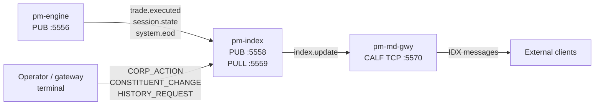

# Market Index (`pm-index`)

!!! note "Learning objectives"
    After reading this page you will understand:

    - What `pm-index` does and how it fits into the EduMatcher process model
    - How to start `pm-index` and which CLI options are available
    - How to configure one or more indices in `engine_config.yaml`
    - How cap-weighted index calculation and divisor normalisation work
    - How to apply corporate actions without disrupting the index level
    - How to query the current index value, structural/audit records, and
      level/EOD time-series history
    - Where state and history files are stored and how recovery works


## What this process is

`pm-index` is a standalone index calculation process. It subscribes to
trade events published by `pm-engine` and recomputes all configured indices
in real time. Calculated values are re-published on a dedicated ZMQ socket
so the market-data gateway (`pm-md-gwy`) can forward them to external
subscribers over the CALF `INDEX` channel.



`pm-index` does **not** connect to the engine PULL socket. It never sends
order or session commands to the engine — it only listens and publishes.


## Prerequisites

- `pm-engine` running
- At least one index defined in `engine_config.yaml`
- Every constituent symbol listed in `symbols:` with `outstanding_shares` set

`pm-index` can start before or after `pm-engine`; the ZMQ subscriber will
reconnect automatically. Order only matters for the first few seconds of a fresh
session — if `pm-index` misses early trades the reference prices from config are
used as fallback until real trades arrive.


## Starting `pm-index`

Installed mode:

```bash
pm-index
pm-index --config path/to/engine_config.yaml
pm-index --reset
```

Developer / Poetry mode:

```bash
poetry run pm-index
poetry run pm-index --config path/to/engine_config.yaml
poetry run pm-index --reset
```

### CLI options

| Option                      | Default              | Description                                                            |
|-----------------------------|----------------------|------------------------------------------------------------------------|
| `--config FILE` / `-c FILE` | `engine_config.yaml` | Path to the engine config YAML file                                    |
| `--reset`                   | off                  | Delete persisted state files and re-initialise all indices from config |
| `--log-level`               | `WARNING`            | Explicit level: `CRITICAL`, `ERROR`, `WARNING`, `INFO`, `DEBUG`        |
| `-v` / `--verbose`          | off                  | Increase verbosity (`-v` → `INFO`, `-vv` → `DEBUG`)                    |
| `-q` / `--quiet`            | off                  | Reduce output to warnings/errors                                        |

`--reset` is useful after:

- changing constituent lists or `base_value` in config
- replacing a corrupted state file
- starting a new multi-day session from a clean baseline

!!! warning "Use `--reset` with care"
    `--reset` deletes the divisor and all persisted last prices for every
    configured index. The index restarts from scratch using only the reference
    prices in the engine config. The structural/audit JSONL file is **not**
    deleted; only the small state JSON file is removed.


## Configuration

All index configuration lives in the top-level `indices:` section of
`engine_config.yaml`. See
[Engine Configuration](010-configuration.md#configuring-pm-index)
for the full field reference; a complete YAML example is shown below.

### Minimal example

```yaml
symbols:
  AAPL:
    tick_decimals: 2
    outstanding_shares: 15000000000
  MSFT:
    tick_decimals: 2
    outstanding_shares: 7400000000
  TSLA:
    tick_decimals: 2
    outstanding_shares: 3200000000

gateways:
  alf:
    - id: TRADER01
      role: TRADER
      disconnect_behaviour: CANCEL_ALL

indices:
  - id: EDU100
    description: "EduMatcher broad index"
    base_value: 1000.0
    publish_interval_sec: 1.0
    history_file: data/indexes/EDU100_history.jsonl
    state_file: data/indexes/EDU100_state.json
    constituents:
      - AAPL
      - MSFT
      - TSLA
```

### Field reference

| Field                  | Type   | Default                           | Description                                                                     |
|------------------------|--------|-----------------------------------|---------------------------------------------------------------------------------|
| `id`                   | string | —                                 | Alphanumeric index identifier; used in events, file names, and gateway commands |
| `description`          | string | —                                 | Human-readable label emitted in index events                                    |
| `base_value`           | float  | `1000.0`                          | Starting index level on first launch                                            |
| `publish_interval_sec` | float  | `1.0`                             | Throttle on how often `index.update` is broadcast                               |
| `history_file`         | string | `data/indexes/<ID>_history.jsonl` | Append-only JSONL **structural/audit trail** — corporate actions and constituent changes only, not level history (see [State and History](#state-and-history)) |
| `state_file`           | string | `data/indexes/<ID>_state.json`    | Checkpoint file for divisor and last prices                                     |
| `constituents`         | list   | —                                 | Symbols included in the index                                                   |

Constraints:

- Maximum **5** indices per config file
- Every constituent symbol must appear in `symbols:` with `outstanding_shares > 0`
- `id` values must be unique

!!! note "Index eligibility is set at listing (IPO)"
    `outstanding_shares` is what makes a symbol index-eligible, and it is part
    of the symbol's [initial listing
    (IPO)](010-configuration.md#adding-or-removing-symbols). Set it when you list
    the symbol; a constituent without a positive `outstanding_shares` is
    rejected at startup. Share counts change only through corporate actions
    (splits, issuance), not intra-day trading.

### Generating with `pm-config-gen`

`pm-config-gen` can emit the full `indices:` block automatically:

```bash
pm-config-gen \
  --symbols AAPL MSFT TSLA \
  --gateways TRADER01 OPS01:ADMIN \
  --outstanding-shares AAPL:15000000000 \
  --outstanding-shares MSFT:7400000000 \
  --outstanding-shares TSLA:3200000000 \
  --sessions-enabled \
  --index EDU100:"EduMatcher broad index" \
  --index-constituents EDU100:AAPL,MSFT,TSLA \
  --output engine_config.yaml
```

File paths are derived from the index ID automatically when `--index-history-file`
and `--index-state-file` are not specified.


## How Calculation Works

### Cap-weighted formula

Each index uses **market-capitalisation weighting**. A constituent's influence
on the index level is proportional to its total market value relative to all
other constituents:

$$
\text{aggregate\_cap} = \sum_{\text{sym} \in \text{constituents}} \text{last\_price}(\text{sym}) \times \text{outstanding\_shares}(\text{sym})
$$

$$
\text{index\_level} = \frac{\text{aggregate\_cap}}{\text{divisor}}
$$

A company trading at \$200 with 1 billion shares has a market cap of \$200 billion.
A company trading at \$100 with 500 million shares has a market cap of \$50 billion.
The first company contributes four times as much to the index level as the second.

### Divisor initialisation

On first startup (no persisted state), the divisor is chosen so the initial
index level equals `base_value`:

$$
\text{initial\_divisor} = \frac{\text{aggregate\_cap at launch}}{\text{base\_value}}
$$

Example with three stocks and `base_value = 1000`:

| Symbol    |  Price | Outstanding shares |            Market cap |
|-----------|-------:|-------------------:|----------------------:|
| AAPL      | 209.50 |     15,000,000,000 |     3,142,500,000,000 |
| MSFT      | 415.00 |      7,400,000,000 |     3,071,000,000,000 |
| TSLA      | 248.00 |      3,200,000,000 |       793,600,000,000 |
| **Total** |        |                    | **7,007,100,000,000** |

```
initial_divisor = 7,007,100,000,000 / 1000.0 = 7,007,100,000
```

The divisor is a large number, but the ratio `aggregate_cap / divisor` always
yields a level close to the configured `base_value`. After the first launch it
evolves only through explicit corporate-action adjustments.

### Update trigger

`pm-index` recalculates after every `trade.executed` message for a constituent
symbol. Trades in non-constituent symbols are ignored. The calculation is O(N)
in the number of constituents — fast enough for any educational exchange.

### Reference prices

When no trade has occurred for a constituent since startup, the seeded last
price from the engine config (`last_buy_price` / `last_sell_price`) is used as
the reference price. Once the first real trade arrives the reference price is
replaced by the actual trade price.

### Publish throttle

Recalculation happens on every trade, but publishing is throttled to
`publish_interval_sec` (default 1 s). The internal level is always up to date;
the throttle controls only how often `index.update` messages are broadcast.

### Intraday OHLC

`pm-index` tracks day open, high, and low internally. They are reset at
`OPENING_AUCTION` or `CONTINUOUS` session transitions and finalised with a
closing value when the session reaches `CLOSED`.


## Corporate Actions

Corporate actions change a company's share structure without destroying value.
Without divisor adjustment, a 2-for-1 stock split would make the index drop by
roughly half — which would be wrong because no value was lost.

The divisor is adjusted so the **index level is preserved at the moment of the
action**. Future price movements then reflect real value changes.

### Divisor adjustment formula

$$
\text{new\_divisor} = \text{old\_divisor} \times \frac{\text{new\_aggregate\_cap}}{\text{old\_aggregate\_cap}}
$$

This guarantees continuity:

$$
\frac{\text{new\_cap}}{\text{new\_divisor}} = \frac{\text{new\_cap}}{\text{old\_divisor} \times \frac{\text{new\_cap}}{\text{old\_cap}}} = \frac{\text{old\_cap}}{\text{old\_divisor}} \quad \checkmark
$$

### Supported corporate actions

| Action | `action` value | Required parameters | Effect |
|---|---|---|---|
| Stock split | `SPLIT` | `ratio_numerator`, `ratio_denominator` | Increases shares, reduces price by the same factor; divisor corrected for integer-rounding drift |
| Cash dividend | `CASH_DIVIDEND` | `dividend_per_share` | Reduces price by the dividend amount; divisor adjusted to preserve index level |
| Shares issuance | `SHARES_ISSUANCE` | `new_shares_outstanding` | Sets the new total share count; divisor adjusted upward to preserve index level |

### Applying corporate actions from a gateway terminal

Corporate actions are sent through an `ADMIN` gateway using the `CORP_ACTION`
command:

```
CORP_ACTION|INDEX=EDU100|SYM=AAPL|ACTION=SPLIT|NUM=2|DEN=1
CORP_ACTION|INDEX=EDU100|SYM=MSFT|ACTION=CASH_DIVIDEND|DIV=2.50
CORP_ACTION|INDEX=EDU100|SYM=TSLA|ACTION=SHARES_ISSUANCE|SHARES=3500000000
```

`pm-index` applies the action in-process, immediately publishes an updated index
value live, and writes a `CORP_ACTION` record to the structural/audit history file.

!!! important "Apply corporate actions before the market opens"
    It is safest to apply corporate actions during `PRE_OPEN` before trading
    starts for the day. Applying them during continuous trading means the index
    will have a brief moment where the pre-adjustment divisor is used for one
    more trade before the action takes effect.

### Constituent changes

Constituents can be added or removed without restarting `pm-index`:

```
CORP_ACTION|INDEX=EDU100|SYM=AMZN|ACTION=ADD|SHARES=10500000000|PRICE=195.00
CORP_ACTION|INDEX=EDU100|SYM=TSLA|ACTION=DELIST
```

Adding a constituent adjusts the divisor so the index level does not change at
the moment of addition. Delisting a constituent adjusts the divisor so the
remaining constituents continue smoothly.

Every corporate action and constituent change is written to the `history_file`
as a `CORP_ACTION`, `ADD_CONSTITUENT`, or `DELIST` record.


## State and History

### State file

`pm-index` writes a small JSON checkpoint file after every EOD and corporate
action:

```json
{
  "index_id": "EDU100",
  "description": "EduMatcher broad index",
  "divisor": 7007100000.0,
  "constituents": ["AAPL", "MSFT", "TSLA"],
  "last_prices": {
    "AAPL": 211.30,
    "MSFT": 418.50,
    "TSLA": 251.00
  },
  "day_open": 1042.10,
  "day_high": 1056.30,
  "day_low": 1040.05,
  "last_level": 1051.20,
  "last_updated": 1749760800.0
}
```

On restart, this file is loaded to restore the divisor and last prices.
If the `index_id` or constituent list in the file does not match the current
config, `pm-index` exits with an error. Use `--reset` to clear the state and
reinitialise from config.

### History file

The JSONL history file is a **structural/corporate-action audit log**, not a
level-history store. Only events that change an index's composition or
divisor are appended (one JSON object per line):

| Record type       | When written                                                                           |
|-------------------|----------------------------------------------------------------------------------------|
| `INIT`            | First-ever startup (no prior state); records `base_value`, `divisor`, constituent list |
| `CORP_ACTION`     | After every split, dividend, or shares-issuance adjustment                             |
| `ADD_CONSTITUENT` | After a new symbol is added to the index                                               |
| `DELIST`          | After a symbol is removed from the index                                               |

Example history file extract:

```jsonl
{"type": "INIT", "timestamp": 1749733100.0, "index_id": "EDU100", "base_value": 1000.0, "divisor": 7007100000.0, "constituents": ["AAPL", "MSFT", "TSLA"], "level": 1000.0}
{"type": "CORP_ACTION", "timestamp": 1749847200.0, "index_id": "EDU100", "symbol": "AAPL", "action": "SPLIT", "detail": "2:1", "old_divisor": 7007100000.0, "new_divisor": 7007100000.0, "level": 1051.20}
```

History files are not deleted by `--reset`. They accumulate across sessions and
provide a permanent structural audit trail.

!!! note "Level and EOD history live in pm-stats, not here"
    Every `index.update` broadcast — including the throttled intraday ticks and
    the forced end-of-day publish — is recorded by
    [`pm-stats`](140-statistics-and-reporting.md#index-level-history) in two
    SQLite tables: `index_level_snapshots` (every tick) and `index_daily_stats`
    (daily OHLC rollup). Query them with `pm-stats-cli index-snapshots` and
    `pm-stats-cli index-daily`. This JSONL file intentionally does **not**
    duplicate that data; it exists purely so operators can audit *why* an
    index's divisor changed (splits, dividends, constituent changes) without
    scanning a high-frequency time series.

    Note that `index_daily_stats.close_level` reflects the *most recent*
    update for that date, not necessarily the final close, until the day
    ends or `close_session_state` reads `CLOSED` — see
    [Getting the EOD index level for a date](140-statistics-and-reporting.md#getting-the-eod-index-level-for-a-date).


## Getting Index Values

### From a gateway terminal (`INDEX` command)

Connect through any `pm-alf-console` session (including `ADMIN` role) and run:

```
INDEX
```

Sample output:

```
[10:15:23.411] EDU100  1048.73  +6.63  +0.64%  O=1042.10 H=1056.30 L=1040.05  CONTINUOUS
```

!!! note ""
    `pm-index` must be running. If it is not, the gateway prints
    "No index data received yet. Is pm-index running?"

#### Structural/audit history queries

```
INDEX|HISTORY
```

Returns the last 30 days of structural/audit records (`INIT`, `CORP_ACTION`,
`ADD_CONSTITUENT`, `DELIST`) — corporate actions and constituent changes, not
level ticks.

```
INDEX|HISTORY|FROM=2026-06-01|TO=2026-06-12
```

Returns records within the given date range (inclusive). The response includes
one line per record, newest last.

!!! tip "Level/EOD history is a different tool"
    `INDEX|HISTORY` only returns structural/audit events. For index level or
    end-of-day time-series data, use `pm-stats-cli index-snapshots` or
    `pm-stats-cli index-daily` instead (see
    [Statistics and Reporting](140-statistics-and-reporting.md#index-level-history)).

!!! tip "Offline analysis with `pm-index-cli`"
    For richer filtering, CSV/JSON export, or scripting of structural/audit
    records, use `pm-index-cli` instead. It reads the JSONL history files
    directly without going through the gateway socket.

### From the market-data gateway (CALF)

If `pm-md-gwy` is running and connected to `pm-index`, external clients can
subscribe via the CALF `INDEX` channel:

```
HELLO|CLIENT=student01|PROTO=CALF1
SUB|CH=INDEX|SYM=EDU100
```

The gateway sends an initial `SNAP` and then live `IDX` messages:

```
SNAP|CH=INDEX|SYM=EDU100|SEQ=1|TS=2026-06-12T10:15:23.000Z|LEVEL=1048.73|OPEN=1042.10|HIGH=1056.30|LOW=1040.05|SESSION=CONTINUOUS
IDX|CH=INDEX|SYM=EDU100|SEQ=2|TS=2026-06-12T10:15:24.411Z|LEVEL=1051.20|CHG=+9.10|PCTCHG=+0.87|OPEN=1042.10|HIGH=1056.30|LOW=1040.05|AGGCAP=7368000000000|SESSION=CONTINUOUS
```

#### `IDX` message fields

| Field     | Type    | Description                                                         |
|-----------|---------|---------------------------------------------------------------------|
| `CH`      | string  | Always `INDEX`                                                      |
| `SYM`     | string  | Index ID (e.g. `EDU100`)                                            |
| `SEQ`     | int     | Monotonic sequence number for gap detection                         |
| `TS`      | string  | UTC ISO-8601 timestamp                                              |
| `LEVEL`   | decimal | Current index level                                                 |
| `CHG`     | decimal | Change from day open (signed); omitted before first open            |
| `PCTCHG`  | decimal | Percentage change from day open (signed); omitted before first open |
| `OPEN`    | decimal | Day open level; omitted during `PRE_OPEN` and `OPENING_AUCTION`     |
| `HIGH`    | decimal | Day high                                                            |
| `LOW`     | decimal | Day low                                                             |
| `AGGCAP`  | int     | Current aggregate market cap                                        |
| `SESSION` | string  | Current session state                                               |

### Using `pm-index-cli` for structural/audit records

`pm-index-cli` queries the structural/audit JSONL files directly from the
command line — no running `pm-index` process is needed. It does **not** have
level or EOD subcommands; use `pm-stats-cli` for that (next section).

```bash
# Corporate actions and constituent changes (all time)
pm-index-cli --config engine_config.yaml events --index EDU100

# Filter to a specific structural event type
pm-index-cli --config engine_config.yaml events --index EDU100 --type CORP_ACTION

# Export to CSV for import into a spreadsheet
pm-index-cli --config engine_config.yaml events --format csv > edu100_events.csv

# JSON output for scripting
pm-index-cli --config engine_config.yaml events --index EDU100 --format json \
  | python3 -c "import json,sys; [print(r['ts'], r['type'], r['detail']) for r in json.load(sys.stdin)]"

# Date-range query
pm-index-cli --config engine_config.yaml events \
  --index EDU100 --from 2026-06-01 --to 2026-06-25

# List all configured indices
pm-index-cli --config engine_config.yaml indices
```

See the [pm-index-cli reference](160-commands.md) for all subcommands, column
descriptions, and output-format options.

### Querying level/EOD history with `pm-stats-cli`

For index level ticks or daily OHLC history, use `pm-stats-cli` instead, which
reads from pm-stats' SQLite database:

```bash
# Daily open/high/low/close rollup
pm-stats-cli index-daily --index-id EDU100

# Raw level snapshots (every recorded tick) in a time window
pm-stats-cli index-snapshots --index-id EDU100 --from 2026-06-01 --to 2026-06-25

# List all index IDs that have recorded data
pm-stats-cli index-ids
```

See [Statistics and Reporting](140-statistics-and-reporting.md#index-level-history)
for the full command reference.

### Reading the structural/audit file directly

The JSONL file is plain text — one JSON object per line. This can be useful
for quick one-off inspections or when `pm-index-cli` is not available:

```bash
tail -20 data/indexes/EDU100_history.jsonl

# Corporate action records only
grep '"type": "CORP_ACTION"' data/indexes/EDU100_history.jsonl | python3 -m json.tool

# Structural records between two timestamps
python3 - <<'EOF'
import json
from_ts = 1749700000.0
to_ts   = 1749800000.0
with open("data/indexes/EDU100_history.jsonl") as f:
    for line in f:
        rec = json.loads(line)
        if from_ts <= rec["timestamp"] <= to_ts:
            print(f"{rec['timestamp']:.0f}  {rec['type']}  {rec.get('symbol', '')}")
EOF
```


## Example Configurations

### Single index, three constituents

```bash
pm-config-gen \
  --symbols AAPL MSFT TSLA \
  --gateways TRADER01 TRADER02 OPS01:ADMIN \
  --outstanding-shares AAPL:15000000000 \
  --outstanding-shares MSFT:7400000000 \
  --outstanding-shares TSLA:3200000000 \
  --sessions-enabled \
  --index EDU100:"EduMatcher broad index" \
  --index-constituents EDU100:AAPL,MSFT,TSLA \
  --output engine_config.yaml
```

### Two indices with different base values and publish rates

```bash
pm-config-gen \
  --symbols AAPL MSFT TSLA \
  --gateways TRADER01 OPS01:ADMIN \
  --outstanding-shares AAPL:15000000000 \
  --outstanding-shares MSFT:7400000000 \
  --outstanding-shares TSLA:3200000000 \
  --index BROAD:"Broad market" \
  --index-constituents BROAD:AAPL,MSFT,TSLA \
  --index-base-value BROAD:1000.0 \
  --index TECH2:"Technology pair" \
  --index-constituents TECH2:AAPL,MSFT \
  --index-base-value TECH2:500.0 \
  --index-interval TECH2:2.0 \
  --output engine_config.yaml
```

### Full manual YAML for two indices

```yaml
indices:
  - id: BROAD
    description: "Broad market"
    base_value: 1000.0
    publish_interval_sec: 1.0
    history_file: data/indexes/BROAD_history.jsonl
    state_file: data/indexes/BROAD_state.json
    constituents:
      - AAPL
      - MSFT
      - TSLA

  - id: TECH2
    description: "Technology pair"
    base_value: 500.0
    publish_interval_sec: 2.0
    history_file: data/indexes/TECH2_history.jsonl
    state_file: data/indexes/TECH2_state.json
    constituents:
      - AAPL
      - MSFT
```

## Operational Checklist

1. Ensure every constituent has `outstanding_shares` set in `symbols:`.
2. Create the `data/indexes/` directory before first run (or let `pm-index`
   create it automatically — it creates parent directories as needed).
3. Start `pm-engine` before `pm-index` during normal operations; `pm-index` will
   reconnect if the order is reversed but may miss the first few trades.
4. Use `--reset` only when deliberately changing the constituent list or
   `base_value`. This discards the divisor history for all indices.
5. Apply corporate actions during `PRE_OPEN` to avoid mid-session index jumps.
6. Check `data/indexes/<ID>_state.json` after a crash to confirm the divisor
   was persisted. If the file is missing or truncated, use `--reset`.
