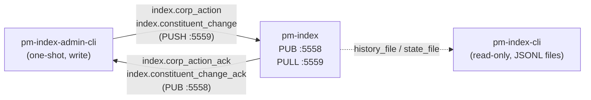

# Index Admin CLI (`pm-index-admin-cli`)

!!! note "Learning objectives"
    After reading this page you will understand:

    - Why corporate actions and constituent changes need a dedicated CLI
      instead of a hand-written script
    - The full set of subcommands: `split`, `dividend`, `shares`, `add`,
      `delist`, `history`
    - How `--dry-run`, confirmation prompts, and `--yes` work together to make
      mutations safe
    - How the `shares` subcommand models buy-backs using `--delta`
    - Why this tool talks only to `pm-index`, not to `pm-engine`, and what
      that means for authentication


## What this tool is

`pm-index-admin-cli` is a one-shot command-line tool for applying corporate
actions (splits, cash dividends, share issuances and buy-backs) and
constituent changes (add / delist) to a running `pm-index` process. It
replaces the "write a short script" workaround described in
[Market Index — Applying corporate actions](150-index.md#applying-corporate-actions):
every action that script could perform is now a documented subcommand with
`--help` text, client-side validation, a confirmation prompt, and a
`--dry-run` preview mode.



Under the hood, `pm-index-admin-cli` is built directly on the same
`ExchangeCommandClient` class `pm-admin-cli` uses for engine commands —
specifically its `index_corp_action()`, `index_delist()`,
`index_add_constituent()`, and `index_history()` methods. No engine-side or
`pm-index`-side code changes were needed to add this tool; it is a pure
client addition. See
[EduMatcher — Index Admin CLI Design Proposal](../../docs-design/EduMatcher-index-admin-cli.md)
for the full design rationale.


## Why not `pm-index-cli`?

[`pm-index-cli`](160-commands.md) already exists as a **read-only** query
tool over `pm-index`'s history/state JSONL files — it never touches the live
ZMQ bus. Corporate actions are a live, mutating operation against a running
process, which is a different responsibility, so it lives in a separate
binary rather than a write mode bolted onto `pm-index-cli`. This mirrors the
existing split between `pm-admin`/`pm-admin-cli` (mutating engine commands)
and `pm-stats-cli`/`pm-clearing-cli`/`pm-audit-cli`/`pm-index-cli` (read-only
query tools): a command that can change exchange state gets its own
explicitly-named entry point so the blast radius of a mistyped command is
obvious from the binary name alone.


## Why there is no `connect()` / authentication step

Unlike `pm-admin-cli`, which authenticates against the engine's PUSH/PULL
socket (`system.gateway_connect` → `system.gateway_auth`) before running a
command, `pm-index-admin-cli` sends directly — there is no handshake.

`pm-index`'s PULL socket (port `5559`) has no authentication of any kind: no
ZAP/CURVE, no gateway allowlist, and no role check. It only verifies that the
`gateway_id` field on an inbound message is non-empty before processing it —
the field is used purely as an ack-routing key (which SUB topic to reply on),
never as an identity or permission check. This is documented in
[Exchange Commands — PUSH socket has no authentication](160-commands.md) for
the engine's own socket, and the index socket has even less: it doesn't even
have the engine's payload-level `role: ADMIN` check.

Practically, this means `--id` on `pm-index-admin-cli` is a free-text label,
not a credential — any non-empty value is accepted by `pm-index`, though
using a real gateway ID makes acks easier to correlate in logs. Any process
that can reach `tcp://127.0.0.1:5559` (localhost-only by default) can already
apply corporate actions, whether through this CLI or a hand-written script;
this tool does not change that exposure. The confirmation-prompt-by-default
behaviour described below is a safeguard against accidental or scripted
mistakes, not against malicious use — appropriate for a learning system
running on localhost.


## Starting point

```bash
pm-index-admin-cli --id OPS01 COMMAND [options]
```

`pm-index` must already be running and reachable (default
`tcp://127.0.0.1:5559` for commands, `tcp://127.0.0.1:5558` for acks).
`pm-engine` does not need to be running for this tool specifically, though in
practice you will normally have both up since `pm-index` itself depends on
`pm-engine`'s trade feed to do anything useful.

**Global options:**

| Flag | Default | Description |
|---|---|---|
| `--id` | *(required)* | Ack-routing label. Not authenticated — see above. |
| `--push` | `tcp://127.0.0.1:5559` | `pm-index` PULL socket address |
| `--sub` | `tcp://127.0.0.1:5558` | `pm-index` PUB socket address |
| `--timeout` | `3000` | Ack timeout in milliseconds |
| `--dry-run` | off | Validate and print the outbound payload; do not send it |
| `-y`, `--yes` | off | Skip the confirmation prompt |
| `--format` | `table` | Output format: `table` (human-readable) or `json` |

**Exit codes:**

| Code | Meaning |
|---|---|
| `0` | Accepted by `pm-index` (or `--dry-run` validated cleanly) |
| `1` | Rejected by `pm-index`, ack timeout, or the confirmation prompt was declined |
| `2` | Usage error — bad flags or a client-side validation failure |


## Unknown index ID fails fast

If `--index` does not match any configured index, `pm-index` replies with a
generic error on `index.error.<gateway_id>` rather than the normal ack topic
for the command (`index.corp_action_ack.<gateway_id>` /
`index.constituent_change_ack.<gateway_id>` / `index.history.<gateway_id>`).
`ExchangeCommandClient` recognizes this side-channel reply for every index
method and raises immediately instead of waiting out the full `--timeout`
for an ack that will never arrive:

```bash
$ pm-index-admin-cli --id OPS01 split --index NOPE --sym AAPL --ratio 2:1 --yes
REJECTED  Unknown index_id 'NOPE'
```

`--format json` prints the raw error payload instead of the summary line,
consistent with every other rejection:

```bash
$ pm-index-admin-cli --id OPS01 --format json split --index NOPE --sym AAPL --ratio 2:1 --yes
{
  "accepted": false,
  "reason": "Unknown index_id 'NOPE'",
  "timestamp": 1784500215.39
}
```

Under the hood, this is implemented as an `error_prefix` parameter on
`ExchangeCommandClient._recv()`: each index method passes
`index.error.<gateway_id>` alongside its normal expected ack prefix, and a
matching reply raises `CommandError` (a new exception distinct from
`CommandTimeoutError`) with the error payload attached. `pm-index-admin-cli`
catches `CommandError` in `main()` and reports it exactly like a normal
`accepted=False` rejection. This is a client-library-level fix — it applies
to any caller of `index_corp_action()`, `index_delist()`,
`index_add_constituent()`, or `index_history()`, not just this CLI.

A genuine unreachable-`pm-index` timeout (no reply of any kind) is
unaffected and still produces the original timeout message:

```bash
$ pm-index-admin-cli --id OPS01 --push tcp://127.0.0.1:59999 split --index TECH10 --sym AAPL --ratio 4:1 --yes
Timed out waiting for pm-index: No ack with prefix 'index.corp_action_ack.OPS01' within 3000 ms
Is pm-index running and reachable at tcp://127.0.0.1:59999?
```


## Confirmation prompts and `--dry-run`

Every mutating subcommand (`split`, `dividend`, `shares`, `add`, `delist`)
prints a description of the action and asks `Continue? [y/N]` before sending
anything. `-y`/`--yes` skips the prompt for scripted use. If stdin is not a
TTY and `--yes` was not passed, the tool prints an error and exits `1` rather
than hanging — this matters for CI/cron use.

`--dry-run` prints the exact outbound topic and JSON payload and exits `0`
without sending anything or prompting. Use it to check a `--ratio` parse or a
`--delta`-resolved share count before committing:

```bash
$ pm-index-admin-cli --id OPS01 split --index TECH10 --sym AAPL --ratio 4:1 --dry-run
DRY RUN — would send topic='index.corp_action'
{
  "action": "SPLIT",
  "gateway_id": "OPS01",
  "index_id": "TECH10",
  "ratio_denominator": 1,
  "ratio_numerator": 4,
  "symbol": "AAPL"
}
```

`history` is read-only and never prompts, regardless of `--yes`.


## Subcommand reference

### `split` — Apply a stock split

```bash
pm-index-admin-cli --id OPS01 split --index TECH10 --sym AAPL --ratio 4:1
```

| Flag | Required | Description |
|---|---|---|
| `--index` | Yes | Index ID |
| `--sym` | Yes | Constituent symbol |
| `--ratio` | Yes | `N:M` split ratio, e.g. `4:1` for a 4-for-1 split, `1:10` for a 1-for-10 reverse split. Both components must be positive integers — validated locally before anything is sent. |

```bash
$ pm-index-admin-cli --id OPS01 split --index TECH10 --sym AAPL --ratio 4:1
This will apply a SPLIT (4:1) to AAPL in index TECH10. Continue? [y/N] y
SPLIT OK   TECH10  AAPL  ratio=4:1  new_level=8452.17  new_divisor=118.3352
```

### `dividend` — Apply a cash dividend

```bash
pm-index-admin-cli --id OPS01 dividend --index TECH10 --sym MSFT --amount 0.75
```

| Flag | Required | Description |
|---|---|---|
| `--index` | Yes | Index ID |
| `--sym` | Yes | Constituent symbol |
| `--amount` | Yes | Dividend per share, in price units. Must be `> 0` (checked locally; `pm-index` separately rejects if the resulting price would be non-positive). |

```bash
$ pm-index-admin-cli --id OPS01 dividend --index TECH10 --sym MSFT --amount 500 --yes
REJECTED  Resulting price for MSFT would be non-positive (-88.50)
```

### `shares` — Set shares outstanding (issuance or buy-back)

```bash
pm-index-admin-cli --id OPS01 shares --index TECH10 --sym AAPL --new-shares 15200000000
```

| Flag | Required | Description |
|---|---|---|
| `--index` | Yes | Index ID |
| `--sym` | Yes | Constituent symbol |
| `--new-shares` | One of these two | New absolute total shares outstanding |
| `--delta` | One of these two | Signed change from the last known share count (negative for a buy-back, positive for an issuance) |

`pm-index` has no dedicated `BUYBACK` action — only `SHARES_ISSUANCE`, which
always sets an absolute share count regardless of direction (see
[Market Index — Supported corporate actions](150-index.md#supported-corporate-actions)).
`--delta` is a CLI-side convenience: it looks up the constituent's last
recorded `SHARES_ISSUANCE` value via `history`, applies the signed delta, and
shows the computed absolute value before sending. If no prior share count is
on record for that symbol (for example, right after `add`, before any
`SHARES_ISSUANCE` has ever been applied), `--delta` cannot resolve and the
command fails with a clear message telling you to use `--new-shares`
instead.

```bash
$ pm-index-admin-cli --id OPS01 shares --index TECH10 --sym AAPL --delta -800000000
Last known shares_outstanding for AAPL: 16,000,000,000
This will set shares_outstanding to 15,200,000,000 (delta -800,000,000, a buy-back). Continue? [y/N] y
SHARES_ISSUANCE OK   TECH10  AAPL  new_shares_outstanding=15,200,000,000  new_level=8401.09  new_divisor=118.1187
```

### `add` — Add a constituent

```bash
pm-index-admin-cli --id OPS01 add --index TECH10 --sym NVDA --shares 2470000000 --price 118.50
```

| Flag | Required | Description |
|---|---|---|
| `--index` | Yes | Index ID |
| `--sym` | Yes | Symbol to add |
| `--shares` | Yes | Initial shares outstanding. Must be `> 0`. |
| `--price` | Yes | Initial reference price. Must be `> 0`. |

!!! warning "The symbol must already be tradeable"
    `pm-index` does not check that `--sym` is a configured, tradeable
    symbol in `engine_config.yaml` — it only tracks it as an index
    constituent. If the symbol doesn't exist elsewhere in the config, it
    will be added to the index but never receive live price updates. The
    confirmation prompt states this requirement, but `pm-index-admin-cli`
    has no `--config` flag and cannot verify it for you.

### `delist` — Remove a constituent

```bash
pm-index-admin-cli --id OPS01 delist --index TECH10 --sym XYZ
```

| Flag | Required | Description |
|---|---|---|
| `--index` | Yes | Index ID |
| `--sym` | Yes | Symbol to delist |

Delisting the last remaining constituent of an index is rejected by
`pm-index` (it would zero out the index's aggregate market cap):

```bash
$ pm-index-admin-cli --id OPS01 delist --index TECH10 --sym AAPL --yes
REJECTED  Cannot delist AAPL: index TECH10 would have no remaining constituents
```

`delist` has no undo. Re-adding a delisted symbol requires supplying
`--shares`/`--price` again via `add` — the confirmation prompt calls this
out explicitly.

### `history` — Show recent structural/corp-action history

```bash
pm-index-admin-cli --id OPS01 history --index TECH10 --limit 20
```

| Flag | Required | Default | Description |
|---|---|---|---|
| `--index` | Yes | — | Index ID |
| `--from` | No | 24h ago | Start of range, as a Unix timestamp |
| `--to` | No | now | End of range, as a Unix timestamp |
| `--types` | No | all | Comma-separated filter: `INIT`, `CORP_ACTION`, `DELIST`, `ADD_CONSTITUENT` |
| `--limit` | No | `50` | Maximum rows shown |

This is the same underlying `index.history_request` used by
`INDEX|HISTORY` in `pm-alf-console` (see
[Market Index — Structural/audit history queries](150-index.md#structuralaudit-history-queries)),
wrapped here so you can confirm an action landed without switching tools.
Unlike `pm-index-cli events`, which reads the JSONL file directly from disk
and needs no running process, `history` here round-trips through the live
`pm-index` process.

```bash
$ pm-index-admin-cli --id OPS01 history --index TECH10 --limit 3
  2026-07-19T09:15:02Z  CORP_ACTION     AAPL     SPLIT 4:1 -> level=8452.17
  2026-07-18T14:02:11Z  CORP_ACTION     AAPL     SHARES_ISSUANCE 16000000000 -> level=8390.02
  2026-07-15T09:30:00Z  ADD_CONSTITUENT NVDA     shares=2,470,000,000 price=118.50
```

`--format json` prints the raw record list instead:

```bash
pm-index-admin-cli --id OPS01 --format json history --index TECH10 --limit 3
```


## Output formats

Default (`--format table`) output is a single-line
`<COMMAND> OK   <fields>` summary on success, or a `REJECTED   <reason>` line
on failure — the same convention `pm-admin-cli` uses. `--format json` prints
the raw ack payload (or, for `history`, a JSON array of records) instead,
for scripting:

```bash
$ pm-index-admin-cli --id OPS01 --format json split --index TECH10 --sym AAPL --ratio 4:1 --yes
{
  "accepted": true,
  "divisor": 118.3352,
  "index_id": "TECH10",
  "level": 8452.17,
  "reason": ""
}
```


## Typical operator workflow

A full pre-market corporate-action sequence, applied before `PRE_OPEN` ends
(see [Market Index — Apply corporate actions before the market opens](150-index.md#applying-corporate-actions)):

```bash
# Preview first
pm-index-admin-cli --id OPS01 split --index TECH10 --sym AAPL --ratio 4:1 --dry-run

# Apply the split
pm-index-admin-cli --id OPS01 split --index TECH10 --sym AAPL --ratio 4:1

# Apply a cash dividend to a different constituent
pm-index-admin-cli --id OPS01 dividend --index TECH10 --sym MSFT --amount 0.75

# Retire a delisted constituent
pm-index-admin-cli --id OPS01 delist --index TECH10 --sym XYZ

# Add its replacement
pm-index-admin-cli --id OPS01 add --index TECH10 --sym NVDA --shares 2470000000 --price 118.50

# Confirm everything landed
pm-index-admin-cli --id OPS01 history --index TECH10 --limit 10
```

For scripted/CI use (a nightly batch job applying pre-approved actions from
another system), pass `--yes` on every mutating call and check the process
exit code:

```bash
#!/usr/bin/env bash
set -e
pm-index-admin-cli --id BATCH01 --yes shares --index TECH10 --sym AAPL --delta -800000000
pm-index-admin-cli --id BATCH01 --yes dividend --index TECH10 --sym MSFT --amount 0.75
```


## Further Reading

- [Market Index](150-index.md) — `pm-index` process, corporate-action
  semantics, divisor math, and the state/history file formats this tool
  writes to
- [Exchange Commands](160-commands.md) — `pm-admin-cli`, `ExchangeCommandClient`,
  and the sibling `pm-index-cli` read-only query tool
- [Processes](170-processes.md) — full process/command reference table
- [EduMatcher — Index Admin CLI Design Proposal](../../docs-design/EduMatcher-index-admin-cli.md) —
  full design rationale, including alternatives considered and open questions
