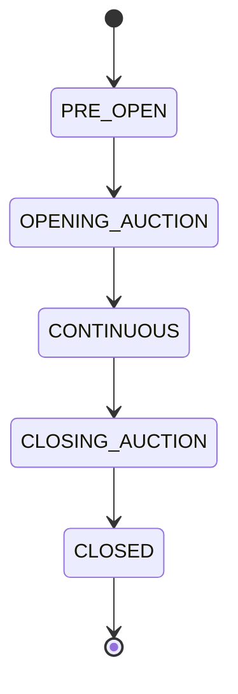

# Exchange Commands

!!! note "Learning objectives"
    After reading this page you will understand:

    - What Exchange Commands are and how they differ from raw ZeroMQ messages
    - How to build an operator client that wraps the message layer
    - The full catalogue of commands available to an `ADMIN`-role gateway
    - Which commands are ADMIN-restricted and which any connected gateway may send
    - How to extend the framework with new commands as the exchange evolves
    - How to actively manage an exchange

    **Prerequisites**: [Messages](270-messages.md) for the raw two-frame format.
    [Risk Controls](120-risk-controls.md#admin-role-operator-controls) for
    the halt/resume operational flow.


## Concept

Every engine interaction is ultimately a two-frame ZeroMQ multipart message:

```
frame[0]  b"<topic>"
frame[1]  b'{"field": "value", ...}'
```

**Exchange Commands** are a thin Python wrapper layer that turns those frames
into named method calls.  They exist so that operators can control the exchange
without writing raw socket code, and so that the growing set of operator
interactions has a single, consistent home that can be extended with new
commands as the system evolves.

```
Operator script
    └─ ExchangeCommandClient.halt_all()
            └─ PUSH  b"risk.circuit_breaker_halt_all"  {"gateway_id": "GW_ADMIN"}
            └─ SUB   b"risk.circuit_breaker_halt_all_ack.GW_ADMIN"  ← ack
```

The client holds a PUSH socket (port **5555**) for commands and a SUB socket
(port **5556**) for receiving acks and events.

### How to send ADMIN commands

There are three ways to issue exchange commands, suited to different workflows:

| Tool                    | What it is                                       | Best for                                               |
|-------------------------|--------------------------------------------------|--------------------------------------------------------|
| `pm-admin`              | Interactive REPL with tab completion and history | Human operator — incident response, market supervision |
| `pm-admin-cli`          | Single-shot CLI command, exits with code 0/1     | Scripting, CI/CD, automation pipelines                 |
| `ExchangeCommandClient` | Python API class                                 | Custom operator tooling, integration tests             |

All three share the **same command execution logic** (`execute_command` in
`src/edumatcher/commands/console.py`), so adding a new exchange command only
requires changes in one place.


## ADMIN console (`pm-admin`)

For operators who want to control the exchange **without writing Python code**,
EduMatcher ships a dedicated interactive console:

```bash
poetry run pm-admin --id GW_ADMIN
```

The gateway ID must match an entry in `engine_config.yaml` with `role: ADMIN`.

### What you see at startup

```
ADMIN console — GW_ADMIN connected  Exchange operator (read/write)
Type HELP for commands.  Tab=complete  ↑↓=history  Ctrl-C=exit

[GW_ADMIN|ADMIN]>
```

The prompt is red to distinguish it from the regular `pm-alf-console` prompt.
Tab completion and arrow-key history work exactly as in `pm-alf-console`.

### Console command syntax

Commands follow the same `CMD|KEY=VALUE|KEY=VALUE` pipe syntax as the ALF
gateway command language (see [ALF Protocol Reference](900-app-alf-protocol.md)).
Single-word commands (no arguments) need no pipes.

| Command | Syntax | Notes |
|---|---|---|
| `HALT` | `HALT` | Exchange-wide circuit-breaker halt — requires ADMIN |
| `RESUME` | `RESUME` | Lift the exchange-wide halt — requires ADMIN |
| `HALT_SYM` | `HALT_SYM\|SYM=AAPL` | Halt trading on a single symbol — requires ADMIN |
| `RESUME_SYM` | `RESUME_SYM\|SYM=AAPL` | Resume a single halted symbol — requires ADMIN |
| `CANCEL_SYM` | `CANCEL_SYM\|SYM=AAPL` | Cancel **all** resting orders for a symbol across every gateway — requires ADMIN |
| `KILL` | `KILL\|GW=TRADER01` or `KILL\|GW=TRADER01\|SYM=AAPL` | Cancel all orders/quotes for a gateway (optional: scope to one symbol) |
| `KICK` | `KICK\|GW=TRADER01` or `KICK\|GW=TRADER01\|REASON=Compliance hold` | Forcefully disconnect a gateway |
| `QCANCEL` | `QCANCEL\|GW=MM01\|SYM=AAPL` | Cancel an MM's active quote on one symbol |
| `BOOK` | `BOOK\|SYM=AAPL` | Print L1/L2 order-book snapshot |
| `ORDERS` | `ORDERS\|GW=TRADER01` | List resting orders for a gateway |
| `SYMBOLS` | `SYMBOLS` | List all instruments configured in the engine |
| `SESSION` | `SESSION\|STATE=CONTINUOUS` | Advance session phase |
| `SESSION_STATUS` | `SESSION_STATUS` | Show the current session state (read-only) |
| `SCHEDULE` | `SCHEDULE` | Show the automatic session-transition schedule |
| `GATEWAYS` | `GATEWAYS` | List all configured gateways and connection status |
| `VOLUME` | `VOLUME` | Show daily traded volume per symbol and in total |
| `HELP` | `HELP` | Show the command reference |
| `EXIT` / `QUIT` | `EXIT` | Disconnect and exit |

### Example session

```
[GW_ADMIN|ADMIN]> SYMBOLS
┌─────────────────────────────┐
│   Configured instruments    │
├────┬────────────────────────┤
│ #  │ Symbol                 │
├────┼────────────────────────┤
│ 1  │ AAPL                   │
│ 2  │ MSFT                   │
│ 3  │ TSLA                   │
└────┴────────────────────────┘

[GW_ADMIN|ADMIN]> BOOK|SYM=AAPL
┌──────────────────────────────────────────────────────┐
│               Order Book — AAPL                      │
├────────────┬────────────┬────────────┬───────────────┤
│   Bid Qty  │  Bid Price │  Ask Price │       Ask Qty │
├────────────┼────────────┼────────────┼───────────────┤
│        300 │     149.50 │     150.00 │           100 │
│        200 │     149.25 │     150.25 │           250 │
└────────────┴────────────┴────────────┴───────────────┘
  Last trade: 149.75 × 200

[GW_ADMIN|ADMIN]> HALT
HALTED  3 symbol(s), 6 quote leg(s) cancelled

[GW_ADMIN|ADMIN]> KILL|GW=TRADER01
KILL OK  TRADER01  orders=4  quotes=0

[GW_ADMIN|ADMIN]> ORDERS|GW=TRADER01
No resting orders for TRADER01

[GW_ADMIN|ADMIN]> RESUME
RESUMED  3 symbol(s)

[GW_ADMIN|ADMIN]> SESSION_STATUS
  Session state     : CONTINUOUS
  Auto-scheduling   : ON

[GW_ADMIN|ADMIN]> VOLUME
┌────────────┬──────────────┬──────────────────┬────────┐
│ Symbol     │          Qty │            Value │ Trades │
├────────────┼──────────────┼──────────────────┼────────┤
│ AAPL       │        5,000 │      750,000.00  │     12 │
│ MSFT       │        3,200 │      576,000.00  │      8 │
├────────────┼──────────────┼──────────────────┼────────┤
│ TOTAL      │        8,200 │    1,326,000.00  │     20 │
└────────────┴──────────────┴──────────────────┴────────┘

[GW_ADMIN|ADMIN]> EXIT
ADMIN console GW_ADMIN disconnected.
```

### Relationship to the other operator tools

`pm-admin`, `pm-admin-cli`, and `ExchangeCommandClient` all share the
same `execute_command()` function.  Every command maps 1-to-1:

| Console (`pm-admin`)   | CLI (`pm-admin-cli`)     | Python API                             |
|------------------------|--------------------------|----------------------------------------|
| `HALT`                 | `halt`                   | `client.halt_all()`                    |
| `RESUME`               | `resume`                 | `client.resume_all()`                  |
| `HALT_SYM\|SYM=X`      | `halt-sym --sym X`       | `client.symbol_halt("X")`              |
| `RESUME_SYM\|SYM=X`    | `resume-sym --sym X`     | `client.symbol_resume("X")`            |
| `CANCEL_SYM\|SYM=X`    | `cancel-sym --sym X`     | `client.cancel_symbol("X")`            |
| `KILL\|GW=X\|SYM=Y`    | `kill --gw X --sym Y`    | `client.kill_switch("X", symbol="Y")`  |
| `KICK\|GW=X\|REASON=Z` | `kick --gw X --reason Z` | `client.gateway_kick("X", reason="Z")` |
| `QCANCEL\|GW=X\|SYM=Y` | `qcancel --gw X --sym Y` | `client.quote_cancel("X", "Y")`        |
| `BOOK\|SYM=X`          | `book --sym X`           | `client.book_depth("X")`               |
| `ORDERS\|GW=X`         | `orders --gw X`          | `client.order_list("X")`               |
| `SYMBOLS`              | `symbols`                | `client.symbol_list()`                 |
| `SESSION\|STATE=X`     | `session --state X`      | `client.session_advance("X")`          |
| `SESSION_STATUS`       | `session-status`         | `client.session_status()`              |
| `SCHEDULE`             | `schedule`               | `client.session_schedule()`            |
| `GATEWAYS`             | `gateways`               | `client.gateway_list()`                |
| `VOLUME`               | `volume`                 | `client.volume()`                      |

Use `pm-admin` for interactive human-driven operations, `pm-admin-cli` for
scripting and automation, and `ExchangeCommandClient` for custom Python tooling.


## CLI tool (`pm-admin-cli`)

`pm-admin-cli` sends **one command per invocation** and exits.  It is designed
for shell scripts, CI/CD pipelines, and automation where you want the
exchange to be driven non-interactively.

```bash
poetry run pm-admin-cli --id GW_ADMIN <subcommand> [options]
```

Exit code is **0** on success and **1** on failure (auth refused, engine
rejection, or timeout).  This makes it safe to use in `set -e` shell scripts.

### Global flags

| Flag | Default | Description |
|---|---|---|
| `--id GW_ID` | *(required)* | ADMIN gateway ID (must match `engine_config.yaml`) |
| `--push ADDR` | `tcp://127.0.0.1:5555` | Engine PULL socket address |
| `--sub ADDR` | `tcp://127.0.0.1:5556` | Engine PUB socket address |
| `--timeout MS` | `3000` | Ack wait timeout in milliseconds |

### Subcommands

#### `halt` — Exchange-wide halt

```bash
pm-admin-cli --id GW_ADMIN halt
```
```
HALTED  3 symbol(s), 6 quote leg(s) cancelled
```
Requires `role: ADMIN`.  Exit code 0 if accepted, 1 if rejected.


#### `resume` — Lift the exchange-wide halt

```bash
pm-admin-cli --id GW_ADMIN resume
```
```
RESUMED  3 symbol(s)
```
Requires `role: ADMIN`.


#### `halt-sym` — Halt trading on a single symbol

```bash
pm-admin-cli --id GW_ADMIN halt-sym --sym AAPL
```
```
HALTED  AAPL  0 quote leg(s) cancelled
```
Halts only the specified symbol.  All other symbols continue trading.  Any
active MM quote legs for that symbol are cancelled.  The symbol remains halted
until `resume-sym` is called.  Requires `role: ADMIN`.

| Flag           | Required | Description    |
|----------------|----------|----------------|
| `--sym SYMBOL` | yes      | Symbol to halt |


#### `resume-sym` — Resume a single halted symbol

```bash
pm-admin-cli --id GW_ADMIN resume-sym --sym AAPL
```
```
RESUMED  AAPL
```
Resumes a symbol halted by `halt-sym` **or** by an automatic circuit-breaker
trigger.  Requires `role: ADMIN`.

| Flag | Required | Description |
|---|---|---|
| `--sym SYMBOL` | yes | Symbol to resume |


#### `cancel-sym` — Cancel all resting orders for a symbol

```bash
pm-admin-cli --id GW_ADMIN cancel-sym --sym AAPL
```
```
CANCEL_SYM OK  AAPL  orders=12  quotes=2
```
Cancels **every** resting order and active quote for `AAPL` across all
connected gateways.  This is an emergency book-clearing command — unlike
`kill`, which targets a single gateway, `cancel-sym` clears the entire
order book for one symbol regardless of who placed the orders.  The symbol
remains in its current halt state; no halt or resume is triggered.
Requires `role: ADMIN`.

| Flag           | Required | Description                   |
|----------------|----------|-------------------------------|
| `--sym SYMBOL` | yes      | Symbol whose orders to cancel |


#### `kill` — Cancel all orders/quotes for a gateway

```bash
# All symbols
pm-admin-cli --id GW_ADMIN kill --gw TRADER01

# Scoped to one symbol
pm-admin-cli --id GW_ADMIN kill --gw TRADER01 --sym AAPL
```
```
KILL OK  TRADER01  orders=4  quotes=0
```

| Flag           | Required | Description                        |
|----------------|----------|------------------------------------|
| `--gw GW_ID`   | yes      | Target gateway to cancel for       |
| `--sym SYMBOL` | no       | Scope to one symbol (omit for all) |


#### `kick` — Forcefully disconnect a gateway

```bash
pm-admin-cli --id GW_ADMIN kick --gw TRADER01
pm-admin-cli --id GW_ADMIN kick --gw TRADER01 --reason "Compliance hold"
```
No ack is published.  Exit code is always 0 if the engine is reachable.
Verify with `orders --gw TRADER01`.

| Flag            | Required | Description                              |
|-----------------|----------|------------------------------------------|
| `--gw GW_ID`    | yes      | Target gateway to disconnect             |
| `--reason TEXT` | no       | Reason string recorded in the engine log |


#### `qcancel` — Cancel a market-maker's active quote on one symbol

```bash
pm-admin-cli --id GW_ADMIN qcancel --gw MM01 --sym AAPL
```
```
QCANCEL OK  MM01  AAPL
```
Cancels both bid and ask legs of the active quote.  Resting limit orders
are unaffected.  Use `kill` to also remove those.


#### `book` — Print the order-book snapshot for a symbol

```bash
pm-admin-cli --id GW_ADMIN book --sym AAPL
```
```
┌──────────────────────────────────────────────────────┐
│               Order Book — AAPL                      │
├────────────┬────────────┬────────────┬───────────────┤
│   Bid Qty  │  Bid Price │  Ask Price │       Ask Qty │
├────────────┼────────────┼────────────┼───────────────┤
│        300 │     149.50 │     150.00 │           100 │
│        200 │     149.25 │     150.25 │           250 │
└────────────┴────────────┴────────────┴───────────────┘
  Last trade: 149.75 × 200
```


#### `orders` — List resting orders for a gateway

```bash
pm-admin-cli --id GW_ADMIN orders --gw TRADER01
```

Useful to confirm a `kill` or `kick` took effect:

```bash
pm-admin-cli --id GW_ADMIN kill --gw TRADER01
pm-admin-cli --id GW_ADMIN orders --gw TRADER01   # should print 'No resting orders'
```


#### `symbols` — List all configured instruments

```bash
pm-admin-cli --id GW_ADMIN symbols
```
```
┌─────────────────────────────┐
│   Configured instruments    │
├────┬────────────────────────┤
│ #  │ Symbol                 │
├────┼────────────────────────┤
│ 1  │ AAPL                   │
│ 2  │ MSFT                   │
│ 3  │ TSLA                   │
└────┴────────────────────────┘
```


#### `session` — Request a session-phase transition

```bash
pm-admin-cli --id GW_ADMIN session --state CONTINUOUS
```
```
SESSION  OPENING_AUCTION → CONTINUOUS
```

| Flag            | Required | Description                                                                                           |
|-----------------|----------|-------------------------------------------------------------------------------------------------------|
| `--state STATE` | yes      | Target state (case-insensitive): `PRE_OPEN` `OPENING_AUCTION` `CONTINUOUS` `CLOSING_AUCTION` `CLOSED` |

Invalid transitions are silently rejected by the engine.  Check the printed
result to verify the transition was applied.


#### `session-status` — Show current session state (read-only)

```bash
pm-admin-cli --id GW_ADMIN session-status
```
```
  Session state     : CONTINUOUS
  Auto-scheduling   : ON
```
Returns the current phase without triggering any transition.  Useful for
monitoring scripts that need to know the exchange state before taking action.


#### `schedule` — Show the session-transition schedule

```bash
pm-admin-cli --id GW_ADMIN schedule
```
```
┌─────────────────────────────────────────┬────────────────┐
│   Session schedule                        │ Time (HH:MM)  │
├─────────────────────────────────────────┼────────────────┤
│ Pre-Open                                │ 09:00         │
│ Opening Auction Start                   │ 09:25         │
│ Continuous Trading Start                │ 09:30         │
│ Closing Auction Start                   │ 16:00         │
│ Closing Auction End                     │ 16:05         │
└─────────────────────────────────────────┴────────────────┘
```
If `sessions_enabled` is false in the engine config, a message is printed
before the table explaining that automatic scheduling is disabled.


#### `gateways` — List all configured gateways

```bash
pm-admin-cli --id GW_ADMIN gateways
```
```
┌────────────┬──────────┬──────────────────────┬────────────┐
│ ID         │ Role     │ Description          │ Connected  │
├────────────┼──────────┼──────────────────────┼────────────┤
│ GW_ADMIN   │ ADMIN    │ Operator console     │    YES     │
│ TRADER01   │ TRADER   │ Proprietary desk 1   │    YES     │
│ MM01       │ MARKET_MAKER │ Market maker 1   │    no      │
└────────────┴──────────┴──────────────────────┴────────────┘
```
Shows every gateway entry from `engine_config.yaml` with its role and
current connection status.  A gateway not listed in the config but that
somehow connected will not appear (it would have been rejected during auth).


#### `volume` — Show daily traded volume

```bash
pm-admin-cli --id GW_ADMIN volume
```
```
┌────────────┬──────────────┬───────────────────┬────────┐
│ Symbol     │        Qty   │             Value │ Trades │
├────────────┼──────────────┼───────────────────┼────────┤
│ AAPL       │        5,000 │      750,000.00   │     12 │
│ MSFT       │        3,200 │      576,000.00   │      8 │
│ TSLA       │        1,100 │      275,000.00   │      5 │
├────────────┼──────────────┼───────────────────┼────────┤
│ TOTAL      │        9,300 │    1,601,000.00   │     25 │
└────────────┴──────────────┴───────────────────┴────────┘
```
Counters reset when the engine restarts.  There is currently no
automatic end-of-day reset; daily volume accumulates across the
entire engine session.


### Shell scripting example

```bash
#!/bin/bash
set -e
ID="--id GW_ADMIN"

# Halt the entire exchange while investigating
pm-admin-cli $ID halt

# Cancel all exposure and disconnect the offending participant
pm-admin-cli $ID kill --gw ROGUE01
pm-admin-cli $ID kick --gw ROGUE01 --reason "Automated risk breach"

# Confirm no orders remain
pm-admin-cli $ID orders --gw ROGUE01

# Resume when clear
pm-admin-cli $ID resume
```

```bash
#!/bin/bash
# Targeted: suspend one symbol and clear its book, keep everything else trading
set -e
ID="--id GW_ADMIN"

# Halt only AAPL — MSFT and TSLA keep trading
pm-admin-cli $ID halt-sym --sym AAPL

# Clear all resting orders on AAPL across every participant
pm-admin-cli $ID cancel-sym --sym AAPL

# ... investigate ...

# Reopen AAPL when satisfied
pm-admin-cli $ID resume-sym --sym AAPL
```


## `pm-index-cli` — Index Structural/Audit History Query Tool

`pm-index-cli` is a read-only command-line tool for querying the structural/
corporate-action audit JSONL files written by `pm-index`. It reads files
directly from disk — no running `pm-index` process is required.

!!! note "Not for level or EOD history"
    `pm-index-cli` only exposes structural/audit records (`INIT`,
    `CORP_ACTION`, `ADD_CONSTITUENT`, `DELIST`). It has no `level` or `eod`
    subcommand. For index level ticks or daily OHLC history, use
    `pm-stats-cli index-snapshots` / `index-daily` instead, which reads from
    pm-stats' SQLite database. See
    [Statistics and Reporting](140-statistics-and-reporting.md#index-level-history).

```bash
pm-index-cli [--config PATH] [--data-dir DIR] [--format table|json|csv] [--no-header] COMMAND [options]
```

### Global options

| Option                      | Default        | Description                                                                                              |
|-----------------------------|----------------|----------------------------------------------------------------------------------------------------------|
| `--config PATH` / `-c PATH` | unset          | Path to `engine_config.yaml`; used to discover history file paths and index IDs automatically            |
| `--data-dir DIR`            | `data/indexes` | Directory containing history JSONL files; used when `--config` is not given or an index is not in config |
| `--format table\|json\|csv` | `table`        | Output format                                                                                            |
| `--no-header`               | off            | Suppress header row (CSV only)                                                                           |

### Subcommands

| Subcommand | Purpose                                                               |
|------------|------------------------------------------------------------------------|
| `events`   | Structural events: `INIT`, `CORP_ACTION`, `ADD_CONSTITUENT`, `DELIST` |
| `indices`  | List configured indices from `engine_config.yaml`                     |

The `events` subcommand accepts:

| Option                    | Description                                                                                 |
|---------------------------|-----------------------------------------------------------------------------------------------|
| `--index ID` / `-i ID`    | Index ID to query (repeatable); defaults to all configured indices when `--config` is given |
| `--days N`                | Return records from the last N days (mutually exclusive with `--from`)                      |
| `--from DATE_OR_TS`       | Start of time range: `YYYY-MM-DD` or ISO-8601 (mutually exclusive with `--days`)             |
| `--to DATE_OR_TS`         | End of time range: `YYYY-MM-DD` or ISO-8601 (default: now)                                   |
| `--limit N`               | Maximum rows per index                                                                        |
| `--type TYPE` / `-t TYPE` | Filter to one event type (repeatable): `INIT`, `CORP_ACTION`, `ADD_CONSTITUENT`, `DELIST`    |

### Output columns

**`events` subcommand:**

| Column        | Description                                                       |
|---------------|-----------------------------------------------------------------------|
| `ts`          | UTC timestamp                                                     |
| `index_id`    | Index identifier                                                  |
| `type`        | Event type: `INIT`, `CORP_ACTION`, `ADD_CONSTITUENT`, or `DELIST` |
| `symbol`      | Affected symbol (empty for `INIT`)                                |
| `detail`      | Human-readable summary (e.g. `SPLIT 2:1`, `ref_price=195.0`)      |
| `old_divisor` | Divisor before adjustment (empty for `INIT`)                      |
| `new_divisor` | Divisor after adjustment (empty for `INIT`)                       |
| `level`       | Index level after the event                                       |

**`indices` subcommand:**

| Column         | Description                                     |
|----------------|--------------------------------------------------|
| `id`           | Index identifier                                |
| `description`  | Human-readable label                            |
| `history_file` | Path to the structural/audit JSONL file         |
| `state_file`   | Path to the divisor/last-price checkpoint file  |
| `constituents` | Comma-separated constituent symbol list         |

### Examples

**Corporate actions and constituent changes in the last 30 days:**

```bash
pm-index-cli --config engine_config.yaml events --days 30
```

**Only stock-split/dividend/issuance events, all time:**

```bash
pm-index-cli --config engine_config.yaml events --type CORP_ACTION --index EDU100
```

**Events as CSV for spreadsheet import:**

```bash
pm-index-cli --config engine_config.yaml events --format csv > index_events.csv
```

**Events as JSON for scripting:**

```bash
pm-index-cli --config engine_config.yaml events --index EDU100 --format json \
  | python3 -c "import json,sys; [print(r['ts'], r['type'], r['detail']) for r in json.load(sys.stdin)]"
```

**Date-range query on a specific index:**

```bash
pm-index-cli \
  --config engine_config.yaml \
  --format csv \
  events \
  --index EDU100 \
  --from 2026-05-01 \
  --to 2026-06-25 \
  > edu100_events.csv
```

**List all configured indices:**

```bash
pm-index-cli --config engine_config.yaml indices
```

```
id     | description              | history_file                            | state_file                           | constituents
-------+--------------------------+-----------------------------------------+--------------------------------------+----------------
EDU100 | EduMatcher broad index   | data/indexes/EDU100_history.jsonl       | data/indexes/EDU100_state.json       | AAPL,MSFT,TSLA
TECH2  | Technology pair          | data/indexes/TECH2_history.jsonl        | data/indexes/TECH2_state.json        | AAPL,MSFT
```

**Without a config file (direct path):**

```bash
pm-index-cli --format table events \
  --index EDU100 \
  --data-dir /var/edumatcher/indexes \
  --days 30
```

### No-row behaviour

| Format  | Output when no rows match              |
|---------|------------------------------------------|
| `table` | `No rows found.`                         |
| `json`  | `[]`                                     |
| `csv`   | Header row only (unless `--no-header`)   |

### Plotting index level history (Python)

Level/EOD history is not in `pm-index-cli` — pull it from `pm-stats-cli`
instead:

```python
import subprocess, json, matplotlib.pyplot as plt

data = json.loads(
    subprocess.check_output([
        "pm-stats-cli", "index-daily",
        "--index-id", "EDU100",
        "--format", "json",
    ])
)

dates  = [r["date"]        for r in data]
closes = [r["close_level"] for r in data]

plt.figure(figsize=(10, 4))
plt.plot(dates, closes, marker="o")
plt.title("EDU100 — daily closing level")
plt.ylabel("Index level")
plt.xticks(rotation=45)
plt.tight_layout()
plt.savefig("edu100_history.png", dpi=150)
```


## `ExchangeCommandClient`

`ExchangeCommandClient` lives in `src/edumatcher/commands/client.py` and is
importable as:

```python
from edumatcher.commands import ExchangeCommandClient, CommandTimeoutError
```

Each command method sends a two-frame ZMQ multipart message over the PUSH
socket and blocks on the SUB socket until the matching ack topic arrives or
the timeout elapses.  On timeout the method raises `CommandTimeoutError`.

`ExchangeCommandClient` is a **context manager** — use `with` to ensure
sockets are closed on exit.

### Constructor parameters

| Parameter    | Default                | Description                                                                |
|--------------|------------------------|----------------------------------------------------------------------------|
| `gw_id`      | *(required)*           | Gateway ID to authenticate as — must be configured in `engine_config.yaml` |
| `push_addr`  | `tcp://127.0.0.1:5555` | Engine PULL socket address                                                 |
| `pub_addr`   | `tcp://127.0.0.1:5556` | Engine PUB socket address                                                  |
| `timeout_ms` | `3000`                 | Milliseconds to wait for an ack before raising `CommandTimeoutError`       |

### Usage example

```python
from edumatcher.commands import ExchangeCommandClient, CommandTimeoutError

with ExchangeCommandClient("GW_ADMIN") as client:
    auth = client.connect()
    if not auth["accepted"]:
        raise RuntimeError(f"Auth failed: {auth['reason']}")

    # ADMIN: halt, inspect, then resume
    try:
        result = client.halt_all()
        print(f"Halted {result['halted_symbols']} symbols, "
              f"cancelled {result['cancelled_quotes']} quote legs")

        orders = client.order_list("TRADER01")
        for o in orders:
            print(f"  {o['id'][:8]}  {o['symbol']}  {o['side']}  qty={o['remaining_qty']}")

        client.resume_all()
    except CommandTimeoutError as e:
        print(f"Engine did not respond: {e}")
# Sockets are closed automatically when the with-block exits.
```


## Command reference

| Command                         | Arguments                     | Auth required    | Underlying message                | Ack topic                                  |
|---------------------------------|-------------------------------|------------------|-----------------------------------|--------------------------------------------|
| `connect()`                     | —                             | —                | `system.gateway_connect`          | `system.gateway_auth.{GW}`                 |
| `disconnect()`                  | —                             | —                | `system.gateway_disconnect`       | *(none)*                                   |
| `halt_all()`                    | —                             | **ADMIN**        | `risk.circuit_breaker_halt_all`   | `risk.circuit_breaker_halt_all_ack.{GW}`   |
| `resume_all()`                  | —                             | **ADMIN**        | `risk.circuit_breaker_resume_all` | `risk.circuit_breaker_resume_all_ack.{GW}` |
| `kill_switch(target, symbol?)`  | target GW ID, optional symbol | Any connected GW | `risk.kill_switch`                | `risk.kill_switch_ack.{target}`            |
| `mass_cancel(target, symbol)`   | target GW ID, symbol          | Any connected GW | `risk.kill_switch`                | `risk.kill_switch_ack.{target}`            |
| `quote_cancel(target, symbol)`  | target GW ID, symbol          | Any connected GW | `quote.cancel`                    | `quote.ack.{target}`                       |
| `gateway_kick(target, reason?)` | target GW ID, optional reason | Any connected GW | `system.gateway_disconnect`       | *(none)*                                   |
| `book_depth(symbol)`            | symbol                        | Any connected GW | `book.snapshot_request`           | `book.{SYMBOL}`                            |
| `order_list(target)`            | target GW ID                  | Any connected GW | `order.orders_request`            | `order.orders.{target}`                    |
| `symbol_list()`                 | —                             | Any connected GW | `system.symbols_request`          | `system.symbols.{GW}`                      |
| `session_advance(state)`        | target state string           | Any connected GW | `session.transition`              | `session.state`                            |
| `session_status()`              | —                             | Any connected GW | `system.session_state_request`    | `system.session_status.{GW}`               |
| `session_schedule()`            | —                             | Any connected GW | `system.session_schedule_request` | `system.session_schedule.{GW}`             |
| `gateway_list()`                | —                             | Any connected GW | `system.gateways_request`         | `system.gateways.{GW}`                     |
| `volume()`                      | —                             | Any connected GW | `system.volume_request`           | `system.volume.{GW}`                       |
| `symbol_halt(symbol)`           | symbol                        | **ADMIN**        | `risk.symbol_halt`                | `risk.symbol_halt_ack.{GW}`                |
| `symbol_resume(symbol)`         | symbol                        | **ADMIN**        | `risk.symbol_resume`              | `risk.symbol_resume_ack.{GW}`              |
| `cancel_symbol(symbol)`         | symbol                        | **ADMIN**        | `risk.cancel_symbol`              | `risk.cancel_symbol_ack.{GW}`              |

!!! warning "PUSH socket has no authentication"
    The engine does not verify *who* placed a message on the PUSH socket — it
    only checks the `gateway_id` field inside the payload.  ADMIN enforcement
    (halt/resume) is a role check inside the engine handler, not a transport-
    level control.  This is appropriate for a learning system running on
    localhost; a production venue would add TLS mutual authentication and
    signing.


## Command details

### `halt_all` — Exchange-wide circuit-breaker halt

```
Frame 0:  b"risk.circuit_breaker_halt_all"
Frame 1:  {"gateway_id": "GW_ADMIN"}
```

```python
client = ExchangeCommandClient("GW_ADMIN")
client.connect()

result = client.halt_all()
# result = {
#   "accepted": True,
#   "reason": "",
#   "halted_symbols": 4,
#   "cancelled_quotes": 12
# }
print(f"Halted {result['halted_symbols']} symbols, cancelled {result['cancelled_quotes']} quote legs")
```

The engine sets every known symbol to `HALTED` with `resumption_mode = MANUAL`.
No timer is set — the halt is permanent until `resume_all()` is called or the
session transitions to `CLOSED`.

While halted:

- MARKET / FOK / IOC orders are rejected with `SYMBOL_HALTED`.
- LIMIT / ICEBERG orders are accepted and rest without matching.
- Quote submission is rejected.


### `resume_all` — Lift the exchange-wide halt

```
Frame 0:  b"risk.circuit_breaker_resume_all"
Frame 1:  {"gateway_id": "GW_ADMIN"}
```

```python
result = client.resume_all()
# result = {
#   "accepted": True,
#   "reason": "",
#   "resumed_symbols": 4
# }
print(f"Resumed {result['resumed_symbols']} symbols")
```

For each previously halted symbol the engine publishes
`circuit_breaker.resume.<SYMBOL>` with `mode = "MANUAL"`.  Normal order flow
and MM quote obligations resume immediately after the ack is received.


### `kill_switch` — Cancel all exposure for a gateway

```
Frame 0:  b"risk.kill_switch"
Frame 1:  {"gateway_id": "TRADER01", "symbol": ""}
```

```python
# Cancel everything for TRADER01
result = client.kill_switch("TRADER01")
# result = {
#   "accepted": True,
#   "reason": "",
#   "cancelled_orders": 7,
#   "cancelled_quotes": 0
# }
```

!!! note "Kill switch does not halt the gateway"
    Resting orders and quotes are cancelled but the gateway remains connected and
    can submit fresh orders immediately.  There is **no resume message** because
    nothing is halted.  To prevent the gateway from submitting new orders, follow
    up with `gateway_kick()`.


### `mass_cancel` — Cancel exposure for one symbol

```
Frame 0:  b"risk.kill_switch"
Frame 1:  {"gateway_id": "TRADER01", "symbol": "AAPL"}
```

```python
result = client.mass_cancel("TRADER01", "AAPL")
# result = {"accepted": True, "cancelled_orders": 3, "cancelled_quotes": 2}
```

Identical to `kill_switch` with a symbol argument.  Only orders and quotes
for `TRADER01` on `AAPL` are affected.


### `quote_cancel` — Cancel a market-maker's quote for one symbol

```
Frame 0:  b"quote.cancel"
Frame 1:  {"gateway_id": "MM01", "symbol": "AAPL"}
```

```python
result = client.quote_cancel("MM01", "AAPL")
# result = {"accepted": True, "quote_id": "MM01-AAPL-..."}
```

Cancels both the bid and ask legs of the active quote.  Resting limit orders
submitted outside the quote mechanism are unaffected.  Use `mass_cancel` to
also remove non-quote limit orders.


### `gateway_kick` — Forcefully disconnect a gateway

```
Frame 0:  b"system.gateway_disconnect"
Frame 1:  {"gateway_id": "TRADER01", "reason": "Compliance hold"}
```

```python
client.gateway_kick("TRADER01", reason="Compliance hold")
```

The engine applies the gateway's configured `disconnect_behaviour`:

| Behaviour            | Effect                                                          |
|----------------------|-----------------------------------------------------------------|
| `LEAVE_ALL`          | Session marked disconnected, all orders and quotes left resting |
| `CANCEL_QUOTES_ONLY` | Quotes cancelled, limit orders left resting                     |
| `CANCEL_ALL`         | All quotes and orders cancelled                                 |

No ack is published.  Verify the effect with `order_list("TRADER01")`.


### `book_depth` — L1 / L2 order-book snapshot

```
Frame 0:  b"book.snapshot_request"
Frame 1:  {"symbol": "AAPL"}
```

```python
book = client.book_depth("AAPL")
# book = {
#   "symbol": "AAPL",
#   "bids": [{"price": 149.50, "qty": 300, "count": 2}, ...],
#   "asks": [{"price": 150.00, "qty": 100, "count": 1}, ...],
#   "last_price": 149.75,
#   "last_qty": 200,
#   "recent_trades": [...]
# }

best_bid = book["bids"][0] if book["bids"] else None
best_ask = book["asks"][0] if book["asks"] else None
print(f"AAPL  {best_bid['price']} x {best_bid['qty']}  /  {best_ask['price']} x {best_ask['qty']}")
```

Returns the same payload as the live `book.{SYMBOL}` subscription but on demand
rather than waiting for the next change.  Useful for a one-shot dashboard or
a pre-trade sanity check.

!!! tip "Real-time L1/L2 feed"
    For a continuous feed, subscribe directly to `book.AAPL` on the PUB socket
    (port 5556) rather than polling with `book_depth`.  The engine publishes a
    new snapshot after every state-changing event.


### `order_list` — Inspect a gateway's resting orders

```
Frame 0:  b"order.orders_request"
Frame 1:  {"gateway_id": "TRADER01"}
```

```python
orders = client.order_list("TRADER01")
for o in orders:
    print(f"  {o['id'][:8]}  {o['symbol']}  {o['side']}  {o['order_type']}  "
          f"qty={o['remaining_qty']}/{o['quantity']}  price={o['price']}")
```

Returns all resting (unfilled, non-cancelled) orders across all symbols for the
target gateway.  Useful for confirming that a `kill_switch` or `mass_cancel`
took effect.


### `symbol_list` — Discover configured instruments

```
Frame 0:  b"system.symbols_request"
Frame 1:  {"gateway_id": "GW_ADMIN"}
```

```python
symbols = client.symbol_list()
print("Configured symbols:", symbols)
# ["AAPL", "MSFT", "TSLA", "GOOG"]
```

Returns the list of symbols the engine was started with.  Useful at startup to
drive iteration over all instruments (e.g. request a book snapshot for each).


### `session_advance` — Manually drive the trading day

```
Frame 0:  b"session.transition"
Frame 1:  {"to_state": "CONTINUOUS"}
```

```python
result = client.session_advance("CONTINUOUS")
# result = {"state": "CONTINUOUS", "prev_state": "OPENING_AUCTION"}
```

Valid state transitions:



Invalid transitions are silently rejected by the engine.  The ack is the
`session.state` broadcast — it carries the *actual* new state, so you can
verify the transition succeeded by checking `result["state"]`.


## Full ADMIN operator workflow

The example below shows a complete emergency halt-and-resume sequence using
the command client:

```python
from edumatcher.commands import ExchangeCommandClient, CommandTimeoutError

client = ExchangeCommandClient("GW_ADMIN")

# 1. Connect
auth = client.connect()
assert auth["accepted"], f"Auth failed: {auth['reason']}"
print("Connected as ADMIN")

# 2. Inspect the market before halting
symbols = client.symbol_list()
for sym in symbols:
    book = client.book_depth(sym)
    bids = book.get("bids", [])
    asks = book.get("asks", [])
    bid_str = f"{bids[0]['price']} x {bids[0]['qty']}" if bids else "—"
    ask_str = f"{asks[0]['price']} x {asks[0]['qty']}" if asks else "—"
    print(f"  {sym:6}  bid={bid_str}  ask={ask_str}")

# 3. Halt all trading (e.g. technology incident detected)
result = client.halt_all()
print(f"HALT: {result['halted_symbols']} symbols halted, "
      f"{result['cancelled_quotes']} quotes cancelled")

# 4. Cancel all exposure for the affected participant
result = client.kill_switch("TRADER01")
print(f"Kill switch TRADER01: {result['cancelled_orders']} orders cancelled")

# 5. Kick the affected gateway
client.gateway_kick("TRADER01", reason="Compliance review")

# 6. Verify TRADER01 has no remaining orders
remaining = client.order_list("TRADER01")
assert not remaining, f"Unexpected orders: {remaining}"

# 7. Resume when the all-clear is given
result = client.resume_all()
print(f"RESUME: {result['resumed_symbols']} symbols resumed")
```


## Extending the framework

To add a new command:

1. **Define the raw message** in `src/edumatcher/models/message.py` (a
   `make_<command>_msg` helper and an ack helper).
2. **Handle it in the engine** (`src/edumatcher/engine/main.py`) — add a
   `_handle_<command>` method and wire it into the dispatch `elif` chain.
3. **Add the ack topic prefix** to `_ACK_SUB_PREFIXES` at the top of
   `src/edumatcher/commands/client.py`.
4. **Add the method** that calls `self._send(frames)` and
   `self._recv(ack_prefix)`.
5. **Add tests** in `tests/test_commands.py`.
6. **Document it here** with a command-reference row and a detail section.


## See also

- [Messages](270-messages.md) — raw frame format for every message
- [Risk Controls](120-risk-controls.md) — how halt state affects order matching
- [Configuration — Role Privileges](010-configuration.md#role-privileges) — the permissions matrix
- [Gateway Commands](050-gateway.md) — participant-facing CLI commands (TRADER / MM role)
- [Auctions & Scheduling](080-auctions-scheduling.md) — valid session-state transitions
