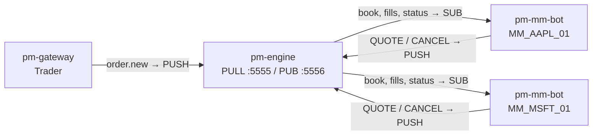
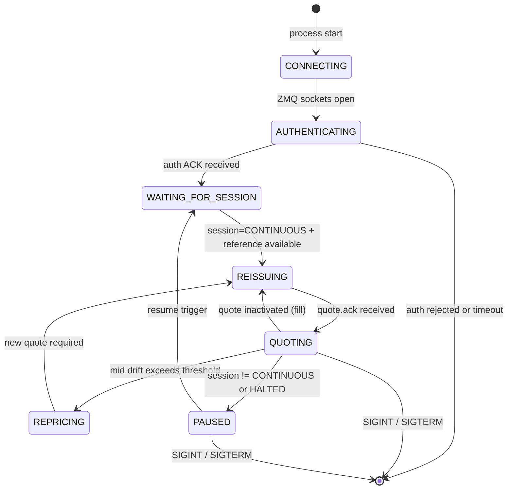

# Market-Maker Bot (pm-mm-bot)

!!! note "Learning objectives"
    After reading this page you will understand:

    - What `pm-mm-bot` is and how it differs from manual `QUOTE` commands
    - How to launch one or more autonomous market-maker bot instances
    - The bot's lifecycle: startup handshake, quoting, repricing, and shutdown
    - How quote refresh works after fills and mid-price drift
    - How to configure gateway entries in `engine_config.yaml` for MM bots
    - How to bootstrap a fresh exchange with no existing book data

    **Prerequisites**: [Market Making](14-market-maker.md) — understand the `QUOTE` command,
    `quote_refresh_policy`, and `disconnect_behaviour` before using the bot.
    [Configuration](01-configuration.md) — each bot instance needs a pre-registered
    `MARKET_MAKER` gateway in the engine config.

---

## What is pm-mm-bot?

`pm-mm-bot` is an **autonomous market-maker process** that keeps a single
symbol liquid without human intervention. It connects to the engine as a
`MARKET_MAKER` gateway, posts a two-sided quote (bid and ask), and automatically
reprices when:

- One side of the quote is filled
- The mid-price drifts beyond a configurable threshold
- The session state changes (e.g. entering or leaving an auction phase)

Each instance handles **one symbol**. To provide liquidity for multiple symbols,
run one instance per symbol. Multiple instances can also compete on the same
symbol — they appear as independent market makers in the book.

| Feature | Manual `QUOTE` | `pm-mm-bot` |
|---|---|---|
| Requires human operator | Yes | No |
| Automatic reissue after fill | No | Yes |
| Drift-based repricing | No | Yes |
| Session-aware (pause in auctions) | Manual | Automatic |
| Multiple instances per symbol | Possible | Built-in (`--id-suffix`) |

---

## Quick start

```bash
# Start a market maker for AAPL with default settings
pm-mm-bot --symbol AAPL

# With explicit spread and quantity
pm-mm-bot --symbol AAPL --gap 0.10 --qty 500

# In Poetry development mode
poetry run pm-mm-bot --symbol AAPL --gap 0.10 --qty 500 -v
```

Before launching, ensure the gateway ID is registered in `engine_config.yaml`:

```yaml
gateways:
  alf:
    - id: MM_AAPL_01
      description: "AAPL market-maker bot"
      role: MARKET_MAKER
      disconnect_behaviour: CANCEL_QUOTES_ONLY
      quote_refresh_policy: INACTIVATE_ON_ANY_FILL
```

---

## Gateway identity convention

Each bot instance uses the gateway ID format:

```
MM_<SYMBOL>_<nn>
```

Where `<SYMBOL>` is the symbol in uppercase and `<nn>` is the two-digit suffix
from `--id-suffix` (default `01`).

| `--symbol` | `--id-suffix` | Gateway ID |
|---|---|---|
| `AAPL` | `01` (default) | `MM_AAPL_01` |
| `AAPL` | `02` | `MM_AAPL_02` |
| `MSFT` | `01` | `MM_MSFT_01` |

This convention makes bot gateways immediately identifiable in logs, the admin
console (`pm-admin`), and the order book viewer (`pm-board`).

---

## Architecture

Each `pm-mm-bot` instance is a standalone process that communicates with the
engine using the same ZMQ PUSH/SUB pattern as all other participants:



---

## Bot lifecycle

### State machine

The bot progresses through a well-defined set of states:



### Startup sequence

1. Open ZMQ sockets (PUSH and SUB)
2. Send `gateway_connect` and wait for `gateway_auth` ACK
3. Request symbol list and verify the assigned symbol exists
4. Send `QBOOT` request — if an active quote already exists for this
   `(gateway_id, symbol)` pair, adopt it instead of creating a duplicate
5. Send `QLEGS` request to reconcile quote-leg mapping
6. Wait for `session.state` event (fail fast if not received within timeout)
7. Resolve initial reference price and begin quoting

### Graceful shutdown

On `SIGINT` (Ctrl+C) or `SIGTERM`, the bot:

1. Sends `quote.cancel` to remove its resting quote
2. Waits up to `--shutdown-timeout-sec` for cancel confirmation
3. Closes ZMQ sockets and exits

---

## Pricing logic

### Mid-price tracking

The bot tracks the current mid-price from the order book:

- **Both sides present**: `mid = (best_bid + best_ask) / 2`
- **Ask only**: `mid = best_ask`
- **Bid only**: `mid = best_bid`
- **No data**: keep previous mid

### Quote placement

Given the mid-price and `--gap` (total spread), the bot places:

- **Bid** at `mid − gap/2`, rounded to the nearest tick
- **Ask** at `mid + gap/2`, rounded to the nearest tick

A minimum spread of 2 ticks is always guaranteed, even after rounding.

### Drift detection

After posting a quote, the bot records the mid at the time of posting. On each
book update, it checks whether the mid has moved by more than `--drift-ticks`
ticks. If so, it cancels and reissues at the new mid.

---

## Quote refresh logic

### Refresh triggers

| Trigger | Action |
|---|---|
| Quote inactivated (one side filled) | Reissue after `--reissue-delay-ms` |
| Mid-price drift exceeds threshold | Cancel and reissue at new mid |
| Quote rejected | Retry after delay |
| Periodic heartbeat (no active quote) | Reissue |

### Reissue delay

After a fill, the bot waits `--reissue-delay-ms` (default: 200 ms) before
reissuing. If multiple fills arrive in quick succession, the timer resets on
each fill — resulting in exactly one reissue after the burst settles.

---

## Session state handling

The bot respects the exchange session lifecycle:

| Session State | Bot Behaviour |
|---|---|
| `PRE_OPEN` | Wait — do not quote |
| `OPENING_AUCTION` | Cancel any live quote; wait |
| `CONTINUOUS` | Post and maintain a two-sided quote |
| `CLOSING_AUCTION` | Cancel any live quote; wait |
| `CLOSED` | Cancel any live quote; wait |
| `HALTED` (circuit breaker) | Cancel and pause immediately |

When the session transitions to `CONTINUOUS`, the bot resumes quoting
automatically.

---

## Bootstrap: starting with an empty book

When the exchange starts fresh (no existing book or trades), the bot needs an
initial reference price. It resolves one using this priority:

1. **QBOOT** — active quote from a previous session (restart recovery)
2. **Book mid** — if another participant has already posted orders
3. **Last trade** — from `trade.executed` events
4. **Bootstrap quote** — inactive quote prices from QBOOT
5. **Random range** — `--initial_min` to `--initial_max` (configurable)

If no source is available and no random range is configured, the bot exits with
a clear error message.

```bash
# Bootstrap from random price range when the book is empty
pm-mm-bot --symbol AAPL --initial_min 95.00 --initial_max 105.00
```

---

## CLI reference

| Argument | Default | Description |
|---|---|---|
| `--symbol SYM` | *required* | Instrument to make a market in |
| `--gap PRICE` | `0.10` | Total spread (bid at mid−gap/2, ask at mid+gap/2) |
| `--qty N` | `500` | Quote size on each leg |
| `--id-suffix NN` | `01` | Running number for gateway ID (`MM_AAPL_01`) |
| `--drift-ticks N` | `3` | Reprice when mid moves by this many ticks |
| `--reissue-delay-ms N` | `200` | Wait after fill before re-issuing |
| `--tif {DAY,GTC}` | `DAY` | Time-in-force for quote legs |
| `--heartbeat-interval-sec F` | `5.0` | Periodic live-quote check interval |
| `--startup-session-timeout-sec F` | `5.0` | Max wait for first `session.state` |
| `--bootstrap-timeout-sec F` | `1.0` | Max wait for QBOOT reply |
| `--cancel-timeout-sec F` | `1.0` | Max wait for cancel confirmation |
| `--shutdown-timeout-sec F` | `2.0` | Max wait for cancel on SIGINT/SIGTERM |
| `--qlegs-reconcile-interval-sec F` | `15.0` | Periodic QLEGS reconciliation interval |
| `--initial_min PRICE` | *unset* | Lower bound for random bootstrap price |
| `--initial_max PRICE` | *unset* | Upper bound for random bootstrap price |
| `--engine-pull ADDR` | `tcp://127.0.0.1:5555` | Engine PUSH/PULL address |
| `--engine-pub ADDR` | `tcp://127.0.0.1:5556` | Engine PUB address |
| `-v`, `--verbose` | `false` | Print debug-level events |

---

## Engine configuration

### Gateway registration

Each bot instance must be pre-registered in `engine_config.yaml`:

```yaml
gateways:
  alf:
    - id: MM_AAPL_01
      description: "AAPL market-maker bot instance 1"
      role: MARKET_MAKER
      disconnect_behaviour: CANCEL_QUOTES_ONLY
      quote_refresh_policy: INACTIVATE_ON_ANY_FILL
      enforce_mm_obligation: true
      mm_max_spread_ticks: 10
      mm_min_qty: 100

    - id: MM_AAPL_02
      description: "AAPL market-maker bot instance 2"
      role: MARKET_MAKER
      disconnect_behaviour: CANCEL_QUOTES_ONLY
      quote_refresh_policy: INACTIVATE_ON_ANY_FILL
```

### Recommended settings

- **`disconnect_behaviour: CANCEL_QUOTES_ONLY`** — ensures stale quotes are
  removed if the bot crashes or restarts
- **`quote_refresh_policy: INACTIVATE_ON_ANY_FILL`** — the engine cancels the
  remaining leg when either side fills, triggering an immediate reissue

### Gap validation

If `mm_max_spread_ticks` is set for the symbol, the bot validates at startup
that `--gap ≤ mm_max_spread_ticks × tick_size`. If the gap is too wide, the
bot exits with a clear error message.

---

## Usage examples

### Single symbol, default settings

```bash
pm-mm-bot --symbol AAPL
```

### Two competing MMs on the same symbol

```bash
pm-mm-bot --symbol AAPL --gap 0.08 --qty 500 &
pm-mm-bot --symbol AAPL --gap 0.12 --qty 300 --id-suffix 02 &
```

### Faster repricing for volatile sessions

```bash
pm-mm-bot --symbol MSFT --gap 0.20 --drift-ticks 1 --reissue-delay-ms 100
```

### Fresh exchange with no book data

```bash
pm-mm-bot --symbol AAPL --initial_min 95.00 --initial_max 105.00
```

### Verbose mode for troubleshooting

```bash
pm-mm-bot --symbol AAPL --gap 0.10 --qty 500 -v
```

---

## Troubleshooting

| Symptom | Cause | Fix |
|---|---|---|
| `auth rejected` | Gateway ID not in `engine_config.yaml` | Add the `MM_<SYM>_<nn>` entry with `role: MARKET_MAKER` |
| `startup failed: no reference price` | Empty book + no `--initial_min`/`--initial_max` | Add bootstrap range flags |
| `startup failed: no session.state` | Engine not running or scheduler not started | Start the engine and scheduler |
| `quote REJECTED` | Gap violates `mm_max_spread_ticks` obligation | Reduce `--gap` value |
| Bot quotes but prices look wrong | Tick size mismatch | Check symbol `tick_size` in engine config |

---

## See also

- [Market Making](14-market-maker.md) — the `QUOTE` command and obligations framework
- [AI Traders](15-ai-traders.md) — the `pm-ai-trader` and `pm-ai-swarm` processes
- [Configuration](01-configuration.md) — engine and gateway configuration
- [Processes](10-processes.md) — architecture overview of all EduMatcher processes
- [Risk Controls](12-risk-controls.md) — MMP and kill switch
