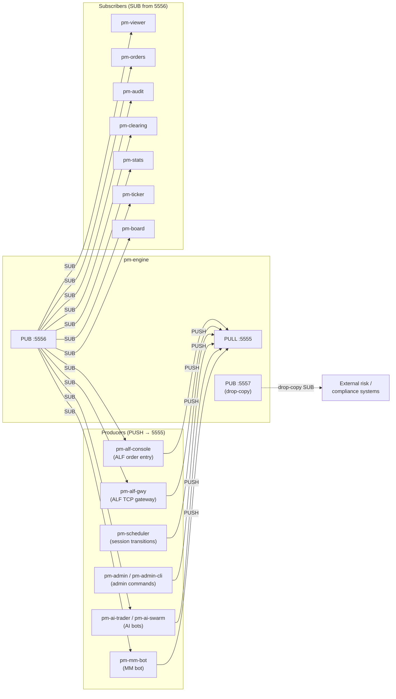
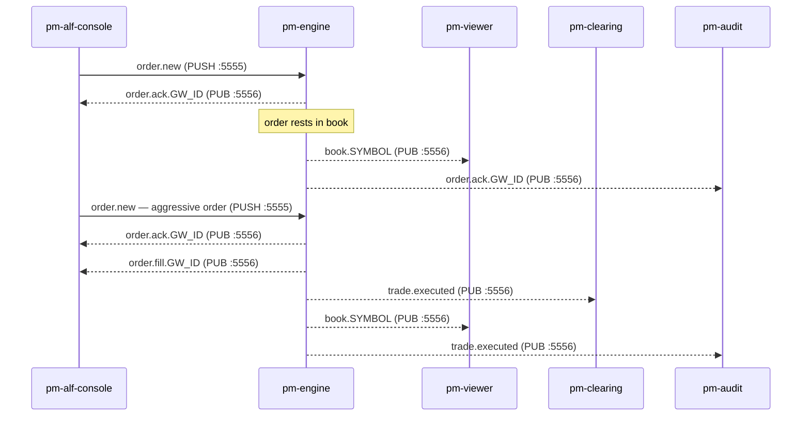

# Processes

!!! note "Learning objectives"
    After reading this page you will understand:

    - Why EduMatcher is built as a set of independent processes connected by a
      message bus rather than a single monolithic program
    - The trade-offs that architecture introduces: scalability and observability
      vs. deployment complexity and latency
        - The role and responsibilities of each of the core runtime processes plus
      the optional AI trader, market-maker bot, and admin tools
    - Which processes are mandatory and which are optional observers
    - How to read the message-flow tables to trace an order from submission to fill


## Background — Why Separate Processes?

### The monolith approach

The simplest trading system is a single program: the user types an order,
the matching logic runs, and the result is printed — all in the same process.
This is easy to build, easy to debug, and fast.  It is also a dead end as soon
as you need any of the following:

- More than one trader connected simultaneously
- Observers (audit, statistics, P&L) that see every trade without modifying the
  matching logic
- The ability to restart one component without restarting everything
- A viewer that can run on a different machine from the engine

### The message-bus approach

EduMatcher distributes work across processes connected by a **ZeroMQ message
bus**. The engine owns three sockets:



The engine is the only process that writes to the order book.  Every other
process is either a **producer** (sends commands via PUSH) or a **subscriber**
(reads events via SUB), or both.  No process shares memory with any other.

| Port     | Socket type | Bound by  | Purpose                                                                                  |
|----------|-------------|-----------|------------------------------------------------------------------------------------------|
| **5555** | PULL        | pm-engine | Receives all inbound commands (orders, cancels, admin)                                   |
| **5556** | PUB         | pm-engine | Broadcasts all market events (fills, book updates, session changes)                      |
| **5557** | PUB         | pm-engine | Drop-copy feed, fill events tagged per gateway, with sequence numbers and replay support |

This design has concrete advantages:

| Advantage            | How it helps                                                                                          |
|----------------------|-------------------------------------------------------------------------------------------------------|
| **Isolation**        | A crashing viewer cannot corrupt the order book                                                       |
| **Observability**    | Any subscriber can see every event without changing the engine                                        |
| **Horizontal scale** | Multiple gateways connect simultaneously; each is independent                                         |
| **Language freedom** | A subscriber can be written in any language that speaks ZeroMQ                                        |
| **Testability**      | The engine can be tested with a fake gateway; subscribers can be tested with recorded message streams |

And honest disadvantages:

| Disadvantage        | Consequence                                                                                                                |
|---------------------|----------------------------------------------------------------------------------------------------------------------------|
| **Latency**         | Each message crosses a socket; a round-trip (order → engine → ACK) takes microseconds rather than nanoseconds on localhost |
| **Startup order**   | The engine must bind before any other process connects                                                                     |
| **Partial failure** | If the engine crashes mid-session, subscribers hold stale state until it restarts                                          |
| **No shared clock** | Timestamps are set by the sender; two processes on different machines can disagree by milliseconds                         |
| **Message loss**    | ZeroMQ PUB/SUB drops messages if a subscriber is slow; fast publishers can outrun slow consumers                           |

For an educational system running on a laptop, none of the disadvantages are
serious.  For a production exchange, each one would require careful engineering
(persistent queues, hardware timestamping, consensus protocols).

### The two bus patterns used here

| Pattern       | Socket pair                | Direction                     | Used for                                                   |
|---------------|----------------------------|-------------------------------|------------------------------------------------------------|
| **PUSH/PULL** | Gateway PUSH → Engine PULL | One-to-one, reliable delivery | Sending commands (orders, cancel requests) to the engine   |
| **PUB/SUB**   | Engine PUB → many SUBs     | One-to-many, topic-filtered   | Broadcasting events (fills, book updates, session changes) |

PUSH/PULL guarantees delivery to exactly one receiver (the engine).
PUB/SUB does not guarantee delivery — a subscriber that is not yet connected
will miss messages sent before it subscribes.  This is why the engine publishes
an initial book snapshot on startup: late-joining viewers can request the
current state rather than waiting for the next change.


## Process Overview

A complete EduMatcher session uses **ten core runtime processes** across three categories, plus optional AI trader, admin, and setup/config entrypoints.

!!! info "Protocol landscape"
    EduMatcher supports multiple external protocol families with different roles:
    ALF for order entry, BALF for binary order entry, CALF for
    market-data dissemination, and RALF for post-trade dissemination. For a
    single map of purpose, runtime status, and links to detailed chapters and
    formal specs, see [External Protocols Overview](210-protocol-overview.md).

!!! info "Why `pm-`?"
    All CLI commands share the `pm-` prefix, short for **Process for Matching**.
    The prefix avoids name collisions with system utilities and makes it easy to
    identify EduMatcher processes in a process list (`ps aux | grep pm-`).

!!! tip "Installation modes"
    Commands are shown without a prefix. If you are running from a **source
    checkout** (developer mode), prepend `poetry run`:

    ```
    poetry run pm-engine --verbose
    ```

    If you installed with **pipx** (end-user mode), the commands are on your
    PATH and need no prefix:

    ```
    pm-engine --verbose
    ```

    See [Getting Started → Installation](000-getting-started.md#installation)
    for the full setup guide and the `pm-setup` bootstrap command.

## Environment variables

Two variables control where EduMatcher finds and stores files at runtime.
Set them once in your shell profile (`~/.zshrc` or `~/.bashrc`) and every
`pm-*` command picks them up automatically.

| Variable | Default (installed) | Default (source checkout) | Purpose |
|---|---|---|---|
| `EDUMATCHER_DATA_DIR` | `~/.local/share/edumatcher` | `<repo>/src/data/` | Directory for all persistent data files (`gtc_orders.json`, `stats.db`, `audit.log`, etc.) |
| `EDUMATCHER_CONFIG` | `./engine_config.yaml` (CWD) | `<repo>/engine_config.yaml` | Path to the engine configuration YAML |

The `--config` flag on `pm-engine` and `pm-scheduler` overrides both the
environment variable and the default.

```bash
# Example: per-session isolation
export EDUMATCHER_DATA_DIR="$HOME/sessions/morning"
export EDUMATCHER_CONFIG="$HOME/sessions/morning/engine_config.yaml"
pm-engine --verbose
```

**Core processes:**

| Process            | Command                   | Role                                                       | Required?           |
|--------------------|---------------------------|------------------------------------------------------------|---------------------|
| **pm-engine**      | `pm-engine`               | Matching engine — the single writer                        | Yes                 |
| **pm-alf-console**     | `pm-alf-console --id GW01`    | ALF order entry terminal (one per trader)                  | At least one        |
| **pm-scheduler**   | `pm-scheduler`            | Drives session phase transitions                           | No                  |
| **pm-viewer**      | `pm-viewer --symbol AAPL` | Live order book display                                    | No                  |
| **pm-orders**      | `pm-orders`               | Cross-gateway order status monitor                         | No                  |
| **pm-board**       | `pm-board`                | Full-screen multi-symbol display                           | No                  |
| **pm-ticker**      | `pm-ticker`               | Scrolling market data ticker                               | No (needs pm-stats) |
| **pm-stats**       | `pm-stats`                | OHLCV, trade, and index-level statistics to SQLite          | No — but recommended immediately after pm-engine (see below) |
| **pm-clearing**    | `pm-clearing`             | P&L and trade settlement                                   | No                  |
| **pm-audit**       | `pm-audit`                | Full event log to disk                                     | No — but recommended immediately after pm-engine (see below) |
| **pm-alf-gwy**     | `pm-alf-gwy`              | ALF TCP gateway — order entry for external bots over TCP :5565 | No              |
| **pm-ralf-gwy**    | `pm-ralf-gwy`             | External post-trade dissemination gateway (RALF)           | No                  |
| **pm-md-gwy**      | `pm-md-gwy`               | External market-data gateway (CALF) over TCP :5570         | No                  |
| **pm-api-gwy** | `pm-api-gwy`          | REST/WebSocket order-entry and market-data API gateway     | No                  |
| **pm-index**       | `pm-index`                | Real-time cap-weighted index calculation and dissemination | No                  |

**Monitoring & Admin tools:**

| Process          | Command                           | Role                                                                        | Required? |
|------------------|-----------------------------------|-----------------------------------------------------------------------------|-----------|
| **pm-admin**     | `pm-admin`                        | Interactive admin console                                                   | No        |
| **pm-admin-cli** | `pm-admin-cli <command>`          | One-shot CLI admin commands                                                 | No        |
| **pm-cverifier** | `pm-cverifier [options] <config>` | Validate `engine_config.yaml` (YAML, schema, semantic, completeness checks) | No        |
| **pm-clearing-cli** | `pm-clearing-cli <command> [options]` | Read/query interface for `clearing.db` (includes prune) | Optional           |
| **pm-stats-cli**  | `pm-stats-cli <command> [options]` | Read-only query interface for `stats.db`                | Optional              |
| **pm-audit-cli**  | `pm-audit-cli <command> [options]` | Read-only query interface for audit JSONL log files     | Optional              |
| **pm-index-cli**  | `pm-index-cli <command> [options]` | Read-only query interface for index history JSONL files | Optional              |


**Setup and configuration tools:**

| Process           | Command                            | Role                                                    | Required?             |
|-------------------|------------------------------------|---------------------------------------------------------|-----------------------|
| **pm-setup**      | `pm-setup`                         | Bootstrap working directory and runtime files           | Recommended first run |
| **pm-config-gen** | `pm-config-gen [options]`          | Generate `engine_config.yaml` from CLI options          | Optional              |

**Optional AI trader tools:**

| Process          | Command                  | Role                                                            | Required? |
|------------------|--------------------------|-----------------------------------------------------------------|-----------|
| **pm-ai-trader** | `pm-ai-trader`           | Single AI trading bot gateway                                   | No        |
| **pm-ai-swarm**  | `pm-ai-swarm`            | Coordinated multi-agent AI trading swarm                        | No        |
| **pm-mm-bot**    | `pm-mm-bot --symbol SYM` | Autonomous [market-maker bot](100-mm-bot.md) for a single symbol | No        |

!!! warning "Start the engine first"
    The engine binds the ZeroMQ sockets.  All other processes connect to those
    sockets.  If a process starts before the engine is ready, it will either fail
    immediately or silently lose its first messages.

!!! tip "Recommended startup sequence"
     For a deterministic first run, use this order:

     1. Bootstrap session files:
         ```bash
         pm-setup
         ```
     2. Generate a config (or reuse/edit the sample config):
         ```bash
         pm-config-gen --symbols AAPL MSFT --gateways TRADER01 TRADER02 OPS01:ADMIN --sessions-enabled --output engine_config.yaml
         ```
     3. Start the engine first:
         ```bash
         pm-engine --verbose
         ```
     4. Start `pm-stats` and `pm-audit` immediately after the engine:
         ```bash
         pm-stats
         pm-audit --terminal
         ```
         Technically only `pm-engine` is required to match orders — every other
         process, including these two, is an optional subscriber. In practice,
         though, `pm-stats` and `pm-audit` are the *de facto* mandatory pair:
         once a session starts, any trading, index, or book activity they
         missed while offline is gone for good — there is no replay. Start
         them right after the engine so nothing is lost, rather than as an
         afterthought later in step 6.
     5. Start one or more gateways:
         ```bash
         pm-alf-console --id TRADER01
         pm-alf-console --id TRADER02
         # or, for external / remote bots:
         pm-alf-gwy --config engine_config.yaml
         ```
     6. Start remaining optional observers/tools as needed (`pm-board`,
         `pm-viewer`, `pm-clearing`, `pm-ticker`, `pm-scheduler`, `pm-index`).


## pm-engine — Matching Engine

The heart of the system — receives orders, matches them, publishes events.

```bash
pm-engine [--verbose] [--config engine_config.yaml]
```

**Startup options:**

| Flag               | Description                                                |
|--------------------|------------------------------------------------------------|
| `--verbose` / `-v` | Print each order received and trade produced to stdout     |
| `--config` / `-c`  | Path to engine config YAML (default: `engine_config.yaml`) |

**Expected runtime input arguments:**

None. `pm-engine` is a long-running background process after startup.

**Startup behaviour**:
1. Creates `data/` directory if needed
2. Parses `engine_config.yaml` if present — registers symbol/gateway allowlists and session settings
3. Binds the main ZMQ PULL :5555 and PUB :5556 sockets during engine initialization
4. On `run()`, restores persisted book stats, GTC orders, and GTC combos
5. Applies config-driven seeds (book stats gaps, market-maker quotes, market-maker combos)
6. Tries to bind the dedicated drop-copy PUB :5557 socket
7. Publishes initial book snapshots for populated books and enters the poll loop

See [Configuration](010-configuration.md) for full details on the config file.

**Shutdown (Ctrl-C)**:
1. Publishes `order.expired` for all resting DAY orders
2. Serializes all resting GTC orders to `data/gtc_orders.json`
3. Publishes `system.eod` with the final book snapshot for every active symbol
4. Closes sockets

**Messages received** (PULL :5555):

| Topic                             | Source          |
|-----------------------------------|-----------------|
| `order.new`                       | Gateways        |
| `order.cancel`                    | Gateways        |
| `order.combo`                     | Gateways        |
| `order.combo_cancel`              | Gateways        |
| `system.gateway_connect`          | Gateways        |
| `book.snapshot_request`           | Viewers, Stats  |
| `system.symbols_request`          | Gateways, Stats |
| `order.orders_request`            | Gateways        |
| `risk.kill_switch`                | Gateways, Admin |
| `risk.circuit_breaker_halt_all`   | Admin gateways  |
| `risk.circuit_breaker_resume_all` | Admin gateways  |
| `session.transition`              | Scheduler       |

**Messages published** (PUB :5556):

| Topic                         | Purpose                          |
|-------------------------------|----------------------------------|
| `order.ack.{GW_ID}`           | Order accepted/rejected          |
| `order.fill.{GW_ID}`          | Partial or full fill             |
| `order.cancelled.{GW_ID}`     | Cancel confirmation              |
| `order.expired.{GW_ID}`       | TIF expiry                       |
| `order.orders.{GW_ID}`        | Order list reply                 |
| `combo.ack.{GW_ID}`           | Combo accepted/rejected          |
| `combo.status.{GW_ID}`        | Combo lifecycle change           |
| `trade.executed`              | Every matched trade pair         |
| `book.{SYMBOL}`               | Book snapshot after every change |
| `session.state`               | Session phase change             |
| `auction.result.{SYMBOL}`     | Auction uncross result           |
| `system.gateway_auth.{GW_ID}` | Gateway authentication reply (connect) |
| `system.gateway_bye.{GW_ID}`  | Gateway disconnect broadcast     |
| `system.symbols.{GW_ID}`      | Symbol list reply                |
| `system.eod`                  | End-of-day broadcast             |

**Messages published** (drop-copy PUB :5557):

| Topic | Purpose |
|---|---|
| `drop_copy.event.{GW_ID}` | Fill event with sequence number and nanosecond timestamp, filtered per gateway |

The drop-copy socket is lazily bound on startup. See [Drop-Copy Feed](200-drop-copy.md) for subscription protocol and replay support.

!!! warning
    Start the engine **first** — gateways and subscribers will fail to connect otherwise.


## pm-alf-console — User Gateway

One instance per user. Accepts ALF commands on stdin.
See [ALF Protocol Reference](900-app-alf-protocol.md).

```bash
pm-alf-console --id <GW_ID>
```

**Startup options:**

| Flag              | Required | Description                                           |
|-------------------|----------|-------------------------------------------------------|
| `--id`            | Yes      | Unique gateway identifier (e.g. `GW01`, `ALICE`)     |
| `--log-level`     | No       | Explicit level: `CRITICAL`, `ERROR`, `WARNING`, `INFO`, `DEBUG` |
| `-v` / `--verbose`| No       | Increase verbosity (`-v` → `INFO`, `-vv` → `DEBUG`)  |
| `-q` / `--quiet`  | No       | Reduce output to warnings/errors                      |

**Expected runtime input arguments:**

- `NEW|...` order-entry commands (including `LIMIT`, `MARKET`, `STOP`, `STOP_LIMIT`, `FOK`, `ICEBERG`, `IOC`, `TRAILING_STOP`)
- `AMEND|...`, `CANCEL|...`
- `QUOTE|...`, `QUOTE_CANCEL|...`
- `QLEGS|...` (market-maker quote-leg monitor with fill flags)
- `ORDERS`, `SYMBOLS`, `HELP`, `EXIT`, `QUIT`
- `KILL|...` for gateway-scoped kill-switch actions

**Connection behaviour**:
1. Sends `system.gateway_connect` to the engine
2. Waits for `system.gateway_auth.<GW_ID>`
3. Enters command loop only if accepted

If the ID is not listed in `engine_config.yaml` under `gateways.alf`, connection
is refused and the gateway exits.

**Messages sent** (PUSH → :5555):

| Topic                    | Purpose                |
|--------------------------|------------------------|
| `system.gateway_connect` | Authentication request |
| `order.new`              | Submit order           |
| `order.cancel`           | Cancel order           |
| `order.combo`            | Submit combo           |
| `order.combo_cancel`     | Cancel combo           |
| `order.orders_request`   | Request order list     |
| `system.symbols_request` | Request symbol list    |

**Messages subscribed** (SUB from :5556):

| Topic                              | Purpose                                        |
|------------------------------------|------------------------------------------------|
| `system.gateway_auth.{own GW_ID}`  | Authentication reply                           |
| `order.ack.{own GW_ID}`            | Order acknowledgements                         |
| `order.fill.{own GW_ID}`           | Fill notifications                             |
| `order.amended.{own GW_ID}`        | Successful amend notifications                 |
| `order.cancelled.{own GW_ID}`      | Cancel confirmations                           |
| `order.expired.{own GW_ID}`        | Expiry notifications                           |
| `order.orders.{own GW_ID}`         | Order list replies                             |
| `combo.ack.{own GW_ID}`            | Combo acknowledgements                         |
| `combo.status.{own GW_ID}`         | Combo status updates                           |
| `oco.ack.{own GW_ID}`              | OCO creation acknowledgements                  |
| `oco.cancelled.{own GW_ID}`        | OCO sibling-cancel notifications               |
| `quote.ack.{own GW_ID}`            | Quote acknowledgements                         |
| `quote.status.{own GW_ID}`         | Quote lifecycle updates                        |
| `risk.kill_switch_ack.{own GW_ID}` | Kill-switch acknowledgement                    |
| `system.symbols.{own GW_ID}`       | Symbol list reply                              |
| `trade.executed`                   | Global trade feed for last-price / P&L display |

See the [Gateway Reference](050-gateway.md) for the full command list.


## pm-alf-gwy — ALF TCP Gateway

Accepts ALF order-entry commands from external bots and remote processes over a
plain TCP connection.  Uses the same ALF command vocabulary as `pm-alf-console`
but is designed for programmatic clients, not interactive terminals.  One
connection per gateway ID; all configured `gateways.alf` IDs may connect.

```bash
pm-alf-gwy [--config engine_config.yaml] [--bind 0.0.0.0] [--port 5565] [--engine-host HOST] [--log-level LEVEL] [-v|-vv] [-q]
```

**Startup options:**

| Flag              | Default                 | Description                                           |
|-------------------|-------------------------|-------------------------------------------------------|
| `--config` / `-c` | `engine_config.yaml`    | Config file with optional `alf_gateway:` section      |
| `--bind`          | from config / `0.0.0.0` | TCP bind address for external clients                 |
| `--port`          | from config / `5565`    | TCP listen port for ALF clients                       |
| `--engine-host`   | from config             | Override engine host for ZMQ ports `5555` / `5556`   |
| `--log-level`     | `WARNING`               | Explicit log level: `CRITICAL`, `ERROR`, `WARNING`, `INFO`, `DEBUG` |
| `-v` / `--verbose`| off                     | Increase verbosity (`-v` → `INFO`, `-vv` → `DEBUG`)  |
| `-q` / `--quiet`  | off                     | Reduce output to warnings/errors                      |

**Expected runtime input arguments:**

No terminal input.  External clients connect over TCP and send ALF lines:

- `HELLO|CLIENT=...|PROTO=ALF1|ID=<gateway-id>` (must be first)
- `NEW|...`, `AMEND|...`, `CANCEL|...`
- `QUOTE|...`, `QUOTE_CANCEL|...`
- `KILL[|SYM=...]`
- `SYMBOLS`, `ORDERS`, `QBOOT[|SYM=...]`
- `PING`, `EXIT` / `QUIT`

**Messages sent** (PUSH → :5555):

| Topic                          | Purpose                        |
|--------------------------------|--------------------------------|
| `system.gateway_connect`       | Authentication request         |
| `system.gateway_disconnect`    | Graceful disconnect notice     |
| `order.new`                    | Submit order                   |
| `order.cancel`                 | Cancel order                   |
| `order.amend`                  | Amend order                    |
| `order.combo`                  | Submit combo                   |
| `order.combo_cancel`           | Cancel combo                   |
| `order.oco`                    | Submit OCO pair                |
| `order.oco_cancel`             | Cancel OCO pair                |
| `order.orders_request`         | Request order list             |
| `quote.new`                    | Submit / replace MM quote      |
| `quote.cancel`                 | Cancel MM quote                |
| `risk.kill_switch`             | Gateway kill-switch            |
| `system.symbols_request`       | Request symbol list            |
| `system.quote_bootstrap_request` | Request quote bootstrap state |

**Messages subscribed** (SUB from :5556):

| Topic                                    | Purpose                               |
|------------------------------------------|---------------------------------------|
| `system.gateway_auth.{GW_ID}`            | Engine authentication reply           |
| `order.ack.{GW_ID}`                      | Order accepted or rejected            |
| `order.fill.{GW_ID}`                     | Partial or full fill                  |
| `order.amended.{GW_ID}`                  | Amend confirmation                    |
| `order.cancelled.{GW_ID}`               | Cancel confirmation                   |
| `order.expired.{GW_ID}`                  | TIF expiry                            |
| `order.orders.{GW_ID}`                   | Order list reply                      |
| `combo.ack.{GW_ID}`                      | Combo accepted or rejected            |
| `combo.status.{GW_ID}`                   | Combo lifecycle change                |
| `oco.ack.{GW_ID}`                        | OCO accepted or rejected              |
| `oco.cancelled.{GW_ID}`                  | OCO sibling-cancel notification       |
| `quote.ack.{GW_ID}`                      | Quote accepted or rejected            |
| `quote.status.{GW_ID}`                   | Quote lifecycle change                |
| `risk.kill_switch_ack.{GW_ID}`           | Kill-switch acknowledgement           |
| `system.symbols.{GW_ID}`                 | Symbol list reply                     |
| `system.quote_bootstrap.{GW_ID}`         | Quote bootstrap state reply           |
| `session.state`                          | Session phase changes (broadcast)     |
| `trade.executed`                         | Trade events (broadcast)              |
| `circuit_breaker.halt.*`                 | Symbol halt events (broadcast)        |
| `circuit_breaker.resume.*`               | Symbol resume events (broadcast)      |

See [ALF TCP Gateway](220-alf-gateway.md) for operational usage, command reference, and client examples.


## pm-viewer — Order Book Viewer

Live terminal view of a single symbol's order book.

```bash
pm-viewer --symbol AAPL [--depth 10]
```

**Startup options:**

| Flag              | Default  | Description                             |
|-------------------|----------|-----------------------------------------|
| `--symbol` / `-s` | required | Symbol to watch                         |
| `--depth` / `-d`  | 10       | Number of price levels to show per side |
| `--log-level`     | `WARNING`| Explicit log level: `CRITICAL`, `ERROR`, `WARNING`, `INFO`, `DEBUG` |
| `-v` / `--verbose`| off      | Increase verbosity (`-v` → `INFO`, `-vv` → `DEBUG`) |
| `-q` / `--quiet`  | off      | Reduce output to warnings/errors        |

**Expected runtime input arguments:**

None.

**Display**:
- Left panel: top-N **bid** levels (price, total qty, number of orders)
- Middle panel: top-N **ask** levels
- Right panel: 5 most recent trades with timestamps
- Header bar: symbol name, last trade price, last trade qty, refresh time

!!! note "Iceberg orders"
    Iceberg orders only show their `displayed_qty` (the visible peak) in the viewer.
    The hidden quantity is completely invisible — this is by design and demonstrates the
    privacy feature of iceberg orders.

Run multiple viewers simultaneously for different symbols:

```bash
pm-viewer --symbol AAPL &
pm-viewer --symbol MSFT &
pm-viewer --symbol TSLA
```

**Messages subscribed** (SUB from :5556):

| Topic           | Purpose                                     |
|-----------------|---------------------------------------------|
| `book.{SYMBOL}` | Book updates for the watched symbol         |
| `session.state` | Session phase changes (displayed in header) |

**Messages sent** (PUSH → :5555):

| Topic                   | Purpose                                |
|-------------------------|----------------------------------------|
| `book.snapshot_request` | Requests initial book state on startup |


## pm-orders — Order Status Monitor

Live cross-gateway view of all orders in the system.

```bash
pm-orders [--gateway GW01]
```

**Startup options:**

| Flag               | Default | Description                |
|--------------------|---------|----------------------------|
| `--gateway` / `-g` | (all)   | Filter to a single gateway |

**Expected runtime input arguments:**

None.

Displays a live table with columns:
`ID | Gateway | Symbol | Side | Type | TIF | Qty | Remaining | Price | Status | Updated`

Status colours: green=NEW, yellow=PARTIAL, bright green=FILLED, red=REJECTED/CANCELLED, dim=EXPIRED.

**Messages subscribed** (SUB from :5556):

| Topic             | Purpose                                          |
|-------------------|--------------------------------------------------|
| `order.` (prefix) | All order events (ack, fill, cancelled, expired) |
| `combo.` (prefix) | Combo ack and status events                      |
| `session.state`   | Session phase changes                            |


## pm-audit - Event Logger

Records every message on the bus to a rotating log file.

```bash
pm-audit [--log-file data/audit.log] [--terminal] [--buffer-size 100] [--flush-interval 10] [--log-level LEVEL] [-v|-vv] [-q]
```

**Startup options:**

| Flag                  | Default          | Description                                                  |
|-----------------------|------------------|--------------------------------------------------------------|
| `--log-file`          | `data/audit.log` | Output log file path                                         |
| `--terminal` / `-t`   | off              | Also print each entry to stdout                              |
| `--buffer-size`       | 100              | Number of messages to buffer in memory before writing to disk |
| `--flush-interval`    | 10.0             | Maximum seconds to wait before flushing buffer to disk       |
| `--log-level`         | `WARNING`        | Explicit log level: `CRITICAL`, `ERROR`, `WARNING`, `INFO`, `DEBUG` |
| `-v` / `--verbose`    | off              | Increase verbosity (`-v` → `INFO`, `-vv` → `DEBUG`)         |
| `-q` / `--quiet`      | off              | Reduce output to warnings/errors                             |

**Expected runtime input arguments:**

None.

**Buffering behaviour:**

To reduce disk wear, `pm-audit` buffers messages in memory before writing them
to disk in batches. The buffer is flushed to disk when either:

- The buffer reaches `--buffer-size` messages (e.g., 100 messages), or
- `--flush-interval` seconds have elapsed since the last flush (e.g., 10 seconds)

On shutdown (Ctrl-C, SIGINT, or SIGTERM), any remaining buffered messages are
automatically flushed to disk before the process exits, ensuring no data is lost.

**Log format** (one entry per line):
```
[2026-04-29T14:32:01.123] [trade.executed] {"id": "...", "symbol": "AAPL", ...}
[2026-04-29T14:32:01.125] [book.AAPL] {"bids": [...], "asks": [...], ...}
```

Log files rotate at 10 MB with 5 backups kept.

Use `--terminal` during demos so the class can see every event in real time.
Use `-vv` or `--log-level DEBUG` when you want aggregated operational summaries
about buffering, flushes, decode errors, and broad topic-family mix without
changing the raw event log format.

**Examples:**

```bash
# Default: buffer 100 messages, flush every 10 seconds
pm-audit

# High-traffic scenario: larger buffer, longer flush interval
pm-audit --buffer-size 500 --flush-interval 30

# Low-latency: smaller buffer, aggressive flushing
pm-audit --buffer-size 10 --flush-interval 1

# Disable buffering entirely: flush every message immediately
pm-audit --buffer-size 1 --flush-interval 0.1
```

**Messages subscribed** (SUB from :5556):

| Topic                                    | Purpose                                        |
|------------------------------------------|------------------------------------------------|
| *(empty prefix — receives all messages)* | Records everything published on the PUB socket |


## pm-clearing — Clearing & P&L

SQLite-backed clearing writer for P&L and position state.

```bash
pm-clearing [--datapath PATH] [--db-name NAME] [--flush-size N] [--flush-interval SEC] [--print-every N] [--retention-days N] [--timezone TZ] [--sql-trace] [--log-level LEVEL] [-v|-vv] [-q]
```

**Startup options:**

| Flag | Default | Description |
|---|---|---|
| `--datapath` | data dir from `EDUMATCHER_DATA_DIR` | Data directory or explicit `.db` path |
| `--db-name` | `clearing.db` | SQLite filename when `--datapath` is a directory |
| `--flush-size` | `100` | Flush immediately when buffered trades reaches N |
| `--flush-interval` | `5.0` | Flush interval in seconds when buffer is non-empty |
| `--print-every` | `100` | Print in-memory P&L snapshot every N trades (`0` disables) |
| `--retention-days` | `90` | Prune `trade_events` rows older than N days on startup (`0` disables pruning) |
| `--timezone` | `UTC` | Exchange session timezone (IANA name) used to bucket trades into a trading day; keeps a single wall-clock session in one `trade_date` |
| `--sql-trace` | off | Log executed SQLite SQL statements from the clearing writer connection |
| `--log-level` | `WARNING` | Explicit log level: `CRITICAL`, `ERROR`, `WARNING`, `INFO`, `DEBUG` |
| `-v` / `--verbose` | off | Increase verbosity (`-v` → `INFO`, `-vv` → `DEBUG`) |
| `-q` / `--quiet` | off | Reduce output to warnings/errors |

`pm-clearing-cli` global options include `--raw-output` to disable display
normalization and print raw tick-unit values for price-derived fields.

**Expected runtime input arguments:**

None.

On startup, `pm-clearing` applies schema migrations and prunes `trade_events`
older than the retention window (default: 90 days). Writes are batched into
single SQLite transactions to update:

- `trade_events`
- `gateway_symbol_positions`
- `gateway_daily_summary`

`trade.executed.tick_decimals` is persisted so downstream output can normalize
price-derived values for table/JSON/CSV rendering.

**Messages subscribed** (SUB from :5556):

| Topic            | Purpose                                            |
|------------------|----------------------------------------------------|
| `trade.executed` | Every matched trade pair (including `tick_decimals`) — drives P&L calculations |
| `system.eod` | End-of-day marks and the session-close `session_events` row |
| `system.gateway_auth.` | Gateway connect (accepted) — opens a `gateway_sessions` row |
| `system.gateway_bye.` | Gateway disconnect — closes the matching `gateway_sessions` row |

See [P&L & Clearing](130-pnl-clearing.md) for the full accounting model.


## pm-clearing-cli - Clearing Query CLI

`pm-clearing-cli` is a command-line interface for querying `clearing.db`
without writing SQL manually. It supports both read-style reporting commands
and a maintenance command (`prune`) that deletes old raw trade rows.

```bash
pm-clearing-cli [--datapath PATH] [--db-name clearing.db] [--format table|json|csv] [--no-header] [--raw-output] COMMAND [options]
```

Unlike `pm-clearing`, this is a one-shot tool: it runs one command, prints
output, and exits.

**Global options:**

| Flag | Default | Description |
|---|---|---|
| `--datapath PATH` | resolved from `EDUMATCHER_DATA_DIR` | Data directory or explicit `.db` file path |
| `--db-name NAME` | `clearing.db` | SQLite filename when `--datapath` is a directory |
| `--format` | `table` | Output format: `table`, `json`, or `csv` |
| `--no-header` | off | Suppress header row in CSV output |
| `--raw-output` | off | Disable tick-decimal normalization and emit raw tick-unit values |

**Subcommands:**

| Subcommand | Default limit | Purpose | Typical filters |
|---|---:|---|---|
| `gateways` | 1000 | Gateway-level realized/unrealized/total P&L totals | `--gateway` |
| `positions` | 10000 | Current open position state by gateway and symbol | `--gateway`, `--symbol` |
| `pnl` | 10000 | Realized/unrealized/total P&L rows per gateway and symbol | `--gateway`, `--symbol` |
| `daily` | 1000 | Daily rollup summary rows | `--gateway`, `--symbol`, `--date`, `--from`, `--to` |
| `trades` | 200 | Raw trade-event rows | `--gateway`, `--symbol`, `--date`, `--from`, `--to` |
| `exposure` | 1000 | Net/gross notional exposure and P&L | `--gateway`, `--symbol`, `--sort` |
| `symbols` | 1000 | Symbol-level totals and open exposure snapshot | `--date`, `--from`, `--to`, `--sort` |
| `dates` | 1000 | Available trade dates (optionally with totals) | `--gateway`, `--symbol`, `--from`, `--to`, `--with-totals` |
| `health` | n/a | DB row counts, flush metadata, and WAL mode | none |
| `reconcile` | n/a | Compares raw `trade_events` vs daily summary (both buy and sell sides; also reports summary-only keys) | `--gateway`, `--symbol`, `--from`, `--to`, `--retention-days` |
| `prune` | n/a | Deletes old `trade_events` rows by retention window | `--days`, `--dry-run` |

**Sort options:**

| Command | Allowed `--sort` values |
|---|---|
| `exposure` | `gross_notional`, `net_notional`, `realized_pnl`, `unrealized_pnl`, `total_pnl` |
| `symbols` | `symbol`, `traded_qty`, `traded_notional`, `realized_pnl`, `open_net_qty` |

**Examples:**

```bash
# Gateway totals (table)
pm-clearing-cli gateways

# One gateway in JSON
pm-clearing-cli --format json gateways --gateway GW_A

# Current positions as CSV (normalized display values)
pm-clearing-cli --format csv positions --gateway MM01

# Emit raw tick-unit values instead of normalized display values
pm-clearing-cli --format json --raw-output positions --gateway MM01

# Daily summary for one date range
pm-clearing-cli daily --from 2026-07-01 --to 2026-07-05

# Raw trades for one symbol
pm-clearing-cli trades --symbol AAPL --limit 50

# Risk view by total P&L
pm-clearing-cli exposure --sort total_pnl

# Date discovery with aggregate totals
pm-clearing-cli dates --with-totals

# Data-consistency check
pm-clearing-cli reconcile --from 2026-07-01 --to 2026-07-05

# Retention maintenance (dry run then execute)
pm-clearing-cli prune --days 90 --dry-run
pm-clearing-cli prune --days 90
```

**No-row behaviour:**

- `table`: prints `No rows found.` (except `reconcile`, which prints `OK — no discrepancies found.`)
- `json`: prints `[]`
- `csv`: prints only header row unless `--no-header` is set

See [P&L & Clearing](130-pnl-clearing.md) for the accounting model and schema-level details.


## pm-stats — Statistics Recorder

Records market statistics for every symbol, plus index level history, to a
SQLite database (`data/stats.db`). This is the queryable time-series home for
both trading statistics and index levels — `pm-index`'s own JSONL file only
retains structural/corporate-action audit records, not level ticks.

```bash
pm-stats [--db data/stats.db] [--snapshot-interval SEC] [--sql-trace] [--log-level LEVEL] [-v|-vv] [-q]
```

**Startup options:**

| Flag                  | Default         | Description                                                                                     |
|-----------------------|-----------------|-------------------------------------------------------------------------------------------------|
| `--db`                | `data/stats.db` | SQLite database file path                                                                       |
| `--snapshot-interval` | `900` (15 min)  | Seconds between `price_snapshots` rows per symbol. Use a smaller value for finer intraday resolution, e.g. `60` for one-minute snapshots. |
| `--sql-trace`         | off             | Log executed SQLite SQL statements from the stats writer connection                             |
| `--log-level`         | `WARNING`       | Explicit log level: `CRITICAL`, `ERROR`, `WARNING`, `INFO`, `DEBUG`                            |
| `-v` / `--verbose`    | off             | Increase verbosity (`-v` → `INFO`, `-vv` → `DEBUG`)                                             |
| `-q` / `--quiet`      | off             | Reduce output to warnings/errors                                                                 |

**Expected runtime input arguments:**

None.

**Subscriptions:**

`pm-stats` opens two independent PUB/SUB connections: one to `pm-engine`
(`ENGINE_PUB_ADDR`, port 5556) and one to `pm-index` (`INDEX_PUB_CONNECT_ADDR`,
port 5558).

| Source     | Topic          | Purpose                                                                 |
|------------|----------------|--------------------------------------------------------------------------|
| pm-engine  | `trade.*`      | Updates OHLCV, VWAP, min/max, volume, trade log                         |
| pm-engine  | `book.*`       | Records opening bid/ask prices; drives 15-minute snapshots               |
| pm-engine  | `system.eod`   | Records end-of-day closing bid/ask prices                                |
| pm-index   | `index.update` | Records every index level tick to `index_level_snapshots` and rolls up daily OHLC into `index_daily_stats` |

**On engine shutdown**, the engine broadcasts `system.eod` before closing sockets.
`pm-stats` receives it and immediately flushes the closing bid/ask for every active symbol
into `daily_stats`. The `index.update` subscription is independent of the engine
socket and keeps working even if `pm-index` starts or stops at a different time
than `pm-engine`.

### How statistics are computed

**OHLCV and VWAP** accumulate in memory, one `SymbolStats` object per symbol, and are
flushed to `daily_stats` after each trade.

| Statistic                 | Trigger                          | Rule                                                                         |
|---------------------------|----------------------------------|------------------------------------------------------------------------------|
| `open_price`              | First `trade.*` of the day       | Set once; never overwritten                                                  |
| `close_price`             | Every `trade.*`                  | Always overwritten with the latest price                                     |
| `high_price`              | Every `trade.*`                  | Running `max(current, trade_price)`                                          |
| `low_price`               | Every `trade.*`                  | Running `min(current, trade_price)`                                          |
| `volume`                  | Every `trade.*`                  | Cumulative sum of matched quantities                                         |
| `trade_count`             | Every `trade.*`                  | Incremented by 1                                                             |
| `vwap`                    | Every `trade.*`                  | $\sum(price \times qty) / \sum(qty)$; maintained as two running accumulators |
| `largest_trade_qty/price` | Every `trade.*`                  | Replaced when `qty > current_largest`                                        |
| `open_bid/ask`            | First `book.*` update of the day | Set once from the book snapshot                                              |
| `close_bid/ask`           | `system.eod`                     | Overwritten with the final bid/ask from the book                             |

**15-minute price snapshots** are written to `price_snapshots` when a `book.*` message
arrives and at least `--snapshot-interval` seconds have elapsed since the last snapshot for that symbol
(default: `SNAPSHOT_INTERVAL_SEC = 900`, i.e. 15 minutes). The mid-price is computed as:

$$mid = \frac{best\_bid + best\_ask}{2}$$

If one side of the book is empty the available side is used as the mid-price; if both
sides are empty the last known trade price is used instead.

**Trade log** rows are appended on every `trade.*` event — no aggregation, one row per
matched trade pair, using the trade UUID from the engine as the primary key.

**Startup behaviour** — on startup `pm-stats` sends a `book.snapshot_request` via PUSH
`:5555` for every symbol it discovers from `system.symbols.STATS`. This primes the
`open_bid`/`open_ask` values and the first snapshot interval even before the first trade.

### Statistics Database Schema

The database lives at `data/stats.db` (SQLite 3). Three tables are maintained.

#### `daily_stats`

One row per `(date, symbol)`. Upserted on every trade and again when `system.eod` arrives.

| Column                | Type      | Description                                                         |
|-----------------------|-----------|---------------------------------------------------------------------|
| `date`                | TEXT (PK) | Calendar date `YYYY-MM-DD`                                          |
| `symbol`              | TEXT (PK) | Instrument ticker                                                   |
| `open_price`          | REAL      | Price of the first trade of the day                                 |
| `high_price`          | REAL      | Highest trade price of the day                                      |
| `low_price`           | REAL      | Lowest trade price of the day                                       |
| `close_price`         | REAL      | Price of the last trade of the day                                  |
| `open_bid`            | REAL      | Best bid at the time of the first book update                       |
| `open_ask`            | REAL      | Best ask at the time of the first book update                       |
| `close_bid`           | REAL      | Best bid recorded at engine shutdown (`system.eod`)                 |
| `close_ask`           | REAL      | Best ask recorded at engine shutdown (`system.eod`)                 |
| `volume`              | INTEGER   | Total traded quantity for the day                                   |
| `trade_count`         | INTEGER   | Number of individual trades                                         |
| `vwap`                | REAL      | Volume-weighted average price: $\sum(price \times qty) / \sum(qty)$ |
| `largest_trade_qty`   | INTEGER   | Quantity of the single largest trade                                |
| `largest_trade_price` | REAL      | Price of the single largest trade                                   |

Example query — end-of-day summary:
```sql
SELECT date, symbol,
       open_price, high_price, low_price, close_price,
       volume, trade_count,
       ROUND(vwap, 4) AS vwap
FROM daily_stats
ORDER BY date DESC, symbol;
```


#### `price_snapshots`

One row per `(ts, symbol)` written every **`--snapshot-interval`** seconds (default: 15 minutes) when a book update arrives.

| Column       | Type      | Description                                                                                            |
|--------------|-----------|--------------------------------------------------------------------------------------------------------|
| `ts`         | TEXT (PK) | ISO-8601 timestamp (UTC, second precision)                                                             |
| `symbol`     | TEXT (PK) | Instrument ticker                                                                                      |
| `mid_price`  | REAL      | `(best_bid + best_ask) / 2`; falls back to whichever side is present, then `last_price`                |
| `best_bid`   | REAL      | Best bid price at snapshot time (null if empty book)                                                   |
| `best_ask`   | REAL      | Best ask price at snapshot time (null if empty book)                                                   |
| `pct_change` | REAL      | Percentage change of `mid_price` vs. previous snapshot: $100 \times (mid_{t} - mid_{t-1}) / mid_{t-1}$ |

Example query — intraday price path for MSFT:
```sql
SELECT ts, mid_price, best_bid, best_ask,
       ROUND(pct_change, 4) || '%' AS change
FROM price_snapshots
WHERE symbol = 'MSFT'
ORDER BY ts;
```


#### `trade_log`

Append-only record of every individual matched trade.

| Column            | Type      | Description                                     |
|-------------------|-----------|-------------------------------------------------|
| `ts`              | TEXT      | ISO-8601 timestamp (UTC, millisecond precision) |
| `trade_id`        | TEXT (PK) | UUID from the engine                            |
| `symbol`          | TEXT      | Instrument ticker                               |
| `price`           | REAL      | Execution price                                 |
| `quantity`        | INTEGER   | Matched quantity                                |
| `buy_gateway_id`  | TEXT      | Gateway that submitted the buy order            |
| `sell_gateway_id` | TEXT      | Gateway that submitted the sell order           |

Example query — all trades for a symbol sorted by time:
```sql
SELECT ts, price, quantity, buy_gateway_id, sell_gateway_id
FROM trade_log
WHERE symbol = 'AAPL'
ORDER BY ts;
```

!!! tip "Querying the database"
    You can open `data/stats.db` with any SQLite client:
    ```bash
    sqlite3 data/stats.db
    .headers on
    .mode column
    SELECT * FROM daily_stats;
    ```


## pm-stats-cli — Statistics Query CLI

`pm-stats-cli` is a read-only command-line interface for querying
`data/stats.db` without writing SQL manually.

```bash
pm-stats-cli [--db data/stats.db] [--format table|json|csv] COMMAND [options]
```

Unlike `pm-stats`, this is not a subscriber process. It runs one query,
prints output, and exits.

**Global options:**

| Flag          | Default         | Description                              |
|---------------|-----------------|------------------------------------------|
| `--db`        | `data/stats.db` | SQLite database file path                |
| `--format`    | `table`         | Output format: `table`, `json`, or `csv` |
| `--no-header` | off             | Suppress header row in `csv` output      |

**Subcommands:**

| Subcommand         | Purpose                                                | Typical filters                                                   |
|--------------------|---------------------------------------------------------|---------------------------------------------------------------------|
| `daily`            | Daily OHLCV summary from `daily_stats`                 | `--date`, `--symbol`, `--limit`, `--wide`                          |
| `snapshots`        | Intraday snapshots from `price_snapshots`               | `--symbol` (required), `--date`, `--from`, `--to`, `--limit`       |
| `trades`           | Trade history from `trade_log`                          | `--symbol`, `--date`, `--from`, `--to`, `--limit`                  |
| `symbols`          | Discover symbols available in stats data                | `--date`                                                            |
| `dates`            | Discover trading dates available in `daily_stats`        | `--symbol`                                                          |
| `index-daily`      | Daily index OHLC rollup from `index_daily_stats`        | `--date`, `--index-id`, `--limit`, `--wide`                        |
| `index-snapshots`  | Every recorded index level tick from `index_level_snapshots` | `--index-id` (required), `--date`, `--from`, `--to`, `--limit` |
| `index-ids`        | Discover index IDs with recorded data                   | `--date`                                                            |

`index-daily`, `index-snapshots`, and `index-ids` query the level/EOD history
that `pm-index`'s own JSONL file no longer stores — see
[Statistics and Reporting](140-statistics-and-reporting.md#index-level-history)
for the full reference and [Market Index](150-index.md#state-and-history) for
why this data moved here.

**Examples:**

```bash
# Latest available daily summary date
pm-stats-cli daily

# Daily summary for one date and one symbol
pm-stats-cli daily --date 2026-06-14 --symbol AAPL

# Include bid/ask and largest-trade fields
pm-stats-cli daily --date 2026-06-14 --wide

# Intraday snapshots for one symbol in a time window
pm-stats-cli snapshots --symbol MSFT --from 2026-06-14T09:00:00+00:00 --to 2026-06-14T16:30:00+00:00

# Trades as CSV for scripting/export
pm-stats-cli --format csv trades --symbol AAPL --date 2026-06-14

# Trades as JSON for automation
pm-stats-cli --format json trades --symbol AAPL --limit 50

# Discovery helpers
pm-stats-cli symbols
pm-stats-cli dates --symbol AAPL
```

**No-row behaviour:**

- `table`: prints `No rows found.`
- `json`: prints `[]`
- `csv`: prints only header row unless `--no-header` is set

For schema details, see the `pm-stats` section above and
[Statistics and Reporting](140-statistics-and-reporting.md).


## pm-scheduler — Session Scheduler

Drives session-phase transitions (PRE_OPEN → OPENING_AUCTION → CONTINUOUS →
CLOSING_AUCTION → CLOSED) by sending `session.transition` messages to the
engine at configured wall-clock times.

```bash
pm-scheduler [--config engine_config.yaml] [--now] [--delay 3] [--daily] [--no-confirm] [--log-level LEVEL] [-v|-vv] [-q]
```

**Startup options:**

| Flag               | Default              | Description                                                                         |
|--------------------|----------------------|-------------------------------------------------------------------------------------|
| `--config` / `-c`  | `engine_config.yaml` | Config file containing the `schedule` section                                       |
| `--now`            | off                  | Skip wall-clock waiting; send all transitions immediately with a delay between each |
| `--delay`          | 3                    | Seconds between transitions in `--now` mode (ignored, with a warning, outside `--now`) |
| `--daily`          | off                  | Run continuously, repeating the schedule every calendar day                         |
| `--no-confirm`     | off                  | Do not query/confirm session state via the engine before sending a transition       |
| `--log-level`      | `WARNING`            | Explicit log level: `CRITICAL`, `ERROR`, `WARNING`, `INFO`, `DEBUG`                 |
| `-v` / `--verbose` | off                  | Increase verbosity (`-v` → `INFO`, `-vv` → `DEBUG`)                                 |
| `-q` / `--quiet`   | off                  | Reduce output to warnings/errors                                                     |

**Expected runtime input arguments:**

None.

**Messages sent** (PUSH → :5555):

| Topic                | Purpose                                               |
|----------------------|-------------------------------------------------------|
| `session.transition` | Requests the engine to move to the next session phase |

The scheduler does not subscribe to any PUB messages — it is fire-and-forget.

See [Auctions & Scheduling](080-auctions-scheduling.md) for the full schedule configuration
and session-phase documentation.


## pm-ticker — Scrolling Market Ticker

Prints a scrolling ticker-tape line at regular intervals — one line per snapshot
containing all active symbols with live prices, OHLCV, and bid/ask spreads.

```bash
pm-ticker [--interval 30] [--db data/stats.db] [--db-interval 900]
```

**Startup options:**

| Flag            | Default         | Description                                        |
|-----------------|-----------------|----------------------------------------------------|
| `--interval`    | 30              | Seconds between printed ticker lines               |
| `--db`          | `data/stats.db` | Path to the statistics SQLite database             |
| `--db-interval` | 900             | Seconds between daily_stats DB re-queries (15 min) |
| `--log-level`   | `WARNING`       | Explicit log level: `CRITICAL`, `ERROR`, `WARNING`, `INFO`, `DEBUG` |
| `-v` / `--verbose`| off           | Increase verbosity (`-v` → `INFO`, `-vv` → `DEBUG`) |
| `-q` / `--quiet`  | off           | Reduce output to warnings/errors                    |

**Expected runtime input arguments:**

None.

**Output format** (one line per interval, scrolls up naturally):

```
09:15:00  ◆  MSFT  415.00  +0.48%  H:418.00  L:412.00  Vol:52,400 (8T)  414.50/415.50  ◆  AAPL …
```

Each symbol segment shows:

| Field      | Description                                                         |
|------------|---------------------------------------------------------------------|
| Symbol     | Instrument name (bold cyan)                                         |
| Last price | Most recent trade price or closing price from DB                    |
| Change %   | Percentage change vs. today's open price (green if up, red if down) |
| H: / L:    | Intraday high (green) and low (red) from the daily_stats table      |
| Vol        | Cumulative traded volume for the day                                |
| (nT)       | Number of trades today                                              |
| Bid/Ask    | Current best bid (green) / best ask (red) from live book            |

The ticker combines **live ZMQ data** (last price, bid/ask from `book.*` messages)
with **historical DB data** (OHLCV, trade count from `pm-stats`'s SQLite database).
The DB is re-queried every `--db-interval` seconds to pick up updated daily statistics.

**Messages subscribed** (SUB from :5556):

| Topic            | Purpose                                  |
|------------------|------------------------------------------|
| `book.` (prefix) | Live last price, best bid/ask per symbol |

!!! note "Depends on pm-stats"
    The ticker reads from `data/stats.db` which is populated by `pm-stats`.
    Without `pm-stats` running, the ticker still works but only shows live bid/ask
    and last price — OHLCV, volume, and trade count will be missing.


## pm-board — Market Board

Full-screen multi-symbol display designed for large monitors or projection screens.
Shows all active symbols in a single paged table with exchange-style colouring.

```bash
pm-board [--rows 8] [--interval 10]
```

**Startup options:**

| Flag                | Default | Description                                         |
|---------------------|---------|-----------------------------------------------------|
| `--rows` / `-r`     | 8       | Maximum number of symbols (rows) displayed per page |
| `--interval` / `-i` | 10      | Seconds before auto-rotating to the next page       |
| `--log-level`       | `WARNING`| Explicit log level: `CRITICAL`, `ERROR`, `WARNING`, `INFO`, `DEBUG` |
| `-v` / `--verbose`  | off     | Increase verbosity (`-v` → `INFO`, `-vv` → `DEBUG`) |
| `-q` / `--quiet`    | off     | Reduce output to warnings/errors                    |

**Expected runtime input arguments:**

- ++enter++ to advance to the next page immediately
- ++ctrl+c++ to exit

**Controls:**

| Key        | Action                           |
|------------|----------------------------------|
| ++enter++  | Advance to next page immediately |
| ++ctrl+c++ | Exit                             |

**Display columns:**

| Column    | Description                                                                                |
|-----------|--------------------------------------------------------------------------------------------|
| Symbol    | Instrument ticker                                                                          |
| Last      | Last traded price (coloured green if up from first trade, red if down)                     |
| Chg %     | Percentage change from the first trade of the session: $100 \times (last - first) / first$ |
| Bid       | Best (highest) bid price currently in the book                                             |
| Ask       | Best (lowest) ask price currently in the book                                              |
| Spread    | Difference between best ask and best bid: $ask - bid$                                      |
| Last Buy  | Last trade price where this symbol was bought (green)                                      |
| Last Sell | Last trade price where this symbol was sold (red)                                          |
| Vol       | Cumulative traded volume for the session                                                   |
| Updated   | Timestamp of the most recent book update for this symbol                                   |

The header bar shows: page number, total pages, number of active symbols, the
auto-rotate interval, and the current clock time.

**Paging behaviour:**

- Symbols are sorted alphabetically and divided into pages of `--rows` symbols each.
- The display auto-rotates to the next page every `--interval` seconds.
- When the last page is reached, rotation wraps back to page 1.
- Pressing ENTER advances immediately and resets the auto-rotate timer.

**Colour conventions** (matching standard exchange displays):

- **Green** — price increase, buy trades, positive change %
- **Red** — price decrease, sell trades, negative change %
- **White** — unchanged or neutral values

**Messages subscribed** (SUB from :5556):

| Topic            | Purpose                                                        |
|------------------|----------------------------------------------------------------|
| `book.` (prefix) | Book updates for all symbols — discovers symbols automatically |
| `trade.executed` | Every matched trade — drives volume and last-price tracking    |

!!! tip "Large-screen demo"
    For classroom or conference demos, maximise the terminal and use large rows:
    ```bash
    pm-board --rows 15 --interval 8
    ```
    The board auto-discovers symbols as they become active — no configuration needed.

## pm-ai-trader — Autonomous Trader Bot

Runs one autonomous trading gateway with a selectable behaviour profile.

```bash
pm-ai-trader --id AI01 [options]
```

**Startup options:**

| Flag                | Default       | Description                                         |
|---------------------|---------------|-----------------------------------------------------|
| `--id`              | required      | Gateway ID used by the bot (e.g. `AI01`)            |
| `--profile`         | `cautious`    | Personality profile (`available_profiles()` set)    |
| `--symbols`         | empty         | Comma-separated symbol allowlist (e.g. `AAPL,MSFT`) |
| `--seed`            | `1`           | RNG seed for deterministic behaviour                |
| `--duration`        | `0`           | Runtime in seconds; `0` means run until stopped     |
| `--run-id`          | autogenerated | Optional run label for audit/traceability           |
| `--max-position`    | `1000`        | Absolute per-symbol position limit                  |
| `--max-rejects`     | `25`          | Reject threshold before cooldown breaker trips      |
| `--reject-window`   | `10.0`        | Rolling reject window in seconds                    |
| `--reject-cooldown` | `5.0`         | Pause interval after reject breaker trips           |
| `--stale-data`      | `4.0`         | Max market-data age (seconds) before pausing orders |
| `--log-level`       | `WARNING`     | Explicit level: `CRITICAL`, `ERROR`, `WARNING`, `INFO`, `DEBUG` |
| `-v` / `--verbose`  | off           | Increase verbosity (`-v` enables bot debug prints, `-vv` sets DEBUG) |
| `-q` / `--quiet`    | off           | Reduce output to warnings/errors                    |

**Expected runtime input arguments:**

None.

**Connect / restart handshake:**

On every startup (or reconnect) the bot performs the following initialization
sequence before it begins submitting orders:

1. Send `gateway_connect`; wait for `system.gateway_auth.<ID>`.
2. Send `system.symbols_request`; receive `system.symbols.<ID>` to populate
   the symbol universe and resolve per-symbol `tick_size` and `prev_close`.
3. Send `system.session_state_request`; receive `system.session_status.<ID>`
   to seed the current trading phase.  Session broadcasts are edge-triggered —
   without this explicit query, a bot that connects mid-session would not know
   it is in `OPENING_AUCTION` or `CLOSED` until the next phase transition.
4. Send `system.halt_status_request`; receive `system.halt_status.<ID>` to
   seed the per-symbol halt flags so the bot never submits into a halted symbol.
5. Send `system.position_request`; receive `system.position_snapshot.<ID>` to
   re-seed per-symbol net position and average cost from the engine's ledger.
   This ensures risk guards (position cap, drawdown guard) are accurate even
   when the bot restarts while the engine is still running.

Steps 3–5 are idempotent: if the engine returns an empty list or a
`CONTINUOUS` state the bot simply starts from a flat / unhalt / continuous
state, which is correct for a fresh session.


Launches and supervises multiple `pm-ai-trader` bots as a coordinated swarm.

```bash
pm-ai-swarm [options]
```

**Startup options:**

| Flag                | Default              | Description                                |
|---------------------|----------------------|--------------------------------------------|
| `--count`           | `10`                 | Number of bot processes to launch          |
| `--prefix`          | `AI`                 | Gateway-ID prefix                          |
| `--start-index`     | `1`                  | First numeric suffix for generated IDs     |
| `--profiles`        | all profiles         | Comma-separated profile cycle              |
| `--symbols`         | from config          | Comma-separated symbol list override       |
| `--config`          | `engine_config.yaml` | Config used to discover symbols            |
| `--seed-base`       | `1000`               | Base seed; bot `i` gets `seed-base + i`    |
| `--duration`        | `60.0`               | Per-bot runtime in seconds                 |
| `--python`          | current interpreter  | Python executable used for child processes |
| `--max-position`    | `1000`               | Passed through to child bots               |
| `--max-rejects`     | `25`                 | Passed through to child bots               |
| `--reject-window`   | `10.0`               | Passed through to child bots               |
| `--reject-cooldown` | `5.0`                | Passed through to child bots               |
| `--stale-data`      | `4.0`                | Passed through to child bots               |
| `--log-level`       | `WARNING`            | Logging level for swarm launcher; also forwarded to child bots |
| `-v` / `--verbose`  | off                  | Increase verbosity (`-v` → `INFO`, `-vv` → `DEBUG`); forwarded to child bots |
| `-q` / `--quiet`    | off                  | Reduce output to warnings/errors; forwarded to child bots |

**Expected runtime input arguments:**

None.

See [AI Bot Traders](../developer/02-ai-bot.md) for strategy and orchestration details.


## pm-mm-bot — Autonomous Market-Maker Bot

Runs one autonomous market-maker gateway for a single symbol. Connects as a
`MARKET_MAKER` participant, posts a two-sided quote, and automatically reprices
on fills, mid-price drift, and session transitions.

Each instance handles one symbol. Run multiple instances (with different
`--id-suffix` values) to cover several symbols or to compete on the same symbol.

```bash
pm-mm-bot --symbol AAPL [options]
```

**Startup options:**

| Flag                             | Default                | Description                                                      |
|----------------------------------|------------------------|------------------------------------------------------------------|
| `--symbol`                       | required               | Instrument to make a market in (e.g. `AAPL`)                     |
| `--gap`                          | `0.10`                 | Total spread in price units (bid at mid−gap/2, ask at mid+gap/2) |
| `--qty`                          | `500`                  | Quote size on each leg                                           |
| `--id-suffix`                    | `01`                   | Running number for gateway ID (`MM_AAPL_01`)                     |
| `--drift-ticks`                  | `3`                    | Reprice when mid moves by this many ticks                        |
| `--reissue-delay-ms`             | `200`                  | Milliseconds to wait after fill before re-issuing                |
| `--tif`                          | `DAY`                  | Time-in-force for quote legs (`DAY` or `GTC`)                    |
| `--heartbeat-interval-sec`       | `5.0`                  | Periodic live-quote check interval                               |
| `--startup-session-timeout-sec`  | `5.0`                  | Max wait for first `session.state` event                         |
| `--bootstrap-timeout-sec`        | `1.0`                  | Max wait for QBOOT reply                                         |
| `--cancel-timeout-sec`           | `1.0`                  | Max wait for cancel confirmation                                 |
| `--shutdown-timeout-sec`         | `2.0`                  | Max wait for cancel on SIGINT/SIGTERM                            |
| `--qlegs-reconcile-interval-sec` | `15.0`                 | Periodic QLEGS reconciliation interval                           |
| `--initial_min`                  | unset                  | Lower bound for random bootstrap price                           |
| `--initial_max`                  | unset                  | Upper bound for random bootstrap price                           |
| `--engine-pull`                  | `tcp://127.0.0.1:5555` | Engine PUSH/PULL address                                         |
| `--engine-pub`                   | `tcp://127.0.0.1:5556` | Engine PUB address                                               |
| `--log-level`                    | `WARNING`              | Explicit level: `CRITICAL`, `ERROR`, `WARNING`, `INFO`, `DEBUG` |
| `-v` / `--verbose`               | off                    | Increase verbosity (`-v` enables bot debug prints, `-vv` sets DEBUG) |
| `-q` / `--quiet`                 | off                    | Reduce output to warnings/errors                                |

**Expected runtime input arguments:**

None. The bot is fully autonomous after startup.

**Gateway ID convention:**

The gateway ID is constructed as `MM_<SYMBOL>_<suffix>` — for example,
`pm-mm-bot --symbol AAPL --id-suffix 02` connects as `MM_AAPL_02`. This ID
must be pre-registered in `engine_config.yaml` with `role: MARKET_MAKER`.

**Startup behaviour:**

1. Opens ZMQ PUSH and SUB sockets
2. Sends `system.gateway_connect` and waits for `system.gateway_auth` ACK
3. Requests the symbol list and verifies the assigned symbol exists
4. Sends `QBOOT` (quote bootstrap) request — if an active quote already exists
   for `(gateway_id, symbol)`, adopts it instead of creating a duplicate
5. Sends `QLEGS` request to reconcile quote-leg mapping
6. Waits for `session.state` (exits if not received within timeout)
7. Resolves initial reference price and enters the quoting loop

**Reference price resolution** (in priority order):

1. Active quote from `QBOOT` (restart recovery)
2. Book mid-price (if other participants are already quoting)
3. Last trade price from `trade.executed` events
4. Bootstrap quote prices from `QBOOT` snapshot (inactive)
5. Random price from `[--initial_min, --initial_max]` range

**State machine:**

| State                 | Meaning                                           |
|-----------------------|---------------------------------------------------|
| `CONNECTING`          | Opening ZMQ sockets                               |
| `AUTHENTICATING`      | Waiting for gateway auth reply                    |
| `WAITING_FOR_SESSION` | Waiting for session to enter CONTINUOUS           |
| `QUOTING`             | Active two-sided quote is resting in the book     |
| `REPRICING`           | Mid-price drift detected; preparing new quote     |
| `REISSUING`           | Sending replacement quote after fill or drift     |
| `PAUSED`              | Session is not CONTINUOUS (auction, halt, closed) |

**Shutdown (Ctrl-C or SIGTERM):**

1. Sends `quote.cancel` to remove the resting quote
2. Waits up to `--shutdown-timeout-sec` for cancel confirmation
3. Closes ZMQ sockets and exits

**Messages sent** (PUSH → :5555):

| Topic                            | Purpose                                                |
|----------------------------------|--------------------------------------------------------|
| `system.gateway_connect`         | Authentication request                                 |
| `system.symbols_request`         | Request symbol list                                    |
| `system.quote_bootstrap_request` | Request active quote state for adopt-or-create (QBOOT) |
| `system.quote_legs_request`      | Request quote-leg mapping for reconciliation (QLEGS)   |
| `quote.new`                      | Submit or replace a two-sided quote                    |
| `quote.cancel`                   | Cancel the active quote (shutdown or session change)   |

**Messages subscribed** (SUB from :5556):

| Topic                             | Purpose                                                                   |
|-----------------------------------|---------------------------------------------------------------------------|
| `system.gateway_auth.{GW_ID}`     | Authentication reply                                                      |
| `system.symbols.{GW_ID}`          | Symbol list reply                                                         |
| `system.quote_bootstrap.{GW_ID}`  | Bootstrap snapshot with active quote state                                |
| `system.quote_legs.{GW_ID}`       | Quote-leg reconciliation reply                                            |
| `book.{SYMBOL}`                   | Book updates — drives mid-price tracking and drift detection              |
| `depth.{SYMBOL}`                  | Depth / imbalance metrics (microprice, mid_price) for the assigned symbol |
| `trade.executed`                  | Trade events — fallback reference price source                            |
| `order.fill.{GW_ID}`              | Fill notifications on quote legs                                          |
| `order.cancelled.{GW_ID}`         | Cancel confirmations for quote legs                                       |
| `quote.ack.{GW_ID}`               | Quote accepted/rejected acknowledgements                                  |
| `quote.status.{GW_ID}`            | Quote lifecycle changes (inactivated, cancelled)                          |
| `session.state`                   | Session phase transitions (pause/resume quoting)                          |
| `circuit_breaker.halt.{SYMBOL}`   | Circuit breaker halt for the assigned symbol                              |
| `circuit_breaker.resume.{SYMBOL}` | Circuit breaker resume for the assigned symbol                            |

See [Market-Maker Bot](100-mm-bot.md) for usage examples, configuration guide,
bootstrap details, and troubleshooting.


## pm-ralf-gwy — Post-Trade Dissemination Gateway

Runs the external machine-facing post-trade dissemination gateway that publishes
RALF over TCP for clearing, drop-copy, and audit consumers.

```bash
pm-ralf-gwy [--config engine_config.yaml] [--bind 0.0.0.0] [--port 5580] [--engine-pub tcp://127.0.0.1:5556] [--log-level LEVEL] [-v|-vv] [-q]
```

**Startup options:**

| Flag              | Default                 | Description                                        |
|-------------------|-------------------------|----------------------------------------------------|
| `--config` / `-c` | `engine_config.yaml`    | Config file; optional `post_trade_gateway` section |
| `--bind`          | from config / `0.0.0.0` | TCP bind address for external clients              |
| `--port`          | from config / `5580`    | TCP listen port for RALF clients                   |
| `--engine-pub`    | `tcp://127.0.0.1:5556`  | Engine PUB address consumed by the gateway         |
| `--log-level`     | `WARNING`               | Explicit log level: `CRITICAL`, `ERROR`, `WARNING`, `INFO`, `DEBUG` |
| `-v` / `--verbose`| off                     | Increase verbosity (`-v` → `INFO`, `-vv` → `DEBUG`)  |
| `-q` / `--quiet`  | off                     | Reduce output to warnings/errors                      |

**Expected runtime input arguments:**

No terminal input. External parties connect over TCP and send RALF lines:

- `HELLO|...`
- `SUB|...`
- `UNSUB|...`
- `PING`
- `EXIT`

**Messages subscribed** (SUB from :5556):

| Topic            | Purpose                             |
|------------------|-------------------------------------|
| `trade.executed` | Source for `EXEC` post-trade events |
| `system.eod`     | Source for `EOD` summary markers    |

**Messages published** (TCP RALF feed):

| Message type | Purpose                             |
|--------------|-------------------------------------|
| `WELCOME`    | Session acceptance and capabilities |
| `SNAP`       | Subscription/recovery baseline      |
| `EXEC`       | Live execution dissemination        |
| `EOD`        | End-of-day summary marker           |
| `HB`         | Heartbeat                           |
| `PONG`       | Ping reply                          |
| `ERR`        | Protocol/entitlement/replay errors  |
| `EXIT`       | Session termination reason          |

For external usage and examples see [Post-Trade Dissemination](250-post-trade.md)
and [RALF Protocol Reference](930-app-ralf-protocol.md).


## pm-index — Index Calculation Process

Subscribes to trade events from the engine and maintains one or more configurable
cap-weighted market indices in real time. Publishes live index values on a
dedicated ZMQ PUB socket so `pm-md-gwy` can forward them to external subscribers
over the CALF `INDEX` channel.

```bash
pm-index [--config engine_config.yaml] [--reset] [--log-level LEVEL] [-v|-vv] [-q]
```

**Startup options:**

| Flag              | Default              | Description                                                           |
|-------------------|----------------------|-----------------------------------------------------------------------|
| `--config` / `-c` | `engine_config.yaml` | Path to engine config YAML containing the `indices:` section          |
| `--reset`         | off                  | Delete persisted state files and reinitialise all indices from config |
| `--log-level`     | `WARNING`            | Explicit log level: `CRITICAL`, `ERROR`, `WARNING`, `INFO`, `DEBUG`   |
| `-v` / `--verbose`| off                  | Increase verbosity (`-v` → `INFO`, `-vv` → `DEBUG`)                   |
| `-q` / `--quiet`  | off                  | Reduce output to warnings/errors                                       |

**Expected runtime input arguments:**

None. `pm-index` is a long-running background process after startup.

**Startup behaviour:**
1. Reads all `indices:` entries from `engine_config.yaml`
2. For each index: loads divisor and last prices from the state file if present, or initialises fresh from constituent reference prices and `base_value`
3. Validates that every constituent symbol appears in `symbols:` with a positive `outstanding_shares`
4. Writes an `INIT` structural/audit history record for each index that starts without prior state
5. Binds ZMQ PULL :5559 for operator commands and history requests
6. Binds ZMQ PUB :5558 for broadcasting `index.update` messages
7. Subscribes to engine PUB :5556 for `trade.executed`, `session.state`, and `system.eod`
8. Enters the poll loop

**Shutdown (Ctrl-C):**
1. Flushes all pending structural/audit JSONL history writes
2. Closes ZMQ sockets

**Messages subscribed** (SUB from :5556):

| Topic            | Purpose                                                                     |
|------------------|-----------------------------------------------------------------------------|
| `trade.executed` | Drives index recalculation for constituent symbols                          |
| `session.state`  | Tracks intraday OHLC reset points and triggers EOD finalisation on `CLOSED` |
| `system.eod`     | Alternate EOD trigger — publishes the final index.update for the day        |

**Messages received** (PULL :5559):

| Topic                      | Purpose                                                                                                          |
|----------------------------|---------------------------------------------------------------------------------------------------------------------|
| `index.history_request`    | Returns structural/audit records (`INIT`, `CORP_ACTION`, `ADD_CONSTITUENT`, `DELIST`) from the JSONL history file — not level/EOD data, which lives in pm-stats |
| `index.corp_action`        | Applies a stock split, cash dividend, or shares-issuance adjustment                                              |
| `index.constituent_change` | Adds or removes a constituent symbol from an index basket                                                        |

**Messages published** (PUB :5558):

| Topic                                  | Purpose                                                              |
|----------------------------------------|----------------------------------------------------------------------|
| `index.update`                         | Current index level, OHLC, aggregate cap, divisor, and session state — also consumed by `pm-stats` for level/EOD history |
| `index.history.{GW_ID}`                | Structural/audit history query response addressed to the requesting gateway |
| `index.corp_action_ack.{GW_ID}`        | Corporate action applied / rejected acknowledgement                  |
| `index.constituent_change_ack.{GW_ID}` | Constituent add or delist accepted / rejected acknowledgement        |
| `index.error.{GW_ID}`                  | Generic error for malformed or rejected requests                     |

**Persistence:**

| File                              | Purpose                                                                                                           |
|-----------------------------------|-------------------------------------------------------------------------------------------------------------------|
| `data/indexes/<ID>_state.json`    | Divisor, last prices, and intraday OHLC checkpoint — rewritten after each EOD and corporate action                |
| `data/indexes/<ID>_history.jsonl` | Append-only JSONL **structural/audit trail** with `INIT`, `CORP_ACTION`, `ADD_CONSTITUENT`, and `DELIST` records only — level and EOD history is recorded by `pm-stats` in `data/stats.db` instead (see the pm-stats section) |

See [Market Index (pm-index)](150-index.md) for configuration details, calculation explanation, and corporate action procedures.


## pm-api-gwy — REST/WebSocket API Gateway

Exposes EduMatcher order entry, order management, reference data, history, and
market data over REST/JSON and WebSocket. It is not a second matching engine —
it translates HTTP and WebSocket requests into the same ZMQ messages used by the
interactive `pm-alf-console` terminal. Reads configuration from the `api_gateways:`
section of `engine_config.yaml`.

```bash
pm-api-gwy [--config engine_config.yaml] [--instance NAME] [options]
```

**Startup options:**

| Flag                 | Default                                  | Description                                                                        |
|----------------------|------------------------------------------|------------------------------------------------------------------------------------|
| `--config PATH`      | `EDUMATCHER_CONFIG` resolution           | Path to `engine_config.yaml`                                                       |
| `--instance NAME`    | auto-selected when only one entry exists | Named `api_gateways` entry to run; required when more than one entry is configured |
| `--host ADDR`        | config value                             | Override HTTP bind address                                                         |
| `--port PORT`        | config value                             | Override HTTP listen port                                                          |
| `--engine-host HOST` | config value                             | Override engine host for ZMQ connections (cross-host deployments)                  |
| `--stats-db PATH`    | config value                             | Path to `data/stats.db` for `/history/*` endpoints                                 |
| `--log-level LEVEL`  | config value                             | `debug`, `info`, `warning`, or `error`                                             |

**Expected runtime input arguments:**

No terminal input. External clients connect via HTTP or WebSocket.

**Startup behaviour:**
1. Reads the named `api_gateways.<NAME>` entry from `engine_config.yaml`
2. Exits immediately if `enabled: false`
3. Sends `system.gateway_connect` to the engine and waits for `system.gateway_auth` ACK
4. Starts the uvicorn HTTP server and enters the request-serving loop

**REST endpoints** (base path `/api/v1`):

| Method   | Path               | Key type | Purpose                              |
|----------|--------------------|----------|--------------------------------------|
| `POST`   | `/orders`          | trading  | Submit an order                      |
| `DELETE` | `/orders/{id}`     | trading  | Cancel an order                      |
| `PATCH`  | `/orders/{id}`     | trading  | Amend price and/or quantity          |
| `GET`    | `/orders`          | trading  | List live orders                     |
| `POST`   | `/oco`             | trading  | Submit OCO pair                      |
| `POST`   | `/combos`          | trading  | Submit combo order                   |
| `POST`   | `/quotes`          | trading  | Submit two-sided quote               |
| `DELETE` | `/quotes/{symbol}` | trading  | Cancel active quote                  |
| `POST`   | `/mass-cancel`     | trading  | Cancel all or symbol-scoped exposure |
| `GET`    | `/symbols`         | any      | Instrument metadata                  |
| `GET`    | `/session`         | any      | Current engine session state         |
| `GET`    | `/positions`       | trading  | Net positions by symbol              |
| `GET`    | `/history/orders`  | trading  | Historical order lifecycle events    |
| `GET`    | `/history/fills`   | trading  | Historical fills                     |
| `GET`    | `/history/trades`  | any      | Public trade log from `pm-stats`     |
| `GET`    | `/history/daily`   | any      | Daily OHLCV from `pm-stats`          |
| `GET`    | `/market-data`     | any      | Live order book top-of-book via REST |

**WebSocket endpoints:**

| Path           | Key type | Stream                                                            |
|----------------|----------|-------------------------------------------------------------------|
| `/events`      | trading  | Private fills, acks, expiries — filtered to the connected gateway |
| `/market-data` | any      | Public order book snapshots and trade events                      |

**Authentication:**

- REST: `Authorization: Bearer <api_key>` header
- WebSocket: send `{"api_key": "<key>"}` as the first JSON message

Trading keys (`gateway_id` set to a gateway ID) can reach order-entry endpoints
and private event streams. Read-only keys (`gateway_id: null`) are limited to
market-data and history endpoints.

!!! tip
    When `swagger_enabled: true` in config, browse `http://127.0.0.1:<PORT>/docs`
    for interactive endpoint documentation and a live try-it UI.

**Messages sent** (PUSH → :5555):

| Topic                    | Purpose                                         |
|--------------------------|-------------------------------------------------|
| `system.gateway_connect` | Engine authentication request (once at startup) |
| `order.new`              | Order submission                                |
| `order.cancel`           | Order cancellation                              |
| `order.combo`            | Combo submission                                |
| `quote.new`              | Quote submission                                |
| `quote.cancel`           | Quote cancellation                              |
| `risk.kill_switch`       | Mass cancel triggered by `/mass-cancel`         |

**Messages subscribed** (SUB from :5556):

| Topic                         | Purpose                                                  |
|-------------------------------|----------------------------------------------------------|
| `system.gateway_auth.{GW_ID}` | Engine authentication reply                              |
| `order.ack.{GW_ID}`           | Order accepted or rejected                               |
| `order.fill.{GW_ID}`          | Partial or full fill                                     |
| `order.cancelled.{GW_ID}`     | Cancel confirmation                                      |
| `order.expired.{GW_ID}`       | TIF expiry                                               |
| `order.amended.{GW_ID}`       | Amend confirmation                                       |
| `combo.ack.{GW_ID}`           | Combo accepted or rejected                               |
| `combo.status.{GW_ID}`        | Combo lifecycle changes                                  |
| `quote.ack.{GW_ID}`           | Quote accepted or rejected                               |
| `quote.status.{GW_ID}`        | Quote lifecycle changes                                  |
| `system.symbols.{GW_ID}`      | Symbol list reply                                        |
| `book.{SYMBOL}`               | Live book snapshots for the market-data WebSocket stream |
| `trade.executed`              | Trade events for the public market-data stream           |
| `session.state`               | Session phase changes                                    |

See [API Gateway (REST/WebSocket)](260-api-gateway.md) for endpoint reference, authentication examples, Swagger access, and client code.


## pm-admin — Interactive Admin Console

An interactive REPL for sending operational commands to a running engine without
needing a full gateway session.

```bash
pm-admin --id <ADMIN_GW_ID>
```

**Startup options:**

| Flag   | Required | Description                                                           |
|--------|----------|-----------------------------------------------------------------------|
| `--id` | Yes      | ADMIN gateway ID configured in `engine_config.yaml` (e.g. `GW_ADMIN`) |

**Expected runtime input arguments:**

- `HALT`, `RESUME`
- `HALT_SYM|SYM=<sym>`, `RESUME_SYM|SYM=<sym>`, `CANCEL_SYM|SYM=<sym>`
- `KILL|GW=<gw>[|SYM=<sym>]`
- `KICK|GW=<gw>[|REASON=<text>]`
- `QCANCEL|GW=<gw>|SYM=<sym>`
- `BOOK|SYM=<sym>`
- `ORDERS|GW=<gw>`
- `SYMBOLS`
- `SESSION|STATE=<PRE_OPEN|OPENING_AUCTION|CONTINUOUS|CLOSING_AUCTION|CLOSED>`
- `SESSION_STATUS`, `SCHEDULE`, `GATEWAYS`, `VOLUME`
- `HELP`, `EXIT`, `QUIT`

**Messages sent** (PUSH → :5555):

| Topic                             | Purpose                                                 |
|-----------------------------------|---------------------------------------------------------|
| `risk.kill_switch`                | Trigger an exchange-wide order kill                     |
| `risk.circuit_breaker_halt_all`   | Halt all symbols (requires ADMIN gateway role)          |
| `risk.circuit_breaker_resume_all` | Resume all halted symbols (requires ADMIN gateway role) |

**Messages subscribed** (SUB from :5556):

| Topic                          | Purpose                     |
|--------------------------------|-----------------------------|
| `system.gateway_auth.{GW_ID}`  | Authentication reply        |
| `risk.kill_switch_ack.{GW_ID}` | Kill-switch acknowledgement |
| `session.state`                | Session phase changes       |


## pm-admin-cli — CLI Admin Commands

A non-interactive alternative to `pm-admin` for scripting or single-shot
operational commands.

```bash
pm-admin-cli <command> [options]
```

Each invocation sends one command to the engine, waits for an acknowledgement,
prints the result, and exits. Suitable for shell scripts and CI automation.

**Startup options:**

| Flag             | Required | Description                                   |
|------------------|----------|-----------------------------------------------|
| `--id <GW_ID>`   | Yes      | ADMIN gateway ID                              |
| `--push <ADDR>`  | No       | Engine PULL address (default from config)     |
| `--sub <ADDR>`   | No       | Engine PUB address (default from config)      |
| `--timeout <MS>` | No       | Ack timeout in milliseconds (default: `3000`) |

**Expected runtime input arguments:**

Subcommands and required arguments:

| Command          | Required arguments            | Optional arguments | Purpose                                                 |
|------------------|-------------------------------|--------------------|---------------------------------------------------------|
| `halt`           | none                          | none               | Exchange-wide halt                                      |
| `resume`         | none                          | none               | Exchange-wide resume                                    |
| `halt-sym`       | `--sym <SYMBOL>`              | none               | Halt one symbol                                         |
| `resume-sym`     | `--sym <SYMBOL>`              | none               | Resume one symbol                                       |
| `cancel-sym`     | `--sym <SYMBOL>`              | none               | Cancel all resting orders on one symbol                 |
| `kill`           | `--gw <GW_ID>`                | `--sym <SYMBOL>`   | Cancel all (or symbol-scoped) orders/quotes for gateway |
| `kick`           | `--gw <GW_ID>`                | `--reason <TEXT>`  | Disconnect a gateway                                    |
| `qcancel`        | `--gw <GW_ID> --sym <SYMBOL>` | none               | Cancel active quote for gateway on symbol               |
| `book`           | `--sym <SYMBOL>`              | none               | Fetch book snapshot                                     |
| `orders`         | `--gw <GW_ID>`                | none               | List resting orders for gateway                         |
| `symbols`        | none                          | none               | List configured instruments                             |
| `session`        | `--state <STATE>`             | none               | Request session transition                              |
| `session-status` | none                          | none               | Read current session state                              |
| `schedule`       | none                          | none               | Read configured schedule                                |
| `gateways`       | none                          | none               | List gateway states                                     |
| `volume`         | none                          | none               | Show daily volume summary                               |


## pm-setup — Session Bootstrap Tool

Bootstraps a runnable EduMatcher session directory with sensible defaults.

```bash
pm-setup
```

**Startup options:**

| Flag                   | Default                                               | Description                                   |
|------------------------|-------------------------------------------------------|-----------------------------------------------|
| `--data-dir <PATH>`    | `$EDUMATCHER_DATA_DIR` or `~/.local/share/edumatcher` | Data directory for persistent files           |
| `--config-dest <PATH>` | `./engine_config.yaml`                                | Destination path for copied sample config     |
| `--force`              | off                                                   | Overwrite existing config destination         |
| `--no-config`          | off                                                   | Skip sample config copy; create data dir only |

**Expected runtime input arguments:**

None.

Typical actions include creating/confirming data directories and placing sample
configuration files so first-time startup is repeatable.

Use this once per new environment (VM, container volume, or fresh local
workspace) before starting runtime processes.

This tool is local bootstrap logic and does not participate in the ZeroMQ
runtime message bus.


## pm-config-gen — Engine Config Generator

Generates an `engine_config.yaml` from explicit CLI parameters so environments
can be recreated without manual YAML editing.

```bash
pm-config-gen --symbols AAPL MSFT --gateways TRADER01 TRADER02 OPS01:ADMIN --sessions-enabled --output engine_config.yaml
```

**Startup options:**

| Flag                                                       | Required | Default     | Description                                               |
|------------------------------------------------------------|----------|-------------|-----------------------------------------------------------|
| `--symbols <SYM ...>`                                      | Yes      | —           | One or more symbols                                       |
| `--gateways <GW_SPEC ...>`                                 | Yes      | —           | One or more gateway specs (`ID[:ROLE[:DISCONNECT]]`)      |
| `--symbol-opts <SPEC>`                                     | No       | repeatable  | Per-symbol overrides (`SYMBOL:KEY=VALUE,...`)             |
| `--sessions-enabled` / `--no-sessions-enabled`             | No       | disabled    | Enable/disable scheduler-driven sessions                  |
| `--snapshot-interval <SECS>`                               | No       | default     | Snapshot interval in seconds (>0)                         |
| `--no-collars`                                             | No       | off         | Disable collar enforcement                                |
| `--no-circuit-breakers`                                    | No       | off         | Disable circuit-breaker enforcement                       |
| `--static-band <PCT>`                                      | No       | unset       | Default static band in `(0,1)`                            |
| `--dynamic-band <PCT>`                                     | No       | unset       | Default dynamic band in `(0,1)`                           |
| `--risk-level <SPEC>`                                      | No       | repeatable  | `NAME:STATIC_PCT[:DYNAMIC_PCT]`                           |
| `--cb-levels <CB_SPEC ...>`                                | No       | unset       | `NAME:SHIFT_PCT[:HALT_MINS]` entries                      |
| `--cb-window-ns <NS>`                                      | No       | default     | Circuit-breaker reference window                          |
| `--mm-spread-ticks <N>`                                    | No       | default     | Global MM max spread ticks                                |
| `--mm-min-qty <N>`                                         | No       | default     | Global MM minimum quote qty                               |
| `--enforce-mm-obligations` / `--no-enforce-mm-obligations` | No       | disabled    | Enable/disable MM obligations                             |
| `--tick-decimals <N>`                                      | No       | default     | Default tick decimals (`0..8`)                            |
| `--seed-last-prices`                                       | No       | off         | Emit null `last_buy_price`/`last_sell_price` placeholders |
| `--schedule` / `--no-schedule`                             | No       | auto        | Force include/suppress schedule section                   |
| `--pre-open <HH:MM>`                                       | No       | default     | Pre-open schedule time                                    |
| `--opening-auction <HH:MM>`                                | No       | default     | Opening auction start time                                |
| `--continuous <HH:MM>`                                     | No       | default     | Continuous trading start time                             |
| `--closing-auction <HH:MM>`                                | No       | default     | Closing auction start time                                |
| `--closing-end <HH:MM>`                                    | No       | default     | Closing auction end time                                  |
| `--output <FILE>`                                          | No       | stdout mode | Output path                                               |
| `--force`                                                  | No       | off         | Overwrite existing output file                            |
| `--dry-run`                                                | No       | off         | Print generated YAML only; do not write file              |

**Expected runtime input arguments:**

None.

Use cases:

- Generate consistent configs across multiple machines.
- Create deterministic demo/test environments quickly.
- Avoid hand-editing errors in gateway/symbol/session configuration.

Like `pm-setup`, this is a local tooling command and does not subscribe/publish
on the runtime ZeroMQ sockets.

For more details on the options see [Configuration Chapter](010-configuration.md#option-reference)


## pm-index-cli — Index Structural/Audit History Query Tool

Reads the structural/corporate-action audit JSONL files written by `pm-index`
directly from disk and renders them as a table, JSON, or CSV. No running
process is required. It does not expose level or EOD history — use
`pm-stats-cli index-daily` / `index-snapshots` for that instead (see the
pm-stats-cli section above).

```bash
pm-index-cli [--config engine_config.yaml] [--format table|json|csv] COMMAND [options]
```

**Startup options:**

| Flag                        | Default        | Description                                                                                     |
|-----------------------------|----------------|-------------------------------------------------------------------------------------------------|
| `--config PATH` / `-c PATH` | unset          | Path to `engine_config.yaml`; auto-discovers history file paths and index IDs                   |
| `--data-dir DIR`            | `data/indexes` | Directory containing history files; used when `--config` is absent or an index is not in config |
| `--format table\|json\|csv` | `table`        | Output format                                                                                   |
| `--no-header`               | off            | Suppress header row (CSV only)                                                                  |

**Expected runtime input arguments:**

None.

**Subcommands:**

| Subcommand | Default limit | Purpose                                                                 |
|------------|---------------|-------------------------------------------------------------------------|
| `events`   | 1,000         | Structural events: `INIT`, `CORP_ACTION`, `ADD_CONSTITUENT`, `DELIST`   |
| `indices`  | —             | List configured indices from `engine_config.yaml`                       |

The `events` subcommand accepts `--index ID` (repeatable), `--days N`,
`--from DATE_OR_TS`, `--to DATE_OR_TS`, `--limit N`, and `--type TYPE` to
filter to a specific structural event kind.

Like `pm-stats-cli`, this is a read-only offline tool. It does not connect to
any ZeroMQ socket.

See [pm-index-cli in the commands reference](160-commands.md)
for the full option reference, output column descriptions, and examples
including CSV export and Python plotting.

## Order Lifecycle Message Flow

The following diagram traces a single limit order from submission to full fill,
showing which process sends each message and on which socket:



All subscribers (`pm-viewer`, `pm-clearing`, `pm-audit`, `pm-stats`, `pm-board`,
etc.) receive the same `trade.executed` and `book.{SYMBOL}` events concurrently
from the single PUB socket — none of them coordinate with each other.


## pm-balf-gwy — BALF TCP Gateway

`pm-balf-gwy` is implemented and provides external binary order-entry over TCP.
It accepts BALF binary frames from low-latency programmatic clients and
translates them into the same engine order flow as the ALF gateways.

See [BALF TCP Gateway](230-balf-gateway.md) for operational usage and
[BALF Protocol Reference](910-app-balf-protocol.md) for the wire-level contract.

```bash
pm-balf-gwy [--config engine_config.yaml] [--bind 0.0.0.0] [--port 5566] [--engine-host HOST] [--log-level LEVEL] [-v|-vv] [-q]
```

**Startup options:**

| Flag               | Default                 | Description                                                          |
|--------------------|-------------------------|----------------------------------------------------------------------|
| `--config` / `-c`  | `engine_config.yaml`    | Config file with optional `balf_gateway:` section                    |
| `--bind`           | from config / `0.0.0.0` | TCP bind address for BALF clients                                    |
| `--port`           | from config / `5566`    | TCP listen port for BALF clients                                     |
| `--engine-host`    | from config             | Override engine host for ZMQ ports `5555` / `5556`                  |
| `--log-level`      | `WARNING`               | Explicit log level: `CRITICAL`, `ERROR`, `WARNING`, `INFO`, `DEBUG` |
| `-v` / `--verbose` | off                     | Increase verbosity (`-v` → `INFO`, `-vv` → `DEBUG`)                 |
| `-q` / `--quiet`   | off                     | Reduce output to warnings/errors                                     |

## pm-alf-gwy — ALF TCP gateway

`pm-alf-gwy` is implemented and provides external ALF order-entry over TCP.
It accepts the same ALF command vocabulary as `pm-alf-console` and is designed
for programmatic clients and remote bots.

See [ALF TCP Gateway](220-alf-gateway.md) for operational usage and
[ALF Protocol Reference](900-app-alf-protocol.md) for the wire-level contract.

## pm-md-gwy (CALF Market-Data Gateway)

`pm-md-gwy` is implemented and provides external market-data distribution over
CALF/TCP. It consumes engine PUB topics and exposes sequence-aware streams for:

- `TOP` (top-of-book style updates)
- `TRADE` (executed trades)
- `STATE` (session and halt/resume state)

See [Market Data Feed (CALF)](240-market-data-feed.md) for operational usage and
[CALF Protocol Reference](920-app-calf-protocol.md) for the wire-level contract.

## See also

- [Running the Engine](040-running-the-engine.md) — startup order, launch scripts, and verification
- [Configuration](010-configuration.md) — how each process is configured via `engine_config.yaml`
- [Messages](270-messages.md) — the full ZeroMQ message catalog all processes share
- [Persistence](180-persistence.md) — which process writes which data file
- [Drop Copy](200-drop-copy.md) — the engine's built-in :5557 drop-copy feed
- [Post-Trade Dissemination](250-post-trade.md) — external RALF gateway usage
- [RALF Protocol Reference](930-app-ralf-protocol.md) — official protocol appendix
- [Market Data Feed (CALF)](240-market-data-feed.md) — external CALF gateway usage
- [ALF TCP Gateway](220-alf-gateway.md) — external ALF order-entry gateway usage
- [API Gateway (REST/WebSocket)](260-api-gateway.md) — REST/WebSocket gateway usage and endpoint reference
- [Market Index (pm-index)](150-index.md) — index configuration, calculation, and corporate actions
- [Market-Maker Bot](100-mm-bot.md) — autonomous quoting process for a single symbol
