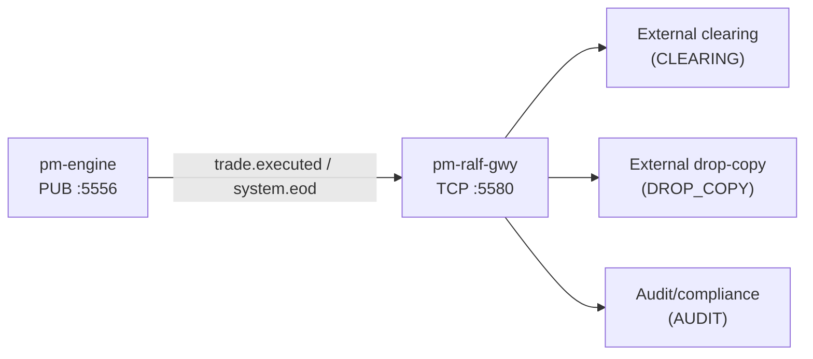

# Post-Trade Dissemination (RALF)

!!! note "Learning objectives"
    After reading this page you will understand:

    - what `pm-ralf-gwy` does and where it sits in the EduMatcher architecture
    - how to start and configure the RALF gateway for external consumers
    - how external parties subscribe to `CLEARING`, `DROP_COPY`, and `AUDIT`
    - what replay and reconnect behavior is available in v1


## What this process adds

`pm-ralf-gwy` is a machine-facing dissemination gateway that translates internal
engine events into the RALF wire protocol over TCP.

RALF is intended for external parties such as:

- clearing systems
- risk/compliance drop-copy consumers
- audit and surveillance tooling

Unlike the interactive `pm-gateway`, `pm-ralf-gwy` is not used for order entry.
It is a read-only event dissemination process.


## Architecture position




## Quick start

### 1. Start the engine

```bash
pm-engine --verbose
```

### 2. Start the RALF gateway

```bash
pm-ralf-gwy
```

By default it reads `engine_config.yaml` from the same resolution path used by
other `pm-*` processes.

### 3. Connect an external client

```text
HELLO|CLIENT=ext01|PROTO=RALF1|ROLE=CLEARING|LASTSEQ=0
SUB|CH=CLEARING|SYM=*
```

The gateway responds with `WELCOME` and `SNAP`, then streams live `EXEC`/`EOD`
messages according to subscriptions.


## Configuration

`pm-ralf-gwy` supports an optional `post_trade_gateway` block in
`engine_config.yaml`:

```yaml
post_trade_gateway:
  name: "ralf-gwy01"
  bind_address: "0.0.0.0"
  port: 5580
  replay_retention_sec: 86400
  heartbeat_interval_sec: 1
  idle_timeout_sec: 5
  max_client_queue: 10000
  allowed_roles:
    - CLEARING
    - DROP_COPY
    - AUDIT
```

CLI overrides:

```bash
pm-ralf-gwy --config engine_config.yaml --bind 127.0.0.1 --port 5580 --engine-pub tcp://127.0.0.1:5556
```


## Generate config with `pm-config-gen`

If you do not want to write the `post_trade_gateway` block by hand, generate it
alongside the main engine config with `pm-config-gen`:

```bash
pm-config-gen \
  --symbols AAPL MSFT \
  --gateways TRADER01 TRADER02 OPS01:ADMIN \
  --sessions-enabled \
  --post-trade-gateway \
  --post-trade-bind-address 127.0.0.1 \
  --post-trade-port 5580 \
  --post-trade-replay-retention-sec 3600 \
  --post-trade-heartbeat-interval-sec 1 \
  --post-trade-idle-timeout-sec 10 \
  --post-trade-max-client-queue 2000 \
  --post-trade-allowed-roles CLEARING AUDIT \
  --output engine_config.yaml
```

This produces a normal `engine_config.yaml` for `pm-engine` plus a top-level
`post_trade_gateway` block for `pm-ralf-gwy`.

Expected generated section:

```yaml
post_trade_gateway:
  name: ralf-gwy01
  bind_address: 127.0.0.1
  port: 5580
  replay_retention_sec: 3600
  heartbeat_interval_sec: 1
  idle_timeout_sec: 10
  max_client_queue: 2000
  allowed_roles:
    - CLEARING
    - AUDIT
```

Use `127.0.0.1` for a single-host lab. If external consumers must connect from
other machines, change the bind address to a controlled network-facing value
such as `0.0.0.0` and restrict access at the network boundary.


## Channels and subscriptions

The gateway supports three channels:

| Channel | Intended consumers |
|---|---|
| `CLEARING` | Clearing and reconciliation systems |
| `DROP_COPY` | Risk and compliance subscribers |
| `AUDIT` | Audit/surveillance consumers |

Example subscriptions:

```text
SUB|CH=CLEARING|SYM=*
SUB|CH=DROP_COPY|SYM=AAPL,MSFT
SUB|CH=AUDIT|SYM=*
```

Unsubscribe:

```text
UNSUB|CH=DROP_COPY|SYM=AAPL
```


## Replay and reconnect

On reconnect, the client can include `LASTSEQ` in `HELLO`:

```text
HELLO|CLIENT=ext01|PROTO=RALF1|ROLE=CLEARING|LASTSEQ=1200
```

Behavior:

- if retained journal data exists for `SEQ > LASTSEQ`, the gateway replays it
- if the requested point is older than retained data, gateway emits
  `ERR|CODE=REPLAY_MISS` and a `SNAP` baseline hint


## Client examples

Two full working client/library examples are provided in:

- `docs-design/examples/ralf/ralf_subscriber.py`
- `docs-design/examples/ralf/ralf_subscriber.c`

They use reusable parser libraries in the same directory and demonstrate:

- TCP connection + `HELLO`
- channel subscriptions
- line parsing for incoming RALF events


## Operational notes

- Keep `pm-ralf-gwy` separate from human-facing gateways.
- Use role-based channel policy for external connectivity.
- Monitor slow-client behavior and queue pressure (`SLOW_CLIENT` errors).
- For local labs, bind to `127.0.0.1`; for multi-host demos use a controlled
  network and perimeter security controls.


## See also

- [Processes](10-processes.md#pm-ralf-gwy-post-trade-dissemination-gateway)
- [Drop Copy](13-drop-copy.md)
- [Appendix - RALF Protocol](23-app-ralf-protocol.md)
