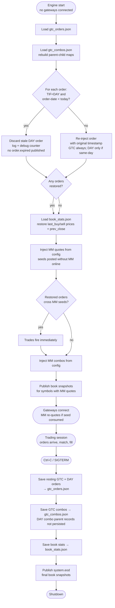

# Persistence — Data Across Trading Sessions

!!! note "Learning objectives"
    After reading this page you will understand:

    - Every data file EduMatcher writes, which process creates it, when, why, and how to query it
    - Which data files survive an engine restart and what each one contains
    - How GTC orders preserve their price-time priority across sessions
    - The exact shutdown and startup sequence that keeps the order book consistent
    - How book statistics allow stop orders to trigger correctly on the first trade of a new day
    - How to safely inspect, edit, or delete persistence files between sessions

EduMatcher models a real exchange behaviour: **Good-Till-Cancelled (GTC)** orders
survive the end of a trading session and are automatically restored when the system
restarts for the next day. A resting **Day (DAY)** order also survives an engine
restart, as long as the restart happens on the same business day it was
submitted — a process restart is not itself a day boundary; a DAY order is
only discarded, at the next startup, once its business day has actually
passed. See [Trading Day Lifecycle](#trading-day-lifecycle) below. Several
other data files are also maintained across sessions to preserve market
state and historical records.

!!! tip "Where is the data directory?"
    All persistence files live under the **data directory**, which varies by
    installation mode:

    | Mode               | Default path                |
    |--------------------|-----------------------------|
    | Developer (Poetry) | `<repo>/src/data/`          |
    | Installed (pipx)   | `~/.local/share/edumatcher` |
    | Custom             | `$EDUMATCHER_DATA_DIR`      |

    See [Getting Started → Environment variables](000-getting-started.md#environment-variables) for override details.


## Data files at a glance

This is the single reference for **every data file EduMatcher writes** — what it
is, which process creates it, when, why, and how to read it. All paths are
relative to the data directory shown above.

The files fall into two groups.

**Engine state files** — written by `pm-engine` on a clean shutdown and reloaded
at the next startup so the market resumes where it left off.

| File | Written by | When | Purpose | Read / extract with |
|------|------------|------|---------|---------------------|
| `gtc_orders.json` | `pm-engine` | Periodic checkpoint and clean shutdown (Ctrl-C) | Resting GTC orders, and resting same-day DAY orders, restored with their price-time priority at next startup — a stale DAY order (from an earlier business day) is discarded at restore instead | JSON; loaded by the engine at startup |
| `gtc_combos.json` | `pm-engine` | Clean shutdown | Resting GTC combo parents and their child-leg links | JSON; loaded by the engine at startup |
| `book_stats.json` | `pm-engine` | Clean shutdown | Last buy/sell price and previous-close per symbol; seeds the collar and circuit-breaker reference at the next open, and the `SYMBOLS` command's `prev_close` field | JSON; loaded by the engine at startup |

**Accumulating data stores** — written by the optional subscriber processes while
a session runs. They grow across sessions (never auto-truncated) and each has a
dedicated query tool.

| File | Written by | When | Purpose | Read / extract with |
|------|------------|------|---------|---------------------|
| `stats.db` (SQLite) | `pm-stats` | Per trade · a price snapshot every 15 min · at EOD · every `index.update` tick | OHLCV daily stats, intraday price snapshots, per-trade log, index level snapshots and daily OHLC | **`pm-stats-cli`** or SQL — see [Statistics & Reporting](140-statistics-and-reporting.md) |
| `clearing.db` (SQLite) | `pm-clearing` | Per trade · on gateway connect/disconnect · at EOD | Positions, VWAP cost, realized/unrealized P&L, daily summaries, trade events, sessions | **`pm-clearing-cli`** or SQL — see [P&L & Clearing](130-pnl-clearing.md) |
| `audit.log` | `pm-audit` | Continuously (buffered flush); rotates at 10 MB × 5 backups | Full chronological trail of every message on the bus | **`pm-audit-cli`** — see [Audit Trail](190-audit.md) |
| `audit_index.db` (SQLite) | `pm-audit-cli` | On demand, when you run an indexed query | Fast lookup index built over `audit.log` | **`pm-audit-cli`** |
| `indexes/<ID>_history.jsonl` | `pm-index` (triggered by [`pm-index-admin-cli`](152-index-admin-cli.md) for `CORP_ACTION`/`ADD_CONSTITUENT`/`DELIST`) | On structural events only (`INIT`, `CORP_ACTION`, `ADD_CONSTITUENT`, `DELIST`) | Structural/corporate-action audit trail — **not** level or EOD history (that lives in `stats.db`, written by `pm-stats`) | **`pm-index-cli`** (read-only) — see [Market Index](150-market-index.md) |
| `indexes/<ID>_state.json` | `pm-index` | On each update | Persisted divisor + last levels so the index resumes correctly after a restart | JSON; loaded by `pm-index` at startup |

!!! note "Reading the *When* column"
    **Per trade** = on every `trade.executed` event. **EOD** (end of day) = when
    the engine broadcasts `system.eod` on a clean shutdown. **Clean shutdown** =
    the engine caught `Ctrl-C`/`SIGINT` and finished its shutdown sequence — a hard
    kill (`SIGKILL`) skips these writes.

The engine state files are described in detail in the sections below; the
accumulating stores each have their own chapter (linked in the table).

!!! note "What is deliberately *not* persisted: quote inactivation history"
    The engine keeps a small, bounded, **in-memory-only** ring buffer per
    gateway of recently-inactivated MM quotes (filled or cancelled), used to
    answer the ALF `QLEGS|SHOW=RECENT` / `SHOW=ALL` subcommands and the
    equivalent `system.quote_legs_request` wire message — see
    [ALF Console → QLEGS](055-alf-console.md#qlegs-inspect-mm-quote-legs-and-fill-flags)
    and [Messages → `system.quote_legs_request`](270-message-reference.md#systemquote_legs_request).
    Unlike `gtc_orders.json`/`gtc_combos.json`, this history is **not** written
    to disk and does not survive an engine restart — a fresh engine process
    starts with empty history for every gateway. This is intentional: the
    persistence files on this page exist to restore **actionable, resting
    exposure** (orders and combos still working in the book) so the market
    resumes correctly after a restart. Quote inactivation history is neither
    resting nor actionable — it is a short operator convenience for "what just
    happened to my quote," and it is safe, by design, for it to reset to empty
    on every engine restart. The buffer's bound (30 entries per gateway by
    default) also does not need to be pre-sized against restart timing; it
    exists only to cap memory use during a single continuous run.


## How It Works

### At Shutdown (Ctrl-C on the engine)

A process exit — clean or otherwise — is **not** a day boundary. `TIF = DAY`
orders are no longer expired here; they are persisted the same as `TIF = GTC`
orders, and the same-day-vs-stale decision is made once, at the next
startup (see below). True end-of-day `DAY` expiry is driven separately by
the session scheduler's transition to `CLOSED` (see
[Trading Day Lifecycle](#trading-day-lifecycle) and
[Auctions & Scheduling](080-session-scheduling.md)), not by the engine
process exiting.

1. The engine collects all **resting** orders (status `NEW` or `PARTIAL`) from every order book with `TIF = GTC` or `TIF = DAY`.
2. Those orders are serialized to `<DATA_DIR>/gtc_orders.json`.
3. GTC combos (status `PENDING` or `PARTIALLY_MATCHED`) are serialized to `<DATA_DIR>/gtc_combos.json`. `DAY` combos are out of scope for this persistence: only their individual child orders survive per step 1-2 above, as plain resting orders — the combo parent record itself does not currently survive a restart.
4. Book statistics (`last_buy_price`, `last_sell_price`, and `prev_close` per symbol) are saved to `<DATA_DIR>/book_stats.json`.
5. A `system.eod` message is published with final book snapshots for all symbols (allows stats/viewers to record closing state).
6. ZMQ sockets are closed.

The engine also checkpoints steps 1-2 and 4 periodically while running (not
only at shutdown), so an abrupt exit — a crash, `SIGKILL`, container
eviction — loses at most one checkpoint interval of state rather than the
whole session.

### At Startup

1. The engine reads `<DATA_DIR>/gtc_orders.json` (if it exists).
2. Each `TIF = GTC` order is re-injected into its symbol's order book unconditionally, **with its original timestamp preserved**.
3. Each `TIF = DAY` order is re-injected **only if its own timestamp falls on the current business day** (machine-local calendar date). A `DAY` order dated before today — because the business day rolled over while the engine was up, or while it was down — is discarded instead, and the discard is logged at `INFO` level. This is the mechanism that ultimately gives `TIF = DAY` its intended meaning of "valid for the current trading day," independent of how many times the engine process itself has restarted in between.
4. The engine reads `<DATA_DIR>/gtc_combos.json` (if it exists) and rebuilds parent-child tracking maps for restored `GTC` combos.
5. If any orders were restored, initial book snapshots are published.
6. The engine reads `<DATA_DIR>/book_stats.json` (if it exists) and restores `last_buy_price` / `last_sell_price` / `prev_close` per symbol.  Persisted values take priority over config-seeded values.
7. Market-maker quotes from each symbol's `market_maker_quotes` config section are injected as linked bid/ask quote legs, unless `seed_once: true` (the default) and this symbol already has a `book_stats.json` entry (i.e. the engine has been started at least once before for this symbol, whether or not a quote survived that restart). **No gateway connection is required** — seeds enter the book before any participant dials in.  If a restored order already crosses a seed price, a trade executes immediately during this step.
8. Market-maker combos from the `market_maker_combos` config section are injected.
9. Book snapshots are published for any symbol where MM quotes were injected.
10. Original timestamps ensure that price-time priority carries over correctly — an order
    submitted yesterday still has seniority over a new order at the same price submitted today.


## Operational edge cases

- If `<DATA_DIR>/gtc_orders.json`, `<DATA_DIR>/gtc_combos.json`, or `<DATA_DIR>/book_stats.json`
  is malformed JSON, startup does **not** fail. The loader returns empty state
  for that file and the engine continues.
- Restored orders for symbols that no longer exist in the current config are
  skipped during restore rather than aborting startup.
- Because config quote seeds run **after** persisted order restore, a
  seeded `market_maker_quotes` entry with `seed_once: false` can duplicate
  already-restored quote inventory on restart — `seed_once: true` (the
  default) avoids this by skipping the seed whenever `book_stats.json`
  already has an entry for the symbol, regardless of whether a quote
  actually survived to be restored. Note this is a coarser check than "is
  there currently a live quote for this gateway/symbol": once a symbol has
  traded, its `book_stats` entry persists indefinitely, so a quote that
  later gets fully hit and removed will **not** be automatically re-seeded
  on a later restart even though no quote is actually resting — the
  operator would need `seed_once: false` or a manual `quote.new` to
  re-establish it. Separately, quote legs (`origin=QUOTE`) are currently
  **never** persisted to `gtc_orders.json` regardless of their `TIF` —
  unlike ordinary orders, which follow the GTC/DAY rule described above.
  This means every restart re-seeds from config (subject to the
  `seed_once` gate just described) rather than restoring a live quote's
  actual resting legs. This is a known, separately tracked gap — see
  `docs-design/EduMatcher-Revised-Quote-Persistence.md` §1-§7 (repository
  checkout only) — not a consequence of the TIF=DAY work described in this
  section.
- A `TIF = DAY` order now survives an engine restart the same as a `TIF =
  GTC` order does, as long as the restart happens on the same business day
  it rested on. This means restarting the engine mid-session to pick up a
  config change, or recovering from a crash, no longer cancels traders'
  DAY orders — only an actual business-day rollover does, checked once at
  the next startup. If you deliberately want to clear all resting DAY
  orders between sessions in a classroom setup that does not run
  `pm-scheduler`, restart the engine at least once after the date has
  rolled over — the stale-order check at startup discards them then. There
  is currently no live, mid-session sweep for this case (see
  [Auctions & Scheduling](080-session-scheduling.md) for the
  scheduler-driven equivalent when sessions are enabled).


## Order ID Stability

GTC order IDs are UUID4 strings generated at submission time by the gateway.
They **do not change** across restarts. Gateways and the order monitor will see
the same order ID in all events throughout the order's life.


## Submitting a GTC Order

Add `TIF=GTC` to any LIMIT, STOP, STOP_LIMIT, or ICEBERG order:

```
NEW|SYM=AAPL|SIDE=BUY|TYPE=LIMIT|QTY=100|PRICE=148.00|TIF=GTC
NEW|SYM=AAPL|SIDE=BUY|TYPE=ICEBERG|QTY=1000|PRICE=149.00|VISIBLE=100|TIF=GTC
```

MARKET, FOK, and IOC orders are always DAY orders — they cannot be GTC because they do not rest.


## The `gtc_orders.json` File

Format: a JSON array of serialized `Order` objects.

```json
[
  {
    "id": "3f2a1b4c-...",
    "symbol": "AAPL",
    "side": "BUY",
    "order_type": "LIMIT",
    "tif": "GTC",
    "quantity": 100,
    "remaining_qty": 100,
    "gateway_id": "GW01",
    "timestamp": 1714393921345678000,
    "status": "NEW",
    "price": 14800,
    ...
  }
]
```

!!! note "Internal representations in the JSON"
    Prices (`price`, `stop_price`, `trail_offset`) are stored as **integer tick
    values** — e.g. `14800` represents `148.00` for a symbol with `tick_decimals: 2`.
    Timestamps are **nanoseconds** since the Unix epoch, not seconds.

You can inspect or edit this file between trading sessions. Since this file now
also holds resting TIF=DAY orders (see [How It Works](#how-it-works) above),
deleting it before restarting clears **both** GTC and same-day DAY orders — not
just GTC ones as in earlier versions.


## Trading Day Lifecycle



!!! note "No day-rollover sweep while running"
    The engine does **not** watch for midnight and does not halt trading to
    purge stale DAY orders while it is running — the business-day check above
    only runs at startup. In a classroom setting with `sessions_enabled: false`
    (no [`pm-scheduler`](080-session-scheduling.md)), a stale TIF=DAY order from
    a previous business day is only discarded the next time the engine
    restarts. See the design rationale in
    `docs-design/EduMatcher-Revised-Quote-Persistence.md` §13.1 (repository
    checkout only).


## Cancelling a GTC Order

Cancel it like any other order while the engine is running:

```
CANCEL|ID=<full-order-id>|RTAG=gtc-cxl-001
```

Cancelled orders are **not** included in the GTC save at shutdown — they are
already marked `CANCELLED`.

!!! tip
    To find the full order ID, type `ORDERS` in your gateway terminal or check the audit log.


## The `book_stats.json` File

Preserves the **last trade price context** per symbol across sessions. This serves two
purposes: it allows the engine to correctly trigger stop orders on the first trade of a
new day (stops compare against `last_trade_price`, which would otherwise be unknown), and
it carries the prior session's closing price forward as `prev_close`, which the engine
reports in its `SYMBOLS` command response so gateways can show a previous-close reference.

Format: a JSON object keyed by symbol. Unlike `gtc_orders.json` and `gtc_combos.json`,
prices here are stored as **display floats** (not integer ticks) — the save path
deliberately converts ticks to display prices before writing, and the load path converts
back on restore, so values round-trip exactly regardless of a symbol's `tick_decimals`:

```json
{
  "AAPL": {"last_buy_price": 150.25, "last_sell_price": 149.80, "prev_close": 150.10},
  "MSFT": {"last_buy_price": null, "last_sell_price": 415.50, "prev_close": 415.50}
}
```

- `last_buy_price`: display price of the most recent trade where the buyer was the aggressor
- `last_sell_price`: display price of the most recent trade where the seller was the aggressor
- `prev_close`: display price of the most recent trade overall (`last_trade_price`), carried forward as the next session's previous-close reference
- `null` means no trade of that type occurred during the session

On startup, persisted values **override** any `last_buy_price` / `last_sell_price` seeded
in `engine_config.yaml`.  Config seeds are only used when no persisted file exists (first run).

!!! note "Config seeds are the IPO price; persisted stats are the carried-over close"
    The `last_buy_price` / `last_sell_price` in `engine_config.yaml` are the
    symbol's opening ([IPO](010-configuration.md#adding-or-removing-symbols))
    reference, used **only** on the very first startup. On every later restart
    the persisted `book_stats.json` value wins, so a symbol re-opens from where
    it last traded rather than snapping back to a now-stale config price. Both
    the collar and circuit-breaker references use this same resolved value — see
    [Risk Controls - Day one (IPO) behaviour](120-risk-controls.md#day-one-ipo-behaviour).


## The `gtc_combos.json` File

Format: a JSON array of serialized `ComboOrder` objects (only combos with TIF=GTC and
status `PENDING` or `PARTIALLY_MATCHED`):

```json
[
  {
    "id": "internal-uuid",
    "combo_id": "MY-PAIR-01",
    "gateway_id": "GW01",
    "combo_type": "AON",
    "tif": "GTC",
    "timestamp": 1714393921345678000,
    "legs": [ ... ],
    "status": "PARTIALLY_MATCHED",
    "child_order_ids": ["uuid-1", "uuid-2"],
    "leg_fill_qty": {"0": 50, "1": 0},
    "leg_statuses": {"0": "PARTIAL", "1": "NEW"}
  }
]
```

On restore, the engine rebuilds the `_combos` and `_order_to_combo` tracking maps so
that fill events on restored child orders correctly propagate to their parent combo.


## Other Persistent Files

These files are maintained by subscriber processes (not the engine) and accumulate
data continuously across sessions. They are **never truncated automatically** — to
reset them, delete them manually between sessions.

---

### `src/data/audit.log`

**Written by**: `pm-audit`  
**Written**: continuously — one line per ZeroMQ message received  
**Read by**: `pm-audit-cli`, manual inspection, `grep`, log-analysis tools  
**Reset**: delete or rotate manually; the process creates a fresh file on startup  

`pm-audit` subscribes to **all topics** on the engine PUB socket (`:5556`) and
appends every message as a single line:

```
[TIMESTAMP] [TOPIC] {JSON_PAYLOAD}
```

Example lines:

```
[2026-04-29T14:30:00.123+00:00] [system.gateway_auth.GW01] {"accepted": true, "gateway_id": "GW01"}
[2026-04-29T14:30:01.456+00:00] [order.ack.GW01] {"id": "3f2a1b4c-...", "symbol": "AAPL", "accepted": true, "status": "RESTING"}
[2026-04-29T14:30:02.789+00:00] [trade.executed] {"id": "abc123", "symbol": "AAPL", "price": 150.05, "quantity": 200, "buy_gateway_id": "GW01", "sell_gateway_id": "MM01", "timestamp": 1714399802789000000}
[2026-04-29T14:30:02.791+00:00] [order.fill.GW01] {"id": "3f2a1b4c-...", "symbol": "AAPL", "side": "BUY", "fill_qty": 200, "fill_price": 150.05, "remaining_qty": 0, "status": "FILLED"}
[2026-04-29T16:05:00.000+00:00] [session.state] {"state": "CLOSED"}
```

**Format details**:

| Component        | Description                                                                        |
|------------------|------------------------------------------------------------------------------------|
| `TIMESTAMP`      | ISO 8601 UTC with millisecond precision (`2026-04-29T14:30:01.456+00:00`)          |
| `TOPIC`          | The ZeroMQ topic string, e.g. `order.fill.GW01`, `trade.executed`, `session.state` |
| `{JSON_PAYLOAD}` | The full message payload as compact JSON — no pretty-printing                      |

The topic is **not** a JSON field inside the payload; it appears as a separate
bracket-delimited token on the same line.

**File rotation**: `RotatingFileHandler` — maximum 10 MB per file, 5 backup files
(`audit.log.1` through `audit.log.5`). Oldest backup is deleted when a sixth
would be created.

**Useful grep patterns**:

```bash
# All trades
grep '\[trade\.executed\]' src/data/audit.log

# All fills for gateway GW01
grep '\[order\.fill\.GW01\]' src/data/audit.log

# All session-state changes
grep '\[session\.state\]' src/data/audit.log

# Events in a specific time window
grep '^\[2026-04-29T14:3' src/data/audit.log
```

---

### `src/data/clearing.db`

**Written by**: `pm-clearing`  
**Written**: continuously — on every `trade.executed`, gateway connect/disconnect, and `system.eod` event  
**Read by**: `pm-clearing-cli`, direct SQL queries, post-trade analysis scripts  
**Reset**: delete manually; `pm-clearing` recreates the schema (`CREATE TABLE IF NOT EXISTS`) on startup, so restarting against an existing file is safe  

A SQLite database that accumulates across sessions. It holds an append-only
`trade_events` fact table plus running-state tables for positions and daily
summaries, and clearing-lifecycle tables for sessions and connections. The full
schema (five tables and two views) and the VWAP/realized/unrealized P&L formulas
are documented in [P&L & Clearing](130-pnl-clearing.md#sqlite-database-schema).

If `pm-clearing` is not running when a trade executes, that trade is not recorded
here (it is still in `stats.db` and `audit.log`).

---

### `src/data/stats.db`

**Written by**: `pm-stats`  
**Written**: on every `trade.executed` event and every 15-minute book snapshot  
**Read by**: `pm-ticker`, `pm-board`, direct SQL queries, `pm-stats-cli`  
**Reset**: delete manually; `pm-stats` creates a fresh database with the schema on startup  

A SQLite database containing three tables. The schema is created automatically
by `pm-stats` using `CREATE TABLE IF NOT EXISTS` on startup; it is safe to
restart `pm-stats` against an existing database.

#### Table: `daily_stats`

One row per `(date, symbol)` pair. Upserted on every trade and at end-of-day.

```sql
CREATE TABLE IF NOT EXISTS daily_stats (
    date                TEXT NOT NULL,    -- ISO date string, e.g. '2026-04-29'
    symbol              TEXT NOT NULL,    -- e.g. 'AAPL'
    open_price          REAL,             -- first trade price of the day
    high_price          REAL,             -- highest trade price of the day
    low_price           REAL,             -- lowest trade price of the day
    close_price         REAL,             -- most recent trade price (updated on every trade)
    open_bid            REAL,             -- best bid at session open
    open_ask            REAL,             -- best ask at session open
    close_bid           REAL,             -- most recent best bid
    close_ask           REAL,             -- most recent best ask
    volume              INTEGER NOT NULL DEFAULT 0,   -- total shares traded today
    trade_count         INTEGER NOT NULL DEFAULT 0,   -- number of individual executions
    vwap                REAL,             -- volume-weighted average price
    largest_trade_qty   INTEGER,          -- single largest execution quantity
    largest_trade_price REAL,             -- price of that largest execution
    PRIMARY KEY (date, symbol)
);
```

Example row:

```sql
SELECT * FROM daily_stats WHERE symbol = 'AAPL' ORDER BY date DESC LIMIT 1;
-- date='2026-04-29', symbol='AAPL', open_price=149.50, high_price=152.00,
-- low_price=148.75, close_price=151.25, open_bid=149.45, open_ask=149.55,
-- close_bid=151.20, close_ask=151.30, volume=42300, trade_count=184,
-- vwap=150.37, largest_trade_qty=500, largest_trade_price=150.00
```

#### Table: `price_snapshots`

One row per `(timestamp, symbol)` pair, written approximately every 15 minutes
from book-state events. Used by `pm-ticker` and `pm-board` for intraday charts.

```sql
CREATE TABLE IF NOT EXISTS price_snapshots (
    ts          TEXT NOT NULL,   -- ISO datetime string, e.g. '2026-04-29T14:30:00'
    symbol      TEXT NOT NULL,   -- e.g. 'AAPL'
    mid_price   REAL,            -- (best_bid + best_ask) / 2; NULL if no quote
    best_bid    REAL,            -- top-of-book bid price; NULL if empty
    best_ask    REAL,            -- top-of-book ask price; NULL if empty
    pct_change  REAL,            -- % change from open_price; NULL if no open yet
    PRIMARY KEY (ts, symbol)
);
```

The mid-price fallback chain when the book has no two-sided quote:
1. `(best_bid + best_ask) / 2` if both sides present
2. `best_bid` if only bids present
3. `best_ask` if only asks present
4. `NULL` if the book is completely empty

`INSERT OR IGNORE` is used — duplicate `(ts, symbol)` entries are silently
discarded, so re-sending a snapshot for the same timestamp is safe.

#### Table: `trade_log`

One row per individual trade execution. Written on every `trade.executed` event.

```sql
CREATE TABLE IF NOT EXISTS trade_log (
    ts              TEXT NOT NULL,       -- ISO datetime string
  trade_id        TEXT NOT NULL PRIMARY KEY,  -- durable engine trade id
    symbol          TEXT NOT NULL,       -- e.g. 'AAPL'
    price           REAL NOT NULL,       -- execution price as display decimal
    quantity        INTEGER NOT NULL,    -- executed quantity
    buy_gateway_id  TEXT,                -- gateway that was the buyer
    sell_gateway_id TEXT                 -- gateway that was the seller
);
```

  `INSERT OR IGNORE` on `trade_id` makes duplicate deliveries safe. Modern engine
  IDs are durable strings such as `000042-000000001`, where the prefix is the
  engine run sequence and the suffix is the trade counter within that run. Older
  statistics database files are not migrated and must be recreated.

**Example queries**:

```sql
-- Today's OHLCV for all symbols
SELECT symbol, open_price, high_price, low_price, close_price, volume
FROM daily_stats
WHERE date = date('now')
ORDER BY symbol;

-- Trade history for AAPL in the last hour
SELECT ts, price, quantity, buy_gateway_id, sell_gateway_id
FROM trade_log
WHERE symbol = 'AAPL'
  AND ts >= datetime('now', '-1 hour')
ORDER BY ts;

-- Intraday mid-price series for charting
SELECT ts, mid_price, pct_change
FROM price_snapshots
WHERE symbol = 'AAPL'
  AND ts >= date('now')
ORDER BY ts;
```

---

## Summary of All Data Files

For the complete file-by-file map — every data file, the process that writes it,
its cadence, its purpose, and the tool used to read it — see
[Data files at a glance](#data-files-at-a-glance) near the top of this page. The
engine state files (`gtc_orders.json`, `gtc_combos.json`, `book_stats.json`) are
described in detail in the sections above.

!!! note "Data directory path depends on how EduMatcher is run"
    The paths shown above use `src/data/` because that is the default for a
    **developer source checkout** (detected by `config.py` checking whether its
    own parent directory is named `src`).

    The full resolution order is:

    | Priority | Condition | Resolved path |
    |---|---|---|
    | 1 — Explicit | `EDUMATCHER_DATA_DIR` env var is set | Value of `$EDUMATCHER_DATA_DIR` |
    | 2 — Installed | Running from a `pipx`/`pip` install | `~/.local/share/edumatcher/` |
    | 3 — Developer | Running from a source checkout | `<repo>/src/data/` |

    For a **clean product install** (`pipx install edumatcher`) the data
    directory is `~/.local/share/edumatcher/` — no `src/` prefix is involved.
    Run `pm-setup` once after installation to create this directory and copy a
    sample config file.

    A project-root `data/` directory also exists in the repository (used for
    sample CSVs) but is never written to by any runtime process.

## See also

- [Order Types — TIF](060-order-types.md#time-in-force-tif) — GTC, ATO, and ATC lifetime rules
- [Auctions & Scheduling](080-session-scheduling.md) — how ATO/ATC orders expire at phase transitions
- [Processes](170-processes.md#pm-stats-statistics-recorder) — `pm-stats` writes `stats.db`; `pm-audit` writes `audit.log`
- [Configuration](010-configuration.md) — `last_buy_price`/`last_sell_price` config seeds vs persisted values


