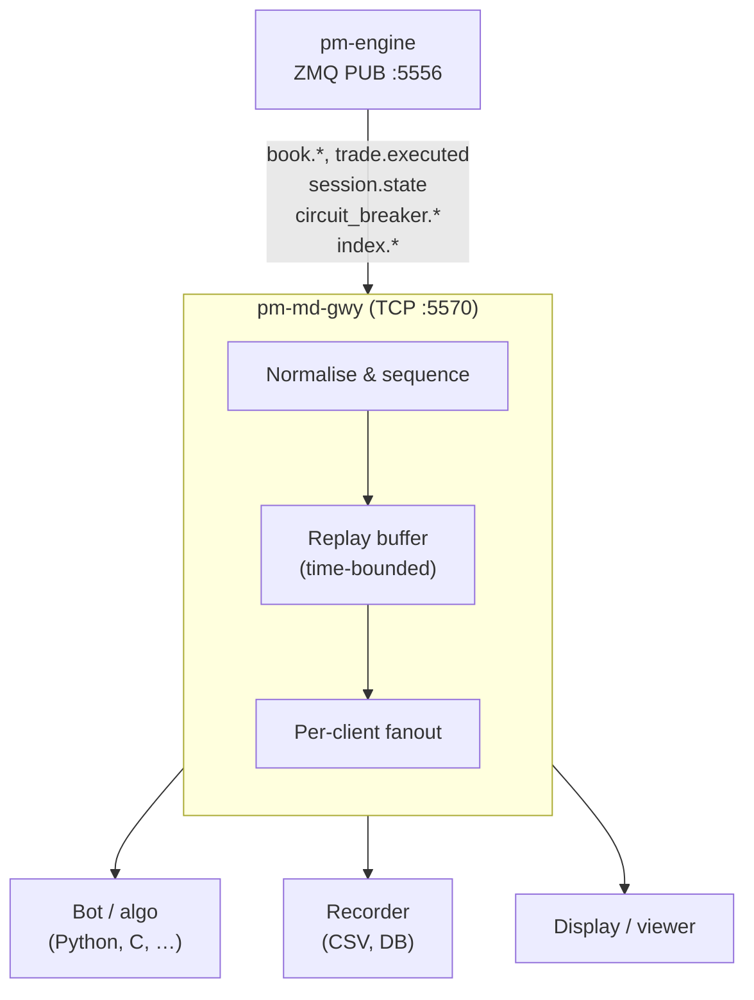
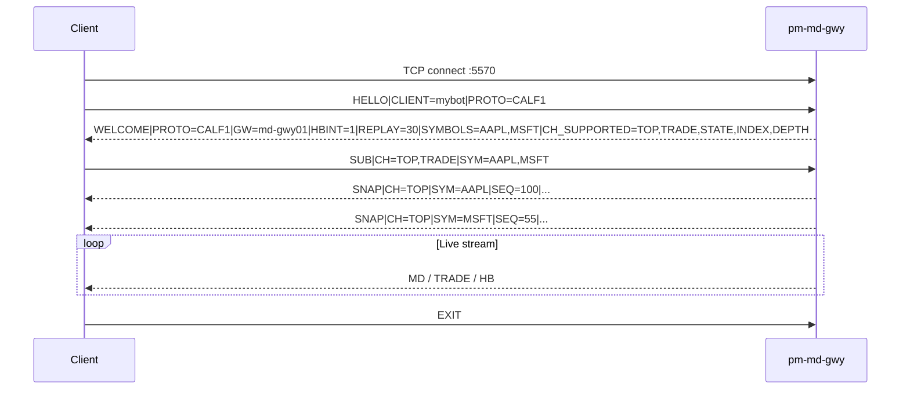
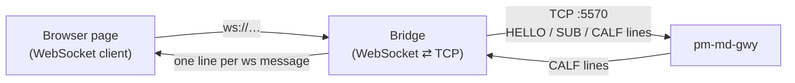

# Market Data Feed (CALF)

!!! note "Learning objectives"
    After reading this page you will understand:

    - what `pm-md-gwy` does and why CALF exists as an external feed
    - what data is available on each channel (`TOP`, `TRADE`, `STATE`, `INDEX`, `DEPTH`)
    - which channels accept the `SYM=*` wildcard (`TOP`, `TRADE`, `STATE` — not `INDEX`/`DEPTH`)
    - how to detect gateway capability via `WELCOME|CH_SUPPORTED=` before relying on `DEPTH`
    - when to choose CALF over the other available protocols
    - how to start the gateway and verify connectivity from a terminal
    - how to subscribe to a filtered subset of symbols and channels
    - how snapshot delivery works and when to expect a `SNAP`
    - how to detect sequence gaps and recover with `RESUME=1`
    - how to write a working Python subscriber using the library in `examples/calf/`
    - the exact fields carried by every message on every channel
    - what kinds of tools you can build on the feed, and how a browser client
      reaches it through a server-side WebSocket bridge
    - which operational checks to use when debugging connectivity problems


## What this process is

`pm-md-gwy` is the CALF market-data gateway.  The matching engine publishes
market events on an internal ZeroMQ PUB socket (`:5556`) that is not accessible
to external clients.  `pm-md-gwy` bridges that gap: it subscribes to the engine
PUB socket, normalises raw engine events into CALF lines, and re-publishes them
over TCP (default port `5570`) in a format any language can consume with a plain
socket and line-split logic.



Responsibilities of `pm-md-gwy`:

- translates engine events into CALF lines
- assigns **per-stream sequence numbers** on each `(channel, symbol)` pair
- keeps a **time-bounded replay buffer** so reconnecting clients can recover
  missed messages without a full snapshot
- sends an automatic **baseline snapshot** (`SNAP`) when a client first
  subscribes to a `TOP`, `STATE`, `INDEX`, or `DEPTH` stream (a wildcard
  `TOP` subscription gets one real `SNAP` per known symbol, not a single
  `SYM=*` snapshot)
- advertises which channels a given gateway build supports via
  `WELCOME|CH_SUPPORTED=`, so clients can detect `DEPTH`/`INDEX`/wildcard
  availability without a protocol version bump
- enforces per-client subscription limits and disconnects slow clients


## The feed at a glance

Everything a client needs to know in one place. Read this section first; the rest
of the chapter is detail.

| Property | Value |
|----------|-------|
| Process | `pm-md-gwy` |
| Transport | plain TCP, newline-delimited UTF-8 text |
| Default port | `5570` (`market_data_gateway.port`) |
| Protocol token | `CALF1` (in `HELLO` / `WELCOME`) — unchanged across gateway builds |
| Line format | `MSGTYPE\|KEY=VALUE\|KEY=VALUE\n` |
| Max line length | 4096 bytes (longer → `ERR\|CODE=BAD_MESSAGE`) |
| Channels | `TOP`, `TRADE`, `STATE`, `INDEX`, `DEPTH` |
| Heartbeat | every `heartbeat_interval_sec` (default 1 s) when a stream is quiet |
| Idle timeout | disconnect after `idle_timeout_sec` (default 5 s) with no inbound data |
| Replay window | `replay_window_sec` (default 30 s), tracked per `(channel, symbol)` stream |
| Values | prices as decimal text, sizes as integers, timestamps ISO-8601 UTC |

Because it is line-based text over TCP, a client needs nothing more than a socket
and a newline split — no ZeroMQ binding, no schema compiler, no dependencies. That
is the whole point of CALF: **any language can read the market in a few lines of
code.**

### Message catalogue

**Client → gateway**

| Message | Purpose |
|---------|---------|
| `HELLO\|CLIENT=..\|PROTO=CALF1` | Open a session. Optional `RESUME=1\|CH=..\|SYM=..\|LASTSEQ=..` requests single-stream replay on reconnect |
| `SUB\|CH=..\|SYM=..` | Subscribe. Channels × symbols, comma-separated; `SYM=*` where allowed. Cumulative across lines |
| `UNSUB\|CH=..\|SYM=..` | Cancel subscriptions (idempotent) |
| `PING` | Liveness probe — gateway replies `PONG` |
| `EXIT` | Close the session |

**Gateway → client**

| Message | Channel(s) | Meaning |
|---------|-----------|---------|
| `WELCOME` | — | Session accepted; carries `GW`, `HBINT`, `REPLAY`, `SYMBOLS`, `CH_SUPPORTED` |
| `SNAP` | TOP, STATE, INDEX, DEPTH | Baseline snapshot for a stream — the `SEQ` you anchor on |
| `MD` | TOP | Incremental top-of-book change (only the fields that changed) |
| `TRADE` | TRADE | One executed trade |
| `STATE` | STATE | Session-phase transition, or a symbol halt/resume |
| `IDX` | INDEX | Index level recalculation |
| `DEPTH` | DEPTH | Full top-N ladder for the changed side(s) |
| `HB` | — | Heartbeat while the stream is quiet |
| `PONG` | — | Reply to `PING` |
| `ERR\|CODE=..` | — | Protocol or subscription error (see [Common errors](#common-errors-and-fixes)) |

### The envelope on every market-data line

`SNAP`, `MD`, `TRADE`, `STATE`, `IDX`, and `DEPTH` all begin with the same four
envelope fields, followed by channel-specific payload fields:

| Field | Meaning |
|-------|---------|
| `CH` | Channel: `TOP`, `TRADE`, `STATE`, `INDEX`, or `DEPTH` |
| `SYM` | Symbol; the index id on `INDEX`; or `*` on a session-wide `STATE` line |
| `SEQ` | Per-`(CH, SYM)` sequence number — starts at 1, +1 per message. Your gap detector |
| `TS` | Event time, ISO-8601 UTC with milliseconds (e.g. `2026-06-30T09:30:00.000Z`) |

### The five channels

| Channel | Incremental msg | Baseline `SNAP`? | `SYM=*`? | Payload fields | Primary use |
|---------|-----------------|------------------|----------|----------------|-------------|
| `TOP` | `MD` | Yes (one per symbol when `SYM=*`) | Yes (1.0.0+) | `BID BIDSZ ASK ASKSZ LAST LASTSZ` | best bid/ask/last, price widgets, algos |
| `TRADE` | `TRADE` | No | Yes (1.0.0+) | `PX QTY SIDE` | time-and-sales tape, VWAP/OHLCV |
| `STATE` | `STATE` | Yes | Yes | `SESSION PREV` | halt gating, session-phase display |
| `INDEX` | `IDX` | Yes (1.0.0+) | No | `LEVEL SESSION OPEN CHG PCTCHG HIGH LOW AGGCAP` | index trackers, benchmarks |
| `DEPTH` | `DEPTH` | Yes | No | `LEVELS BIDS ASKS` | order-book (DOM) widgets, Level-2 teaching |

Each channel is detailed under [What information is available](#what-information-is-available); the exact field meanings are in the per-channel field tables there.


## Prerequisites

- `pm-engine` running
- `pm-md-gwy` running
- symbols configured in `engine_config.yaml`

Optional but recommended in config:

```yaml
market_data_gateway:
  enabled: true
  name: "md-gwy01"
  bind_address: "0.0.0.0"
  port: 5570
  heartbeat_interval_sec: 1
  idle_timeout_sec: 5
  replay_window_sec: 30
  max_symbols_per_client: 200
  max_client_queue: 10000
  depth_levels: 10
```

All keys are optional; the defaults below apply when the block (or a key) is
omitted. `pm-md-gwy` reads only this `market_data_gateway` block — see
[Configuration → Which Process Reads What](01-configuration.md#which-process-reads-what).

| Key | Default | Purpose |
|-----|---------|---------|
| `enabled` | `true` | Reserved on/off flag for the gateway instance |
| `name` | `md-gwy01` | Gateway id reported in `WELCOME\|GW=` |
| `bind_address` | `0.0.0.0` | TCP listen address |
| `port` | `5570` | TCP listen port |
| `heartbeat_interval_sec` | `1` | `HB` cadence when idle; advertised as `WELCOME\|HBINT=` |
| `idle_timeout_sec` | `5` | Disconnect a client after this many seconds with no inbound data |
| `replay_window_sec` | `30` | Per-stream replay retention; advertised as `WELCOME\|REPLAY=` |
| `max_symbols_per_client` | `200` | Subscription cap per client; exceeding it returns `ERR\|CODE=SUB_LIMIT` |
| `max_client_queue` | `10000` | Outbound backlog limit; exceeding it returns `ERR\|CODE=SLOW_CLIENT` and disconnects |
| `depth_levels` | `10` | Price levels per side on the `DEPTH` channel; surfaced as `LEVELS=` |

All values must be positive integers (`port`, the intervals, the limits); the
gateway refuses to start otherwise.


## Start the gateway

Installed mode:

```bash
pm-engine --verbose
pm-md-gwy --config engine_config.yaml
```

Developer mode:

```bash
poetry run pm-engine --verbose
poetry run pm-md-gwy --config engine_config.yaml
```


## Quick connect test

Use `nc` (or `telnet`) to validate the line protocol from the command line before
writing any code:

```bash
nc 127.0.0.1 5570
```

Then type:

```text
HELLO|CLIENT=demo01|PROTO=CALF1
SUB|CH=TOP,TRADE|SYM=AAPL
```

Expected response pattern:

1. `WELCOME|...` — session open
2. `SNAP|CH=TOP|SYM=AAPL|...` — baseline snapshot
3. `MD|...` when top of book changes
4. `TRADE|...` when a trade executes
5. `HB|...` when the stream is quiet

To verify the STATE channel and the wildcard subscription:

```text
SUB|CH=STATE|SYM=*
```

You should receive an immediate `SNAP|CH=STATE|SYM=*|...` followed by live
`STATE|...` lines on session-phase and halt/resume events.

Since CALF `1.0.0`, `SYM=*` also works for `TOP` and `TRADE` — useful for a
market-wide trade tape or "watch everything" bot:

```text
SUB|CH=TRADE|SYM=*
```

Unlike `STATE`'s wildcard, a wildcard `TOP` subscription does **not** send a
single `SNAP|SYM=*`. It sends one real `SNAP` per symbol the gateway
currently knows about, then live `MD` for any symbol — including ones added
later — through that same subscription.

To verify the `DEPTH` channel (check `WELCOME|CH_SUPPORTED=` first — see
below):

```text
SUB|CH=DEPTH|SYM=AAPL
```

Expect an immediate `SNAP|CH=DEPTH|SYM=AAPL|LEVELS=...|BIDS=...|ASKS=...`,
then a `DEPTH|...` line whenever the top price levels change.


## What information is available

The gateway exposes five logical channels.  Each represents a different view of
market activity.

### Channel `TOP` — best bid, ask, and last trade

`TOP` carries incremental updates to the top-of-book for a single symbol.
When the best bid price, bid size, ask price, ask size, or last-trade price/size
changes, the gateway emits one `MD` line containing only the fields that changed.

**When you get it:** Subscribe with `CH=TOP|SYM=<symbol>`.  The gateway
immediately sends a `SNAP` baseline, then streams incremental `MD` events.
Since CALF `1.0.0`, `SYM=*` is also valid on `TOP` — it produces one `SNAP`
per known symbol rather than a single wildcard snapshot (see "Channel
summary" below).

**Typical use cases:** algo trading, live bid/ask/last widgets, real-time price
tracking.

**Wire example:**

```text
SNAP|CH=TOP|SYM=AAPL|SEQ=1|TS=2026-06-30T09:30:00.000Z|BID=150.10|BIDSZ=1200|ASK=150.12|ASKSZ=900|LAST=150.11|LASTSZ=300
MD|CH=TOP|SYM=AAPL|SEQ=2|TS=2026-06-30T09:30:00.500Z|BID=150.11|BIDSZ=1400
MD|CH=TOP|SYM=AAPL|SEQ=3|TS=2026-06-30T09:30:01.100Z|ASK=150.13|ASKSZ=700|LAST=150.12|LASTSZ=200
```

**Fields** (payload after the `CH SYM SEQ TS` envelope):

| Field | Type | Meaning |
|-------|------|---------|
| `BID` | decimal | Best (highest) bid price |
| `BIDSZ` | integer | Total resting size at the best bid |
| `ASK` | decimal | Best (lowest) ask price |
| `ASKSZ` | integer | Total resting size at the best ask |
| `LAST` | decimal | Last trade price |
| `LASTSZ` | integer | Last trade size |

A `SNAP` carries every field currently known; an `MD` carries **only the fields
that changed**. Fields omitted from an `MD` are unchanged — merge each `MD` into a
per-symbol state object seeded from the `SNAP`.

---

### Channel `TRADE` — every trade print

`TRADE` carries one line per matched trade: price, quantity, and aggressor side.
There is **no baseline `SNAP`** — the stream starts from events that occur after
the subscription becomes active.

**When you get it:** Subscribe with `CH=TRADE|SYM=<symbol>`, or `SYM=*`
(CALF `1.0.0`+) to receive every trade across every symbol on one
subscription — handy for a market-wide tape without enumerating tickers.

**Typical use cases:** time-and-sales tape, VWAP/OHLCV calculation, fill
attribution.

**Wire example:**

```text
TRADE|CH=TRADE|SYM=AAPL|SEQ=44|TS=2026-06-30T09:30:01.100Z|PX=150.12|QTY=200|SIDE=BUY
```

**Fields:**

| Field | Type | Meaning |
|-------|------|---------|
| `PX` | decimal | Execution price |
| `QTY` | integer | Executed quantity |
| `SIDE` | enum | Aggressor side — `BUY` or `SELL` (empty when the engine did not report one) |

---

### Channel `STATE` — session and symbol states

`STATE` carries two kinds of transitions:

- **Session-wide** (e.g. `PRE_OPEN → OPENING_AUCTION → CONTINUOUS`) with `SYM=*`
- **Symbol-level** circuit-breaker halts and resumes with `SYM=<symbol>`

The gateway sends an immediate `SNAP` for each new `(STATE, symbol)` stream.

`STATE` was the first channel to support `SYM=*`. Since CALF `1.0.0`, `TOP`
and `TRADE` also accept it (in any combination with `STATE`). `SYM=*` is
never valid for `INDEX` or `DEPTH` — see "Channel summary" below.

**When you get it:** `CH=STATE|SYM=*` for everything, or `CH=STATE|SYM=<symbol>`
for a single symbol.

**Typical use cases:** gating order flow on halts, session-phase displays,
back-test state annotation.

**Wire example:**

```text
SNAP|CH=STATE|SYM=*|SEQ=1|TS=2026-06-30T09:30:00.000Z|SESSION=PRE_OPEN
STATE|CH=STATE|SYM=*|SEQ=2|TS=2026-06-30T09:30:00.000Z|SESSION=OPENING_AUCTION|PREV=PRE_OPEN
STATE|CH=STATE|SYM=*|SEQ=3|TS=2026-06-30T09:30:05.000Z|SESSION=CONTINUOUS|PREV=OPENING_AUCTION
STATE|CH=STATE|SYM=AAPL|SEQ=1|TS=2026-06-30T10:02:17.000Z|SESSION=HALTED|PREV=CONTINUOUS
STATE|CH=STATE|SYM=AAPL|SEQ=2|TS=2026-06-30T10:05:00.000Z|SESSION=CONTINUOUS|PREV=HALTED
```

**Fields:**

| Field | Type | Meaning |
|-------|------|---------|
| `SESSION` | enum | New state. On `SYM=*`: `PRE_OPEN`, `OPENING_AUCTION`, `CONTINUOUS`, `CLOSING_AUCTION`, `CLOSED`. On a single symbol: `HALTED` (circuit-breaker/operator halt) or `CONTINUOUS` (resume) |
| `PREV` | enum | Previous state; present on transitions and on halt/resume, omitted on the first baseline `SNAP` |

---

### Channel `INDEX` — index level updates

`INDEX` carries one `IDX` line every time the index level is recalculated.
Since CALF `1.0.0`, the gateway sends an immediate baseline `SNAP` on
subscribe — the same pattern as `TOP`/`STATE`/`DEPTH` — followed by live
`IDX` updates.

**When you get it:** `CH=INDEX|SYM=<index_id>` (e.g. `CH=INDEX|SYM=EDU50`).
`SYM=*` is not valid for `INDEX` — an explicit index id is always required.

**Typical use cases:** index trackers, portfolio benchmark display, monitoring
day-open / day-high / day-low for the composite index.

**Wire example:**

```text
SNAP|CH=INDEX|SYM=EDU50|SEQ=1|TS=2026-06-30T09:30:00.000Z|LEVEL=5100.00|SESSION=PRE_OPEN
IDX|CH=INDEX|SYM=EDU50|SEQ=12|TS=2026-06-30T09:30:01.100Z|LEVEL=5123.45|SESSION=CONTINUOUS|OPEN=5100.00|CHG=+23.45|PCTCHG=+0.46|HIGH=5130.10|LOW=5098.20|AGGCAP=418200000
```

**Fields** (on `CH=INDEX`, `SYM` carries the index id):

| Field | Type | Present | Meaning |
|-------|------|---------|---------|
| `LEVEL` | decimal | always | Current index level |
| `SESSION` | enum | always | Session state at this calculation |
| `OPEN` | decimal | when known | Day-open index level |
| `CHG` | signed decimal | when `OPEN` known | `LEVEL − OPEN` |
| `PCTCHG` | signed decimal | when `OPEN` known | Percent change vs `OPEN` |
| `HIGH` | decimal | when known | Day-high level |
| `LOW` | decimal | when known | Day-low level |
| `AGGCAP` | integer | when known | Aggregate market cap of constituents (Σ price × shares) |

---

### Channel `DEPTH` — aggregated multi-level order book

`DEPTH` carries the top N price levels per side (Level 2 — aggregated by
price, never per individual order). Whenever any of the tracked levels
change, the gateway emits a `DEPTH` line with the **complete current ladder**
for the affected side(s), not a per-level diff — a client always replaces
its in-memory ladder for that side on receipt.

**When you get it:** Subscribe with `CH=DEPTH|SYM=<symbol>`. The gateway
immediately sends a `SNAP` baseline, then streams `DEPTH` updates whenever
the top levels change. `SYM=*` is not valid for `DEPTH` — it is deliberately
excluded because a wildcard depth subscription could multiply one client's
bandwidth footprint by the entire symbol count.

**Typical use cases:** order-book visualisation (DOM/ladder widgets), simple
liquidity/depth analysis, teaching Level 2 concepts.

**Wire example:**

```text
SNAP|CH=DEPTH|SYM=AAPL|SEQ=1|TS=2026-06-30T09:30:00.000Z|LEVELS=10|BIDS=150.10:1200:3,150.09:800:2|ASKS=150.12:900:2,150.13:600:1
DEPTH|CH=DEPTH|SYM=AAPL|SEQ=2|TS=2026-06-30T09:30:00.500Z|LEVELS=10|BIDS=150.10:1400:4,150.09:800:2|ASKS=150.12:900:2,150.13:600:1
```

**Fields:**

| Field | Type | Meaning |
|-------|------|---------|
| `LEVELS` | integer | Levels per side the gateway tracks (`market_data_gateway.depth_levels`, default 10) |
| `BIDS` | list | Bid ladder, best (highest) first, comma-separated `PRICE:QTY:COUNT` triples |
| `ASKS` | list | Ask ladder, best (lowest) first, same encoding |

Each level in `BIDS`/`ASKS` is `PRICE:QTY:COUNT`, comma-separated, best price
first. `QTY` is the total resting quantity at that price; `COUNT` is how many
individual orders were aggregated into it. A side with no liquidity omits its
field entirely. Every `DEPTH` line (and the `SNAP`) carries the **complete**
current ladder for the affected side(s) — replace, don't merge.

The number of levels per side (`LEVELS`, default 10) is a gateway-wide
setting (`market_data_gateway.depth_levels`) — there is no per-client
override in CALF `1.0.0`. Not every gateway build supports `DEPTH` yet; check
`WELCOME|CH_SUPPORTED=` before relying on it (see "Connecting and
subscribing" below).

---

### Channel summary

See the [five-channel overview table](#the-five-channels) at the top of the
chapter for the at-a-glance comparison (message type, snapshot behaviour,
wildcard support, and payload per channel).


## When to use CALF — protocol comparison

EduMatcher offers several ways to obtain market data.  The right choice depends
on your context.

| Approach | Transport | Data available | Best for | Not suitable for |
|----------|-----------|---------------|----------|------------------|
| **CALF** (`pm-md-gwy`) | TCP text | TOP, TRADE, STATE, INDEX, DEPTH | External clients; any language; snapshot + replay | Internal Python code that already imports edumatcher |
| **Internal ZMQ PUB** (`:5556`) | ZMQ binary | Raw engine events (`book.*`, `trade.executed`, …) | Internal Python processes (`pm-stats`, bots) | External clients; languages without a ZMQ binding |
| **REST API** (`pm-api-gwy`) | HTTP/JSON | Snapshot queries; order status | Web dashboards; one-shot queries | Low-latency streaming; high-frequency incremental data |
| **WebSocket API** (`pm-api-gwy`) | WebSocket/JSON | Streaming market data (JSON) | Browser-based UIs; REST-native stacks | Latency-critical paths |
| **RALF** (`pm-ralf-gwy`) | TCP text | Post-trade events (fills, positions, clearing) | External clearing, drop-copy, audit consumers | Pre-trade market data; top-of-book streaming |
| **Drop Copy** (ZMQ `:5557`) | ZMQ binary | Fill events only | Internal fill-monitoring processes | General market data |

**Key rules:**

- External client in any language → **use CALF**.
- Internal Python process that imports `edumatcher` → use ZMQ PUB directly via `make_subscriber()`.
- Web UI → use the REST/WebSocket API gateway.
- Post-trade / clearing / audit → use RALF.


## Connecting and subscribing

Every CALF session follows this sequence:



### Step 1 — Send `HELLO`

```text
HELLO|CLIENT=mybot|PROTO=CALF1
```

`CLIENT` is a free-text identifier (max 32 chars) used for gateway logging.
`PROTO` must be exactly `CALF1` — this does **not** change between CALF
`1.0.0` and earlier gateways.  The gateway replies with `WELCOME` or closes
the connection on protocol error.  Check the `SYMBOLS` field in `WELCOME` for
the list of configured symbols — useful for building a dynamic subscription
list.  Also check `CH_SUPPORTED`: if present, it lists every channel this
gateway build actually supports (e.g. `TOP,TRADE,STATE,INDEX,DEPTH`).  If
`CH_SUPPORTED` is **absent**, assume a pre-`1.0.0` gateway that only supports
`TOP`/`TRADE`/`STATE` and no `SYM=*` wildcard outside `STATE`.

### Step 2 — Subscribe

```text
SUB|CH=TOP,TRADE|SYM=AAPL,MSFT
```

Multiple channels and symbols are comma-separated.  The subscription is the
Cartesian product of all listed channels × symbols.  Multiple `SUB` lines are
cumulative; existing subscriptions are preserved.

Since CALF `1.0.0`, `SYM=*` also works for `TOP` and `TRADE`:

```text
SUB|CH=TOP,TRADE,STATE|SYM=*
```

### Step 3 — Receive snapshots

For each new `TOP`, `STATE`, `INDEX`, or `DEPTH` subscription pair the
gateway sends an immediate `SNAP`.  Store the `SEQ` — it is your baseline
sequence number for that stream.  `TRADE` never gets a baseline `SNAP`.

A wildcard `TOP` subscription (`SYM=*`) is the one exception to "one `SNAP`
per pair": it produces **one `SNAP` per symbol the gateway currently knows
about**, not a single `SNAP` with a literal `SYM=*`. Expect a burst of
per-symbol `SNAP` lines, then live `MD` for any symbol — including symbols
that only become known later — through that one subscription.

Build a per-symbol state dictionary seeded from the `SNAP`, then merge each
subsequent `MD` into it.

### Step 4 — Cancel subscriptions

```text
UNSUB|CH=TRADE|SYM=MSFT
```

`UNSUB` is idempotent — removing a pair you are not subscribed to has no effect.

### Step 5 — Handle heartbeats

When the stream is quiet the gateway sends periodic heartbeats (`HB|TS=...`).
You can probe with `PING`; the gateway replies `PONG`.  If the gateway receives
no inbound traffic for `idle_timeout_sec` seconds it closes the connection.

### Step 6 — Disconnect

```text
EXIT
```


## Subscribing to a targeted subset

Subscribe only to what you need to minimise gateway-side fanout and parsing
overhead.

| Goal | `SUB` line |
|------|------------|
| Best bid/ask for one symbol | `SUB\|CH=TOP\|SYM=AAPL` |
| Trade tape for one symbol | `SUB\|CH=TRADE\|SYM=AAPL` |
| Everything for one symbol | `SUB\|CH=TOP,TRADE,STATE\|SYM=AAPL` |
| Session state only (all symbols) | `SUB\|CH=STATE\|SYM=*` |
| Top-of-book for every symbol | `SUB\|CH=TOP\|SYM=*` (CALF `1.0.0`+) |
| Market-wide trade tape | `SUB\|CH=TRADE\|SYM=*` (CALF `1.0.0`+) |
| Top and trades for several symbols | `SUB\|CH=TOP,TRADE\|SYM=AAPL,MSFT,GOOG` |
| Index level | `SUB\|CH=INDEX\|SYM=EDU50` |
| Order book ladder for one symbol | `SUB\|CH=DEPTH\|SYM=AAPL` (CALF `1.0.0`+) |
| Build up incrementally | Multiple `SUB` lines are cumulative |

!!! tip "Symbol discovery"
    The `SYMBOLS` field in `WELCOME` lists all configured symbols as a
    comma-separated string.  Use it instead of hard-coding symbol names.

!!! tip "Capability discovery"
    The `CH_SUPPORTED` field in `WELCOME` lists every channel this gateway
    build supports (e.g. `TOP,TRADE,STATE,INDEX,DEPTH`). Check it before
    subscribing to `DEPTH` or relying on the `TOP`/`TRADE` wildcard so your
    client degrades gracefully against an older gateway instead of handling
    an `ERR` reactively.


## Gap detection and replay recovery

Every stream has an independent, monotonically increasing `SEQ` starting at 1.
Track `last_seq[(CH, SYM)]` on every received message and check:

```
gap detected when:  received_seq != last_seq + 1
```

**Recovery option 1 — replay within window**

Reconnect with `RESUME=1` for a single stream:

```text
HELLO|CLIENT=mybot|PROTO=CALF1|RESUME=1|CH=TOP|SYM=AAPL|LASTSEQ=99
```

The gateway replays all events with `SEQ > 99` that are still inside the replay
window (`replay_window_sec`, default 30 s), then continues live.

**Recovery option 2 — replay miss**

If the requested `LASTSEQ` is older than the window the gateway sends
`ERR|CODE=REPLAY_MISS|...` followed by a fresh `SNAP`.  Accept the `SNAP` and
reset your local state.

!!! note
    `RESUME=1` applies to **one stream per `HELLO`**.  For multi-stream
    recovery, reconnect normally and re-`SUB`; the gateway sends fresh `SNAP`s.


## Python subscriber example

The `examples/calf/` directory contains ready-to-run Python and C libraries.

```
examples/calf/
├── calf_parser.py        # parser + serializer library
├── calf_subscriber.py    # full working subscriber example
├── calf_parser.h         # C parser library
├── calf_parser.c
├── calf_subscriber.c     # C subscriber example
└── Makefile
```

### Zero-dependency minimal client

For a quick smoke-test or a self-contained script that has no local imports:

```python
import socket

sock = socket.create_connection(("127.0.0.1", 5570))
sock.sendall(b"HELLO|CLIENT=bot01|PROTO=CALF1\n")
sock.sendall(b"SUB|CH=TOP,TRADE|SYM=AAPL\n")

buf = bytearray()
while True:
    chunk = sock.recv(4096)
    if not chunk:
        break
    buf.extend(chunk)
    while b"\n" in buf:
        idx = buf.index(b"\n")
        line = buf[:idx].decode("utf-8").strip()
        del buf[:idx + 1]
        if line:
            print(line)
```

!!! warning "TCP is a byte stream"
    Never assume one `recv()` equals one message.  Always buffer and split on
    newlines as shown above.

### Using the `calf_parser.py` library

`calf_parser.py` in `examples/calf/` provides `parse_calf_line` and
`build_calf_line`:

```python
from calf_parser import parse_calf_line, build_calf_line, CalfMessage

# Parse a line received from the gateway
msg: CalfMessage = parse_calf_line("MD|CH=TOP|SYM=AAPL|SEQ=101|BID=150.11|BIDSZ=1400")
print(msg.msg_type)   # "MD"
print(msg.fields)     # {"CH": "TOP", "SYM": "AAPL", "SEQ": "101", ...}

# Build a line to send to the gateway
line: str = build_calf_line("SUB", {"CH": "TOP,TRADE", "SYM": "AAPL"})
# → "SUB|CH=TOP,TRADE|SYM=AAPL\n"
```

### Annotated end-to-end subscriber

This snippet is a condensed version of `calf_subscriber.py` annotated to
highlight the key CALF patterns.

```python
import socket
from calf_parser import parse_calf_line, build_calf_line


class LineReader:
    """Buffer TCP bytes and yield complete CALF lines."""

    def __init__(self, sock: socket.socket) -> None:
        self.sock = sock
        self.buf = bytearray()

    def recv_line(self) -> str:
        while True:
            nl = self.buf.find(b"\n")
            if nl >= 0:
                line = bytes(self.buf[:nl])
                del self.buf[:nl + 1]
                return line.decode("utf-8", errors="replace")
            chunk = self.sock.recv(4096)
            if not chunk:
                raise RuntimeError("gateway closed connection")
            self.buf.extend(chunk)


def send(sock: socket.socket, msg_type: str, fields: dict[str, str]) -> None:
    sock.sendall(build_calf_line(msg_type, fields).encode())


with socket.create_connection(("127.0.0.1", 5570), timeout=5) as sock:
    reader = LineReader(sock)

    # Authenticate
    send(sock, "HELLO", {"CLIENT": "mybot", "PROTO": "CALF1"})
    welcome = parse_calf_line(reader.recv_line())
    assert welcome.msg_type == "WELCOME", f"unexpected: {welcome}"
    known_symbols = welcome.fields.get("SYMBOLS", "").split(",")
    print(f"Connected. Gateway knows: {known_symbols}")

    # Subscribe
    send(sock, "SUB", {"CH": "TOP,TRADE", "SYM": "AAPL,MSFT"})
    send(sock, "SUB", {"CH": "STATE", "SYM": "*"})

    # Per-stream state
    top: dict[str, dict[str, str]] = {}           # symbol → current top fields
    last_seq: dict[tuple[str, str], int] = {}     # (CH, SYM) → last seen SEQ

    while True:
        msg = parse_calf_line(reader.recv_line())

        if msg.msg_type in ("MD", "TRADE", "STATE", "IDX", "DEPTH", "SNAP"):
            ch  = msg.fields.get("CH", "")
            sym = msg.fields.get("SYM", "")
            seq = int(msg.fields.get("SEQ", "0"))

            # Gap check
            prev = last_seq.get((ch, sym))
            if prev is not None and seq != prev + 1:
                print(f"GAP on ({ch},{sym}): expected {prev + 1}, got {seq}")
                # → trigger recovery: reconnect with RESUME=1
            last_seq[(ch, sym)] = seq

            # This example only subscribes to TOP/TRADE/STATE, so it only
            # special-cases CH=="TOP" here. A SNAP for CH=="INDEX" or
            # CH=="DEPTH" carries the same field shape as the IDX/DEPTH
            # message respectively (see the elif branches below) — seed
            # local state for those the same way if you subscribe to them.
            if msg.msg_type == "SNAP" and ch == "TOP":
                # Seed local state from baseline
                top[sym] = {k: v for k, v in msg.fields.items()
                            if k in ("BID", "BIDSZ", "ASK", "ASKSZ", "LAST", "LASTSZ")}
                print(f"SNAP  {sym}: {top[sym]}")

            elif msg.msg_type == "MD":
                # Merge incremental update
                top.setdefault(sym, {}).update(
                    {k: v for k, v in msg.fields.items()
                     if k in ("BID", "BIDSZ", "ASK", "ASKSZ", "LAST", "LASTSZ")}
                )
                print(f"TOP   {sym}: BID={top[sym].get('BID')} ASK={top[sym].get('ASK')}")

            elif msg.msg_type == "TRADE":
                print(f"TRADE {sym}: PX={msg.fields['PX']} QTY={msg.fields['QTY']} SIDE={msg.fields['SIDE']}")

            elif msg.msg_type == "STATE":
                print(f"STATE {sym}: {msg.fields.get('PREV','?')} → {msg.fields['SESSION']}")

            elif msg.msg_type == "IDX":
                print(f"IDX   {sym}: LEVEL={msg.fields['LEVEL']} CHG={msg.fields.get('CHG','n/a')}")

            elif msg.msg_type == "DEPTH":
                bids = msg.fields.get("BIDS", "")
                asks = msg.fields.get("ASKS", "")
                n_bids = bids.count(",") + 1 if bids else 0
                n_asks = asks.count(",") + 1 if asks else 0
                print(f"DEPTH {sym}: {n_bids} bid levels, {n_asks} ask levels")

        elif msg.msg_type == "HB":
            pass  # heartbeat — ignore or use for liveness tracking

        elif msg.msg_type == "ERR":
            print(f"ERR {msg.fields['CODE']}: {msg.fields.get('MSG','')}")
            if msg.fields["CODE"] == "SLOW_CLIENT":
                break  # terminal — must reconnect
```

### Run the bundled examples

```bash
cd docs/examples/calf

# Subscribe to TOP and TRADE for one symbol
python3 calf_subscriber.py --host 127.0.0.1 --port 5570 \
    --channels TOP,TRADE --symbols AAPL

# Multiple channels and symbols
python3 calf_subscriber.py --channels TOP,TRADE,STATE --symbols AAPL,MSFT

# Reconnect with single-stream replay
python3 calf_subscriber.py --resume --resume-ch TOP --resume-sym AAPL --lastseq 1042
```

For a C client (useful for latency-sensitive or non-Python environments):

```bash
cd docs/examples/calf && make
./calf_subscriber 127.0.0.1 5570
```


## Common errors and fixes

| Error code        | Typical cause                                    | Action                                            |
|-------------------|--------------------------------------------------|---------------------------------------------------|
| `AUTH_REQUIRED`   | `SUB` sent before `HELLO`                        | Send `HELLO` first                                |
| `PROTO_MISMATCH`  | Wrong or missing `PROTO`                         | Use `PROTO=CALF1`                                 |
| `INVALID_CHANNEL` | Unknown `CH` value                               | Use `TOP`, `TRADE`, `STATE`, `INDEX`, or `DEPTH`  |
| `INVALID_SYMBOL`  | Unknown symbol, or `SYM=*` used with `INDEX`/`DEPTH` | Use configured symbols; `SYM=*` only for `STATE`/`TOP`/`TRADE` |
| `SUB_LIMIT`       | Too many subscribed symbols                      | Reduce requested symbol set                       |
| `REPLAY_MISS`     | Requested replay is outside buffer window        | Accept fresh `SNAP` and reset local baseline      |
| `SLOW_CLIENT`     | Client cannot drain the outbound stream fast enough | Reconnect and process faster; terminal error   |
| `BAD_MESSAGE`     | Malformed or oversized line (> 4096 bytes)       | Fix line syntax/framing                           |


## Operational checklist

1. Confirm `pm-engine` is running and publishing (`pm-engine --verbose`)
2. Confirm `pm-md-gwy` is running
3. Confirm TCP port is reachable (`nc 127.0.0.1 5570`)
4. Confirm `HELLO` receives `WELCOME`
5. Confirm `SUB` receives expected `SNAP` and live flow
6. Track `SEQ` per stream; on reconnect use `RESUME=1` with `LASTSEQ`
7. On `REPLAY_MISS`: accept the recovery `SNAP` and reset local state


## Building tools on top of the feed

CALF is deliberately trivial to consume, which makes it a great base for small,
satisfying tools. Each of these is well under a hundred lines on top of the
patterns already shown:

| Tool idea | Channels | Sketch |
|-----------|----------|--------|
| Time-and-sales tape | `TRADE` (`SYM=*`) | print each `TRADE`, colour by `SIDE`, tally volume |
| Live price board | `TOP` (`SYM=*`) | keep a `symbol → top` dict, redraw a table on each `MD` |
| DOM / ladder widget | `DEPTH` | replace the ladder on each `DEPTH` line; render bids/asks |
| VWAP / OHLCV recorder | `TRADE` | accumulate Σ(px·qty) and Σqty per symbol per interval |
| CSV / Parquet recorder | `TRADE`, `TOP` | append every line to disk for replay and back-testing |
| Halt-aware alert bot | `STATE` | alert on `SESSION=HALTED`, clear on resume |
| Index dashboard | `INDEX` | plot `LEVEL` / `PCTCHG` across the day |

### Anatomy of a robust client

Whatever you build, the same six habits keep it correct:

1. **Frame properly** — buffer TCP bytes and split on `\n`; one `recv()` is *not*
   one message.
2. **Handshake first** — send `HELLO`, wait for `WELCOME`, then read `SYMBOLS` and
   `CH_SUPPORTED` before subscribing.
3. **Seed then update** — initialise state from the `SNAP`, then merge each `MD`
   (TOP) or replace the ladder on each `DEPTH`.
4. **Watch `SEQ`** — track it per `(CH, SYM)`; on a gap, reconnect with `RESUME=1`
   or re-`SUB` for a fresh `SNAP`.
5. **Stay alive** — treat `HB` as a liveness signal, answer nothing; on
   `SLOW_CLIENT` you *must* reconnect and consume faster.
6. **Degrade gracefully** — if `CH_SUPPORTED` lacks `DEPTH`/`INDEX`, fall back
   instead of subscribing blindly.

### Browser clients need a server-side bridge

A web browser **cannot open a raw TCP socket**, so browser JavaScript cannot
connect to `pm-md-gwy` on `:5570` directly — browsers only speak HTTP, WebSocket,
and WebRTC. You have two options:

1. **Use the built-in WebSocket feed.** The [API Gateway](21-api-gateway.md)
   already exposes streaming market data as JSON over WebSocket — the
   browser-native path, no extra code to write.
2. **Write a small bridge** that holds one TCP CALF connection server-side and
   relays each line to the browser over WebSocket. This keeps the exact CALF
   stream and is an excellent learning project.



A minimal bridge stub (Python, `asyncio` + `websockets`) — enough to stream one
subscription to any number of browser tabs:

```python
import asyncio, websockets   # pip install websockets

CALF_HOST, CALF_PORT = "127.0.0.1", 5570
SUB = b"HELLO|CLIENT=bridge|PROTO=CALF1\nSUB|CH=TOP,TRADE|SYM=*\n"

async def bridge(ws):
    # One upstream CALF connection per browser client (simple 1:1 model).
    reader, writer = await asyncio.open_connection(CALF_HOST, CALF_PORT)
    writer.write(SUB)
    await writer.drain()
    try:
        buf = bytearray()
        while True:
            chunk = await reader.read(4096)
            if not chunk:
                break
            buf.extend(chunk)
            while b"\n" in buf:
                nl = buf.index(b"\n")
                line = bytes(buf[:nl]).decode("utf-8", "replace")
                del buf[:nl + 1]
                if line:
                    await ws.send(line)          # forward CALF line to the browser
    finally:
        writer.close()

async def main():
    async with websockets.serve(bridge, "127.0.0.1", 8080):
        await asyncio.Future()   # run forever

asyncio.run(main())
```

The browser then consumes it with a few lines:

```javascript
const ws = new WebSocket("ws://127.0.0.1:8080");
ws.onmessage = (e) => {
  const [type, ...kv] = e.data.split("|");
  const f = Object.fromEntries(kv.map(p => p.split("=")));
  if (type === "TRADE") console.log(`${f.SYM} ${f.QTY}@${f.PX} ${f.SIDE}`);
};
```

!!! tip "Production hardening"
    The stub keeps one upstream connection **per** browser client for clarity. A
    real bridge would hold a **single** CALF connection and fan its lines out to
    all connected browsers, apply the same `SEQ`/`RESUME` recovery described
    above, and authenticate the WebSocket side. Treat it as a starting point, not
    a finished service.


## See also

- [External Protocols Overview](19-protocol-overview.md) — ALF, BALF, CALF, RALF at a glance
- [Appendix — CALF Protocol](92-app-calf-protocol.md) — normative wire format, full field tables, sequencing rules
- [API Gateway](21-api-gateway.md) — REST and WebSocket market data alternative
- [Post-Trade Dissemination (RALF)](18-post-trade.md) — fills and post-trade events
- [Messages Reference](09-messages.md#calf-tcp-protocol-pm-md-gwy) — CALF messages in the full message catalogue
- [Processes](10-processes.md) — where `pm-md-gwy` sits in the process model
