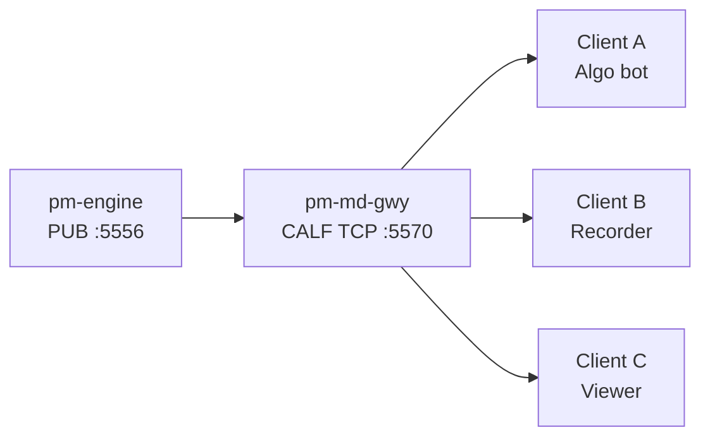

# Market Data Feed (CALF)

!!! note "Learning objectives"
    After reading this page you will understand:

    - What `pm-md-gwy` does in the EduMatcher process model
    - How to start the CALF gateway and connect from a third-party client
    - How CALF `HELLO`, `SUB`, `SNAP`, `MD`, `TRADE`, and `STATE` are used in practice
    - How to detect sequence gaps and recover with `RESUME=1`
    - Which operational checks to use when debugging connectivity problems


## What this process is

`pm-md-gwy` is the CALF market-data gateway.

It subscribes to the engine PUB socket (`tcp://127.0.0.1:5556`) and publishes
external market data over TCP (default port `5570`) using the CALF line protocol.




## Prerequisites

- `pm-engine` running
- `pm-md-gwy` running
- symbols configured in `engine_config.yaml`

Optional but recommended in config:

```yaml
market_data_gateway:
  enabled: true
  name: "md-gwy01"
  bind_address: "0.0.0.0"
  port: 5570
  heartbeat_interval_sec: 1
  idle_timeout_sec: 5
  replay_window_sec: 30
  max_symbols_per_client: 200
  max_client_queue: 10000
```


## Start the gateway

Installed mode:

```bash
pm-engine --verbose
pm-md-gwy --config engine_config.yaml
```

Developer mode:

```bash
poetry run pm-engine --verbose
poetry run pm-md-gwy --config engine_config.yaml
```


## Quick connect test (manual)

Use `nc` (or `telnet`) to validate the line protocol quickly:

```bash
nc 127.0.0.1 5570
```

Then send:

```text
HELLO|CLIENT=demo01|PROTO=CALF1
SUB|CH=TOP,TRADE|SYM=AAPL
```

Expected pattern:

1. `WELCOME|...`
2. `SNAP|CH=TOP|SYM=AAPL|...`
3. `MD|...` when top of book changes
4. `TRADE|...` when a trade executes
5. `HB|...` when the stream is otherwise quiet


## Minimal Python third-party client

```python
import socket

sock = socket.create_connection(("127.0.0.1", 5570))
sock.sendall(b"HELLO|CLIENT=bot01|PROTO=CALF1\n")
sock.sendall(b"SUB|CH=TOP,TRADE|SYM=AAPL\n")

buf = bytearray()
while True:
    chunk = sock.recv(4096)
    if not chunk:
        break
    buf.extend(chunk)
    while b"\n" in buf:
        idx = buf.index(b"\n")
        line = buf[:idx].decode("utf-8").strip()
        del buf[:idx + 1]
        if line:
            print(line)
```

Important: CALF uses TCP stream framing. Never assume one `recv()` equals one message.


## Recovery on reconnect

If your client disconnects, reconnect with `RESUME=1` for one stream:

```text
HELLO|CLIENT=bot01|PROTO=CALF1|RESUME=1|CH=TOP|SYM=AAPL|LASTSEQ=1042
```

Gateway behavior:

- replay hit: emits missing messages `SEQ > LASTSEQ`
- replay miss: emits `ERR|CODE=REPLAY_MISS|...` then a fresh `SNAP`

For multi-stream recovery, reconnect with normal `HELLO` and resubscribe.


## Common errors and fixes

| Error code | Typical cause | Action |
|---|---|---|
| `AUTH_REQUIRED` | `SUB` sent before `HELLO` | Send `HELLO` first |
| `PROTO_MISMATCH` | Wrong or missing `PROTO` | Use `PROTO=CALF1` |
| `INVALID_CHANNEL` | Unknown `CH` | Use `TOP`, `TRADE`, or `STATE` |
| `INVALID_SYMBOL` | Unknown symbol or invalid wildcard usage | Use configured symbols; `SYM=*` only for `STATE` |
| `SUB_LIMIT` | Too many subscribed symbols | Reduce requested symbol set |
| `REPLAY_MISS` | Requested replay is outside buffer window | Accept fresh `SNAP` and continue |
| `SLOW_CLIENT` | Client cannot drain outbound stream fast enough | Reconnect and process faster |
| `BAD_MESSAGE` | Malformed line or oversize line | Fix line syntax/framing |


## Operational checklist

1. Verify engine is running and publishing (`pm-engine --verbose`)
2. Verify gateway is running (`pm-md-gwy`)
3. Verify TCP port is reachable (`nc 127.0.0.1 5570`)
4. Confirm `HELLO` then `WELCOME` handshake
5. Confirm `SUB` creates expected `SNAP`
6. Track per-stream `SEQ` and trigger recovery on gaps


## See also

- [External Protocols Overview](19-protocol-overview.md)
- [Appendix - CALF Protocol](92-app-calf-protocol.md)
- [Processes](10-processes.md)
