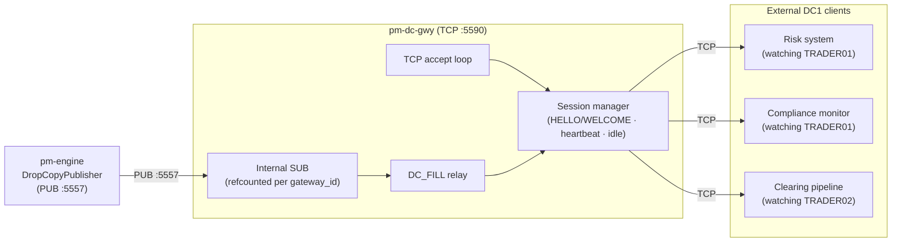
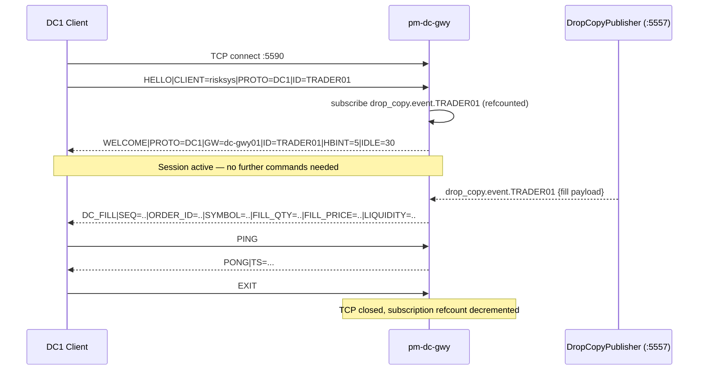

# Drop-Copy TCP Gateway (`pm-dc-gwy`)

!!! note "Learning objectives"
    After reading this page you will understand:

    - what `pm-dc-gwy` does and why it exists alongside direct port-5557 access
    - how to configure and start it
    - the session lifecycle: HELLO → WELCOME → unsolicited `DC_FILL` → EXIT
    - the DC1 wire protocol: every message type and field
    - how `pm-dc-gwy` compares to `pm-dc-spy` and the `DC` relay in `pm-alf-gwy`/`pm-alf-console`
    - what it deliberately does not do (no auth, no replay-by-sequence)


## What this process is

`pm-dc-gwy` is a small TCP gateway that exposes the engine's drop-copy feed
(`DropCopyPublisher`, ZMQ PUB `:5557` — see [Drop Copy](200-drop-copy.md)) to
plain TCP clients that cannot or should not speak ZeroMQ: a risk system, a
clearing broker's ingestion pipeline, a compliance monitor, or any process on
another host that only has a sockets library.

It is the TCP counterpart to [`pm-dc-spy`](252-dc-spy-cli.md): both connect a
`zmq.SUB` socket to port 5557 and read `drop_copy.event.<gateway_id>`
messages. `pm-dc-spy` prints them to a terminal for a human. `pm-dc-gwy`
relays them as DC1 text lines to any number of concurrently connected TCP
clients, each scoped to whichever gateway ID it asked for at connect time.



### What this is not

`pm-dc-gwy` is deliberately minimal compared to `pm-alf-gwy` or `pm-ralf-gwy`:

| Not supported | Why |
|---|---|
| Authentication / entitlement checks | Same scope decision as the raw port-5557 socket — see [Drop Copy → Architecture](200-drop-copy.md#architecture). Any client may request any gateway ID. |
| Replay-by-sequence over the wire | `DropCopyPublisher.replay()` is in-process only with no external trigger — see [Drop Copy → Replay](200-drop-copy.md#replay). `pm-dc-gwy` does not attempt to expose it. |
| Order entry, quoting, or any command that mutates state | This is a read-only relay. Use `pm-alf-gwy`/`pm-alf-console` for trading. |
| Role/channel model (`CLEARING`/`AUDIT`/etc.) | That is RALF's `DROP_COPY` channel, a different mechanism — see [RALF DROP_COPY channel vs. this feed](200-drop-copy.md#ralf-drop_copy-channel-vs-this-feed). |

A client simply says which gateway ID it wants in `HELLO` and receives that
gateway's live fills for as long as it stays connected. More than one client
may request the same gateway ID simultaneously — unlike `pm-alf-gwy` sessions,
a `pm-dc-gwy` connection does not "occupy" a trading identity.


## Prerequisites

- `pm-engine` running with its drop-copy publisher bound on `:5557` (the
  default; see [Drop Copy → Startup and shutdown](200-drop-copy.md#startup-and-shutdown)).
- Optional: add a `dc_gateway:` section to `engine_config.yaml` to customise
  port and limits.


## Configuration

`pm-dc-gwy` reads an optional hand-edited `dc_gateway:` section from
`engine_config.yaml`:

```yaml
dc_gateway:
  name: "dc-gwy01"
  bind_address: "0.0.0.0"
  port: 5590
  heartbeat_interval_sec: 5
  idle_timeout_sec: 30
  max_client_queue: 10000
```

| Field | Default | Description |
|-------|---------|-------------|
| `name` | `dc-gwy01` | Process name echoed in `WELCOME` |
| `bind_address` | `0.0.0.0` | Network interface to listen on (`127.0.0.1` for local-only) |
| `port` | `5590` | TCP listen port |
| `heartbeat_interval_sec` | `5` | Seconds between `HB` lines when no other outbound traffic |
| `idle_timeout_sec` | `30` | Disconnect after this many seconds of inbound silence |
| `max_client_queue` | `10000` | Per-client outbound line buffer capacity before the client is treated as slow and dropped |

The drop-copy source address (`tcp://127.0.0.1:5557` by default) is **not**
configurable via YAML — it always comes from the same `DROP_COPY_PUB_ADDR`
constant the rest of the system uses. Override it per-run with `--engine-dc-pub`
(see below) if you need to point at a non-default engine address.

!!! note "No `pm-config-gen` integration"
    Unlike most gateway sections, `dc_gateway:` is not wired into
    `pm-config-gen`'s CLI flags, interactive builder, or config-check
    warnings. Hand-edit the YAML section directly, the same way you would for
    `alf_gateway:` or `post_trade_gateway:`.

!!! note "TLS"
    `pm-dc-gwy` does not terminate TLS. For remote deployments, put it behind
    a reverse proxy (nginx, stunnel, or similar).


## Start the gateway

Installed mode:

```bash
pm-engine --verbose
pm-dc-gwy --config engine_config.yaml
```

Developer mode:

```bash
poetry run pm-engine --verbose
poetry run pm-dc-gwy --config engine_config.yaml
```

CLI override options:

| Option | Default | Description |
|--------|---------|-------------|
| `--bind ADDR` | from config / `0.0.0.0` | Override TCP bind address |
| `--port PORT` | from config / `5590` | Override TCP listen port |
| `--engine-dc-pub ADDR` | from config / `tcp://127.0.0.1:5557` | Override the engine drop-copy PUB address this gateway subscribes to |
| `--config` / `-c` | see resolution order below | Path to engine config YAML |
| `--log-level` | `WARNING` | Explicit level: `CRITICAL`, `ERROR`, `WARNING`, `INFO`, `DEBUG` |
| `-v` / `--verbose` | off | Increase verbosity (`-v` → `INFO`, `-vv` → `DEBUG`) |
| `-q` / `--quiet` | off | Reduce output to warnings/errors |

**Config file resolution order** (first match wins):

1. `--config PATH` CLI flag
2. `EDUMATCHER_CONFIG` environment variable
3. `<repo>/engine_config.yaml` — when running from a source checkout (detected automatically)
4. `./engine_config.yaml` — current working directory (installed mode via pipx/pip)

In practice: run from the directory that contains your `engine_config.yaml` and
you never need to pass `--config`.


## Quick connect test

Use `nc` or `telnet` to validate the session lifecycle before writing any code:

```bash
nc 127.0.0.1 5590
```

Type the following line, pressing Enter:

```text
HELLO|CLIENT=test|PROTO=DC1|ID=TRADER01
```

Expected response:

```text
WELCOME|PROTO=DC1|GW=dc-gwy01|ID=TRADER01|HBINT=5|IDLE=30
```

Any fill published for `TRADER01` on port 5557 now arrives as an unsolicited
`DC_FILL` line. Type `EXIT` to close cleanly.

!!! warning "TCP is a byte stream"
    Never assume one `recv()` equals one line. Always buffer and split on `\n`.


## Session lifecycle



### Step 1 — Send `HELLO`

The **first line** must be a `HELLO`:

```text
HELLO|CLIENT=risksys|PROTO=DC1|ID=TRADER01
```

| Field | Required | Notes |
|-------|----------|-------|
| `CLIENT` | Yes | Free-text label for logging |
| `PROTO` | Yes | Must be exactly `DC1` |
| `ID` | Yes | Gateway ID to receive fills for. Not validated against any allowlist — see the auth warning below. |

On any other first line, or a `HELLO` missing `CLIENT`/`PROTO`/`ID`, the
gateway sends `ERR|CODE=AUTH_REQUIRED|...` and closes the connection.

!!! warning "No authentication"
    Unlike `pm-alf-gwy`, the `ID` in `HELLO` is not checked against
    `gateways.alf` or any other allowlist. Any client may request fills for
    any gateway ID — this mirrors the lack of authentication on the raw
    port-5557 socket itself. See
    [Drop Copy → Architecture](200-drop-copy.md#architecture).

### Step 2 — Receive `WELCOME`

```text
WELCOME|PROTO=DC1|GW=dc-gwy01|ID=TRADER01|HBINT=5|IDLE=30
```

The gateway subscribes this session to `drop_copy.event.TRADER01` on its
internal SUB socket (refcounted — sharing the ZMQ subscription across every
connected session watching the same gateway ID) before sending `WELCOME`.

### Step 3 — Receive fills

No further command is needed. Every fill published on `drop_copy.event.<ID>`
for the requested `ID` arrives as an unsolicited `DC_FILL` line for as long
as the session stays connected.

### Step 4 — Disconnect

Send `EXIT` for a graceful close, or simply close the TCP connection. The
gateway decrements the internal subscription refcount and, if no other
session still wants that gateway ID, unsubscribes from the topic.


## Protocol reference

All messages follow the same line format as ALF/RALF/CALF:
`MSGTYPE|FIELD=VALUE|FIELD=VALUE\n`. DC1 is intentionally the simplest of
EduMatcher's TCP protocols — there is exactly one thing a client can ask for
(fills for a given gateway ID), so there is no subscription grammar, no role
model, and no replay-by-sequence.

### Client → Gateway

| Message | Fields | Notes |
|---|---|---|
| `HELLO` | `CLIENT`, `PROTO`, `ID` | Must be the first line. See [Step 1](#step-1-send-hello). |
| `PING` | — | Gateway replies `PONG` |
| `EXIT` | — | Graceful disconnect |

### Gateway → Client

| Message | Fields | Trigger |
|---|---|---|
| `WELCOME` | `PROTO`, `GW`, `ID`, `HBINT`, `IDLE` | Reply to a valid `HELLO` |
| `DC_FILL` | `SEQ`, `ORDER_ID`, `SYMBOL`, `FILL_QTY`, `FILL_PRICE`, `LIQUIDITY` | Unsolicited, one per fill for the session's gateway ID |
| `PONG` | `TS` | Reply to `PING` |
| `HB` | `TS` | Periodic heartbeat when no other outbound traffic |
| `ERR` | `CODE`, `DETAIL` | See [Error codes](#error-codes) |

`DC_FILL` fields map directly from the drop-copy payload — see
[Drop Copy → order.fill event](200-drop-copy.md#orderfill-event) for the
full source payload and field semantics. `SEQ` and `LIQUIDITY`
(`MAKER`/`TAKER`) come from the drop-copy envelope; `DC_FILL` does not carry
order state fields like `REMAINING`/`STATUS`.

```text
> HELLO|CLIENT=risksys|PROTO=DC1|ID=TRADER01
WELCOME|PROTO=DC1|GW=dc-gwy01|ID=TRADER01|HBINT=5|IDLE=30
DC_FILL|SEQ=42|ORDER_ID=ORD-001|SYMBOL=AAPL|FILL_QTY=100|FILL_PRICE=150.05|LIQUIDITY=TAKER
```


## Error codes

Every error arrives as `ERR|CODE=<CODE>|DETAIL=<message>`.

| Code | When it occurs | Connection kept? |
|------|---------------|-----------------|
| `AUTH_REQUIRED` | First line was not `HELLO`, or `HELLO` was missing `CLIENT`/`PROTO`/`ID` | No — closed immediately |
| `BAD_MESSAGE` | Empty line, non-UTF-8, unparseable line, or line > 4096 bytes | Yes (or No if unrecoverable — see detail) |
| `SLOW_CLIENT` | Outbound queue exceeded `max_client_queue` | No |
| `IDLE_TIMEOUT` | No inbound traffic for `idle_timeout_sec` | No |


## Minimal zero-dependency client (Python)

```python
import socket

def dc_connect(host: str, port: int, gateway_id: str, client_name: str = "risksys"):
    sock = socket.create_connection((host, port), timeout=5)
    buf = bytearray()

    def send(line: str) -> None:
        sock.sendall((line + "\n").encode("utf-8"))

    def recv_line() -> str:
        while True:
            nl = buf.find(b"\n")
            if nl >= 0:
                line = bytes(buf[:nl]).decode("utf-8", errors="replace")
                del buf[:nl + 1]
                return line
            chunk = sock.recv(4096)
            if not chunk:
                raise RuntimeError("gateway closed connection")
            buf.extend(chunk)

    send(f"HELLO|CLIENT={client_name}|PROTO=DC1|ID={gateway_id}")
    line = recv_line()
    if not line.startswith("WELCOME"):
        raise RuntimeError(f"handshake failed: {line}")

    return sock, send, recv_line


sock, send, recv_line = dc_connect("127.0.0.1", 5590, "TRADER01")
while True:
    line = recv_line()
    if line.startswith("DC_FILL"):
        print(line)
```

!!! warning "TCP is a byte stream"
    Never assume one `recv()` equals one line. Always buffer and split on `\n`.


## When to use `pm-dc-gwy` vs. the alternatives

| Scenario | Best choice |
|----------|------------|
| Ad-hoc inspection from a terminal, human-readable or JSON | [`pm-dc-spy`](252-dc-spy-cli.md) |
| External process, any language, no ZeroMQ dependency allowed | `pm-dc-gwy` |
| Process already has ZeroMQ / pyzmq available | Connect directly to port 5557 — see [Drop Copy](200-drop-copy.md) |
| You already have an ALF trading session open and only want your own fills | `DC\|STATE=ON` on that session — see [ALF TCP Gateway → DC](220-alf-gateway.md#dc-toggle-drop-copy-relay) |
| Role-gated (`CLEARING`/`AUDIT`) trade feed with replay-by-sequence | `pm-ralf-gwy` — see [Post-trade](250-post-trade.md) |


## Troubleshooting

### Check whether the port is in use

**macOS:**

```bash
sudo lsof -iTCP:5590 -sTCP:LISTEN
netstat -an | grep LISTEN | grep 5590
```

**Linux:**

```bash
ss -tlnp 'sport = :5590'
sudo lsof -iTCP:5590 -sTCP:LISTEN
netstat -tlnp | grep 5590
```

### Test the TCP connection from the command line

```bash
printf 'HELLO|CLIENT=test|PROTO=DC1|ID=TRADER01\nEXIT\n' | nc 127.0.0.1 5590
```

Expected output: `WELCOME|...` followed by a clean connection close.

### Common problems

| Symptom | Likely cause | Fix |
|---|---|---|
| `Connection refused` | Gateway not started or wrong port | Confirm `pm-dc-gwy` is running; check `dc_gateway.port` in config |
| `ERR\|CODE=AUTH_REQUIRED` immediately | First line was not `HELLO`, or a required field was missing | Ensure the first line is `HELLO\|CLIENT=..\|PROTO=DC1\|ID=..` |
| `WELCOME` arrives but no `DC_FILL` ever does | No fills have occurred for that gateway ID yet, or `pm-engine`'s drop-copy publisher failed to bind | Check `pm-engine` logs for drop-copy bind warnings; confirm trades are occurring for that gateway ID |
| Gateway closes after ~30s of silence | `idle_timeout_sec` elapsed | Send `PING` periodically, or increase `idle_timeout_sec` in config |
| Gateway not reachable from another host | `bind_address: 127.0.0.1` | Change `bind_address` to `0.0.0.0` (or the specific interface IP) |


## See also

- [Drop Copy](200-drop-copy.md) — the engine's drop-copy feed (`:5557`) this gateway relays
- [Drop-Copy Spy (pm-dc-spy)](252-dc-spy-cli.md) — read-only CLI for the same feed
- [ALF TCP Gateway → DC](220-alf-gateway.md#dc-toggle-drop-copy-relay) — relay your own fills through an existing ALF session instead
- [Processes](170-processes.md#pm-dc-gwy-drop-copy-tcp-gateway) — process topology and ZMQ message tables
- [External Protocols Overview](210-protocol-overview.md) — protocol comparison and selection guide
