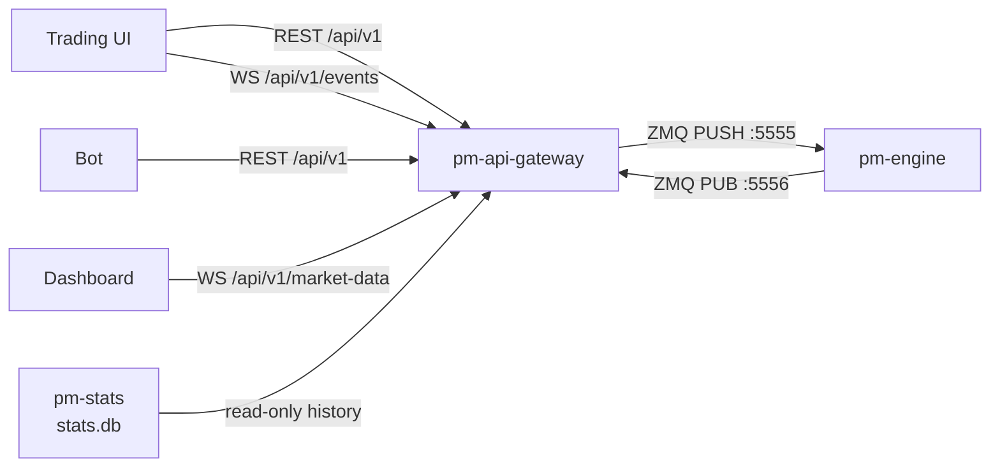

# API Gateway (REST/WebSocket)

!!! note "Learning objectives"
    After reading this page you will understand:

    - What `pm-api-gateway` does in the EduMatcher process model
    - How to configure API keys in the central `engine_config.yaml`
    - How to call the REST API and inspect Swagger documentation
    - How private and public WebSocket streams work
    - Where to find reusable Python and C REST examples


## What this process is

`pm-api-gateway` exposes EduMatcher order entry, order management, reference
data, history, and market data over REST/JSON and WebSocket. It is intended for
third-party software: browser UIs, dashboards, simple bots, and teaching
examples.

It is not a second matching engine. The process translates HTTP and WebSocket
requests into the same engine ZMQ/JSON messages used by the interactive
`pm-alf-console` process.




## Configuration

API gateway configuration lives in the central `engine_config.yaml`, matching
the existing CALF and RALF gateway pattern.

Use the top-level key `api_gateways` (underscore). The dashed form
`api-gateways` is not valid.

```yaml
api_gateways:
  desk:
    enabled: true
    host: 127.0.0.1
    port: 8080
    swagger_enabled: true
    log_level: info
    stats_db: data/stats.db

    credentials:
      - api_key: key-trader-demo
        gateway_id: TRADER01
        description: Demo trading client
      - api_key: key-dashboard-demo
        gateway_id: null
        description: Read-only dashboard client

    rate_limit:
      writes_per_second: 10
      burst: 20

    timeouts:
      engine_auth_sec: 3.0
      engine_reply_sec: 3.0
      wait_ack_sec: 3.0
```

| Field | Meaning |
|---|---|
| `api_gateways.<NAME>` | Named API gateway process configuration selected with `--instance NAME` when needed |
| `host` / `port` | HTTP server bind address and port |
| `swagger_enabled` | Enables `/docs` and `/openapi.json` when true |
| `credentials[].api_key` | Bearer token clients use for REST and WebSocket auth |
| `credentials[].gateway_id` | Engine gateway identity; `null` means read-only market-data access; non-null values must be unique across `api_gateways` entries |
| `rate_limit` | Per-key write limiting for POST/PATCH/DELETE endpoints |
| `timeouts` | Engine auth, request/reply, and synchronous ACK wait timeouts |

The engine's `gateways.alf` allowlist remains authoritative. If a credential
maps to `TRADER01` but `TRADER01` is not allowed by the engine config, the
engine rejects the API gateway handshake.

Use multiple named entries when you want logical process separation, such as one
gateway for a human trading desk and another for automated clients. Each
non-null `gateway_id` is owned by one API gateway process so process-local
session and event state remain unambiguous. Read-only `gateway_id: null`
credentials can appear in more than one entry.


## Start the process

Installed mode:

```bash
pm-engine --verbose
pm-stats
pm-api-gateway --config engine_config.yaml --instance desk
```

Developer mode:

```bash
poetry run pm-engine --verbose
poetry run pm-stats
poetry run pm-api-gateway --config engine_config.yaml --instance desk
```

Useful options:

| Option               |                                  Default | Description                                      |
|----------------------|-----------------------------------------:|--------------------------------------------------|
| `--host ADDR`        |                             config value | Override HTTP bind address                       |
| `--port PORT`        |                             config value | Override HTTP listen port                        |
| `--instance NAME`    | auto-selected only when one entry exists | Select a named `api_gateways` entry              |
| `--config PATH`      |           `EDUMATCHER_CONFIG` resolution | Central engine config path                       |
| `--engine-host HOST` |                             config value | Override engine host for ZMQ ports `5555`/`5556` |
| `--stats-db PATH`    |                             config value | SQLite database for `/history/*`                 |
| `--log-level LEVEL`  |                             config value | `debug`, `info`, `warning`, or `error`           |

Uvicorn writes access and application logs to stdout/stderr. Redirect them with
your shell or service manager:

```bash
poetry run pm-api-gateway --config engine_config.yaml --instance desk --log-level debug \
  > api-gateway.log 2>&1
```


## Swagger interface

When `swagger_enabled: true`, open:

```text
http://127.0.0.1:8080/docs
```

Swagger shows all REST endpoints, request schemas, response schemas, and enum
values. Use the **Authorize** button with:

```text
Bearer key-trader-demo
```


## Authentication principles

REST clients send an HTTP bearer token:

```http
Authorization: Bearer key-trader-demo
```

WebSocket clients send the API key as their first JSON message:

```json
{ "api_key": "key-trader-demo" }
```

Read-only credentials (`gateway_id: null`) can use `/api/v1/market-data` but
cannot submit, cancel, or inspect private orders.


## REST endpoints

Base path: `/api/v1`.

| Method   | Path                         | Auth          | Purpose                              |
|----------|------------------------------|---------------|--------------------------------------|
| `POST`   | `/orders`                    | trading       | Submit one order                     |
| `DELETE` | `/orders/{order_id}`         | trading       | Cancel one order                     |
| `PATCH`  | `/orders/{order_id}`         | trading       | Amend price and/or quantity          |
| `POST`   | `/orders/{order_id}/replace` | trading       | Cancel then submit replacement       |
| `GET`    | `/orders`                    | trading       | List live orders for the gateway     |
| `GET`    | `/orders/{order_id}`         | trading       | Read cached order state              |
| `POST`   | `/oco`                       | trading       | Submit OCO pair                      |
| `DELETE` | `/oco/{oco_id}`              | trading       | Cancel OCO pair                      |
| `POST`   | `/combos`                    | trading       | Submit combo order                   |
| `DELETE` | `/combos/{combo_id}`         | trading       | Cancel combo                         |
| `POST`   | `/quotes`                    | trading       | Submit two-sided quote               |
| `DELETE` | `/quotes/{symbol}`           | trading       | Cancel quote for symbol              |
| `POST`   | `/mass-cancel`               | trading       | Cancel all or symbol-scoped exposure |
| `POST`   | `/kill-switch`               | trading       | Alias of `/mass-cancel`              |
| `GET`    | `/symbols`                   | trading       | Instrument metadata                  |
| `GET`    | `/session`                   | trading       | Current engine session state         |
| `GET`    | `/quotes/bootstrap`          | trading       | Active quote bootstrap state         |
| `GET`    | `/quotes/legs`               | trading       | Quote leg state                      |
| `GET`    | `/positions`                 | trading       | Net positions by symbol              |
| `GET`    | `/status`                    | trading       | Gateway cache summary                |
| `GET`    | `/history/orders`            | trading       | Historical order lifecycle events    |
| `GET`    | `/history/orders/{order_id}` | trading       | Full lifecycle for one order         |
| `GET`    | `/history/fills`             | trading       | Historical fills                     |
| `GET`    | `/history/trades`            | any valid key | Public trade log                     |
| `GET`    | `/history/daily`             | any valid key | Daily OHLCV rows                     |
| `GET`    | `/healthz`                   | none          | Liveness probe (not in Swagger)      |


### Submit order

```http
POST /api/v1/orders?wait=ack
Authorization: Bearer key-trader-demo
Content-Type: application/json
```

```json
{
  "symbol": "AAPL",
  "side": "BUY",
  "order_type": "LIMIT",
  "quantity": 100,
  "tif": "DAY",
  "price": 150.50,
  "smp_action": "NONE",
  "client_order_id": "ui-42"
}
```

| Field          | Required    | Notes                                                                             |
|----------------|-------------|-----------------------------------------------------------------------------------|
| `symbol`       | yes         | Instrument symbol                                                                 |
| `side`         | yes         | `BUY` or `SELL`                                                                   |
| `order_type`   | yes         | `MARKET`, `LIMIT`, `STOP`, `STOP_LIMIT`, `FOK`, `ICEBERG`, `IOC`, `TRAILING_STOP` |
| `quantity`     | yes         | Positive integer                                                                  |
| `tif`          | no          | `DAY`, `GTC`, `ATO`, `ATC`; default `DAY`                                         |
| `price`        | conditional | Required for `LIMIT`, `FOK`, `IOC`, `ICEBERG`, `STOP_LIMIT`                       |
| `stop_price`   | conditional | Required for `STOP`, `STOP_LIMIT`                                                 |
| `visible_qty`  | conditional | Required for `ICEBERG`, less than `quantity`                                      |
| `trail_offset` | conditional | Required for `TRAILING_STOP`                                                      |
| `smp_action`   | no          | Self-match prevention action                                                      |

Default write calls return immediately with `202 Accepted`. Add `?wait=ack` to
wait for the matching engine ACK until the configured timeout. The wait filters
by `order_id` so concurrent requests on the same gateway receive their own ack.

Submitting an order with a `client_order_id` that already exists in the session
cache returns `409 Conflict`.


### Cancel, amend, and replace

| Operation                         | Payload                                               |
|-----------------------------------|-------------------------------------------------------|
| `DELETE /orders/{order_id}`       | no body                                               |
| `PATCH /orders/{order_id}`        | `{ "price": 151.00 }`, `{ "quantity": 200 }`, or both |
| `POST /orders/{order_id}/replace` | same shape as `POST /orders`                          |


### OCO, combos, quotes, and mass cancel

| Endpoint | Minimal payload |
|---|---|
| `POST /oco` | `{ "oco_id":"tp-sl-1", "symbol":"AAPL", "quantity":100, "leg1":{"side":"SELL","order_type":"LIMIT","price":152.0}, "leg2":{"side":"SELL","order_type":"STOP","stop_price":147.0} }` |
| `POST /combos` | `{ "combo_id":"spread-1", "legs":[{"symbol":"AAPL","side":"BUY","quantity":100,"price":150.0},{"symbol":"MSFT","side":"SELL","quantity":100,"price":410.0}] }` |
| `POST /quotes` | `{ "symbol":"AAPL", "bid_price":150.0, "bid_qty":500, "ask_price":150.1, "ask_qty":500 }` |
| `POST /mass-cancel` | `{ "symbol":"AAPL" }` or `{}` for all symbols |


## WebSocket endpoints

| Path                  | Purpose                                                        | First message                         |
|-----------------------|----------------------------------------------------------------|---------------------------------------|
| `/api/v1/events`      | Private order/quote/risk lifecycle events for one gateway      | `{ "api_key": "key-trader-demo" }`    |
| `/api/v1/market-data` | Public book, trade, depth, session, and circuit-breaker events | `{ "api_key": "key-dashboard-demo" }` |

Private event envelope:

```json
{
  "type": "order.fill",
  "ts": "2026-06-24T10:15:03.221Z",
  "gateway_id": "TRADER01",
  "data": {
    "order_id": "ORD-...",
    "fill_qty": 50,
    "fill_price": 150.50,
    "remaining_qty": 50,
    "status": "PARTIAL"
  }
}
```

Market-data subscription control:

```json
{ "action": "subscribe", "symbols": ["AAPL", "MSFT"], "channels": ["book", "trades", "depth"] }
```

Session and circuit-breaker events are always delivered after authentication.


## Python REST example

```python
from api_gateway_client import ApiGatewayClient

client = ApiGatewayClient("http://127.0.0.1:8080", "key-trader-demo")
print(client.get_json("/api/v1/status"))
print(client.get_json("/api/v1/symbols"))
```

Runnable examples live under `docs/examples/REST/python/`.


## C REST example

The C example uses a small POSIX socket helper for simple HTTP GET calls:

```c
ApiGatewayClient client = api_gateway_client("127.0.0.1", 8080, "key-trader-demo");
char *body = api_gateway_get(&client, "/api/v1/status");
puts(body);
free(body);
```

Runnable examples live under `docs/examples/REST/c/`.


## Implementation notes and design deviations

The original API gateway design described a separate `api_gateway_config.yaml`.
EduMatcher now keeps API gateway settings in the central `engine_config.yaml`
under `api_gateways:` so the API gateway follows the same configuration pattern
as the other gateway processes and supports multiple named API gateway process
configs.

The runtime rejects duplicate non-null `gateway_id` assignments across named
API gateway entries. This is deliberate: sharing one engine gateway identity
between two API gateway processes would split private session/event state across
process memory. Use separate ALF gateway IDs for separately managed write paths,
or use `gateway_id: null` for read-only dashboard credentials.

Swagger exposure is configurable with `swagger_enabled`. Plain bearer keys in
YAML are used for teaching and local labs; production deployments should put the
gateway behind TLS and manage secrets with the surrounding platform.

`?wait=ack` waits for the engine event matching both the topic and the specific
`order_id`. Concurrent requests sharing one `gateway_id` each resolve
independently.

`engine_auth_sec`, `engine_reply_sec`, and `wait_ack_sec` are all applied from
configuration.

The implementation keeps engine payloads close to the existing EduMatcher event
model. Outbound WebSocket events are wrapped in a consistent envelope, but they
do not attempt broad tick-to-display price rewriting beyond the payloads already
published by the engine.

Cancel-replace is implemented as cancel, wait for the cancel event, then submit
the replacement. The replacement body uses the same shape as `POST /orders`,
including `symbol`.

Startup creates the engine client and listener, but does not fail the process
only because `stats.db` is absent. History endpoints depend on `pm-stats` having
created and populated the configured database.


## Operational checklist

1. Confirm `api_gateways.<NAME>.credentials` maps to gateways allowed under `gateways.alf`
2. Confirm each non-null `gateway_id` appears in only one API gateway entry
3. Start `pm-engine`, `pm-stats`, then `pm-api-gateway --instance NAME`
4. Open `/docs` if Swagger is enabled
5. Test `GET /api/v1/healthz` (no auth required) — returns `{"ok": true}` when the engine listener is running
6. Test `GET /api/v1/status` with a bearer token
7. Connect `/api/v1/events` before submitting orders if you want async outcomes
8. Use `/history/*` only when `pm-stats` is running and writing `stats.db`


## Minimal MARKET order CLI

The script below lives at `docs/examples/REST/python/submit_market_order.py`
and reuses the same `ApiGatewayClient` library used by `demo_info.py`.

Run it from the examples directory:

```bash
cd docs/examples/REST/python
python3 submit_market_order.py --side BUY  --symbol AAPL --qty 100
python3 submit_market_order.py --side SELL --symbol MSFT --qty 50 --wait-ack
```

Override gateway URL and key with environment variables:

```bash
EDUMATCHER_API_URL=http://127.0.0.1:8080 \
EDUMATCHER_API_KEY=key-trader-demo \
python3 submit_market_order.py --side BUY --symbol AAPL --qty 100
```

| Option       | Required | Default                                          | Description                                    |
|--------------|----------|--------------------------------------------------|------------------------------------------------|
| `--side`     | yes      | —                                                | `BUY` or `SELL`                                |
| `--symbol`   | yes      | —                                                | Instrument symbol                              |
| `--qty`      | yes      | —                                                | Order quantity                                 |
| `--wait-ack` | no       | off                                              | Block until the matching engine ACKs the order |
| `--url`      | no       | `$EDUMATCHER_API_URL` or `http://127.0.0.1:8080` | Gateway base URL                               |
| `--key`      | no       | `$EDUMATCHER_API_KEY` or `key-trader-demo`       | Bearer API key                                 |

Example output without `--wait-ack`:

```text
order_id  : ORD-3a7f1e2c
status    : PENDING
```

Example output with `--wait-ack`:

```text
order_id  : ORD-3a7f1e2c
status    : ACKED
accepted  : True
engine ack:
{
  "order_id": "ORD-3a7f1e2c",
  "accepted": true,
  "reason": null
}
```

MARKET orders must not include `price` or `stop_price`. The gateway validates
this and returns `400 VALIDATION` if either field is present.


## Troubleshooting

### Check whether the port is in use

Before starting `pm-api-gateway`, or when a client cannot connect, verify that
something is listening on the configured port (default `8080`).

**macOS:**

```bash
# lsof — shows the process name and PID holding the port
sudo lsof -iTCP:8080 -sTCP:LISTEN

# BSD netstat (ships with macOS)
netstat -an | grep LISTEN | grep 8080
```

**Linux:**

```bash
# ss — preferred on modern Linux
ss -tlnp 'sport = :8080'

# lsof
sudo lsof -iTCP:8080 -sTCP:LISTEN

# netstat (older distributions)
netstat -tlnp | grep 8080
```

Replace `8080` with the `port` value from your `api_gateways.<name>` config block.
If no output appears, the gateway is not running.

### Test HTTP connectivity from the command line

The health endpoint requires no authentication and is the fastest connectivity check:

```bash
curl -s http://127.0.0.1:8080/api/v1/healthz
# Expected: {"ok": true}
```

Test an authenticated endpoint:

```bash
curl -s -H "Authorization: Bearer key-trader-demo" \
     http://127.0.0.1:8080/api/v1/status
```

Test WebSocket connectivity:

```bash
# websocat (brew install websocat / apt install websocat)
websocat ws://127.0.0.1:8080/api/v1/market-data

# curl — look for HTTP 101 Switching Protocols in the response headers
curl -v --no-buffer \
     -H "Connection: Upgrade" -H "Upgrade: websocket" \
     -H "Sec-WebSocket-Version: 13" \
     -H "Sec-WebSocket-Key: dGhlc2FtcGxla2V5" \
     http://127.0.0.1:8080/api/v1/market-data
```

### Common problems

| Symptom | Likely cause | Fix |
|---|---|---|
| `Connection refused` | Gateway not started or wrong port | Confirm `pm-api-gateway` is running; check `port` in `api_gateways` config |
| `{"ok": false}` from `/healthz` | Engine ZMQ connection not established | Start `pm-engine` first |
| `401 Unauthorized` | Missing or wrong `Authorization` header | Use `Authorization: Bearer <key>` with a key listed in `credentials` |
| `403 Forbidden` | Credential has no `gateway_id`; endpoint requires one | Use a credential with a non-null `gateway_id` for order-entry endpoints |
| `404` on all endpoints | Wrong base path or wrong `--instance` flag | Check `pm-api-gateway --instance NAME` matches the config block name |
| Swagger UI not loading | `swagger_enabled: false` | Set `swagger_enabled: true` in the config block and restart |
| History endpoints return empty results | `pm-stats` not running or wrong `stats_db` path | Start `pm-stats`; verify the `stats_db` path in config points to the correct file |
| WebSocket disconnects immediately | Engine not running or client rate limit hit | Start engine; check gateway logs for disconnect reason |