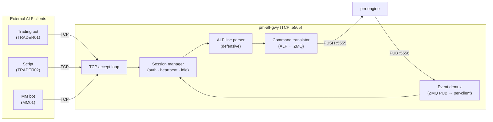
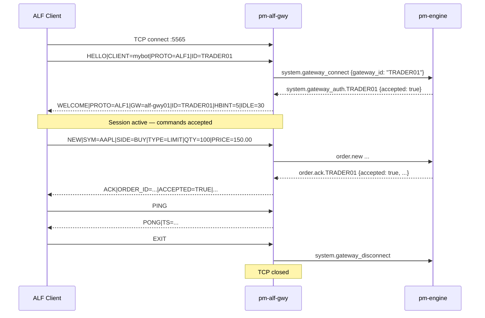

# ALF TCP Gateway (`pm-alf-gwy`)

!!! note "Learning objectives"
    After reading this page you will understand:

    - what `pm-alf-gwy` does and why it exists alongside `pm-alf-console`
    - how to configure it in `engine_config.yaml`
    - how to start it and verify connectivity from a terminal
    - the session lifecycle: HELLO → WELCOME → commands → EXIT
    - what commands are accepted and what responses to expect
    - how multi-line responses (SYMBOLS, ORDERS, QBOOT) are framed
    - which broadcast events arrive unsolicited on every authenticated session
    - how heartbeats, idle timeouts, and rate limiting work
    - the error codes your client must handle
    - how to write a minimal Python ALF client


## What this process is

`pm-alf-gwy` is the **ALF TCP gateway**.  The interactive `pm-alf-console`
terminal is designed for a human at a keyboard — it reads stdin, prints to
stdout, and connects to the engine ZMQ sockets directly.  That architecture
cannot serve an external bot or a process on another host.

`pm-alf-gwy` fills that gap.  It binds a TCP port, accepts multiple simultaneous
connections, validates each line defensively, and translates ALF commands into
the same engine ZMQ messages `pm-alf-console` uses today.  Engine responses are
translated back to ALF-formatted lines and delivered over TCP.



### What this is not

`pm-alf-gwy` accepts the same ALF command vocabulary as `pm-alf-console` but
**does not support** interactive-terminal features:

| Unsupported command | Reason |
|---------------------|--------|
| `STATUS` | Console P&L and position display — use `ORDERS` + `SYMBOLS` instead |
| `POS` | Positions are computed locally in `pm-alf-console` |
| `QLEGS` | Gateway-local quote-leg cache |
| `HELP` | Interactive terminal reference text |

For interactive operator use, `pm-alf-console` remains the right tool.
`pm-alf-gwy` is for programmatic clients and remote bots.


## Prerequisites

- `pm-engine` running.
- Gateway IDs that will connect must be configured in `engine_config.yaml`
  under `gateways.alf`.
- Optional: add the `alf_gateway:` config section to customise port and limits.


## Configuration

Add an `alf_gateway:` section to `engine_config.yaml`:

```yaml
alf_gateway:
  enabled: true
  name: "alf-gwy01"
  bind_address: "0.0.0.0"
  port: 5565
  heartbeat_interval_sec: 5
  idle_timeout_sec: 30
  max_connections: 64
  max_client_queue: 10000
  max_commands_per_second: 100
  max_errors_before_disconnect: 50
```

The gateway reads gateway roles from the existing `gateways.alf` list — no
separate credentials block is needed.  Any gateway ID listed in `gateways.alf`
can connect to `pm-alf-gwy`.

| Field | Default | Description |
|-------|---------|-------------|
| `enabled` | `true` | Master switch |
| `name` | `alf-gwy01` | Process name echoed in `WELCOME` |
| `bind_address` | `0.0.0.0` | Network interface to listen on (`127.0.0.1` for local-only) |
| `port` | `5565` | TCP listen port |
| `heartbeat_interval_sec` | `5` | Seconds between `HB` lines when no other outbound traffic |
| `idle_timeout_sec` | `30` | Disconnect after this many seconds of inbound silence |
| `max_connections` | `64` | Maximum simultaneous TCP connections |
| `max_client_queue` | `10000` | Per-client outbound line buffer capacity |
| `max_commands_per_second` | `100` | Token-bucket rate limit per client |
| `max_errors_before_disconnect` | `50` | Error threshold in a sliding window before forced disconnect |

!!! note "TLS"
    `pm-alf-gwy` does not terminate TLS.  For remote deployments, put it behind
    a reverse proxy (nginx, stunnel, or similar).


## Start the gateway

Installed mode:

```bash
pm-engine --verbose
pm-alf-gwy --config engine_config.yaml
```

Developer mode:

```bash
poetry run pm-engine --verbose
poetry run pm-alf-gwy --config engine_config.yaml
```

CLI override options:

| Option | Default | Description |
|--------|---------|-------------|
| `--bind ADDR` | from config / `0.0.0.0` | Override TCP bind address |
| `--port PORT` | from config / `5565` | Override TCP listen port |
| `--engine-host HOST` | from config | Override engine host (sets `tcp://HOST:5555` and `tcp://HOST:5556`) |
| `--config` / `-c` | see resolution order below | Path to engine config YAML |
| `--log-level` | `WARNING` | Explicit level: `CRITICAL`, `ERROR`, `WARNING`, `INFO`, `DEBUG` |
| `-v` / `--verbose` | off | Increase verbosity (`-v` → `INFO`, `-vv` → `DEBUG`) |
| `-q` / `--quiet` | off | Reduce output to warnings/errors |

**Config file resolution order** (first match wins):

1. `--config PATH` CLI flag
2. `EDUMATCHER_CONFIG` environment variable
3. `<repo>/engine_config.yaml` — when running from a source checkout (detected automatically)
4. `./engine_config.yaml` — current working directory (installed mode via pipx/pip)

In practice: run from the directory that contains your `engine_config.yaml` and
you never need to pass `--config`.  Set `EDUMATCHER_CONFIG` in your shell
profile for a fixed path regardless of working directory.


## Quick connect test

Use `nc` or `telnet` to validate the session lifecycle before writing any code:

```bash
nc 127.0.0.1 5565
```

Type the following lines, pressing Enter after each:

```text
HELLO|CLIENT=test|PROTO=ALF1|ID=TRADER01
SYMBOLS
EXIT
```

Expected response pattern:

1. `WELCOME|PROTO=ALF1|GW=alf-gwy01|ID=TRADER01|HBINT=5|IDLE=30`
2. `SYMBOLS|COUNT=N` followed by one `SYMBOL|SYM=...|TICK=...` per instrument
3. `END|TYPE=SYMBOLS`
4. `HB|TS=...` every 5 seconds of quiet

!!! warning "TCP is a byte stream"
    Never assume one `recv()` equals one line.  Always buffer and split on `\n`
    as shown in the Python example below.


## Session lifecycle

Every ALF gateway session follows this exact sequence:



### Step 1 — Send `HELLO`

The **first line** must be a `HELLO`:

```text
HELLO|CLIENT=mybot|PROTO=ALF1|ID=TRADER01
```

| Field | Required | Notes |
|-------|----------|-------|
| `CLIENT` | Yes | Free-text label for logging (max 32 chars) |
| `PROTO` | Yes | Must be exactly `ALF1` |
| `ID` | Yes | Gateway ID that must be in `gateways.alf` in config |

On any other first line the gateway sends `ERR|CODE=AUTH_REQUIRED|...` and closes
the connection.

### Step 2 — Authentication round trip

The gateway sends `system.gateway_connect` to the engine and waits for the
`system.gateway_auth.<ID>` reply.  The engine is authoritative: if the ID is not
in the allowlist the gateway sends `ERR|CODE=AUTH_FAILED|DETAIL=...` and closes.

### Step 3 — Receive `WELCOME`

```text
WELCOME|PROTO=ALF1|GW=alf-gwy01|ID=TRADER01|HBINT=5|IDLE=30
```

The gateway immediately follows the `WELCOME` with a `SYMBOLS` multi-line
response so the client knows which instruments are configured.

### Step 4 — Send commands

After `WELCOME`, any supported command may be sent.  Responses and broadcast
events arrive asynchronously.

### Step 5 — Disconnect

Send `EXIT` (or `QUIT`) for a graceful close.  The gateway notifies the engine
and shuts down the TCP connection after flushing pending output.


## Command reference

All commands follow the ALF line format: `VERB|FIELD=VALUE|FIELD=VALUE\n`.
Field names are **case-insensitive** — the gateway normalises everything to
uppercase before parsing.

### `NEW` — submit order

Single-leg order:

```text
NEW|SYM=AAPL|SIDE=BUY|TYPE=LIMIT|QTY=100|PRICE=150.00
NEW|SYM=AAPL|SIDE=BUY|TYPE=MARKET|QTY=50
NEW|SYM=AAPL|SIDE=BUY|TYPE=STOP|QTY=100|STOP=148.00
NEW|SYM=AAPL|SIDE=BUY|TYPE=STOP_LIMIT|QTY=100|STOP=148.00|PRICE=147.50
NEW|SYM=AAPL|SIDE=BUY|TYPE=FOK|QTY=100|PRICE=150.00
NEW|SYM=AAPL|SIDE=BUY|TYPE=IOC|QTY=100|PRICE=150.00
NEW|SYM=AAPL|SIDE=BUY|TYPE=ICEBERG|QTY=1000|PRICE=150.00|VISIBLE=100
NEW|SYM=AAPL|SIDE=BUY|TYPE=TRAILING_STOP|QTY=100|TRAIL=0.50
NEW|SYM=AAPL|SIDE=BUY|TYPE=LIMIT|QTY=100|PRICE=150.00|TIF=GTC
```

OCO pair:

```text
NEW|TYPE=OCO|OCO_ID=tp-sl|SYM=AAPL|QTY=100|TIF=DAY|LEG1_SIDE=SELL|LEG1_TYPE=LIMIT|LEG1_PRICE=152.00|LEG2_SIDE=SELL|LEG2_TYPE=STOP|LEG2_STOP=147.00
```

Multi-leg combo:

```text
NEW|TYPE=COMBO|COMBO_ID=spread-1|COMBO_TYPE=AON|TIF=DAY|LEG_COUNT=2|LEG0.SYM=AAPL|LEG0.SIDE=BUY|LEG0.QTY=100|LEG0.PRICE=150.00|LEG1.SYM=MSFT|LEG1.SIDE=SELL|LEG1.QTY=50|LEG1.PRICE=400.00
```

| Field | NEW (single) | Notes |
|-------|-------------|-------|
| `SYM` | required | Instrument symbol |
| `SIDE` | required | `BUY` or `SELL` |
| `TYPE` | required | `LIMIT`, `MARKET`, `STOP`, `STOP_LIMIT`, `FOK`, `IOC`, `ICEBERG`, `TRAILING_STOP`, `OCO`, `COMBO` |
| `QTY` | required | Positive integer |
| `PRICE` | conditional | Required for `LIMIT`, `FOK`, `IOC`, `ICEBERG`, `STOP_LIMIT` |
| `STOP` | conditional | Required for `STOP`, `STOP_LIMIT` |
| `VISIBLE` | conditional | Required for `ICEBERG`; must be < `QTY` |
| `TRAIL` | conditional | Required for `TRAILING_STOP` |
| `TIF` | optional | `DAY` (default), `GTC`, `ATO`, `ATC` |
| `SMP` | optional | `NONE` (default), `CANCEL_AGGRESSOR`, `CANCEL_RESTING`, `CANCEL_BOTH` |

**Responses:** `ACK|ORDER_ID=...|ACCEPTED=TRUE|...` or `ACK|ORDER_ID=...|ACCEPTED=FALSE|REASON=...`
followed asynchronously by `FILL|...`, `CANCELLED|...`, or `EXPIRED|...`.

### `AMEND` — amend resting order

```text
AMEND|ID=<order-id>|PRICE=151.00
AMEND|ID=<order-id>|QTY=200
AMEND|ID=<order-id>|PRICE=151.00|QTY=200
```

At least one of `PRICE` or `QTY` is required.

**Response:** `AMENDED|ORDER_ID=...|PRICE=...|QTY=...|REMAINING=...|PRIORITY_RESET=TRUE|FALSE`

### `CANCEL` — cancel order / OCO / combo

```text
CANCEL|ID=<order-id>
CANCEL|OCO_ID=<oco-id>
CANCEL|COMBO_ID=<combo-id>
```

**Response for single order:** `CANCELLED|ORDER_ID=...`  
**Response for OCO:** `OCO_CANCELLED|OCO_ID=...|CANCELLED_ID=...|REASON=...`  
**Response for combo:** `COMBO_STATUS|COMBO_ID=...|STATUS=CANCELLED|REASON=...`

### `QUOTE` — submit/replace two-sided quote (MARKET_MAKER role)

```text
QUOTE|SYM=AAPL|BID=150.00|ASK=150.10|BID_QTY=500|ASK_QTY=500
QUOTE|SYM=AAPL|BID=150.00|ASK=150.10|BID_QTY=500|ASK_QTY=500|QUOTE_ID=my-q1
```

Requires gateway role `MARKET_MAKER`.  `BID` must be strictly less than `ASK`.

**Response:** `QUOTE_ACK|QUOTE_ID=...|ACCEPTED=TRUE|BID_ID=...|ASK_ID=...`

### `QUOTE_CANCEL` — cancel active quote (MARKET_MAKER role)

```text
QUOTE_CANCEL|SYM=AAPL
```

**Response:** `QUOTE_ACK|QUOTE_ID=...|ACCEPTED=TRUE|...`

### `KILL` — gateway kill-switch

```text
KILL
KILL|SYM=AAPL
```

Cancels all resting orders and active quotes for this gateway, optionally
scoped to one symbol.

**Response:** `KILL_ACK|ACCEPTED=TRUE|ORDERS=N|QUOTES=N`

### `SYMBOLS` — instrument list

```text
SYMBOLS
```

**Multi-line response:**

```text
SYMBOLS|COUNT=3
SYMBOL|SYM=AAPL|TICK=0.01
SYMBOL|SYM=MSFT|TICK=0.01
SYMBOL|SYM=TSLA|TICK=0.01
END|TYPE=SYMBOLS
```

### `ORDERS` — resting order list

```text
ORDERS
```

**Multi-line response:**

```text
ORDERS|COUNT=2|GW=TRADER01
ORDER|ID=abc123|SYM=AAPL|SIDE=BUY|TYPE=LIMIT|QTY=100|REMAINING=60|PRICE=150.00|STATUS=PARTIAL
ORDER|ID=def456|SYM=MSFT|SIDE=SELL|TYPE=LIMIT|QTY=200|REMAINING=200|PRICE=415.00|STATUS=NEW
END|TYPE=ORDERS
```

### `QBOOT` — quote bootstrap state

```text
QBOOT
QBOOT|SYM=AAPL
```

**Multi-line response:**

```text
QBOOT|COUNT=1
QUOTE|QUOTE_ID=...|SYM=AAPL|BID=150.00|ASK=150.10|BID_QTY=500|ASK_QTY=500|STATUS=ACTIVE
END|TYPE=QBOOT
```

### `PING` / `EXIT`

```text
PING        → PONG|TS=2026-07-02T09:30:00.123Z
EXIT        → (connection closed)
QUIT        → (connection closed)
```


## Broadcast events

These messages arrive **unsolicited** on every authenticated session.

| Message type | Key fields | Trigger |
|---|---|---|
| `SESSION` | `STATE`, `PREV_STATE` | Session phase change (e.g. `CONTINUOUS`, `CLOSED`) |
| `HALT` | `SYMBOL`, `LEVEL` | Circuit-breaker halt on a symbol |
| `RESUME` | `SYMBOL`, `MODE` | Circuit-breaker resume |
| `TRADE` | `SYMBOL`, `PRICE`, `QTY`, `SIDE` | Any matched trade on any symbol |
| `HB` | `TS` | Periodic heartbeat when no other outbound activity |

Your client does not need to subscribe to anything.  Broadcast events are
delivered automatically after `WELCOME`.


## Engine-scoped events (per-gateway)

These messages are addressed to your gateway ID and arrive on your session only.

| Message type | Key fields |
|---|---|
| `ACK` | `ORDER_ID`, `ACCEPTED`, `REASON`, `SYMBOL`, `SIDE`, `TYPE` |
| `FILL` | `ORDER_ID`, `FILL_QTY`, `FILL_PRICE`, `REMAINING`, `STATUS` |
| `AMENDED` | `ORDER_ID`, `PRICE`, `QTY`, `REMAINING`, `PRIORITY_RESET` |
| `CANCELLED` | `ORDER_ID` |
| `EXPIRED` | `ORDER_ID` |
| `QUOTE_ACK` | `QUOTE_ID`, `ACCEPTED`, `REASON`, `BID_ID`, `ASK_ID` |
| `QUOTE_STATUS` | `QUOTE_ID`, `STATUS`, `REASON` |
| `COMBO_ACK` | `COMBO_ID`, `ACCEPTED`, `REASON` |
| `COMBO_STATUS` | `COMBO_ID`, `STATUS`, `REASON` |
| `OCO_ACK` | `OCO_ID`, `ACCEPTED`, `LEG1_ID`, `LEG2_ID`, `REASON` |
| `OCO_CANCELLED` | `OCO_ID`, `CANCELLED_ID`, `REASON` |
| `KILL_ACK` | `ACCEPTED`, `REASON`, `ORDERS`, `QUOTES` |


## Error codes

Every error arrives as `ERR|CODE=<CODE>|DETAIL=<message>`.

| Code | When it occurs | Connection kept? |
|------|---------------|-----------------|
| `AUTH_REQUIRED` | Any command before `HELLO` completes | No — closed immediately |
| `AUTH_FAILED` | Engine rejected the gateway ID | No |
| `PROTO_MISMATCH` | `HELLO` with wrong `PROTO` value | No |
| `GATEWAY_ALREADY_CONNECTED` | Same gateway ID already has an active session | No |
| `BAD_MESSAGE` | Empty line, non-UTF-8, or line > 4096 bytes | Yes |
| `UNKNOWN_COMMAND` | Unrecognised command verb | Yes |
| `MISSING_FIELD` | Required field absent | Yes |
| `INVALID_VALUE` | Field value fails validation (e.g. `PRICE=NaN`) | Yes |
| `SYMBOL_NOT_CONFIGURED` | Unknown symbol (after symbols are loaded) | Yes |
| `ROLE_DENIED` | Command not allowed for this gateway's role (e.g. `QUOTE` for non-MM) | Yes |
| `RATE_LIMITED` | Commands arriving faster than `max_commands_per_second` | Yes |
| `SLOW_CLIENT` | Outbound queue full | No |
| `IDLE_TIMEOUT` | No inbound traffic for `idle_timeout_sec` | No |
| `MAX_ERRORS` | Too many errors in the sliding error window | No |
| `INTERNAL_ERROR` | Unexpected gateway-internal exception | Yes |

!!! tip "Error escalation"
    If a client accumulates `max_errors_before_disconnect` (default 50) errors
    in the `error_window_sec` sliding window, the gateway disconnects it.  This
    protects the gateway from runaway or malicious clients.


## Example libraries and interactive clients

The `examples/alf/` directory contains ready-to-run Python and C libraries that
replicate the workflow of `pm-alf-console` as an **external TCP client** — no
ZeroMQ, no `edumatcher` package import, only a plain socket.

```
examples/alf/
├── python/
│   ├── alf_parser.py       # Protocol library: parse, build, AlfSession
│   └── alf_client.py       # Interactive client (tab-completion, event display, P&L)
└── c/
    ├── alf_parser.h / .c   # C library
    ├── alf_client.c        # Interactive C client (readline + select)
    └── Makefile
```


### Python

**Library — `alf_parser.py`**

```python
from alf_parser import parse_alf_line, build_alf_line, AlfSession, AlfMessage

# Parse one line received from the gateway
msg: AlfMessage = parse_alf_line("ACK|ORDER_ID=abc|ACCEPTED=TRUE|SYMBOL=AAPL")
print(msg.msg_type)    # "ACK"
print(msg.fields)      # {"ORDER_ID": "ABC", "ACCEPTED": "TRUE", ...}

# Build a line to send
line = build_alf_line("NEW", {"SYM": "AAPL", "SIDE": "BUY",
                               "TYPE": "LIMIT", "QTY": "100", "PRICE": "150.00"})
# → "NEW|SYM=AAPL|SIDE=BUY|TYPE=LIMIT|QTY=100|PRICE=150.00\n"

# High-level session: connect, HELLO/WELCOME, send/recv
session = AlfSession.connect("127.0.0.1", 5565, "TRADER01")
print(session.welcome.gw_name)         # "alf-gwy01"
session.send("SYMBOLS")
msg = session.recv_msg()               # first line of SYMBOLS response
session.close()
```

**Interactive client — `alf_client.py`**

```bash
cd docs/examples/alf/python

# Connect to a local gateway
python3 alf_client.py --id TRADER01

# Connect to a remote gateway
python3 alf_client.py --host 10.0.0.5 --port 5565 --id TRADER01
```

At the prompt the client behaves like `pm-alf-console`:
Tab completes command verbs, field names, and enum values.
Background receive thread displays fills, acks, and broadcast events while you type.
`POS` shows tracked positions.  `STATUS` shows session info.
History is saved to `~/.alf_client_history`.

```
[TRADER01]> NEW|SYM=AAPL|SIDE=BUY|TYPE=LIMIT|QTY=100|PRICE=150.00
[09:30:01.234] ACK      xxxxxxxx  order accepted
[TRADER01]> ORDERS
[TRADER01]> POS
[TRADER01]> HELP
[TRADER01]> EXIT
```


### C

**Build:**

```bash
# macOS: brew install readline (Homebrew readline for full callback support)
# Linux: sudo apt install libreadline-dev

cd docs/examples/alf/c
make
```

**Run:**

```bash
./alf_client --id TRADER01
./alf_client --host 10.0.0.5 --port 5565 --id TRADER01
./alf_client --id TRADER01 --no-color
```

The C client uses `select()` to multiplex the TCP socket and stdin, so gateway
events display immediately while you are typing.  Readline provides tab
completion and history.

```
[TRADER01]> NEW|SYM=AAPL|SIDE=BUY|TYPE=LIMIT|QTY=100|PRICE=150.00
[09:30:01.234] ACK      xxxxxxxx  order accepted
[TRADER01]> ORDERS
[TRADER01]> POS
[TRADER01]> HELP
[TRADER01]> EXIT
```

**Library usage:**

```c
#include "alf_parser.h"

/* Parse */
char line[] = "ACK|ORDER_ID=abc|ACCEPTED=TRUE";
alf_message_t msg;
alf_parse_line(line, &msg);
puts(alf_get_field(&msg, "ACCEPTED"));   /* "TRUE" */

/* Build */
const char *kv[] = {"SYM", "AAPL", "SIDE", "BUY",
                    "TYPE", "LIMIT", "QTY", "100", "PRICE", "150.00", NULL};
char buf[4096];
alf_build_line(buf, sizeof(buf), "NEW", kv);
write(sockfd, buf, strlen(buf));
```


### Minimal zero-dependency client (Python)

For scripts that cannot import anything outside the standard library:

```python
import socket

def alf_connect(host: str, port: int, gateway_id: str, client_name: str = "bot"):
    sock = socket.create_connection((host, port), timeout=5)
    buf = bytearray()

    def send(line: str) -> None:
        sock.sendall((line + "\n").encode("utf-8"))

    def recv_line() -> str:
        while True:
            nl = buf.find(b"\n")
            if nl >= 0:
                line = bytes(buf[:nl]).decode("utf-8", errors="replace")
                del buf[:nl + 1]
                return line
            chunk = sock.recv(4096)
            if not chunk:
                raise RuntimeError("gateway closed connection")
            buf.extend(chunk)

    send(f"HELLO|CLIENT={client_name}|PROTO=ALF1|ID={gateway_id}")
    while True:
        line = recv_line()
        if line.startswith("WELCOME"):
            break
        if line.startswith("ERR"):
            raise RuntimeError(f"Auth failed: {line}")

    return sock, send, recv_line


sock, send, recv_line = alf_connect("127.0.0.1", 5565, "TRADER01")
send("NEW|SYM=AAPL|SIDE=BUY|TYPE=LIMIT|QTY=100|PRICE=150.00")

# Read events until ACK arrives — HB/SESSION/TRADE may arrive first
while True:
    line = recv_line()
    print(line)
    if line.startswith("ACK"):
        break

send("EXIT")
sock.close()
```

!!! warning "TCP is a byte stream"
    Never assume one `recv()` equals one line.  Always buffer and split on `\n`.


## When to use `pm-alf-gwy` vs. the alternatives

| Scenario | Best choice |
|----------|------------|
| Human operator on the same machine | `pm-alf-console` (tab completion, history, P&L display) |
| External bot in Python / any language on the same or a remote host | `pm-alf-gwy` |
| Browser UI / REST-native stack | `pm-api-gwy` |
| Read-only market-data consumer | `pm-md-gwy` (CALF) |
| Post-trade / clearing / audit consumer | `pm-ralf-gwy` (RALF) |


## Troubleshooting

### Check whether the port is in use

Before starting `pm-alf-gwy`, or when a client cannot connect, verify that
something is actually listening on port 5565.

**macOS:**

```bash
# lsof — shows the process name and PID holding the port
sudo lsof -iTCP:5565 -sTCP:LISTEN

# BSD netstat (ships with macOS)
netstat -an | grep LISTEN | grep 5565
```

**Linux:**

```bash
# ss — preferred on modern Linux
ss -tlnp 'sport = :5565'

# lsof
sudo lsof -iTCP:5565 -sTCP:LISTEN

# netstat (older distributions)
netstat -tlnp | grep 5565
```

If no output appears, the gateway is not running or is bound to a different port.
Check the `alf_gateway.port` value in `engine_config.yaml`.

### Test the TCP connection from the command line

Use `nc` (netcat) to open a raw TCP connection and type ALF lines by hand.
This bypasses any client library and proves the gateway is reachable end-to-end.

**macOS / Linux:**

```bash
nc 127.0.0.1 5565
```

For a remote host:

```bash
nc 10.0.0.5 5565
```

Type the following lines (press Enter after each):

```text
HELLO|CLIENT=test|PROTO=ALF1|ID=TRADER01
SYMBOLS
EXIT
```

Expected output: `WELCOME|...`, then a `SYMBOLS|COUNT=N` block, then
`END|TYPE=SYMBOLS`, then the connection closes.

**`telnet` (macOS / Linux):**

```bash
telnet 127.0.0.1 5565
```

Type `HELLO|CLIENT=test|PROTO=ALF1|ID=TRADER01` and press Enter.  `telnet`
echoes characters locally so the line appears duplicated in the terminal —
the `WELCOME` response confirms the gateway accepted it.  Press `Ctrl-]`,
then type `quit` to close.

**Non-interactive test (useful in scripts or CI):**

```bash
printf 'HELLO|CLIENT=test|PROTO=ALF1|ID=TRADER01\nEXIT\n' | nc 127.0.0.1 5565
```

Expected output ends with `BYE` or a clean connection close immediately after `WELCOME`.

### Common problems

| Symptom | Likely cause | Fix |
|---|---|---|
| `Connection refused` | Gateway not started or wrong port | Confirm `pm-alf-gwy` is running; check `alf_gateway.port` in config |
| Connection hangs with no output | Firewall blocking port 5565 | Test on loopback (`127.0.0.1`) first; open port in firewall for remote access |
| `ERR\|CODE=AUTH_REQUIRED` immediately | First line was not `HELLO` | Ensure the very first line is a valid `HELLO` |
| `ERR\|CODE=AUTH_FAILED` | Gateway ID not in `gateways.alf` | Add the ID under `gateways.alf` in `engine_config.yaml` and restart engine |
| `ERR\|CODE=PROTO_MISMATCH` | `PROTO` field value is not `ALF1` | Fix the `HELLO` line: `HELLO\|CLIENT=...\|PROTO=ALF1\|ID=...` |
| `ERR\|CODE=GATEWAY_ALREADY_CONNECTED` | Same gateway ID connected elsewhere | Disconnect the other session, or use a different gateway ID |
| `WELCOME` arrives but then silence | Engine not running or ZMQ link lost | Start `pm-engine`; check gateway logs for ZMQ errors |
| Gateway closes after ~30 s of silence | `idle_timeout_sec` elapsed | Send `PING` periodically; reduce `idle_timeout_sec` in config if needed |
| `ERR\|CODE=RATE_LIMITED` | Commands arriving faster than `max_commands_per_second` | Throttle the client; increase `max_commands_per_second` in config |
| Gateway not reachable from another host | `bind_address: 127.0.0.1` | Change `bind_address` to `0.0.0.0` (or the specific interface IP) |


## See also

- [ALF Protocol Reference](900-app-alf-protocol.md) — formal wire syntax and full field/enum definitions
- [Gateway Commands](050-gateway.md) — interactive command reference for `pm-alf-console`
- [Configuration](010-configuration.md) — `alf_gateway:` section and `gateways.alf` allowlist
- [Processes](170-processes.md#pm-alf-gwy-alf-tcp-gateway) — process topology and ZMQ message tables
- [External Protocols Overview](210-protocol-overview.md) — protocol comparison and selection guide
