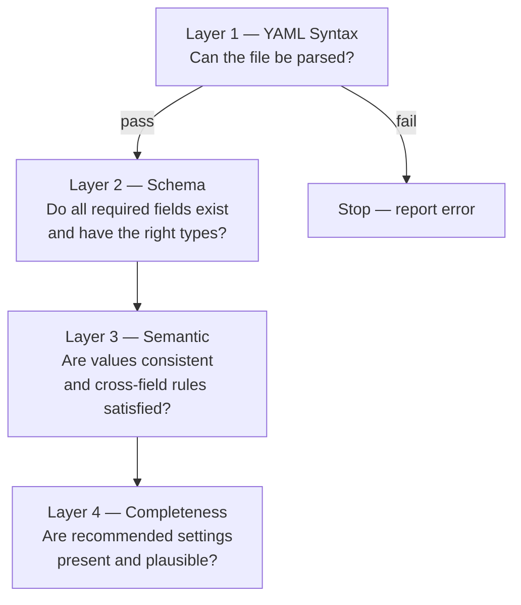

# Config Verifier (`pm-cverifier`)

!!! note "Learning objectives"
    After reading this page you will understand:

    - Why `pm-cverifier` exists and what problems it solves
    - How to run it from the command line and interpret its output
    - What each verification layer checks and what the check codes mean
    - How to use it in CI pipelines with `--strict` and `--format json`
    - How to read the Risk Summary to confirm your intended risk posture


## Why a Config Verifier?

`engine_config.yaml` covers symbols, gateways, risk controls, collar bands,
circuit breakers, market-maker obligations, session schedules, combo seeds,
index definitions, and four optional gateway subsystems.  Getting all of this
right by hand is error-prone.

The current engine loader (`load_engine_config()`) reports only the *first* hard
error it encounters before aborting.  This means operators spend time in a
trial-and-error loop: edit the file, start the engine, read a terse `ValueError`,
fix one problem, repeat.  There is also no concept of advisory warnings — a
valid config that quietly uses defaults the operator did not intend is accepted
without comment.

`pm-cverifier` is a standalone, **read-only** tool that inspects a config file
deeply and produces a human-friendly report covering:

- every YAML syntax error that would prevent the file from being parsed
- every hard error that `load_engine_config()` would raise, plus additional ones
- completeness gaps — settings that are missing but probably should be present
- advisory suggestions for settings that are valid but likely to surprise
- a plain-English **Risk Summary** that shows what risk controls are actually active
- an overall `OK` / `WARNING` / `ERROR` verdict


## Quick Start

```bash
# verify a config file and print a human-readable report
pm-cverifier engine_config.yaml

# only show warnings and above (suppress info-level advisories)
pm-cverifier --level warn engine_config.yaml

# use in CI — fail if any warnings exist, output machine-readable JSON
pm-cverifier --strict --format json engine_config.yaml
```

Exit codes:

| Code | Meaning                                          |
|------|--------------------------------------------------|
| `0`  | All checks passed; zero errors and zero warnings |
| `1`  | One or more warnings; no errors                  |
| `2`  | One or more hard errors                          |

With `--strict`, any warning also produces exit code `2`.


## CLI Reference

```
pm-cverifier [OPTIONS] CONFIG_FILE

Arguments:
  CONFIG_FILE   Path to engine_config.yaml to verify.

Options:
  --format      Output format: text (default), json
  --level       Minimum severity to show: info, warn, error (default: info)
  --no-color    Disable ANSI color in text output
  --strict      Treat warnings as errors for CI exit-code purposes
  --help        Show help and exit
```


## Verification Layers

The verifier runs checks in four sequential layers.  A hard error in Layer 1
(unparseable file) or in Layer 2 (schema errors) stops the later layers, which
are reported as `skipped (fix schema errors first)`.  Within a layer, every
independent problem is reported, so a single pass surfaces as many issues as
possible.



| Layer            | Severity      | What it checks                                          |
|------------------|---------------|---------------------------------------------------------|
| 1 — YAML Syntax  | ERROR         | File readable, valid YAML, top-level is a mapping       |
| 2 — Schema       | ERROR         | Required keys, correct types, in-range values           |
| 3 — Semantic     | ERROR or WARN | Cross-field consistency, referential integrity          |
| 4 — Completeness | WARN or INFO  | Missing-but-recommended settings, default-value notices |


## Understanding the Output

### Text output (default)

```
pm-cverifier engine_config.yaml

✓ YAML syntax: OK
✓ Schema: 0 errors
⚠ Semantic: 1 warning
i Completeness: 2 advisories

────────────────────────────────────────────────────────
Warnings
────────────────────────────────────────────────────────

[M013] WARN  No gateway has role: ADMIN.
  → Without an admin gateway, halt, resume, kill-switch, and emergency
    commands cannot be issued at runtime. Add a gateway with role: ADMIN:
    - id: OPS01
      role: ADMIN
      disconnect_behaviour: LEAVE_ALL

────────────────────────────────────────────────────────
Risk Summary
────────────────────────────────────────────────────────

Symbols          2  (AAPL, MSFT)
Gateways         2  (TRADER01: TRADER, MM01: MARKET_MAKER)
Sessions         disabled — always CONTINUOUS
Collars          enabled — DEFAULT: static=20%, dynamic=2%
Circuit breakers enabled — L1=7% (5 min), L2=13% (15 min), L3=20% (rest-of-day)
MM obligations   not enforced
Admin gateway    none ⚠

────────────────────────────────────────────────────────
Verdict:  ⚠ 1 WARNING, 2 ADVISORIES — engine can start but review warnings
────────────────────────────────────────────────────────
```

Every finding has:

1. A **check code** (e.g. `M013`) — use this to look up the exact condition in
   the check catalogue below.
2. A **severity** — `ERROR`, `WARN`, or `INFO`.
3. A **message** — one sentence naming the problem and the exact field.
4. A **suggestion** — a concrete fix, including a YAML snippet where useful.

### JSON output (`--format json`)

```json
{
  "file": "engine_config.yaml",
  "verdict": "WARN",
  "summary": { "errors": 0, "warnings": 1, "info": 2 },
  "checks": [
    {
      "code": "M013",
      "severity": "WARN",
      "message": "No gateway has role: ADMIN.",
      "suggestion": "...",
      "path": "gateways.alf"
    }
  ],
  "risk_summary": { ... }
}
```

The JSON output is stable and suitable for parsing in CI pipelines or custom
reporting scripts.


## Check Catalogue

### Layer 1 — YAML Syntax (`Y001`–`Y004`)

| Code   | Condition                           |
|--------|-------------------------------------|
| `Y001` | File not found                      |
| `Y002` | File is not readable                |
| `Y003` | YAML parse error                    |
| `Y004` | Top-level document is not a mapping |

### Layer 2 — Schema (`S001`–`S077`)

**Top-level structure**

| Code   | Condition                           |
|--------|-------------------------------------|
| `S001` | `symbols` absent or not a mapping   |
| `S002` | `gateways` absent or not a mapping  |
| `S003` | `gateways.alf` absent or not a list |
| `S004` | `symbols` is empty                  |
| `S005` | `gateways.alf` is empty             |

**Symbol fields**

| Code   | Condition                                                                                             |
|--------|-------------------------------------------------------------------------------------------------------|
| `S010` | `tick_decimals` not an integer in `0..8`                                                              |
| `S011` | `last_buy_price` or `last_sell_price` not numeric                                                     |
| `S012` | `outstanding_shares` not a positive integer                                                           |
| `S013` | `level` references an undefined risk level                                                            |
| `S014` | `market_maker_quotes[n]` missing required fields                                                      |
| `S015` | `market_maker_quotes[n].bid_price >= ask_price`                                                       |
| `S016` | `market_maker_quotes[n]` has a non-numeric price, non-positive/non-integer quantity, or invalid `tif` |
| `S017` | `market_maker_quotes` is present but not a list                                                       |
| `S018` | `market_maker_quotes[n]` is not a mapping                                                             |
| `S019` | `market_maker_quotes[n].gateway_id` is blank when provided                                            |

**Gateway fields**

| Code   | Condition                                        |
|--------|--------------------------------------------------|
| `S020` | Gateway entry missing `id`                       |
| `S021` | Duplicate gateway ID                             |
| `S022` | `role` is not a recognised value                 |
| `S023` | `disconnect_behaviour` is not a recognised value |
| `S024` | `quote_refresh_policy` is not a recognised value |
| `S025` | `enforce_mm_obligation` is not a boolean         |
| `S026` | `mm_max_spread_ticks` or `mm_min_qty` invalid    |
| `S027` | `mm_obligations` is present but not a mapping    |
| `S028` | `mm_obligations.<symbol>` entry is invalid        |

**Circuit breaker fields**

| Code   | Condition                                             |
|--------|-------------------------------------------------------|
| `S030` | `circuit_breaker_defaults` or `.levels` not a mapping |
| `S031` | CB level missing `price_shift_pct`                    |
| `S032` | `price_shift_pct` out of range `(0, 1)`               |
| `S033` | `halt_duration_ns` not a positive integer             |
| `S034` | `resumption_mode` not `AUCTION` or `CONTINUOUS`       |
| `S035` | `circuit_breaker` present inside a risk level         |

**Risk controls**

| Code   | Condition                                                   |
|--------|-------------------------------------------------------------|
| `S040` | `risk_controls.default_level` references an undefined level |
| `S041` | `collar.static_band_pct` not in `(0, 1)`                    |
| `S042` | `collar.dynamic_band_pct` not in `(0, 1)`                   |

**Runtime / schedule / top-level flags**

| Code   | Condition                                                   |
|--------|-------------------------------------------------------------|
| `S060` | `sessions_enabled` present but not a boolean                |
| `S061` | `snapshot_interval_sec` present but not a positive number   |
| `S062` | `enforce_collars` present but not a boolean                 |
| `S063` | `enforce_circuit_breakers` present but not a boolean        |
| `S064` | `schedule` present but not a mapping                        |

**MM obligation defaults (`mm_obligation_defaults`)**

| Code   | Condition                                                                 |
|--------|---------------------------------------------------------------------------|
| `S070` | `mm_obligation_defaults` is present but not a mapping                     |
| `S071` | `mm_obligation_defaults.enforce_mm_obligation` is not a boolean           |
| `S072` | `mm_obligation_defaults.mm_max_spread_ticks` invalid                      |
| `S073` | `mm_obligation_defaults.mm_min_qty` invalid                               |
| `S074` | `mm_obligation_defaults.symbols` is present but not a mapping             |
| `S075` | `mm_obligation_defaults.symbols.<symbol>` is not a mapping                |
| `S076` | `mm_obligation_defaults.symbols.<symbol>.enforce_mm_obligation` invalid   |
| `S077` | `mm_obligation_defaults.symbols.<symbol>.mm_max_spread_ticks/min_qty` invalid |

**BALF gateway fields (`balf_gateway`)**

| Code   | Condition                                                                 |
|--------|---------------------------------------------------------------------------|
| `S050` | `balf_gateway` is present but not a mapping                               |
| `S051` | `balf_gateway.port` not an integer in `1..65535`                          |
| `S052` | BALF capacity fields not positive integers (`max_connections`, etc.)      |
| `S053` | BALF timeout/interval fields not positive numbers                         |
| `S054` | `balf_gateway.duplicate_session_policy` not `REJECT_NEW` or `EVICT_OLD`  |

### Layer 3 — Semantic (`M001`–`M020`)

`M014` is currently emitted during the schema pass because CB threshold ordering
is validated while parsing `circuit_breaker_defaults`.

| Code   | Severity | Condition                                                     |
|--------|----------|---------------------------------------------------------------|
| `M001` | ERROR    | MM gateway present but a symbol has no seed quotes            |
| `M002` | WARN     | MM seed references a gateway ID not in `gateways.alf`         |
| `M003` | WARN     | MM seed spread exceeds `mm_max_spread_ticks`                  |
| `M004` | ERROR    | `sessions_enabled: true` but no `schedule`                    |
| `M005` | WARN     | `sessions_enabled: false` but a `schedule` is present         |
| `M006` | WARN     | Schedule times not in chronological order                     |
| `M007` | WARN     | `enforce_collars: false` while collars are defined            |
| `M008` | WARN     | `enforce_circuit_breakers: false` while CB levels are defined |
| `M009` | ERROR    | Index constituent not in `symbols`                            |
| `M010` | WARN     | Index constituent missing `outstanding_shares`                |
| `M011` | ERROR    | More than 5 indices defined                                   |
| `M012` | WARN     | Combo uses `tif: GTC`                                         |
| `M013` | WARN     | No ADMIN gateway configured                                   |
| `M014` | WARN     | CB level thresholds not strictly increasing                   |
| `M015` | ERROR    | Combo leg references symbol not in `symbols`                  |
| `M016` | WARN     | `post_trade_gateway` configured but no ADMIN gateway          |
| `M017` | WARN     | `balf_gateway.heartbeat_timeout_sec <= heartbeat_interval_sec` |
| `M018` | ERROR    | `balf_gateway.port` conflicts with another gateway port       |
| `M019` | ERROR    | `mm_obligation_defaults.symbols` references an unknown symbol |
| `M020` | ERROR    | MM seed `gateway_id` exists but is not a `MARKET_MAKER` gateway |

### Layer 4 — Completeness (`C001`–`C013`)

`C010` is emitted during the semantic pass (Layer 3) but kept in the `C` code
family because it is an operational-completeness warning.

| Code   | Severity | Condition                                                           |
|--------|----------|---------------------------------------------------------------------|
| `C001` | WARN     | No symbol has a reference price                                     |
| `C002` | INFO     | Symbol has only one of `last_buy_price` / `last_sell_price`         |
| `C003` | INFO     | `enforce_collars: true` but no collar configured                    |
| `C004` | INFO     | `enforce_circuit_breakers: true` but no CB levels                   |
| `C005` | WARN     | MM gateway present but `mm_obligation_defaults` absent              |
| `C006` | WARN     | `enforce_mm_obligation: false`                                      |
| `C007` | INFO     | `snapshot_interval_sec` is at the default `0.5`                     |
| `C008` | WARN     | Index constituent has no reference price                            |
| `C009` | INFO     | `sessions_enabled: false` and no schedule (always-on)               |
| `C010` | WARN     | `disconnect_behaviour: LEAVE_ALL` on a non-ADMIN gateway            |
| `C011` | INFO     | Risk level defined but no symbol uses it                            |
| `C012` | WARN     | More than 20 symbols with `snapshot_interval_sec < 0.2`             |
| `C013` | WARN     | Index `history_file` or `state_file` parent directory may not exist |


## Using in CI

```bash
# pre-flight check in a deployment script
pm-cverifier --strict --format json engine_config.yaml
echo "Config OK"

# GitHub Actions step example
- name: Verify engine config
  run: pm-cverifier --strict --format json engine_config.yaml
```

With `--strict`, exit code `2` is returned for any warning, so CI will fail fast
rather than silently deploying a misconfigured exchange.


## The Risk Summary

The Risk Summary is always printed at the end of the text report (and included in
the `risk_summary` key of JSON output).  It answers: *"What does this config
actually do at runtime?"*

| Field            | Description                                      |
|------------------|--------------------------------------------------|
| Symbols          | Total count and names                            |
| Gateways         | Total count, ID, and role for each               |
| Sessions         | Enabled/disabled, schedule summary               |
| Collars          | Whether enforced and which levels are configured |
| Circuit breakers | Whether enforced and threshold summary           |
| MM obligations   | Whether enforcement is active                    |
| Admin gateway    | Which gateway (if any) has role `ADMIN`          |
| Indices          | Index IDs if any are configured                  |

A ⚠ next to a Risk Summary line marks a potentially risky or incomplete
subsystem configuration (for example missing ADMIN gateway or missing collar
configuration), even if the overall verdict is `OK`.


## Relationship to Other Tools

| Tool            | Purpose                                           |
|-----------------|---------------------------------------------------|
| `pm-config-gen` | *Generate* an `engine_config.yaml` from CLI flags |
| `pm-cverifier`  | *Verify* an existing config file before use       |
| `pm-engine`     | *Load* the config and start the matching engine   |

`pm-cverifier` is read-only and has no effect on the engine or any runtime state.
It is safe to run at any time, including while the engine is running.
