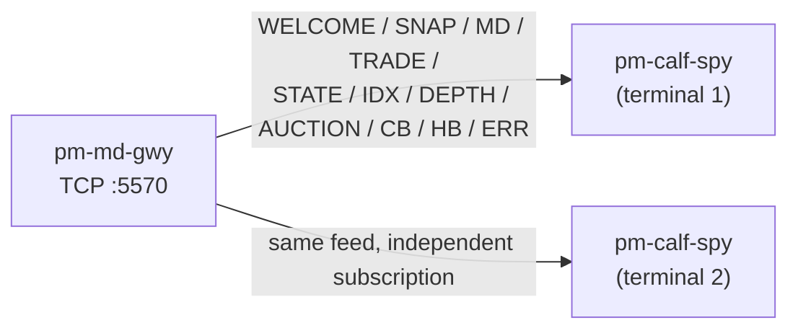

# CALF Protocol Spy (`pm-calf-spy`)

!!! note "Learning objectives"
    After reading this page you will understand:

    - What `pm-calf-spy` is and why it exists alongside the Python/C example
      subscribers in `docs/examples/calf/`
    - How to filter by channel and symbol with `--channels`/`--symbols`
    - The difference between `--format human` and `--format json`, and when
      to reach for each
    - How to run several instances at once against the same gateway to
      watch different channels on separate terminals
    - How `--resume` and `--count` work
    - How `--ping-interval` keeps an otherwise-silent session alive past the
      gateway's idle timeout
    - How connection and protocol errors are reported


## What this tool is

`pm-calf-spy` is a read-only command-line client for `pm-md-gwy`. It opens
one CALF TCP session, sends `HELLO` and `SUB` on your behalf, and prints
every line the gateway sends back — `WELCOME`, `SNAP`, live data
(`MD`/`TRADE`/`STATE`/`IDX`/`DEPTH`/`AUCTION`/`CB`), `HB`, and `ERR` — either
as a colourised, human-readable log line or as one JSON object per line.



It exists purely to make the protocol observable: to answer "what does CALF
actually send when X happens?" without writing a client or reading
`docs/examples/calf/calf_subscriber.py`. It never places orders, never
mutates exchange state, and it is safe to run any number of instances
against the same gateway at once — `pm-md-gwy` accepts an arbitrary number
of concurrent TCP connections (up to `market_data_gateway.max_connections`),
and each `pm-calf-spy` process has its own independent subscription set.


## Why not the example subscriber?

`docs/examples/calf/calf_subscriber.py` (see
[Market Data Feed — Python subscriber example](240-market-data-feed.md#python-subscriber-example))
is a *library-style* example meant to be read and adapted: it hard-codes a
fixed channel set (`TOP`, `TRADE`, `STATE`, `DEPTH`, optionally `INDEX`) and
formats output for a specific demo. `pm-calf-spy` is a *general-purpose
inspection tool*: any channel combination, any symbol filter, machine-
readable output for piping into `jq`/`grep`/a file, and a `--count` flag for
scripted one-shot captures. Reach for the example code when you're writing
your own CALF client; reach for `pm-calf-spy` when you just want to look at
the wire.


## Starting point

```bash
pm-calf-spy --channels TOP,TRADE --symbols AAPL
```

`pm-md-gwy` must already be running and reachable (default
`127.0.0.1:5570`). `pm-engine` does not strictly need to be running for the
handshake to succeed, but you will not see any live data until it is.

**Connection options:**

| Flag | Default | Description |
|---|---|---|
| `--host` | `127.0.0.1` | `pm-md-gwy` TCP host |
| `--port` | `5570` | `pm-md-gwy` TCP port |
| `--client-name` | `calf-spy-<pid>` | `HELLO\|CLIENT=` identifier reported in gateway logs |
| `--ping-interval` | `60` | Seconds between `PING` frames sent to the gateway; `0` disables the heartbeat. See [Keeping the connection alive](#keeping-the-connection-alive) |

**Subscription filtering:**

| Flag | Default | Description |
|---|---|---|
| `--channels` | `*` | Comma-separated channels, e.g. `TOP,TRADE,CB`. `*` subscribes to every channel in `WELCOME\|CH_SUPPORTED=` (falling back to `TOP,TRADE,STATE` if that field is absent — see [pre-1.0.0 gateway note](240-market-data-feed.md#step-1-send-hello)) |
| `--symbols` | `*` | Comma-separated symbols, e.g. `AAPL,MSFT`. `*` requests the wildcard for every channel that allows it (`TOP`, `TRADE`, `STATE`, `AUCTION`) |
| `--resume` | *(none)* | One-shot `CH:SYM:LASTSEQ`, e.g. `TOP:AAPL:1042` — requests single-stream replay on connect (mirrors `HELLO\|RESUME=1\|CH=..\|SYM=..\|LASTSEQ=..`) |

`--channels`/`--symbols` are applied as a single `SUB` for the full
Cartesian product. If a requested combination is invalid — `SYM=*` on a
channel that rejects it (`INDEX`, `DEPTH`, `CB`), or an unknown symbol —
the gateway's `ERR` line is printed like any other line rather than aborting
the whole session, so you can see exactly what was rejected and why. Pass
explicit symbols for `INDEX`/`DEPTH`/`CB` rather than relying on `*`.

**Output options:**

| Flag | Default | Description |
|---|---|---|
| `--format` | `human` | `human` (colourised log line) or `json` (one `json.dumps` object per line) |
| `--raw` | off | Also echo the raw wire line under each formatted line (human format only) |
| `--no-color` | off | Disable ANSI colour even on a terminal |
| `--show-heartbeats` | off | Also print `HB` and `PONG` lines (suppressed by default to reduce noise) |
| `--count N` | `0` | Exit after N data-carrying lines (`0` = run until Ctrl-C); heartbeats don't count |

**Diagnostics:** `--log-level`, `-v`/`--verbose`, `-q`/`--quiet`, `--version`,
`--help` — same conventions as every other `pm-*` process (see
[Getting Started — Environment variables](000-getting-started.md#environment-variables)).


## Keeping the connection alive

`pm-calf-spy` is purely a listener: after the initial `HELLO`/`SUB`
handshake it has nothing more to say, so — unlike a real trading client that
periodically sends orders or cancels — it would otherwise go completely
silent for the rest of the session. `pm-md-gwy` disconnects any client that
sends nothing at all for `market_data_gateway.idle_timeout_sec` (see
[Market Data Feed — Configuration](240-market-data-feed.md)), so a purely
receive-only client needs to generate outbound traffic of its own to avoid
being dropped.

`pm-calf-spy` does this automatically: a background thread sends `PING`
every `--ping-interval` seconds (default `60`), and the gateway replies with
a `PONG` (suppressed from the default view the same way `HB` is — pass
`--show-heartbeats` to see both). Set `--ping-interval` lower than the
gateway's `idle_timeout_sec` if you have shortened that value for
diagnostics, or `0` to disable the heartbeat entirely (e.g. when
deliberately testing idle-timeout behavior).


## Human-readable output

One line per event: a local wall-clock timestamp, the message type, the
channel (colour-coded so several interleaved channels stay visually
distinct), the symbol, the sequence number, and the remaining fields as
`KEY=VALUE` pairs, sorted for stable reading:

```text
◆ pm-calf-spy connected to 127.0.0.1:5570 as calf-spy-40213 (Ctrl-C to stop)
10:02:17.041  WELCOME   CH_SUPPORTED=AUCTION,CB,DEPTH,INDEX,STATE,TOP,TRADE GW=md-gwy01 HBINT=1 PROTO=CALF1 REPLAY=30 SYMBOLS=AAPL,MSFT
10:02:17.048  SNAP     TOP      AAPL       #1      ASK=150.12 ASKSZ=900 BID=150.10 BIDSZ=1200 LAST=150.11 LASTSZ=300
10:02:17.512  MD       TOP      AAPL       #2      BID=150.11 BIDSZ=1400
10:02:18.203  TRADE    TRADE    AAPL       #44     PX=150.12 QTY=200 SIDE=BUY
10:02:20.001  CB       CB       AAPL       #4      LEVEL=L2 MODE=AUCTION REFPX=150.10 RESUMEAT=2026-07-20T10:20:00.000Z STATUS=HALTED TRIGGERPX=148.20
```

Session-level messages that carry no channel/symbol of their own (`WELCOME`,
`HB`, `PONG`) are rendered without the channel/symbol/sequence columns.
`ERR` lines highlight the `CODE` field:

```text
10:02:21.010  ERR      INVALID_SYMBOL SYM=*
```

Pass `--raw` to also print the exact wire line underneath, for comparing
the rendering against the actual bytes:

```text
10:02:17.512  MD       TOP      AAPL       #2      BID=150.11 BIDSZ=1400
  MD|CH=TOP|SYM=AAPL|SEQ=2|TS=2026-06-30T09:30:00.500Z|BID=150.11|BIDSZ=1400
```


## JSON output

`--format json` prints one JSON object per line — no banner, no colour,
straightforward to pipe into `jq`, log to a file, or feed into another
program. The envelope fields (`CH`, `SYM`, `SEQ`) are lifted to top-level
keys for easy filtering; every field, including the envelope ones, is also
kept verbatim under `fields` so nothing is lost relative to the raw line:

```json
{"recv_ts": 1784576040.335, "msg_type": "SNAP", "ch": "TOP", "sym": "AAPL", "seq": 1, "ts": "2026-07-20T10:02:17.048Z", "fields": {"CH": "TOP", "SYM": "AAPL", "SEQ": "1", "TS": "2026-07-20T10:02:17.048Z", "BID": "150.10", "BIDSZ": "1200", "ASK": "150.12", "ASKSZ": "900", "LAST": "150.11", "LASTSZ": "300"}}
```

Typical uses:

```bash
# Only circuit-breaker events, as they happen
pm-calf-spy --channels CB --format json | jq 'select(.fields.STATUS == "HALTED")'

# Capture the first 50 trades to a file for later analysis
pm-calf-spy --channels TRADE --symbols '*' --format json --count 50 > trades.jsonl
```


## Running several instances at once

Since each `pm-calf-spy` process opens its own independent TCP connection
and subscription set, you can split channels across terminals instead of
filtering one firehose:

```bash
# Terminal 1 — order book activity for one symbol
pm-calf-spy --channels TOP,DEPTH --symbols AAPL

# Terminal 2 — market-wide trade tape
pm-calf-spy --channels TRADE --symbols '*'

# Terminal 3 — everything auction- and circuit-breaker-related
pm-calf-spy --channels AUCTION,CB --symbols AAPL,MSFT
```

None of these interfere with each other or with any other CALF client
(a real trading bot, `calf_subscriber.py`, etc.) already connected to the
same gateway — `pm-md-gwy` fans out independently per session.


## Connection and protocol errors

- If the initial TCP connect fails (gateway not running, wrong host/port),
  `pm-calf-spy` prints `pm-calf-spy: could not connect to HOST:PORT: ...`
  and exits `1` — no retry loop.
- If the gateway rejects the handshake itself (`ERR|CODE=PROTO_MISMATCH`),
  that is also reported and the process exits `1`.
- Once connected, any `ERR` the gateway sends in response to `SUB` (bad
  channel, bad symbol, wildcard misuse, subscription limit) is printed like
  any other line — the session stays open so you can see the rejection
  and keep watching whatever subscriptions *did* succeed.
- Ctrl-C (or reaching `--count`) closes the connection cleanly and prints
  `pm-calf-spy: connection closed.`


## See also

- [Market Data Feed (CALF)](240-market-data-feed.md) — operational guide, wire examples, and the Python/C example subscribers
- [Appendix — CALF Protocol](920-app-calf-protocol.md) — normative wire format, full field tables, sequencing rules
- [Processes](170-processes.md#pm-calf-spy-calf-protocol-spy) — where `pm-calf-spy` sits in the process model
- [Training — CALF Market-Data Gateway Protocol](../training/23-calf.md) — hands-on exercises using `nc` and the example subscribers
- [Drop-Copy Spy (pm-dc-spy)](252-dc-spy-cli.md) — the analogous inspection tool for the per-participant fill feed
