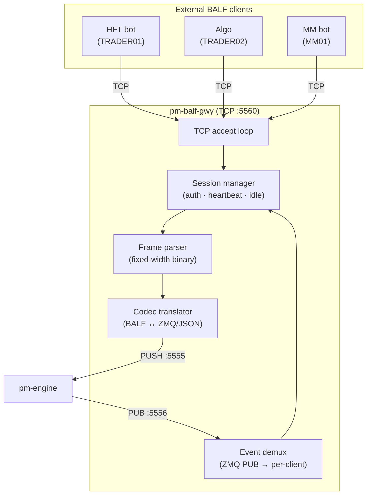
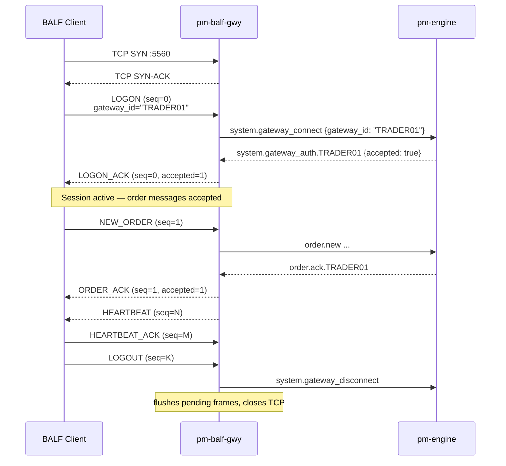

# BALF TCP Gateway (`pm-balf-gwy`)

!!! note "Learning objectives"
    After reading this page you will understand:

    - what `pm-balf-gwy` does and when to prefer it over `pm-alf-gwy`
    - how to configure it in `engine_config.yaml`
    - how to start it and verify connectivity from a Python script
    - the session lifecycle: LOGON → LOGON_ACK → messages → LOGOUT
    - which client messages are accepted and which server messages to expect
    - how heartbeats and liveness timeouts work
    - how to write a minimal Python BALF client
    - the error conditions that close the connection

See [Appendix: BALF Protocol Reference](91-app-balf-protocol.md) for exact
frame layouts, byte offsets, and encoding rules.


## What this process is

`pm-balf-gwy` is the **BALF TCP gateway**.  BALF (Binary ALF) is a
fixed-width binary protocol that carries the same trading semantics as ALF —
identical order types, TIF values, SMP rules, and gateway authentication — but
is designed for low-latency programmatic clients.



### Why BALF instead of ALF?

| Property | ALF (`pm-alf-gwy`) | BALF (`pm-balf-gwy`) |
|----------|-------------------|---------------------|
| Wire format | Human-readable text lines | Fixed-width binary frames |
| Parsing | `\|`-delimiter split + float parsing | Known byte offsets, no scanning |
| Frame size known upfront | No — scan for `\n` | Yes — `msg_type` byte determines size |
| Sequence numbers | None | Explicit `u32` per direction |
| Price encoding | ASCII decimal string | `i64` scaled by 10⁸ |
| Best for | Python scripts, operators, simple bots | Latency-sensitive algos, C/Rust/C++ clients |

!!! info "Same engine semantics"
    BALF and ALF both authenticate against the same `gateways.alf` allowlist
    and translate into the identical engine ZMQ/JSON messages. The engine sees
    no difference between an ALF order and a BALF order.

### What BALF `1.0.0` does not support

| Unsupported feature | Notes |
|---------------------|-------|
| OCO (one-cancels-other) orders | Reserved for a future BALF version |
| Multi-leg combo orders | Reserved for a future BALF version |
| Market-data broadcast (SESSION, TRADE, HALT) | ALF gateway only in `1.0.0` |
| Sequence recovery / resend protocol | Reconnect on gap |
| Encryption at the protocol level | Use TLS or a tunnel |

For interactive operator use, `pm-alf-console` remains the right tool.
For external market-data consumers, use `pm-md-gwy` (CALF) or `pm-api-gwy`.


## Prerequisites

- `pm-engine` running and accessible.
- Gateway IDs that will connect must be present in `engine_config.yaml`
  under `gateways.alf` (BALF `1.0.0` reuses the ALF allowlist).
- Optional: add a `balf_gateway:` section to customise port and limits.


## Configuration

Add a `balf_gateway:` section to `engine_config.yaml`:

```yaml
balf_gateway:
  enabled: true
  name: "balf-gwy01"
  bind_address: "0.0.0.0"
  port: 5560
  heartbeat_interval_sec: 1
  heartbeat_timeout_sec: 5
  idle_timeout_sec: 30
  auth_timeout_sec: 10
  max_connections: 64
  max_client_queue: 10000
  max_messages_per_second: 100
  max_errors_before_disconnect: 10
  error_window_sec: 60
  duplicate_session_policy: REJECT_NEW
```

The gateway reads gateway roles and disconnect behaviour from the existing
`gateways.alf` list — no separate credentials block is needed.  Any gateway ID
listed in `gateways.alf` can connect to `pm-balf-gwy`.

| Field | Default | Description |
|-------|---------|-------------|
| `enabled` | `true` | Master switch |
| `name` | `balf-gwy01` | Gateway name echoed in `LOGON_ACK.msg` |
| `bind_address` | `0.0.0.0` | Network interface to listen on (`127.0.0.1` for local-only) |
| `port` | `5560` | TCP listen port |
| `heartbeat_interval_sec` | `1` | Seconds between server-initiated `HEARTBEAT` frames |
| `heartbeat_timeout_sec` | `5` | Disconnect if no inbound traffic for this many seconds |
| `idle_timeout_sec` | `30` | Additional idle-session cleanup guard |
| `auth_timeout_sec` | `10` | Hard-close if `LOGON` is not answered within this window |
| `max_connections` | `64` | Maximum simultaneous TCP connections |
| `max_client_queue` | `10000` | Per-client outbound frame buffer capacity |
| `max_messages_per_second` | `100` | Token-bucket rate limit per client |
| `max_errors_before_disconnect` | `10` | Error threshold in a sliding window before forced disconnect |
| `error_window_sec` | `60` | Sliding window length for the error counter |
| `duplicate_session_policy` | `REJECT_NEW` | `REJECT_NEW` or `EVICT_OLD` |

!!! note "TLS"
    `pm-balf-gwy` does not terminate TLS.  For remote deployments, place it
    behind a reverse proxy (nginx, stunnel, or similar).


## Start the gateway

Installed mode:

```bash
pm-engine --verbose
pm-balf-gwy --config engine_config.yaml
```

Developer mode:

```bash
poetry run pm-engine --verbose
poetry run pm-balf-gwy --config engine_config.yaml
```

CLI override options:

| Option | Default | Description |
|--------|---------|-------------|
| `--bind ADDR` | from config / `0.0.0.0` | Override TCP bind address |
| `--port PORT` | from config / `5560` | Override TCP listen port |
| `--engine-host HOST` | from config | Override engine host (sets `tcp://HOST:5555` and `tcp://HOST:5556`) |
| `--config` / `-c` | see resolution order below | Path to engine config YAML |

**Config file resolution order** (first match wins):

1. `--config PATH` CLI flag
2. `EDUMATCHER_CONFIG` environment variable
3. `<repo>/engine_config.yaml` — detected from working directory
4. `./engine_config.yaml` — current working directory (installed mode)


## Quick connectivity test

BALF is a binary protocol, so `nc` and `telnet` cannot be used to type
frames manually.  The minimal test is a short Python script:

```python
#!/usr/bin/env python3
"""Minimal BALF session test — sends LOGON and prints the LOGON_ACK result."""
import socket
import struct

BALF_MAGIC   = 0xBA
BALF_VERSION = 0x01
MSG_LOGON     = 0x01
MSG_LOGON_ACK = 0x02
FRAME_SIZE = {MSG_LOGON: 32, MSG_LOGON_ACK: 92}

def recv_exact(sock, n):
    buf = bytearray()
    while len(buf) < n:
        chunk = sock.recv(n - len(buf))
        if not chunk:
            raise RuntimeError("connection closed")
        buf.extend(chunk)
    return bytes(buf)

def build_logon(gateway_id: str) -> bytes:
    header = struct.pack("<BBBBI", BALF_MAGIC, BALF_VERSION, MSG_LOGON, 0, 0)
    body   = struct.pack("<16sB7s", gateway_id.encode("ascii"), BALF_VERSION, b"\x00" * 7)
    return header + body

def parse_logon_ack(frame: bytes):
    body = frame[8:]                  # skip 8-byte header
    gw_raw, accepted, reject_code, msg_len, _, msg = struct.unpack("<16sBBBB64s", body)
    gw_id = gw_raw.rstrip(b"\x00").decode("ascii")
    reason = msg[:msg_len].decode("ascii", errors="replace")
    return gw_id, bool(accepted), reject_code, reason

sock = socket.create_connection(("127.0.0.1", 5560), timeout=5)
sock.sendall(build_logon("TRADER01"))

ack_bytes = recv_exact(sock, FRAME_SIZE[MSG_LOGON_ACK])
gw_id, ok, code, msg = parse_logon_ack(ack_bytes)

if ok:
    print(f"LOGON_ACK accepted — gateway={gw_id!r}  msg={msg!r}")
else:
    print(f"LOGON_ACK rejected — code=0x{code:02X}  msg={msg!r}")

sock.close()
```

Expected output on success:

```text
LOGON_ACK accepted — gateway='TRADER01'  msg='gateway=balf-gwy01 hbint=1s'
```

!!! warning "TCP is a byte stream"
    Never assume one `recv()` call delivers a complete frame.  Always read
    exactly the expected byte count using a loop, as shown above.


## Session lifecycle

Every BALF session follows this exact sequence:



### Step 1 — Send LOGON

The **first frame** must be a `LOGON` (msg_type `0x01`, 32 bytes total):

- `gateway_id`: 16-byte zero-padded ASCII, matching an entry in `gateways.alf`
- `proto_version`: must be `1`
- reserved bytes: must be zero

If the first frame is not a valid `LOGON`, the gateway hard-closes the TCP
connection immediately.

See [LOGON frame layout](91-app-balf-protocol.md#logon-0x01-client-server) in
the protocol reference.

### Step 2 — Receive LOGON_ACK

The gateway authenticates with the engine and replies with `LOGON_ACK` (msg_type
`0x02`, 92 bytes):

- `accepted = 1`: session is open; order messages may be sent
- `accepted = 0`: session rejected; close the TCP connection

| Reject code | Meaning |
|-------------|---------|
| `0x01` | Gateway ID not configured in engine |
| `0x02` | Gateway ID already connected |
| `0x03` | Protocol version mismatch |
| `0xFF` | Other — see `msg` field |

The `msg` field carries a human-readable description on success (e.g. the
gateway name and configured heartbeat interval) and the engine rejection reason
on failure.

See [LOGON_ACK frame layout](91-app-balf-protocol.md#logon_ack-0x02-server-client)
for the exact body structure.

### Step 3 — Send order messages

After `accepted = 1`, the client may send `NEW_ORDER`, `CANCEL_ORDER`,
`AMEND_ORDER`, `HEARTBEAT`, `HEARTBEAT_ACK`, and `LOGOUT`.

Sequence numbers start at `1` for the first non-LOGON message in each
direction.

### Step 4 — Receive server messages

Server-initiated messages arrive asynchronously and out-of-band relative to
client messages.  The client must always be able to read them.  See
[Server-initiated messages](#server-initiated-messages) below.

### Step 5 — Disconnect

Send `LOGOUT` (msg_type `0x40`, 8 bytes, header only) for a graceful close.
The gateway notifies the engine and closes the TCP connection after flushing
any pending outbound frames.


## Message reference

See the [BALF Protocol Reference](91-app-balf-protocol.md) appendix for exact
byte layouts, offset tables, and encoding rules for all messages.

### Client → server messages

| Code | Name | Bytes | Purpose |
|------|------|-------|---------|
| `0x01` | `LOGON` | 32 | Open the session; must be the first frame |
| `0x10` | `NEW_ORDER` | 60 | Submit a new single-leg order |
| `0x12` | `CANCEL_ORDER` | 24 | Cancel a resting order |
| `0x14` | `AMEND_ORDER` | 44 | Amend price and/or quantity of a resting order |
| `0x30` | `HEARTBEAT` | 16 | Liveness probe; carries `send_time_ns` |
| `0x31` | `HEARTBEAT_ACK` | 16 | Reply to a server `HEARTBEAT` |
| `0x40` | `LOGOUT` | 8 | Graceful disconnect |

### Server → client messages

| Code | Name | Bytes | Trigger |
|------|------|-------|---------|
| `0x02` | `LOGON_ACK` | 92 | Response to `LOGON` |
| `0x11` | `ORDER_ACK` | 60 | Response to `NEW_ORDER`; accepted or rejected |
| `0x13` | `CANCEL_ACK` | 32 | Cancel confirmed, rejected, or system-originated |
| `0x15` | `AMEND_ACK` | 48 | Amend confirmed or rejected |
| `0x20` | `EXECUTION_REPORT` | 64 | Partial or full fill |
| `0x30` | `HEARTBEAT` | 16 | Server-initiated liveness probe |
| `0x31` | `HEARTBEAT_ACK` | 16 | Reply to a client `HEARTBEAT` |

!!! tip "Reading frame size"
    All frame sizes are fixed and known from the header `msg_type` byte.  Read
    the 8-byte header first, use `msg_type` to look up the total frame size, then
    read exactly that many additional bytes.  This is all that a BALF receive
    loop needs to do.  See [Message reference summary table](91-app-balf-protocol.md#summary-table).


## Order types and field encoding

### Supported order types

| `order_type` code | ALF equivalent | Required price fields |
|-------------------|---------------|----------------------|
| `0x01` | `MARKET` | none (`price = 0`) |
| `0x02` | `LIMIT` | `price` |
| `0x03` | `IOC` | `price` |
| `0x04` | `FOK` | `price` |
| `0x05` | `STOP` | `stop_price` |
| `0x06` | `STOP_LIMIT` | `stop_price` and `price` |
| `0x07` | `ICEBERG` | `price` and `visible_qty` |
| `0x08` | `TRAILING_STOP` | `trail_offset`; optionally `stop_price` |

See [NEW_ORDER message layout](91-app-balf-protocol.md#new_order-0x10-client-server)
for TIF, SMP, and all field offset tables.

### Price encoding

All prices and price-like offsets are `i64`, little-endian, scaled by 10⁸:

```text
wire_value = round(display_price × 100_000_000)

  $150.25   →  15_025_000_000
  $0.0001   →          10_000
  $0.00     →               0  (field not used for this order type)
```

See [Price encoding](91-app-balf-protocol.md#price-encoding) in the protocol
reference.

### ORDER_ACK reject codes

When `ORDER_ACK.accepted = 0`, the `reject_code` byte classifies the rejection.

| Code | Meaning |
|------|---------|
| `0x01` | Gateway not configured |
| `0x02` | Gateway not connected |
| `0x03` | Symbol not configured |
| `0x04` | Market is closed |
| `0x05` | ATO order outside opening auction |
| `0x06` | ATC order outside closing auction |
| `0x07` | Halt rejection (MARKET / FOK / IOC during circuit-breaker halt) |
| `0x08` | Session-phase rejection |
| `0x09` | Trailing stop — no prior trade price and no explicit STOP= |
| `0x0A` | Insufficient liquidity |
| `0x0B` | Price collar rejection |
| `0xFF` | Other — read the `reason` field for the engine detail text |

The `reason` field (25 bytes, ASCII) always contains the authoritative engine
text, regardless of `reject_code`.  Use `reason` for logging and `reject_code`
for programmatic branching.

See [ORDER_ACK reject codes](91-app-balf-protocol.md#order_ack-0x11-server-client)
in the protocol reference.


## Annotated wire-frame examples

These byte-level examples show exactly how messages look on the wire. Every frame
starts with a 4-byte header — magic `BA`, version `01`, message type, flags — then a
little-endian `seq_no`, then the fixed-width body. (For the normative frame layouts
and field offsets, see the [BALF Protocol Reference](91-app-balf-protocol.md).)

**NEW_ORDER — LIMIT BUY 100 AAPL @ 150.25 (60 bytes):**

```text
Header:
  BA 01 10 00  |  magic=0xBA, version=1, msg_type=NEW_ORDER(0x10), flags=0
  01 00 00 00  |  seq_no=1 (LE)
Body:
  01 00 00 00  00 00 00 00  |  client_order_id = 1
  41 50 50 4C  00 00 00 00  |  symbol = "AAPL\0\0\0\0"
  00 10 28 65  03 00 00 00  |  price = 15_025_000_000
  00 00 00 00  00 00 00 00  |  stop_price = 0
  00 00 00 00  00 00 00 00  |  trail_offset = 0
  64 00 00 00                |  quantity = 100
  00 00 00 00                |  visible_qty = 0
  01                         |  side = BUY
  02                         |  order_type = LIMIT
  01                         |  tif = DAY
  00                         |  smp = NONE
```

**CANCEL_ORDER (24 bytes):**

```text
Header:
  BA 01 12 00  |  msg_type=CANCEL_ORDER(0x12)
  02 00 00 00  |  seq_no=2
Body:
  02 00 00 00  00 00 00 00  |  client_order_id = 2
  01 00 00 00  00 00 00 00  |  order_id = 1
```

**HEARTBEAT (16 bytes):**

```text
Header:
  BA 01 30 00  |  msg_type=HEARTBEAT(0x30)
  03 00 00 00  |  seq_no=3
Body:
  78 56 34 12  00 00 00 00  |  send_time_ns (example)
```


## Server-initiated messages

These frames arrive **unsolicited** at any point during the session.  The
client's receive loop must handle them without waiting for a prior request.

### HEARTBEAT

The server sends `HEARTBEAT` when no other outbound traffic has been sent for
`heartbeat_interval_sec` (default 1 s).

The client **must** reply with `HEARTBEAT_ACK`, echoing `send_time_ns` in the
`orig_send_time_ns` field.

If no inbound traffic of any kind arrives within `heartbeat_timeout_sec`
(default 5 s), the gateway disconnects the session.

```text
HEARTBEAT      →  fill orig_send_time_ns with send_time_ns
HEARTBEAT_ACK  →  echo back orig_send_time_ns
```

See [HEARTBEAT](91-app-balf-protocol.md#heartbeat-0x30-bidirectional) and
[HEARTBEAT_ACK](91-app-balf-protocol.md#heartbeat_ack-0x31-bidirectional)
in the protocol reference.

### EXECUTION_REPORT

Sent when a resting order is partially or fully filled.  Multiple
`EXECUTION_REPORT` frames may arrive for a single `NEW_ORDER` (one per fill
event).

| Field | Description |
|-------|-------------|
| `client_order_id` | Echoed from the original `NEW_ORDER` |
| `order_id` | Gateway-assigned session-scoped ID |
| `fill_price` | Execution price × 10⁸ (i64 LE) |
| `fill_qty` | Quantity matched in this event |
| `remaining_qty` | Unfilled quantity after this fill |
| `status` | `1` = PARTIAL, `2` = FILLED |

### CANCEL_ACK

A `CANCEL_ACK` may arrive because:

1. **Client cancel confirmed** — the engine processed a `CANCEL_ORDER` request
2. **Cancel rejected** — `CANCEL_ORDER` failed (e.g. order not found); `accepted = 0`
3. **System-originated cancel** — SMP, session-end policy, or expiry; `cancel_reason = 255`

| `cancel_reason` | Meaning |
|-----------------|---------|
| `0` | Explicit client `CANCEL_ORDER` confirmed |
| `255` | System-originated (SMP, session-end, expiry) |

### AMEND_ACK

A `AMEND_ACK` may arrive because:

1. **Amend confirmed** — `accepted = 1`; `new_price`, `new_quantity`, `remaining_qty`, and `priority_reset` reflect the post-amend state
2. **Amend rejected** — `accepted = 0`; `AMEND_ORDER` failed (e.g. unknown order, price unchanged)

!!! note "Cancel and amend correlation"
    The gateway correlates `CANCEL_ORDER` and `AMEND_ORDER` requests with the
    engine ack/reject cycle internally.  If the engine rejects the cancel or
    amend via `order.ack`, the gateway emits the appropriate `CANCEL_ACK` or
    `AMEND_ACK` with `accepted = 0`.


## Disconnect behaviour and passive-order policy

On every disconnect trigger the gateway sends `system.gateway_disconnect` to
the engine.  The engine applies the `disconnect_behaviour` configured for that
gateway identity in `gateways.alf`:

| `disconnect_behaviour` | Engine action |
|---|---|
| `LEAVE_ALL` | Leave all resting orders and active quotes |
| `CANCEL_QUOTES_ONLY` | Cancel active quotes; leave non-quote orders |
| `CANCEL_ALL` | Cancel all active quotes and all resting orders |

Disconnect trigger classes:

- Graceful client `LOGOUT`
- Heartbeat timeout (`heartbeat_timeout_sec` without inbound traffic)
- Transport break (TCP FIN / RST, peer closed)
- Protocol safety disconnect (bad framing, unknown `msg_type`, non-zero reserved fields, outbound queue overflow, repeated errors)


## Duplicate session policy

If a second client sends `LOGON` with the same gateway ID as an already-connected
session, the gateway's response depends on `duplicate_session_policy`:

| Policy | Behaviour |
|--------|-----------|
| `REJECT_NEW` (default) | Second `LOGON` receives `LOGON_ACK(accepted=0, reject_code=0x02)` |
| `EVICT_OLD` | First session is disconnected; second session proceeds to auth |


## Example: minimal Python BALF client

The following zero-dependency script demonstrates a complete BALF session:
connect, authenticate, submit a LIMIT BUY, read the `ORDER_ACK`, and
gracefully disconnect.

```python
#!/usr/bin/env python3
"""Minimal zero-dependency BALF client.

Usage:
    python3 balf_minimal.py --id TRADER01
    python3 balf_minimal.py --host 10.0.0.5 --port 5560 --id TRADER01
"""
import argparse
import socket
import struct
import time

# ── Protocol constants ────────────────────────────────────────────────────────
BALF_MAGIC   = 0xBA
BALF_VERSION = 0x01
PRICE_SCALE  = 100_000_000  # 10^8

MSG_LOGON              = 0x01
MSG_LOGON_ACK          = 0x02
MSG_NEW_ORDER          = 0x10
MSG_ORDER_ACK          = 0x11
MSG_HEARTBEAT          = 0x30
MSG_HEARTBEAT_ACK      = 0x31
MSG_LOGOUT             = 0x40

SIDE_BUY   = 0x01
ORDER_LIMIT = 0x02
TIF_DAY    = 0x01

FRAME_SIZES = {
    MSG_LOGON:         32,
    MSG_LOGON_ACK:     92,
    MSG_NEW_ORDER:     60,
    MSG_ORDER_ACK:     60,
    MSG_HEARTBEAT:     16,
    MSG_HEARTBEAT_ACK: 16,
    MSG_LOGOUT:         8,
}

# ── Wire helpers ──────────────────────────────────────────────────────────────
def encode_price(display: float) -> int:
    return round(display * PRICE_SCALE)

def build_header(msg_type: int, seq_no: int) -> bytes:
    return struct.pack("<BBBBI", BALF_MAGIC, BALF_VERSION, msg_type, 0, seq_no)

def recv_frame(sock: socket.socket) -> tuple[int, bytes]:
    """Read one complete BALF frame; return (msg_type, body)."""
    def read_exact(n: int) -> bytes:
        buf = bytearray()
        while len(buf) < n:
            chunk = sock.recv(n - len(buf))
            if not chunk:
                raise RuntimeError("connection closed by gateway")
            buf.extend(chunk)
        return bytes(buf)

    header  = read_exact(8)
    msg_type = header[2]
    total   = FRAME_SIZES[msg_type]
    body    = read_exact(total - 8)
    return msg_type, body

# ── Message builders ──────────────────────────────────────────────────────────
def build_logon(gateway_id: str) -> bytes:
    body = struct.pack(
        "<16sB7s",
        gateway_id.encode("ascii"),
        BALF_VERSION,
        b"\x00" * 7,
    )
    return build_header(MSG_LOGON, 0) + body

def build_new_order(
    client_order_id: int,
    symbol: str,
    price: float,
    quantity: int,
    seq_no: int,
) -> bytes:
    body = struct.pack(
        "<Q8sqqqIIBBBB",
        client_order_id,
        symbol.encode("ascii"),
        encode_price(price),
        0,          # stop_price  (unused)
        0,          # trail_offset (unused)
        quantity,
        0,          # visible_qty (unused)
        SIDE_BUY,
        ORDER_LIMIT,
        TIF_DAY,
        0,          # smp = NONE
    )
    return build_header(MSG_NEW_ORDER, seq_no) + body

def build_logout(seq_no: int) -> bytes:
    return build_header(MSG_LOGOUT, seq_no)

# ── Main ──────────────────────────────────────────────────────────────────────
def main() -> None:
    parser = argparse.ArgumentParser()
    parser.add_argument("--host",  default="127.0.0.1")
    parser.add_argument("--port",  type=int, default=5560)
    parser.add_argument("--id",    required=True, help="Gateway ID (e.g. TRADER01)")
    parser.add_argument("--sym",   default="AAPL")
    parser.add_argument("--price", type=float, default=150.0)
    parser.add_argument("--qty",   type=int,   default=100)
    args = parser.parse_args()

    print(f"Connecting to {args.host}:{args.port} as {args.id} ...")
    sock = socket.create_connection((args.host, args.port), timeout=10)
    seq_no = 0  # tracks client-direction sequence

    # ── LOGON ─────────────────────────────────────────────────────────────────
    sock.sendall(build_logon(args.id))

    mt, body = recv_frame(sock)
    assert mt == MSG_LOGON_ACK, f"expected LOGON_ACK, got 0x{mt:02X}"
    gw_raw, accepted, reject_code, msg_len, _, msg_bytes = struct.unpack("<16sBBBB64s", body)
    gw_id  = gw_raw.rstrip(b"\x00").decode("ascii")
    msg    = msg_bytes[:msg_len].decode("ascii", errors="replace")

    if not accepted:
        print(f"LOGON rejected: code=0x{reject_code:02X} reason={msg!r}")
        sock.close()
        return

    print(f"LOGON accepted — gateway={gw_id!r} ({msg})")

    # ── NEW_ORDER ─────────────────────────────────────────────────────────────
    seq_no += 1
    client_order_id = 1
    sock.sendall(build_new_order(client_order_id, args.sym, args.price, args.qty, seq_no))
    print(f"Sent NEW_ORDER: symbol={args.sym} side=BUY type=LIMIT "
          f"qty={args.qty} price={args.price:.4f} seq={seq_no}")

    # Read until we receive the ORDER_ACK (HEARTBEAT may arrive first)
    while True:
        mt, body = recv_frame(sock)

        if mt == MSG_HEARTBEAT:
            # Respond to heartbeat immediately
            orig_send_time_ns = struct.unpack_from("<Q", body)[0]
            seq_no += 1
            ack_frame = build_header(MSG_HEARTBEAT_ACK, seq_no) + struct.pack("<Q", orig_send_time_ns)
            sock.sendall(ack_frame)
            print(f"  HEARTBEAT → HEARTBEAT_ACK sent")
            continue

        if mt == MSG_ORDER_ACK:
            (clord, oid, ts_ns, accepted_byte, rcode, rlen) = struct.unpack_from("<QQQBBBx", body)
            reason = body[27 : 27 + rlen].decode("ascii", errors="replace")
            if accepted_byte:
                print(f"ORDER_ACK accepted — order_id={oid} timestamp_ns={ts_ns}")
            else:
                print(f"ORDER_ACK rejected  — code=0x{rcode:02X} reason={reason!r}")
            break

        # Ignore other unsolicited server messages (EXECUTION_REPORT, etc.)
        print(f"  received msg_type=0x{mt:02X} while waiting for ORDER_ACK")

    # ── LOGOUT ────────────────────────────────────────────────────────────────
    seq_no += 1
    sock.sendall(build_logout(seq_no))
    print("LOGOUT sent — closing connection")
    sock.close()

if __name__ == "__main__":
    main()
```

Run it:

```bash
python3 balf_minimal.py --id TRADER01
python3 balf_minimal.py --host 10.0.0.5 --port 5560 --id TRADER01
```

Expected output on success:

```text
Connecting to 127.0.0.1:5560 as TRADER01 ...
LOGON accepted — gateway='TRADER01' (gateway=balf-gwy01 hbint=1s)
Sent NEW_ORDER: symbol=AAPL side=BUY type=LIMIT qty=100 price=150.0000 seq=1
ORDER_ACK accepted — order_id=1 timestamp_ns=1751447400000000000
LOGOUT sent — closing connection
```


## Comparing `pm-balf-gwy` with the alternatives

| Scenario | Best choice |
|----------|------------|
| Human operator on the same machine | `pm-alf-console` (tab completion, history, P&L display) |
| Python / any-language bot, simple scripts | `pm-alf-gwy` (text lines, easy to debug with nc/telnet) |
| Latency-sensitive algo in C, C++, or Rust | `pm-balf-gwy` (fixed frames, no text parsing) |
| Browser UI / REST stack | `pm-api-gwy` |
| Read-only market-data consumer | `pm-md-gwy` (CALF) |
| Post-trade / clearing / audit consumer | `pm-ralf-gwy` (RALF) |


## Troubleshooting

### Check whether the port is in use

**macOS:**

```bash
sudo lsof -iTCP:5560 -sTCP:LISTEN
netstat -an | grep LISTEN | grep 5560
```

**Linux:**

```bash
ss -tlnp 'sport = :5560'
sudo lsof -iTCP:5560 -sTCP:LISTEN
```

If no output appears, the gateway is not running or is bound to a different
port.  Check `balf_gateway.port` in `engine_config.yaml`.

### Non-interactive TCP reachability test

Because BALF is binary, `nc` cannot be used interactively.  Use the quick
connectivity test script from the [Quick connectivity test](#quick-connectivity-test)
section above, or send a minimal LOGON with a one-liner:

```bash
python3 - <<'EOF'
import socket, struct
sock = socket.create_connection(("127.0.0.1", 5560), timeout=3)
header = struct.pack("<BBBBI", 0xBA, 0x01, 0x01, 0, 0)
body   = struct.pack("<16sB7s", b"PROBE\x00"*1, 0x01, b"\x00"*7)
sock.sendall(header + body)
import sys; ack = bytearray()
while len(ack) < 92:
    ack.extend(sock.recv(92 - len(ack)))
print("accepted" if ack[24] else "rejected (code=0x{:02X})".format(ack[25]))
EOF
```

### Common problems

| Symptom | Likely cause | Fix |
|---------|--------------|-----|
| `Connection refused` | Gateway not started or wrong port | Confirm `pm-balf-gwy` is running; check `balf_gateway.port` |
| Connection accepted but LOGON_ACK never arrives | Engine not running or ZMQ link lost | Start `pm-engine`; check gateway logs |
| `LOGON_ACK accepted=0, code=0x01` | Gateway ID not in `gateways.alf` | Add the ID under `gateways.alf` and restart engine |
| `LOGON_ACK accepted=0, code=0x02` | Same gateway ID already connected | Disconnect the other session, or use `duplicate_session_policy: EVICT_OLD` |
| `LOGON_ACK accepted=0, code=0x03` | `proto_version` byte is not `1` | Fix the LOGON frame builder |
| Connection closes ~5 s after last message | `heartbeat_timeout_sec` elapsed | Send `HEARTBEAT` frames and reply to server `HEARTBEAT` with `HEARTBEAT_ACK` |
| `ORDER_ACK accepted=0` | Field validation failure or engine rejection | Inspect `reason` field; check reject code table above |
| Unknown `msg_type` → connection closed | Client sent a server-direction frame | Only send client-direction frames: `LOGON`, `NEW_ORDER`, `CANCEL_ORDER`, `AMEND_ORDER`, `HEARTBEAT`, `HEARTBEAT_ACK`, `LOGOUT` |
| Corrupt response / partial reads | Client reads wrong number of bytes | Always read header first (8 bytes), look up `FRAME_SIZES[msg_type]`, then read exactly that many additional bytes |
| Gateway not reachable from another host | `bind_address: 127.0.0.1` | Change `bind_address` to `0.0.0.0` or the specific interface IP |


## See also

- [Appendix: BALF Protocol Reference](91-app-balf-protocol.md) — normative
  frame layouts, byte offsets, encoding rules, and worked hex examples
- [ALF TCP Gateway](24-alf-gateway.md) — text-protocol alternative for
  Python/any-language clients where binary parsing is not required
- [Configuration](01-configuration.md) — `balf_gateway:` section and
  `gateways.alf` allowlist
- [Processes](10-processes.md) — process topology and ZMQ message tables
- [External Protocols Overview](19-protocol-overview.md) — protocol comparison
  and selection guide
