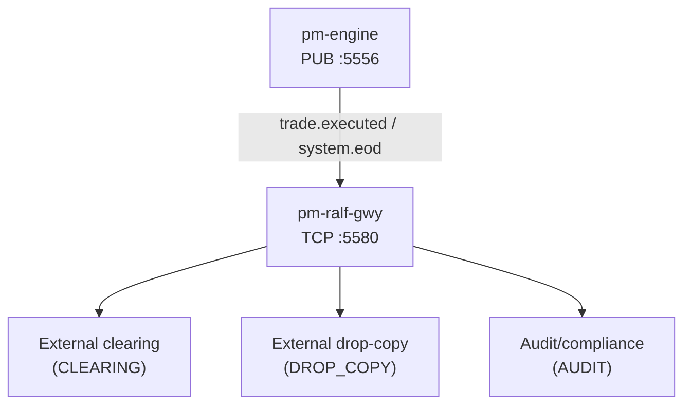
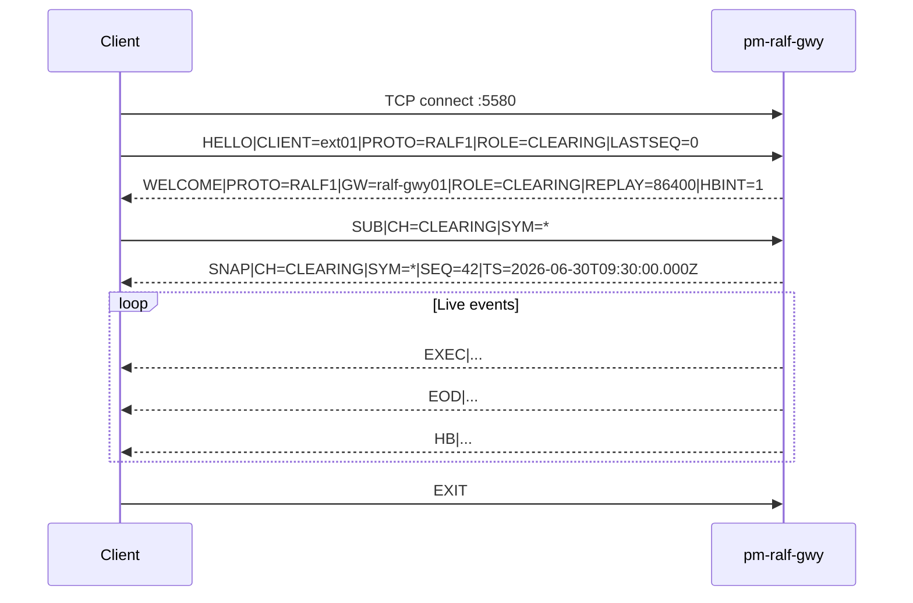

# Post-Trade Dissemination (RALF)

!!! note "Learning objectives"
    After reading this page you will understand:

    - what `pm-ralf-gwy` does and where it sits in the EduMatcher architecture
    - what data is available on each channel (`CLEARING`, `DROP_COPY`, `AUDIT`)
    - when to choose RALF over the other available protocols
    - how to start the gateway and verify connectivity from a terminal
    - how to subscribe and receive post-trade events
    - how replay and reconnect behavior works and when to use `LASTSEQ`
    - how to write a working Python subscriber using the library in `examples/ralf/`
    - which operational checks to use when debugging connectivity problems


## What this process does

`pm-ralf-gwy` is the RALF post-trade dissemination gateway.  The matching
engine publishes trade and end-of-day events on an internal ZeroMQ PUB socket
(`:5556`) that external systems cannot reach directly.  `pm-ralf-gwy` bridges
that gap: it subscribes to the engine PUB socket, translates raw events into
RALF lines, sequences them, and re-publishes them over TCP (default port `5580`)
to authenticated external clients.

RALF is intended for external parties such as:

- clearing and reconciliation systems
- risk and compliance drop-copy consumers
- audit and surveillance tooling

Unlike the interactive `pm-alf-console`, `pm-ralf-gwy` is not used for order entry.
It is a read-only event dissemination process.


## Architecture position



Responsibilities of `pm-ralf-gwy`:

- translates engine events into RALF lines per channel
- assigns **per-stream sequence numbers** on each `(channel, symbol)` pair
- keeps a **time-bounded replay journal** so reconnecting clients can recover
  missed messages without reprocessing raw engine logs
- sends an automatic **baseline snapshot** (`SNAP`) when a client subscribes
- enforces role-based channel access and disconnects slow clients


## Prerequisites

- `pm-engine` running and publishing events
- `pm-ralf-gwy` running
- symbols configured in `engine_config.yaml`


## Quick start

### 1. Start the engine

```bash
pm-engine --verbose
```

### 2. Start the RALF gateway

```bash
pm-ralf-gwy
```

By default it reads `engine_config.yaml` from the same resolution path used by
other `pm-*` processes.

### 3. Connect an external client

```text
HELLO|CLIENT=ext01|PROTO=RALF1|ROLE=CLEARING|LASTSEQ=0
SUB|CH=CLEARING|SYM=*
```

The gateway responds with `WELCOME` and `SNAP`, then streams live `EXEC`/`EOD`
messages according to subscriptions.


## Configuration

`pm-ralf-gwy` supports an optional `post_trade_gateway` block in
`engine_config.yaml`:

```yaml
post_trade_gateway:
  name: "ralf-gwy01"
  bind_address: "0.0.0.0"
  port: 5580
  replay_retention_sec: 86400
  heartbeat_interval_sec: 1
  idle_timeout_sec: 5
  max_client_queue: 10000
  allowed_roles:
    - CLEARING
    - DROP_COPY
    - AUDIT
```

CLI overrides:

```bash
pm-ralf-gwy --config engine_config.yaml --bind 127.0.0.1 --port 5580 --engine-pub tcp://127.0.0.1:5556
```

| Option | Default | Description |
|---|---|---|
| `--config` / `-c` | `engine_config.yaml` | Engine config YAML path |
| `--bind ADDR` | from config / `0.0.0.0` | Override TCP bind address |
| `--port PORT` | from config / `5580` | Override TCP listen port |
| `--engine-pub ADDR` | from config / `tcp://127.0.0.1:5556` | Override engine PUB socket address |
| `--log-level` | `WARNING` | Explicit level: `CRITICAL`, `ERROR`, `WARNING`, `INFO`, `DEBUG` |
| `-v` / `--verbose` | off | Increase verbosity (`-v` → `INFO`, `-vv` → `DEBUG`) |
| `-q` / `--quiet` | off | Reduce output to warnings/errors |


## Generate config with `pm-config-gen`

If you do not want to write the `post_trade_gateway` block by hand, generate it
alongside the main engine config with `pm-config-gen`:

```bash
pm-config-gen \
  --symbols AAPL MSFT \
  --gateways TRADER01 TRADER02 OPS01:ADMIN \
  --sessions-enabled \
  --post-trade-gateway \
  --post-trade-bind-address 127.0.0.1 \
  --post-trade-port 5580 \
  --post-trade-replay-retention-sec 3600 \
  --post-trade-heartbeat-interval-sec 1 \
  --post-trade-idle-timeout-sec 10 \
  --post-trade-max-client-queue 2000 \
  --post-trade-allowed-roles CLEARING AUDIT \
  --output engine_config.yaml
```

This produces a normal `engine_config.yaml` for `pm-engine` plus a top-level
`post_trade_gateway` block for `pm-ralf-gwy`.

Expected generated section:

```yaml
post_trade_gateway:
  name: ralf-gwy01
  bind_address: 127.0.0.1
  port: 5580
  replay_retention_sec: 3600
  heartbeat_interval_sec: 1
  idle_timeout_sec: 10
  max_client_queue: 2000
  allowed_roles:
    - CLEARING
    - AUDIT
```

Use `127.0.0.1` for a single-host lab. If external consumers must connect from
other machines, change the bind address to a controlled network-facing value
such as `0.0.0.0` and restrict access at the network boundary.


## What data is available

The gateway exposes three channels.  Each targets a different class of external
consumer.  A client's `ROLE` (declared in `HELLO`) determines which channels it
may subscribe to.

### Channel `CLEARING` — post-trade clearing data

`CLEARING` carries one `EXEC` line per matched trade plus an `EOD` summary for
each symbol at end of day.  It is the primary channel for clearing and
reconciliation systems.

**When you get it:** Subscribe with `CH=CLEARING|SYM=*` (or a specific symbol).
The gateway immediately sends a `SNAP` baseline, then streams `EXEC` events as
trades occur and `EOD` events at end of day.

**Typical use cases:** trade reconciliation, position keeping, clearing
obligation calculation.

**Wire example:**

```text
SNAP|CH=CLEARING|SYM=*|SEQ=0|TS=2026-06-30T09:30:00.000Z
EXEC|CH=CLEARING|SYM=AAPL|SEQ=1|TS=2026-06-30T09:30:01.100Z|EXEC_ID=E001|MATCH_ID=E001|BUY_ORDER_ID=O100|SELL_ORDER_ID=O101|BUY_GW=gw01|SELL_GW=gw01|SIDE=BUY|QTY=200|PX=150.12
EXEC|CH=CLEARING|SYM=AAPL|SEQ=2|TS=2026-06-30T09:31:00.000Z|EXEC_ID=E002|MATCH_ID=E002|BUY_ORDER_ID=O102|SELL_ORDER_ID=O103|BUY_GW=gw01|SELL_GW=gw02|SIDE=SELL|QTY=100|PX=150.14
EOD|CH=CLEARING|SYM=AAPL|SEQ=3|TS=2026-06-30T16:00:00.000Z|TRADE_COUNT=2|EXEC_COUNT=2
```

---

### Channel `DROP_COPY` — fill events for risk monitoring

`DROP_COPY` carries the same `EXEC` events as `CLEARING` but is aimed at
risk and compliance subscribers who need a real-time feed of all fills across
gateways.

**When you get it:** Subscribe with `CH=DROP_COPY|SYM=<symbol>` or a symbol
list.  A `SNAP` baseline is sent on subscription.

**Typical use cases:** real-time position risk, pre-trade limit monitoring,
compliance surveillance.

**Wire example:**

```text
SNAP|CH=DROP_COPY|SYM=AAPL|SEQ=0|TS=2026-06-30T09:30:00.000Z
EXEC|CH=DROP_COPY|SYM=AAPL|SEQ=1|TS=2026-06-30T09:30:01.100Z|EXEC_ID=E001|MATCH_ID=E001|BUY_ORDER_ID=O100|SELL_ORDER_ID=O101|BUY_GW=gw01|SELL_GW=gw01|SIDE=BUY|QTY=200|PX=150.12
```

---

### Channel `AUDIT` — full audit trail

`AUDIT` carries all post-trade events and is intended for audit and surveillance
consumers.  A client with `ROLE=AUDIT` may subscribe to any channel.

**When you get it:** Subscribe with `CH=AUDIT|SYM=*` for the full trail.

**Typical use cases:** regulatory reporting, trade reconstruction, end-of-day
audit file generation.

**Wire example:**

```text
SNAP|CH=AUDIT|SYM=*|SEQ=0|TS=2026-06-30T09:30:00.000Z
EXEC|CH=AUDIT|SYM=AAPL|SEQ=1|TS=2026-06-30T09:30:01.100Z|EXEC_ID=E001|MATCH_ID=E001|BUY_ORDER_ID=O100|SELL_ORDER_ID=O101|BUY_GW=gw01|SELL_GW=gw01|SIDE=BUY|QTY=200|PX=150.12
EOD|CH=AUDIT|SYM=AAPL|SEQ=2|TS=2026-06-30T16:00:00.000Z|TRADE_COUNT=1|EXEC_COUNT=1
```

---

### Channel summary

| Channel     | Message types  | Baseline `SNAP`? | `SYM=*` wildcard? | Primary consumer |
|-------------|----------------|------------------|-------------------|------------------|
| `CLEARING`  | `EXEC`, `EOD`  | Yes              | Yes               | Clearing and reconciliation |
| `DROP_COPY` | `EXEC`         | Yes              | Yes               | Risk, compliance drop-copy |
| `AUDIT`     | `EXEC`, `EOD`  | Yes              | Yes               | Audit, surveillance |


## When to use RALF — protocol comparison

EduMatcher offers several ways to obtain market and post-trade data.

| Approach | Transport | Best for | Not suitable for |
|----------|-----------|----------|------------------|
| **RALF** (`pm-ralf-gwy`) | TCP text | External clearing, drop-copy, audit consumers | Pre-trade market data; top-of-book |
| **CALF** (`pm-md-gwy`) | TCP text | External market data (TOP, TRADE, STATE, INDEX) | Post-trade events |
| **Internal ZMQ PUB** (`:5556`) | ZMQ binary | Internal Python processes | External clients |
| **REST / WebSocket** (`pm-api-gwy`) | HTTP/JSON | Web dashboards; one-shot queries | High-frequency streaming |

See [External Protocols Overview](210-protocol-overview.md) for the full
comparison table.


## Connecting and subscribing

Every RALF session follows this sequence:



### Step 1 — Send `HELLO`

```text
HELLO|CLIENT=ext01|PROTO=RALF1|ROLE=CLEARING|LASTSEQ=0
```

`CLIENT` is a free-text identifier (max 32 chars) used in gateway logs.
`PROTO` must be exactly `RALF1`.  `ROLE` declares your access tier —
`CLEARING`, `DROP_COPY`, or `AUDIT`.  `LASTSEQ=0` means start from the current
live position (no replay).  The gateway replies with `WELCOME` or closes the
connection on protocol or entitlement error.

The `REPLAY` field in `WELCOME` tells you the journal retention window in
seconds — use it to decide how far back you can safely request on reconnect.

### Step 2 — Subscribe

```text
SUB|CH=CLEARING|SYM=*
```

Multiple channels and symbols are comma-separated:

```text
SUB|CH=CLEARING,DROP_COPY|SYM=AAPL,MSFT
```

The subscription is the Cartesian product of channels × symbols.  A client may
only subscribe to channels that match its declared role, except `AUDIT` clients
who may subscribe to any channel.  Multiple `SUB` lines are cumulative.

### Step 3 — Receive the snapshot

For each new `(channel, symbol)` subscription the gateway sends an immediate
`SNAP`.  Store the `SEQ` — it is your baseline sequence number for that stream.

### Step 4 — Cancel subscriptions

```text
UNSUB|CH=DROP_COPY|SYM=AAPL
```

`UNSUB` is idempotent.

### Step 5 — Handle heartbeats

When the stream is idle the gateway sends periodic `HB|TS=...` lines.  You can
probe with `PING`; the gateway replies `PONG`.  If no inbound traffic is
received for `idle_timeout_sec` seconds the gateway closes the connection.

### Step 6 — Disconnect

```text
EXIT
```


## Gap detection and replay

Every stream has an independent, monotonically increasing `SEQ` starting at 1.
Track `last_seq[(CH, SYM)]` on every received message and check:

```
gap detected when:  received_seq != last_seq + 1
```

**Recovery option 1 — replay within window**

Reconnect with a non-zero `LASTSEQ` in `HELLO`:

```text
HELLO|CLIENT=ext01|PROTO=RALF1|ROLE=CLEARING|LASTSEQ=1200
```

The gateway replays all journal events with `SEQ > 1200` that are still inside
the retention window (`replay_retention_sec`, default 86400 s — one full trading
day), then continues live.

**Recovery option 2 — replay miss**

If the requested `LASTSEQ` is older than the retained journal the gateway sends
`ERR|CODE=REPLAY_MISS|...` followed by a fresh `SNAP`.  Accept the `SNAP` and
reset your local state for that stream.

!!! note
    RALF's replay journal covers a full trading day by default (86 400 s),
    making intraday reconnects lossless in normal operation.


## Quick connect test

Use `nc` (or `telnet`) to validate the line protocol from the command line
before writing any code:

```bash
nc 127.0.0.1 5580
```

Then type:

```text
HELLO|CLIENT=ops01|PROTO=RALF1|ROLE=CLEARING|LASTSEQ=0
SUB|CH=CLEARING|SYM=*
```

Expected response pattern:

1. `WELCOME|PROTO=RALF1|GW=ralf-gwy01|...` — session open
2. `SNAP|CH=CLEARING|SYM=*|SEQ=...|TS=...` — baseline snapshot
3. `EXEC|...` when a trade executes
4. `EOD|...` at end of day
5. `HB|...` when the stream is idle


## Python subscriber example

The `examples/ralf/` directory contains ready-to-run Python and C libraries.

```
examples/ralf/
├── ralf_parser.py        # parser + serializer library
├── ralf_subscriber.py    # full working subscriber example
├── ralf_parser.h         # C parser library
├── ralf_parser.c
├── ralf_subscriber.c     # C subscriber example
└── Makefile
```

### Zero-dependency minimal client

For a quick smoke-test or a self-contained script with no local imports:

```python
import socket

sock = socket.create_connection(("127.0.0.1", 5580))
sock.sendall(b"HELLO|CLIENT=bot01|PROTO=RALF1|ROLE=CLEARING|LASTSEQ=0\n")
sock.sendall(b"SUB|CH=CLEARING|SYM=*\n")

buf = bytearray()
while True:
    chunk = sock.recv(4096)
    if not chunk:
        break
    buf.extend(chunk)
    while b"\n" in buf:
        idx = buf.index(b"\n")
        line = buf[:idx].decode("utf-8").strip()
        del buf[:idx + 1]
        if line:
            print(line)
```

!!! warning "TCP is a byte stream"
    Never assume one `recv()` equals one message.  Always buffer and split on
    newlines as shown above.

### Using the `ralf_parser.py` library

`ralf_parser.py` in `examples/ralf/` provides `parse_ralf_line` and
`build_ralf_line`:

```python
from ralf_parser import parse_ralf_line, build_ralf_line, RalfMessage

# Parse a line received from the gateway
msg: RalfMessage = parse_ralf_line("EXEC|CH=CLEARING|SYM=AAPL|SEQ=1|PX=150.12|QTY=200|SIDE=BUY")
print(msg.msg_type)   # "EXEC"
print(msg.fields)     # {"CH": "CLEARING", "SYM": "AAPL", "SEQ": "1", ...}

# Build a line to send to the gateway
line: str = build_ralf_line("SUB", {"CH": "CLEARING", "SYM": "*"})
# → "SUB|CH=CLEARING|SYM=*\n"
```

### Annotated end-to-end subscriber

This snippet is a condensed version of `ralf_subscriber.py` annotated to
highlight the key RALF patterns.

```python
import socket
from ralf_parser import parse_ralf_line, build_ralf_line


class LineReader:
    """Buffer TCP bytes and yield complete RALF lines."""

    def __init__(self, sock: socket.socket) -> None:
        self.sock = sock
        self.buf = bytearray()

    def recv_line(self) -> str:
        while True:
            nl = self.buf.find(b"\n")
            if nl >= 0:
                line = bytes(self.buf[:nl])
                del self.buf[:nl + 1]
                return line.decode("utf-8", errors="replace")
            chunk = self.sock.recv(4096)
            if not chunk:
                raise RuntimeError("gateway closed connection")
            self.buf.extend(chunk)


def send(sock: socket.socket, msg_type: str, fields: dict[str, str]) -> None:
    sock.sendall(build_ralf_line(msg_type, fields).encode())


with socket.create_connection(("127.0.0.1", 5580), timeout=5) as sock:
    reader = LineReader(sock)

    # Authenticate with role declaration
    send(sock, "HELLO", {"CLIENT": "mybot", "PROTO": "RALF1", "ROLE": "CLEARING", "LASTSEQ": "0"})
    welcome = parse_ralf_line(reader.recv_line())
    assert welcome.msg_type == "WELCOME", f"unexpected: {welcome}"
    replay_sec = welcome.fields.get("REPLAY", "?")
    print(f"Connected. Journal retention: {replay_sec}s")

    # Subscribe — role must match allowed channels
    send(sock, "SUB", {"CH": "CLEARING", "SYM": "*"})

    # Per-stream sequence tracking
    last_seq: dict[tuple[str, str], int] = {}   # (CH, SYM) → last seen SEQ

    while True:
        msg = parse_ralf_line(reader.recv_line())

        if msg.msg_type in ("EXEC", "EOD", "SNAP"):
            ch  = msg.fields.get("CH", "")
            sym = msg.fields.get("SYM", "")
            seq = int(msg.fields.get("SEQ", "0"))

            # Gap check — reconnect with LASTSEQ={prev} to recover
            prev = last_seq.get((ch, sym))
            if prev is not None and seq != prev + 1:
                print(f"GAP on ({ch},{sym}): expected {prev + 1}, got {seq}")
            last_seq[(ch, sym)] = seq

            if msg.msg_type == "SNAP":
                print(f"SNAP  {ch}/{sym}: baseline SEQ={seq}")

            elif msg.msg_type == "EXEC":
                print(
                    f"EXEC  {sym}: PX={msg.fields['PX']} "
                    f"QTY={msg.fields['QTY']} SIDE={msg.fields['SIDE']} "
                    f"BUY_GW={msg.fields.get('BUY_GW','')} "
                    f"SELL_GW={msg.fields.get('SELL_GW','')}"
                )

            elif msg.msg_type == "EOD":
                print(
                    f"EOD   {sym}: TRADE_COUNT={msg.fields['TRADE_COUNT']} "
                    f"EXEC_COUNT={msg.fields['EXEC_COUNT']}"
                )

        elif msg.msg_type == "HB":
            pass  # heartbeat — ignore or use for liveness tracking

        elif msg.msg_type == "ERR":
            code = msg.fields.get("CODE", "")
            print(f"ERR {code}: {msg.fields.get('DETAIL', '')}")
            if code == "SLOW_CLIENT":
                break  # terminal — must reconnect
```

### Run the bundled examples

```bash
cd docs/examples/ralf

# Subscribe as CLEARING role for all symbols
python3 ralf_subscriber.py --host 127.0.0.1 --port 5580 \
    --role CLEARING --channels CLEARING --symbols '*'

# Drop-copy subscriber for specific symbols
python3 ralf_subscriber.py --role DROP_COPY --channels DROP_COPY \
    --symbols AAPL,MSFT

# Reconnect with replay from last known sequence
python3 ralf_subscriber.py --role CLEARING --channels CLEARING \
    --symbols '*' --lastseq 1200
```

For a C client (useful for latency-sensitive environments):

```bash
cd docs/examples/ralf && make
./ralf_subscriber 127.0.0.1 5580
```


## Common errors and fixes

| Error code           | Typical cause                                      | Action                                             |
|----------------------|----------------------------------------------------|---------------------------------------------------|
| `AUTH_REQUIRED`      | `SUB` sent before `HELLO`                         | Send `HELLO` first                                 |
| `PROTO_MISMATCH`     | Wrong or missing `PROTO`                          | Use `PROTO=RALF1`                                  |
| `ENTITLEMENT_DENIED` | Role not permitted for that channel               | Use the channel matching your role; `AUDIT` may access all |
| `INVALID_CHANNEL`    | Unknown `CH` value                                | Use `CLEARING`, `DROP_COPY`, or `AUDIT`            |
| `REPLAY_MISS`        | Requested `LASTSEQ` is outside the journal window | Accept the recovery `SNAP` and reset local baseline |
| `SLOW_CLIENT`        | Client cannot drain the outbound stream fast enough | Reconnect and process faster; terminal error      |
| `BAD_MESSAGE`        | Malformed or oversized line (> 4096 bytes)        | Fix line syntax/framing                            |


## Operational notes

- Keep `pm-ralf-gwy` separate from human-facing order-entry gateways.
- Use role-based channel policy: each role should subscribe only to its matching
  channel.  `AUDIT` clients may subscribe to any channel.
- Monitor slow-client behavior and queue pressure (`SLOW_CLIENT` errors).
- For local labs, bind to `127.0.0.1`; for multi-host deployments use a
  controlled network interface and perimeter security controls.
- The default replay retention (86 400 s) covers one full trading day.  Tune
  `replay_retention_sec` for your memory budget.


## Dedicated Gateway Runbook (pm-ralf-gwy)

Use this section as a focused operator runbook for the running gateway process.

### Start commands

Installed mode:

```bash
pm-engine --verbose
pm-ralf-gwy --config engine_config.yaml
```

Developer mode:

```bash
poetry run pm-engine --verbose
poetry run pm-ralf-gwy --config engine_config.yaml
```

### Minimal client probe

Manual probe using `nc`:

```bash
nc 127.0.0.1 5580
```

Then send:

```text
HELLO|CLIENT=clear01|PROTO=RALF1|ROLE=CLEARING|LASTSEQ=0
SUB|CH=CLEARING|SYM=*
```

Expected sequence:

1. `WELCOME|...`
2. `SNAP|...`
3. live `EXEC|...` / `EOD|...`
4. periodic `HB|...` while idle

### Reconnect replay behavior

Resume from checkpoint:

```text
HELLO|CLIENT=clear01|PROTO=RALF1|ROLE=CLEARING|LASTSEQ=1200
```

Outcomes:

- replay hit: retained events with `SEQ > LASTSEQ`, then live continuation
- replay miss: `ERR|CODE=REPLAY_MISS`, followed by recovery `SNAP`

### Fast error triage

| Error code           | Typical cause                   | Action                                    |
|----------------------|---------------------------------|-------------------------------------------|
| `AUTH_REQUIRED`      | `SUB` before successful `HELLO` | Authenticate first                        |
| `PROTO_MISMATCH`     | Wrong/missing protocol value    | Use `PROTO=RALF1`                         |
| `ENTITLEMENT_DENIED` | Role blocked by policy          | Use an allowed role or update config      |
| `INVALID_CHANNEL`    | Unsupported `CH` value          | Use `CLEARING`, `DROP_COPY`, `AUDIT`      |
| `REPLAY_MISS`        | Replay point outside retention  | Accept `SNAP` and reset local baseline    |
| `SLOW_CLIENT`        | Client too slow to drain stream | Reconnect and increase consume throughput |
| `BAD_MESSAGE`        | Malformed line syntax           | Fix message format                        |

### Operator checklist

1. Confirm engine is publishing post-trade events
2. Confirm `pm-ralf-gwy` is running
3. Confirm TCP reachability (`nc 127.0.0.1 5580`)
4. Confirm `HELLO` receives `WELCOME`
5. Confirm `SUB` receives `SNAP` and live flow
6. Track `SEQ`; on reconnect use `LASTSEQ`


## See also

- [External Protocols Overview](210-protocol-overview.md) — ALF, BALF, CALF, RALF at a glance
- [Appendix — RALF Protocol](930-app-ralf-protocol.md) — normative wire format and field tables
- [Market Data Feed (CALF)](240-market-data-feed.md) — pre-trade streaming market data
- [Drop Copy](200-drop-copy.md)
- [Processes](170-processes.md#pm-ralf-gwy-post-trade-dissemination-gateway)
