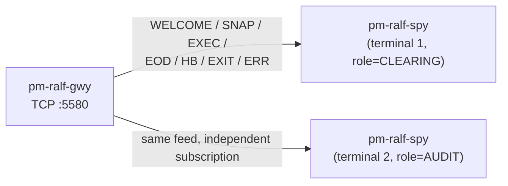

# RALF Protocol Spy (`pm-ralf-spy`)

!!! note "Learning objectives"
    After reading this page you will understand:

    - What `pm-ralf-spy` is and why it exists alongside `ralf_subscriber.py`
      in `docs/examples/ralf/`
    - How `--role` drives entitlement, and why it is required (unlike
      CALF, which has no per-client role)
    - How to filter by channel and symbol with `--channels`/`--symbols`
    - The difference between `--format human` and `--format json`, and when
      to reach for each
    - How `--lastseq` differs from CALF's `RESUME=1`
    - How to run several instances at once, each with a different role, to
      watch different post-trade streams on separate terminals
    - How `--ping-interval` keeps an otherwise-silent session alive past the
      gateway's idle timeout


## What this tool is

`pm-ralf-spy` is a read-only command-line client for `pm-ralf-gwy`. It opens
one RALF TCP session, sends `HELLO` (with a chosen `ROLE`) and `SUB` on your
behalf, and prints every line the gateway sends back — `WELCOME`, `SNAP`,
live data (`EXEC`/`EOD`), `HB`, `EXIT`, and `ERR` — either as a colourised,
human-readable log line or as one JSON object per line.



It exists purely to make the protocol observable: to answer "what does RALF
actually send when a trade executes, or at end-of-day?" without writing a
client. It never places orders, never mutates exchange state, and it is
safe to run any number of instances against the same gateway at once —
`pm-ralf-gwy` accepts an arbitrary number of concurrent TCP connections, and
each `pm-ralf-spy` process has its own independent role and subscription
set.


## Why not `ralf_subscriber.py`?

`docs/examples/ralf/ralf_subscriber.py` (see
[Post-Trade Dissemination — Python subscriber example](250-post-trade.md))
is a *library-style* example meant to be read and adapted: it demonstrates
gap detection, dedup, and a specific role/channel selection for a tutorial
walkthrough. `pm-ralf-spy` is a *general-purpose inspection tool*: any role,
any channel/symbol combination, machine-readable output for piping into
`jq`/`grep`/a file, and a `--count` flag for scripted one-shot captures.
Reach for the example code when you're writing your own RALF client; reach
for `pm-ralf-spy` when you just want to look at the wire.


## RALF's role model, briefly

Unlike CALF, every RALF client authenticates as one of three roles —
`CLEARING`, `DROP_COPY`, or `AUDIT` — sent once in `HELLO|ROLE=`. The role
determines which channels you may subscribe to: `CLEARING` and `DROP_COPY`
may only subscribe to their own same-named channel; `AUDIT` may subscribe
to any of the three. There is no `CH_SUPPORTED`-equivalent capability field
in `WELCOME` — the channel set is fixed and known ahead of time
(`CLEARING`, `DROP_COPY`, `AUDIT`), so there is nothing to discover.


## Starting point

```bash
pm-ralf-spy --role AUDIT --symbols AAPL
```

`pm-ralf-gwy` must already be running and reachable (default
`127.0.0.1:5580`). `pm-engine` does not strictly need to be running for the
handshake to succeed, but you will not see any live data until trades
occur (and until the next end-of-day cycle for `EOD`).

**Connection options:**

| Flag | Default | Description |
|---|---|---|
| `--host` | `127.0.0.1` | `pm-ralf-gwy` TCP host |
| `--port` | `5580` | `pm-ralf-gwy` TCP port |
| `--client-name` | `ralf-spy-<pid>` | `HELLO\|CLIENT=` identifier reported in gateway logs |
| `--ping-interval` | `60` | Seconds between `PING` frames sent to the gateway; `0` disables the heartbeat. See [Keeping the connection alive](#keeping-the-connection-alive) |

**Subscription filtering:**

| Flag | Default | Description |
|---|---|---|
| `--role` | `AUDIT` | `HELLO\|ROLE=` to authenticate as: `CLEARING`, `DROP_COPY`, or `AUDIT`. `AUDIT` is the most useful default for a spy tool since it is entitled to every channel |
| `--channels` | `*` | Comma-separated channels, e.g. `CLEARING,DROP_COPY`. `*` subscribes to every channel `--role` is entitled to (all three for `AUDIT`; just its own name for `CLEARING`/`DROP_COPY`) |
| `--symbols` | `*` | Comma-separated symbols, e.g. `AAPL,MSFT`. `*` subscribes to every symbol — RALF has no per-channel wildcard restriction the way CALF's `INDEX`/`DEPTH`/`CB` do |
| `--lastseq` | `0` | Requests replay on connect via `HELLO\|LASTSEQ=N` for every channel `--role` is entitled to (`0` = no replay) |

`--channels`/`--symbols` are applied as a single `SUB` for the full
Cartesian product. If a requested channel is outside your role's
entitlement (e.g. `--role CLEARING --channels DROP_COPY`), the gateway's
`ERR|CODE=ENTITLEMENT_DENIED` is printed like any other line rather than
aborting the whole session, so you can see exactly what was rejected.

!!! note "`--lastseq` vs. CALF's `RESUME=1`"
    RALF has no separate resume message: a non-zero `LASTSEQ` goes directly
    on `HELLO` and requests replay across **every** channel your role is
    entitled to at once (not scoped to one channel/symbol pair the way
    CALF's `HELLO|RESUME=1|CH=..|SYM=..` is). If the requested sequence is
    older than `replay_retention_sec`, the gateway sends
    `ERR|CODE=REPLAY_MISS` followed by a fresh `SNAP` — accept it and reset
    any local state.

**Output options:**

| Flag | Default | Description |
|---|---|---|
| `--format` | `human` | `human` (colourised log line) or `json` (one `json.dumps` object per line) |
| `--raw` | off | Also echo the raw wire line under each formatted line (human format only) |
| `--no-color` | off | Disable ANSI colour even on a terminal |
| `--show-heartbeats` | off | Also print `HB` and `PONG` lines (suppressed by default to reduce noise) |
| `--count N` | `0` | Exit after N data-carrying lines (`0` = run until Ctrl-C); heartbeats don't count |

**Diagnostics:** `--log-level`, `-v`/`--verbose`, `-q`/`--quiet`, `--version`,
`--help` — same conventions as every other `pm-*` process.


## Keeping the connection alive

`pm-ralf-spy` is purely a listener: after the initial `HELLO`/`SUB`
handshake it has nothing more to say, so — unlike a real clearing/drop-copy
consumer that might send its own protocol traffic — it would otherwise go
completely silent for the rest of the session. `pm-ralf-gwy` disconnects
(sends `EXIT|REASON=idle_timeout` and closes) any client that sends nothing
at all for `idle_timeout_sec`, so a purely receive-only client needs to
generate outbound traffic of its own to avoid being dropped.

`pm-ralf-spy` does this automatically: a background thread sends `PING`
every `--ping-interval` seconds (default `60`), and the gateway replies with
a `PONG` (suppressed from the default view the same way `HB` is — pass
`--show-heartbeats` to see both). Set `--ping-interval` lower than the
gateway's `idle_timeout_sec` if you have shortened that value for
diagnostics, or `0` to disable the heartbeat entirely (e.g. when
deliberately testing idle-timeout behavior — see the `EXIT` example below).


## Human-readable output

One line per event: a local wall-clock timestamp, the message type, the
channel (colour-coded so several interleaved channels stay visually
distinct), the symbol, the sequence number, and the remaining fields as
`KEY=VALUE` pairs, sorted for stable reading:

```text
◆ pm-ralf-spy connected to 127.0.0.1:5580 as ralf-spy-40213 role=AUDIT (Ctrl-C to stop)
10:02:17.041  WELCOME   GW=ralf-gwy01 HBINT=1 PROTO=RALF1 REPLAY=86400 ROLE=AUDIT
10:02:17.048  SNAP     CLEARING,DROP_COPY,AUDIT AAPL       #0
10:02:18.203  EXEC     AUDIT      AAPL       #1      BUY_GW=TRADER01 BUY_ORDER_ID=1001 EXEC_ID=44 MATCH_ID=44 PX=150.12 QTY=200 SELL_GW=TRADER02 SELL_ORDER_ID=1002 SIDE=BUY
16:00:00.500  EOD      AUDIT      AAPL       #2      EXEC_COUNT=37 TRADE_COUNT=37
```

Session-level messages that carry no channel/symbol of their own (`WELCOME`,
`HB`, `PONG`, `EXIT`) are rendered without the channel/symbol/sequence
columns. `ERR` lines highlight the `CODE` field:

```text
10:02:21.010  ERR      ENTITLEMENT_DENIED  DETAIL=role 'CLEARING' cannot access CH=DROP_COPY
```

An idle-timeout disconnect from the gateway looks like:

```text
10:05:00.000  EXIT      REASON=idle_timeout TS=2026-07-20T10:05:00.000Z
```

Pass `--raw` to also print the exact wire line underneath, for comparing
the rendering against the actual bytes.


## JSON output

`--format json` prints one JSON object per line — no banner, no colour,
straightforward to pipe into `jq`, log to a file, or feed into another
program. The envelope fields (`CH`, `SYM`, `SEQ`) are lifted to top-level
keys for easy filtering; every field, including the envelope ones, is also
kept verbatim under `fields` so nothing is lost relative to the raw line:

```json
{"recv_ts": 1784577849.634, "msg_type": "EXEC", "ch": "AUDIT", "sym": "AAPL", "seq": 1, "ts": "2026-07-20T10:02:18.203Z", "fields": {"CH": "AUDIT", "SYM": "AAPL", "SEQ": "1", "TS": "2026-07-20T10:02:18.203Z", "EXEC_ID": "44", "MATCH_ID": "44", "PX": "150.12", "QTY": "200", "SIDE": "BUY", "BUY_ORDER_ID": "1001", "SELL_ORDER_ID": "1002", "BUY_GW": "TRADER01", "SELL_GW": "TRADER02"}}
```

Typical uses:

```bash
# Only fills, as they happen, for one symbol
pm-ralf-spy --role AUDIT --symbols AAPL --format json | jq 'select(.msg_type == "EXEC")'

# Capture the clearing feed's end-of-day summaries to a file
pm-ralf-spy --role CLEARING --format json | jq 'select(.msg_type == "EOD")' > eod.jsonl
```


## Running several instances at once

Since each `pm-ralf-spy` process opens its own independent TCP connection,
role, and subscription set, you can split roles/channels across terminals
instead of filtering one firehose:

```bash
# Terminal 1 — clearing view only
pm-ralf-spy --role CLEARING

# Terminal 2 — drop-copy view only
pm-ralf-spy --role DROP_COPY

# Terminal 3 — audit view of everything, one symbol
pm-ralf-spy --role AUDIT --symbols AAPL
```

None of these interfere with each other or with any other RALF client
already connected to the same gateway — `pm-ralf-gwy` fans out
independently per session.


## Connection and protocol errors

- If the initial TCP connect fails (gateway not running, wrong host/port),
  `pm-ralf-spy` prints `pm-ralf-spy: could not connect to HOST:PORT: ...`
  and exits `1` — no retry loop.
- If the gateway rejects the handshake itself — missing `CLIENT`/`PROTO`/
  `ROLE` (`ERR|CODE=AUTH_REQUIRED`), or a role your gateway build doesn't
  allow (`ERR|CODE=ENTITLEMENT_DENIED`) — that is reported and the process
  exits `1`.
- Once connected, any `ERR` the gateway sends in response to `SUB` (unknown
  channel, role/channel mismatch) is printed like any other line — the
  session stays open so you can see the rejection and keep watching
  whatever subscriptions *did* succeed.
- If the gateway sends `EXIT` — normally only seen if `--ping-interval 0`
  disabled the heartbeat, or a network hiccup silently dropped the PINGs —
  `pm-ralf-spy` prints it and closes cleanly rather than trying to keep
  reading a closing socket.
- Ctrl-C (or reaching `--count`) closes the connection cleanly and prints
  `pm-ralf-spy: connection closed.`


## See also

- [Post-Trade Dissemination (RALF)](250-post-trade.md) — operational guide, wire examples, and the Python/C example subscribers
- [Appendix — RALF Protocol](930-app-ralf-protocol.md) — normative wire format, full field tables, sequencing rules
- [Processes](170-processes.md#pm-ralf-spy-ralf-protocol-spy) — where `pm-ralf-spy` sits in the process model
- [CALF Protocol Spy (pm-calf-spy)](241-calf-spy-cli.md) — the analogous inspection tool for the pre-trade market-data feed
