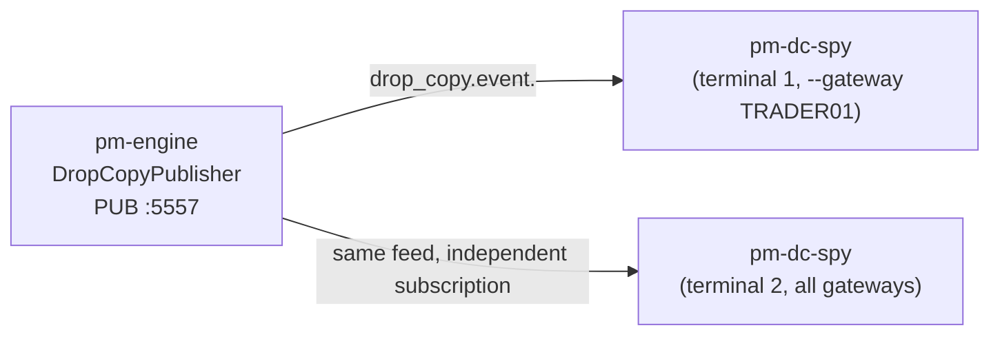

# Drop-Copy Spy (`pm-dc-spy`)

!!! note "Learning objectives"
    After reading this page you will understand:

    - What `pm-dc-spy` is and how it differs from `pm-calf-spy`/`pm-ralf-spy`
    - Why the drop-copy feed needs no handshake or heartbeat, unlike CALF/RALF
    - How to filter by gateway with `--gateway`
    - The difference between `--format human` and `--format json`, and when
      to reach for each
    - How `--replay-of` lets you observe `DropCopyPublisher.replay()` calls
    - How to run several instances at once to watch different gateways on
      separate terminals


## What this tool is

`pm-dc-spy` is a read-only command-line client for the matching engine's
drop-copy feed (`edumatcher.engine.drop_copy.DropCopyPublisher`, ZMQ `PUB`
socket on port **5557**). It opens a `zmq.SUB` connection, subscribes to
fill events for one gateway or all gateways, and prints every message it
receives — either as a colourised, human-readable log line or as one JSON
object per line.



It exists purely to make the drop-copy feed observable: to answer "what
does the engine actually publish on 5557 when a fill happens?" without
writing a subscriber. It never publishes anything back onto the bus, and it
is safe to run any number of instances at once — ZeroMQ PUB/SUB fans out
independently to every connected subscriber.


## Why not the example subscriber?

[Subscribing to the drop copy feed](200-drop-copy.md#subscribing-to-the-drop-copy-feed)
shows a minimal hand-rolled subscriber meant to be read and adapted for
your own risk/clearing integration. `pm-dc-spy` is a *general-purpose
inspection tool*: gateway filtering, machine-readable output for piping
into `jq`/`grep`/a file, a `--count` flag for scripted one-shot captures,
and a `--replay-of` flag for watching `replay()` traffic. Reach for the
example code when you're writing your own drop-copy consumer; reach for
`pm-dc-spy` when you just want to look at the wire.


## Not a protocol client — a plain ZMQ SUB

`pm-calf-spy` and `pm-ralf-spy` are TCP clients for text protocols with a
`HELLO`/`WELCOME` handshake and a `PING`/`PONG` heartbeat to survive an idle
timeout. The drop-copy feed is architecturally different: it is a **plain
ZeroMQ PUB/SUB stream** (see [Drop Copy — Architecture](200-drop-copy.md#architecture)).
There is no session to establish and no idle timeout to defend against —
`zmq.SUB` sockets subscribe by topic prefix and ZMQ handles reconnection
transparently. This means `pm-dc-spy`:

- Has no `--client-name`, `--ping-interval`, or `--show-heartbeats` flags —
  there is no handshake and no heartbeat protocol to configure.
- Prints no `WELCOME` banner — the connection line is generated locally by
  `pm-dc-spy` itself, not received from the engine.
- Does not fail at startup if `pm-engine` isn't running yet or hasn't bound
  port 5557: `zmq.SUB.connect()` succeeds immediately and ZMQ will start
  delivering messages as soon as a `PUB` socket appears at that address.
  Use `--count` with a short timeout expectation, or just watch the
  terminal, to confirm you're actually receiving data.


## Starting point

```bash
pm-dc-spy
```

`pm-engine` must already be running with the drop-copy publisher bound
(default `127.0.0.1:5557` — see [Drop Copy](200-drop-copy.md)). You will not
see any lines until a fill occurs.

**Connection options:**

| Flag | Default | Description |
|---|---|---|
| `--host` | `127.0.0.1` | Drop-copy `PUB` socket host |
| `--port` | `5557` | Drop-copy `PUB` socket port |

**Subscription filtering:**

| Flag | Default | Description |
|---|---|---|
| `--gateway` | *(none)* | Only show fills for this gateway (subscribes to `drop_copy.event.<GW_ID>`). Default subscribes to the `drop_copy.event.` prefix, i.e. every gateway |
| `--replay-of` | *(none)* | Also subscribe to `drop_copy.replay.<RECIPIENT_ID>` — the topic `DropCopyPublisher.replay()` publishes on. See [Observing replay](#observing-replay) |

!!! warning "No entitlement checks"
    Same caveat as the underlying feed (see
    [Drop Copy — no authentication](200-drop-copy.md#architecture)): any
    process — including `pm-dc-spy` — that can reach the drop-copy port can
    subscribe to **any** gateway's fills. `--gateway` is a convenience
    filter for readability, not an access control.

**Output options:**

| Flag | Default | Description |
|---|---|---|
| `--format` | `human` | `human` (colourised log line) or `json` (one `json.dumps` object per line) |
| `--raw` | off | Also echo the raw topic + JSON payload under each formatted line (human format only) |
| `--no-color` | off | Disable ANSI colour even on a terminal |
| `--count N` | `0` | Exit after N messages (`0` = run until Ctrl-C) |

**Diagnostics:** `--log-level`, `-v`/`--verbose`, `-q`/`--quiet`, `--version`,
`--help` — same conventions as every other `pm-*` process (see
[Getting Started — Environment variables](000-getting-started.md#environment-variables)).


## Human-readable output

One line per fill: a local wall-clock timestamp, `FILL` (or `REPLAY`), the
gateway ID, symbol, sequence number, `qty@price`, the liquidity flag
(colour-coded — blue for `MAKER`, magenta for `TAKER`), and any remaining
fields as `KEY=VALUE` pairs:

```text
◆ pm-dc-spy connected to 127.0.0.1:5557, subscribed to drop_copy.event.* (all gateways) (Ctrl-C to stop)
10:02:17.512  FILL     TRADER01   AAPL       #1      100@150.05       TAKER  order_id=ord-001 remaining_qty=0
10:02:17.520  FILL     TRADER02   AAPL       #2      100@150.05       MAKER  order_id=ord-104 remaining_qty=300
```

Recall that every trade produces **two** drop-copy events, one per
counterparty — the pair above is a single matched trade, TAKER and MAKER
side by side.

Pass `--raw` to also print the exact topic and JSON payload underneath:

```text
10:02:17.512  FILL     TRADER01   AAPL       #1      100@150.05       TAKER  order_id=ord-001 remaining_qty=0
  drop_copy.event.TRADER01|{"event_type": "order.fill", "fill_price": 150.05, "fill_qty": 100, "gateway_id": "TRADER01", "order_id": "ord-001", "remaining_qty": 0, "seq": 1, "symbol": "AAPL", "timestamp": 1700000000000000000}
```


## JSON output

`--format json` prints one JSON object per line — no banner, no colour,
straightforward to pipe into `jq`, log to a file, or feed into another
program. Every field from the drop-copy payload is preserved verbatim at
the top level; `topic`, `recv_ts`, and a derived `replay` boolean are added:

```json
{"recv_ts": 1784577849.634, "topic": "drop_copy.event.TRADER01", "replay": false, "seq": 1, "timestamp": 1700000000000000000, "gateway_id": "TRADER01", "event_type": "order.fill", "order_id": "ord-001", "symbol": "AAPL", "fill_qty": 100, "fill_price": 150.05, "liquidity_flag": "TAKER"}
```

Typical uses:

```bash
# Only TRADER01's fills, as they happen
pm-dc-spy --gateway TRADER01

# Capture the first 100 fills across all gateways for later analysis
pm-dc-spy --format json --count 100 > fills.jsonl

# Fills where AAPL was the symbol, piped through jq
pm-dc-spy --format json | jq 'select(.symbol == "AAPL")'
```


## Observing replay

`DropCopyPublisher.replay(recipient_id, from_seq)` is currently an
in-process method with no external wire protocol to trigger it (see
[Drop Copy — Replay](200-drop-copy.md#replay)). `pm-dc-spy` cannot request a
replay itself, but `--replay-of RECIPIENT_ID` lets you *watch* one happen —
useful when a test or embedded consumer calls `replay()` and you want to
see exactly what gets re-published:

```bash
pm-dc-spy --replay-of MY_RISK_SYS
```

Replayed messages are tagged `REPLAY` instead of `FILL` (yellow instead of
green in human output; `"replay": true` in JSON output), so live and
replayed traffic are easy to tell apart even when watching both at once
with `--gateway` and `--replay-of` together.


## Running several instances at once

Since each `pm-dc-spy` process opens its own independent `SUB` socket, you
can split gateways across terminals instead of filtering one firehose:

```bash
# Terminal 1 — one participant's fills
pm-dc-spy --gateway TRADER01

# Terminal 2 — everything, as JSON, captured to a file
pm-dc-spy --format json > all_fills.jsonl
```

None of these interfere with each other or with any other drop-copy
consumer (a real risk system, the example subscriber, etc.) already
connected — ZeroMQ `PUB`/`SUB` fans out independently per subscriber.


## Connection and protocol errors

- If the ZMQ socket cannot be created at all (malformed `--host`), `pm-dc-spy`
  prints `pm-dc-spy: could not connect to HOST:PORT: ...` and exits `1`.
- A refused/unreachable connection (e.g. `pm-engine` not running yet) does
  **not** raise an error at startup — `zmq.SUB.connect()` succeeds
  immediately regardless of whether anything is listening, and ZMQ
  transparently reconnects once a `PUB` socket appears at that address. If
  you see no output, check that `pm-engine` is running and has bound port
  5557 (it logs a warning and continues without drop copy if the bind
  fails — see [Drop Copy — Startup and shutdown](200-drop-copy.md#startup-and-shutdown)).
- Ctrl-C (or reaching `--count`) closes the connection cleanly and prints
  `pm-dc-spy: connection closed.`


## See also

- [Drop Copy](200-drop-copy.md) — operational guide, message format, replay semantics, and the Python subscriber example
- [Processes](170-processes.md) — where `pm-dc-spy` sits in the process model
- [CALF Protocol Spy (pm-calf-spy)](241-calf-spy-cli.md) — the analogous inspection tool for the pre-trade market-data feed
- [RALF Protocol Spy (pm-ralf-spy)](251-ralf-spy-cli.md) — the analogous inspection tool for the post-trade text protocol
