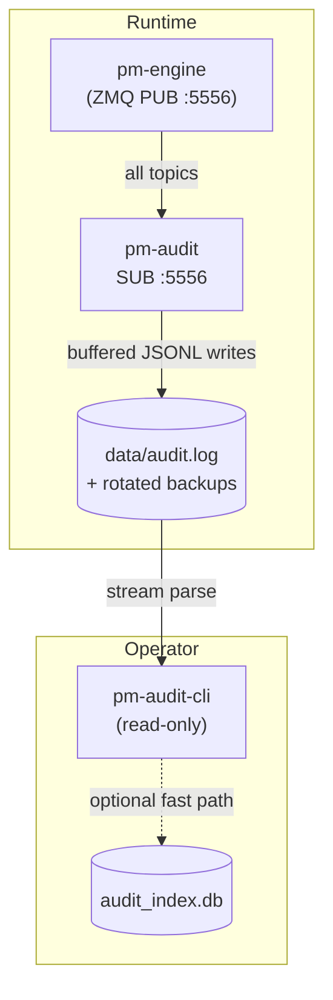

# Audit Trail

!!! note "Learning objectives"
    After reading this page you will understand:

    - Why a full event log matters for an exchange and what `pm-audit` records
    - The JSONL log format and how log rotation works
    - All `pm-audit` startup options including write buffering
    - How to query audit logs from the command line using every `pm-audit-cli` verb
    - When to use the optional SQLite index for faster queries
    - A practical cookbook for common audit investigation workflows


## Overview

EduMatcher maintains a complete, immutable record of every message that passes
through the ZeroMQ bus. This is the **audit trail** — a chronological log of
every order, fill, trade, cancellation, session transition, and system event
that occurred during a trading session.

The audit system has two independent components:

| Component | Role | Type |
|---|---|---|
| **`pm-audit`** | Subscriber — records every event to a rotating JSONL log file | Long-running process |
| **`pm-audit-cli`** | Query tool — reads audit logs and prints structured output | One-shot CLI |

The recorder and the query tool are completely independent. `pm-audit-cli`
reads log files directly from disk and works even when `pm-audit` is not
running.



### Why a full event log matters

A financial exchange must be able to answer questions after the fact:

- Was a specific order ever acknowledged by the engine?
- What sequence of events led to a particular fill?
- Did a circuit breaker fire before or after an order was submitted?
- Which gateways were active at a given time?

The audit trail answers all of these by preserving every message exactly as
it was broadcast, with a microsecond-precision UTC timestamp.


## Data Directory

Audit logs are stored in the same data directory used by all other EduMatcher
persistent files:

| Running mode | Default location |
|---|---|
| Source checkout (`poetry run pm-audit`) | `<repo>/src/data/audit.log` |
| Installed (`pm-audit` on PATH) | `~/.local/share/edumatcher/audit.log` |

Override with `EDUMATCHER_DATA_DIR` or `--log-file`:

```bash
export EDUMATCHER_DATA_DIR="$HOME/sessions/morning"
pm-audit  # writes to $HOME/sessions/morning/audit.log
```


## pm-audit — Event Recorder

`pm-audit` subscribes to all topics on the engine's PUB socket and appends
every message as a single JSON line to the configured log file.

```bash
pm-audit [options]
```

### Startup options

| Flag | Default | Description |
|---|---|---|
| `--log-file PATH` | `data/audit.log` | Output log file path |
| `--terminal` / `-t` | off | Also print each entry to stdout (useful during demos) |
| `--buffer-size N` | `100` | Number of messages to buffer in memory before flushing to disk |
| `--flush-interval SECONDS` | `10.0` | Maximum seconds to wait before flushing buffer regardless of size |
| `--log-level` | `WARNING` | Explicit level: `CRITICAL`, `ERROR`, `WARNING`, `INFO`, `DEBUG` |
| `-v` / `--verbose` | off | Increase verbosity (`-v` → `INFO`, `-vv` → `DEBUG`) |
| `-q` / `--quiet` | off | Reduce output to warnings/errors |

### Write buffering

Writing every message to disk individually would generate enormous I/O on
active sessions. `pm-audit` batches messages in memory and flushes as a
group when either limit is reached:

- **Buffer full**: buffer contains `--buffer-size` messages (default 100)
- **Timer expired**: `--flush-interval` seconds have elapsed since the last flush (default 10 s)
- **Shutdown**: Ctrl-C, SIGINT, or SIGTERM always flushes remaining messages before exit

No messages are lost on clean shutdown. A hard kill (`kill -9`) may lose up
to `--buffer-size` messages that had not yet been flushed.

**Tuning examples:**

```bash
# Default: good balance of throughput and latency
pm-audit

# High-throughput session: larger buffer, less frequent disk I/O
pm-audit --buffer-size 500 --flush-interval 30

# Low-latency / compliance: flush aggressively
pm-audit --buffer-size 1 --flush-interval 1

# Demo mode: see every event on the terminal as well
pm-audit --terminal
```

### Log format

Every line is an independent JSON record in this exact format:

```
[2026-07-08T09:30:00.123+00:00] [trade.executed] {"id": "TRD-001", "symbol": "AAPL", ...}
```

| Part | Example | Description |
|---|---|---|
| `[timestamp]` | `2026-07-08T09:30:00.123+00:00` | UTC ISO-8601 with millisecond precision |
| `[topic]` | `trade.executed` | ZeroMQ topic exactly as broadcast by the engine |
| `{...}` | `{"symbol": "AAPL", ...}` | Full JSON payload of the message |

Lines are appended in arrival order. Within a single session they are
chronologically monotonic.

### Log rotation

Log files rotate at **10 MB** with **5 backups** kept:

```
data/audit.log       ← active, current writes
data/audit.log.1     ← previous
data/audit.log.2     ← older
...
data/audit.log.5     ← oldest kept
```

When `audit.log` reaches 10 MB the Python `RotatingFileHandler` renames it
to `audit.log.1` (shifting existing backups up) and opens a fresh
`audit.log`. Rotated files may also be compressed externally; `pm-audit-cli`
reads `.gz` files transparently.

### Subscribed topics

`pm-audit` subscribes with an **empty topic filter**, which causes ZeroMQ to
deliver every published message without exception:

| Topic | Source |
|---|---|
| `order.new` | Gateway order submissions |
| `order.ack.*` | Engine order acknowledgements |
| `order.fill.*` | Fill notifications |
| `order.cancelled.*` | Cancel confirmations |
| `order.expired.*` | TIF expiry notifications |
| `trade.executed` | Every matched trade pair |
| `book.*` | Book snapshots after every change |
| `session.state` | Session phase transitions |
| `system.*` | Gateway auth, symbols, EOD |
| *(all others)* | Admin events, combos, quotes, circuit breaker |

### Signal handling and graceful shutdown

```
Ctrl-C / SIGINT / SIGTERM → flush buffer → close socket → exit
```

The buffer flush happens synchronously before the process exits so the last
batch of messages is always written to disk.


## pm-audit-cli — Query Tool

`pm-audit-cli` is a read-only command-line tool for querying audit logs
without shell pipelines or SQL knowledge. It reads JSONL files directly from
disk and produces structured output.

```bash
pm-audit-cli [global-options] COMMAND [command-options]
```

### Why a separate query tool

`pm-audit` is a long-running writer. Querying is a separate one-shot
operation. Keeping them separate means:

- You can query logs while `pm-audit` is still writing
- The tool works on archived logs from previous sessions
- Queries never affect the running recorder

This follows the same pattern as `pm-stats-cli` and `pm-clearing-cli`.

### Global options

These flags apply to every command:

| Flag | Default | Description |
|---|---|---|
| `--log-file PATH` | `data/audit.log` | Primary audit log file to read |
| `--log-dir PATH` | (parent of `--log-file`) | Directory containing rotated log backups; when set, rotated files are discovered automatically |
| `--format table\|json\|csv` | `table` | Output format |
| `--no-header` | off | Suppress CSV header row |
| `--use-index PATH` | (auto) | Path to SQLite index file; auto-detected as `<log-dir>/audit_index.db` when present |

**Output formats:**

| Format | When to use |
|---|---|
| `table` | Interactive terminal — aligned columns, human-readable |
| `json` | Automation, scripts, downstream processing |
| `csv` | Export to spreadsheets or pipelines |

**No-result behaviour:**

- `table`: prints `No matching events found.`
- `json`: prints `[]`
- `csv`: prints header only (or nothing with `--no-header`)

Exit code is always `0` when a query succeeds with no results. Non-zero only
on argument errors (exit `2`) or I/O failures (exit `1`).

### Rotated log discovery

When `--log-dir` is set (or defaulted from `--log-file`), `pm-audit-cli`
automatically discovers rotated backup files:

```
logs/audit.log.2.gz   ← oldest, read first
logs/audit.log.1      ← middle
logs/audit.log        ← newest, read last
```

All results are returned in chronological order across all files.


### `events` — General event search

Search log entries by topic prefix, gateway, symbol, and time range. This is
the most flexible command and the right starting point for any investigation.

```bash
pm-audit-cli events [options]
```

**Options:**

| Flag | Default | Description |
|---|---|---|
| `--topic PREFIX` | (all) | Filter by topic prefix, e.g. `order.fill` or `trade.` |
| `--gateway GW_ID` | (all) | Filter by gateway ID appearing in the payload |
| `--symbol SYMBOL` | (all) | Filter by instrument symbol |
| `--date YYYY-MM-DD` | (all) | Shorthand for a full trading day |
| `--from ISO_TS` | (none) | Start of time range (inclusive) |
| `--to ISO_TS` | (none) | End of time range (inclusive) |
| `--limit N` | `100` | Maximum rows returned |
| `--reverse` | off | Show newest events first |

**Output columns:**

| Column | Description |
|---|---|
| `timestamp` | UTC timestamp of the event |
| `topic` | ZeroMQ topic |
| `gateway` | Gateway ID extracted from payload (if present) |
| `symbol` | Instrument symbol extracted from payload (if present) |
| `order_id` | Order ID extracted from payload (if present) |
| `summary` | Brief human-readable description of the event |

**Examples:**

```bash
# All events in the log (last 100)
pm-audit-cli events

# All fills for gateway GW01 on a specific date
pm-audit-cli events --topic order.fill --gateway GW01 --date 2026-07-08

# All trade executions for AAPL in a two-hour window
pm-audit-cli events --topic trade.executed --symbol AAPL \
  --from 2026-07-08T09:30:00+00:00 --to 2026-07-08T11:30:00+00:00

# Most recent 50 events across all topics
pm-audit-cli events --limit 50 --reverse

# All session phase transitions
pm-audit-cli events --topic session.state

# All order rejections
pm-audit-cli events --topic order.ack --symbol AAPL

# Export all trade events as JSON for analysis
pm-audit-cli events --topic trade.executed --format json --limit 5000 > trades.json

# Order submissions from a specific gateway in CSV format
pm-audit-cli events --topic order.new --gateway GW01 --format csv > gw01_orders.csv
```


### `orders` — Order lifecycle investigation

Find all audit events related to specific order IDs or filter by gateway and
symbol to reconstruct an order's full journey through the engine.

```bash
pm-audit-cli orders [options]
```

**Options:**

| Flag | Default | Description |
|---|---|---|
| `--id ORDER_ID` | (none) | Order ID to find (repeatable; searches `order_id` and `id` fields in payload) |
| `--gateway GW_ID` | (all) | Filter by gateway ID |
| `--symbol SYMBOL` | (all) | Filter by symbol |
| `--date YYYY-MM-DD` | (all) | Trading date |
| `--from ISO_TS` | (none) | Start of time range |
| `--to ISO_TS` | (none) | End of time range |
| `--limit N` | `100` | Maximum rows |

**Output columns:**

| Column | Description |
|---|---|
| `timestamp` | Event timestamp |
| `order_id` | Order identifier |
| `event` | Event type suffix (e.g. `new`, `ack.GW01`, `fill.GW01`, `cancel.GW01`) |
| `gateway` | Gateway ID |
| `symbol` | Instrument symbol |
| `side` | `BUY` or `SELL` |
| `qty` | Quantity (original, filled, or remaining depending on event type) |
| `price` | Price (limit price or fill price depending on event type) |
| `status` | Order status after the event |

**Examples:**

```bash
# Full lifecycle of one specific order
pm-audit-cli orders --id ORD-GW01-00142

# Two orders side by side
pm-audit-cli orders --id ORD-GW01-00142 --id ORD-GW01-00143

# All order events for gateway GW01 today
pm-audit-cli orders --gateway GW01 --date 2026-07-08 --limit 50

# Order events for AAPL in a session
pm-audit-cli orders --symbol AAPL --from 2026-07-08T09:30:00+00:00

# Export one order's lifecycle as JSON for a support ticket
pm-audit-cli orders --id ORD-GW01-00142 --format json

# Order activity for market-maker in CSV
pm-audit-cli orders --gateway MM_AAPL_01 --format csv > mm_orders.csv
```


### `trades` — Trade execution search

Find `trade.executed` events with precise filtering on both sides of the
trade, price ranges, and minimum quantities.

```bash
pm-audit-cli trades [options]
```

**Options:**

| Flag | Default | Description |
|---|---|---|
| `--symbol SYMBOL` | (all) | Filter by instrument symbol |
| `--gateway GW_ID` | (all) | Match trades where this gateway appears on either side |
| `--buy-gateway GW_ID` | (all) | Filter by buyer gateway specifically |
| `--sell-gateway GW_ID` | (all) | Filter by seller gateway specifically |
| `--min-price PRICE` | (none) | Minimum trade price (inclusive) |
| `--max-price PRICE` | (none) | Maximum trade price (inclusive) |
| `--min-qty QTY` | (none) | Minimum trade quantity (inclusive) |
| `--date YYYY-MM-DD` | (all) | Trading date |
| `--from ISO_TS` | (none) | Start of time range |
| `--to ISO_TS` | (none) | End of time range |
| `--limit N` | `100` | Maximum rows |
| `--reverse` | off | Show newest first |

**Output columns:**

| Column | Description |
|---|---|
| `timestamp` | Trade execution timestamp |
| `trade_id` | Trade UUID assigned by the engine |
| `symbol` | Instrument symbol |
| `price` | Execution price |
| `quantity` | Matched quantity |
| `buy_gateway` | Buyer gateway ID |
| `sell_gateway` | Seller gateway ID |
| `aggressor` | Which side crossed the spread: `BUY` or `SELL` |

**Examples:**

```bash
# All trades for AAPL today
pm-audit-cli trades --symbol AAPL --date 2026-07-08

# Block trades (>= 1,000 shares) across all symbols
pm-audit-cli trades --min-qty 1000

# Trades between two specific gateways
pm-audit-cli trades --buy-gateway GW01 --sell-gateway MM_AAPL_01

# MSFT trades in a specific price band
pm-audit-cli trades --symbol MSFT --min-price 410.0 --max-price 420.0

# Most recent 20 trades
pm-audit-cli trades --limit 20 --reverse

# Export full day as CSV for post-trade analysis
pm-audit-cli trades --date 2026-07-08 --format csv --limit 10000 > day_trades.csv

# All trades involving market maker
pm-audit-cli trades --gateway MM_AAPL_01 --format json
```


### `topics` — Topic discovery and statistics

List all topics present in the audit logs with event counts and first/last
occurrence timestamps. Useful for understanding what happened in a session
and for checking whether expected event types were produced.

```bash
pm-audit-cli topics [options]
```

**Options:**

| Flag | Default | Description |
|---|---|---|
| `--date YYYY-MM-DD` | (all) | Restrict to a trading date |
| `--from ISO_TS` | (none) | Start of time range |
| `--to ISO_TS` | (none) | End of time range |
| `--prefix PREFIX` | (all) | Filter topics by prefix, e.g. `order.` |
| `--sort count\|alpha` | `count` | Sort by event count descending (default) or alphabetically |

**Output columns:**

| Column | Description |
|---|---|
| `topic` | ZeroMQ topic name |
| `count` | Number of events with this topic |
| `first_seen` | Timestamp of the first occurrence |
| `last_seen` | Timestamp of the last occurrence |

**Examples:**

```bash
# All topics in the log, most frequent first
pm-audit-cli topics

# Topics on a specific trading date
pm-audit-cli topics --date 2026-07-08

# Order-related topics only, sorted alphabetically
pm-audit-cli topics --prefix order. --sort alpha

# What happened during the opening auction?
pm-audit-cli topics --from 2026-07-08T09:00:00+00:00 --to 2026-07-08T09:30:00+00:00

# Export all topic stats as JSON
pm-audit-cli topics --format json

# Check that trades were produced today
pm-audit-cli topics --prefix trade. --date 2026-07-08
```


### `gateways` — Gateway activity summary

List all gateways seen in the audit logs and show a summary of their
activity: order submissions, fills, and trades participated in.

```bash
pm-audit-cli gateways [options]
```

**Options:**

| Flag | Default | Description |
|---|---|---|
| `--date YYYY-MM-DD` | (all) | Trading date |
| `--from ISO_TS` | (none) | Start of time range |
| `--to ISO_TS` | (none) | End of time range |
| `--min-events N` | (none) | Only show gateways with at least N events |

**Output columns:**

| Column | Description |
|---|---|
| `gateway_id` | Gateway identifier |
| `events` | Total event count (all topics) |
| `orders` | `order.new` events submitted |
| `fills` | `order.fill.*` events received |
| `trades` | `trade.executed` events participated in |
| `first_seen` | First event timestamp |
| `last_seen` | Last event timestamp |

Results are sorted by total event count descending — the most active gateway
appears first.

**Examples:**

```bash
# All gateways in the logs
pm-audit-cli gateways

# Active gateways on a specific date
pm-audit-cli gateways --date 2026-07-08

# Only gateways with meaningful activity
pm-audit-cli gateways --min-events 10

# Gateway activity in the first hour of trading
pm-audit-cli gateways --from 2026-07-08T09:30:00+00:00 --to 2026-07-08T10:30:00+00:00

# Export as JSON for automation
pm-audit-cli gateways --format json

# Check which gateways connected during the closing auction
pm-audit-cli gateways \
  --from 2026-07-08T15:30:00+00:00 --to 2026-07-08T16:00:00+00:00
```


### `timeline` — Chronological event stream

Show a raw chronological stream of events for session replay and forensic
investigation. Unlike `events`, the `timeline` command exposes the full JSON
payload as a single column, making it suitable for detailed reconstruction of
what happened over a time window.

```bash
pm-audit-cli timeline [options]
```

**Options:**

| Flag | Default | Description |
|---|---|---|
| `--from ISO_TS` | (none) | Start time |
| `--to ISO_TS` | (none) | End time |
| `--topic PREFIX` | (all) | Filter by topic prefix |
| `--gateway GW_ID` | (all) | Filter by gateway |
| `--symbol SYMBOL` | (all) | Filter by symbol |
| `--limit N` | `500` | Maximum events |

**Output columns:**

| Column | Description |
|---|---|
| `timestamp` | Event timestamp |
| `topic` | ZeroMQ topic |
| `gateway` | Gateway ID (if present in payload) |
| `symbol` | Symbol (if present in payload) |
| `payload` | Full JSON payload as a string |

**Examples:**

```bash
# Opening 5 minutes of trading
pm-audit-cli timeline \
  --from 2026-07-08T09:30:00+00:00 --to 2026-07-08T09:35:00+00:00

# Gateway activity in a 10-minute window
pm-audit-cli timeline --gateway GW01 \
  --from 2026-07-08T14:00:00+00:00 --to 2026-07-08T14:10:00+00:00

# Symbol-focused replay with higher limit
pm-audit-cli timeline --symbol AAPL \
  --from 2026-07-08T09:30:00+00:00 --to 2026-07-08T16:00:00+00:00 \
  --limit 2000

# All session state changes across the day
pm-audit-cli timeline --topic session.state --date 2026-07-08

# Only trades and fills in the closing auction
pm-audit-cli timeline --topic trade. \
  --from 2026-07-08T15:30:00+00:00 --to 2026-07-08T16:00:00+00:00

# Export for external replay tooling
pm-audit-cli timeline \
  --from 2026-07-08T09:30:00+00:00 --to 2026-07-08T16:00:00+00:00 \
  --format json --limit 100000 > session_replay.json
```


### `stats` — Log file statistics

Show a health-check summary of the audit log files: total events, file sizes,
date range, and counts of unique topics and gateways. Run this to confirm
that `pm-audit` has been recording as expected.

```bash
pm-audit-cli stats [--verbose]
```

**Options:**

| Flag | Default | Description |
|---|---|---|
| `--verbose` | off | Show a per-file breakdown in addition to the summary |

**Example output (default):**

```
Audit Log Statistics
━━━━━━━━━━━━━━━━━━━━━━━━━━━━━━━━━━━━━━━━━━━━━━━━━━
  Total events:       45,678
  Total size:         12.4 MB
  Log files:          3
  Oldest event:       2026-07-01T09:30:00.123+00:00
  Newest event:       2026-07-08T15:59:59.987+00:00
  Topics seen:        24
  Gateways seen:      5
```

**Example output (`--verbose`):**

```
Audit Log Statistics
━━━━━━━━━━━━━━━━━━━━━━━━━━━━━━━━━━━━━━━━━━━━━━━━━━
  Total events:       45,678
  Total size:         12.4 MB
  Log files:          3
  Oldest event:       2026-07-01T09:30:00.123+00:00
  Newest event:       2026-07-08T15:59:59.987+00:00
  Topics seen:        24
  Gateways seen:      5

  Per-file breakdown:
    data/audit.log.2  12,000 events  4.1 MB
    data/audit.log.1  18,234 events  6.2 MB
    data/audit.log     15,444 events  2.1 MB
```

**Examples:**

```bash
# Quick health check
pm-audit-cli stats

# Full breakdown including per-file stats
pm-audit-cli stats --verbose

# Check a specific log file location
pm-audit-cli --log-file /mnt/archive/2026-07-01/audit.log stats
```


### `index` — Build or update the SQLite index

For large audit histories or frequent complex queries, `pm-audit-cli` can
build an optional SQLite index from the JSONL log files. Once built, the
`events` command uses it automatically for significantly faster response.

```bash
pm-audit-cli index [options]
```

**Options:**

| Flag | Default | Description |
|---|---|---|
| `--output PATH` | `<log-dir>/audit_index.db` | Destination SQLite database |
| `--days N` | (none) | Index only the last N days of logs |
| `--from ISO_TS` | (none) | Start of index range |
| `--to ISO_TS` | (none) | End of index range |
| `--rebuild` | off | Delete all existing index data and rebuild from scratch |
| `--incremental` | off | Add only entries newer than the last indexed timestamp |

`--rebuild` and `--incremental` are mutually exclusive.

**Index schema highlights:**

The index stores one row per log line in a `audit_events` table with
dedicated columns for `timestamp`, `topic`, `gateway_id`, `symbol`,
`order_id`, and `trade_id`, each with a covering index. The full JSON payload
is kept in a `payload` column so no information is lost.

**Performance comparison (1 M events):**

| Query type | JSONL streaming | SQLite index |
|---|---|---|
| Recent 100 events | < 1 s | < 0.1 s |
| Single topic filter | 4–6 s | 0.2 s |
| Multi-filter (topic + gateway + date) | 10–15 s | 0.5 s |
| Order ID lookup | 8 s | 0.05 s |

**Index auto-detection:**

When `audit_index.db` exists in the log directory, the `events` command uses
it automatically. Override with `--use-index PATH` or point at a different
index location.

**Examples:**

```bash
# Build index for the last 7 days
pm-audit-cli index --days 7

# Build complete index from all log files
pm-audit-cli index --rebuild

# Incremental update — only adds entries not yet in the index
pm-audit-cli index --incremental

# Index a specific date range
pm-audit-cli index \
  --from 2026-07-01T00:00:00+00:00 --to 2026-07-08T23:59:59+00:00

# Build index to a custom location
pm-audit-cli index --output /tmp/session_idx.db --rebuild

# Use a non-default index when querying
pm-audit-cli --use-index /tmp/session_idx.db \
  events --topic trade.executed --limit 100
```

!!! tip "When to build an index"
    Build an index when:

    - The audit log contains more than ~500,000 events
    - You run more than a few queries per session
    - You need to correlate events across multiple fields (topic + gateway + symbol + date)

    For ad-hoc queries on small logs, streaming JSONL is fast enough without the extra disk space.


## Cookbook — Common Audit Workflows

### Investigate a specific order

```bash
# Find all events for order ORD-GW01-00142
pm-audit-cli orders --id ORD-GW01-00142

# Same as JSON (attach to support ticket)
pm-audit-cli orders --id ORD-GW01-00142 --format json

# Find by gateway and time window (when order ID is not known)
pm-audit-cli orders --gateway GW01 \
  --from 2026-07-08T09:30:00+00:00 --to 2026-07-08T09:35:00+00:00
```

### Reconstruct a trade

```bash
# Find trade details by symbol and time
pm-audit-cli trades --symbol AAPL \
  --from 2026-07-08T10:15:00+00:00 --to 2026-07-08T10:15:01+00:00

# Find all large trades above a price threshold
pm-audit-cli trades --min-qty 500 --min-price 150.0 --date 2026-07-08
```

### Verify session phases fired correctly

```bash
# See all session transitions in order
pm-audit-cli events --topic session.state --date 2026-07-08

# Timeline around market open
pm-audit-cli timeline --topic session. \
  --from 2026-07-08T09:25:00+00:00 --to 2026-07-08T09:35:00+00:00
```

### Identify the most active gateway

```bash
pm-audit-cli gateways --date 2026-07-08
```

### Check log health before end of day

```bash
pm-audit-cli stats --verbose
pm-audit-cli topics --date 2026-07-08 --sort count | head -10
```

### Export a full session for offline analysis

```bash
# Build index first for speed
pm-audit-cli index --rebuild

# Export all trades
pm-audit-cli trades --date 2026-07-08 --format csv --limit 50000 > trades.csv

# Export all order events for gateway GW01
pm-audit-cli events --topic order. --gateway GW01 \
  --date 2026-07-08 --format json --limit 50000 > gw01_orders.json
```

### Filter across rotated log backups

```bash
# Pass the directory; pm-audit-cli discovers audit.log, audit.log.1, etc.
pm-audit-cli --log-dir data/ \
  trades --symbol AAPL --from 2026-07-01 --to 2026-07-08 --limit 10000
```


## Error Handling

| Exit code | Meaning |
|---|---|
| `0` | Success (including queries that returned zero rows) |
| `1` | I/O error (log file not found, unreadable database) |
| `2` | Argument error (invalid date format, bad `--limit`, conflicting flags) |

Invalid log lines (malformed JSON, truncated writes) are silently skipped.
The tool prints a warning to stderr only when the `--verbose` flag is
available and enabled.


## See Also

- [Processes — pm-audit](10-processes.md#pm-audit--event-logger) — startup reference table in the process overview
- [Persistence](11-persistence.md) — which files each process writes and where they live
- [Statistics and Reporting](16-statistics-and-reporting.md) — `pm-stats` and `pm-stats-cli` for structured market data queries
- [P&L & Clearing](07-pnl-clearing.md) — `pm-clearing` and `pm-clearing-cli` for trade settlement
