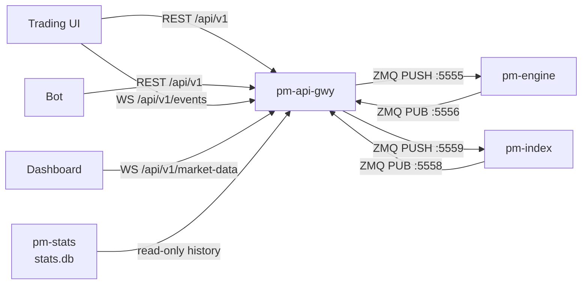

# API Gateway (REST/WebSocket)

!!! note "Learning objectives"
    After reading this page you will understand:

    - What `pm-api-gwy` does in the EduMatcher process model
    - How to configure API keys in the central `engine_config.yaml`
    - How to call the REST API and inspect Swagger documentation
    - How private and public WebSocket streams work
    - Where to find reusable Python and C REST examples


## What this process is

`pm-api-gwy` exposes EduMatcher order entry, order management, reference
data, history, and market data over REST/JSON and WebSocket. It is intended for
third-party software: browser UIs, dashboards, simple bots, and teaching
examples.

It is not a second matching engine. The process translates HTTP and WebSocket
requests into the same engine ZMQ/JSON messages used by the interactive
`pm-alf-console` process.




## Configuration

API gateway configuration lives in the central `engine_config.yaml`, matching
the existing CALF and RALF gateway pattern.

Use the top-level key `api_gateways` (underscore). The dashed form
`api-gateways` is not valid.

```yaml
api_gateways:
  desk:
    enabled: true
    host: 127.0.0.1
    port: 8080
    swagger_enabled: true
    log_level: info
    stats_db: data/stats.db

    credentials:
      - api_key: key-trader-demo
        gateway_id: TRADER01
        description: Demo trading client
      - api_key: key-dashboard-demo
        gateway_id: null
        description: Read-only dashboard client

    rate_limit:
      writes_per_second: 10
      burst: 20

    timeouts:
      engine_auth_sec: 3.0
      engine_reply_sec: 3.0
      wait_ack_sec: 3.0
```

| Field | Meaning |
|---|---|
| `api_gateways.<NAME>` | Named API gateway process configuration selected with `--instance NAME` when needed |
| `host` / `port` | HTTP server bind address and port |
| `swagger_enabled` | Enables `/docs` and `/openapi.json` when true |
| `credentials[].api_key` | Bearer token clients use for REST and WebSocket auth |
| `credentials[].gateway_id` | Engine gateway identity; `null` means read-only market-data access; non-null values must be unique across `api_gateways` entries |
| `rate_limit` | Per-key write limiting for POST/PATCH/DELETE endpoints |
| `timeouts` | Engine auth, request/reply, and synchronous ACK wait timeouts |

The engine's `gateways.alf` allowlist remains authoritative. If a credential
maps to `TRADER01` but `TRADER01` is not allowed by the engine config, the
engine rejects the API gateway handshake and every request using that
credential fails with `403` and error code `ENGINE_AUTH`.

Use multiple named entries when you want logical process separation, such as one
gateway for a human trading desk and another for automated clients. Each
non-null `gateway_id` is owned by one API gateway process so process-local
session and event state remain unambiguous. Read-only `gateway_id: null`
credentials can appear in more than one entry.


## Start the process

Installed mode:

```bash
pm-engine --verbose
pm-stats
pm-api-gwy --config engine_config.yaml --instance desk
```

Developer mode:

```bash
poetry run pm-engine --verbose
poetry run pm-stats
poetry run pm-api-gwy --config engine_config.yaml --instance desk
```

Useful options:

| Option               |                                  Default | Description                                      |
|----------------------|-----------------------------------------:|--------------------------------------------------|
| `--host ADDR`        |                             config value | Override HTTP bind address                       |
| `--port PORT`        |                             config value | Override HTTP listen port                        |
| `--instance NAME`    | auto-selected only when one entry exists | Select a named `api_gateways` entry              |
| `--config PATH`      |           `EDUMATCHER_CONFIG` resolution | Central engine config path                       |
| `--engine-host HOST` |                             config value | Override engine host for ZMQ ports `5555`/`5556` |
| `--stats-db PATH`    |                             config value | SQLite database for `/history/*`                 |
| `--log-level LEVEL`  |                             config value | `debug`, `info`, `warning`, or `error`           |

Uvicorn writes access and application logs to stdout/stderr. Redirect them with
your shell or service manager:

```bash
poetry run pm-api-gwy --config engine_config.yaml --instance desk --log-level debug \
  > api-gateway.log 2>&1
```


## Swagger interface

When `swagger_enabled: true`, open:

```text
http://127.0.0.1:8080/docs
```

Swagger shows all REST endpoints, request schemas, response schemas, and enum
values. Use the **Authorize** button with:

```text
Bearer key-trader-demo
```


## Authentication principles

REST clients send an HTTP bearer token:

```http
Authorization: Bearer key-trader-demo
```

WebSocket clients send the API key as their first JSON message:

```json
{ "api_key": "key-trader-demo" }
```

Read-only credentials (`gateway_id: null`) can use `/api/v1/market-data` but
cannot submit, cancel, or inspect private orders.

| Error code | Status | Cause |
|---|---|---|
| `AUTH` | `401` | Missing/malformed `Authorization` header, or an unrecognized API key |
| `ENGINE_AUTH` | `403` | The credential's `gateway_id` isn't allowed by the engine's `gateways.alf` list |
| `READ_ONLY` | `403` | A `gateway_id: null` credential called a trading-only endpoint |
| `ROLE_DENIED` | `403` | Credential's gateway lacks the `ADMIN` role on an `/admin/*` call |
| `RATE_LIMIT` | `429` | Per-key write rate limit exceeded |
| `DUPLICATE` | `409` | `client_order_id` already active for the session |
| `VALIDATION` | `422`/`400` | Malformed request body or query parameters |
| `STATS_DB` | `503` | `pm-stats`' SQLite file doesn't exist yet |
| `ENGINE_TIMEOUT` | `503` | No engine reply within the configured timeout |
| `INDEX_TIMEOUT` | `503` | No `pm-index` reply within the configured timeout |
| `INDEX_ERROR` | `502` | `pm-index` rejected the request |


## REST endpoints

Base path: `/api/v1`.

| Method   | Path                         | Auth          | Purpose                              |
|----------|------------------------------|---------------|--------------------------------------|
| `POST`   | `/orders`                    | trading       | Submit one order                     |
| `DELETE` | `/orders/{order_id}`         | trading       | Cancel one order                     |
| `PATCH`  | `/orders/{order_id}`         | trading       | Amend price and/or quantity          |
| `POST`   | `/orders/{order_id}/replace` | trading       | Cancel then submit replacement       |
| `GET`    | `/orders`                    | trading       | List live orders for the gateway     |
| `GET`    | `/orders/{order_id}`         | trading       | Read cached order state              |
| `POST`   | `/oco`                       | trading       | Submit OCO pair                      |
| `DELETE` | `/oco/{oco_id}`              | trading       | Cancel OCO pair                      |
| `POST`   | `/combos`                    | trading       | Submit combo order                   |
| `DELETE` | `/combos/{combo_id}`         | trading       | Cancel combo                         |
| `POST`   | `/quotes`                    | trading       | Submit two-sided quote               |
| `DELETE` | `/quotes/{symbol}`           | trading       | Cancel quote for symbol              |
| `POST`   | `/mass-cancel`               | trading       | Cancel all or symbol-scoped exposure |
| `POST`   | `/kill-switch`               | trading       | Alias of `/mass-cancel`              |
| `GET`    | `/symbols`                   | trading       | Instrument metadata                  |
| `GET`    | `/session`                   | trading       | Current engine session state         |
| `GET`    | `/quotes/bootstrap`          | trading       | Active quote bootstrap state         |
| `GET`    | `/quotes/legs`               | trading       | Quote leg state                      |
| `GET`    | `/positions`                 | trading       | Net positions by symbol              |
| `GET`    | `/status`                    | trading       | Gateway cache summary                |
| `GET`    | `/history/orders`            | trading       | Historical order lifecycle events    |
| `GET`    | `/history/orders/{order_id}` | trading       | Full lifecycle for one order         |
| `GET`    | `/history/fills`             | trading       | Historical fills                     |
| `GET`    | `/history/trades`            | any valid key | Public trade log                     |
| `GET`    | `/history/daily`             | any valid key | Daily OHLCV rows                     |
| `GET`    | `/history/price-snapshots`   | any valid key | Intraday instrument mid/bid/ask time series |
| `GET`    | `/history/index-daily`       | any valid key | Daily index OHLC rows                |
| `GET`    | `/history/index-snapshots`   | any valid key | Intraday index level time series     |
| `GET`    | `/history/index-ids`         | any valid key | Index IDs with recorded statistics   |
| `GET`    | `/history/index-events`      | any valid key | Index structural/audit log (live pm-index round-trip) |
| `GET`    | `/healthz`                   | none          | Liveness probe (not in Swagger)      |

Admin endpoints are documented separately under
[Admin endpoints](#admin-endpoints).


### Submit order

```http
POST /api/v1/orders?wait=ack
Authorization: Bearer key-trader-demo
Content-Type: application/json
```

```json
{
  "symbol": "AAPL",
  "side": "BUY",
  "order_type": "LIMIT",
  "quantity": 100,
  "tif": "DAY",
  "price": 150.50,
  "smp_action": "NONE",
  "client_order_id": "ui-42"
}
```

| Field          | Required    | Notes                                                                             |
|----------------|-------------|-----------------------------------------------------------------------------------|
| `symbol`       | yes         | Instrument symbol                                                                 |
| `side`         | yes         | `BUY` or `SELL`                                                                   |
| `order_type`   | yes         | `MARKET`, `LIMIT`, `STOP`, `STOP_LIMIT`, `FOK`, `ICEBERG`, `IOC`, `TRAILING_STOP` |
| `quantity`     | yes         | Positive integer                                                                  |
| `tif`          | no          | `DAY`, `GTC`, `ATO`, `ATC`; default `DAY`                                         |
| `price`        | conditional | Required for `LIMIT`, `FOK`, `IOC`, `ICEBERG`, `STOP_LIMIT`                       |
| `stop_price`   | conditional | Required for `STOP`, `STOP_LIMIT`                                                 |
| `visible_qty`  | conditional | Required for `ICEBERG`, less than `quantity`                                      |
| `trail_offset` | conditional | Required for `TRAILING_STOP`                                                      |
| `smp_action`   | no          | Self-match prevention action                                                      |

Default write calls return immediately with `202 Accepted`. Add `?wait=ack` to
wait for the matching engine ACK until the configured timeout. The wait filters
by `order_id` so concurrent requests on the same gateway receive their own ack.

Submitting an order with a `client_order_id` that already exists in the session
cache returns `409 Conflict`.


### Cancel, amend, and replace

| Operation                         | Payload                                               |
|-----------------------------------|-------------------------------------------------------|
| `DELETE /orders/{order_id}`       | no body                                               |
| `PATCH /orders/{order_id}`        | `{ "price": 151.00 }`, `{ "quantity": 200 }`, or both |
| `POST /orders/{order_id}/replace` | same shape as `POST /orders`                          |

`?wait=ack` is not limited to `POST /orders` — both `DELETE /orders/{order_id}`
and `PATCH /orders/{order_id}` also accept it, waiting on the matching
`order.cancelled.*`/`order.amended.*` event the same way. `POST
/orders/{order_id}/replace` has no `wait` parameter; it always waits
synchronously for the cancel to be acknowledged before submitting the
replacement (see [Implementation notes](#implementation-notes-and-design-deviations)).


### OCO, combos, quotes, and mass cancel

| Endpoint | Minimal payload |
|---|---|
| `POST /oco` | `{ "oco_id":"tp-sl-1", "symbol":"AAPL", "quantity":100, "leg1":{"side":"SELL","order_type":"LIMIT","price":152.0}, "leg2":{"side":"SELL","order_type":"STOP","stop_price":147.0} }` |
| `POST /combos` | `{ "combo_id":"spread-1", "legs":[{"symbol":"AAPL","side":"BUY","quantity":100,"price":150.0},{"symbol":"MSFT","side":"SELL","quantity":100,"price":410.0}] }` |
| `POST /quotes` | `{ "symbol":"AAPL", "bid_price":150.0, "bid_qty":500, "ask_price":150.1, "ask_qty":500 }` |
| `POST /mass-cancel` | `{ "symbol":"AAPL" }` or `{}` for all symbols |


### Orders, positions, and reference data

| Endpoint | Returns | Notes |
|---|---|---|
| `GET /orders` | `{ "orders": [...] }` | Live orders for the caller's gateway, keyed off the gateway's order cache; requests a fresh snapshot from the engine and falls back to the cache on timeout |
| `GET /orders/{order_id}` | The cached order dict for `order_id` | Read-only, served entirely from the gateway's local cache (no engine round-trip); returns `404` with a plain `{"detail": "Unknown order"}` body if not found — **not** the `{"error": {...}}` envelope used by every other error response in this gateway |
| `GET /symbols` | `{ "symbols": [...] }` | Instrument metadata, round-tripped from the engine's `system.symbols_request` |
| `GET /session` | Current `SessionState` and schedule info | Round-tripped from the engine's `system.session_status` reply |
| `GET /quotes/bootstrap` | Active MM quote bootstrap state | Round-tripped from the engine |
| `GET /quotes/legs` | `{ "legs": [...] }` | Served from the gateway's local quote-leg cache when populated, otherwise round-tripped from the engine |
| `GET /positions` | `{ "positions": [{"symbol", "net_qty", "last_price"}, ...] }` | Computed entirely from the gateway's local fill cache — no engine round-trip |

All of the round-tripped endpoints above return `503` with error code
`ENGINE_TIMEOUT` if the engine doesn't reply within `timeouts.engine_reply_sec`.


### History endpoints

Base path: `/api/v1/history`. Every endpoint except `/history/index-events`
reads from `pm-stats`' SQLite database (`--stats-db PATH`, default
`data/stats.db`); the gateway returns `503` with error code `STATS_DB` if
that file does not exist yet (for example, before `pm-stats` has run at
least once). `/history/index-events` is the one exception — see its own
section below.

`/history/orders`, `/history/orders/{order_id}`, and `/history/fills` require
a trading credential and are scoped to that credential's `gateway_id` — they
only ever return that gateway's own orders. `/history/trades`,
`/history/daily`, `/history/price-snapshots`, `/history/index-daily`,
`/history/index-snapshots`, `/history/index-ids`, and `/history/index-events`
are public market data: any valid API key works, including read-only keys
with no `gateway_id`.

| Endpoint | Query parameters | Notes |
|---|---|---|
| `GET /history/orders` | `symbol`, `event_type`, `date`, `from`, `to`, `limit` (1–5000, default 500), `after` | Trading credential only; scoped to the caller's `gateway_id` |
| `GET /history/orders/{order_id}` | none (path parameter only) | Trading credential only; full lifecycle for one order, scoped to the caller's `gateway_id`; **unbounded and unpaginated** — see the Pagination exceptions note below |
| `GET /history/fills` | `symbol`, `date`, `from`, `to`, `limit`, `after` | Trading credential only; `event_type=FILL` events for the caller's `gateway_id` |
| `GET /history/trades` | `symbol`, `date`, `from`, `to`, `limit`, `after` | Public trade tape |
| `GET /history/daily` | `symbol`, `date`, `limit`, `after` | Omitting `date` returns the latest available date; no `from`/`to` range support |
| `GET /history/price-snapshots` | `symbol` (**required**), `date`, `from`, `to`, `limit`, `after` | Intraday mid/bid/ask ticks (15-minute recording interval); unlike `/trades`/`/daily` there is no "all symbols" mode |
| `GET /history/index-daily` | `index_id`, `date`, `limit`, `after` | Same shape as `/daily` but for exchange indexes; omitting `date` returns the latest available date |
| `GET /history/index-snapshots` | `index_id` (**required**), `date`, `from`, `to`, `limit`, `after` | Intraday index level ticks; unlike `/trades`/`/daily` there is no "all indexes" mode |
| `GET /history/index-ids` | `date` | List of index IDs with recorded data; unpaginated |
| `GET /history/index-events` | `index_id` (**required**), `from`, `to`, `types`, `max_records` | Structural/audit log; live round-trip to `pm-index`, not `pm-stats` — see below |

#### Pagination

Every list-returning endpoint wraps its rows in an envelope with `count` and
`has_more` — a boolean that is `true` when the page came back full (exactly
`limit` rows), meaning more rows may exist. When `has_more` is `true`, the
response also includes `next_cursor`, an opaque string. Pass it back as the
`after` query parameter to fetch the next page; omit it to start from the
beginning. Cursors are keyset-based (not a row offset), so pages stay
correct — no skipped or duplicated rows — even if new data is being written
concurrently. Treat the cursor string as opaque: its internal shape is not a
stable contract and may change between releases.

!!! note "Pagination exceptions"
    Three endpoints do not follow the `count`/`has_more`/`next_cursor` contract
    above: `GET /history/index-ids` and `GET /history/index-events` are each
    documented separately below as intentionally unbounded/unpaginated.
    `GET /history/orders/{order_id}` is also unbounded — it returns
    `{ "events": [...], "count": N }` with **no `has_more` and no pagination at
    all**, since it's a single order's full lifecycle rather than an
    open-ended list.

```http
GET /api/v1/history/trades?symbol=EDU100&limit=2
Authorization: Bearer key-readonly-demo
```

```json
{
  "trades": [
    { "ts": "2026-06-14T09:00:00.000+00:00", "trade_id": "T000", "symbol": "EDU100", "price": 100.0, "quantity": 10, "buy_gateway_id": "GW1", "sell_gateway_id": "GW2" },
    { "ts": "2026-06-14T09:01:00.000+00:00", "trade_id": "T001", "symbol": "EDU100", "price": 100.0, "quantity": 10, "buy_gateway_id": "GW1", "sell_gateway_id": "GW2" }
  ],
  "count": 2,
  "has_more": true,
  "next_cursor": "eyJyb3dpZCI6MiwidHMiOiIyMDI2LTA2LTE0VDA5OjAxOjAwLjAwMCswMDowMCJ9"
}
```

```http
GET /api/v1/history/trades?symbol=EDU100&limit=2&after=eyJyb3dpZCI6MiwidHMiOiIyMDI2LTA2LTE0VDA5OjAxOjAwLjAwMCswMDowMCJ9
Authorization: Bearer key-readonly-demo
```

returns the next two trades, and so on until a response comes back with
`has_more: false` and no `next_cursor`. A malformed or expired-schema
`after` value returns `422` with error code `VALIDATION`.

`/history/index-ids` has no `limit`/`after` — the number of distinct
exchange indexes is always small (EduMatcher caps this at 5 per config
file), so it is intentionally unbounded and unpaginated.

```http
GET /api/v1/history/price-snapshots?symbol=AAPL&from=2026-06-14T09:00:00%2B00:00&to=2026-06-14T16:30:00%2B00:00&limit=100
Authorization: Bearer key-readonly-demo
```

```json
{
  "snapshots": [
    { "ts": "2026-06-14T09:00:00.000+00:00", "symbol": "AAPL", "mid_price": 150.5, "best_bid": 150.0, "best_ask": 151.0, "pct_change": null },
    { "ts": "2026-06-14T09:15:00.000+00:00", "symbol": "AAPL", "mid_price": 151.0, "best_bid": 150.5, "best_ask": 151.5, "pct_change": 0.3322 }
  ],
  "count": 2,
  "has_more": false
}
```

Rows come from `pm-stats`' periodic book snapshots — recorded at a fixed
interval (15 minutes by default, overridable via `pm-stats --snapshot-interval
SEC`), not on every tick. For live tick-by-tick mid-price movement, use the
CALF `TOP` channel instead; this endpoint is for historical/charting use,
not a substitute for a live feed. `pct_change` is the percent change versus
the *previous recorded snapshot* for that symbol (not versus the day's
open), and is `null` for the first snapshot recorded for a symbol since
`pm-stats` started, since there is no prior snapshot to compare against.

```http
GET /api/v1/history/index-daily?index_id=EDU100&date=2026-06-14
Authorization: Bearer key-readonly-demo
```

```json
{
  "daily": [
    {
      "date": "2026-06-14",
      "index_id": "EDU100",
      "open_level": 1042.10,
      "high_level": 1056.30,
      "low_level": 1040.05,
      "close_level": 1048.73,
      "close_session_state": "CLOSED",
      "open_aggregate_cap": 7300000000000.0,
      "close_aggregate_cap": 7350000000000.0,
      "update_count": 512
    }
  ],
  "count": 1,
  "has_more": false
}
```

!!! warning "`close_level` is only final once `close_session_state` is `CLOSED`"
    `close_level` reflects the most recently recorded `index.update` for that
    date. For a past date this is always final. For the current date, while
    the session is still open, `close_level` is a live "latest tick so far"
    and will keep changing — check `close_session_state == "CLOSED"` (or wait
    for the date to roll over) before treating it as the official close. See
    [Statistics & Reporting](140-statistics-and-reporting.md#getting-the-eod-index-level-for-a-date).

```http
GET /api/v1/history/index-snapshots?index_id=EDU100&from=2026-06-14T09:00:00%2B00:00&to=2026-06-14T16:30:00%2B00:00&limit=100
Authorization: Bearer key-readonly-demo
```

```http
GET /api/v1/history/index-ids
Authorization: Bearer key-readonly-demo
```

```json
{ "index_ids": ["EDU100", "EDUFIN"], "count": 2 }
```

If no exchange index is configured, or `pm-index`/`pm-stats` have not run
yet, `index-daily`, `index-snapshots`, and `price-snapshots` return an empty
list (not an error) and `index-ids` returns `{ "index_ids": [], "count": 0 }`.

#### Index structural/audit events

`/history/index-events` is unlike every other endpoint on this page: it does
not read `pm-stats`' SQLite data at all. `pm-index`'s structural/audit log
(index creation, corporate actions, constituent additions, delistings) lives
only in `pm-index`'s own append-only file and is never mirrored into
`pm-stats`, so answering this requires a live ZMQ request/reply round-trip to
the `pm-index` process itself. Practically, this means:

- It can return `503` with error code `INDEX_TIMEOUT` if `pm-index` is not
  running or does not reply within the configured timeout — independent of
  whether `stats.db` exists.
- It can return `502` with error code `INDEX_ERROR` if `pm-index` rejects
  the request (for example, an unknown `index_id`).
- There is no `limit`/`has_more`/`after` pagination; `max_records` (default
  and max 10,000) caps the reply size directly, matching `pm-index`'s own
  request/reply contract.

```http
GET /api/v1/history/index-events?index_id=EDU100&from=1750000000&to=1760000000
Authorization: Bearer key-readonly-demo
```

```json
{
  "events": [
    { "type": "INIT", "timestamp": 1750000012.5, "index_id": "EDU100" },
    { "type": "CORP_ACTION", "timestamp": 1751234000.0, "index_id": "EDU100", "action": "SPLIT", "symbol": "AAPL" }
  ],
  "count": 2
}
```

`from`/`to` are Unix timestamps in seconds (not the ISO-8601 strings used by
the SQLite-backed endpoints), defaulting to the last 30 days and now
respectively — matching `pm-index`'s own defaults. `types` restricts the
reply to a subset of `INIT`, `CORP_ACTION`, `ADD_CONSTITUENT`, `DELIST`
(repeat the query parameter for multiple values); omitting it returns all
four. There are no level or end-of-day tick records here — use
`/history/index-daily` and `/history/index-snapshots` for those.


## Admin endpoints

Base path: `/api/v1/admin`.

These endpoints require an API key whose `gateway_id` maps to an engine gateway
configured with the `ADMIN` role (`gateways.alf[].role: ADMIN`). The gateway
role is resolved from the engine at call time, not from the API credential.
Callers without the ADMIN role receive `403` with error code `ROLE_DENIED`.

!!! note "Role source"
    The API credential store does not carry role. The gateway resolves and
    caches the ADMIN role from the engine's gateway list reply, so the first
    admin call performs one extra engine round-trip.

| Method | Path                              | Request body                                | Response                                        | Engine topic                |
|--------|-----------------------------------|---------------------------------------------|-------------------------------------------------|-----------------------------|
| `POST` | `/admin/session/transition`       | `{ "to_state": "CONTINUOUS" }`              | `{ "requested_state": ..., "status":"PENDING" }`| `session.transition`        |
| `GET`  | `/admin/session/schedule`         | none                                        | `{ "sessions_enabled":..., "schedule":{...} }`  | `system.session_schedule_request` |
| `GET`  | `/admin/gateways`                 | none                                        | `{ "gateways":[{id,role,description,connected}] }` | `system.gateways_request` |
| `POST` | `/admin/gateways/{gid}/disconnect`| none                                        | `{ "gateway_id":..., "status":"DISCONNECTED" }` | `system.gateway_disconnect` |
| `POST` | `/admin/circuit-breaker/trigger`  | `{ "symbol":"AAPL", "level": null }`        | engine halt ack                                 | `risk.symbol_halt`          |
| `POST` | `/admin/circuit-breaker/resume`   | `{ "symbol":"AAPL" }`                       | engine resume ack                               | `risk.symbol_resume`        |
| `GET`  | `/admin/halts`                    | none                                        | `{ "halted":[{symbol,resume_at_ns?,level?,...}] }` | `system.halt_status_request` |
| `POST` | `/admin/kill-switch/symbol`       | `{ "symbol":"AAPL" }`                       | engine cancel-symbol ack                        | `risk.cancel_symbol`        |

Behaviour notes:

- `POST /admin/session/transition` is fire-and-forget. The engine broadcasts
  `session.state` after applying the transition; the REST call does not wait for
  it and returns `202` with `status: PENDING`. `to_state` must be a valid
  `SessionState` (`PRE_OPEN`, `OPENING_AUCTION`, `CONTINUOUS`, `CLOSING_AUCTION`,
  `CLOSED`).
- The circuit-breaker and kill-switch endpoints wait for the matching engine ACK.
  When the engine rejects the command (for example, an ADMIN-gate or validation
  failure) the ack carries `accepted: false` and the gateway returns `403` with
  the engine's `reason`.
- `POST /admin/circuit-breaker/trigger`'s `level` field is currently accepted by
  the request schema but **not forwarded to the engine** — the halt is always
  triggered without an explicit level. Omit it or leave it `null`; a non-null
  value has no effect today.
- Write endpoints (`POST`) are subject to the same per-key write rate limit as
  order entry and return `429` when the limit is exceeded.
- Requests that receive no engine reply within the configured timeout return
  `503` with error code `ENGINE_TIMEOUT`.

!!! note "Not currently exposed"
    Live symbol add/update and index administration (corporate actions,
    constituent changes) are not exposed as REST endpoints. These require
    backend prerequisites: the engine loads its symbol universe at startup,
    and the index lives in the separate `pm-index` process, reachable today
    only via its ZMQ PULL socket (port `5559`) — used by `pm-alf-console`'s
    `INDEX|HISTORY` command (read) and
    [`pm-index-admin-cli`](152-index-admin-cli.md) (corporate
    actions/constituent changes, write) — not through this gateway.
    [`pm-index-cli`](160-commands.md#pm-index-cli-index-structuralaudit-history-query-tool)
    is unrelated to that socket: it is a read-only tool that parses
    `pm-index`'s structural/audit JSONL files directly from disk. Read access
    to index *statistics* (level history, daily OHLC) is available via
    [`/history/index-daily`, `/history/index-snapshots`, and
    `/history/index-ids`](#history-endpoints) above.

### Extended `GET /status`

`GET /api/v1/status` now includes `gateway_role` (the resolved
`TRADER`/`MARKET_MAKER`/`ADMIN` role) alongside the existing cache summary
fields. When the caller holds the ADMIN role, the response also includes
`gateway_count`, the number of currently connected gateways.


## WebSocket endpoints

| Path                   | Purpose                                                        | First message                         |
|------------------------|----------------------------------------------------------------|---------------------------------------|
| `/api/v1/events`       | Private order/quote/risk lifecycle events for one gateway      | `{ "api_key": "key-trader-demo" }`    |
| `/api/v1/market-data`  | Public book, trade, depth, session, and circuit-breaker events | `{ "api_key": "key-dashboard-demo" }` |
| `/api/v1/admin/monitor`| ADMIN-only cross-gateway monitor feed (all events)             | `{ "api_key": "key-admin-demo" }`     |

The `/api/v1/admin/monitor` stream requires an ADMIN-role gateway. After
authentication it sends `{ "type": "authenticated" }` and then streams every
engine event (order, fill, cancel, session, and circuit-breaker) across all
gateways. Non-admin keys receive an error frame and are disconnected.

Private event envelope:

```json
{
  "type": "order.fill",
  "ts": "2026-06-24T10:15:03.221Z",
  "gateway_id": "TRADER01",
  "data": {
    "order_id": "ORD-...",
    "fill_qty": 50,
    "fill_price": 150.50,
    "remaining_qty": 50,
    "status": "PARTIAL"
  }
}
```

Market-data subscription control:

```json
{ "action": "subscribe", "symbols": ["AAPL", "MSFT"], "channels": ["book", "trades", "depth", "auction"] }
```

Available market-data channels are `book`, `trades`, `depth`, and `auction`.
The `auction` channel delivers auction uncross results
(`auction.result.{SYMBOL}`) for the subscribed symbols.

Symbol filtering is opt-in: if `symbols` is omitted (or empty), every symbol
is delivered on each subscribed channel. Send a non-empty `symbols` list to
narrow the feed to specific instruments.

Session and circuit-breaker events are always delivered after authentication.


## Python REST example

```python
from api_gateway_client import ApiGatewayClient

client = ApiGatewayClient("http://127.0.0.1:8080", "key-trader-demo")
print(client.get_json("/api/v1/status"))
print(client.get_json("/api/v1/symbols"))
```

Runnable examples live under `docs/examples/REST/python/`.


## C REST example

The C example uses a small POSIX socket helper for simple HTTP GET calls:

```c
ApiGatewayClient client = api_gateway_client("127.0.0.1", 8080, "key-trader-demo");
char *body = api_gateway_get(&client, "/api/v1/status");
puts(body);
free(body);
```

Runnable examples live under `docs/examples/REST/c/`.


## Implementation notes and design deviations

The original API gateway design described a separate `api_gateway_config.yaml`.
EduMatcher now keeps API gateway settings in the central `engine_config.yaml`
under `api_gateways:` so the API gateway follows the same configuration pattern
as the other gateway processes and supports multiple named API gateway process
configs.

The runtime rejects duplicate non-null `gateway_id` assignments across named
API gateway entries. This is deliberate: sharing one engine gateway identity
between two API gateway processes would split private session/event state across
process memory. Use separate ALF gateway IDs for separately managed write paths,
or use `gateway_id: null` for read-only dashboard credentials.

Swagger exposure is configurable with `swagger_enabled`. Plain bearer keys in
YAML are used for teaching and local labs; production deployments should put the
gateway behind TLS and manage secrets with the surrounding platform.

`?wait=ack` waits for the engine event matching both the topic and the specific
`order_id`. Concurrent requests sharing one `gateway_id` each resolve
independently.

`engine_auth_sec`, `engine_reply_sec`, and `wait_ack_sec` are all applied from
configuration.

The implementation keeps engine payloads close to the existing EduMatcher event
model. Outbound WebSocket events are wrapped in a consistent envelope, but they
do not attempt broad tick-to-display price rewriting beyond the payloads already
published by the engine.

Cancel-replace is implemented as cancel, wait for the cancel event, then submit
the replacement. The replacement body uses the same shape as `POST /orders`,
including `symbol`.

Startup creates the engine client and listener, but does not fail the process
only because `stats.db` is absent. History endpoints depend on `pm-stats` having
created and populated the configured database.


## Operational checklist

1. Confirm `api_gateways.<NAME>.credentials` maps to gateways allowed under `gateways.alf`
2. Confirm each non-null `gateway_id` appears in only one API gateway entry
3. Start `pm-engine`, `pm-stats`, then `pm-api-gwy --instance NAME`
4. Open `/docs` if Swagger is enabled
5. Test `GET /api/v1/healthz` (no auth required) — returns `{"ok": true}` when the engine listener is running
6. Test `GET /api/v1/status` with a bearer token
7. Connect `/api/v1/events` before submitting orders if you want async outcomes
8. Use `/history/*` only when `pm-stats` is running and writing `stats.db`


## Minimal MARKET order CLI

The script below lives at `docs/examples/REST/python/submit_market_order.py`
and reuses the same `ApiGatewayClient` library used by `demo_info.py`.

Run it from the examples directory:

```bash
cd docs/examples/REST/python
python3 submit_market_order.py --side BUY  --symbol AAPL --qty 100
python3 submit_market_order.py --side SELL --symbol MSFT --qty 50 --wait-ack
```

Override gateway URL and key with environment variables:

```bash
EDUMATCHER_API_URL=http://127.0.0.1:8080 \
EDUMATCHER_API_KEY=key-trader-demo \
python3 submit_market_order.py --side BUY --symbol AAPL --qty 100
```

| Option       | Required | Default                                          | Description                                    |
|--------------|----------|--------------------------------------------------|------------------------------------------------|
| `--side`     | yes      | —                                                | `BUY` or `SELL`                                |
| `--symbol`   | yes      | —                                                | Instrument symbol                              |
| `--qty`      | yes      | —                                                | Order quantity                                 |
| `--wait-ack` | no       | off                                              | Block until the matching engine ACKs the order |
| `--url`      | no       | `$EDUMATCHER_API_URL` or `http://127.0.0.1:8080` | Gateway base URL                               |
| `--key`      | no       | `$EDUMATCHER_API_KEY` or `key-trader-demo`       | Bearer API key                                 |

Example output without `--wait-ack`:

```text
order_id  : ORD-3a7f1e2c
status    : PENDING
```

Example output with `--wait-ack`:

```text
order_id  : ORD-3a7f1e2c
status    : ACKED
accepted  : True
engine ack:
{
  "order_id": "ORD-3a7f1e2c",
  "accepted": true,
  "reason": null
}
```

MARKET orders must not include `price` or `stop_price`. The gateway validates
this and returns `400 VALIDATION` if either field is present.


## Troubleshooting

### Check whether the port is in use

Before starting `pm-api-gwy`, or when a client cannot connect, verify that
something is listening on the configured port (default `8080`).

**macOS:**

```bash
# lsof — shows the process name and PID holding the port
sudo lsof -iTCP:8080 -sTCP:LISTEN

# BSD netstat (ships with macOS)
netstat -an | grep LISTEN | grep 8080
```

**Linux:**

```bash
# ss — preferred on modern Linux
ss -tlnp 'sport = :8080'

# lsof
sudo lsof -iTCP:8080 -sTCP:LISTEN

# netstat (older distributions)
netstat -tlnp | grep 8080
```

Replace `8080` with the `port` value from your `api_gateways.<name>` config block.
If no output appears, the gateway is not running.

### Test HTTP connectivity from the command line

The health endpoint requires no authentication and is the fastest connectivity check:

```bash
curl -s http://127.0.0.1:8080/api/v1/healthz
# Expected: {"ok": true, "enabled": true, "active_gateways": ["TRADER01"]}
```

`ok` reflects whether the gateway is `enabled` in config **and** whether its
own engine-event listener thread is alive — it does **not** confirm that
`pm-engine` is actually up. The listener starts at process boot regardless of
whether a peer is listening on the other end of the ZMQ socket, so `/healthz`
can report `{"ok": true}` even before `pm-engine` has ever been started; it
only flips to `false` if the gateway itself is disabled or its listener
thread has crashed.

Test an authenticated endpoint:

```bash
curl -s -H "Authorization: Bearer key-trader-demo" \
     http://127.0.0.1:8080/api/v1/status
```

Test WebSocket connectivity:

```bash
# websocat (brew install websocat / apt install websocat)
websocat ws://127.0.0.1:8080/api/v1/market-data

# curl — look for HTTP 101 Switching Protocols in the response headers
curl -v --no-buffer \
     -H "Connection: Upgrade" -H "Upgrade: websocket" \
     -H "Sec-WebSocket-Version: 13" \
     -H "Sec-WebSocket-Key: dGhlc2FtcGxla2V5" \
     http://127.0.0.1:8080/api/v1/market-data
```

### Common problems

| Symptom | Likely cause | Fix |
|---|---|---|
| `Connection refused` | Gateway not started or wrong port | Confirm `pm-api-gwy` is running; check `port` in `api_gateways` config |
| `{"ok": false}` from `/healthz` | Gateway `enabled: false` in config, or its engine-listener thread crashed | Check `enabled` in the config block and the gateway's own logs — restarting `pm-engine` alone will not fix an already-`false` result, since `/healthz` doesn't actually probe engine liveness |
| `401 Unauthorized` | Missing/wrong `Authorization` header (`AUTH`), or the engine rejected the gateway's own handshake for that `gateway_id` (`ENGINE_AUTH`, `403`) | Use `Authorization: Bearer <key>` with a key listed in `credentials`; if you get `403 ENGINE_AUTH` instead, check that the `gateway_id` is allowed by the engine's `gateways.alf` list |
| `403 Forbidden` | Credential has no `gateway_id` (`READ_ONLY`); or lacks the ADMIN role on an `/admin/*` call (`ROLE_DENIED`) | Use a credential with a non-null `gateway_id` for order-entry endpoints, or one whose engine gateway has `role: ADMIN` for admin endpoints |
| `409 Conflict` (`DUPLICATE`) | `POST /orders` reused a `client_order_id` already active in the session cache | Use a fresh `client_order_id` per order |
| `429 Too Many Requests` (`RATE_LIMIT`) | Per-key write rate limit (`rate_limit.writes_per_second`/`burst`) exceeded | Slow down write requests for that API key |
| `404` on all endpoints | Wrong base path or wrong `--instance` flag | Check `pm-api-gwy --instance NAME` matches the config block name |
| Swagger UI not loading | `swagger_enabled: false` | Set `swagger_enabled: true` in the config block and restart |
| History endpoints return empty results | `pm-stats` not running or wrong `stats_db` path | Start `pm-stats`; verify the `stats_db` path in config points to the correct file |
| WebSocket disconnects immediately | Engine not running or client rate limit hit | Start engine; check gateway logs for disconnect reason |