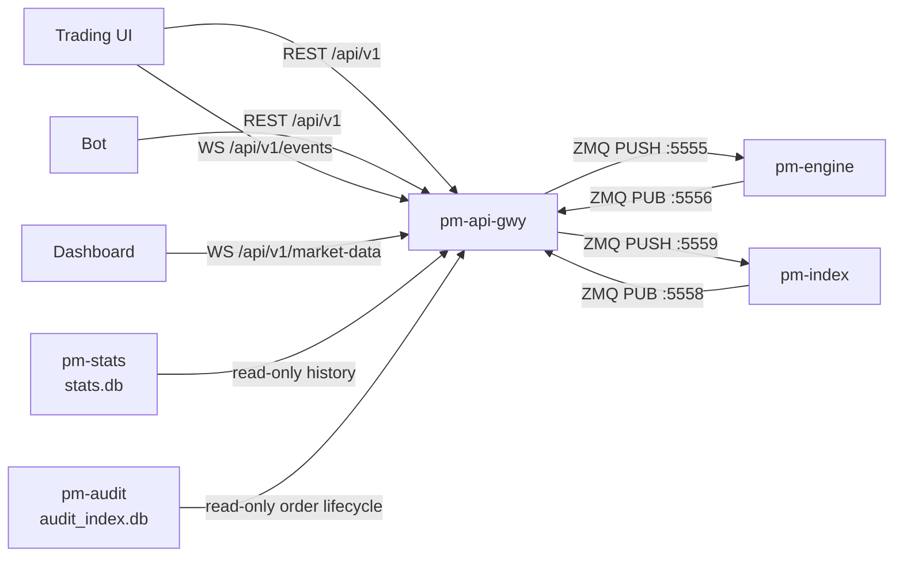

# API Gateway (REST/WebSocket)

!!! note "Learning objectives"
    After reading this page you will understand:

    - What `pm-api-gwy` does in the EduMatcher process model
    - How to configure API keys in the central `engine_config.yaml`
    - How to call the REST API and inspect Swagger documentation
    - How private and public WebSocket streams work
    - Where to find reusable Python and C REST examples


## What this process is

`pm-api-gwy` exposes EduMatcher order entry, order management, reference
data, history, and market data over REST/JSON and WebSocket. It is intended for
third-party software: browser UIs, dashboards, simple bots, and teaching
examples.

It is not a second matching engine. The process translates HTTP and WebSocket
requests into the same engine ZMQ/JSON messages used by the interactive
`pm-alf-console` process.


```mermaid
flowchart LR
    UI[Trading UI] -->|REST /api/v1| API[pm-api-gwy]
    BOT[Bot] -->|REST /api/v1| API
  UI -->|WS /api/v1/events| API
  DASH[Dashboard] -->|WS /api/v1/market-data| API
    API -->|ZMQ PUSH :5555| ENG[pm-engine]
    ENG -->|ZMQ PUB :5556| API
    STATS[pm-stats\nstats.db] -->|read-only history| API
    AUDIT[pm-audit\naudit_index.db] -->|read-only order lifecycle| API
    API -->|ZMQ PUSH :5559| IDX[pm-index]
    IDX -->|ZMQ PUB :5558| API
```


## Configuration

API gateway configuration lives in the central `engine_config.yaml`, matching
the existing CALF and RALF gateway pattern.

Use the top-level key `api_gateways` (underscore). The dashed form
`api-gateways` is not valid.

```yaml
api_gateways:
  desk:
    enabled: true
    host: 0.0.0.0
    port: 8080
    swagger_enabled: true
    log_level: info
    stats_db: data/stats.db
    # pm-audit's index, read-only, for GET /admin/orders/{order_id}.
    # Optional: without it that one endpoint returns 503 and nothing else
    # is affected.
    audit_db: data/audit_index.db
    # Seconds a terminal order stays in the in-memory cache. 0 disables
    # eviction (unbounded growth).
    order_retention_sec: 3600
    # Seconds the market-data stream cache retains the per-symbol trades tail
    # for WS snapshot/resume. Latest book/depth/auction snapshots are kept
    # regardless of age; 0 disables the trade buffer but still serves snapshots.
    market_data_cache_sec: 60

    credentials:
      - api_key: key-trader-demo
        gateway_id: TRADER01
        description: Demo trading client
      - api_key: key-dashboard-demo
        gateway_id: null
        description: Read-only dashboard client

    rate_limit:
      writes_per_second: 10
      burst: 20

    timeouts:
      engine_auth_sec: 3.0
      engine_reply_sec: 3.0
      wait_ack_sec: 3.0
```

| Field | Meaning |
|---|---|
| `api_gateways.<NAME>` | Named API gateway process configuration selected with `--instance NAME` when needed |
| `host` / `port` | HTTP server bind address and port |
| `swagger_enabled` | Enables `/docs` and `/openapi.json` when true |
| `credentials[].api_key` | Bearer token clients use for REST and WebSocket auth |
| `credentials[].gateway_id` | Engine gateway identity; `null` means read-only market-data access; non-null values must be unique across `api_gateways` entries |
| `stats_db` | `pm-stats`' SQLite file, read-only, for `/history/*` |
| `audit_db` | `pm-audit`'s index, read-only, for `/admin/orders/{order_id}`. Optional |
| `order_retention_sec` | Seconds a terminal order stays cached (default `3600`; `0` disables eviction) |
| `market_data_cache_sec` | Seconds the market-data cache retains the per-symbol `trades` tail for WS snapshot/resume (default `60`; latest book/depth/auction snapshots are kept regardless of age; `0` disables the trade buffer) |
| `rate_limit` | Per-key write limiting for POST/PATCH/DELETE endpoints |
| `timeouts` | Engine auth, request/reply, and synchronous ACK wait timeouts |

`host` defaults to `0.0.0.0`, matching the external TCP gateways: the API
gateway is intended to be reachable by browser clients, API clients, and
read-only dashboards on other machines. Set it to `127.0.0.1` only for a
loopback-only lab or when a reverse proxy on the same host is the only caller.

The engine's `gateways.alf` allowlist remains authoritative. If a credential
maps to `TRADER01` but `TRADER01` is not allowed by the engine config, the
engine rejects the API gateway handshake and every request using that
credential fails with `403` and error code `ENGINE_AUTH`.

Use multiple named entries when you want logical process separation, such as one
gateway for a human trading desk and another for automated clients. Each
non-null `gateway_id` is owned by one API gateway process so process-local
session and event state remain unambiguous. Read-only `gateway_id: null`
credentials can appear in more than one entry.


## Start the process

Installed mode:

```bash
pm-engine --verbose
pm-stats
pm-api-gwy --instance desk
```

Developer mode:

```bash
poetry run pm-engine --verbose
poetry run pm-stats
poetry run pm-api-gwy --instance desk
```

Useful options:

| Option               |                                  Default | Description                                      |
|----------------------|-----------------------------------------:|--------------------------------------------------|
| `--host ADDR`        |                             config value | Override HTTP bind address                       |
| `--port PORT`        |                             config value | Override HTTP listen port                        |
| `--instance NAME`    | auto-selected only when one entry exists | Select a named `api_gateways` entry              |
| `--engine-host HOST` |                             config value | Override engine host for ZMQ ports `5555`/`5556` |
| `--stats-db PATH`    |                             config value | SQLite database for `/history/*`                 |
| `--log-level LEVEL`  |                             config value | `debug`, `info`, `warning`, or `error`           |

Uvicorn writes access and application logs to stdout/stderr. Redirect them with
your shell or service manager:

```bash
poetry run pm-api-gwy --instance desk --log-level debug \
  > api-gateway.log 2>&1
```


## Swagger interface

When `swagger_enabled: true`, open:

```text
http://127.0.0.1:8080/docs
```

Swagger shows all REST endpoints, request schemas, response schemas, and enum
values. Use the **Authorize** button with:

```text
Bearer key-trader-demo
```


## Authentication principles

REST clients send an HTTP bearer token:

```http
Authorization: Bearer key-trader-demo
```

WebSocket clients send the API key as their first JSON message:

```json
{ "api_key": "key-trader-demo" }
```

### Auth and roles

The gateway checks auth in two steps:

1. The presented API key must exist in
   `api_gateways.<NAME>.credentials[].api_key`.
2. For trading/admin actions, the key must map to a non-null `gateway_id` and
   that gateway must be accepted by the engine allowlist and role model.

Access classes used across this guide:

- `Authenticated key` (or `Authentication key`): any configured API key.
- `Trading key`: an authenticated key with a non-null `gateway_id`.
- `Admin key`: a trading key whose mapped gateway role resolves to `ADMIN`.

What each class can do:

- Authenticated key: reference data and public history/market-data endpoints.
- Trading key: everything above plus private order/position/trading endpoints.
- Admin key: everything above plus `/api/v1/admin/*`.

Read-only credentials (`gateway_id: null`) can use public and reference
surfaces but cannot submit, cancel, or inspect private orders.

### Key types and provisioning

Keys are configured centrally in `engine_config.yaml` under
`api_gateways.<NAME>.credentials`.

```yaml
api_gateways:
  desk:
    credentials:
      - api_key: key-trader-demo
        gateway_id: TRADER01
        description: Trading client
      - api_key: key-dashboard-demo
        gateway_id: null
        description: Read-only dashboard
      - api_key: key-admin-demo
        gateway_id: ADMIN01
        description: Admin operator client
```

Provisioning rules:

- `gateway_id: null` creates a read-only authenticated key.
- `gateway_id: <GW_ID>` creates a trading-capable key bound to that gateway.
- ADMIN access is not set on the API key itself; it comes from the mapped
  gateway role in `gateways.alf`.
- Non-null `gateway_id` values must be unique across `api_gateways` entries.

How to get a key in practice:

- Keys are issued out-of-band by the venue/operator team.
- There is no self-service endpoint to create or rotate keys in `pm-api-gwy`.
- After key changes in config, restart/redeploy the API gateway instance.

Usage examples:

Trading REST call:

```http
Authorization: Bearer key-trader-demo
POST /api/v1/orders
```

Read-only REST call:

```http
Authorization: Bearer key-dashboard-demo
GET /api/v1/reference
```

Admin REST call:

```http
Authorization: Bearer key-admin-demo
POST /api/v1/admin/session/transition
```

Read-only WebSocket auth:

```json
{ "api_key": "key-dashboard-demo" }
```

For strict endpoint-by-endpoint access rules, see
[Appendix: REST API Reference](950-app-REST-API-reference.md).

| Error code | Status | Cause |
|---|---|---|
| `AUTH` | `401` | Missing/malformed `Authorization` header, or an unrecognized API key |
| `ENGINE_AUTH` | `403` | The credential's `gateway_id` isn't allowed by the engine's `gateways.alf` list |
| `READ_ONLY` | `403` | A `gateway_id: null` credential called a trading-only endpoint |
| `ROLE_DENIED` | `403` | Credential's gateway lacks the `ADMIN` role on an `/admin/*` call |
| `RATE_LIMIT` | `429` | Per-key write rate limit exceeded |
| `DUPLICATE` | `409` | `client_order_id` already active for the session |
| `VALIDATION` | `422`/`400` | Malformed request body or query parameters |
| `STATS_DB` | `503` | `pm-stats`' SQLite file doesn't exist yet |
| `AUDIT_INDEX_UNAVAILABLE` | `503` | No `pm-audit` index — only affects `GET /admin/orders/{order_id}` |
| `UNKNOWN_ORDER` | `404` | No audited events for that order id |
| `TRANSITION_REJECTED` | `409` | The engine will not perform the requested session transition |
| `RELOAD_REJECTED` | `409` | `POST /admin/reference/reload` was rejected — usually because the file's symbol/index set changed |
| `REBALANCE_REJECTED` | `409` | `POST /admin/indexes/{id}/rebalance` was rejected by `pm-index` — see the ack `reason` |
| `ENGINE_TIMEOUT` | `503` | No engine reply within the configured timeout |
| `INDEX_TIMEOUT` | `503` | No `pm-index` reply within the configured timeout |
| `INDEX_ERROR` | `502` | `pm-index` rejected the request |


## REST endpoints

Base path: `/api/v1`.

| Method   | Path                         | Auth          | Purpose                              |
|----------|------------------------------|---------------|--------------------------------------|
| `POST`   | `/orders`                    | trading       | Submit one order                     |
| `DELETE` | `/orders/{order_id}`         | trading       | Cancel one order                     |
| `PATCH`  | `/orders/{order_id}`         | trading       | Amend price and/or quantity          |
| `POST`   | `/orders/{order_id}/replace` | trading       | Cancel then submit replacement       |
| `GET`    | `/orders`                    | trading       | List live orders for the gateway     |
| `GET`    | `/orders/{order_id}`         | trading       | Read cached order state              |
| `POST`   | `/oco`                       | trading       | Submit OCO pair                      |
| `DELETE` | `/oco/{oco_id}`              | trading       | Cancel OCO pair                      |
| `POST`   | `/combos`                    | trading       | Submit combo order                   |
| `DELETE` | `/combos/{combo_id}`         | trading       | Cancel combo                         |
| `POST`   | `/quotes`                    | trading       | Submit two-sided quote               |
| `DELETE` | `/quotes/{symbol}`           | trading       | Cancel quote for symbol              |
| `POST`   | `/mass-cancel`               | trading       | Cancel all or symbol-scoped exposure |
| `POST`   | `/kill-switch`               | trading       | Alias of `/mass-cancel`              |
| `GET`    | `/symbols`                   | trading       | Instrument metadata                  |
| `GET`    | `/session`                   | trading       | Current engine session state         |
| `GET`    | `/reference`                 | any valid key | Full compiled reference-data bundle  |
| `GET`    | `/reference/config-version`  | any valid key | Content-hash version of reference data |
| `GET`    | `/reference/symbols`         | any valid key | Tick sizes, risk level, collar/circuit-breaker config per symbol |
| `GET`    | `/reference/risk`            | any valid key | Risk level definitions and the default level |
| `GET`    | `/reference/indexes`         | any valid key | Configured exchange index definitions |
| `GET`    | `/reference/schedule`        | any valid key | Session schedule, `sessions_enabled`, `country` |
| `GET`    | `/quotes/bootstrap`          | trading       | Active quote bootstrap state         |
| `GET`    | `/quotes/legs`               | trading       | Quote leg state                      |
| `GET`    | `/positions`                 | trading       | Net positions by symbol              |
| `GET`    | `/status`                    | trading       | Gateway cache summary                |
| `GET`    | `/history/orders`            | trading       | Historical order lifecycle events    |
| `GET`    | `/history/orders/{order_id}` | trading       | Full lifecycle for one order         |
| `GET`    | `/history/fills`             | trading       | Historical fills                     |
| `GET`    | `/history/trades`            | any valid key | Public trade log                     |
| `GET`    | `/history/daily`             | any valid key | Daily OHLCV rows                     |
| `GET`    | `/history/price-snapshots`   | any valid key | Intraday instrument mid/bid/ask time series |
| `GET`    | `/history/index-daily`       | any valid key | Daily index OHLC rows                |
| `GET`    | `/history/index-snapshots`   | any valid key | Intraday index level time series     |
| `GET`    | `/history/index-ids`         | any valid key | Index IDs with recorded statistics   |
| `GET`    | `/history/index-events`      | any valid key | Index structural/audit log (live pm-index round-trip) |
| `GET`    | `/bootstrap/trader`          | any valid key | One-request TRADER/MM/ADMIN startup payload          |
| `GET`    | `/bootstrap/mm`              | MARKET\_MAKER | One-request MARKET\_MAKER startup payload (adds quote state) |
| `GET`    | `/bootstrap/admin`           | admin         | One-request ADMIN startup payload                   |
| `GET`    | `/healthz`                   | none          | Liveness probe (not in Swagger)      |

Admin endpoints are documented separately under
[Admin endpoints](#admin-endpoints).


### Submit order

```http
POST /api/v1/orders?wait=ack
Authorization: Bearer key-trader-demo
Content-Type: application/json
```

```json
{
  "symbol": "AAPL",
  "side": "BUY",
  "order_type": "LIMIT",
  "quantity": 100,
  "tif": "DAY",
  "price": 150.50,
  "smp_action": "NONE",
  "client_order_id": "ui-42"
}
```

| Field          | Required    | Notes                                                                             |
|----------------|-------------|-----------------------------------------------------------------------------------|
| `symbol`       | yes         | Instrument symbol                                                                 |
| `side`         | yes         | `BUY` or `SELL`                                                                   |
| `order_type`   | yes         | `MARKET`, `LIMIT`, `STOP`, `STOP_LIMIT`, `FOK`, `ICEBERG`, `IOC`, `TRAILING_STOP` |
| `quantity`     | yes         | Positive integer                                                                  |
| `tif`          | no          | `DAY`, `GTC`, `ATO`, `ATC`; default `DAY`                                         |
| `price`        | conditional | Required for `LIMIT`, `FOK`, `IOC`, `ICEBERG`, `STOP_LIMIT`                       |
| `stop_price`   | conditional | Required for `STOP`, `STOP_LIMIT`                                                 |
| `visible_qty`  | conditional | Required for `ICEBERG`, less than `quantity`                                      |
| `trail_offset` | conditional | Required for `TRAILING_STOP`                                                      |
| `smp_action`   | no          | Self-match prevention action                                                      |

Default write calls return immediately with `202 Accepted`. Add `?wait=ack` to
wait for the matching engine ACK until the configured timeout. The wait filters
by `order_id` so concurrent requests on the same gateway receive their own ack.

Submitting an order with a `client_order_id` that already exists in the session
cache returns `409 Conflict`.


### Cancel, amend, and replace

| Operation                         | Payload                                               |
|-----------------------------------|-------------------------------------------------------|
| `DELETE /orders/{order_id}`       | no body                                               |
| `PATCH /orders/{order_id}`        | `{ "price": 151.00 }`, `{ "quantity": 200 }`, or both |
| `POST /orders/{order_id}/replace` | same shape as `POST /orders`                          |

`?wait=ack` is not limited to `POST /orders` — both `DELETE /orders/{order_id}`
and `PATCH /orders/{order_id}` also accept it, waiting on the matching
`order.cancelled.*`/`order.amended.*` event the same way. `POST
/orders/{order_id}/replace` has no `wait` parameter; it always waits
synchronously for the cancel to be acknowledged before submitting the
replacement (see [Implementation notes](#implementation-notes-and-design-deviations)).


### OCO, combos, quotes, and mass cancel

| Endpoint | Minimal payload |
|---|---|
| `POST /oco` | `{ "oco_id":"tp-sl-1", "symbol":"AAPL", "quantity":100, "leg1":{"side":"SELL","order_type":"LIMIT","price":152.0}, "leg2":{"side":"SELL","order_type":"STOP","stop_price":147.0} }` |
| `POST /combos` | `{ "combo_id":"spread-1", "legs":[{"symbol":"AAPL","side":"BUY","quantity":100,"price":150.0},{"symbol":"MSFT","side":"SELL","quantity":100,"price":410.0}] }` |
| `POST /quotes` | `{ "symbol":"AAPL", "bid_price":150.0, "bid_qty":500, "ask_price":150.1, "ask_qty":500 }` |
| `POST /mass-cancel` | `{ "symbol":"AAPL" }` or `{}` for all symbols |


### Orders, positions, and reference data

| Endpoint | Returns | Notes |
|---|---|---|
| `GET /orders` | `{ "orders": [...] }` | Live orders for the caller's gateway, keyed off the gateway's order cache; requests a fresh snapshot from the engine and falls back to the cache on timeout |
| `GET /orders/{order_id}` | The cached order dict for `order_id` | Read-only, served entirely from the gateway's local cache (no engine round-trip); returns `404` with a plain `{"detail": "Unknown order"}` body if not found — **not** the `{"error": {...}}` envelope used by every other error response in this gateway |
| `GET /symbols` | `{ "symbols": [...] }` | Instrument metadata, round-tripped from the engine's `system.symbols_request` |
| `GET /session` | Current `SessionState` and schedule info | Round-tripped from the engine's `system.session_status` reply |
| `GET /quotes/bootstrap` | Active MM quote bootstrap state | Round-tripped from the engine |
| `GET /quotes/legs` | `{ "legs": [...], "recent": [...], "show_requested":..., "complete":... }` | Served from the gateway's local quote-leg cache when populated, otherwise round-tripped from the engine. `legs` and `recent` are always present, empty when the requested half does not include them |
| `GET /positions` | `{ "positions": [{"symbol", "net_qty", "last_price"}, ...] }` | Computed entirely from the gateway's local fill cache — no engine round-trip |

All of the round-tripped endpoints above return `503` with error code
`ENGINE_TIMEOUT` if the engine doesn't reply within `timeouts.engine_reply_sec`.


### Reference data

Base path: `/api/v1/reference`. These endpoints serve the engine's
**compiled, static** reference data — the resolved settings a client needs to
interpret prices and risk state correctly (tick sizes, resolved risk-band
collars, circuit-breaker ladders, session schedule, index definitions)
without parsing `engine_config.yaml` or depending on internal engine
structures. They are distinct from `GET /symbols` and `GET /session`, which
report *live* state (current halts, `prev_close`, current `SessionState`):
reference data changes only when an admin reloads it.

| Endpoint | Returns | Notes |
|---|---|---|
| `GET /reference` | The full bundle: `symbols`, `risk`, `indexes`, `schedule`, `config_version` | One call for a client that wants everything |
| `GET /reference/config-version` | `{ "config_version": "..." }` | A content hash — see below |
| `GET /reference/symbols` | `{ "symbols": [{symbol, tick_decimals, level?, collar?, circuit_breaker?}], "config_version":... }` | A list, not a map: each entry carries its own `symbol`, so a client can iterate without knowing the keys. `collar`/`circuit_breaker` are omitted for a symbol with neither configured |
| `GET /reference/risk` | `{ "default_level"?:..., "levels": [{name, collar?}], "config_version":... }` | Risk-band definitions referenced by each symbol's `level`. `collar` is omitted for a level that configures none |
| `GET /reference/indexes` | `{ "indexes": [{id, description, base_value, constituents}], "config_version":... }` | Configured exchange indexes; empty list if none configured |
| `GET /reference/schedule` | `{ "sessions_enabled":..., "country"?:..., "schedule": {pre_open, opening_auction_start, continuous_start, closing_auction_start, closing_auction_end} \| null, "config_version":... }` | The five clock times are nested under `schedule`, which is the same record `system.session_schedule` carries. `schedule: null` means no `schedule:` block is configured |

All six accept any valid API key, including read-only (`gateway_id: null`)
credentials — this is metadata, not account or order data. Every response
round-trips to the engine (no gateway-side cache, so a reload is reflected
immediately) and returns `503 ENGINE_TIMEOUT` under the same conditions as
`GET /symbols`.

```http
GET /api/v1/reference/symbols
Authorization: Bearer key-readonly-demo
```

```json
{
  "symbols": {
    "AAPL": {
      "tick_size": 0.01,
      "level": "STANDARD",
      "collar": { "static_band_pct": 0.20, "dynamic_band_pct": 0.02 },
      "circuit_breaker": {
        "reference_window_ns": 300000000000,
        "levels": [
          { "name": "L1", "price_shift_pct": 0.07, "halt_duration_ns": 300000000000 },
          { "name": "L2", "price_shift_pct": 0.13, "halt_duration_ns": 900000000000 },
          { "name": "L3", "price_shift_pct": 0.20, "halt_duration_ns": null }
        ]
      }
    }
  },
  "config_version": "3f2a9c1e7b0d4a5f"
}
```

#### `config_version`

A 16-character hex prefix of a SHA-256 hash over the compiled reference
bundle, computed once when the engine loads or reloads its config — not
recomputed per request. It changes if and only if the compiled reference
data changes, so a client can cache reference data and cheaply poll
`GET /reference/config-version` to know when to refetch, rather than diffing
the full bundle. There is no other versioning scheme (no counter, no
timestamp) — treat the string as opaque.

#### Reloading reference data

`POST /api/v1/admin/reference/reload` (ADMIN-only) re-reads the same
`engine_config.yaml` the engine started from and applies any change to tick
sizes, risk-band collars, circuit-breaker ladders, the schedule, or index
descriptions/constituents-within-an-unchanged-index-set.

It is intentionally **narrower** than a full engine restart:

- It never creates or removes an order book, never re-seeds market-maker
  quotes, and never touches session or halt state — those only happen once,
  at engine startup, and re-running them mid-session would double-seed
  quotes and republish trades.
- If the reloaded file's **symbol set or index-id set differs** from what is
  currently live, the reload is rejected with `409 RELOAD_REJECTED` and
  nothing is applied — adding or removing an instrument still requires a
  restart.
- If the engine was started from a compiled config artifact rather than a
  plain YAML file, reload is rejected — there is no single file to re-read.
- Like other admin writes, it is subject to the per-key rate limit and
  returns `503 ENGINE_TIMEOUT` if the engine doesn't reply in time.

```http
POST /api/v1/admin/reference/reload
Authorization: Bearer key-admin-demo
```

```json
{ "status": "RELOADED", "config_version": "9b7e21fa804c6d13" }
```

This is meant for controlled reloads in development/classroom mode — tuning
a risk band or circuit-breaker threshold between drills without restarting
the whole exchange — not for live production config changes.


### History endpoints

Base path: `/api/v1/history`. Every endpoint except `/history/index-events`
reads from `pm-stats`' SQLite database (`--stats-db PATH`, default
`data/stats.db`); the gateway returns `503` with error code `STATS_DB` if
that file does not exist yet (for example, before `pm-stats` has run at
least once). `/history/index-events` is the one exception — see its own
section below.

`/history/orders`, `/history/orders/{order_id}`, and `/history/fills` require
a trading credential and are scoped to that credential's `gateway_id` — they
only ever return that gateway's own orders. `/history/trades`,
`/history/daily`, `/history/price-snapshots`, `/history/index-daily`,
`/history/index-snapshots`, `/history/index-ids`, and `/history/index-events`
are public market data: any valid API key works, including read-only keys
with no `gateway_id`.

| Endpoint | Query parameters | Notes |
|---|---|---|
| `GET /history/orders` | `symbol`, `event_type`, `date`, `from`, `to`, `limit` (1–5000, default 500), `after` | Trading credential only; scoped to the caller's `gateway_id` |
| `GET /history/orders/{order_id}` | none (path parameter only) | Trading credential only; full lifecycle for one order, scoped to the caller's `gateway_id`; **unbounded and unpaginated** — see the Pagination exceptions note below |
| `GET /history/fills` | `symbol`, `date`, `from`, `to`, `limit`, `after` | Trading credential only; `event_type=FILL` events for the caller's `gateway_id` |
| `GET /history/trades` | `symbol`, `date`, `from`, `to`, `limit`, `after` | Public trade tape |
| `GET /history/daily` | `symbol`, `date`, `from`, `to`, `limit`, `after` | Omitting every time filter returns the latest available date; `from`/`to` (inclusive, dates not timestamps) return a series across days, oldest first |
| `GET /history/price-snapshots` | `symbol` (**required**), `date`, `from`, `to`, `limit`, `after` | Intraday mid/bid/ask ticks (15-minute recording interval); unlike `/trades`/`/daily` there is no "all symbols" mode |
| `GET /history/index-daily` | `index_id`, `date`, `from`, `to`, `limit`, `after` | Same shape as `/daily` but for exchange indexes, including the `from`/`to` range |
| `GET /history/index-snapshots` | `index_id` (**required**), `date`, `from`, `to`, `limit`, `after` | Intraday index level ticks; unlike `/trades`/`/daily` there is no "all indexes" mode |
| `GET /history/index-ids` | `date` | List of index IDs with recorded data; unpaginated |
| `GET /history/index-events` | `index_id` (**required**), `from`, `to`, `types`, `max_records` | Structural/audit log; live round-trip to `pm-index`, not `pm-stats` — see below |

#### Daily rollups: one date, or a series

`/history/daily` and `/history/index-daily` answer two different questions
depending on which time filter you pass:

| Parameters | Result |
|---|---|
| *(none)* | The latest available date only |
| `date=YYYY-MM-DD` | That one date |
| `from=` and/or `to=` | Every date in range, **oldest first**; bounds are inclusive and either may be omitted |

`from`/`to` here are **dates** (`YYYY-MM-DD`), unlike `/trades` and
`/price-snapshots` where they are ISO timestamps — these tables are keyed by
date, not by tick time. Passing `date` together with a range is not an error;
the specific date wins.

Use the range for anything spanning days, such as a multi-day OHLC chart.
Without it, a month of bars would take one request per calendar day.

```http
GET /api/v1/history/daily?symbol=AAPL&from=2026-06-01&to=2026-06-30
Authorization: Bearer key-readonly-demo
```

The cursor differs between the two modes. Within a single date, `symbol` (or
`index_id`) alone identifies a row. Across a range it does not — the same
symbol appears on every date — so the range cursor carries `(date, symbol)`.
Both are opaque either way; just pass `next_cursor` back as `after`.

#### Pagination

Every list-returning endpoint wraps its rows in an envelope with `count` and
`has_more` — a boolean that is `true` when the page came back full (exactly
`limit` rows), meaning more rows may exist. When `has_more` is `true`, the
response also includes `next_cursor`, an opaque string. Pass it back as the
`after` query parameter to fetch the next page; omit it to start from the
beginning. Cursors are keyset-based (not a row offset), so pages stay
correct — no skipped or duplicated rows — even if new data is being written
concurrently. Treat the cursor string as opaque: its internal shape is not a
stable contract and may change between releases.

!!! note "Pagination exceptions"
    Three endpoints do not follow the `count`/`has_more`/`next_cursor` contract
    above: `GET /history/index-ids` and `GET /history/index-events` are each
    documented separately below as intentionally unbounded/unpaginated.
    `GET /history/orders/{order_id}` is also unbounded — it returns
    `{ "events": [...], "count": N }` with **no `has_more` and no pagination at
    all**, since it's a single order's full lifecycle rather than an
    open-ended list.

```http
GET /api/v1/history/trades?symbol=EDU100&limit=2
Authorization: Bearer key-readonly-demo
```

```json
{
  "trades": [
    { "ts": "2026-06-14T09:00:00.000+00:00", "trade_id": "T000", "symbol": "EDU100", "price": 100.0, "quantity": 10, "buy_gateway_id": "GW1", "sell_gateway_id": "GW2" },
    { "ts": "2026-06-14T09:01:00.000+00:00", "trade_id": "T001", "symbol": "EDU100", "price": 100.0, "quantity": 10, "buy_gateway_id": "GW1", "sell_gateway_id": "GW2" }
  ],
  "count": 2,
  "has_more": true,
  "next_cursor": "eyJyb3dpZCI6MiwidHMiOiIyMDI2LTA2LTE0VDA5OjAxOjAwLjAwMCswMDowMCJ9"
}
```

```http
GET /api/v1/history/trades?symbol=EDU100&limit=2&after=eyJyb3dpZCI6MiwidHMiOiIyMDI2LTA2LTE0VDA5OjAxOjAwLjAwMCswMDowMCJ9
Authorization: Bearer key-readonly-demo
```

returns the next two trades, and so on until a response comes back with
`has_more: false` and no `next_cursor`. A malformed or expired-schema
`after` value returns `422` with error code `VALIDATION`.

`/history/index-ids` has no `limit`/`after` — the number of distinct
exchange indexes is always small (EduMatcher caps this at 5 per config
file), so it is intentionally unbounded and unpaginated.

```http
GET /api/v1/history/price-snapshots?symbol=AAPL&from=2026-06-14T09:00:00%2B00:00&to=2026-06-14T16:30:00%2B00:00&limit=100
Authorization: Bearer key-readonly-demo
```

```json
{
  "snapshots": [
    { "ts": "2026-06-14T09:00:00.000+00:00", "symbol": "AAPL", "mid_price": 150.5, "best_bid": 150.0, "best_ask": 151.0, "pct_change": null },
    { "ts": "2026-06-14T09:15:00.000+00:00", "symbol": "AAPL", "mid_price": 151.0, "best_bid": 150.5, "best_ask": 151.5, "pct_change": 0.3322 }
  ],
  "count": 2,
  "has_more": false
}
```

Rows come from `pm-stats`' periodic book snapshots — recorded at a fixed
interval (15 minutes by default, overridable via `pm-stats --snapshot-interval
SEC`), not on every tick. For live tick-by-tick mid-price movement, use the
CALF `TOP` channel instead; this endpoint is for historical/charting use,
not a substitute for a live feed. `pct_change` is the percent change versus
the *previous recorded snapshot* for that symbol (not versus the day's
open), and is `null` for the first snapshot recorded for a symbol since
`pm-stats` started, since there is no prior snapshot to compare against.

```http
GET /api/v1/history/index-daily?index_id=EDU100&date=2026-06-14
Authorization: Bearer key-readonly-demo
```

```json
{
  "daily": [
    {
      "date": "2026-06-14",
      "index_id": "EDU100",
      "open_level": 1042.10,
      "high_level": 1056.30,
      "low_level": 1040.05,
      "close_level": 1048.73,
      "close_session_state": "CLOSED",
      "open_aggregate_cap": 7300000000000.0,
      "close_aggregate_cap": 7350000000000.0,
      "update_count": 512
    }
  ],
  "count": 1,
  "has_more": false
}
```

!!! warning "`close_level` is only final once `close_session_state` is `CLOSED`"
    `close_level` reflects the most recently recorded `index.update` for that
    date. For a past date this is always final. For the current date, while
    the session is still open, `close_level` is a live "latest tick so far"
    and will keep changing — check `close_session_state == "CLOSED"` (or wait
    for the date to roll over) before treating it as the official close. See
    [Statistics & Reporting](140-statistics-and-reporting.md#getting-the-eod-index-level-for-a-date).

```http
GET /api/v1/history/index-snapshots?index_id=EDU100&from=2026-06-14T09:00:00%2B00:00&to=2026-06-14T16:30:00%2B00:00&limit=100
Authorization: Bearer key-readonly-demo
```

```http
GET /api/v1/history/index-ids
Authorization: Bearer key-readonly-demo
```

```json
{ "index_ids": ["EDU100", "EDUFIN"], "count": 2 }
```

If no exchange index is configured, or `pm-index`/`pm-stats` have not run
yet, `index-daily`, `index-snapshots`, and `price-snapshots` return an empty
list (not an error) and `index-ids` returns `{ "index_ids": [], "count": 0 }`.

#### Index structural/audit events

`/history/index-events` is unlike every other endpoint on this page: it does
not read `pm-stats`' SQLite data at all. `pm-index`'s structural/audit log
(index creation, corporate actions, constituent additions, delistings) lives
only in `pm-index`'s own append-only file and is never mirrored into
`pm-stats`, so answering this requires a live ZMQ request/reply round-trip to
the `pm-index` process itself. Practically, this means:

- It can return `503` with error code `INDEX_TIMEOUT` if `pm-index` is not
  running or does not reply within the configured timeout — independent of
  whether `stats.db` exists.
- It can return `502` with error code `INDEX_ERROR` if `pm-index` rejects
  the request (for example, an unknown `index_id`).
- There is no `limit`/`has_more`/`after` pagination; `max_records` (default
  and max 10,000) caps the reply size directly, matching `pm-index`'s own
  request/reply contract.

```http
GET /api/v1/history/index-events?index_id=EDU100&from=1750000000&to=1760000000
Authorization: Bearer key-readonly-demo
```

```json
{
  "events": [
    { "type": "INIT", "timestamp": 1750000012.5, "index_id": "EDU100" },
    { "type": "CORP_ACTION", "timestamp": 1751234000.0, "index_id": "EDU100", "action": "SPLIT", "symbol": "AAPL" }
  ],
  "count": 2
}
```

`from`/`to` are Unix timestamps in seconds (not the ISO-8601 strings used by
the SQLite-backed endpoints), defaulting to the last 30 days and now
respectively — matching `pm-index`'s own defaults. `types` restricts the
reply to a subset of `INIT`, `CORP_ACTION`, `ADD_CONSTITUENT`, `DELIST`
(repeat the query parameter for multiple values); omitting it returns all
four. There are no level or end-of-day tick records here — use
`/history/index-daily` and `/history/index-snapshots` for those.


## Bootstrap endpoints

Bootstrap endpoints collapse the 6–13 sequential REST calls a browser client
currently needs at login into a single round-trip per role.  Sub-queries
inside each handler run in parallel; the total wall-clock time is the slowest
of the concurrent engine queries, not their sum.

### How partial failures work

Each response carries an `incomplete` array.  When any optional sub-query
times out or errors, the corresponding field is set to `null` and its name is
appended to `incomplete`.  The rest of the response is still valid and useful.
Required fields — `reference` and `orders` for `/bootstrap/trader` and
`/bootstrap/mm`; `reference` for `/bootstrap/admin` — return `503
ENGINE_TIMEOUT` if they fail rather than a partial response, because the UI
cannot render anything meaningful without them.

### Role access

| Endpoint | Allowed | Returns `403` for |
|---|---|---|
| `GET /api/v1/bootstrap/trader` | Any valid key | — |
| `GET /api/v1/bootstrap/mm` | MARKET\_MAKER | TRADER, ADMIN, read-only |
| `GET /api/v1/bootstrap/admin` | ADMIN | TRADER, MARKET\_MAKER, read-only |

Read-only credentials (no `gateway_id`) may call `/bootstrap/trader`.  They
receive `gateway_role: "READ_ONLY"`, empty `positions`, and empty `orders`
without triggering any engine round-trip for those fields.

### `fills_limit` query parameter

`/bootstrap/trader` and `/bootstrap/mm` accept an optional `fills_limit`
integer query parameter (default `50`, max `500`) that controls how many of
today's fill events are returned in the `recent_fills` field.  The engine
session timezone in the stats database determines what "today" means,
consistent with `GET /api/v1/history/fills`.

### Updated login sequence

With a bootstrap endpoint the login sequence becomes:

1. `GET /api/v1/bootstrap/<role>` — one HTTP request with parallel internal
   engine queries; populates identity, reference data, session state, orders,
   positions, and capability flags before any WebSocket opens.
2. Open WebSockets in parallel — `/events`, `/market-data`, and (ADMIN)
   `/admin/monitor` — all of which can start immediately because
   `gateway_id` and `gateway_role` are already known from step 1.

For the full response shapes and error codes see
[Appendix: REST API Reference — Bootstrap](950-app-REST-API-reference.md#bootstrap).

## Admin endpoints

Base path: `/api/v1/admin`.

These endpoints require an API key whose `gateway_id` maps to an engine gateway
configured with the `ADMIN` role (`gateways.alf[].role: ADMIN`). The gateway
role is resolved from the engine at call time, not from the API credential.
Callers without the ADMIN role receive `403` with error code `ROLE_DENIED`.

!!! note "Role source"
    The API credential store does not carry role. The gateway resolves and
    caches the ADMIN role from the engine's gateway list reply, so the first
    admin call performs one extra engine round-trip.

| Method | Path                              | Request body                                | Response                                        | Engine topic                |
|--------|-----------------------------------|---------------------------------------------|-------------------------------------------------|-----------------------------|
| `POST` | `/admin/session/transition`       | `{ "to_state": "CONTINUOUS" }`              | `{ "requested_state": ..., "status":"PENDING" }`| `session.transition`        |
| `GET`  | `/admin/session/schedule`         | none                                        | `{ "sessions_enabled":..., "schedule":{...} }`  | `system.session_schedule_request` |
| `GET`  | `/admin/gateways`                 | none                                        | `{ "gateways":[{id,role,description,connected}] }` | `system.gateways_request` |
| `POST` | `/admin/gateways/{gid}/disconnect`| none                                        | `{ "gateway_id":..., "status":"DISCONNECTED" }` | `system.gateway_disconnect` |
| `POST` | `/admin/circuit-breaker/trigger`  | `{ "symbol":"AAPL", "level": "L1", "reason":null }` | engine halt ack                         | `risk.symbol_halt`          |
| `POST` | `/admin/circuit-breaker/resume`   | `{ "symbol":"AAPL", "reason":null }`        | engine resume ack                               | `risk.symbol_resume`        |
| `GET`  | `/admin/halts`                    | none                                        | `{ "halted":[{symbol,resume_at_ns?,level?,...}] }` | `system.halt_status_request` |
| `GET`  | `/admin/risk/state`               | none                                        | `{ "symbols": [{symbol, collar_reference_price?, circuit_breaker?}] }` | `system.risk_state_request` |
| `GET`  | `/admin/orders`                   | `?symbol=&gateway_id=&status=`              | `{ "count":N, "orders":[...], "retention_sec":N }` | none — served from cache |
| `GET`  | `/admin/orders/{order_id}`        | `?limit=`                                   | `{ "order_id":..., "count":N, "events":[...] }` | none — read from `audit_index.db` |
| `POST` | `/admin/kill-switch/symbol`       | `{ "symbol":"AAPL", "reason":null }`        | engine cancel-symbol ack                        | `risk.cancel_symbol`        |
| `POST` | `/admin/kill-switch/gateway`      | `{ "target_gateway_id":"TRADER02", "reason":null }` | engine gateway-targeted kill-switch ack | `risk.kill_switch_gateway`  |
| `POST` | `/admin/kill-switch/global`       | `{ "reason":null }`                         | engine market-wide kill-switch ack              | `risk.kill_switch_global`   |
| `GET`  | `/admin/indexes`                  | none                                        | `{ "indexes":[{id,description,base_value,constituents}], "config_version":... }` | none — reuses the reference-data bundle |
| `POST` | `/admin/indexes/{id}/rebalance`   | `{ "updates":[{"symbol":"AAPL","new_shares_outstanding":123}], "reason":null }` | pm-index rebalance ack | `index.rebalance` (pm-index, not the engine) |
| `POST` | `/admin/reference/reload`         | none                                         | `{ "status":"RELOADED", "config_version":... }` | `system.reference_reload`   |

Behaviour notes:

- `POST /admin/session/transition` waits for the engine's verdict and returns
  `status: APPLIED` with a `command_id`, or **409 `TRANSITION_REJECTED`** when
  the engine will not perform it (sessions not enabled, unknown state). It was
  previously fire-and-forget, which meant a rejected request was
  indistinguishable from a slow one. `to_state` must be a valid `SessionState`
  (`PRE_OPEN`, `OPENING_AUCTION`, `CONTINUOUS`, `CLOSING_AUCTION`, `CLOSED`).
  See [Command correlation](#command-correlation).
- The circuit-breaker and kill-switch endpoints wait for the matching engine ACK.
  When the engine rejects the command (for example, an ADMIN-gate or validation
  failure) the ack carries `accepted: false` and the gateway returns `403` with
  the engine's `reason`.
- `POST /admin/circuit-breaker/trigger`'s `level`, when it names one of the
  symbol's configured `circuit_breaker.levels`, runs the halt through the same
  activation a price-triggered breaker uses — a real `resume_at_ns` and ACE
  reopening corridor, picked up automatically on the next resume tick. Omit
  it (or leave it `null`) for the previous behaviour: an indefinite halt
  cleared only by an explicit `POST /admin/circuit-breaker/resume`. An
  unrecognized level name, or a level on a symbol with no circuit breaker
  configured, is rejected.
- The circuit-breaker, kill-switch, and rebalance endpoints accept an
  optional `reason` field — a free-text note. For the engine-backed
  endpoints (everything except rebalance) it is carried through to the
  corresponding [`admin.action` monitor event](#admin-action-monitor-events)
  under the key `note`; it is not otherwise interpreted by the engine or
  `pm-index`.
- Write endpoints (`POST`) are subject to the same per-key write rate limit as
  order entry and return `429` when the limit is exceeded.
- Requests that receive no engine reply within the configured timeout return
  `503` with error code `ENGINE_TIMEOUT` (or `INDEX_TIMEOUT` for the two
  `pm-index`-backed endpoints, `/admin/indexes` and
  `/admin/indexes/{id}/rebalance`).

### `POST /admin/kill-switch/gateway` and `/admin/kill-switch/global`

Two admin-only kill-switch scopes beyond the existing self-service
`POST /kill-switch` (caller's own gateway) and `POST /admin/kill-switch/symbol`
(one symbol, every gateway):

- **`/admin/kill-switch/gateway`** cancels every resting order and quote
  belonging to `target_gateway_id`, across every symbol. Unlike
  `POST /kill-switch`, the caller (must hold the ADMIN role) and the affected
  gateway are different participants.
- **`/admin/kill-switch/global`** is the full-market emergency stop: every
  resting order and quote, for every gateway, across every symbol, cancelled
  outright. This is distinct from `POST /admin/circuit-breaker/trigger`
  applied symbol-by-symbol, or from a global circuit-breaker halt — those
  stop *trading*, while resting orders remain; this cancels the resting
  exposure itself. The response includes `affected_gateways`, the count of
  distinct gateways that had something cancelled.

Both return `409` with the engine's `reason` if rejected (for example,
`target_gateway_id` missing, or the caller lacks the ADMIN role).

### `GET /admin/risk/state`

Live per-symbol risk state — the current collar reference price and circuit
breaker reference/trigger/expansion/corridor state, for every symbol that has
either configured, halted or not:

```json
{
  "symbols": {
    "AAPL": {
      "collar_reference_price": 150.25,
      "circuit_breaker": {
        "halted": false,
        "reference_price": 150.10,
        "trigger_price": null,
        "triggered_level": null,
        "expansion_index": 0,
        "corridor": { "corridor_low": null, "corridor_high": null, "expansion": null },
        "resume_at_ns": null
      }
    }
  }
}
```

This is distinct from [`GET /reference/risk`](#reference-data) (static,
named risk-level definitions shared across symbols) and from
`GET /admin/halts` (only the symbols currently halted, without the
non-halted reference/reopening detail). Use `/admin/risk/state` when you need
to see where a symbol's breaker actually stands right now, not just whether
it has fired.

### Index administration (`pm-index` bridge)

`GET /admin/indexes` and `POST /admin/indexes/{id}/rebalance` are the one
place in this router that talks to `pm-index` instead of the engine — over
its own ZMQ PULL/PUB pair, the same one
[`pm-index-admin-cli`](152-index-admin-cli.md) uses for corporate actions and
constituent changes. Live symbol add/update on the engine and full corporate
actions/constituent changes on `pm-index` remain **not** exposed here — see
the note below.

`GET /admin/indexes` returns the same static configuration as
[`GET /reference/indexes`](#reference-data) (id, description, base_value,
constituents) — not live level/divisor. For the current level, use
[`GET /history/index-daily`](#history-endpoints).

`POST /admin/indexes/{id}/rebalance` applies a batch shares-outstanding
update to existing constituents — each entry in `updates` mirrors the
`SHARES_ISSUANCE` corporate action applied to one symbol, but the whole batch
is validated (unknown symbols, non-positive share counts, duplicates) before
any of it is applied, and the index level is recomputed and published once
for the batch rather than once per symbol:

```http
POST /api/v1/admin/indexes/EDU100/rebalance
Authorization: Bearer key-admin-demo
```

```json
{ "updates": [ { "symbol": "AAPL", "new_shares_outstanding": 16500000000 } ] }
```

```json
{
  "accepted": true,
  "reason": "",
  "timestamp": 1750000000.0,
  "updated_symbols": 1,
  "index_id": "EDU100",
  "level": 1048.90,
  "divisor": 7123456.78
}
```

A rejected batch returns `409 REBALANCE_REJECTED` with the reason (which
entry was invalid, or why); it can only fail once mutation has begun in the
rare case where an *already-validated* update still fails inside the
calculator (a non-positive aggregate cap) — whatever updates in the batch
had already applied at that point stay applied, matching the same limitation
the single-action corporate-action endpoint accepts. `rebalance` cannot add
or remove constituents or an index's symbol set — that remains
`pm-index-admin-cli`-only, same as splits, dividends, and delistings.

!!! note "Not currently exposed"
    Live symbol add/update on the engine is not exposed as a REST endpoint —
    the engine loads its symbol universe once at startup, and adding one
    mid-session would require creating an order book and seeding
    market-maker quotes outside the startup path that currently owns both.
    Corporate actions (splits, dividends, shares issuance as a single-symbol
    action) and constituent add/delist on `pm-index` are also not exposed
    here — only the batch shares-outstanding `rebalance` above is. Use
    [`pm-index-admin-cli`](152-index-admin-cli.md) for those.
    [`pm-index-cli`](160-exchange-commands.md#pm-index-cli-index-structuralaudit-history-query-tool)
    is unrelated to `pm-index`'s ZMQ sockets: it is a read-only tool that
    parses `pm-index`'s structural/audit JSONL files directly from disk.

### `admin.action` monitor events

Every admin-gated **engine** command above — circuit-breaker trigger/resume
and all three kill-switch scopes — publishes one `admin.action` event on the
[`/api/v1/admin/monitor`](#websocket-endpoints) WebSocket in addition to
(never instead of) its own REST response. This gives a monitor client one
uniform shape to watch regardless of which command ran, rather than needing
to know each command's own ack shape:

```json
{
  "type": "admin.action",
  "topic": "admin.action.ADMIN01",
  "ts": "2026-08-05T09:30:00.000Z",
  "data": {
    "command_id": "cmd-...",
    "initiator_gateway_id": "ADMIN01",
    "action": "circuit_breaker.trigger",
    "scope": { "symbol": "AAPL", "level": "L1", "note": "drill" },
    "accepted": true,
    "reason": ""
  }
}
```

`action` is one of `circuit_breaker.trigger`, `circuit_breaker.resume`,
`kill_switch.self`, `kill_switch.symbol`, `kill_switch.gateway`,
`kill_switch.global`. `scope` carries what the command acted on and what it
did, and every key is optional because each `action` uses a different subset.
The set is closed — since phase 6.1d it is a declared record, and a key
outside it cannot reach the wire:

| Key                 | Type  | Present on                                    |
|---------------------|-------|-----------------------------------------------|
| `symbol`            | str   | the per-symbol actions                        |
| `target_gateway_id` | str   | `kill_switch.gateway`                         |
| `level`             | str   | `circuit_breaker.trigger`                     |
| `note`              | str   | any action carrying the request's `reason`    |
| `cancelled_orders`  | int   | accepted kill switches                        |
| `cancelled_quotes`  | int   | accepted kill switches                        |
| `affected_gateways` | int   | an accepted `kill_switch.global`              |

A key whose value is unset is **absent** rather than `null`, and `scope` is
`{}` on a rejection that named nothing. This event is admin-monitor-only: it
never reaches a trading gateway's private stream or the public market-data
stream, regardless of which gateway initiated it.

!!! note "Index rebalance does not emit `admin.action`"
    `POST /admin/indexes/{id}/rebalance` talks to `pm-index`, a separate
    process from the engine that the admin-monitor fan-out is not wired to.
    Its own REST response (and `pm-index`'s append-only structural history,
    a `REBALANCE` record readable via `GET /history/index-events`) is
    currently the only record of it — it does not appear on
    `/api/v1/admin/monitor`.

### Extended `GET /status`

`GET /api/v1/status` now includes `gateway_role` (the resolved
`TRADER`/`MARKET_MAKER`/`ADMIN` role) alongside the existing cache summary
fields. When the caller holds the ADMIN role, the response also includes
`gateway_count`, the number of currently connected gateways.


## Cross-gateway admin views

!!! warning "These endpoints read `pm-audit`'s database"
    `GET /admin/orders/{order_id}` opens **`audit_index.db` read-only**. This
    is the only place the API gateway reads a store it does not own, and it
    exists so the REST API can be a single stop rather than sending an
    operator to `pm-audit-cli` for order history.

    The dependency is **optional and read-only**. The gateway never writes the
    file. If `pm-audit` is not deployed, or its index has not been built, that
    one endpoint returns `503 AUDIT_INDEX_UNAVAILABLE` naming what to do and
    **every other route is unaffected**. Configure the path with
    `api_gateways[].audit_db`; see [Audit Trail](190-audit.md) for building
    the index.

### `GET /api/v1/admin/orders`

The cross-gateway active-order table. Served entirely from the gateway's own
read model — no engine round-trip — because it already maintains a cache per
gateway whose events pass through it.

| Query | Effect |
|---|---|
| `symbol` | Restrict to one instrument (case-insensitive) |
| `gateway_id` | Restrict to one participant (case-insensitive) |
| `status` | Restrict to one order status |

```json
{
  "count": 2,
  "orders": [ { "order_id": "ORD-...", "gateway_id": "TRADER01", "symbol": "AAPL", "status": "NEW" } ],
  "retention_sec": 3600
}
```

!!! note "This is current state, not the day's history"
    Terminal orders age out after `order_retention_sec` (see
    [below](#order-cache-retention)), which is why the response repeats the
    setting: a caller can tell what horizon it is being shown. For anything
    older, use the lifecycle endpoint or the audit trail.

`gateway_id` is added on the way out — order payloads do not carry it, it is
the cache key.

### `GET /api/v1/admin/orders/{order_id}`

The complete cross-gateway lifecycle of one order, in timestamp order, read
from the audit index.

```json
{
  "order_id": "ORD-...",
  "count": 3,
  "events": [
    { "timestamp": "...", "topic": "order.ack.TRADER01", "gateway_id": "TRADER01", "symbol": "AAPL", "payload": "..." },
    { "timestamp": "...", "topic": "order.fill.TRADER01", "...": "..." }
  ]
}
```

| Status | Meaning |
|---|---|
| `200` | Events found |
| `404 UNKNOWN_ORDER` | The index has no events for that id |
| `503 AUDIT_INDEX_UNAVAILABLE` | No audit index — `pm-audit` not running, or index not built |

**Why not from the gateway's cache.** The cache folds each event into current
state and keeps no history, so a lifecycle served from it would be a weaker
duplicate of an audit trail that already exists, is complete across every
gateway, and survives restarts.

### Order cache retention

The in-memory order cache backs `GET /orders`, the private `orders.snapshot`
frame, and `GET /admin/orders`. Terminal orders — `FILLED`, `CANCELLED`,
`EXPIRED`, `REJECTED` — are evicted after **`order_retention_sec`** (default
`3600`). Resting orders are never evicted regardless of age; positions are
never affected, since forgetting the order that created one would not undo it.

Set `order_retention_sec: 0` to disable eviction, accepting that the cache
then grows for the lifetime of the process.

## WebSocket endpoints

| Path                   | Purpose                                                        | First message                         |
|------------------------|----------------------------------------------------------------|---------------------------------------|
| `/api/v1/events`       | Private order/quote/risk lifecycle events for one gateway      | `{ "api_key": "key-trader-demo" }`    |
| `/api/v1/market-data`  | Public book, trade, depth, session, and circuit-breaker events | `{ "api_key": "key-dashboard-demo" }` |
| `/api/v1/admin/monitor`| ADMIN-only cross-gateway monitor feed (all events)             | `{ "api_key": "key-admin-demo" }`     |

The `/api/v1/admin/monitor` stream requires an ADMIN-role gateway. After
authentication it sends `{ "type": "authenticated" }`, then a
`monitor.snapshot`, and then streams every engine event (order, fill, cancel,
session, and circuit-breaker) across all gateways. Non-admin keys receive an
error frame and are disconnected.

```json
{
  "type": "monitor.snapshot",
  "ts": "2026-08-05T09:30:00.000Z",
  "data": {
    "orders":   [ { "order_id": "ORD-...", "gateway_id": "TRADER01", "status": "NEW" } ],
    "halts":    { "halted": ["AAPL"] },
    "gateways": { "gateways": [ { "id": "TRADER01", "role": "TRADER" } ] },
    "last_seq": { "TRADER01": 9182 },
    "incomplete": []
  }
}
```

As with the private stream, the event sink is registered **before** the
snapshot is taken, so the worst case is a duplicate rather than an event lost
in the window while the snapshot still looked complete.

!!! note "`halts` and `gateways` come from the engine, not from local state"
    The gateway's own view of connected participants covers only those that
    authenticated through *this* API gateway instance. An admin monitor built
    on it would silently omit every participant connected over ALF, BALF, or a
    second API gateway — so the snapshot asks the engine for the venue-wide
    answer instead.

    Both queries are best-effort. If either times out the snapshot is still
    delivered with that field `null` and its name listed in `incomplete`: a
    monitor that opens with a partial view and says so is more useful than one
    that refuses to open.

!!! warning "There is no `monitor/events?from_seq=` replay endpoint"
    Deliberately. It would need a bounded in-memory ring buffer, which would
    be strictly weaker than what already exists — the audit trail is the
    durable, complete, indexed cross-gateway event log, and it survives
    restarts. Use `monitor.snapshot` for current state and
    [`GET /admin/orders/{order_id}`](#get-apiv1adminordersorder_id) or
    `pm-audit-cli` for history.

### The event envelope

Every event on every one of the three sockets uses the same envelope:

```json
{
  "type": "order.fill",
  "topic": "order.fill.TRADER01",
  "seq": 4127,
  "ts": "2026-06-24T10:15:03.221Z",
  "gateway_id": "TRADER01",
  "data": {
    "order_id": "ORD-...",
    "fill_qty": 50,
    "fill_price": 150.50,
    "remaining_qty": 50,
    "status": "PARTIAL"
  }
}
```

| Field | Meaning |
|---|---|
| `type` | Stable public event type (`trade`, `book`, `depth`, `auction`, `session`, `circuit_breaker`, `order.fill`, …) |
| `topic` | The engine topic the event came from, and what `seq` counts within |
| `seq` | Monotonic sequence number **within `topic`**, starting at 1 |
| `stream_seq` | Monotonic across **all** of one gateway's private events. Private events only — see [Private event recovery](#private-event-recovery) |
| `ts` | Exchange time, not browser receipt time |
| `gateway_id` | Present on private events only |
| `data` | The event payload |

Order lifecycle events — `order.ack`, `order.fill`, `order.cancelled`,
`order.expired` — additionally carry the identifiers that tie the order to the
structure it belongs to, when it belongs to one:

| Field | Present when |
|---|---|
| `oco_group_id` | The order is one side of an OCO pair |
| `combo_parent_id` | The order is a combo leg |
| `leg_index` | The order is a combo leg (0-based) |
| `quote_id` | The order came from a market-maker quote |

They are **omitted rather than null** for an ordinary single order. This lets a
consumer attribute a fill to its combo or OCO group without joining against its
own record of the parent order — which after a reconnect it may not have.

### Detecting dropped events

Each WebSocket client has a bounded outbound queue. A client that reads more
slowly than the market moves will have events **discarded** — that is
deliberate, because one slow consumer must not stall the gateway for everyone
else. `seq` is how you find out it happened.

Track the last `seq` per `topic`. A jump means events were dropped:

```python
last: dict[str, int] = {}

async for raw in websocket:
    event = json.loads(raw)
    topic, seq = event.get("topic"), event.get("seq")
    if topic is not None and seq is not None:
        previous = last.get(topic)
        if previous is not None and seq != previous + 1:
            print(f"gap on {topic}: {seq - previous - 1} event(s) lost")
            # book/depth carry full state, so the next message re-syncs you.
            # A missed trade can be replayed with a `resume` (see below),
            # or refetched from the history endpoints if it aged out.
        last[topic] = seq
```

!!! note "Why `seq` is per topic, not per connection"
    A connection-wide counter would arrive with holes wherever an event was
    filtered out by your subscription, so every client would see permanent
    phantom gaps and none could tell those from real loss. Per-topic numbering
    is contiguous for anyone receiving that topic at all. Key your gap
    detection on `topic`, **not** on `type` — one type (`depth`) spans many
    topics (`depth.AAPL`, `depth.MSFT`), each independently numbered.

`book` and `depth` events carry **complete state**, not deltas, so a client
that missed some simply takes the next one. Trades are the events worth
reacting to: a dropped `trade` is not repeated on the live feed, but it can be
recovered without leaving the socket — send a
[`resume`](#market-data-snapshot-and-resume) with the last `seq` you saw, and
the gateway replays the buffered prints (falling back to the
[history endpoints](#history-endpoints) only when the gap is older than
`market_data_cache_sec`).

The server side of the same signal is on `GET /healthz`, which reports
`dropped_events` per sink (`market_data`, `private`, `admin`). The gateway also
logs a warning on the first drop per sink and every hundredth thereafter.

### Command correlation

Most commands already carry an identifier you can correlate on, and those are
unchanged:

| Command | Correlate on |
|---|---|
| `POST /orders` | `order_id` (returned in the 202, echoed on every later event) |
| Combos / OCO | `combo_id` / `oco_id` |
| Symbol halt / resume / cancel-symbol | `symbol` |
| Quotes | `symbol`, `quote_id` |

Two commands had nothing to correlate on, and both now issue a `command_id`:

**Mass cancel / kill switch.** `risk.kill_switch_ack` echoes the `command_id`
of the request that caused it. Before this, two concurrent mass cancels for one
gateway were indistinguishable once both acks were in flight, and the gateway
had to serialise them behind a per-gateway lock to stay correct. They now run
concurrently.

**Session transition.** `POST /admin/session/transition` used to be
fire-and-forget: it returned `202 PENDING` and awaited nothing. It now waits
for the engine's verdict on `session.transition_ack.{gateway_id}` and returns:

```json
{ "requested_state": "CONTINUOUS", "status": "APPLIED", "command_id": "cmd-01j4..." }
```

A request the engine cannot perform — sessions not enabled, unknown state —
now returns **409** with `TRANSITION_REJECTED` and the engine's reason. Those
cases previously produced no reply at all, so a caller saw a timeout
indistinguishable from a slow engine.

!!! note "Why not a `command_id` on everything"
    A second identifier alongside a working one adds ambiguity rather than
    removing it — particularly on `POST /orders`, which already accepts
    `client_order_id` as its idempotency key. The ack correlation is where the
    value is; echoing a `command_id` through every downstream event a command
    causes (a mass cancel produces one `order.cancelled` per affected order)
    is a much larger change for much less benefit, and the
    [group identifiers](#the-event-envelope) already let a client attribute
    those cascades.

### Private event recovery

`/api/v1/events` is designed so a reconnecting client needs one socket and no
REST calls to get back to a correct view.

After authentication the gateway sends two frames, in this order:

```json
{ "type": "authenticated", "gateway_id": "TRADER01", "stream_seq": 9182 }
```

```json
{
  "type": "orders.snapshot",
  "gateway_id": "TRADER01",
  "stream_seq": 9182,
  "ts": "2026-08-05T09:30:00.000Z",
  "data": {
    "orders": [ { "order_id": "ORD-...", "status": "NEW", "symbol": "AAPL" } ],
    "positions": { "AAPL": 100 },
    "quote_legs": []
  }
}
```

The snapshot is the gateway's own view of your order state, maintained from
every engine event and **retained across disconnects** — so it is available
immediately, without a round-trip to the engine. `stream_seq` names the point
it is accurate as of: every subsequent event carries a higher `stream_seq`.

The reconnect procedure is therefore:

1. Connect and authenticate.
2. Replace your local order state with `orders.snapshot`.
3. Apply live events from there.

!!! note "Duplicates are possible; gaps are not"
    The event sink is registered *before* the snapshot is taken, so an event
    landing in that window appears both in the snapshot and as a live event.
    The reverse ordering would lose it silently while the snapshot still
    looked complete. Order state is idempotent — applying an event twice
    leaves the same result — so a duplicate is harmless and a gap is not.

**`stream_seq` versus `seq`.** Both are on every private event. `seq` is
per-topic, matching market data. `stream_seq` counts every event for your
gateway across all topics, which is possible here only because this socket
applies no filtering — you receive everything for your gateway. Tracking one
`stream_seq` is simpler than tracking a `seq` per topic; use whichever suits.

!!! warning "There is no `resume` for private events"
    The gateway keeps no replay buffer, so a missed event cannot be re-sent.
    It does not need to be: order *state* is recoverable in full from the
    snapshot. What a snapshot cannot tell you is the transitions you missed —
    an order that filled and was then cancelled appears simply as cancelled.
    For the fills themselves use the [history endpoints](#history-endpoints);
    the drop-copy feed is the authoritative fill record.

### Market-data subscriptions

Two accepted forms. The flat form applies one channel set to one symbol set:

```json
{ "action": "subscribe", "symbols": ["AAPL", "MSFT"], "channels": ["book", "trades"] }
```

The `items` form lets each rule have its own symbols, which is the only way to
express different channels for different instruments:

```json
{
  "action": "subscribe",
  "items": [
    { "symbols": ["*"],    "channels": ["book", "trades"] },
    { "symbols": ["AAPL"], "channels": ["depth", "auction"] }
  ]
}
```

That subscribes to top-of-book and trades for every symbol, and the full depth
ladder for `AAPL` only — the usual shape for an overview grid plus one focused
instrument. The flat form cannot express it: it has a single symbol set shared
by every channel, so asking for depth on `AAPL` asks for it on everything.

Available channels are `book`, `trades`, `depth`, and `auction`. An empty or
`["*"]` symbol list means every symbol. `unsubscribe` removes exactly the
symbol/channel pairs named.

The server acknowledges every control frame with the **effective**
subscription:

```json
{
  "type": "subscription",
  "data": {
    "items": [
      { "symbols": ["*"],    "channels": ["book", "trades"] },
      { "symbols": ["AAPL"], "channels": ["auction", "depth"] }
    ],
    "symbols": ["AAPL"],
    "channels": ["auction", "book", "depth", "trades"],
    "always": ["session", "circuit_breaker"],
    "rejected": []
  }
}
```

`symbols` and `channels` are retained for clients written against the earlier
ack. They are lossy by construction — they cannot represent per-symbol
channels — so read `items` if you need the real answer.

`rejected` reports rules that did nothing, rather than discarding them
silently:

| `reason` | Meaning |
|---|---|
| `no_channels` | The item named symbols but no channels, so it subscribed to nothing |
| `wildcard_still_subscribed` | You unsubscribed a named symbol on a channel that also has a `"*"` rule, so events for it keep arriving |

!!! warning "`session` and `circuit_breaker` are not subscribable"
    They are delivered to every market-data client regardless of subscription,
    and are reported under `always` in the ack. This is deliberate: a halt or a
    session transition changes the meaning of every other channel, and a client
    displaying a stale book during a halt is displaying something false.

!!! note "Behaviour change: accumulated subscriptions no longer widen"
    Subscriptions are held as symbol/channel *pairs*. Previously they were two
    separate accumulating sets whose cross product was delivered, so
    subscribing `{AAPL, [book]}` and then `{MSFT, [depth]}` also delivered
    depth for `AAPL` and book for `MSFT`. Each rule is now independent. A
    single control frame behaves exactly as before.

### Market-data snapshot and resume

Unlike the private stream, market data can be recovered without a REST round
trip: the gateway keeps a small in-memory cache of the latest `book`, `depth`,
and `auction` snapshot per symbol, plus a time-bounded tail of recent `trade`
prints. It serves that cache three ways.

**Snapshot on subscribe.** A `subscribe` is answered — after the `subscription`
ack — with the current cached snapshot for each newly matched symbol/channel,
so a (re)subscribing client renders immediately instead of waiting for the next
tick. When the cache is cold (nothing seen yet) the burst is simply empty and
the client waits for the first live event, exactly as before. This is additive:
a client that ignores the extra frames is unaffected, since they are ordinary
`book`/`depth`/`auction`/`trade` envelopes it already routes.

**Explicit `snapshot`.** Re-request the current snapshot for some
symbols/channels without changing the subscription — useful after a detected
gap on a snapshot channel:

```json
{ "action": "snapshot", "items": [ { "symbols": ["AAPL"], "channels": ["book", "depth"] } ] }
```

**`resume`.** Recover the events missed on one stream after the last `seq` you
processed:

```json
{ "action": "resume", "topic": "trade.executed", "symbols": ["AAPL"], "from_seq": 128400 }
```

The topic names the stream; a symbol-qualified topic (`book.AAPL`,
`depth.AAPL`, `auction.result.AAPL`) carries its own symbol, while
`trade.executed` takes it from `symbols`. What happens next depends on the
channel:

| Channel | `resume` behaviour |
|---|---|
| `trades` | Buffered prints with `seq > from_seq` are replayed. If `from_seq` predates the retained window, the server sends a `trades.reset`, then a `resume.rejected` with `reason: "too_old"`, then a fresh tail |
| `book` / `depth` / `auction` | Self-healing — the current snapshot **is** the resume, so the latest snapshot is sent. These channels carry full state, not deltas, so there is nothing older to replay |

You can also fold a resume into a `subscribe` with a per-item `resume_from`
hint, mapping a channel to the last `seq` you saw:

```json
{
  "action": "subscribe",
  "items": [
    { "symbols": ["AAPL"], "channels": ["trades"], "resume_from": { "trades": 128400 } }
  ]
}
```

`resume_from` is honoured for `trades` (prints after that `seq` are replayed
instead of the whole tail) and ignored for the self-healing channels (which get
a plain snapshot).

Rejections arrive as a `resume.rejected` envelope rather than silently:

```json
{ "type": "resume.rejected", "ts": "...", "data": { "topic": "trade.executed", "from_seq": 100, "reason": "too_old" } }
```

| `reason` | Meaning |
|---|---|
| `too_old` | `from_seq` predates the retained `trades` window; a `trades.reset` and fresh tail follow |
| `unknown_topic` | The topic is not a cached market-data topic, or nothing has ever been seen for it |

!!! note "Retention is set by `market_data_cache_sec`"
    Default 60 s. It bounds only the `trades` tail — the latest
    `book`/`depth`/`auction` snapshot per topic is kept regardless of age, so a
    snapshot is always available even for a symbol that has been quiet longer
    than the window. `0` disables the trade buffer while still serving
    snapshots. There is intentionally no on-disk retention: this is the
    classroom/local scale the gateway targets, and older trades live in the
    [history endpoints](#history-endpoints).

!!! warning "This does not exist for private events"
    `/api/v1/events` keeps no replay buffer — see
    [Private event recovery](#private-event-recovery). Market data can offer
    `resume` because `book`/`depth`/`auction` are self-healing snapshots and
    the `trades` tail is cheap to retain; private order state is recovered in
    full from `orders.snapshot` instead.


## Python REST example

```python
from api_gateway_client import ApiGatewayClient

client = ApiGatewayClient("http://127.0.0.1:8080", "key-trader-demo")
print(client.get_json("/api/v1/status"))
print(client.get_json("/api/v1/symbols"))
```

Runnable examples live under `docs/examples/REST/python/`.


## C REST example

The C example uses a small POSIX socket helper for simple HTTP GET calls:

```c
ApiGatewayClient client = api_gateway_client("127.0.0.1", 8080, "key-trader-demo");
char *body = api_gateway_get(&client, "/api/v1/status");
puts(body);
free(body);
```

Runnable examples live under `docs/examples/REST/c/`.


## Implementation notes and design deviations

The original API gateway design described a separate `api_gateway_config.yaml`.
EduMatcher now keeps API gateway settings in the central `engine_config.yaml`
under `api_gateways:` so the API gateway follows the same configuration pattern
as the other gateway processes and supports multiple named API gateway process
configs.

The runtime rejects duplicate non-null `gateway_id` assignments across named
API gateway entries. This is deliberate: sharing one engine gateway identity
between two API gateway processes would split private session/event state across
process memory. Use separate ALF gateway IDs for separately managed write paths,
or use `gateway_id: null` for read-only dashboard credentials.

Swagger exposure is configurable with `swagger_enabled`. Plain bearer keys in
YAML are used for teaching and local labs; production deployments should put the
gateway behind TLS and manage secrets with the surrounding platform.

`?wait=ack` waits for the engine event matching both the topic and the specific
`order_id`. Concurrent requests sharing one `gateway_id` each resolve
independently.

`engine_auth_sec`, `engine_reply_sec`, and `wait_ack_sec` are all applied from
configuration.

The implementation keeps engine payloads close to the existing EduMatcher event
model. Outbound WebSocket events are wrapped in a consistent envelope, but they
do not attempt broad tick-to-display price rewriting beyond the payloads already
published by the engine.

Cancel-replace is implemented as cancel, wait for the cancel event, then submit
the replacement. The replacement body uses the same shape as `POST /orders`,
including `symbol`.

Startup creates the engine client and listener, but does not fail the process
only because `stats.db` is absent. History endpoints depend on `pm-stats` having
created and populated the configured database.


## Operational checklist

1. Confirm `api_gateways.<NAME>.credentials` maps to gateways allowed under `gateways.alf`
2. Confirm each non-null `gateway_id` appears in only one API gateway entry
3. Start `pm-engine`, `pm-stats`, then `pm-api-gwy --instance NAME`
4. Open `/docs` if Swagger is enabled
5. Test `GET /api/v1/healthz` (no auth required) — returns `{"ok": true}` when the engine listener is running
6. Test `GET /api/v1/status` with a bearer token
7. Connect `/api/v1/events` before submitting orders if you want async outcomes
8. Use `/history/*` only when `pm-stats` is running and writing `stats.db`


## Minimal MARKET order CLI

The script below lives at `docs/examples/REST/python/submit_market_order.py`
and reuses the same `ApiGatewayClient` library used by `demo_info.py`.

Run it from the examples directory:

```bash
cd docs/examples/REST/python
python3 submit_market_order.py --side BUY  --symbol AAPL --qty 100
python3 submit_market_order.py --side SELL --symbol MSFT --qty 50 --wait-ack
```

Override gateway URL and key with environment variables:

```bash
EDUMATCHER_API_URL=http://127.0.0.1:8080 \
EDUMATCHER_API_KEY=key-trader-demo \
python3 submit_market_order.py --side BUY --symbol AAPL --qty 100
```

| Option       | Required | Default                                          | Description                                    |
|--------------|----------|--------------------------------------------------|------------------------------------------------|
| `--side`     | yes      | —                                                | `BUY` or `SELL`                                |
| `--symbol`   | yes      | —                                                | Instrument symbol                              |
| `--qty`      | yes      | —                                                | Order quantity                                 |
| `--wait-ack` | no       | off                                              | Block until the matching engine ACKs the order |
| `--url`      | no       | `$EDUMATCHER_API_URL` or `http://127.0.0.1:8080` | Gateway base URL                               |
| `--key`      | no       | `$EDUMATCHER_API_KEY` or `key-trader-demo`       | Bearer API key                                 |

Example output without `--wait-ack`:

```text
order_id  : ORD-3a7f1e2c
status    : PENDING
```

Example output with `--wait-ack`:

```text
order_id  : ORD-3a7f1e2c
status    : ACKED
accepted  : True
engine ack:
{
  "order_id": "ORD-3a7f1e2c",
  "accepted": true,
  "reason": null
}
```

MARKET orders must not include `price` or `stop_price`. The gateway validates
this and returns `400 VALIDATION` if either field is present.


## Troubleshooting

### Check whether the port is in use

Before starting `pm-api-gwy`, or when a client cannot connect, verify that
something is listening on the configured port (default `8080`).

**macOS:**

```bash
# lsof — shows the process name and PID holding the port
sudo lsof -iTCP:8080 -sTCP:LISTEN

# BSD netstat (ships with macOS)
netstat -an | grep LISTEN | grep 8080
```

**Linux:**

```bash
# ss — preferred on modern Linux
ss -tlnp 'sport = :8080'

# lsof
sudo lsof -iTCP:8080 -sTCP:LISTEN

# netstat (older distributions)
netstat -tlnp | grep 8080
```

Replace `8080` with the `port` value from your `api_gateways.<name>` config block.
If no output appears, the gateway is not running.

### Test HTTP connectivity from the command line

The health endpoint requires no authentication and is the fastest connectivity check:

```bash
curl -s http://127.0.0.1:8080/api/v1/healthz
# Expected: {"ok": true, "enabled": true, "active_gateways": ["TRADER01"],
#            "dropped_events": {}}
#
# A non-zero "dropped_events" entry means a WebSocket client read too slowly
# and lost events. The gateway is still healthy — shedding for a slow consumer
# is intended — but that client's data has holes. See "Detecting dropped
# events" above.
```

`ok` reflects whether the gateway is `enabled` in config **and** whether its
own engine-event listener thread is alive — it does **not** confirm that
`pm-engine` is actually up. The listener starts at process boot regardless of
whether a peer is listening on the other end of the ZMQ socket, so `/healthz`
can report `{"ok": true}` even before `pm-engine` has ever been started; it
only flips to `false` if the gateway itself is disabled or its listener
thread has crashed.

Test an authenticated endpoint:

```bash
curl -s -H "Authorization: Bearer key-trader-demo" \
     http://127.0.0.1:8080/api/v1/status
```

Test WebSocket connectivity:

```bash
# websocat (brew install websocat / apt install websocat)
websocat ws://127.0.0.1:8080/api/v1/market-data

# curl — look for HTTP 101 Switching Protocols in the response headers
curl -v --no-buffer \
     -H "Connection: Upgrade" -H "Upgrade: websocket" \
     -H "Sec-WebSocket-Version: 13" \
     -H "Sec-WebSocket-Key: dGhlc2FtcGxla2V5" \
     http://127.0.0.1:8080/api/v1/market-data
```

### Common problems

| Symptom | Likely cause | Fix |
|---|---|---|
| `Connection refused` | Gateway not started or wrong port | Confirm `pm-api-gwy` is running; check `port` in `api_gateways` config |
| `{"ok": false}` from `/healthz` | Gateway `enabled: false` in config, or its engine-listener thread crashed | Check `enabled` in the config block and the gateway's own logs — restarting `pm-engine` alone will not fix an already-`false` result, since `/healthz` doesn't actually probe engine liveness |
| `401 Unauthorized` | Missing/wrong `Authorization` header (`AUTH`), or the engine rejected the gateway's own handshake for that `gateway_id` (`ENGINE_AUTH`, `403`) | Use `Authorization: Bearer <key>` with a key listed in `credentials`; if you get `403 ENGINE_AUTH` instead, check that the `gateway_id` is allowed by the engine's `gateways.alf` list |
| `403 Forbidden` | Credential has no `gateway_id` (`READ_ONLY`); or lacks the ADMIN role on an `/admin/*` call (`ROLE_DENIED`) | Use a credential with a non-null `gateway_id` for order-entry endpoints, or one whose engine gateway has `role: ADMIN` for admin endpoints |
| `409 Conflict` (`DUPLICATE`) | `POST /orders` reused a `client_order_id` already active in the session cache | Use a fresh `client_order_id` per order |
| `429 Too Many Requests` (`RATE_LIMIT`) | Per-key write rate limit (`rate_limit.writes_per_second`/`burst`) exceeded | Slow down write requests for that API key |
| `404` on all endpoints | Wrong base path or wrong `--instance` flag | Check `pm-api-gwy --instance NAME` matches the config block name |
| Swagger UI not loading | `swagger_enabled: false` | Set `swagger_enabled: true` in the config block and restart |
| History endpoints return empty results | `pm-stats` not running or wrong `stats_db` path | Start `pm-stats`; verify the `stats_db` path in config points to the correct file |
| `GET /admin/orders/{order_id}` returns `503 AUDIT_INDEX_UNAVAILABLE` | `pm-audit` not deployed, or its index not built | Start `pm-audit` and run `pm-audit-cli index`; check `audit_db`. Every other endpoint is unaffected |
| An order vanished from `GET /admin/orders` | It reached a terminal status more than `order_retention_sec` ago | Expected — that view is current state. Use `GET /admin/orders/{order_id}` for its history |
| `GET /admin/orders` grows without bound | `order_retention_sec: 0` disables eviction | Set a positive value |
| WebSocket disconnects immediately | Engine not running or client rate limit hit | Start engine; check gateway logs for disconnect reason |


## Reference

Quick index of the endpoints on this page, grouped by how the UI uses them.

For the full normative request/response contract for each endpoint, see the
[Appendix: REST API Reference](950-app-REST-API-reference.md).

### Bootstrap

Single-fetch startup payloads.  Any valid key for `/bootstrap/trader`;
MARKET\_MAKER key for `/bootstrap/mm`; ADMIN role for `/bootstrap/admin`.

| Endpoint | Use |
|---|---|
| `GET /api/v1/bootstrap/trader` | Identity, reference, session, positions, orders, recent fills, capabilities |
| `GET /api/v1/bootstrap/mm` | All of trader + quote bootstrap and quote legs |
| `GET /api/v1/bootstrap/admin` | Reference, session, gateways, halts, order counts, monitor sequence |

### Trading REST

`trading` auth.

| Endpoint | Use |
|---|---|
| `POST /api/v1/orders` | Submit one order |
| `DELETE /api/v1/orders/{order_id}` | Cancel one order |
| `PATCH /api/v1/orders/{order_id}` | Amend price and/or qty |
| `POST /api/v1/orders/{order_id}/replace` | Cancel then resubmit |
| `GET /api/v1/orders` | Live orders for the gateway |
| `GET /api/v1/orders/{order_id}` | Cached order state |
| `POST /api/v1/oco` | Submit OCO pair |
| `DELETE /api/v1/oco/{oco_id}` | Cancel OCO pair |
| `POST /api/v1/combos` | Submit combo order |
| `DELETE /api/v1/combos/{combo_id}` | Cancel combo |
| `POST /api/v1/quotes` | Submit two-sided quote |
| `DELETE /api/v1/quotes/{symbol}` | Cancel quote |
| `POST /api/v1/mass-cancel` | Cancel symbol or all exposure |
| `POST /api/v1/kill-switch` | Alias of mass-cancel |
| `GET /api/v1/symbols` | Instrument metadata |
| `GET /api/v1/session` | Current session state |
| `GET /api/v1/status` | Gateway cache summary |
| `GET /api/v1/healthz` | Liveness probe |

### Reference Data

`any valid key` auth.

| Endpoint | Use |
|---|---|
| `GET /api/v1/reference` | Full reference bundle |
| `GET /api/v1/reference/config-version` | Bundle version hash |
| `GET /api/v1/reference/symbols` | Tick sizes and per-symbol config |
| `GET /api/v1/reference/risk` | Risk bands and CB levels |
| `GET /api/v1/reference/indexes` | Index definitions |
| `GET /api/v1/reference/schedule` | Session schedule metadata |

### History

`trading` auth for private history; `any valid key` for public market data.

| Endpoint | Use |
|---|---|
| `GET /api/v1/history/orders` | Order lifecycle list |
| `GET /api/v1/history/orders/{order_id}` | One order's full lifecycle |
| `GET /api/v1/history/fills` | Fill history |
| `GET /api/v1/history/trades` | Public trade tape |
| `GET /api/v1/history/daily` | Daily OHLCV rows |
| `GET /api/v1/history/price-snapshots` | Intraday price snapshots |
| `GET /api/v1/history/index-daily` | Daily index rows |
| `GET /api/v1/history/index-snapshots` | Intraday index snapshots |
| `GET /api/v1/history/index-ids` | Index ids with data |
| `GET /api/v1/history/index-events` | Index structural/audit log |

### Admin REST

`ADMIN` role required.

| Endpoint | Use |
|---|---|
| `POST /api/v1/admin/session/transition` | Change session phase |
| `GET /api/v1/admin/session/schedule` | Read schedule settings |
| `GET /api/v1/admin/gateways` | List gateways |
| `POST /api/v1/admin/gateways/{gid}/disconnect` | Kick a gateway |
| `POST /api/v1/admin/circuit-breaker/trigger` | Halt a symbol |
| `POST /api/v1/admin/circuit-breaker/resume` | Resume a symbol |
| `GET /api/v1/admin/halts` | Active halts table |
| `GET /api/v1/admin/risk/state` | Live risk state |
| `GET /api/v1/admin/orders` | Cross-gateway active orders |
| `GET /api/v1/admin/orders/{order_id}` | Cross-gateway order lifecycle |
| `POST /api/v1/admin/kill-switch/symbol` | Kill one symbol |
| `POST /api/v1/admin/kill-switch/gateway` | Kill one gateway |
| `POST /api/v1/admin/kill-switch/global` | Kill the market |
| `GET /api/v1/admin/indexes` | Index configuration |
| `POST /api/v1/admin/indexes/{id}/rebalance` | Rebalance an index |
| `POST /api/v1/admin/reference/reload` | Reload compiled reference data |

### WebSocket Streams

`/api/v1/events` is private, `/api/v1/market-data` is public, and `/api/v1/admin/monitor` is ADMIN-only.

| Endpoint | Use |
|---|---|
| `WS /api/v1/events` | Private order, quote, and risk lifecycle |
| `WS /api/v1/market-data` | Public book, trade, depth, session, CB events |
| `WS /api/v1/admin/monitor` | Cross-gateway admin monitor feed |