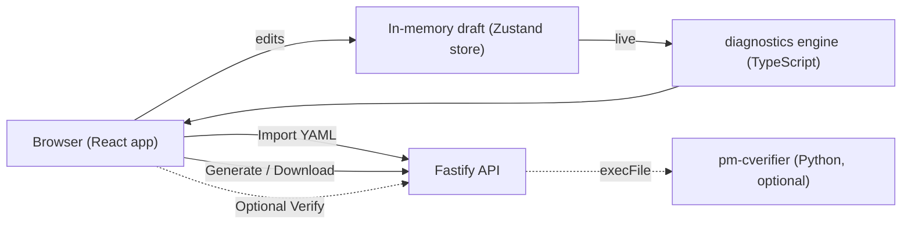

# Configuration GUI (`config-gui`)

!!! note "Learning objectives"
    After reading this page you will understand:

    - What the Config Builder GUI is and how it relates to `pm-config-gen`,
      `pm-cverifier`, and the engine itself
    - Every way to run the application — a single container command, a pre-built
      image artifact, or a local development setup — and what each one needs
    - How the interface is organised: the three-pane layout, personas, tabs, and
      the live diagnostics drawer
    - The core exchange concepts each tab configures, with links to the reference
      chapters that explain them in depth
    - How to add symbols with the IPO dialog, configure market makers, and read
      the effective-value Symbol Overview
    - How to import, validate, and export a configuration
    - How to deploy the GUI in production and troubleshoot common problems

!!! info "About the figures on this page"
    Blocks marked **📷 Figure N** are placeholders indicating where a UI
    screenshot should be added, together with a short description of what to
    capture and a suggested asset path under
    `docs/user-guide/images/config-gui/`. Replace each block with the image and
    an italic caption once the screenshots are taken.

## Overview

The **Config Builder** (`config-gui`) is a browser-based application for
creating, importing, editing, validating, and exporting an
[`engine_config.yaml`](01-configuration.md) file interactively.

It is a **companion to**, not a replacement for, the
[`pm-config-gen`](01-configuration.md#generate-configs-with-pm-config-gen) CLI.
Both produce the same file format, but they suit different situations:

| Use the… | when you want to… |
|---|---|
| **GUI** (`config-gui`) | build a config by filling in forms, see mistakes highlighted as you type, import and edit an existing file, or learn the schema through inline help. |
| **CLI** (`pm-config-gen`) | script config generation in CI, or drive it from a shell with repeatable flags. |

The GUI adds three things the CLI cannot offer: **live cross-field validation**
(undefined risk levels, port collisions, out-of-order schedules, and more),
**progressive disclosure** so beginners see only a handful of fields while
experts see everything, and a full **round-trip import** of existing configs.

!!! info "Where it lives"
    The application is a self-contained Node.js/TypeScript project in the
    `config-gui/` directory at the repository root. It is independent of the
    Python engine and needs no Python to run — with one optional exception, the
    [server-side verification](#optional-server-side-verification) feature.

Its output is held to the same correctness bar as the CLI: a golden-file test
pipes generated configs through the engine's own `load_engine_config()` parser,
so anything the GUI exports is guaranteed to load (see
[How the GUI stays valid](#how-the-gui-stays-valid)).

!!! note "📷 Figure 1 — The main window"
    _Screenshot placeholder._ Capture the application in light theme on the
    **Basics** tab, showing the full three-pane layout (navigation list on the
    left, the active panel in the centre, the diagnostics drawer on the right)
    and the top bar (persona switcher, **Import**, **New**, theme toggle,
    **Save**). Suggested file: `images/config-gui/fig-01-main-window.png`.

## Prerequisites

What you need depends on how you intend to run the application.

### Running the container (recommended for most users)

| Requirement | Notes |
|---|---|
| **Podman ≥ 4** or **Docker ≥ 24** | Podman is preferred; Docker works equally well. The `make up` target auto-detects which one is installed. |
| **Compose plugin** | `podman compose` (Podman 5+ built-in, or `podman-compose`) or `docker compose` (the V2 plugin — not the legacy `docker-compose` binary). Verify with `docker compose version` / `podman compose version`. |
| **GNU Make** | Only needed for the `Makefile` targets. On macOS, install via Homebrew (`brew install make`) or the Xcode Command Line Tools. |
| **macOS only** | A Podman machine must be running. `make up` starts it automatically; to do it manually run `podman machine init && podman machine start`. |

No Node.js, npm, or Python is required on the host for the container path — every
build step happens inside the image.

### Local development

| Requirement | Notes |
|---|---|
| **Node.js ≥ 20** | Developed and tested on Node 22 and Node 26. Install via [nvm](https://github.com/nvm-sh/nvm), [fnm](https://github.com/Schniz/fnm), or your OS package manager. |
| **npm ≥ 10** | Bundled with Node.js ≥ 20. Verify with `npm --version`. |
| **GNU Make** | Optional but convenient for the `Makefile` targets. |

### Optional: server-side verification

Needed only if you want the **Verify with pm-cverifier** button on the Review
tab to work:

| Requirement | Notes |
|---|---|
| **Python environment** | The repository's Poetry environment installed at the repo root (`poetry install`). |
| **`pm-cverifier` on `PATH`** | Provided by the Poetry env, or set `CVERIFIER_COMMAND="poetry run pm-cverifier"` so the backend can locate it. See [Config Verifier](23-config-verifier.md). |

### Browser

Any modern browser (Chrome/Edge ≥ 110, Firefox ≥ 115, Safari ≥ 16). The
application uses no browser extensions and runs fully offline once loaded.

## Running the application

There are three supported ways to start the GUI, in increasing order of setup
effort. Pick the one that matches your situation.

| Method | Best for | Needs | URL |
|---|---|---|---|
| [Container stack](#option-1-one-command-with-the-container-stack) | Most users; production | Podman/Docker + Make | `http://localhost:8080` |
| [Pre-built image artifact](#option-2-a-pre-built-image-artifact) | Offline hosts, no repo clone | Podman/Docker only | `http://localhost:8080` |
| [Local development](#option-3-local-development) | Contributing to the GUI itself | Node.js + npm | `http://127.0.0.1:5174` |

### Option 1 — One command with the container stack

If you have a repository checkout and a container runtime, this is the fastest
path. From the `config-gui/` directory:

```bash
make up
```

`make up` auto-detects Podman or Docker (preferring Podman), starts the Podman
machine on macOS if needed, builds the image, and starts the stack in the
background. Open **http://localhost:8080** once the build completes.

```bash
make down     # stop and remove the stack
make logs     # follow the container log
make ps       # show stack status
make help     # list every available target
```

Prefer to drive the runtime directly? `docker compose up --build` (or
`podman compose up --build`) does the same thing. Deployment details — the
image layout, environment variables, and building behind a corporate proxy —
are covered under [Deployment and operations](#deployment-and-operations).

### Option 2 — A pre-built image artifact

For a host without a repository clone — or to ship a ready-to-run image — the
distributable artifact is a self-contained OCI image archive built with
`make dist`:

```
dist/edumatcher-config-gui-<version>.tar
```

The tar contains everything the application needs at runtime (Node.js runtime,
compiled frontend, and the Fastify backend) with no external dependencies. Load
and run it on the target host:

```bash
# Podman
podman load  --input edumatcher-config-gui-<version>.tar
podman run -d --name config-gui -p 8080:8080 edumatcher-config-gui:<version>

# Docker
docker load  --input edumatcher-config-gui-<version>.tar
docker run -d --name config-gui -p 8080:8080 edumatcher-config-gui:<version>
```

The `load` command prints the exact image tag, e.g. `edumatcher-config-gui:1.0.0`.
Open **http://localhost:8080**. Stop and remove with
`podman stop config-gui && podman rm config-gui` (or the `docker` equivalents).
Pass any [backend environment variable](#backend-environment-variables) with
`-e`, for example `-e CORS_ORIGIN="https://myhost.example"`.

!!! note "No Node.js or npm required"
    The tar archive is fully self-contained. The host only needs Podman or
    Docker — no Node.js, no npm, and no repository clone.

### Option 3 — Local development

To hack on the GUI, run the two processes (the Fastify **API** and the Vite
**web** dev server) from a checkout:

```bash
cd config-gui
npm install
npm run dev          # starts the API (port 5175) and the web UI (port 5174)
```

Open **http://127.0.0.1:5174**. The Vite dev server hot-reloads on save and
proxies `/api/*` to the backend, so you only ever open the `5174` URL.

For separate logs, run the processes in two terminals with `npm run dev:server`
and `npm run dev:web` (or `make dev-server` / `make dev-web`). Developer-facing
details — project layout, tests, and how to keep the GUI in sync with the
engine — live in the project's
[`config-gui/README.md`](https://github.com/johan162/EduMatcher/blob/main/config-gui/README.md).

## A tour of the interface

The window is a persistent **three-pane layout** designed so that you always
know what to edit, what you are editing, and what still needs attention.

```
┌─────────────────────────────────────────────────────────────────────┐
│  Top bar:  [Persona ▾]                     Import  New  ☾  Save       │
├───────────────┬─────────────────────────────────┬────────────────────┤
│  Navigation   │        Active panel             │   Diagnostics      │
│  (tab list    │   (fields for the selected      │   drawer           │
│   with status │    tab / master–detail editor)  │   (errors,         │
│   glyphs)     │                                 │    warnings, info) │
└───────────────┴─────────────────────────────────┴────────────────────┘
```

- **Top bar** — the [persona](#personas) switcher, **Import** (load an existing
  YAML file), **New** (start a blank draft, with a confirmation), the light/dark
  **theme toggle** (☾ / ☀), and **Save** (flushes the autosaved draft to your
  browser). The draft is autosaved to `localStorage` continuously, so a refresh
  or crash never loses work.
- **Navigation** — the list of [tabs](#the-tabs-at-a-glance). Each carries a
  status glyph: `✓` valid, `!` has warnings, `✗` has errors, `—` optional and
  untouched. Tabs above your current persona are hidden entirely, not disabled.
- **Active panel** — the form for the selected tab. Large tabs (Symbols,
  Auxiliary Gateways) use a **master–detail** sub-layout: a list on the left, an
  editor for the selected item on the right.
- **Diagnostics drawer** — always visible; it lists *every* current issue across
  the *whole* configuration, not just the active tab, each with a **Jump →**
  action that navigates to and highlights the offending field(s). See
  [Diagnostics and live validation](#diagnostics-and-live-validation).

Mandatory fields carry a red asterisk and a red left border; optional fields
show their default as ghost placeholder text until you set them. Every
non-obvious field has an **(i) help popover** giving a one-paragraph explanation
and the equivalent `pm-config-gen` flag.

## Personas

A single global **persona** setting controls how much of the field surface is
visible. It is a *view filter*, never a data filter: switching personas never
discards data, and a higher-tier value set by import (or by a previous session
at a higher tier) is preserved and still exported even while hidden.

| Persona | Audience | Philosophy |
|---|---|---|
| **Beginner** | A first-time student standing up a classroom exchange | Show only what a minimal, safe exchange needs. Everything else uses safe defaults. |
| **Intermediate** | A TA or instructor tuning a scenario | Adds risk levels, circuit-breaker tuning, per-symbol overrides, indices, and the common auxiliary gateways. |
| **Expert** | A course author building the full environment | Everything: combos, per-gateway market-maker overrides, BALF/API gateways, engine tuning, and deterministic seeding. |

Because persona gates which tabs appear, the visible workspace grows as you move
up:

| Persona | Tabs shown |
|---|---|
| **Beginner** | Basics, Sessions & Schedule, Market Maker¹, Review & Export |
| **Intermediate** | …the above **plus** Risk & Collars, Circuit Breakers, Symbols, Indices, Auxiliary Gateways |
| **Expert** | …the above **plus** Combos, Engine Tuning |

¹ The **Market Maker** tab appears at any persona, but only once at least one
gateway has the `MARKET_MAKER` role.

!!! note "📷 Figure 2 — Persona switcher and theme toggle"
    _Screenshot placeholder._ Capture the top bar with the persona dropdown open
    showing Beginner / Intermediate / Expert, plus the theme toggle. A second
    capture in dark theme is useful to show both palettes.
    Suggested file: `images/config-gui/fig-02-persona-theme.png`.

## The tabs at a glance

| Tab | Persona | Configures | Reference chapter |
|---|---|---|---|
| **Basics** | Beginner | The symbol universe and the ALF gateway allowlist | [ALF gateway allowlist](01-configuration.md#alf-gateway-allowlist), [ALF gateway](24-alf-gateway.md) |
| **Sessions & Schedule** | Beginner | Whether the scheduler drives the trading day, and the phase times | [Auctions & Session Scheduling](06-auctions-scheduling.md) |
| **Risk & Collars** | Intermediate | The global collar band, named risk levels, and collar enforcement | [Price collars](12-risk-controls.md#price-collars) |
| **Circuit Breakers** | Intermediate | The halt ladder, reference window, and CB enforcement | [Circuit breakers](12-risk-controls.md#circuit-breakers) |
| **Market Maker** | Beginner¹ | Obligation defaults and startup quote seeding | [Market Making](14-market-maker.md) |
| **Symbols** | Intermediate | Per-symbol overrides for every setting, plus MM quotes | [Symbol universe](01-configuration.md#symbol-universe) |
| **Indices** | Intermediate | Cap-weighted index definitions and constituents | [Market Index](22-index.md) |
| **Combos** | Expert | Multi-leg startup seed orders | [Combo Orders](05-combos.md) |
| **Auxiliary Gateways** | Intermediate | Post-Trade, Market-Data, BALF, and API gateway processes | [RALF](18-post-trade.md), [CALF](20-market-data-feed.md), [BALF](25-balf-gateway.md), [API](21-api-gateway.md) |
| **Engine Tuning** | Expert | Low-level performance knobs (snapshot throttle) | [`snapshot_interval_sec`](01-configuration.md#snapshot_interval_sec) |
| **Review & Export** | Beginner | Diagnostics summary, YAML preview, download, and verify | [Config Verifier](23-config-verifier.md) |

¹ Shown only when a `MARKET_MAKER` gateway exists.

The rest of this chapter walks through the concepts behind these tabs. If you
just want to produce a working file quickly, follow the
[market-maker workflow](#a-workflow-for-a-new-market-maker) and then jump to
[Reviewing and exporting](#reviewing-and-exporting).

## Basics: symbols and gateways

The **Basics** tab is the mandatory foundation: at least one **symbol** and one
**gateway** are required before anything can be exported.

- **Symbols** are the instruments that trade on the exchange. Add them with the
  [IPO dialog](#symbols-and-the-ipo-dialog); names are uppercased automatically
  and must be unique.
- **Gateways** are the participant sessions permitted to connect, each with a
  **role** — `TRADER`, `MARKET_MAKER`, or `ADMIN`. Roles determine which
  commands a session may send; see
  [Role Privileges](01-configuration.md#role-privileges) and the
  [ALF gateway](24-alf-gateway.md) chapter. A `MARKET_MAKER` gateway unlocks the
  Market Maker tab and quote seeding; an `ADMIN` gateway can issue exchange-wide
  halt/resume commands (see
  [ADMIN-role operator controls](12-risk-controls.md#admin-role-operator-controls)).

At **Expert** persona, each `MARKET_MAKER` gateway row shows a **⚙ Advanced**
button — see [per-gateway market-maker overrides](#layer-3-per-gateway-per-symbol-overrides).

!!! note "📷 Figure 3 — The Basics tab"
    _Screenshot placeholder._ Capture the Basics tab showing the symbols tag
    input with a few symbols and the gateways table with mixed roles (a TRADER,
    a MARKET_MAKER, and an ADMIN), including the ⚙ button on the MM row (Expert
    persona). Suggested file: `images/config-gui/fig-03-basics.png`.

## Core concepts and workflows

### Symbols and the IPO dialog

Clicking **"+ Add symbol"** on the Basics or Symbols tab opens the
**"List a new symbol (IPO)"** dialog rather than a plain name field.

The mental model is that adding a symbol is like an
[initial public offering](12-risk-controls.md#day-one-ipo-behaviour): on the
very first tick the engine has no trade history, so you must supply the starting
prices explicitly — otherwise the collar and circuit-breaker
[reference prices](12-risk-controls.md#rolling-reference-window) have nothing to
anchor to. The dialog captures a single **reference price** and derives
everything that must agree with it (last-trade prices, and the market maker's
opening quote) in one place, so the book, the last price, and the risk anchors
all start consistent. See also
[Collar reference price selection](01-configuration.md#collar-reference-price-selection).

The dialog collects:

| Field | Purpose |
|---|---|
| **Symbol name** | Uppercased automatically; must be unique. |
| **Reference price** | The opening mid-price. Derives `last_buy_price` / `last_sell_price` and becomes the collar's static reference on day one. |
| **Tick decimals** | Price precision (0–8). Defaults to the global value. See [tick size](04-order-types.md). |
| **Outstanding shares** | Required if the symbol will be an [index](22-index.md) constituent; a sensible default is pre-filled. |
| **Market maker quotes** (Intermediate+) | One bid/ask per MM gateway. Left blank, the builder falls back to [mid-range seeding](#quote-seeding-mid-range-vs-explicit) or emits a null stub. |

!!! note "📷 Figure 4 — The IPO ‘List a new symbol’ dialog"
    _Screenshot placeholder._ Capture the dialog open with a reference price and
    tick decimals filled in, and (at Intermediate+) the market-maker quote rows
    visible. Suggested file: `images/config-gui/fig-04-ipo-dialog.png`.

### The Symbols workspace

The **Symbols** tab (Intermediate+) is a master–detail editor. The left list
holds every symbol; the right pane edits the selected one through sub-tabs:

| Sub-tab | Persona | Contents |
|---|---|---|
| **General** | Intermediate | Tick decimals, outstanding shares, last prices, assigned risk level |
| **Collar** | Intermediate | Per-symbol static/dynamic band overrides |
| **Circuit Breaker** | Expert | Per-symbol ladder overrides — see [Circuit breakers](#circuit-breakers) |
| **Market Maker** | Intermediate | Per-symbol obligation overrides |
| **MM Quotes** | Intermediate | Explicit opening quotes per MM gateway |

Two conveniences make it easy to check a symbol without losing your place:

- An **👁 eye icon** on each row in the left list opens the read-only
  [Symbol Overview](#symbol-overview) *without changing* the current selection —
  so you can peek at any symbol while editing another.
- An **Overview** button in the detail-pane header opens the same overview for
  the currently selected symbol.

!!! note "📷 Figure 5 — The Symbols workspace"
    _Screenshot placeholder._ Capture the Symbols tab: the left symbol list with
    the eye icons, and the detail pane showing the sub-tabs (General, Collar,
    Circuit Breaker, Market Maker, MM Quotes) with the **Overview** button
    top-right. Suggested file: `images/config-gui/fig-05-symbols.png`.

### Symbol overview

The **Overview** dialog is read-only and shows the **effective** values — what
the engine will actually use after all inheritance and merge rules are applied —
in one compact view, with each value annotated by its source. It consolidates
what is otherwise spread across five sub-tabs and several global defaults.

| Section | What it shows |
|---|---|
| **General** | Tick decimals (per-symbol override vs global), last buy/sell prices, outstanding shares, and the active risk level (assigned or inherited default). |
| **Collar (effective)** | The static and dynamic band percentages that will apply, each tagged with its source (`symbol override`, `level CORE`, `engine default`). Flags if collar enforcement is off globally. |
| **Circuit breaker (effective)** | The resolved reference window and full ladder. **Per-symbol overrides appear in accent colour**; inherited values are shown normally. Flags if CB enforcement is off globally. |
| **Market maker (effective)** | The resolved obligation (enforce/max-spread/min-qty) with source, any per-gateway overrides, and the effective opening quotes with an origin badge (`explicit`, `seeded`, or `fill in`). |
| **Memberships** | Which indices and combos reference this symbol — cross-references not otherwise visible from the Symbols tab. |

Use it as a final sanity check before exporting, or to diagnose why a symbol
behaves unexpectedly in the engine.

!!! note "📷 Figure 6 — The read-only Symbol Overview"
    _Screenshot placeholder._ Capture the overview dialog for a symbol that has
    a mix of inherited and overridden values, so the source annotations and the
    accent-coloured circuit-breaker overrides are visible.
    Suggested file: `images/config-gui/fig-06-symbol-overview.png`.

### Risk and collars

A **collar** rejects orders priced too far from a reference price, protecting the
book from fat-finger errors. The static band anchors to a session reference; the
dynamic band tracks near-live prices. The full mechanism — band definitions,
which orders are checked, and how it differs from circuit breakers — is
described in [Price collars](12-risk-controls.md#price-collars); order-level
behaviour is covered in [Order Types](04-order-types.md).

On the **Risk & Collars** tab (Intermediate+) you can:

- Set a **global band**, which creates the `DEFAULT` risk level applied to every
  symbol that does not specify its own.
- Define **named risk levels** (e.g. `CORE`, `HIGH_BETA`) that symbols reference
  by name — see
  [Global level profiles](12-risk-controls.md#global-level-profiles-l1l2l3-style)
  and [per-symbol risk-level assignment](01-configuration.md#per-symbol-risk-level-assignment).
- Toggle **collar enforcement** globally (`enforce_collars`). Because this tab is
  Intermediate, a Beginner draft keeps enforcement at its safe default (on).

Per-symbol band overrides live on the Symbols → **Collar** sub-tab and take
precedence over the level and global values.

### Circuit breakers

A **circuit breaker** halts trading in a symbol when it moves too far from its
rolling reference, then resumes after a cool-off. Each ladder level has a
**shift %** (how far triggers it), a **halt duration** (the cool-off), and a
**resumption mode** (`AUCTION` runs an uncross before continuous trading resumes;
`CONTINUOUS` reopens matching immediately). The complete model — the rolling
reference window, day-one behaviour, and resumption modes — is in
[Circuit breakers](12-risk-controls.md#circuit-breakers).

The **Circuit Breakers** tab (Intermediate+) presents the ladder as a table
(Level, Shift %, Halt, Rest of day, Resumption) plus the
[reference window](12-risk-controls.md#rolling-reference-window) and the global
`enforce_circuit_breakers` toggle. At **Expert** persona you can add or remove
ladder levels.

Per-symbol overrides live on the Symbols → **Circuit Breaker** sub-tab (Expert),
which mirrors the same table but treats blank cells as "inherit the global
ladder value". You can override the shift, the cool-off (including "rest of
day"), the resumption mode, and the reference window for a single symbol.

!!! note "📷 Figure 7 — The Circuit Breakers ladder"
    _Screenshot placeholder._ Capture the Circuit Breakers tab ladder table with
    L1/L2/L3, one level set to "rest of day", and the reference-window field.
    Suggested file: `images/config-gui/fig-07-circuit-breakers.png`.

### Sessions and schedule

A trading day moves through phases — pre-open, opening auction, continuous
trading, closing auction — driven by the [`pm-scheduler`](06-auctions-scheduling.md#the-session-scheduler-pm-scheduler)
process. The **Sessions & Schedule** tab (Beginner) toggles
[`sessions_enabled`](01-configuration.md#sessions_enabled) and, from Intermediate,
edits the [phase times](06-auctions-scheduling.md#configuring-the-schedule).

The GUI enforces that phase times are strictly increasing as you type — the same
rule the engine applies — so an out-of-order schedule is caught immediately
rather than at export. See [Session phases](06-auctions-scheduling.md#session-phases)
for what each phase means.

!!! tip "Sessions imply a running scheduler"
    Turning `sessions_enabled` on means the engine starts CLOSED and waits for
    `pm-scheduler` to drive transitions. If you enable sessions, remember to run
    the scheduler alongside the engine, or the market stays closed.

### Market makers

Market makers supply the two-sided quotes that give a symbol a tradeable book
from the first moment. The GUI models this in three independent layers plus a
quote-seeding mechanism. Understanding the layers avoids duplicate work and
confusion about which value "wins". The engine-side reference is
[Market Making](14-market-maker.md); obligation enforcement is detailed under
[MM obligations enforcement](14-market-maker.md#mm-obligations-enforcement).

#### Layer 1 — Global obligation defaults (Market Maker tab)

The **Market Maker tab** holds the exchange-wide defaults applied to every
symbol and every `MARKET_MAKER` gateway unless overridden:

- **Enforce MM obligations** — whether the engine checks quote-width and size
  compliance at all.
- **Max spread (ticks)** — the widest allowed bid–ask spread; wider quotes are
  rejected ([spread constraint](14-market-maker.md#spread-constraint)).
- **Min quantity** — the minimum displayed size on each side
  ([minimum size constraint](14-market-maker.md#minimum-size-constraint)).

This layer maps to `mm_obligation_defaults` in the YAML
([reference](01-configuration.md#market-maker-obligation-defaults)).

#### Layer 2 — Per-symbol obligation overrides (Symbols → Market Maker)

The Symbols → **Market Maker** sub-tab relaxes or tightens the obligation for one
instrument. `(inherit)` on a field writes nothing (the global default applies);
setting a value emits an `mm_obligation_defaults.symbols.<SYM>` entry that
overrides only that field. Use it when, say, a less liquid symbol needs a wider
allowed spread. See [per-symbol overrides](14-market-maker.md#per-symbol-overrides).

#### Layer 3 — Per-gateway, per-symbol overrides

At **Expert** persona, the **⚙ Advanced** dialog on each `MARKET_MAKER` gateway
row (Basics tab) provides the finest-grained control:

1. **Flat gateway overrides** — `enforce_mm_obligation`, `mm_max_spread_ticks`,
   `mm_min_qty` for *every symbol this gateway quotes*.
2. **Per-symbol table** — overrides for specific symbols on this gateway, written
   as `gateways.alf[*].mm_obligations.<SYM>` (the nested keys are
   `max_spread_ticks` / `min_qty`, without the `mm_` prefix — a format quirk the
   GUI handles for you).

The dialog also sets the gateway's
[**quote refresh policy**](14-market-maker.md#quote-refresh-policy) — when seeded
quotes are inactivated after a fill. The default `INACTIVATE_ON_ANY_FILL` suits
most scenarios.

**Precedence (highest to lowest):**

```
Per-gateway per-symbol  (mm_obligations.<SYM>)
  → Per-gateway flat    (gateway.mm_max_spread_ticks / mm_min_qty)
    → Per-symbol global (mm_obligation_defaults.symbols.<SYM>)
      → Global defaults (mm_obligation_defaults)
```

!!! note "📷 Figure 8 — Per-gateway ⚙ Advanced market-maker dialog"
    _Screenshot placeholder._ Capture the Advanced dialog (Expert persona) for a
    MARKET_MAKER gateway showing the quote refresh policy, the flat obligation
    overrides, and the per-symbol override table.
    Suggested file: `images/config-gui/fig-08-mm-advanced.png`.

#### Quote seeding: mid-range vs explicit

Before the engine starts there must be resting quotes in the book (see
[startup seeding](14-market-maker.md#startup-seeding-pre-loading-quotes-from-config)).
The GUI offers two ways to supply them, plus an automatic fallback.

**Option A — Explicit quotes (highest precedence).** On the Symbols → **MM
Quotes** sub-tab you enter a specific `bid_price` / `ask_price` / `bid_qty` /
`ask_qty` for each symbol × MM gateway pair. Every column header has an **(i)**
help popover; the most-asked-about one is **Seed once**:

> When on, the engine injects this quote only if it has no prior book state for
> the symbol, so a restart with existing history will not re-inject it. Turn it
> off to (re)seed on every startup regardless of history.

See [controlling when seeds apply](14-market-maker.md#controlling-when-seeds-are-applied-seed_once)
and [choosing TIF for seeds](14-market-maker.md#choosing-tif-for-seed-quotes).

**Option B — Global mid-range seeding.** On the Market Maker tab, set a **Seed
MM mid-range** (e.g. `100` to `300`). The builder computes one deterministic
midpoint and applies it to *every* symbol:

```
midpoint = (min + max) / 2     # arithmetic mean, snapped to the tick grid
bid      = midpoint − 1 tick
ask      = midpoint + 1 tick
```

!!! note "The same midpoint applies to every symbol"
    A mid-range of `200–220` gives every symbol a midpoint of `210`, so AAPL and
    TSLA both open with `bid: 209.99 / ask: 210.01` (at `tick_decimals = 2`). The
    range is *averaged into a single value*, not distributed across symbols. If
    you need different opening prices per symbol, use explicit quotes (Option A).

Two related switches (Intermediate+) accompany mid-range seeding:

- **Seed last prices from MM** — derives `last_buy_price` / `last_sell_price`
  from the same midpoint so the collar's static reference matches the opening
  quote. Requires a mid-range.
- **Seed placeholder last prices** — emits `last_buy_price: null` /
  `last_sell_price: null` for instruments whose reference price is managed
  externally.

At **Expert** persona, a **Deterministic seed** fixes the RNG seed for
reproducible classroom runs.

**Fallback — null stub.** If neither an explicit quote nor a mid-range is
supplied, the builder emits `bid_price: null` / `ask_price: null`. The Quote Stub
Review flags this and the Review tab blocks export until it is resolved.

#### A workflow for a new market maker

A logical order that avoids rework:

1. **Add a `MARKET_MAKER` gateway** (Basics). Give it a clear ID like `MM01`. At
   Expert, review its quote refresh policy in the ⚙ dialog.
2. **Set global obligation defaults** (Market Maker tab): max spread, min
   quantity, and whether to enforce. Leave defaults for a simple classroom
   exchange.
3. **Choose a seeding strategy.** *Quick:* set a mid-range (e.g. `100–100`) and
   enable **Seed last prices from MM**. *Realistic:* leave the mid-range unset
   and plan to enter explicit quotes per symbol.
4. **Add symbols** with the [IPO dialog](#symbols-and-the-ipo-dialog). If you
   chose explicit quotes, add one MM Quotes row per gateway for each symbol.
5. **Check the Quote Stub Review** (below) — every row must be green before
   export.
6. **Adjust per symbol** (optional) on the Symbols → Market Maker sub-tab, or
   per gateway in the ⚙ dialog.
7. **Verify with the Symbol Overview** before exporting.

#### The Quote Stub Review

The Market Maker tab's **Quote Stub Review** gives a go/no-go status for every
symbol × MM gateway pair:

| Status | Meaning | Action |
|---|---|---|
| ✓ quote defined | An explicit quote with both prices is set | None |
| ✓ seeded from mid-range | The mid-range will compute prices at export | None |
| ! fill in before starting the engine | Neither explicit nor seeded | Add a quote or set a mid-range |

Export is blocked while any row is unresolved.

!!! note "📷 Figure 9 — Market Maker tab and Quote Stub Review"
    _Screenshot placeholder._ Capture the Market Maker tab showing the obligation
    defaults, the mid-range seeding controls, and the Quote Stub Review table
    with a mix of statuses. Suggested file: `images/config-gui/fig-09-market-maker.png`.

### Indices

The **Indices** tab (Intermediate+) defines cap-weighted indices and their
constituents. Each constituent must be a configured symbol with
`outstanding_shares` set (the GUI flags any that are missing). The calculation
model and field reference are in [Market Index](22-index.md).

### Combos

The **Combos** tab (Expert) builds multi-leg startup seed orders — pairs,
spreads, hedged entries, and market-maker spreads. Prices are entered as decimal
display values and converted to ticks per each leg symbol's precision. See
[Combo Orders](05-combos.md) for the strategy background and
[the COMBO order type](04-order-types.md#combo) for lifecycle behaviour.

### Auxiliary gateways

The **Auxiliary Gateways** tab (Intermediate+) configures the optional network
services around the engine, each on its own sub-tab:

| Sub-tab | Persona | Process | Reference |
|---|---|---|---|
| Post-Trade | Intermediate | RALF — fills, drop-copy, audit | [Post-Trade (RALF)](18-post-trade.md) |
| Market-Data | Intermediate | CALF — top-of-book, trades, index | [Market Data Feed (CALF)](20-market-data-feed.md) |
| BALF | Expert | Binary ALF gateway | [BALF Gateway](25-balf-gateway.md) |
| API | Expert | REST/WebSocket gateway | [API Gateway](21-api-gateway.md) |

Enabling a gateway reveals its fields; disabling it keeps your values but
excludes the section from the exported file. **Ports are collision-checked
across every enabled gateway** — the diagnostics drawer warns if two services
would bind the same address and port.

### Engine tuning

The **Engine Tuning** tab (Expert) exposes low-level performance knobs that
rarely need changing. Currently that is the **snapshot interval**
([`snapshot_interval_sec`](01-configuration.md#snapshot_interval_sec)) — the
minimum seconds between published book snapshots for a busy symbol.

## Diagnostics and live validation

Every rule runs **live**, on each change, and again before export. Results
appear in three coordinated places:

- **Field markers** — a red/amber left border, an inline icon, and a tooltip on
  the offending field.
- **Tab glyphs** — each tab shows the worst severity it contains (`✗` > `!` >
  `✓` > `—`).
- **Diagnostics drawer** — the global list of every issue, each with **Jump →**
  to navigate to and briefly highlight the linked field(s). When a rule links
  two fields (for example a symbol's risk level and the level catalogue), both
  are highlighted together.

The rules mirror the CLI's own checks (undefined risk level, single gateway, no
ADMIN gateway, collars/CB disabled, sessions-with-default-schedule, port
collisions, out-of-order schedule) and add GUI-only structural checks (index
constituents, combo legs, unknown market-maker obligation symbols, and more).

**Export gate:** the Review tab's **Download** is disabled while any
**error**-severity diagnostic exists anywhere in the config. Warnings do not
block export but require a one-time acknowledgement.

!!! note "📷 Figure 10 — Diagnostics drawer with Jump →"
    _Screenshot placeholder._ Capture the diagnostics drawer listing a mix of
    errors and warnings, with a field highlighted after using **Jump →**.
    Suggested file: `images/config-gui/fig-10-diagnostics.png`.

## Importing an existing configuration

**Import** (top bar) loads an existing `engine_config.yaml` into the form so you
can edit it visually. The GUI maps the file directly into its internal model and
opens the Review tab first, reporting the health of what you loaded.

Anything the GUI does not model — a hand-added section, or a field from a newer
schema — is preserved verbatim in a per-section **"unmapped YAML" passthrough**
and re-emitted unchanged on export, so import → edit → export never silently
drops data. A banner marks any tab that carries unmapped content.

!!! note "Comments are not round-tripped"
    The GUI is a *structural* editor, not a text editor. It regenerates the
    header/comment block fresh (matching `pm-config-gen`'s convention) but does
    not preserve inline comments from the imported file.

!!! note "📷 Figure 11 — Import result on the Review tab"
    _Screenshot placeholder._ Capture the Review tab immediately after importing
    a sample config, showing the diagnostics summary and, if present, an
    "unmapped section preserved" banner.
    Suggested file: `images/config-gui/fig-11-import.png`.

## Reviewing and exporting

The **Review & Export** tab (Beginner) is the final pass:

1. **Diagnostics summary** — the full issue list grouped by tab.
2. **Output options** — the download filename and the
   "comment default fields" toggle (emits the full commented reference block,
   matching `pm-config-gen --comment-default-config-fields`).
3. **YAML preview** — a live, syntax-highlighted, read-only render of exactly
   what will be downloaded, with a copy-to-clipboard button. This preview *is*
   the dry-run view.
4. **Export actions:**
    - **Download** — writes `engine_config.yaml` (blocked while any error
      exists; warnings require a one-time acknowledgement).
    - **Verify with pm-cverifier** — optional; see
      [server-side verification](#optional-server-side-verification).

Once downloaded, the file is ready for the engine and its companion processes —
see [Running the Engine](03-running-the-engine.md) and, for a first end-to-end
run, [Getting Started](00-getting-started.md).

!!! note "📷 Figure 12 — Review & Export with YAML preview"
    _Screenshot placeholder._ Capture the Review tab showing the diagnostics
    summary, the syntax-highlighted YAML preview, and the Download / Verify
    actions. Suggested file: `images/config-gui/fig-12-review-export.png`.

## Deployment and operations

### Single container (recommended)

For production the Fastify backend can serve the compiled frontend, so the whole
application runs as **one container on one port** — no reverse-proxy juggling
between a static host and an API, and no CORS configuration because everything
is same-origin. `make up` (or `docker compose up --build`) is the entry point;
see [Running the application](#option-1-one-command-with-the-container-stack).

The image is multi-stage: it installs dependencies, builds the frontend, prunes
dev dependencies, and starts the API with `STATIC_DIR` pointed at the built
assets. The API serves the UI and falls back to `index.html` for client-side
routes.

### Manual production build

To run the pieces yourself:

```bash
cd config-gui
npm install
npm run build            # emits the static UI to apps/web/dist
STATIC_DIR="$PWD/apps/web/dist" HOST=0.0.0.0 PORT=8080 \
  npm run start --workspace @edumatcher/server
```

Alternatively host `apps/web/dist` on any static server and run the API
separately; then either reverse-proxy `/api` under the same origin or set
`CORS_ORIGIN` to the UI's origin.

### Backend environment variables

All optional, read by the Fastify server:

| Variable | Default | Purpose |
|---|---|---|
| `HOST` | `127.0.0.1` | API bind address (use `0.0.0.0` in containers) |
| `PORT` | `5175` | API port (`8080` in the container image) |
| `STATIC_DIR` | *(unset)* | Absolute path to the built UI; enables single-origin/single-container mode |
| `MAX_IMPORT_BYTES` | `1000000` | Maximum accepted import payload (1 MB) |
| `CVERIFIER_COMMAND` | `pm-cverifier` | Command for the optional verify endpoint, e.g. `"poetry run pm-cverifier"` |
| `CORS_ORIGIN` | `*` | Allowed CORS origin; restrict on shared deployments |
| `LOG_LEVEL` | `info` | Fastify log level |

### Building behind a corporate proxy or firewall

The build downloads npm packages from a registry. **The Docker build does not
inherit your host's npm or proxy settings** — it has its own network and an
empty npm config. Behind a proxy or a TLS-intercepting firewall, `npm install`
may **hang** (the connection is silently dropped) rather than fail fast.

First confirm the registry is reachable from inside a container:

```bash
docker run --rm node:22-slim sh -c "npm config set fetch-timeout 30000 && npm ping"
```

If that hangs, pass build arguments to route around it. `docker compose` picks
up your shell's proxy variables automatically:

| Build arg | Purpose |
|---|---|
| `HTTP_PROXY` / `HTTPS_PROXY` / `NO_PROXY` | Route npm through your corporate proxy |
| `NPM_REGISTRY` | Use a corporate mirror (Artifactory / Nexus) instead of the public registry |
| `NPM_STRICT_SSL` | Set to `false` **only** as a last resort for TLS interception when you cannot install the CA |

```bash
export HTTPS_PROXY=http://proxy.corp.example:8080
export NPM_REGISTRY=https://artifactory.corp.example/api/npm/npm-remote/
docker compose up --build
```

!!! tip "TLS interception (custom root CA)"
    If your proxy re-signs TLS with a corporate root CA, the cleaner fix than
    disabling `strict-ssl` is to trust that CA: copy the CA `.crt` into the image
    and set `NODE_EXTRA_CA_CERTS=/path/to/ca.crt` before `npm install`. The build
    also sets a fetch timeout, so a blocked network now fails in about two
    minutes with a clear error rather than hanging indefinitely.

### Optional: server-side verification

The Review tab's **Verify with pm-cverifier** button POSTs the generated YAML to
the backend, which shells out to [`pm-cverifier`](23-config-verifier.md) and
renders its authoritative report inline. It is optional and pluggable:

- If the tool is not installed, the endpoint returns `503` and the UI shows a
  clear "not available" message; nothing else is affected. The default container
  image does **not** include the Python toolchain, so this button is inactive
  there by design.
- To enable it, run the backend where `pm-cverifier` is on `PATH`, or set
  `CVERIFIER_COMMAND="poetry run pm-cverifier"`.
- The backend invokes the tool with a fixed argument array over a temporary file
  — never a shell string — so no user input is interpolated into a command line.

### Security notes

This is primarily a single-user local tool. Before exposing it on a shared
network:

- Drafts and any generated API keys live **only in the browser**
  (`localStorage`) and in the file you download. The backend does not persist
  drafts and does not log request/response bodies containing credentials.
- The only subprocess-spawning endpoint is `POST /api/config/verify`. Put it
  behind authentication and rate limiting on shared deployments, and set a
  restrictive `CORS_ORIGIN`.
- Import payloads are size-capped (`MAX_IMPORT_BYTES`) and parsed with a safe
  YAML schema.

## How the GUI stays valid

The GUI re-implements the `engine_config.yaml` schema in TypeScript and
serializes it with the same section ordering and comment conventions as
`pm-config-gen`. Because the format now has two implementations, a golden-file
test (`npm run verify:python`) generates representative configs and runs each
through the engine's real `load_engine_config()`. Keeping that check green is
what guarantees GUI output loads in the engine. The developer checklist for
keeping the two in sync lives in the
[`config-gui/README.md`](https://github.com/johan162/EduMatcher/blob/main/config-gui/README.md).

## Architecture at a glance



The application is two processes: a **web** frontend (Vite + React) that in
development proxies `/api/*` to the backend, and a **server** (Fastify) that
imports, validates, generates, and — optionally — verifies. In production the
server can also serve the built UI, collapsing the two into one container.

## Troubleshooting

| Symptom | Cause | Fix |
|---|---|---|
| **`docker compose up --build` hangs at `RUN npm install`** | Corporate proxy/firewall blocks the registry; the build does not inherit host settings | Confirm with `docker run --rm node:22-slim sh -c "npm config set fetch-timeout 30000 && npm ping"`, then pass proxy/registry build args — see [Building behind a corporate proxy](#building-behind-a-corporate-proxy-or-firewall). |
| **`make up` fails: neither podman nor docker found** | No container runtime on the host | Install Podman or Docker, or use [local development](#option-3-local-development). |
| **`make up` on macOS: podman machine not running** | The Podman VM is not started | `make up` starts it automatically; otherwise `podman machine init && podman machine start`. |
| **API calls fail in dev** (`ECONNREFUSED` / 404 on `/api`) | The backend is not running | Start `npm run dev:server`; the web dev server proxies `/api` to `http://127.0.0.1:5175`. |
| **`"root" option must be an absolute path`** on startup | `STATIC_DIR` is a relative path | Use an absolute path, e.g. `STATIC_DIR="$PWD/apps/web/dist"`. |
| **Blank page in production**, API works | UI not built or `STATIC_DIR` wrong | Run `npm run build`, then point `STATIC_DIR` at `apps/web/dist`. |
| **Client route (e.g. `/review`) 404s in production** | Static host without SPA fallback | Let the API serve the UI (`STATIC_DIR`) — it falls back to `index.html`. |
| **"pm-cverifier is not available"** in the Review tab | Verifier not on `PATH` (expected in the default container) | Optional; set `CVERIFIER_COMMAND="poetry run pm-cverifier"` or run where the tool is installed. |
| **`npm run verify:python` cannot import `edumatcher`** | Python env not installed | Run `poetry install` at the repository root. |
| **Import rejected as too large** | File exceeds `MAX_IMPORT_BYTES` (1 MB) | Raise the limit via the env var, or trim the file. |
| **Port already in use** | Another process holds `5174`/`5175`/`8080` | Change `PORT` (API) or `server.port` / proxy target in `config-gui/apps/web/vite.config.ts` (web). |
| **Imported config shows an "unmapped" banner** | The file has sections the GUI does not model | Expected — those sections are preserved read-only and re-emitted unchanged. |
| **Quote Stub Review shows "! fill in" after import** | No mid-range seeding and no explicit quotes for some symbols | Set a mid-range on the Market Maker tab, or enter explicit bid/ask on each flagged symbol's MM Quotes sub-tab. |
| **A tab you expected is missing** | It is above the current persona, or (Market Maker) no MM gateway exists | Raise the [persona](#personas), or add a `MARKET_MAKER` gateway. |

## See Also

- [Engine Configuration](01-configuration.md) — the `engine_config.yaml` format and the `pm-config-gen` CLI
- [Config Verifier (`pm-cverifier`)](23-config-verifier.md) — the authoritative validator behind the Verify button
- [Risk Controls](12-risk-controls.md) — collars, circuit breakers, and day-one (IPO) behaviour
- [Auctions & Session Scheduling](06-auctions-scheduling.md) — session phases and `pm-scheduler`
- [Market Making](14-market-maker.md) — obligations, quote lifecycle, and startup seeding
- [Order Types](04-order-types.md) — how orders interact with collars and circuit breakers
- [Combo Orders](05-combos.md) and [Market Index](22-index.md) — the Combos and Indices tabs
- [Example Engine Configs](81-example-configs.md) — reference configurations to import and study
- [Running the Engine](03-running-the-engine.md) — using the file you exported
