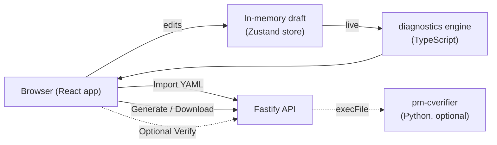

# Configuration GUI (`config-gui`)

!!! note "Learning objectives"
    After reading this page you will understand:

    - What the Config Builder GUI is and how it relates to `pm-config-gen`
    - How to install and run the GUI for local development (two processes)
    - How to build and deploy the GUI for production, including a single-container setup
    - Which environment variables control the backend
    - How the GUI guarantees its output is accepted by the engine
    - A troubleshooting guide for the most common setup problems

## Overview

The **Config Builder** is a browser-based application for creating, importing,
editing, validating, and exporting `engine_config.yaml` interactively. It is a
**companion to**, not a replacement for, the [`pm-config-gen`](01-configuration.md#generate-configs-with-pm-config-gen)
CLI: both target the same file format, but the GUI is the human-friendly path
with live validation, progressive disclosure by experience level, and built-in
help.

Use the GUI when:

- you prefer a form over remembering `pm-config-gen`'s many flags and compound
  spec strings;
- you want to **import an existing** `engine_config.yaml` and edit it visually;
- you want **live cross-field validation** (undefined risk levels, port
  collisions, out-of-order schedules, and more) as you type.

Use the CLI ([Configuration](01-configuration.md)) when you need a scriptable,
CI-friendly path.

!!! info "Where it lives"
    The application is a self-contained Node.js/TypeScript project in the
    `config-gui/` directory at the repository root. It is independent of the
    Python engine and does not need Python to run (with one optional exception —
    see [Optional: server-side verification](#optional-server-side-verification)).

### Key features

| Feature | Description |
|---|---|
| Three **personas** | *Beginner*, *Intermediate*, *Expert* control how much of the field surface is shown. Switching never discards data. |
| Ten **tabs** | Basics, Sessions & Schedule, Risk & Collars, Circuit Breakers, Market Maker, Symbols, Indices, Combos, Auxiliary Gateways, and Review & Export. |
| Live **diagnostics** | Every validation rule runs on each change, with a global drawer and "Jump →" to the offending field(s). |
| **Import / export** | Round-trips an existing config; YAML the GUI does not model is preserved as read-only passthrough. |
| **Light & dark themes** | Toggle in the top bar; remembered per browser, defaults to your OS setting. |
| **Guaranteed-valid output** | A cross-language test pipes generated configs through the engine's own `load_engine_config()`. |

### Listing symbols (the IPO dialog)

The **Basics** and **Symbols** tabs create a symbol through a structured
**“List a new symbol (IPO)”** dialog rather than a bare name field. This mirrors
the mental model that adding a symbol is an [initial listing
(IPO)](01-configuration.md#adding-or-removing-symbols): you enter one
**reference price** and the dialog derives the seeded `last_buy_price` /
`last_sell_price` and the market maker's opening quote from it, so the book, the
last price, and the collar/circuit-breaker references all agree from the first
order. `outstanding_shares` is required (pre-filled with a sensible default),
and at Expert persona you can attach multiple market makers. See
[Risk Controls - Day one (IPO) behaviour](12-risk-controls.md#day-one-ipo-behaviour).

## Architecture at a glance



The app is two processes:

| Process | Role | Default port |
|---|---|---|
| **web** (Vite + React) | The UI. In development it also proxies `/api/*` to the backend. | `5174` |
| **server** (Fastify) | Import / validate / generate / optional verify. In production it can also serve the built UI. | `5175` (dev), `8080` (container) |

## Requirements

- **Node.js ≥ 20** (developed and tested on Node 26) and **npm ≥ 10**.
- For the optional verification feature only: the repository's Python
  environment installed with Poetry (so `pm-cverifier` / `load_engine_config`
  are available).

## Development

Install dependencies once, from the `config-gui/` directory:

```bash
cd config-gui
npm install
```

Then run the two processes in **two terminals**:

```bash
# terminal 1 — API on http://127.0.0.1:5175
npm run dev:server

# terminal 2 — web app on http://127.0.0.1:5174
npm run dev:web
```

Open **http://127.0.0.1:5174**. The Vite dev server hot-reloads on save and
proxies API calls to the backend, so you only ever open the `5174` URL.

!!! tip "One-command dev"
    `npm run dev` starts both processes together. Two terminals is recommended
    while developing because the logs stay separate.

### Useful development commands

```bash
npm test            # unit tests (schema, yaml-codec, diagnostics)
npm run typecheck   # type-check every workspace
npm run build       # type-check + build the production frontend bundle
npm run verify:python  # generate sample configs and validate each with the
                       # real Python load_engine_config() (needs Poetry env)
```

The `verify:python` check is the authoritative correctness gate — it proves the
GUI's output is accepted by the same parser the engine uses.

## Production

There are two supported ways to deploy: a **single container** (recommended)
and a **manual** two-piece setup.

### Recommended: single container

For production the Fastify backend can serve the compiled frontend, so the whole
application runs as **one container on one port**. This is the simplest
production story: no reverse-proxy juggling between a static host and an API,
and no CORS configuration because everything is same-origin.

A `Dockerfile` and `docker-compose.yml` are included in `config-gui/`.

```bash
cd config-gui
docker compose up --build
```

Then open **http://localhost:8080**.

The image is multi-stage: it installs dependencies, builds the frontend, prunes
dev dependencies, and starts the API with `STATIC_DIR` pointed at the built
assets. The API serves the UI and falls back to `index.html` for client-side
routes.

#### Building behind a corporate proxy or firewall

The build step downloads npm packages from a registry. **This does not inherit
your host's npm or proxy settings** — the Docker build has its own network and
an empty npm config. Behind a corporate proxy or a firewall that intercepts TLS,
`npm install` may **hang** (the connection is silently dropped rather than
refused) instead of failing quickly.

First, confirm the registry is reachable from inside a container:

```bash
docker run --rm node:22-slim sh -c "npm config set fetch-timeout 30000 && npm ping"
```

If that hangs or times out, it is a network/proxy issue, not the image. The
`Dockerfile` and `docker-compose.yml` accept build arguments to work through it:

| Build arg | Purpose |
|---|---|
| `HTTP_PROXY` / `HTTPS_PROXY` / `NO_PROXY` | Route npm through your corporate proxy |
| `NPM_REGISTRY` | Use a corporate npm mirror (Artifactory / Nexus) instead of the public registry |
| `NPM_STRICT_SSL` | Set to `false` **only** as a last resort when the proxy does TLS interception and you cannot install its CA |

With `docker compose`, the proxy args pick up your shell environment
automatically, so this often just works:

```bash
export HTTP_PROXY=http://proxy.corp.example:8080
export HTTPS_PROXY=$HTTP_PROXY
export NO_PROXY=localhost,127.0.0.1
# optional corporate mirror:
export NPM_REGISTRY=https://artifactory.corp.example/api/npm/npm-remote/
docker compose up --build
```

With plain `docker build`, pass them explicitly:

```bash
docker build \
  --build-arg HTTPS_PROXY=http://proxy.corp.example:8080 \
  --build-arg NPM_REGISTRY=https://artifactory.corp.example/api/npm/npm-remote/ \
  -t edumatcher-config-gui .
```

!!! tip "TLS interception (custom root CA)"
    If your proxy re-signs TLS with a corporate root CA, the cleaner fix than
    disabling `strict-ssl` is to trust that CA in the build: copy the CA `.crt`
    into the image and set `NODE_EXTRA_CA_CERTS=/path/to/ca.crt` before
    `npm install`. Also prefer `NPM_REGISTRY` (a mirror) over the public
    registry when your firewall blocks outbound internet entirely.

The build now also sets a fetch timeout, so a blocked network fails in about two
minutes with a clear error rather than hanging indefinitely.

!!! warning "The optional verifier is not in the image"
    The container does not include the Python toolchain, so the
    "Verify with pm-cverifier" button returns a friendly *unavailable* message.
    Every other feature — including the GUI's own live diagnostics — works. If
    you need server-side verification in production, see
    [Optional: server-side verification](#optional-server-side-verification).

### Manual production build

If you prefer to run the pieces yourself:

```bash
cd config-gui
npm install
npm run build            # emits the static UI to apps/web/dist
```

Serve the static UI and run the API. The cleanest option is to let the API serve
the UI too, by pointing `STATIC_DIR` at the build output (use an absolute path):

```bash
STATIC_DIR="$PWD/apps/web/dist" HOST=0.0.0.0 PORT=8080 \
  npm run start --workspace @edumatcher/server
```

Alternatively, host `apps/web/dist` on any static web server and run the API
separately; in that case configure your reverse proxy so the browser reaches the
API under the same origin at `/api`, or set `CORS_ORIGIN` to the UI's origin.

### Backend environment variables

All are optional and read by the Fastify server:

| Variable | Default | Purpose |
|---|---|---|
| `HOST` | `127.0.0.1` | API bind address (use `0.0.0.0` in containers) |
| `PORT` | `5175` | API port (`8080` in the container image) |
| `STATIC_DIR` | *(unset)* | When set to the built UI directory (absolute path), the API serves the UI and enables single-origin/single-container mode |
| `MAX_IMPORT_BYTES` | `1000000` | Maximum accepted import payload (1 MB) |
| `CVERIFIER_COMMAND` | `pm-cverifier` | Command used by the optional verify endpoint, e.g. `"poetry run pm-cverifier"` |
| `CORS_ORIGIN` | `*` | Allowed CORS origin; restrict this on shared deployments |
| `LOG_LEVEL` | `info` | Fastify log level |

### Optional: server-side verification

The Review tab has a **Verify with pm-cverifier** button that POSTs the
generated YAML to the backend, which shells out to
[`pm-cverifier`](23-config-verifier.md) and shows its authoritative report. This
is optional and pluggable:

- If the tool is not installed, the endpoint returns `503` and the UI shows a
  clear "not available" message; nothing else is affected.
- To enable it, run the backend in an environment where `pm-cverifier` is on
  `PATH`, or set `CVERIFIER_COMMAND="poetry run pm-cverifier"`.
- The backend invokes the tool with a fixed argument array over a temporary
  file — never a shell string — so no user input is interpolated into a command
  line.

To include it in a container, base a custom image on one that already contains
the EduMatcher Python environment and set `CVERIFIER_COMMAND` accordingly; this
is left out of the default image to keep it small and Python-free.

## Security notes

This is primarily a single-user local tool. Before exposing it on a shared
network:

- Drafts and any generated API keys live **only in the browser** (`localStorage`)
  and in the file you download. The backend does not persist drafts and does not
  log request/response bodies containing credentials.
- The only subprocess-spawning endpoint is `POST /api/config/verify`. Put it
  behind authentication and rate limiting on shared deployments, and set a
  restrictive `CORS_ORIGIN`.
- Import payloads are size-capped (`MAX_IMPORT_BYTES`) and parsed with a safe
  YAML schema.

## How output stays valid

The GUI models the full `engine_config.yaml` schema in TypeScript and serializes
it with the same section ordering and comment conventions as `pm-config-gen`.
Because the format now has two implementations (Python and TypeScript), a
golden-file test (`npm run verify:python`) generates representative configs and
runs each through the engine's real `load_engine_config()`. Keep that check
green when changing either side. Developer-facing details, including the
"update both the generator and the GUI" checklist, live in the project's
[`config-gui/README.md`](https://github.com/johan162/EduMatcher/blob/main/config-gui/README.md).

## Troubleshooting

| Symptom | Cause | Fix |
|---|---|---|
| **`docker compose up --build` hangs at `RUN npm install`** | Corporate proxy/firewall blocks the npm registry; the build does not inherit host npm/proxy settings | Confirm with `docker run --rm node:22-slim sh -c "npm config set fetch-timeout 30000 && npm ping"`, then pass `HTTP_PROXY`/`HTTPS_PROXY`/`NPM_REGISTRY` build args — see [Building behind a corporate proxy or firewall](#building-behind-a-corporate-proxy-or-firewall). |
| **API calls fail in dev** (`ECONNREFUSED` / 404 on `/api`) | The backend is not running | Start `npm run dev:server`; the web dev server proxies `/api` to `http://127.0.0.1:5175`. |
| **`"root" option must be an absolute path`** on startup | `STATIC_DIR` was set to a relative path the server could not resolve | Use an absolute path, e.g. `STATIC_DIR="$PWD/apps/web/dist"`. |
| **Blank page in production**, API works | UI not built, or `STATIC_DIR` points at the wrong directory | Run `npm run build`, then point `STATIC_DIR` at `apps/web/dist`. |
| **Client route (e.g. `/review`) 404s in production** | Static host without SPA fallback | Let the API serve the UI (`STATIC_DIR`) — it falls back to `index.html` — or configure your static host to do the same. |
| **"pm-cverifier is not available"** in the Review tab | The verifier binary is not on the server's `PATH` (expected in the default container) | Optional feature; set `CVERIFIER_COMMAND="poetry run pm-cverifier"` or run the backend where the tool is installed. |
| **`npm run verify:python` cannot import `edumatcher`** | Python environment not installed | Run `poetry install` at the repository root first. |
| **Import rejected as too large** | File exceeds `MAX_IMPORT_BYTES` (1 MB) | Raise the limit via the env var, or trim the file. |
| **Port already in use** | Another process holds `5174`/`5175`/`8080` | Change `PORT` (API) or the `server.port` / proxy target in `config-gui/apps/web/vite.config.ts` (web). |
| **Imported config shows an "unmapped" banner** | The file contains sections the GUI does not model | This is expected — those sections are preserved read-only and re-emitted on export unchanged. |
| **Cross-origin errors on a split deployment** | UI and API served from different origins | Serve both same-origin (via `STATIC_DIR` or a reverse proxy), or set `CORS_ORIGIN` to the UI's origin. |

## See Also

- [Engine Configuration](01-configuration.md) — the `engine_config.yaml` format and the `pm-config-gen` CLI
- [Config Verifier (pm-cverifier)](23-config-verifier.md) — the authoritative validator used by the optional Verify button
- [Example Engine Configs](81-example-configs.md) — reference configurations to import and study
