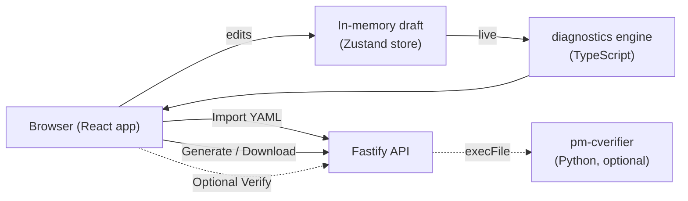

# Configuration GUI (`config-gui`)

!!! note "Learning objectives"
    After reading this page you will understand:

    - What the Config Builder GUI is and how it relates to `pm-config-gen`
    - How to add symbols using the IPO dialog and why it works that way
    - How market-maker obligations and quote seeding are layered together
    - A logical step-by-step workflow for configuring a new market maker
    - How the global mid-range seeding works (and its key limitation)
    - How to use the read-only Symbol Overview
    - How to install and run the GUI for local development (two processes)
    - How to build and deploy the GUI for production, including a single-container setup
    - Which environment variables control the backend
    - How the GUI guarantees its output is accepted by the engine
    - A troubleshooting guide for the most common setup problems


## Pre-Requirements

This depends on how the application will be run:

### Container workflow (recommended for production)

| Requirement | Notes |
|---|---|
| **Podman ≥ 4** or **Docker ≥ 24** | Podman is preferred; Docker works equally well. `make up` auto-detects which one is present. |
| **Compose plugin** | `podman compose` (via `podman-compose` or the built-in Podman 5+ plugin) or `docker compose` (the V2 plugin, not the legacy `docker-compose` binary). Run `docker compose version` / `podman compose version` to verify. |
| **GNU Make** | Required only if you use the `Makefile` targets. On macOS, install via Homebrew (`brew install make`) or Xcode Command Line Tools. |
| **macOS only** | A Podman machine must be initialised and running. `make up` starts it automatically; to set one up manually run `podman machine init && podman machine start`. |

No Node.js, npm, or Python is required on the host for the container path — all build steps happen inside the image.

### Local development

| Requirement | Notes |
|---|---|
| **Node.js ≥ 20** | Developed and tested on Node 22 and Node 26. Install via [nvm](https://github.com/nvm-sh/nvm), [fnm](https://github.com/Schniz/fnm), or your OS package manager. |
| **npm ≥ 10** | Bundled with Node.js ≥ 20. Verify with `npm --version`. |
| **GNU Make** | Optional but recommended to use the `Makefile` targets. |


### Optional: server-side verification

Required only if you want the **Verify with pm-cverifier** button on the Review tab to work:

| Requirement | Notes |
|---|---|
| **Python environment** | The repository's Poetry environment installed at the repository root (`poetry install`). |
| **`pm-cverifier` on PATH** | Provided by the Poetry env. Alternatively set `CVERIFIER_COMMAND="poetry run pm-cverifier"` so the backend can find it without activating the venv. |

### Browser

Any modern browser (Chrome/Edge ≥ 110, Firefox ≥ 115, Safari ≥ 16). The application uses no browser extensions and works fully offline once loaded.

## Downloading artifacts

If you are deploying on a host that does not have a repository clone — or you simply want a ready-to-run image without building it yourself — the distributable artifact is a self-contained OCI image archive.

### What the artifact is

A ontainer image as a single tar file:

```
dist/edumatcher-config-gui-<version>.tar
```

The tar is a standard OCI image archive. It contains everything the application needs to run — Node.js runtime, compiled frontend assets, and the Fastify backend — with no external dependencies at runtime.

### How to get it

The tar file is published alongside each release. Download the file for the version you want:

```
edumatcher-config-gui-<version>.tar
```

Replace `<version>` with the release version number, for example `edumatcher-config-gui-1.0.0.tar`.

### Loading and running the image

Once you have the tar file, load it into your local container runtime:

```bash
# Podman
podman load --input edumatcher-config-gui-<version>.tar

# Docker
docker load --input edumatcher-config-gui-<version>.tar
```

The load command prints the image name and tag, for example:

```
Loaded image: edumatcher-config-gui:1.0.0
```

Then start the container:

```bash
# Podman
podman run -d --name config-gui -p 8080:8080 edumatcher-config-gui:<version>

# Docker
docker run -d --name config-gui -p 8080:8080 edumatcher-config-gui:<version>
```

Open **http://localhost:8080**. To stop and remove the container:

```bash
podman stop config-gui && podman rm config-gui   # Podman
docker stop config-gui && docker rm config-gui   # Docker
```

### Passing environment variables

All [backend environment variables](#backend-environment-variables) are supported via `-e`:

```bash
podman run -d --name config-gui -p 8080:8080 \
  -e CORS_ORIGIN="https://myhost.example" \
  -e LOG_LEVEL=debug \
  edumatcher-config-gui:<version>
```

!!! note "No Node.js or npm required"
    The tar archive is fully self-contained. The host only needs Podman or Docker — no Node.js, no npm, and no repository clone.## Quick Start


## Running when you have the repo checked-out
1
The fastest way to get the application running is with a single command from the `config-gui/` directory:

```bash
make up
```

This detects whether you have Podman or Docker, builds the container image, and starts the stack in detached mode. Open **http://localhost:8080** once the build completes. To stop it, run `make down`.

If you do not have a container runtime, you can run the two processes directly:

```bash
cd config-gui
npm install
npm run dev          # starts both the API (port 5175) and the web UI (port 5174)
```

Then open **http://127.0.0.1:5174**.


## Overview

The **Config Builder** is a browser-based application for creating, importing,
editing, validating, and exporting `engine_config.yaml` interactively. It is a
**companion to**, not a replacement for, the [`pm-config-gen`](01-configuration.md#generate-configs-with-pm-config-gen)
CLI: both target the same file format, but the GUI is the human-friendly path
with live validation, progressive disclosure by experience level, and built-in
help.

Use the GUI when:

- you prefer a form over remembering `pm-config-gen`'s many flags and compound
  spec strings;
- you want to **import an existing** `engine_config.yaml` and edit it visually;
- you want **live cross-field validation** (undefined risk levels, port
  collisions, out-of-order schedules, and more) as you type.

Use the CLI ([Configuration](01-configuration.md)) when you need a scriptable,
CI-friendly path.

!!! info "Where it lives"
    The application is a self-contained Node.js/TypeScript project in the
    `config-gui/` directory at the repository root. It is independent of the
    Python engine and does not need Python to run (with one optional exception —
    see [Optional: server-side verification](#optional-server-side-verification)).

### Key features

| Feature | Description |
|---|---|
| Three **personas** | *Beginner*, *Intermediate*, *Expert* control how much of the field surface is shown. Switching never discards data. |
| Ten **tabs** | Basics, Sessions & Schedule, Risk & Collars, Circuit Breakers, Market Maker, Symbols, Indices, Combos, Auxiliary Gateways, and Review & Export. |
| Live **diagnostics** | Every validation rule runs on each change, with a global drawer and "Jump →" to the offending field(s). |
| **Import / export** | Round-trips an existing config; YAML the GUI does not model is preserved as read-only passthrough. |
| **Light & dark themes** | Toggle in the top bar; remembered per browser, defaults to your OS setting. |
| **Guaranteed-valid output** | A cross-language test pipes generated configs through the engine's own `load_engine_config()`. |


## Working with Symbols and Market Makers

This section explains the two features that operators most often need guidance
on: how to add symbols correctly, and how the market-maker configuration layers
together.

### Adding a symbol — the IPO dialog

Clicking **"+ Add symbol"** on either the Basics tab or the Symbols tab opens
the **"List a new symbol (IPO)"** dialog rather than a plain name field.

The mental model is that adding a symbol is like an
[initial listing (IPO)](12-risk-controls.md#day-one-ipo-behaviour): on the very
first tick, the engine has no trade history, so you must supply the starting
prices explicitly — otherwise the collar and circuit-breaker reference prices
have nothing to anchor to.

The dialog collects:

| Field | Purpose |
|---|---|
| **Symbol name** | Uppercased automatically; must be unique. |
| **Reference price** | The opening mid-price. Derives `last_buy_price` and `last_sell_price`. Becomes the collar's static reference on day one. |
| **Tick decimals** | Price precision for this symbol (0–8). Defaults to the global value. |
| **Outstanding shares** | Required if the symbol will be an index constituent; shown with a pre-filled default otherwise. |
| **Market maker quotes** (Intermediate+) | One bid/ask per MM gateway. If left blank the builder falls back to mid-range seeding (see below) or emits a null stub. |

By keeping reference price and opening quotes in one step, the dialog ensures
the book, last-price references, and risk-protection anchors all start from the
same consistent value.

### Market maker settings explained

The market-maker configuration has three independent layers. Understanding them
avoids duplicate work and confusion about which value "wins".

#### Layer 1 — Global obligation defaults (Market Maker tab)

The **Market Maker tab** holds exchange-wide defaults that apply to every symbol
and every MARKET_MAKER gateway unless overridden:

- **Enforce MM obligations** — whether the engine checks spread and size compliance at all.
- **Max spread (ticks)** — the maximum allowed bid–ask spread; wider quotes are rejected.
- **Min quantity** — the minimum displayed size required on each side of a quote.

Think of this layer as "what every market maker must do unless told otherwise."
It corresponds to `mm_obligation_defaults` in the YAML.

#### Layer 2 — Per-symbol obligation overrides (Symbols → Market Maker sub-tab)

Inside the Symbols tab, the **Market Maker sub-tab** lets you relax or tighten
the obligation for one particular instrument:

- `(inherit)` on any field means "use the global default" — nothing is written
  to the YAML for that field.
- Setting a value emits a `mm_obligation_defaults.symbols.<SYM>` entry that
  overrides only that field for that symbol.

Use this when, for example, a less liquid instrument needs a wider allowed
spread than the exchange-wide default.

#### Layer 3 — Per-gateway, per-symbol overrides (Basics → ⚙ Advanced dialog)

At **Expert** persona, each MARKET_MAKER gateway row in the Basics table shows
a **⚙ button**. The resulting dialog has two sections:

1. **Flat gateway overrides** — `enforce_mm_obligation`, `mm_max_spread_ticks`,
   `mm_min_qty` at the gateway level. These override the global defaults for
   *every symbol* this gateway quotes.
2. **Per-symbol table** — fine-grained overrides for specific symbols on this
   gateway, written as `gateways.alf[*].mm_obligations.<SYM>`. The nested YAML
   keys are `max_spread_ticks` / `min_qty` (no `mm_` prefix — a quirk of the
   engine config format the GUI handles transparently).

**Precedence (highest to lowest):**

```
Per-gateway per-symbol  (mm_obligations.<SYM>)
  → Per-gateway flat    (gateway.mm_max_spread_ticks / mm_min_qty)
    → Per-symbol global (mm_obligation_defaults.symbols.<SYM>)
      → Global defaults (mm_obligation_defaults)
```

The **Expert** dialog also exposes the **quote refresh policy** for the
gateway — when seeded quotes are inactivated after executions. The default
(`INACTIVATE_ON_ANY_FILL`) is correct for most scenarios.

#### Quote seeding — mid-range vs explicit quotes

Before the engine starts there must be resting quotes in the book. The GUI
provides two ways to supply them, plus an automatic fallback.

**Option A — Explicit quotes (highest precedence)**

On the Symbols tab, the **MM Quotes sub-tab** (Intermediate+) lets you enter a
specific `bid_price` / `ask_price` / `bid_qty` / `ask_qty` for each
symbol × MM gateway pair. The Quote Stub Review table on the Market Maker tab
shows **"✓ quote defined"** for any row that has an explicit quote with both
prices set.

The column headers in the MM Quotes table each carry an **"i" help icon**
explaining the field. The most important column to understand is **Seed once**:

> When on, the engine injects this quote only if it has no prior book state for
> the symbol, so a restart with existing history will not re-inject it. Turn off
> to (re)seed the quote on every startup regardless of history.

**Option B — Global mid-range seeding**

On the Market Maker tab, set a **Seed MM mid-range** (e.g. `100` to `300`). The
builder calculates a single deterministic midpoint and applies it to every symbol:

```
midpoint = (min + max) / 2     # arithmetic mean, snapped to the tick grid
bid      = midpoint − 1 tick
ask      = midpoint + 1 tick
```

The Quote Stub Review shows **"✓ seeded from mid-range"** for rows covered this way.

!!! note "The same midpoint applies to every symbol"
    A mid-range of `200–220` gives every symbol a midpoint of `210`, so AAPL
    and TSLA both open with `bid: 209.99 / ask: 210.01` (assuming
    `tick_decimals = 2`). The range is not distributed across symbols — it is
    averaged into a single value. If you need different opening prices per
    symbol, use explicit quotes (Option A) for those symbols.

**Additional mid-range seeding options** (Intermediate+):

- **Seed last prices from MM** — derives `last_buy_price` / `last_sell_price`
  from the same midpoint, so the collar's static reference matches the opening
  quote. Requires a mid-range to be set.
- **Seed placeholder last prices** — emits `last_buy_price: null` /
  `last_sell_price: null` when no mid-range or explicit price is available.
  Required for collar initialization on instruments where the reference price
  will be managed externally.

At **Expert persona**, the **Deterministic seed** field fixes the RNG seed for
reproducible classroom runs.

**Fallback — null stub**

If neither an explicit quote nor a mid-range is provided, the builder emits
`bid_price: null` / `ask_price: null`. The Quote Stub Review shows a
**"! fill in before starting the engine"** warning and the Review tab blocks
export with an error. Supply prices via the MM Quotes sub-tab or set a mid-range.

#### Suggested workflow: setting up a new market maker from scratch

**Step 1 — Add a MARKET_MAKER gateway (Basics tab)**

Add a gateway row, set its role to `MARKET_MAKER`, and give it a clear ID such
as `MM01`. At **Expert persona**, click ⚙ on the MM01 row to review or change
the **quote refresh policy** (default: `INACTIVATE_ON_ANY_FILL`).

**Step 2 — Set global obligation defaults (Market Maker tab)**

Set the exchange-wide **Max spread** and **Min quantity**, and decide whether to
enforce obligations. Leave the defaults as-is for a simple classroom scenario
(obligations off, 20 ticks, 100 shares).

**Step 3 — Decide on quote seeding**

*Quick classroom setup:* Set a **Seed MM mid-range** — for example `min: 100,
max: 100` for a round price of `100.00`. Enable **Seed last prices from MM** so
collar references match.

*Realistic multi-symbol setup:* Leave the mid-range unset. Use the IPO dialog in
Step 4 to set a per-symbol reference price, then supply explicit quotes on each
symbol's **MM Quotes sub-tab**.

**Step 4 — Add symbols**

Use **+ Add symbol / IPO dialog**. Enter the ticker and reference price. Set
`outstanding_shares` if using indices. If you chose explicit quotes, go to each
symbol's **MM Quotes sub-tab** and add one row per MM gateway.

**Step 5 — Review the Quote Stub Review (Market Maker tab)**

Every symbol × MM gateway pair must show a green status before you can export:

| Status | Meaning | Action needed |
|---|---|---|
| ✓ quote defined | Explicit bid/ask set | None |
| ✓ seeded from mid-range | Mid-range will compute prices at export | None |
| ! fill in before starting the engine | Neither explicit nor seeded | Add quotes or set a mid-range |

**Step 6 — Per-symbol adjustments (optional)**

If one symbol needs different spread/size rules than the global defaults, set
overrides on that symbol's **Market Maker sub-tab**. Leave fields at `(inherit)`
when the global is fine. For gateway-scoped per-symbol overrides (Expert), use
the ⚙ Advanced dialog's per-symbol table on the relevant gateway.

**Step 7 — Verify with the Symbol Overview**

Use the eye icon or the **Overview** button (see next section) to confirm all
effective values before exporting.

### Symbol overview — read-only effective-value summary

The Symbols tab has two ways to open the read-only **Overview** for any symbol:

- The **👁 eye icon** on any row in the left symbol list opens the overview
  *without changing* the currently selected symbol — you can peek at any symbol
  while still editing another.
- The **Overview button** in the symbol detail-pane header (top-right, above the
  sub-tabs) opens the overview for the currently selected symbol.

The dialog shows the **effective** values — what the engine will actually use
after all inheritance and merge rules are applied — in a single compact
read-only view:

| Section | What it shows |
|---|---|
| **General** | Tick decimals (source: per-symbol or global), last buy/sell prices, outstanding shares, active risk level (assigned or inherited default). |
| **Collar (effective)** | Static and dynamic band percentages, each annotated with its source (`symbol override`, `level CORE`, or `engine default`). Flags if collar enforcement is off globally. |
| **Circuit breaker (effective)** | Resolved reference window and the full halt ladder. **Per-symbol overrides shown in accent color**; inherited values shown normally. Flags if CB enforcement is off globally. |
| **Market maker (effective)** | Resolved obligations with source, any per-gateway overrides listed, and the effective opening quotes with an origin badge (`explicit`, `seeded`, or `fill in`). |
| **Memberships** | Which indices and combos reference this symbol — cross-references not visible elsewhere in the Symbols tab. |

The Overview never modifies data. Use it as a final sanity check before
exporting, or to diagnose why a symbol behaves unexpectedly.


## Architecture at a glance



The app is two processes:


## Development

Install dependencies once, from the `config-gui/` directory:

```bash
cd config-gui
npm install
```

Then run the two processes in **two terminals**:

```bash
# terminal 1 — API on http://127.0.0.1:5175
npm run dev:server

# terminal 2 — web app on http://127.0.0.1:5174
npm run dev:web
```

Open **http://127.0.0.1:5174**. The Vite dev server hot-reloads on save and
proxies API calls to the backend, so you only ever open the `5174` URL.

!!! tip "One-command dev"
    `npm run dev` starts both processes together. Two terminals is recommended
    while developing because the logs stay separate.

### Useful development commands

```bash
npm test            # unit tests (schema, yaml-codec, diagnostics)
npm run typecheck   # type-check every workspace
npm run build       # type-check + build the production frontend bundle
npm run verify:python  # generate sample configs and validate each with the
                       # real Python load_engine_config() (needs Poetry env)
```

The `verify:python` check is the authoritative correctness gate — it proves the
GUI's output is accepted by the same parser the engine uses.

## Production

There are two supported ways to deploy: a **single container** (recommended)
and a **manual** two-piece setup.

### Recommended: single container

For production the Fastify backend can serve the compiled frontend, so the whole
application runs as **one container on one port**. This is the simplest
production story: no reverse-proxy juggling between a static host and an API,
and no CORS configuration because everything is same-origin.

A `Dockerfile` and `docker-compose.yml` are included in `config-gui/`, and the
`Makefile` wraps the full container lifecycle. The easiest way to start is:

```bash
cd config-gui
make up
```

`make up` auto-detects whether Podman or Docker is installed (preferring Podman
when both are present), starts the Podman machine on macOS if it is not already
running, builds the image, and starts the stack in detached mode. Open
**http://localhost:8080** when it completes.

```bash
make down     # stop and remove the stack
make logs     # follow the container log
make ps       # show stack status
```

Run `make help` at any time for a full list of available targets.

If you prefer to drive the container runtime directly:

```bash
cd config-gui
docker compose up --build    # or: podman compose up --build
```

The image is multi-stage: it installs dependencies, builds the frontend, prunes
dev dependencies, and starts the API with `STATIC_DIR` pointed at the built
assets. The API serves the UI and falls back to `index.html` for client-side
routes.

#### Building behind a corporate proxy or firewall

The build step downloads npm packages from a registry. **This does not inherit
your host's npm or proxy settings** — the Docker build has its own network and
an empty npm config. Behind a corporate proxy or a firewall that intercepts TLS,
`npm install` may **hang** (the connection is silently dropped rather than
refused) instead of failing quickly.

First, confirm the registry is reachable from inside a container:

```bash
docker run --rm node:22-slim sh -c "npm config set fetch-timeout 30000 && npm ping"
```

If that hangs or times out, it is a network/proxy issue, not the image. The
`Dockerfile` and `docker-compose.yml` accept build arguments to work through it:

| Build arg | Purpose |
|---|---|
| `HTTP_PROXY` / `HTTPS_PROXY` / `NO_PROXY` | Route npm through your corporate proxy |
| `NPM_REGISTRY` | Use a corporate npm mirror (Artifactory / Nexus) instead of the public registry |
| `NPM_STRICT_SSL` | Set to `false` **only** as a last resort when the proxy does TLS interception and you cannot install its CA |

With `docker compose`, the proxy args pick up your shell environment
automatically, so this often just works:

```bash
export HTTP_PROXY=http://proxy.corp.example:8080
export HTTPS_PROXY=$HTTP_PROXY
export NO_PROXY=localhost,127.0.0.1
# optional corporate mirror:
export NPM_REGISTRY=https://artifactory.corp.example/api/npm/npm-remote/
docker compose up --build
```

With plain `docker build`, pass them explicitly:

```bash
docker build \
  --build-arg HTTPS_PROXY=http://proxy.corp.example:8080 \
  --build-arg NPM_REGISTRY=https://artifactory.corp.example/api/npm/npm-remote/ \
  -t edumatcher-config-gui .
```

!!! tip "TLS interception (custom root CA)"
    If your proxy re-signs TLS with a corporate root CA, the cleaner fix than
    disabling `strict-ssl` is to trust that CA in the build: copy the CA `.crt`
    into the image and set `NODE_EXTRA_CA_CERTS=/path/to/ca.crt` before
    `npm install`. Also prefer `NPM_REGISTRY` (a mirror) over the public
    registry when your firewall blocks outbound internet entirely.

The build now also sets a fetch timeout, so a blocked network fails in about two
minutes with a clear error rather than hanging indefinitely.

!!! warning "The optional verifier is not in the image"
    The container does not include the Python toolchain, so the
    "Verify with pm-cverifier" button returns a friendly *unavailable* message.
    Every other feature — including the GUI's own live diagnostics — works. If
    you need server-side verification in production, see
    [Optional: server-side verification](#optional-server-side-verification).

### Manual production build

If you prefer to run the pieces yourself:

```bash
cd config-gui
npm install
npm run build            # emits the static UI to apps/web/dist
```

Serve the static UI and run the API. The cleanest option is to let the API serve
the UI too, by pointing `STATIC_DIR` at the build output (use an absolute path):

```bash
STATIC_DIR="$PWD/apps/web/dist" HOST=0.0.0.0 PORT=8080 \
  npm run start --workspace @edumatcher/server
```

Alternatively, host `apps/web/dist` on any static web server and run the API
separately; in that case configure your reverse proxy so the browser reaches the
API under the same origin at `/api`, or set `CORS_ORIGIN` to the UI's origin.

### Backend environment variables

All are optional and read by the Fastify server:

| Variable | Default | Purpose |
|---|---|---|
| `HOST` | `127.0.0.1` | API bind address (use `0.0.0.0` in containers) |
| `PORT` | `5175` | API port (`8080` in the container image) |
| `STATIC_DIR` | *(unset)* | When set to the built UI directory (absolute path), the API serves the UI and enables single-origin/single-container mode |
| `MAX_IMPORT_BYTES` | `1000000` | Maximum accepted import payload (1 MB) |
| `CVERIFIER_COMMAND` | `pm-cverifier` | Command used by the optional verify endpoint, e.g. `"poetry run pm-cverifier"` |
| `CORS_ORIGIN` | `*` | Allowed CORS origin; restrict this on shared deployments |
| `LOG_LEVEL` | `info` | Fastify log level |

### Optional: server-side verification

The Review tab has a **Verify with pm-cverifier** button that POSTs the
generated YAML to the backend, which shells out to
[`pm-cverifier`](23-config-verifier.md) and shows its authoritative report. This
is optional and pluggable:

- If the tool is not installed, the endpoint returns `503` and the UI shows a
  clear "not available" message; nothing else is affected.
- To enable it, run the backend in an environment where `pm-cverifier` is on
  `PATH`, or set `CVERIFIER_COMMAND="poetry run pm-cverifier"`.
- The backend invokes the tool with a fixed argument array over a temporary
  file — never a shell string — so no user input is interpolated into a command
  line.

To include it in a container, base a custom image on one that already contains
the EduMatcher Python environment and set `CVERIFIER_COMMAND` accordingly; this
is left out of the default image to keep it small and Python-free.

## Security notes

This is primarily a single-user local tool. Before exposing it on a shared
network:

- Drafts and any generated API keys live **only in the browser** (`localStorage`)
  and in the file you download. The backend does not persist drafts and does not
  log request/response bodies containing credentials.
- The only subprocess-spawning endpoint is `POST /api/config/verify`. Put it
  behind authentication and rate limiting on shared deployments, and set a
  restrictive `CORS_ORIGIN`.
- Import payloads are size-capped (`MAX_IMPORT_BYTES`) and parsed with a safe
  YAML schema.

## How output stays valid

The GUI models the full `engine_config.yaml` schema in TypeScript and serializes
it with the same section ordering and comment conventions as `pm-config-gen`.
Because the format now has two implementations (Python and TypeScript), a
golden-file test (`npm run verify:python`) generates representative configs and
runs each through the engine's real `load_engine_config()`. Keep that check
green when changing either side. Developer-facing details, including the
"update both the generator and the GUI" checklist, live in the project's
[`config-gui/README.md`](https://github.com/johan162/EduMatcher/blob/main/config-gui/README.md).

## Troubleshooting

| Symptom | Cause | Fix |
|---|---|---|
| **`docker compose up --build` hangs at `RUN npm install`** | Corporate proxy/firewall blocks the npm registry; the build does not inherit host npm/proxy settings | Confirm with `docker run --rm node:22-slim sh -c "npm config set fetch-timeout 30000 && npm ping"`, then pass `HTTP_PROXY`/`HTTPS_PROXY`/`NPM_REGISTRY` build args — see [Building behind a corporate proxy or firewall](#building-behind-a-corporate-proxy-or-firewall). |
| **API calls fail in dev** (`ECONNREFUSED` / 404 on `/api`) | The backend is not running | Start `npm run dev:server`; the web dev server proxies `/api` to `http://127.0.0.1:5175`. |
| **`"root" option must be an absolute path`** on startup | `STATIC_DIR` was set to a relative path the server could not resolve | Use an absolute path, e.g. `STATIC_DIR="$PWD/apps/web/dist"`. |
| **Blank page in production**, API works | UI not built, or `STATIC_DIR` points at the wrong directory | Run `npm run build`, then point `STATIC_DIR` at `apps/web/dist`. |
| **Client route (e.g. `/review`) 404s in production** | Static host without SPA fallback | Let the API serve the UI (`STATIC_DIR`) — it falls back to `index.html` — or configure your static host to do the same. |
| **"pm-cverifier is not available"** in the Review tab | The verifier binary is not on the server's `PATH` (expected in the default container) | Optional feature; set `CVERIFIER_COMMAND="poetry run pm-cverifier"` or run the backend where the tool is installed. |
| **`npm run verify:python` cannot import `edumatcher`** | Python environment not installed | Run `poetry install` at the repository root first. |
| **Import rejected as too large** | File exceeds `MAX_IMPORT_BYTES` (1 MB) | Raise the limit via the env var, or trim the file. |
| **Port already in use** | Another process holds `5174`/`5175`/`8080` | Change `PORT` (API) or the `server.port` / proxy target in `config-gui/apps/web/vite.config.ts` (web). |
| **Imported config shows an "unmapped" banner** | The file contains sections the GUI does not model | This is expected — those sections are preserved read-only and re-emitted on export unchanged. |
| **Cross-origin errors on a split deployment** | UI and API served from different origins | Serve both same-origin (via `STATIC_DIR` or a reverse proxy), or set `CORS_ORIGIN` to the UI's origin. |
| **Quote Stub Review shows "! fill in" after import** | The imported config has no mid-range seeding and no explicit quotes for some symbols | Set a mid-range on the Market Maker tab, or open each flagged symbol's MM Quotes sub-tab and enter explicit bid/ask prices. |

## See Also

- [Engine Configuration](01-configuration.md) — the `engine_config.yaml` format and the `pm-config-gen` CLI
- [Config Verifier (pm-cverifier)](23-config-verifier.md) — the authoritative validator used by the optional Verify button
- [Example Engine Configs](81-example-configs.md) — reference configurations to import and study
- [Risk Controls — day-one IPO behaviour](12-risk-controls.md#day-one-ipo-behaviour) — why last prices are required
