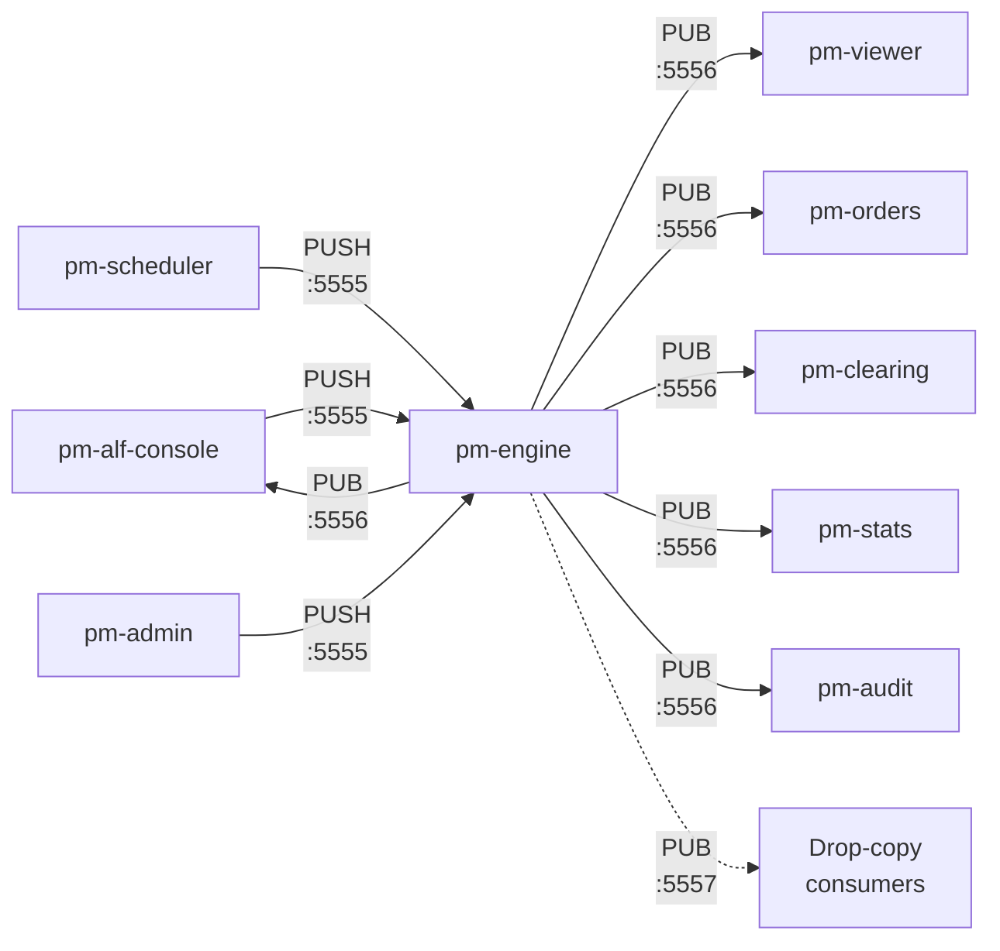
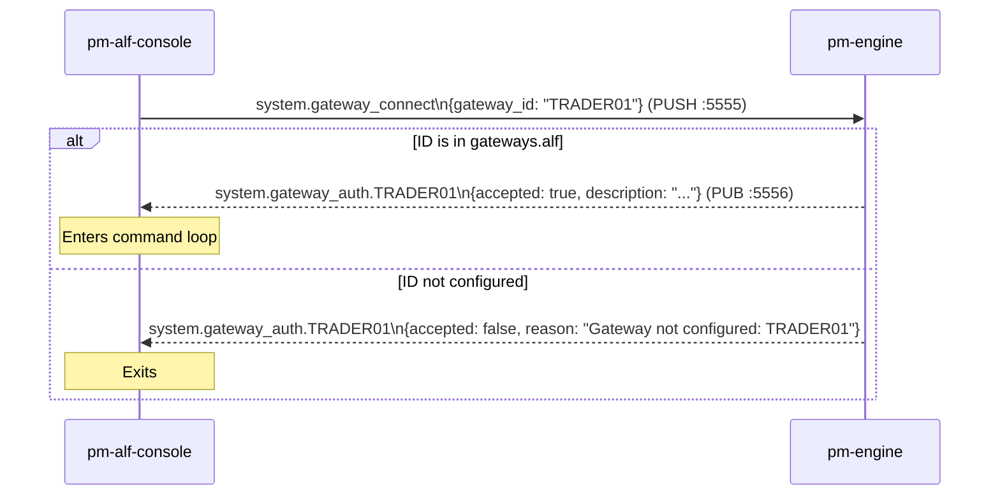

<!--
  GENERATED FILE - DO NOT EDIT.

  The reference sections below are rendered from spec/messages/*.yaml by
  `pm-msgen generate`. Edit the spec, not this file; `pm-msgen check` fails in
  CI when the two disagree.

  The narrative sections come from docs/user-guide/270-preamble.md, which IS
  hand-written and is the right place for anything the spec cannot state.
-->

# Message Reference

!!! note "Learning objectives"
    After reading this page you will understand:

    - What a message is in the context of a distributed bus system and how it
      differs from a function call or shared data structure
    - How messages are defined in real systems (schema registries, IDL, plain JSON)
      and the pragmatic trade-offs EduMatcher makes
    - What ZeroMQ requires of a message — frames, encoding, topic filters
    - Why ZeroMQ has no broker, and what that means for reliability and operational
      complexity compared with broker-based systems (Kafka, RabbitMQ, NATS)
    - The full catalogue of messages used in EduMatcher, their fields, and which
      processes produce and consume each one


!!! info "Where the rest of this page comes from"
    Everything below the narrative sections — the topic index, the record types
    and one section per message — is **generated from `spec/messages/*.yaml`**
    by `pm-msgen generate`, and `pm-msgen check` fails in CI when the page and
    the spec disagree.

    This file, `270-preamble.md`, is the hand-written half: bus concepts,
    transports and the CALF protocol, none of which the spec can state. Edit it
    freely. To change anything about a *message*, edit its spec file.

## Background — Messages in a Bus System

### What is a message?

A function call passes data synchronously inside a process: the caller blocks
until the callee returns.  A **message** is an asynchronous unit of data sent
between processes.  The sender does not wait for a response; it hands the
message to the transport layer and moves on.

Messages carry three things:

1. **Identity** — what kind of event this is (the topic or message type)
2. **Payload** — the data describing the event
3. **Routing metadata** — information the transport needs to deliver it
   (addresses, topic filters, sequence numbers)

### How message formats are defined in real systems

In production systems there are three common approaches to defining what a
message looks like:

**Schema registries (Avro, Protobuf, Thrift)**
: Messages are defined in an Interface Definition Language (IDL) file.
  A code generator produces serialisers and deserialisers for every target
  language.  The registry enforces compatibility: a new field may be added
  but existing fields cannot be removed or re-typed without a version bump.
  Kafka and gRPC use this model.

**Canonical JSON/XML schemas (JSON Schema, OpenAPI, AsyncAPI)**
: Message shapes are described in a human-readable document (like AsyncAPI
  for event-driven systems).  Any process that speaks JSON can produce or
  consume a message without a code generator.  The schema document is the
  contract; violations surface only at runtime unless you add a validation
  library.

**Hardcoded structures**
: The simplest approach — message shape is implicit in the code that creates
  and reads it. No IDL, no registry, no generator. Fast to build, but schema
  drift is invisible until something breaks at runtime.

EduMatcher uses a small, repository-local **IDL and code-generation** workflow.
The YAML definitions in `spec/messages/*.yaml` are the canonical message
contracts. `pm-msgen generate` produces the Python bindings, applicable C
artifacts, and the generated sections of this reference; `pm-msgen check`
fails when any generated output diverges from its specification. Message
producers and consumers still exchange ordinary two-frame JSON over ZeroMQ,
so the generated bindings remain readable alongside the wire format they
enforce.

### What ZeroMQ requires of a message

ZeroMQ does not impose a message format.  It sees messages as one or more
opaque **frames** — byte arrays that are sent and received atomically as a
group.  It is up to the application to define what those bytes mean.

EduMatcher uses exactly **two frames** for every message:

```
frame[0]  →  topic string, UTF-8 encoded
             e.g.  b"order.ack.GW01"

frame[1]  →  JSON payload, UTF-8 encoded
             e.g.  b'{"order_id": "3f2a...", "accepted": true}'
```

`frame[0]` doubles as the **PUB/SUB filter key**.  A subscriber that
registers for prefix `"order.ack.GW01"` will receive only messages whose
first frame starts with that string — all other messages are dropped by the
ZeroMQ layer before the application even sees them.  This prefix-match filter
is evaluated in the kernel's socket buffer, not in Python, so it adds almost
no CPU overhead regardless of how many message types are on the bus.

### ZeroMQ without a broker

Most messaging systems interpose a **broker** between producers and consumers:

```
Producer ──▶  Broker  ──▶  Consumer
```

The broker buffers messages, persists them to disk, routes them to the right
queues, and handles consumer acknowledgements.  Examples: RabbitMQ, Apache
Kafka, NATS JetStream, AWS SQS.

ZeroMQ is **brokerless**.  Producers connect directly to consumers (or to the
engine in PUSH/PULL):

```
Gateway ──PUSH──▶  Engine ──PUB──▶  Subscriber A
                                ├──▶  Subscriber B
                                └──▶  Subscriber C
```

There is no third process in the middle.  The advantages and disadvantages
flow directly from that choice:

**Advantages of no broker**

| Advantage | Detail |
|-----------|--------|
| **Lower latency** | No extra network hop; messages go directly from sender to receiver |
| **Fewer moving parts** | No broker process to install, configure, monitor, or restart |
| **No single point of failure** | The engine is the bus; if the engine is up, the bus is up |
| **Simpler deployment** | `pip install pyzmq` is the entire installation |

**Disadvantages of no broker**

| Disadvantage | Detail |
|--------------|--------|
| **No persistence** | If a subscriber is down when a message is published, the message is gone forever |
| **No guaranteed delivery** | PUB/SUB drops messages to slow subscribers without warning |
| **No replay** | You cannot re-consume old messages; there is no commit log |
| **Tight coupling on addresses** | Producers must know the address of the engine; adding a new engine address requires reconfiguring all clients |
| **No backpressure** | A fast publisher can overwhelm a slow subscriber; the subscriber's receive buffer fills and messages are silently discarded |

For EduMatcher these trade-offs are acceptable: the system runs on
localhost, sessions last hours not days, and correctness over time is handled
by the GTC persistence layer rather than the message bus.  For a real exchange,
the audit trail would be written by a Kafka consumer (guaranteed delivery,
infinite replay), and the matching engine would use a persisted queue for order
intake.


## Message structure

Every inter-process communication in EduMatcher is a two-frame ZeroMQ
multipart message.  ZeroMQ (ZMQ) is a high-performance messaging library;
a "multipart message" is simply an ordered list of byte-array frames sent
and received atomically:

| Frame | Content |
|---|---|
| `frame[0]` | Topic string (UTF-8) — used for PUB/SUB prefix filtering |
| `frame[1]` | JSON payload (UTF-8) |

## Transport channels

| Channel | ZMQ pattern | Address | Direction |
|---|---|---|---|
| Order submission | PUSH → PULL | `tcp://127.0.0.1:5555` | Gateway → Engine |
| Event broadcast | PUB → SUB | `tcp://127.0.0.1:5556` | Engine → all subscribers |
| Drop copy | PUB → SUB | `tcp://127.0.0.1:5557` | Engine → drop-copy consumers |

The dedicated drop-copy channel is implemented in
`src/edumatcher/engine/drop_copy.py` and is documented in more detail on the
[Drop Copy](200-drop-copy.md) page.



### `system.gateway_connect`

**Motivation:** Enables explicit control/state synchronization so clients do not depend on timing of unsolicited events.
**Published by:** Requesting client process (for example pm-alf-console, pm-admin, pm-viewer, pm-stats, bots, or API gateway) via PUSH :5555

Sent by an ALF gateway at startup to authenticate its gateway ID against
`engine_config.yaml`.



| Field | Type | Description |
|---|---|---|
| `gateway_id` | string | Gateway identifier being requested (e.g. `TRADER01`) |

**Reply:** `system.gateway_auth.{GW_ID}`

| Field | Type | Description |
|---|---|---|
| `gateway_id` | string | Gateway identifier |
| `accepted` | boolean | `true` if ID is configured in `gateways.alf` |
| `reason` | string | Rejection reason when `accepted=false` |
| `description` | string | Optional configured description for the gateway |

When `accepted=false`, the gateway must terminate and MUST NOT submit orders.


### `order.new`

**Motivation:** Keeps order/quote lifecycle state synchronized between the initiating client and all interested subscribers.
**Published by:** Requesting client process (for example pm-alf-console, pm-admin, pm-viewer, pm-stats, bots, or API gateway) via PUSH :5555

Sent by a gateway to submit a new order for matching.

| Field | Type | Description |
|---|---|---|
| `id` | string (UUID) | Unique order identifier |
| `symbol` | string | Instrument ticker, e.g. `MSFT` |
| `side` | `"BUY"` \| `"SELL"` | Order side |
| `order_type` | string | `MARKET`, `LIMIT`, `STOP`, `STOP_LIMIT`, `FOK`, `IOC`, `ICEBERG`, `TRAILING_STOP` |
| `tif` | `"DAY"` \| `"GTC"` \| `"ATO"` \| `"ATC"` \| `"FOK"` | Time-in-force |
| `quantity` | integer | Total order quantity |
| `remaining_qty` | integer | Unfilled quantity (equals `quantity` on submission) |
| `gateway_id` | string | Originating gateway identifier, e.g. `TRADER01` |
| `timestamp` | float | Unix epoch (seconds) |
| `status` | string | Initial status, always `"NEW"` |
| `price` | float \| null | Limit price (LIMIT, STOP_LIMIT, FOK, ICEBERG) |
| `stop_price` | float \| null | Trigger price (STOP, STOP_LIMIT) |
| `visible_qty` | integer \| null | Peak size for ICEBERG orders |
| `displayed_qty` | integer \| null | Current visible slice (ICEBERG) |
| `trail_offset` | float \| null | Offset from best price for `TRAILING_STOP` orders |
| `smp_action` | string \| null | Self-match prevention: `NONE`, `CANCEL_AGGRESSOR`, `CANCEL_RESTING`, `CANCEL_BOTH`. `null` when the client omitted `SMP=`, in which case the engine resolves it to the gateway's configured `gateways.alf[].smp_action` default (else `"NONE"`) before the order reaches the book — see [Configuration — Gateway Fields](010-configuration.md#gateway-fields) |
| `client_tag` | string \| absent | Optional client-supplied tag echoed back on every lifecycle event for this order (ack, fill, cancelled, expired). When present, subscribers can map events back to their submission without a FIFO scheme. |
| `request_tag` | string \| absent | Optional amend/cancel request tag echoed on the resulting `order.amended`, `order.cancelled`, or rejected `order.ack`. Unlike `client_tag`, it identifies one request against an order, not the order itself. |
| `arrival_seq` | integer | Engine-assigned monotonic arrival sequence that determines time priority within a price level. Not supplied by the client (`0` on submission); populated by the engine and echoed in outbound order snapshots (see `order.orders.{GW_ID}`). |
| `oco_group_id` | string \| null | Set once this order is linked into an OCO pair via `order.oco`; `null` on a plain submission |
| `combo_parent_id` | string \| null | Parent `ComboOrder.id` when this order is a combo child leg; `null` for a standalone order |
| `leg_index` | integer \| null | 0-based position within the parent combo's leg list; `null` for a standalone order |
| `origin` | `"ORDER"` \| `"QUOTE"` \| `"IMPLIED"` | How this order entered the book: a direct order submission, a market-maker quote leg, or an engine-implied order |
| `quote_id` | string \| null | Set when `origin` is `"QUOTE"`, echoing the originating `quote.new`'s identifier; `null` otherwise |

**Valid field combinations by order type:**

| `order_type` | `price` | `stop_price` | `visible_qty` | `trail_offset` | Notes |
|---|---|---|---|---|---|
| `MARKET` | — | — | — | — | Fills at best available; rejected if symbol halted |
| `LIMIT` | Required | — | — | — | Rests if no match; subject to collar check |
| `STOP` | — | Required | — | — | Triggers a market order when stop price touched |
| `STOP_LIMIT` | Required | Required | — | — | Triggers a limit order when stop price touched |
| `FOK` | Required | — | — | — | Fill fully immediately or cancel entirely |
| `IOC` | Optional | — | — | — | Fill as much as possible immediately, cancel remainder |
| `ICEBERG` | Required | — | Required | — | Shows only `visible_qty`; replenishes from hidden reserve |
| `TRAILING_STOP` | — | — | — | Required | Stop price follows best opposite-side price by `trail_offset` |


### `order.cancel`

**Motivation:** Keeps order/quote lifecycle state synchronized between the initiating client and all interested subscribers.
**Published by:** Requesting client process (for example pm-alf-console, pm-admin, pm-viewer, pm-stats, bots, or API gateway) via PUSH :5555

Sent by a gateway to cancel a resting order.

| Field | Type | Description |
|---|---|---|
| `order_id` | string (UUID) | ID of the order to cancel |
| `gateway_id` | string | Gateway that owns the order |


### `order.amend`

**Motivation:** Keeps order/quote lifecycle state synchronized between the initiating client and all interested subscribers.
**Published by:** Requesting client process (for example pm-alf-console, pm-admin, pm-viewer, pm-stats, bots, or API gateway) via PUSH :5555

Sent by a gateway to amend the price and/or quantity of a resting order.

| Field | Type | Description |
|---|---|---|
| `order_id` | string (UUID) | ID of the order to amend |
| `gateway_id` | string | Gateway that owns the order |
| `price` | float \| absent | New limit price (omit to keep current) |
| `qty` | integer \| absent | New total quantity (omit to keep current) |

At least one of `price` or `qty` must be present.

**Priority rules:**

- Quantity decrease only → priority **preserved** (timestamp unchanged)
- Price change or quantity increase → priority **lost** (new timestamp assigned)

**Reply:** `order.amended.{GW_ID}` on success, or `order.ack.{GW_ID}` with `accepted=false` on rejection.


### `quote.new`

**Motivation:** Keeps order/quote lifecycle state synchronized between the initiating client and all interested subscribers.
**Published by:** Requesting client process (for example pm-alf-console, pm-admin, pm-viewer, pm-stats, bots, or API gateway) via PUSH :5555

Sent by a market-maker gateway to submit or replace a two-sided quote.
Role requirements and MM obligation controls are documented in
[Configuration - Role Privileges](010-configuration.md#role-privileges).

| Field | Type | Description |
|---|---|---|
| `gateway_id` | string | Originating gateway identifier |
| `symbol` | string | Instrument ticker |
| `quote_id` | string \| absent | Optional client-provided quote label |
| `bid_price` | float | Bid price |
| `bid_qty` | integer | Bid quantity |
| `ask_price` | float | Ask price |
| `ask_qty` | integer | Ask quantity |
| `tif` | string | Quote leg time-in-force (`DAY` or `GTC`) |

Replies:

- `quote.ack.{GW_ID}`
- `quote.status.{GW_ID}`

### `quote.ack.{GW_ID}`

**Motivation:** Keeps order/quote lifecycle state synchronized between the initiating client and all interested subscribers.
**Published by:** pm-engine via PUB :5556

Acknowledgement of a `quote.new` submission.

| Field | Type | Description |
|---|---|---|
| `quote_id` | string | Client-provided quote label (echoed from request) |
| `accepted` | boolean | `true` = accepted; `false` = rejected |
| `reason` | string | Rejection reason (empty string when accepted) |
| `bid_order_id` | string (UUID) | Order ID of the bid leg *(present when accepted)* |
| `ask_order_id` | string (UUID) | Order ID of the ask leg *(present when accepted)* |

### `quote.status.{GW_ID}`

**Motivation:** Keeps order/quote lifecycle state synchronized between the initiating client and all interested subscribers.
**Published by:** pm-engine via PUB :5556

Published when the quote's lifecycle state changes (e.g. a fill inactivates the quote or a cancel removes it).

| Field | Type | Description |
|---|---|---|
| `quote_id` | string | Client-provided quote label |
| `status` | string | New quote state (see values below) |
| `reason` | string | Additional context (e.g. halt reason); empty when not applicable |

**Status values:**

| Value | Meaning |
|---|---|
| `ACTIVE` | Quote successfully placed on the book (both legs resting) |
| `INACTIVE_BID_FILLED` | Bid leg filled; ask leg auto-cancelled |
| `INACTIVE_ASK_FILLED` | Ask leg filled; bid leg auto-cancelled |
| `CANCELLED` | Quote removed (explicit cancel, kill switch, or halt) |

### `quote.cancel`

**Motivation:** Keeps order/quote lifecycle state synchronized between the initiating client and all interested subscribers.
**Published by:** Requesting client process (for example pm-alf-console, pm-admin, pm-viewer, pm-stats, bots, or API gateway) via PUSH :5555

Cancel the active quote for one symbol.

| Field | Type | Description |
|---|---|---|
| `gateway_id` | string | Gateway identifier |
| `symbol` | string | Instrument ticker |


## CALF TCP protocol (`pm-md-gwy`)

`pm-md-gwy` bridges the internal ZMQ bus documented above to a separate,
external-facing protocol: a newline-delimited UTF-8 text feed on TCP port
`5570` (`MSGTYPE|KEY=VALUE|KEY=VALUE\n` lines), independent of ZMQ topics and
payload shapes. It is not just a passthrough of the messages above — it
normalises, re-sequences, and reshapes them into CALF's own message types.

| Channel | Message type | Wildcard (`SYM=*`) | Baseline `SNAP`? | Carries |
|---|---|---|---|---|
| `TOP` | `MD` | Yes | Yes | Best bid/ask/last |
| `TRADE` | `TRADE` | Yes | No | Individual trade prints |
| `STATE` | `STATE` | Yes | Yes | Session/symbol state transitions |
| `INDEX` | `IDX` | No | Yes | Index level updates |
| `DEPTH` | `DEPTH` | No | Yes | Aggregated multi-level order book (Level 2) |
| `AUCTION` | `AUCTION` | Yes | No | Auction uncross result (equilibrium price/qty, imbalance) |
| `CB` | `CB` | No | Yes | Circuit-breaker halt/resume detail beyond `STATE`'s coarse transition |

Client requests are `HELLO` (authenticate), `SUB`/`UNSUB` (subscribe/cancel),
`RESUME` (replay one stream from a known sequence — repeatable, one per
stream), `SYMBOLS` (ask which instruments exist), `PING`, and `EXIT`. Gateway replies include `WELCOME`, a baseline
`SNAP` per new stream on the five channels that have one, the seven message
types above, periodic `HB` heartbeats, and `ERR` on protocol/subscription
violations.

Two behaviours are easy to get wrong from the table alone:

- **`MD` is a delta, and an empty value is meaningful.** Only changed fields
  are sent; an omitted field means *unchanged*. An explicitly empty `BID=` or
  `ASK=` means that book side is now **empty** and the client must discard the
  price rather than keep the last one it saw.
- **`RESUME` is per stream.** `LASTSEQ` describes one `(CH, SYM)` position, so
  a reconnecting client sends one `RESUME` per stream it was following. It is
  not a flag on `HELLO`.
- **Ask for the symbol universe; do not wait for it.** `WELCOME|SYMBOLS=` is
  optional and omitted entirely by a gateway started without a readable engine
  config. Send `SYMBOLS` after the handshake, and read its `COUNT` — an empty
  universe omits the list rather than sending it empty.
- **Read `REF=` before you format a price.** It carries each symbol's display
  precision as `SYM:DEC` tuples, on both `WELCOME` and the `SYMBOLS` reply, and
  is the only route a market data client has to that value. A gateway that
  predates the field omits it entirely, in which case assume `2` decimals —
  knowingly, because getting this wrong rounds every price the client shows.

The full protocol — every field table, the `WELCOME`/`SNAP` handshake,
sequence-gap detection and `RESUME` recovery, subscription limits, and the
complete error-code table — is maintained in one place to avoid drift:
[Market Data Feed (CALF)](240-calf-gateway.md), with the normative
wire-format specification in the
[CALF Protocol Reference](920-app-calf-protocol.md).


## See also

- [Processes](170-processes.md) — which process subscribes to which topic prefix
- [ALF Console](055-alf-console.md) — how participants receive fill, book, and risk events
- [Commands](160-exchange-commands.md) — `ExchangeCommandClient` methods and their underlying message topics
- [Drop Copy](200-drop-copy.md) — the separate :5557 socket for fill-only event feeds
- [Risk Controls](120-risk-controls.md) — `risk.*` message payloads in detail
- [CALF TCP Protocol](#calf-tcp-protocol-pm-md-gwy) — external market-data feed message types

## Topic index

Every topic in the system, and which process puts it on the wire.

| Topic | Family | Published by |
|---|---|---|
| `admin.action.{gateway_id}` | `admin` | `engine` |
| `auction.indicative.{symbol}` | `auction` | `engine` |
| `auction.result.{symbol}` | `auction` | `engine` |
| `book.snapshot_request` | `book` | `stats`, `gateway` |
| `book.{symbol}` | `book` | `engine` |
| `circuit_breaker.extend.{symbol}` | `circuit_breaker` | `engine` |
| `circuit_breaker.halt.{symbol}` | `circuit_breaker` | `engine` |
| `circuit_breaker.resume.{symbol}` | `circuit_breaker` | `engine` |
| `combo.ack.{gateway_id}` | `structure` | `engine` |
| `combo.status.{gateway_id}` | `structure` | `engine` |
| `depth.{symbol}` | `book` | `engine` |
| `drop_copy.event.{gateway_id}` | `drop_copy` | `engine` |
| `drop_copy.replay.{recipient_id}` | `drop_copy` | `engine` |
| `execution_report (no bus topic)` | `order` | `gateway` |
| `index.constituent_change` | `index` | `admin` |
| `index.constituent_change_ack.{gateway_id}` | `index` | `index` |
| `index.corp_action` | `index` | `admin` |
| `index.corp_action_ack.{gateway_id}` | `index` | `index` |
| `index.error.{gateway_id}` | `index` | `index` |
| `index.history.{gateway_id}` | `index` | `index` |
| `index.history_request` | `index` | `admin`, `api_gateway`, `gateway` |
| `index.rebalance` | `index` | `api_gateway` |
| `index.rebalance_ack.{gateway_id}` | `index` | `index` |
| `index.update` | `index` | `index` |
| `log.backfill.{sub_id}` | `log` | `log_server` |
| `log.backfill_request` | `log` | `log_client` |
| `log.error.{sub_id}` | `log` | `log_server` |
| `log.event.{sub_id}` | `log` | `log_server` |
| `log.lease_expired.{sub_id}` | `log` | `log_server` |
| `log.notify.{sub_id}` | `log` | `log_server` |
| `log.renew` | `log` | `log_client` |
| `log.renew_ack.{sub_id}` | `log` | `log_server` |
| `log.server_state` | `log` | `log_server` |
| `log.status.{sub_id}` | `log` | `log_server` |
| `log.status_request` | `log` | `log_client` |
| `log.subscribe` | `log` | `log_client` |
| `log.subscribe_ack.{sub_id}` | `log` | `log_server` |
| `log.unsubscribe` | `log` | `log_client` |
| `log.unsubscribe_ack.{sub_id}` | `log` | `log_server` |
| `oco.ack.{gateway_id}` | `structure` | `engine` |
| `oco.cancelled.{gateway_id}` | `structure` | `engine` |
| `order.ack.{gateway_id}` | `order` | `engine` |
| `order.amend` | `order` | `gateway` |
| `order.amended.{gateway_id}` | `order` | `engine` |
| `order.cancel` | `order` | `gateway` |
| `order.cancelled.{gateway_id}` | `order` | `engine` |
| `order.combo` | `order` | `gateway` |
| `order.combo_cancel` | `order` | `gateway` |
| `order.expired.{gateway_id}` | `order` | `engine` |
| `order.fill.{gateway_id}` | `order` | `engine` |
| `order.new` | `order` | `gateway` |
| `order.oco` | `order` | `gateway` |
| `order.oco_cancel` | `order` | `gateway` |
| `order.orders.{gateway_id}` | `order` | `engine` |
| `order.orders_request` | `order` | `admin`, `api_gateway`, `gateway` |
| `order.price_level_orders.{gateway_id}` | `order` | `engine` |
| `order.price_level_orders_request` | `order` | `admin` |
| `quote.ack.{gateway_id}` | `quote` | `engine` |
| `quote.cancel` | `quote` | `admin`, `api_gateway`, `gateway` |
| `quote.new` | `quote` | `gateway` |
| `quote.status.{gateway_id}` | `quote` | `engine` |
| `risk.cancel_symbol` | `risk` | `admin`, `api_gateway` |
| `risk.cancel_symbol_ack.{gateway_id}` | `risk` | `engine` |
| `risk.circuit_breaker_halt_all` | `risk` | `admin` |
| `risk.circuit_breaker_halt_all_ack.{gateway_id}` | `risk` | `engine` |
| `risk.circuit_breaker_resume_all` | `risk` | `admin` |
| `risk.circuit_breaker_resume_all_ack.{gateway_id}` | `risk` | `engine` |
| `risk.kill_switch` | `risk` | `admin`, `api_gateway`, `gateway` |
| `risk.kill_switch_ack.{gateway_id}` | `risk` | `engine` |
| `risk.kill_switch_gateway` | `risk` | `api_gateway` |
| `risk.kill_switch_gateway_ack.{gateway_id}` | `risk` | `engine` |
| `risk.kill_switch_global` | `risk` | `api_gateway` |
| `risk.kill_switch_global_ack.{gateway_id}` | `risk` | `engine` |
| `risk.symbol_halt` | `risk` | `admin`, `api_gateway` |
| `risk.symbol_halt_ack.{gateway_id}` | `risk` | `engine` |
| `risk.symbol_resume` | `risk` | `admin`, `api_gateway` |
| `risk.symbol_resume_ack.{gateway_id}` | `risk` | `engine` |
| `session.state` | `session` | `engine` |
| `session.transition` | `session` | `scheduler` |
| `session.transition_ack.{gateway_id}` | `session` | `engine` |
| `system.eod` | `system` | `engine` |
| `system.gateway_auth.{gateway_id}` | `system` | `engine` |
| `system.gateway_bye.{gateway_id}` | `system` | `engine` |
| `system.gateway_connect` | `system` | `admin`, `api_gateway`, `gateway` |
| `system.gateway_disconnect` | `system` | `admin`, `api_gateway`, `gateway` |
| `system.gateways.{gateway_id}` | `system` | `engine` |
| `system.gateways_request` | `system` | `admin`, `api_gateway` |
| `system.halt_status.{gateway_id}` | `system` | `engine` |
| `system.halt_status_request` | `system` | `api_gateway` |
| `system.position_request` | `system` | `gateway` |
| `system.position_snapshot.{gateway_id}` | `system` | `engine` |
| `system.quote_bootstrap.{gateway_id}` | `system` | `engine` |
| `system.quote_bootstrap_request` | `system` | `admin`, `api_gateway`, `gateway` |
| `system.quote_legs.{gateway_id}` | `system` | `engine` |
| `system.quote_legs_request` | `system` | `api_gateway`, `gateway` |
| `system.reference.{gateway_id}` | `system` | `engine` |
| `system.reference_reload` | `system` | `api_gateway` |
| `system.reference_reload_ack.{gateway_id}` | `system` | `engine` |
| `system.reference_request` | `system` | `api_gateway` |
| `system.risk_state.{gateway_id}` | `system` | `engine` |
| `system.risk_state_request` | `system` | `api_gateway` |
| `system.session_schedule.{gateway_id}` | `system` | `engine` |
| `system.session_schedule_request` | `system` | `admin`, `api_gateway` |
| `system.session_state_request` | `system` | `admin`, `api_gateway`, `gateway`, `scheduler` |
| `system.session_status.{gateway_id}` | `system` | `engine` |
| `system.symbols.{gateway_id}` | `system` | `engine` |
| `system.symbols_request` | `system` | `admin`, `api_gateway`, `gateway`, `stats` |
| `system.volume.{gateway_id}` | `system` | `engine` |
| `system.volume_request` | `system` | `admin` |
| `trade.executed` | `trade` | `engine` |

## Family `admin`

### Record types

#### `AdminActionScope`

What one admin command acted on, and what it did. Every field is optional because every action uses a different subset -- see the family header on why that is a stated limitation rather than a variant type. The name is inherited from the wire key rather than chosen: three of the seven fields are outcome counts rather than scope, which makes "AdminActionScope" a slightly generous reading of its own contents. It was kept because renaming the key is a wire change for every `/admin/monitor` client and buys nothing a reader can use.

| Field | Type | Presence | Rules | Description |
|---|---|---|---|---|
| `symbol` | `string` | omitted when unset | max_len 16 | The instrument, when the command named one. `kill_switch.self` used to emit this as an explicit `null` when unscoped while its siblings omitted the key -- two spellings of one absence, and this is now the second. |
| `target_gateway_id` | `string` | omitted when unset | max_len 32 | The participant acted upon, for `kill_switch.gateway`. |
| `level` | `string` | omitted when unset | max_len 32 | The circuit-breaker rung, for `circuit_breaker.trigger`. Not an enum: the ladder is per-symbol configuration, so the value set differs per deployment. Bounded to match `circuit_breaker.halt.level`, which carries the same name onward. |
| `note` | `string` | omitted when empty | max_len 256 | The operator's free-text reason, when one was supplied. Regime 4 to match `risk.kill_switch`'s own `note`, which is where this value arrives from -- a field that omits on one message and emits `""` on the next would be two answers to one question. |
| `cancelled_orders` | `int` | omitted when unset | ge 0, unit `dimensionless` | Outcome, on accepted kill-switch actions only. |
| `cancelled_quotes` | `int` | omitted when unset | ge 0, unit `dimensionless` | Outcome, on accepted kill-switch actions only. |
| `affected_gateways` | `int` | omitted when unset | ge 0, unit `dimensionless` | Outcome, on an accepted `kill_switch.global` only. |

### `admin.action.{gateway_id}`

**Published by:** `engine`

**Transport:** `engine_pub`

**Since:** 1.0

Engine to the admin monitor: one admin-gated command ran, who ran it, what it acted on, and whether it was accepted.

| Field | Type | Presence | Rules | Description |
|---|---|---|---|---|
| `gateway_id` | `string` | required | max_len 32 | The ADMIN caller. Topic-only; the body says the same thing as `initiator_gateway_id`. |
| `command_id` | `string` | required | max_len 64 |  |
| `initiator_gateway_id` | `string` | required | max_len 32 |  |
| `action` | enum: `kill_switch.self`, `kill_switch.gateway`, `kill_switch.global`, `kill_switch.symbol`, `circuit_breaker.trigger`, `circuit_breaker.resume` | required | — | Which command ran. The six the engine publishes, enumerated rather than left a free string: a seventh admin command that forgets to declare itself here fails loudly at its first invocation, which is better than appearing in the monitor as a value no client renders. The values look like topics and are not: `circuit_breaker.trigger` is the action behind `risk.symbol_halt`, and there is no `circuit_breaker.trigger` topic anywhere. |
| `scope` | [`AdminActionScope`](#adminactionscope) | required | — |  |
| `accepted` | `bool` | required | — |  |
| `reason` | `string` | defaults to `''` | max_len 512 | Why it was rejected; "" on an accepted action. |

!!! note

    This is the one topic in the system addressed to a gateway that is **not** for that gateway.

    The suffix names the ADMIN caller so a monitor can filter by operator, but the event must never reach that caller's own private trading stream -- `EngineClient._handle_event` checks the prefix before the private/market-data split for exactly that reason, and `ADMIN_ACTION_PREFIX` is deliberately absent from `PRIVATE_PREFIXES`.

    `initiator_gateway_id` repeats the topic suffix in the body.

    That is redundant on the live wire and load-bearing off it: an event stored, forwarded or rendered without its topic still says who ran the command.

    Publishing is a no-op without a `command_id` — with nothing to correlate against, a monitor record is an entry no client can tie to a request.

**See also:** `risk.kill_switch`, `risk.symbol_halt`, `circuit_breaker.halt.{SYMBOL}`

## Family `auction`

### `auction.indicative.{symbol}`

**Published by:** `engine`

**Transport:** `engine_pub`

**Since:** 1.0

Engine to all: where one symbol would uncross if the call phase ended now. Published repeatedly while an opening or closing auction collects orders.

| Field | Type | Presence | Rules | Description |
|---|---|---|---|---|
| `symbol` | `string` | required | max_len 16 |  |
| `phase` | enum: `OPENING_AUCTION`, `CLOSING_AUCTION` | required | — | Which call phase is running. These are the only two states `models/session.py::is_auction_phase` admits, and the producer returns early for every other one. |
| `eq_price` | `float` | `null` when unset | gt 0, unit `display_price` | Indicative equilibrium price, or null if the book would not cross. |
| `eq_qty` | `int` | required | ge 0, unit `shares` | Quantity that would execute. Zero is a true reading and is always emitted, unlike `eq_price`, which has no zero. |
| `imbalance_side` | enum: `BUY`, `SELL` | omitted when unset | — | Which side would be left unfilled. Absent when the book is balanced at the indicative price. |
| `imbalance_qty` | `int` | required | ge 0, unit `shares` | Surplus on `imbalance_side`; zero when balanced. |

!!! note

    The difference from `auction.result` is tense.

    That one reports what happened; this one reports what would happen if the phase ended now, and a client must not mistake the second for the first -- which is why `md_gateway` projects it to a CALF `INDIC` rather than an `AUCTION`.

    `eq_price` is null when the book would not cross at all.

    That is a real and informative state during a call phase -- nothing would trade yet -- and is not the same as a price of zero, so it is a null rather than an omission.

    Field names are shared with `circuit_breaker.extend`'s indicative deliberately.

    A reopening auction and a scheduled one are the same mechanism, and a client that learned to read one should not have to learn the other.

**See also:** `auction.result.{SYMBOL}`, `circuit_breaker.extend.{SYMBOL}`

### `auction.result.{symbol}`

**Published by:** `engine`

**Transport:** `engine_pub`

**Since:** 1.0

Engine to all: one symbol's uncross has completed. Published for every uncross, including the ones that printed nothing.

| Field | Type | Presence | Rules | Description |
|---|---|---|---|---|
| `symbol` | `string` | required | max_len 16 |  |
| `eq_price` | `float` | `null` when unset | gt 0, unit `display_price` | Uncross price, or null when there was no crossable interest. |
| `eq_qty` | `int` | required | ge 0, unit `shares` | Quantity executed; zero when nothing crossed. |
| `trades_count` | `int` | required | ge 0, unit `dimensionless` | How many trades the uncross printed. |
| `imbalance_side` | enum: `BUY`, `SELL` | omitted when unset | — | Which side was left unfilled. Absent when the book was balanced at the uncross price. |
| `imbalance_qty` | `int` | required | ge 0, unit `shares` | Surplus on `imbalance_side`; zero when balanced. |
| `reason` | enum: `SCHEDULED`, `REOPEN`, `RECOVERY`, `BACKSTOP` | required | — | Which of the four uncross paths produced this event. |

!!! note

    `reason` says which uncross this was, because the four are otherwise indistinguishable to a consumer and a client cannot tell a circuit breaker reopening from the closing one: SCHEDULED - leaving an auction or other non-matching session phase REOPEN - a halted symbol reopening at the end of its halt RECOVERY - restored GTC orders uncrossed at engine startup BACKSTOP - the closing backstop forcing a still-halted symbol to reopen, printing at the corridor boundary rather than at the outlying equilibrium There is no persistent state to snapshot here, unlike TOP or DEPTH: every event is forwarded as its own independent CALF event.

**See also:** `auction.indicative.{SYMBOL}`, `trade.executed`

## Family `book`

### Record types

#### `BookLevel`

One aggregated price level. Iceberg orders contribute only their displayed quantity, so `qty` is what a viewer should show rather than what is actually resting.

| Field | Type | Presence | Rules | Description |
|---|---|---|---|---|
| `price` | `float` | required | unit `display_price` |  |
| `qty` | `int` | required | unit `shares` | Aggregate visible size at this level. |
| `count` | `int` | required | unit `dimensionless` | How many orders make up the level. |

#### `RecentTrade`

One entry of the book's trade tape. A trimmed view of the public trade.executed print - the last five, carried with the snapshot so a viewer that has just subscribed has some history to draw.

| Field | Type | Presence | Rules | Description |
|---|---|---|---|---|
| `id` | `string` | required | max_len 64 |  |
| `symbol` | `string` | required | max_len 16 |  |
| `buy_order_id` | `string` | required | max_len 64 |  |
| `sell_order_id` | `string` | required | max_len 64 |  |
| `buy_gateway_id` | `string` | required | max_len 32 |  |
| `sell_gateway_id` | `string` | required | max_len 32 |  |
| `price` | `float` | required | unit `display_price` |  |
| `quantity` | `int` | required | unit `shares` |  |
| `timestamp` | `float` | required | unit `epoch_seconds` | Seconds, not nanoseconds: the snapshot divides by 1e9. |

### `book.{symbol}`

**Published by:** `engine`

**Transport:** `engine_pub`

**Since:** 1.0

Broadcast an aggregated view of one instrument's order book, on a timer. What every viewer and terminal renders.

| Field | Type | Presence | Rules | Description |
|---|---|---|---|---|
| `symbol` | `string` | required | max_len 16 |  |
| `tick_decimals` | `int` | required | unit `dimensionless` | The tick scale the display prices here were produced at. Subscribers that store prices exactly need it to convert back to integer ticks; without it they must guess, and guessing 2 for a 4-decimal symbol rounds the price away. |
| `bids` | list of [`BookLevel`](#booklevel) | required | — | Descending by price. |
| `asks` | list of [`BookLevel`](#booklevel) | required | — | Ascending by price. |
| `last_price` | `float` | `null` when unset | unit `display_price` | Null until the instrument has traded. |
| `last_qty` | `int` | `null` when unset | unit `shares` |  |
| `last_buy_price` | `float` | `null` when unset | unit `display_price` |  |
| `last_sell_price` | `float` | `null` when unset | unit `display_price` |  |
| `recent_trades` | list of [`RecentTrade`](#recenttrade) | required | — | The last five prints, oldest first. |

!!! note

    Every key is always present; the four last_* fields carry null on a book that has not traded.

    The payload is OrderBook.snapshot() exactly.

**See also:** `depth.{SYMBOL}`, `book.snapshot_request`

### `book.snapshot_request`

**Published by:** `stats`, `gateway`

**Transport:** `engine_pub`

**Since:** 1.0

Ask the engine to publish one symbol's book immediately.

| Field | Type | Presence | Rules | Description |
|---|---|---|---|---|
| `symbol` | `string` | required | max_len 16 |  |

**See also:** `book.{SYMBOL}`

### `depth.{symbol}`

**Published by:** `engine`

**Transport:** `engine_pub`

**Since:** 1.0

Book-depth metrics within a tolerance band of the last trade: how much size sits nearby, which way it leans, and what it costs to move.

| Field | Type | Presence | Rules | Description |
|---|---|---|---|---|
| `symbol` | `string` | required | max_len 16 |  |
| `mid_price_ticks` | `ticks` | required | unit `ticks` | The last trade price, in ticks; the band is centred here. |
| `mid_price` | `float` | required | unit `display_price` |  |
| `tolerance_ticks` | `ticks` | required | unit `ticks` | Half-width of the band, in ticks. |
| `bid_depth` | `int` | required | unit `shares` | Total resting size between mid - tolerance and mid. |
| `ask_depth` | `int` | required | unit `shares` | Total resting size between mid and mid + tolerance. |
| `imbalance` | `float` | required | ge -1, le 1, unit `dimensionless` | (bid - ask) / total, in [-1, 1]; positive means more bids. |
| `microprice` | `float` | required | unit `display_price` | Imbalance-weighted mid; falls back to mid_price. |
| `cost_to_move` | `float` | required | unit `money` | Display notional a buyer must spend to sweep every ask in the band. Summed in ticks and converted once, not per level. |

!!! note

    Not published at all for a book with no last trade - depth_snapshot returns an empty dict and the engine skips it - so every field here is required rather than nullable.

**See also:** `book.{SYMBOL}`

## Family `circuit_breaker`

### `circuit_breaker.halt.{symbol}`

**Published by:** `engine`

**Transport:** `engine_pub`

**Since:** 1.0

Engine to all: one symbol has stopped trading. New orders rest rather than match until the halt ends, and every resting quote on the symbol has already been cancelled by the time this is published.

| Field | Type | Presence | Rules | Description |
|---|---|---|---|---|
| `symbol` | `string` | required | max_len 16 |  |
| `trigger_price` | `float` | `null` when unset | gt 0, unit `display_price` | The trade price that breached the level. Null on an ADMIN halt. |
| `reference_price` | `float` | `null` when unset | gt 0, unit `display_price` | The price the breach was measured against. Null on an ADMIN halt. |
| `resume_at_ns` | `int` | `null` when unset | unit `epoch_nanos` | When the current call phase ends. Null means indefinite: the halt lasts until an operator resumes it. ACE moves this on every extension, so a consumer that ignores `circuit_breaker.extend` will hold a value that has already passed. |
| `halt_source` | enum: `CB`, `ADMIN` | omitted when unset | — | What put the symbol into the halt. Mirrors `CircuitBreakerState.halt_source`, which is `None` only while no halt is in effect -- so the key is present on every halt event. |
| `level` | `string` | omitted when unset | max_len 32 | Which rung of the ladder fired -- a name from the symbol's `circuit_breaker.levels` config -- or `ADMIN_ALL` / `ADMIN_SYMBOL` for an operator halt. Not an enum: the ladder is configuration, so the value set differs per deployment. |
| `corridor_low` | `float` | omitted when unset | gt 0, unit `display_price` | Lower bound of the ACE reopening corridor. Absent when the halt has no corridor: either ACE is disabled or the halt began with no reference price to centre one on. |
| `corridor_high` | `float` | omitted when unset | gt 0, unit `display_price` | Upper bound of the ACE reopening corridor. Absent with the low. |
| `expansion` | `int` | omitted when unset | ge 0, unit `dimensionless` | Rungs of the expansion ladder consumed so far; 0 in the initial call phase. Absent whenever the corridor is, because a halt that cannot have a corridor can never widen one. |

!!! note

    `halt_source` says what caused the halt, not how it will end: every halt ends in a reopening auction call, because LIMIT orders accumulate freely while a symbol is halted and resuming without an uncross would start continuous trading on a crossed book.

    `trigger_price` and `reference_price` are the price that fired the breaker and the price it was measured against.

    Both are null on an ADMIN halt, which fires on an operator's decision rather than on a price, and both may be null on a price-triggered halt that had no reference to latch.

    `resume_at_ns` is null for an indefinite halt -- `halt_all` and a per-symbol halt named without a level both produce one, and it lasts until an explicit resume.

**See also:** `circuit_breaker.extend.{SYMBOL}`, `circuit_breaker.resume.{SYMBOL}`

### `circuit_breaker.extend.{symbol}`

**Published by:** `engine`

**Transport:** `engine_pub`

**Since:** 1.0

Engine to all: the call phase ended with the indicative price outside the corridor, so the symbol stays halted, the corridor widens by one rung and a fresh call phase begins.

| Field | Type | Presence | Rules | Description |
|---|---|---|---|---|
| `symbol` | `string` | required | max_len 16 |  |
| `indicative_price` | `float` | required | gt 0, unit `display_price` | Where the symbol would have reopened, outside the corridor. |
| `indicative_qty` | `int` | required | gt 0, unit `shares` | Quantity that would have executed. Always above zero: the producer only extends when the indicative uncross would have traded. |
| `imbalance_side` | enum: `BUY`, `SELL` | omitted when unset | — | Which side is unfilled at the indicative price. Absent when the book is balanced there. |
| `resume_at_ns` | `int` | required | unit `epoch_nanos` | End of the new call phase. Always set; `extend()` computes it. |
| `corridor_low` | `float` | required | gt 0, unit `display_price` | Lower bound of the widened corridor. |
| `corridor_high` | `float` | required | gt 0, unit `display_price` | Upper bound of the widened corridor. |
| `expansion` | `int` | required | gt 0, unit `dimensionless` | Rungs consumed after this widening -- at least 1, since the event is published by the widening itself. |

!!! note

    The symbol's state does not change here -- an extension is a continuation of the same halt -- so `md_gateway` deliberately does not re-emit a STATE event for it, only the moved corridor and resume time.

    The corridor fields are the corridor *after* widening, and unlike on `circuit_breaker.halt` they are always present: this event can only be produced on a path that has just asserted a corridor exists.

    `indicative_price` and `indicative_qty` are the imbalance indicator a real venue disseminates during a reopening.

    They are what lets a participant supply the offsetting interest that resolves the halt, which only works while there is still time to act.

**See also:** `circuit_breaker.halt.{SYMBOL}`

### `circuit_breaker.resume.{symbol}`

**Published by:** `engine`

**Transport:** `engine_pub`

**Since:** 1.0

Engine to all: the symbol is trading again. It rejoins whatever the exchange is currently doing rather than returning to continuous trading -- a halt that expires near the close resumes into CLOSING_AUCTION or CLOSED.

| Field | Type | Presence | Rules | Description |
|---|---|---|---|---|
| `symbol` | `string` | required | max_len 16 |  |
| `halt_source` | enum: `CB`, `ADMIN` | omitted when unset | — | What had put the symbol into the halt that just ended. |
| `reason` | `string` | omitted when empty | max_len 64 | Why the halt ended, when that is not simply "its call phase expired". Only the closing backstop sets it, to CLOSING_BACKSTOP. |
| `clamped` | `bool` | omitted when unset | — | True when the print price was forced to the corridor boundary instead of the equilibrium. A client showing a clamped price as a discovered one would mislead. Absent on the three ordinary resumes, where no price is imposed at all -- which is a different statement from `false`, and worth keeping distinct. |
| `print_price` | `float` | omitted when unset | gt 0, unit `display_price` | The price the backstop uncross printed at. Absent when there was no crossing interest to print, and on the three ordinary resumes. |

!!! note

    Four producers, two shapes.

    Three of them -- ACE expiry, ADMIN resume-all and ADMIN per-symbol resume -- send `symbol` and `halt_source` alone.

    The closing backstop sends three fields more, because it is the one resume where the reopening price was imposed rather than discovered: it prints *at* the corridor boundary for a symbol that could not reopen inside it, which can leave the book crossed by design.

    The three extra fields are regime 3 and 4 rather than always-present nulls, so the three ordinary producers keep the two-key payload they have always sent.

    `normalise_cb_resume` reads each through a falsy guard, so an absent key and an empty one are the same event to it.

**See also:** `circuit_breaker.halt.{SYMBOL}`

## Family `drop_copy`

### `drop_copy.event.{gateway_id}`

**Published by:** `engine`

**Transport:** `drop_copy_pub`

**Since:** 1.0

Engine to a participant's clearing broker, prime broker or in-house risk system: one execution, as it happens.

| Field | Type | Presence | Rules | Description |
|---|---|---|---|---|
| `seq` | `int` | required | gt 0, unit `dimensionless` | Process-wide monotone counter, starting at 1 so that 0 can mean "no events yet". Never resets while the engine lives. A recipient detects loss from a gap and a duplicate from a repeat, which is the whole reason the feed is sequenced. |
| `timestamp` | `int` | required | unit `epoch_nanos` | When the engine published the event (`models/clock.py::now_ns`). |
| `gateway_id` | `string` | required | max_len 32 | The participant whose order executed. Carried in the body as well as in the topic, because `drop_copy.replay` names the *recipient* in its topic instead and a replayed event would otherwise not say whose fill it was. |
| `event_type` | enum: `order.fill` | required | — | One value today. An enum rather than a free string so that a second event type is a spec change with a regenerated binding, rather than a new dict key no reader knows about -- `DropCopyPublisher`'s own docstring promised "every fill and cancel" while only fills existed, which is how the gap went unnoticed. Section 27.3. |
| `order_id` | `string` | required | max_len 64 | The resting or aggressing order this execution belongs to. |
| `trade_ids` | list of `string` | required | min_items 1 | Public trade.executed id(s) for this execution. One ID today; kept as a list so consumers can use the same representation as coalesced order.fill messages when an order sweeps multiple price levels. |
| `symbol` | `string` | required | max_len 16 |  |
| `fill_qty` | `int` | required | gt 0, unit `shares` |  |
| `fill_price` | `float` | required | gt 0, unit `display_price` | Display money, not ticks -- converted once in `_publish_trade`. |
| `liquidity_flag` | enum: `MAKER`, `TAKER` | required | — | Derived from the trade's aggressor side: the aggressor is the TAKER and the resting side the MAKER. Exactly one of the two events a trade produces is TAKER. |

!!! note

    Fed from the engine's single trade-publication path, so it covers every fill-producing flow -- new orders, quotes, combo legs, OCO legs, auction uncrosses, stop cascades and amend-rematches.

    It was once wired only into the new-order loop, and quote and auction fills were invisible to clearing as a result.

    This is a *derived copy* of `order.fill.{GW_ID}`, not the same message: it is sequenced, buffered for replay, carries the liquidity flag, and travels on a socket the trading gateway does not subscribe to.

    The two are deliberately allowed to differ.

    Every trade produces two of these, one per counterparty, so a recipient watching both sides of a matched pair sees the same execution twice under different `gateway_id`s.

**See also:** `drop_copy.replay.{RECIPIENT_ID}`, `order.fill.{GW_ID}`

### `drop_copy.replay.{recipient_id}`

**Published by:** `engine`

**Transport:** `drop_copy_pub`

**Since:** 1.0

Engine to one named recipient: buffered events re-published on request, so a participant that reconnects mid-session can close its sequence gap.

| Field | Type | Presence | Rules | Description |
|---|---|---|---|---|
| `recipient_id` | `string` | required | max_len 32 | Who asked for the replay. Topic-only — deliberately not in the body, which is byte-identical to the live event. |
| `seq` | `int` | required | gt 0, unit `dimensionless` |  |
| `timestamp` | `int` | required | unit `epoch_nanos` |  |
| `gateway_id` | `string` | required | max_len 32 | Whose fill this was — not the recipient the topic names. |
| `event_type` | enum: `order.fill` | required | — |  |
| `order_id` | `string` | required | max_len 64 |  |
| `trade_ids` | list of `string` | required | min_items 1 |  |
| `symbol` | `string` | required | max_len 16 |  |
| `fill_qty` | `int` | required | gt 0, unit `shares` |  |
| `fill_price` | `float` | required | gt 0, unit `display_price` |  |
| `liquidity_flag` | enum: `MAKER`, `TAKER` | required | — |  |

!!! note

    The body is byte-identical to the live event, including the original `seq` and `timestamp` -- a replayed fill is the same fill, not a new one.

    Only the topic differs, and it names the *recipient* rather than the gateway, so two simultaneous replays do not interleave.

    `recipient_id` is therefore not the same thing as `gateway_id`, which is why the body keeps carrying the latter.

    There is no request message.

    `DropCopyPublisher.replay()` is in-process only, callable from the engine and reachable by no protocol -- the module docstring described a `drop_copy.replay_request` that was never built.

    Section 27.3.

**See also:** `drop_copy.event.{GW_ID}`

## Family `index`

### Record types

#### `DaySummary`

The session's open, high and low index level. All three arrive together or not at all: _update_day_ohlc sets open, high and low in one branch and _reset_for_new_session clears all three, so there has never been a state where one is known and another is not. As three flat keys under one guard that was a convention; as a nullable record it is unrepresentable otherwise, which is design section 16.2's whole argument.

| Field | Type | Presence | Rules | Description |
|---|---|---|---|---|
| `open` | `float` | required | unit `dimensionless` | The first level computed this session. |
| `high` | `float` | required | unit `dimensionless` |  |
| `low` | `float` | required | unit `dimensionless` |  |

#### `HistoryRecord`

One structural audit entry, replayed verbatim from pm-index's append-only JSONL archive. This is a union of five shapes discriminated by `type`, and the IDL has no variant construct (section 20.3). Every field the five do not share is therefore optional, and the spec cannot state "a CORP_ACTION always carries action and detail" - that rule lives in _handle_corp_action. What it can state is the field set, the units and the types, which is what every consumer needs: all six read the records with `.get(key, default)` and dispatch on `type`. The optional fields omit rather than null because the archive omits: a record written before this spec existed must read back and re-emit unchanged, or specifying the family would rewrite history.

| Field | Type | Presence | Rules | Description |
|---|---|---|---|---|
| `type` | enum: `INIT`, `CORP_ACTION`, `ADD_CONSTITUENT`, `DELIST`, `REBALANCE` | required | — | The discriminator. IndexHistory.query drops any other value with a warning, so an unknown type never reaches the wire. |
| `timestamp` | `float` | required | unit `epoch_seconds` |  |
| `index_id` | `string` | required | max_len 32 |  |
| `level` | `float` | required | unit `dimensionless` | The index level immediately after the event was applied. |
| `symbol` | `string` | omitted when empty | max_len 16 | CORP_ACTION, ADD_CONSTITUENT and DELIST. |
| `action` | `string` | omitted when empty | max_len 32 | CORP_ACTION only. |
| `detail` | `string` | omitted when empty | max_len 128 | CORP_ACTION only; a rendered summary such as 'shares=1000'. |
| `old_divisor` | `float` | omitted when unset | unit `dimensionless` | Every type but INIT. |
| `new_divisor` | `float` | omitted when unset | unit `dimensionless` | Every type but INIT. |
| `base_value` | `float` | omitted when unset | unit `dimensionless` | INIT only. |
| `divisor` | `float` | omitted when unset | unit `dimensionless` | INIT only, and the odd one out: every other type reports the divisor as an old/new pair. Kept as written rather than normalised, because the archive on disk already says this. |
| `constituents` | list of `string` | omitted when empty | — | INIT only. |
| `shares_outstanding` | `int` | omitted when unset | unit `shares` | ADD_CONSTITUENT only, and absent on records written before 5.2e: the handler used the share count to weight the constituent and then dropped it from the audit entry, so what a constituent was added with was durably recorded nowhere. Optional rather than required because the archive on disk still holds records without it. |
| `reference_price` | `float` | omitted when unset | unit `display_price` | ADD_CONSTITUENT only. |
| `symbols` | list of `string` | omitted when empty | — | REBALANCE only: the symbols the batch actually applied to. |

#### `RebalanceUpdate`

One entry of a rebalance batch. Mechanically a SHARES_ISSUANCE corporate action, applied to every named existing constituent as one batch with a single recompute and publish rather than one round-trip per symbol.

| Field | Type | Presence | Rules | Description |
|---|---|---|---|---|
| `symbol` | `string` | required | max_len 16 |  |
| `new_shares_outstanding` | `int` | required | gt 0, unit `shares` |  |

### `index.update`

**Published by:** `index`

**Transport:** `engine_pub`

**Since:** 1.0

pm-index to subscribers: the current level of one index, published on every constituent trade subject to a rate limit, and forced on a structural change or at end of day.

| Field | Type | Presence | Rules | Description |
|---|---|---|---|---|
| `index_id` | `string` | required | max_len 32 |  |
| `level` | `float` | required | unit `dimensionless` |  |
| `aggregate_cap` | `float` | required | unit `money` | Sum of constituent market capitalisations. |
| `divisor` | `float` | required | unit `dimensionless` | Level = aggregate_cap / divisor. |
| `session_state` | `string` | required | max_len 32 | Mirrors session.state; a plain string there and here. |
| `timestamp` | `float` | required | unit `epoch_seconds` |  |
| `day` | [`DaySummary`](#daysummary) | omitted when unset | — |  |

!!! note

    `day` is absent before the first level of a session is computed and after _reset_for_new_session clears it.

    All three consumers - alf_console's display, pm-stats' snapshot writer and md_gateway's CALF normaliser - read it with `.get` and test `is not None`, so absent and null are the same thing to every one of them.

**See also:** `session.state`

### `index.history_request`

**Published by:** `admin`, `api_gateway`, `gateway`

**Transport:** `engine_pub`

**Since:** 1.0

Gateway or operator to pm-index: replay the structural audit log.

| Field | Type | Presence | Rules | Description |
|---|---|---|---|---|
| `gateway_id` | `string` | required | max_len 32 |  |
| `index_id` | `string` | required | max_len 32 |  |
| `from_ts` | `float` | required | unit `epoch_seconds` |  |
| `to_ts` | `float` | required | unit `epoch_seconds` |  |
| `types` | list of `string` | omitted when empty | — | Record types to include; omitted means all structural types. |
| `max_records` | `int` | defaults to `10000` | gt 0, unit `dimensionless` |  |

!!! note

    pm-index's history is structural only - index creation, corporate actions, constituent changes, rebalances.

    Level and end-of-day time-series history lives in pm-stats.

    `types` is omitted when unset rather than sent as a default.

    The hand-written builder defaulted it to four of the five structural types and silently dropped REBALANCE from every reply that took the default; the server's own default is the full set, and it cannot tell an omitted `types` from a deliberate one.

    `max_records` keeps its default because the builder's value and the server's agree.

**See also:** `index.history.{GW_ID}`, `index.error.{GW_ID}`

### `index.history.{gateway_id}`

**Published by:** `index`

**Transport:** `engine_pub`

**Since:** 1.0

pm-index to requestor: the matching audit records.

| Field | Type | Presence | Rules | Description |
|---|---|---|---|---|
| `gateway_id` | `string` | required | max_len 32 |  |
| `index_id` | `string` | required | max_len 32 |  |
| `records` | list of [`HistoryRecord`](#historyrecord) | required | — |  |
| `warnings` | list of `string` | omitted when empty | — |  |

!!! note

    `warnings` reports lines the archive could not parse and record types it did not recognise.

    It is omitted when there are none, which is what the hand-written builder's `if warnings:` did.

**See also:** `index.history_request`

### `index.corp_action`

**Published by:** `admin`

**Transport:** `engine_pub`

**Since:** 1.0

Operator to pm-index: apply a corporate action.

| Field | Type | Presence | Rules | Description |
|---|---|---|---|---|
| `action` | enum: `SPLIT`, `CASH_DIVIDEND`, `SHARES_ISSUANCE` | required | — |  |
| `index_id` | `string` | required | max_len 32 |  |
| `symbol` | `string` | required | max_len 16 |  |
| `gateway_id` | `string` | required | max_len 32 |  |
| `ratio_numerator` | `int` | omitted when unset | gt 0, unit `dimensionless` | SPLIT. |
| `ratio_denominator` | `int` | omitted when unset | gt 0, unit `dimensionless` | SPLIT. |
| `dividend_per_share` | `float` | omitted when unset | gt 0, unit `money` | CASH_DIVIDEND. |
| `new_shares_outstanding` | `int` | omitted when unset | gt 0, unit `shares` | SHARES_ISSUANCE. |

!!! note

    The four parameters are action-specific and flat: SPLIT reads the two ratio fields, CASH_DIVIDEND reads dividend_per_share, SHARES_ISSUANCE reads new_shares_outstanding, and each is read with `.get(key, 0)` inside its own branch of _handle_corp_action.

    A discriminated union would say that properly and the IDL has none - see design section 20.3 for why one was not built for a single family.

**See also:** `index.corp_action_ack.{GW_ID}`, `index.error.{GW_ID}`

### `index.constituent_change`

**Published by:** `admin`

**Transport:** `engine_pub`

**Since:** 1.0

Operator to pm-index: add or delist a constituent.

| Field | Type | Presence | Rules | Description |
|---|---|---|---|---|
| `change_type` | enum: `ADD`, `DELIST` | required | — |  |
| `index_id` | `string` | required | max_len 32 |  |
| `symbol` | `string` | required | max_len 16 |  |
| `gateway_id` | `string` | required | max_len 32 |  |
| `shares_outstanding` | `int` | omitted when unset | gt 0, unit `shares` | ADD. |
| `initial_price` | `float` | omitted when unset | gt 0, unit `display_price` | ADD. |

!!! note

    Both parameters belong to ADD and neither to DELIST, and the hand-written builder omitted each independently rather than as a pair - so unlike DaySummary they are two guards, not one, and stay flat.

**See also:** `index.constituent_change_ack.{GW_ID}`

### `index.rebalance`

**Published by:** `api_gateway`

**Transport:** `engine_pub`

**Since:** 1.0

ADMIN to pm-index: set shares outstanding for several constituents in one batch.

| Field | Type | Presence | Rules | Description |
|---|---|---|---|---|
| `index_id` | `string` | required | max_len 32 |  |
| `gateway_id` | `string` | required | max_len 32 |  |
| `updates` | list of [`RebalanceUpdate`](#rebalanceupdate) | required | min_items 1 | Never empty; the handler rejects an empty batch. |
| `command_id` | `string` | omitted when empty | max_len 64 | Echoed on the ack so a caller can correlate. |

!!! note

    The whole batch is validated before any of it is applied, so an invalid entry anywhere rejects all of it - the all-or-nothing guarantee the single-action handlers get for free by only ever doing one mutation.

**See also:** `index.rebalance_ack.{GW_ID}`

### `index.corp_action_ack.{gateway_id}`

**Published by:** `index`

**Transport:** `engine_pub`

**Since:** 1.0

pm-index to requestor: the corporate action's outcome.

| Field | Type | Presence | Rules | Description |
|---|---|---|---|---|
| `gateway_id` | `string` | required | max_len 32 |  |
| `accepted` | `bool` | required | — |  |
| `reason` | `string` | defaults to `''` | max_len 512 |  |
| `timestamp` | `float` | required | unit `epoch_seconds` |  |
| `index_id` | `string` | omitted when empty | max_len 32 |  |
| `level` | `float` | omitted when unset | unit `dimensionless` |  |
| `divisor` | `float` | omitted when unset | unit `dimensionless` |  |

!!! note

    level and divisor are the recomputed values and are present only on acceptance; index_id is absent on the paths that reject before resolving one.

    reason is always emitted, as "" on success, because the hand-written builder put it in the base payload rather than under a guard.

### `index.constituent_change_ack.{gateway_id}`

**Published by:** `index`

**Transport:** `engine_pub`

**Since:** 1.0

pm-index to requestor: the constituent change's outcome.

| Field | Type | Presence | Rules | Description |
|---|---|---|---|---|
| `gateway_id` | `string` | required | max_len 32 |  |
| `accepted` | `bool` | required | — |  |
| `reason` | `string` | defaults to `''` | max_len 512 |  |
| `timestamp` | `float` | required | unit `epoch_seconds` |  |
| `index_id` | `string` | omitted when empty | max_len 32 |  |
| `level` | `float` | omitted when unset | unit `dimensionless` |  |
| `divisor` | `float` | omitted when unset | unit `dimensionless` |  |

!!! note

    Field for field the same payload as index.corp_action_ack, on its own topic.

    Two topics rather than one because a caller waits on the specific reply to the command it sent, and commands/client.py names that topic when it registers the future.

### `index.rebalance_ack.{gateway_id}`

**Published by:** `index`

**Transport:** `engine_pub`

**Since:** 1.0

pm-index to ADMIN: the batch's outcome.

| Field | Type | Presence | Rules | Description |
|---|---|---|---|---|
| `gateway_id` | `string` | required | max_len 32 |  |
| `accepted` | `bool` | required | — |  |
| `reason` | `string` | defaults to `''` | max_len 512 |  |
| `timestamp` | `float` | required | unit `epoch_seconds` |  |
| `updated_symbols` | `int` | defaults to `0` | ge 0, unit `dimensionless` |  |
| `index_id` | `string` | omitted when empty | max_len 32 |  |
| `level` | `float` | omitted when unset | unit `dimensionless` |  |
| `divisor` | `float` | omitted when unset | unit `dimensionless` |  |
| `command_id` | `string` | omitted when empty | max_len 64 |  |

!!! note

    updated_symbols is always emitted, as 0 on rejection: the builder puts it in the base payload beside accepted and reason, and a rejected batch applied nothing.

### `index.error.{gateway_id}`

**Published by:** `index`

**Transport:** `engine_pub`

**Since:** 1.0

pm-index to requestor: the request could not be routed to an index at all.

| Field | Type | Presence | Rules | Description |
|---|---|---|---|---|
| `gateway_id` | `string` | required | max_len 32 |  |
| `accepted` | `bool` | required | — | Always false; present so every reply has the same first key. |
| `reason` | `string` | required | max_len 512 |  |
| `timestamp` | `float` | required | unit `epoch_seconds` |  |

!!! note

    Distinct from a rejecting ack.

    An unknown index_id means pm-index cannot know which ack topic the caller is waiting on, so it answers on the one topic every index caller subscribes to.

    Once the index is known, a bad symbol or parameter comes back as accepted: false on the specific ack instead.

## Family `log`

### Record types

#### `LogFilter`

A row predicate, applied two ways by the server: evaluated in Python against a freshly persisted row on the live path, and compiled to a parameterised SQL WHERE clause for backfill. One definition with two evaluators is what guarantees a subscriber's backfill and its subsequent live stream contain the same kind of rows - a mismatch would show up as rows appearing or vanishing at the seam. Every field is optional; an empty filter matches everything.

| Field | Type | Presence | Rules | Description |
|---|---|---|---|---|
| `min_level` | `string` | omitted when unset | max_len 16 | Lowest level to include, e.g. WARNING. |
| `processes` | list of `string` | defaults to `[]` | — | Process names to include; empty means all. |
| `loggers` | list of `string` | defaults to `[]` | — | Logger names to include; empty means all. |
| `sessions` | list of `string` | defaults to `[]` | — | Session ids to include; empty means all. |
| `contains` | `string` | omitted when unset | max_len 256 | Substring the message must contain. |
| `exceptions_only` | `bool` | defaults to `False` | — |  |

#### `LevelCount`

How many rows of one level a NOTIFY subscription has buffered. This was a map on the wire - {"INFO": 3, "ERROR": 1} - which the IDL excludes deliberately (design section 15.4). The key was a value, and a list of records says so: the level is a field, not a key.

| Field | Type | Presence | Rules | Description |
|---|---|---|---|---|
| `level` | `string` | required | max_len 16 |  |
| `count` | `int` | required | ge 0, unit `dimensionless` |  |

#### `LogRow`

One persisted log line, exactly the columns log_events stores. Carried by both log.event (live) and log.backfill (history) so a viewer sees one row shape at the seam between them.

| Field | Type | Presence | Rules | Description |
|---|---|---|---|---|
| `seq` | `int` | required | unit `dimensionless` | Monotonic server sequence; the cursor for backfill. |
| `client_ts` | `string` | required | — | Producer wall-clock, ISO-8601 (e.g. 2026-07-29T10:00:00.000Z). |
| `server_ts` | `string` | required | — | Server receive time, ISO-8601; the log_events columns are TEXT. |
| `process` | `string` | required | max_len 64 |  |
| `instance` | `string` | required | max_len 64 |  |
| `pid` | `int` | required | unit `dimensionless` |  |
| `host` | `string` | required | max_len 128 |  |
| `session` | `string` | required | max_len 64 |  |
| `level` | `string` | required | max_len 16 |  |
| `logger` | `string` | required | max_len 128 |  |
| `module` | `string` | required | max_len 128 |  |
| `line` | `int` | required | unit `dimensionless` |  |
| `has_exception` | `bool` | required | — |  |
| `truncated` | `bool` | required | — |  |
| `message` | `string` | required | — |  |

#### `SubscriptionStatus`

One subscription's live counters, reported by log.status. This is the record that motivated allowing a record inside a record: it carries the subscription's own LogFilter. Flattening that into filter_min_level and friends is the `a_b` flattening section 16.2 argued against, and forbidding depth was a rule broader than its reason - what the generators cannot survive is a cycle, not a level.

| Field | Type | Presence | Rules | Description |
|---|---|---|---|---|
| `sub_id` | `string` | required | max_len 64 |  |
| `mode` | enum: `STREAM`, `NOTIFY` | required | — |  |
| `filter` | [`LogFilter`](#logfilter) | required | — |  |
| `lease_sec` | `float` | required | unit `dimensionless` |  |
| `lease_remaining_sec` | `float` | required | unit `dimensionless` |  |
| `age_sec` | `float` | required | unit `dimensionless` |  |
| `pending_rows` | `int` | required | unit `dimensionless` |  |
| `pending_count` | `int` | required | unit `dimensionless` |  |
| `sent_rows` | `int` | required | unit `dimensionless` |  |
| `sent_messages` | `int` | required | unit `dimensionless` |  |
| `dropped_rows` | `int` | required | unit `dimensionless` |  |
| `renewals` | `int` | required | unit `dimensionless` |  |

### `log.subscribe`

**Published by:** `log_client`

**Transport:** `engine_pub`

**Since:** 1.0

Subscriber to pm-log-srv: open or replace a leased stream.

| Field | Type | Presence | Rules | Description |
|---|---|---|---|---|
| `sub_id` | `string` | required | max_len 64 |  |
| `mode` | enum: `STREAM`, `NOTIFY` | defaults to `'STREAM'` | — | STREAM pushes every row; NOTIFY pushes periodic counts. |
| `filter` | [`LogFilter`](#logfilter) | omitted when unset | — |  |
| `backfill_minutes` | `int` | omitted when unset | unit `dimensionless` | Replay this many minutes before the live stream starts. |
| `lease_sec` | `int` | omitted when unset | unit `dimensionless` | How long the subscription survives without a renew. |
| `notify_interval_ms` | `int` | omitted when unset | unit `dimensionless` |  |

!!! note

    Everything past sub_id and mode is omitted when unset rather than sent as a default, which is what the hand-written builder did - the server applies its own defaults and cannot tell an omitted lease_sec from one that happens to equal the default.

**See also:** `log.renew`, `log.unsubscribe`

### `log.renew`

**Published by:** `log_client`

**Transport:** `engine_pub`

**Since:** 1.0

Lease keepalive. The liveness signal: a subscriber that stops renewing is dropped, which is how the server reclaims a viewer that went away without unsubscribing.

| Field | Type | Presence | Rules | Description |
|---|---|---|---|---|
| `sub_id` | `string` | required | max_len 64 |  |
| `timestamp` | `float` | required | unit `epoch_seconds` |  |

**See also:** `log.lease_expired.{SUB_ID}`

### `log.unsubscribe`

**Published by:** `log_client`

**Transport:** `engine_pub`

**Since:** 1.0

Close a subscription immediately rather than letting it lapse.

| Field | Type | Presence | Rules | Description |
|---|---|---|---|---|
| `sub_id` | `string` | required | max_len 64 |  |
| `timestamp` | `float` | required | unit `epoch_seconds` |  |

### `log.backfill_request`

**Published by:** `log_client`

**Transport:** `engine_pub`

**Since:** 1.0

Replay the last N minutes of history for one subscription.

| Field | Type | Presence | Rules | Description |
|---|---|---|---|---|
| `sub_id` | `string` | required | max_len 64 |  |
| `minutes` | `int` | required | gt 0, unit `dimensionless` |  |
| `filter` | [`LogFilter`](#logfilter) | omitted when unset | — | Defaults to the subscription's own filter when omitted. |
| `max_rows` | `int` | omitted when unset | unit `dimensionless` |  |

**See also:** `log.backfill.{SUB_ID}`

### `log.status_request`

**Published by:** `log_client`

**Transport:** `engine_pub`

**Since:** 1.0

Ask for subscription and server diagnostics.

| Field | Type | Presence | Rules | Description |
|---|---|---|---|---|
| `sub_id` | `string` | required | max_len 64 |  |
| `timestamp` | `float` | required | unit `epoch_seconds` |  |

**See also:** `log.status.{SUB_ID}`

### `log.subscribe_ack.{sub_id}`

**Published by:** `log_server`

**Transport:** `engine_pub`

**Since:** 1.0

Confirm a subscription and echo the terms the server chose.

| Field | Type | Presence | Rules | Description |
|---|---|---|---|---|
| `accepted` | `bool` | required | — |  |
| `sub_id` | `string` | required | max_len 64 |  |
| `proto` | `string` | required | max_len 16 |  |
| `server` | `string` | required | max_len 64 |  |
| `mode` | enum: `STREAM`, `NOTIFY` | required | — |  |
| `filter` | [`LogFilter`](#logfilter) | required | — |  |
| `lease_sec` | `float` | required | unit `dimensionless` |  |
| `renew_before_sec` | `float` | required | unit `dimensionless` | Renew sooner than this; half the lease. |
| `notify_interval_ms` | `int` | required | unit `dimensionless` |  |
| `last_seq` | `int` | required | unit `dimensionless` |  |
| `backfill_request_id` | `string` | omitted when empty | max_len 64 |  |
| `timestamp` | `float` | required | unit `epoch_seconds` |  |

!!! note

    The filter comes back parsed rather than as sent, so a subscriber can see what the server actually understood - which is where a lenient filter parse would otherwise hide a typo.

### `log.renew_ack.{sub_id}`

**Published by:** `log_server`

**Transport:** `engine_pub`

**Since:** 1.0

Confirm a keepalive and say how long the lease now has.

| Field | Type | Presence | Rules | Description |
|---|---|---|---|---|
| `accepted` | `bool` | required | — |  |
| `sub_id` | `string` | required | max_len 64 |  |
| `lease_sec` | `float` | required | unit `dimensionless` |  |
| `expires_in_sec` | `float` | required | unit `dimensionless` |  |
| `last_seq` | `int` | required | unit `dimensionless` |  |
| `timestamp` | `float` | required | unit `epoch_seconds` |  |

### `log.unsubscribe_ack.{sub_id}`

**Published by:** `log_server`

**Transport:** `engine_pub`

**Since:** 1.0

Confirm a close, or say there was nothing to close.

| Field | Type | Presence | Rules | Description |
|---|---|---|---|---|
| `accepted` | `bool` | required | — |  |
| `sub_id` | `string` | required | max_len 64 |  |
| `reason` | `string` | omitted when empty | max_len 256 |  |
| `timestamp` | `float` | required | unit `epoch_seconds` |  |

### `log.status.{sub_id}`

**Published by:** `log_server`

**Transport:** `engine_pub`

**Since:** 1.0

Server and subscription diagnostics, on request.

| Field | Type | Presence | Rules | Description |
|---|---|---|---|---|
| `sub_id` | `string` | required | max_len 64 |  |
| `server` | `string` | required | max_len 64 |  |
| `proto` | `string` | required | max_len 16 |  |
| `subscribers` | `int` | required | unit `dimensionless` |  |
| `active_backfills` | `int` | required | unit `dimensionless` |  |
| `last_seq` | `int` | required | unit `dimensionless` |  |
| `inbox_dropped` | `int` | required | unit `dimensionless` |  |
| `subscription` | [`SubscriptionStatus`](#subscriptionstatus) | `null` when unset | — |  |
| `timestamp` | `float` | required | unit `epoch_seconds` |  |

!!! note

    subscription is null when the requester has no live subscription - asking for status is legal without one, and null says "you have none" where an absent key would say "the server declined to tell you".

### `log.backfill.{sub_id}`

**Published by:** `log_server`

**Transport:** `engine_pub`

**Since:** 1.0

One chunk of replayed history for a subscription.

| Field | Type | Presence | Rules | Description |
|---|---|---|---|---|
| `sub_id` | `string` | required | max_len 64 |  |
| `request_id` | `string` | required | max_len 64 |  |
| `chunk` | `int` | required | unit `dimensionless` |  |
| `rows` | list of [`LogRow`](#logrow) | required | — |  |
| `row_count` | `int` | required | unit `dimensionless` |  |
| `done` | `bool` | required | — |  |
| `total_sent` | `int` | required | unit `dimensionless` |  |
| `truncated` | `bool` | required | — |  |
| `last_seq` | `int` | required | unit `dimensionless` |  |
| `timestamp` | `float` | required | unit `epoch_seconds` |  |

!!! note

    Chunked because a backfill can be far larger than one message: done marks the last chunk, and truncated says the server stopped at max_rows rather than at the end of history.

    The two are different answers to "why did it stop".

**See also:** `log.backfill_request`, `log.event.{SUB_ID}`

### `log.event.{sub_id}`

**Published by:** `log_server`

**Transport:** `engine_pub`

**Since:** 1.0

A batch of live rows for a STREAM subscription.

| Field | Type | Presence | Rules | Description |
|---|---|---|---|---|
| `sub_id` | `string` | required | max_len 64 |  |
| `rows` | list of [`LogRow`](#logrow) | required | min_items 1 | Never empty; the server skips a flush with nothing to send. |
| `row_count` | `int` | required | unit `dimensionless` |  |
| `seq_from` | `int` | required | unit `dimensionless` |  |
| `seq_to` | `int` | required | unit `dimensionless` |  |
| `server_last_seq` | `int` | required | unit `dimensionless` |  |
| `dropped` | `int` | required | unit `dimensionless` | Lifetime rows dropped for this subscription, not this batch. |
| `timestamp` | `float` | required | unit `epoch_seconds` |  |

**See also:** `log.notify.{SUB_ID}`

### `log.notify.{sub_id}`

**Published by:** `log_server`

**Transport:** `engine_pub`

**Since:** 1.0

Periodic counts for a NOTIFY subscription: how much happened, without the rows.

| Field | Type | Presence | Rules | Description |
|---|---|---|---|---|
| `sub_id` | `string` | required | max_len 64 |  |
| `count` | `int` | required | unit `dimensionless` |  |
| `levels` | list of [`LevelCount`](#levelcount) | required | — |  |
| `last_seq` | `int` | required | unit `dimensionless` |  |
| `server_last_seq` | `int` | required | unit `dimensionless` |  |
| `timestamp` | `float` | required | unit `epoch_seconds` |  |

!!! note

    levels was a map keyed by level name.

    It is a list of records now - the key was a value, and design section 15.4 says a spec that appears to need a map is describing a message that should have been this.

### `log.lease_expired.{sub_id}`

**Published by:** `log_server`

**Transport:** `engine_pub`

**Since:** 1.0

The subscription was reaped for want of a renew.

| Field | Type | Presence | Rules | Description |
|---|---|---|---|---|
| `sub_id` | `string` | required | max_len 64 |  |
| `reason` | `string` | required | max_len 256 |  |
| `lease_sec` | `float` | required | unit `dimensionless` |  |
| `dropped_rows` | `int` | required | unit `dimensionless` |  |
| `timestamp` | `float` | required | unit `epoch_seconds` |  |

!!! note

    Published on the off-chance the subscriber is alive but wedged: nothing about a crashed process is visible on a PUB socket, so this tells a client that is in fact listening that it must re-subscribe rather than wait for rows that will never come.

### `log.error.{sub_id}`

**Published by:** `log_server`

**Transport:** `engine_pub`

**Since:** 1.0

A control request was rejected, with a machine-readable code.

| Field | Type | Presence | Rules | Description |
|---|---|---|---|---|
| `accepted` | `bool` | required | — | Always false; present so every reply has the same first key. |
| `sub_id` | `string` | required | max_len 64 |  |
| `code` | `string` | required | max_len 32 |  |
| `reason` | `string` | required | max_len 512 |  |
| `timestamp` | `float` | required | unit `epoch_seconds` |  |

### `log.server_state`

**Published by:** `log_server`

**Transport:** `engine_pub`

**Since:** 1.0

Periodic server heartbeat and configuration, broadcast to everyone rather than addressed - it is how a viewer finds the server at all.

| Field | Type | Presence | Rules | Description |
|---|---|---|---|---|
| `server` | `string` | required | max_len 64 |  |
| `state` | enum: `UP`, `DOWN` | required | — |  |
| `proto` | `string` | required | max_len 16 |  |
| `pub_addr` | `string` | required | max_len 128 |  |
| `pull_addr` | `string` | required | max_len 128 |  |
| `subscribers` | `int` | required | unit `dimensionless` |  |
| `active_backfills` | `int` | required | unit `dimensionless` |  |
| `last_seq` | `int` | required | unit `dimensionless` |  |
| `inbox_dropped` | `int` | required | unit `dimensionless` |  |
| `default_lease_sec` | `float` | required | unit `dimensionless` |  |
| `timestamp` | `float` | required | unit `epoch_seconds` |  |

## Family `order`

### Record types

#### `OcoLeg`

One side of an OCO pair. It has no symbol or quantity of its own: both legs trade the same instrument in the same size, and the OCO carries those. That is what makes it a different record from a combo leg, which does own a symbol and a quantity.

| Field | Type | Presence | Rules | Description |
|---|---|---|---|---|
| `side` | enum: `BUY`, `SELL` | required | — |  |
| `order_type` | enum: `MARKET`, `LIMIT`, `STOP`, `STOP_LIMIT`, `FOK`, `ICEBERG`, `IOC`, `TRAILING_STOP` | required | — |  |
| `price` | `ticks` | omitted when unset | unit `ticks` | Limit price in engine ticks. Absent for a leg with none. |
| `stop_price` | `ticks` | omitted when unset | unit `ticks` |  |
| `trail_offset` | `ticks` | omitted when unset | unit `ticks` |  |

#### `ComboLeg`

One leg of a combo. Unlike an OcoLeg it owns a symbol and a quantity: the legs of a combo trade different instruments, in sizes that need not match. That is why the two are separate types rather than one shared `leg` - an early draft of design section 15 assumed they could be merged and was wrong.

| Field | Type | Presence | Rules | Description |
|---|---|---|---|---|
| `symbol` | `string` | required | max_len 16 |  |
| `side` | enum: `BUY`, `SELL` | required | — |  |
| `order_type` | enum: `MARKET`, `LIMIT`, `STOP`, `STOP_LIMIT`, `FOK`, `ICEBERG`, `IOC`, `TRAILING_STOP` | required | — |  |
| `quantity` | `int` | required | gt 0, unit `shares` |  |
| `price` | `ticks` | `null` when unset | unit `ticks` | Limit price in engine ticks; null for a leg with none. |
| `stop_price` | `ticks` | `null` when unset | unit `ticks` |  |
| `smp_action` | enum: `NONE`, `CANCEL_AGGRESSOR`, `CANCEL_RESTING`, `CANCEL_BOTH` | `null` when unset | — | Null means the client did not specify SMP, which is distinct from an explicit NONE. Combo-level in the ALF protocols, so every leg carries the same value. |

#### `OrderDisplay`

One resting order as the engine reports it in an `order.orders` snapshot, in display units. It is `Order.to_dict()` with price, stop_price and trail_offset converted from ticks to display money and timestamp expressed in seconds - the projection `order_to_display_dict` builds so an operator reads prices in the same money the book shows, not raw ticks. Gateway_id is not included here; it is topic-only (part of the message topic as order.orders.{gateway_id}, not part of the record). The record contains the order state (id, symbol, side, etc.) exactly as Order.to_dict() produces, minus gateway_id; the eleven nullable ones ride as null when unset.

| Field | Type | Presence | Rules | Description |
|---|---|---|---|---|
| `id` | `string` | required | max_len 64 | Engine order id; a UUID string. |
| `symbol` | `string` | required | max_len 16 |  |
| `side` | enum: `BUY`, `SELL` | required | — |  |
| `order_type` | enum: `MARKET`, `LIMIT`, `STOP`, `STOP_LIMIT`, `FOK`, `ICEBERG`, `IOC`, `TRAILING_STOP` | required | — |  |
| `tif` | enum: `DAY`, `GTC`, `ATO`, `ATC` | required | — |  |
| `quantity` | `int` | required | gt 0, unit `shares` | Total original quantity. |
| `remaining_qty` | `int` | required | ge 0, unit `shares` | Quantity yet to be filled. |
| `trail_offset` | `float` | `null` when unset | unit `display_price` | TRAILING_STOP: trail distance, in display money. |
| `oco_group_id` | `string` | `null` when unset | max_len 64 |  |
| `timestamp` | `float` | required | ge 0, unit `epoch_seconds` | Client-supplied submission time, in seconds. NOT the book's time priority key - see arrival_seq. |
| `status` | enum: `NEW`, `PARTIAL`, `FILLED`, `CANCELLED`, `REJECTED`, `EXPIRED` | required | — |  |
| `price` | `float` | `null` when unset | unit `display_price` | Limit price in display money. Null for MARKET, which has none. |
| `stop_price` | `float` | `null` when unset | unit `display_price` | STOP / STOP_LIMIT / TRAILING_STOP trigger. |
| `visible_qty` | `int` | `null` when unset | unit `shares` | ICEBERG: fixed peak size. |
| `displayed_qty` | `int` | `null` when unset | unit `shares` | ICEBERG: current visible slice on the book. |
| `smp_action` | enum: `NONE`, `CANCEL_AGGRESSOR`, `CANCEL_RESTING`, `CANCEL_BOTH` | `null` when unset | — | Self-match prevention. Null means the client did not specify SMP at all, distinct from an explicit NONE. See SmpAction's docstring. |
| `combo_parent_id` | `string` | `null` when unset | max_len 64 |  |
| `leg_index` | `int` | `null` when unset | unit `dimensionless` | Position in the parent combo's legs, 0-based. |
| `origin` | enum: `ORDER`, `QUOTE`, `IMPLIED` | defaults to `'ORDER'` | — | Defaulted rather than nullable: to_dict always supplies ORDER. |
| `quote_id` | `string` | `null` when unset | max_len 64 |  |
| `client_tag` | `string` | `null` when unset | max_len 64 | Client correlation tag, echoed on every lifecycle event. |
| `arrival_seq` | `int` | defaults to `0` | unit `dimensionless` | Engine-assigned monotonic arrival sequence; 0 = unassigned. |

#### `PriceLevelOrder`

One resting order as reported by order.price_level_orders — the same projection as OrderDisplay (order_to_display_dict), with one field added: gateway_id. OrderDisplay can leave gateway_id topic-only because an order.orders reply is always about a single, already-known gateway; a price_level_orders reply spans every gateway resting at a symbol/price, so each record must say whose order it is. The generator has no type-extension mechanism, so this duplicates OrderDisplay's field list rather than referencing it — keep the two in sync by hand if OrderDisplay's fields change.

| Field | Type | Presence | Rules | Description |
|---|---|---|---|---|
| `gateway_id` | `string` | required | max_len 32 | Owning gateway — the one piece of information OrderDisplay omits because its own topic already says it. |
| `id` | `string` | required | max_len 64 | Engine order id; a UUID string. |
| `symbol` | `string` | required | max_len 16 |  |
| `side` | enum: `BUY`, `SELL` | required | — |  |
| `order_type` | enum: `MARKET`, `LIMIT`, `STOP`, `STOP_LIMIT`, `FOK`, `ICEBERG`, `IOC`, `TRAILING_STOP` | required | — |  |
| `tif` | enum: `DAY`, `GTC`, `ATO`, `ATC` | required | — |  |
| `quantity` | `int` | required | gt 0, unit `shares` | Total original quantity. |
| `remaining_qty` | `int` | required | ge 0, unit `shares` | Quantity yet to be filled. |
| `trail_offset` | `float` | `null` when unset | unit `display_price` | TRAILING_STOP: trail distance, in display money. |
| `oco_group_id` | `string` | `null` when unset | max_len 64 |  |
| `timestamp` | `float` | required | ge 0, unit `epoch_seconds` | Client-supplied submission time, in seconds. NOT the book's time priority key - see arrival_seq. |
| `status` | enum: `NEW`, `PARTIAL`, `FILLED`, `CANCELLED`, `REJECTED`, `EXPIRED` | required | — |  |
| `price` | `float` | `null` when unset | unit `display_price` | Limit price in display money. Null for MARKET, which has none. |
| `stop_price` | `float` | `null` when unset | unit `display_price` | STOP / STOP_LIMIT / TRAILING_STOP trigger. |
| `visible_qty` | `int` | `null` when unset | unit `shares` | ICEBERG: fixed peak size. |
| `displayed_qty` | `int` | `null` when unset | unit `shares` | ICEBERG: current visible slice on the book. |
| `smp_action` | enum: `NONE`, `CANCEL_AGGRESSOR`, `CANCEL_RESTING`, `CANCEL_BOTH` | `null` when unset | — | Self-match prevention. Null means the client did not specify SMP at all, distinct from an explicit NONE. See SmpAction's docstring. |
| `combo_parent_id` | `string` | `null` when unset | max_len 64 |  |
| `leg_index` | `int` | `null` when unset | unit `dimensionless` | Position in the parent combo's legs, 0-based. |
| `origin` | enum: `ORDER`, `QUOTE`, `IMPLIED` | defaults to `'ORDER'` | — | Defaulted rather than nullable: to_dict always supplies ORDER. |
| `quote_id` | `string` | `null` when unset | max_len 64 |  |
| `client_tag` | `string` | `null` when unset | max_len 64 | Client correlation tag, echoed on every lifecycle event. |
| `arrival_seq` | `int` | defaults to `0` | unit `dimensionless` | Engine-assigned monotonic arrival sequence; 0 = unassigned. |

### `execution_report` (no bus topic)

**Published by:** `gateway`

**Transport:** `balf`

**Since:** 1.0

Private per-order fill notification, sent to the gateway session that owns the order. Both sides of a match receive their own report.

| Field | Type | Presence | Rules | Description |
|---|---|---|---|---|
| `client_order_id` | `int` | required | unit `dimensionless` | Echoed from the original NEW_ORDER so a client can correlate. |
| `order_id` | `int` | required | unit `dimensionless` | Session-scoped BALF order id assigned by the gateway. A u64 on the wire, not a string - this is the field the reference example got wrong. |
| `fill_price` | `float` | required | gt 0, unit `display_price` | Execution price in display money. On the wire it is an i64 scaled by the fixed BALF PRICE_SCALE of 10^8, never by the instrument's tick_decimals. |
| `fill_qty` | `int` | required | gt 0, unit `shares` | Quantity matched in this event, not cumulatively. |
| `remaining_qty` | `int` | required | ge 0, unit `shares` | Unfilled quantity after this fill; zero means the order is done. |
| `timestamp_ns` | `int` | required | ge 0, unit `epoch_nanos` | Trade time in nanoseconds since the Unix epoch. |
| `symbol` | `string` | required | max_len 8, pattern `^[A-Z0-9._]+$` | Instrument, echoed for convenience; matches the original order. |
| `side` | enum: `BUY`, `SELL` | required | — | Side of the filled order. |
| `status` | enum: `PARTIAL`, `FILLED` | required | — | Whether this fill completed the order. Only these two values exist on BALF - there is no NEW or CANCELLED execution report. |

!!! note

    Sent for every partial or full fill, so a single order may produce several.

    remaining_qty reaching zero is what marks the order done; status FILLED says the same thing and the two must agree.

**See also:** `trade.executed`

### `order.ack.{gateway_id}`

**Published by:** `engine`

**Transport:** `engine_pub`

**Since:** 1.0

Acknowledge acceptance or rejection of a new order, addressed to the gateway that submitted it.

| Field | Type | Presence | Rules | Description |
|---|---|---|---|---|
| `gateway_id` | `string` | required | max_len 32 |  |
| `order_id` | `string` | required | max_len 64 |  |
| `accepted` | `bool` | required | — |  |
| `reason` | `string` | defaults to `''` | max_len 256 | Rejection detail; empty when accepted. |
| `reject_code` | enum: `MALFORMED_MESSAGE`, `MISSING_FIELD`, `INVALID_VALUE`, `UNSUPPORTED_FIELD`, `AUTH_REQUIRED`, `AUTH_FAILED`, `ROLE_DENIED`, `NOT_OWNER`, `RATE_LIMITED`, `GATEWAY_NOT_CONFIGURED`, `UNKNOWN_SYMBOL`, `SYMBOL_NOT_READY`, `TICK_VIOLATION`, `LOT_VIOLATION`, `PRICE_OUT_OF_RANGE`, `QTY_OUT_OF_RANGE`, `COLLAR_BREACH`, `MAX_ORDER_QTY`, `MAX_ORDER_VALUE`, `POSITION_LIMIT`, `KILL_SWITCH_ACTIVE`, `MARKET_CLOSED`, `SESSION_NOT_PERMITTED`, `INSTRUMENT_HALTED`, `CIRCUIT_BREAKER_ACTIVE`, `ORDER_NOT_FOUND`, `ORDER_ALREADY_TERMINAL`, `AMEND_NOT_PERMITTED`, `DUPLICATE_ORDER`, `INSUFFICIENT_LIQUIDITY`, `SELF_MATCH_PREVENTED`, `INTERNAL_ERROR`, `UNKNOWN` | omitted when unset | — | Machine-readable rejection classification, stable across every order-entry transport (ALF, BALF, REST) and every layer (gateway-local validation and engine-side business rules). Absent when accepted; present on every rejection. The human-readable detail rides in reason; this field never carries data values. New members may be added; existing members are never removed or renamed. A client must treat an unrecognised code as UNKNOWN. |
| `symbol` | `string` | omitted when unset | max_len 16 |  |
| `side` | `string` | omitted when unset | max_len 8 |  |
| `order_type` | `string` | omitted when unset | max_len 16 |  |
| `tif` | `string` | omitted when unset | max_len 8 |  |
| `qty` | `int` | omitted when unset | unit `shares` |  |
| `price` | `float` | omitted when unset | unit `display_price` | Absent for a MARKET order, which has no limit price. |
| `client_tag` | `string` | omitted when unset | max_len 64 |  |
| `request_tag` | `string` | omitted when unset | max_len 64 | Client correlation tag for this request, echoed on the resulting event or rejection. Distinct from the target order's client_tag, which identifies the order rather than the request acting on it. A client may have several requests outstanding against one order. |
| `oco_group_id` | `string` | omitted when unset | max_len 64 |  |
| `combo_parent_id` | `string` | omitted when unset | max_len 64 |  |
| `quote_id` | `string` | omitted when unset | max_len 64 |  |
| `leg_index` | `int` | omitted when unset | unit `dimensionless` |  |

!!! note

    The order-detail fields are present only when the engine had the order to hand; on a rejection before lookup they are absent.

    reason is empty on an acceptance.

**See also:** `order.fill.{GW_ID}`, `order.new`

### `order.fill.{gateway_id}`

**Published by:** `engine`

**Transport:** `engine_pub`

**Since:** 1.0

Private fill notification for one order, addressed to the gateway that owns it. The public counterpart is trade.executed.

| Field | Type | Presence | Rules | Description |
|---|---|---|---|---|
| `gateway_id` | `string` | required | max_len 32 |  |
| `order_id` | `string` | required | max_len 64 |  |
| `fill_qty` | `int` | required | unit `shares` |  |
| `fill_price` | `float` | required | unit `display_price` |  |
| `remaining_qty` | `int` | required | unit `shares` |  |
| `status` | `string` | required | max_len 16 |  |
| `symbol` | `string` | omitted when unset | max_len 16 |  |
| `side` | `string` | omitted when unset | max_len 8 |  |
| `order_type` | `string` | omitted when unset | max_len 16 |  |
| `tif` | `string` | omitted when unset | max_len 8 |  |
| `qty` | `int` | omitted when unset | unit `shares` |  |
| `price` | `float` | omitted when unset | unit `display_price` |  |
| `client_tag` | `string` | omitted when unset | max_len 64 |  |
| `oco_group_id` | `string` | omitted when unset | max_len 64 |  |
| `combo_parent_id` | `string` | omitted when unset | max_len 64 |  |
| `quote_id` | `string` | omitted when unset | max_len 64 |  |
| `leg_index` | `int` | omitted when unset | unit `dimensionless` |  |
| `trade_ids` | list of `string` | defaults to `[]` | — | The public trade.executed id(s) that composed this fill event. Usually one; more than one when an aggressor swept several resting orders and the engine coalesced them into a single VWAP fill (H5/H6). Every current call site only publishes order_fill from a real trade, so in practice this is never empty; it is typed as a list (not required) defensively, for a fill notification that might one day exist without one. Lets a reader link a private fill to the public trade tape without re-deriving the join. |
| `liquidity_flag` | enum: `MAKER`, `TAKER` | omitted when unset | — | Derived from the trade's aggressor side: the aggressor is the TAKER and the resting side the MAKER (same derivation as drop_copy.yaml::liquidity_flag). Nullable/omit_when_none for the same reason trade_ids is typed as an empty-able list: every current call site only publishes order_fill from a real trade, so this is never actually absent today, but nothing enforces that a future fill notification always has a trade behind it. |

**See also:** `trade.executed`

### `order.cancelled.{gateway_id}`

**Published by:** `engine`

**Transport:** `engine_pub`

**Since:** 1.0

Confirm that a resting order has been cancelled.

| Field | Type | Presence | Rules | Description |
|---|---|---|---|---|
| `gateway_id` | `string` | required | max_len 32 |  |
| `order_id` | `string` | required | max_len 64 |  |
| `client_tag` | `string` | omitted when unset | max_len 64 |  |
| `request_tag` | `string` | omitted when unset | max_len 64 | Client correlation tag for this cancel request. Engine-initiated cancels publish with request_tag=null. |
| `cancel_reason` | enum: `SELF_MATCH_PREVENTED`, `INSUFFICIENT_LIQUIDITY` | omitted when unset | — | Why the exchange cancelled this order, when the exchange decided it rather than the client. Null for a client-requested cancel, and for engine-initiated cancels whose cause is not yet classified - so request_tag=null together with cancel_reason=null still means "the exchange did this, cause unstated". Deliberately not the same vocabulary as order_ack.reject_code: a cancel is not a rejection, and most reject codes can never apply to one. New members may be added; existing members are never removed or renamed. A client must ignore a value it does not recognise. |
| `oco_group_id` | `string` | omitted when unset | max_len 64 |  |
| `combo_parent_id` | `string` | omitted when unset | max_len 64 |  |
| `quote_id` | `string` | omitted when unset | max_len 64 |  |
| `leg_index` | `int` | omitted when unset | unit `dimensionless` |  |

### `order.expired.{gateway_id}`

**Published by:** `engine`

**Transport:** `engine_pub`

**Since:** 1.0

A DAY order that never filled has expired at session end. Same shape as order.cancelled - the difference is who ended the order, not what the consumer needs to know about it.

| Field | Type | Presence | Rules | Description |
|---|---|---|---|---|
| `gateway_id` | `string` | required | max_len 32 |  |
| `order_id` | `string` | required | max_len 64 |  |
| `client_tag` | `string` | omitted when unset | max_len 64 |  |
| `oco_group_id` | `string` | omitted when unset | max_len 64 |  |
| `combo_parent_id` | `string` | omitted when unset | max_len 64 |  |
| `quote_id` | `string` | omitted when unset | max_len 64 |  |
| `leg_index` | `int` | omitted when unset | unit `dimensionless` |  |

### `order.amended.{gateway_id}`

**Published by:** `engine`

**Transport:** `engine_pub`

**Since:** 1.0

Confirm an accepted amendment and report the resulting order.

| Field | Type | Presence | Rules | Description |
|---|---|---|---|---|
| `gateway_id` | `string` | required | max_len 32 |  |
| `order_id` | `string` | required | max_len 64 |  |
| `price` | `float` | `null` when unset | unit `display_price` | New limit price, or null for an order that has none. |
| `qty` | `int` | required | unit `shares` |  |
| `remaining_qty` | `int` | required | unit `shares` |  |
| `priority_reset` | `bool` | required | — | True when the amendment lost the order its time priority. |
| `client_tag` | `string` | omitted when unset | max_len 64 | Client correlation tag for the amended order. |
| `request_tag` | `string` | omitted when unset | max_len 64 | Client correlation tag for this amend request. Engine-initiated cancels publish with request_tag=null. |

!!! note

    price is nullable but always present: a MARKET order has no limit price, and the field says so with null rather than by being absent.

    This is the one message in the group that emits null rather than omitting - it is what the hand-written builder did.

### `order.new`

**Published by:** `gateway`

**Transport:** `engine_pub`

**Since:** 1.0

Submit a new order to the matching engine. Sent over PUSH/PULL rather than the pub bus, but it carries a topic so the audit log can classify it alongside everything else.

| Field | Type | Presence | Rules | Description |
|---|---|---|---|---|
| `id` | `string` | required | max_len 64 | Engine order id; a UUID string. |
| `symbol` | `string` | required | max_len 16 |  |
| `side` | enum: `BUY`, `SELL` | required | — |  |
| `order_type` | enum: `MARKET`, `LIMIT`, `STOP`, `STOP_LIMIT`, `FOK`, `ICEBERG`, `IOC`, `TRAILING_STOP` | required | — |  |
| `tif` | enum: `DAY`, `GTC`, `ATO`, `ATC` | required | — |  |
| `quantity` | `int` | required | gt 0, unit `shares` | Total original quantity. |
| `remaining_qty` | `int` | required | ge 0, unit `shares` | Quantity yet to be filled; equals quantity on submission. |
| `gateway_id` | `string` | required | max_len 32 |  |
| `trail_offset` | `ticks` | `null` when unset | unit `ticks` | TRAILING_STOP: fixed distance to trail the market price. |
| `oco_group_id` | `string` | `null` when unset | max_len 64 |  |
| `timestamp` | `int` | required | ge 0, unit `epoch_nanos` | Client-supplied submission time. NOT what the book uses for time priority - see arrival_seq. BALF has no timestamp field on NEW_ORDER, so balf_gwy stamps one at ingress. |
| `status` | enum: `NEW`, `PARTIAL`, `FILLED`, `CANCELLED`, `REJECTED`, `EXPIRED` | required | — | Always NEW on submission; the enum is the full lifecycle. |
| `price` | `ticks` | `null` when unset | unit `ticks` | Limit price in ticks. Null for MARKET, which has none. |
| `stop_price` | `ticks` | `null` when unset | unit `ticks` | STOP / STOP_LIMIT / TRAILING_STOP trigger. |
| `visible_qty` | `int` | `null` when unset | unit `shares` | ICEBERG: fixed peak size. |
| `displayed_qty` | `int` | `null` when unset | unit `shares` | ICEBERG: current visible slice on the book. |
| `smp_action` | enum: `NONE`, `CANCEL_AGGRESSOR`, `CANCEL_RESTING`, `CANCEL_BOTH` | `null` when unset | — | Self-match prevention. Null means the client did not specify SMP at all, which is distinct from an explicit NONE: the engine resolves null to the gateway's configured default. See SmpAction's docstring. |
| `combo_parent_id` | `string` | `null` when unset | max_len 64 |  |
| `leg_index` | `int` | `null` when unset | unit `dimensionless` | Position in the parent combo's legs, 0-based. |
| `origin` | enum: `ORDER`, `QUOTE`, `IMPLIED` | defaults to `'ORDER'` | — | Defaulted rather than nullable: from_dict supplies ORDER. |
| `quote_id` | `string` | `null` when unset | max_len 64 |  |
| `client_tag` | `string` | `null` when unset | max_len 64 | Client correlation tag, echoed on every lifecycle event. |
| `arrival_seq` | `int` | defaults to `0` | unit `dimensionless` | Engine-assigned monotonic arrival sequence; time priority is keyed on this, not on timestamp, so a back-dated payload cannot jump the queue. Zero means unassigned, which is what a submission carries. |

!!! note

    The payload is exactly Order.to_dict().

    Eleven fields are nullable and are emitted as null when unset rather than omitted - a MARKET order carries "price": null.

    The engine's Order.from_dict reads absent and null alike, so a producer that omits them is still accepted.

**See also:** `order.ack.{GW_ID}`, `order.cancel`, `order.amend`

### `order.cancel`

**Published by:** `gateway`

**Transport:** `engine_pub`

**Since:** 1.0

Request cancellation of one resting order by id.

| Field | Type | Presence | Rules | Description |
|---|---|---|---|---|
| `order_id` | `string` | required | max_len 64 |  |
| `gateway_id` | `string` | required | max_len 32 |  |
| `request_tag` | `string` | omitted when unset | max_len 64 | Client correlation tag for this cancel request, echoed on the resulting cancellation event or rejection. |

**See also:** `order.cancelled.{GW_ID}`

### `order.amend`

**Published by:** `gateway`

**Transport:** `engine_pub`

**Since:** 1.0

Request a price and/or quantity change to a resting order.

| Field | Type | Presence | Rules | Description |
|---|---|---|---|---|
| `order_id` | `string` | required | max_len 64 |  |
| `gateway_id` | `string` | required | max_len 32 |  |
| `price` | `float` | omitted when unset | unit `display_price` | New limit price; absent means the price is unchanged. |
| `qty` | `int` | omitted when unset | unit `shares` | New quantity; absent means the quantity is unchanged. |
| `request_tag` | `string` | omitted when unset | max_len 64 | Client correlation tag for this amend request, echoed on the resulting amendment event or rejection. |

!!! note

    price and qty are omitted when not being changed, and the engine reads that absence as "leave this alone" - so unlike order.new these two DO take omit_when_none.

    tests/test_messages.py pins the omission directly.

    price here is display money, not the ticks that order.new carries.

**See also:** `order.amended.{GW_ID}`

### `order.combo_cancel`

**Published by:** `gateway`

**Transport:** `engine_pub`

**Since:** 1.0

Cancel a combo order and all of its resting child legs.

| Field | Type | Presence | Rules | Description |
|---|---|---|---|---|
| `combo_id` | `string` | defaults to `''` | max_len 64 | Client-supplied combo label, not the internal UUID. |
| `gateway_id` | `string` | defaults to `''` | max_len 32 |  |

**See also:** `order.combo`, `order.cancel`

### `order.combo`

**Published by:** `gateway`

**Transport:** `engine_pub`

**Since:** 1.0

Submit a combo: two or more orders on different instruments that the engine posts together and tracks as one aggregate.

| Field | Type | Presence | Rules | Description |
|---|---|---|---|---|
| `combo_id` | `string` | required | max_len 64 | Client-supplied tracking label, not the engine's internal id. |
| `gateway_id` | `string` | required | max_len 32 |  |
| `combo_type` | enum: `AON` | required | — | All-or-none: the combo completes only when every leg fills. |
| `tif` | enum: `DAY`, `GTC`, `ATO`, `ATC` | required | — |  |
| `legs` | list of [`ComboLeg`](#comboleg) | required | min_items 2, max_items 10 | The child orders. The bounds below were previously enforced only by api_gateway's pydantic schema, which left the ALF console and gateway free to submit a one-legged combo. |
| `client_tag` | `string` | omitted when unset | max_len 64 | Client correlation tag for this combo submission. |

!!! note

    This is the message the whole of design section 15 is about.

    It was unspecifiable for three separate reasons, and each turned out to be the wire being wrong rather than the IDL being short: leg prices whose unit depended on their runtime type (15.2), engine lifecycle state riding on a client submission (15.4), and finally the ordinary need for `nested` and `list[T]` (15.5).

    The payload below is `ComboOrder.

    to_submission_dict()` and carries no engine state at all.

**See also:** `combo.ack.{GW_ID}`, `order.combo_cancel`

### `order.oco`

**Published by:** `gateway`

**Transport:** `engine_pub`

**Since:** 1.0

Submit a One-Cancels-Other pair: two orders on the same instrument, of which a fill on either cancels the other.

| Field | Type | Presence | Rules | Description |
|---|---|---|---|---|
| `oco_id` | `string` | defaults to `''` | max_len 64 | Client-supplied label for the pair. |
| `gateway_id` | `string` | defaults to `''` | max_len 32 |  |
| `symbol` | `string` | defaults to `''` | max_len 16 | Both legs trade this instrument. |
| `quantity` | `int` | defaults to `0` | unit `shares` | Size of each leg; they are equal by construction. |
| `tif` | enum: `DAY`, `GTC`, `ATO`, `ATC` | defaults to `'DAY'` | — |  |
| `leg1` | [`OcoLeg`](#ocoleg) | required | — |  |
| `leg2` | [`OcoLeg`](#ocoleg) | required | — |  |
| `client_tag` | `string` | omitted when unset | max_len 64 | Client correlation tag for this OCO submission. |

!!! note

    The first message in any spec to use a nested record.

    Both legs are `OcoLeg`, and their prices are engine ticks - the gateway converts.

    A leg omits a price it does not have rather than sending null, which is what the three producing gateways already do.

**See also:** `oco.ack.{GW_ID}`, `order.oco_cancel`

### `order.oco_cancel`

**Published by:** `gateway`

**Transport:** `engine_pub`

**Since:** 1.0

Cancel an OCO pair and both of its legs.

| Field | Type | Presence | Rules | Description |
|---|---|---|---|---|
| `oco_id` | `string` | defaults to `''` | max_len 64 | Client-supplied OCO label. |
| `gateway_id` | `string` | defaults to `''` | max_len 32 |  |

**See also:** `order.oco`, `order.cancel`

### `order.orders_request`

**Published by:** `admin`, `api_gateway`, `gateway`

**Transport:** `engine_pub`

**Since:** 1.0

Caller to engine: the resting (unfilled, non-cancelled) orders a gateway currently has on the books, across all symbols.

| Field | Type | Presence | Rules | Description |
|---|---|---|---|---|
| `gateway_id` | `string` | required | max_len 32 | Whose resting orders to return, and the reply's correlation key. |

**See also:** `order.orders.{GW_ID}`, `system.symbols_request`

### `order.orders.{gateway_id}`

**Published by:** `engine`

**Transport:** `engine_pub`

**Since:** 1.0

Engine to caller: the gateway's resting orders in display units, one OrderDisplay record each. Empty when the gateway is unknown or flat.

| Field | Type | Presence | Rules | Description |
|---|---|---|---|---|
| `gateway_id` | `string` | required | max_len 32 | Topic-only; dropped from the body by the default projection. |
| `orders` | list of [`OrderDisplay`](#orderdisplay) | required | — | Resting orders, as the engine iterates its books. |

!!! note

    gateway_id names the caller in the topic and is dropped from the body by the default projection, so the body is a single `orders` list - the same shape system.symbols uses.

**See also:** `order.orders_request`, `order.new`

### `order.price_level_orders_request`

**Published by:** `admin`

**Transport:** `engine_pub`

**Since:** 1.0

ADMIN to engine: every resting order for one symbol, across every gateway, optionally narrowed to a single price level. Rejected for any non-ADMIN participant (see order.price_level_orders' rejection note) since it exposes other participants' resting order detail that order.orders_request deliberately withholds.

| Field | Type | Presence | Rules | Description |
|---|---|---|---|---|
| `gateway_id` | `string` | required | max_len 32 | The ADMIN participant asking, and the reply's correlation key — not a filter on whose orders come back. |
| `symbol` | `string` | required | max_len 16 | Instrument to inspect. |
| `price` | `float` | omitted when unset | unit `display_price` | Narrow to orders resting at exactly this price. Omitted or null returns every resting order for the symbol, across all price levels. |

**See also:** `order.price_level_orders.{GW_ID}`, `order.orders_request`, `book.{symbol}`

### `order.price_level_orders.{gateway_id}`

**Published by:** `engine`

**Transport:** `engine_pub`

**Since:** 1.0

Engine to ADMIN caller: per-order detail (not just the aggregate {price, qty, count} book.* already carries) for every resting order matching the request — every gateway, ordered by price then by arrival_seq within a price level so time priority is visible. Empty, with rejected=true and a reason, when the requester is not an ADMIN participant or the symbol is unknown.

| Field | Type | Presence | Rules | Description |
|---|---|---|---|---|
| `gateway_id` | `string` | required | max_len 32 | Topic-only; dropped from the body by the default projection. |
| `symbol` | `string` | required | max_len 16 |  |
| `price` | `float` | omitted when unset | unit `display_price` | Echoed from the request when it filtered to one level; omitted when the request asked for the whole symbol. |
| `rejected` | `bool` | required | — | True when the requester was not ADMIN or the symbol is unknown; orders is then always empty. |
| `reason` | `string` | omitted when unset | max_len 256 | Set only when rejected is true. |
| `orders` | list of [`PriceLevelOrder`](#pricelevelorder) | required | — | Matching resting orders, ordered by price then arrival_seq — empty when rejected, or when nothing rests at the requested level. |

**See also:** `order.price_level_orders_request`

## Family `quote`

### `quote.new`

**Published by:** `gateway`

**Transport:** `engine_pub`

**Since:** 1.0

Market maker to engine: submit or replace a two-sided quote on one instrument. A quote is a bid and an ask posted as a pair; replacing one cancels the previous pair for that gateway and symbol.

| Field | Type | Presence | Rules | Description |
|---|---|---|---|---|
| `gateway_id` | `string` | required | max_len 32 |  |
| `symbol` | `string` | required | max_len 16 |  |
| `bid_price` | `ticks` | required | gt 0, unit `ticks` |  |
| `bid_qty` | `int` | required | gt 0, unit `shares` |  |
| `ask_price` | `ticks` | required | gt 0, unit `ticks` |  |
| `ask_qty` | `int` | required | gt 0, unit `shares` |  |
| `tif` | enum: `DAY`, `GTC`, `ATO`, `ATC` | defaults to `'DAY'` | — | Applies to both legs; the engine reads it once. Same four values as models/order.py::TIF and order.combo's own tif - a quote's legs are ordinary orders once they rest. |
| `quote_id` | `string` | omitted when empty | max_len 64 |  |

!!! note

    Prices are integer ticks.

    The engine rejects a float outright rather than converting it, because a display price of 150.0 accepted as 150 ticks would post the quote at 1/100th of the intended level on a two-decimal instrument - silent, and in the wrong direction for the side that gets hit.

    `quote_id` is the client's own handle, echoed on every ack and status event.

    It is optional: a gateway that submits one quote per symbol can identify it by symbol alone, and the hand-written builders omitted the key entirely rather than sending "".

**See also:** `quote.ack.{GW_ID}`, `quote.cancel`, `quote.status.{GW_ID}`

### `quote.cancel`

**Published by:** `admin`, `api_gateway`, `gateway`

**Transport:** `engine_pub`

**Since:** 1.0

Market maker to engine: pull the active quote on one symbol.

| Field | Type | Presence | Rules | Description |
|---|---|---|---|---|
| `gateway_id` | `string` | required | max_len 32 |  |
| `symbol` | `string` | required | max_len 16 |  |

!!! note

    Addressed by symbol rather than by quote_id: a gateway has at most one active quote per instrument, so the pair identifies it.

    That is also why quote_id is optional on submission.

**See also:** `quote.new`

### `quote.ack.{gateway_id}`

**Published by:** `engine`

**Transport:** `engine_pub`

**Since:** 1.0

Engine to market maker: the quote was accepted or rejected.

| Field | Type | Presence | Rules | Description |
|---|---|---|---|---|
| `gateway_id` | `string` | required | max_len 32 |  |
| `quote_id` | `string` | defaults to `''` | max_len 64 |  |
| `accepted` | `bool` | required | — |  |
| `reason` | `string` | defaults to `''` | max_len 512 |  |
| `bid_order_id` | `string` | defaults to `''` | max_len 64 |  |
| `ask_order_id` | `string` | defaults to `''` | max_len 64 |  |

!!! note

    The two order ids are the engine's handles for the resting legs, and are what ties a subsequent order.fill to the quote that produced it.

    Both are always emitted, as "" on rejection - the hand-written builder put them in the base payload, and a rejected quote rests nothing.

### `quote.status.{gateway_id}`

**Published by:** `engine`

**Transport:** `engine_pub`

**Since:** 1.0

Engine to market maker: the quote left the book, and why.

| Field | Type | Presence | Rules | Description |
|---|---|---|---|---|
| `gateway_id` | `string` | required | max_len 32 |  |
| `quote_id` | `string` | defaults to `''` | max_len 64 |  |
| `status` | enum: `ACTIVE`, `INACTIVE_BID_FILLED`, `INACTIVE_ASK_FILLED`, `CANCELLED` | required | — | Mirrors models/quote.py::QuoteState. |
| `reason` | `string` | defaults to `''` | max_len 512 |  |

!!! note

    The two INACTIVE_* states say which side was hit, which a market maker needs in order to re-quote the other one.

    They are distinct states rather than one INACTIVE plus a side field because models/quote.py::QuoteState is what the engine actually holds, and a wire that renames its own state machine is a translation nobody asked for.

**See also:** `quote.ack.{GW_ID}`

## Family `risk`

### `risk.kill_switch`

**Published by:** `admin`, `api_gateway`, `gateway`

**Transport:** `engine_pub`

**Since:** 1.0

Gateway or admin to engine: cancel a gateway's open risk-bearing exposure. The gateway is NOT halted - it may submit again as soon as the ack arrives.

| Field | Type | Presence | Rules | Description |
|---|---|---|---|---|
| `gateway_id` | `string` | required | max_len 32 |  |
| `symbol` | `string` | defaults to `''` | max_len 16 | Scope to one instrument; "" cancels across all of them. |
| `note` | `string` | omitted when empty | max_len 256 | Free-text reason, recorded on the admin monitor. |
| `command_id` | `string` | omitted when empty | max_len 64 | Echoed on the ack. A kill-switch ack carries no natural identifier - unlike the symbol acks, which carry `symbol` - so without this two concurrent mass cancels for one gateway are indistinguishable once both acks are in flight. |

!!! note

    `symbol` scopes the cancel to one instrument.

    It is always emitted, as "" for the whole-gateway case, because the handler reads it as `if symbol_filter:` - empty and absent mean the same thing to it, and the hand-written builder always sent the key.

    `gateway_id` names whose exposure is cancelled, not who asked.

    This message only ever acts on the caller's own gateway; use risk.kill_switch_gateway for one participant acting on another.

**See also:** `risk.kill_switch_ack.{GW_ID}`, `risk.kill_switch_gateway`

### `risk.kill_switch_ack.{gateway_id}`

**Published by:** `engine`

**Transport:** `engine_pub`

**Since:** 1.0

Engine to caller: what the kill switch cancelled.

| Field | Type | Presence | Rules | Description |
|---|---|---|---|---|
| `gateway_id` | `string` | required | max_len 32 |  |
| `accepted` | `bool` | required | — |  |
| `reason` | `string` | defaults to `''` | max_len 512 |  |
| `cancelled_orders` | `int` | defaults to `0` | ge 0, unit `dimensionless` |  |
| `cancelled_quotes` | `int` | defaults to `0` | ge 0, unit `dimensionless` |  |
| `command_id` | `string` | omitted when empty | max_len 64 |  |

!!! note

    The counters are always emitted, as 0 on rejection: the hand-written builder put them in the base payload beside `accepted`, and a rejected kill switch cancelled nothing.

    `reason` is likewise always present, as "" on success.

### `risk.kill_switch_gateway`

**Published by:** `api_gateway`

**Transport:** `engine_pub`

**Since:** 1.0

ADMIN to engine: cancel every order and quote belonging to one named participant.

| Field | Type | Presence | Rules | Description |
|---|---|---|---|---|
| `gateway_id` | `string` | required | max_len 32 | The ADMIN caller; the ack is addressed to this id. |
| `target_gateway_id` | `string` | required | max_len 32 | Whose orders and quotes are cancelled. |
| `note` | `string` | omitted when empty | max_len 256 |  |
| `command_id` | `string` | omitted when empty | max_len 64 |  |

!!! note

    The one message in this group where the caller and the affected gateway are allowed to differ.

    `gateway_id` is the ADMIN making the request - it is what the role and connection checks run against, and what addresses the ack - while `target_gateway_id` is whose exposure is cancelled.

    Two fields rather than one because they are two different participants, which is exactly what risk.kill_switch cannot express.

**See also:** `risk.kill_switch`, `risk.kill_switch_global`

### `risk.kill_switch_gateway_ack.{gateway_id}`

**Published by:** `engine`

**Transport:** `engine_pub`

**Since:** 1.0

Engine to ADMIN: what the gateway-targeted kill switch cancelled.

| Field | Type | Presence | Rules | Description |
|---|---|---|---|---|
| `gateway_id` | `string` | required | max_len 32 |  |
| `accepted` | `bool` | required | — |  |
| `target_gateway_id` | `string` | defaults to `''` | max_len 32 |  |
| `reason` | `string` | defaults to `''` | max_len 512 |  |
| `cancelled_orders` | `int` | defaults to `0` | ge 0, unit `dimensionless` |  |
| `cancelled_quotes` | `int` | defaults to `0` | ge 0, unit `dimensionless` |  |
| `command_id` | `string` | omitted when empty | max_len 64 |  |

!!! note

    `target_gateway_id` is echoed in the body, unlike `gateway_id`, which the topic already carries.

    The two are different participants here, so an ack naming only the topic's id would not say who was actually acted on.

### `risk.kill_switch_global`

**Published by:** `api_gateway`

**Transport:** `engine_pub`

**Since:** 1.0

ADMIN to engine: cancel every resting order and quote, for every gateway. The full-market emergency stop.

| Field | Type | Presence | Rules | Description |
|---|---|---|---|---|
| `gateway_id` | `string` | required | max_len 32 | The ADMIN caller; the ack is addressed to this id. |
| `note` | `string` | omitted when empty | max_len 256 |  |
| `command_id` | `string` | omitted when empty | max_len 64 |  |

!!! note

    Distinct from risk.circuit_breaker_halt_all, which halts trading but leaves resting orders in place.

    This one cancels them outright, and does not halt anything - a gateway may submit again immediately.

**See also:** `risk.circuit_breaker_halt_all`

### `risk.kill_switch_global_ack.{gateway_id}`

**Published by:** `engine`

**Transport:** `engine_pub`

**Since:** 1.0

Engine to ADMIN: what the market-wide kill switch cancelled.

| Field | Type | Presence | Rules | Description |
|---|---|---|---|---|
| `gateway_id` | `string` | required | max_len 32 |  |
| `accepted` | `bool` | required | — |  |
| `reason` | `string` | defaults to `''` | max_len 512 |  |
| `cancelled_orders` | `int` | defaults to `0` | ge 0, unit `dimensionless` |  |
| `cancelled_quotes` | `int` | defaults to `0` | ge 0, unit `dimensionless` |  |
| `affected_gateways` | `int` | defaults to `0` | ge 0, unit `dimensionless` |  |
| `command_id` | `string` | omitted when empty | max_len 64 |  |

!!! note

    `affected_gateways` is what distinguishes this ack from the other two: the same two counters, plus how many participants they were spread across.

### `risk.symbol_halt`

**Published by:** `admin`, `api_gateway`

**Transport:** `engine_pub`

**Since:** 1.0

ADMIN to engine: halt trading on one instrument.

| Field | Type | Presence | Rules | Description |
|---|---|---|---|---|
| `gateway_id` | `string` | required | max_len 32 |  |
| `symbol` | `string` | required | max_len 16 |  |
| `level` | `string` | omitted when empty | max_len 32 | A configured circuit-breaker level; omitted halts indefinitely. |
| `note` | `string` | omitted when empty | max_len 256 |  |
| `command_id` | `string` | omitted when empty | max_len 64 |  |

!!! note

    With `level` naming one of the symbol's configured circuit_breaker.levels, the halt runs through the same CircuitBreakerState.activate() state machine a price-triggered halt uses - so it gets a real resume_at_ns and ACE corridor, and the normal circuit-breaker tick resumes it.

    Without one the halt is indefinite, cleared only by an explicit risk.symbol_resume.

    The engine rejects a level for a symbol that has no circuit breaker configured.

**See also:** `risk.symbol_resume`, `risk.circuit_breaker_halt_all`

### `risk.symbol_halt_ack.{gateway_id}`

**Published by:** `engine`

**Transport:** `engine_pub`

**Since:** 1.0

Engine to ADMIN: the per-symbol halt's outcome.

| Field | Type | Presence | Rules | Description |
|---|---|---|---|---|
| `gateway_id` | `string` | required | max_len 32 |  |
| `accepted` | `bool` | required | — |  |
| `symbol` | `string` | defaults to `''` | max_len 16 |  |
| `reason` | `string` | defaults to `''` | max_len 512 |  |
| `cancelled_quotes` | `int` | defaults to `0` | ge 0, unit `dimensionless` | Quotes pulled because the instrument stopped trading. |
| `command_id` | `string` | omitted when empty | max_len 64 |  |

!!! note

    `symbol` is echoed in the body.

    It is what tells two concurrent halt acks for one gateway apart - the reason risk.kill_switch needed a command_id and this did not.

### `risk.symbol_resume`

**Published by:** `admin`, `api_gateway`

**Transport:** `engine_pub`

**Since:** 1.0

ADMIN to engine: resume trading on one halted instrument.

| Field | Type | Presence | Rules | Description |
|---|---|---|---|---|
| `gateway_id` | `string` | required | max_len 32 |  |
| `symbol` | `string` | required | max_len 16 |  |
| `note` | `string` | omitted when empty | max_len 256 |  |
| `command_id` | `string` | omitted when empty | max_len 64 |  |

**See also:** `risk.symbol_halt`

### `risk.symbol_resume_ack.{gateway_id}`

**Published by:** `engine`

**Transport:** `engine_pub`

**Since:** 1.0

Engine to ADMIN: the per-symbol resume's outcome.

| Field | Type | Presence | Rules | Description |
|---|---|---|---|---|
| `gateway_id` | `string` | required | max_len 32 |  |
| `accepted` | `bool` | required | — |  |
| `symbol` | `string` | defaults to `''` | max_len 16 |  |
| `reason` | `string` | defaults to `''` | max_len 512 |  |
| `command_id` | `string` | omitted when empty | max_len 64 |  |

!!! note

    No counters: a resume cancels nothing.

    The one ack in this family that carries only an outcome and the symbol it applies to.

### `risk.cancel_symbol`

**Published by:** `admin`, `api_gateway`

**Transport:** `engine_pub`

**Since:** 1.0

ADMIN to engine: cancel every resting order for one instrument, across every gateway.

| Field | Type | Presence | Rules | Description |
|---|---|---|---|---|
| `gateway_id` | `string` | required | max_len 32 |  |
| `symbol` | `string` | required | max_len 16 |  |
| `note` | `string` | omitted when empty | max_len 256 |  |
| `command_id` | `string` | omitted when empty | max_len 64 |  |

!!! note

    The instrument-scoped counterpart to risk.kill_switch's gateway-scoped sweep: that one cancels one gateway across all symbols, this one cancels one symbol across all gateways.

    Neither halts anything - trading may resume immediately.

**See also:** `risk.symbol_halt`, `risk.kill_switch`

### `risk.cancel_symbol_ack.{gateway_id}`

**Published by:** `engine`

**Transport:** `engine_pub`

**Since:** 1.0

Engine to ADMIN: what the symbol-wide mass cancel removed.

| Field | Type | Presence | Rules | Description |
|---|---|---|---|---|
| `gateway_id` | `string` | required | max_len 32 |  |
| `accepted` | `bool` | required | — |  |
| `symbol` | `string` | defaults to `''` | max_len 16 |  |
| `reason` | `string` | defaults to `''` | max_len 512 |  |
| `cancelled_orders` | `int` | defaults to `0` | ge 0, unit `dimensionless` |  |
| `cancelled_quotes` | `int` | defaults to `0` | ge 0, unit `dimensionless` |  |
| `command_id` | `string` | omitted when empty | max_len 64 |  |

### `risk.circuit_breaker_halt_all`

**Published by:** `admin`

**Transport:** `engine_pub`

**Since:** 1.0

ADMIN to engine: halt trading on every known symbol.

| Field | Type | Presence | Rules | Description |
|---|---|---|---|---|
| `gateway_id` | `string` | required | max_len 32 |  |

!!! note

    Halts, and leaves resting orders in place.

    risk.kill_switch_global is the other market-wide stop and does the opposite - it cancels everything and halts nothing.

    The pair is the reason both exist.

    Carries no note and no command_id, on either side.

    See the block comment above this group.

**See also:** `risk.circuit_breaker_resume_all`, `risk.kill_switch_global`

### `risk.circuit_breaker_halt_all_ack.{gateway_id}`

**Published by:** `engine`

**Transport:** `engine_pub`

**Since:** 1.0

Engine to ADMIN: how wide the market-wide halt reached.

| Field | Type | Presence | Rules | Description |
|---|---|---|---|---|
| `gateway_id` | `string` | required | max_len 32 |  |
| `accepted` | `bool` | required | — |  |
| `reason` | `string` | defaults to `''` | max_len 512 |  |
| `halted_symbols` | `int` | defaults to `0` | ge 0, unit `dimensionless` |  |
| `cancelled_quotes` | `int` | defaults to `0` | ge 0, unit `dimensionless` |  |

### `risk.circuit_breaker_resume_all`

**Published by:** `admin`

**Transport:** `engine_pub`

**Since:** 1.0

ADMIN to engine: resume every symbol halted by the market-wide halt.

| Field | Type | Presence | Rules | Description |
|---|---|---|---|---|
| `gateway_id` | `string` | required | max_len 32 |  |

**See also:** `risk.circuit_breaker_halt_all`

### `risk.circuit_breaker_resume_all_ack.{gateway_id}`

**Published by:** `engine`

**Transport:** `engine_pub`

**Since:** 1.0

Engine to ADMIN: how many symbols came back.

| Field | Type | Presence | Rules | Description |
|---|---|---|---|---|
| `gateway_id` | `string` | required | max_len 32 |  |
| `accepted` | `bool` | required | — |  |
| `reason` | `string` | defaults to `''` | max_len 512 |  |
| `resumed_symbols` | `int` | defaults to `0` | ge 0, unit `dimensionless` |  |

!!! note

    No cancelled_quotes counterpart: resuming pulls nothing.

    The halt ack and the resume ack are deliberately different shapes because they report different things, not one shape with a field left at zero.

## Family `session`

### Record types

#### `NextTransition`

The transition after this one: what the session moves to, and when. Present only when the scheduler drove the transition, since it alone knows the day's timetable. A manual or admin-driven transition carries no next - deliberately, because the schedule says what *should* happen while the engine decides what *does*, and a countdown derived from the timetable alone would tick toward a transition nobody will perform. The two fields are one record rather than two optional keys because neither is meaningful alone: a phase without a time cannot be counted down to, and a time without a phase does not say what happens.

| Field | Type | Presence | Rules | Description |
|---|---|---|---|---|
| `state` | `string` | required | max_len 32 | The session state being moved to. |
| `at` | `string` | required | max_len 32 | UTC ISO-8601 instant of the transition. |

#### `ReplyTo`

Where to send the outcome of a command, and under what correlation id. Supplied by an *interactive* requester that wants to know what happened. pm-scheduler omits it: it drives the timetable, has nobody to report back to, and the public session.state broadcast already says what occurred. A record rather than two optional keys for the same reason as NextTransition - a command_id with no gateway to answer on is undeliverable, and a gateway with no command_id cannot be correlated.

| Field | Type | Presence | Rules | Description |
|---|---|---|---|---|
| `command_id` | `string` | required | max_len 64 |  |
| `gateway_id` | `string` | required | max_len 32 |  |

### `session.state`

**Published by:** `engine`

**Transport:** `engine_pub`

**Since:** 1.0

Broadcast the engine's current session state to every subscriber. The most widely consumed topic in the system.

| Field | Type | Presence | Rules | Description |
|---|---|---|---|---|
| `state` | `string` | required | max_len 32 | The session state now in effect. |
| `prev_state` | `string` | omitted when empty | max_len 32 | The state departed from; absent on the first broadcast. |
| `next` | [`NextTransition`](#nexttransition) | omitted when unset | — |  |

!!! note

    prev_state is omitted when empty rather than emitted as "", which is what the hand-written payload did.

    next is present only on a scheduler-driven transition.

**See also:** `session.transition`

### `session.transition`

**Published by:** `scheduler`

**Transport:** `engine_pub`

**Since:** 1.0

Scheduler or operator to engine: request a state change.

| Field | Type | Presence | Rules | Description |
|---|---|---|---|---|
| `to_state` | `string` | required | max_len 32 |  |
| `next` | [`NextTransition`](#nexttransition) | omitted when unset | — | Describes the transition *after* this one, so the engine can publish a countdown target. A manual transition omits it, which clears any stale target the engine was holding. |
| `reply_to` | [`ReplyTo`](#replyto) | omitted when unset | — |  |

**See also:** `session.transition_ack.{GW_ID}`, `session.state`

### `session.transition_ack.{gateway_id}`

**Published by:** `engine`

**Transport:** `engine_pub`

**Since:** 1.0

Engine to the requesting gateway: the outcome of a transition request.

| Field | Type | Presence | Rules | Description |
|---|---|---|---|---|
| `gateway_id` | `string` | required | max_len 32 |  |
| `command_id` | `string` | required | max_len 64 |  |
| `accepted` | `bool` | required | — |  |
| `to_state` | `string` | defaults to `''` | max_len 32 |  |
| `reason` | `string` | defaults to `''` | max_len 256 | Rejection detail; empty when accepted. |

!!! note

    Addressed rather than broadcast, because a command_id belongs to whoever issued it - putting it on the public session.state topic would hand every subscriber another operator's correlation id.

    It also closes a silent failure: a request the engine discarded previously produced no reply at all, so a caller could not tell a rejection from a timeout.

## Family `structure`

### `combo.ack.{gateway_id}`

**Published by:** `engine`

**Transport:** `engine_pub`

**Since:** 1.0

Engine to gateway: a combo submission was accepted or rejected.

| Field | Type | Presence | Rules | Description |
|---|---|---|---|---|
| `gateway_id` | `string` | required | max_len 32 |  |
| `combo_id` | `string` | required | max_len 64 |  |
| `accepted` | `bool` | required | — |  |
| `reason` | `string` | defaults to `''` | max_len 512 |  |

!!! note

    Three scalars.

    It carried a full ComboOrder.to_dict() state dump until the submission, event and persistence shapes were separated in 5.1c - and no consumer had ever read it: alf_console, alf_gwy, pm-stats and the api_gateway event stream all take only these three.

    Design section 15.4 records that removal.

**See also:** `order.combo`, `combo.status.{GW_ID}`

### `combo.status.{gateway_id}`

**Published by:** `engine`

**Transport:** `engine_pub`

**Since:** 1.0

Engine to gateway: a combo moved to a new lifecycle state.

| Field | Type | Presence | Rules | Description |
|---|---|---|---|---|
| `gateway_id` | `string` | required | max_len 32 |  |
| `combo_id` | `string` | required | max_len 64 |  |
| `status` | enum: `PENDING`, `PARTIALLY_MATCHED`, `MATCHED`, `FAILED`, `CANCELLED`, `REJECTED` | required | — | Mirrors models/combo.py::ComboStatus. |
| `reason` | `string` | omitted when empty | max_len 512 | Why a terminal status was reached; absent on the happy path. |

!!! note

    PENDING is never published - it is the state a combo is created in, so the first event a client sees is always a transition out of it.

    `reason` replaced a `details` map carrying exactly one key, always "reason", which both consumers unwrapped on arrival.

    It is omitted when empty, which is what the map's `if reason else None` guard did.

**See also:** `combo.ack.{GW_ID}`

### `oco.ack.{gateway_id}`

**Published by:** `engine`

**Transport:** `engine_pub`

**Since:** 1.0

Engine to gateway: an OCO pair was accepted or rejected.

| Field | Type | Presence | Rules | Description |
|---|---|---|---|---|
| `gateway_id` | `string` | required | max_len 32 |  |
| `oco_id` | `string` | required | max_len 64 |  |
| `accepted` | `bool` | required | — |  |
| `reason` | `string` | defaults to `''` | max_len 512 |  |
| `order_id_1` | `string` | defaults to `''` | max_len 64 | The first leg's engine order id. |
| `order_id_2` | `string` | defaults to `''` | max_len 64 | The second leg's engine order id. |

!!! note

    The two order ids are always emitted, as "" on rejection: the hand-written builder put them in the base payload rather than under a guard, and a rejected pair has no orders to name.

    They are what lets a client tie the pair to the two single-order acks that follow.

**See also:** `order.oco`, `oco.cancelled.{GW_ID}`

### `oco.cancelled.{gateway_id}`

**Published by:** `engine`

**Transport:** `engine_pub`

**Since:** 1.0

Engine to gateway: one leg of an OCO pair was cancelled because the other was actioned.

| Field | Type | Presence | Rules | Description |
|---|---|---|---|---|
| `gateway_id` | `string` | required | max_len 32 |  |
| `oco_id` | `string` | required | max_len 64 |  |
| `cancelled_order_id` | `string` | required | max_len 64 |  |
| `reason` | `string` | defaults to `''` | max_len 512 |  |

!!! note

    Distinct from order.cancelled, which says an order is gone.

    This says *why* - the sibling filled or was cancelled - and names the pair, which an order-level event cannot.

**See also:** `oco.ack.{GW_ID}`, `order.cancelled.{GW_ID}`

## Family `system`

### Record types

#### `SymbolInfo`

One tradable instrument, as the engine sees it for a given caller. What used to be one entry of `symbols` and one entry of `symbol_meta`, which were always the same instrument written twice. The market-maker fields are resolved per caller, not per symbol: the engine layers the gateway's own policy, the global per-symbol policy and the gateway's per-symbol override before publishing. Two gateways asking at the same moment get different values for the same instrument, which is why they travel on this reply rather than in the reference bundle.

| Field | Type | Presence | Rules | Description |
|---|---|---|---|---|
| `symbol` | `string` | required | max_len 16 |  |
| `tick_decimals` | `int` | required | ge 0, le 9, unit `dimensionless` | The tick scale, as the integer exponent the engine actually holds. Same field, same name and same meaning as `book.tick_decimals` and `system.eod`'s. It replaces `tick_size`, which was this value passed through `10 ** -n` on the way out and `round(-log10(x))` on the way back in by two consumers, and read under a third spelling by a third. |
| `enforce_mm_obligation` | `bool` | omitted when unset | — | Whether this caller carries a market-making obligation on this instrument. Absent when the caller is not a configured gateway -- regime 3 rather than `false`, because "no obligation configured" and "obligation explicitly disabled" are different answers and the console renders them differently. |
| `mm_max_spread_ticks` | `int` | omitted when unset | ge 0, unit `ticks` | Widest quote that satisfies the obligation. Absent with it. |
| `mm_min_qty` | `int` | omitted when unset | ge 0, unit `shares` | Smallest quote that satisfies the obligation. Absent with it. |
| `prev_close` | `float` | omitted when unset | unit `display_price` | Previous session's closing reference price, from persisted book stats. Absent on an instrument that has never closed, which is a real state on the first day of a deployment. |

#### `Collar`

Price-band configuration. The two bands `CollarConfig` reads; a deployment writing other keys under `collar:` in its YAML had them carried onto the wire and read by nothing, and they no longer travel.

| Field | Type | Presence | Rules | Description |
|---|---|---|---|---|
| `static_band_pct` | `float` | required | ge 0, unit `percent` |  |
| `dynamic_band_pct` | `float` | required | ge 0, unit `percent` |  |

#### `OrderLimits`

Pre-trade order-size and notional caps, as configured on a symbol. Each cap is independently optional: an absent cap is not enforced, the same way an absent `collar` leaves a symbol uncollared.

| Field | Type | Presence | Rules | Description |
|---|---|---|---|---|
| `max_order_qty` | `int` | omitted when unset | gt 0, unit `shares` | Largest quantity a single order may carry. Absent when no cap is configured. |
| `max_order_value` | `float` | omitted when unset | gt 0, unit `money` | Largest notional (`quantity * price`) a single order may carry. Absent when no cap is configured, and never evaluated for an order that carries no price on the wire -- MARKET and IOC -- which the collar's price bands already skip for the same reason. |

#### `CircuitBreakerLevel`

One rung of a symbol's circuit-breaker ladder, as configured. `name` is the string `circuit_breaker.halt.level` and `admin.action.scope.level` carry onward, and is bounded here to match them.

| Field | Type | Presence | Rules | Description |
|---|---|---|---|---|
| `name` | `string` | required | max_len 32 |  |
| `price_shift_pct` | `float` | required | gt 0, unit `percent` |  |
| `halt_duration_ns` | `int` | required | ge 0, unit `duration_nanos` | How long a halt at this rung lasts. A duration, not an instant -- the distinction `epoch_nanos` could not make, and the reason the unit registry gained `duration_nanos` in this phase. See design section 28.7. |

#### `SymbolCircuitBreaker`

A symbol's configured circuit-breaker ladder and its lookback.

| Field | Type | Presence | Rules | Description |
|---|---|---|---|---|
| `reference_window_ns` | `int` | required | ge 0, unit `duration_nanos` | Lookback window for the reference price. A duration. |
| `levels` | list of [`CircuitBreakerLevel`](#circuitbreakerlevel) | required | — |  |

#### `ReferenceSymbol`

One instrument's static configuration. Distinct from `SymbolInfo`, which is the same instrument as a *caller* sees it: this record is identical for every caller and changes only on reload, which is why the bundle can be cached and hashed and the symbols reply cannot.

| Field | Type | Presence | Rules | Description |
|---|---|---|---|---|
| `symbol` | `string` | required | max_len 16 | Was the map key. Section 19.2. |
| `tick_decimals` | `int` | required | ge 0, le 9, unit `dimensionless` | As on `SymbolInfo`; `tick_size` is gone from here too. |
| `level` | `string` | omitted when unset | max_len 32 | Which risk-control level this symbol resolves to, naming an entry of `risk.levels`. Absent on a symbol with no level configured. |
| `collar` | [`Collar`](#collar) | omitted when unset | — | Both bands or neither -- section 16.2's combination. |
| `order_limits` | [`OrderLimits`](#orderlimits) | omitted when unset | — | The symbol's order-size and notional caps. Configured per symbol and nowhere else -- there is no level or global default -- so an absent cap is one that is not enforced. |
| `circuit_breaker` | [`SymbolCircuitBreaker`](#symbolcircuitbreaker) | omitted when unset | — |  |

#### `RiskLevel`

One named risk-control level. Was a map entry keyed by `name`; section 19.2's shape, with the key as a field.

| Field | Type | Presence | Rules | Description |
|---|---|---|---|---|
| `name` | `string` | required | max_len 32 |  |
| `collar` | [`Collar`](#collar) | omitted when unset | — | The level's default bands, which a symbol may override. Absent when the level configures none -- previously an empty `collar` object, which said the same thing in more bytes. |

#### `ReferenceRisk`

The risk-control ladder as configured, and which rung is the default.

| Field | Type | Presence | Rules | Description |
|---|---|---|---|---|
| `default_level` | `string` | omitted when unset | max_len 32 | Names an entry of `levels`. Absent when none is configured. |
| `levels` | list of [`RiskLevel`](#risklevel) | required | — |  |

#### `SessionTimes`

The trading day's clock, as five wall-clock times. Carried by `system.session_schedule` and, nested inside `ReferenceSchedule`, by `system.reference` -- one shape declared once rather than two declarations that can drift apart. The values are strings because that is what the config file holds and what every consumer renders. Nullable individually because a partial `schedule:` block is a legal config.

| Field | Type | Presence | Rules | Description |
|---|---|---|---|---|
| `pre_open` | `string` | `null` when unset | max_len 32 |  |
| `opening_auction_start` | `string` | `null` when unset | max_len 32 |  |
| `continuous_start` | `string` | `null` when unset | max_len 32 |  |
| `closing_auction_start` | `string` | `null` when unset | max_len 32 |  |
| `closing_auction_end` | `string` | `null` when unset | max_len 32 |  |

#### `ReferenceSchedule`

The venue's calendar configuration: whether sessions run at all, which country's holidays they observe, and the clock itself. `schedule` is nested rather than flattened beside its two siblings, which is a change to `GET /reference/schedule`. The alternative was declaring `SessionTimes`'s five fields a second time inline, and a shape described twice is the drift section 1 is about.

| Field | Type | Presence | Rules | Description |
|---|---|---|---|---|
| `sessions_enabled` | `bool` | required | — |  |
| `country` | `string` | omitted when unset | max_len 2 | ISO 3166-1 alpha-2, for the holiday calendar. Absent when unset. |
| `schedule` | [`SessionTimes`](#sessiontimes) | `null` when unset | — | Null when the deployment configures no `schedule:` block. Regime 2 rather than 3: both readers pass the bundle through verbatim to a caller, and a key that is sometimes absent is harder to consume than one that is sometimes null. |

#### `IndexDefinition`

One index as configured -- its membership and its starting level, not its current one. `GET /history/index-daily` serves the live value; see `index.rebalance`.

| Field | Type | Presence | Rules | Description |
|---|---|---|---|---|
| `id` | `string` | required | max_len 32 |  |
| `description` | `string` | defaults to `''` | max_len 128 |  |
| `base_value` | `float` | required | unit `dimensionless` | Index points. `dimensionless` to match `index.yaml`. |
| `constituents` | list of `string` | required | — |  |

#### `EodBookLevel`

One aggregated price level of a closing book. The same three fields as `book.BookLevel`, redeclared because records are family-scoped and the IDL has no cross-family reference -- see design section 28.5 on why that stays a known duplication rather than becoming a shared-types construct on the strength of one instance. `price` is required here. `BookLevelPayload`, the hand-written dataclass this replaces, made it optional; the only producer is `OrderBook.snapshot()`, which has never emitted a level without one.

| Field | Type | Presence | Rules | Description |
|---|---|---|---|---|
| `price` | `float` | required | unit `display_price` |  |
| `qty` | `int` | required | unit `shares` |  |
| `count` | `int` | required | unit `dimensionless` |  |

#### `EodBook`

One symbol's closing book. A deliberately trimmed `book.book_snapshot`: `SystemEodPayload.from_dict` has always dropped `last_qty`, `last_buy_price`, `last_sell_price` and `recent_trades` from the snapshot it is handed, and this record says so rather than leaving it to a `from_dict` a reader has to go and find.

| Field | Type | Presence | Rules | Description |
|---|---|---|---|---|
| `symbol` | `string` | required | max_len 16 |  |
| `tick_decimals` | `int` | required | ge 0, le 9, unit `dimensionless` | The scale these display prices were produced at. |
| `bids` | list of [`EodBookLevel`](#eodbooklevel) | required | — | Descending by price. |
| `asks` | list of [`EodBookLevel`](#eodbooklevel) | required | — | Ascending by price. |
| `last_price` | `float` | omitted when unset | unit `display_price` | Absent on an instrument that never traded. |

#### `HaltedSymbol`

One currently-halted instrument. The circuit-breaker detail is present only when a circuit breaker is what halted it: an ADMIN halt sets the flag without a breaker behind it, so the three fields travel together or not at all -- section 16.2's combination, expressed as three regime-3 fields rather than a record because they are three independent CALF-side values and no reader holds them as a unit (section 26.2's reasoning, second application).

| Field | Type | Presence | Rules | Description |
|---|---|---|---|---|
| `symbol` | `string` | required | max_len 16 |  |
| `resume_at_ns` | `int` | omitted when unset | unit `epoch_nanos` | When the halt lapses. Null on an indefinite halt. |
| `level` | `string` | omitted when unset | max_len 32 | The rung that triggered it. Bounded to match the ladder. |
| `halt_source` | `string` | omitted when unset | max_len 32 |  |

#### `Position`

One instrument the gateway is not flat in. Only non-zero net positions are reported, so an empty list means flat everywhere.

| Field | Type | Presence | Rules | Description |
|---|---|---|---|---|
| `symbol` | `string` | required | max_len 16 |  |
| `net_qty` | `int` | required | unit `shares` | Positive is long, negative is short. Never zero. |
| `avg_cost` | `float` | required | ge 0, unit `display_price` | Volume-weighted entry price; 0.0 when unknown. |

#### `ActiveQuote`

One active two-sided quote, with both legs' live order state. What a market maker reads on reconnect to find out what it already has resting. A leg whose order is gone reports `MISSING` with zero quantities rather than being omitted: the quote still exists as far as the engine's index is concerned, and a bootstrap that silently dropped one side would let a bot re-quote into its own resting order.

| Field | Type | Presence | Rules | Description |
|---|---|---|---|---|
| `quote_id` | `string` | required | max_len 64 |  |
| `gateway_id` | `string` | required | max_len 32 |  |
| `symbol` | `string` | required | max_len 16 |  |
| `state` | `string` | required | max_len 32 |  |
| `bid_order_id` | `string` | required | max_len 64 |  |
| `ask_order_id` | `string` | required | max_len 64 |  |
| `bid_price` | `float` | `null` when unset | unit `display_price` |  |
| `ask_price` | `float` | `null` when unset | unit `display_price` |  |
| `bid_qty` | `int` | required | ge 0, unit `shares` |  |
| `ask_qty` | `int` | required | ge 0, unit `shares` |  |
| `bid_remaining_qty` | `int` | required | ge 0, unit `shares` |  |
| `ask_remaining_qty` | `int` | required | ge 0, unit `shares` |  |
| `bid_status` | `string` | required | max_len 32 |  |
| `ask_status` | `string` | required | max_len 32 |  |

#### `QuoteLeg`

One live leg of an active quote, with its order's current state.

| Field | Type | Presence | Rules | Description |
|---|---|---|---|---|
| `quote_id` | `string` | required | max_len 64 |  |
| `order_id` | `string` | required | max_len 64 |  |
| `symbol` | `string` | required | max_len 16 |  |
| `leg_side` | enum: `BUY`, `SELL` | required | — | Which side of the quote this leg is. Exactly two producers. |
| `price` | `float` | omitted when unset | unit `display_price` | Leg limit price in display money. A quote leg is always a priced limit order; null only if the resting order's price is somehow unavailable. |
| `qty` | `int` | required | ge 0, unit `shares` |  |
| `remaining` | `int` | required | ge 0, unit `shares` |  |
| `filled` | `int` | required | ge 0, unit `shares` |  |
| `status` | `string` | required | max_len 32 |  |
| `quote_status` | `string` | required | max_len 32 |  |

#### `QuoteLegSnapshot`

A leg as it stood when its quote left the book. No live qty/remaining here in the sense the name suggests -- these are the final values, recorded at removal, because once an order leaves the book its state is not available anywhere in the engine.

| Field | Type | Presence | Rules | Description |
|---|---|---|---|---|
| `order_id` | `string` | required | max_len 64 |  |
| `qty` | `int` | required | ge 0, unit `shares` |  |
| `remaining` | `int` | required | ge 0, unit `shares` |  |
| `filled` | `int` | required | ge 0, unit `shares` |  |
| `status` | `string` | required | max_len 32 |  |

#### `RecentQuote`

One recently-removed quote, from the engine's bounded per-gateway inactivation history. A quote-level summary rather than a per-leg one. Does not survive an engine restart.

| Field | Type | Presence | Rules | Description |
|---|---|---|---|---|
| `quote_id` | `string` | required | max_len 64 |  |
| `symbol` | `string` | required | max_len 16 |  |
| `bid_order_id` | `string` | required | max_len 64 |  |
| `ask_order_id` | `string` | required | max_len 64 |  |
| `quote_status` | `string` | required | max_len 32 |  |
| `reason` | `string` | required | max_len 64 | Why it was removed. `quote_status` is derived from this. |
| `removed_at_ns` | `int` | required | unit `epoch_nanos` |  |
| `bid_leg` | [`QuoteLegSnapshot`](#quotelegsnapshot) | `null` when unset | — | Null when the quote had no bid leg to record. |
| `ask_leg` | [`QuoteLegSnapshot`](#quotelegsnapshot) | `null` when unset | — |  |

#### `LiveCircuitBreaker`

A symbol's circuit breaker as it stands right now. The live counterpart to `ReferenceSymbol.circuit_breaker`, which is the configuration.

| Field | Type | Presence | Rules | Description |
|---|---|---|---|---|
| `halted` | `bool` | required | — |  |
| `reference_price` | `float` | `null` when unset | unit `display_price` |  |
| `trigger_price` | `float` | `null` when unset | unit `display_price` |  |
| `triggered_level` | `string` | `null` when unset | max_len 32 |  |
| `expansion_index` | `int` | `null` when unset | ge 0, unit `dimensionless` |  |
| `corridor_low` | `float` | `null` when unset | unit `display_price` | Flat, and named without the `corridor.` box it used to sit in. `_corridor_payload` returns `{corridor_low, corridor_high, expansion}` and `risk_state` nested that under a key called `corridor`, so the wire read `corridor.corridor_low` -- the prefix and the box saying the same thing twice. The same helper is splatted *flat* into `circuit_breaker.halt`, so one producer was emitting two shapes of one value. Flat here matches the event. See design 29.2. |
| `corridor_high` | `float` | `null` when unset | unit `display_price` |  |
| `corridor_expansion` | `int` | `null` when unset | ge 0, unit `dimensionless` | The ACE expansion count that goes with the bounds above. Distinct from `expansion_index`, which is always a real integer; this one is null exactly when the corridor is. |
| `resume_at_ns` | `int` | `null` when unset | unit `epoch_nanos` |  |

#### `SymbolRiskState`

One symbol's live risk state. Was a map entry keyed by symbol -- section 19.2's shape for the twelfth time.

| Field | Type | Presence | Rules | Description |
|---|---|---|---|---|
| `symbol` | `string` | required | max_len 16 |  |
| `collar_reference_price` | `float` | omitted when unset | unit `display_price` | Absent on a symbol with no collar configured. |
| `circuit_breaker` | [`LiveCircuitBreaker`](#livecircuitbreaker) | omitted when unset | — | Absent on a symbol with no circuit breaker configured. |

#### `GatewayInfo`

One configured participant, and whether it is connected right now.

| Field | Type | Presence | Rules | Description |
|---|---|---|---|---|
| `id` | `string` | required | max_len 32 |  |
| `role` | `string` | required | max_len 32 |  |
| `description` | `string` | defaults to `''` | max_len 128 |  |
| `connected` | `bool` | required | — |  |

#### `SymbolVolume`

One instrument's traded volume so far today. Was a map entry keyed by symbol; the key is a field now, as everywhere else in this family.

| Field | Type | Presence | Rules | Description |
|---|---|---|---|---|
| `symbol` | `string` | required | max_len 16 |  |
| `qty` | `int` | required | ge 0, unit `shares` |  |
| `value` | `float` | required | ge 0, unit `money` | Traded notional, rounded to two decimals by the producer. |
| `trades` | `int` | required | ge 0, unit `dimensionless` |  |

### `system.gateway_connect`

**Published by:** `admin`, `api_gateway`, `gateway`

**Transport:** `engine_pub`

**Since:** 1.0

Gateway to engine: authenticate this participant. Sent over PUSH/PULL rather than the pub bus; it carries a topic so the audit log can classify it alongside everything else.

| Field | Type | Presence | Rules | Description |
|---|---|---|---|---|
| `gateway_id` | `string` | required | max_len 32 | Who is connecting. The engine's PULL socket is a boundary of its own -- section 22.3 -- so this is clamped on arrival. |

**See also:** `system.gateway_auth.{GW_ID}`, `system.gateway_disconnect`

### `system.gateway_auth.{gateway_id}`

**Published by:** `engine`

**Transport:** `engine_pub`

**Since:** 1.0

Engine to all subscribers: a participant's connection was accepted or rejected. The PUB-side answer to `system.gateway_connect`, and the widest-read message in this half -- five consumers structurally, and it is in `PRIVATE_PREFIXES`.

| Field | Type | Presence | Rules | Description |
|---|---|---|---|---|
| `gateway_id` | `string` | required | max_len 32 |  |
| `accepted` | `bool` | required | — |  |
| `reason` | `string` | defaults to `''` | max_len 512 | Why it was rejected; "" on acceptance. Regime 1, because `GatewayAuthPayload.to_dict` has always emitted the key. |
| `description` | `string` | defaults to `''` | max_len 128 | The gateway's configured display name. Regime 1, as above. |

!!! note

    `gateway_id` is in the topic AND the body, and every consumer reads it from the body -- `balf_gwy` dispatches on the topic suffix and then reads the payload's copy.

    So the field is listed in `include:` explicitly.

    Section 26.4: `include: all` means "every field except the topic parameters", and taking the default here would have dropped the key from the wire with `pm-msgen check` still passing.

**See also:** `system.gateway_connect`, `system.gateway_bye.{GW_ID}`

### `system.gateway_disconnect`

**Published by:** `admin`, `api_gateway`, `gateway`

**Transport:** `engine_pub`

**Since:** 1.0

Gateway to engine: I am leaving cleanly. PUSH/PULL, like `gateway_connect`; the engine republishes it as `gateway_bye` so PUB subscribers hear about it at all.

| Field | Type | Presence | Rules | Description |
|---|---|---|---|---|
| `gateway_id` | `string` | required | max_len 32 |  |
| `reason` | `string` | defaults to `''` | max_len 512 |  |

**See also:** `system.gateway_bye.{GW_ID}`, `system.gateway_connect`

### `system.gateway_bye.{gateway_id}`

**Published by:** `engine`

**Transport:** `engine_pub`

**Since:** 1.0

Engine to all subscribers: a participant has disconnected. The PUB-side counterpart to `gateway_auth`. The inbound `system.gateway_disconnect` is a PULL message and never reaches subscribers, so without this broadcast clearing could not close the matching session.

| Field | Type | Presence | Rules | Description |
|---|---|---|---|---|
| `gateway_id` | `string` | required | max_len 32 |  |
| `reason` | `string` | defaults to `''` | max_len 512 |  |

!!! note

    `gateway_id` is in the topic and the body, and `clearing` -- the only structural reader -- takes it from the body.

    Enumerated for the same reason as `gateway_auth`.

**See also:** `system.gateway_disconnect`, `system.gateway_auth.{GW_ID}`

### `system.eod`

**Published by:** `engine`

**Transport:** `engine_pub`

**Since:** 1.0

Engine to all subscribers, once, before shutdown: the closing book of every instrument. Four consumers -- clearing, index, stats and the RALF gateway -- which is the widest fan-out in this half, and the reason the record is declared rather than left to a `from_dict`.

| Field | Type | Presence | Rules | Description |
|---|---|---|---|---|
| `books` | list of [`EodBook`](#eodbook) | required | — | One per instrument the engine had a book for, unordered. |

!!! note

    A broadcast with no request: nothing asks for end of day, the engine announces it.

    That is why it has no `_request` sibling and why it is in this half rather than 6.1f's request/reply pairs.

**See also:** `book.{SYMBOL}`, `session.state`

### `system.symbols_request`

**Published by:** `admin`, `api_gateway`, `gateway`, `stats`

**Transport:** `engine_pub`

**Since:** 1.0

Caller to engine: which instruments are tradable, and on what terms for me.

| Field | Type | Presence | Rules | Description |
|---|---|---|---|---|
| `gateway_id` | `string` | required | max_len 32 | Both the correlation key for the reply topic and the identity the market-maker fields are resolved against. |

**See also:** `system.symbols.{GW_ID}`

### `system.symbols.{gateway_id}`

**Published by:** `engine`

**Transport:** `engine_pub`

**Since:** 1.0

Engine to caller: the tradable instruments, with the tick scale and this caller's market-making terms for each.

| Field | Type | Presence | Rules | Description |
|---|---|---|---|---|
| `gateway_id` | `string` | required | max_len 32 | Topic-only; dropped from the body by the default projection. |
| `symbols` | list of [`SymbolInfo`](#symbolinfo) | required | — | Sorted by symbol, as the engine iterates its books. |

!!! note

    The default projection is right here: `gateway_id` names the caller in the topic and has never been in the body.

    Verified against the producer rather than assumed -- section 26.4 is the case where assuming cost five wires a field.

    One collection, not two.

    The old payload carried `symbols` as a list of strings beside `symbol_meta` as a map from those same strings to their metadata, built in the same loop; nine readers joined them back together.

    The join is gone.

**See also:** `system.symbols_request`, `system.reference.{GW_ID}`

### `system.reference_request`

**Published by:** `api_gateway`

**Transport:** `engine_pub`

**Since:** 1.0

Any caller to engine: the compiled reference-data bundle. Static configuration only -- nothing that changes during a session.

| Field | Type | Presence | Rules | Description |
|---|---|---|---|---|
| `gateway_id` | `string` | required | max_len 32 | Correlation key only. The API gateway passes an API key here for read-only callers, since the bundle does not vary by caller and this only has to be unique. |

**See also:** `system.reference.{GW_ID}`, `system.reference_reload`

### `system.reference.{gateway_id}`

**Published by:** `engine`

**Transport:** `engine_pub`

**Since:** 1.0

Engine to caller: every piece of static venue configuration in one round trip -- tick scales, risk levels, circuit-breaker ladders, index definitions and the calendar -- with a hash that changes when any of it does.

| Field | Type | Presence | Rules | Description |
|---|---|---|---|---|
| `gateway_id` | `string` | required | max_len 64 | Topic-only; dropped from the body by the default projection. Bounded at 64 rather than 32 because the API gateway passes an API key here for read-only callers. |
| `symbols` | list of [`ReferenceSymbol`](#referencesymbol) | required | — | Sorted by symbol. Was a map keyed by it. |
| `risk` | [`ReferenceRisk`](#referencerisk) | required | — |  |
| `indexes` | list of [`IndexDefinition`](#indexdefinition) | required | — | Already a list of records before this phase. |
| `schedule` | [`ReferenceSchedule`](#referenceschedule) | required | — |  |
| `config_version` | `string` | `null` when unset | max_len 64 | Truncated SHA-256 of the bundle. Null before a config is loaded, which is the only remaining difference between the two states the old two-shape reply used to distinguish. Regime 2: every consumer compares it, so the key has to be there to compare. |

!!! note

    The whole payload was a `dict[str, Any]` passed to `encode` unread.

    One producer builds it -- `_rebuild_reference_cache` -- with five fixed top-level keys, so it was a record nobody had written down.

    ONE SHAPE, ALWAYS.

    Before an engine config is loaded the reply used to be `{"config_version": null}` and nothing else: a second payload shape for the same topic, which every slicing endpoint compensated for with a `.get(key, {})` default.

    The bundle is now always complete, with empty collections and a null version, and the compensating defaults go with it.

    REST-VISIBLE.

    `api_gateway/routers/reference.py` returns slices of this bundle verbatim, so `reference.symbols` becoming a list of records and `reference.schedule` gaining a level of nesting change `GET /reference/symbols` and `GET /reference/schedule`.

    Sanctioned, and the better JSON in both cases -- a list of objects each carrying its own `symbol` is what a client can iterate without knowing the keys.

    `260-api-gateway.md` moves with it.

**See also:** `system.reference_request`, `system.reference_reload_ack.{GW_ID}`, `system.symbols.{GW_ID}`

### `system.reference_reload`

**Published by:** `api_gateway`

**Transport:** `engine_pub`

**Since:** 1.0

ADMIN to engine: re-read static reference data from disk. Deliberately narrower than a startup load -- it never re-seeds quotes, creates or removes books, or touches session and halt state, so a reload that changed the symbol set is rejected rather than partially applied.

| Field | Type | Presence | Rules | Description |
|---|---|---|---|---|
| `gateway_id` | `string` | required | max_len 32 |  |
| `command_id` | `string` | required | max_len 64 | Correlated by the ack. Read off the wire unclamped before this phase, and quoted straight into a bounded ack field -- section 22.3's silent non-answer, four reply paths. |

**See also:** `system.reference_reload_ack.{GW_ID}`, `system.reference.{GW_ID}`

### `system.reference_reload_ack.{gateway_id}`

**Published by:** `engine`

**Transport:** `engine_pub`

**Since:** 1.0

Engine to ADMIN: the reload verdict, and the new configuration hash when it took.

| Field | Type | Presence | Rules | Description |
|---|---|---|---|---|
| `gateway_id` | `string` | required | max_len 32 | Topic-only; dropped from the body by the default projection. |
| `command_id` | `string` | required | max_len 64 |  |
| `accepted` | `bool` | required | — |  |
| `config_version` | `string` | omitted when unset | max_len 64 | Present on acceptance. |
| `reason` | `string` | omitted when unset | max_len 512 | Present on rejection. |

!!! note

    The default projection is right: `gateway_id` is topic-only and has never been in the body.

    `config_version` and `reason` are the two halves of the verdict and never travel together -- an accepted reload carries the version, a rejected one carries the reason.

**See also:** `system.reference_reload`

### `system.session_state_request`

**Published by:** `admin`, `api_gateway`, `gateway`, `scheduler`

**Transport:** `engine_pub`

**Since:** 1.0

Caller to engine: what session are we in, without advancing it. The scheduler is the dominant producer -- it asks rather than assuming, because it is not the only thing that can move the session.

| Field | Type | Presence | Rules | Description |
|---|---|---|---|---|
| `gateway_id` | `string` | required | max_len 32 |  |

**See also:** `system.session_status.{GW_ID}`, `session.state`

### `system.session_status.{gateway_id}`

**Published by:** `engine`

**Transport:** `engine_pub`

**Since:** 1.0

Engine to caller: the current session state, on request. The polled answer to the `session.state` broadcast, for a caller that has just started and missed the last transition.

| Field | Type | Presence | Rules | Description |
|---|---|---|---|---|
| `gateway_id` | `string` | required | max_len 32 | Topic-only; dropped from the body by the default projection. |
| `state` | `string` | required | max_len 32 | Same values as `session.state.state`. |
| `sessions_enabled` | `bool` | required | — | False when the deployment runs continuously with no session schedule at all, which makes `state` advisory. |

!!! note

    Default projection: `gateway_id` is topic-only.

    `state` is a plain bounded string rather than an enum, matching `session.state.state` -- the value set lives in the session machine, and enumerating it in two specs would be two places to update.

**See also:** `session.state`, `system.session_state_request`

### `system.session_schedule_request`

**Published by:** `admin`, `api_gateway`

**Transport:** `engine_pub`

**Since:** 1.0

Operator to engine: the configured session schedule.

| Field | Type | Presence | Rules | Description |
|---|---|---|---|---|
| `gateway_id` | `string` | required | max_len 32 |  |

**See also:** `system.session_schedule.{GW_ID}`, `system.reference.{GW_ID}`

### `system.session_schedule.{gateway_id}`

**Published by:** `engine`

**Transport:** `engine_pub`

**Since:** 1.0

Engine to operator: the trading day's clock as configured. The same `SessionTimes` record `system.reference` carries, which is what forced these two topics into one phase.

| Field | Type | Presence | Rules | Description |
|---|---|---|---|---|
| `gateway_id` | `string` | required | max_len 32 | Topic-only; dropped from the body by the default projection. |
| `sessions_enabled` | `bool` | required | — |  |
| `schedule` | [`SessionTimes`](#sessiontimes) | `null` when unset | — | Null when no `schedule:` block is configured. |

!!! note

    Default projection: `gateway_id` is topic-only.

    Both readers -- `commands/client.py` and `GET /admin/schedule` -- pass the payload through to a caller without touching a key, so nothing structural constrains the presence regime here; `schedule` is regime 2 to match the copy inside `ReferenceSchedule` rather than because a reader needs it.

    It was `schedule or {}` before, so an unconfigured venue sent an empty object where it now sends null.

**See also:** `system.session_schedule_request`, `system.reference.{GW_ID}`

### `system.halt_status_request`

**Published by:** `api_gateway`

**Transport:** `engine_pub`

**Since:** 1.0

Any process to engine: which instruments are halted now.

| Field | Type | Presence | Rules | Description |
|---|---|---|---|---|
| `gateway_id` | `string` | required | max_len 32 |  |

**See also:** `system.halt_status.{GW_ID}`, `circuit_breaker.halt.{SYMBOL}`

### `system.halt_status.{gateway_id}`

**Published by:** `engine`

**Transport:** `engine_pub`

**Since:** 1.0

Engine to caller: every currently-halted instrument, with the breaker state behind it where a breaker is what halted it. The polled answer to the `circuit_breaker.halt` broadcast, for a caller that has just started and missed it.

| Field | Type | Presence | Rules | Description |
|---|---|---|---|---|
| `gateway_id` | `string` | required | max_len 32 | Topic-only; dropped by the default projection. |
| `halted` | list of [`HaltedSymbol`](#haltedsymbol) | required | — |  |

!!! note

    An empty list means nothing is halted, which is the normal reply.

    The three optional fields are present together or not at all: an ADMIN halt sets the flag with no breaker behind it.

**See also:** `system.halt_status_request`, `system.risk_state.{GW_ID}`

### `system.position_request`

**Published by:** `gateway`

**Transport:** `engine_pub`

**Since:** 1.0

Gateway to engine: what am I holding.

| Field | Type | Presence | Rules | Description |
|---|---|---|---|---|
| `gateway_id` | `string` | required | max_len 32 | Both the correlation key and the account being asked about. A gateway can only ask about itself: the handler answers from `_gateway_positions[gateway_id]` and nothing else. |

**See also:** `system.position_snapshot.{GW_ID}`

### `system.position_snapshot.{gateway_id}`

**Published by:** `engine`

**Transport:** `engine_pub`

**Since:** 1.0

Engine to gateway: per-symbol net position and average cost, for the asking gateway only.

| Field | Type | Presence | Rules | Description |
|---|---|---|---|---|
| `gateway_id` | `string` | required | max_len 32 | Topic-only; dropped by the default projection. |
| `positions` | list of [`Position`](#position) | required | — |  |

!!! note

    An unauthenticated or unknown gateway gets an empty list rather than a rejection -- flat and not-a-gateway are the same answer here, which is deliberate: the alternative tells an unauthenticated caller whether an id exists.

    This pair has no consumer in `src/` at all.

    It is exercised only by `tests/test_position_snapshot.py`, which is section 27.4's shape -- a capability exercised only by its own tests.

    It is specified rather than removed because unlike `drop_copy.replay_request` it is fully implemented on both sides and reachable by any gateway; what it lacks is a caller, not an implementation.

    Recorded here so the next phase to touch it knows the difference.

**See also:** `system.position_request`, `trade.executed`

### `system.quote_bootstrap_request`

**Published by:** `admin`, `api_gateway`, `gateway`

**Transport:** `engine_pub`

**Since:** 1.0

Market maker to engine, on reconnect: what quotes do I already have resting. Without it a bot cannot tell a fresh start from a reconnect and will quote into its own orders.

| Field | Type | Presence | Rules | Description |
|---|---|---|---|---|
| `gateway_id` | `string` | required | max_len 32 |  |
| `symbol` | `string` | defaults to `''` | max_len 16 | Narrows the reply to one instrument. "" means all. |

**See also:** `system.quote_bootstrap.{GW_ID}`, `system.quote_legs_request`

### `system.quote_bootstrap.{gateway_id}`

**Published by:** `engine`

**Transport:** `engine_pub`

**Since:** 1.0

Engine to market maker: the active quotes it already holds.

| Field | Type | Presence | Rules | Description |
|---|---|---|---|---|
| `gateway_id` | `string` | required | max_len 32 | Topic-only; dropped by the default projection. |
| `quotes` | list of [`ActiveQuote`](#activequote) | required | — |  |

**See also:** `system.quote_bootstrap_request`, `quote.status.{GW_ID}`

### `system.quote_legs_request`

**Published by:** `api_gateway`, `gateway`

**Transport:** `engine_pub`

**Since:** 1.0

Operator or market maker to engine: the per-leg detail behind this gateway's quotes, live and recently removed. What `QLEGS` asks for.

| Field | Type | Presence | Rules | Description |
|---|---|---|---|---|
| `gateway_id` | `string` | required | max_len 32 |  |
| `symbol` | `string` | defaults to `''` | max_len 16 | Narrows the reply to one instrument. "" means all. |
| `show` | enum: `ACTIVE`, `RECENT`, `ALL` | defaults to `'ALL'` | — | Which half to return. `ACTIVE` is live legs, `RECENT` is the removal history, `ALL` is both. Enumerated rather than a free string because the handler branches on exactly these three and treats anything else as `ACTIVE` -- a typo currently answers, quietly, with the wrong half. |

**See also:** `system.quote_legs.{GW_ID}`, `system.quote_bootstrap_request`

### `system.quote_legs.{gateway_id}`

**Published by:** `engine`

**Transport:** `engine_pub`

**Since:** 1.0

Engine to caller: live quote legs, recently-removed quotes, or both.

| Field | Type | Presence | Rules | Description |
|---|---|---|---|---|
| `gateway_id` | `string` | required | max_len 32 | Topic-only; dropped by the default projection. |
| `legs` | list of [`QuoteLeg`](#quoteleg) | required | — | Live legs. Empty unless `show` was `ACTIVE` or `ALL`. |
| `show_requested` | enum: `ACTIVE`, `RECENT`, `ALL` | required | — | Echo of the request's `show`, so replies can be told apart. |
| `complete` | `bool` | required | — | False when the reply could not fully answer what was asked. Always true today; kept because the recent-history buffer is bounded and a truncated answer needs a way to say so. |
| `recent` | list of [`RecentQuote`](#recentquote) | required | — | Removal history. Empty unless `show` was `RECENT` or `ALL`. |

!!! note

    `legs` and `recent` are both always present, empty when the requested half does not include them.

    Regime 4 would be the IDL's default instinct -- absent and `[]` are the same value to `alf_gwy`, the only structural reader -- but `GET /quotes/legs` returns this payload verbatim, and a REST client should not have to guess whether a key exists.

    `[]` is a true statement here rather than an invented one: both halves always mean something on this message.

    `show_requested` echoes what was asked, so a caller that pipelined two requests can tell the replies apart.

**See also:** `system.quote_legs_request`

### `system.risk_state_request`

**Published by:** `api_gateway`

**Transport:** `engine_pub`

**Since:** 1.0

ADMIN to engine: the live collar and circuit-breaker state of every symbol that has either configured, halted or not.

| Field | Type | Presence | Rules | Description |
|---|---|---|---|---|
| `gateway_id` | `string` | required | max_len 32 |  |

**See also:** `system.risk_state.{GW_ID}`, `system.reference.{GW_ID}`

### `system.risk_state.{gateway_id}`

**Published by:** `engine`

**Transport:** `engine_pub`

**Since:** 1.0

Engine to ADMIN: live risk state per symbol. The counterpart to `reference.risk`, which is the static definitions, and to `halt_status`, which is only the symbols currently halted.

| Field | Type | Presence | Rules | Description |
|---|---|---|---|---|
| `gateway_id` | `string` | required | max_len 32 | Topic-only; dropped by the default projection. |
| `symbols` | list of [`SymbolRiskState`](#symbolriskstate) | required | — | Sorted by symbol. Was a map keyed by it. |

!!! note

    The fourth `symbols` field in this family and the fourth different thing: a list of `SymbolInfo` on `system.symbols`, of `ReferenceSymbol` on `reference`, of `SymbolRiskState` here and of `SymbolVolume` on `volume`.

    Same name, four types, no relationship -- which is why a find-and-replace across them would be the worst available mistake.

**See also:** `system.risk_state_request`, `system.halt_status.{GW_ID}`

### `system.gateways_request`

**Published by:** `admin`, `api_gateway`

**Transport:** `engine_pub`

**Since:** 1.0

Operator to engine: which participants exist, and who is on.

| Field | Type | Presence | Rules | Description |
|---|---|---|---|---|
| `gateway_id` | `string` | required | max_len 32 |  |

**See also:** `system.gateways.{GW_ID}`, `system.gateway_auth.{GW_ID}`

### `system.gateways.{gateway_id}`

**Published by:** `engine`

**Transport:** `engine_pub`

**Since:** 1.0

Engine to operator: every configured participant with its role and current connection status. The polled counterpart to the `gateway_auth` / `gateway_bye` broadcasts.

| Field | Type | Presence | Rules | Description |
|---|---|---|---|---|
| `gateway_id` | `string` | required | max_len 32 | Topic-only; dropped by the default projection. |
| `gateways` | list of [`GatewayInfo`](#gatewayinfo) | required | — | Sorted by id. Empty when no config is loaded. |

**See also:** `system.gateways_request`, `system.gateway_bye.{GW_ID}`

### `system.volume_request`

**Published by:** `admin`

**Transport:** `engine_pub`

**Since:** 1.0

Operator to engine: how much has traded today.

| Field | Type | Presence | Rules | Description |
|---|---|---|---|---|
| `gateway_id` | `string` | required | max_len 32 |  |

**See also:** `system.volume.{GW_ID}`, `trade.executed`

### `system.volume.{gateway_id}`

**Published by:** `engine`

**Transport:** `engine_pub`

**Since:** 1.0

Engine to operator: traded quantity, notional and trade count, per instrument and exchange-wide.

| Field | Type | Presence | Rules | Description |
|---|---|---|---|---|
| `gateway_id` | `string` | required | max_len 32 | Topic-only; dropped by the default projection. |
| `symbols` | list of [`SymbolVolume`](#symbolvolume) | required | — | Sorted by symbol. Was a map keyed by it. |
| `total_qty` | `int` | required | ge 0, unit `shares` |  |
| `total_value` | `float` | required | ge 0, unit `money` |  |
| `total_trades` | `int` | required | ge 0, unit `dimensionless` |  |

!!! note

    The totals are carried rather than left to the caller to sum.

    That is redundant on the wire and load-bearing off it: they are the engine's own running counters, not a sum of the rows, so a caller adding up `symbols` would silently disagree with the engine about any instrument whose book was removed mid-session.

**See also:** `system.volume_request`

## Family `trade`

### `trade.executed`

**Published by:** `engine`

**Transport:** `engine_pub`, `calf`

**Since:** 1.0

Public print of a completed match. The authoritative record of what traded, consumed by statistics, clearing, index and market data.

| Field | Type | Presence | Rules | Description |
|---|---|---|---|---|
| `id` | `string` | required | max_len 64, pattern `^\d{6}-\d{9}$` | Durable, sortable trade id. The prefix is the persisted engine-run sequence and the suffix is the per-run trade counter. |
| `run_seq` | `int` | required | ge 0, unit `dimensionless` | Durable engine-run sequence used as the trade id prefix. A change in run_seq marks an engine restart explicitly for consumers. |
| `symbol` | `string` | required | max_len 16, pattern `^[A-Z0-9._]+$` | Instrument the match occurred in. |
| `buy_order_id` | `string` | required | max_len 64 | Resting or aggressing order id on the buy side. |
| `sell_order_id` | `string` | required | max_len 64 | Resting or aggressing order id on the sell side. |
| `buy_gateway_id` | `string` | required | max_len 32 | Gateway that submitted the buy order. |
| `sell_gateway_id` | `string` | required | max_len 32 | Gateway that submitted the sell order. |
| `price` | `float` | required | gt 0, unit `display_price` | Execution price in display money, already converted from ticks by the publisher. Contrast trade_log.price, which is ticks - the mismatch this `unit` declaration exists to make reviewable. |
| `quantity` | `int` | required | gt 0, unit `shares` | Matched quantity. |
| `aggressor_side` | enum: `BUY`, `SELL`, `AUCTION` | required | — | Side that removed liquidity. AUCTION when both sides rested, which happens on an uncross print where there is no true aggressor. |
| `timestamp` | `float` | required | unit `epoch_seconds` | Match time in Unix epoch seconds. The engine divides its nanosecond clock by 1e9 at publish time. |
| `tick_decimals` | `int` | defaults to `2` | ge 0, le 8, unit `dimensionless` | Decimal scale for `price`; 1 tick = 10^-tick_decimals. |

!!! note

    aggressor_side is AUCTION for uncross prints, where both sides rested and there is no true aggressor.

**See also:** `book.{SYMBOL}`, `order.fill.{GW_ID}`
