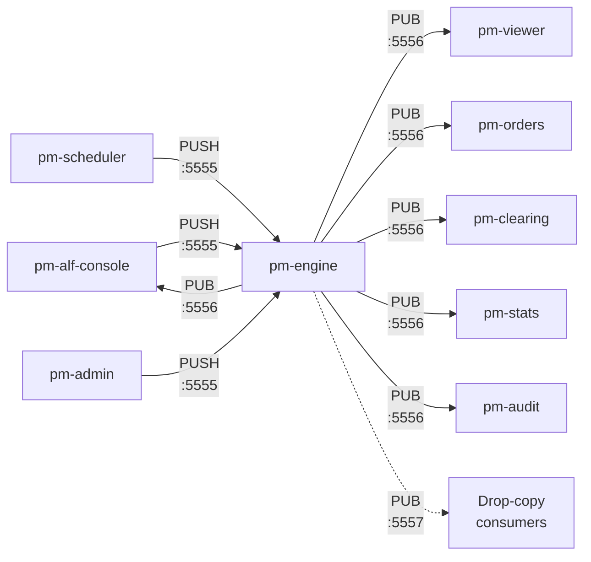
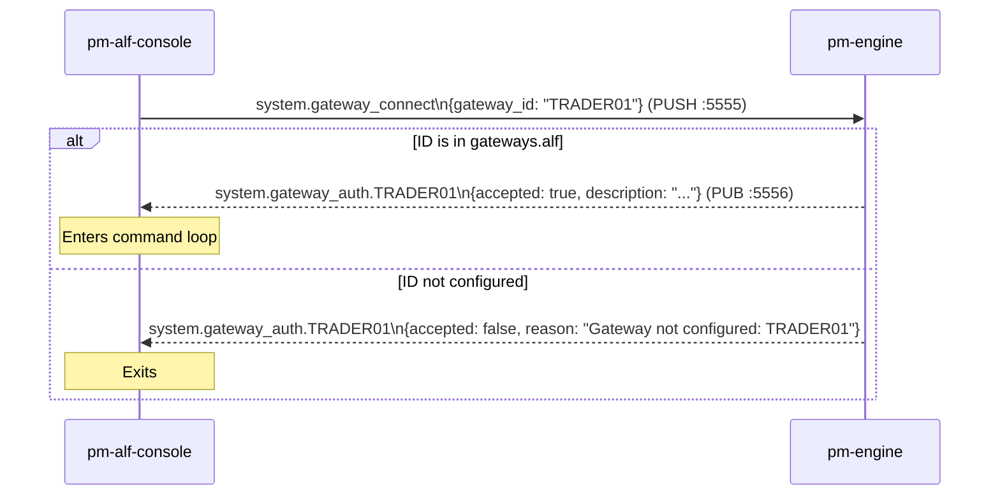
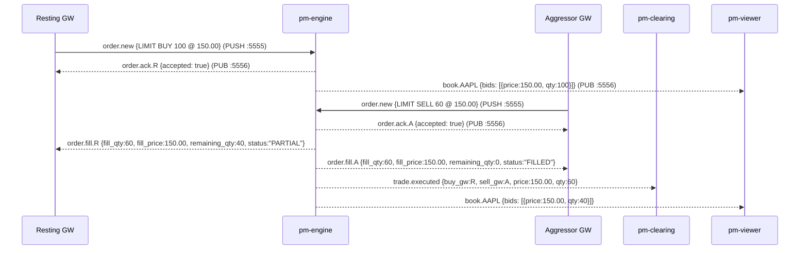
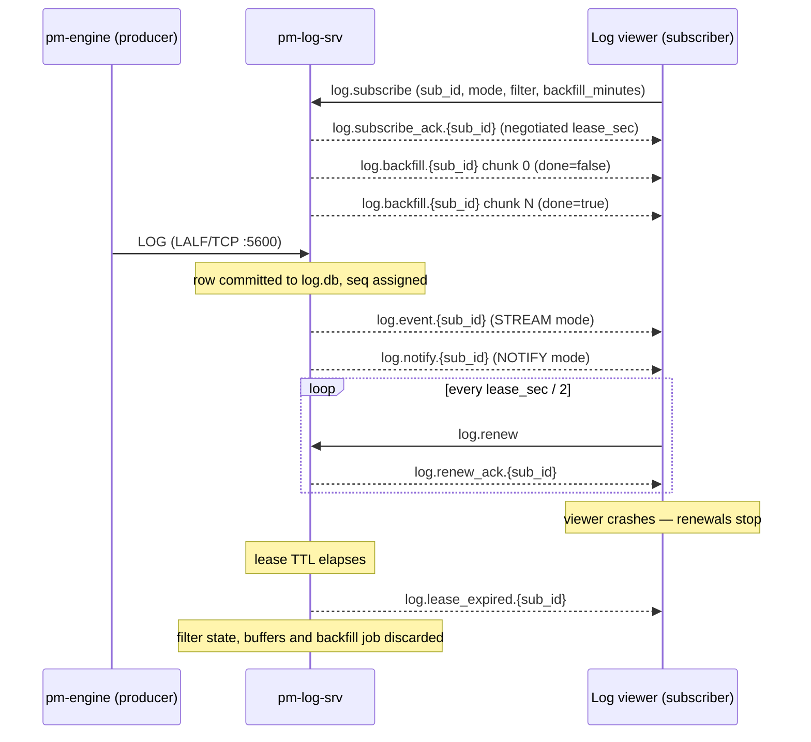

# Message Reference

!!! note "Learning objectives"
    After reading this page you will understand:

    - What a message is in the context of a distributed bus system and how it
      differs from a function call or shared data structure
    - How messages are defined in real systems (schema registries, IDL, plain JSON)
      and the pragmatic trade-offs EduMatcher makes
    - What ZeroMQ requires of a message — frames, encoding, topic filters
    - Why ZeroMQ has no broker, and what that means for reliability and operational
      complexity compared with broker-based systems (Kafka, RabbitMQ, NATS)
    - The full catalogue of messages used in EduMatcher, their fields, and which
      processes produce and consume each one


## Message Summary

Quick index of all defined message topics with publisher and purpose.

| Topic | Published by | Short description |
|---|---|---|
| `system.gateway_connect` | Requesting client process (for example pm-alf-console, pm-admin, pm-viewer, pm-stats, bots, or API gateway) via PUSH :5555 | Sent by an ALF gateway at startup to authenticate its gateway ID against `engine_config.yaml`. |
| `system.gateway_auth.{GW_ID}` | pm-engine via PUB :5556 | Engine reply to `system.gateway_connect`: authentication accepted or rejected. Also the public "gateway connected" signal for observers such as pm-clearing. |
| `order.new` | Requesting client process (for example pm-alf-console, pm-admin, pm-viewer, pm-stats, bots, or API gateway) via PUSH :5555 | Sent by a gateway to submit a new order for matching. |
| `order.cancel` | Requesting client process (for example pm-alf-console, pm-admin, pm-viewer, pm-stats, bots, or API gateway) via PUSH :5555 | Sent by a gateway to cancel a resting order. |
| `order.amend` | Requesting client process (for example pm-alf-console, pm-admin, pm-viewer, pm-stats, bots, or API gateway) via PUSH :5555 | Sent by a gateway to amend the price and/or quantity of a resting order. |
| `quote.new` | Requesting client process (for example pm-alf-console, pm-admin, pm-viewer, pm-stats, bots, or API gateway) via PUSH :5555 | Sent by a market-maker gateway to submit or replace a two-sided quote. |
| `quote.ack.{GW_ID}` | pm-engine via PUB :5556 | Acknowledgement of a `quote.new` submission. |
| `quote.status.{GW_ID}` | pm-engine via PUB :5556 | Published when the quote's lifecycle state changes (e.g. |
| `quote.cancel` | Requesting client process (for example pm-alf-console, pm-admin, pm-viewer, pm-stats, bots, or API gateway) via PUSH :5555 | Cancel the active quote for one symbol. |
| `order.oco` | Requesting client process (for example pm-alf-console, pm-admin, pm-viewer, pm-stats, bots, or API gateway) via PUSH :5555 | Links two existing resting orders into an OCO pair. |
| `order.oco_cancel` | Requesting client process (for example pm-alf-console, pm-admin, pm-viewer, pm-stats, bots, or API gateway) via PUSH :5555 | Cancel both legs of an OCO pair. |
| `oco.ack.{GW_ID}` | pm-engine via PUB :5556 | Acknowledgement of an `order.oco` request. |
| `oco.cancelled.{GW_ID}` | pm-engine via PUB :5556 | Notifies the gateway when the engine cancels the sibling leg of an OCO pair (because the other leg filled or was cancelled). |
| `risk.kill_switch` | Requesting client process (for example pm-alf-console, pm-admin, pm-viewer, pm-stats, bots, or API gateway) via PUSH :5555 | Cancels all resting orders and quotes for the specified gateway. |
| `risk.symbol_halt` | Requesting client process (for example pm-alf-console, pm-admin, pm-viewer, pm-stats, bots, or API gateway) via PUSH :5555 | Operator command to halt a single symbol. |
| `risk.symbol_resume` | Requesting client process (for example pm-alf-console, pm-admin, pm-viewer, pm-stats, bots, or API gateway) via PUSH :5555 | Resume trading on a single previously halted symbol. |
| `risk.cancel_symbol` | Requesting client process (for example pm-alf-console, pm-admin, pm-viewer, pm-stats, bots, or API gateway) via PUSH :5555 | Cancel all resting orders and quotes on a single symbol across all gateways. |
| `risk.circuit_breaker_halt_all` | Requesting client process (for example pm-alf-console, pm-admin, pm-viewer, pm-stats, bots, or API gateway) via PUSH :5555 | Administrative global halt request. |
| `risk.circuit_breaker_resume_all` | Requesting client process (for example pm-alf-console, pm-admin, pm-viewer, pm-stats, bots, or API gateway) via PUSH :5555 | Administrative global resume request. |
| `system.gateway_disconnect` | Requesting client process (for example pm-alf-console, pm-admin, pm-viewer, pm-stats, bots, or API gateway) via PUSH :5555 | Graceful disconnect notice from gateway to engine. |
| `system.gateway_bye.{GW_ID}` | pm-engine via PUB :5556 | Engine broadcast when a gateway disconnects — the PUB counterpart to `system.gateway_auth.{GW_ID}`. Consumed by observers such as pm-clearing to close session history. |
| `order.combo` | Requesting client process (for example pm-alf-console, pm-admin, pm-viewer, pm-stats, bots, or API gateway) via PUSH :5555 | Sent by a gateway to submit a combo (multi-leg) order. |
| `order.combo_cancel` | Requesting client process (for example pm-alf-console, pm-admin, pm-viewer, pm-stats, bots, or API gateway) via PUSH :5555 | Sent by a gateway to cancel a combo and all its child legs. |
| `order.ack.{GW_ID}` | pm-engine via PUB :5556 | Acknowledgement of an `order.new` submission. |
| `order.fill.{GW_ID}` | pm-engine via PUB :5556 | Notifies a gateway (and the order monitor) of a partial or full fill. A derived copy of each fill is separately relayed as `drop_copy.event.{gateway_id}` on :5557 — see below and [Drop Copy](200-drop-copy.md). Can also be relayed to a participant's own ALF session as `DC_FILL` via `DC\|STATE=ON` — see [Gateway → DC](050-gateway-reference.md#dc-toggle-drop-copy-relay). |
| `order.cancelled.{GW_ID}` | pm-engine via PUB :5556 | Confirms a cancel request or a Self-Match Prevention (SMP) forced cancellation. |
| `order.amended.{GW_ID}` | pm-engine via PUB :5556 | Confirms a successful order amendment. |
| `order.expired.{GW_ID}` | pm-engine via PUB :5556 | Published during engine shutdown for every resting `DAY` order that did not fill. |
| `order.orders.{GW_ID}` | pm-engine via PUB :5556 | Response to an `order.orders_request` from a gateway; delivers the full current order list. |
| `combo.ack.{GW_ID}` | pm-engine via PUB :5556 | Acknowledgement of a combo order submission. |
| `combo.status.{GW_ID}` | pm-engine via PUB :5556 | Published when a combo transitions between lifecycle states. |
| `trade.executed` | pm-engine via PUB :5556 | Published once per matched trade pair. |
| `book.{SYMBOL}` | pm-engine via PUB :5556 | Full order-book snapshot published after every state change for the named symbol. |
| `depth.{SYMBOL}` | pm-engine via PUB :5556 | Published alongside `book.{SYMBOL}` after every state change (same throttle). |
| `book.snapshot_request` | Requesting client process (for example pm-alf-console, pm-admin, pm-viewer, pm-stats, bots, or API gateway) via PUSH :5555 | Requests the current book snapshot for a symbol (used by viewers on startup to avoid waiting for the next update). |
| `system.symbols_request` | Requesting client process (for example pm-alf-console, pm-admin, pm-viewer, pm-stats, bots, or API gateway) via PUSH :5555 | Requests the list of configured symbols from the engine. |
| `order.orders_request` | Requesting client process (for example pm-alf-console, pm-admin, pm-viewer, pm-stats, bots, or API gateway) via PUSH :5555 | Requests the current order list for a specific gateway. |
| `system.quote_bootstrap_request` | Requesting client process (for example pm-alf-console, pm-admin, pm-viewer, pm-stats, bots, or API gateway) via PUSH :5555 | Request active quote bootstrap state for a gateway. |
| `system.quote_legs_request` | `pm-mm-bot`, `pm-api-gwy`, or `pm-alf-gwy` via PUSH :5555 | Requests a quote's per-leg state. Always replied to; `SHOW=ACTIVE`, `RECENT`, and `ALL` are all fully served (`complete` is always `true`), see below. |
| `system.session_state_request` | Requesting client process (for example pm-alf-console, pm-admin, pm-viewer, pm-stats, bots, or API gateway) via PUSH :5555 | Requests the current session state and whether session enforcement is enabled. |
| `system.session_schedule_request` | Requesting client process (for example pm-alf-console, pm-admin, pm-viewer, pm-stats, bots, or API gateway) via PUSH :5555 | Requests the configured session schedule (the times the scheduler will send phase transitions). |
| `system.gateways_request` | Requesting client process (for example pm-alf-console, pm-admin, pm-viewer, pm-stats, bots, or API gateway) via PUSH :5555 | Requests the list of configured gateways and their connection status. |
| `system.volume_request` | Requesting client process (for example pm-alf-console, pm-admin, pm-viewer, pm-stats, bots, or API gateway) via PUSH :5555 | Requests cumulative traded volume for all symbols in the current session. |
| `system.halt_status_request` | Requesting client process (for example pm-alf-console, pm-admin, pm-viewer, pm-stats, bots, or API gateway) via PUSH :5555 | Requests a snapshot of all symbols that are currently halted. |
| `system.position_request` | Requesting client process (for example pm-alf-console, pm-admin, pm-viewer, pm-stats, bots, or API gateway) via PUSH :5555 | Requests a per-symbol position snapshot (net qty and average cost) for a specific gateway. |
| `session.state` | pm-engine via PUB :5556 | Broadcast whenever the engine transitions between session phases (for example, OPENING_AUCTION to CONTINUOUS). |
| `auction.result.{SYMBOL}` | pm-engine via PUB :5556 | Broadcast once per symbol after an auction uncross completes and reports equilibrium outcome. |
| `system.eod` | pm-engine via PUB :5556 | Broadcast by the engine at shutdown before sockets are closed. |
| `circuit_breaker.halt.{SYMBOL}` | pm-engine via PUB :5556 | Broadcasts symbol-level protection state so strategies and UIs can react immediately to trading halts/resumptions. |
| `circuit_breaker.resume.{SYMBOL}` | pm-engine via PUB :5556 | Broadcasts symbol-level protection state so strategies and UIs can react immediately to trading halts/resumptions. |
| `session.transition` | pm-scheduler (PUSH -> engine on :5555) | Sent by the `pm-scheduler` process to request a session-phase transition. |
| `index.history_request` | Requesting client process via PUSH → pm-index PULL | Retrieves pm-index's structural/audit trail (creation, corporate actions, constituent changes, delistings). |
| `index.corp_action` | Operator tool via PUSH → pm-index PULL | Applies a corporate action (split, dividend, share issuance) affecting index divisor continuity. |
| `index.constituent_change` | Operator tool via PUSH → pm-index PULL | Adds or delists an index constituent with a divisor adjustment. |
| `index.update` | pm-index via PUB (`:INDEX_PUB_ADDR`) | Distributes the current index level to all subscribers after every constituent trade or forced recalculation. |
| `index.error.{gateway_id}` | pm-index via PUB | Uniform error reply for any rejected `pm-index` request. |
| `log.subscribe` | Log subscriber (viewer/UI/CLI) via PUSH → pm-log-srv PULL :5602 | Opens or replaces a leased log subscription, selecting `NOTIFY` or `STREAM` mode and a row filter. |
| `log.renew` | Log subscriber via PUSH :5602 | Lease keepalive. The *only* signal that keeps a subscription alive; silence is how pm-log-srv detects a dead subscriber. |
| `log.unsubscribe` | Log subscriber via PUSH :5602 | Closes a subscription immediately and frees its server-side buffers. |
| `log.backfill_request` | Log subscriber via PUSH :5602 | Requests replay of the last *n* minutes of `log.db`, delivered as chunks. |
| `log.status_request` | Log subscriber via PUSH :5602 | Requests subscription and server diagnostics. |
| `log.subscribe_ack.{SUB_ID}` | pm-log-srv via PUB :5601 | Confirms a subscription and echoes the *negotiated* (server-clamped) terms. |
| `log.renew_ack.{SUB_ID}` | pm-log-srv via PUB :5601 | Confirms a lease renewal and reports the new deadline. |
| `log.unsubscribe_ack.{SUB_ID}` | pm-log-srv via PUB :5601 | Confirms subscription teardown. |
| `log.event.{SUB_ID}` | pm-log-srv via PUB :5601 | `STREAM` mode: full log rows pushed as they are persisted. |
| `log.notify.{SUB_ID}` | pm-log-srv via PUB :5601 | `NOTIFY` mode: lightweight "*n* new matching rows, up to seq *X*" tick carrying no row bodies. |
| `log.backfill.{SUB_ID}` | pm-log-srv via PUB :5601 | One chunk of a backfill response; the last chunk sets `done`. |
| `log.status.{SUB_ID}` | pm-log-srv via PUB :5601 | Reply to `log.status_request`. |
| `log.lease_expired.{SUB_ID}` | pm-log-srv via PUB :5601 | Final notice that a lease was reaped; the subscription and its buffers are gone. |
| `log.error.{SUB_ID}` | pm-log-srv via PUB :5601 | Uniform error reply for any rejected LALF-PS request. |
| `log.server_state` | pm-log-srv via PUB :5601 | Periodic broadcast of pm-log-srv liveness and counters; also sent once with `state: "DOWN"` at shutdown. |

## Background — Messages in a Bus System

### What is a message?

A function call passes data synchronously inside a process: the caller blocks
until the callee returns.  A **message** is an asynchronous unit of data sent
between processes.  The sender does not wait for a response; it hands the
message to the transport layer and moves on.

Messages carry three things:

1. **Identity** — what kind of event this is (the topic or message type)
2. **Payload** — the data describing the event
3. **Routing metadata** — information the transport needs to deliver it
   (addresses, topic filters, sequence numbers)

### How message formats are defined in real systems

In production systems there are three common approaches to defining what a
message looks like:

**Schema registries (Avro, Protobuf, Thrift)**
: Messages are defined in an Interface Definition Language (IDL) file.
  A code generator produces serialisers and deserialisers for every target
  language.  The registry enforces compatibility: a new field may be added
  but existing fields cannot be removed or re-typed without a version bump.
  Kafka and gRPC use this model.

**Canonical JSON/XML schemas (JSON Schema, OpenAPI, AsyncAPI)**
: Message shapes are described in a human-readable document (like AsyncAPI
  for event-driven systems).  Any process that speaks JSON can produce or
  consume a message without a code generator.  The schema document is the
  contract; violations surface only at runtime unless you add a validation
  library.

**Hardcoded structures**
: The simplest approach — message shape is implicit in the code that creates
  and reads it.  No IDL, no registry, no generator.  Fast to build, but
  schema drift is invisible until something breaks at runtime.

EduMatcher uses the **hardcoded approach**.  Each message type is created
by a helper function in `src/edumatcher/models/message.py` (e.g.
`make_order_new_msg`, `make_gateway_connect_msg`) and decoded by `decode()`.
Every field documented on this page is exactly what those functions produce.
This is ideal for a learning system — you can read the code and immediately
see the message — but a real exchange would use Protobuf or Avro to enforce
schema contracts across teams and languages.

### What ZeroMQ requires of a message

ZeroMQ does not impose a message format.  It sees messages as one or more
opaque **frames** — byte arrays that are sent and received atomically as a
group.  It is up to the application to define what those bytes mean.

EduMatcher uses exactly **two frames** for every message:

```
frame[0]  →  topic string, UTF-8 encoded
             e.g.  b"order.ack.GW01"

frame[1]  →  JSON payload, UTF-8 encoded
             e.g.  b'{"order_id": "3f2a...", "accepted": true}'
```

`frame[0]` doubles as the **PUB/SUB filter key**.  A subscriber that
registers for prefix `"order.ack.GW01"` will receive only messages whose
first frame starts with that string — all other messages are dropped by the
ZeroMQ layer before the application even sees them.  This prefix-match filter
is evaluated in the kernel's socket buffer, not in Python, so it adds almost
no CPU overhead regardless of how many message types are on the bus.

### ZeroMQ without a broker

Most messaging systems interpose a **broker** between producers and consumers:

```
Producer ──▶  Broker  ──▶  Consumer
```

The broker buffers messages, persists them to disk, routes them to the right
queues, and handles consumer acknowledgements.  Examples: RabbitMQ, Apache
Kafka, NATS JetStream, AWS SQS.

ZeroMQ is **brokerless**.  Producers connect directly to consumers (or to the
engine in PUSH/PULL):

```
Gateway ──PUSH──▶  Engine ──PUB──▶  Subscriber A
                                ├──▶  Subscriber B
                                └──▶  Subscriber C
```

There is no third process in the middle.  The advantages and disadvantages
flow directly from that choice:

**Advantages of no broker**

| Advantage | Detail |
|-----------|--------|
| **Lower latency** | No extra network hop; messages go directly from sender to receiver |
| **Fewer moving parts** | No broker process to install, configure, monitor, or restart |
| **No single point of failure** | The engine is the bus; if the engine is up, the bus is up |
| **Simpler deployment** | `pip install pyzmq` is the entire installation |

**Disadvantages of no broker**

| Disadvantage | Detail |
|--------------|--------|
| **No persistence** | If a subscriber is down when a message is published, the message is gone forever |
| **No guaranteed delivery** | PUB/SUB drops messages to slow subscribers without warning |
| **No replay** | You cannot re-consume old messages; there is no commit log |
| **Tight coupling on addresses** | Producers must know the address of the engine; adding a new engine address requires reconfiguring all clients |
| **No backpressure** | A fast publisher can overwhelm a slow subscriber; the subscriber's receive buffer fills and messages are silently discarded |

For EduMatcher these trade-offs are acceptable: the system runs on
localhost, sessions last hours not days, and correctness over time is handled
by the GTC persistence layer rather than the message bus.  For a real exchange,
the audit trail would be written by a Kafka consumer (guaranteed delivery,
infinite replay), and the matching engine would use a persisted queue for order
intake.


## Message structure

Every inter-process communication in EduMatcher is a two-frame ZeroMQ
multipart message.  ZeroMQ (ZMQ) is a high-performance messaging library;
a "multipart message" is simply an ordered list of byte-array frames sent
and received atomically:

| Frame | Content |
|---|---|
| `frame[0]` | Topic string (UTF-8) — used for PUB/SUB prefix filtering |
| `frame[1]` | JSON payload (UTF-8) |

## Transport channels

| Channel | ZMQ pattern | Address | Direction |
|---|---|---|---|
| Order submission | PUSH → PULL | `tcp://127.0.0.1:5555` | Gateway → Engine |
| Event broadcast | PUB → SUB | `tcp://127.0.0.1:5556` | Engine → all subscribers |
| Drop copy | PUB → SUB | `tcp://127.0.0.1:5557` | Engine → drop-copy consumers |

The dedicated drop-copy channel is implemented in
`src/edumatcher/engine/drop_copy.py` and is documented in more detail on the
[Drop Copy](200-drop-copy.md) page.



### `system.gateway_connect`

**Motivation:** Enables explicit control/state synchronization so clients do not depend on timing of unsolicited events.
**Published by:** Requesting client process (for example pm-alf-console, pm-admin, pm-viewer, pm-stats, bots, or API gateway) via PUSH :5555

Sent by an ALF gateway at startup to authenticate its gateway ID against
`engine_config.yaml`.



| Field | Type | Description |
|---|---|---|
| `gateway_id` | string | Gateway identifier being requested (e.g. `TRADER01`) |

**Reply:** `system.gateway_auth.{GW_ID}`

| Field | Type | Description |
|---|---|---|
| `gateway_id` | string | Gateway identifier |
| `accepted` | boolean | `true` if ID is configured in `gateways.alf` |
| `reason` | string | Rejection reason when `accepted=false` |
| `description` | string | Optional configured description for the gateway |

When `accepted=false`, the gateway must terminate and MUST NOT submit orders.


### `order.new`

**Motivation:** Keeps order/quote lifecycle state synchronized between the initiating client and all interested subscribers.
**Published by:** Requesting client process (for example pm-alf-console, pm-admin, pm-viewer, pm-stats, bots, or API gateway) via PUSH :5555

Sent by a gateway to submit a new order for matching.

| Field | Type | Description |
|---|---|---|
| `id` | string (UUID) | Unique order identifier |
| `symbol` | string | Instrument ticker, e.g. `MSFT` |
| `side` | `"BUY"` \| `"SELL"` | Order side |
| `order_type` | string | `MARKET`, `LIMIT`, `STOP`, `STOP_LIMIT`, `FOK`, `IOC`, `ICEBERG`, `TRAILING_STOP` |
| `tif` | `"DAY"` \| `"GTC"` \| `"ATO"` \| `"ATC"` \| `"FOK"` | Time-in-force |
| `quantity` | integer | Total order quantity |
| `remaining_qty` | integer | Unfilled quantity (equals `quantity` on submission) |
| `gateway_id` | string | Originating gateway identifier, e.g. `TRADER01` |
| `timestamp` | float | Unix epoch (seconds) |
| `status` | string | Initial status, always `"NEW"` |
| `price` | float \| null | Limit price (LIMIT, STOP_LIMIT, FOK, ICEBERG) |
| `stop_price` | float \| null | Trigger price (STOP, STOP_LIMIT) |
| `visible_qty` | integer \| null | Peak size for ICEBERG orders |
| `displayed_qty` | integer \| null | Current visible slice (ICEBERG) |
| `trail_offset` | float \| null | Offset from best price for `TRAILING_STOP` orders |
| `smp_action` | string \| null | Self-match prevention: `NONE`, `CANCEL_AGGRESSOR`, `CANCEL_RESTING`, `CANCEL_BOTH`. `null` when the client omitted `SMP=`, in which case the engine resolves it to the gateway's configured `gateways.alf[].smp_action` default (else `"NONE"`) before the order reaches the book — see [Configuration — Gateway Fields](010-configuration.md#gateway-fields) |
| `client_tag` | string \| absent | Optional client-supplied tag echoed back on every lifecycle event for this order (ack, fill, cancelled, expired). When present, subscribers can map events back to their submission without a FIFO scheme. |
| `arrival_seq` | integer | Engine-assigned monotonic arrival sequence that determines time priority within a price level. Not supplied by the client (`0` on submission); populated by the engine and echoed in outbound order snapshots (see `order.orders.{GW_ID}`). |
| `oco_group_id` | string \| null | Set once this order is linked into an OCO pair via `order.oco`; `null` on a plain submission |
| `combo_parent_id` | string \| null | Parent `ComboOrder.id` when this order is a combo child leg; `null` for a standalone order |
| `leg_index` | integer \| null | 0-based position within the parent combo's leg list; `null` for a standalone order |
| `origin` | `"ORDER"` \| `"QUOTE"` \| `"IMPLIED"` | How this order entered the book: a direct order submission, a market-maker quote leg, or an engine-implied order |
| `quote_id` | string \| null | Set when `origin` is `"QUOTE"`, echoing the originating `quote.new`'s identifier; `null` otherwise |

**Valid field combinations by order type:**

| `order_type` | `price` | `stop_price` | `visible_qty` | `trail_offset` | Notes |
|---|---|---|---|---|---|
| `MARKET` | — | — | — | — | Fills at best available; rejected if symbol halted |
| `LIMIT` | Required | — | — | — | Rests if no match; subject to collar check |
| `STOP` | — | Required | — | — | Triggers a market order when stop price touched |
| `STOP_LIMIT` | Required | Required | — | — | Triggers a limit order when stop price touched |
| `FOK` | Required | — | — | — | Fill fully immediately or cancel entirely |
| `IOC` | Optional | — | — | — | Fill as much as possible immediately, cancel remainder |
| `ICEBERG` | Required | — | Required | — | Shows only `visible_qty`; replenishes from hidden reserve |
| `TRAILING_STOP` | — | — | — | Required | Stop price follows best opposite-side price by `trail_offset` |


### `order.cancel`

**Motivation:** Keeps order/quote lifecycle state synchronized between the initiating client and all interested subscribers.
**Published by:** Requesting client process (for example pm-alf-console, pm-admin, pm-viewer, pm-stats, bots, or API gateway) via PUSH :5555

Sent by a gateway to cancel a resting order.

| Field | Type | Description |
|---|---|---|
| `order_id` | string (UUID) | ID of the order to cancel |
| `gateway_id` | string | Gateway that owns the order |


### `order.amend`

**Motivation:** Keeps order/quote lifecycle state synchronized between the initiating client and all interested subscribers.
**Published by:** Requesting client process (for example pm-alf-console, pm-admin, pm-viewer, pm-stats, bots, or API gateway) via PUSH :5555

Sent by a gateway to amend the price and/or quantity of a resting order.

| Field | Type | Description |
|---|---|---|
| `order_id` | string (UUID) | ID of the order to amend |
| `gateway_id` | string | Gateway that owns the order |
| `price` | float \| absent | New limit price (omit to keep current) |
| `qty` | integer \| absent | New total quantity (omit to keep current) |

At least one of `price` or `qty` must be present.

**Priority rules:**

- Quantity decrease only → priority **preserved** (timestamp unchanged)
- Price change or quantity increase → priority **lost** (new timestamp assigned)

**Reply:** `order.amended.{GW_ID}` on success, or `order.ack.{GW_ID}` with `accepted=false` on rejection.


### `quote.new`

**Motivation:** Keeps order/quote lifecycle state synchronized between the initiating client and all interested subscribers.
**Published by:** Requesting client process (for example pm-alf-console, pm-admin, pm-viewer, pm-stats, bots, or API gateway) via PUSH :5555

Sent by a market-maker gateway to submit or replace a two-sided quote.
Role requirements and MM obligation controls are documented in
[Configuration - Role Privileges](010-configuration.md#role-privileges).

| Field | Type | Description |
|---|---|---|
| `gateway_id` | string | Originating gateway identifier |
| `symbol` | string | Instrument ticker |
| `quote_id` | string \| absent | Optional client-provided quote label |
| `bid_price` | float | Bid price |
| `bid_qty` | integer | Bid quantity |
| `ask_price` | float | Ask price |
| `ask_qty` | integer | Ask quantity |
| `tif` | string | Quote leg time-in-force (`DAY` or `GTC`) |

Replies:

- `quote.ack.{GW_ID}`
- `quote.status.{GW_ID}`

### `quote.ack.{GW_ID}`

**Motivation:** Keeps order/quote lifecycle state synchronized between the initiating client and all interested subscribers.
**Published by:** pm-engine via PUB :5556

Acknowledgement of a `quote.new` submission.

| Field | Type | Description |
|---|---|---|
| `quote_id` | string | Client-provided quote label (echoed from request) |
| `accepted` | boolean | `true` = accepted; `false` = rejected |
| `reason` | string | Rejection reason (empty string when accepted) |
| `bid_order_id` | string (UUID) | Order ID of the bid leg *(present when accepted)* |
| `ask_order_id` | string (UUID) | Order ID of the ask leg *(present when accepted)* |

### `quote.status.{GW_ID}`

**Motivation:** Keeps order/quote lifecycle state synchronized between the initiating client and all interested subscribers.
**Published by:** pm-engine via PUB :5556

Published when the quote's lifecycle state changes (e.g. a fill inactivates the quote or a cancel removes it).

| Field | Type | Description |
|---|---|---|
| `quote_id` | string | Client-provided quote label |
| `status` | string | New quote state (see values below) |
| `reason` | string | Additional context (e.g. halt reason); empty when not applicable |

**Status values:**

| Value | Meaning |
|---|---|
| `ACTIVE` | Quote successfully placed on the book (both legs resting) |
| `INACTIVE_BID_FILLED` | Bid leg filled; ask leg auto-cancelled |
| `INACTIVE_ASK_FILLED` | Ask leg filled; bid leg auto-cancelled |
| `CANCELLED` | Quote removed (explicit cancel, kill switch, or halt) |

### `quote.cancel`

**Motivation:** Keeps order/quote lifecycle state synchronized between the initiating client and all interested subscribers.
**Published by:** Requesting client process (for example pm-alf-console, pm-admin, pm-viewer, pm-stats, bots, or API gateway) via PUSH :5555

Cancel the active quote for one symbol.

| Field | Type | Description |
|---|---|---|
| `gateway_id` | string | Gateway identifier |
| `symbol` | string | Instrument ticker |


## OCO messages (gateway → engine / engine → subscribers)

A **One-Cancels-Other (OCO)** pair links two resting orders so that when one fills or is cancelled the other is automatically cancelled by the engine.

### `order.oco`

**Motivation:** Keeps order/quote lifecycle state synchronized between the initiating client and all interested subscribers.
**Published by:** Requesting client process (for example pm-alf-console, pm-admin, pm-viewer, pm-stats, bots, or API gateway) via PUSH :5555

Links two existing resting orders into an OCO pair.

| Field | Type | Description |
|---|---|---|
| `oco_id` | string | Client-assigned label for the pair |
| `gateway_id` | string | Gateway that owns both orders |
| `order_id_1` | string (UUID) | First leg of the pair |
| `order_id_2` | string (UUID) | Second leg of the pair |

Both orders must already be resting on the book and must belong to the same gateway.

**Reply:** `oco.ack.{GW_ID}`

### `order.oco_cancel`

**Motivation:** Keeps order/quote lifecycle state synchronized between the initiating client and all interested subscribers.
**Published by:** Requesting client process (for example pm-alf-console, pm-admin, pm-viewer, pm-stats, bots, or API gateway) via PUSH :5555

Cancel both legs of an OCO pair.

| Field | Type | Description |
|---|---|---|
| `oco_id` | string | OCO pair label to cancel |
| `gateway_id` | string | Gateway that owns the pair |

### `oco.ack.{GW_ID}`

**Motivation:** Keeps order/quote lifecycle state synchronized between the initiating client and all interested subscribers.
**Published by:** pm-engine via PUB :5556

Acknowledgement of an `order.oco` request.

| Field | Type | Description |
|---|---|---|
| `oco_id` | string | OCO pair label |
| `accepted` | boolean | `true` if both orders were successfully linked |
| `reason` | string | Rejection reason when `accepted=false` |
| `order_id_1` | string (UUID) | First leg order ID *(present when accepted)* |
| `order_id_2` | string (UUID) | Second leg order ID *(present when accepted)* |

### `oco.cancelled.{GW_ID}`

**Motivation:** Keeps order/quote lifecycle state synchronized between the initiating client and all interested subscribers.
**Published by:** pm-engine via PUB :5556

Notifies the gateway when the engine cancels the sibling leg of an OCO pair (because the other leg filled or was cancelled).

| Field | Type | Description |
|---|---|---|
| `oco_id` | string | OCO pair label |
| `cancelled_order_id` | string (UUID) | The sibling order that was automatically cancelled |
| `reason` | string | Why the sibling was cancelled, e.g. `"OCO sibling filled"` |


## Risk control messages (gateway → engine)

### `risk.kill_switch`

**Motivation:** Provides operational risk controls (halt/resume/kill/cancel) with auditable command semantics.
**Published by:** Requesting client process (for example pm-alf-console, pm-admin, pm-viewer, pm-stats, bots, or API gateway) via PUSH :5555

Cancels all resting orders and quotes for the specified gateway. Does not halt the symbol; trading continues normally for other participants.

| Field | Type | Description |
|---|---|---|
| `gateway_id` | string | Gateway whose exposure to cancel |
| `symbol` | string \| empty | Scope to a single symbol; empty string or absent means all symbols |

**Reply:** `risk.kill_switch_ack.{GW_ID}`

| Field | Type | Description |
|---|---|---|
| `accepted` | boolean | Always `true` for authenticated gateways |
| `cancelled_orders` | integer | Number of resting orders cancelled |
| `cancelled_quotes` | integer | Number of quote legs cancelled |

### `risk.symbol_halt`

**Motivation:** Provides operational risk controls (halt/resume/kill/cancel) with auditable command semantics.
**Published by:** Requesting client process (for example pm-alf-console, pm-admin, pm-viewer, pm-stats, bots, or API gateway) via PUSH :5555

Operator command to halt a single symbol. Any authenticated connected gateway may send this; no ADMIN role is required.

| Field | Type | Description |
|---|---|---|
| `gateway_id` | string | Requesting gateway identifier |
| `symbol` | string | Symbol to halt |

**Reply:** `risk.symbol_halt_ack.{GW_ID}`

| Field | Type | Description |
|---|---|---|
| `accepted` | boolean | `true` if the symbol was halted |
| `reason` | string | Rejection reason when `accepted=false` |
| `cancelled_quotes` | integer | Number of MM quote legs cancelled on halt |

The engine also publishes `circuit_breaker.halt.{SYMBOL}` with `resumption_mode = "MANUAL"` when a symbol is halted this way.

### `risk.symbol_resume`

**Motivation:** Provides operational risk controls (halt/resume/kill/cancel) with auditable command semantics.
**Published by:** Requesting client process (for example pm-alf-console, pm-admin, pm-viewer, pm-stats, bots, or API gateway) via PUSH :5555

Resume trading on a single previously halted symbol.

| Field | Type | Description |
|---|---|---|
| `gateway_id` | string | Requesting gateway identifier |
| `symbol` | string | Symbol to resume |

**Reply:** `risk.symbol_resume_ack.{GW_ID}`

| Field | Type | Description |
|---|---|---|
| `accepted` | boolean | `true` if the symbol was resumed |
| `reason` | string | Rejection reason when `accepted=false` |

The engine publishes `circuit_breaker.resume.{SYMBOL}` with `mode = "MANUAL"` when the symbol is resumed.

### `risk.cancel_symbol`

**Motivation:** Provides operational risk controls (halt/resume/kill/cancel) with auditable command semantics.
**Published by:** Requesting client process (for example pm-alf-console, pm-admin, pm-viewer, pm-stats, bots, or API gateway) via PUSH :5555

Cancel all resting orders and quotes on a single symbol across all gateways. The symbol remains active; only resting interest is cleared.

| Field | Type | Description |
|---|---|---|
| `gateway_id` | string | Requesting gateway identifier |
| `symbol` | string | Symbol to clear |

**Reply:** `risk.cancel_symbol_ack.{GW_ID}`

| Field | Type | Description |
|---|---|---|
| `accepted` | boolean | `true` if the clear was applied |
| `reason` | string | Rejection reason when `accepted=false` |
| `cancelled_orders` | integer | Number of resting orders cancelled |
| `cancelled_quotes` | integer | Number of quote legs cancelled |

### `risk.circuit_breaker_halt_all`

**Motivation:** Provides operational risk controls (halt/resume/kill/cancel) with auditable command semantics.
**Published by:** Requesting client process (for example pm-alf-console, pm-admin, pm-viewer, pm-stats, bots, or API gateway) via PUSH :5555

Administrative global halt request. This sets all known symbols to halted.
Only gateways configured with `role: ADMIN` are authorized.

Operational semantics:

- This is an exchange-wide manual halt. It is not timer-based.
- The engine marks affected symbols as halted and publishes
  `circuit_breaker.halt.<SYMBOL>` with `resumption_mode = "MANUAL"` and
  `resume_at_ns = null`.
- While halted, quote entry is rejected and immediate-execution order types are
  rejected under the normal halt rules.
- The halt remains in effect until an explicit `risk.circuit_breaker_resume_all`
  is sent, or until end-of-day session reset.

| Field | Type | Description |
|---|---|---|
| `gateway_id` | string | Requesting admin gateway identifier |

Reply: `risk.circuit_breaker_halt_all_ack.{GW_ID}`

Ack payload fields:

| Field | Type | Description |
|---|---|---|
| `accepted` | boolean | `true` if request was authorized and applied |
| `reason` | string | Rejection reason when `accepted=false` |
| `halted_symbols` | integer | Number of symbols set to halted |
| `cancelled_quotes` | integer | Number of quote legs cancelled during halt |


### `risk.circuit_breaker_resume_all`

**Motivation:** Provides operational risk controls (halt/resume/kill/cancel) with auditable command semantics.
**Published by:** Requesting client process (for example pm-alf-console, pm-admin, pm-viewer, pm-stats, bots, or API gateway) via PUSH :5555

Administrative global resume request. Clears the halt on every symbol that was
halted by a preceding `risk.circuit_breaker_halt_all`.
Only gateways configured with `role: ADMIN` are authorized.

Operational semantics:

- The engine iterates all symbols currently marked as halted, sets each to
  non-halted, and deactivates any in-memory circuit-breaker state.
- A `circuit_breaker.resume.<SYMBOL>` event (with `mode = "MANUAL"`) is
  published for each resumed symbol.
- Only symbols that are currently halted are touched; symbols that are already
  trading are left unchanged.
- If no symbols are halted, the request is still accepted and
  `resumed_symbols = 0` is returned.

| Field | Type | Description |
|---|---|---|
| `gateway_id` | string | Requesting admin gateway identifier |

Reply: `risk.circuit_breaker_resume_all_ack.{GW_ID}`

Ack payload fields:

| Field | Type | Description |
|---|---|---|
| `accepted` | boolean | `true` if request was authorized and applied |
| `reason` | string | Rejection reason when `accepted=false` |
| `resumed_symbols` | integer | Number of symbols transitioned from halted to trading |


### ADMIN workflow: exchange-wide halt and resume

This section describes how an operator uses an ADMIN-role gateway to perform
an exchange-wide circuit-breaker halt and subsequently resume all trading.

**Step 0 — configure an ADMIN gateway**

Declare a gateway with `role: ADMIN` in `engine_config.yaml`:

```yaml
gateways:
  alf:
    - id: GW_ADMIN
      description: Operations desk
      role: ADMIN
      disconnect_behaviour: CANCEL_QUOTES_ONLY
```

See [Role Privileges](010-configuration.md#role-privileges)
for the full permissions matrix.

**Step 1 — connect the ADMIN gateway**

The gateway sends `system.gateway_connect` as usual. The engine registers the
session and marks its role as `ADMIN`.

**Step 2 — trigger the exchange-wide halt**

Send `risk.circuit_breaker_halt_all` via the PUSH socket:

```json
{ "gateway_id": "GW_ADMIN" }
```

The engine will:

1. Verify the gateway is connected and carries role `ADMIN`.
2. Collect every known symbol (from order books, circuit-breaker state, and
   engine configuration).
3. Mark each symbol as halted with `resumption_mode = "MANUAL"`.
4. Cancel all outstanding MM quote legs (both sides).
5. Publish one `circuit_breaker.halt.<SYMBOL>` event per symbol.
6. Acknowledge with `risk.circuit_breaker_halt_all_ack.GW_ADMIN`.

Expected inbound events (subscribe to `circuit_breaker.*`):

```
circuit_breaker.halt.AAPL  → { symbol: "AAPL", resumption_mode: "MANUAL", level: "ADMIN_ALL", ... }
circuit_breaker.halt.MSFT  → { symbol: "MSFT", resumption_mode: "MANUAL", level: "ADMIN_ALL", ... }
...
risk.circuit_breaker_halt_all_ack.GW_ADMIN → { accepted: true, halted_symbols: N, cancelled_quotes: M }
```

**Step 3 — resume all trading**

When the situation is resolved, send `risk.circuit_breaker_resume_all`:

```json
{ "gateway_id": "GW_ADMIN" }
```

The engine will:

1. Verify the gateway is connected and carries role `ADMIN`.
2. Collect every symbol currently marked as halted.
3. Clear the halt and deactivate circuit-breaker state for each symbol.
4. Publish one `circuit_breaker.resume.<SYMBOL>` event per symbol.
5. Acknowledge with `risk.circuit_breaker_resume_all_ack.GW_ADMIN`.

Expected inbound events:

```
circuit_breaker.resume.AAPL  → { symbol: "AAPL", mode: "MANUAL" }
circuit_breaker.resume.MSFT  → { symbol: "MSFT", mode: "MANUAL" }
...
risk.circuit_breaker_resume_all_ack.GW_ADMIN → { accepted: true, resumed_symbols: N }
```

After receiving the ack, normal order flow resumes for all previously halted
symbols. Market-maker quote obligations are enforced again immediately.

### `system.gateway_disconnect`

**Motivation:** Enables explicit control/state synchronization so clients do not depend on timing of unsolicited events.
**Published by:** Requesting client process (for example pm-alf-console, pm-admin, pm-viewer, pm-stats, bots, or API gateway) via PUSH :5555

Graceful disconnect notice from gateway to engine.

| Field | Type | Description |
|---|---|---|
| `gateway_id` | string | Gateway identifier |
| `reason` | string | Optional disconnect reason |

!!! note "PULL in, PUB out"
    `system.gateway_connect` / `system.gateway_disconnect` travel gateway → engine
    on the PULL socket (:5555) and are **not** visible to PUB subscribers. The
    engine re-broadcasts the lifecycle on PUB (:5556) as
    `system.gateway_auth.{GW_ID}` (connect) and `system.gateway_bye.{GW_ID}`
    (disconnect) so observers can see it.


### `system.gateway_bye.{GW_ID}`

**Motivation:** Enables explicit control/state synchronization so clients do not depend on timing of unsolicited events.
**Published by:** pm-engine via PUB :5556

Broadcast by the engine when a gateway disconnects. This is the PUB-side
counterpart to `system.gateway_auth.{GW_ID}` (published on connect): the inbound
`system.gateway_disconnect` is a gateway → engine PULL message that PUB
subscribers never see, so the engine republishes it on PUB. Consumed by
observers such as `pm-clearing`, which records the disconnect time and reason in
its gateway-session history.

| Field | Type | Description |
|---|---|---|
| `gateway_id` | string | Gateway identifier |
| `reason` | string | Disconnect reason (empty string when none supplied) |


### `order.combo`

**Motivation:** Keeps order/quote lifecycle state synchronized between the initiating client and all interested subscribers.
**Published by:** Requesting client process (for example pm-alf-console, pm-admin, pm-viewer, pm-stats, bots, or API gateway) via PUSH :5555

Sent by a gateway to submit a combo (multi-leg) order.

| Field | Type | Description |
|---|---|---|
| `id` | string (UUID) | Internal combo identifier |
| `combo_id` | string | User-provided tracking label |
| `gateway_id` | string | Originating gateway identifier |
| `combo_type` | `"AON"` | Combo semantics (all-or-none) |
| `tif` | `"DAY"` \| `"GTC"` | Time-in-force for all legs |
| `legs` | array of leg objects | Each leg: `{symbol, side, order_type, quantity, price, stop_price, smp_action}` — `stop_price` is `null` for non-stop leg types; `smp_action` is `null` when the client omitted `SMP=`, in which case the engine resolves it to the gateway's configured `gateways.alf[].smp_action` default (else `"NONE"`) when building each leg's child order — see [Configuration — Gateway Fields](010-configuration.md#gateway-fields) |
| `timestamp` | float | Unix epoch (seconds) |
| `status` | string | Initial status (`"PENDING"`) |
| `child_order_ids` | array of string | Always empty at submission — populated by the engine once child orders are created |
| `leg_fill_qty` | object (leg index → integer) | Always empty at submission — tracks per-leg filled quantity as the combo executes |
| `leg_statuses` | object (leg index → string) | Always empty at submission — tracks per-leg `OrderStatus` as the combo executes |


### `order.combo_cancel`

**Motivation:** Keeps order/quote lifecycle state synchronized between the initiating client and all interested subscribers.
**Published by:** Requesting client process (for example pm-alf-console, pm-admin, pm-viewer, pm-stats, bots, or API gateway) via PUSH :5555

Sent by a gateway to cancel a combo and all its child legs.

| Field | Type | Description |
|---|---|---|
| `combo_id` | string | User-provided combo label to cancel |
| `gateway_id` | string | Gateway that owns the combo |


## Order events (engine → subscribers)

All topics in this section are published on the PUB socket and filtered by the gateway-specific suffix where applicable.

The following diagram shows the full lifecycle for a limit order that rests and is later filled by an aggressor:



### `order.ack.{GW_ID}`

**Motivation:** Keeps order/quote lifecycle state synchronized between the initiating client and all interested subscribers.
**Published by:** pm-engine via PUB :5556

Acknowledgement of an `order.new` submission.  
Subscribed to by the originating gateway and the order monitor.

| Field | Type | Description |
|---|---|---|
| `order_id` | string (UUID) | Order being acknowledged |
| `accepted` | boolean | `true` = accepted; `false` = rejected |
| `reason` | string | Rejection reason (empty string when accepted) |
| `symbol` | string | Instrument ticker *(present when accepted)* |
| `side` | string | Order side *(present when accepted)* |
| `order_type` | string | Order type *(present when accepted)* |
| `tif` | string | Time-in-force *(present when accepted)* |
| `qty` | integer | Original quantity *(present when accepted)* |
| `price` | float \| null | Limit price *(present when accepted)* |
| `client_tag` | string \| absent | Echoed from `order.new` when the field was set |

!!! note "Rejection reasons"
    Common rejection reasons: `"Symbol not configured: XYZ"`, `"Insufficient liquidity"` (FOK), `"Order not found"` (cancel), `"Gateway not configured: TRADER99"`, `"Gateway not connected: TRADER01"`.


### `order.fill.{GW_ID}`

**Motivation:** Keeps order/quote lifecycle state synchronized between the initiating client and all interested subscribers.
**Published by:** pm-engine via PUB :5556

Notifies a gateway (and the order monitor) of a partial or full fill.  
Both the aggressor and the resting counterparty receive their own `order.fill` message.

`order.fill` is the only order/quote-lifecycle topic that is also relayed to
a second, external-facing socket: for every fill, the engine separately
publishes a derived `drop_copy.event.{gateway_id}` message (`event_type:
"order.fill"`) on the dedicated drop-copy PUB socket (`:5557`). That derived
message has its own envelope (`seq`, `timestamp`, `gateway_id`, `event_type`)
and is not a verbatim republish of this topic's payload — see
[Drop Copy](200-drop-copy.md) for the full drop-copy schema. No other topic
on this page is mirrored to `:5557`.

!!! note "Two ways to consume drop copy"
    `drop_copy.event.{gateway_id}` on `:5557` can be consumed directly (any
    ZMQ SUB client, or `pm-dc-spy` for ad-hoc inspection — see
    [Drop Copy](200-drop-copy.md)), or relayed asynchronously down a
    participant's own ALF session via `pm-alf-console --drop-copy` /
    `DC|STATE=ON` or `pm-alf-gwy`'s `DC|STATE=ON` command, which re-emits it
    as an ALF `DC_FILL` line scoped to that session's own `gateway_id`. See
    [Gateway → DC](050-gateway-reference.md#dc-toggle-drop-copy-relay) and
    [ALF TCP Gateway → DC](220-alf-gateway.md#dc-toggle-drop-copy-relay).

| Field | Type | Description |
|---|---|---|
| `order_id` | string (UUID) | Filled order |
| `fill_qty` | integer | Quantity matched in this fill event |
| `fill_price` | float | Price at which the fill occurred |
| `remaining_qty` | integer | Unfilled quantity remaining after this fill |
| `status` | `"PARTIAL"` \| `"FILLED"` | Order status after the fill |
| `symbol` | string | Instrument ticker |
| `side` | string | Order side |
| `order_type` | string | Order type |
| `tif` | string | Time-in-force |
| `qty` | integer | Original quantity |
| `price` | float \| null | Limit price |
| `client_tag` | string \| absent | Echoed from `order.new` when the field was set |


### `order.cancelled.{GW_ID}`

**Motivation:** Keeps order/quote lifecycle state synchronized between the initiating client and all interested subscribers.
**Published by:** pm-engine via PUB :5556

Confirms a cancel request or a Self-Match Prevention (SMP) forced cancellation.

| Field | Type | Description |
|---|---|---|
| `order_id` | string (UUID) | Cancelled order |
| `client_tag` | string \| absent | Echoed from the original `order.new` when the field was set |


### `order.amended.{GW_ID}`

**Motivation:** Keeps order/quote lifecycle state synchronized between the initiating client and all interested subscribers.
**Published by:** pm-engine via PUB :5556

Confirms a successful order amendment.

| Field | Type | Description |
|---|---|---|
| `order_id` | string (UUID) | Amended order ID (unchanged from original) |
| `price` | float | New price after amendment |
| `qty` | integer | New total quantity after amendment |
| `remaining_qty` | integer | Remaining unfilled quantity |
| `priority_reset` | boolean | `true` if the order lost time priority |


### `order.expired.{GW_ID}`

**Motivation:** Keeps order/quote lifecycle state synchronized between the initiating client and all interested subscribers.
**Published by:** pm-engine via PUB :5556

Published during engine shutdown for every resting `DAY` order that did not fill.

| Field | Type | Description |
|---|---|---|
| `order_id` | string (UUID) | Expired order |
| `client_tag` | string \| absent | Echoed from the original `order.new` when the field was set |


### `order.orders.{GW_ID}`

**Motivation:** Keeps order/quote lifecycle state synchronized between the initiating client and all interested subscribers.
**Published by:** pm-engine via PUB :5556

Response to an `order.orders_request` from a gateway; delivers the full current order list.

| Field | Type | Description |
|---|---|---|
| `orders` | array of order dicts | Each element is a full order snapshot in display units. It has the same shape as `order.new` — including the current `status` and `remaining_qty`, the engine-assigned `arrival_seq`, and the echoed `client_tag` (when set) — plus the order-linkage metadata `oco_group_id`, `combo_parent_id`, `leg_index`, `origin`, and `quote_id`. Prices (`price`, `stop_price`, `trail_offset`) are display floats and `timestamp` is Unix epoch seconds. |

!!! note "Snapshot fields"
    The snapshot is built from the engine's own order record, so it always
    carries `arrival_seq` and `client_tag` even when the original `order.new`
    submission omitted `client_tag`. `arrival_seq` reflects the order's
    engine arrival order (time priority), not the client `timestamp`.


## Combo events (engine → subscribers)

### `combo.ack.{GW_ID}`

**Motivation:** Keeps order/quote lifecycle state synchronized between the initiating client and all interested subscribers.
**Published by:** pm-engine via PUB :5556

Acknowledgement of a combo order submission.

| Field | Type | Description |
|---|---|---|
| `combo_id` | string | User-provided combo label |
| `accepted` | boolean | `true` = combo accepted; `false` = rejected |
| `reason` | string | Rejection reason (empty when accepted) |
| `combo` | object \| null | Full combo payload when accepted |

!!! note "Rejection reasons"
    Common rejection reasons: `"Combo requires at least 2 legs"`, `"Duplicate symbols in combo legs"`, `"Symbol not configured: XYZ"`, `"Leg 0: invalid quantity 0"`, `"Leg 0: LIMIT requires a price"`.


### `combo.status.{GW_ID}`

**Motivation:** Keeps order/quote lifecycle state synchronized between the initiating client and all interested subscribers.
**Published by:** pm-engine via PUB :5556

Published when a combo transitions between lifecycle states.

| Field | Type | Description |
|---|---|---|
| `combo_id` | string | User-provided combo label |
| `status` | string | New combo status (see below) |
| `details` | object \| null | Optional details, e.g. `{"reason": "Leg 0 (AAPL) CANCELLED"}` |

**Combo statuses:**

| Status | Meaning |
|--------|---------|
| `PENDING` | Combo accepted, children resting, no fills yet |
| `PARTIALLY_MATCHED` | At least one leg has a fill, but not all legs are fully filled |
| `MATCHED` | All legs fully filled — combo complete |
| `FAILED` | A child leg was cancelled or expired — cascade-cancel triggered |
| `CANCELLED` | User cancelled via `CANCEL\|COMBO_ID=` — all children cancelled |


## Trade events (engine → all subscribers)

### `trade.executed`

**Motivation:** Distributes real-time market state needed for pricing, strategy, monitoring, and post-trade analytics.
**Published by:** pm-engine via PUB :5556

Published once per matched trade pair. Consumed by clearing, audit, and statistics processes.

| Field | Type | Description |
|---|---|---|
| `id` | string (UUID) | Unique trade identifier |
| `symbol` | string | Instrument ticker |
| `buy_order_id` | string (UUID) | Buyer's order |
| `sell_order_id` | string (UUID) | Seller's order |
| `buy_gateway_id` | string | Gateway that submitted the buy order |
| `sell_gateway_id` | string | Gateway that submitted the sell order |
| `price` | float | Execution price |
| `tick_decimals` | integer | Symbol price precision (`d` where 1 tick = `10^-d`) |
| `quantity` | integer | Matched quantity |
| `timestamp` | float | Unix epoch (seconds) |
| `aggressor_side` | `"BUY"` \| `"SELL"` \| `"AUCTION"` | Side that crossed the spread; `"AUCTION"` when the match resulted from an auction uncross rather than continuous-session aggression |

`tick_decimals` allows subscribers that store integerized prices (for example
`pm-clearing`) to convert between display prices and raw tick units without
an external symbol-precision lookup.


## Book events (engine → all subscribers)

### `book.{SYMBOL}`

**Motivation:** Distributes real-time market state needed for pricing, strategy, monitoring, and post-trade analytics.
**Published by:** pm-engine via PUB :5556

Full order-book snapshot published after every state change for the named symbol.  
Consumed by order-book viewers and the statistics process.

| Field | Type | Description |
|---|---|---|
| `symbol` | string | Instrument ticker |
| `bids` | array of level dicts | Sorted best-to-worst; each level: `{"price", "qty", "count"}` |
| `asks` | array of level dicts | Sorted best-to-worst; each level: `{"price", "qty", "count"}` |
| `last_price` | float \| null | Price of the most recent trade |
| `last_qty` | integer \| null | Quantity of the most recent trade |
| `last_buy_price` | float \| null | Last price where the buyer was aggressor |
| `last_sell_price` | float \| null | Last price where the seller was aggressor |
| `recent_trades` | array | Up to 5 most recent trades for this symbol — **not** identical `trade.executed` payloads: each entry has `id, symbol, buy_order_id, sell_order_id, buy_gateway_id, sell_gateway_id, price, quantity, timestamp`, omitting `tick_decimals` and `aggressor_side` |


### `depth.{SYMBOL}`

**Motivation:** Distributes real-time market state needed for pricing, strategy, monitoring, and post-trade analytics.
**Published by:** pm-engine via PUB :5556

Published alongside `book.{SYMBOL}` after every state change (same throttle).  
Contains depth and imbalance metrics computed within ±100 ticks of the last trade.  
Absent (not published) until at least one trade has occurred for the symbol.

| Field | Type | Description |
|---|---|---|
| `symbol` | string | Instrument ticker |
| `mid_price_ticks` | integer | Last trade price in **integer ticks** |
| `mid_price` | float | Last trade price as a **float display price** (same units as `book.{SYMBOL}`) |
| `tolerance_ticks` | integer | Window width used (currently 100 ticks each side) |
| `bid_depth` | integer | Total resting bid quantity within the window |
| `ask_depth` | integer | Total resting ask quantity within the window |
| `imbalance` | float | `(bid_depth − ask_depth) / (bid_depth + ask_depth)` ∈ [−1, +1]; positive = more bids |
| `microprice` | float | Imbalance-weighted midprice: `(best_bid+best_ask)/2 + imbalance×spread/2`; falls back to `mid_price` when no resting orders |
| `cost_to_move` | float | Notional cost (Σ price×qty, converted to display units) to sweep every ask level within the tolerance window — the capital a buyer would need to move the market up through the window |

Subscribe with prefix `depth.` to receive updates for all symbols.


## Request / response (gateway → engine, point-to-point)

These messages travel over the PUSH/PULL channel (port 5555) and the reply is published on the PUB socket filtered by `{GW_ID}`.

### `book.snapshot_request`

**Motivation:** Enables explicit control/state synchronization so clients do not depend on timing of unsolicited events.
**Published by:** Requesting client process (for example pm-alf-console, pm-admin, pm-viewer, pm-stats, bots, or API gateway) via PUSH :5555

Requests the current book snapshot for a symbol (used by viewers on startup to avoid waiting for the next update).

| Field | Type | Description |
|---|---|---|
| `symbol` | string | Symbol to request |

**Reply:** `book.{SYMBOL}` — same shape as above.


### `system.symbols_request`

**Motivation:** Enables explicit control/state synchronization so clients do not depend on timing of unsolicited events.
**Published by:** Requesting client process (for example pm-alf-console, pm-admin, pm-viewer, pm-stats, bots, or API gateway) via PUSH :5555

Requests the list of configured symbols from the engine.
Used by gateways on connect and by the statistics process at startup to discover
which symbols to pull opening book snapshots for.

| Field | Type | Description |
|---|---|---|
| `gateway_id` | string | Requesting process identifier. Gateways use their own ID; the statistics process uses the fixed ID `"STATS"` |

**Reply:** `system.symbols.{GW_ID}`

| Field | Type | Description |
|---|---|---|
| `symbols` | array of strings | All symbols configured in `engine_config.yaml` |
| `symbol_meta` | object | Per-symbol metadata map keyed by symbol (e.g. `{"AAPL": {...}}`) |

When present, each `symbol_meta.{SYMBOL}` entry may include:

- `tick_size` (float): symbol tick size derived from `tick_decimals`
- `enforce_mm_obligation` (bool): effective MM obligation enforcement for this gateway/symbol
- `mm_max_spread_ticks` (int): effective max MM spread in ticks
- `mm_min_qty` (int): effective minimum MM quote quantity
- `prev_close` (float \| absent): last traded price from the previous session, in display price units. Present only when a previous session's book stats have been persisted (not available on a fresh engine with no prior data).


### `order.orders_request`

**Motivation:** Enables explicit control/state synchronization so clients do not depend on timing of unsolicited events.
**Published by:** Requesting client process (for example pm-alf-console, pm-admin, pm-viewer, pm-stats, bots, or API gateway) via PUSH :5555

Requests the current order list for a specific gateway.

| Field | Type | Description |
|---|---|---|
| `gateway_id` | string | Gateway whose orders are requested |

**Reply:** `order.orders.{GW_ID}` — see above.

### `system.quote_bootstrap_request`

**Motivation:** Enables explicit control/state synchronization so clients do not depend on timing of unsolicited events.
**Published by:** Requesting client process (for example pm-alf-console, pm-admin, pm-viewer, pm-stats, bots, or API gateway) via PUSH :5555

Request active quote bootstrap state for a gateway. This is useful for market-
maker startup/reconnect flows to discover currently active quote slots (for
example config-seeded quotes that were injected before the gateway connected).

| Field | Type | Description |
|---|---|---|
| `gateway_id` | string | Gateway identifier whose active quote slots are queried |
| `symbol` | string \\| empty | Optional symbol filter (empty means all symbols for the gateway) |

**Reply:** `system.quote_bootstrap.{GW_ID}`

| Field | Type | Description |
|---|---|---|
| `quotes` | array | Active quote slot entries for the requested gateway/symbol filter |

Each element in `quotes` includes:

- `quote_id`, `gateway_id`, `symbol`, `state`
- `bid_order_id`, `ask_order_id`
- `bid_price`, `ask_price`
- `bid_qty`, `ask_qty`
- `bid_remaining_qty`, `ask_remaining_qty`
- `bid_status`, `ask_status`


### `system.quote_legs_request` / `system.quote_legs.{GW_ID}`

**Motivation:** Lets a market-maker bot, the API gateway, or `pm-alf-gwy` pull
a quote's current leg state (order IDs, fill progress, per-leg status) on
demand, instead of reconstructing it from a stream of `quote.status` events —
and, for `RECENT`/`ALL`, review recently-inactivated quotes without having to
replay the event stream themselves.
**Published by:** `pm-mm-bot`, `pm-api-gwy`, or `pm-alf-gwy` via PUSH :5555 (request); reply from pm-engine via PUB :5556

| Field | Type | Description |
|---|---|---|
| `gateway_id` | string | Gateway identifier whose quote legs are queried |
| `symbol` | string | Optional symbol filter (empty string means all symbols) |
| `show` | `"ACTIVE"` \| `"RECENT"` \| `"ALL"` | Which legs to include |

**Reply:** `system.quote_legs.{GW_ID}` — `{ "legs": [...], "recent": [...], "show_requested": "...", "complete": true|false }`

| Field | Type | Description |
|---|---|---|
| `legs` | array | Currently-**active** leg rows (bid and ask are separate rows) — populated when `show` is `ACTIVE` or `ALL`; see below |
| `recent` | array | Recently-**inactivated** quote summaries, most-recently-removed first — populated when `show` is `RECENT` or `ALL`; see below |
| `show_requested` | `"ACTIVE"` \| `"RECENT"` \| `"ALL"` | Echoes the request's `show` value |
| `complete` | boolean | Always `true` — see note below |

Each row in `legs`:

| Field | Type | Description |
|---|---|---|
| `quote_id` | string | Quote identifier the leg belongs to |
| `order_id` | string | Resting order ID for this leg |
| `symbol` | string | Instrument symbol |
| `leg_side` | `"BUY"` \| `"SELL"` | Which side of the quote this leg is |
| `qty` | integer | Original leg quantity |
| `remaining` | integer | Unfilled quantity remaining |
| `filled` | integer | `qty - remaining` |
| `status` | string | Order status of the leg (same values as `order.ack`/`order.fill` `status`) |
| `quote_status` | string | The quote's own lifecycle state (`ACTIVE`, `INACTIVE_BID_FILLED`, `INACTIVE_ASK_FILLED`, `CANCELLED`) |

Each row in `recent` — a quote-level summary, plus (as of v0.2.0) optional
per-leg detail:

| Field | Type | Description |
|---|---|---|
| `quote_id` | string | Quote identifier |
| `symbol` | string | Instrument symbol |
| `bid_order_id` | string | The quote's bid-leg order ID |
| `ask_order_id` | string | The quote's ask-leg order ID |
| `quote_status` | string | Final state: `INACTIVE_BID_FILLED`, `INACTIVE_ASK_FILLED`, or `CANCELLED` (every non-fill removal reason is reported as `CANCELLED`) |
| `reason` | string | Free-text removal reason recorded by the engine, e.g. `"Cancelled by participant"`, `"Gateway disconnected"`, `"Kill switch"`, `"Circuit breaker halt"`, `"Replaced by new quote"`, or one of the `INACTIVE_*_FILLED` values |
| `removed_at_ns` | integer | Engine-clock nanosecond timestamp when the quote was removed from the active index |
| `bid_leg` | object \| null | Snapshot of the bid leg's final order state at removal time, or `null` if none was captured — see below |
| `ask_leg` | object \| null | Snapshot of the ask leg's final order state at removal time, or `null` if none was captured — see below |

When present, `bid_leg`/`ask_leg` are objects with the same shape:

| Field | Type | Description |
|---|---|---|
| `order_id` | string | The leg's order ID |
| `qty` | integer | Original leg quantity |
| `remaining` | integer | Unfilled quantity remaining at removal time |
| `filled` | integer | `qty - remaining` at removal time |
| `status` | string | Order status at removal time (same values as `legs[].status`) |

Always replies — never drops the request. The engine tracks currently-active
quote legs in `QuoteIndex` as before, and **also** keeps a bounded,
per-gateway, in-memory ring buffer of the last 30 (default) inactivated
quotes — populated at every point a quote leaves the active index: a fill (of
either leg, subject to the gateway's `quote_refresh_policy`), an explicit
`QUOTE_CANCEL`, a kill switch, a circuit breaker halt, a symbol mass-cancel, a
gateway disconnect, or being replaced by a new quote on the same
gateway+symbol. `RECENT`/`ALL` replies are served from this buffer, so
`complete` is now always `true`: both `ACTIVE` and `RECENT`/`ALL` requests are
answered with the real, current data behind them (modulo the history buffer's
bound — very old inactivations may have been evicted; see
[Persistence → What is deliberately not persisted](180-persistence.md#data-files-at-a-glance)
for why this buffer is in-memory-only and does not survive an engine
restart).

`recent` always reports quote-level detail; `bid_leg`/`ask_leg` add per-leg
`qty`/`remaining`/`filled`/`status` on top of that whenever the engine had
each leg's final order state available at the moment it cancelled that leg
(the common case for every normal inactivation path). They are `null` only
when a leg could not be found at cancellation time — a consumer that needs
to handle that edge case, or needs fill detail beyond these four fields,
must still fall back to `order.fill.*` / `order.cancelled.*` events, the
same as before this field existed.

`pm-mm-bot` always sends `SHOW=ALL`; its reconciliation logic
(`_reconcile_qlegs`) reads only `legs` (never `recent`) and does not currently
gate behavior on `complete`. `pm-api-gwy`'s `GET /quotes/legs` returns this
reply's payload directly, so `recent` (including `bid_leg`/`ask_leg`) and the
now-always-`true` `complete` flow through automatically. `pm-alf-gwy`
forwards `QLEGS` requests from its own ALF sessions to this message and
renders `legs` (as `LEG` lines), `recent` (as `RECENT_LEG` lines), and
`bid_leg`/`ask_leg` (as `RECENT_BID_LEG`/`RECENT_ASK_LEG` lines, emitted only
when present) — see
[Gateway → QLEGS](050-gateway-reference.md#qlegs-inspect-mm-quote-legs-and-fill-flags).
`pm-alf-console`'s own `QLEGS` command does **not** use this message at all —
it continues to render entirely from its own local, session-scoped cache
(unrelated code path, unaffected by any of the above).


### `system.session_state_request`

**Motivation:** Enables explicit control/state synchronization so clients do not depend on timing of unsolicited events.
**Published by:** Requesting client process (for example pm-alf-console, pm-admin, pm-viewer, pm-stats, bots, or API gateway) via PUSH :5555

Requests the current session state and whether session enforcement is enabled.

| Field | Type | Description |
|---|---|---|
| `gateway_id` | string | Requesting gateway or process identifier |

**Reply:** `system.session_status.{GW_ID}`

| Field | Type | Description |
|---|---|---|
| `state` | string | Current session state (same values as `session.state`) |
| `sessions_enabled` | boolean | Whether session-phase enforcement is active |


### `system.session_schedule_request`

**Motivation:** Enables explicit control/state synchronization so clients do not depend on timing of unsolicited events.
**Published by:** Requesting client process (for example pm-alf-console, pm-admin, pm-viewer, pm-stats, bots, or API gateway) via PUSH :5555

Requests the configured session schedule (the times the scheduler will send phase transitions).

| Field | Type | Description |
|---|---|---|
| `gateway_id` | string | Requesting gateway or process identifier |

**Reply:** `system.session_schedule.{GW_ID}`

| Field | Type | Description |
|---|---|---|
| `sessions_enabled` | boolean | Whether session enforcement is active |
| `schedule` | object | Mapping of phase name to `"HH:MM"` string, matching the `schedule` section of `engine_config.yaml` |


### `system.gateways_request`

**Motivation:** Enables explicit control/state synchronization so clients do not depend on timing of unsolicited events.
**Published by:** Requesting client process (for example pm-alf-console, pm-admin, pm-viewer, pm-stats, bots, or API gateway) via PUSH :5555

Requests the list of configured gateways and their connection status.

| Field | Type | Description |
|---|---|---|
| `gateway_id` | string | Requesting gateway identifier |

**Reply:** `system.gateways.{GW_ID}`

| Field | Type | Description |
|---|---|---|
| `gateways` | array of objects | One entry per configured gateway |

Each gateway entry:

| Field | Type | Description |
|---|---|---|
| `id` | string | Gateway identifier |
| `role` | string | `TRADER`, `MARKET_MAKER`, or `ADMIN` |
| `connected` | boolean | Whether the gateway is currently connected |
| `description` | string | Human-readable label from config |


### `system.volume_request`

**Motivation:** Enables explicit control/state synchronization so clients do not depend on timing of unsolicited events.
**Published by:** Requesting client process (for example pm-alf-console, pm-admin, pm-viewer, pm-stats, bots, or API gateway) via PUSH :5555

Requests cumulative traded volume for all symbols in the current session.

| Field | Type | Description |
|---|---|---|
| `gateway_id` | string | Requesting gateway identifier |

**Reply:** `system.volume.{GW_ID}`

| Field | Type | Description |
|---|---|---|
| `symbols` | object | Map from symbol name to per-symbol volume stats |
| `total_qty` | integer | Total quantity traded across all symbols |
| `total_value` | float | Total notional value traded |
| `total_trades` | integer | Total number of trade pairs |

Each per-symbol entry in `symbols`:

| Field | Type | Description |
|---|---|---|
| `qty` | integer | Traded quantity for this symbol |
| `value` | float | Notional value for this symbol |
| `trades` | integer | Number of trade pairs for this symbol |


### `system.halt_status_request`

**Motivation:** Enables explicit control/state synchronization so clients do not depend on timing of unsolicited events.
**Published by:** Requesting client process (for example pm-alf-console, pm-admin, pm-viewer, pm-stats, bots, or API gateway) via PUSH :5555

Requests a snapshot of all symbols that are currently halted. Useful for any
process that connects or reconnects mid-session and cannot know the halt state
from edge events alone.

| Field | Type | Description |
|---|---|---|
| `gateway_id` | string | Requesting gateway or process identifier |

**Reply:** `system.halt_status.{GW_ID}`

| Field | Type | Description |
|---|---|---|
| `halted` | array of objects | One entry per currently halted symbol; empty array = no halts active |

Each entry in `halted` always has `symbol`; the other three fields are present
**only when the symbol has a configured circuit breaker** (`resume_at_ns`,
`level`, and `resumption_mode` are omitted entirely, not sent as `null`, for a
halted symbol with no circuit-breaker configuration):

| Field | Type | Description |
|---|---|---|
| `symbol` | string | Halted instrument ticker |
| `resume_at_ns` | integer \| absent | Engine nanosecond timestamp when the halt auto-expires; absent for manual (`ADMIN_ALL`/`ADMIN_SYMBOL`) halts |
| `level` | string \| absent | CB ladder level that triggered the halt: `"L1"`, `"L2"`, `"L3"`, `"ADMIN_ALL"` (operator-initiated global halt), or `"ADMIN_SYMBOL"` (operator-initiated single-symbol halt) |
| `resumption_mode` | string \| absent | `"AUCTION"`, `"CONTINUOUS"`, or `"MANUAL"` |


### `system.position_request`

**Motivation:** Enables explicit control/state synchronization so clients do not depend on timing of unsolicited events.
**Published by:** Requesting client process (for example pm-alf-console, pm-admin, pm-viewer, pm-stats, bots, or API gateway) via PUSH :5555

Requests a snapshot of the per-symbol position held by the engine for a
specific gateway.  The engine derives positions by tracking every fill
from the moment the engine process started.  This is primarily used by
AI bots and other automated traders to re-seed their internal risk state
after a restart or reconnect, so they do not begin trading with a stale
(zero) position when the engine still holds resting orders or recorded
fills for that gateway.

| Field | Type | Description |
|---|---|---|
| `gateway_id` | string | Requesting gateway identifier |

**Reply:** `system.position_snapshot.{GW_ID}`

| Field | Type | Description |
|---|---|---|
| `positions` | array of objects | One entry per symbol with a non-zero net position; empty array = gateway is flat |

Each entry in `positions`:

| Field | Type | Description |
|---|---|---|
| `symbol` | string | Instrument ticker |
| `net_qty` | integer | Signed net position: positive = net long, negative = net short |
| `avg_cost` | float | Volume-weighted average fill price (display price units); `0.0` when flat |

!!! note "Engine lifetime scope"
    The position ledger resets when the engine process restarts — it is not
    persisted to disk.  Only fills that occurred *during the current engine
    session* are counted.  After an engine restart both the engine and the
    bot start from a genuinely flat position, so no resync is needed.
    The resync use case is a *bot* restart while the *engine* keeps running.


### `session.state`

**Motivation:** Publishes venue/session lifecycle transitions that gate trading behavior and downstream workflows.
**Published by:** pm-engine via PUB :5556

Broadcast whenever the engine transitions between session phases (e.g.
from OPENING_AUCTION to CONTINUOUS).  Consumed by gateways, monitors,
and the statistics process to know what trading mode is currently active.

| Field | Type | Description |
|---|---|---|
| `state` | string | New session state: `"PRE_OPEN"`, `"OPENING_AUCTION"`, `"CONTINUOUS"`, `"CLOSING_AUCTION"`, `"CLOSED"` |
| `prev_state` | string \| absent | Previous session state; the key is **omitted entirely** (not sent as an empty string) on the first transition, when there is no previous state |


### `auction.result.{SYMBOL}`

**Motivation:** Publishes venue/session lifecycle transitions that gate trading behavior and downstream workflows.
**Published by:** pm-engine via PUB :5556

Broadcast once per symbol after an auction uncross completes (i.e. when
transitioning out of OPENING_AUCTION or CLOSING_AUCTION).  Reports the
equilibrium price, quantity matched, and any imbalance.

| Field            | Type          | Description                                                  |
|------------------|---------------|--------------------------------------------------------------|
| `symbol`         | string        | Instrument ticker                                            |
| `eq_price`       | float \| null | Equilibrium (uncross) price; `null` if no crossable interest |
| `eq_qty`         | integer       | Total quantity matched at the equilibrium price              |
| `trades_count`   | integer       | Number of individual trade pairs generated                   |
| `imbalance_side` | string        | `"BUY"`, `"SELL"`, or `""` (balanced)                        |
| `imbalance_qty`  | integer       | Surplus quantity that could not be matched                   |


### `system.eod`

**Motivation:** Publishes venue/session lifecycle transitions that gate trading behavior and downstream workflows.
**Published by:** pm-engine via PUB :5556

Broadcast by the engine at shutdown before sockets are closed.  
Consumed by the statistics process to record end-of-day closing bid/ask prices.

| Field   | Type                    | Description                                                                               |
|---------|-------------------------|-------------------------------------------------------------------------------------------|
| `books` | array of book snapshots | One entry per active symbol; each element has the same shape as a `book.{SYMBOL}` payload |


## Circuit breaker events (engine → all subscribers)

These events are published on PUB :5556 whenever a symbol halts or resumes, regardless of whether the halt was triggered by a trade threshold, a per-symbol operator command, or the exchange-wide ADMIN halt.

### `circuit_breaker.halt.{SYMBOL}`

**Motivation:** Broadcasts symbol-level protection state so strategies and UIs can react immediately to trading halts/resumptions.
**Published by:** pm-engine via PUB :5556

| Field | Type | Description |
|---|---|---|
| `symbol` | string | Halted instrument ticker |
| `trigger_price` | float \| null | Trade price that crossed the CB threshold; `null` for operator-initiated halts |
| `reference_price` | float \| null | Rolling reference price at halt time; `null` for operator-initiated halts |
| `resume_at_ns` | integer \| null | Engine nanosecond timestamp when the halt will auto-expire; `null` for manual (`ADMIN_ALL`/`ADMIN_SYMBOL`) halts |
| `resumption_mode` | `"AUCTION"` \| `"CONTINUOUS"` \| `"MANUAL"` | How the symbol will reopen: auction uncross, immediate continuous matching, or explicit operator resume |
| `level` | string | CB ladder level that fired (`"L1"`, `"L2"`, `"L3"`), `"ADMIN_ALL"` for an operator-initiated global halt, or `"ADMIN_SYMBOL"` for an operator-initiated single-symbol halt |

### `circuit_breaker.resume.{SYMBOL}`

**Motivation:** Broadcasts symbol-level protection state so strategies and UIs can react immediately to trading halts/resumptions.
**Published by:** pm-engine via PUB :5556

| Field    | Type                                        | Description               |
|----------|---------------------------------------------|---------------------------|
| `symbol` | string                                      | Resumed instrument ticker |
| `mode`   | `"AUCTION"` \| `"CONTINUOUS"` \| `"MANUAL"` | How the symbol reopened   |


## Session messages (scheduler → engine)

### `session.transition`

**Motivation:** Enables explicit control/state synchronization so clients do not depend on timing of unsolicited events.
**Published by:** pm-scheduler (PUSH -> engine on :5555)

Sent by the `pm-scheduler` process to request a session-phase transition.
Travels over the PUSH/PULL channel (port 5555), same as order messages.

| Field      | Type   | Description                                                                                      |
|------------|--------|--------------------------------------------------------------------------------------------------|
| `to_state` | string | Target state: `"PRE_OPEN"`, `"OPENING_AUCTION"`, `"CONTINUOUS"`, `"CLOSING_AUCTION"`, `"CLOSED"` |

The engine validates the transition (see [Auctions & Scheduling](080-session-scheduling.md)
for valid state transitions).  Invalid transitions are silently rejected
and logged to stderr.  On success, the engine publishes a `session.state`
event confirming the new phase.


## Index messages (operator / gateway → pm-index / pm-index → subscribers)

The `pm-index` process owns its own PULL socket (`:INDEX_PULL_ADDR`) for
operator commands and publishes results on its own PUB socket
(`:INDEX_PUB_ADDR`).  It also subscribes to the engine PUB socket for
`trade.executed`, `session.state`, and `system.eod`.

### `index.history_request`

**Motivation:** Allows gateways and operator tools to retrieve pm-index's
structural/audit trail (index creation, corporate actions, constituent
changes, delistings) without polling the state file. This request does
**not** cover index level or end-of-day history — pm-index's JSONL history
file only ever holds structural/audit records. For index level time-series
and end-of-day history, query pm-stats instead (`pm-stats-cli index-daily`
/ `index-snapshots`), which records every `index.update` tick via ZMQ
subscription.
**Published by:** Any client (gateway, operator CLI) via PUSH → pm-index PULL

| Field | Type | Description |
|---|---|---|
| `gateway_id` | string | Routing key — reply is sent to `index.history.{gateway_id}` |
| `index_id` | string | Index identifier (e.g. `"EDU50"`) |
| `from_ts` | float | Start of query window (Unix epoch seconds; default: 30 days ago) |
| `to_ts` | float | End of query window (Unix epoch seconds; default: now) |
| `types` | array of string | Structural record types to return: `"INIT"`, `"CORP_ACTION"`, `"ADD_CONSTITUENT"`, `"DELIST"` (default: all four) |
| `max_records` | integer | Maximum number of records to return (default: 10 000) |

**Reply:** `index.history.{gateway_id}`

| Field | Type | Description |
|---|---|---|
| `index_id` | string | Echoed index identifier |
| `records` | array | Matching history records in chronological order |
| `warnings` | array of string | Optional truncation or range warnings |


### `index.corp_action`

**Motivation:** Allows operators to apply corporate actions (splits, dividends,
share issuances) that affect index divisor continuity.
**Published by:** Operator tool via PUSH → pm-index PULL

| Field | Type | Description |
|---|---|---|
| `gateway_id` | string | Routing key for the ack reply |
| `index_id` | string | Target index |
| `action` | string | `"SPLIT"`, `"CASH_DIVIDEND"`, or `"SHARES_ISSUANCE"` |
| `symbol` | string | Affected constituent symbol |
| `ratio_numerator` | integer | For `SPLIT`: numerator of split ratio (e.g. `2` for 2-for-1) |
| `ratio_denominator` | integer | For `SPLIT`: denominator of split ratio |
| `dividend_per_share` | float | For `CASH_DIVIDEND`: gross dividend amount per share |
| `new_shares_outstanding` | integer | For `SHARES_ISSUANCE`: updated total shares outstanding |

**Reply:** `index.corp_action_ack.{gateway_id}`

| Field | Type | Description |
|---|---|---|
| `accepted` | boolean | Whether the action was applied |
| `reason` | string | Error description when `accepted` is false |
| `index_id` | string | Echoed index identifier |
| `level` | float | New index level after the action (present when accepted) |
| `divisor` | float | New divisor after the action (present when accepted) |
| `timestamp` | float | Unix epoch seconds |


### `index.constituent_change`

**Motivation:** Allows operators to add or delist a constituent while preserving
index level continuity via a divisor adjustment.
**Published by:** Operator tool via PUSH → pm-index PULL

| Field | Type | Description |
|---|---|---|
| `gateway_id` | string | Routing key for the ack reply |
| `index_id` | string | Target index |
| `change_type` | string | `"ADD"` or `"DELIST"` |
| `symbol` | string | Symbol being added or delisted |
| `shares_outstanding` | integer | For `ADD`: shares outstanding for the new constituent |
| `initial_price` | float | For `ADD`: reference price used for divisor adjustment |

**Reply:** `index.constituent_change_ack.{gateway_id}`

| Field | Type | Description |
|---|---|---|
| `accepted` | boolean | Whether the change was applied |
| `reason` | string | Error description when `accepted` is false |
| `index_id` | string | Echoed index identifier |
| `level` | float | New index level after the change (present when accepted) |
| `divisor` | float | New divisor after the change (present when accepted) |
| `timestamp` | float | Unix epoch seconds |


### `index.update`

**Motivation:** Distributes the current index level to all subscribers after
every constituent trade or forced recalculation.
**Published by:** pm-index via PUB (`:INDEX_PUB_ADDR`)

| Field | Type | Description |
|---|---|---|
| `index_id` | string | Index identifier |
| `level` | float | Current index level |
| `aggregate_cap` | float | Sum of constituent market caps at current prices |
| `divisor` | float | Current divisor |
| `session_state` | string | Session phase at time of publication |
| `day_open` | float \| null | First level of the trading day (omitted before first trade) |
| `day_high` | float \| null | Intraday high (omitted before first trade) |
| `day_low` | float \| null | Intraday low (omitted before first trade) |
| `timestamp` | float | Unix epoch seconds |


### `index.error.{gateway_id}`

**Motivation:** Uniform error reply for any rejected index request.
**Published by:** pm-index via PUB

| Field | Type | Description |
|---|---|---|
| `accepted` | boolean | Always `false` |
| `reason` | string | Human-readable error description |
| `timestamp` | float | Unix epoch seconds |


## LALF-PS messages (log subscriber ↔ pm-log-srv)

`pm-log-srv` collects logging from every `pm-*` process over LALF/TCP on
`:5600` and appends it to `log.db`.  **LALF-PS** is the separate, outbound
half of that story: the interface a log *viewer* uses to watch rows arrive
instead of polling the database.  It exists so that a log UI can be told
"there is new data" the moment a row is committed, can have those rows
pushed to it, can ask for the last *n* minutes when it starts up — and,
crucially, can die without the server noticing too late and buffering for
a process that will never read again.

The socket topology is deliberately identical in shape to `pm-index`:

| Socket | Bound by | Default | Carries |
|---|---|---|---|
| `PUB` | `pm-log-srv` | `tcp://…:5601` | every outbound message: rows, ticks, backfill chunks, acks, errors |
| `PULL` | `pm-log-srv` | `tcp://…:5602` | every inbound control request from subscribers |

A subscriber therefore holds two sockets: a `SUB` connected to `:5601`
and a `PUSH` connected to `:5602`.  Every control message carries a
`sub_id` — a subscriber-chosen identifier that plays exactly the role
`gateway_id` plays elsewhere on the bus: it is the routing key the server
appends to each reply topic, so a subscriber only needs the single
subscription prefix `log.` + its own `sub_id` to receive everything meant
for it (plus the un-suffixed `log.server_state` if it wants liveness).

!!! note "Why leases, and not connection state"
    A ZeroMQ `PUB` socket is *blind*: it never learns who is attached, and
    publishing into the void succeeds silently.  There is consequently no
    publish-side event that means "my subscriber died", the way a TCP
    `recv()` returning zero bytes does on the LALF side.  LALF-PS solves
    this by making every subscription a **lease**: it is created with a
    TTL, and the subscriber must send `log.renew` before that TTL elapses
    or the server reaps it.  A crashed viewer therefore costs the server
    at most one lease period of buffering, and the mechanism is
    transport-independent — it would work identically over any fan-out
    that lacks peer visibility.

### Message flow



### The row filter object

Five control messages accept the same optional `filter` object.  Every
field is optional; an omitted field imposes no restriction, and an absent
`filter` matches every row.  All present fields are ANDed together.

| Field | Type | Description |
|---|---|---|
| `min_level` | string | Minimum severity: `DEBUG`, `INFO`, `WARNING`, `ERROR`, `CRITICAL`. Rows below it are excluded. |
| `processes` | array of string | Exact match against `log_events.process` (e.g. `["pm-engine", "pm-md-gwy"]`); a row matches if it equals any entry. |
| `loggers` | array of string | **Prefix** match against the logger name, so `["edumatcher.engine"]` also matches `edumatcher.engine.book`. |
| `sessions` | array of string | Exact match against the LALF session id, to follow one connection of one process. |
| `contains` | string | Case-insensitive substring match on the message body. |
| `exceptions_only` | boolean | When `true`, only rows carrying a traceback. |

The server applies exactly the same filter to backfill rows and to live
rows, which is what guarantees a viewer sees no gap or duplication at the
seam where its historical window meets the live stream.

An invalid filter is answered with `log.error.{sub_id}` carrying code
`INVALID_FILTER`; it never silently degrades to "match everything".

### `log.subscribe`

**Motivation:** Opens a leased subscription, choosing whether the
subscriber wants to be *told about* new rows or *sent* them, and
optionally priming the view with recent history in the same round trip.
**Published by:** Log subscriber via PUSH → `pm-log-srv` PULL (`:5602`)

| Field | Type | Description |
|---|---|---|
| `sub_id` | string | Subscriber-chosen routing key; every reply is published to `log.<something>.{sub_id}` |
| `mode` | string | `"STREAM"` (default) — full rows pushed as they arrive; or `"NOTIFY"` — counts only |
| `filter` | object | Row filter as described above (default: match everything) |
| `backfill_minutes` | integer | When non-zero, immediately start a backfill of this many minutes before/alongside the live stream (default: `0`, no backfill) |
| `lease_sec` | integer | Requested lease TTL; **clamped** to the server's `max_lease_sec`, never rejected (default: server's `lease_sec`, 30) |
| `notify_interval_ms` | integer | `NOTIFY` mode only: requested coalescing window; **floored** at the server's own `notify_interval_ms` so a subscriber cannot ask to be woken faster than the server will publish |

Re-sending `log.subscribe` for an existing `sub_id` is **not** an error:
it replaces the mode and filter, renews the lease, and re-emits the ack,
while preserving the lifetime counters reported by `log.status`.  This is
deliberate — ZeroMQ's *slow joiner* behaviour means a subscriber's very
first ack can be published before its `SUB` connection has finished
establishing, and re-sending the subscribe is the standard cure.  A
subscriber that has not seen its ack within a second should simply send
`log.subscribe` again.

**Reply:** `log.subscribe_ack.{sub_id}` — or `log.error.{sub_id}` with
code `INVALID_MODE`, `INVALID_FILTER` or `TOO_MANY_SUBS`.

| Field | Type | Description |
|---|---|---|
| `accepted` | boolean | Always `true` (a rejection arrives as `log.error.{sub_id}` instead) |
| `sub_id` | string | Echoed routing key |
| `proto` | string | LALF-PS wire version, currently `"LALF-PS/1"` |
| `server` | string | The server's configured `name` (e.g. `"log-srv01"`) |
| `mode` | string | The accepted mode |
| `filter` | object | The **normalised** filter the server will actually apply — always inspect this rather than assuming your request was taken verbatim |
| `lease_sec` | float | The **granted** lease TTL after clamping |
| `renew_before_sec` | float | Recommended renewal period; always `lease_sec / 2` |
| `notify_interval_ms` | integer | The granted coalescing window |
| `last_seq` | integer | Highest `log_events.seq` the server has seen, so a subscriber knows where the live stream begins |
| `timestamp` | float | Unix epoch seconds |

### `log.renew`

**Motivation:** The liveness signal.  This message, and only this
message, is what tells `pm-log-srv` that a subscriber is still alive and
still reading — see the lease note above for why connection state cannot
serve that purpose here.
**Published by:** Log subscriber via PUSH (`:5602`)

| Field | Type | Description |
|---|---|---|
| `sub_id` | string | Subscription to renew |
| `timestamp` | float | Unix epoch seconds (informational) |

Send one every `renew_before_sec` (half the granted lease).  A
`log.backfill_request` also counts as proof of life, so a subscriber
pulling a large window cannot expire mid-transfer.

**Reply:** `log.renew_ack.{sub_id}` — or `log.error.{sub_id}` with code
`UNKNOWN_SUB` if the lease has already been reaped, in which case the
subscriber must re-send `log.subscribe`.

| Field | Type | Description |
|---|---|---|
| `accepted` | boolean | Always `true` |
| `sub_id` | string | Echoed routing key |
| `lease_sec` | float | The subscription's lease TTL |
| `expires_in_sec` | float | Seconds remaining after this renewal |
| `last_seq` | integer | Highest `seq` the server has seen |
| `timestamp` | float | Unix epoch seconds |

### `log.unsubscribe`

**Motivation:** Lets a viewer that is shutting down cleanly free its
server-side filter state and buffers immediately, instead of leaving them
to be reaped a lease period later.
**Published by:** Log subscriber via PUSH (`:5602`)

| Field | Type | Description |
|---|---|---|
| `sub_id` | string | Subscription to close |
| `timestamp` | float | Unix epoch seconds |

**Reply:** `log.unsubscribe_ack.{sub_id}`

| Field | Type | Description |
|---|---|---|
| `accepted` | boolean | `false` if there was no such subscription (harmless — the end state is the same) |
| `sub_id` | string | Echoed routing key |
| `reason` | string | `"no such subscription"` when `accepted` is `false`, otherwise empty |
| `timestamp` | float | Unix epoch seconds |

### `log.backfill_request`

**Motivation:** Answers "what happened in the last *n* minutes?" — the
question a log UI asks the instant it opens, before any live row has
arrived.  Requires an active subscription: without a lease the server has
no way to learn the requester died mid-transfer and would keep pushing
chunks to nobody.
**Published by:** Log subscriber via PUSH (`:5602`)

| Field | Type | Description |
|---|---|---|
| `sub_id` | string | Requesting subscription; must already exist |
| `minutes` | integer | Window size, counted back from now against `client_ts`. Must be `> 0` and `<= max_backfill_minutes` (default 1440) |
| `filter` | object | Optional filter **override** for this request only; when omitted the subscription's own filter is used |
| `max_rows` | integer | Optional lower cap than the server's `max_backfill_rows` |

**Reply:** one or more `log.backfill.{sub_id}` chunks — or
`log.error.{sub_id}` with code `INVALID_WINDOW`, `INVALID_FILTER` or
`UNKNOWN_SUB`.

### `log.backfill.{SUB_ID}`

**Motivation:** Delivers a backfill in bounded pieces.  A busy hour can be
hundreds of thousands of rows; a single response would mean both a
multi-megabyte ZeroMQ frame and a SQLite scan long enough to stall the
server's main loop.  The server instead emits at most one chunk per loop
iteration, so an arbitrarily large window costs a bounded amount of work
per pass and never blocks LALF collection.
**Published by:** `pm-log-srv` via PUB (`:5601`)

| Field | Type | Description |
|---|---|---|
| `sub_id` | string | Routing key |
| `request_id` | string | Correlates chunks of one backfill; constant across the whole response |
| `chunk` | integer | Zero-based chunk index |
| `rows` | array of object | Log rows in ascending `seq` order — see the row schema below |
| `row_count` | integer | `len(rows)`, for convenience |
| `done` | boolean | `true` on the final chunk **only**; a subscriber must keep reading until it sees this |
| `total_sent` | integer | Cumulative rows sent for this `request_id` |
| `truncated` | boolean | `true` if the response was cut short by `max_rows` — there was more history than was returned |
| `last_seq` | integer | `seq` of the last row in this chunk (the server's cursor) |
| `timestamp` | float | Unix epoch seconds |

An empty window still produces exactly one chunk with `rows: []` and
`done: true`, so a subscriber never waits forever on a quiet system.

### `log.event.{SUB_ID}`

**Motivation:** `STREAM` mode — the "send me new logs as they arrive"
case.  Rows are published *after* the SQLite commit that assigned their
`seq`, never before, so a subscriber can never observe a row that a
subsequent crash would have rolled back: the live stream and `log.db` can
never disagree.
**Published by:** `pm-log-srv` via PUB (`:5601`)

| Field | Type | Description |
|---|---|---|
| `sub_id` | string | Routing key |
| `rows` | array of object | Matching rows in ascending `seq` order, up to `backfill_chunk_rows` per message |
| `row_count` | integer | `len(rows)` |
| `seq_from` | integer | `seq` of the first row in this message |
| `seq_to` | integer | `seq` of the last row in this message |
| `server_last_seq` | integer | Highest `seq` the server has seen overall — compare with `seq_to` to see how far behind you are |
| `dropped` | integer | Cumulative rows shed from this subscription's buffer because it exceeded `max_pending_rows`. Non-zero means this subscriber is not keeping up and its view has gaps |
| `timestamp` | float | Unix epoch seconds |

`dropped` is the *slow subscriber* signal, distinct from a dead one: a
subscriber that is alive but cannot keep up loses its oldest buffered
rows rather than being allowed to grow the server's memory without bound.
A UI seeing `dropped` climb should tighten its filter, switch to
`NOTIFY`, or re-backfill to close the gap.

### `log.notify.{SUB_ID}`

**Motivation:** `NOTIFY` mode — the "just tell me something happened"
case.  Carries counts and a sequence watermark but **no row bodies**, so a
UI that already reads `log.db` itself (or that only needs to light up an
indicator) pays almost nothing in bus traffic.  Ticks are coalesced over
`notify_interval_ms`, so a burst of a thousand rows produces one small
message rather than a thousand.
**Published by:** `pm-log-srv` via PUB (`:5601`)

| Field | Type | Description |
|---|---|---|
| `sub_id` | string | Routing key |
| `count` | integer | Matching rows accumulated since the previous tick |
| `levels` | object | Per-level counts within this tick, e.g. `{"ERROR": 3, "WARNING": 12}` |
| `last_seq` | integer | Highest matching `seq` in this tick — read rows `> ` your previous watermark to catch up |
| `server_last_seq` | integer | Highest `seq` the server has seen overall, matching or not |
| `timestamp` | float | Unix epoch seconds |

No tick is published when `count` would be zero, so a quiet system
produces no notify traffic at all.

### `log.status_request` / `log.status.{SUB_ID}`

**Motivation:** Diagnostics — lets a viewer (or an operator's CLI) see
what the server thinks its subscription looks like, how much it has been
sent, and whether it has been dropping rows.
**Published by:** Log subscriber via PUSH (`:5602`)

| Field | Type | Description |
|---|---|---|
| `sub_id` | string | Subscription to report on |
| `timestamp` | float | Unix epoch seconds |

**Reply:** `log.status.{sub_id}`

| Field | Type | Description |
|---|---|---|
| `sub_id` | string | Echoed routing key |
| `server` | string | The server's configured `name` |
| `proto` | string | `"LALF-PS/1"` |
| `subscribers` | integer | Total leased subscriptions on the server right now |
| `active_backfills` | integer | Backfill jobs currently in flight |
| `last_seq` | integer | Highest `seq` the server has seen |
| `inbox_dropped` | integer | Rows the server could not hand to the fan-out stage at all (server-wide overload; normally `0`) |
| `subscription` | object \| null | Per-subscription detail, or `null` if there is no such subscription |

The nested `subscription` object:

| Field | Type | Description |
|---|---|---|
| `mode` | string | `"STREAM"` or `"NOTIFY"` |
| `filter` | object | The normalised filter in force |
| `lease_sec` | float | Granted lease TTL |
| `lease_remaining_sec` | float | Seconds until reaping if no renewal arrives |
| `age_sec` | float | Seconds since the subscription was first created |
| `pending_rows` | integer | Rows buffered but not yet published |
| `pending_count` | integer | `NOTIFY` rows accumulated since the last tick |
| `sent_rows` | integer | Lifetime rows delivered (live + backfill) |
| `sent_messages` | integer | Lifetime messages published |
| `dropped_rows` | integer | Lifetime rows shed due to buffer overflow |
| `renewals` | integer | Lifetime `log.renew` count |

### `log.lease_expired.{SUB_ID}`

**Motivation:** The final notice, published as the lease is reaped.  It
exists for the case where the subscriber is not in fact dead but merely
wedged: it tells such a client unambiguously that it must re-subscribe,
rather than sit forever waiting for rows the server has stopped sending.
**Published by:** `pm-log-srv` via PUB (`:5601`)

| Field | Type | Description |
|---|---|---|
| `sub_id` | string | The reaped subscription |
| `reason` | string | Human-readable cause, e.g. `"lease expired; no log.renew received in time"` |
| `lease_sec` | float | The lease TTL that elapsed |
| `dropped_rows` | integer | Rows discarded on reaping (buffered plus previously shed) |
| `timestamp` | float | Unix epoch seconds |

By the time this is published the subscription, its buffers and any
in-flight backfill job are already gone.

### `log.error.{SUB_ID}`

**Motivation:** Uniform error reply for any rejected LALF-PS request —
the direct analogue of `index.error.{gateway_id}`.
**Published by:** `pm-log-srv` via PUB (`:5601`)

| Field | Type | Description |
|---|---|---|
| `accepted` | boolean | Always `false` |
| `sub_id` | string | Echoed routing key |
| `code` | string | Machine-readable code, see below |
| `reason` | string | Human-readable description |
| `timestamp` | float | Unix epoch seconds |

| Code | Meaning | Subscriber action |
|---|---|---|
| `BAD_REQUEST` | Unsupported topic or malformed payload | Fix the request; do not retry as-is |
| `UNKNOWN_SUB` | No such subscription (never created, or already reaped) | Send `log.subscribe` |
| `TOO_MANY_SUBS` | Server is at `max_subscribers` | Back off and retry, or raise the server limit |
| `INVALID_FILTER` | The `filter` object is malformed | Fix the filter |
| `INVALID_MODE` | `mode` was neither `STREAM` nor `NOTIFY` | Fix the mode |
| `INVALID_WINDOW` | `minutes` was absent, non-positive, or above `max_backfill_minutes` | Request a smaller window |
| `INTERNAL` | Server-side failure, e.g. a backfill query error | Retry; check the server's own stdout logging |

A control message that arrives with no usable `sub_id` is dropped and
logged server-side — there is no reply topic to answer on.

### `log.server_state`

**Motivation:** Liveness and discovery.  Published on the un-suffixed
topic so *any* subscriber can see it without knowing a `sub_id`, which
makes it the natural way for a UI to show "log server up/down" and to
discover the server's counters before subscribing to anything.
**Published by:** `pm-log-srv` via PUB (`:5601`), every
`heartbeat_interval_sec`, plus once at shutdown

| Field | Type | Description |
|---|---|---|
| `server` | string | The server's configured `name` |
| `state` | string | `"UP"` on the periodic tick, `"DOWN"` on the single shutdown message |
| `proto` | string | `"LALF-PS/1"` |
| `pub_addr` | string | The bound PUB address (omitted on the `DOWN` message) |
| `pull_addr` | string | The bound PULL address (omitted on the `DOWN` message) |
| `subscribers` | integer | Leased subscriptions right now |
| `active_backfills` | integer | Backfill jobs in flight |
| `last_seq` | integer | Highest `log_events.seq` seen |
| `inbox_dropped` | integer | Server-wide rows lost before fan-out (normally `0`) |
| `default_lease_sec` | float | The server's configured default lease TTL |
| `timestamp` | float | Unix epoch seconds |

Absence of `log.server_state` for more than a couple of intervals is how
a subscriber detects that the *server* — rather than its own
subscription — has gone away.

### Log row schema

Every row inside `log.event` and `log.backfill` has the same shape, a
one-to-one mapping of the `log_events` table (see
[Centralized Log Server](280-log-srv.md)):

| Field | Type | Description |
|---|---|---|
| `seq` | integer | Monotonic server-assigned row id; the ordering key for the whole interface |
| `client_ts` | string | When the producing process created the record (UTC ISO-8601 with milliseconds) |
| `server_ts` | string | When `pm-log-srv` received it — compare with `client_ts` to spot a lagging producer |
| `process` | string | Producing process name, e.g. `"pm-engine"` |
| `instance` | string \| null | Optional instance discriminator when several copies of one process run |
| `pid` | integer | Producer OS process id |
| `host` | string | Producer hostname |
| `session` | string | LALF session id — identifies one *connection*, and resets on reconnect |
| `level` | string | `DEBUG`, `INFO`, `WARNING`, `ERROR` or `CRITICAL` |
| `logger` | string | Python logger name, e.g. `"edumatcher.engine.book"` |
| `module` | string \| null | Source module |
| `line` | integer \| null | Source line number |
| `has_exception` | boolean | Whether the message carries a traceback |
| `truncated` | boolean | Whether the body was cut at `max_message_bytes` |
| `message` | string | The formatted log message, traceback included when `has_exception` |

## Subscription filter summary

| Subscriber | Topics subscribed |
|---|---|
| Gateway | `order.ack.{GW}`, `order.fill.{GW}`, `order.amended.{GW}`, `order.cancelled.{GW}`, `order.expired.{GW}`, `order.orders.{GW}`, `combo.ack.{GW}`, `combo.status.{GW}`, `oco.ack.{GW}`, `oco.cancelled.{GW}`, `quote.ack.{GW}`, `quote.status.{GW}`, `risk.kill_switch_ack.{GW}`, `system.symbols.{GW}`, `system.quote_bootstrap.{GW}`, `system.gateway_auth.{GW}`, `trade.executed` |
| Order-book viewer | `book.{SYMBOL}`, `depth.{SYMBOL}`, `session.state` |
| Order monitor | `order.` (prefix — all order events), `combo.`, `session.state` |
| Clearing | `trade.executed`, `system.eod`, `system.gateway_auth.`, `system.gateway_bye.` |
| Audit | *(empty filter — receives everything)* |
| Statistics | `trade.`, `book.`, `system.eod`, `system.symbols.STATS`, `session.state`, `auction.result.` |
| AI trader / bot | `session.state`, `circuit_breaker.halt.`, `circuit_breaker.resume.`, `book.`, `depth.`, `trade.executed`, `order.ack.{GW}`, `order.fill.{GW}`, `order.cancelled.{GW}`, `order.expired.{GW}`, `system.symbols.{GW}`, `system.gateway_auth.{GW}`, `system.halt_status.{GW}`, `system.position_snapshot.{GW}`, `system.eod` |
| Market-data gateway (`pm-md-gwy`) | `book.`, `trade.executed`, `session.state`, `circuit_breaker.halt.`, `circuit_breaker.resume.`, `auction.result.`, `index.` |
| Log subscriber (viewer/UI, on `pm-log-srv`'s own PUB `:5601`) | `log.event.{SUB_ID}`, `log.notify.{SUB_ID}`, `log.backfill.{SUB_ID}`, `log.subscribe_ack.{SUB_ID}`, `log.renew_ack.{SUB_ID}`, `log.unsubscribe_ack.{SUB_ID}`, `log.status.{SUB_ID}`, `log.lease_expired.{SUB_ID}`, `log.error.{SUB_ID}`, `log.server_state` — in practice the two prefixes `log.` + `{SUB_ID}` and `log.server_state` |


## CALF TCP protocol (`pm-md-gwy`)

`pm-md-gwy` bridges the internal ZMQ bus documented above to a separate,
external-facing protocol: a newline-delimited UTF-8 text feed on TCP port
`5570` (`MSGTYPE|KEY=VALUE|KEY=VALUE\n` lines), independent of ZMQ topics and
payload shapes. It is not just a passthrough of the messages above — it
normalises, re-sequences, and reshapes them into CALF's own message types.

| Channel | Message type | Wildcard (`SYM=*`) | Baseline `SNAP`? | Carries |
|---|---|---|---|---|
| `TOP` | `MD` | Yes | Yes | Best bid/ask/last |
| `TRADE` | `TRADE` | Yes | No | Individual trade prints |
| `STATE` | `STATE` | Yes | Yes | Session/symbol state transitions |
| `INDEX` | `IDX` | No | Yes | Index level updates |
| `DEPTH` | `DEPTH` | No | Yes | Aggregated multi-level order book (Level 2) |
| `AUCTION` | `AUCTION` | Yes | No | Auction uncross result (equilibrium price/qty, imbalance) |
| `CB` | `CB` | No | Yes | Circuit-breaker halt/resume detail beyond `STATE`'s coarse transition |

Client requests are `HELLO` (authenticate), `SUB`/`UNSUB` (subscribe/cancel),
`RESUME` (replay one stream from a known sequence — repeatable, one per
stream), `SYMBOLS` (ask which instruments exist), `PING`, and `EXIT`. Gateway replies include `WELCOME`, a baseline
`SNAP` per new stream on the five channels that have one, the seven message
types above, periodic `HB` heartbeats, and `ERR` on protocol/subscription
violations.

Two behaviours are easy to get wrong from the table alone:

- **`MD` is a delta, and an empty value is meaningful.** Only changed fields
  are sent; an omitted field means *unchanged*. An explicitly empty `BID=` or
  `ASK=` means that book side is now **empty** and the client must discard the
  price rather than keep the last one it saw.
- **`RESUME` is per stream.** `LASTSEQ` describes one `(CH, SYM)` position, so
  a reconnecting client sends one `RESUME` per stream it was following. It is
  not a flag on `HELLO`.
- **Ask for the symbol universe; do not wait for it.** `WELCOME|SYMBOLS=` is
  optional and omitted entirely by a gateway started without a readable engine
  config. Send `SYMBOLS` after the handshake, and read its `COUNT` — an empty
  universe omits the list rather than sending it empty.

The full protocol — every field table, the `WELCOME`/`SNAP` handshake,
sequence-gap detection and `RESUME` recovery, subscription limits, and the
complete error-code table — is maintained in one place to avoid drift:
[Market Data Feed (CALF)](240-calf-gateway.md), with the normative
wire-format specification in the
[CALF Protocol Reference](920-app-calf-protocol.md).


## See also

- [Processes](170-processes.md) — which process subscribes to which topic prefix
- [Gateway](050-gateway-reference.md) — how participants receive fill, book, and risk events
- [Commands](160-exchange-commands.md) — `ExchangeCommandClient` methods and their underlying message topics
- [Drop Copy](200-drop-copy.md) — the separate :5557 socket for fill-only event feeds
- [Risk Controls](120-risk-controls.md) — `risk.*` message payloads in detail
- [CALF TCP Protocol](#calf-tcp-protocol-pm-md-gwy) — external market-data feed message types

