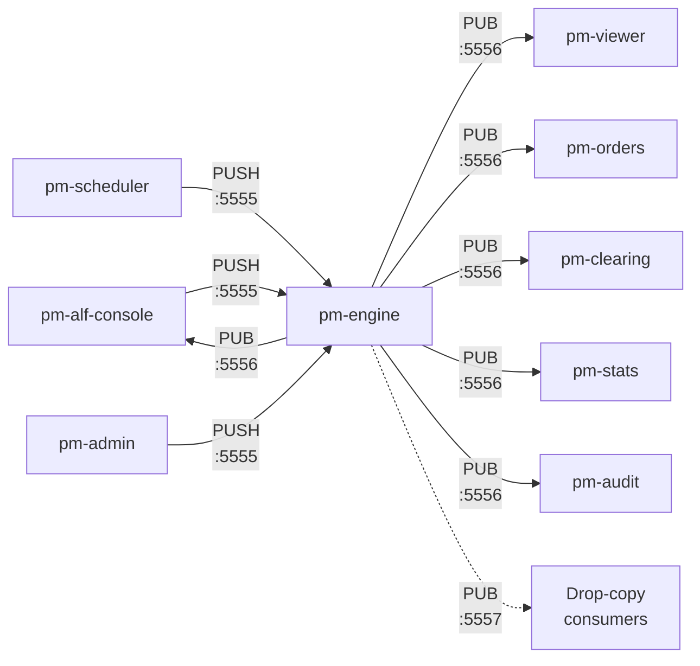
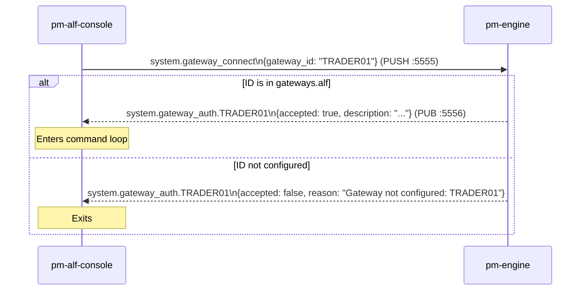

# Message Reference

!!! note "Learning objectives"
    After reading this page you will understand:

    - What a message is in the context of a distributed bus system and how it
      differs from a function call or shared data structure
    - How messages are defined in real systems (schema registries, IDL, plain JSON)
      and the pragmatic trade-offs EduMatcher makes
    - What ZeroMQ requires of a message — frames, encoding, topic filters
    - Why ZeroMQ has no broker, and what that means for reliability and operational
      complexity compared with broker-based systems (Kafka, RabbitMQ, NATS)
    - The full catalogue of messages used in EduMatcher, their fields, and which
      processes produce and consume each one


!!! info "Where the rest of this page comes from"
    Everything below the narrative sections — the topic index, the record types
    and one section per message — is **generated from `spec/messages/*.yaml`**
    by `pm-msgen generate`, and `pm-msgen check` fails in CI when the page and
    the spec disagree.

    This file, `270-preamble.md`, is the hand-written half: bus concepts,
    transports and the CALF protocol, none of which the spec can state. Edit it
    freely. To change anything about a *message*, edit its spec file.

## Background — Messages in a Bus System

### What is a message?

A function call passes data synchronously inside a process: the caller blocks
until the callee returns.  A **message** is an asynchronous unit of data sent
between processes.  The sender does not wait for a response; it hands the
message to the transport layer and moves on.

Messages carry three things:

1. **Identity** — what kind of event this is (the topic or message type)
2. **Payload** — the data describing the event
3. **Routing metadata** — information the transport needs to deliver it
   (addresses, topic filters, sequence numbers)

### How message formats are defined in real systems

In production systems there are three common approaches to defining what a
message looks like:

**Schema registries (Avro, Protobuf, Thrift)**
: Messages are defined in an Interface Definition Language (IDL) file.
  A code generator produces serialisers and deserialisers for every target
  language.  The registry enforces compatibility: a new field may be added
  but existing fields cannot be removed or re-typed without a version bump.
  Kafka and gRPC use this model.

**Canonical JSON/XML schemas (JSON Schema, OpenAPI, AsyncAPI)**
: Message shapes are described in a human-readable document (like AsyncAPI
  for event-driven systems).  Any process that speaks JSON can produce or
  consume a message without a code generator.  The schema document is the
  contract; violations surface only at runtime unless you add a validation
  library.

**Hardcoded structures**
: The simplest approach — message shape is implicit in the code that creates
  and reads it. No IDL, no registry, no generator. Fast to build, but schema
  drift is invisible until something breaks at runtime.

EduMatcher uses a small, repository-local **IDL and code-generation** workflow.
The YAML definitions in `spec/messages/*.yaml` are the canonical message
contracts. `pm-msgen generate` produces the Python bindings, applicable C
artifacts, and the generated sections of this reference; `pm-msgen check`
fails when any generated output diverges from its specification. Message
producers and consumers still exchange ordinary two-frame JSON over ZeroMQ,
so the generated bindings remain readable alongside the wire format they
enforce.

### What ZeroMQ requires of a message

ZeroMQ does not impose a message format.  It sees messages as one or more
opaque **frames** — byte arrays that are sent and received atomically as a
group.  It is up to the application to define what those bytes mean.

EduMatcher uses exactly **two frames** for every message:

```
frame[0]  →  topic string, UTF-8 encoded
             e.g.  b"order.ack.GW01"

frame[1]  →  JSON payload, UTF-8 encoded
             e.g.  b'{"order_id": "3f2a...", "accepted": true}'
```

`frame[0]` doubles as the **PUB/SUB filter key**.  A subscriber that
registers for prefix `"order.ack.GW01"` will receive only messages whose
first frame starts with that string — all other messages are dropped by the
ZeroMQ layer before the application even sees them.  This prefix-match filter
is evaluated in the kernel's socket buffer, not in Python, so it adds almost
no CPU overhead regardless of how many message types are on the bus.

### ZeroMQ without a broker

Most messaging systems interpose a **broker** between producers and consumers:

```
Producer ──▶  Broker  ──▶  Consumer
```

The broker buffers messages, persists them to disk, routes them to the right
queues, and handles consumer acknowledgements.  Examples: RabbitMQ, Apache
Kafka, NATS JetStream, AWS SQS.

ZeroMQ is **brokerless**.  Producers connect directly to consumers (or to the
engine in PUSH/PULL):

```
Gateway ──PUSH──▶  Engine ──PUB──▶  Subscriber A
                                ├──▶  Subscriber B
                                └──▶  Subscriber C
```

There is no third process in the middle.  The advantages and disadvantages
flow directly from that choice:

**Advantages of no broker**

| Advantage | Detail |
|-----------|--------|
| **Lower latency** | No extra network hop; messages go directly from sender to receiver |
| **Fewer moving parts** | No broker process to install, configure, monitor, or restart |
| **No single point of failure** | The engine is the bus; if the engine is up, the bus is up |
| **Simpler deployment** | `pip install pyzmq` is the entire installation |

**Disadvantages of no broker**

| Disadvantage | Detail |
|--------------|--------|
| **No persistence** | If a subscriber is down when a message is published, the message is gone forever |
| **No guaranteed delivery** | PUB/SUB drops messages to slow subscribers without warning |
| **No replay** | You cannot re-consume old messages; there is no commit log |
| **Tight coupling on addresses** | Producers must know the address of the engine; adding a new engine address requires reconfiguring all clients |
| **No backpressure** | A fast publisher can overwhelm a slow subscriber; the subscriber's receive buffer fills and messages are silently discarded |

For EduMatcher these trade-offs are acceptable: the system runs on
localhost, sessions last hours not days, and correctness over time is handled
by the GTC persistence layer rather than the message bus.  For a real exchange,
the audit trail would be written by a Kafka consumer (guaranteed delivery,
infinite replay), and the matching engine would use a persisted queue for order
intake.


## Message structure

Every inter-process communication in EduMatcher is a two-frame ZeroMQ
multipart message.  ZeroMQ (ZMQ) is a high-performance messaging library;
a "multipart message" is simply an ordered list of byte-array frames sent
and received atomically:

| Frame | Content |
|---|---|
| `frame[0]` | Topic string (UTF-8) — used for PUB/SUB prefix filtering |
| `frame[1]` | JSON payload (UTF-8) |

## Transport channels

| Channel | ZMQ pattern | Address | Direction |
|---|---|---|---|
| Order submission | PUSH → PULL | `tcp://127.0.0.1:5555` | Gateway → Engine |
| Event broadcast | PUB → SUB | `tcp://127.0.0.1:5556` | Engine → all subscribers |
| Drop copy | PUB → SUB | `tcp://127.0.0.1:5557` | Engine → drop-copy consumers |

The dedicated drop-copy channel is implemented in
`src/edumatcher/engine/drop_copy.py` and is documented in more detail on the
[Drop Copy](200-drop-copy.md) page.



### `system.gateway_connect`

**Motivation:** Enables explicit control/state synchronization so clients do not depend on timing of unsolicited events.
**Published by:** Requesting client process (for example pm-alf-console, pm-admin, pm-viewer, pm-stats, bots, or API gateway) via PUSH :5555

Sent by an ALF gateway at startup to authenticate its gateway ID against
`engine_config.yaml`.



| Field | Type | Description |
|---|---|---|
| `gateway_id` | string | Gateway identifier being requested (e.g. `TRADER01`) |

**Reply:** `system.gateway_auth.{GW_ID}`

| Field | Type | Description |
|---|---|---|
| `gateway_id` | string | Gateway identifier |
| `accepted` | boolean | `true` if ID is configured in `gateways.alf` |
| `reason` | string | Rejection reason when `accepted=false` |
| `description` | string | Optional configured description for the gateway |

When `accepted=false`, the gateway must terminate and MUST NOT submit orders.


### `order.new`

**Motivation:** Keeps order/quote lifecycle state synchronized between the initiating client and all interested subscribers.
**Published by:** Requesting client process (for example pm-alf-console, pm-admin, pm-viewer, pm-stats, bots, or API gateway) via PUSH :5555

Sent by a gateway to submit a new order for matching.

| Field | Type | Description |
|---|---|---|
| `id` | string (UUID) | Unique order identifier |
| `symbol` | string | Instrument ticker, e.g. `MSFT` |
| `side` | `"BUY"` \| `"SELL"` | Order side |
| `order_type` | string | `MARKET`, `LIMIT`, `STOP`, `STOP_LIMIT`, `FOK`, `IOC`, `ICEBERG`, `TRAILING_STOP` |
| `tif` | `"DAY"` \| `"GTC"` \| `"ATO"` \| `"ATC"` \| `"FOK"` | Time-in-force |
| `quantity` | integer | Total order quantity |
| `remaining_qty` | integer | Unfilled quantity (equals `quantity` on submission) |
| `gateway_id` | string | Originating gateway identifier, e.g. `TRADER01` |
| `timestamp` | float | Unix epoch (seconds) |
| `status` | string | Initial status, always `"NEW"` |
| `price` | float \| null | Limit price (LIMIT, STOP_LIMIT, FOK, ICEBERG) |
| `stop_price` | float \| null | Trigger price (STOP, STOP_LIMIT) |
| `visible_qty` | integer \| null | Peak size for ICEBERG orders |
| `displayed_qty` | integer \| null | Current visible slice (ICEBERG) |
| `trail_offset` | float \| null | Offset from best price for `TRAILING_STOP` orders |
| `smp_action` | string \| null | Self-match prevention: `NONE`, `CANCEL_AGGRESSOR`, `CANCEL_RESTING`, `CANCEL_BOTH`. `null` when the client omitted `SMP=`, in which case the engine resolves it to the gateway's configured `gateways.alf[].smp_action` default (else `"NONE"`) before the order reaches the book — see [Configuration — Gateway Fields](010-configuration.md#gateway-fields) |
| `client_tag` | string \| absent | Optional client-supplied tag echoed back on every lifecycle event for this order (ack, fill, cancelled, expired). When present, subscribers can map events back to their submission without a FIFO scheme. |
| `request_tag` | string \| absent | Optional amend/cancel request tag echoed on the resulting `order.amended`, `order.cancelled`, or rejected `order.ack`. Unlike `client_tag`, it identifies one request against an order, not the order itself. |
| `arrival_seq` | integer | Engine-assigned monotonic arrival sequence that determines time priority within a price level. Not supplied by the client (`0` on submission); populated by the engine and echoed in outbound order snapshots (see `order.orders.{GW_ID}`). |
| `oco_group_id` | string \| null | Set once this order is linked into an OCO pair via `order.oco`; `null` on a plain submission |
| `combo_parent_id` | string \| null | Parent `ComboOrder.id` when this order is a combo child leg; `null` for a standalone order |
| `leg_index` | integer \| null | 0-based position within the parent combo's leg list; `null` for a standalone order |
| `origin` | `"ORDER"` \| `"QUOTE"` \| `"IMPLIED"` | How this order entered the book: a direct order submission, a market-maker quote leg, or an engine-implied order |
| `quote_id` | string \| null | Set when `origin` is `"QUOTE"`, echoing the originating `quote.new`'s identifier; `null` otherwise |

**Valid field combinations by order type:**

| `order_type` | `price` | `stop_price` | `visible_qty` | `trail_offset` | Notes |
|---|---|---|---|---|---|
| `MARKET` | — | — | — | — | Fills at best available; rejected if symbol halted |
| `LIMIT` | Required | — | — | — | Rests if no match; subject to collar check |
| `STOP` | — | Required | — | — | Triggers a market order when stop price touched |
| `STOP_LIMIT` | Required | Required | — | — | Triggers a limit order when stop price touched |
| `FOK` | Required | — | — | — | Fill fully immediately or cancel entirely |
| `IOC` | Optional | — | — | — | Fill as much as possible immediately, cancel remainder |
| `ICEBERG` | Required | — | Required | — | Shows only `visible_qty`; replenishes from hidden reserve |
| `TRAILING_STOP` | — | — | — | Required | Stop price follows best opposite-side price by `trail_offset` |


### `order.cancel`

**Motivation:** Keeps order/quote lifecycle state synchronized between the initiating client and all interested subscribers.
**Published by:** Requesting client process (for example pm-alf-console, pm-admin, pm-viewer, pm-stats, bots, or API gateway) via PUSH :5555

Sent by a gateway to cancel a resting order.

| Field | Type | Description |
|---|---|---|
| `order_id` | string (UUID) | ID of the order to cancel |
| `gateway_id` | string | Gateway that owns the order |


### `order.amend`

**Motivation:** Keeps order/quote lifecycle state synchronized between the initiating client and all interested subscribers.
**Published by:** Requesting client process (for example pm-alf-console, pm-admin, pm-viewer, pm-stats, bots, or API gateway) via PUSH :5555

Sent by a gateway to amend the price and/or quantity of a resting order.

| Field | Type | Description |
|---|---|---|
| `order_id` | string (UUID) | ID of the order to amend |
| `gateway_id` | string | Gateway that owns the order |
| `price` | float \| absent | New limit price (omit to keep current) |
| `qty` | integer \| absent | New total quantity (omit to keep current) |

At least one of `price` or `qty` must be present.

**Priority rules:**

- Quantity decrease only → priority **preserved** (timestamp unchanged)
- Price change or quantity increase → priority **lost** (new timestamp assigned)

**Reply:** `order.amended.{GW_ID}` on success, or `order.ack.{GW_ID}` with `accepted=false` on rejection.


### `quote.new`

**Motivation:** Keeps order/quote lifecycle state synchronized between the initiating client and all interested subscribers.
**Published by:** Requesting client process (for example pm-alf-console, pm-admin, pm-viewer, pm-stats, bots, or API gateway) via PUSH :5555

Sent by a market-maker gateway to submit or replace a two-sided quote.
Role requirements and MM obligation controls are documented in
[Configuration - Role Privileges](010-configuration.md#role-privileges).

| Field | Type | Description |
|---|---|---|
| `gateway_id` | string | Originating gateway identifier |
| `symbol` | string | Instrument ticker |
| `quote_id` | string \| absent | Optional client-provided quote label |
| `bid_price` | float | Bid price |
| `bid_qty` | integer | Bid quantity |
| `ask_price` | float | Ask price |
| `ask_qty` | integer | Ask quantity |
| `tif` | string | Quote leg time-in-force (`DAY` or `GTC`) |

Replies:

- `quote.ack.{GW_ID}`
- `quote.status.{GW_ID}`

### `quote.ack.{GW_ID}`

**Motivation:** Keeps order/quote lifecycle state synchronized between the initiating client and all interested subscribers.
**Published by:** pm-engine via PUB :5556

Acknowledgement of a `quote.new` submission.

| Field | Type | Description |
|---|---|---|
| `quote_id` | string | Client-provided quote label (echoed from request) |
| `accepted` | boolean | `true` = accepted; `false` = rejected |
| `reason` | string | Rejection reason (empty string when accepted) |
| `bid_order_id` | string (UUID) | Order ID of the bid leg *(present when accepted)* |
| `ask_order_id` | string (UUID) | Order ID of the ask leg *(present when accepted)* |

### `quote.status.{GW_ID}`

**Motivation:** Keeps order/quote lifecycle state synchronized between the initiating client and all interested subscribers.
**Published by:** pm-engine via PUB :5556

Published when the quote's lifecycle state changes (e.g. a fill inactivates the quote or a cancel removes it).

| Field | Type | Description |
|---|---|---|
| `quote_id` | string | Client-provided quote label |
| `status` | string | New quote state (see values below) |
| `reason` | string | Additional context (e.g. halt reason); empty when not applicable |

**Status values:**

| Value | Meaning |
|---|---|
| `ACTIVE` | Quote successfully placed on the book (both legs resting) |
| `INACTIVE_BID_FILLED` | Bid leg filled; ask leg auto-cancelled |
| `INACTIVE_ASK_FILLED` | Ask leg filled; bid leg auto-cancelled |
| `CANCELLED` | Quote removed (explicit cancel, kill switch, or halt) |

### `quote.cancel`

**Motivation:** Keeps order/quote lifecycle state synchronized between the initiating client and all interested subscribers.
**Published by:** Requesting client process (for example pm-alf-console, pm-admin, pm-viewer, pm-stats, bots, or API gateway) via PUSH :5555

Cancel the active quote for one symbol.

| Field | Type | Description |
|---|---|---|
| `gateway_id` | string | Gateway identifier |
| `symbol` | string | Instrument ticker |


## CALF TCP protocol (`pm-md-gwy`)

`pm-md-gwy` bridges the internal ZMQ bus documented above to a separate,
external-facing protocol: a newline-delimited UTF-8 text feed on TCP port
`5570` (`MSGTYPE|KEY=VALUE|KEY=VALUE\n` lines), independent of ZMQ topics and
payload shapes. It is not just a passthrough of the messages above — it
normalises, re-sequences, and reshapes them into CALF's own message types.

| Channel | Message type | Wildcard (`SYM=*`) | Baseline `SNAP`? | Carries |
|---|---|---|---|---|
| `TOP` | `MD` | Yes | Yes | Best bid/ask/last |
| `TRADE` | `TRADE` | Yes | No | Individual trade prints |
| `STATE` | `STATE` | Yes | Yes | Session/symbol state transitions |
| `INDEX` | `IDX` | No | Yes | Index level updates |
| `DEPTH` | `DEPTH` | No | Yes | Aggregated multi-level order book (Level 2) |
| `AUCTION` | `AUCTION` | Yes | No | Auction uncross result (equilibrium price/qty, imbalance) |
| `CB` | `CB` | No | Yes | Circuit-breaker halt/resume detail beyond `STATE`'s coarse transition |

Client requests are `HELLO` (authenticate), `SUB`/`UNSUB` (subscribe/cancel),
`RESUME` (replay one stream from a known sequence — repeatable, one per
stream), `SYMBOLS` (ask which instruments exist), `PING`, and `EXIT`. Gateway replies include `WELCOME`, a baseline
`SNAP` per new stream on the five channels that have one, the seven message
types above, periodic `HB` heartbeats, and `ERR` on protocol/subscription
violations.

Two behaviours are easy to get wrong from the table alone:

- **`MD` is a delta, and an empty value is meaningful.** Only changed fields
  are sent; an omitted field means *unchanged*. An explicitly empty `BID=` or
  `ASK=` means that book side is now **empty** and the client must discard the
  price rather than keep the last one it saw.
- **`RESUME` is per stream.** `LASTSEQ` describes one `(CH, SYM)` position, so
  a reconnecting client sends one `RESUME` per stream it was following. It is
  not a flag on `HELLO`.
- **Ask for the symbol universe; do not wait for it.** `WELCOME|SYMBOLS=` is
  optional and omitted entirely by a gateway started without a readable engine
  config. Send `SYMBOLS` after the handshake, and read its `COUNT` — an empty
  universe omits the list rather than sending it empty.
- **Read `REF=` before you format a price.** It carries each symbol's display
  precision as `SYM:DEC` tuples, on both `WELCOME` and the `SYMBOLS` reply, and
  is the only route a market data client has to that value. A gateway that
  predates the field omits it entirely, in which case assume `2` decimals —
  knowingly, because getting this wrong rounds every price the client shows.

The full protocol — every field table, the `WELCOME`/`SNAP` handshake,
sequence-gap detection and `RESUME` recovery, subscription limits, and the
complete error-code table — is maintained in one place to avoid drift:
[Market Data Feed (CALF)](240-calf-gateway.md), with the normative
wire-format specification in the
[CALF Protocol Reference](920-app-calf-protocol.md).


## See also

- [Processes](170-processes.md) — which process subscribes to which topic prefix
- [ALF Console](055-alf-console.md) — how participants receive fill, book, and risk events
- [Commands](160-exchange-commands.md) — `ExchangeCommandClient` methods and their underlying message topics
- [Drop Copy](200-drop-copy.md) — the separate :5557 socket for fill-only event feeds
- [Risk Controls](120-risk-controls.md) — `risk.*` message payloads in detail
- [CALF TCP Protocol](#calf-tcp-protocol-pm-md-gwy) — external market-data feed message types
