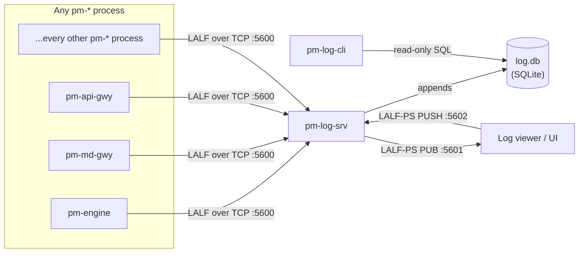
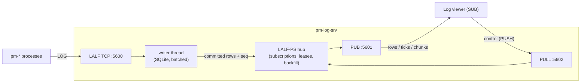

# Centralized Log Server

!!! note "Learning objectives"
    After reading this page you will understand:

    - Why a centralized log server matters and what `pm-log-srv` records
    - How to start `pm-log-srv` and where `log.db` lives
    - The LALF wire protocol at a glance and how auto-detection works
    - How LALF-PS distributes logs over ZeroMQ to live viewers, and why a
      blind `PUB` socket forces the lease-based liveness design it uses
    - All `pm-log-cli` subcommands, options, and output formats
    - A practical cookbook of query workflows grouped by purpose
    - How to read a `diagnose` report and act on its recommendations


## Overview

Every EduMatcher process — the engine, gateways, `pm-stats`, `pm-audit`,
bots, viewers, admin tools — already logs through Python's standard
`logging` module. Until now, each process's log output went only to its own
terminal or its own redirected file: there was no single place to ask "what
did every process log in the last five minutes," and correlating an issue
spanning two processes meant manually lining up timestamps across separate
terminal scrollbacks.

`pm-log-srv` solves this the same way `pm-audit` already solved it for
trading events and `pm-stats` solved it for market statistics: a dedicated
collector process, a purpose-built SQLite schema, and a read-only query CLI.

| Component | Role | Type |
|---|---|---|
| **`pm-log-srv`** | Collector — accepts logging from every `pm-*` process over TCP and appends it to a queryable SQLite database | Long-running process |
| **`pm-log-cli`** | Query/troubleshooting tool — reads `log.db` and prints structured output, including a rule-based `diagnose` report | One-shot CLI |
| **LALF-PS** | Distribution interface — the ZeroMQ `PUB`/`PULL` pair `pm-log-srv` binds so live viewers can be pushed rows as they land instead of polling `log.db` | Interface, not a process |

The collector and the query tool are completely independent. `pm-log-cli`
reads `log.db` directly from disk and works even when `pm-log-srv` is not
currently running — the same posture `pm-audit-cli`/`pm-stats-cli` already
take relative to their own recorder processes.



There are therefore two distinct ways to get logging *out* of
`pm-log-srv`, and they suit different jobs:

| | `pm-log-cli` | LALF-PS |
|---|---|---|
| Transport | Direct read-only SQL against `log.db` | ZeroMQ `PUB`/`PULL` |
| Works when the server is stopped | Yes | No |
| Latency | Whatever your polling interval is | Pushed on commit |
| Best for | Ad-hoc investigation, scripting, export | Live viewers, dashboards, anything long-lived and interactive |

`pm-log-srv` is not a replacement for `pm-audit` or `pm-stats`. Trading
events (orders, fills) and market statistics have their own purpose-built
collectors; `pm-log-srv` is for operational `logging`-module output only —
think "what would otherwise have gone to a terminal or a log file."

!!! note "Phased rollout"
    As of this revision, `pm-log-srv` and `pm-log-cli` are fully implemented
    and usable standalone — you can start the server and point a test client
    at it today. Automatically wiring every existing `pm-*` process's own
    logging into a `TcpLogHandler` (so it auto-detects and uses a running
    `pm-log-srv` with zero configuration) is a follow-up phase of this
    feature and has not yet been rolled out to every entrypoint. Until then,
    use `pm-log-srv`/`pm-log-cli` to inspect logging emitted by any client
    that already speaks LALF (see the wire protocol reference below if you
    are writing one).


## Data Directory

`log.db` is stored in the same data directory used by all other EduMatcher
persistent files:

| Running mode | Default location |
|---|---|
| Source checkout (`poetry run pm-log-srv`) | `<repo>/src/data/log.db` |
| Installed (`pm-log-srv` on PATH) | `~/.local/share/edumatcher/log.db` |

Override with `EDUMATCHER_DATA_DIR` or `--db`:

```bash
export EDUMATCHER_DATA_DIR="$HOME/sessions/morning"
pm-log-srv  # writes to $HOME/sessions/morning/log.db
```


## pm-log-srv — Log Collector

`pm-log-srv` binds a TCP listen socket, accepts any number of concurrent
LALF connections, and appends every accepted `LOG` record to `log.db`. It
never talks to the engine's ZeroMQ bus, to the engine, or to any gateway
— its own ZeroMQ sockets (LALF-PS, below) carry log distribution only and
are entirely separate from the trading bus on `:5555`/`:5556`.

```bash
pm-log-srv [options]
```

### Startup options

| Flag | Default | Description |
|---|---|---|
| `--host ADDR` | from config / `0.0.0.0` | TCP bind address |
| `--port PORT` | from config / `5600` | TCP listen port for LALF clients |
| `--db PATH` | from config / `data/log.db` | SQLite database path |
| `--retention-days N` | from config / `30` | Prune `log_events` rows older than N days, once per hour. `0` disables pruning (unbounded retention) |
| `--max-message-bytes N` | from config / `65536` | Maximum `LOG` payload size before truncation — oversized messages are truncated and stored, never dropped |
| `--pub-port PORT` | from config / `5601` | LALF-PS ZeroMQ `PUB` bind port (log distribution out) |
| `--pull-port PORT` | from config / `5602` | LALF-PS ZeroMQ `PULL` bind port (subscriber control in) |
| `--lease-sec N` | from config / `30` | Subscription lease TTL; a subscriber that stops renewing is reaped after this long |
| `--no-pubsub` | off | Disable LALF-PS entirely — bind no ZeroMQ sockets and run as a pure TCP collector |
| `--config PATH` / `-c` | `engine_config.yaml` | Engine config YAML path, read for the optional `log_server:` block |
| `--log-level LEVEL` | `WARNING` | Explicit level: `CRITICAL`, `ERROR`, `WARNING`, `INFO`, `DEBUG` |
| `-v` / `--verbose` | off | Increase verbosity (`-v` → `INFO`, `-vv` → `DEBUG`) |
| `-q` / `--quiet` | off | Reduce log output to warnings/errors |

CLI flags override the corresponding field in `engine_config.yaml`'s
`log_server:` block for that invocation only. See
[Configuration — Configuring pm-log-srv](010-configuration.md#configuring-pm-log-srv)
for the full config field reference.

```bash
# Start with defaults — binds 0.0.0.0:5600, writes to data/log.db
pm-log-srv

# Loopback-only, custom port, verbose startup logging
pm-log-srv --host 127.0.0.1 --port 5600 -v

# Unbounded retention (never prune)
pm-log-srv --retention-days 0

# Point at a specific database for a scratch/test session
pm-log-srv --db /tmp/session.db

# Collector only — no ZeroMQ sockets bound at all
pm-log-srv --no-pubsub

# Move LALF-PS off the default ports (e.g. two servers on one host)
pm-log-srv --port 5700 --pub-port 5701 --pull-port 5702
```

Expected startup output:

```
2026-07-29 09:30:00,180 INFO edumatcher.log_srv.main - starting pm-log-srv with log level INFO
2026-07-29 09:30:00,206 INFO edumatcher.log_srv.server - pm-log-srv 'log-srv01' listening on 127.0.0.1:5600 db=data/log.db retention_days=30
2026-07-29 09:30:00,211 INFO edumatcher.log_srv.pubsub - LALF-PS interface up: PUB=tcp://127.0.0.1:5601 PULL=tcp://127.0.0.1:5602 lease=30s max_subscribers=32
```

`pm-log-srv` occupies a contiguous three-port block: `5600` for LALF/TCP
collection, `5601` for the LALF-PS `PUB`, `5602` for the LALF-PS `PULL`.
All three must differ; the server refuses to start otherwise.

`pm-log-srv` is the one `pm-*` process that always logs to stdout/file only
— it never sends its own operational logging to another `pm-log-srv`
instance (there is nothing listening for its own bootstrap messages before
it has finished starting).

### Retention

`log_events` defaults to a bounded 30-day retention rather than growing
unbounded like `pm-audit`'s/`pm-stats`' own deliberately-forever stores —
operational logging is disposable in a way trading history and market
statistics are not. Pruning runs automatically once per hour in the
background; `pm-log-cli prune` (below) is also available for pruning on
demand.


## LALF — The Wire Protocol at a Glance

Every `pm-*` process (or, in principle, any TCP client in any language)
speaks LALF ("Logging ALF") to `pm-log-srv`: a long-lived TCP connection,
one `HELLO`/`WELCOME` handshake, and then a stream of `LOG` messages until
the connection ends.

```text
C: HELLO|CLIENT=pm-md-gwy|PID=51002|HOST=trader-laptop|PROTO=LALF1
S: WELCOME|PROTO=LALF1|SRV=log-srv01|HBINT=5|SESSION=7f3a9c21
C: LOG|SEQ=1|TS=2026-07-28T09:30:00.010Z|LEVEL=INFO|LOGGER=edumatcher.md_gateway.gateway|LEN=29
   md-gwy01 listening on :5570
C: HB|TS=2026-07-28T09:30:05.500Z
C: EXIT
```

For the full normative wire specification — every message type, field table,
error code, and conformance rule — see the
[LALF Protocol Reference](940-app-lalf-protocol.md).


## LALF-PS — The ZeroMQ Log Distribution Interface

LALF brings logging *in*. **LALF-PS** ("LALF Pub/Sub") sends it back
*out*, over ZeroMQ, to anything that wants to watch the system live: a log
viewer, a filter/search UI, a dashboard, an alerting shim.

The alternative — having each viewer poll `log.db` on a timer — is what
LALF-PS exists to avoid. Polling forces an unpleasant trade: poll often
and you burn CPU re-running the same query against a growing table for
nothing most of the time; poll rarely and your viewer lags reality by
however long the interval is. Neither is a good foundation for a UI whose
whole job is to show you what is happening *now*. LALF-PS pushes instead,
the moment a row is committed.

### Socket topology

`pm-log-srv` binds two ZeroMQ sockets. The shape is deliberately
identical to `pm-index`'s own `PUB`/`PULL` pair, so a client written
against one needs no new socket vocabulary for the other.

| Socket | Bound by | Default address | Carries |
|---|---|---|---|
| `PUB` | `pm-log-srv` | `tcp://…:5601` | Everything outbound: live rows, notification ticks, backfill chunks, control acks, errors, server state |
| `PULL` | `pm-log-srv` | `tcp://…:5602` | Everything inbound: subscribe, renew, unsubscribe, backfill, status |

A subscriber holds the mirror image: a `SUB` connected to `:5601` and a
`PUSH` connected to `:5602`.



Every message is the same two-frame envelope used everywhere else on the
bus — frame 0 is the topic string, frame 1 is a JSON payload — so ZeroMQ's
prefix filter does the routing in the kernel before your process ever sees
a byte.

### `sub_id` — the routing key

Every control message carries a subscriber-chosen `sub_id`. It plays
exactly the role `gateway_id` plays elsewhere on the bus: the server
appends it to each reply topic, so a subscriber needs only two `SUBSCRIBE`
prefixes to receive everything relevant to it:

```python
sub.setsockopt(zmq.SUBSCRIBE, b"log.")               # simplest: everything
# or, more precisely:
sub.setsockopt(zmq.SUBSCRIBE, f"log.event.{sub_id}".encode())
sub.setsockopt(zmq.SUBSCRIBE, f"log.backfill.{sub_id}".encode())
sub.setsockopt(zmq.SUBSCRIBE, b"log.server_state")
```

Pick something stable and unique — `logview-<pid>`, `dashboard-01`. Two
live subscribers sharing a `sub_id` will each receive the other's traffic
and fight over one lease, because to the server they *are* one
subscription.

### Two modes: `STREAM` and `NOTIFY`

A subscription declares up front what it wants delivered, because the two
plausible kinds of log UI want opposite things.

**`STREAM`** — full rows are pushed as they are committed, on
`log.event.{sub_id}`. This is what a live tail wants: the viewer never
touches `log.db` at all and can run on a different host from the database.
The cost is bus traffic proportional to the log volume that passes your
filter, which is exactly why the filter matters.

**`NOTIFY`** — the server publishes only a small tick on
`log.notify.{sub_id}` saying "*n* matching rows arrived, the highest is
seq *X*", with a per-level breakdown and no row bodies whatsoever. This
suits a UI that already reads `log.db` itself and just needs to know when
to refresh, or one that only lights up an indicator on new errors. Ticks
are coalesced over `notify_interval_ms` (default 250 ms), so a burst of a
thousand rows produces one message rather than a thousand.

You can change your mind at any time by re-sending `log.subscribe` with a
different `mode` — see idempotency, below.

### Filtering

Both modes take the same optional `filter` object, and the server applies
it identically to live rows and to backfill rows. That last point matters
more than it sounds: it is what guarantees a viewer sees no gap and no
duplication at the seam where its historical window meets the live stream.

| Field | Type | Description |
|---|---|---|
| `min_level` | string | `DEBUG` / `INFO` / `WARNING` / `ERROR` / `CRITICAL` — rows below are excluded |
| `processes` | array | Exact process-name match, e.g. `["pm-engine", "pm-md-gwy"]` |
| `loggers` | array | **Prefix** match, so `["edumatcher.engine"]` also matches `edumatcher.engine.book` |
| `sessions` | array | Exact LALF session-id match, to follow one connection of one process |
| `contains` | string | Case-insensitive substring on the message body |
| `exceptions_only` | boolean | Only rows carrying a traceback |

All present fields are ANDed. An omitted field constrains nothing, and an
absent `filter` matches everything. A malformed filter is rejected with
`INVALID_FILTER` rather than silently degrading to "match everything" —
a filter that quietly stops filtering is how a viewer ends up flooded.

Filter server-side rather than client-side wherever you can. A
`min_level: "WARNING"` filter on a busy system can be the difference
between a few messages a minute and a few thousand.

### Backfill — "the last *n* minutes"

A log viewer is nearly useless if it starts empty and only shows you what
happens from now on; the interesting thing usually already happened. Two
ways to prime it:

- Pass `backfill_minutes` on `log.subscribe`, and the server starts the
  replay immediately after acknowledging the subscription.
- Send `log.backfill_request` at any time afterwards — to widen the
  window, or to re-fetch with a different filter without disturbing the
  live subscription.

Either way the response arrives as a sequence of `log.backfill.{sub_id}`
messages sharing one `request_id`, in ascending `seq` order, with the last
one setting `done: true`. **Keep reading until you see `done`.** An empty
window still produces exactly one chunk with `rows: []` and `done: true`,
so you never wait forever on a quiet system.

Chunking is not a nicety. A busy hour can be hundreds of thousands of
rows; sending that as one response would mean both a multi-megabyte
ZeroMQ frame and a SQLite scan long enough to stall the server's main
loop — which would stall LALF collection, which would back-pressure every
`pm-*` process in the system. The server instead emits at most one
bounded chunk per loop iteration, so an arbitrarily large window costs a
bounded amount of work per pass.

Two limits apply: `max_backfill_minutes` (default 1440, i.e. 24 h) caps
the window and rejects anything larger with `INVALID_WINDOW`;
`max_backfill_rows` (default 100 000) caps the volume, and when it bites
the final chunk sets `truncated: true` so you know history was cut short
rather than genuinely exhausted.

### Liveness — why leases

This is the part of the design that is not obvious, so it is worth being
explicit about the problem.

A ZeroMQ `PUB` socket is **blind**. It never learns who is attached,
subscribers come and go without the publisher being told, and publishing
into the void succeeds silently. There is no publish-side event that
means "my subscriber died" — nothing analogous to the TCP `recv()`
returning zero bytes that tells the LALF side a producer has gone. A
naive implementation would happily keep filtering rows, formatting
messages and accumulating per-subscriber state for a viewer that was
killed an hour ago.

LALF-PS therefore makes every subscription an explicit **lease**:

1. `log.subscribe` creates the subscription with a TTL. The server
   *clamps* your requested `lease_sec` to its `max_lease_sec` rather than
   rejecting it, and tells you what you actually got in the ack — along
   with `renew_before_sec`, which is always half the granted lease.
2. The subscriber sends `log.renew` every `renew_before_sec`. This is the
   *only* signal that keeps the subscription alive. (A
   `log.backfill_request` also counts as proof of life, so a subscriber
   pulling a large window cannot expire mid-transfer.)
3. If no renewal arrives before the deadline, the server reaps the
   subscription: filter state gone, buffered rows discarded, any in-flight
   backfill job cancelled.
4. A final `log.lease_expired.{sub_id}` is published on the way out. This
   is for the case where the subscriber is not dead but merely wedged — it
   tells such a client unambiguously that it must re-subscribe, instead of
   sitting forever waiting for rows that will never come.

A crashed viewer therefore costs the server at most one lease period of
buffering, and the mechanism is transport-independent: it would work
identically over any fan-out that lacks peer visibility.

!!! tip "Choosing a lease"
    Shorter leases reap faster but cost more control traffic; the default
    30 s means a dead viewer is forgotten within 30 s at a cost of one
    small `PUSH` every 15 s. Raise it for a viewer on a flaky link, lower
    it if you run many short-lived subscribers.

### The other failure: a subscriber that is slow, not dead

Leases handle death. They do not handle a subscriber that is alive and
renewing but simply cannot read as fast as the system logs — and left
alone, that subscriber would grow the server's memory without bound.

Two bounds apply. Each subscription's row buffer is capped at
`max_pending_rows` (default 20 000): past that, the **oldest** buffered
rows are shed and a running `dropped` counter is reported in every
subsequent `log.event`. Separately, the `PUB` socket carries a bounded
`pub_sndhwm` (default 10 000) so ZeroMQ's own queue for a wedged-but-
connected peer cannot grow indefinitely either.

`dropped` climbing is the signal that a viewer is not keeping up and its
view has gaps. The cures, in order of preference: tighten the filter,
switch to `NOTIFY`, or re-backfill to close the gap.

### Server liveness

`log.server_state` is published on the un-suffixed topic — no `sub_id` —
every `heartbeat_interval_sec`, plus once with `state: "DOWN"` at
shutdown. Any client can subscribe to it without having subscribed to
anything else, which makes it the natural way for a UI to show
"log server up/down" and to read the server's counters before deciding
what to ask for.

Absence of `log.server_state` for more than a couple of intervals is how
a subscriber distinguishes "the *server* went away" from "*my
subscription* went away" — two situations that need different responses.

### Ordering, durability and the slow-joiner race

Three guarantees worth stating plainly:

**Rows are published after commit, never before.** The server publishes
only once the SQLite transaction that assigned each row's `seq` has
committed. A subscriber can therefore never observe a row that a
subsequent crash would have rolled back: the live stream and `log.db` can
never disagree.

**`seq` is the ordering key.** It is monotonic and server-assigned; rows
arrive in ascending `seq` within and across messages, in both live and
backfill paths. Use it, not timestamps — `client_ts` comes from the
producing process's own clock and two processes' clocks need not agree.

**The first ack can be lost.** This is ZeroMQ's classic *slow joiner*
behaviour: `connect()` completes asynchronously, so a message published
in the moments after your `SUB` socket connects may be dropped before
delivery. LALF-PS handles this by making `log.subscribe` **idempotent** —
re-sending it for an existing `sub_id` replaces the mode and filter,
renews the lease, and re-emits the ack, while preserving the lifetime
counters. If you have not seen your ack within a second, simply send
`log.subscribe` again.

### Error replies

Every rejected request is answered on `log.error.{sub_id}` with a
machine-readable `code`:

| Code | Meaning | What to do |
|---|---|---|
| `BAD_REQUEST` | Unsupported topic or malformed payload | Fix the request; do not retry as-is |
| `UNKNOWN_SUB` | No such subscription — never created, or already reaped | Send `log.subscribe` |
| `TOO_MANY_SUBS` | Server is at `max_subscribers` | Back off and retry, or raise the limit |
| `INVALID_FILTER` | Malformed `filter` object | Fix the filter |
| `INVALID_MODE` | `mode` was neither `STREAM` nor `NOTIFY` | Fix the mode |
| `INVALID_WINDOW` | `minutes` absent, non-positive, or above `max_backfill_minutes` | Request a smaller window |
| `INTERNAL` | Server-side failure, e.g. a backfill query error | Retry; check the server's stdout logging |

A control message arriving with no usable `sub_id` is dropped and logged
server-side — there is no reply topic to answer on.

### A minimal subscriber

The whole interface in one file. This connects, backfills the last five
minutes of warnings and above, then tails live while keeping its lease
alive.

```python
import time
import zmq
from edumatcher.config import LOG_SRV_PUB_ADDR, LOG_SRV_PULL_ADDR
from edumatcher.models.message import (
    decode,
    make_log_renew_msg,
    make_log_subscribe_msg,
    make_log_unsubscribe_msg,
)

SUB_ID = "logview-demo"
ctx = zmq.Context.instance()

sub = ctx.socket(zmq.SUB)
sub.connect(LOG_SRV_PUB_ADDR)
sub.setsockopt(zmq.SUBSCRIBE, b"log.")

push = ctx.socket(zmq.PUSH)
push.connect(LOG_SRV_PULL_ADDR)
time.sleep(0.2)  # let both connections settle before the first publish

push.send_multipart(
    make_log_subscribe_msg(
        SUB_ID,
        mode="STREAM",
        log_filter={"min_level": "WARNING"},
        backfill_minutes=5,
    )
)

renew_every = 15.0          # updated from the ack's renew_before_sec
next_renew = time.monotonic() + renew_every
poller = zmq.Poller()
poller.register(sub, zmq.POLLIN)

try:
    while True:
        for _ in dict(poller.poll(timeout=250)):
            topic, payload = decode(sub.recv_multipart())

            if topic == f"log.subscribe_ack.{SUB_ID}":
                # Always trust the ack over what you asked for: the server
                # clamps the lease and normalises the filter.
                renew_every = payload["renew_before_sec"]
                next_renew = time.monotonic() + renew_every

            elif topic in (f"log.event.{SUB_ID}", f"log.backfill.{SUB_ID}"):
                for row in payload["rows"]:
                    print(f"{row['client_ts']} {row['level']:<8} "
                          f"{row['process']:<12} {row['message']}")
                if payload.get("dropped"):
                    print(f"!! {payload['dropped']} rows dropped — not keeping up")

            elif topic == f"log.lease_expired.{SUB_ID}":
                # We were reaped. Re-subscribing is always safe.
                push.send_multipart(
                    make_log_subscribe_msg(SUB_ID, "STREAM",
                                           {"min_level": "WARNING"})
                )

            elif topic == "log.server_state" and payload["state"] == "DOWN":
                print("pm-log-srv is shutting down")

        if time.monotonic() >= next_renew:
            push.send_multipart(make_log_renew_msg(SUB_ID))
            next_renew = time.monotonic() + renew_every
finally:
    push.send_multipart(make_log_unsubscribe_msg(SUB_ID))
    time.sleep(0.1)
```

For a `NOTIFY`-mode client, replace the `mode` and handle
`log.notify.{SUB_ID}` instead — the payload gives you `count`, a `levels`
breakdown and `last_seq`, and you read the actual rows from `log.db`
yourself with `WHERE seq > <your watermark>`.

### Tuning

All of these live in the `log_server:` block of `engine_config.yaml`; see
[the config spec](990-app-config-spec.md#67-log_server-pm-log-srv-centralized-lalf-log-collector-logsrvprocspec)
for the authoritative table.

| Setting | Default | Raise it when… | Lower it when… |
|---|---|---|---|
| `lease_sec` | `30` | Subscribers sit on a flaky or high-latency link | You want dead viewers reaped faster |
| `max_subscribers` | `32` | You genuinely run many viewers | You want a hard guard against runaway clients |
| `notify_interval_ms` | `250` | Notify traffic is itself becoming noise | A UI needs snappier refreshes |
| `backfill_chunk_rows` | `500` | Backfills feel slow and the network is fast | Individual messages are too large for your consumer |
| `max_backfill_minutes` | `1440` | Users legitimately want multi-day windows | You want to protect the server from expensive scans |
| `max_pending_rows` | `20000` | Subscribers are bursty but do catch up | Memory matters more than gap-free delivery |

### Troubleshooting

| Symptom | Likely cause | Fix |
|---|---|---|
| No `log.subscribe_ack` ever arrives | Slow-joiner race, or wrong `SUBSCRIBE` prefix | Re-send `log.subscribe` (it is idempotent); check you subscribed to `log.` or the exact reply topics |
| Ack arrives, then nothing | Filter is stricter than you think, or the system really is quiet | Inspect the **normalised** `filter` in the ack; send `log.status_request`; try `min_level: "DEBUG"` |
| `UNKNOWN_SUB` on renew | Your lease already expired | Re-send `log.subscribe`; renew at `renew_before_sec`, not at `lease_sec` |
| `dropped` climbing in `log.event` | Subscriber is slower than the log volume | Tighten the filter, switch to `NOTIFY`, or re-backfill |
| Backfill seems to never end | You stopped reading before `done: true` | Keep consuming chunks until `done`; correlate by `request_id` |
| `truncated: true` on the last chunk | Window held more rows than `max_backfill_rows` | Narrow the window or the filter, or raise the limit |
| Nothing at all on `:5601` | LALF-PS disabled or on other ports | Check `--no-pubsub` / `pubsub_enabled`, and the `pub_port`/`pull_port` settings |
| Server refuses to start, port error | `port`, `pub_port` and `pull_port` are not all distinct | Give each a different port |

For the complete normative field tables of every LALF-PS message, see
[Message Reference — LALF-PS messages](270-message-reference.md#family-log).


## pm-log-cli — Query/Troubleshooting Tool

`pm-log-cli` is a read-only command-line tool for querying and
troubleshooting `log.db` — no LALF/TCP connection is made, so a busy, slow,
or currently-stopped `pm-log-srv` never blocks you from inspecting data it
already collected.

```bash
pm-log-cli [global-options] COMMAND [command-options]
```

### Global options

| Flag | Default | Description |
|---|---|---|
| `--db PATH` | `data/log.db` | SQLite database path |
| `--format human\|json` | `human` | Output format |

`--format` is accepted both before and after the subcommand — both
`pm-log-cli --format json query` and `pm-log-cli query --format json` work,
since a value given after the subcommand always wins if both are present.

**Output formats:**

| Format | When to use |
|---|---|
| `human` | Interactive terminal — aligned columns, level-colored when the terminal supports it |
| `json` | Automation, scripts, downstream processing — one JSON object per row for `tail`/`query`/`processes`, a single JSON object for `stats`/`diagnose` |

**No-result behaviour:**

- `human`: prints `No matching log events found.`
- `json`: prints nothing (an empty stream of lines) for row-based commands

### Exit codes

| Code | Meaning |
|---|---|
| `0` | Success |
| `1` | Database error — `log.db` not found or not readable (has `pm-log-srv` ever run?) |
| `2` | Argument error (invalid flag combination) |
| `3` | `diagnose` found at least one issue (only meaningful for scripting; `query`/`tail`/`stats`/`processes`/`prune` never use this code) |


### `query` — Filtered historical search

The most flexible command — filter by process, level, logger, time range,
free text, or exception presence.

```bash
pm-log-cli query [options]
```

**Options:**

| Flag | Default | Description |
|---|---|---|
| `--process NAME` | (all) | Exact match against the process name |
| `--level LEVEL[,LEVEL...]` | (all) | One or more of `DEBUG,INFO,WARNING,ERROR,CRITICAL` |
| `--logger PATTERN` | (all) | SQL `LIKE` pattern against the logger name (e.g. `edumatcher.md_gateway.%`) |
| `--since ISO_TS` | (none) | Start of time range against `client_ts` |
| `--until ISO_TS` | (none) | End of time range against `client_ts` |
| `--grep TEXT` | (none) | Case-insensitive substring search against the message |
| `--has-exception` | off | Only rows with a formatted exception/traceback attached |
| `--limit N` | `500` | Maximum rows returned |
| `--reverse` | off | Oldest-first instead of newest-first |

**Output columns:** `seq`, `client_ts`, `process`, `instance`, `level`,
`logger`, `message`.

**Examples:**

```bash
# Every ERROR/CRITICAL from a specific process
pm-log-cli query --process pm-md-gwy --level ERROR,CRITICAL

# Rows with an attached traceback, most recent first
pm-log-cli query --has-exception --limit 20

# Free-text search across every process's messages
pm-log-cli query --grep "Connection reset"

# One process's logging for a specific subsystem
pm-log-cli query --process pm-api-gwy --logger "edumatcher.api_gateway.%"

# A specific time window, oldest first
pm-log-cli query --since 2026-07-28T09:30:00.000Z --until 2026-07-28T09:35:00.000Z --reverse

# Export as JSON for further processing
pm-log-cli --format json query --process pm-engine --limit 5000 > engine_log.json
```


### `tail` — Follow new rows in real time

Polls for new rows past the highest sequence number already shown and
prints them as they arrive. There is no push-based subscription — `tail`
polls on `--interval` seconds.

```bash
pm-log-cli tail [options]
```

**Options:**

| Flag | Default | Description |
|---|---|---|
| `--process NAME` | (all) | Filter by process name |
| `--level LEVEL[,LEVEL...]` | (all) | Filter by one or more levels |
| `--logger PATTERN` | (all) | SQL `LIKE` pattern on logger |
| `--interval SEC` | `1.0` | Polling interval |

**Examples:**

```bash
# Follow everything as it arrives
pm-log-cli tail

# Follow only one process's warnings and above
pm-log-cli tail --process pm-md-gwy --level WARNING,ERROR,CRITICAL

# Follow as JSON for piping into another tool
pm-log-cli --format json tail | jq .
```

Stop with Ctrl-C.


### `processes` — Connected/recently-connected processes

Lists rows from the connection registry — a quick "what's currently sending
logs" view.

```bash
pm-log-cli processes [options]
```

**Options:**

| Flag | Default | Description |
|---|---|---|
| `--active` | off | Only currently-connected sessions (no `disconnected_at`) |

**Output columns:** `process`, `instance`, `pid`, `host`, `connected_at`,
`last_seen_at`, `log_count`.

**Examples:**

```bash
# Every session seen, connected or not
pm-log-cli processes

# Only processes still connected right now
pm-log-cli processes --active

# Export as JSON for a dashboard
pm-log-cli --format json processes
```


### `stats` — Server + database health summary

Reports `pm-log-srv`'s own lifetime counters plus a handful of cheap
aggregate queries over `log.db` — a quick "is logging healthy" dashboard.

```bash
pm-log-cli stats
```

**Example output:**

```
pm-log-srv Statistics
========================================
  Started at:        2026-07-28T22:26:30.202Z
  Total log events:  3
  Total connections: 1
  Total truncated:   0
  Total errors sent: 0
  Rows in log.db:    3
  DB file size:      45,056 bytes

  By level:
    ERROR      1
    INFO       1
    WARNING    1

  By process:
    pm-md-gwy            3
```

**Examples:**

```bash
# Quick health check
pm-log-cli stats

# Machine-readable for monitoring/automation
pm-log-cli --format json stats
```


### `diagnose` — Rule-based troubleshooting report

Applies a small, fixed, documented set of rule-based heuristics against
stored logs and reports likely causes plus concrete, reproducible
recommendations. Every heuristic is a plain SQL aggregate query plus a fixed
threshold, not a statistical or ML model — "why did it flag this" always
has a one-sentence, inspectable answer.

```bash
pm-log-cli diagnose [options]
```

**Options:**

| Flag | Default | Description |
|---|---|---|
| `--since ISO_TS` | (all) | Restrict to events since this time |
| `--process NAME` | (all) | Restrict to a specific process |

**The seven heuristics:**

| Heuristic | What it detects |
|---|---|
| Error-rate spike | ERROR/CRITICAL count in the last 5 minutes far exceeds the preceding hour's baseline for a process |
| Repeated identical warning | The same `(process, logger, message)` triple repeats many times in the queried window |
| Process silence | A still-connected session has not logged or heartbeated recently despite an open connection |
| Clock skew | A process's `client_ts` is consistently ahead of or behind `pm-log-srv`'s own clock |
| Truncated-message rate | A process sent one or more oversized log messages that were truncated |
| Exception clustering | Most tracebacks in the window come from one specific logger |
| Likely fallback-to-file event | A process cleanly disconnected and never reconnected, distinct from a merely-stalled-but-open session |

Each finding cites the exact `pm-log-cli query` invocation that would
reproduce it, so you can always drill from "here's what's flagged" to "here
are the actual log lines." When no heuristic fires, `diagnose` reports "no
issues detected" rather than printing nothing — a clean run is visibly a
clean run. Exit code `3` signals at least one finding, useful for scripting
a periodic health check.

**Example output (an issue found):**

```
[WARNING] repeated_warning: pm-api-gwy logged "ENGINE_TIMEOUT" 47 times in the last hour
  Recommendation: Investigate why edumatcher.api_gateway.engine_client keeps repeating this message; it may indicate a stuck retry loop or a persistent misconfiguration.
  Reproduce with: pm-log-cli query --process pm-api-gwy --logger 'edumatcher.api_gateway.engine_client' --grep 'ENGINE_TIMEOUT'
```

**Example output (clean session):**

```
No issues detected in the queried window.
```

**Examples:**

```bash
# Full-database health check
pm-log-cli diagnose

# Restrict to one process
pm-log-cli diagnose --process pm-md-gwy

# Restrict to the last hour
pm-log-cli diagnose --since 2026-07-28T13:00:00.000Z

# Scripted health check — non-zero exit means something was flagged
pm-log-cli --format json diagnose || echo "logging issues detected, see above"
```


### `prune` — Manual retention pruning

Deletes `log_events` rows older than a given number of days — the same
operation `pm-log-srv` already runs automatically once per hour, exposed
here for on-demand use (e.g. before archiving `log.db`, or to shrink it
immediately rather than waiting for the next scheduled pass).

```bash
pm-log-cli prune [--days N]
```

**Options:**

| Flag | Default | Description |
|---|---|---|
| `--days N` | `30` | Delete rows with `client_ts` older than N days |

**Examples:**

```bash
# Prune using the default 30-day window
pm-log-cli prune

# Aggressive pruning before archiving
pm-log-cli prune --days 7
```

`prune` is the one subcommand that opens `log.db` for writing rather than
read-only, since it needs to delete rows; it is still safe to run while
`pm-log-srv` is running, since SQLite serializes the two writers.


## Cookbook — Common Log-Server Workflows

Examples below are grouped by the kind of question you're trying to answer.

### Watching a live session

```bash
# Follow everything as it happens
pm-log-cli tail

# Follow just the warnings and errors across every process
pm-log-cli tail --level WARNING,ERROR,CRITICAL

# Follow one specific gateway
pm-log-cli tail --process pm-md-gwy
```

`pm-log-cli tail` polls `log.db`, which is exactly right for a terminal
you are watching for a few minutes. For anything long-lived and
interactive — a viewer window, a dashboard — subscribe over
[LALF-PS](#lalf-ps-the-zeromq-log-distribution-interface) instead and be
pushed rows as they land.

### Investigating an error after the fact

```bash
# All errors in the last hour
pm-log-cli query --level ERROR,CRITICAL --since 2026-07-28T13:00:00.000Z

# All rows with an attached traceback
pm-log-cli query --has-exception

# Full traceback text for one specific event, exported for a support ticket
pm-log-cli --format json query --process pm-md-gwy --has-exception --limit 1
```

### Checking whether every process is still reporting in

```bash
# Everything currently connected
pm-log-cli processes --active

# Everything ever seen, to spot a process that connected once and vanished
pm-log-cli processes

# Automated health check — flags process silence and fallback-to-file events
pm-log-cli diagnose
```

### Free-text searching across the whole system

```bash
# Find every mention of a specific error string, any process
pm-log-cli query --grep "Connection reset"

# Narrow to one subsystem's loggers
pm-log-cli query --grep "timeout" --logger "edumatcher.api_gateway.%"
```

### Exporting for external analysis

```bash
# Export a whole day's logging for one process
pm-log-cli --format json query --process pm-engine \
  --since 2026-07-28T00:00:00.000Z --until 2026-07-28T23:59:59.000Z \
  --limit 100000 > pm-engine_2026-07-28.json

# Export the full stats snapshot for a dashboard
pm-log-cli --format json stats > log_stats.json
```

### Routine maintenance

```bash
# Quick health check before end of day
pm-log-cli stats
pm-log-cli diagnose

# Prune early if log.db is getting large before its scheduled hourly prune
pm-log-cli prune --days 30
```


## Error Handling

| Exit code | Meaning |
|---|---|
| `0` | Success |
| `1` | Database not found or not readable — has `pm-log-srv` ever run? |
| `2` | Argument error |
| `3` | `diagnose` found at least one issue |

Unlike `pm-audit-cli`, `pm-log-cli` has no separate index-building step and
no rotated-file discovery — `log.db` is a single SQLite file and every
subcommand reads (or, for `prune`, writes) it directly.


## See Also

- [LALF Protocol Reference](940-app-lalf-protocol.md) — normative wire specification for anyone implementing a LALF client
- [Message Reference — LALF-PS messages](270-message-reference.md#family-log) — normative field tables for every LALF-PS message
- [Processes — pm-log-srv / pm-log-cli](170-processes.md#pm-log-srv-centralized-log-server) — startup reference tables in the process overview
- [Configuration — Configuring pm-log-srv](010-configuration.md#configuring-pm-log-srv) — the `log_server:` config block field reference
- [Audit Trail](190-audit.md) — the equivalent dedicated-collector pattern for trading events (`pm-audit`/`pm-audit-cli`)
- [Statistics and Reporting](140-statistics-and-reporting.md) — the equivalent dedicated-collector pattern for market data (`pm-stats`/`pm-stats-cli`)
