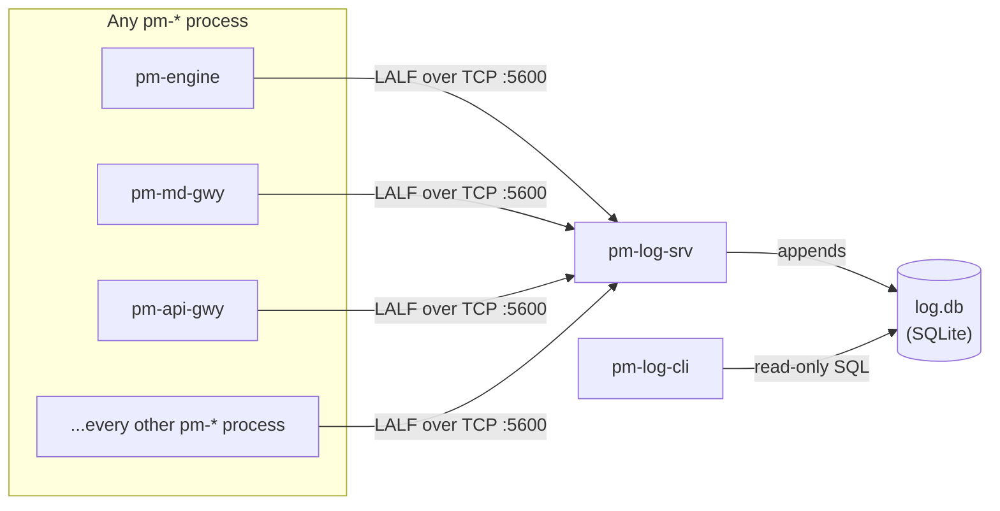

# Centralized Log Server

!!! note "Learning objectives"
    After reading this page you will understand:

    - Why a centralized log server matters and what `pm-log-srv` records
    - How to start `pm-log-srv` and where `log.db` lives
    - The LALF wire protocol at a glance and how auto-detection works
    - All `pm-log-cli` subcommands, options, and output formats
    - A practical cookbook of query workflows grouped by purpose
    - How to read a `diagnose` report and act on its recommendations


## Overview

Every EduMatcher process — the engine, gateways, `pm-stats`, `pm-audit`,
bots, viewers, admin tools — already logs through Python's standard
`logging` module. Until now, each process's log output went only to its own
terminal or its own redirected file: there was no single place to ask "what
did every process log in the last five minutes," and correlating an issue
spanning two processes meant manually lining up timestamps across separate
terminal scrollbacks.

`pm-log-srv` solves this the same way `pm-audit` already solved it for
trading events and `pm-stats` solved it for market statistics: a dedicated
collector process, a purpose-built SQLite schema, and a read-only query CLI.

| Component | Role | Type |
|---|---|---|
| **`pm-log-srv`** | Collector — accepts logging from every `pm-*` process over TCP and appends it to a queryable SQLite database | Long-running process |
| **`pm-log-cli`** | Query/troubleshooting tool — reads `log.db` and prints structured output, including a rule-based `diagnose` report | One-shot CLI |

The collector and the query tool are completely independent. `pm-log-cli`
reads `log.db` directly from disk and works even when `pm-log-srv` is not
currently running — the same posture `pm-audit-cli`/`pm-stats-cli` already
take relative to their own recorder processes.



`pm-log-srv` is not a replacement for `pm-audit` or `pm-stats`. Trading
events (orders, fills) and market statistics have their own purpose-built
collectors; `pm-log-srv` is for operational `logging`-module output only —
think "what would otherwise have gone to a terminal or a log file."

!!! note "Phased rollout"
    As of this revision, `pm-log-srv` and `pm-log-cli` are fully implemented
    and usable standalone — you can start the server and point a test client
    at it today. Automatically wiring every existing `pm-*` process's own
    logging into a `TcpLogHandler` (so it auto-detects and uses a running
    `pm-log-srv` with zero configuration) is a follow-up phase of this
    feature and has not yet been rolled out to every entrypoint. Until then,
    use `pm-log-srv`/`pm-log-cli` to inspect logging emitted by any client
    that already speaks LALF (see the wire protocol reference below if you
    are writing one).


## Data Directory

`log.db` is stored in the same data directory used by all other EduMatcher
persistent files:

| Running mode | Default location |
|---|---|
| Source checkout (`poetry run pm-log-srv`) | `<repo>/src/data/log.db` |
| Installed (`pm-log-srv` on PATH) | `~/.local/share/edumatcher/log.db` |

Override with `EDUMATCHER_DATA_DIR` or `--db`:

```bash
export EDUMATCHER_DATA_DIR="$HOME/sessions/morning"
pm-log-srv  # writes to $HOME/sessions/morning/log.db
```


## pm-log-srv — Log Collector

`pm-log-srv` binds a TCP listen socket, accepts any number of concurrent
LALF connections, and appends every accepted `LOG` record to `log.db`. It
has exactly one responsibility: accept LALF connections and persist rows —
it never talks to the ZeroMQ bus, the engine, or any gateway directly.

```bash
pm-log-srv [options]
```

### Startup options

| Flag | Default | Description |
|---|---|---|
| `--host ADDR` | from config / `0.0.0.0` | TCP bind address |
| `--port PORT` | from config / `5600` | TCP listen port for LALF clients |
| `--db PATH` | from config / `data/log.db` | SQLite database path |
| `--retention-days N` | from config / `30` | Prune `log_events` rows older than N days, once per hour. `0` disables pruning (unbounded retention) |
| `--max-message-bytes N` | from config / `65536` | Maximum `LOG` payload size before truncation — oversized messages are truncated and stored, never dropped |
| `--config PATH` / `-c` | `engine_config.yaml` | Engine config YAML path, read for the optional `log_server:` block |
| `--log-level LEVEL` | `WARNING` | Explicit level: `CRITICAL`, `ERROR`, `WARNING`, `INFO`, `DEBUG` |
| `-v` / `--verbose` | off | Increase verbosity (`-v` → `INFO`, `-vv` → `DEBUG`) |
| `-q` / `--quiet` | off | Reduce log output to warnings/errors |

CLI flags override the corresponding field in `engine_config.yaml`'s
`log_server:` block for that invocation only. See
[Configuration — Configuring pm-log-srv](010-configuration.md#configuring-pm-log-srv)
for the full config field reference.

```bash
# Start with defaults — binds 0.0.0.0:5600, writes to data/log.db
pm-log-srv

# Loopback-only, custom port, verbose startup logging
pm-log-srv --host 127.0.0.1 --port 5600 -v

# Unbounded retention (never prune)
pm-log-srv --retention-days 0

# Point at a specific database for a scratch/test session
pm-log-srv --db /tmp/session.db
```

Expected startup output:

```
2026-07-29 09:30:00,180 INFO edumatcher.log_srv.main - starting pm-log-srv with log level INFO
2026-07-29 09:30:00,206 INFO edumatcher.log_srv.server - pm-log-srv 'log-srv01' listening on 127.0.0.1:5600 db=data/log.db retention_days=30
```

`pm-log-srv` is the one `pm-*` process that always logs to stdout/file only
— it never sends its own operational logging to another `pm-log-srv`
instance (there is nothing listening for its own bootstrap messages before
it has finished starting).

### Retention

`log_events` defaults to a bounded 30-day retention rather than growing
unbounded like `pm-audit`'s/`pm-stats`' own deliberately-forever stores —
operational logging is disposable in a way trading history and market
statistics are not. Pruning runs automatically once per hour in the
background; `pm-log-cli prune` (below) is also available for pruning on
demand.


## LALF — The Wire Protocol at a Glance

Every `pm-*` process (or, in principle, any TCP client in any language)
speaks LALF ("Logging ALF") to `pm-log-srv`: a long-lived TCP connection,
one `HELLO`/`WELCOME` handshake, and then a stream of `LOG` messages until
the connection ends.

```text
C: HELLO|CLIENT=pm-md-gwy|PID=51002|HOST=trader-laptop|PROTO=LALF1
S: WELCOME|PROTO=LALF1|SRV=log-srv01|HBINT=5|SESSION=7f3a9c21
C: LOG|SEQ=1|TS=2026-07-28T09:30:00.010Z|LEVEL=INFO|LOGGER=edumatcher.md_gateway.gateway|LEN=29
   md-gwy01 listening on :5570
C: HB|TS=2026-07-28T09:30:05.500Z
C: EXIT
```

For the full normative wire specification — every message type, field table,
error code, and conformance rule — see the
[LALF Protocol Reference](940-app-lalf-protocol.md).


## pm-log-cli — Query/Troubleshooting Tool

`pm-log-cli` is a read-only command-line tool for querying and
troubleshooting `log.db` — no LALF/TCP connection is made, so a busy, slow,
or currently-stopped `pm-log-srv` never blocks you from inspecting data it
already collected.

```bash
pm-log-cli [global-options] COMMAND [command-options]
```

### Global options

| Flag | Default | Description |
|---|---|---|
| `--db PATH` | `data/log.db` | SQLite database path |
| `--format human\|json` | `human` | Output format |

`--format` is accepted both before and after the subcommand — both
`pm-log-cli --format json query` and `pm-log-cli query --format json` work,
since a value given after the subcommand always wins if both are present.

**Output formats:**

| Format | When to use |
|---|---|
| `human` | Interactive terminal — aligned columns, level-colored when the terminal supports it |
| `json` | Automation, scripts, downstream processing — one JSON object per row for `tail`/`query`/`processes`, a single JSON object for `stats`/`diagnose` |

**No-result behaviour:**

- `human`: prints `No matching log events found.`
- `json`: prints nothing (an empty stream of lines) for row-based commands

### Exit codes

| Code | Meaning |
|---|---|
| `0` | Success |
| `1` | Database error — `log.db` not found or not readable (has `pm-log-srv` ever run?) |
| `2` | Argument error (invalid flag combination) |
| `3` | `diagnose` found at least one issue (only meaningful for scripting; `query`/`tail`/`stats`/`processes`/`prune` never use this code) |


### `query` — Filtered historical search

The most flexible command — filter by process, level, logger, time range,
free text, or exception presence.

```bash
pm-log-cli query [options]
```

**Options:**

| Flag | Default | Description |
|---|---|---|
| `--process NAME` | (all) | Exact match against the process name |
| `--level LEVEL[,LEVEL...]` | (all) | One or more of `DEBUG,INFO,WARNING,ERROR,CRITICAL` |
| `--logger PATTERN` | (all) | SQL `LIKE` pattern against the logger name (e.g. `edumatcher.md_gateway.%`) |
| `--since ISO_TS` | (none) | Start of time range against `client_ts` |
| `--until ISO_TS` | (none) | End of time range against `client_ts` |
| `--grep TEXT` | (none) | Case-insensitive substring search against the message |
| `--has-exception` | off | Only rows with a formatted exception/traceback attached |
| `--limit N` | `500` | Maximum rows returned |
| `--reverse` | off | Oldest-first instead of newest-first |

**Output columns:** `seq`, `client_ts`, `process`, `instance`, `level`,
`logger`, `message`.

**Examples:**

```bash
# Every ERROR/CRITICAL from a specific process
pm-log-cli query --process pm-md-gwy --level ERROR,CRITICAL

# Rows with an attached traceback, most recent first
pm-log-cli query --has-exception --limit 20

# Free-text search across every process's messages
pm-log-cli query --grep "Connection reset"

# One process's logging for a specific subsystem
pm-log-cli query --process pm-api-gwy --logger "edumatcher.api_gateway.%"

# A specific time window, oldest first
pm-log-cli query --since 2026-07-28T09:30:00.000Z --until 2026-07-28T09:35:00.000Z --reverse

# Export as JSON for further processing
pm-log-cli query --process pm-engine --format json --limit 5000 > engine_log.json
```


### `tail` — Follow new rows in real time

Polls for new rows past the highest sequence number already shown and
prints them as they arrive. There is no push-based subscription — `tail`
polls on `--interval` seconds.

```bash
pm-log-cli tail [options]
```

**Options:**

| Flag | Default | Description |
|---|---|---|
| `--process NAME` | (all) | Filter by process name |
| `--level LEVEL[,LEVEL...]` | (all) | Filter by one or more levels |
| `--logger PATTERN` | (all) | SQL `LIKE` pattern on logger |
| `--interval SEC` | `1.0` | Polling interval |

**Examples:**

```bash
# Follow everything as it arrives
pm-log-cli tail

# Follow only one process's warnings and above
pm-log-cli tail --process pm-md-gwy --level WARNING,ERROR,CRITICAL

# Follow as JSON for piping into another tool
pm-log-cli tail --format json | jq .
```

Stop with Ctrl-C.


### `processes` — Connected/recently-connected processes

Lists rows from the connection registry — a quick "what's currently sending
logs" view.

```bash
pm-log-cli processes [options]
```

**Options:**

| Flag | Default | Description |
|---|---|---|
| `--active` | off | Only currently-connected sessions (no `disconnected_at`) |

**Output columns:** `process`, `instance`, `pid`, `host`, `connected_at`,
`last_seen_at`, `log_count`.

**Examples:**

```bash
# Every session seen, connected or not
pm-log-cli processes

# Only processes still connected right now
pm-log-cli processes --active

# Export as JSON for a dashboard
pm-log-cli processes --format json
```


### `stats` — Server + database health summary

Reports `pm-log-srv`'s own lifetime counters plus a handful of cheap
aggregate queries over `log.db` — a quick "is logging healthy" dashboard.

```bash
pm-log-cli stats
```

**Example output:**

```
pm-log-srv Statistics
========================================
  Started at:        2026-07-28T22:26:30.202Z
  Total log events:  3
  Total connections: 1
  Total truncated:   0
  Total errors sent: 0
  Rows in log.db:    3
  DB file size:      45,056 bytes

  By level:
    ERROR      1
    INFO       1
    WARNING    1

  By process:
    pm-md-gwy            3
```

**Examples:**

```bash
# Quick health check
pm-log-cli stats

# Machine-readable for monitoring/automation
pm-log-cli stats --format json
```


### `diagnose` — Rule-based troubleshooting report

Applies a small, fixed, documented set of rule-based heuristics against
stored logs and reports likely causes plus concrete, reproducible
recommendations. Every heuristic is a plain SQL aggregate query plus a fixed
threshold, not a statistical or ML model — "why did it flag this" always
has a one-sentence, inspectable answer.

```bash
pm-log-cli diagnose [options]
```

**Options:**

| Flag | Default | Description |
|---|---|---|
| `--since ISO_TS` | (all) | Restrict to events since this time |
| `--process NAME` | (all) | Restrict to a specific process |

**The seven heuristics:**

| Heuristic | What it detects |
|---|---|
| Error-rate spike | ERROR/CRITICAL count in the last 5 minutes far exceeds the preceding hour's baseline for a process |
| Repeated identical warning | The same `(process, logger, message)` triple repeats many times in the queried window |
| Process silence | A still-connected session has not logged or heartbeated recently despite an open connection |
| Clock skew | A process's `client_ts` is consistently ahead of or behind `pm-log-srv`'s own clock |
| Truncated-message rate | A process sent one or more oversized log messages that were truncated |
| Exception clustering | Most tracebacks in the window come from one specific logger |
| Likely fallback-to-file event | A process cleanly disconnected and never reconnected, distinct from a merely-stalled-but-open session |

Each finding cites the exact `pm-log-cli query` invocation that would
reproduce it, so you can always drill from "here's what's flagged" to "here
are the actual log lines." When no heuristic fires, `diagnose` reports "no
issues detected" rather than printing nothing — a clean run is visibly a
clean run. Exit code `3` signals at least one finding, useful for scripting
a periodic health check.

**Example output (an issue found):**

```
[WARNING] repeated_warning: pm-api-gwy logged "ENGINE_TIMEOUT" 47 times in the last hour
  Recommendation: Investigate why edumatcher.api_gateway.engine_client keeps repeating this message; it may indicate a stuck retry loop or a persistent misconfiguration.
  Reproduce with: pm-log-cli query --process pm-api-gwy --logger 'edumatcher.api_gateway.engine_client' --grep 'ENGINE_TIMEOUT'
```

**Example output (clean session):**

```
No issues detected in the queried window.
```

**Examples:**

```bash
# Full-database health check
pm-log-cli diagnose

# Restrict to one process
pm-log-cli diagnose --process pm-md-gwy

# Restrict to the last hour
pm-log-cli diagnose --since 2026-07-28T13:00:00.000Z

# Scripted health check — non-zero exit means something was flagged
pm-log-cli diagnose --format json || echo "logging issues detected, see above"
```


### `prune` — Manual retention pruning

Deletes `log_events` rows older than a given number of days — the same
operation `pm-log-srv` already runs automatically once per hour, exposed
here for on-demand use (e.g. before archiving `log.db`, or to shrink it
immediately rather than waiting for the next scheduled pass).

```bash
pm-log-cli prune [--days N]
```

**Options:**

| Flag | Default | Description |
|---|---|---|
| `--days N` | `30` | Delete rows with `client_ts` older than N days |

**Examples:**

```bash
# Prune using the default 30-day window
pm-log-cli prune

# Aggressive pruning before archiving
pm-log-cli prune --days 7
```

`prune` is the one subcommand that opens `log.db` for writing rather than
read-only, since it needs to delete rows; it is still safe to run while
`pm-log-srv` is running, since SQLite serializes the two writers.


## Cookbook — Common Log-Server Workflows

Examples below are grouped by the kind of question you're trying to answer.

### Watching a live session

```bash
# Follow everything as it happens
pm-log-cli tail

# Follow just the warnings and errors across every process
pm-log-cli tail --level WARNING,ERROR,CRITICAL

# Follow one specific gateway
pm-log-cli tail --process pm-md-gwy
```

### Investigating an error after the fact

```bash
# All errors in the last hour
pm-log-cli query --level ERROR,CRITICAL --since 2026-07-28T13:00:00.000Z

# All rows with an attached traceback
pm-log-cli query --has-exception

# Full traceback text for one specific event, exported for a support ticket
pm-log-cli query --process pm-md-gwy --has-exception --format json --limit 1
```

### Checking whether every process is still reporting in

```bash
# Everything currently connected
pm-log-cli processes --active

# Everything ever seen, to spot a process that connected once and vanished
pm-log-cli processes

# Automated health check — flags process silence and fallback-to-file events
pm-log-cli diagnose
```

### Free-text searching across the whole system

```bash
# Find every mention of a specific error string, any process
pm-log-cli query --grep "Connection reset"

# Narrow to one subsystem's loggers
pm-log-cli query --grep "timeout" --logger "edumatcher.api_gateway.%"
```

### Exporting for external analysis

```bash
# Export a whole day's logging for one process
pm-log-cli query --process pm-engine \
  --since 2026-07-28T00:00:00.000Z --until 2026-07-28T23:59:59.000Z \
  --format json --limit 100000 > pm-engine_2026-07-28.json

# Export the full stats snapshot for a dashboard
pm-log-cli stats --format json > log_stats.json
```

### Routine maintenance

```bash
# Quick health check before end of day
pm-log-cli stats
pm-log-cli diagnose

# Prune early if log.db is getting large before its scheduled hourly prune
pm-log-cli prune --days 30
```


## Error Handling

| Exit code | Meaning |
|---|---|
| `0` | Success |
| `1` | Database not found or not readable — has `pm-log-srv` ever run? |
| `2` | Argument error |
| `3` | `diagnose` found at least one issue |

Unlike `pm-audit-cli`, `pm-log-cli` has no separate index-building step and
no rotated-file discovery — `log.db` is a single SQLite file and every
subcommand reads (or, for `prune`, writes) it directly.


## See Also

- [LALF Protocol Reference](940-app-lalf-protocol.md) — normative wire specification for anyone implementing a LALF client
- [Processes — pm-log-srv / pm-log-cli](170-processes.md#pm-log-srv-centralized-log-server) — startup reference tables in the process overview
- [Configuration — Configuring pm-log-srv](010-configuration.md#configuring-pm-log-srv) — the `log_server:` config block field reference
- [Audit Trail](190-audit.md) — the equivalent dedicated-collector pattern for trading events (`pm-audit`/`pm-audit-cli`)
- [Statistics and Reporting](140-statistics-and-reporting.md) — the equivalent dedicated-collector pattern for market data (`pm-stats`/`pm-stats-cli`)
