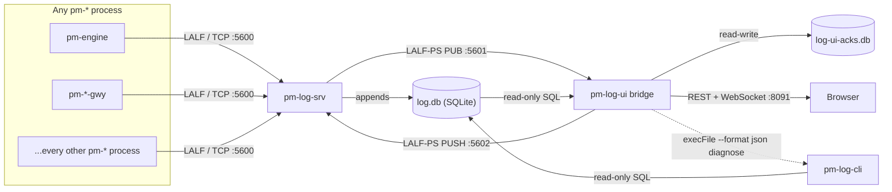

# Log Operator Console (`pm-log-ui`)

!!! note "Learning objectives"
    After reading this page you will understand:

    - What the Log Operator Console is for, and the one question it is built to answer
    - How it relates to `pm-log-srv` and `pm-log-cli`, and why it replaces neither
    - Where LALF and LALF-PS fit — and why the console speaks only one of them
    - Every way to start the application, and what each one needs
    - What each of the six views shows and how to work with it
    - The acknowledgement model, and why it is shared rather than per-browser
    - How to configure, secure, and troubleshoot a deployment

!!! info "About the figures on this page"
    Blocks marked **📷 Figure N** are placeholders indicating where a UI
    screenshot should be added, together with a short description of what to
    capture and a suggested asset path under
    `docs/user-guide/images/log-gui/`. Replace each block with the image and
    an italic caption once the screenshots are taken.

## Overview

The **Log Operator Console** (`pm-log-ui`) is a browser-based console over the
logging collected by [`pm-log-srv`](280-log-srv.md). Where `pm-log-cli`
answers "what did this process log?", the console answers a different and more
operational question:

> **Is anything wrong right now — and has someone dealt with it?**

That second clause is the part no CLI provides. A `diagnose` report tells you
something is broken; it cannot tell you that a colleague already looked at it
twenty minutes ago and decided it was benign. The console adds a shared
acknowledgement layer on top of the same data, so a room full of operators
converges on one view of what is outstanding rather than each re-investigating
the same recurring error.

| Component | Role | Type |
|---|---|---|
| **`pm-log-srv`** | Collector — receives LALF from every `pm-*` process, appends to `log.db`, republishes live rows over LALF-PS | Long-running process |
| **`pm-log-cli`** | Query/troubleshooting CLI — reads `log.db` directly | One-shot CLI |
| **`pm-log-ui` bridge** | Backend — one LALF-PS subscription, read-only `log.db` access, WebSocket fan-out, acknowledgement store | Long-running process |
| **`pm-log-ui` web** | Frontend — six views over the bridge's REST + WebSocket API | Browser application |

The console is **strictly additive**. It never writes to `log.db`, never
alters `pm-log-srv`'s behaviour, and can be stopped at any time without
affecting log collection. Everything it displays remains available through
`pm-log-cli` whether the console is running or not.



## How it relates to the log server

The console is a **consumer** of `pm-log-srv`, and it consumes it through two
independent channels that fail independently — a distinction that matters
because the UI reports them separately rather than collapsing them into one
"connected" light.

| | Live channel | History channel |
|---|---|---|
| Source | LALF-PS (ZeroMQ) from `pm-log-srv` | `log.db` read directly from disk |
| Carries | New rows as they land, server heartbeats | Search, aggregation, counts, export |
| Works when `pm-log-srv` is stopped | No | **Yes** |
| Works when `log.db` is unreachable | **Yes** | No |
| Latency | Pushed on commit | Query-time |

Because history comes from the file rather than the wire, the console
deliberately **never sends `log.backfill_request`**. Backfill exists in
LALF-PS for subscribers with no filesystem access to `log.db`; this bridge has
that access, so replaying history over ZeroMQ would be strictly worse — slower,
bounded by the server's backfill limits, and competing with live delivery.

Three consequences worth internalising before you deploy:

- **Stop `pm-log-srv` and the console still works** for everything historical.
  The top bar shows *log server down*, the live tail stops, and search,
  aggregation and export continue unaffected.
- **Move `log.db` out from under the bridge and the live tail still works.**
  The top bar shows *log.db unavailable*, and history views return a clean
  503 rather than a blank page.
- **The bridge holds exactly one LALF-PS subscription** no matter how many
  browser tabs are open. Ten operators watching the console cost
  `pm-log-srv` one subscriber, not ten. Fan-out to tabs happens over the
  bridge's own WebSocket.

!!! warning "The console is not a substitute for `pm-log-cli`"
    `pm-log-cli` remains the tool of record for scripting, for exporting large
    ranges, for hosts with no browser, and for any situation where you need
    the log data without a running service. The console is a *viewing* layer;
    `pm-log-cli` is the *access* layer. The Diagnostics view makes this
    explicit by shelling out to `pm-log-cli` rather than reimplementing it.

## LALF, LALF-PS, and where the console sits

This is the single most common source of confusion, so it is worth stating
plainly:

**The Log Operator Console does not speak LALF.**

| Protocol | Direction | Transport | Who speaks it |
|---|---|---|---|
| **LALF** | `pm-*` process → `pm-log-srv` | TCP `:5600`, line-oriented text | Every process that logs. Normative spec: [LALF Protocol Reference](940-app-lalf-protocol.md) |
| **LALF-PS** | `pm-log-srv` → subscriber | ZeroMQ `PUB :5601` / `PULL :5602`, JSON | Live viewers, including this console. Reference: [LALF-PS](280-log-srv.md#lalf-ps-the-zeromq-log-distribution-interface) |

LALF is a *producer* protocol: a process opens one long-lived TCP connection,
does a `HELLO`/`WELCOME` handshake, and streams its own `LOG` records until it
exits. It is unidirectional and subscription-free — a LALF client can only
ever send its own logging, never read anyone else's.

That property is exactly why the console cannot use it. A viewer needs to
*read* everything, which is the opposite of what LALF offers. So `pm-log-srv`
exposes a second, separate interface — LALF-PS — and the console subscribes to
that.

Read [Appendix: LALF Protocol Reference](940-app-lalf-protocol.md) when you are
instrumenting a process to send its logs. Read it for this console only to
understand the shape of the rows that eventually arrive: the `LOG` header field
set in §"`LOG`" is what becomes a row in every table and detail pane described
below.

### What the bridge does on the LALF-PS wire

The bridge implements the subscriber side in
`web-apps/log-gui/apps/bridge/src/lalf-ps-uplink.ts`. The sequence, in order:

1. Connect `SUB` to `:5601` and `PUSH` to `:5602`.
2. Subscribe to the ZeroMQ topic prefix **`log.`** — not `log.<sub_id>`.
   The server publishes per-subscriber topics as `log.<msgtype>.<sub_id>`
   (plus the broadcast `log.server_state`), so the shared prefix is the only
   filter that catches them all. The bridge then discards anything not
   addressed to its own `sub_id`.
3. Wait 200 ms before sending anything. ZeroMQ's **slow-joiner** behaviour
   silently drops messages published before a `SUB` connection finishes
   establishing; without this settle the first `subscribe_ack` can vanish.
4. Send `log.subscribe` with `mode: STREAM` and a lease.
5. Retry the subscribe if no ack arrives within one second. Subscribe is
   idempotent by `sub_id`, so a duplicate is harmless.
6. Renew at **half the lease interval**, using `renew_before_sec` from the
   ack when the server supplies one.
7. On `log.lease_expired` or a `log.error` with `UNKNOWN_SUB`, re-subscribe
   immediately rather than assuming the old lease survived.

The `sub_id` is `pm-log-bridge-<pid>` by default, so two bridges on one host do
not collide. It is shown in the Health view — quote it if you need to
correlate the console against `pm-log-srv`'s own subscriber list.

The bridge tracks four uplink states, surfaced in the top bar:

| Uplink state | Top bar | Meaning |
|---|---|---|
| `CONNECTING` | reconnecting… | Subscribe sent, no ack yet |
| `ACTIVE` | log-srv up | Lease held, rows flowing |
| `RECONNECTING` | reconnecting… | Lease expired or unknown; re-subscribing |
| `SERVER_DOWN` | log server down | `log.server_state` said `DOWN`, or heartbeats stopped |

## Running the application

Three supported ways, in increasing order of setup effort.

| Method | Best for | Needs | URL |
|---|---|---|---|
| [Container stack](#option-1-one-command-with-the-container-stack) | Most users; production | Podman/Docker + Make | `http://localhost:8091` |
| [Pre-built image artifact](#option-2-a-pre-built-image-artifact) | Offline hosts, no repo clone | Podman/Docker only | `http://localhost:8091` |
| [Local development](#option-3-local-development) | Contributing to the console itself | Node.js + npm | `http://127.0.0.1:5178` |

### Prerequisites

Whichever method you choose, the console needs to reach **both** of its
sources:

- **`pm-log-srv`'s LALF-PS ports** — `5601` (PUB) and `5602` (PULL) by
  default. Note these are *not* the LALF port `5600`; the console has no use
  for that one.
- **A filesystem path to `log.db`** — read access is sufficient, and
  read-*only* is preferred.

Any modern browser (Chrome/Edge ≥ 110, Firefox ≥ 115, Safari ≥ 16). No
extensions are required.

### Option 1 — One command with the container stack

The fastest path with a repository checkout and a container runtime. From the
`web-apps/log-gui/` directory:

```bash
make up
```

`make up` auto-detects Podman or Docker (preferring Podman), starts the Podman
machine on macOS if needed, builds the image, and starts the stack detached.
Open **http://localhost:8091**.

```bash
make down      # stop and remove the stack
make restart   # restart it
make logs      # follow the container log
make ps        # show stack status
make help      # list every target
```

The compose file mounts two separate volumes, deliberately:

```yaml
volumes:
  # pm-log-srv's directory, mounted READ-ONLY
  - ./logsrv-data:/app/logsrv-data:ro
  # this project's own ack store, read-write
  - ./ack-data:/app/ack-data
```

The `:ro` on the first mount is not decoration. "This project never writes to
`log.db`" is enforced by the kernel rather than by application code, so a bug
in the console cannot corrupt the collector's database.

Set `LOG_SRV_HOST` in `docker-compose.yml` to wherever `pm-log-srv` is
reachable *from inside the container* — `host.docker.internal` on Docker
Desktop, `host.containers.internal` on Podman, or a real hostname.

### Option 2 — A pre-built image artifact

For a host with no repository clone, build a self-contained OCI archive:

```bash
make dist
```

This produces `dist/edumatcher-log-gui-<version>.tar.gz` containing the Node
runtime, the compiled frontend and the bridge — no external dependencies. On
the target host:

```bash
# Podman
podman load --input edumatcher-log-gui-<version>.tar.gz
podman run -d --name log-gui -p 8091:8091 \
  -e LOG_SRV_HOST=logsrv.example \
  -v /srv/logsrv-data:/app/logsrv-data:ro \
  -v /srv/log-ui-acks:/app/ack-data \
  edumatcher-log-gui:<version>

# Docker — identical, substituting `docker` for `podman`
```

!!! note "No Node.js or npm required"
    The archive is fully self-contained. The host needs only Podman or Docker.

### Option 3 — Local development

```bash
cd web-apps/log-gui
make install      # npm ci from the lockfile
make dev          # bridge (8091) + web dev server (5178) together
```

Open **http://127.0.0.1:5178**. The Vite dev server hot-reloads on save and
proxies both `/api/*` and `/ws/*` to the bridge, so you only ever open the
`5178` URL.

For separate logs, run the two halves in two terminals:

```bash
make dev-bridge   # Fastify: LALF-PS + log.db + WebSocket
make dev-web      # Vite dev server only
```

This assumes `pm-log-srv` is running locally on its default ports and that
`log.db` exists. The bridge resolves `log.db`'s location by mirroring
`edumatcher.config._resolve_data_dir()`'s priority order exactly —
`EDUMATCHER_DATA_DIR`, then `<repo>/src/data`, then the installed-package home
directory fallback — so in a normal checkout neither side needs configuring to
agree with the other. It logs the resolved absolute paths at startup; check
that line first if a view is unexpectedly empty.

!!! warning "A known npm dedup bug"
    If `package-lock.json` is ever deleted and regenerated, some npm versions
    (observed on 11.17.0) crash with `TypeError: Invalid Version:` from
    `@npmcli/arborist`'s dedup step. `make install` already works around this
    by running `npm install --no-dedupe` for the first resolution. If you hit
    the crash by calling `npm install` directly, rerun with `--no-dedupe`.
    See `web-apps/log-gui/README.md` for the full explanation.

### Developer commands

```bash
make test        # Vitest: log-query, fingerprinting, issue index, ack store
make typecheck   # type-check every workspace
make build       # production frontend bundle
make lint        # type-check (lint alias)
make format      # Prettier
make clean       # remove build artifacts and dist/
```

## A tour of the interface

The window is a fixed shell: a **top bar** carrying global state, a **six-item
navigation rail** on the left, and the active view filling the rest.

```
┌────────────────────────────────────────────────────────────────────┐
│ pm-log-ui v0.1.0  ● log-srv up   ⚠ 3 unacked              ☾        │
├──────┬─────────────────────────────────────────────────────────────┤
│ ▣ Dash│                                                             │
│ ▤ Logs│                                                             │
│ ⚠ Ale.│                     active view                             │
│ ◈ Proc│                                                             │
│ ⚕ Diag│                                                             │
│ ♥ Heal│                                                             │
└──────┴─────────────────────────────────────────────────────────────┘
```

The top bar is deliberately sparse — three things, always visible:

- **Source state dot** — green *log-srv up*, yellow *reconnecting…*, red
  *log server down* or *log.db unavailable*. The two red states are distinct
  because they mean different things and have different fixes.
- **Unacked count** — a link to Alerts, styled red when non-zero. Also
  mirrored as a badge on the Alerts rail item.
- **Theme toggle** — light/dark. The icon shows the theme a click switches
  *to*, not the one currently active.

!!! note "📷 Figure 1 — The main window"
    _Screenshot placeholder._ Capture the console in dark theme on the
    **Dashboard** with at least one unacknowledged issue, so the red banner,
    the top-bar unacked link and the Alerts rail badge are all visible
    together. Suggested file: `images/log-gui/fig-01-main-window.png`.

### The six views at a glance

| View | Answers | Refresh |
|---|---|---|
| [Dashboard](#dashboard) | Is anything wrong right now? | Live counters + 15–30 s polls |
| [Logs](#logs-the-explorer) | What exactly happened? | Live tail or on-demand query |
| [Alerts](#alerts) | What is outstanding, and who has it? | 10 s |
| [Processes](#processes) | Is everything still reporting in? | 10 s |
| [Diagnostics](#diagnostics) | What would `pm-log-cli diagnose` say? | 60 s |
| [Health](#health) | Which component is degraded? | 10–30 s |

### Dashboard

The at-a-glance view, designed to be readable from across a room.

Top of the view is an **alert banner**, shown only when unacknowledged issues
exist. It pulses, names the most recent affected process, and links straight to
Alerts. When nothing is outstanding the banner is absent entirely — the absence
of red is the signal.

Below it, five meter tiles: total events, current error rate per minute,
warnings in the last 60 s, process count, and log-server state. Then two
charts — events over time (1-minute buckets over the last hour) and top
processes by error count — and a compact list of the five most recent errors.

The **error-rate tile is banded** — it carries a colour and a word (`normal`,
`elevated`, `high`, `SEVERE`) rather than a bare number, because "18 errors a
minute" means nothing without knowing what this venue considers busy. The
boundaries are the [`ERROR_RATE_*` thresholds](#thresholds).

The error rate and the 60-second warning count come from the **live**
WebSocket stream and update every second. Everything else is polled from
`log.db`. This is why the tiles can briefly disagree during a burst: the live
counters have already seen rows the aggregate query has not yet been re-run
for.

!!! note "📷 Figure 2 — Dashboard with an active alert"
    _Screenshot placeholder._ Capture the full Dashboard during a period with
    errors, so the pulsing banner, all five meter tiles with real numbers,
    both charts populated, and the recent-errors list are visible.
    Suggested file: `images/log-gui/fig-02-dashboard.png`.

### Logs (the Explorer)

The workhorse view: a virtualised log table that runs in one of two modes,
toggled by the **▶ LIVE / history** button.

- **LIVE** streams from the WebSocket into an in-memory ring buffer of the
  **most recent 2 000 rows**, newest first. Rows flash briefly as they arrive.
- **history** queries `log.db` through the bridge and shows a match count.

The filter bar applies to both modes, and every filter is **kept in the URL
query string** — so a filtered view is a link you can paste into a ticket or a
chat message and a colleague opens exactly what you were looking at.

| Control | Effect |
|---|---|
| `message contains…` | Substring match on the message body |
| Level dropdown | Minimum severity (`WARNING+`, `ERROR+`, …) |
| `exceptions only` | Restrict to rows carrying a traceback |
| ▶ LIVE / history | Switch between the live buffer and `log.db` |

**Scrolling down in LIVE mode pauses the tail.** This is intentional — you
cannot read a fast-moving log that keeps jumping. A banner appears showing how
many rows arrived while paused; clicking it jumps back to the top and resumes.
The rows are not lost, they simply were not rendered.

!!! note "Delivery adapts to the rate"
    Under `LIVE_BATCH_THRESHOLD_PER_SEC` rows per second, each row is sent as
    its own WebSocket frame, which is what makes the tail feel immediate. Above
    it the bridge coalesces rows into batched frames flushed every 100 ms.

    This is automatic in both directions and needs no operator action. It
    matters during a storm: at a few thousand rows a second, one frame per row
    is thousands of encodes, socket writes and React updates per second *per
    tab*, and the browser stops keeping up long before the bridge does.
    Ordering is preserved unconditionally — once anything is buffered, later
    rows queue behind it even if the rate drops back.

Clicking any row opens a **detail pane** on the right with the full `LOG`
header field set — logger, module and line, pid and host, session and sequence
number — plus the untruncated message. Two actions there:

- **Copy** — the message text to the clipboard.
- **Filter to this process** — rewrites the URL filter, which is usually the
  next thing you want after spotting one bad row.

!!! note "📷 Figure 3 — The Explorer in live mode with a row selected"
    _Screenshot placeholder._ Capture the Logs view in LIVE mode with a level
    filter applied, several severity-coloured rows visible (at least one
    ERROR with the ⚠ exception marker), and the right-hand detail pane open
    on a row with a traceback. Suggested file:
    `images/log-gui/fig-03-explorer.png`.

### Alerts

Where the console earns its keep. `WARNING`-and-above rows are **fingerprinted**
— normalised so that the same fault recurring a thousand times collapses into
one entry with a count, rather than a thousand lines to scroll past.

Each issue card carries the level, process and logger, the occurrence count, a
sample message, and first/last-seen times. Three tabs filter by state:
**unacked**, **acked**, **all**.

The acknowledgement model:

- **Acknowledge** marks the issue handled, attributed to the name in the
  operator field, with an optional free-text note recording *what was done*.
- **Un-ack** reverses it.
- **`recurred since ack`** is flagged prominently when a fingerprint fires
  again after being acknowledged. This is the case that matters most: it means
  the fix did not hold, and it is visually distinct from a fresh issue.

!!! warning "Acknowledgements are shared, not per-browser"
    Acks live in the bridge's own SQLite file, so every operator sees the same
    state. That is the entire point — it is how the console prevents two
    people investigating the same error in parallel. It also means an ack is
    a **statement to your colleagues**, not a personal "hide this" toggle.
    Set your name in the operator field before acknowledging anything;
    unnamed acks are attributed to `unknown` and are much less useful during
    a post-mortem.

Issues with no activity beyond the retention window (7 days by default) are
pruned hourly. The index is rebuilt from `log.db` at startup, so restarting the
bridge loses nothing except issues that had already aged out.

!!! note "📷 Figure 4 — Alerts with a recurred-since-ack issue"
    _Screenshot placeholder._ Capture the Alerts view on the **all** tab
    showing a mix: one unacknowledged CRITICAL, one acknowledged issue with
    its "✓ acked … by … — note" line, and ideally one carrying the
    `recurred since ack` chip. Suggested file:
    `images/log-gui/fig-04-alerts.png`.

### Processes

A registry of every process that has ever connected, with a status glyph:

| Glyph | Meaning |
|---|---|
| `●` | Connected and logging |
| `⚠` | Connected but silent for **`PROCESS_SILENCE_SEC`** or more (30 s by default) |
| `○` | Disconnected |

The `⚠` state is the one to watch. A process that connected and then went
quiet is not obviously broken from any single log line — there is nothing to
see, which is precisely the problem. Alongside each row: pid, host, connect
time, idle time, total log count and error count.

The threshold is `PROCESS_SILENCE_SEC` (30 s by default) and is stated in the
legend above the table, so the glyph is never ambiguous.

Clicking any row navigates to the Explorer pre-filtered to that process.

!!! note "📷 Figure 5 — The Processes board"
    _Screenshot placeholder._ Capture the table with a mix of all three status
    glyphs — at least one live process, one silent (`⚠`), and one
    disconnected (`○`) — with non-zero error counts on at least one row.
    Suggested file: `images/log-gui/fig-05-processes.png`.

### Diagnostics

Surfaces `pm-log-cli`'s rule-based heuristics on a 60-second schedule, with a
manual **Re-run** button.

Each finding shows the heuristic name, what was found, a recommendation, and —
importantly — the **exact `pm-log-cli` command to reproduce it**. Heuristics
that found nothing are listed compactly at the bottom, because "we checked and
it was fine" is information too.

!!! note "This view calls `pm-log-cli`, it does not reimplement it"
    `GET /api/diagnostics` shells out to `pm-log-cli --format json diagnose`
    so there is exactly one implementation of the heuristics to keep correct.
    The consequence: `pm-log-cli` must be installed and on `PATH` wherever
    **the bridge** runs — which, in the container deployment, it is not by
    default. If it is missing, this one view reports it and every other view
    keeps working. Override the command with `LOG_CLI_COMMAND`, e.g.
    `LOG_CLI_COMMAND="poetry run pm-log-cli"`.

See [`diagnose`](280-log-srv.md#diagnose-rule-based-troubleshooting-report) for
what each heuristic actually checks.

!!! note "📷 Figure 6 — Diagnostics with findings"
    _Screenshot placeholder._ Capture the view with at least two findings of
    differing severity (one error-bordered, one warning-bordered), each
    showing its recommendation and repro command, plus the "✓ No findings
    for:" line. Suggested file: `images/log-gui/fig-06-diagnostics.png`.

### Health

Four panels for four components that **fail independently**, kept separate
rather than merged into a single status light:

| Panel | Shows |
|---|---|
| **`pm-log-srv`** | Up/unknown, server name, lifetime events, connections, truncations, errors sent |
| **LALF-PS** | State, subscriber count, active backfills, last sequence, inbox drops, default lease |
| **`log.db`** | Path, size, row count, oldest retained row |
| **Bridge** | WebSocket client count, fingerprints indexed, acks stored, `sub_id`, `log.db` reachability |

Start here when something looks wrong but you do not yet know what. The
resolved `log.db` **path** in particular answers the most common
misconfiguration — a bridge reading a different database than the one
`pm-log-srv` is writing.

`inbox dropped` is worth a periodic glance: a rising count means `pm-log-srv`
is shedding inbound LALF-PS messages, which is a capacity signal rather than a
console problem.

!!! note "📷 Figure 7 — The Health view"
    _Screenshot placeholder._ Capture all four panels populated against a
    running server, with the resolved `log.db` path and the bridge `sub_id`
    legible. Suggested file: `images/log-gui/fig-07-health.png`.

## Exporting

`GET /api/logs/export` returns the current filter's matches as CSV (default)
or JSON:

```bash
curl -o logs.csv \
  'http://localhost:8091/api/logs/export?minLevel=ERROR&processes=pm-engine&format=csv'
```

The CSV carries `seq,client_ts,level,process,logger,message`. Export is capped
at `EXPORT_MAX_ROWS` (1 000 000 by default), and the whole result set is
materialised in memory before it is sent — a full-cap export is a large
allocation in the bridge, so prefer a narrowed filter.

If the cap is reached the response carries `X-Export-Truncated: true` and
`X-Export-Max-Rows`, and the bridge logs a warning. Check that header before
treating an export as complete: a silently short file is the failure mode that
matters here, because nothing about the CSV itself reveals that rows are
missing. For anything larger — or for scripted extraction —
use [`pm-log-cli query --format json`](280-log-srv.md#query-filtered-historical-search)
instead; it reads the same database with no HTTP layer in between.

## Configuration reference

All bridge configuration is environment variables.

### Network and serving

| Variable | Default | Purpose |
|---|---|---|
| `HOST` | `127.0.0.1` | Bind address. The container sets `0.0.0.0`. |
| `PORT` | `8091` | HTTP/WebSocket port |
| `CORS_ORIGIN` | `*` | Allowed origin. **Restrict this** when exposed beyond localhost. |
| `STATIC_DIR` | _(unset)_ | Serve the built frontend from here (single-container mode) |
| `LOG_LEVEL` | `info` | The bridge's own logging verbosity |

### Sources

| Variable | Default | Purpose |
|---|---|---|
| `LOG_SRV_HOST` | `127.0.0.1` | Where `pm-log-srv` is reachable |
| `LOG_SRV_PUB_PORT` | `5601` | LALF-PS `PUB` port |
| `LOG_SRV_PULL_PORT` | `5602` | LALF-PS `PULL` port |
| `SUB_ID_PREFIX` | `pm-log-bridge` | Subscriber id prefix; `-<pid>` is appended |
| `LEASE_SEC` | `30` | Subscription lease; renewed at half this |
| `LOG_DB_PATH` | _resolved data dir_ `/log.db` | The collector's database, read-only |
| `ACK_STORE_PATH` | _resolved data dir_ `/log-ui-acks.db` | This project's own store, read-write |
| `LOG_CLI_COMMAND` | `pm-log-cli` | Command backing the Diagnostics view |

### Issues

| Variable | Default | Purpose |
|---|---|---|
| `ISSUES_RETENTION_DAYS` | `7` | How long an inactive issue is kept, and how far back the startup scan reaches |
| `ISSUES_MIN_LEVEL` | `WARNING` | Minimum level that becomes an issue — applied identically to the startup scan and to live rows |
| `ISSUES_ALERT_LEVEL` | `ERROR` | Minimum issue level counted as "unacked" in the top bar and the Alerts badge |

Both level variables are validated against the real log-level enum, so a typo
yields the default rather than a silently broken filter. Setting
`ISSUES_ALERT_LEVEL=WARNING` makes the top-bar count include warnings; setting
`ISSUES_MIN_LEVEL=ERROR` stops warnings being fingerprinted at all, which also
empties them from Alerts.

!!! note "The two levels are independent, and order matters"
    `ISSUES_MIN_LEVEL` decides what is *tracked*; `ISSUES_ALERT_LEVEL` decides
    what is *counted as demanding attention*. Setting `ISSUES_ALERT_LEVEL`
    below `ISSUES_MIN_LEVEL` is legal but pointless — nothing below the
    tracking floor exists to be counted.

### Thresholds

| Variable | Default | Purpose |
|---|---|---|
| `PROCESS_SILENCE_SEC` | `30` | Seconds of silence after which a connected process is flagged `⚠` on the Processes board |
| `ERROR_RATE_NORMAL_PER_MIN` | `5` | Error rate at which the Dashboard meter leaves **normal** |
| `ERROR_RATE_ELEVATED_PER_MIN` | `20` | …and enters **high** |
| `ERROR_RATE_SEVERE_PER_MIN` | `100` | …and enters **severe** |

Three thresholds, four bands. Each is the rate at which the *next* band
begins, so they read as lower bounds:

| Errors/min | Band | Meter colour |
|---|---|---|
| `< 5` | `normal` | default |
| `5 – 19` | `elevated` | warning |
| `20 – 99` | `high` | error |
| `>= 100` | `severe` | critical |

The classification lives in `@edumatcher/log-types` (`classifyErrorRate`) so
the bridge and the browser cannot drift apart on where a band starts.

### Limits

| Variable | Default | Purpose |
|---|---|---|
| `QUERY_MAX_ROWS` | `5000` | Hard cap on any single history query |
| `EXPORT_MAX_ROWS` | `1000000` | Hard cap on an export |
| `LIVE_BATCH_THRESHOLD_PER_SEC` | `50` | Rows/sec above which live delivery switches from per-row frames to coalesced batches |

Invalid numeric values fall back to the default rather than failing startup.

### How the frontend learns these

`GET /api/ui-config` returns `alertLevel`, `issuesMinLevel`,
`processSilenceSec` and the three error-rate thresholds. The browser fetches it
once and holds it for the session — it has **no local defaults**, deliberately,
because a fallback constant in the UI is exactly how these settings came to be
ignored in the first place. Views render a neutral placeholder until the
config arrives rather than guessing.

One visible consequence: for the first moment after a page load the Processes
board shows no `⚠` glyphs, because flagging every healthy process as silent
would be worse than a fraction of a second's delay.

## Security notes

!!! danger "There is no authentication"
    `pm-log-ui` has **no login, no user accounts, and no authorisation**.
    Anyone who can reach the port can read every log line the exchange has
    produced — which routinely includes internal hostnames, gateway
    identifiers, order ids and tracebacks. Treat the console as an internal
    operations tool:

    - Bind to `127.0.0.1` (the default) or an internal interface only.
    - Put it behind an authenticating reverse proxy if it must be reachable
      beyond the host.
    - Set `CORS_ORIGIN` to your specific site origin rather than leaving `*`.
    - Never expose port `8091` to an untrusted network.

Acknowledgement attribution is a **convention, not an identity claim** — the
operator name is free text typed by whoever is at the keyboard. It is there to
help a post-mortem reconstruct who looked at what, not to prove it.

Beyond that the posture is deliberately narrow: Helmet security headers are
applied, the only writable resource is the ack store, and `log.db` is opened
read-only — enforced by the `:ro` mount in the container deployment.

## Troubleshooting

| Symptom | Cause | Fix |
|---|---|---|
| **Top bar shows "log server down"**, history works | `pm-log-srv` is stopped, unreachable, or its heartbeats stopped | Start the server; check `LOG_SRV_HOST` and that `5601`/`5602` are reachable *from the bridge* (inside the container, if containerised). |
| **Top bar shows "log.db unavailable"**, live tail works | The bridge cannot open the database file | Compare the path in **Health → log.db** with where `pm-log-srv` writes. Set `LOG_DB_PATH` explicitly. |
| **Every view is empty, no error shown** | Bridge is reading a *different, valid* `log.db` | Check the resolved-paths line the bridge logs at startup — a valid but empty database looks exactly like a working one. |
| **Live tail stuck, history fine** | Lease not being renewed; slow-joiner drop | Check **Health → LALF-PS** state and `sub_id`. Restart the bridge; the subscribe path retries automatically but a wedged socket does not recover. |
| **Live tail stopped after scrolling** | Expected — scrolling pauses the tail | Click the "*n* new rows — jump to top" banner. |
| **"Diagnostics unavailable"** | `pm-log-cli` not on `PATH` where the bridge runs | Expected in the default container. Set `LOG_CLI_COMMAND`, or run the bridge where the CLI is installed. Every other view is unaffected. |
| **Acks vanish after a restart** | `ACK_STORE_PATH` points at ephemeral storage | Mount a persistent volume for the ack store — it is the only state the console owns. |
| **Acks are not shared between operators** | Each is running their own bridge | Run one bridge and have everyone open the same URL. Acks live in that bridge's store. |
| **`make up` fails: neither podman nor docker found** | No container runtime | Install one, or use [local development](#option-3-local-development). |
| **`make up` on macOS: podman machine not running** | The Podman VM is not started | `make up` starts it automatically; otherwise `podman machine init && podman machine start`. |
| **Container cannot reach `pm-log-srv` on `localhost`** | `localhost` inside a container is the container | Use `host.docker.internal` (Docker Desktop) or `host.containers.internal` (Podman), or a real hostname. |
| **`npm install` crashes: `TypeError: Invalid Version:`** | npm dedup bug | Use `make install`, or rerun with `--no-dedupe`. |
| **Port `8091` or `5178` already in use** | Another process holds it | Change `PORT`, or the `server.port` in `web-apps/log-gui/apps/web/vite.config.ts`. |
| **Blank page in production**, API responds | Frontend not built or `STATIC_DIR` wrong | `make build`, then point `STATIC_DIR` at an **absolute** path to `apps/web/dist`. |
| **A client route 404s in production** | Static host with no SPA fallback | Let the bridge serve the UI via `STATIC_DIR`; it falls back to `index.html`. |
| **Explorer shows fewer rows than expected** | `QUERY_MAX_ROWS` cap (5 000) | Narrow the filter, use a time range, or export instead. |
| **An export looks complete but is short** | `EXPORT_MAX_ROWS` cap reached | Check for `X-Export-Truncated: true` on the response. Narrow the filter, raise the cap, or use `pm-log-cli query`. |
| **Top-bar unacked count differs from the Alerts list** | Expected — the badge counts `ISSUES_ALERT_LEVEL` and above; Alerts lists `WARNING` and above | Set `ISSUES_ALERT_LEVEL=WARNING` if you want them to agree. |
| **Warnings never appear in Alerts** | `ISSUES_MIN_LEVEL` raised above `WARNING` | Lower it. Note it gates tracking, so raising it also empties existing warnings on restart. |
| **Numbers on the Dashboard briefly disagree** | Live counters update at 1 Hz; aggregates poll at 15–30 s | Expected. Health and the Explorer are authoritative. |

## Keeping the console in sync with `pm-log-srv`

Three files re-implement pieces of `pm-log-srv`'s Python surface in
TypeScript. Each carries a maintenance comment naming its counterpart, and all
three must be revisited when the server's schema, LALF-PS message set, or query
shape changes:

| TypeScript | Mirrors |
|---|---|
| `packages/log-query/src/filter-to-sql.ts` | `edumatcher.log_srv.pubsub.LogFilter.sql_where()` / `edumatcher.log_cli.queries.query_events()` |
| `apps/bridge/src/lalf-ps-uplink.ts` | The LALF-PS wire messages implemented in `edumatcher.log_srv.pubsub` |
| `apps/bridge/src/config.ts` | `edumatcher.config._resolve_data_dir()`'s priority order |

`apps/bridge/src/fingerprint.ts` has no Python counterpart — issue
fingerprinting is new surface this project introduces. Run `make test` after
any of these changes.

## See Also

- [Centralized Log Server](280-log-srv.md) — `pm-log-srv` and `pm-log-cli`, the data this console displays
- [Appendix: LALF Protocol Reference](940-app-lalf-protocol.md) — normative wire spec for the producer protocol
- [Message Reference — LALF-PS messages](270-message-reference.md#lalf-ps-messages-log-subscriber-pm-log-srv) — normative field tables for every message the bridge sends and receives
- [Configuration — Configuring pm-log-srv](010-configuration.md#configuring-pm-log-srv) — the `log_server:` block, including the LALF-PS ports
- [Processes](170-processes.md#pm-log-srv-centralized-log-server) — where `pm-log-srv` sits among the other processes
- [Configuration GUI (`config-gui`)](030-config-GUI.md) — the sibling browser application, same deployment pattern
- [Trader Information Terminal (TapeDeck)](290-trader-info-terminal.md) — the other operator-facing UI
