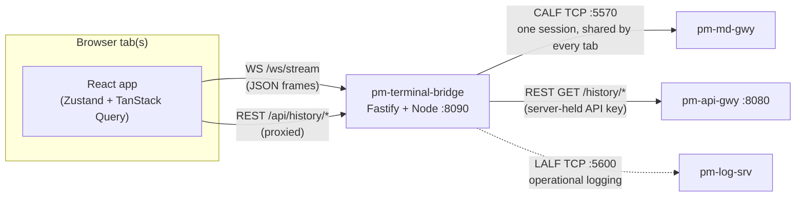

# Trader Information Terminal — "TapeDeck" (`pm-terminal`)

!!! note "Learning objectives"
    After reading this page you will understand:

    - What the Trader Information Terminal is, who it is for, and how it
      relates to `pm-trading-ui`, `config-gui`, and the CALF market-data feed
    - The architecture: a single Node/Fastify bridge process that holds the
      one live CALF connection and proxies historical REST reads, in front of
      a React/Vite frontend — and why no browser ever holds a credential
    - Every way to run it — local development, or a single self-contained
      container — and what each needs
    - What each of the six screens shows, why it is organised the way it is,
      and where the data on screen actually comes from
    - A number of deliberate, sometimes surprising design choices — verified
      against the shipped code, not just the design document — that are easy
      to misread as bugs if you don't know the reasoning behind them
    - How to configure the bridge and diagnose the most common problems


## Overview

**TapeDeck** is the friendly nick-name this guide uses 
for this oart of the EduExchange with a systemn name of  `pm-terminal` 
(directory: `terminal-gui/`) — a read-only, 
credential-free market-data viewer for the EduMatcher exchange.
It is, deliberately, *not* the trading application: there is no order entry,
no login, and no write path anywhere in it. This is a window to the EduChange 
market using several different views. This is way of visualizing 
all the inforamtion the exchange make available throiugh its data-market-feed 
protocol [CALF](240-calf-gateway.md)


### Architecture in one paragraph

A single Node/Fastify process, `pm-terminal-bridge` (`apps/bridge/`), holds
**exactly one** upstream connection to the live market: a CALF TCP session to
[`pm-md-gwy`](240-calf-gateway.md), subscribed to `TOP`, `TRADE`, `STATE`, and
`AUCTION` for every symbol (`SYM=*`) plus `INDEX` for whichever indexes are
configured. `DEPTH` and `CB` (circuit-breaker detail) are the two exceptions:
both are per-symbol channels, so the bridge only subscribes to them for
symbols someone is actually looking at, reference-counted across every open
browser tab. The bridge translates every CALF line into a small JSON frame
and fans it out over a WebSocket (`/ws/stream`) to every connected browser
tab — there is no per-tab CALF session. Historical data (daily bars, intraday
trades, index series, price-snapshot midpoints) is never on the CALF wire by
design, so the bridge also proxies a handful of
[`pm-api-gwy`](260-api-gateway.md) `GET /history/*` endpoints, holding the one
read-only API key server-side. **No credential of any kind ever reaches the
browser.**



## Prerequisites

| Requirement | Notes |
|---|---|
| **Node.js ≥ 20** | Developed against Node 22 LTS. |
| **npm ≥ 10** | Bundled with Node.js ≥ 20. |
| A reachable **`pm-md-gwy`** ([CALF gateway](240-calf-gateway.md)) | The bridge's only live-data source. Without it, the UI renders its disconnected (`OFFLINE`) state — it never shows stale data instead. |
| A reachable **`pm-api-gwy`** ([API Gateway](260-api-gateway.md)) with a read-only API key | Needed for every historical chart and the Overview/Movers `Open`/`Volume` columns. The live screens still work without it — only history requests fail. |
| A reachable **`pm-log-srv`** ([Centralized Log Server](280-log-srv.md)) — optional | The bridge falls back to plain stdout logging if it is not reachable at startup; this is a normal condition, not an error. |
| **Podman ≥ 4** or **Docker ≥ 24** with a Compose plugin — only for the container path | Same auto-detection convention as `config-gui`'s `Makefile`. |

## Running the application

### Local development

From the `terminal-gui/` directory:

```bash
make install    # npm workspace install
make dev        # bridge on :8090, Vite dev server on :5179
```

`make dev-bridge` alone needs a running `pm-md-gwy` on `:5570` — the UI shows
its disconnected state until one is reachable. `make dev-web` runs only the
Vite dev server. `make test` runs the Vitest suite across every workspace.

### Single container

A production deployment is one container: the Fastify bridge serves the
built React frontend itself, so there is exactly one port to expose.

```bash
docker compose up --build     # or: podman compose up --build
```

Reach the application at **http://localhost:8090**. Point the `CALF_HOST`,
`API_GATEWAY_URL`, and `LOG_SRV_HOST` environment variables (see
[Configuration reference](#configuration-reference)) at wherever those
processes are actually reachable from inside the container —
`host.docker.internal` is the usual choice for services running on the
Docker/Podman host itself. Unlike `config-gui`, there is no database volume:
the bridge holds no durable state of its own beyond its in-memory CALF
bookkeeping. The one volume mount (`/app/logs`) exists only for the
operational-log fallback file written when `pm-log-srv` is unreachable.

## A tour of the interface

📷 **Figure 1 — The app shell.** Capture the Overview screen in dark theme,
showing the full shell: the top bar (app name, the six view tabs, density and
theme toggles, the connection indicator) and the footer status strip.
Suggested file: `images/terminal-gui/fig-01-app-shell.png`.

### Top bar

A single row (not a collapsible sidebar — six destinations is small enough
for one row, and a data-dense terminal wants its horizontal space for
numbers, not navigation chrome) holding:

- The six view tabs: **Overview**, **Symbol**, **Index**, **Tape**,
  **Movers**, **Session**.
- A **density** control (gauge icon) that cycles **Lobby → Standard →
  Dense**. This is a display preference, not a mode — every route and every
  data point stays reachable at every setting; only defaults change (larger
  type and a longer page delay under Lobby, tighter rows and shorter delay
  under Dense). It persists to the browser's `localStorage`, so a different
  browser or profile always starts on **Standard**.
- A **theme** toggle (dark by default — the working default for a trading
  screen — with a full light palette for bright rooms and projectors).
- A **connection indicator**: `LIVE` (green), `RECONNECTING` (amber), or
  `OFFLINE` (red), reflecting the bridge's own CALF session state, plus the
  gateway id it is talking to.

### Status strip (footer)

A single-line summary meant to be readable from across a room: the current
session phase (blank/no badge during `CONTINUOUS` — the absence of a badge
*is* the "everything is normal" signal, see
[Design choices worth knowing about](#design-choices-worth-knowing-about)),
a countdown to the next scheduled phase transition when the feed has named
one, the number of currently-halted symbols, the total symbol count, the
CALF connection state, **the age of the last market-data tick**, and a UTC
clock.

!!! note "Connection state and data age are two different readings, on purpose"
    "CALF connected" only says the pipe is open — it says nothing about
    whether anything is actually coming down it, and a feed that has gone
    silent behind a healthy socket is exactly the failure a reader most needs
    to catch. The status strip shows both: connection state, and separately,
    how long it has been since the last tick arrived. A silently frozen
    exchange still reads "CALF connected" but its tick age keeps climbing.

## Screen tour

### Market Overview

The default landing view: every tradable symbol, paginated, meant to run
unattended on a classroom or lobby display just as well as be actively
browsed.

📷 **Figure 2 — Market Overview.** Capture a multi-page symbol list mid-session
with a mix of up/down movers and at least one halted symbol, the Watchlist
toggle visible. Suggested file: `images/terminal-gui/fig-02-overview.png`.

Key behaviors:

- **Auto-paging.** Rows are split into pages sized to fit the viewport
  (`⚙` control offers 3s/5s/8s/15s/30s dwell times, or a density-based
  default), so the grid never needs to scroll — useful for an unattended
  display with no mouse. Hovering the grid, sorting a column, or typing in
  the symbol search **suspends** auto-advance (a reader who is actively
  interacting with the board should not have it slide out from under them);
  the manual `‹`/`›`/pause controls keep working regardless.
- **Every row stays live on every page.** Paging is purely a rendering
  concern — the bridge already holds one wildcard subscription covering
  every symbol, so there is no per-page subscribe/unsubscribe to do, and
  numbers on a page you are not currently viewing never go stale.
- **Sortable columns** and a **type-ahead symbol search** — both narrow/order
  what is shown without touching the underlying subscription.
- **Watchlist.** Click the `☆` next to any symbol to pin it; the
  `All`/`☆ Watchlist` toggle switches the grid between paging through every
  symbol and paging through only pinned ones. This is client-only,
  `localStorage`-persisted state — there is no server-side watchlist and
  nothing to log into.
- **A row fades after a configurable silence threshold** (`fade …` control —
  choices from 1 minute to 1 hour, or off). The right value is a property of
  the exchange, not of the terminal: a busy, liquid book and a thin classroom
  exchange want very different thresholds, so it is exposed rather than
  hardcoded.
- **During a call auction phase**, the quote columns (`Bid`/`Ask`) are
  replaced by auction-indicative columns (indicative uncross price/quantity,
  imbalance) for symbols currently in an opening or closing auction — a call
  phase is a different kind of market, not a display preference, so the grid
  follows it automatically rather than offering a toggle.
- **Not-executable banners.** When the whole board is outside continuous
  trading (closed, or in a call auction), a banner says so explicitly rather
  than merely dimming the numbers — the prices and volumes shown remain an
  accurate record, they are just not currently tradable. A separate banner
  appears if the previous-close lookup failed (percentage change is then
  measured from today's open instead, and marked with a small `*`) or if the
  history service itself is unreachable (Open/Volume/Turnover columns go
  blank; live prices are unaffected).

### Symbol Detail

The deep-dive view for one instrument: a candlestick + midpoint chart, a
values table, and an optional depth ladder. Large-screen only, by design —
there is no responsive mobile layout.

📷 **Figure 3 — Symbol Detail.** Capture a symbol with a visible price history
(1D or 5D preset), both the OHLC and Midpoint series toggled on, and the
Values panel. A second capture with the Depth toggle on instead of Values
would usefully show the two-panel swap described below. Suggested files:
`images/terminal-gui/fig-03-symbol-detail.png` and
`images/terminal-gui/fig-03b-symbol-detail-depth.png`.

- **Header.** Symbol, session badge, last price, change and %change (always
  quoted against the *previous close*, footnoted when no previous close is
  on record and the figure falls back to today's open instead), and today's
  volume.
- **Chart.** Time-window presets (`1D`/`5D`/`1M`/`3M`/`YTD`/`All`/`Live`),
  free-form drag-zoom, and two independently toggleable series: OHLC
  candlesticks (built from historical bars, with the live-forming bar updated
  in place from CALF `TRADE` prints) and a spliced midpoint line — a coarser,
  15-minute-resolution historical segment giving way to a tick-by-tick live
  segment from CALF `TOP`, drawn in a slightly muted style where it is the
  coarser data. A reference line for the previous close is always drawn, and
  a VWAP line appears on the `1D`/`Live` presets only (VWAP is a same-session
  benchmark; drawing it across a multi-day preset would be quoting today's
  average against days it has nothing to do with).
- **Auction and halt context.** An auction uncross fills a dismissible
  banner (equilibrium price or "no cross," matched quantity, and any residual
  imbalance) that distinguishes an opening/closing auction, a
  circuit-breaker **reopening** auction, and a startup/recovery uncross by
  name, rather than calling all three "auction uncrossed." A halted symbol
  expands to show the circuit-breaker detail — trigger level, trigger and
  reference price, and a **corridor bar** showing the price band the symbol
  may reopen inside, with the last indicative price marked against it. This
  is the visual explanation of *why* a halt is still running: if the marker
  sits outside the band, the call phase was extended rather than printing.
- **Values panel ↔ Depth ladder.** The `☐ Depth` toggle *replaces* the
  Values panel with the [Depth-of-Book ladder](#depth-of-book) rather than
  showing both side by side. This is deliberate, not a space-saving
  afterthought: unlike `OHLC`/`Midpoint`, which reuse subscriptions the
  bridge already holds for every symbol, turning Depth on causes the bridge
  to open a brand-new per-symbol CALF subscription — so it is opt-in per
  viewer, and the panel swap is a visible reminder that this is a heavier,
  deliberately-requested data stream.

### Depth-of-Book

A Level 2 ladder (aggregated quantity per price level — never per-order
identity, which CALF does not carry at any version) for whichever symbol
currently has the Depth toggle on in Symbol Detail. It is not its own
navigation tab.

📷 **Figure 4 — Depth ladder.** Capture a symbol with resting orders on both
sides, ideally with at least one row whose distance-from-touch marker is
visible. Suggested file: `images/terminal-gui/fig-04-depth-ladder.png`.

Columns run outward from the touch in both directions —
`Cum | Qty | # | Bid ‖ Ask | # | Qty | Cum` — so the two best prices meet in
the middle and the cumulative totals sit at the outer edges, where the eye
ends up after scanning inward. Two things worth calling out:

- **The `#` column** is the count of individual resting orders aggregated
  into that price level — genuinely useful context a bare quantity doesn't
  convey (1,400 shares from one order reads very differently than the same
  1,400 split across four), and it costs nothing extra since `COUNT` is
  already on the CALF wire.
- **Rows are evenly spaced regardless of price gaps**, with the actual
  distance from the touch shown as a percentage figure beside each row
  instead. Spacing rows by price would collapse to unreadable slivers the
  moment one level sat far out; the trade-off is that a lone level far from
  a tight cluster would otherwise look like just the next rung down, which
  is exactly what the percentage-distance figure (and a subtle highlight
  when a level is unusually far out) corrects for.

A **Bid depth / Ask depth / Imbalance** summary line below the ladder states
the book's lean as a percentage (e.g. "62% bid") rather than a bid:ask ratio,
since a ratio's useful range is lopsided (0.2 and 5.0 are the same imbalance
mirrored) while a percentage reads the same distance from 50% either way.

### Index View

Headline level and a historical chart for a configured exchange index (see
[Market Index](150-market-index.md)).

📷 **Figure 5 — Index View.** Capture the chart on a `1M`+ preset (to show the
daily-bar rendering) alongside the Open/High/Low panel and, if any exist,
the Recent changes strip. Suggested file: `images/terminal-gui/fig-05-index-view.png`.

The headline level, change, and session badge always come from the **live**
CALF `INDEX` stream, never from a historical REST row for the current date —
`/history/index-daily`'s `close_level` is only guaranteed final once the
session for that date has actually closed, so quoting it live for *today*
would risk showing a figure that is still moving. Open/High/Low are safe to
read from the REST row even intraday, since those are running-so-far values
that only get more accurate as the day progresses. Switching indexes (when
more than one is configured) costs nothing upstream — the bridge holds a
standing subscription for every configured index regardless of which one a
given tab is currently viewing. If the exchange has no index configured at
all, the tab still exists and shows an explicit empty state rather than
being hidden, so the tab row never shifts between differently-configured
classroom exchanges.

### Trade Tape / Time & Sales

Every print on the exchange, newest first, filterable by symbol.

📷 **Figure 6 — Trade Tape.** Capture the unfiltered tape with several
symbols' prints visible. If reproducible, a second capture showing a gap
marker row would be a good addition — see the callout below for how to
trigger one deliberately in a test environment.
Suggested file: `images/terminal-gui/fig-06-trade-tape.png`.

The symbol filter narrows what is *displayed*; the bridge's underlying
`SYM=*` wildcard subscription means every symbol's prints are already
arriving regardless of the filter, so switching it is instant and free.
`Pause` freezes the visible rows without losing anything — the tape keeps
recording underneath, and `Resume` shows the current state rather than a
gap where the pause was.

!!! note "Gap markers are a real, shipped feature, not a hypothetical"
    If the bridge's CALF connection drops and cannot fully repair a symbol's
    trade sequence on reconnect (the replay window has already rolled past
    the missed messages), the tape shows an explicit marker row — *"gap in
    the tape — some prints for `SYMBOL` were missed"* — in place among the
    prints it falls between, rather than silently omitting the missing
    prints or, worse, saying nothing at all. A record with an unmarked hole
    in it is worse than one that admits the hole, because a viewer has no
    way to tell it apart from a genuinely quiet stretch. This is the direct
    result of a real CALF protocol fix made while building TapeDeck — see
    [Design choices worth knowing about](#design-choices-worth-knowing-about).

### Movers

A different ranking over the same data the Overview grid already computes —
no new subscriptions.

📷 **Figure 7 — Movers.** Capture the Gainers tab with several bars of
different lengths visible. Suggested file: `images/terminal-gui/fig-07-movers.png`.

Three tabs: **Gainers** and **Losers** rank by percentage change from the
previous close (falling back to today's open, and labelled as such, when no
previous close is available); **Active** ranks by session turnover (value
traded) instead — a common third view on real market boards, and cheap here
since Overview already computes turnover per symbol. Each row's bar is
scaled relative to the largest value currently shown on that tab.

### Session & Halt Status Board

Three panels in one view: the exchange-wide session phase, every symbol
currently halted with its full circuit-breaker detail, and the auctions that
have uncrossed since the tab was opened.

📷 **Figure 8 — Session & Halt Status Board.** Capture a state with at least
one active halt and one completed auction result, so both tables have
content. Suggested file: `images/terminal-gui/fig-08-session-board.png`.

- **Active halts** shows, per halted symbol: circuit-breaker level, trigger
  and reference price (blank for an operator-initiated halt, which carries
  neither), how and when it resumes (a converted wall-clock time for a timed
  halt, or `Manual` for one that only ends on an explicit operator action),
  and how long it has been halted.
- **Recent auction results** is a session-scoped, client-side ring buffer of
  every auction uncross seen since the tab opened — not a durable audit
  trail (that is `pm-index`'s own structural log, surfaced separately via the
  Index View's "Recent changes" strip). An omitted equilibrium price is
  labelled `(no cross)` rather than shown as a blank, since "no crossable
  interest at all" is a meaningfully different outcome from a price, just an
  unusual one.
- Opening this view is itself one of the two triggers for the bridge to hold
  a per-symbol `CB` subscription (the other is opening that symbol's own
  Symbol Detail view) — closing the tab releases every subscription it was
  the sole reason for.

## Configuration reference

The bridge is configured entirely through environment variables as the
normal way of running hte applicatio is as a container and all environment 
variable are easily controlled in the container files.

| Variable | Default | Purpose |
|---|---|---|
| `HOST` / `PORT` | `127.0.0.1` / `8090` | Bridge bind address |
| `CORS_ORIGIN` | `*` | CORS allow-list |
| `STATIC_DIR` | — | Serve a built frontend from here (single-container mode) |
| `MAX_WS_CLIENTS` | `200` | Browser-tab cap |
| `CALF_HOST` / `CALF_PORT` | `127.0.0.1` / `5570` | `pm-md-gwy` |
| `CALF_CLIENT_ID` | `pm-terminal-bridge` | CALF `HELLO.CLIENT` |
| `CALF_PING_INTERVAL_SEC` | `60` | Keepalive; belt-and-braces now that the gateway's idle timer honours outbound traffic too |
| `INDEX_IDS` | — | Comma-separated index ids to subscribe to (CALF has no "list the indexes" request) |
| `API_GATEWAY_URL` | `http://127.0.0.1:8080` | `pm-api-gwy` |
| `PM_TERMINAL_API_KEY` | — | Read-only (`gateway_id: null`) key, history reads only — never sent to the browser |
| `LOG_SRV_ENABLED` | `true` | `false` skips even the startup probe |
| `LOG_SRV_HOST` / `LOG_SRV_PORT` | `127.0.0.1` / `5600` | `pm-log-srv` |
| `LOG_CONNECT_TIMEOUT_SEC` | `0.5` | Startup probe and each reconnect attempt |
| `LOG_FAILOVER_TIMEOUT_SEC` | `30` | Grace window before the one-way switch to a local log file |
| `LOG_QUEUE_MAXSIZE` | `2000` | Bounded backlog while reconnecting |
| `LOG_FAILOVER_DIR` | `<data>/logs` | Where the post-failover log file goes |

## Troubleshooting

| Symptom | Likely cause | What to check |
|---|---|---|
| Every screen shows the red "Disconnected from pm-terminal-bridge" banner | The browser's own WebSocket to the bridge is down | Confirm the bridge process is running and reachable at `HOST:PORT`; check the browser console for the WS connection error |
| Connection indicator shows `RECONNECTING` and never returns to `LIVE` | The bridge cannot reach `pm-md-gwy` | Confirm `CALF_HOST`/`CALF_PORT` point at a running gateway, and that nothing (e.g. a firewall) blocks that TCP connection from the bridge's host |
| Charts and Open/Volume columns are empty or show an "unavailable" banner, but live prices still tick | The bridge cannot reach `pm-api-gwy`, or `PM_TERMINAL_API_KEY` is missing/invalid | Check the bridge's startup log for a `PM_TERMINAL_API_KEY is unset` warning; confirm `API_GATEWAY_URL` is correct and the key is a valid read-only history key |
| Index tab shows "This exchange has no index configured" | Expected, not an error, when no index is configured for this exchange | Set `INDEX_IDS` if an index should be shown |
| A tape gap marker appears | The bridge's CALF connection dropped for long enough that the gateway's replay window rolled past the missed trades | Expected behavior under a real disconnect — see [Trade Tape](#trade-tape-time-sales) above; not itself a bug to fix |
| Prices render to the wrong number of decimal places | The connected `pm-md-gwy` predates the `REF=` per-symbol precision field | Upgrade the gateway; TapeDeck falls back to two decimal places when `REF=` is absent, which is a compatibility fallback, not a defect in TapeDeck |

## Related documentation

- [CALF Gateway - Market Data Feed](240-calf-gateway.md) — the protocol
  TapeDeck's bridge speaks upstream
- [API Gateway](260-api-gateway.md) — the REST history endpoints the bridge
  proxies
- [Centralized Log Server](280-log-srv.md) — the bridge's optional
  operational-logging destination
- [Configuration GUI (`config-gui`)](030-config-GUI.md) — the sibling
  application TapeDeck shares its monorepo shape and deployment conventions
  with
- `docs-design/EduMatcher-Terminal-GUI.md` — the full design document (repository checkout only)
- `terminal-gui/README.md` — the implementation's own record of every
  deviation from that design document (repository checkout only)
