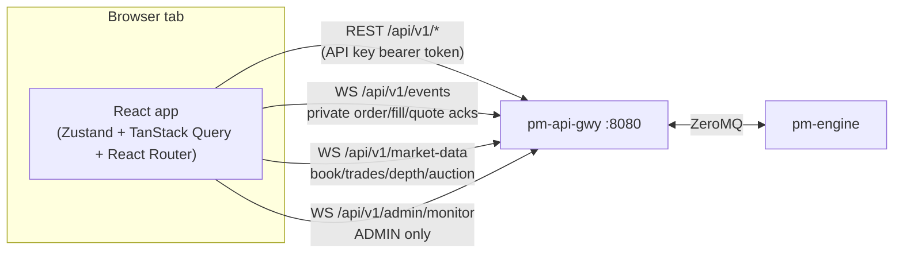

# Trading GUI (`pm-trading-ui`)

!!! note "Learning objectives"
    After reading this page you will understand:

    - What the Trading GUI is for, how it differs from TapeDeck, and which of
      the three roles it will route you to after login
    - How the browser talks to the exchange — which REST calls and which of the
      three WebSockets each role opens, and what happens on a reconnect
    - What must be running before you can log in, and how to start the app
      locally, from a container, or as a production build
    - How API-key login and role detection work, where to find keys, and what a
      `READ_ONLY` key does
    - Exactly which screens and actions each role gets, and where that
      restriction is actually enforced
    - Every screen in the app: the shared shell, the all-role market screens,
      and the full TRADER, MARKET_MAKER and ADMIN surfaces
    - Every order type the ticket supports and every field it can show,
      including SMP and the client order ID
    - What submitting, amending, replacing and cancelling an order each do —
      including what queue priority you keep or lose
    - How to place, watch and cancel OCO and Combo groups
    - How a market maker submits, monitors, re-quotes and cancels a two-sided
      quote, and how to diagnose one that looks wrong
    - Every ADMIN control, which are fully live today versus read-only, and why
    - The five classes of error the app can show you, and which of them is
      *not* a rejection
    - Typical end-to-end sessions for each role, the keyboard shortcuts, the
      power-user setting, and a troubleshooting table

## What the Trading GUI is

The **Trading GUI**, system name `pm-trading-ui`, is the graphical trading
terminal for the EduMatcher exchange. Its source code lives in `web-apps/trader-gui/`
and its full specification is `docs-design/EduMatcher-Trading-GUI.md`. Unlike
[TapeDeck](290-trader-info-terminal.md), which is a read-only market display
with no login, the Trading GUI is a **write-capable** application: it is how a
student places an order, a market maker manages a two-sided quote, or an
instructor runs the exchange session from a browser instead of the ALF
console.

Logging in with an API key routes you to one of three role-aware personas,
each with its own landing screen and navigation:

| Role | Landing screen | What the role is for |
|---|---|---|
| **TRADER** | Trading Workspace | Order entry, blotter, fills, positions |
| **MARKET_MAKER** | Quote Management | Two-sided quote management, positions |
| **ADMIN** | System Dashboard | Session control, gateway management, risk, monitor log |

Market Overview and Watchlist are available to every role, since watching the
market is a shared need regardless of what a given key is authorised to do
about it. [Roles and access rights](#roles-and-access-rights) below has the
full per-screen matrix.

## How it talks to the exchange

The app connects to exactly one upstream service,
[`pm-api-gwy`](260-api-gateway.md), over REST and WebSocket. There is no
separate bridge process — the browser talks to the API gateway directly
(through a Vite dev proxy in development, or a same-origin reverse proxy /
built-in proxy in production).



The three sockets are not all opened by every role:

| Socket | Carries | Opened by |
|---|---|---|
| `/api/v1/events` | Your own `order.*`, `quote.*`, `oco.*`, `combo.*` events, plus an `orders.snapshot` on every connect | **TRADER, MARKET_MAKER only** |
| `/api/v1/market-data` | `book`, `trades`, `depth`, `auction`, `session.state`, `circuit_breaker` | Every role |
| `/api/v1/admin/monitor` | Cross-gateway order activity and the audit tail | **ADMIN only** |

The consequence worth remembering: **ADMIN has no private order stream.**
An ADMIN key sees every gateway's activity through the monitor feed, but it
does not get an Active Orders blotter of its own.

Three details shape how the screens behave:

- **REST hydrates, WebSocket keeps current.** `GET /api/v1/bootstrap/{role}`
  fills every store at login; after that the sockets carry the changes, so
  most screens need no polling. The exceptions are the polled daily-stats
  rollup (change % / volume) and the REST-backed panels marked below.
- **`orders.snapshot` is the reconcile point.** It arrives on the first
  `/events` frame *and on every reconnect*, so the blotter and the quote
  cards resync themselves after a dropped connection without you doing
  anything.
- **Gaps are visible, not silent.** The market-data socket tracks a sequence
  number per topic; the admin monitor feed marks any stretch it could not
  replay after a reconnect with a red `GAP` row in the Monitor Log.

## Prerequisites

| Requirement | Notes |
|---|---|
| **`pm-api-gwy`** ([API Gateway](260-api-gateway.md)) | Required — this is the only upstream service the Trading GUI talks to. It must be reachable on `localhost:8080` (or wherever `VITE_API_BASE`/`API_PROXY_TARGET` points). |
| **`pm-engine`** | Required indirectly — `pm-api-gwy` authenticates your gateway against it at login, so a running gateway with a stopped engine still fails login. |
| An API key bound to a `TRADER`, `MARKET_MAKER`, or `ADMIN` gateway identity | Defined under `api_gateways.<name>.credentials` in `engine_config.yaml`. See [Logging in](#logging-in) below. |
| **Podman ≥ 4** or **Docker ≥ 24** with a Compose plugin | Needed for the container run path. |
| **Node.js ≥ 22 (LTS)** and npm | Needed only for local development or serving the production bundle without a container. |
| `pm-stats` (optional) | Powers Trade History, the daily rollup, the chart's history and the Order Detail timeline. Without it those degrade to an explanatory notice; live trading is unaffected. |
| `pm-audit` (optional) | Powers the ADMIN cross-gateway order drill-down only. |

## Running the application

There are three ways to run it, and which one you want depends on what you are
doing. If you are not sure, use the first.

| | What it is | Open | Use it when |
|---|---|---|---|
| **The whole stack** | The exchange and all four web applications, started together as containers | <http://localhost:8093> | You want a working system. This is almost always the right answer |
| **This app alone, in a container** | Just the Trading GUI, pointed at an exchange you started some other way | <http://localhost:8093> | The exchange runs elsewhere — another machine, a VM, a host install |
| **Local dev server** | Vite with hot reload, on your machine | <http://localhost:8193> | You are changing this application's code |

### The whole stack (recommended)

This starts the exchange *and* the Trading GUI together, on one private
network, with no addresses to configure:

**A released install:**

```bash
cd ~/.edumatcher
./edumatcher.sh start
```

**From a source checkout:**

```bash
cd deployment/docker
make up-all
```

Then open **<http://localhost:8093>**. The exchange's REST API is reachable at
`edumatcher:8080` from inside the network, which the compose file sets for you
— there is nothing to point anywhere.

The other applications come up at the same time: the trader terminal on
[8090](290-trader-info-terminal.md), the log console on
[8091](285-log-srv-gui.md).

Everyday commands, from `deployment/docker` (or with `./edumatcher.sh` in a
released install):

```bash
make status      # is every exchange process up?
make logs        # the backend's own output
make down-all    # stop everything
```

Full detail — including how to change which configuration the exchange trades
— is in [Installation](005-installation.md).

### This app alone, in a container

Use this when the exchange is already running somewhere else. From
`web-apps/trader-gui/`:

```bash
make up
```

Then open **<http://localhost:8093>**.

This path has one thing to configure, because the application is no longer on
the same network as the exchange: where `pm-api-gwy` is. The compose file
defaults to `host.docker.internal`, which resolves on Docker Desktop but not
on Podman or Linux Docker, so set it explicitly:

```bash
# Podman
API_PROXY_TARGET=http://host.containers.internal:8080 make up

# Linux Docker, or a gateway on another machine
API_PROXY_TARGET=http://192.168.1.50:8080 make up
```

If port 8093 is taken on your machine, move the *host* side of it:

```bash
TRADER_GUI_PORT=8193 make up
```

`make logs` follows the server log, `make down` stops it, `make ps` shows the
stack.

!!! note "`CALF_*` and `LOG_SRV_*` in this compose file"
    The file sets them for parity with TapeDeck, but `apps/serve/serve.ts`
    does not read them: the Trading GUI has no CALF uplink and no bridge
    process of its own, only the REST/WebSocket proxy. Leave them alone.

### Local dev server

```bash
make install    # once, and after any dependency change
make dev        # Vite with hot reload
```

Open **<http://localhost:8193>**, enter an API key, and click **Connect**.

`vite.config.ts` proxies every `/api/*` request — REST *and* the WebSocket
upgrades for `/events`, `/market-data` and `/admin/monitor` — to
`http://localhost:8080`. So as long as `pm-api-gwy`'s `desk` instance is
reachable on port 8080 of your own machine, this needs no configuration:
`VITE_API_BASE` and `VITE_WS_BASE` stay empty and the browser only ever talks
to one origin, which sidesteps CORS entirely.

Starting the exchange with `make up-all` publishes 8080 on `127.0.0.1`, so the
container stack and this dev server work together with nothing further to set.
See [The Development Loop](../developer/08-dev-workflow.md) for the full
inner-loop workflow.

### Production build and serve (without a container)

```bash
make build      # typecheck + vite build → apps/web/dist/
make serve      # serve apps/web/dist/ via pm-trading-ui-serve, :8093
```

`pm-trading-ui-serve` (`apps/serve/serve.ts`) is a small dependency-free Node
`http` server: it serves the built SPA with `Cache-Control: immutable` on
hashed asset bundles and `no-cache` on `index.html`, falls back every unknown
`GET` path to `index.html` so React Router can handle client-side navigation,
and optionally proxies `/api/*` to `pm-api-gwy` when `API_PROXY_TARGET` is
set. With `API_PROXY_TARGET` unset, `/api/*` returns an explanatory `503`
rather than silently 404-ing.

```bash
# Custom port, proxy API to a remote gateway
PORT=8088 API_PROXY_TARGET=http://my-exchange:8080 npm run serve
```

In production you have two options for `/api/*`: put a reverse proxy (nginx,
Caddy, Traefik) in front that routes `/api/*` to `pm-api-gwy` and `/` to
`pm-trading-ui-serve` (recommended, `API_PROXY_TARGET` left unset), or set
`API_PROXY_TARGET` and let `pm-trading-ui-serve` forward `/api/*` itself,
which needs no extra infrastructure for a single-machine setup.

### Make targets

| Target | What it does |
|---|---|
| `make install` | `npm install` across all workspaces |
| `make dev` | Vite dev server on `:8193` with hot reload |
| `make build` | Typecheck + production build into `apps/web/dist/` |
| `make build-debug` | Build with source maps, skipping the typecheck |
| `make typecheck` / `make lint` | TypeScript type-check (TypeScript *is* the linter here) |
| `make test` | Vitest suite |
| `make format` | Prettier over the whole tree |
| `make serve` | Serve the built SPA via `pm-trading-ui-serve` on `:8093` |
| `make up` / `make down` / `make restart` | Start / stop / restart this app's own container |
| `make cbuild` | Build the container image without starting it |
| `make logs` / `make ps` | Follow container logs / show stack status |
| `make cdist` | Build a distributable image tarball under `dist/` |
| `make clean` | Remove build artefacts and `dist/` |

Run `make help` for the authoritative list, `npm run serve -- --help` for the
static server's own flag reference, and see `web-apps/trader-gui/README.md` for the
implementation's own notes.
## Logging in

The Trading GUI has no user database of its own. It authenticates against
`pm-api-gwy` using **API keys** defined under `api_gateways.<name>.credentials`
in `engine_config.yaml`, which the gateway loads at startup. Entering a key
and clicking **Connect** does three things in order:

1. `GET /api/v1/status` with the typed key — the gateway validates it,
   authenticates the bound gateway id against `pm-engine`, and returns the
   `gateway_role` (`TRADER`, `MARKET_MAKER`, `ADMIN`, or `READ_ONLY`).
2. `GET /api/v1/bootstrap/{role}` — hydrates every store (symbols, reference
   data, session phase, halts, positions, orders) *before* any socket opens.
3. Only then is the key committed to the in-memory auth store, which is what
   opens the WebSockets and unblocks the app shell.

That ordering matters: a key that turns out to be invalid never causes three
sockets to be opened against it.

```yaml
api_gateways:
  desk:
    credentials:
      - api_key: key-trader-demo       # ← use this in the login form
        gateway_id: TRADER01           # ← maps to gateways.alf id TRADER01
      - api_key: key-mm-demo
        gateway_id: MM01                # role: MARKET_MAKER
      - api_key: key-admin-demo
        gateway_id: OPS01                # role: ADMIN
```

`engine_config.yaml` lives in the EduMatcher session data directory —
by default `~/.local/share/edumatcher/ref_data/engine_config.yaml`, or
wherever `EDUMATCHER_DATA_DIR` points. Keep one credential per persona in
your config so you can switch roles by reconnecting with a different key.

!!! warning "`READ_ONLY` keys cannot use this app"
    A credential defined with `gateway_id: null` is a **read-only** key: the
    gateway reports `gateway_role: "READ_ONLY"` for it. The Trading GUI is a
    write-capable terminal and rejects it at login with
    *"`ROLE_UNSUPPORTED`: Unsupported role: READ_ONLY"*. Read-only keys are
    for observer tooling such as [TapeDeck](290-trader-info-terminal.md); use
    a key with a `gateway_id` here.

!!! note "The key never touches disk"
    The API key is held in memory for the tab only (`useAuthStore`), never
    written to `localStorage` or `sessionStorage`. Reloading the page returns
    you to the login screen — expected for a classroom system running on
    localhost, not a bug.

📷 **Figure 1 — Login screen.** Capture the centered login card (API key
field, Connect button, the "held in memory" notice) against the dark shell
background. Suggested file: `images/trader-gui/fig-01-login.png`.

## Roles and access rights

Your role is a property of the **gateway identity your API key is bound to**,
not of the app. It decides which sidebar entries you see and which routes you
may visit.

| Screen | TRADER | MARKET_MAKER | ADMIN |
|---|:---:|:---:|:---:|
| Market Overview | ✓ | ✓ | ✓ |
| Watchlist | ✓ | ✓ | ✓ |
| Symbol Detail overlay | ✓ | ✓ | ✓ |
| Trading Workspace | ✓ | – | – |
| Order Entry (incl. OCO / Combo) | ✓ | – | – |
| Active Orders blotter | ✓ | – | – |
| Trade History | ✓ | – | – |
| Positions (incl. Flatten) | ✓ | ✓ | – |
| Quote Management | – | ✓ | – |
| Quote Bootstrap & Legs | – | ✓ | – |
| System Dashboard | – | – | ✓ |
| Symbol Management (read-only) | – | – | ✓ |
| Index Administration (read-only) | – | – | ✓ |
| Session Control | – | – | ✓ |
| Risk Controls (read-only) | – | – | ✓ |
| Circuit Breakers | – | – | ✓ |
| Gateway Management + Kill Switch | – | – | ✓ |
| Monitor Log | – | – | ✓ |

!!! important "Where the restriction actually lives"
    The sidebar and the route guard are a **presentation-layer** convenience —
    they keep you out of screens your key has no business on. The real
    enforcement is server-side, in two places:

    - **`pm-api-gwy`** gates every `/admin/*` endpoint on the ADMIN role
      (`403 ROLE_DENIED` otherwise), and gates every write on the key not
      being read-only (`403 READ_ONLY`).
    - **`pm-engine`** enforces the rest. Most notably, quotes are rejected for
      any non-market-maker participant: *"Quotes are only allowed for
      MARKET_MAKER participants"*.

    So a hand-crafted REST call from a TRADER key cannot become an admin
    action or a quote, even though the gateway itself does not distinguish
    TRADER from MARKET_MAKER on the order and quote endpoints.

## The application shell

📷 **Figure 2 — App shell, TRADER role.** Capture the Trading Workspace with
the full shell visible: top bar (wordmark, session badge + clock, connection
health, notification bell, settings, help, gateway id/role, logout) and the
left sidebar navigation for the TRADER role. Suggested file:
`images/trader-gui/fig-02-app-shell-trader.png`.

Every authenticated screen shares the same chrome.

### Top bar

Left to right:

- **Wordmark** — `EduMatcher · pm-trading-ui`.
- **Session-phase badge** — colour-coded: Pre-Open (slate), Opening/Closing
  Auction (amber), Continuous (green), Closed (red). It animates on change.
- **Phase clock** — a countdown to the next scheduled transition
  (`→ Continuous in 04:12`) when the schedule provides one, or *elapsed time
  in phase* when it does not, so a venue with sessions disabled or a partial
  schedule still gets a useful clock rather than a blank one.
- **Exchange clock** — wall time, `HH:MM:SS` (hidden on narrow windows).
- **Connection health** — `Connected` / `Reconnecting` / `Disconnected` with
  an icon; hover for the per-socket breakdown
  (`events: … · market-data: … · monitor: …`).
- **"Updated HH:MM:SS"** — the timestamp of the last market-data frame, so a
  frozen board is obvious.
- **Command palette** (magnifier, `Ctrl+K`).
- **Notification bell** with an unread count badge (`99+` above 99).
- **Settings** (gear) — see [power-user mode](#keyboard-shortcuts-and-power-user-mode).
- **Help** (`Ctrl+/`).
- **Gateway id and role**, then **Logout**.

### Left sidebar

Persistent and not collapsible. Market Overview and Watchlist are listed for
every role; below a divider, the role-specific screens from the matrix above.

### Connection banner

A thin strip appears under the top bar whenever the live connection degrades:
amber *"Reconnecting to the exchange… live data is paused."* or red
*"Disconnected from the exchange — is pm-api-gwy / the engine running? Live
prices and events are stale until the connection returns."* It makes a stalled
gateway visible everywhere rather than leaving individual screens silently
stale.

### App-level overlays

Six overlays can open over any screen. Only one drives the main content area
at a time; `Escape` closes whichever is open.

| Overlay | Opened by | Purpose |
|---|---|---|
| **Symbol Detail** | Clicking a Market Overview / Watchlist row, or a command-palette symbol | Chart, depth, tape, stats and auction for one symbol |
| **Event Center** | Bell icon, `Ctrl+.` | Session history of acks, fills, rejects, cancels, CB and session events |
| **Order Detail drawer** | Double-click a blotter row, an Event Center entry, or a Trade History order id | One order's full chronological lifecycle |
| **Help drawer** | `?` button, `Ctrl+/` | Topic-based in-app help |
| **Shortcuts dialog** | `?` (outside a text field) | The keyboard reference card |
| **Command palette** | `Ctrl+K` | Fuzzy search over symbols and role-aware actions |

### Event Center

A right-edge sheet listing this session's notifications, newest first, capped
at 500 entries. Each row carries a coloured kind badge — `ACK`, `FILL`,
`REJECT`, `CANCEL`, `CB`, `SESSION`, `SYSTEM` — a timestamp, a title and a
detail line. Opening the sheet marks everything read and clears the bell
badge. Filter chips at the top narrow to one kind (only kinds actually
present are offered), **Clear** empties the list, and any entry that carries
an order id is clickable straight through to the Order Detail drawer.

The Event Center is deliberately not a duplicate of the toast stream: the
order ticket surfaces its own synchronous accept/reject verdict, and the
event bridge covers the *later* outcomes — fills, cancels, expiries, and OCO
/ combo group events.

### Command palette

`Ctrl+K` opens a keyboard-first fuzzy search over two groups:

- **Symbols** (up to 8 matches) — showing the live last price, with a star
  that toggles watchlist membership without leaving the palette. Selecting a
  symbol sets it active and opens Symbol Detail.
- **Actions** — every navigation target for your role, plus Flatten All
  (TRADER/MM), the Event Center, Help and the shortcut card. Rows show their
  keyboard shortcut where one exists.

`↑`/`↓` move, `Enter` runs, `Escape` closes. This is the backbone of
mouse-free navigation.

📷 **Figure 14 — Command palette open.** Capture `Ctrl+K` pressed with a
partial query typed, showing filtered navigation and action results.
Suggested file: `images/trader-gui/fig-14-command-palette.png`.

### Help drawer

`Ctrl+/` (or the `?` icon) opens a right-edge sheet with a topic list:
Getting Started, Trading Workspace, Order Types, Amend vs Cancel-Replace,
Time in Force, Auctions & Indicative Price, Risk Controls, Market-Maker
Quoting, Admin Reference, and Keyboard Shortcuts. The shortcuts topic renders
the same table as the standalone `?` dialog, so the two can never drift apart.

### Error boundary

The routed screen is wrapped in an error boundary keyed on the URL. If one
screen throws, it degrades to an inline message while the top bar, sidebar and
overlays stay usable — and navigating away clears it.

## Screens available to every role

### Market Overview

📷 **Figure 3 — Market Overview.** Capture the symbol table mid-session with
live bid/ask/last, change %, and volume columns populated, the symbol filter
box, and at least one row starred into the watchlist. Suggested file:
`images/trader-gui/fig-03-market-overview.png`.

The reference board, available regardless of role. Columns:

| Column | Source |
|---|---|
| ☆ | Client-only watchlist toggle |
| Symbol | Reference data |
| Bid / Ask / Last | Live `book` and `trades` channels; flash on change |
| Chg % | Polled daily rollup (`/history/daily`) versus the day's open |
| Volume | Polled daily rollup, topped up live between polls |
| Status | `HALT` / `HALT <level>` badge, or an `AUCTION` badge with the indicative uncross price during a call phase |

Live prices come from an always-on broad book/trades subscription; the derived
columns come from the polled rollup and **degrade gracefully** — if the stats
database is unavailable you get *"Daily rollup unavailable — Chg %/Volume
hidden"* in the header and blank cells, not a broken table.

The table is virtualised, so a few hundred symbols scroll smoothly. Every
column except ☆ and Status is sortable; symbols with no known open price sort
*last* in both directions rather than heading an ascending sort. The filter
box narrows by symbol substring, and **Refresh** re-fetches `/symbols` and the
rollup on demand.

**Clicking a row opens the Symbol Detail overlay** and sets that symbol as the
app-wide **active symbol** — which the Trading Workspace, the order ticket and
the focused market-data subscription then follow. The ☆ star toggles the
watchlist without selecting the row.

Two badges are worth reading carefully:

- **`HALT`** with no level is an *administrative* halt (an ADMIN triggered it
  with no ladder level); `HALT L2` names the circuit-breaker level that fired.
- **`AUCTION`** shows the engine's equilibrium price, with a trailing `~`
  while the value is still indicative. `no cross` is a real reading — the book
  would not cross at any price — not a missing value.

### Watchlist

`Ctrl+L`. A thin wrapper around the shared watchlist panel: a compact board of
your starred symbols showing Last, Chg %, Bid and Ask. Row click behaves like
Market Overview; the star removes the symbol.

The watchlist is more than cosmetic: **the watchlist set drives the
market-data focus subscription**. The active symbol plus your watchlist are
the symbols the heavy `depth` and `auction` channels are requested for, so
starring a symbol is how you get full depth on it without making it active.
The active symbol leads the set so it survives if the set hits
`VITE_MAX_FOCUS_SYMBOLS`.

The watchlist is client-only and lives in memory for the tab — it is not
persisted between sessions.

### Symbol Detail overlay

A 640 px right-edge panel with a live header (symbol, last, change %, volume)
and five tabs. The Auction tab shows an amber dot while a call phase is
running.

| Tab | Contents |
|---|---|
| **Chart** | Candlestick or line chart. Timeframes `1m`, `5m`, `1h`, `1D`, `All`. Intraday frames are built from trade prints and **append live** as trades arrive; `1D`/`All` render the daily rollup and do not live-append. |
| **Depth** | The full depth ladder — see below. |
| **Trades** | The last 50 prints, seeded from `/history/trades` and topped with the live tape, de-duplicated by trade id. Price is green when a buyer was the aggressor, red when a seller, grey `A` for an auction print. |
| **Stats** | Today's OHLCV grid: Open, High, Low, Close/Last, Volume, Trade Count, VWAP, Largest Trade, Last Buy, Last Sell. |
| **Auction** | The engine's indicative uncross (or the most recent completed result): equilibrium price, matched quantity, imbalance side and quantity — plus a **cumulative supply/demand curve** derived from the resting book, with the equilibrium price marked. |

#### The depth ladder

Bids on the left, asks on the right, each level showing order count, quantity
and price, with a bar behind the quantity proportional to that level's share
of the deepest level in view. A `5` / `10` / `20` selector sets how many
levels to show.

**Click-to-trade:** clicking a *bid* level pre-fills a **SELL** at that price;
clicking an *ask* level pre-fills a **BUY**. In the Trading Workspace this
writes straight into the order ticket (switching it to `LIMIT`, filling the
price, and ring-highlighting the suggested side button).

## The TRADER role

### Trading Workspace

📷 **Figure 4 — Trading Workspace.** Capture all four quadrants live for one
symbol: chart (top-left), depth ladder (right), order ticket (bottom-left),
and the compact blotter strip along the bottom. Suggested file:
`images/trader-gui/fig-04-trading-workspace.png`.

The default TRADER landing screen and cockpit. Four panels, all bound to one
active symbol chosen from the header dropdown:

- **Chart** (top-left, spanning two columns) — the same chart component as
  Symbol Detail.
- **Depth ladder** (right, full height) — click-to-trade into the ticket.
- **Order ticket** (below the chart) — in **compact** mode with the symbol
  **locked** to the active symbol and the client-order-id field hidden.
- **Compact blotter** (bottom strip) — this symbol's *working* orders only
  (terminal rows are filtered out), with an inline cancel per row. It reads
  the same live order store as the full blotter, so it needs no polling.

Changing the symbol re-binds every panel at once. If no symbol is active yet
the Workspace adopts the first known one so all four panels have something to
show; with no symbols at all it says so and points at `pm-api-gwy`.

### Order Entry

The standalone full ticket, with the symbol picker **unlocked** — choosing a
symbol here also sets the app-wide active symbol. Below it, an **Advanced**
disclosure holds the **OCO** and **Combo** sub-forms, collapsed by default so
a first classroom session stays simple.

The eight single-leg order type tabs are always shown flat above the ticket
fields — every single-leg type is one click away. Only OCO and Combo sit
behind the Advanced disclosure.

📷 **Figure 5 — Order Entry with OCO panel expanded.** Capture the ticket
plus the OCO sub-panel open beneath it. Suggested file:
`images/trader-gui/fig-05-order-entry-oco.png`.

#### Ticket fields

Every field carries a small ⓘ button with an inline explanation, so the ticket
is self-documenting in a classroom.

| Field | Shown for | Notes |
|---|---|---|
| **Symbol** | Always | A combobox backed by the configured symbol list. Locked and read-only in the Workspace. |
| **Quantity** | Always | Positive whole number. Defaults to 100. |
| **Price** | LIMIT, STOP_LIMIT, FOK, ICEBERG, IOC | The placeholder shows a live **reference price** (`Ref: 150.25`) derived from last trade → mid → previous close, so you are not typing blind. |
| **Stop price** | STOP, STOP_LIMIT | The trigger price. |
| **Visible qty** | ICEBERG | The slice shown on the book. Must be strictly less than the total quantity. |
| **Trail offset** | TRAILING_STOP | Distance the stop trails behind the price. |
| **TIF** | All types except IOC | DAY / GTC / ATO / ATC — gated by session phase, see below. |
| **SMP** | Always | Self-match prevention action. |
| **Client Order ID** | Order Entry only (hidden in the compact Workspace ticket) | Optional idempotency key, up to 64 characters. |

**SMP (self-match prevention)** deserves a note, because the default is not
`NONE`. The selector offers *Gateway default*, `NONE`, `CANCEL_AGGRESSOR`,
`CANCEL_RESTING` and `CANCEL_BOTH`. Leaving it on **Gateway default** omits
the field entirely, which lets `pm-api-gwy` apply its own configured policy —
that is deliberately *different* from explicitly choosing `NONE`, which
disables SMP for this one order. Leave it alone unless you are demonstrating a
specific policy.

**TIF is phase-gated.** The values valid in the current phase are selectable;
the rest are shown greyed as `(n/a this phase)`:

| Phase | Selectable TIF |
|---|---|
| `PRE_OPEN` | DAY, GTC |
| `OPENING_AUCTION` | DAY, GTC, **ATO** |
| `CONTINUOUS` | DAY, GTC |
| `CLOSING_AUCTION` | DAY, GTC, **ATC** |
| `CLOSED` | *(none — no orders accepted)* |

If the phase changes while you have an illegal TIF selected, the ticket
auto-corrects to the first allowed value rather than letting you submit
something the engine will reject.

#### Order types

| Type | Price | Stop price | Visible qty | Trail offset | TIF | Rests on the book? |
|---|:---:|:---:|:---:|:---:|:---:|---|
| **MARKET** | – | – | – | – | ✓ | Never — sweeps the opposite side, unfilled remainder is discarded |
| **LIMIT** | ✓ | – | – | – | ✓ | Yes — fills at price-or-better, remainder rests |
| **STOP** | – | ✓ | – | – | ✓ | Dormant until `stop_price` triggers, then becomes a MARKET order |
| **STOP_LIMIT** | ✓ | ✓ | – | – | ✓ | Dormant until `stop_price` triggers, then becomes a LIMIT order |
| **FOK** (fill-or-kill) | ✓ | – | – | – | ✓ | Never — all-or-nothing, rejected immediately if it can't fill in full |
| **ICEBERG** | ✓ | – | ✓ | – | ✓ | Yes — a LIMIT order that only shows `visible_qty` at a time; each replenished slice gets a new queue timestamp |
| **IOC** (immediate-or-cancel) | ✓ | – | – | – | *(hidden — always immediate)* | Never — fills what it can now, cancels the remainder |
| **TRAILING_STOP** | – | – | – | ✓ | ✓ | Dormant; `stop_price` ratchets by `trail_offset` as the market moves, then becomes a MARKET order on trigger |

Notes worth knowing before you place an order:

- A **STOP** triggers when the last trade price crosses `stop_price` (`>=`
  for a BUY stop, `<=` for a SELL stop). **STOP_LIMIT** triggers the same way
  but converts to a LIMIT at your given price instead of a MARKET order.
- A **TRAILING_STOP** needs a reference to trail from. If the symbol has never
  traded and you supply no stop price, the engine rejects it with *"Trailing
  stop requires STOP= or a prior trade price"*.
- **FOK**'s pre-check for "can this fill in full right now" excludes hidden
  iceberg reserve and any same-gateway liquidity that self-match prevention
  would filter out — so a FOK can reject with *"Insufficient liquidity"* even
  when the visible book total looks sufficient.
- **IOC requires a price** — it isn't a bare sweep like MARKET, it's a
  price-limited immediate execution with no resting remainder.
- **MARKET, FOK and IOC are the "cannot rest" types**, and that single fact
  explains most of their special-casing: they are rejected outright during
  either auction phase and on a halted symbol, because in both cases the
  engine is not matching continuously and there is nowhere for them to go.
  Every other type is accepted and rests without matching until matching
  resumes. During an auction the ticket disables those three tabs and shows a
  banner; if one of them is selected when the auction starts, the ticket falls
  back to `LIMIT` rather than dead-ending.
- See [Order Types](060-order-types.md) for the full engine-level reference.

#### OCO orders

**OCO (one-cancels-other)** links two legs — each its own order, same
symbol, opposite or same side as you configure, one LIMIT or STOP each —
under a shared `oco_id`. The form carries a shared symbol, quantity and TIF
(DAY or GTC), plus a per-leg side and type; an OCO id is generated for you
(`oco-<base36>`) but stays editable, and a fresh one is generated after each
successful submit.

When either leg reaches a **terminal state** (filled, cancelled, or rejected),
the engine automatically cancels the other, with reason *"OCO sibling
`{id}` reached `{STATUS}`"*, and the Event Center logs an `oco.cancelled`
entry. A **partial** fill on one leg does *not* trigger the cascade — only a
terminal state does.

#### Combo orders

**Combo (multi-leg, all-or-none)** links two to ten legs, potentially across
different symbols, each LIMIT or MARKET, under a shared `combo_id`. The leg
builder lets you add and remove legs (the remove button is disabled at two
legs), and a MARKET leg's price field is disabled since it must not carry one.
TIF is shared across all legs; SMP is fixed at `NONE` for combos submitted
from this GUI.

Combos from this GUI are always all-or-none (`AON`): the combo is only
considered matched once every leg has fully filled. If any leg cancels or
expires, the engine cascade-cancels the remaining unfilled quantity on the
other legs — legs that already filled are **not** reversed. A leg rejected at
submission takes the whole combo down with a reason naming the offending leg
(*"Leg 2 (MSFT) …"*).

`Ctrl+Enter` submits whichever of the two forms has focus.

#### Groups in the blotter

Both OCO and Combo legs show up as ordinary rows in the Active Orders
blotter — each has its own order id, its own status, and its own Amend /
Replace / Cancel buttons — with a **Group** badge linking them together, and
a separate **Groups** panel above the main blotter. Each group row shows its
kind (amber `OCO`, blue `COMBO`), id, member symbols, an aggregate status
(`1 live / 1 cancelled`, or just `filled` when uniform) and a live/total
count, with a one-click **Cancel group** that is disabled once no member is
live.

### Submitting an order

Pick a type tab, fill in the fields it shows, and press the **Buy** or
**Sell** button (or the `B` / `S` shortcut, ignored while typing in a form
field). Before anything is sent, the ticket checks:

- The market isn't `CLOSED` (blocked client-side with *"Market is closed — no
  orders accepted"*).
- MARKET, FOK, and IOC aren't being submitted during an auction phase
  (blocked client-side with *"`{TYPE}` orders are not accepted during an
  auction"*).
- Every required field for the selected type is present and valid — see
  [Errors and how to read them](#errors-and-how-to-read-them) for the exact
  messages.

If validation passes, the ticket submits with `wait=ack`, which asks the
gateway to hold the HTTP response open until the first acknowledgement comes
back, so you get a synchronous accepted/rejected answer rather than having to
watch the blotter to find out:

- **Accepted** — a success toast (*"`{side} {qty} {symbol}` accepted"*) and
  an `ACK` entry in the Event Center; the order appears in Active Orders with
  status `NEW`.
- **Rejected** — an error toast (*"REJECTED: `{reason}`"*, using whatever
  reason string the engine returned) and a `REJECT` entry in the Event
  Center; no row appears in the blotter, since a rejected order was never
  accepted onto the book.
- **Timed out waiting for the ack** — this is the one case that is *not* a
  rejection: the order reached the engine, but the synchronous ack didn't
  return in time. The ticket shows *"`{side} {symbol}` submitted — awaiting
  confirmation (check blotter)"*; check Active Orders a moment later to see
  whether it landed.

On a successful submit, the ticket keeps your symbol, quantity, and price so
you can immediately submit the other side of a two-sided view — only the
client order ID field clears.

### Active Orders

📷 **Figure 6 — Active Orders blotter.** Capture several working orders of
different types/statuses, with one row's checkbox selected to show the
bulk-cancel affordance. Suggested file:
`images/trader-gui/fig-06-active-orders.png`.

The full live blotter, driven by the order store — seeded from the
`orders.snapshot` frame and folded forward from live `order.*` events, so it
never polls. The header shows the order count and a "reconciled HH:MM:SS"
stamp; **Refresh** performs an explicit `GET /orders` reconcile against the
gateway, merging rows without resurrecting anything already terminal locally.

#### Columns

| Column | Notes |
|---|---|
| ☐ | Selection checkbox; disabled for terminal rows |
| Symbol, Side, Type, TIF | Side is colour-coded green/red |
| Qty | The order's total quantity |
| **Remaining** | Flashes on every change, so a fill or amend is visible at a glance in a busy blotter |
| Price | `—` for types that carry no price |
| Group | The `oco_group_id` or `combo_parent_id` badge, or `—` |
| Status | Coloured status pill |
| Updated | `HH:MM:SS.mmm` |
| *(actions)* | Amend (pencil), Cancel-Replace (repeat), Cancel (×) — all greyed for terminal rows |

Every column except the checkbox, Group and the action cell is sortable.

#### Selecting rows and moving around

With the mouse: click selects a row; **Shift-click** selects an inclusive
range; **Ctrl/⌘-click** toggles one row without clearing the rest; the header
checkbox selects every *cancellable* row. Terminal orders (filled, cancelled,
rejected, expired) can never be selected.

The blotter is also fully keyboard-driveable — click a row once (or Tab into
the table) and then:

| Key | Effect |
|---|---|
| `↑` / `↓` | Move between rows. This moves the **focus outline only** and deliberately leaves the selection alone, so you can arrow through a busy blotter without disturbing a multi-row selection you have already built up. It stops at the first and last row rather than wrapping. |
| `Ctrl+A` / `⌘+A` | Select every cancellable row — the keyboard equivalent of the header checkbox. Terminal rows are skipped. |
| `Enter` | Open the Order Detail drawer for the focused row (same as double-click) |
| `Delete` / `Backspace` | Cancel the current selection, or — when nothing is selected — the focused row |

The combination worth learning is `↑`/`↓` to the order you want, then
`Delete`: because `Delete` falls back to the focused row when no row is
selected, that is the fastest way to pull a single order without touching the
mouse.

!!! note "Terminal orders stay visible for a while"
    The blotter does not immediately drop a filled or cancelled order — the
    row remains with a terminal pill and greyed action buttons so you can see
    what happened. Up to 200 terminal orders are retained (oldest dropped
    first); a fresh `orders.snapshot` on reconnect removes the ones the
    gateway has since evicted. Working orders are never dropped.

### Amending an order

Click the pencil icon on a working order to open **Amend**. The dialog shows
symbol, side, type, TIF, original quantity and filled quantity read-only, and
lets you edit **price** (when the type has one) and **quantity**. It does not
block a price change or a quantity increase, but it warns you about the
priority consequence, and it applies the engine's own rules locally so an
amend the engine would refuse never leaves the browser: the quantity must be a
positive whole number that exceeds what has already filled, the price must be
positive, and at least one of the two must actually change (*"No changes to
submit"*). Only the fields you changed are sent.

Which change you make matters for your place in the queue:

| Amendment | Queue priority |
|---|---|
| Quantity decrease only, price unchanged | **Preserved** |
| Price change, either direction | **Lost** |
| Quantity increase, price unchanged | **Lost** |
| Both price and quantity changed | **Lost** |

In other words: a same-price size reduction is the only amendment that keeps
your place in line. Anything else re-queues the order behind resting orders
at the same price — the engine assigns a fresh arrival sequence — even though
the order id itself doesn't change. If a price amendment makes the order
marketable (it now crosses the book), the engine fills it immediately as part
of processing the amend: you'll see an `order.amended` event followed by one
or more fills on the same order id.

Only **LIMIT and ICEBERG** orders can be amended. MARKET, FOK and IOC never
rest long enough, and STOP / STOP_LIMIT / TRAILING_STOP have ambiguous trigger
semantics once amended, so the engine rejects the attempt with *"Cannot amend
`{TYPE}` orders"*. The dialog itself doesn't stop you trying.

!!! tip "You cannot amend down to exactly what has filled"
    The new quantity must **exceed** the filled quantity, not merely reach it.
    Amending a 100-lot with 40 filled down to 40 is refused — the dialog stops
    it with *"Quantity must exceed the 40 already filled — cancel the order
    instead"*, which is also precisely what the engine would have answered. If
    your intent is to stop trading the remainder, cancel the order; the 40
    already filled are yours either way.

An amend that times out waiting for its ack shows *"Amend submitted —
awaiting confirmation (check blotter)"* and closes the dialog, exactly like a
submit timeout — it is not a rejection.

### Cancel-Replace

Click the replace icon to open **Replace**, which lets you change price, stop
price, and quantity for a resting order, same as Amend — but the mechanism is
different: Replace atomically cancels the resting order and submits a
brand-new one with your changes, rather than modifying the existing order in
place. Symbol, side, type and TIF are inherited and shown read-only.

**Priority is always lost**, regardless of what you changed, since the
replacement is a new order with a fresh timestamp. Use Replace when you want a
genuinely new order (for example, increasing size well beyond the original),
and Amend when a same-price size reduction is enough — Amend is the only path
that preserves your queue position.

On success you get *"Replaced `{old}` → `{new}`"*, naming both order ids.

If the cancel leg of a Replace times out waiting for its ack, the dialog
shows a different message than the general "awaiting confirmation" pattern:
*"Replace could not complete — the order may have already filled."* This is
because a timeout here usually means the original order filled before the
cancel could land, so no replacement was submitted — the dialog stays open
rather than assuming success, and nothing was left live.

### Cancelling an order

Click the × icon on a row, or select it and press `Delete`/`Backspace`, to
cancel a single order. With **Confirm cancellations** on (the default), a
confirmation dialog appears first. With it off, the cancel fires immediately
and you get an undo toast instead — **Undo** resubmits an equivalent order at
the *remaining* quantity, but as a brand-new order id with no priority
carried over (the toast says so explicitly: *"Undo re-submits an equivalent
order (priority not preserved)"*). If nothing remained, the undo is a no-op
and says so rather than sending a zero-size order.

The same behaviour applies to the compact blotter in the Trading Workspace —
both use the same shared cancel path, so power-user mode behaves identically
in either place.

**Bulk cancel**: select multiple rows and use the **Cancel all selected**
button that appears, or press `Delete` with a selection active. This confirms
once for the whole batch (*"…This cannot be undone."*), then cancels each
selected order individually — it is not a single mass-cancel call, so a very
large selection sends one request per order.

**Group cancel**: the Groups panel above the blotter has a one-click cancel
per OCO/Combo group, which cancels the group as a unit
(`DELETE /oco/{id}` or `DELETE /combos/{id}`) rather than looping over its
member orders. The confirmation spells out the consequence, including that a
combo's already-filled legs are not reversed.

### Seeing whether an order is resting or executed

Every order has one of these statuses, shown as a coloured pill:

| Status | Meaning | Terminal? |
|---|---|---|
| `NEW` | Accepted, resting, unfilled | No |
| `PARTIAL` | Resting, partially filled | No |
| `FILLED` | Fully filled | Yes |
| `CANCELLED` | Cancelled, whatever remained is gone | Yes |
| `REJECTED` | Never accepted onto the book | Yes |
| `EXPIRED` | TIF elapsed (e.g. a DAY order at session close) | Yes |
| `PENDING` | Submitted, ack not yet received (transient, client-side only) | No |

`NEW` and `PARTIAL` are the two "resting" states — the order is still working
and its Amend / Replace / Cancel buttons are active. The four terminal
statuses grey out those buttons and can't be selected for bulk cancel.

### Order Detail drawer

For the full chronological picture of one order, double-click its row (or
press `Enter` with it focused) to open the **Order Detail drawer**. Its header
repeats the symbol, short order id, status pill, side, type, TIF, quantity and
— when present — the client order id and any OCO / combo group id.

The timeline shows every `ACK`, `REJECT`, `FILL`, `AMEND`, `CANCEL` and
`EXPIRE` event for that order id in order, each with a `HH:MM:SS.mmm`
timestamp and a detail line (`120 @ 150.25 · 80 left`, `price 151.00 · qty
200 · priority reset`, and so on). It is **seeded from the durable history**
in `pm-stats` and **appended live** for the rest of your session, with live
entries flagged; the two together stay accurate even when the history endpoint
lags the live stream. Without `pm-stats` you get *"History unavailable — the
stats database is not running. Live events below still update."*

The same drawer is opened from Trade History order ids and from Event Center
`FILL`/`CANCEL` entries, so there is only ever one lifecycle view to learn.

### Trade History

Durable fills from `GET /history/fills`, with live `order.fill` events
prepended as they arrive this session (flagged `live`, and only shown when the
date filter is today or unset).

Filters: **symbol** (server-side), **date** (server-side, defaults to today)
and **side** (client-side). Columns are Time, Symbol, Side, Fill Qty, Fill
Price, Remaining, Trade ID and Order ID. A fill that swept several price
levels shows the first trade id with a `+N` badge for the rest. Clicking the
Order ID opens the Order Detail drawer.

Without `pm-stats` the page shows *"Could not load fills — is the stats DB
available?"*; live fills for the current session still appear.

### Positions and Flatten

The shared Position Summary Panel, also used by MARKET_MAKER. Net position
per symbol from `GET /positions`, refreshed whenever an `order.fill` arrives.
Columns: Symbol, Position (signed, colour-coded), Last Price (live where
available, else the cached close), Action.

**Flatten** submits a MARKET closing order for the whole position — a SELL for
a long, a BUY for a short, at `abs(net_qty)`. **Flatten All** does the same
for every non-zero position.

Because MARKET orders are only accepted during continuous trading, both
actions are **disabled outside `CONTINUOUS`**, with an amber banner naming the
current phase.

Confirmation behaviour differs between the two on purpose:

- **Flatten (per row)** honours the power-user setting: confirm dialog by
  default, or fire-immediately with an **Undo** toast when confirmations are
  off. That undo is best-effort — it cancels the just-submitted MARKET order,
  which does nothing if it already filled.
- **Flatten All** *always* confirms, regardless of the setting, and names how
  many positions it will close.

## The MARKET_MAKER role

### Quote Management

📷 **Figure 7 — Quote Management.** Capture the card grid with two-sided
quotes on several symbols, including at least one card showing partial-fill
progress on a leg. Suggested file: `images/trader-gui/fig-07-quote-mgmt.png`.

The MARKET_MAKER landing screen: **one card per configured symbol**, whether
or not you currently quote it. A symbol carries at most one active quote per
gateway, so each card shows at most one.

A card with an active quote shows:

- A **state badge** — `ACTIVE` (green), `INACTIVE_BID_FILLED` /
  `INACTIVE_ASK_FILLED` (amber), `PENDING` (slate), or
  `CANCELLED` / `MISSING`.
- A **BID row** and an **ASK row**, each with `price × qty`, a
  `Fill: filled / qty` counter, a **fill-progress bar**, and the per-leg
  status underneath.
- The **Quote ID**.
- **New Quote** and **Cancel** buttons.

A card with no active quote shows *"No active quote."* and just the New Quote
button.

The header reports how many active quotes you have and flags `syncing…` while
the bootstrap query refetches. Pressing **F2** anywhere on this screen opens
the New Quote form for the current active symbol and focuses it.

### Submitting a quote

**New Quote** opens the form inline on the card. Opening it also sets that
card's symbol as the app-wide active symbol, so your chart and depth follow
what you are quoting.

| Field | Notes |
|---|---|
| **Quote ID** | Auto-generated as `mm-<symbol>-<base36>`, editable, auto-focused and pre-selected on open so you can type over it |
| **Bid price / Bid qty** | Defaults to 500 qty |
| **Ask price / Ask qty** | Defaults to 500 qty |
| **TIF** | DAY or GTC |

A live **spread indicator** sits beside the TIF selector and updates as you
type: `Spread: 0.05 (5 ticks)`, using the symbol's own tick size. It reads
`Spread: —` until both prices are valid and the ask exceeds the bid.

The form refuses to submit a crossed or locked quote:
*"Ask price must be strictly greater than bid price"*. On success you get
*"Quote `{id}` submitted"* and an `ACK` entry in the Event Center.

Opening New Quote on a card that already has a quote **pre-seeds the form with
the current prices and sizes** (with a fresh id), so adjusting a live quote is
a two-field edit rather than a re-entry.

### Watching and reacting to fills

Quote lifecycle events arrive on the `/events` socket and drive three things:

- **`quote.ack`** — a rejected quote raises an error toast
  (*"Quote `{symbol}` rejected: `{reason}`"*) and a `REJECT` entry; an accepted
  one is recorded quietly as an `ACK`.
- **`quote.status`** — when a leg fills, the quote goes inactive on that side
  and you get a success toast, *"`{symbol}` `BID`|`ASK` filled — quote
  inactive"*, carrying a **Re-quote** action.
- Either event, plus every `orders.snapshot` (so, on connect and every
  reconnect), invalidates the bootstrap and legs caches so the cards resync to
  engine truth.

**Re-quote** re-opens the New Quote form pre-filled with the previous quote's
prices and sizes, so you can decide whether to hold the same market or adjust
before resubmitting.

### Cancelling a quote

**Cancel** on a card removes the quote via `DELETE /quotes/{symbol}`, which
takes **both resting legs** at once.

!!! important "Quote cancels always confirm"
    Unlike a single-order cancel, the quote cancel **always** shows a
    confirmation dialog — the power-user *Confirm cancellations* setting does
    not apply to it, and there is no undo toast. A quote cancel removes two
    resting orders at once, so it is treated as a high-impact action.

A cancel that times out waiting for its ack shows *"Cancel submitted for
`{symbol}` — awaiting confirmation"* — again, not a rejection.

### Quote Bootstrap & Legs

📷 **Figure 8 — Quote Bootstrap and Legs view.** Capture both tables with
several rows of data. Suggested file:
`images/trader-gui/fig-08-quote-bootstrap.png`.

A diagnostic screen with two complementary read sources and a **Resync**
button that refetches both, plus a "Reconciled at" stamp.

**Active Quotes** (`GET /quotes/bootstrap`) is the **reliable per-side
source**: symbol, quote id, state, bid and ask as `price × qty (remaining)`,
and per-leg status.

**Legs** (`GET /quotes/legs`) is the granular view: symbol, quote id, order
id, side, price, qty, remaining, filled, leg status and quote status.

This endpoint is deliberately dual-shaped, and understanding that is the point
of the screen. On an engine round-trip it returns full per-leg records. But
immediately after a quote event lands, the gateway serves it from its live
cache, which carries only **quote-level** ack/status information — so those
rows come back with the per-leg columns blank. When any such row is present
the page prints an explanatory note pointing you back at the bootstrap table
for authoritative per-side price and quantity. It is a degraded shape, not a
bug and not lost data.

### Positions

The same Position Summary Panel as TRADER, with the same Flatten / Flatten All
behaviour — see [Positions and Flatten](#positions-and-flatten) above.

## The ADMIN role

📷 **Figure 9 — System Dashboard.** Capture the KPI card row (session phase,
active orders across gateways, connected gateways, active CB halts), the
per-symbol summary table, and the recent cross-gateway events feed.
Suggested file: `images/trader-gui/fig-09-admin-dashboard.png`.

### System Dashboard

The ADMIN landing screen — a read-only overview fed by the
`/api/v1/admin/monitor` WebSocket (cross-gateway orders and events) plus the
shared live market stores.

- **Four KPI cards**: current session phase, active orders across *every*
  gateway, connected gateway count, and active circuit-breaker halts (turning
  amber when non-zero).
- **Per-symbol summary**: Symbol, Bid, Ask, Last, Volume, Orders (that
  symbol's live order count across all gateways) and CB status.
- **Recent Events**: the last 15 cross-gateway events with kind badges. Any
  row carrying an order id is clickable through to the audit drill-down.

If the monitor feed itself is degraded, an amber *"Monitor feed
reconnecting/disconnected"* note appears next to the page title.

### Symbol Management

Read-only. Configured symbols from `GET /reference` with tick decimals, risk
level, static and dynamic collar bands, circuit-breaker ladder size, and live
top-of-book.

**Add symbol** and per-row **Edit** are visibly present but disabled, with an
explanatory tooltip and an on-page note: live symbol add/edit has no backend
support — `POST`/`PATCH /admin/symbols` do not exist. Symbols are loaded from
`engine_config.yaml` at engine startup; edit the config and restart
`pm-engine`. They are rendered as disabled rather than hidden so the missing
capability is discoverable rather than mysterious.

### Index Administration

Read-only. Configured indexes (id, description, base value, constituent count
— hover for the full list) from `GET /admin/indexes`, and, for the selected
index, its recent recorded daily levels (Date, Open, High, Low, Close,
Session) from `GET /history/index-daily`.

Rebalancing **does** exist at the API level
(`POST /admin/indexes/{id}/rebalance`, via the live `pm-index` bridge) but is
deliberately not surfaced as a UI control in this read-only phase — a
corporate-action rebalance UI is out of scope. Use
[`pm-index-admin-cli`](152-index-admin-cli.md) for write operations.

Without the stats database the history table shows *"Index history
unavailable — the stats database is not running."*

### Session Control

📷 **Figure 10 — Session Control.** Capture the current-phase badge and
the available transition buttons. Suggested file:
`images/trader-gui/fig-10-session-control.png`.

The current phase as a badge, and a button for **each transition that is
currently legal** — illegal ones are never offered:

| From | Offered transitions |
|---|---|
| `PRE_OPEN` | Opening Auction, Continuous |
| `OPENING_AUCTION` | Continuous |
| `CONTINUOUS` | Closing Auction, Closed |
| `CLOSING_AUCTION` | Closed |
| `CLOSED` | Pre-Open |

Each button confirms first (*"…This affects every participant."*), then posts
`/admin/session/transition`. **The REST response is authoritative** for
success or rejection; the resulting phase also arrives app-wide a moment later
over the live `session.state` broadcast. The engine has the final say and may
still reject — most commonly *"Sessions are not enabled on this engine"* or
*"Invalid session transition: …"*, surfaced as *"Transition rejected: …"*.

### Risk Controls

Read-only views of the resolved static configuration, in three tables:

1. **Risk Levels** — each named level's static and dynamic collar bands, with
   the default level badged.
2. **Collar Settings (per symbol)** — the *effective* collar for each symbol
   plus a **Profile** column naming where it came from: `symbol` when the
   symbol defines its own, otherwise the name of the risk level it inherits
   from.
3. **Circuit Breaker Ladder (per symbol)** — level name, price shift %, and
   halt duration.

Nothing here is editable; risk configuration is loaded from
`engine_config.yaml`. Note the standing rule printed on the page: every halt
reopens via a call auction — there is no per-level resumption mode.

### Circuit Breakers

📷 **Figure 11 — Circuit Breakers, with an active halt.** Capture the
manual-trigger form and the active-halts table with at least one row.
Suggested file: `images/trader-gui/fig-11-circuit-breakers.png`.

The live operational counterpart to Risk Controls, bootstrapped from
`GET /admin/halts` and kept current by the `circuit_breaker` market-data
channel.

**Manual halt** takes a symbol and an optional **Level**, populated from that
symbol's *own* configured ladder (the selector is disabled when the symbol has
no ladder). The distinction matters:

- **With a level** — runs the real breaker for that level, including its
  configured halt duration and **auto-resume**.
- **Without a level** (*"Indefinite (no level)"*) — halts the symbol until an
  explicit clear.

Either way it is the real breaker, not a simulation, and it confirms first.

**Active Halts** lists Symbol, Level, Trigger Price, Reference Price, Est.
Resume (a timestamp, or `indefinite`), Source, and a **Clear** action which
confirms and then resumes trading.

!!! note "Blank trigger/reference prices are expected"
    Those two columns populate only for halts your session *observed live* on
    the `circuit_breaker` channel. Rows restored from the bootstrap snapshot —
    for instance a halt that fired before you logged in — leave them blank
    until the symbol halts again. The halt itself is real regardless.

### Gateway Management and the Kill Switch

📷 **Figure 12 — Gateway Management with Kill Switch panel.** Capture the
gateway roster table and the Kill Switch panel beneath it, including the
Global "Kill all" control. Suggested file:
`images/trader-gui/fig-12-gateway-mgmt-killswitch.png`.

The roster from `GET /admin/gateways` shows Gateway ID, Role, Description and
a live connection dot (`Connected` / `Offline`), with an `N / M connected`
count and a **Refresh** button in the header.

**Kick** disconnects a gateway. It always confirms, and the confirmation spells
out the side effect: disconnecting a gateway also **cancels all of its active
orders and quotes**. It is disabled for gateways that are already offline.

The **Kill Switch** panel below cancels resting orders and quotes at three
scopes. All three always confirm regardless of the power-user setting, and all
three report what they actually cancelled (*"Kill switch AAPL: 12 orders, 2
quotes cancelled"*).

| Scope | Effect |
|---|---|
| **By Symbol** | Cancels every resting order and quote for that symbol, across every gateway |
| **By Gateway** | Cancels everything belonging to one gateway; the gateway stays connected and may re-submit |
| **Global** | Cancels everything for every gateway, reporting the affected gateway count |

The **Global** scope additionally requires typing `CONFIRM` before it will
run, since it is a full-market emergency stop.

!!! warning "The kill switch cancels; it does not halt"
    Kill-switch scopes remove exposure. They do **not** stop trading —
    participants can immediately submit new orders. To stop trading, use a
    circuit-breaker halt or a session transition.

### Monitor Log

📷 **Figure 13 — Monitor Log.** Capture the filter bar and a scrolled list
of mixed event types (ACK, FILL, CANCEL, CB, ADMIN), ideally with one row's
Order/Gateway cell showing the clickable order-id link. Suggested
file: `images/trader-gui/fig-13-monitor-log.png`.

The live, filterable tail of cross-gateway activity from the admin monitor
feed. Columns: Time (`HH:MM:SS.mmm`), Seq, Type, Order / Gateway, Symbol,
Details. The header reports `shown / total` events and a reconciled timestamp,
and flags a degraded feed.

Filter by **Event Type** — `ALL`, `ACK`, `FILL`, `CANCEL`, `AMEND`, `REJECT`,
`EXPIRE`, `SESSION`, `CB`, `ADMIN` — and by substring on **Symbol** and
**Gateway**. **Export CSV** downloads exactly the rows currently visible under
your filters.

A red **`GAP`** row marks any boundary the feed could not replay after a
reconnect. `GAP` rows are never filtered out, deliberately: a gap is worth
noting before trusting the log as complete for that window.

Rows carrying an order id are clickable through to the cross-gateway order
drill-down.

#### Cross-gateway order drill-down

Clicking an order id — here or on the Dashboard — opens a modal showing that
order's full audited lifecycle: timestamp, topic, gateway id and a compact
payload summary per event.

This reads the **audit trail** (`GET /admin/orders/{id}`), not the
gateway-scoped `/history/orders`, because only the audit trail can see other
gateways' orders. It therefore depends on `pm-audit`:

- Without it, the modal says *"Audit trail unavailable — pm-audit is not
  running or its index has not been built."*
- For an unknown id it says *"No audited events for this order."*

### Admin capability notes

A few ADMIN controls remain intentionally read-only or scoped, because the
backend capability they would need is either not yet exposed or was only
recently added. As of this writing:

| Capability | Status |
|---|---|
| Session transition, gateway roster + kick, halts snapshot | Fully live |
| Circuit-breaker manual trigger with a specific level, and resume/clear | Fully live — the level selector is functional, not disabled |
| Kill switch — by symbol, by gateway, and global | Fully live |
| Cross-gateway order drill-down | Live, but requires `pm-audit` |
| Symbol add/edit | Read-only — no runtime add-symbol engine command; edit `engine_config.yaml` and restart `pm-engine` |
| Index rebalance | Read-only in this UI — the API endpoint exists, but is intentionally not surfaced here; use `pm-index-admin-cli` |

## Errors and how to read them

Errors in this app fall into five distinct classes. Telling them apart is the
single most useful diagnostic skill here — in particular, **class C is not a
rejection**, and treating it as one leads to duplicate orders.

### Class A — client-side validation

Checked in the browser before anything is sent, so they appear instantly under
the relevant field. Nothing reached the gateway.

| Message | When it appears |
|---|---|
| "Symbol required" | No symbol entered (Order Entry only — the Workspace ticket has the symbol locked) |
| "Quantity must be a positive integer" | Quantity is blank, zero, negative, or not a whole number |
| "Price required for this order type" | LIMIT, FOK, IOC, or STOP_LIMIT with no price |
| "Stop price required" | STOP or STOP_LIMIT with no stop price |
| "Visible qty required" | ICEBERG with no visible quantity |
| "Visible qty must be less than total qty" | ICEBERG visible quantity ≥ total quantity |
| "Trail offset required" | TRAILING_STOP with no trail offset |
| "Price required for a LIMIT leg" / "Stop price required for a STOP leg" | OCO or Combo leg missing its required price field |
| "Market is closed — no orders accepted" | Submitting while the phase is `CLOSED` |
| "`{TYPE}` orders are not accepted during an auction" | MARKET / FOK / IOC during a call phase |
| "Price must be a positive number" | Amend dialog, non-numeric or non-positive price |
| "Quantity must be a positive integer" | Amend dialog, blank / zero / negative / fractional quantity |
| "Quantity must exceed the `{filled}` already filled — cancel the order instead" | Amend dialog; mirrors the engine's `qty > filled` rule exactly, including the boundary |
| "No changes to submit" | Amend dialog with nothing edited |
| "Ask price must be strictly greater than bid price" | New Quote form, crossed or locked quote |

### Class B — engine rejections

The order reached `pm-engine` and was refused. You get an error toast
*"REJECTED: `{reason}`"* and a `REJECT` entry in the Event Center; no row
appears in the blotter. The exact reason text is whatever the engine returned;
these are the buckets:

| Bucket | Typical reason text | Notes |
|---|---|---|
| **Unknown instrument** | `Symbol not configured: XYZ` | The symbol is not in `engine_config.yaml` |
| **Session phase** | `Market is closed` | Also enforced client-side |
| **Cannot rest in this phase** | `MARKET orders not accepted during OPENING_AUCTION` | MARKET / FOK / IOC only |
| **TIF window** | `ATO orders only accepted during opening auction` (and the ATC equivalent) | The ticket normally prevents this, but a phase change mid-flight can still produce it |
| **Instrument halt** | `AAPL is halted — FOK orders rejected during circuit breaker halt` | MARKET / FOK / IOC only. Every other type is accepted and simply rests without matching until the halt clears |
| **Price collar** | Collar breach text from the collar validator | A LIMIT / ICEBERG priced too far from the reference price (static band) or the last trade (dynamic band). MARKET carries no price and is exempt |
| **Insufficient liquidity** | `Insufficient liquidity` | FOK could not fill in full |
| **Trailing stop setup** | `Trailing stop requires STOP= or a prior trade price` | The symbol has never traded and you supplied no stop |
| **Combo leg** | `Leg 2 (MSFT) …` | One leg failed; the whole combo is refused |
| **Role** | `Quotes are only allowed for MARKET_MAKER participants` | Engine-side role enforcement |

Amend and cancel have their own rejection set:

| Message | Cause |
|---|---|
| `Order not found` | The id is unknown, or already evicted |
| `Cannot amend FILLED order` (or CANCELLED / REJECTED / EXPIRED) | Terminal orders cannot be amended |
| `Cannot amend {TYPE} orders` | Only LIMIT and ICEBERG are amendable |
| `Cannot amend an order owned by another gateway` / `Cannot cancel an order owned by another gateway` | Cross-gateway attempt |
| `Amend requires at least PRICE or QTY` | Empty amend — normally caught locally first |
| `Amend quantity must be an integer` | Non-integer quantity — normally caught locally first |
| `New quantity must exceed already-filled quantity` | Normally caught locally first; see the tip under [Amending an order](#amending-an-order) |
| A collar breach | A price amend is collar-checked exactly like a new order |

The last three are the engine's wording for rules the Amend dialog also
enforces client-side, so in practice you meet the dialog's phrasing rather
than these. They are listed because the engine remains the authority — a
direct API client, or a race against a fill that changes the filled quantity
under you, can still produce them.

OCO cascades are not errors: *"OCO sibling `{id}` reached `{STATUS}`"* is the
expected cancel reason on the surviving leg.

### Class C — timeouts, which are **not** rejections

A `503` / `ENGINE_TIMEOUT` means the command reached the engine but its
acknowledgement did not come back in time. The action may well have
succeeded. The app never presents these as rejections; every one of them uses
neutral "awaiting confirmation" wording:

| Action | Message |
|---|---|
| Order submit | *"`{side} {symbol}` submitted — awaiting confirmation (check blotter)"* |
| Amend | *"Amend submitted — awaiting confirmation (check blotter)"* |
| Cancel | *"Cancel submitted — awaiting confirmation for `{id}`"* |
| Group cancel | *"Cancel `{kind}` `{id}` submitted — awaiting confirmation"* (`kind` is `OCO` or `COMBO`) |
| Quote cancel | *"Cancel submitted for `{symbol}` — awaiting confirmation"* |
| Flatten | *"Flatten `{symbol}` submitted — awaiting confirmation"* |
| Session transition | *"Transition submitted — awaiting engine confirmation"* |
| CB halt | *"Halt submitted for `{symbol}` — awaiting confirmation"* |
| CB resume | *"Resume submitted for `{symbol}` — awaiting confirmation"* |
| Kill switch | *"Kill switch submitted — awaiting engine confirmation"* |

**Do not resubmit.** Reconcile instead: check Active Orders (or hit its
Refresh), or check the relevant admin screen, and act on what you actually
see.

Cancel-Replace is the one exception to the wording, because a timeout there
has a specific likely cause — see
[Cancel-Replace](#cancel-replace).

### Class D — gateway and HTTP errors

Anything else that comes back from `pm-api-gwy` is shown as
*"`{CODE}`: `{message}`"*. The codes you are most likely to meet:

| Code | HTTP | Meaning |
|---|---|---|
| `AUTH` | 401 | Missing, malformed or unknown API key |
| `ENGINE_AUTH` | 403 | The key is valid but the engine refused the gateway id |
| `READ_ONLY` | 403 | The key has no `gateway_id` and cannot write |
| `ROLE_DENIED` | 403 | An `/admin/*` endpoint called by a non-ADMIN key |
| `ROLE_UNSUPPORTED` | — | Client-side: `/status` reported a role this app cannot use (i.e. `READ_ONLY`) |
| `VALIDATION` | 400 | Malformed request or bad query parameter |
| `DUPLICATE` | 409 | A repeated `client_order_id` |
| `RATE_LIMIT` | 429 | Write rate exceeded |
| `TRANSITION_REJECTED` | 409 | Session transition refused by the engine |
| `ENGINE_TIMEOUT` | 503 | See class C above |
| `ENGINE_UNAVAILABLE` | 503 | The gateway cannot reach the engine at all |
| `STATS_DB` | 503 | `pm-stats` unavailable — history endpoints only |
| `AUDIT_INDEX_UNAVAILABLE` | 503 | `pm-audit` unavailable — admin order drill-down only |
| `UNKNOWN_ORDER` | 404 | No audited events for that order id |

### Class E — degraded data, not errors

Several panels can legitimately have nothing to show, and say so in plain
language rather than failing:

| Where | Message | Cause |
|---|---|---|
| Market Overview | *"Daily rollup unavailable — Chg %/Volume hidden"* | No stats database; live prices unaffected |
| Order Detail drawer | *"History unavailable — the stats database is not running. Live events below still update."* | No stats database |
| Trade History | *"Could not load fills — is the stats DB available?"* | No stats database |
| Stats tab | *"No daily statistics for `{symbol}` yet"* | No trade has printed this session |
| Auction tab | *"The engine has not published an indicative uncross for this symbol yet."* | Call phase just started |
| Auction badge / panel | `no cross` | A real reading: the book would not cross at any price |
| Quote Bootstrap | The degraded-leg note | The gateway served `/quotes/legs` from its warm cache |
| Index Administration | *"Index history unavailable — the stats database is not running."* | No stats database |
| Admin order drill-down | *"Audit trail unavailable…"* | No `pm-audit` |
| Connection banner | *"Reconnecting…"* / *"Disconnected…"* | A live socket is down; screens are stale, not wrong |

## Typical workflows

### A TRADER session

1. **Log in** with a TRADER-role API key; you land on the **Trading
   Workspace**, already showing a default symbol.
2. **Check the market** — glance at Market Overview or star a few symbols to
   the Watchlist (which also subscribes them to full depth), then click a row
   to open Symbol Detail and set the active symbol the ticket and chart follow.
3. **Read the book** — the depth ladder shows live bid/ask levels for the
   active symbol; clicking a level pre-fills the ticket's price and
   highlights the matching side.
4. **Place a LIMIT order** — enter quantity and price, leave TIF at DAY, and
   press Buy or Sell (or `B`/`S`). You get an immediate accepted/rejected
   answer; an accepted order shows up in the compact blotter as `NEW`.
5. **Watch it rest** — a partial fill flips the status to `PARTIAL`, drops a
   fill toast, and flashes the Remaining column; press `F4` or switch to the
   full **Active Orders** screen for more room.
6. **Amend if the market moves** — reduce the order's size at the same price
   to keep queue priority, or open Replace if you need a genuinely different
   price or a larger size (accepting the loss of priority).
7. **Cancel or let it fill** — cancel what's left if you've changed your
   mind, or let it run to `FILLED`. Either way it goes terminal: the row stays
   in the blotter with a terminal pill and greyed buttons until the gateway
   evicts it, and its full story stays available in the Order Detail drawer
   and Trade History.
8. **Check the result** — **Positions** (`F3`) shows your updated net position
   and last price; **Flatten** it with one click if you want to close out
   (MARKET order, only available during continuous trading). **Trade
   History** has the durable fill record, filterable by symbol/side/date.

### A MARKET_MAKER session

1. **Log in** with a MARKET_MAKER-role API key; you land on **Quote
   Management**, a card per configured symbol.
2. **Enter a two-sided quote** — press `F2` (or click New Quote on a card)
   to open the quote form for the active symbol: quote id, bid price/qty, ask
   price/qty, and TIF. Watch the spread indicator as you type; the form won't
   let the ask price sit at or below the bid.
3. **Watch the legs** — each card shows a fill-progress bar per side as the
   market trades against your quote.
4. **React to a fill** — when a leg fills, the quote goes inactive on that
   side and you get a toast with a **Re-quote** button; clicking it re-opens
   the New Quote form pre-filled with your previous price and size so you
   can decide whether to hold the same market or adjust before resubmitting.
5. **Cancel and replace as needed** — cancel a quote from its card (always
   confirms; removes both legs at once, and a symbol carries one active quote
   per gateway) and submit a fresh one when your view of the market changes.
6. **Diagnose if something looks off** — **Quote Bootstrap & Legs** shows the
   raw active-quote snapshot alongside the per-leg table, with **Resync** and
   a note flagging rows that came back in the degraded quote-level shape.
7. **Check the result** — the same **Positions** screen used by TRADER shows
   your net exposure across symbols, with the same Flatten / Flatten All
   available during continuous trading.

### An ADMIN session

1. **Log in** with an ADMIN-role API key; you land on the **System
   Dashboard** — session phase, active orders across every gateway,
   connected-gateway count, and active circuit-breaker halts at a glance,
   plus a live cross-gateway events feed.
2. **Monitor for trouble** — the per-symbol summary table and the events
   feed are where an unusual halt, a gateway drop, or a burst of rejects
   would first show up; click any event row carrying an order id for the full
   audited lifecycle.
3. **Respond to a circuit-breaker halt** — on **Circuit Breakers**, active
   halts show trigger price, reference price, estimated resume time and
   source. Clear one with the **Clear** button on its row. To halt a symbol
   yourself, pick it, then either pick a level from its configured ladder (the
   real breaker, with auto-resume) or leave the level blank for an indefinite
   halt, and confirm.
4. **Use the kill switch in an emergency** — on **Gateway Management**, the
   **Kill Switch** panel cancels resting orders and quotes by symbol, by
   gateway, or globally. All three scopes always confirm, and the global scope
   additionally requires typing `CONFIRM`. Remember it cancels exposure but
   does *not* stop trading.
5. **Manage the session** — on **Session Control**, only the phase
   transitions that are currently legal are offered as buttons; confirm
   to transition, and watch the resulting phase arrive over the live session
   broadcast a moment later.
6. **Kick a misbehaving gateway** — from the gateway roster, **Kick**
   disconnects it and, as a side effect, cancels its resting orders and
   quotes — useful if a bot or a stuck session needs to be forcibly cleared
   without waiting for a broader halt.
7. **Review afterward** — **Monitor Log** gives a filterable, exportable tail
   of everything that happened across every gateway, with the same
   order-lifecycle drill-down used on the Dashboard; a `GAP` row marks any
   stretch the feed couldn't replay after a reconnect, worth noting before
   trusting the log as complete for that window.

## Keyboard shortcuts and power-user mode

Press **Ctrl+/** to open the help drawer, or **?** to open the shortcut
reference card directly (outside of a text input). Both render the same table
as below, from the same source, so they never drift apart.

| Keys | Scope | Action |
|---|---|---|
| `F1` | Global | Focus the order ticket (TRADER) |
| `F2` | MARKET_MAKER | New quote form for the active symbol |
| `F3` | Global | Toggle the position panel |
| `F4` | TRADER | Toggle the order blotter |
| `B` | Order ticket | Submit BUY with the ticket's parameters |
| `S` | Order ticket | Submit SELL with the ticket's parameters |
| `Ctrl+K` | Global | Open the command palette (symbol / action search) |
| `Ctrl+.` | Global | Toggle the Notification / Event Center |
| `Ctrl+L` | Global | Toggle the Watchlist panel |
| `Shift+F` | Position row | Flatten the selected position (MARKET close) |
| `Ctrl+Shift+F` | Global | Flatten All (always confirms) |
| `Escape` | Global | Close the open modal / panel / drawer |
| `Ctrl+Enter` | Form focus | Submit the focused form (OCO / Combo) |
| `Ctrl+/` | Global | Toggle the help drawer |
| `?` | Not in an input | Open this keyboard shortcut reference |
| `Delete` / `Backspace` | Blotter row | Cancel the selected order |
| `↑` / `↓` | Blotter | Navigate rows |
| `Ctrl+A` | Blotter | Select all visible rows |
| `Enter` | Blotter row | Open the Order Detail drawer |

A few behavioural notes:

- `B` and `S` are **ignored while a form field has focus**, so typing a symbol
  containing those letters never fires an order.
- `Ctrl+K`, `Ctrl+.`, `Ctrl+L`, `F1`–`F4` and `Ctrl+/` work even with a field
  focused. `Ctrl+L` and `F3` collide with browser shortcuts; the app wins when
  it has focus.
- `Ctrl+Shift+F` and the palette's "Flatten All" both **navigate to
  Positions**, where the always-confirm dialog lives, rather than firing
  blind from wherever you were.
- `Escape` inside the order ticket also clears the ticket's error messages and
  blurs the focused field.
- The four **blotter** keys (`↑`, `↓`, `Ctrl+A`, `Enter`, `Delete`) need a row
  to have focus first — click one, or Tab into the table. `↑`/`↓` move focus
  without changing the selection, and `Ctrl+A` selects only *cancellable*
  rows; see [Selecting rows and moving around](#selecting-rows-and-moving-around).

### Power-user mode

The **settings** popover (gear icon, top bar) holds a single toggle:
**Confirm cancellations**, on by default.

| With it **on** (default) | With it **off** (power-user) |
|---|---|
| Single-order cancel → confirmation dialog | Single-order cancel → fires immediately, undo toast |
| Per-row Flatten → confirmation dialog | Per-row Flatten → fires immediately, undo toast (best-effort: it cancels the MARKET order if it hasn't filled) |

These actions **always confirm regardless of the setting**, because none of
them is reversible with an undo:

- Bulk cancel (multiple selected orders)
- OCO / Combo group cancel
- **Quote cancel** — it removes two resting legs at once
- Flatten All
- Session transition
- Circuit-breaker halt and clear
- Gateway Kick
- Kill switch, all three scopes — and Global additionally requires typing
  `CONFIRM`

## Configuration reference

The app reads its configuration from Vite environment variables at build
time. Copy `web-apps/trader-gui/.env.example` to `.env` and adjust.

| Variable | Default | Purpose |
|---|---|---|
| `VITE_API_BASE` | *(empty)* | Base URL for the `pm-api-gwy` REST API. Empty relies on the dev proxy / same-origin reverse proxy. |
| `VITE_WS_BASE` | *(empty)* | Base URL for WebSocket connections. Empty resolves against the page origin (`http`→`ws`, `https`→`wss`). |
| `VITE_APP_TITLE` | `EduMatcher Trading` | Browser tab title and top-bar wordmark subtitle. |
| `VITE_MAX_OVERVIEW_SYMBOLS` | `250` | Cap on the broad book/trades subscription (Market Overview). |
| `VITE_MAX_FOCUS_SYMBOLS` | `25` | Cap on the focused per-symbol depth/auction subscription set (active symbol + watchlist). |
| `VITE_CHART_HISTORY_TICKS` | `1000` | Historical prints fetched for an intraday chart. |
| `VITE_FLASH_DURATION_MS` | `500` | Price flash-cell animation duration. |
| `VITE_MARKET_THROTTLE_MS` | `250` | How often Market Overview re-derives its rows from the book store — bounds re-render work independently of symbol count. |
| `VITE_WS_RECONNECT_MAX_DELAY` | `30000` | WebSocket reconnect backoff cap, in milliseconds. |
| `VITE_NOTIFICATION_BUFFER` | `500` | Maximum entries retained in the Event Center. |

A mistyped integer value falls back to its default rather than becoming `NaN`
and silently disabling the cap it was meant to set.

For the production static server (`pm-trading-ui-serve`), the relevant
variables are plain environment variables rather than `VITE_*` build-time
values:

| Variable | Default | Purpose |
|---|---|---|
| `HOST` | `0.0.0.0` | Bind address. |
| `PORT` | `8093` | Listen port. |
| `STATIC_DIR` | `apps/web/dist/` | Path to the built SPA. |
| `API_PROXY_TARGET` | *(unset — `/api/*` returns 503)* | Forward `/api/*` to this URL, e.g. `http://localhost:8080`. |

This table is generated from the same declaration the server reads at startup,
so `npm run serve -- --help` prints exactly these four options and their real
defaults — including the absolute `STATIC_DIR` path resolved for your checkout.
Treat that output as authoritative if it ever disagrees with this page.

Both container paths set the same `pm-trading-ui-serve` variables, plus a
host-side port mapping — but they differ in exactly one place, which is the
thing worth knowing:

| Variable | In the whole stack (`compose.guis.yaml`) | In this app alone (`web-apps/trader-gui/docker-compose.yml`) |
|---|---|---|
| `TRADER_GUI_PORT` | `8093` — host port; change it if 8093 is taken | `8093` — same |
| `HOST` / `PORT` | `0.0.0.0` / `8093` — bind inside the container | `0.0.0.0` / `8093` — same |
| `API_PROXY_TARGET` | `http://edumatcher:8080` — the backend's service name on the shared network; nothing to configure | `http://host.docker.internal:8080` — reaches back out to your host; **set it explicitly on Podman or Linux Docker** |

That single row is why the whole-stack path needs no addresses: both
containers are on one Compose network, so the exchange has a name
(`edumatcher`) that simply resolves. Running this app on its own puts it
outside that network, and it has to be told how to get back in.

## Troubleshooting

| Symptom | Likely cause | What to check |
|---|---|---|
| Login fails with "Invalid API key" | The key is missing, mistyped, or not present in `engine_config.yaml` | Check `api_gateways.<name>.credentials` and confirm the key you pasted matches exactly |
| Login fails with "`ROLE_UNSUPPORTED`: Unsupported role: READ_ONLY" | The key is a read-only credential (`gateway_id: null`) | Use a key bound to a `gateway_id`; read-only keys are for observer tools like TapeDeck |
| Login fails with "`ENGINE_AUTH`: …" | The key is valid but `pm-engine` refused its gateway id | Confirm the `gateway_id` exists under `gateways.alf` in `engine_config.yaml` |
| Login fails with "Gateway reached, but the engine did not answer. Is pm-engine running?" | `pm-api-gwy` is up but cannot reach the matching engine | Confirm `pm-engine` is running and the gateway's connection to it is healthy |
| "Cannot reach the API gateway. Is pm-api-gwy running?" | The browser's `fetch()` to `pm-api-gwy` failed outright | Confirm `pm-api-gwy` is running and reachable at `VITE_API_BASE` (dev) or behind your reverse proxy (production) |
| Connection banner shows "Reconnecting…" or "Disconnected" after a successful login | The events/market-data WebSocket dropped | Confirm `pm-api-gwy` is still running; the banner clears automatically once the socket reconnects, and `orders.snapshot` resyncs the blotter |
| Change % and Volume columns are blank on Market Overview | The daily stats rollup is unavailable | Check that the stats database used by `pm-api-gwy`'s `/history/daily` endpoint is reachable; live prices are unaffected |
| Trade History, the chart's history, or the Order Detail timeline is empty | Same cause — no `pm-stats` | Live fills and live events still appear; only the durable record is missing |
| The blotter looks stale or disagrees with the engine | A missed event or a long reconnect | Press **Refresh** on Active Orders for an explicit `GET /orders` reconcile |
| An order I submitted isn't in the blotter and I got no rejection | The ack timed out (`ENGINE_TIMEOUT`) | Do **not** resubmit — press Refresh and look again; see [class C errors](#class-c-timeouts-which-are-not-rejections) |
| MARKET / FOK / IOC tabs are disabled | An auction phase is running | Expected — those three cannot rest, so the engine refuses them during a call phase |
| Flatten and Flatten All are disabled | The phase is not `CONTINUOUS` | Expected — flatten submits MARKET orders |
| A quote was rejected with "Quotes are only allowed for MARKET_MAKER participants" | The key's gateway is not a market maker | Use a `MARKET_MAKER` credential |
| Quote Bootstrap legs show blank per-leg columns | The gateway served `/quotes/legs` from its warm cache | Expected; use the Active Quotes table above for authoritative per-side price/qty, or press **Resync** |
| Add/Edit are disabled on Symbol Management | Expected — no backend support for live symbol mutation | Edit `engine_config.yaml` and restart `pm-engine`, per the on-screen note |
| Circuit-breaker Level selector is empty for a symbol | That symbol has no configured CB ladder | Check `circuit_breaker.levels` for the symbol in `engine_config.yaml`; an empty ladder is valid, just leaves only the indefinite-halt option |
| Active halts show blank Trigger/Reference price | The halt was restored from the bootstrap, not observed live | Expected; the halt is real, the prices populate only for halts seen on the live `circuit_breaker` channel |
| Admin order drill-down says "Audit trail unavailable" | `pm-audit` is not running or has not built its index | Start `pm-audit`; the Monitor Log tail itself is unaffected |
| A red `GAP` row in the Monitor Log | The monitor feed could not replay a stretch after a reconnect | Expected after a disconnect; treat the log as incomplete for that window |
| Reloading the page returns to the login screen | Expected — the API key is held in memory only, never in browser storage | Re-enter the key; this is by design for a localhost classroom system |

## Related documentation

- [API Gateway](260-api-gateway.md) — the REST + WebSocket surface the
  Trading GUI is built entirely on
- [Order Types](060-order-types.md) — the engine-level reference for every
  type the ticket offers, including amendment priority rules
- [Combo Orders](070-combo-orders.md) — the engine's multi-leg semantics
- [Session Scheduling](080-session-scheduling.md) — the phases Session
  Control transitions between
- [Market Maker](090-market-maker.md) — quoting obligations and the engine's
  quote model
- [Risk Controls](120-risk-controls.md) — the collar and circuit-breaker
  concepts shown read-only in the ADMIN Risk Controls screen
- [Index Admin CLI](152-index-admin-cli.md) — the write path for index
  rebalancing, which this UI deliberately does not expose
- [Audit](190-audit.md) — the trail behind the ADMIN cross-gateway order
  drill-down
- [Trader Information Terminal ("TapeDeck")](290-trader-info-terminal.md) —
  the sibling read-only market display; use it for a classroom wallboard or
  observer view instead of the Trading GUI
- `docs-design/EduMatcher-Trading-GUI.md` — the full design document,
  including the backend capability matrix (§6) and complete screen
  specifications (repository checkout only)
- `web-apps/trader-gui/README.md` — the implementation's own record of setup,
  environment variables, and phase-by-phase implementation status
  (repository checkout only)
