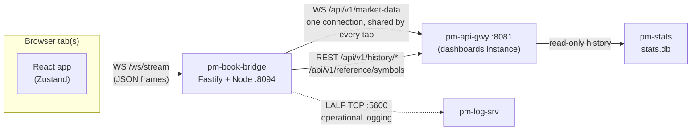

# Order Book Viewer (`pm-book`)

!!! note "Learning objectives"
    After reading this page you will understand:

    - What the order book viewer shows, and how it relates to `pm-viewer`
    - Which services must be running, and why the read-only API key is
      mandatory for this application
    - How to start it with the whole stack, on its own in a container, on a
      separate display server, or as a local development server
    - How the Compose setup wires it to the exchange
    - What every field of the statistics header, the two ladders and the trade
      tape means
    - How to read the connection states and the footer without mistaking a
      quiet market for a broken one
    - Which environment variables an operator is most likely to adjust


## Overview

`pm-book` is the web companion to the [`pm-viewer`](170-processes.md#pm-viewer-order-book-viewer)
terminal application: one symbol's full order book — every price level on both
sides — the session statistics above it and a trade tape beside it, in a
browser. Its source code lives in `web-apps/book-gui/`.

Like [TapeDeck](290-trader-info-terminal.md) it is read-only. There is no order
entry, no login screen and no write path from the browser into the exchange.
Use it on a classroom projector while students trade against a book, beside
the [Trading GUI](300-trader-gui.md) to watch the effect of your own orders, or
on any machine where `pm-viewer` would need a terminal and direct access to the
engine's message bus.

Everything `pm-viewer` shows is here, field for field: last price and change,
bid, ask and spread, open/high/low/close, previous close, range, volume, and the
basis the change is measured against. What the browser adds is symbol switching
by URL, a dark and a light theme, font scaling, and a layout that fills
whatever screen it is shown on.


### What starts when you run it

Running the viewer starts one server process, `pm-book-bridge`, which also
serves the web page. The bridge reads **all** of its data from the
[API Gateway](260-api-gateway.md) — it never talks to the engine, to
`pm-md-gwy` or to `pm-stats` directly:

| From `pm-api-gwy` | Used for |
|---|---|
| `WS /api/v1/market-data` | The live book and every new trade of the symbols being watched |
| `GET /api/v1/reference/symbols` | The symbol list in the picker, and each symbol's number of price decimals |
| `GET /api/v1/history/session` | The exchange session timezone and today's trading date |
| `GET /api/v1/history/trades` | The session's earlier trades, so the statistics and tape are complete when you open a book |
| `GET /api/v1/history/daily` | The previous close |

The bridge holds exactly one upstream WebSocket however many browser tabs are
open, and subscribes to a symbol only while at least one tab is watching it.
The read-only API key stays in the bridge; the browser never sees it.




## Prerequisites

| Requirement | Notes |
|---|---|
| **`pm-api-gwy`** ([API Gateway](260-api-gateway.md)), `dashboards` instance, with a **read-only API key** | Required for everything. The key is the credential with `gateway_id: null`; it is issued on the `dashboards` instance (port 8081 in the bundled configurations), not on `desk` (8080). Without the key the viewer has nothing to show. |
| **`pm-stats`** ([Statistics](140-statistics-and-reporting.md)) | Strongly recommended. The history endpoints read its database. Without it the viewer still works, but the statistics cover only the trades seen since the book was opened, and the header says so. |
| **`pm-log-srv`** ([Centralized Log Server](280-log-srv.md)) — optional | Used only for the bridge's own operational logs. If it is unavailable the bridge logs to stdout, or to a local failover file. |
| **Podman ≥ 4** or **Docker ≥ 24** with a Compose plugin | Needed for the container run paths. |
| **Node.js ≥ 20** and **npm ≥ 10** | Needed only for local development without a container. |

!!! warning "The key is mandatory — unlike TapeDeck"
    TapeDeck gets its live prices from `pm-md-gwy` and uses the API key only
    for history, so it still ticks without one. The order book viewer reads
    its live data through `pm-api-gwy` too. Without a key the bridge starts,
    logs `PM_BOOK_API_KEY is unset — no market data or history can be read`,
    and never connects upstream. The app's own `make up` therefore refuses to
    start without one.


## Running the application

There are four ways to run the viewer. They differ only in how the bridge
learns two things: **where `pm-api-gwy` is**, and **the read-only API key**.

| Way | Where the exchange runs | Who supplies the address and the key |
|---|---|---|
| [The whole stack](#the-whole-stack-recommended) | In the same Compose project | Found automatically |
| [This app alone, in a container](#this-app-alone-in-a-container) | On this host, in a VM, or elsewhere | You, or `make up` from the deployed configuration |
| [On a separate display server](#running-on-a-separate-display-server) | On another machine | You |
| [Local development](#local-development) | Anywhere reachable | You, or `make dev-env` |


### The whole stack (recommended)

This path requires nothing of you: it starts the exchange and every web
application together, reads the read-only key out of the deployed
configuration, and points the viewer at the backend by service name.

**A released install** (the one-line installer):

```bash
curl -fsSL https://raw.githubusercontent.com/johan162/EduMatcher/main/deployment/curl/install.sh | bash
cd ~/.edumatcher
./edumatcher.sh start
```

**From a source checkout:**

```bash
cd deployment/docker
make up-all
```

Then open **<http://localhost:8094>**. It opens on the first listed symbol; press
`s` to pick another. `./edumatcher.sh urls` (released install) or the summary
`make up-all` prints lists every application's address.

!!! note "An install from before the order book viewer existed"
    `./edumatcher.sh update` pulls new images but does not re-download
    `compose.yaml`, so an older install does not gain the viewer from an
    update. Re-run the one-line installer: it keeps your `.env` and `data/`
    and fetches the current `compose.yaml` and `edumatcher.sh`. See
    [Installation](005-installation.md).

Useful commands on this path:

| Task | Released install | Source checkout (`deployment/docker`) |
|---|---|---|
| Follow the viewer's log | `./edumatcher.sh logs book-gui` | `podman logs -f edumatcher-book-gui` |
| Rebuild only this image and restart | — | `make up-all BUILD=1 GUI=book-gui` |
| Move it to another host port | `BOOK_GUI_PORT=8100` in `.env` | `BOOK_GUI_PORT=8100` in `.env` |
| Stop everything | `./edumatcher.sh stop` | `make down-all` |

Use `docker` in place of `podman` if that is your runtime. After changing the
engine configuration (`make up-all CONFIG=<other>`), start the stack again
rather than only the viewer: every bundled configuration carries a different
read-only key, and the key is resolved at start time.


### This app alone, in a container

Use this when the exchange is already running outside Compose — as processes on
your host, in a VM, or on another machine. From `web-apps/book-gui/`:

```bash
export EDUMATCHER_DATA_DIR=~/.local/share/edumatcher
make up
```

Then open **<http://localhost:8094>**. `make logs` follows the bridge log,
`make ps` shows the container, and `make down` stops it.

**How `make up` finds the key.** An explicit `PM_BOOK_API_KEY` always wins:

```bash
make up PM_BOOK_API_KEY=key-readonly-...
```

Otherwise `make up` reads it from the deployed configuration
`$EDUMATCHER_DATA_DIR/ref_data/engine_config.json` — the same file the
exchange's own processes read — picking the first credential with
`gateway_id: null` (the `dashboards` instance is preferred when several carry
one). It prints which instance and port the key came from, and warns when
`API_GATEWAY_URL` points at a different port. With neither a key nor a deployed
configuration to read it from, `make up` stops with an explanation rather than
starting a viewer that can show nothing.

**The address.** The app's `docker-compose.yml` defaults `API_GATEWAY_URL` and
`LOG_SRV_HOST` to `host.docker.internal`, which is right on Docker Desktop. On
bare Linux Docker, `make up` adds `docker-compose.linux.yml`, which maps that
name to the host. On Podman, point both at `host.containers.internal`:

```bash
export API_GATEWAY_URL=http://host.containers.internal:8081
export LOG_SRV_HOST=host.containers.internal
make up
```

!!! warning "The key is valid on 8081, not 8080"
    `API_GATEWAY_URL` must point at the `dashboards` instance, where the
    read-only credential is issued. `desk` on 8080 rejects it; the bridge then
    logs `refused PM_BOOK_API_KEY` and the top bar stays on `RECONNECTING`.
    Keep the port when you change the host.

If port 8094 is taken, move the *host* side of it. Pick something outside
8090–8094, which the other applications use:

```bash
BOOK_GUI_PORT=8100 make up
```

#### All the web applications against one backend

`web-apps/Makefile` starts the log console, TapeDeck, the Trading GUI and the
order book viewer together, each from its own directory, and points them all at
one backend address:

```bash
cd web-apps
make up VM_BACKEND_IP=192.168.64.10 PM_BOOK_API_KEY=key-readonly-...
make up-book VM_BACKEND_IP=192.168.64.10 PM_BOOK_API_KEY=key-readonly-...   # only this one
make logs-book
make down-book
```

`VM_BACKEND_IP` sets `API_GATEWAY_URL=http://<ip>:8081` and `LOG_SRV_HOST=<ip>`
for the viewer. Pass the key explicitly when the backend runs in a VM: the
automatic look-up reads the deployed configuration from *this* host's data
directory.

#### Alternative: direct Compose commands

```bash
PM_BOOK_API_KEY='key-readonly-...' docker compose up --build -d
docker compose logs -f book-gui
docker compose down
```

With Podman, use `podman-compose` for the same commands.


### Running on a separate display server

The viewer does not have to run on the machine that runs the exchange. A common
classroom set-up has the exchange on one server and the viewer on the machine
driving the projector. Nothing changes on the exchange side: the bridge is just
another read-only `pm-api-gwy` client.

| Exchange-side item | What to check |
|---|---|
| `pm-api-gwy` | It binds `0.0.0.0` by default. The display server must reach the `dashboards` instance — HTTP and WebSocket on TCP `8081` in the bundled configurations. |
| API key | The read-only credential (`gateway_id: null`) of that instance. It never leaves the display server's bridge. |
| `pm-stats` | Must be running on the exchange server for complete statistics; the viewer reaches it only through `pm-api-gwy`. |
| `pm-log-srv` | Optional. Make TCP `5600` reachable and set `LOG_SRV_HOST`, or set `LOG_SRV_ENABLED=false`. |
| Firewall | Open `8081` (and optionally `5600`) from the display server to the exchange. Browsers need only the display server's `8094`. |

On the display server, use a prepared image rather than building from source:

```bash
# Option A: the released image
podman pull ghcr.io/johan162/edumatcher-book-gui:<VERSION>

# Option B: an image tarball made with `make cdist` in web-apps/book-gui
podman load --input edumatcher-book-gui-<VERSION>.tar.xz
```

Then run it, pointing it at the exchange server:

```bash
mkdir -p logs

podman run -d --name book-gui \
  --restart unless-stopped \
  -p 8094:8094 \
  -v "$PWD/logs:/app/logs" \
  -e API_GATEWAY_URL=http://exchange.example.org:8081 \
  -e PM_BOOK_API_KEY='key-readonly-...' \
  -e LOG_SRV_ENABLED=false \
  ghcr.io/johan162/edumatcher-book-gui:<VERSION>
```

Use the image name you pulled or loaded. For centralized logging, replace
`LOG_SRV_ENABLED=false` with `-e LOG_SRV_HOST=exchange.example.org`. Then open
**http://display-server.example.org:8094**.

If the page loads but the top bar shows `RECONNECTING`, the display server
serves the UI but cannot reach or authenticate with `pm-api-gwy`; the bridge
log says which.


### Local development

From `web-apps/book-gui/`:

```bash
make install                                   # once, and after a dependency change
PM_BOOK_API_KEY=key-readonly-... make dev      # Vite on :8194, bridge on :5194
```

Open **<http://localhost:8194>**. The Vite dev server proxies `/api` and `/ws` to the
bridge on `127.0.0.1:5194`, so the browser sees a single origin.

The bridge's connect targets default to `127.0.0.1`, which is exactly where the
container stack publishes its ports, so `make up-all` in `deployment/docker`
plus `make dev` here needs nothing beyond the key. `make dev-env` prints it,
together with the matching `API_GATEWAY_URL`:

```bash
eval "$(make -s -C ../../deployment/docker dev-env GUI=book-gui)"
make dev
```

The containerised viewer keeps running on 8094 at the same time, which makes it
a convenient reference for your change on 8194. The full inner loop is
described in [The Development Loop](../developer/08-dev-workflow.md).

### Make targets

| Target | Description |
|---|---|
| `make install` | Install the npm workspace from the lockfile |
| `make dev` / `dev-web` / `dev-bridge` | Bridge and Vite together / only Vite / only the bridge |
| `make build` / `build-debug` | Production build / frontend with sourcemaps |
| `make typecheck` / `lint` / `format` | Type-check every workspace / the same / Prettier |
| `make test` | The Vitest suite: the bridge end to end against a fake `pm-api-gwy`, the web app against a fake bridge, and unit tests |
| `make cbuild` | Build the container image without starting it |
| `make up` / `down` / `restart` / `logs` / `ps` | Container lifecycle |
| `make cdist` | Build the image and export it as `dist/edumatcher-book-gui-<VERSION>.tar.xz` |
| `make clean` / `distclean` | Remove build output / also `node_modules` and the lockfile |

The version in the top bar comes from `apps/web/src/version.json`, which
`scripts/mkbld.sh` writes for every web application at release time.


## The Compose setup

The viewer appears in three compose files. The service is the same in each; what
differs is how it finds the exchange.

| File | Used by | `API_GATEWAY_URL` default | Image |
|---|---|---|---|
| `deployment/curl/compose.yaml` | The one-line installer, `edumatcher.sh` | `http://edumatcher:8081` | `ghcr.io/johan162/edumatcher-book-gui:${EM_VERSION}` |
| `deployment/docker/compose.guis.yaml` | `make up-all` | `http://edumatcher:8081` | `edumatcher-book-gui:latest`, built from `web-apps/book-gui` |
| `web-apps/book-gui/docker-compose.yml` | The app's own `make up` | `http://host.docker.internal:8081` | `edumatcher-book-gui:latest`, built locally |

In the two whole-stack files the viewer shares one Compose network with the
exchange container, which answers to the hostname `edumatcher`. The
source-checkout service looks like this:

```yaml
book-gui:
  image: edumatcher-book-gui:latest
  container_name: ${CONTAINER_NAME:-edumatcher}-book-gui
  depends_on:
    - edumatcher
  restart: unless-stopped
  ports:
    - "${BIND_ADDR:-127.0.0.1}:${BOOK_GUI_PORT:-8094}:8094"
  environment:
    HOST: "0.0.0.0"
    PORT: "8094"
    CORS_ORIGIN: "${CORS_ORIGIN:-*}"
    MAX_WS_CLIENTS: "${MAX_WS_CLIENTS:-200}"
    API_GATEWAY_URL: "${API_GATEWAY_URL:-http://edumatcher:8081}"
    PM_BOOK_API_KEY: "${PM_BOOK_API_KEY:-}"
    LOG_SRV_ENABLED: "${LOG_SRV_ENABLED:-true}"
    LOG_SRV_HOST: "edumatcher"
    LOG_SRV_PORT: "5600"
    LOG_FAILOVER_DIR: "/app/logs"
  volumes:
    - book-gui-logs:/app/logs
```

Points worth knowing:

- **`PM_BOOK_API_KEY` is empty in the file on purpose.** `make up-all` and
  `./edumatcher.sh start` start the exchange first, read the key from the
  deployed configuration inside it, and export it for this service — the same
  key TapeDeck gets as `PM_TERMINAL_API_KEY`. See
  [The read-only API key](005-installation.md#the-read-only-api-key).
- **`BIND_ADDR`** (default `127.0.0.1`) decides who can open the page. Set it
  to `0.0.0.0` in `.env` to serve the viewer to other machines, and consider
  restricting `CORS_ORIGIN` when you do.
- **There is no data volume.** The bridge keeps each watched symbol's session in
  memory and rebuilds it from `pm-api-gwy` on restart. The one volume,
  `book-gui-logs` (`./logs` for the app's own compose file), holds the log
  failover file, written only when `pm-log-srv` becomes unreachable.
- **A health check** (in the app's own compose file) polls
  `http://127.0.0.1:8094/api/bridge/status` every 30 seconds.
- **Image build arguments** `HTTP_PROXY`, `HTTPS_PROXY`, `NO_PROXY` and
  `NPM_STRICT_SSL` are passed through for builds behind a corporate proxy, as
  for the other web applications.


## A tour of the interface

📷 **Figure 1 — The order book viewer.** Capture a liquid symbol mid-session in
dark theme, with several levels on both sides, a populated trade tape, and the
footer visible. Suggested file: `images/book-gui/fig-01-book.png`.

The page has four parts, top to bottom: the top bar, the statistics header, the
three panels **BIDS**, **ASKS** and **TRADES**, and the footer.

### Top bar

- **`EduMatcher pm-book v<version>`** on the left, as in every EduMatcher web
  application.
- **The symbol picker** — the current symbol with a drop-down arrow. Click it,
  or press **`s`** or **`F1`** anywhere on the page.
- **Theme** (sun/moon): switches between the dark and the light palette.
- **Settings** (cog): font size, maximum levels and zebra rows — see
  [Settings](#settings).
- **Connection indicator**: `LIVE`, `RECONNECTING` or `OFFLINE`, followed by the
  `host:port` of the `pm-api-gwy` instance the bridge reads — see
  [Connection states](#connection-states).

### Choosing a symbol

The picker works as `pm-viewer`'s does. Typing narrows the list **by prefix**
(`A` offers the symbols that start with A, not every symbol containing one),
**↑**/**↓** move the selection, **Enter** switches and **Esc** closes. A click
works too.

Every book has its own URL: `/book/<SYMBOL>`, for example
`http://localhost:8094/book/AAPL`. Bookmark it, or open several tabs on different
symbols — each tab watches one symbol. The bare address `/` opens the book you
viewed last in this browser, or the first listed symbol. A URL naming a symbol
that is not listed shows `<SYMBOL> is not a listed symbol` instead of an empty
book.

### The statistics header

📷 **Figure 2 — The statistics header.** Capture both rows with a positive change
and the `prev-close` basis. Suggested file: `images/book-gui/fig-02-header.png`.

Two rows, the same fields as `pm-viewer`'s header. The **reference** price that
change and colour are measured against is the previous close when one is known,
otherwise the session open.

| Field | Meaning |
|---|---|
| **Last** | Price of the last trade, with ▲ / ▼ / ▬ against the reference, green when up and red when down |
| **Chg** | Last minus the reference, and the same as a percentage |
| **Size** | Quantity of the last trade |
| **Bid/Ask** | Best bid (green) × best ask (red) |
| **Sprd** | Ask minus bid |
| *clock* | Current time in the exchange session timezone (hover for the zone name) |
| **O / H / L / C** | The session's open, high, low and latest close, from every trade of the day |
| **Prev** | The previous trading day's close, `n/a` when there is none |
| **Range** | High minus low |
| **Vol** | Total quantity traded this session |
| **Basis** | What the change is measured against: `prev-close`, `session-open`, or `live since HH:MM` |
| *date* | Today's date in the exchange session timezone |

A thin line under the header shows the session's direction: green when the
close is above the reference, red when below, grey when level.

!!! note "What `live since HH:MM` means"
    When the bridge cannot read the session's history — `pm-stats` is not
    running, or its database does not exist yet — it still shows the book and
    records every trade it sees from then on. The statistics are then correct
    only for that period, and the Basis field says so in amber, with the time
    the recording started. This is the web equivalent of running `pm-viewer`
    without a stats database. Times are then in UTC, because the session
    timezone also comes from `pm-stats`.

All times, the clock and the date use the exchange session timezone recorded by
`pm-stats`, not the timezone of the browser — so a viewer in another country
reads the same times as the exchange.

### BIDS and ASKS

The two ladders mirror each other about the centre, as in `pm-viewer`, with the
best price at the top of each:

| BIDS columns | | ASKS columns |
|---|---|---|
| **Ord** — number of resting orders at the level | | **Depth** — bar, growing outward to the right |
| **Qty** — total quantity at the level | | **Price** |
| **Price** | | **Qty** |
| **Depth** — bar, growing outward to the left | | **Ord** |

The depth bars are scaled to the largest quantity among the levels **on
screen**, so the largest visible level fills its bar. Prices use each symbol's
own number of decimals from the reference data.

The ladders show the levels the gateway publishes (aggregated per price — never
individual orders).

### TRADES

The trade tape, newest first: **Time** (session timezone, to the millisecond),
**Price** and **Qty**. Each print is coloured by its tick — green when its price
is above the print before it, red when below, grey when equal.

When you open a book the tape already holds the session's earlier trades, read
from history. The bridge keeps the newest `TAPE_MAX` (500) prints per symbol;
the statistics count every trade of the session regardless.

### How many levels are shown

The three panels share one row count. By default (**Max levels: Fit**) it is
whatever fits the window, like `pm-viewer` in a terminal — make the window taller
to see deeper into the book. The Settings popover can cap it at 10, 20 or 50
levels, like `pm-viewer --depth`.

The panels never reflow into a single column: in a narrow window the page
scrolls sideways instead.

### Footer

- **`upstream ACTIVE`** — the state of the bridge's connection to `pm-api-gwy`;
  shown in amber whenever it is anything else.
- **`bids 12/12 · asks 9/15 levels shown`** — how many of each side's levels are
  on screen, out of how many there are. A truncated ladder is never silent:
  `9/15` means six more ask levels exist below the fold.
- **`last book 2s ago`** — the age of the most recent book update. It keeps
  counting in a quiet market; that is normal, and the book shown is still
  current. `no book yet` means the symbol has not had a book since it was
  opened.
- **`s / F1 change symbol`** — the keyboard hint.

### Settings

The cog in the top bar opens the settings. All of them are stored per browser.

| Setting | Choices | Default | Notes |
|---|---|---|---|
| **Font size** | XS, S, M, L, XL, XXL | XS | Scales the whole page. Works in Chrome and Safari only |
| **Max levels** | Fit, 10, 20, 50 | Fit | `pm-viewer`'s `--depth` |
| **Zebra rows** | on / off | off | `pm-viewer`'s `--zebra-lines` |
| **Theme** (top-bar button) | dark / light | dark | Light is meant for bright rooms and projectors |


## Connection states

Two connections are involved, and the viewer reports both:

| Indicator | Meaning | What you see |
|---|---|---|
| **`LIVE`** (green) | The browser is connected to the bridge, and the bridge to `pm-api-gwy` | The live book |
| **`RECONNECTING`** (amber) | The browser is connected to the bridge, but the bridge's upstream connection is down or not yet authenticated | The last values received, with `upstream RECONNECTING` or `upstream DOWN` in the footer |
| **`OFFLINE`** (red) | The browser has lost its connection to the bridge | A *Disconnected from pm-book-bridge* banner; values are **hidden** rather than shown stale. The page reconnects by itself |

The bridge reconnects upstream by itself, backing off from half a second to 15
seconds between attempts. When a working connection drops, the footer shows
`upstream RECONNECTING` for the first 30 seconds (`UPSTREAM_DOWN_AFTER_SEC`) and
`upstream DOWN` after that. Before the first successful connection, and at once
when `pm-api-gwy` rejects the key, it shows `upstream DOWN`.

**No trade is lost across a short outage.** On reconnect the bridge asks
`pm-api-gwy` to resume each symbol's trades from the last one it saw. If the
gap is longer than the gateway retains (`market_data_cache_sec`, 60 seconds by
default — see [API Gateway](260-api-gateway.md)), the bridge rebuilds that
symbol's statistics and tape from history instead, and logs that it did.


## Configuration reference

The bridge is configured entirely with environment variables. Most
installations set only `PM_BOOK_API_KEY` and, outside the whole stack,
`API_GATEWAY_URL` and `LOG_SRV_HOST`.

### Compose and host side

| Variable | Default | Purpose |
|---|---|---|
| `BOOK_GUI_PORT` | `8094` | Host port the container is published on. Set it in `.env` for the whole stack, or on the command line for the app's own `make up` |
| `BIND_ADDR` | `127.0.0.1` | Whole stack only: host address the port is published on; `0.0.0.0` exposes it to the network |
| `EDUMATCHER_DATA_DIR` | — | App's own `make up` only: where to find `ref_data/engine_config.json` to read the key from |

### Bridge

| Variable | Default (dev / container) | Purpose |
|---|---|---|
| `HOST` / `PORT` | `127.0.0.1` / `5194` — container `0.0.0.0` / `8094` | Bridge bind address and port |
| `CORS_ORIGIN` | `*` | CORS allow-list; restrict it to your site's origin when the viewer is exposed beyond localhost |
| `STATIC_DIR` | — (container: the built frontend) | Serve the built web UI from this directory |
| `MAX_WS_CLIENTS` | `200` | Maximum browser tabs; further connections are refused |
| `WS_HEARTBEAT_SEC` | `5` | How often every tab receives the bridge's status |
| `WS_PING_SEC` / `WS_PING_MAX_MISSED` | `10` / `2` | Ping to each tab, and missed replies before a dead tab is dropped |
| `WS_MAX_BUFFERED_BYTES` | `5000000` | A tab whose outgoing buffer exceeds this (a stalled browser) is disconnected |
| `TAPE_MAX` | `500` | Trades kept per watched symbol for the TRADES panel |

### Upstream (`pm-api-gwy`)

| Variable | Default (dev / container) | Purpose |
|---|---|---|
| `API_GATEWAY_URL` | `http://127.0.0.1:8081` — app compose `http://host.docker.internal:8081`, whole stack `http://edumatcher:8081` | Base URL of the `dashboards` instance. The market-data WebSocket URL is derived from it (`ws://…/api/v1/market-data`, or `wss://` for `https://`) |
| `PM_BOOK_API_KEY` | — (**required**) | The read-only (`gateway_id: null`) key of that instance. Never sent to the browser |
| `UPSTREAM_PING_SEC` / `UPSTREAM_PING_MAX_MISSED` | `10` / `3` | Liveness check of the upstream WebSocket |
| `UPSTREAM_DOWN_AFTER_SEC` | `30` | How long `RECONNECTING` lasts before it is reported as `DOWN` |

### Logging

| Variable | Default (dev / container) | Purpose |
|---|---|---|
| `LOG_SRV_ENABLED` | `true` | `false` logs to stdout and skips even the startup probe |
| `LOG_SRV_HOST` / `LOG_SRV_PORT` | `127.0.0.1` / `5600` — app compose `host.docker.internal`, whole stack `edumatcher` | `pm-log-srv` |
| `LOG_SRV_CLIENT_ID` | `pm-book-bridge` | Name the bridge registers with at the log server |
| `LOG_SRV_INSTANCE` | — | Optional suffix that tells several viewers' logs apart |
| `LOG_CONNECT_TIMEOUT_SEC` | `0.5` | Startup probe and each reconnect attempt |
| `LOG_FAILOVER_TIMEOUT_SEC` | `30` | How long a lost log-server connection may last before the bridge switches, for good, to a local file |
| `LOG_QUEUE_MAXSIZE` | `2000` | Log records buffered while reconnecting |
| `LOG_FAILOVER_DIR` | `<data dir>/logs` — container `/app/logs` | Where that local file goes |

If `pm-log-srv` is not reachable at startup the bridge logs to stdout, which
`make logs` or `podman logs` show.


## Checking the bridge

`GET /api/bridge/status` on the viewer's port describes the bridge's state as
JSON:

```bash
curl -s localhost:8094/api/bridge/status
```

| Field | Meaning |
|---|---|
| `upstream` / `since` | `ACTIVE`, `RECONNECTING` or `DOWN`, and since when |
| `source` | The `host:port` of `pm-api-gwy` |
| `symbols` | How many symbols the reference data lists |
| `watched` | Each watched symbol, with the number of tabs watching it |
| `wsClients` | Connected browser tabs |
| `logging` | Where the bridge's logs are going right now |


## Troubleshooting

| Symptom | Likely cause | What to check |
|---|---|---|
| `make up` stops with *EDUMATCHER_DATA_DIR is not set* or *No read-only credential* | There is no key to start with | Set `EDUMATCHER_DATA_DIR`, or pass `PM_BOOK_API_KEY=...` |
| Top bar stays `RECONNECTING`, footer `upstream DOWN`; the log says `PM_BOOK_API_KEY is unset` | The container was started without a key | Start it through `make up`, `make up-all` or `./edumatcher.sh start`, or pass the key |
| Top bar stays `RECONNECTING`; the log says `refused PM_BOOK_API_KEY` | The key is wrong for that instance — typically `API_GATEWAY_URL` points at `desk` (8080), or the key belongs to a different engine configuration | Point `API_GATEWAY_URL` at port 8081; after switching configuration, restart the whole stack so the key is read again |
| Top bar stays `RECONNECTING`, nothing in the log about the key | The bridge cannot reach `pm-api-gwy` | Check `API_GATEWAY_URL`; on Podman use `host.containers.internal`; check that `pm-api-gwy` is running |
| Red *Disconnected from pm-book-bridge* banner | The browser cannot reach the bridge | Is the container running (`make ps`, `podman ps`)? Is the port right? |
| Basis says `live since HH:MM`; times are in UTC | History is unavailable — `pm-stats` is not running or has not created its database | Start `pm-stats`, then reload the page: a symbol's history is read again when it is next opened with no other tab watching it |
| *Waiting for the symbol list…* never goes away | The bridge could not read `/api/v1/reference/symbols` | See the rows about `RECONNECTING` above |
| `<SYMBOL> is not a listed symbol` | The URL names a symbol the exchange does not list | Press `s` and choose one |
| A ladder ends before the book does | More levels exist than fit the window, or **Max levels** caps them | Read the footer (`asks 9/15`); make the window taller or set Max levels to Fit |
| An older curl install has no viewer on 8094 | `update` does not fetch a new `compose.yaml` | Re-run the one-line installer |


## Related documentation

- [`pm-viewer` — Order Book Viewer](170-processes.md#pm-viewer-order-book-viewer) — the terminal application this one mirrors
- [API Gateway](260-api-gateway.md) — the market-data WebSocket and history endpoints the bridge reads
- [Statistics and Reporting](140-statistics-and-reporting.md) — `pm-stats`, which records the history
- [Installation](005-installation.md) — the container stack, `.env` and the read-only API key
- [Trader Information Terminal](290-trader-info-terminal.md) — the sibling read-only display, with which it shares its structure and deployment conventions
- [Centralized Log Server](280-log-srv.md) — the bridge's optional logging destination
- `docs-design/EduMatcher-Book-GUI.md` — the design document (repository checkout only)
- `web-apps/book-gui/README.md` — the implementation's own reference (repository checkout only)
