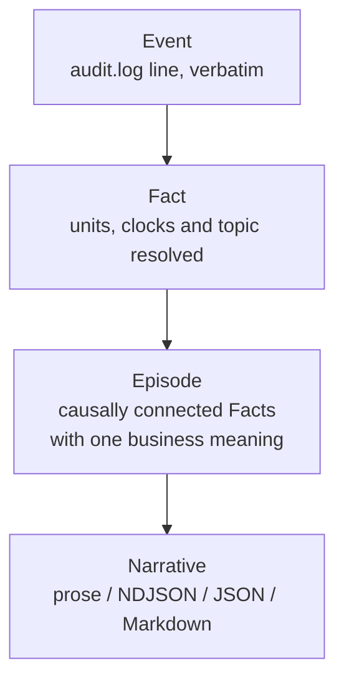

# Audit Replay (pm-audit-replay)

!!! note "Learning objectives"
    After reading this page you will understand:

    - Why a second tool reads the same audit trail `pm-audit-cli` already reads
    - The four-layer model — Event, Fact, Episode, Narrative — and what each adds
    - Why this is a tool for debugging **the exchange**, not for trading on it
    - Every subcommand and option, and which combinations are refused
    - The thirty-seven anomaly codes and what each one proves
    - The four output formats and why the text and NDJSON always agree
    - A cookbook of investigations, from "what happened to this order" to
      "is this build's trail clean?"


## Background

The [audit trail](190-audit.md) records every message the exchange published,
exactly as it was broadcast. That is the right thing to record and the wrong
thing to read.

A single limit order that partially fills produces an `order.new`, an
`order.ack`, an `order.fill` for each side, a `trade.executed`, a
`drop_copy.fill`, and a `book` snapshot — six to eight lines, interleaved with
everything else the exchange was doing in the same millisecond. Answering
*"why did this order not fill?"* from that file means reconstructing, by hand
and by eye, facts the log contains but does not state:

- Which `order.fill` belongs to which `trade.executed`
- Whether the ack really preceded the fill, or only appears to because of the
  order the recorder happened to write them in
- Whether `price_ticks: 7569` is 75.69 or 7.569 for this symbol
- Which of the six cancellations a kill switch produced were the ones it
  claimed

`pm-audit-cli` answers *"which lines match this filter?"*. `pm-audit-replay`
answers *"what happened, in order, and why?"* — it reconstructs the causal
structure the trail records and then narrates it in English.

Both read the same files, read-only, and neither needs the other. The
recorder does not have to be running.

!!! warning "This is a tool for debugging the exchange, not for trading on it"
    Every other chapter in this guide describes something a participant, an
    operator, or a student uses to run or observe a market. This one does not.
    `pm-audit-replay` exists to answer questions about **the exchange's own
    correctness** — did the matching engine publish what it should have, in
    the order it should have, with the quantities it should have.

    Its audience is whoever is changing the engine, the gateways, or the
    message specification, and its findings are stated in terms of internal
    invariants rather than in terms of anything a trader can act on. A trader
    who wants to know what happened to an order should use the
    [Trading GUI](300-trader-gui.md), the [drop copy](200-drop-copy.md) feed,
    or `pm-audit-cli`.

    That is why this chapter sits at the end of the user guide, after the
    examples and beside [Known Limitations & Bugs](890-known-limitations-bugs.md),
    rather than next to the audit-trail chapter it builds on.


## How it works

### Four layers

Each layer adds exactly one thing, which is what keeps the narrator from
becoming a pile of per-topic special cases.



| Layer | Adds | Example |
|---|---|---|
| **Event** | Nothing — the line as `pm-audit` wrote it | `[..] [order.fill.TRADER01] {...}` |
| **Fact** | Resolved units, clocks and wildcard topics. Removes ambiguity; adds no information | `price_ticks: 7569` → `75.69`, `order.fill.TRADER01` → kind `order.fill`, actor `TRADER01` |
| **Episode** | Grouping. One order, one trade, one quote, one command — with its outcome and its derived facts | "order `4f2c9a…`, PARTIAL, 150 of 200 filled, VWAP 74.80" |
| **Narrative** | Wording. A pure function of the episode graph | "TRADER01 submitted buy limit 200 AAPL @ 75.69" |

### Where the causality comes from

Every message the exchange publishes carries a **causal envelope**: a `msg_id`
(a ULID), the `causation_id` of the message that caused it, and a
`correlation_id` naming the whole chain. So in the common case the tool does
not infer causality — it *reads* it.

Where an envelope is absent (an archived log from before the envelope landed)
the resolver falls back through four tiers, and every link it produces carries
a confidence:

| Confidence | Meaning |
|---|---|
| `RECORDED` | The publisher stated it, via `causation_id` |
| `CERTAIN` | A structural identity in the payload, e.g. `trade_ids` naming the trade |
| `STRONG` | An unambiguous match on ids and time |
| `HEURISTIC` | A plausible match. Always hedged in the prose — never stated as fact |

`pm-audit-replay stats` reports the mix. On a log captured since the envelope
landed, `RECORDED` and `CERTAIN` should account for essentially all of it.

### Ordering

The trail is written in *receipt* order, which is not always *causal* order —
a PUB/SUB recorder can write an ack before the submission it acknowledges. The
tool therefore re-sorts every fact into a canonical key of `(mint
millisecond, receipt time, read order)` before anything reads it.

A **reorder window** bounds that sort so a log larger than memory can still be
read: `--reorder-window` defaults to 2000 facts or 5 seconds, whichever comes
first. A fact arriving after its window has closed is emitted where it landed
and tagged `LATE_ARRIVAL` rather than silently misplaced.

!!! tip "Why not sort by the ULID alone"
    A ULID orders by its monotonic counter within one millisecond — but only
    within one *process*. An ack and its fill minted by the engine sort
    correctly against each other and arbitrarily against the `order.new`
    minted by the submitting gateway in the same millisecond. Sorting on the
    ULID's random tail put acks before the orders they acknowledged and
    produced roughly two thousand spurious findings on the first real trail.

### The episode index

Reconstruction is a single streaming pass with bounded memory, so
`--no-index` works on any log. The optional SQLite index at
`data/audit_replay.db` materialises the episode model so that `story` can
find one order without re-reading the log.

| Property | Behaviour |
|---|---|
| Built | Automatically, when a command needs it and it is absent or stale |
| Stale when | The source logs changed, the reconstruction rules changed, or the detection settings changed |
| Incremental | **No.** A rebuild is the whole story — see AR-3.4 in the design |
| Size | Roughly 4.4× the log (it keeps every payload, which is what makes it a complete substitute) |
| Build rate | ~5 500 events/s; 87 s for a 205 MiB log on the dev VM |
| Discarded | When its schema version is not current — no migration, by design |

`story` requires the index. Everything else works with or without it, and is
required to produce identical output either way.


## Subcommands

| Subcommand | What it does | Needs the index |
|---|---|---|
| `stream` | Narrates a window chronologically. The default view | No |
| `story` | Narrates one entity and everything causally connected to it | **Yes** |
| `digest` | One paragraph per episode, most significant first | No |
| `episodes` | The index as a table, one row per episode | No |
| `anomalies` | Every finding, worst first, each with the `story` command to run next | No |
| `stats` | Link confidence, envelope coverage and anomaly counts over the window | No |
| `index` | Builds or refreshes the episode index; `--stats` reports what it holds | — |

### `story` selectors

Exactly one is required.

| Selector | Follows |
|---|---|
| `--order ORDER_ID` | An order (an unambiguous prefix will do) |
| `--trade TRADE_ID` | A trade and both its legs |
| `--quote QUOTE_ID` | A quote and its derived leg orders |
| `--oco OCO_ID` | An OCO pair |
| `--combo COMBO_ID` | A combo and its legs |
| `--command COMMAND_ID` | A risk or admin command and its effects |
| `--client-tag TAG` | Whatever carries the client's own tag |
| `--chain ULID` | A whole causal chain — the complete descent, no `--depth` needed |
| `--msg ULID` | One message and what it caused |

`--depth N` (default 2) bounds link-following for every selector except
`--chain`. `--strict-causality` follows only `RECORDED` links, so the result
contains nothing the tool inferred.

### Per-subcommand options

| Subcommand | Option | Meaning |
|---|---|---|
| `index` | `--stats` | Report what the index holds once it is current |
| `digest` | `--top N` | Show only the N most significant episodes |
| `digest` | `--significance {anomalies,notional,qty,duration}` | What makes an episode significant (default: anomalies, then notional) |
| `episodes` | `--outcome OUTCOME` | Restrict to outcomes, e.g. `REJECTED` (repeatable) |
| `anomalies` | `--severity {error,warn,info}` | Report findings at this severity or worse (default: `info`) |


## Global options

Every option below is accepted by every subcommand.

### Source

| Option | Default | Meaning |
|---|---|---|
| `--log-file PATH` | `<DATA_DIR>/audit.log` | The trail to read. Rotated `.1`, `.2.gz` … siblings are discovered and read automatically |
| `--db PATH` | `<DATA_DIR>/audit_replay.db` | The episode index |
| `--no-index` | off | Stream without building or reading an index |
| `--rebuild` | off | Rebuild the index before rendering |

!!! warning "Rotated segments are part of the trail"
    `--log-file audit.log` reads `audit.log.1` and `audit.log.2` as well.
    That is right for a real trail and surprising for a scratch one: a
    previous run's rotated segments left in the same directory are replayed
    alongside the current one. If two runs replay the same seeded dataset,
    every order appears twice and the tool correctly reports each as
    `ACK_DUPLICATE`.

### Window

| Option | Meaning |
|---|---|
| `--from ISO_TS` | Start of window (ISO-8601, or `YYYY-MM-DD`) |
| `--to ISO_TS` | End of window |
| `--date YYYY-MM-DD` | Shorthand for a whole UTC day |
| `--last DURATION` | Relative window: `15m`, `2h`, `1d` |

`--date` cannot be combined with `--from`/`--to`, and `--last` cannot be
combined with either.

### Filters

| Option | Meaning |
|---|---|
| `--symbol SYMBOL` | Restrict to one or more symbols (repeatable) |
| `--gateway GW_ID` | Restrict to one or more gateways (repeatable) |
| `--kind KIND` | Restrict to episode kinds (repeatable) |

Episode kinds are `order`, `trade`, `quote`, `oco`, `combo`, `command`,
`market_phase`, `session`, `gateway`, `index`, `recovery` and `orphan`.

Outcomes are `FILLED`, `PARTIAL`, `CANCELLED`, `REJECTED`, `EXPIRED`,
`ACCEPTED`, `DENIED`, `OPEN` and `UNKNOWN`.

### Output

| Option | Default | Meaning |
|---|---|---|
| `-q` | — | Detail level 0: episode outcomes only |
| `-v`, `-vv`, `-vvv` | level 1 | Raise the detail level |
| `--format {text,ndjson,json,markdown,csv}` | `text` | Output shape |
| `--show-source` | off | Append `audit.log:LINE` to every narrated line |
| `--show-units` | off | Append unit provenance to every price |
| `--explain` | off | Show link evidence and confidence inline |
| `--id-len N\|full` | `6` | Order-id abbreviation. Lengthened automatically if two ids would collide |
| `--actor-style {id,descriptive}` | `id` | `TRADER01` or `the Nordic Equities desk` |
| `--tz TZ` | `UTC` | Timezone for rendered timestamps |
| `--reorder-window SPEC` | `2000/5s` | Reorder buffer, as a fact count or a duration |
| `--no-color` | off | Disable ANSI colour |

### Detection

| Option | Default | Meaning |
|---|---|---|
| `--strict` | off | Also report findings that are expected at a window edge (`ARRIVAL_SEQ_GAP`) |
| `--clock-skew-warn SECONDS` | `0.1` | Engine/receipt clock difference worth reporting |

Detection settings are part of what makes an index stale: changing them
forces a rebuild, so a stored index can never disagree with the flags that
produced it.

### Exit codes

| Code | Meaning |
|---|---|
| `0` | Success |
| `1` | Nothing to narrate, or no audit log at the given path |
| `2` | Argument error, including a format a subcommand cannot produce |


## What it can catch

Reconstruction gives consistency checks almost for free, and these are the
real prize: a bug that is hard to find in the raw log is usually a bug that
breaks one of these invariants.

Each finding names the episode it belongs to and prints the `story` command
that shows it, because the next thing anyone does with a finding is go and
look at it.

Three severities: **error** is a broken invariant, **warn** is something a
reader should look at, **info** is something expected at a window edge.

### Lifecycle

| Code | Severity | Condition |
|---|---|---|
| `ACK_MISSING` | warn | An `order.new` with no `order.ack` inside the window |
| `ACK_DUPLICATE` | error | One order accepted twice |
| `FILL_BEFORE_ACK` | warn | A fill whose canonical key precedes its ack — a genuine inversion, not a reorder artefact |
| `FILL_AFTER_TERMINAL` | error | A fill for an order the trail has already ended |
| `ILLEGAL_STATUS_TRANSITION` | error | A status change outside `NEW → PARTIAL → FILLED \| CANCELLED \| REJECTED \| EXPIRED` |
| `TERMINAL_MISSING` | info | An order still open when the window ends |
| `CANCEL_UNSOLICITED` | warn | `order.cancelled` with neither a request in its episode nor a `cancel_reason` naming a cause |
| `CANCEL_UNMATCHED` | warn | `order.cancel` with nothing coming back |

### Quantity and price conservation

| Code | Severity | Condition |
|---|---|---|
| `QTY_MISMATCH` | error | `Σ fill_qty ≠ quantity − remaining_qty` — the tool's own tally against the engine's |
| `REMAINING_NOT_MONOTONIC` | error | `remaining_qty` rose across fills of one order |
| `TRADE_LEG_MISSING` | error | A `trade.executed` with fewer than two `order.fill` legs naming it |
| `FILL_WITHOUT_TRADE` | error | An `order.fill` whose `trade_ids` name no `trade.executed` in the window |
| `LEG_QTY_DISAGREE` | error | The two legs of one trade report different `fill_qty` |
| `LEG_PRICE_DISAGREE` | error | The two legs report different `fill_price` |
| `PRICE_THROUGH_LIMIT` | error | A fill outside its order's limit — a buy above it or a sell below it |
| `PRICE_OUTSIDE_CORRIDOR` | warn | A print outside the circuit-breaker corridor in force for its symbol |

!!! tip "Why both tallies are kept"
    `QTY_MISMATCH` compares what the fills add up to against what the engine
    said was left. Keeping both numbers is the point: it is what caught the
    engine publishing `fill_qty` as a running total rather than as the
    quantity matched in that event, which every consumer summing the field
    was over-counting.

### Ordering, clocks and the envelope

| Code | Severity | Condition |
|---|---|---|
| `SEQ_GAP` | error | A gap in a topic's dense per-topic `seq` — a **proof** that messages are missing from the trail |
| `TRADE_COUNTER_GAP` | error | A gap in the per-run trade counter. Redundant with `SEQ_GAP`, kept because it localises the loss to the trade stream |
| `MSG_ID_DUPLICATE` | error | Two messages with the same `msg_id`. Should be impossible; would mean a ULID generator shared unsafely across threads |
| `CHAIN_BROKEN` | error | An effect whose `correlation_id` differs from its cause's, which breaks `story --chain` |
| `CAUSE_NOT_FOUND` | warn | A `causation_id` naming a `msg_id` nowhere in the window. Usually the window starts too late |
| `CLOCK_SKEW` | warn | The engine's own clock and `pm-audit`'s receipt clock differ by more than `--clock-skew-warn` |
| `LATE_ARRIVAL` | info | A fact arrived after its reorder window had closed |
| `CLIENT_CLOCK_ABSURD` | info | An `order.new` client clock more than an hour from receipt. Harmless — priority is `arrival_seq` — but worth knowing |
| `ARRIVAL_SEQ_GAP` | info | A gap in `arrival_seq` within one run. Expected whenever the window omits another gateway's orders, so `--strict` only |
| `RUN_SEQ_CHANGE` | info | An engine restart observed mid-window. Not a fault, but nothing may be compared across it |
| `ENVELOPE_MISSING` | info | An engine-published message with no envelope. Expected on archived lines; on a current log, a publisher is bypassing `CausalPublisher` |

### Command reconciliation

| Code | Severity | Condition |
|---|---|---|
| `EFFECT_COUNT_MISMATCH` | warn | An ack's list of affected entities disagrees with what was observed. The finding names which are missing |
| `COMMAND_UNACKED` | warn | A risk or admin command with no ack carrying its `command_id` |
| `ACK_WITHOUT_COMMAND` | warn | An ack whose `command_id` matches no request in the window |
| `RESUME_WITHOUT_HALT` | warn | A resume for a symbol with no halt on record |
| `HALT_UNRESUMED` | info | A halt with no resume by the time its episode retired |

### Coverage — the tool admitting what it does not know

| Code | Severity | Condition |
|---|---|---|
| `PARSE_FAILURE` | error | A line the audit format does not match, detected by the hole it leaves |
| `UNKNOWN_TOPIC` | warn | A topic with no entry in the generated registry: the message spec has grown and the tool has not |
| `TICK_SCALE_UNKNOWN` | warn | A tick-scaled price with no `tick_decimals` for its symbol anywhere in the window. The price is reported **in ticks and labelled as ticks** rather than guessed |
| `UNKNOWN_ENUM` | warn | An enum value with no lexicon entry. Printed verbatim in backticks rather than guessed at or dropped |
| `ORPHAN_EVENT` | info | A fact the resolver could not attach to anything |

!!! tip "A clean run is a claim, not a hope"
    `tools/verify_audit_trail.sh` records a full `verify_matching.sh` run with
    `pm-audit` and then runs `anomalies --severity warn` over the trail it
    left. Any finding at warn or above fails the script. It is the
    end-to-end check that the engine's published account of itself is
    internally consistent, and it is expected to come out green.


## Examples

### What happened to this order?

```bash
pm-audit-replay story --order 4f2c9a
```

```text
09:31:02.120  TRADER01 submitted buy limit 200 AAPL @ 75.69 (good for the day) — order 4f2c9a…
09:31:02.121  Engine accepted 4f2c9a…
09:31:02.122  AAPL traded 150 @ 74.80 — TRADER01's buy 4f2c9a… took from TRADER02's sell 9ab1c4… (trade 000042…)
09:31:02.122  4f2c9a… took 150 @ 74.80 from TRADER02's sell 9ab1c4…
09:31:02.122  9ab1c4… was lifted for 150 @ 74.80 by TRADER01's buy 4f2c9a…
```

An unambiguous prefix is enough. Both sides of every trade are narrated, not
just the side that was asked about.

### …and show me the evidence

```bash
pm-audit-replay story --order 4f2c9a -v --explain
```

```text
09:31:02.120  TRADER01 submitted buy limit 200 AAPL @ 75.69 (good for the day) — order 4f2c9a… — a direct submission
              ⤷ the publisher recorded that nothing caused this
09:31:02.121  Engine accepted 4f2c9a…
              ⤷ caused 01M205PK330000000000000001 [recorded: causation_id]
09:31:02.122  AAPL traded 150 @ 74.80 — … — notional 11,220.00
              ⤷ caused 01M205PK330000000000000001 [recorded: causation_id]
              ⤷ matched with 01M205PK330000000000000001 [certain: buy_order_id]
```

Every link states its confidence and the evidence behind it. *"the publisher
recorded that nothing caused this"* is a declared origin — different from
*"no cause was found"*, and never rendered as one.

### What did the exchange do in the last fifteen minutes?

```bash
pm-audit-replay stream --last 15m
pm-audit-replay stream --last 15m -q          # outcomes only
pm-audit-replay stream --date 2026-09-08 --symbol AAPL --symbol MSFT
```

### Is anything wrong?

```bash
pm-audit-replay anomalies --severity warn
pm-audit-replay anomalies --severity error --date 2026-09-08
```

```text
WARN   09:44:10.019  EFFECT_COUNT_MISMATCH  command 8812
       risk.kill_switch_ack for command 8812 names 3 cancelled order(s); 1 were not observed: aaaa0001…
       -> pm-audit-replay story --command 8812 -v --explain

1 finding(s) (1 warn) across 7 episode(s).
```

### Did a kill switch do what it said?

```bash
pm-audit-replay story --command 8812 -v --explain
```

### Follow one whole causal chain

```bash
pm-audit-replay story --chain 01ARZ3NDEKTSV4RRFFQ69G5FAV
```

`--chain` is the complete descent and needs no `--depth` tuning. Every
message in the chain carries the same `correlation_id`, so this is one
indexed read rather than a graph walk.

### What is worth looking at first?

```bash
pm-audit-replay digest --top 20
pm-audit-replay digest --significance notional --top 10
```

### Every rejected order as a table

```bash
pm-audit-replay episodes --outcome REJECTED
pm-audit-replay episodes --outcome REJECTED --format csv > rejects.csv
```

### Is the trail itself trustworthy?

```bash
pm-audit-replay stats --date 2026-09-08
```

```text
Envelope coverage
  with envelope         10  100.0%  ########################
  declared origin        6
  orphan                 0

Link confidence
  RECORDED         4   57.1%  ##############..........
  CERTAIN          3   42.9%  ##########..............
  STRONG           0    0.0%  ........................
  HEURISTIC        0    0.0%  ........................
```

Low envelope coverage on a current log means a publisher is bypassing
`CausalPublisher`. A high `HEURISTIC` share means the narrative is more
inference than record, and should be read as such.

### Feed it to something else

```bash
pm-audit-replay stream --last 1h --format ndjson | jq -c 'select(.type=="beat")'
pm-audit-replay anomalies --severity error --format json > findings.json
pm-audit-replay story --order 4f2c9a --format markdown >> incident.md
```

### Read a log with no index at all

```bash
pm-audit-replay stream --no-index --log-file /tmp/captured.log
```

Useful for a one-off trail that would only leave a database behind. `story`
is the one subcommand this cannot serve.


## Outputs

### Detail levels

Detail is one axis, and raising it only ever reveals — nothing shown at a
lower level disappears at a higher one.

| Level | Flag | Adds |
|---|---|---|
| 0 | `-q` | Episode outcomes only — one line per episode |
| 1 | *(default)* | Business lifecycle: submissions, acks, fills, trades, cancels, halts, session changes, commands |
| 2 | `-v` | Counterparty detail, derived facts (VWAP, price improvement, timings), rejection reasoning, link confidence |
| 3 | `-vv` | Market-data context (`book`, `depth`, `index.update`), drop copy, clock skew, `arrival_seq` |
| 4 | `-vvv` | Every unclassified event, and the raw payload beneath each narrated line |

Level 0 is a different shape rather than a quieter level 1:

```text
09:31:02.120  order 4f2c9a1e6d… is still working at the end of the window — 150 of 200 filled
09:31:02.122  trade 000042-000… — AAPL 150 @ 74.80
09:31:02.122  order 9ab1c47f2e… filled — 150 of 150 filled
```

### `--format text`

The default. One sentence per narrated fact, with any annotations the
switches added indented beneath it.

### `--format ndjson`

One JSON object per line — the reconstructed model, not the raw log. Four
object types:

| Type | One per | Carries |
|---|---|---|
| `episode` | narrated episode | kind, anchor, actor, symbol, correlation id, outcome, summary, derived facts |
| `beat` | narrated fact | the envelope, the `text` of the prose line, `source` file and line, the whole payload in `fields`, resolved display prices in `prices` |
| `link` | edge between two episodes | `from`, `to`, relation, confidence, evidence |
| `anomaly` | finding | code, severity, episode, detail, `source` |

One beat, pretty-printed (it is one line on the wire, and `fields` is shown
abridged):

```json
{
  "type": "beat",
  "episode": 4,
  "seq": 2,
  "sort_key": "1788859862122\u001f2026-09-08T09:31:02.122000+00:00\u001f000000000006",
  "msg_id": "01M205PK3A0000000000000019",
  "causation_id": "01M205PK330000000000000001",
  "correlation_id": "01M205PK330000000000000001",
  "topic_seq": 1,
  "receipt_ts": "2026-09-08T09:31:02.122+00:00",
  "topic": "order.fill.TRADER01",
  "kind": "order.fill",
  "role": "progress",
  "late": false,
  "text": "4f2c9a1e6d… took 150 @ 74.80 from TRADER02's sell 9ab1c47f2e…",
  "source": {"file": "audit.log", "line": 7},
  "fields": {"order_id": "4f2c9a1e6d8b47c3a5f09e21b7d4c6a8", "fill_qty": 150,
             "fill_price": 74.8, "remaining_qty": 50, "liquidity_flag": "TAKER",
             "trade_ids": ["000042-000001873"]},
  "prices": {"fill_price": 74.8, "price": 75.69}
}
```

`fields` is the recorded payload **whole**, so a consumer needing something
the prose does not mention never has to go back to the log for it. `prices`
is what the unit resolution worked out, in display money, handed over rather
than left to be redone.

**Every prose sentence is the `text` of exactly one beat.** The text renderer
*is* the `text` field, so the two formats cannot drift — and a test compares
them in order, one for one, at every detail level. A consumer can build on
the beats and a human can read `stream`, and they are looking at one account
of the session.

Episodes are announced before their first beat, so the stream can be
processed without buffering. Links come last, deduplicated and sorted: an
edge is a fact about two episodes, not about the beat that happened to state
it.

### `--format json`

The same objects in one document, with a header — the window, the source
files, the rules version and per-type counts — for a consumer that prefers
one read to a stream.

### `--format markdown`

The prose under a heading per episode, for pasting into a bug report or an
incident write-up. Grouped rather than chronological, because a write-up is
read episode by episode.

### `--format csv`

`episodes` only, for export.

### Which formats each subcommand produces

| Subcommand | text | ndjson | json | markdown | csv |
|---|---|---|---|---|---|
| `stream` | ✅ | ✅ | ✅ | ✅ | — |
| `story` | ✅ | ✅ | ✅ | ✅ | — |
| `anomalies` | ✅ | ✅ | ✅ | — | — |
| `digest` | ✅ | — | — | — | — |
| `episodes` | ✅ | — | — | — | ✅ |
| `stats` | ✅ | — | — | — | — |

A combination outside that table is **refused** with exit 2 rather than
quietly ignored. A tool that accepts `--format json` and prints a table has
told the caller something untrue, and a script finds out only by failing to
parse it.


## Tips & tricks

!!! tip "Most misses are a window that starts too late"
    `no order matching '4f2c9a' in this window` almost always means the
    submission is behind `--from`, not that the order is absent. The tool
    says so and suggests widening the window. The same cause explains most
    `CAUSE_NOT_FOUND` findings: the effect is in the window and its cause is
    not.

**Start with `anomalies`, not with `stream`.** Every finding prints the
`story` command that shows it, so the fastest route from "something is wrong"
to the evidence is `anomalies --severity warn`, then paste the suggestion.

**`--show-source` turns prose back into lines.** Every narrated sentence gets
`audit.log:118423` appended, so anything the narrator says can be checked
against the bytes it came from. Pair it with `--id-len full` when you intend
to grep for the ids.

**`--explain` is how you tell reading from guessing.** It prints each link's
confidence and evidence. If a narrative surprises you, check whether the tool
recorded the link or inferred it before believing either.

**`--strict-causality` when you need certainty.** `story
--strict-causality` follows only `RECORDED` links, so the result contains
nothing the tool worked out for itself.

**`-vvv` is the round-trip check.** At level 4 nothing is withheld: every
event in the window is narrated. If you suspect the tool is hiding something,
that is the level that proves otherwise.

**Prices are never guessed.** A tick-scaled price whose `tick_decimals` the
window does not contain is printed *in ticks and labelled as ticks*, with a
`TICK_SCALE_UNKNOWN` finding — never silently rescaled. `--show-units` shows
where each scale came from.

**`--tz` is for reading, never for filtering.** `--from`/`--to`/`--date` are
UTC, which is what the trail records.

!!! warning "Give a scratch trail its own directory"
    `--log-file` pulls in rotated siblings, and the index lands next to the
    log by default. For a one-off capture, point `EDUMATCHER_DATA_DIR` at a
    scratch directory, or pass `--log-file` and `--db` explicitly, so the
    findings are about the run you meant.

**An index is a cache, and is allowed to be deleted.** It is derived entirely
from the log. If anything looks stale, `--rebuild` or `rm` it; there is no
state in it that the trail does not have.

**`pm-help pm-audit-replay`** lists the command alongside every other
EduMatcher tool.


## See Also

- [Audit Trail](190-audit.md) — `pm-audit` and `pm-audit-cli`, the trail this tool reads
- [Message Reference](270-message-reference.md) — the wire contract every finding is stated against
- [Processes](170-processes.md) — where `pm-audit` sits among the runtime processes
- [Persistence](180-persistence.md) — which files each process writes, and where
- [Known Limitations & Bugs](890-known-limitations-bugs.md) — what is known not to work yet
