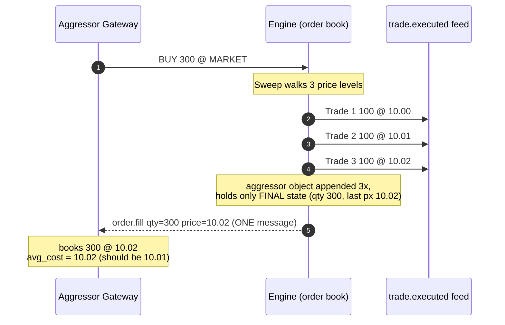

# Known Limitations & Bugs

!!! note "Learning objectives"
    After reading this page you will understand:

    - A known inaccuracy in how the engine reports fills for orders that
      sweep **multiple price levels** in a single execution
    - Why the **quantity** of every position is always correct, but the
      **average cost** (and therefore unrealized P&L) of an aggressing order
      can be slightly wrong
    - A worked numeric example that makes the size of the error concrete
    - The proposed fix, and an honest assessment of its impact on the
      existing test suite

    **Prerequisite**: Read [P&L & Clearing](130-pnl-clearing.md) first — this page
    builds directly on the VWAP average-cost formula described there.

## What this page covers

EduMatcher is a teaching exchange, and part of teaching is being honest about
the places where the implementation takes a shortcut. This chapter documents a
**known reporting limitation** in the matching engine: when a single
aggressive order trades against several resting orders at *different* prices in
one shot (a "sweep"), the engine collapses those fills into **one** fill
notification that carries the **last** trade price rather than the true
volume-weighted average.

The bug is subtle: nobody loses or gains shares, the official trade record is
correct, and a single-price fill is always reported perfectly. The error only
appears in the **average cost** that a trader's gateway derives from the fill
notification, and only when that trader's order walked through more than one
price level.

!!! bug "Status: known limitation, not yet fixed"
    This behaviour is **intentional for now** because fixing it correctly
    touches the hottest code path in the engine and a large number of tests
    encode the current behaviour. The end of this chapter describes the
    proposed fix and why it is being deferred.

---

## Background: how fills are reported

When an order arrives, the engine's `_handle_new_order` handler hands it to the
order book's `process()` method. Matching happens inside `_apply_fill`, which is
called **once per resting order that the aggressor trades against**. Each call:

1. Creates a `Trade` record at that resting order's price.
2. Decrements the aggressor's `remaining_qty`.
3. Appends the **aggressor `Order` object** to the `events` list.

The crucial detail is in step 3: the engine appends the **same Python object**
each time. After the sweep finishes, that one object only holds its **final**
state — the total quantity filled and a `remaining_qty` of zero. The
per-level breakdown (how much filled at each price) is no longer visible on the
aggressor object; it survives only in the separate list of `Trade` records.

After matching, the publish loop walks `events` and emits an `order.fill`
message for each fill. Because the aggressor object was appended N times (once
per price level it consumed), a guard called `_published_fill_ids` ensures the
engine sends **exactly one** `order.fill` message for the aggressor instead of
N duplicates. That single message uses:

```python
_fill_px = from_ticks(book.last_trade_price, order.symbol)
```

`book.last_trade_price` is the price of the **last** fill in the sweep — the
deepest, least favourable level the order reached. That single price is then
reported for the **entire** filled quantity.

!!! note "The resting (passive) side is always correct"
    Every resting order the aggressor hits is a **distinct** object and is
    filled exactly once at its own price, so each passive participant receives
    a correct per-price `order.fill`. The inaccuracy is limited to the **one**
    aggregated message sent to the **aggressing** order's gateway.

---

## How the gateway turns a fill into a position

A trading gateway tracks positions with VWAP average-cost accounting (see
[P&L & Clearing](130-pnl-clearing.md)). On every `order.fill` it calls
`_update_position(symbol, side, fill_qty, fill_price)`, which folds the fill
into the running average:

$$
\text{avg\_cost}_\text{new} = \frac{\text{avg\_cost}_\text{old} \times \lvert q_\text{old} \rvert + \text{fill\_price} \times \text{fill\_qty}}{\lvert q_\text{new} \rvert}
$$

The gateway trusts `fill_price` as the price for the whole `fill_qty`. When the
engine sends one aggregated fill at the last sweep price, the gateway books the
**entire** quantity at that single, least-favourable price — overstating cost
basis for a buy sweep and understating proceeds for a sell sweep.

---

## Worked example

Suppose the ask side of the book holds three resting sell orders:

| Resting order | Price   | Quantity |
|---------------|---------|----------|
| A             | \$10.00 | 100      |
| B             | \$10.01 | 100      |
| C             | \$10.02 | 100      |

A trader sends an aggressive **BUY 300 (MARKET)** order. It sweeps all three
levels and three trades print:

| Trade | Price   | Quantity |
|-------|---------|----------|
| 1     | \$10.00 | 100      |
| 2     | \$10.01 | 100      |
| 3     | \$10.02 | 100      |

The **true** volume-weighted average price the buyer paid is:

$$
\text{VWAP} = \frac{100 \times 10.00 + 100 \times 10.01 + 100 \times 10.02}{300}
       = \frac{3003}{300} = \mathbf{10.01}
$$

But the engine emits a **single** aggregated fill to the buyer's gateway:

```text
order.fill  →  fill_qty = 300   fill_price = 10.02   remaining_qty = 0
```

The gateway therefore books **300 shares at \$10.02**, giving:

- Reported average cost: **\$10.02** per share
- True average cost:     **\$10.01** per share
- Error:                 **\$0.01** per share → **\$3.00** overstated cost basis

The three sellers (A, B, C) each receive a **correct** fill at their own price,
and the `trade.executed` market-data / drop-copy feed carries all three trades
at the right prices. Only the **buyer's** average cost is wrong.

### Direction of the error

The last level reached in a sweep is always the **worst** price for the
aggressor, so the error has a predictable sign:

| Aggressor side | Last level is… | Effect on the aggressor's books                        |
|----------------|----------------|--------------------------------------------------------|
| **BUY**        | Highest price  | Cost basis **overstated** → unrealized P&L understated |
| **SELL**       | Lowest price   | Proceeds **understated** → unrealized P&L understated  |

In both directions the aggressor's reported entry is **pessimistic**: it looks
like a slightly worse trade than it actually was. The magnitude equals the
spread between the sweep's average price and its last price, multiplied by the
swept quantity.

!!! note "Position quantity is never wrong"
    The dedup guard guarantees the quantity is counted **once**, so the net
    position size is always exact. Only the **price** attached to that quantity
    is approximate.

---

## Visualising the collapse

The diagram below contrasts the **three real trades** generated inside the book
with the **single aggregated fill** delivered to the aggressor's gateway.



The same idea as plain ASCII:

```text
   Book side (asks)                Trades printed            Fill sent to buyer
   ----------------                --------------            ------------------
   100 @ 10.00  ◄── swept ──►  Trade 1: 100 @ 10.00
   100 @ 10.01  ◄── swept ──►  Trade 2: 100 @ 10.01   ===►  order.fill
   100 @ 10.02  ◄── swept ──►  Trade 3: 100 @ 10.02            qty   = 300
                                                               price = 10.02  ✗
                               true VWAP = 10.01               (last level only)

   Correct quantity (300) ✓     Correct trade prints ✓     Wrong average price ✗
```

---

## Why it has not been fixed yet

The aggregation lives in the engine's single hottest code path
(`_handle_new_order`), which is heavily optimised for throughput. Two factors
make a fix non-trivial:

1. **The per-level breakdown is discarded.** The aggressor `Order` object only
   carries its final state by the time the publish loop runs. The correct
   per-price data exists in the separate `Trade` list, so any fix must
   reconstruct the aggressor's fills from trades rather than from the order
   object.

2. **Triggered stops share the call.** A single `process()` call can also
   trigger resting stop orders, which generate **their own** sub-trades with a
   **different** order as the aggressor. A correct fix must attribute each
   trade to the right order before emitting per-level fills.

---

## Proposed fix

The goal is to report the aggressor's fills **per price level** instead of a
single aggregate, so the gateway reconstructs the exact VWAP naturally.

### Option A — derive aggressor fills from the trade list (preferred)

Replace the single aggregated `order.fill` with **one message per fill**, built
from the `Trade` records produced in that `process()` call:

- For each `Trade`, identify the aggressor side and emit an `order.fill`
  carrying **that trade's** `price` and `quantity`, plus the running
  `remaining_qty` after the fill.
- Attribute each trade to the order that aggressed it (the incoming order, or a
  triggered stop order) using the trade's buy/sell order IDs.
- Remove the `_published_fill_ids` dedup guard — it is no longer needed because
  each emitted message is already unique per fill.

With Option A applied to the worked example, the buyer receives three messages
(`100 @ 10.00`, `100 @ 10.01`, `100 @ 10.02`); the gateway's existing VWAP
accumulator then computes an average cost of exactly **\$10.01**.

### Option B — record per-fill snapshots during matching

Have `_apply_fill` append a small immutable record
`(order_ref, fill_qty, fill_price, remaining_after)` to a dedicated list rather
than re-appending the mutable `Order`. The publish loop iterates those records.
This keeps trade attribution local to `_apply_fill` (which already knows the
aggressor) at the cost of one extra small allocation per fill — a measurable hit
on the hot path.

Option A is preferred because it adds **no** per-fill allocation on the matching
path and reuses data the engine already produces.

!!! warning "Performance sensitivity"
    Both options send **more** `order.fill` messages for sweeping orders (N
    instead of 1). For deep sweeps this increases publish volume and message
    bandwidth. Benchmark against the throughput targets in
    [Running the Engine](040-running-the-engine.md) before adopting a fix.

---

## Impact on the test suite

The project ships with roughly **1,200** tests. The fix changes an
externally-observable contract — the **number, quantity, and price** of
`order.fill` messages for any order that sweeps multiple levels — so a subset of
tests will need to be updated. The categories are:

| Test category | Effect of the fix | Action required |
|---------------|-------------------|-----------------|
| **Single-level fills** (one resting order, exact-size fills) | None — still one fill, same price | No change |
| **Multi-level sweep fills** (market / marketable-limit through several levels) | Now N messages with per-level prices instead of 1 aggregate | Update assertions to expect per-level fills |
| **Fill-count assertions** (tests that count `order.fill` messages) | Sweeping aggressors emit more messages | Update expected counts |
| **Position / P&L assertions** (gateway average-cost, unrealized P&L) | Average cost now equals true VWAP | Tighten expected values to the correct VWAP |
| **Validation, risk-control, auction, config, persistence** tests | Independent of fill aggregation | No change |

The **majority** of tests — single-level matching, order validation, collars,
circuit breakers, auctions, sessions, configuration, and persistence — are
unaffected. The work is concentrated in the multi-level-sweep, fill-count, and
position/P&L tests, plus **new** tests asserting that a sweep produces the
correct per-level fills and a correct VWAP average cost.

!!! note "Exact count is empirical"
    The precise number of affected tests can only be determined by applying the
    change and running the full suite — some existing tests deliberately encode
    the current last-price behaviour and will fail loudly, which is the
    intended signal to update them. Treat the table above as a map of *where* to
    look, not a guarantee of *how many*.
