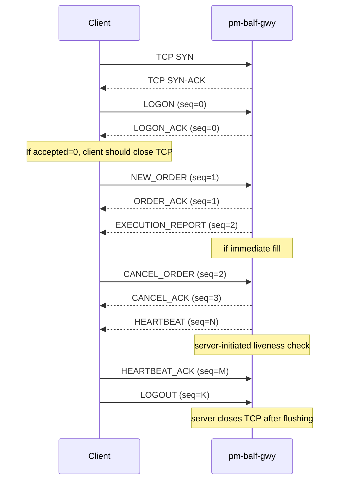

# Appendix: BALF Protocol Reference

> **Status: Normative.** This appendix is the single source of truth for the BALF
> `1.0.0` wire contract as implemented by `pm-balf-gwy` (`balf_gwy/`). For an
> operational, tutorial-style guide see [BALF TCP Gateway](25-balf-gateway.md); for
> the gateway's configuration block see
> [Engine Config Specification §6.2](99-app-config-spec.md#62-balf_gateway-pm-balf-gwy).
> The key words MUST, MUST NOT, SHOULD, and MAY are used per RFC 2119.


## What BALF is

**BALF** stands for **Binary ALF**.

It is EduMatcher's fixed-width binary protocol for programmatic order entry
through `pm-balf-gwy`. BALF carries the same trading intent as ALF, but it
replaces human-readable text parsing with deterministic byte offsets.

BALF is designed for low-latency clients that want:

- fixed frame sizes
- no delimiter scanning
- no decimal string parsing on the hot path
- explicit message sequencing
- simple exact-byte reads

BALF is intentionally smaller and more predictable than text protocols:

```text
NEW_ORDER is always 60 bytes on the wire
CANCEL_ORDER is always 24 bytes on the wire
EXECUTION_REPORT is always 64 bytes on the wire
```

This appendix is the **normative reference** for BALF `1.0.0`. If another tool,
bot, or GUI wants to speak BALF, this document is the correct source to follow.


## Scope and boundaries

BALF is the **binary client protocol accepted by `pm-balf-gwy`**. The gateway
translates BALF frames into the engine's internal ZeroMQ + JSON messages.

That distinction matters:

- **BALF** is what a client writes on the wire
- **engine messages** are what the gateway publishes internally

This appendix describes the BALF side, not the internal message bus.

### What BALF does not change

- The matching engine itself.
- The set of supported instruments and single-leg order types.
- Gateway authentication rules. The same allowlist model is used.

### Non-goals for BALF `1.0.0`

- Encryption at the protocol layer. Use TLS or a tunnel if needed.
- RDMA or kernel-bypass transport. BALF is defined over standard TCP.
- Combo and OCO wire encodings. These are future work, not part of `1.0.0`.
- Sequence recovery / resend request design. Gap detection exists, but recovery
  negotiation is not defined in `1.0.0`.
- Multicast market data. A future BDMD protocol may cover that separately.


## Core wire rules

### Connection model

BALF uses one TCP connection per gateway session.

A session starts with `LOGON` and ends with `LOGOUT` or a disconnect. Each TCP
connection is logically bound to one gateway ID.

### Byte order

All multi-byte numeric fields are **little-endian**.

This is an explicit BALF `1.0.0` convention and intentionally differs from
big-endian exchange protocols such as ITCH / OUCH.

### Frame structure

Every BALF frame has:

- an 8-byte header
- a fixed-size body determined only by `msg_type`

There is no length prefix. The receiver reads the header first, looks up the
expected frame size from the message type, then reads exactly the remaining
bytes.

If `msg_type` is unknown, the receiver treats the frame as a protocol error and
should close the connection.

### Flag semantics

In BALF `1.0.0`, all header flag bits must be zero.

The `RETRANSMIT` bit is reserved for a future recovery extension and is not
active in `1.0.0`.

Reserved fields in all message bodies must also be zero when sent and should be
validated as zero when received.

### Identifier rules

- `gateway_id` is a 16-byte ASCII field, zero-padded on the right.
- `client_order_id` is a client-assigned `u64`.
- `order_id` is a gateway-assigned session-scoped `u64`.
- `0` is reserved and must not be used as a valid accepted `order_id`.


## Frame format

### Header layout

Every BALF message begins with the same 8-byte header:

```text
 0               1               2               3
 0 1 2 3 4 5 6 7 0 1 2 3 4 5 6 7 0 1 2 3 4 5 6 7 0 1 2 3 4 5 6 7
┌───────────────┬───────────────┬───────────────┬───────────────┐
│     magic     │    version    │   msg_type    │     flags     │
│    (0xBA)     │     (0x01)    │               │               │
├───────────────┴───────────────┴───────────────┴───────────────┤
│                           seq_no                              │
│                         (u32 LE)                              │
└───────────────────────────────────────────────────────────────┘
```

### Header fields

| Offset | Field | Type | Description |
|--------|-------|------|-------------|
| 0 | `magic` | `u8` | Always `0xBA`. Reject frames where this byte is wrong. |
| 1 | `version` | `u8` | Protocol version. BALF `1.0.0` uses `1`. |
| 2 | `msg_type` | `u8` | Message type code, see the tables below. |
| 3 | `flags` | `u8` | Must be `0` in BALF `1.0.0`. Reserved for future use. |
| 4-7 | `seq_no` | `u32 LE` | Monotonically increasing sequence number. |

### Sequence numbering rules

- Sequence numbers are tracked separately in each direction.
- `LOGON` and `LOGON_ACK` carry `seq_no = 0`.
- The first non-LOGON message in each direction starts at `1`.
- Sequence numbers increment by `1` per message.
- Sequence numbers wrap to `1` at `UINT32_MAX`.
- A gap in the inbound sequence number is a protocol error.
- BALF `1.0.0` does not define a resend request or replay recovery protocol.


## Scalar encodings

### Price encoding

All prices and price-like offsets are encoded as signed 64-bit integers scaled
by `10^8`.

```text
wire_value = round(display_price * 100_000_000)
```

Examples:

| Display value | Wire value |
|---------------|------------|
| `150.25` | `15_025_000_000` |
| `0.0001` | `10_000` |
| `-2.00` | `-200_000_000` |

A value of `0` means the field is not used for that order type.

### Symbol encoding

Symbols are stored as 8 bytes, zero-padded ASCII, left-aligned.

Example:

```text
"AAPL" -> 41 50 50 4C 00 00 00 00
```

Symbols longer than 8 ASCII characters are not supported in BALF `1.0.0`.

### Gateway ID encoding

Gateway IDs are stored as 16 bytes, zero-padded ASCII, left-aligned.

Example:

```text
"TRADER01" -> 54 52 41 44 45 52 30 31 00 00 00 00 00 00 00 00
```

### Order ID encoding

BALF uses a compact `u64` session-scoped order ID on the wire.

- the gateway allocates the ID when the order is accepted
- the gateway maps that ID to the engine's internal UUID or matching-engine key
- the `order_id` is echoed in cancel, amend, and execution messages
- `0` is reserved and invalid


## Message reference

### Summary table

| Code | Name | Direction | Body bytes | Total frame bytes |
|------|------|-----------|------------|-------------------|
| `0x01` | `LOGON` | Client -> Server | 24 | 32 |
| `0x02` | `LOGON_ACK` | Server -> Client | 84 | 92 |
| `0x10` | `NEW_ORDER` | Client -> Server | 52 | 60 |
| `0x11` | `ORDER_ACK` | Server -> Client | 52 | 60 |
| `0x12` | `CANCEL_ORDER` | Client -> Server | 16 | 24 |
| `0x13` | `CANCEL_ACK` | Server -> Client | 24 | 32 |
| `0x14` | `AMEND_ORDER` | Client -> Server | 36 | 44 |
| `0x15` | `AMEND_ACK` | Server -> Client | 40 | 48 |
| `0x20` | `EXECUTION_REPORT` | Server -> Client | 56 | 64 |
| `0x30` | `HEARTBEAT` | Bidirectional | 8 | 16 |
| `0x31` | `HEARTBEAT_ACK` | Bidirectional | 8 | 16 |
| `0x40` | `LOGOUT` | Client -> Server | 0 | 8 |

All sizes include the 8-byte header.

### `LOGON` (0x01) - Client -> Server

Sent immediately after the TCP connection is established, before any orders.
`seq_no` is `0`.

**Body (24 bytes):**

```text
Offset  0  |  gateway_id     |  u8[16]  |  Zero-padded ASCII gateway ID
Offset 16  |  proto_version   |  u8      |  Must be 1
Offset 17  |  _reserved       |  u8[7]   |  Must be zero
```

### `LOGON_ACK` (0x02) - Server -> Client

Sent in response to `LOGON`. `seq_no` is `0` on this message; normal sequencing
begins from `1` on subsequent messages.

**Body (84 bytes):**

```text
Offset  0  |  gateway_id     |  u8[16]  |  Echoed gateway ID
Offset 16  |  accepted       |  u8      |  1 = accepted, 0 = rejected
Offset 17  |  reject_code    |  u8      |  See reject codes below; 0 if accepted
Offset 18  |  msg_len        |  u8      |  Byte length of the meaningful part of msg[]
Offset 19  |  _pad           |  u8      |  Reserved, zero
Offset 20  |  msg            |  u8[64]  |  Human-readable description or rejection reason
```

**Reject codes:**

| Code | Meaning |
|------|---------|
| `0x00` | Accepted |
| `0x01` | Gateway ID not configured in engine |
| `0x02` | Gateway ID already connected |
| `0x03` | Protocol version mismatch |
| `0xFF` | Other (see `msg` field) |

### `NEW_ORDER` (0x10) - Client -> Server

**Body (52 bytes):**

```text
Offset  0  |  client_order_id  |  u64 LE  |  Client-assigned reference, echoed in all responses
Offset  8  |  symbol           |  u8[8]   |  Zero-padded ASCII symbol
Offset 16  |  price            |  i64 LE  |  Limit price x 10^8; 0 for MARKET/STOP orders
Offset 24  |  stop_price       |  i64 LE  |  Stop trigger x 10^8; 0 if unused
Offset 32  |  trail_offset     |  i64 LE  |  Trailing offset x 10^8; 0 if unused
Offset 40  |  quantity         |  u32 LE  |  Order quantity
Offset 44  |  visible_qty      |  u32 LE  |  ICEBERG peak size; 0 for all other types
Offset 48  |  side             |  u8      |  1 = BUY, 2 = SELL
Offset 49  |  order_type       |  u8      |  See order type codes below
Offset 50  |  tif              |  u8      |  See TIF codes below
Offset 51  |  smp              |  u8      |  See SMP codes below
```

**Order type codes:**

| Code | ALF equivalent | Required price fields |
|------|---------------|----------------------|
| `0x01` | `MARKET` | none (price = 0) |
| `0x02` | `LIMIT` | `price` |
| `0x03` | `IOC` | `price` |
| `0x04` | `FOK` | `price` |
| `0x05` | `STOP` | `stop_price` |
| `0x06` | `STOP_LIMIT` | `stop_price` and `price` |
| `0x07` | `ICEBERG` | `price` and `visible_qty` |
| `0x08` | `TRAILING_STOP` | `trail_offset`; optionally `stop_price` |

**TIF codes:**

| Code | ALF equivalent |
|------|---------------|
| `0x01` | `DAY` |
| `0x02` | `GTC` |
| `0x03` | `ATO` |
| `0x04` | `ATC` |

**SMP codes:**

| Code | ALF equivalent |
|------|---------------|
| `0x00` | `NONE` |
| `0x01` | `CANCEL_AGGRESSOR` |
| `0x02` | `CANCEL_RESTING` |
| `0x03` | `CANCEL_BOTH` |

### `ORDER_ACK` (0x11) - Server -> Client

Sent for every `NEW_ORDER`. Arrives before any `EXECUTION_REPORT` for the same
order.

**Body (52 bytes):**

```text
Offset  0  |  client_order_id  |  u64 LE  |  Echoed from NEW_ORDER
Offset  8  |  order_id         |  u64 LE  |  Session-scoped BALF order ID; 0 if rejected
Offset 16  |  timestamp_ns     |  u64 LE  |  Nanoseconds since Unix epoch (engine receive time)
Offset 24  |  accepted         |  u8      |  1 = accepted, 0 = rejected
Offset 25  |  reject_code      |  u8      |  See reject codes below; 0 if accepted
Offset 26  |  reason_len       |  u8      |  Length of meaningful bytes in reason[]
Offset 27  |  reason           |  u8[25]  |  Rejection reason string (ASCII); zeros if accepted
```

**Reject codes:**

| Code | Meaning |
|------|---------|
| `0x00` | Accepted |
| `0x01` | Symbol not configured |
| `0x02` | Invalid quantity (zero or negative) |
| `0x03` | Price required but missing |
| `0x04` | FOK - insufficient liquidity |
| `0x05` | Market closed / phase rejection |
| `0x06` | Unknown order type |
| `0x07` | ICEBERG visible_qty >= quantity |
| `0x08` | TRAILING_STOP - no prior trade price |
| `0xFF` | Other (see `reason` field) |

### `CANCEL_ORDER` (0x12) - Client -> Server

**Body (16 bytes):**

```text
Offset  0  |  client_order_id  |  u64 LE  |  New client ref for this cancel request
Offset  8  |  order_id         |  u64 LE  |  Session-scoped BALF order ID to cancel
```

### `CANCEL_ACK` (0x13) - Server -> Client

**Body (24 bytes):**

```text
Offset  0  |  client_order_id  |  u64 LE  |  Echoed from CANCEL_ORDER
Offset  8  |  order_id         |  u64 LE  |  Order being cancelled
Offset 16  |  accepted         |  u8      |  1 = cancelled, 0 = rejected
Offset 17  |  cancel_reason    |  u8      |  0 = client request, 1 = SMP, 2 = session end, 3 = IOC/FOK expire
Offset 18  |  _reserved        |  u8[6]   |  Must be zero
```

### `AMEND_ORDER` (0x14) - Client -> Server

Amends price and/or quantity of a resting LIMIT or ICEBERG order. At least one
of the `amend_flags` bits must be set.

**Body (36 bytes):**

```text
Offset  0  |  client_order_id  |  u64 LE  |  New client ref for this amend request
Offset  8  |  order_id         |  u64 LE  |  Session-scoped BALF order ID to amend
Offset 16  |  new_price        |  i64 LE  |  New limit price x 10^8; ignored if bit 0 of amend_flags is clear
Offset 24  |  new_quantity     |  u32 LE  |  New total quantity; ignored if bit 1 of amend_flags is clear
Offset 28  |  amend_flags      |  u8      |  Bit 0 = price changed, bit 1 = quantity changed
Offset 29  |  _reserved        |  u8[7]   |  Must be zero
```

### `AMEND_ACK` (0x15) - Server -> Client

**Body (40 bytes):**

```text
Offset  0  |  client_order_id  |  u64 LE  |  Echoed from AMEND_ORDER
Offset  8  |  order_id         |  u64 LE  |  Amended order
Offset 16  |  new_price        |  i64 LE  |  Price after amendment x 10^8
Offset 24  |  new_quantity     |  u32 LE  |  Total quantity after amendment
Offset 28  |  remaining_qty    |  u32 LE  |  Unfilled quantity after amendment
Offset 32  |  accepted         |  u8      |  1 = accepted, 0 = rejected
Offset 33  |  priority_reset   |  u8      |  1 = order lost time priority; 0 = priority preserved
Offset 34  |  _reserved        |  u8[6]   |  Must be zero
```

### `EXECUTION_REPORT` (0x20) - Server -> Client

Sent for every partial or full fill. Both sides of a match (aggressor and
resting order) receive their own `EXECUTION_REPORT`.

**Body (56 bytes):**

```text
Offset  0  |  client_order_id  |  u64 LE  |  Echoed from the original NEW_ORDER
Offset  8  |  order_id         |  u64 LE  |  Filled order ID
Offset 16  |  fill_price       |  i64 LE  |  Execution price x 10^8
Offset 24  |  fill_qty         |  u32 LE  |  Quantity matched in this event
Offset 28  |  remaining_qty    |  u32 LE  |  Unfilled quantity after this fill
Offset 32  |  timestamp_ns     |  u64 LE  |  Trade timestamp - nanoseconds since Unix epoch
Offset 40  |  symbol           |  u8[8]   |  Symbol (for convenience; matches original order)
Offset 48  |  side             |  u8      |  1 = BUY, 2 = SELL
Offset 49  |  status           |  u8      |  1 = PARTIAL, 2 = FILLED
Offset 50  |  _reserved        |  u8[6]   |  Must be zero
```

### `HEARTBEAT` (0x30) - Bidirectional

Either side may send a heartbeat at any time. The recipient must respond with
`HEARTBEAT_ACK`. A session is considered dead if no traffic (including
heartbeats) arrives within 5 seconds (configurable). The default send interval
is 1 second.

If the timeout is exceeded, the connection is considered stale and should be
closed.

**Body (8 bytes):**

```text
Offset  0  |  send_time_ns  |  u64 LE  |  Sender's wall-clock time in nanoseconds since Unix epoch
```

### `HEARTBEAT_ACK` (0x31) - Bidirectional

**Body (8 bytes):**

```text
Offset  0  |  orig_send_time_ns  |  u64 LE  |  Echo of the send_time_ns from the HEARTBEAT
```

### `LOGOUT` (0x40) - Client -> Server

Graceful disconnect. No body. After sending `LOGOUT`, the client must not send
any further messages and should close the TCP connection. The server will flush
any pending outbound messages and then close the connection on its side.

**Body: none (total frame = 8 bytes, header only).**


## Session lifecycle




### Sequence number rules

- Separate, independent sequence counters for each direction.
- Both counters start at `1` on the first non-LOGON message.
- `LOGON` and `LOGON_ACK` carry seq_no `0` by convention and are not part of
  the numbered sequence.
- Sequence numbers increment by `1` per message. They wrap to `1` (not `0`) at
  `UINT32_MAX`.
- A gap in the inbound sequence number is a protocol error; the receiver should
  log it and may close the connection.
- BALF `1.0.0` does not define a resend/recovery request. On detected gaps,
  receivers should treat the session as out-of-sync and reconnect.
- The `RETRANSMIT` flag is reserved for a future recovery extension and must be
  `0` in BALF `1.0.0`.


## Configuration reference

BALF settings are part of the main engine configuration file
(`engine_config.yaml`). They use two related blocks:

- `gateways.balf` for BALF gateway identity allowlist and role metadata
- `balf_gateway` for BALF TCP listener/runtime parameters

Path locations:

- `engine_config.yaml` -> `gateways` -> `balf`
- `engine_config.yaml` -> `balf_gateway`

### `gateways.balf` fields

| Field | Type / allowed range | Default | Description |
|---|---|---|---|
| `gateways.balf[].id` | Non-empty string | None (required) | BALF gateway identity used at `LOGON` and allowlist validation. |
| `gateways.balf[].description` | String | Empty string | Human-readable operator description. |
| `gateways.balf[].role` | Enum: `TRADER`, `MARKET_MAKER`, `ADMIN` | `TRADER` | Role attached to this BALF identity. |
| `gateways.balf[].mm_max_spread_ticks` | Integer, `> 0` | `10` (common) | Market-maker max spread guard (when role/policy requires it). |
| `gateways.balf[].mm_min_qty` | Integer, `> 0` | `100` (common) | Market-maker minimum displayed size guard (when role/policy requires it). |

### `balf_gateway` fields

| Field | Type / allowed range | Default | Description |
|---|---|---|---|
| `balf_gateway.bind_address` | IP/host bind string | `0.0.0.0` (common) | Local interface address for BALF TCP listening. |
| `balf_gateway.port` | Integer, `1..65535` | `5560` | BALF listen port. |
| `balf_gateway.heartbeat_interval_sec` | Integer, `> 0` | `1` | Default heartbeat send interval. |
| `balf_gateway.heartbeat_timeout_sec` | Integer, `> 0` | `5` | Liveness timeout before session is considered dead and closed. |

**Example:**

```yaml
balf_gateway:
  bind_address: "0.0.0.0"
  port: 5560
  heartbeat_interval_sec: 1
  heartbeat_timeout_sec: 5
```

The gateway ID allowlist is still enforced by the engine. BALF IDs do not need
to match ALF IDs, but both use the same allowlist policy.


## What to watch out for during implementation

- Read exactly 8 bytes for the header first, then read the exact remaining
  bytes for that `msg_type`; partial reads are normal on TCP.
- Reject unknown `msg_type`, bad `magic`, wrong `version`, and non-zero reserved
  fields deterministically; silent tolerance creates interoperability bugs.
- Keep separate inbound and outbound sequence counters; never mix directions.
- Treat `LOGON` and `LOGON_ACK` as `seq_no = 0` special cases and start normal
  sequencing at `1` afterward.
- Enforce little-endian decoding/encoding for all multi-byte numeric fields;
  endianness mistakes are the most common BALF parser defect.
- Respect fixed-width ASCII rules for `symbol` and `gateway_id` with zero
  padding; trim only trailing zero bytes on decode.
- Treat `order_id = 0` as invalid/reserved and do not allow it as an accepted
  live order identifier.
- On detected sequence gaps, treat the session as out-of-sync and reconnect;
  BALF `1.0.0` does not define resend negotiation.


## Practical parsing notes

If you are writing another BALF client, the most important exact behaviors are:

1. BALF is **not** ALF. It is a binary wire protocol with fixed-width frames.
2. The header is always 8 bytes.
3. All multi-byte numeric values are little-endian.
4. `flags` must be zero in BALF `1.0.0`.
5. `order_id` is a compact session-scoped `u64`.
6. `LOGON` and `LOGON_ACK` use `seq_no = 0`.
7. Sequence gaps are protocol errors.
8. Combo, OCO, and recovery wire features are not part of `1.0.0`.
9. Heartbeats are bidirectional and use their own fixed 8-byte body.
10. The gateway generates the final engine mapping; clients do not send UUIDs.
11. The protocol uses little-endian byte order for all multi-byte numeric fields.


## See also

- [BALF TCP Gateway](25-balf-gateway.md) — operational user guide: setup,
  configuration, session lifecycle, Python client example, and troubleshooting
- [ALF TCP Gateway](24-alf-gateway.md) — text-protocol alternative when binary
  parsing is not required
- [Configuration](01-configuration.md) — `balf_gateway:` section reference
- [External Protocols Overview](19-protocol-overview.md) — protocol comparison
  and selection guide
