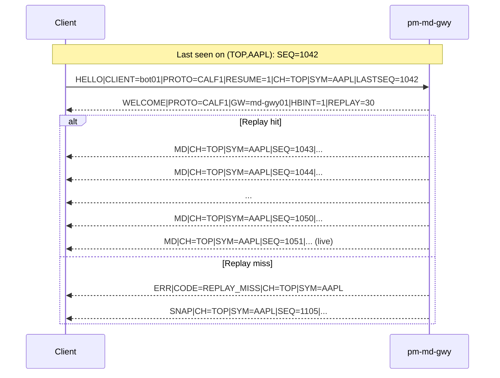
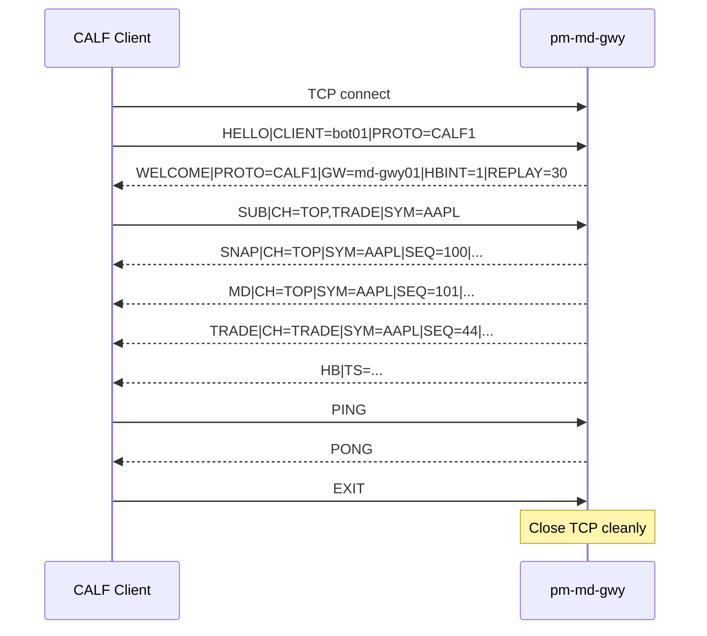

# Appendix: CALF Protocol Reference

!!! note "Learning objectives"
    After reading this appendix you will understand:

    - what **CALF** is and how it differs from ALF and BALF
    - the exact line-level wire format used by CALF over TCP
    - channel, symbol, and subscription rules for `TOP`, `TRADE`, and `STATE`
    - sequencing, gap detection, replay, and resynchronization behavior
    - required and optional fields for every CALF message type
    - gateway and client behaviors required for CALF `1.0.0` interoperability


## What CALF is

**CALF** stands for **Channel ALF**.

CALF is EduMatcher's text market-data protocol. It is designed for educational
clarity and bot usability: human-readable on the wire, easy to debug in a
terminal, and strict enough to support deterministic clients.

CALF complements the other application protocols:

| Protocol | Purpose                                       |
|----------|-----------------------------------------------|
| ALF      | Text order entry (interactive)                |
| BALF     | Binary order entry (low-latency programmatic) |
| CALF     | Channelized text market data                  |

This appendix is the **normative reference** for CALF `1.0.0` semantics.


## Scope and boundaries

CALF is the external market-data protocol exposed by `pm-md-gwy`. The gateway
subscribes to internal engine PUB topics and translates them into CALF lines
for TCP clients.

This appendix specifies the **client-visible CALF protocol**. It does not
specify internal engine message schemas beyond what is needed to explain CALF
behavior.

### Supported in CALF `1.0.0`

- top-of-book updates (`MD`) by symbol
- trade prints (`TRADE`) by symbol
- state transitions (`STATE`) for session-wide and symbol-level changes
- index level updates (`IDX`) from `pm-index`
- point-in-time stream baselines (`SNAP`) for `TOP` and `STATE`
- per-stream sequence numbers on `(CH, SYM)`
- bounded replay on reconnect (`RESUME=1` + `LASTSEQ`)
- heartbeat and liveness signaling

### Out of scope in CALF `1.0.0`

- full depth-by-order market data
- multicast / UDP transport
- entitlement matrix per field
- durable historical replay from disk
- protocol-layer authentication token


## Transport and session model

| Property | Value |
|---|---|
| Transport | TCP |
| Default port | `5570` |
| Encoding | UTF-8 line protocol |
| Delimiter | `\n` |
| Max line length | 4096 bytes including newline |

A CALF client connection is long-lived.

- Client must send `HELLO` within 5 seconds of TCP connect.
- Gateway replies with `WELCOME` on success.
- Client may then send `SUB`, `UNSUB`, `PING`, and `EXIT`.
- Gateway streams `SNAP`, `MD`, `TRADE`, `STATE`, `HB`, and `ERR`.

If no `HELLO` is received within 5 seconds, the gateway closes the socket.


## Core syntax rules

### Line structure

Every CALF message is one line:

```text
<MSGTYPE>|KEY=VALUE|KEY=VALUE|...\n
```

`MSGTYPE` is the first token and is always uppercase ASCII.

Examples:

```text
HELLO|CLIENT=bot01|PROTO=CALF1
TRADE|CH=TRADE|SYM=AAPL|SEQ=809|TS=2026-06-07T10:16:00.141Z|PX=150.12|QTY=200|SIDE=BUY
```

### Parsing behavior

- Messages are delimited by newline (`\n`).
- `\r\n` from clients is accepted for robustness.
- Field order after `MSGTYPE` is not significant.
- Unknown keys are ignored unless needed for validating a specific message.
- Duplicate keys: last occurrence wins.
- Empty lines are invalid and may result in `ERR|CODE=BAD_MESSAGE`.

### TCP stream requirement

TCP is a byte stream, not a message queue.

A receiver must buffer bytes and split by newline. A single `recv()` may
contain half a line, one full line, or many lines.


## Field conventions

### Reserved keys

| Key   | Meaning                                    |
|-------|--------------------------------------------|
| `CH`  | Logical channel (`TOP`, `TRADE`, `STATE`)  |
| `SYM` | Symbol or `*` where allowed                |
| `SEQ` | Sequence number for one `(CH, SYM)` stream |
| `TS`  | UTC ISO-8601 timestamp with milliseconds   |

### Wire value types

| Type          | Wire representation  | Example                    |
|---------------|----------------------|----------------------------|
| Decimal price | Text decimal         | `150.25`                   |
| Integer       | Base-10 text integer | `1200`                     |
| Boolean flag  | `0` or `1`           | `RESUME=1`                 |
| Timestamp     | UTC ISO-8601 ms      | `2026-06-07T10:15:23.411Z` |

Optional fields are omitted when not present. Empty required values are invalid.


## Channel model

CALF groups market data into logical channels.

| Channel | Description                         | `SYM=*` allowed? |
|---------|-------------------------------------|------------------|
| `TOP`   | Best bid/ask updates and snapshots  | No               |
| `TRADE` | Trade prints                        | No               |
| `STATE` | Session or symbol state transitions | Yes              |
| `INDEX` | Index level updates                 | No               |

`SNAP` is a message type, not a channel.

A client does not subscribe to `SNAP` directly. The gateway auto-sends `SNAP`
for new `SUB` requests on `TOP` and `STATE`.

### Subscription rules

- `SUB` may include multiple channels and symbols separated by commas.
- A multi-value `SUB` applies to the Cartesian product of channels and symbols.
- `SYM=*` is valid only when channel set is exactly `STATE`.
- Re-subscribing an already active pair is idempotent.
- Maximum symbols per client are enforced by gateway config.
- If any requested `(CH,SYM)` pair is invalid, the gateway rejects the `SUB`
  request with `ERR` and leaves existing subscriptions unchanged.


## Sequence and recovery semantics

### Stream identity

Sequence numbers are maintained per `(CH, SYM)` stream.

Examples:

- `(TOP, AAPL)` has its own counter
- `(TRADE, AAPL)` has a different counter
- `(STATE, *)` and `(STATE, AAPL)` are distinct counters

### Sequence rules

- Start value is `1` for each stream.
- Increment by `1` per emitted message in that stream.
- Sequence appears in `SNAP`, `MD`, `TRADE`, and `STATE`.
- A client-detected gap means one or more missed messages.

### First connect behavior

On first subscribe to a `TOP` or `STATE` stream:

1. Gateway sends `SNAP` with current stream `SEQ`.
2. Client stores `last_seq[(CH,SYM)] = SNAP.SEQ`.
3. Next incremental event for that stream must be `SEQ + 1`.

### Reconnect behavior (`RESUME=1`)

`RESUME=1` applies to one stream per `HELLO`.

- Client supplies `CH`, `SYM`, and `LASTSEQ`.
- `CH` and `SYM` must each contain exactly one value when `RESUME=1`.
- `LASTSEQ` must be a positive base-10 integer.
- If missing events are inside replay window, gateway replays in order then
  continues live.
- If missing range is outside window, gateway sends `ERR|CODE=REPLAY_MISS`
  followed by a fresh `SNAP`.




## Message catalog

### Session control messages

| Message   | Direction         | Purpose                                      |
|-----------|-------------------|----------------------------------------------|
| `HELLO`   | Client -> Gateway | Start session; optional single-stream resume |
| `WELCOME` | Gateway -> Client | Confirm session and advertise parameters     |
| `SUB`     | Client -> Gateway | Add subscriptions                            |
| `UNSUB`   | Client -> Gateway | Remove subscriptions                         |
| `PING`    | Client -> Gateway | Liveness probe                               |
| `PONG`    | Gateway -> Client | Probe reply                                  |
| `HB`      | Gateway -> Client | Heartbeat when quiet                         |
| `ERR`     | Gateway -> Client | Protocol or flow error                       |
| `EXIT`    | Client -> Gateway | Clean disconnect                             |

### Market-data messages

| Message | Direction         | Purpose                               |
|---------|-------------------|---------------------------------------|
| `SNAP`  | Gateway -> Client | Point-in-time baseline for one stream |
| `MD`    | Gateway -> Client | Incremental top-of-book update        |
| `TRADE` | Gateway -> Client | Trade print                           |
| `STATE` | Gateway -> Client | Session/symbol state transition       |
| `IDX`   | Gateway -> Client | Index level update                    |


## Message definitions

### `HELLO`

**Direction:** Client -> Gateway

**Purpose:** Session handshake. Optional replay request for one stream.

**Response:** `WELCOME` or `ERR`.

| Field     | Req           | Description                            |
|-----------|---------------|----------------------------------------|
| `CLIENT`  | Yes           | Client ID (ASCII, max 32 chars)        |
| `PROTO`   | Yes           | Must be `CALF1`                        |
| `RESUME`  | No            | `1` enables replay request             |
| `CH`      | If `RESUME=1` | One channel to resume                  |
| `SYM`     | If `RESUME=1` | One symbol for resumed stream          |
| `LASTSEQ` | If `RESUME=1` | Last received sequence for that stream |

Validation rules:

- Messages other than `HELLO` sent before successful handshake receive
  `ERR|CODE=AUTH_REQUIRED`.
- `RESUME=1` with missing `CH`, `SYM`, or `LASTSEQ` is invalid.
- `RESUME=1` with multi-value `CH` or `SYM` is invalid.

```text
HELLO|CLIENT=bot01|PROTO=CALF1
HELLO|CLIENT=bot01|PROTO=CALF1|RESUME=1|CH=TOP|SYM=AAPL|LASTSEQ=1042
```

### `WELCOME`

**Direction:** Gateway -> Client

| Field     | Req | Description                          |
|-----------|-----|--------------------------------------|
| `PROTO`   | Yes | Echoes negotiated protocol           |
| `GW`      | Yes | Gateway instance name                |
| `HBINT`   | Yes | Heartbeat interval in seconds        |
| `REPLAY`  | Yes | Replay window in seconds             |
| `SYMBOLS` | No  | Optional comma-separated symbol list |

```text
WELCOME|PROTO=CALF1|GW=md-gwy01|HBINT=1|REPLAY=30|SYMBOLS=AAPL,MSFT
```

### `SUB`

**Direction:** Client -> Gateway

| Field | Req | Description                                     |
|-------|-----|-------------------------------------------------|
| `CH`  | Yes | Comma-separated channels                        |
| `SYM` | Yes | Comma-separated symbols (`*` only with `STATE`) |

**Response semantics:**

- No explicit ACK.
- New `TOP`/`STATE` subscriptions trigger `SNAP`.
- `TRADE` subscriptions do not have a baseline `SNAP`; only future `TRADE` events are sent.
- Invalid requests return `ERR`.
- Existing successful subscriptions remain active when a later `SUB` request is invalid.

```text
SUB|CH=TOP,TRADE|SYM=AAPL,MSFT
SUB|CH=STATE|SYM=*
```

### `UNSUB`

**Direction:** Client -> Gateway

| Field | Req | Description              |
|-------|-----|--------------------------|
| `CH`  | Yes | Comma-separated channels |
| `SYM` | Yes | Comma-separated symbols  |

`UNSUB` is idempotent. Removing a non-existent `(CH,SYM)` pair has no effect.

```text
UNSUB|CH=TOP|SYM=AAPL
```

### `SNAP`

**Direction:** Gateway -> Client

**Purpose:** Baseline for one stream.

`SNAP` uses channel-specific payload fields.

Common fields:

| Field | Req | Description                     |
|-------|-----|---------------------------------|
| `CH`  | Yes | `TOP` or `STATE`                |
| `SYM` | Yes | Symbol or `*` for session state |
| `SEQ` | Yes | Current stream sequence         |
| `TS`  | Yes | Snapshot timestamp              |

`CH=TOP` fields:

| Field    | Req | Description      |
|----------|-----|------------------|
| `BID`    | No  | Best bid price   |
| `BIDSZ`  | No  | Best bid size    |
| `ASK`    | No  | Best ask price   |
| `ASKSZ`  | No  | Best ask size    |
| `LAST`   | No  | Last trade price |
| `LASTSZ` | No  | Last trade size  |

`CH=STATE` fields:

| Field     | Req | Description         |
|-----------|-----|---------------------|
| `SESSION` | Yes | Current state value |

`TRADE` stream note:

- There is no `SNAP` variant for `CH=TRADE` in CALF `1.0.0`.
- `TRADE` delivery starts from events that occur after the subscription is active.

```text
SNAP|CH=TOP|SYM=AAPL|SEQ=100|TS=2026-06-07T10:16:00.000Z|BID=150.10|BIDSZ=1200|ASK=150.12|ASKSZ=900|LAST=150.11|LASTSZ=300
SNAP|CH=STATE|SYM=*|SEQ=5|TS=2026-06-07T10:16:00.000Z|SESSION=CONTINUOUS
```

### `MD`

**Direction:** Gateway -> Client

**Purpose:** Incremental `TOP` update. Unchanged sides may be omitted.

| Field    | Req | Description              |
|----------|-----|--------------------------|
| `CH`     | Yes | `TOP`                    |
| `SYM`    | Yes | Symbol                   |
| `SEQ`    | Yes | Stream sequence          |
| `TS`     | Yes | Event timestamp          |
| `BID`    | No  | Updated bid              |
| `BIDSZ`  | No  | Updated bid size         |
| `ASK`    | No  | Updated ask              |
| `ASKSZ`  | No  | Updated ask size         |
| `LAST`   | No  | Updated last trade price |
| `LASTSZ` | No  | Updated last trade size  |

```text
MD|CH=TOP|SYM=AAPL|SEQ=1051|TS=2026-06-07T10:16:00.115Z|BID=150.11|BIDSZ=1400|ASK=150.13|ASKSZ=800
```

### `TRADE`

**Direction:** Gateway -> Client

| Field  | Req | Description                      |
|--------|-----|----------------------------------|
| `CH`   | Yes | `TRADE`                          |
| `SYM`  | Yes | Symbol                           |
| `SEQ`  | Yes | Stream sequence                  |
| `TS`   | Yes | Trade timestamp                  |
| `PX`   | Yes | Trade price                      |
| `QTY`  | Yes | Trade quantity                   |
| `SIDE` | Yes | Aggressor side (`BUY` or `SELL`) |

```text
TRADE|CH=TRADE|SYM=AAPL|SEQ=809|TS=2026-06-07T10:16:00.141Z|PX=150.12|QTY=200|SIDE=BUY
```

### `STATE`

**Direction:** Gateway -> Client

| Field     | Req | Description               |
|-----------|-----|---------------------------|
| `CH`      | Yes | `STATE`                   |
| `SYM`     | Yes | Symbol or `*`             |
| `SEQ`     | Yes | Stream sequence           |
| `TS`      | Yes | Transition timestamp      |
| `SESSION` | Yes | New state value           |
| `PREV`    | No  | Previous state when known |

Valid `SESSION` values:

- `PRE_OPEN`
- `OPENING_AUCTION`
- `CONTINUOUS`
- `CLOSING_AUCTION`
- `CLOSED`
- `HALTED` (symbol-level)

```text
STATE|CH=STATE|SYM=*|SEQ=14|TS=2026-06-07T10:30:00.000Z|SESSION=CONTINUOUS|PREV=OPENING_AUCTION
STATE|CH=STATE|SYM=AAPL|SEQ=3|TS=2026-06-07T11:02:17.330Z|SESSION=HALTED|PREV=CONTINUOUS
```

### `IDX`

**Direction:** Gateway -> Client

**Purpose:** Index level update for one `INDEX` stream.

| Field     | Req | Description                                          |
|-----------|-----|------------------------------------------------------|
| `CH`      | Yes | `INDEX`                                              |
| `SYM`     | Yes | Index identifier (e.g. `EDU50`)                      |
| `SEQ`     | Yes | Stream-local sequence number                         |
| `TS`      | Yes | Event timestamp                                      |
| `LEVEL`   | Yes | Current index level, decimal string                  |
| `SESSION` | Yes | Index session state                                  |
| `OPEN`    | No  | Day open level, decimal string                       |
| `HIGH`    | No  | Day high, decimal string                             |
| `LOW`     | No  | Day low, decimal string                              |
| `CHG`     | No  | Change from open, signed decimal e.g. `+1.23`        |
| `PCTCHG`  | No  | Percent change from open, signed e.g. `+0.45`        |
| `AGGCAP`  | No  | Aggregate market cap, integer string                 |

`IDX` has no baseline `SNAP` variant in CALF `1.0.0`. Delivery starts from
events that occur after the subscription becomes active.

```text
IDX|CH=INDEX|SYM=EDU50|SEQ=12|TS=2026-06-07T10:16:00.000Z|LEVEL=5123.45|SESSION=CONTINUOUS|OPEN=5100.00|CHG=+23.45|PCTCHG=+0.46
```

### `HB`

**Direction:** Gateway -> Client

Sent when no outbound market-data line was emitted during the heartbeat interval.

| Field | Req | Description       |
|-------|-----|-------------------|
| `TS`  | Yes | Gateway timestamp |

```text
HB|TS=2026-06-07T10:16:05.000Z
```

### `PING` / `PONG`

`PING` is client-initiated liveness check. `PONG` is immediate reply.

```text
PING
PONG
```

### `ERR`

**Direction:** Gateway -> Client

| Field  | Req | Description                   |
|--------|-----|-------------------------------|
| `CODE` | Yes | Machine-readable error code   |
| `MSG`  | No  | Human-readable context        |
| `CH`   | No  | Channel context when relevant |
| `SYM`  | No  | Symbol context when relevant  |

Normative error codes:

| Code              | Meaning                                                                          |
|-------------------|---------------------------------------------------------------------------------|
| `PROTO_MISMATCH`  | `HELLO` missing `CLIENT` or `PROTO != CALF1`                                    |
| `AUTH_REQUIRED`   | Non-`HELLO` message sent before successful handshake                            |
| `INVALID_CHANNEL` | `CH` not in `{TOP, TRADE, STATE, INDEX}`                                        |
| `INVALID_SYMBOL`  | Symbol not in known list, or wildcard used on wrong channel                     |
| `SUB_LIMIT`       | Subscription would exceed `max_symbols_per_client`                              |
| `REPLAY_MISS`     | `LASTSEQ` is older than the replay window; gateway sends a `SNAP` instead       |
| `SLOW_CLIENT`     | Outbound queue exceeded `max_client_queue`; connection closed                   |
| `BAD_MESSAGE`     | Parse failure, oversized line (> 4096 bytes), or unsupported message type       |

Terminal behavior:

- `SLOW_CLIENT` is terminal for the current TCP session; gateway disconnects.
- `BAD_MESSAGE` may be terminal when parsing cannot continue safely.

```text
ERR|CODE=REPLAY_MISS|MSG=Requested sequence outside replay buffer|CH=TOP|SYM=AAPL
```

### `EXIT`

**Direction:** Client -> Gateway

Requests clean disconnect.

```text
EXIT
```


## Liveness and timeout rules

- Gateway emits `HB` every `heartbeat_interval_sec` when no outbound market-data
  line has been sent in that interval.
- Client may issue `PING` anytime; gateway must respond with `PONG`.
- If no inbound or outbound traffic occurs for `idle_timeout_sec`, gateway
  closes the connection.
- `HB`, `PING`, and `PONG` are liveness messages and do not participate in
  `(CH,SYM)` sequence counters.


## Session lifecycle




## Gateway behavior requirements

For CALF `1.0.0` interoperability, `pm-md-gwy` must:

1. Accept TCP clients and enforce HELLO-before-use semantics.
2. Normalize internal engine events into CALF lines.
3. Maintain independent sequence counters per `(CH, SYM)`.
4. Keep bounded replay buffers per `(CH, SYM)` stream.
5. Auto-send `SNAP` on new `TOP`/`STATE` subscriptions.
6. Enforce channel and symbol rules deterministically.
7. Disconnect slow clients when queue limits are exceeded.


## Configuration reference

CALF gateway settings are part of the main engine configuration file
(`engine_config.yaml`) as a top-level `market_data_gateway` block.

Path location:

- `engine_config.yaml` -> `market_data_gateway`

All supported CALF `1.0.0` configuration fields are listed below.

| Field | Type / allowed range | Default | Description |
|---|---|---|---|
| `market_data_gateway.enabled` | Boolean (`true`/`false`) | `true` (recommended when CALF is used) | Enables/disables the CALF gateway process configuration. |
| `market_data_gateway.name` | Non-empty string | Implementation-defined | Gateway instance name advertised in `WELCOME|GW=...`. |
| `market_data_gateway.bind_address` | IP/host bind string | `0.0.0.0` (common) | Local interface address to bind for incoming TCP clients. |
| `market_data_gateway.port` | Integer, `1..65535` | `5570` | TCP listen port for CALF clients. |
| `market_data_gateway.heartbeat_interval_sec` | Integer, `> 0` | `1` | Interval used to emit `HB` when no outbound market-data line was sent. |
| `market_data_gateway.idle_timeout_sec` | Integer, `> 0` | `5` | Maximum silent period (no inbound and no outbound traffic) before disconnect. |
| `market_data_gateway.replay_window_sec` | Integer, `> 0` | `30` | Time-bounded replay retention per `(CH,SYM)` stream for resume/gap recovery. |
| `market_data_gateway.max_symbols_per_client` | Integer, `> 0` | `200` | Per-client subscription symbol limit across active subscriptions. |
| `market_data_gateway.max_client_queue` | Integer, `> 0` | `10000` | Per-client outbound queue cap; overflow triggers `ERR|CODE=SLOW_CLIENT` and disconnect. |

Operational notes:

- `HBINT` in `WELCOME` must reflect `heartbeat_interval_sec`.
- `REPLAY` in `WELCOME` must reflect `replay_window_sec`.
- `max_symbols_per_client` affects `SUB` validation and `ERR|CODE=SUB_LIMIT`.
- `max_client_queue` controls slow-client backpressure behavior.


**Example:**

```yaml
market_data_gateway:
  enabled: true
  name: "md-gwy01"
  bind_address: "0.0.0.0"
  port: 5570
  heartbeat_interval_sec: 1
  idle_timeout_sec: 5
  replay_window_sec: 30
  max_symbols_per_client: 200
  max_client_queue: 10000
```


## What to watch out for during implementation

- Implement line buffering correctly for TCP streams (`recv()` may return
  partial lines or multiple lines at once).
- Enforce HELLO-before-use strictly; all non-HELLO pre-auth messages must
  receive `ERR|CODE=AUTH_REQUIRED`.
- Keep `SNAP` semantics explicit: it is a message type, not a subscribable
  channel; only `TOP` and `STATE` subscriptions auto-trigger `SNAP`.
- Enforce `SYM=*` constraints exactly (`STATE` only) and validate multi-value
  `SUB` as Cartesian stream requests.
- Track sequence numbers independently per `(CH,SYM)` stream; never use a single
  global counter.
- Treat `RESUME=1` as single-stream only and validate `CH`, `SYM`, and
  `LASTSEQ` strictly.
- Bound replay by configured window and emit deterministic `REPLAY_MISS` + fresh
  `SNAP` behavior when outside window.
- Apply slow-client backpressure deterministically: queue overflow must produce
  `SLOW_CLIENT` and disconnect.
- Keep liveness signals (`HB`, `PING`, `PONG`) outside market-data sequencing;
  they do not consume `(CH,SYM)` sequence numbers.


## Normative implementation truths

If you are implementing a CALF client, the most important protocol truths are:

1. CALF is line-based text over TCP, not message-framed datagrams.
2. `HELLO` is mandatory before any subscription command.
3. `SNAP` is a message type, not a subscribable channel.
4. Sequence tracking is per `(CH, SYM)` stream.
5. `SYM=*` is valid only for `STATE` subscriptions.
6. Replay resume is single-stream per `HELLO|RESUME=1`.
7. On replay miss, client must accept fresh `SNAP` and reset local baseline.
8. Heartbeats and ping/pong are separate liveness mechanisms.
9. A `SLOW_CLIENT` error indicates disconnect and reconnect is required.
10. Protocol values and keys are uppercase by convention and should be emitted
    uppercase for interoperability.
