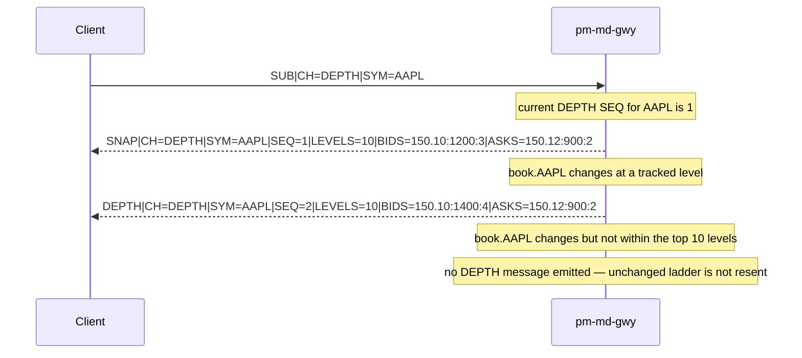
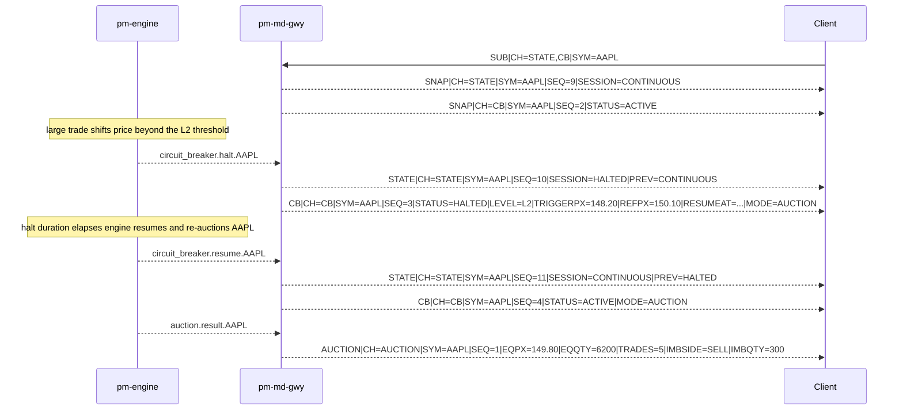
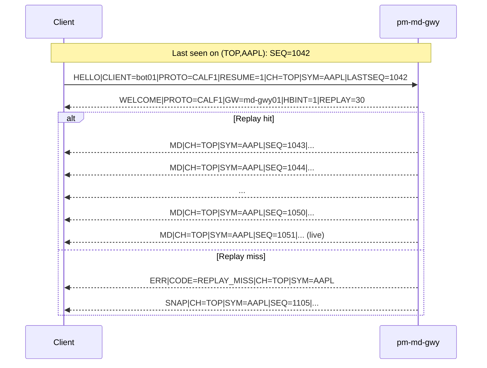
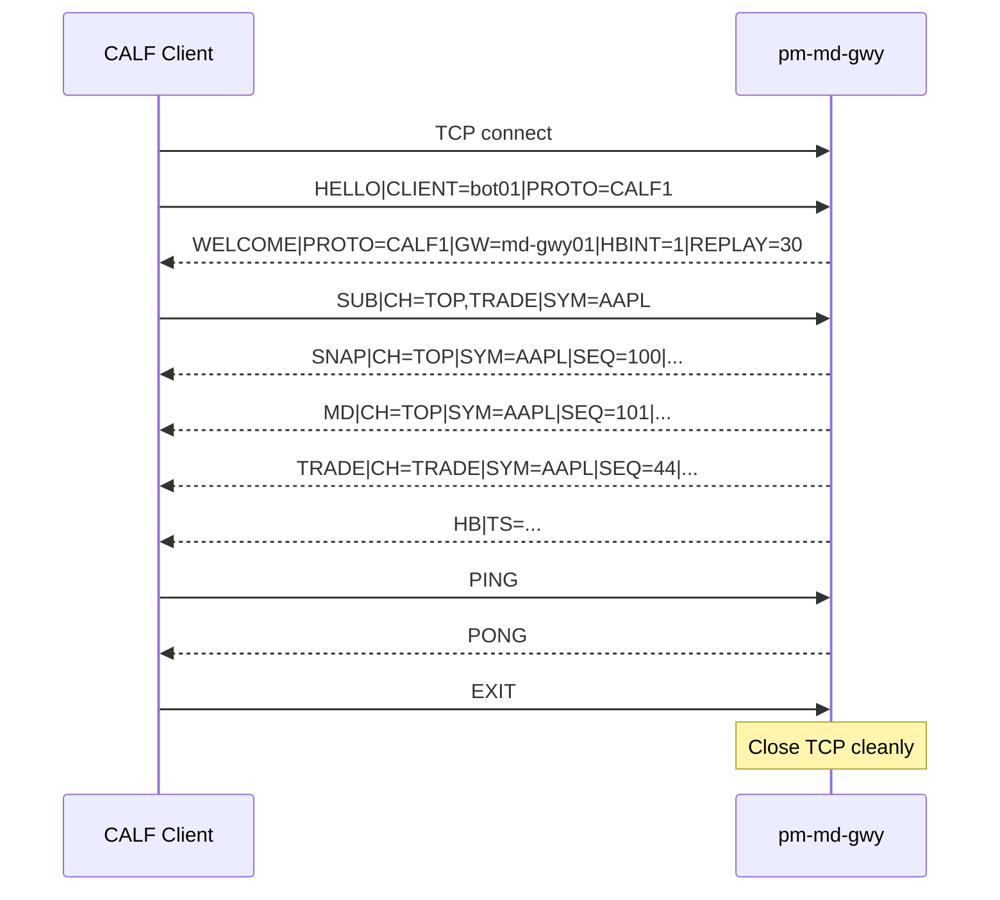

# Appendix: CALF Protocol Reference

> **Status: Normative.** This appendix is the single source of truth for the CALF
> `1.0.0` wire contract as implemented by `pm-md-gwy` (`md_gateway/`). For an
> operational, tutorial-style guide see [Market Data Feed (CALF)](240-market-data-feed.md);
> for the gateway's configuration block see
> [Engine Config Specification §6.3](990-app-config-spec.md#63-market_data_gateway-pm-md-gwy-calf).
> The key words MUST, MUST NOT, SHOULD, and MAY are used per RFC 2119.


## What CALF is

**CALF** stands for **Channel ALF**.

CALF is EduMatcher's text market-data protocol. It is designed for educational
clarity and bot usability: human-readable on the wire, easy to debug in a
terminal, and strict enough to support deterministic clients.

CALF complements the other application protocols:

| Protocol | Purpose                                       |
|----------|-----------------------------------------------|
| ALF      | Text order entry (interactive)                |
| BALF     | Binary order entry (low-latency programmatic) |
| CALF     | Channelized text market data                  |

This appendix is the **normative reference** for CALF `1.0.0` semantics.


## Scope & conformance

CALF is the external market-data protocol exposed by `pm-md-gwy`. The gateway
subscribes to internal engine PUB topics and translates them into CALF lines
for TCP clients.

This appendix specifies the **client-visible CALF protocol**. It does not
specify internal engine message schemas beyond what is needed to explain CALF
behavior.

### Supported in CALF `1.0.0`

- top-of-book updates (`MD`) by symbol
- trade prints (`TRADE`) by symbol
- state transitions (`STATE`) for session-wide and symbol-level changes
- index level updates (`IDX`) from `pm-index`
- aggregated multi-level order book updates (`DEPTH`) — Level 2, not
  order-by-order
- auction uncross results (`AUCTION`) — equilibrium price, matched quantity,
  and imbalance for open/close auctions and circuit-breaker resumption
  auctions
- full circuit-breaker halt/resume detail (`CB`) — trigger price, reference
  price, ladder level, auto-resume time, and resumption mode, alongside the
  coarse `STATE` transition
- point-in-time stream baselines (`SNAP`) for `TOP`, `STATE`, `INDEX`,
  `DEPTH`, and `CB`
- per-stream sequence numbers on `(CH, SYM)`
- `SYM=*` wildcard subscriptions for `STATE`, `TOP`, `TRADE`, and `AUCTION`
- bounded replay on reconnect (`RESUME=1` + `LASTSEQ`)
- heartbeat and liveness signaling
- gateway capability advertisement via `WELCOME|CH_SUPPORTED=`

### Out of scope in CALF `1.0.0`

- full order-by-order (Level 3) market data — `DEPTH` is Level 2
  (aggregated per price level), never per-order
- `SYM=*` for `INDEX`, `DEPTH`, or `CB`
- index-level circuit breakers on `CB` (symbol-level only; see
  [EduMatcher-index-cb.md](../../docs-design/EduMatcher-index-cb.md) for the
  separate index-level proposal)
- multicast / UDP transport
- entitlement matrix per field
- durable historical replay from disk
- protocol-layer authentication token


## Transport and session model

| Property | Value |
|---|---|
| Transport | TCP |
| Default port | `5570` |
| Encoding | UTF-8 line protocol |
| Delimiter | `\n` |
| Max line length | 4096 bytes including newline |

A CALF client connection is long-lived.

- Client must send `HELLO` within 5 seconds of TCP connect.
- Gateway replies with `WELCOME` on success.
- Client may then send `SUB`, `UNSUB`, `PING`, and `EXIT`.
- Gateway streams `SNAP`, `MD`, `TRADE`, `STATE`, `IDX`, `DEPTH`, `AUCTION`,
  `CB`, `HB`, and `ERR`.

If no `HELLO` is received within 5 seconds, the gateway closes the socket.


## Wire format

### Line structure

Every CALF message is one line:

```text
<MSGTYPE>|KEY=VALUE|KEY=VALUE|...\n
```

`MSGTYPE` is the first token and is always uppercase ASCII.

Examples:

```text
HELLO|CLIENT=bot01|PROTO=CALF1
TRADE|CH=TRADE|SYM=AAPL|SEQ=809|TS=2026-06-07T10:16:00.141Z|PX=150.12|QTY=200|SIDE=BUY
```

### Parsing behavior

- Messages are delimited by newline (`\n`).
- `\r\n` from clients is accepted for robustness.
- Field order after `MSGTYPE` is not significant.
- Unknown keys are ignored unless needed for validating a specific message.
- Duplicate keys: last occurrence wins.
- Empty lines are invalid and may result in `ERR|CODE=BAD_MESSAGE`.

### TCP stream requirement

TCP is a byte stream, not a message queue.

A receiver must buffer bytes and split by newline. A single `recv()` may
contain half a line, one full line, or many lines.


## Field conventions

### Reserved keys

| Key   | Meaning                                                    |
|-------|-------------------------------------------------------------|
| `CH`  | Logical channel (`TOP`, `TRADE`, `STATE`, `INDEX`, `DEPTH`, `AUCTION`, `CB`) |
| `SYM` | Symbol, index id, or `*` where allowed                       |
| `SEQ` | Sequence number for one `(CH, SYM)` stream                   |
| `TS`  | UTC ISO-8601 timestamp with milliseconds                     |

### Wire value types

| Type          | Wire representation  | Example                    |
|---------------|----------------------|----------------------------|
| Decimal price | Text decimal         | `150.25`                   |
| Integer       | Base-10 text integer | `1200`                     |
| Boolean flag  | `0` or `1`           | `RESUME=1`                 |
| Timestamp     | UTC ISO-8601 ms      | `2026-06-07T10:15:23.411Z` |

Optional fields are omitted when not present. Empty required values are invalid.


## Channel model

CALF groups market data into logical channels.

| Channel   | Description                                                | `SYM=*` allowed? |
|-----------|--------------------------------------------------------------|-------------------|
| `TOP`     | Best bid/ask updates and snapshots                           | Yes               |
| `TRADE`   | Trade prints                                                  | Yes               |
| `STATE`   | Session or symbol state transitions                           | Yes               |
| `INDEX`   | Index level updates                                           | No                |
| `DEPTH`   | Aggregated multi-level order book (Level 2)                   | No                |
| `AUCTION` | Auction uncross results (equilibrium price, imbalance)        | Yes               |
| `CB`      | Circuit-breaker halt/resume detail (trigger price, level, ...) | No                |

`SNAP` is a message type, not a channel.

A client does not subscribe to `SNAP` directly. The gateway auto-sends `SNAP`
for new `SUB` requests on `TOP`, `STATE`, `INDEX`, `DEPTH`, and `CB`. `TRADE`
and `AUCTION` have no baseline `SNAP` — only future events are delivered for
those two channels, since neither has a persistent "current value" to
snapshot.

`SYM=*` for `TOP` does not produce a single `SNAP|SYM=*`. Top-of-book has no
meaningful "wildcard" value, so the gateway instead sends one real `SNAP` per
currently known symbol, then live `MD` for any symbol — including ones that
become known only after the `SUB` — via the same wildcard subscription entry.

### Subscription rules

- `SUB` may include multiple channels and symbols separated by commas.
- A multi-value `SUB` applies to the Cartesian product of channels and symbols.
- `SYM=*` is valid when the channel set is a subset of
  `{STATE, TOP, TRADE, AUCTION}`, in any combination. `SYM=*` combined with
  `INDEX`, `DEPTH`, or `CB` — alone or mixed with any other channel in the
  same `SUB` — is invalid.
- A wildcard subscription (`SYM=*`) counts as exactly one entry toward
  `max_symbols_per_client`, not one entry per known symbol.
- Re-subscribing an already active pair is idempotent.
- Maximum symbols per client are enforced by gateway config.
- If any requested `(CH,SYM)` pair is invalid, the gateway rejects the `SUB`
  request with `ERR` and leaves existing subscriptions unchanged.
- For non-`INDEX` channels, a non-wildcard `SYM` is validated against the
  gateway's known instrument list (populated from the engine's configured
  symbols at startup); an unrecognized symbol returns
  `ERR|CODE=INVALID_SYMBOL`. `INDEX` is exempt from this check — index ids
  live in a separate namespace from tradable instrument symbols, so any
  non-empty id is accepted at `SUB` time regardless of whether a matching
  index is actually configured. `AUCTION` and `CB` are not exempt: a
  non-wildcard symbol for either is checked against the same known-instrument
  list as `TOP`/`TRADE`/`STATE`/`DEPTH`.
- If the gateway's known-symbol list itself is empty (for example, engine
  config failed to load additional symbol metadata at gateway startup),
  known-symbol validation is skipped entirely and any non-wildcard symbol is
  accepted; this is a permissive fallback, not a documented steady-state
  mode, and operators should treat an empty known-symbol list as a
  configuration problem to fix rather than relied-upon behavior.

`DEPTH` and `CB` disallow `SYM=*` deliberately, not as an oversight: `DEPTH`
messages carry up to `2 x depth_levels` price levels each, so a wildcard
subscription could multiply one client's outbound bandwidth by the entire
symbol count; `CB` halts/resumes are rare, per-symbol operator-relevant
events rather than a firehose use case. `AUCTION`, by contrast, allows
`SYM=*`: auction events are extremely low frequency (at most a handful per
symbol per trading day), so a wildcard subscription poses none of `DEPTH`'s
bandwidth risk, and — like `TRADE` — `AUCTION` has no baseline `SNAP` to
burst per symbol on subscribe.

```text
SUB|CH=TOP,TRADE|SYM=AAPL,MSFT
SUB|CH=STATE|SYM=*
SUB|CH=TRADE|SYM=*
SUB|CH=TOP,TRADE,STATE|SYM=*
SUB|CH=DEPTH|SYM=AAPL
SUB|CH=AUCTION|SYM=*
SUB|CH=CB|SYM=AAPL
```


## Message catalog

### Session control messages

| Message   | Direction         | Purpose                                      |
|-----------|-------------------|----------------------------------------------|
| `HELLO`   | Client -> Gateway | Start session; optional single-stream resume |
| `WELCOME` | Gateway -> Client | Confirm session and advertise parameters     |
| `SUB`     | Client -> Gateway | Add subscriptions                            |
| `UNSUB`   | Client -> Gateway | Remove subscriptions                         |
| `PING`    | Client -> Gateway | Liveness probe                               |
| `PONG`    | Gateway -> Client | Probe reply                                  |
| `HB`      | Gateway -> Client | Heartbeat when quiet                         |
| `ERR`     | Gateway -> Client | Protocol or flow error                       |
| `EXIT`    | Client -> Gateway | Clean disconnect                             |

### Market-data messages

| Message   | Direction         | Purpose                               |
|-----------|-------------------|---------------------------------------|
| `SNAP`    | Gateway -> Client | Point-in-time baseline for one stream |
| `MD`      | Gateway -> Client | Incremental top-of-book update        |
| `TRADE`   | Gateway -> Client | Trade print                           |
| `STATE`   | Gateway -> Client | Session/symbol state transition       |
| `IDX`     | Gateway -> Client | Index level update                    |
| `DEPTH`   | Gateway -> Client | Incremental multi-level order book update |
| `AUCTION` | Gateway -> Client | Auction uncross result                |
| `CB`      | Gateway -> Client | Circuit-breaker halt/resume detail    |


## Message definitions

### `HELLO`

**Direction:** Client -> Gateway

**Purpose:** Session handshake. Optional replay request for one stream.

**Response:** `WELCOME` on successful handshake, or `ERR|CODE=PROTO_MISMATCH`
(connection closed) if `CLIENT`/`PROTO` fail validation. When `RESUME=1` is
present and the handshake itself succeeds, the gateway always sends
`WELCOME` first and then evaluates the resume request separately — an
invalid resume (bad `CH`/`SYM`/`LASTSEQ` shape, or a replay miss) produces
`WELCOME` followed by an `ERR` (`BAD_MESSAGE` or `REPLAY_MISS`), not `ERR`
alone. A `BAD_MESSAGE` resume error closes the connection after the queued
messages are flushed; a `REPLAY_MISS` does not — it is followed by a `SNAP`
and the session continues.

| Field     | Req           | Description                            |
|-----------|---------------|----------------------------------------|
| `CLIENT`  | Yes           | Client ID (ASCII, max 32 chars)        |
| `PROTO`   | Yes           | Must be `CALF1`                        |
| `RESUME`  | No            | `1` enables replay request             |
| `CH`      | If `RESUME=1` | One channel to resume                  |
| `SYM`     | If `RESUME=1` | One symbol for resumed stream          |
| `LASTSEQ` | If `RESUME=1` | Last received sequence for that stream |

Validation rules:

- Messages other than `HELLO` sent before successful handshake receive
  `ERR|CODE=AUTH_REQUIRED`.
- `RESUME=1` with missing `CH`, `SYM`, or `LASTSEQ` is invalid.
- `RESUME=1` with multi-value `CH` or `SYM` is invalid.

```text
HELLO|CLIENT=bot01|PROTO=CALF1
HELLO|CLIENT=bot01|PROTO=CALF1|RESUME=1|CH=TOP|SYM=AAPL|LASTSEQ=1042
```

### `WELCOME`

**Direction:** Gateway -> Client

| Field          | Req | Description                          |
|----------------|-----|---------------------------------------|
| `PROTO`        | Yes | Echoes negotiated protocol           |
| `GW`           | Yes | Gateway instance name                |
| `HBINT`        | Yes | Heartbeat interval in seconds        |
| `REPLAY`       | Yes | Replay window in seconds             |
| `SYMBOLS`      | No  | Comma-separated snapshot of instrument symbols known to the gateway at connect time. Omitted when the gateway has no known symbols yet. The known-symbol set can grow after `WELCOME` is sent, as new `book.{SYMBOL}`/trade events arrive from the engine — this field is a point-in-time snapshot, not a fixed universe, and a symbol absent here may still become subscribable later without a new `WELCOME`. |
| `CH_SUPPORTED` | No  | Comma-separated list of channels this gateway build supports. Present on every CALF `1.0.0`+ gateway; omitted entirely by earlier gateways. A client uses its presence — not the `PROTO` value, which does not change — to detect whether `DEPTH`/`INDEX` and the `SYM=*` wildcard extension are available. |

```text
WELCOME|PROTO=CALF1|GW=md-gwy01|HBINT=1|REPLAY=30|SYMBOLS=AAPL,MSFT|CH_SUPPORTED=AUCTION,CB,DEPTH,INDEX,STATE,TOP,TRADE
```

A client that receives no `CH_SUPPORTED` field must assume only `TOP`,
`TRADE`, and `STATE` are available and must not rely on `SYM=*` for `TOP`/
`TRADE`, `INDEX`, or `DEPTH` without first probing with `SUB` and handling a
possible `ERR|CODE=INVALID_CHANNEL`/`INVALID_SYMBOL` response.

### `SUB`

**Direction:** Client -> Gateway

| Field | Req | Description                                                        |
|-------|-----|----------------------------------------------------------------------|
| `CH`  | Yes | Comma-separated channels                                            |
| `SYM` | Yes | Comma-separated symbols (`*` only when `CH` is a subset of `{STATE, TOP, TRADE, AUCTION}`) |

**Response semantics:**

- No explicit ACK.
- New `TOP`/`STATE`/`INDEX`/`DEPTH`/`CB` subscriptions trigger `SNAP`. A
  wildcard `TOP` subscription (`SYM=*`) triggers one real `SNAP` per
  currently known symbol, never a single `SNAP` with a literal `SYM=*`.
- `TRADE` and `AUCTION` subscriptions do not have a baseline `SNAP`; only
  future events are sent for those two channels.
- Invalid requests return `ERR`.
- Existing successful subscriptions remain active when a later `SUB` request is invalid.

```text
SUB|CH=TOP,TRADE|SYM=AAPL,MSFT
SUB|CH=STATE|SYM=*
SUB|CH=TRADE|SYM=*
SUB|CH=DEPTH|SYM=AAPL
SUB|CH=AUCTION|SYM=*
SUB|CH=CB|SYM=AAPL
```

### `UNSUB`

**Direction:** Client -> Gateway

| Field | Req | Description              |
|-------|-----|--------------------------|
| `CH`  | Yes | Comma-separated channels |
| `SYM` | Yes | Comma-separated symbols  |

`UNSUB` is idempotent. Removing a non-existent `(CH,SYM)` pair has no effect.

```text
UNSUB|CH=TOP|SYM=AAPL
```

### `SNAP`

**Direction:** Gateway -> Client

**Purpose:** Baseline for one stream.

`SNAP` uses channel-specific payload fields.

Common fields:

| Field | Req | Description                              |
|-------|-----|--------------------------------------------|
| `CH`  | Yes | `TOP`, `STATE`, `INDEX`, `DEPTH`, or `CB`  |
| `SYM` | Yes | Symbol, index id, or `*` for session state |
| `SEQ` | Yes | Current stream sequence                    |
| `TS`  | Yes | Snapshot timestamp                         |

`CH=TOP` fields:

| Field    | Req | Description      |
|----------|-----|------------------|
| `BID`    | No  | Best bid price   |
| `BIDSZ`  | No  | Best bid size    |
| `ASK`    | No  | Best ask price   |
| `ASKSZ`  | No  | Best ask size    |
| `LAST`   | No  | Last trade price |
| `LASTSZ` | No  | Last trade size  |

A `SUB|CH=TOP|SYM=*` never produces a `SNAP` with a literal `SYM=*` — see
"Channel model" above. Each `SNAP` in the resulting burst has a real `SYM`
and uses that symbol's own `(TOP, SYM)` sequence.

`CH=STATE` fields:

| Field     | Req | Description         |
|-----------|-----|---------------------|
| `SESSION` | Yes | Current state value |

`CH=INDEX` fields: identical field set to the `IDX` message — see that
section below. Since CALF `1.0.0`, `SUB|CH=INDEX` sends a baseline `SNAP`
before any live `IDX` updates, the same as `TOP`/`STATE`/`DEPTH`.

`CH=DEPTH` fields: identical field set to the `DEPTH` message — see that
section below. `BIDS`/`ASKS` are omitted entirely (not sent as empty
strings) when a symbol's book has no resting orders on that side yet.

`CH=CB` fields: identical field set to the `CB` message — see that section
below. Reflects the **last known** circuit-breaker status for the symbol —
`STATUS=ACTIVE` with no further fields if the symbol has never halted.

`TRADE`/`AUCTION` stream note:

- Neither `CH=TRADE` nor `CH=AUCTION` has a `SNAP` variant in CALF `1.0.0` —
  both are pure event streams with no persistent "current value."
- Delivery for both starts from events that occur after the subscription is
  active (plus any replay via `RESUME=1`, see "Sequence and recovery
  semantics").

```text
SNAP|CH=TOP|SYM=AAPL|SEQ=100|TS=2026-06-07T10:16:00.000Z|BID=150.10|BIDSZ=1200|ASK=150.12|ASKSZ=900|LAST=150.11|LASTSZ=300
SNAP|CH=STATE|SYM=*|SEQ=5|TS=2026-06-07T10:16:00.000Z|SESSION=CONTINUOUS
SNAP|CH=INDEX|SYM=EDU100|SEQ=42|TS=2026-06-12T10:15:23.000Z|LEVEL=1048.73|OPEN=1042.10|HIGH=1056.30|LOW=1040.05|SESSION=CONTINUOUS
SNAP|CH=DEPTH|SYM=AAPL|SEQ=1|TS=2026-07-11T14:32:00.000Z|LEVELS=10|BIDS=150.10:1200:3,150.09:800:2|ASKS=150.12:900:2,150.13:600:1
SNAP|CH=CB|SYM=AAPL|SEQ=3|TS=2026-07-20T14:05:00.000Z|STATUS=HALTED|LEVEL=L2|TRIGGERPX=148.20|REFPX=150.10|RESUMEAT=2026-07-20T15:20:00.000Z|MODE=AUCTION
SNAP|CH=CB|SYM=MSFT|SEQ=1|TS=2026-07-20T14:05:00.000Z|STATUS=ACTIVE
```

### `MD`

**Direction:** Gateway -> Client

**Purpose:** Incremental `TOP` update. Unchanged sides may be omitted.

| Field    | Req | Description              |
|----------|-----|--------------------------|
| `CH`     | Yes | `TOP`                    |
| `SYM`    | Yes | Symbol                   |
| `SEQ`    | Yes | Stream sequence          |
| `TS`     | Yes | Event timestamp          |
| `BID`    | No  | Updated bid              |
| `BIDSZ`  | No  | Updated bid size         |
| `ASK`    | No  | Updated ask              |
| `ASKSZ`  | No  | Updated ask size         |
| `LAST`   | No  | Updated last trade price |
| `LASTSZ` | No  | Updated last trade size  |

```text
MD|CH=TOP|SYM=AAPL|SEQ=1051|TS=2026-06-07T10:16:00.115Z|BID=150.11|BIDSZ=1400|ASK=150.13|ASKSZ=800
```

### `TRADE`

**Direction:** Gateway -> Client

| Field  | Req | Description                      |
|--------|-----|----------------------------------|
| `CH`   | Yes | `TRADE`                          |
| `SYM`  | Yes | Symbol                           |
| `SEQ`  | Yes | Stream sequence                  |
| `TS`   | Yes | Trade timestamp                  |
| `PX`   | Yes | Trade price                      |
| `QTY`  | Yes | Trade quantity                   |
| `SIDE` | Yes | Aggressor side (`BUY` or `SELL`) |

```text
TRADE|CH=TRADE|SYM=AAPL|SEQ=809|TS=2026-06-07T10:16:00.141Z|PX=150.12|QTY=200|SIDE=BUY
```

### `STATE`

**Direction:** Gateway -> Client

| Field     | Req | Description               |
|-----------|-----|---------------------------|
| `CH`      | Yes | `STATE`                   |
| `SYM`     | Yes | Symbol or `*`             |
| `SEQ`     | Yes | Stream sequence           |
| `TS`      | Yes | Transition timestamp      |
| `SESSION` | Yes | New state value           |
| `PREV`    | No  | Previous state when known |

Valid `SESSION` values:

- `PRE_OPEN`
- `OPENING_AUCTION`
- `CONTINUOUS`
- `CLOSING_AUCTION`
- `CLOSED`
- `HALTED` (symbol-level)

```text
STATE|CH=STATE|SYM=*|SEQ=14|TS=2026-06-07T10:30:00.000Z|SESSION=CONTINUOUS|PREV=OPENING_AUCTION
STATE|CH=STATE|SYM=AAPL|SEQ=3|TS=2026-06-07T11:02:17.330Z|SESSION=HALTED|PREV=CONTINUOUS
```

### `IDX`

**Direction:** Gateway -> Client

**Purpose:** Index level update for one `INDEX` stream.

| Field     | Req | Description                                          |
|-----------|-----|------------------------------------------------------|
| `CH`      | Yes | `INDEX`                                              |
| `SYM`     | Yes | Index identifier (e.g. `EDU50`)                      |
| `SEQ`     | Yes | Stream-local sequence number                         |
| `TS`      | Yes | Event timestamp                                      |
| `LEVEL`   | Yes | Current index level, decimal string                  |
| `SESSION` | Yes | Index session state                                  |
| `OPEN`    | No  | Day open level, decimal string                       |
| `HIGH`    | No  | Day high, decimal string                             |
| `LOW`     | No  | Day low, decimal string                              |
| `CHG`     | No  | Change from open, signed decimal e.g. `+1.23`        |
| `PCTCHG`  | No  | Percent change from open, signed e.g. `+0.45`        |
| `AGGCAP`  | No  | Aggregate market cap, integer string                 |

`IDX` has no baseline `SNAP` variant in CALF `1.0.0`. Delivery starts from
events that occur after the subscription becomes active.

```text
IDX|CH=INDEX|SYM=EDU50|SEQ=12|TS=2026-06-07T10:16:00.000Z|LEVEL=5123.45|SESSION=CONTINUOUS|OPEN=5100.00|CHG=+23.45|PCTCHG=+0.46
```

### `DEPTH`

**Direction:** Gateway -> Client

**Purpose:** Aggregated, multi-level order book update — CALF's Level 2
view. Each level is an aggregate of every resting order at that price;
individual order identity is never exposed (Level 3 is explicitly out of
scope, see "Out of scope in CALF 1.0.0" above).

**Response:** No reply required. A gap in `SEQ` should trigger replay or
resync, exactly as for `MD`.

Unlike `MD`, which omits individual unchanged `BID`/`ASK` fields, `DEPTH` is
a **full-ladder replace per message**: whenever the top-`LEVELS` price
levels on either side change, the message carries that side's complete
current ladder, not a per-level diff. `DEPTH` is only sent when the tracked
levels actually changed since the previous `DEPTH`/`SNAP` for the symbol.

| Field    | Req | Description                                                  |
|----------|-----|-----------------------------------------------------------------|
| `CH`     | Yes | `DEPTH`                                                        |
| `SYM`    | Yes | Symbol                                                          |
| `SEQ`    | Yes | Stream sequence for `(DEPTH, SYM)`                              |
| `TS`     | Yes | Event timestamp                                                 |
| `LEVELS` | Yes | Number of price levels per side configured on this gateway (`market_data_gateway.depth_levels`, default `10`) |
| `BIDS`   | No  | Bid-side ladder, best price first; omitted if no resting bids   |
| `ASKS`   | No  | Ask-side ladder, best price first; omitted if no resting asks   |

**Level encoding grammar** (applies to both `BIDS` and `ASKS`):

```text
<LEVELS_VALUE> ::= <LEVEL> ("," <LEVEL>)*
<LEVEL>        ::= <PRICE> ":" <QTY> ":" <COUNT>
```

`PRICE` is decimal text, `QTY` is the aggregated resting quantity at that
price, `COUNT` is the number of individual resting orders aggregated into
it. `:` and `,` are ordinary field-value characters in CALF — the only
reserved wire character is `|`.

```text
DEPTH|CH=DEPTH|SYM=AAPL|SEQ=2|TS=2026-07-11T14:32:00.512Z|LEVELS=10|BIDS=150.10:1400:4,150.09:800:2,150.08:400:1|ASKS=150.12:900:2,150.13:600:1,150.14:250:1
```

`SYM=*` is invalid for `SUB|CH=DEPTH` — see "Subscription rules" above.



### `AUCTION`

**Direction:** Gateway -> Client

**Purpose:** Result of one auction uncross for a symbol — a scheduled
opening/closing auction, or a circuit-breaker resumption auction. Published
exactly once per uncross, even when there was no crossable interest at all.

| Field     | Req | Description                                                                 |
|-----------|-----|--------------------------------------------------------------------------------|
| `CH`      | Yes | `AUCTION`                                                                    |
| `SYM`     | Yes | Symbol                                                                       |
| `SEQ`     | Yes | Stream sequence for `(AUCTION, SYM)`                                        |
| `TS`      | Yes | Event timestamp                                                              |
| `EQPX`    | No  | Equilibrium price; omitted when there was no crossable interest              |
| `EQQTY`   | Yes | Total executable quantity matched at `EQPX` (`0` when no cross)             |
| `TRADES`  | Yes | Number of trades produced by the uncross (`0` when no cross)                |
| `IMBSIDE` | No  | Residual imbalance side, `BUY` or `SELL`; omitted when balanced or no cross |
| `IMBQTY`  | Yes | Residual imbalance quantity at `EQPX` (`0` when balanced or no cross)       |

`AUCTION` has no baseline `SNAP` (see "Channel model" above) — a new
subscriber only receives auction results from the next uncross onward,
unless it also uses `RESUME=1` to replay recent history.

```text
AUCTION|CH=AUCTION|SYM=AAPL|SEQ=1|TS=2026-07-20T13:30:00.012Z|EQPX=150.10|EQQTY=48200|TRADES=37|IMBSIDE=BUY|IMBQTY=1400
AUCTION|CH=AUCTION|SYM=TSLA|SEQ=4|TS=2026-07-20T20:00:00.004Z|EQQTY=0|TRADES=0|IMBQTY=0
AUCTION|CH=AUCTION|SYM=MSFT|SEQ=2|TS=2026-07-20T13:30:00.031Z|EQPX=421.00|EQQTY=15000|TRADES=12|IMBQTY=0
```

The second example is a no-cross auction (`EQPX`/`IMBSIDE` both omitted, all
counts `0`); the third is a perfectly balanced cross (`IMBSIDE` omitted,
`IMBQTY=0`, but `EQPX`/`EQQTY`/`TRADES` all present).

### `CB`

**Direction:** Gateway -> Client

**Purpose:** Full circuit-breaker halt/resume detail for one symbol —
trigger price, reference price, ladder level, scheduled auto-resume time,
and resumption mode. `STATE` (above) still carries the coarse
`SESSION=HALTED`/`SESSION=CONTINUOUS` transition unchanged; `CB` is emitted
**alongside** `STATE`, from the same underlying engine event, for clients
that also want the detail.

| Field       | Req | Description                                                                            |
|-------------|-----|---------------------------------------------------------------------------------------------|
| `CH`        | Yes | `CB`                                                                                     |
| `SYM`       | Yes | Symbol                                                                                   |
| `SEQ`       | Yes | Stream sequence for `(CB, SYM)`                                                          |
| `TS`        | Yes | Event timestamp                                                                          |
| `STATUS`    | Yes | `ACTIVE` (not halted) or `HALTED`                                                        |
| `LEVEL`     | No  | Ladder level (e.g. `L1`/`L2`/`L3`, config-defined) or `ADMIN_ALL`/`ADMIN_SYMBOL` for an operator-initiated halt; present only when `STATUS=HALTED` |
| `TRIGGERPX` | No  | Trigger price; present only for an automatic (non-`ADMIN_*`) halt currently in effect    |
| `REFPX`     | No  | Reference price at trigger time; present only for an automatic halt currently in effect  |
| `RESUMEAT`  | No  | Scheduled auto-resume time, UTC ISO-8601 with ms (same format as `TS`); present only for a timed halt currently in effect — absent for rest-of-day or manual/`ADMIN_*` halts |
| `MODE`      | No  | `AUCTION`, `CONTINUOUS`, or `MANUAL`; present only when `STATUS=HALTED`                  |

`LEVEL`/`TRIGGERPX`/`REFPX`/`RESUMEAT` describe the halt that just ended and
are always omitted on a resume event (`STATUS=ACTIVE`) — only `MODE` carries
over, since it is meaningful for both halt and resume (which resumption
mechanism applies/applied).

> **Internal field-name note:** the engine's own halt payload uses the field
> name `resumption_mode`, while its resume payload uses `mode` for the same
> concept — an inconsistency in the underlying `circuit_breaker.halt.*`/
> `circuit_breaker.resume.*` engine topics. CALF normalizes this: both the
> `CB` halt event and the `CB` resume event use the same wire key, `MODE`, so
> a CALF client never needs to know about the internal inconsistency.

`CB` has a baseline `SNAP` (see the `SNAP` section above) reflecting the
last known status for the symbol.

```text
CB|CH=CB|SYM=AAPL|SEQ=4|TS=2026-07-20T14:05:00.010Z|STATUS=HALTED|LEVEL=L2|TRIGGERPX=148.20|REFPX=150.10|RESUMEAT=2026-07-20T15:20:00.000Z|MODE=AUCTION
CB|CH=CB|SYM=TSLA|SEQ=1|TS=2026-07-20T15:00:00.000Z|STATUS=HALTED|LEVEL=ADMIN_ALL|MODE=MANUAL
CB|CH=CB|SYM=AAPL|SEQ=5|TS=2026-07-20T14:20:00.010Z|STATUS=ACTIVE|MODE=AUCTION
```

The first example is an automatic threshold-breach halt (all detail fields
present); the second is an ADMIN exchange-wide halt (`trigger`/`reference`/
`resume` all omitted, matching the engine's `None` values for that path);
the third is the resume that follows the first halt (`STATUS=ACTIVE`, only
`MODE` retained).

`SYM=*` is invalid for `SUB|CH=CB` — see "Subscription rules" above.



### `HB`

**Direction:** Gateway -> Client

Sent when no outbound market-data line was emitted during the heartbeat interval.

| Field | Req | Description       |
|-------|-----|-------------------|
| `TS`  | Yes | Gateway timestamp |

```text
HB|TS=2026-06-07T10:16:05.000Z
```

### `PING` / `PONG`

`PING` is client-initiated liveness check. `PONG` is immediate reply.

```text
PING
PONG
```

### `ERR`

**Direction:** Gateway -> Client

| Field  | Req | Description                   |
|--------|-----|-------------------------------|
| `CODE` | Yes | Machine-readable error code   |
| `MSG`  | No  | Human-readable context        |
| `CH`   | No  | Channel context when relevant |
| `SYM`  | No  | Symbol context when relevant  |

Normative error codes:

| Code              | Meaning                                                                          |
|-------------------|---------------------------------------------------------------------------------|
| `PROTO_MISMATCH`  | `HELLO` missing `CLIENT` or `PROTO != CALF1`                                    |
| `AUTH_REQUIRED`   | Non-`HELLO` message sent before successful handshake                            |
| `INVALID_CHANNEL` | `CH` not in `{TOP, TRADE, STATE, INDEX, DEPTH, AUCTION, CB}`                     |
| `INVALID_SYMBOL`  | Symbol not in the gateway's known instrument list (does not apply to `INDEX`, which has no known-id check — see "Subscription rules"), `SYM=*` used with `INDEX`/`DEPTH`/`CB` on `SUB` (alone or mixed with any other channel), `SYM=*` used at all on `HELLO|RESUME=1` (every channel, including `TOP`/`TRADE`/`STATE`/`AUCTION`), a `SUB` with no `SYM` at all, or `CH=INDEX` combined with an empty symbol |
| `SUB_LIMIT`       | Subscription would exceed `max_symbols_per_client`                              |
| `REPLAY_MISS`     | `LASTSEQ` is older than the replay window; gateway sends a `SNAP` instead       |
| `SLOW_CLIENT`     | Outbound queue exceeded `max_client_queue`; connection closed                   |
| `BAD_MESSAGE`     | Parse failure, oversized line (> 4096 bytes), or unsupported message type       |
| `RATE_LIMITED`    | Client exceeded `max_messages_per_second` (inbound token-bucket); connection stays open |

Terminal behavior:

- `SLOW_CLIENT` is terminal for the current TCP session; gateway disconnects.
- `BAD_MESSAGE` may be terminal when parsing cannot continue safely.
- `RATE_LIMITED` is non-terminal; the offending message is dropped and the
  connection remains open. The client may retry once its send rate is back
  under `max_messages_per_second`.

```text
ERR|CODE=REPLAY_MISS|MSG=Requested sequence outside replay buffer|CH=TOP|SYM=AAPL
```

### `EXIT`

**Direction:** Client -> Gateway

Requests clean disconnect.

```text
EXIT
```


## Sequence and recovery semantics

### Stream identity

Sequence numbers are maintained per `(CH, SYM)` stream.

Examples:

- `(TOP, AAPL)` has its own counter
- `(TRADE, AAPL)` has a different counter
- `(STATE, *)` and `(STATE, AAPL)` are distinct counters

### Sequence rules

- Start value is `1` for each stream.
- Increment by `1` per emitted message in that stream.
- Sequence appears in `SNAP`, `MD`, `TRADE`, `STATE`, `IDX`, `DEPTH`,
  `AUCTION`, and `CB`.
- A client-detected gap means one or more missed messages.

### First connect behavior

On first subscribe to a `TOP`, `STATE`, `INDEX`, `DEPTH`, or `CB` stream:

1. Gateway sends `SNAP` with current stream `SEQ`.
2. Client stores `last_seq[(CH,SYM)] = SNAP.SEQ`.
3. Next incremental event for that stream must be `SEQ + 1`.

`TRADE` and `AUCTION` have no step 1 — see the `SNAP` section above.

### Reconnect behavior (`RESUME=1`)

`RESUME=1` applies to one stream per `HELLO`.

- Client supplies `CH`, `SYM`, and `LASTSEQ`.
- `CH` and `SYM` must each contain exactly one value when `RESUME=1`.
- `LASTSEQ` must be a positive base-10 integer.
- If missing events are inside replay window, gateway replays in order then
  continues live.
- If missing range is outside window, gateway sends `ERR|CODE=REPLAY_MISS`
  followed by a fresh `SNAP`.
- If the stream has no retained replay history at all yet (nothing has been
  emitted for that `(CH,SYM)` since the gateway started or the buffer last
  pruned it), the gateway returns zero replay lines and does **not** send
  `ERR|CODE=REPLAY_MISS` or a `SNAP` — the client resumes live from
  whatever the next emitted event turns out to be. This differs from the
  replay-miss case above and is easy to mistake for a silently dropped
  resume; clients that need a guaranteed baseline after `RESUME=1` should
  also send an explicit `SUB` for the same stream, which always triggers a
  `SNAP` for `TOP`/`STATE`/`INDEX`/`DEPTH` regardless of replay state.
- `SYM=*` is always invalid for `RESUME=1`, for every channel, even for
  `TOP`/`TRADE`/`STATE` where `SYM=*` is otherwise allowed on `SUB`.
  `RESUME` has no equivalent of `SUB`'s per-symbol snapshot burst, 
  so a wildcard resume cannot be served a meaningful
  baseline on a replay miss. `HELLO|RESUME=1|CH=TOP|SYM=*` returns
  `ERR|CODE=INVALID_SYMBOL` and closes the connection, the same as an
  ineligible wildcard on `SUB`. Clients must always resume a single
  concrete symbol and, if they also want an "everything" subscription,
  add it separately via `SUB|SYM=*` after reconnecting.
- Beyond the wildcard rule above, `RESUME=1`'s `SYM` value is otherwise
  **not** checked against the gateway's known-symbol list the way `SUB`'s
  is — a resume for a symbol the gateway doesn't currently know about is
  still accepted and added to the session's subscriptions; it simply won't
  match any live event until the gateway learns about that symbol.




## Liveness and timeout rules

- Gateway emits `HB` every `heartbeat_interval_sec` when no outbound market-data
  line has been sent in that interval.
- Client may issue `PING` anytime; gateway must respond with `PONG`.
- If no inbound or outbound traffic occurs for `idle_timeout_sec`, gateway
  closes the connection.
- `HB`, `PING`, and `PONG` are liveness messages and do not participate in
  `(CH,SYM)` sequence counters.


## Session lifecycle




## Gateway behavior requirements

For CALF `1.0.0` interoperability, `pm-md-gwy` must:

1. Accept TCP clients and enforce HELLO-before-use semantics.
2. Normalize internal engine events into CALF lines.
3. Maintain independent sequence counters per `(CH, SYM)`.
4. Keep bounded replay buffers per `(CH, SYM)` stream.
5. Auto-send `SNAP` on new `TOP`/`STATE`/`INDEX`/`DEPTH`/`CB` subscriptions;
   for a wildcard `TOP` subscription, auto-send one real per-symbol `SNAP`
   for every currently known symbol rather than a single `SYM=*` snapshot.
6. Enforce channel and symbol rules deterministically, including which
   channels accept `SYM=*` (`STATE`, `TOP`, `TRADE`, `AUCTION` only).
7. Advertise supported channels in `WELCOME|CH_SUPPORTED=`.
8. Disconnect slow clients when queue limits are exceeded.


## Configuration reference

CALF gateway settings are part of the main engine configuration file
(`engine_config.yaml`) as a top-level `market_data_gateway` block.

Path location:

- `engine_config.yaml` -> `market_data_gateway`

All supported CALF `1.0.0` configuration fields are listed below.

| Field | Type / allowed range | Default | Description |
|---|---|---|---|
| `market_data_gateway.enabled` | Boolean (`true`/`false`) | `true` (recommended when CALF is used) | Enables/disables the CALF gateway process configuration. |
| `market_data_gateway.name` | Non-empty string | Implementation-defined | Gateway instance name advertised in `WELCOME|GW=...`. |
| `market_data_gateway.bind_address` | IP/host bind string | `0.0.0.0` (common) | Local interface address to bind for incoming TCP clients. |
| `market_data_gateway.port` | Integer, `1..65535` | `5570` | TCP listen port for CALF clients. |
| `market_data_gateway.heartbeat_interval_sec` | Integer, `> 0` | `1` | Interval used to emit `HB` when no outbound market-data line was sent. |
| `market_data_gateway.idle_timeout_sec` | Integer, `> 0` | `5` | Maximum silent period (no inbound and no outbound traffic) before disconnect. |
| `market_data_gateway.replay_window_sec` | Integer, `> 0` | `30` | Time-bounded replay retention per `(CH,SYM)` stream for resume/gap recovery. |
| `market_data_gateway.max_connections` | Integer, `> 0` | `64` | Maximum concurrent TCP client connections accepted by the gateway. |
| `market_data_gateway.max_messages_per_second` | Integer, `> 0` | `200` | Per-client inbound token-bucket rate limit; excess messages receive `ERR|CODE=RATE_LIMITED` and are dropped without disconnecting the client. |
| `market_data_gateway.max_symbols_per_client` | Integer, `> 0` | `200` | Per-client subscription symbol limit across active subscriptions. A wildcard subscription counts as one entry. |
| `market_data_gateway.max_client_queue` | Integer, `> 0` | `10000` | Per-client outbound queue cap; overflow triggers `ERR|CODE=SLOW_CLIENT` and disconnect. |
| `market_data_gateway.depth_levels` | Integer, `> 0` | `10` | Number of price levels per side included in `DEPTH`/`SNAP(CH=DEPTH)` messages. There is no separate enable/disable flag — `DEPTH` is on by default in CALF `1.0.0`; this only tunes ladder depth. |

Operational notes:

- `HBINT` in `WELCOME` must reflect `heartbeat_interval_sec`.
- `REPLAY` in `WELCOME` must reflect `replay_window_sec`.
- `max_connections` bounds concurrent TCP clients; connections beyond this
  limit are rejected at accept time.
- `max_messages_per_second` affects inbound `ERR|CODE=RATE_LIMITED`
  behavior; it is a non-terminal, per-client token bucket, unlike
  `max_client_queue`.
- `max_symbols_per_client` affects `SUB` validation and `ERR|CODE=SUB_LIMIT`.
- `max_client_queue` controls slow-client backpressure behavior.
- `depth_levels` affects `DEPTH` message size and bandwidth; lower it on
  bandwidth-constrained deployments rather than expecting clients to request
  fewer levels — there is no per-client `LEVELS=` override in CALF `1.0.0`.


**Example:**

```yaml
market_data_gateway:
  enabled: true
  name: "md-gwy01"
  bind_address: "0.0.0.0"
  port: 5570
  heartbeat_interval_sec: 1
  idle_timeout_sec: 5
  replay_window_sec: 30
  max_connections: 64
  max_messages_per_second: 200
  max_symbols_per_client: 200
  max_client_queue: 10000
  depth_levels: 10
```


## What to watch out for during implementation

- Implement line buffering correctly for TCP streams (`recv()` may return
  partial lines or multiple lines at once).
- Enforce HELLO-before-use strictly; all non-HELLO pre-auth messages must
  receive `ERR|CODE=AUTH_REQUIRED`.
- Keep `SNAP` semantics explicit: it is a message type, not a subscribable
  channel; `TOP`, `STATE`, `INDEX`, `DEPTH`, and `CB` subscriptions
  auto-trigger `SNAP` — `TRADE` and `AUCTION` never do.
- For a wildcard `TOP` subscription, do not call the per-symbol snapshot
  builder with a literal `SYM="*"` — it has no meaningful per-symbol state
  and will silently produce an empty snapshot. Iterate known symbols and send
  one real `SNAP` each.
- Enforce `SYM=*` constraints exactly (`STATE`, `TOP`, `TRADE`, `AUCTION`
  only — never `INDEX`, `DEPTH`, or `CB`, and never when mixed with any of
  those three in the same `SUB`) and validate multi-value `SUB` as Cartesian
  stream requests.
- `DEPTH` is a full-ladder replace per message, not a per-level diff like
  `MD`. Do not attempt incremental per-level patching on either the gateway
  or client side.
- `CB` and `STATE` are emitted from the same underlying
  `circuit_breaker.halt.*`/`circuit_breaker.resume.*` engine event — do not
  let `CB`'s richer detail leak into `STATE`'s field set, and do not let a
  `CB` normaliser failure suppress the `STATE` emission (or vice versa);
  both should be independent `_emit_stream_event` calls from the same handler.
- Normalize the engine's `resumption_mode`/`mode` field-name inconsistency
  (halt payload vs. resume payload) onto a single wire key, `MODE`, in `CB` —
  do not propagate the internal inconsistency to clients.
- Track sequence numbers independently per `(CH,SYM)` stream; never use a single
  global counter.
- Treat `RESUME=1` as single-stream only and validate `CH`, `SYM`, and
  `LASTSEQ` strictly.
- Bound replay by configured window and emit deterministic `REPLAY_MISS` + fresh
  `SNAP` behavior when outside window.
- Apply slow-client backpressure deterministically: queue overflow must produce
  `SLOW_CLIENT` and disconnect.
- Keep liveness signals (`HB`, `PING`, `PONG`) outside market-data sequencing;
  they do not consume `(CH,SYM)` sequence numbers.


## Conformance notes

If you are implementing a CALF client, the most important protocol truths are:

1. CALF is line-based text over TCP, not message-framed datagrams.
2. `HELLO` is mandatory before any subscription command.
3. `SNAP` is a message type, not a subscribable channel.
4. Sequence tracking is per `(CH, SYM)` stream.
5. `SYM=*` is valid for `STATE`, `TOP`, `TRADE`, and `AUCTION` subscriptions
   — never for `INDEX`, `DEPTH`, or `CB`.
6. A wildcard `TOP` subscription never yields a `SNAP` with a literal
   `SYM=*`; it yields one real `SNAP` per known symbol.
7. Replay resume is single-stream per `HELLO|RESUME=1`.
8. On replay miss, client must accept fresh `SNAP` and reset local baseline.
9. `DEPTH` messages replace a side's entire tracked ladder, never a single
   price level in isolation.
10. `WELCOME|CH_SUPPORTED=`, not `PROTO`, is how a client detects whether a
    gateway build supports `DEPTH`, `INDEX`, `AUCTION`, `CB`, or the `SYM=*`
    wildcard extension — `PROTO=CALF1` does not change across CALF `1.0.0`.
11. Heartbeats and ping/pong are separate liveness mechanisms.
12. A `SLOW_CLIENT` error indicates disconnect and reconnect is required.
13. Protocol values and keys are uppercase by convention and should be emitted
    uppercase for interoperability.
14. `CB` is always emitted alongside `STATE` for the same halt/resume engine
    event, never instead of it — a client that only wants the coarse
    transition can ignore `CB` entirely and keep using `STATE` exactly as
    before this extension.
15. `AUCTION` fires exactly once per uncross, including when there was no
    crossable interest — absence of `EQPX`/`IMBSIDE` signals "no cross" or
    "balanced," not a suppressed/missing event.

## See also

- [Market Data Feed (CALF)](240-market-data-feed.md) — operational guide and client examples
- [CALF Protocol Spy (pm-calf-spy)](241-calf-spy-cli.md) — read-only CLI for inspecting the live wire format
- [Processes](170-processes.md) — where `pm-md-gwy` sits in the process model
- [Engine Config Specification](990-app-config-spec.md#63-market_data_gateway-pm-md-gwy-calf) — `market_data_gateway` field law
- [External Protocols Overview](210-protocol-overview.md) — ALF/BALF/CALF/RALF at a glance
- [Risk Controls](120-risk-controls.md) — circuit-breaker engine behavior behind the `CB` channel
- [Market Index](150-index.md) — auction uncross mechanics behind the `AUCTION` channel
- [EduMatcher-CALF-auction-cb.md](../../docs-design/EduMatcher-CALF-auction-cb.md) — design proposal for the `AUCTION` and `CB` channels
