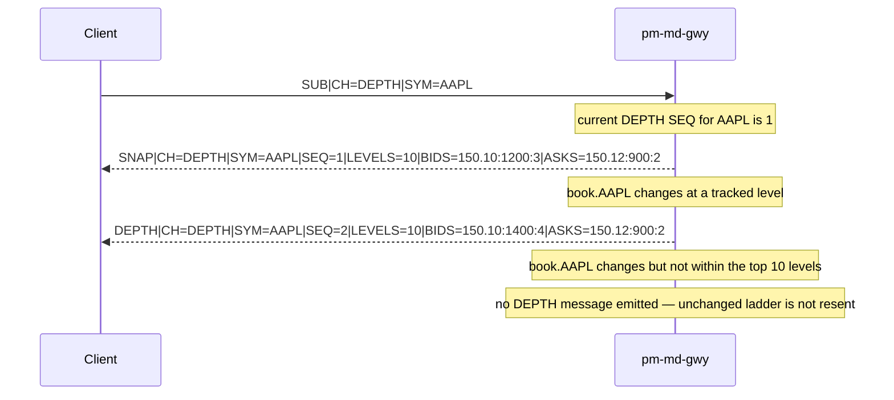
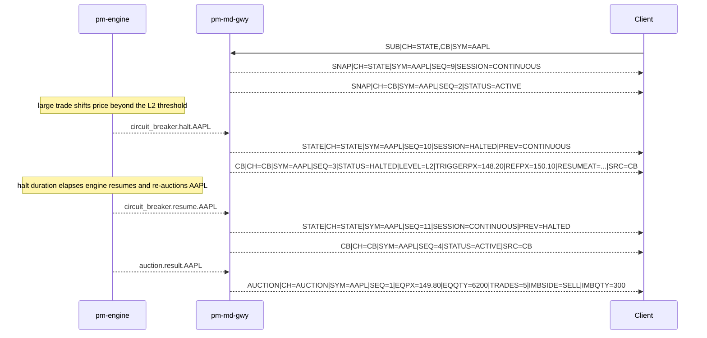
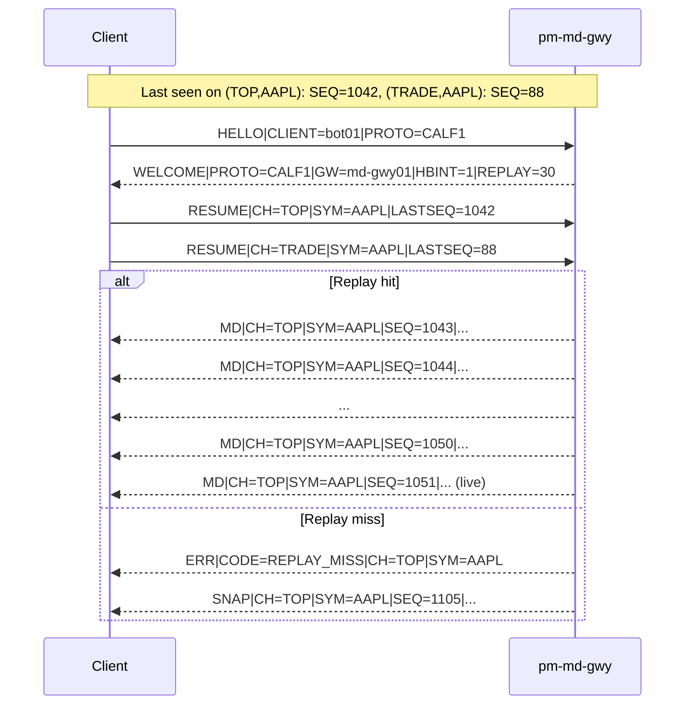
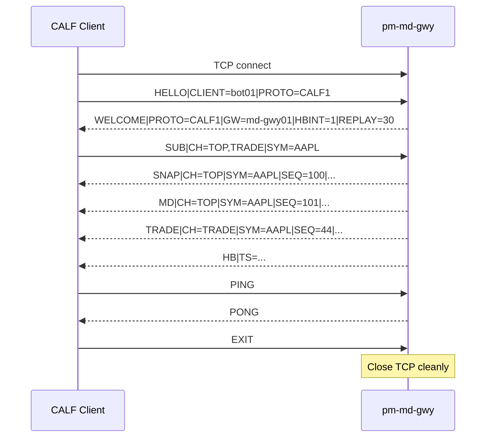

# Appendix: CALF Protocol Reference

> **Status: Normative.** This appendix is the single source of truth for the CALF
> `1.0.0` wire contract as implemented by `pm-md-gwy` (`md_gateway/`). For an
> operational, tutorial-style guide see [Market Data Feed (CALF)](240-calf-gateway.md);
> for the gateway's configuration block see
> [Engine Config Specification §6.3](990-app-config-spec.md#63-market_data_gateway-pm-md-gwy-calf).
> The key words MUST, MUST NOT, SHOULD, and MAY are used per RFC 2119.


## What CALF is

**CALF** stands for **Channel ALF**.

CALF is EduMatcher's text market-data protocol. It is designed for educational
clarity and bot usability: human-readable on the wire, easy to debug in a
terminal, and strict enough to support deterministic clients.

CALF complements the other application protocols:

| Protocol | Purpose                                       |
|----------|-----------------------------------------------|
| ALF      | Text order entry (interactive)                |
| BALF     | Binary order entry (low-latency programmatic) |
| CALF     | Channelized text market data                  |

This appendix is the **normative reference** for CALF `1.0.0` semantics.


## Scope & conformance

CALF is the external market-data protocol exposed by `pm-md-gwy`. The gateway
subscribes to internal engine PUB topics and translates them into CALF lines
for TCP clients.

This appendix specifies the **client-visible CALF protocol**. It does not
specify internal engine message schemas beyond what is needed to explain CALF
behavior.

### Supported in CALF `1.0.0`

- top-of-book updates (`MD`) by symbol
- trade prints (`TRADE`) by symbol
- state transitions (`STATE`) for session-wide and symbol-level changes
- index level updates (`IDX`) from `pm-index`
- aggregated multi-level order book updates (`DEPTH`) — Level 2, not
  order-by-order
- auction uncross results (`AUCTION`) — equilibrium price, matched quantity,
  and imbalance for open/close auctions and circuit-breaker reopening
  auctions
- full circuit-breaker halt/resume detail (`CB`) — trigger price, reference
  price, ladder level, auto-resume time, and halt cause, alongside the
  coarse `STATE` transition
- point-in-time stream baselines (`SNAP`) for `TOP`, `STATE`, `INDEX`,
  `DEPTH`, and `CB`
- per-stream sequence numbers on `(CH, SYM)`
- `SYM=*` wildcard subscriptions for `STATE`, `TOP`, `TRADE`, and `AUCTION`
- bounded replay on reconnect (`RESUME` + `LASTSEQ`)
- heartbeat and liveness signaling
- gateway capability advertisement via `WELCOME|CH_SUPPORTED=`

### Out of scope in CALF `1.0.0`

- full order-by-order (Level 3) market data — `DEPTH` is Level 2
  (aggregated per price level), never per-order
- `SYM=*` for `INDEX`, `DEPTH`, or `CB`
- multicast / UDP transport
- entitlement matrix per field
- durable historical replay from disk
- protocol-layer authentication token


## Transport and session model

| Property | Value |
|---|---|
| Transport | TCP |
| Default port | `5570` |
| Encoding | UTF-8 line protocol |
| Delimiter | `\n` |
| Max line length | 4096 bytes including newline |

A CALF client connection is long-lived.

- Client must send `HELLO` within 5 seconds of TCP connect.
- Gateway replies with `WELCOME` on success.
- Client may then send `SUB`, `RESUME`, `UNSUB`, `SYMBOLS`, `PING`, and `EXIT`.
- Gateway streams `SNAP`, `MD`, `TRADE`, `STATE`, `IDX`, `DEPTH`, `AUCTION`,
  `CB`, `HB`, and `ERR`.

If no `HELLO` is received within 5 seconds, the gateway closes the socket.


## Wire format

### Line structure

Every CALF message is one line:

```text
<MSGTYPE>|KEY=VALUE|KEY=VALUE|...\n
```

`MSGTYPE` is the first token and is always uppercase ASCII.

Examples:

```text
HELLO|CLIENT=bot01|PROTO=CALF1
TRADE|CH=TRADE|SYM=AAPL|SEQ=809|TS=2026-06-07T10:16:00.141Z|PX=150.12|QTY=200|SIDE=BUY
```

### Parsing behavior

- Messages are delimited by newline (`\n`).
- `\r\n` from clients is accepted for robustness.
- Field order after `MSGTYPE` is not significant.
- Unknown keys are ignored unless needed for validating a specific message.
- Duplicate keys: last occurrence wins.
- Empty lines are invalid and may result in `ERR|CODE=BAD_MESSAGE`.

### TCP stream requirement

TCP is a byte stream, not a message queue.

A receiver must buffer bytes and split by newline. A single `recv()` may
contain half a line, one full line, or many lines.


## Field conventions

### Reserved keys

| Key   | Meaning                                                    |
|-------|-------------------------------------------------------------|
| `CH`  | Logical channel (`TOP`, `TRADE`, `STATE`, `INDEX`, `DEPTH`, `AUCTION`, `CB`) |
| `SYM` | Symbol, index id, or `*` where allowed                       |
| `SEQ` | Sequence number for one `(CH, SYM)` stream                   |
| `TS`  | UTC ISO-8601 timestamp with milliseconds                     |

### Wire value types

| Type          | Wire representation  | Example                    |
|---------------|----------------------|----------------------------|
| Decimal price | Text decimal         | `150.25`                   |
| Integer       | Base-10 text integer | `1200`                     |
| Boolean flag  | `0` or `1`           | `EXC=1`                    |
| Timestamp     | UTC ISO-8601 ms      | `2026-06-07T10:15:23.411Z` |

Optional fields are omitted when not present. Empty required values are invalid.
One optional field pair carries meaning when empty rather than being malformed:
`MD`'s `BID`/`ASK`, where an empty value marks that book side as withdrawn —
see **Withdrawal of a book side** under `MD`.


## Channel model

CALF groups market data into logical channels.

| Channel   | Description                                                | `SYM=*` allowed? |
|-----------|--------------------------------------------------------------|-------------------|
| `TOP`     | Best bid/ask updates and snapshots                           | Yes               |
| `TRADE`   | Trade prints                                                  | Yes               |
| `STATE`   | Session or symbol state transitions                           | Yes               |
| `INDEX`   | Index level updates                                           | No                |
| `DEPTH`   | Aggregated multi-level order book (Level 2)                   | No                |
| `AUCTION` | Auction uncross results (equilibrium price, imbalance)        | Yes               |
| `CB`      | Circuit-breaker halt/resume detail (trigger price, level, ...) | No                |

`SNAP` is a message type, not a channel.

A client does not subscribe to `SNAP` directly. The gateway auto-sends `SNAP`
for new `SUB` requests on `TOP`, `STATE`, `INDEX`, `DEPTH`, and `CB`. `TRADE`
and `AUCTION` have no baseline `SNAP` — only future events are delivered for
those two channels, since neither has a persistent "current value" to
snapshot.

`SYM=*` for `TOP` does not produce a single `SNAP|SYM=*`. Top-of-book has no
meaningful "wildcard" value, so the gateway instead sends one real `SNAP` per
currently known symbol, then live `MD` for any symbol — including ones that
become known only after the `SUB` — via the same wildcard subscription entry.

### Subscription rules

- `SUB` may include multiple channels and symbols separated by commas.
- A multi-value `SUB` applies to the Cartesian product of channels and symbols.
- `SYM=*` is valid when the channel set is a subset of
  `{STATE, TOP, TRADE, AUCTION}`, in any combination. `SYM=*` combined with
  `INDEX`, `DEPTH`, or `CB` — alone or mixed with any other channel in the
  same `SUB` — is invalid.
- A wildcard subscription (`SYM=*`) counts as exactly one entry toward
  `max_symbols_per_client`, not one entry per known symbol.
- Re-subscribing an already active pair is idempotent.
- Maximum symbols per client are enforced by gateway config.
- If any requested `(CH,SYM)` pair is invalid, the gateway rejects the `SUB`
  request with `ERR` and leaves existing subscriptions unchanged.
- For non-`INDEX` channels, a non-wildcard `SYM` is validated against the
  gateway's known instrument list (populated from the engine's configured
  symbols at startup); an unrecognized symbol returns
  `ERR|CODE=INVALID_SYMBOL`. `INDEX` is exempt from this check — index ids
  live in a separate namespace from tradable instrument symbols, so any
  non-empty id is accepted at `SUB` time regardless of whether a matching
  index is actually configured. `AUCTION` and `CB` are not exempt: a
  non-wildcard symbol for either is checked against the same known-instrument
  list as `TOP`/`TRADE`/`STATE`/`DEPTH`.
- If the gateway's known-symbol list itself is empty (for example, engine
  config failed to load additional symbol metadata at gateway startup),
  known-symbol validation is skipped entirely and any non-wildcard symbol is
  accepted; this is a permissive fallback, not a documented steady-state
  mode, and operators should treat an empty known-symbol list as a
  configuration problem to fix rather than relied-upon behavior.

`DEPTH` and `CB` disallow `SYM=*` deliberately, not as an oversight: `DEPTH`
messages carry up to `2 x depth_levels` price levels each, so a wildcard
subscription could multiply one client's outbound bandwidth by the entire
symbol count; `CB` halts/resumes are rare, per-symbol operator-relevant
events rather than a firehose use case. `AUCTION`, by contrast, allows
`SYM=*`: auction events are extremely low frequency (at most a handful per
symbol per trading day), so a wildcard subscription poses none of `DEPTH`'s
bandwidth risk, and — like `TRADE` — `AUCTION` has no baseline `SNAP` to
burst per symbol on subscribe.

```text
SUB|CH=TOP,TRADE|SYM=AAPL,MSFT
SUB|CH=STATE|SYM=*
SUB|CH=TRADE|SYM=*
SUB|CH=TOP,TRADE,STATE|SYM=*
SUB|CH=DEPTH|SYM=AAPL
SUB|CH=AUCTION|SYM=*
SUB|CH=CB|SYM=AAPL
```


## Message catalog

### Session control messages

| Message   | Direction         | Purpose                                      |
|-----------|-------------------|----------------------------------------------|
| `HELLO`   | Client -> Gateway | Start session                                |
| `WELCOME` | Gateway -> Client | Confirm session and advertise parameters     |
| `SUB`     | Client -> Gateway | Add subscriptions                            |
| `RESUME`  | Client -> Gateway | Replay one stream from a known sequence      |
| `UNSUB`   | Client -> Gateway | Remove subscriptions                         |
| `SYMBOLS` | Both directions   | Request, and reply with, the instrument universe |
| `PING`    | Client -> Gateway | Liveness probe                               |
| `PONG`    | Gateway -> Client | Probe reply                                  |
| `HB`      | Gateway -> Client | Heartbeat when quiet                         |
| `ERR`     | Gateway -> Client | Protocol or flow error                       |
| `EXIT`    | Client -> Gateway | Clean disconnect                             |

### Market-data messages

| Message   | Direction         | Purpose                               |
|-----------|-------------------|---------------------------------------|
| `SNAP`    | Gateway -> Client | Point-in-time baseline for one stream |
| `MD`      | Gateway -> Client | Incremental top-of-book update        |
| `TRADE`   | Gateway -> Client | Trade print                           |
| `STATE`   | Gateway -> Client | Session/symbol state transition       |
| `IDX`     | Gateway -> Client | Index level update                    |
| `DEPTH`   | Gateway -> Client | Incremental multi-level order book update |
| `AUCTION` | Gateway -> Client | Auction uncross result                |
| `CB`      | Gateway -> Client | Circuit-breaker halt/resume detail    |


## Message definitions

### `HELLO`

**Direction:** Client -> Gateway

**Purpose:** Session handshake.

**Response:** `WELCOME` on successful handshake, or `ERR|CODE=PROTO_MISMATCH`
(connection closed) if `CLIENT`/`PROTO` fail validation.

| Field    | Req | Description                     |
|----------|-----|---------------------------------|
| `CLIENT` | Yes | Client ID (ASCII, max 32 chars) |
| `PROTO`  | Yes | Must be `CALF1`                 |

Validation rules:

- Messages other than `HELLO` sent before successful handshake receive
  `ERR|CODE=AUTH_REQUIRED`.
- `HELLO` is only accepted while a session is unauthenticated. A second
  `HELLO` on an established session receives `ERR|CODE=BAD_MESSAGE`.

```text
HELLO|CLIENT=bot01|PROTO=CALF1
```

> **Changed:** replay is no longer requested through a `RESUME=1` flag on
> `HELLO`. Because `HELLO` is only ever processed once per connection, that
> form could resume a single stream and no more — leaving any client that
> follows several streams, which is most of them, unable to recover the rest
> after a reconnect. Replay now has its own repeatable
> [`RESUME`](#resume) command, sent after the handshake.

### `WELCOME`

**Direction:** Gateway -> Client

| Field          | Req | Description                          |
|----------------|-----|---------------------------------------|
| `PROTO`        | Yes | Echoes negotiated protocol           |
| `GW`           | Yes | Gateway instance name                |
| `HBINT`        | Yes | Heartbeat interval in seconds        |
| `REPLAY`       | Yes | Replay window in seconds             |
| `SYMBOLS`      | No  | Comma-separated snapshot of instrument symbols known to the gateway at connect time. Omitted when the gateway has no known symbols yet. The known-symbol set can grow after `WELCOME` is sent, as new `book.{SYMBOL}`/trade events arrive from the engine — this field is a point-in-time snapshot, not a fixed universe, and a symbol absent here may still become subscribable later without a new `WELCOME`. |
| `REF`          | No  | Per-symbol reference data as `SYM:DEC` tuples, where `DEC` is the instrument's display precision (`tick_decimals`). Covers exactly the symbols listed in `SYMBOLS=`, and is omitted whenever that field is. Absent entirely from gateways predating CALF `1.1.0` — a client detects support by its presence, not by `PROTO`, and falls back to `2` decimals when it is missing. |
| `CH_SUPPORTED` | No  | Comma-separated list of channels this gateway build supports. Present on every CALF `1.0.0`+ gateway; omitted entirely by earlier gateways. A client uses its presence — not the `PROTO` value, which does not change — to detect whether `DEPTH`/`INDEX` and the `SYM=*` wildcard extension are available. |

```text
WELCOME|PROTO=CALF1|GW=md-gwy01|HBINT=1|REPLAY=30|SYMBOLS=AAPL,MSFT|CH_SUPPORTED=AUCTION,CB,DEPTH,INDEX,STATE,TOP,TRADE|REF=AAPL:2,MSFT:4
```

A client that receives no `CH_SUPPORTED` field must assume only `TOP`,
`TRADE`, and `STATE` are available and must not rely on `SYM=*` for `TOP`/
`TRADE`, `INDEX`, or `DEPTH` without first probing with `SUB` and handling a
possible `ERR|CODE=INVALID_CHANNEL`/`INVALID_SYMBOL` response.

### `SUB`

**Direction:** Client -> Gateway

| Field | Req | Description                                                        |
|-------|-----|----------------------------------------------------------------------|
| `CH`  | Yes | Comma-separated channels                                            |
| `SYM` | Yes | Comma-separated symbols (`*` only when `CH` is a subset of `{STATE, TOP, TRADE, AUCTION}`) |

**Response semantics:**

- No explicit ACK.
- New `TOP`/`STATE`/`INDEX`/`DEPTH`/`CB` subscriptions trigger `SNAP`. A
  wildcard `TOP` subscription (`SYM=*`) triggers one real `SNAP` per
  currently known symbol, never a single `SNAP` with a literal `SYM=*`.
- `TRADE` and `AUCTION` subscriptions do not have a baseline `SNAP`; only
  future events are sent for those two channels.
- Invalid requests return `ERR`.
- Existing successful subscriptions remain active when a later `SUB` request is invalid.

```text
SUB|CH=TOP,TRADE|SYM=AAPL,MSFT
SUB|CH=STATE|SYM=*
SUB|CH=TRADE|SYM=*
SUB|CH=DEPTH|SYM=AAPL
SUB|CH=AUCTION|SYM=*
SUB|CH=CB|SYM=AAPL
```

### `RESUME`

**Direction:** Client -> Gateway

**Purpose:** Subscribe to one stream and replay what was missed since
`LASTSEQ`, instead of starting from a `SNAP`.

**Response:** replayed events in sequence order, or `ERR|CODE=REPLAY_MISS`
when the gap is wider than the replay window. On the snapshot-backed channels
(`TOP`, `STATE`, `INDEX`, `DEPTH`, `CB`) a fresh `SNAP` follows that error; on
`TRADE` and `AUCTION` it does not, because a past print has no current state to
snapshot. See "Reconnect behavior" below.

| Field     | Req | Description                                      |
|-----------|-----|--------------------------------------------------|
| `CH`      | Yes | Exactly one channel                               |
| `SYM`     | Yes | Exactly one concrete symbol; `SYM=*` is invalid   |
| `LASTSEQ` | Yes | Last sequence the client received on that stream  |

Send one `RESUME` per stream being recovered. Unlike `SUB`, this message
takes no comma-separated lists: `LASTSEQ` describes a single stream's
position, so a multi-stream `RESUME` would have no coherent meaning.

```text
RESUME|CH=TOP|SYM=AAPL|LASTSEQ=1042
RESUME|CH=TRADE|SYM=AAPL|LASTSEQ=88
RESUME|CH=DEPTH|SYM=MSFT|LASTSEQ=310
```

Validation rules:

- `CH` or `SYM` carrying more than one value is `ERR|CODE=BAD_MESSAGE`.
- A missing or non-positive `LASTSEQ` is `ERR|CODE=BAD_MESSAGE`.
- An unknown channel is `ERR|CODE=INVALID_CHANNEL`.
- `SYM=*` is `ERR|CODE=INVALID_SYMBOL` on every channel — see
  "Reconnect behavior".

All of these leave the session open. A client recovering several streams
sends several `RESUME` messages, and one bad request must not cost it the
others; only handshake-level failures close a connection.

### `SYMBOLS`

**Direction:** Client -> Gateway (request), Gateway -> Client (reply)

**Purpose:** Ask which instruments this gateway knows about.

The request carries no fields:

```text
SYMBOLS
```

The reply:

| Field     | Req | Description                                              |
|-----------|-----|----------------------------------------------------------|
| `COUNT`   | Yes | How many symbols are known; `0` is a valid answer         |
| `SYMBOLS` | No  | Comma-separated symbols, sorted; omitted when `COUNT=0`   |
| `REF`     | No  | Per-symbol `SYM:DEC` display precision; same set as `SYMBOLS`, omitted alongside it |

```text
SYMBOLS|COUNT=3|SYMBOLS=AAPL,MSFT,TSLA|REF=AAPL:2,MSFT:2,TSLA:4
SYMBOLS|COUNT=0
```

Read `COUNT`, not the presence of `SYMBOLS`. An empty universe omits the field
rather than sending it empty, so the two must not be conflated with a
malformed reply.

**Why this exists, given `WELCOME|SYMBOLS=`.** That field is optional, sent
once, and omitted entirely when the gateway was started without a readable
engine config — a misconfiguration that otherwise looks, from the client side,
exactly like an exchange with no instruments. The gateway's set also *grows*
as symbols first appear on the engine bus, so a client that connected before a
given instrument traded could not learn of it without reconnecting. `SYMBOLS`
makes the universe both askable and refreshable.

Repeatable at any time. A client that needs the universe up front should send
it immediately after `WELCOME` rather than depending on the handshake field.

#### `REF` — per-symbol display precision

`REF` answers "how many decimal places does this instrument quote in?", which
a client otherwise has no way to discover. The only other source is
`GET /api/symbols` on the API gateway, which requires a *trading* credential —
something a market data consumer has no business holding — so before this field
existed every CALF client had to assume the default of `2` and was quietly
wrong about any instrument configured otherwise.

```text
REF=AAPL:2,MSFT:2,TSLA:4
```

Three properties are deliberate:

- **It is reference data, not market data.** `tick_decimals` never changes for
  a symbol, so it rides the handshake and this reply rather than `TOP` or
  `TRADE`. Repeating a constant on every tick would be exactly what `MD`'s
  delta encoding exists to avoid.
- **Its presence is the capability signal.** Like `CH_SUPPORTED`, and for the
  same reason: `PROTO` stays `CALF1`. A client seeing no `REF` falls back to
  `2` *knowingly* rather than by accident.
- **The tuple has room to grow.** `SYM:DEC` reuses the colon-delimited grammar
  `DEPTH` already uses for `price:qty:count`, and extends to
  `SYM:DEC:MULT:CCY` as further reference fields are defined — without another
  protocol change. Clients must ignore trailing components they do not
  recognise rather than treating the entry as malformed.

Every symbol in `SYMBOLS` appears in `REF`, so a client never has to reason
about one being listed in one field and missing from the other. A symbol first
seen on the engine bus, which has no configured precision, is reported at the
default rather than omitted.

### `UNSUB`

**Direction:** Client -> Gateway

| Field | Req | Description              |
|-------|-----|--------------------------|
| `CH`  | Yes | Comma-separated channels |
| `SYM` | Yes | Comma-separated symbols  |

`UNSUB` is idempotent. Removing a non-existent `(CH,SYM)` pair has no effect.

```text
UNSUB|CH=TOP|SYM=AAPL
```

### `SNAP`

**Direction:** Gateway -> Client

**Purpose:** Baseline for one stream.

`SNAP` uses channel-specific payload fields.

Common fields:

| Field | Req | Description                              |
|-------|-----|--------------------------------------------|
| `CH`  | Yes | `TOP`, `STATE`, `INDEX`, `DEPTH`, or `CB`  |
| `SYM` | Yes | Symbol, index id, or `*` for session state |
| `SEQ` | Yes | Current stream sequence                    |
| `TS`  | Yes | Snapshot timestamp                         |

`CH=TOP` fields:

| Field    | Req | Description      |
|----------|-----|------------------|
| `BID`    | No  | Best bid price   |
| `BIDSZ`  | No  | Best bid size    |
| `ASK`    | No  | Best ask price   |
| `ASKSZ`  | No  | Best ask size    |
| `LAST`   | No  | Last trade price |
| `LASTSZ` | No  | Last trade size  |

A `SUB|CH=TOP|SYM=*` never produces a `SNAP` with a literal `SYM=*` — see
"Channel model" above. Each `SNAP` in the resulting burst has a real `SYM`
and uses that symbol's own `(TOP, SYM)` sequence.

`CH=STATE` fields:

| Field     | Req | Description         |
|-----------|-----|---------------------|
| `SESSION` | Yes | Current state value |

`CH=INDEX` fields: identical field set to the `IDX` message — see that
section below. Since CALF `1.0.0`, `SUB|CH=INDEX` sends a baseline `SNAP`
before any live `IDX` updates, the same as `TOP`/`STATE`/`DEPTH`.

`CH=DEPTH` fields: identical field set to the `DEPTH` message — see that
section below. `BIDS`/`ASKS` are omitted entirely (not sent as empty
strings) when a symbol's book has no resting orders on that side yet.

`CH=CB` fields: identical field set to the `CB` message — see that section
below. Reflects the **last known** circuit-breaker status for the symbol —
`STATUS=ACTIVE` with no further fields if the symbol has never halted.

`TRADE`/`AUCTION` stream note:

- Neither `CH=TRADE` nor `CH=AUCTION` has a `SNAP` variant in CALF `1.0.0` —
  both are pure event streams with no persistent "current value."
- Delivery for both starts from events that occur after the subscription is
  active (plus any replay via `RESUME`, see "Sequence and recovery
  semantics").

```text
SNAP|CH=TOP|SYM=AAPL|SEQ=100|TS=2026-06-07T10:16:00.000Z|BID=150.10|BIDSZ=1200|ASK=150.12|ASKSZ=900|LAST=150.11|LASTSZ=300
SNAP|CH=STATE|SYM=*|SEQ=5|TS=2026-06-07T10:16:00.000Z|SESSION=CONTINUOUS
SNAP|CH=INDEX|SYM=EDU100|SEQ=42|TS=2026-06-12T10:15:23.000Z|LEVEL=1048.73|OPEN=1042.10|HIGH=1056.30|LOW=1040.05|SESSION=CONTINUOUS
SNAP|CH=DEPTH|SYM=AAPL|SEQ=1|TS=2026-07-11T14:32:00.000Z|LEVELS=10|BIDS=150.10:1200:3,150.09:800:2|ASKS=150.12:900:2,150.13:600:1
SNAP|CH=CB|SYM=AAPL|SEQ=3|TS=2026-07-20T14:05:00.000Z|STATUS=HALTED|LEVEL=L2|TRIGGERPX=148.20|REFPX=150.10|RESUMEAT=2026-07-20T15:20:00.000Z|SRC=CB
SNAP|CH=CB|SYM=MSFT|SEQ=1|TS=2026-07-20T14:05:00.000Z|STATUS=ACTIVE
```

### `MD`

**Direction:** Gateway -> Client

**Purpose:** Incremental `TOP` update. Unchanged sides may be omitted.

| Field    | Req | Description                                                        |
|----------|-----|--------------------------------------------------------------------|
| `CH`     | Yes | `TOP`                                                              |
| `SYM`    | Yes | Symbol                                                             |
| `SEQ`    | Yes | Stream sequence                                                    |
| `TS`     | Yes | Event timestamp                                                    |
| `BID`    | No  | Updated bid; **empty value means the bid side is now empty**       |
| `BIDSZ`  | No  | Updated bid size                                                   |
| `ASK`    | No  | Updated ask; **empty value means the ask side is now empty**       |
| `ASKSZ`  | No  | Updated ask size                                                   |
| `LAST`   | No  | Updated last trade price                                           |
| `LASTSZ` | No  | Updated last trade size                                            |

```text
MD|CH=TOP|SYM=AAPL|SEQ=1051|TS=2026-06-07T10:16:00.115Z|BID=150.11|BIDSZ=1400|ASK=150.13|ASKSZ=800
```

#### Withdrawal of a book side

`BID` and `ASK` have three distinct states on an `MD`, and a client must treat
them differently:

| On the wire | Meaning                                          |
|-------------|--------------------------------------------------|
| `BID=150.11`| New value for this side                          |
| `BID=`      | This side is now **empty** — discard the price    |
| *(absent)*  | Unchanged since the previous message              |

An empty value is the *only* way the gateway can say "there is no bid". This
is the one documented exception to **Wire value types** above: `BID`/`ASK` are
optional fields, and for these two an empty value is meaningful rather than
malformed.

```text
MD|CH=TOP|SYM=AAPL|SEQ=1052|TS=2026-06-07T10:16:00.210Z|BID=|BIDSZ=0
```

A client that treats a withdrawal as "unchanged" will display the last known
price indefinitely, and will disagree with any client that reconnects and
receives a fresh `SNAP` — which omits the side correctly. Merging code must
therefore *remove* the field on an empty value, not overwrite it.

`LAST`/`LASTSZ` are never withdrawn: once a symbol has traded, its last price
persists for the session, so an empty value is not valid for those fields.

#### `LAST` after a trade

A trade updates `LAST`/`LASTSZ` on the `TOP` channel as well as producing a
`TRADE` message. The two arrive at different times and neither replaces the
other:

| Channel | Carries | When |
|---------|---------|------|
| `TRADE` | Every individual print (`PX`, `QTY`, `SIDE`) | Immediately, one message per trade |
| `TOP`   | The latest price only (`LAST`, `LASTSZ`)      | With the next book republish, throttled by the engine's `snapshot_interval_sec` |

A client that wants every print subscribes to `TRADE`; a client that only wants
"what did this last trade at" can rely on `TOP` alone, including its `SNAP`
baseline. Several trades inside one throttle window collapse to the latest
price on `TOP` — that is the intended behaviour, not a dropped update.

A `SNAP` reports a trade immediately, without waiting for the next book
republish, so a client subscribing between the two is not handed a stale
price. Gateway builds before this was fixed suppressed `LAST` from the
following `MD` entirely, leaving a continuously-connected client on the price
baked into its original `SNAP` while a reconnecting client saw the true value.

### `TRADE`

**Direction:** Gateway -> Client

| Field  | Req | Description                      |
|--------|-----|----------------------------------|
| `CH`   | Yes | `TRADE`                          |
| `SYM`  | Yes | Symbol                           |
| `SEQ`  | Yes | Stream sequence                  |
| `TS`   | Yes | Trade timestamp                  |
| `PX`   | Yes | Trade price                      |
| `QTY`  | Yes | Trade quantity                   |
| `SIDE` | Yes | Aggressor side (`BUY` or `SELL`) |

```text
TRADE|CH=TRADE|SYM=AAPL|SEQ=809|TS=2026-06-07T10:16:00.141Z|PX=150.12|QTY=200|SIDE=BUY
```

### `STATE`

**Direction:** Gateway -> Client

| Field     | Req | Description               |
|-----------|-----|---------------------------|
| `CH`      | Yes | `STATE`                   |
| `SYM`     | Yes | Symbol or `*`             |
| `SEQ`     | Yes | Stream sequence           |
| `TS`      | Yes | Transition timestamp      |
| `SESSION` | Yes | New state value           |
| `PREV`    | No  | Previous state when known |

Valid `SESSION` values:

- `PRE_OPEN`
- `OPENING_AUCTION`
- `CONTINUOUS`
- `CLOSING_AUCTION`
- `CLOSED`
- `HALTED` (symbol-level)

```text
STATE|CH=STATE|SYM=*|SEQ=14|TS=2026-06-07T10:30:00.000Z|SESSION=CONTINUOUS|PREV=OPENING_AUCTION
STATE|CH=STATE|SYM=AAPL|SEQ=8|TS=2026-06-07T10:30:00.000Z|SESSION=CONTINUOUS|PREV=OPENING_AUCTION
STATE|CH=STATE|SYM=AAPL|SEQ=9|TS=2026-06-07T11:02:17.330Z|SESSION=HALTED|PREV=CONTINUOUS
```

**An exchange transition is published twice: once as `SYM=*`, and once per
symbol.** A subscription matches on `SYM=*` *or* an exact symbol, so a client
that subscribed to one instrument would otherwise see its halts and resumes
but never the session around them — it would not learn the exchange had
opened or closed. Wildcard subscribers receive both forms; that is
deliberate, and the `SYM=*` line remains the authoritative exchange-level
event.

A symbol that is halted is **not** moved by an exchange transition. Its halt
outlives the phase it began in, and the engine publishes an explicit resume
when it ends.

A resume returns the symbol to whatever the exchange is doing *at that
moment*, which is not necessarily `CONTINUOUS`. Circuit-breaker halts expire
on elapsed time with no session check, so an L2 halt — 15 minutes by default
— triggered shortly before the close resumes into `CLOSING_AUCTION` or
`CLOSED`.

### `IDX`

**Direction:** Gateway -> Client

**Purpose:** Index level update for one `INDEX` stream.

| Field     | Req | Description                                          |
|-----------|-----|------------------------------------------------------|
| `CH`      | Yes | `INDEX`                                              |
| `SYM`     | Yes | Index identifier (e.g. `EDU50`)                      |
| `SEQ`     | Yes | Stream-local sequence number                         |
| `TS`      | Yes | Event timestamp                                      |
| `LEVEL`   | Yes | Current index level, decimal string                  |
| `SESSION` | Yes | Index session state                                  |
| `OPEN`    | No  | Day open level, decimal string                       |
| `HIGH`    | No  | Day high, decimal string                             |
| `LOW`     | No  | Day low, decimal string                              |
| `CHG`     | No  | Change from open, signed decimal e.g. `+1.23`        |
| `PCTCHG`  | No  | Percent change from open, signed e.g. `+0.45`        |
| `AGGCAP`  | No  | Aggregate market cap, integer string                 |

`IDX` has no baseline `SNAP` variant in CALF `1.0.0`. Delivery starts from
events that occur after the subscription becomes active.

```text
IDX|CH=INDEX|SYM=EDU50|SEQ=12|TS=2026-06-07T10:16:00.000Z|LEVEL=5123.45|SESSION=CONTINUOUS|OPEN=5100.00|CHG=+23.45|PCTCHG=+0.46
```

### `DEPTH`

**Direction:** Gateway -> Client

**Purpose:** Aggregated, multi-level order book update — CALF's Level 2
view. Each level is an aggregate of every resting order at that price;
individual order identity is never exposed (Level 3 is explicitly out of
scope, see "Out of scope in CALF 1.0.0" above).

**Response:** No reply required. A gap in `SEQ` should trigger replay or
resync, exactly as for `MD`.

Unlike `MD`, which omits individual unchanged `BID`/`ASK` fields, `DEPTH` is
a **full-ladder replace per message**: whenever the top-`LEVELS` price
levels on either side change, the message carries that side's complete
current ladder, not a per-level diff. `DEPTH` is only sent when the tracked
levels actually changed since the previous `DEPTH`/`SNAP` for the symbol.

| Field    | Req | Description                                                  |
|----------|-----|-----------------------------------------------------------------|
| `CH`     | Yes | `DEPTH`                                                        |
| `SYM`    | Yes | Symbol                                                          |
| `SEQ`    | Yes | Stream sequence for `(DEPTH, SYM)`                              |
| `TS`     | Yes | Event timestamp                                                 |
| `LEVELS` | Yes | Number of price levels per side configured on this gateway (`market_data_gateway.depth_levels`, default `10`) |
| `BIDS`   | No  | Bid-side ladder, best price first; omitted if no resting bids   |
| `ASKS`   | No  | Ask-side ladder, best price first; omitted if no resting asks   |

**Level encoding grammar** (applies to both `BIDS` and `ASKS`):

```text
<LEVELS_VALUE> ::= <LEVEL> ("," <LEVEL>)*
<LEVEL>        ::= <PRICE> ":" <QTY> ":" <COUNT>
```

`PRICE` is decimal text, `QTY` is the aggregated resting quantity at that
price, `COUNT` is the number of individual resting orders aggregated into
it. `:` and `,` are ordinary field-value characters in CALF — the only
reserved wire character is `|`.

```text
DEPTH|CH=DEPTH|SYM=AAPL|SEQ=2|TS=2026-07-11T14:32:00.512Z|LEVELS=10|BIDS=150.10:1400:4,150.09:800:2,150.08:400:1|ASKS=150.12:900:2,150.13:600:1,150.14:250:1
```

`SYM=*` is invalid for `SUB|CH=DEPTH` — see "Subscription rules" above.


```mermaid
sequenceDiagram
    participant C as Client
    participant G as pm-md-gwy

    C->>G: SUB|CH=DEPTH|SYM=AAPL
    Note over G: current DEPTH SEQ for AAPL is 1
    G-->>C: SNAP|CH=DEPTH|SYM=AAPL|SEQ=1|LEVELS=10|BIDS=150.10:1200:3|ASKS=150.12:900:2

    Note over G: book.AAPL changes at a tracked level
    G-->>C: DEPTH|CH=DEPTH|SYM=AAPL|SEQ=2|LEVELS=10|BIDS=150.10:1400:4|ASKS=150.12:900:2

    Note over G: book.AAPL changes but not within the top 10 levels
    Note over G: no DEPTH message emitted — unchanged ladder is not resent
```

### `AUCTION`

**Direction:** Gateway -> Client

**Purpose:** Result of one auction uncross for a symbol — a scheduled
opening/closing auction, a circuit-breaker reopening auction, or the pass
over restored GTC orders at engine startup. Published exactly once per
uncross, even when there was no crossable interest at all.

| Field     | Req | Description                                                                 |
|-----------|-----|--------------------------------------------------------------------------------|
| `CH`      | Yes | `AUCTION`                                                                    |
| `SYM`     | Yes | Symbol                                                                       |
| `SEQ`     | Yes | Stream sequence for `(AUCTION, SYM)`                                        |
| `TS`      | Yes | Event timestamp                                                              |
| `EQPX`    | No  | Equilibrium price; omitted when there was no crossable interest              |
| `EQQTY`   | Yes | Total executable quantity matched at `EQPX` (`0` when no cross)             |
| `TRADES`  | Yes | Number of trades produced by the uncross (`0` when no cross)                |
| `IMBSIDE` | No  | Residual imbalance side, `BUY` or `SELL`; omitted when balanced or no cross |
| `IMBQTY`  | Yes | Residual imbalance quantity at `EQPX` (`0` when balanced or no cross)       |
| `REASON`  | No  | Which uncross this was: `SCHEDULED` (leaving an auction or other non-matching phase), `REOPEN` (a halted symbol reopening) or `RECOVERY` (restored GTC orders at engine startup) |

Without `REASON` the three are indistinguishable — the fields are otherwise
identical — so a client cannot tell a circuit-breaker reopening from the
closing auction. Treat an unrecognised value as absent rather than as an
error: it means a gateway newer than the client.

`AUCTION` has no baseline `SNAP` (see "Channel model" above) — a new
subscriber only receives auction results from the next uncross onward,
unless it also uses `RESUME` to replay recent history.

```text
AUCTION|CH=AUCTION|SYM=AAPL|SEQ=1|TS=2026-07-20T13:30:00.012Z|EQPX=150.10|EQQTY=48200|TRADES=37|IMBSIDE=BUY|IMBQTY=1400
AUCTION|CH=AUCTION|SYM=TSLA|SEQ=4|TS=2026-07-20T20:00:00.004Z|EQQTY=0|TRADES=0|IMBQTY=0
AUCTION|CH=AUCTION|SYM=MSFT|SEQ=2|TS=2026-07-20T13:30:00.031Z|EQPX=421.00|EQQTY=15000|TRADES=12|IMBQTY=0
```

The second example is a no-cross auction (`EQPX`/`IMBSIDE` both omitted, all
counts `0`); the third is a perfectly balanced cross (`IMBSIDE` omitted,
`IMBQTY=0`, but `EQPX`/`EQQTY`/`TRADES` all present).

### `CB`

**Direction:** Gateway -> Client

**Purpose:** Full circuit-breaker halt/resume detail for one symbol —
trigger price, reference price, ladder level, scheduled auto-resume time,
and what caused the halt. `STATE` (above) still carries the coarse
`SESSION=HALTED`/`SESSION=CONTINUOUS` transition unchanged; `CB` is emitted
**alongside** `STATE`, from the same underlying engine event, for clients
that also want the detail.

| Field       | Req | Description                                                                            |
|-------------|-----|---------------------------------------------------------------------------------------------|
| `CH`        | Yes | `CB`                                                                                     |
| `SYM`       | Yes | Symbol                                                                                   |
| `SEQ`       | Yes | Stream sequence for `(CB, SYM)`                                                          |
| `TS`        | Yes | Event timestamp                                                                          |
| `STATUS`    | Yes | `ACTIVE` (not halted) or `HALTED`                                                        |
| `LEVEL`     | No  | Ladder level (e.g. `L1`/`L2`/`L3`, config-defined) or `ADMIN_ALL`/`ADMIN_SYMBOL` for an operator-initiated halt; present only when `STATUS=HALTED` |
| `TRIGGERPX` | No  | Trigger price; present only for an automatic (non-`ADMIN_*`) halt currently in effect    |
| `REFPX`     | No  | Reference price at trigger time; present only for an automatic halt currently in effect  |
| `RESUMEAT`  | No  | Scheduled auto-resume time, UTC ISO-8601 with ms (same format as `TS`); present only for a timed halt currently in effect — absent for rest-of-day or manual/`ADMIN_*` halts |
| `SRC`       | No  | What halted the symbol: `CB` for an automatic breaker trigger, `ADMIN` for an operator halt |
| `CORRLO`    | No  | Lower bound of the ACE reopening corridor; present only while `STATUS=HALTED` and ACE is enabled for the symbol |
| `CORRHI`    | No  | Upper bound of the same corridor                                                          |
| `EXP`       | No  | Number of ACE extensions consumed so far. `0` on the initial halt                        |
| `INDICPX`   | No  | Indicative uncross price observed at the end of a call phase. Extension events only      |
| `INDICQTY`  | No  | Quantity that would have executed at `INDICPX`. Extension events only                    |
| `IMB`       | No  | `BUY` or `SELL` — which side the imbalance ran. Extension events only                    |
| `REASON`    | No  | `CLOSING_BACKSTOP` when the resume was forced by the end of the trading day. Resume events only |
| `CLAMPED`   | No  | `1` when the backstop printed *at* the corridor boundary rather than at the equilibrium. Resume events only |
| `PRINTPX`   | No  | The price the backstop printed at. Resume events only                                     |

`LEVEL`/`TRIGGERPX`/`REFPX`/`RESUMEAT`/`CORRLO`/`CORRHI`/`EXP` describe the
halt that just ended and are always omitted on a resume event
(`STATUS=ACTIVE`) — only `SRC` carries over, since what caused the halt is
meaningful on the way out as well as in.

#### ACE corridor expansions

A halt does not necessarily end when `RESUMEAT` arrives. If the indicative
uncross price falls outside `[CORRLO, CORRHI]`, the symbol stays halted, the
corridor widens by one ladder rung and a fresh call phase begins — see
[Risk Controls - Automated Corridor Expansion](120-risk-controls.md#automated-corridor-expansion-ace).

The gateway publishes this as a further `CB` event with `STATUS=HALTED` and an
updated `RESUMEAT`, `CORRLO`, `CORRHI` and `EXP`. **A client that ignores these
will show a `RESUMEAT` that has already passed and report the symbol as overdue
to reopen.** No `STATE` event accompanies an extension: the symbol was halted
before and is halted after, so the coarse session state has not changed.

`INDICPX`/`INDICQTY`/`IMB` are carried on extension events only. They are
computed once, at the instant the call phase ends, so they are deliberately
absent from the `SNAP` baseline — replaying them later would assert a stale
price for a book that has kept moving. Disseminating them at all mirrors the
order-imbalance indicator real venues publish during a reopening, which is
what lets participants supply the offsetting interest that resolves the halt.

`CORRLO`/`CORRHI`/`EXP` *are* part of the `SNAP` baseline, because they
describe the halt still in force: a client subscribing mid-halt otherwise
cannot tell where the symbol is permitted to reopen.

**A halt is a reopening auction's call phase.** While a symbol is halted the
engine accepts LIMIT orders and rests them, rejects MARKET/FOK/IOC, and runs
no matching; when the halt ends it uncrosses at the equilibrium price and
publishes an `AUCTION` with `REASON=REOPEN` before the `STATE` and `CB`
resume events. There is no separate "resumption mode" to choose, and CALF no
longer carries one: crossed interest accumulates during the call, so
restarting continuous matching without an uncross would begin on a crossed
book. `RESUMEAT` says whether the halt ends by itself; `SRC` says who
started it. The two are independent.

`CB` has a baseline `SNAP` (see the `SNAP` section above) reflecting the
last known status for the symbol.

```text
CB|CH=CB|SYM=AAPL|SEQ=4|TS=2026-07-20T14:05:00.010Z|STATUS=HALTED|LEVEL=L2|TRIGGERPX=148.20|REFPX=150.10|RESUMEAT=2026-07-20T15:20:00.000Z|SRC=CB
CB|CH=CB|SYM=TSLA|SEQ=1|TS=2026-07-20T15:00:00.000Z|STATUS=HALTED|LEVEL=ADMIN_ALL|SRC=ADMIN
CB|CH=CB|SYM=AAPL|SEQ=5|TS=2026-07-20T14:20:00.010Z|STATUS=ACTIVE|SRC=CB
```

An ACE sequence — halt, one extension, then a reopen inside the widened
corridor:

```text
CB|CH=CB|SYM=AAPL|SEQ=4|TS=2026-07-20T13:30:00.010Z|STATUS=HALTED|LEVEL=L1|TRIGGERPX=122.00|REFPX=100.00|RESUMEAT=2026-07-20T13:35:00.000Z|CORRLO=90.00|CORRHI=110.00|EXP=0|SRC=CB
CB|CH=CB|SYM=AAPL|SEQ=5|TS=2026-07-20T13:35:00.010Z|STATUS=HALTED|LEVEL=L1|TRIGGERPX=122.00|REFPX=100.00|RESUMEAT=2026-07-20T13:37:00.000Z|CORRLO=80.00|CORRHI=120.00|EXP=1|SRC=CB|INDICPX=122.00|INDICQTY=500|IMB=BUY
CB|CH=CB|SYM=AAPL|SEQ=6|TS=2026-07-20T13:37:00.010Z|STATUS=ACTIVE|SRC=CB
```

And a halt the trading day ended before ACE could resolve, printed at the
corridor boundary rather than at the equilibrium:

```text
CB|CH=CB|SYM=AAPL|SEQ=9|TS=2026-07-20T16:05:00.010Z|STATUS=ACTIVE|SRC=CB|REASON=CLOSING_BACKSTOP|CLAMPED=1|PRINTPX=120.00
```

The first example is an automatic threshold-breach halt (all detail fields
present); the second is an ADMIN exchange-wide halt (`trigger`/`reference`/
`resume` all omitted, matching the engine's `None` values for that path);
the third is the resume that follows the first halt (`STATUS=ACTIVE`, only
`SRC` retained).

`SYM=*` is invalid for `SUB|CH=CB` — see "Subscription rules" above.


```mermaid
sequenceDiagram
    participant E as pm-engine
    participant G as pm-md-gwy
    participant C as Client

    C->>G: SUB|CH=STATE,CB|SYM=AAPL
    G-->>C: SNAP|CH=STATE|SYM=AAPL|SEQ=9|SESSION=CONTINUOUS
    G-->>C: SNAP|CH=CB|SYM=AAPL|SEQ=2|STATUS=ACTIVE

    Note over E: large trade shifts price beyond the L2 threshold
    E-->>G: circuit_breaker.halt.AAPL
    G-->>C: STATE|CH=STATE|SYM=AAPL|SEQ=10|SESSION=HALTED|PREV=CONTINUOUS
    G-->>C: CB|CH=CB|SYM=AAPL|SEQ=3|STATUS=HALTED|LEVEL=L2|TRIGGERPX=148.20|REFPX=150.10|RESUMEAT=...|SRC=CB

    Note over E: halt duration elapses engine resumes and re-auctions AAPL
    E-->>G: circuit_breaker.resume.AAPL
    G-->>C: STATE|CH=STATE|SYM=AAPL|SEQ=11|SESSION=CONTINUOUS|PREV=HALTED
    G-->>C: CB|CH=CB|SYM=AAPL|SEQ=4|STATUS=ACTIVE|SRC=CB
    E-->>G: auction.result.AAPL
    G-->>C: AUCTION|CH=AUCTION|SYM=AAPL|SEQ=1|EQPX=149.80|EQQTY=6200|TRADES=5|IMBSIDE=SELL|IMBQTY=300
```

### `HB`

**Direction:** Gateway -> Client

Sent when no outbound market-data line was emitted during the heartbeat interval.

| Field | Req | Description       |
|-------|-----|-------------------|
| `TS`  | Yes | Gateway timestamp |

```text
HB|TS=2026-06-07T10:16:05.000Z
```

### `PING` / `PONG`

`PING` is client-initiated liveness check. `PONG` is immediate reply.

```text
PING
PONG
```

### `ERR`

**Direction:** Gateway -> Client

| Field  | Req | Description                   |
|--------|-----|-------------------------------|
| `CODE` | Yes | Machine-readable error code   |
| `MSG`  | No  | Human-readable context        |
| `CH`   | No  | Channel context when relevant |
| `SYM`  | No  | Symbol context when relevant  |

Normative error codes:

| Code              | Meaning                                                                          |
|-------------------|---------------------------------------------------------------------------------|
| `PROTO_MISMATCH`  | `HELLO` missing `CLIENT` or `PROTO != CALF1`                                    |
| `AUTH_REQUIRED`   | Non-`HELLO` message sent before successful handshake                            |
| `INVALID_CHANNEL` | `CH` not in `{TOP, TRADE, STATE, INDEX, DEPTH, AUCTION, CB}`                     |
| `INVALID_SYMBOL`  | Symbol not in the gateway's known instrument list (does not apply to `INDEX`, which has no known-id check — see "Subscription rules"), `SYM=*` used with `INDEX`/`DEPTH`/`CB` on `SUB` (alone or mixed with any other channel), `SYM=*` used at all on `RESUME` (every channel, including `TOP`/`TRADE`/`STATE`/`AUCTION`), a `SUB` with no `SYM` at all, or `CH=INDEX` combined with an empty symbol |
| `SUB_LIMIT`       | Subscription would exceed `max_symbols_per_client`                              |
| `REPLAY_MISS`     | `LASTSEQ` is older than the replay window; a `SNAP` follows on `TOP`/`STATE`/`INDEX`/`DEPTH`/`CB`, but not on `TRADE`/`AUCTION` |
| `SLOW_CLIENT`     | Outbound queue exceeded `max_client_queue`; connection closed                   |
| `BAD_MESSAGE`     | Parse failure, oversized line (> 4096 bytes), or unsupported message type       |
| `RATE_LIMITED`    | Client exceeded `max_messages_per_second` (inbound token-bucket); connection stays open |

Terminal behavior:

- `SLOW_CLIENT` is terminal for the current TCP session; gateway disconnects.
- `BAD_MESSAGE` may be terminal when parsing cannot continue safely.
- `RATE_LIMITED` is non-terminal; the offending message is dropped and the
  connection remains open. The client may retry once its send rate is back
  under `max_messages_per_second`.

```text
ERR|CODE=REPLAY_MISS|MSG=Requested sequence outside replay buffer|CH=TOP|SYM=AAPL
```

### `EXIT`

**Direction:** Client -> Gateway

Requests clean disconnect.

```text
EXIT
```


## Sequence and recovery semantics

### Stream identity

Sequence numbers are maintained per `(CH, SYM)` stream.

Examples:

- `(TOP, AAPL)` has its own counter
- `(TRADE, AAPL)` has a different counter
- `(STATE, *)` and `(STATE, AAPL)` are distinct counters

### Sequence rules

- Start value is `1` for each stream.
- Increment by `1` per emitted message in that stream.
- Sequence appears in `SNAP`, `MD`, `TRADE`, `STATE`, `IDX`, `DEPTH`,
  `AUCTION`, and `CB`.
- A client-detected gap means one or more missed messages.

### First connect behavior

On first subscribe to a `TOP`, `STATE`, `INDEX`, `DEPTH`, or `CB` stream:

1. Gateway sends `SNAP` with current stream `SEQ`.
2. Client stores `last_seq[(CH,SYM)] = SNAP.SEQ`.
3. Next incremental event for that stream must be `SEQ + 1`.

`TRADE` and `AUCTION` have no step 1 — see the `SNAP` section above.

### Reconnect behavior (`RESUME`)

`RESUME` applies to one stream per message, and may be sent as many times as
there are streams to recover. Reconnect therefore looks like: `HELLO`, then
one `RESUME` per stream the client was following, then a `SUB` for anything
it wants that it has no sequence position for.

- Client supplies `CH`, `SYM`, and `LASTSEQ`.
- `CH` and `SYM` must each contain exactly one value.
- `LASTSEQ` must be a positive base-10 integer.
- If missing events are inside replay window, gateway replays in order then
  continues live.
- If missing range is outside window, gateway sends `ERR|CODE=REPLAY_MISS`.
  A fresh `SNAP` follows on `TOP`/`STATE`/`INDEX`/`DEPTH`/`CB`. It does **not**
  on `TRADE` or `AUCTION`: those carry discrete events, and there is no
  snapshot of a print that already happened, so the missed events are simply
  gone. Do not wait for a baseline that will not arrive — and if you are
  talking to an older gateway that sends one anyway, discard it: it is an
  envelope with no payload, and a decoder keyed on `CH` alone will read it as
  a print of zero shares at zero price.
- **A `SNAP` re-baselines the stream; it is never a gap.** Whatever `SEQ` it
  carries becomes your new `last_seq` for that stream, with no gap check. Gap
  checking a `SNAP` would ask to replay history it just superseded, and on the
  replay-miss path — whose answer *is* a `SNAP` — loops `RESUME` against a
  window already known to be too old.
- **A replay is not disjoint from live delivery.** `RESUME|LASTSEQ=n` returns
  every buffered message with `SEQ > n`, and `n` is your position from *before*
  the gap — so the reply re-sends the message that revealed the gap, plus
  anything delivered live while your request was in flight. Replayed and live
  lines share one ordered connection, so duplicates always arrive after their
  originals. **Discard any message at or below the `SEQ` you have already
  recorded, and never let one lower your `last_seq`.** Track which sequence
  ranges you are actually missing: that is the only thing distinguishing the
  backfill you asked for from a print you already have.
- If the stream has no retained replay history at all yet (nothing has been
  emitted for that `(CH,SYM)` since the gateway started or the buffer last
  pruned it), the gateway returns zero replay lines and does **not** send
  `ERR|CODE=REPLAY_MISS` or a `SNAP` — the client resumes live from
  whatever the next emitted event turns out to be. This differs from the
  replay-miss case above and is easy to mistake for a silently dropped
  resume; clients that need a guaranteed baseline after `RESUME` should
  also send an explicit `SUB` for the same stream, which always triggers a
  `SNAP` for `TOP`/`STATE`/`INDEX`/`DEPTH`/`CB` regardless of replay state.
- `SYM=*` is always invalid for `RESUME`, for every channel, even for
  `TOP`/`TRADE`/`STATE`/`AUCTION` where `SYM=*` is otherwise allowed on
  `SUB`. `RESUME` has no equivalent of `SUB`'s per-symbol snapshot burst,
  so a wildcard resume cannot be served a meaningful baseline on a replay
  miss. `RESUME|CH=TOP|SYM=*` returns `ERR|CODE=INVALID_SYMBOL` and, unlike
  an ineligible wildcard on `HELLO` previously, leaves the session open.
  Clients must always resume a single concrete symbol and, if they also
  want an "everything" subscription, add it separately via `SUB|SYM=*`
  after reconnecting.
- Beyond the wildcard rule above, `RESUME`'s `SYM` value is otherwise
  **not** checked against the gateway's known-symbol list the way `SUB`'s
  is — a resume for a symbol the gateway doesn't currently know about is
  still accepted and added to the session's subscriptions; it simply won't
  match any live event until the gateway learns about that symbol.


```mermaid
sequenceDiagram
    participant C as Client
    participant G as pm-md-gwy

    Note over C,G: Last seen on (TOP,AAPL): SEQ=1042, (TRADE,AAPL): SEQ=88
    C->>G: HELLO|CLIENT=bot01|PROTO=CALF1
    G-->>C: WELCOME|PROTO=CALF1|GW=md-gwy01|HBINT=1|REPLAY=30
    C->>G: RESUME|CH=TOP|SYM=AAPL|LASTSEQ=1042
    C->>G: RESUME|CH=TRADE|SYM=AAPL|LASTSEQ=88

    alt Replay hit
        G-->>C: MD|CH=TOP|SYM=AAPL|SEQ=1043|...
        G-->>C: MD|CH=TOP|SYM=AAPL|SEQ=1044|...
        G-->>C: ...
        G-->>C: MD|CH=TOP|SYM=AAPL|SEQ=1050|...
        G-->>C: MD|CH=TOP|SYM=AAPL|SEQ=1051|... (live)
    else Replay miss
        G-->>C: ERR|CODE=REPLAY_MISS|CH=TOP|SYM=AAPL
        G-->>C: SNAP|CH=TOP|SYM=AAPL|SEQ=1105|...
    end
```


## Liveness and timeout rules

- Gateway emits `HB` every `heartbeat_interval_sec` when no outbound market-data
  line has been sent in that interval.
- Client may issue `PING` anytime; gateway must respond with `PONG`.
- If no inbound or outbound traffic occurs for `idle_timeout_sec`, gateway
  closes the connection.
- `HB`, `PING`, and `PONG` are liveness messages and do not participate in
  `(CH,SYM)` sequence counters.


## Session lifecycle


```mermaid
sequenceDiagram
    participant C as CALF Client
    participant G as pm-md-gwy

    C->>G: TCP connect
    C->>G: HELLO|CLIENT=bot01|PROTO=CALF1
    G-->>C: WELCOME|PROTO=CALF1|GW=md-gwy01|HBINT=1|REPLAY=30

    C->>G: SUB|CH=TOP,TRADE|SYM=AAPL
    G-->>C: SNAP|CH=TOP|SYM=AAPL|SEQ=100|...
    G-->>C: MD|CH=TOP|SYM=AAPL|SEQ=101|...
    G-->>C: TRADE|CH=TRADE|SYM=AAPL|SEQ=44|...

    G-->>C: HB|TS=...
    C->>G: PING
    G-->>C: PONG

    C->>G: EXIT
    Note over G: Close TCP cleanly
```


## Gateway behavior requirements

For CALF `1.0.0` interoperability, `pm-md-gwy` must:

1. Accept TCP clients and enforce HELLO-before-use semantics.
2. Normalize internal engine events into CALF lines.
3. Maintain independent sequence counters per `(CH, SYM)`.
4. Keep bounded replay buffers per `(CH, SYM)` stream.
5. Auto-send `SNAP` on new `TOP`/`STATE`/`INDEX`/`DEPTH`/`CB` subscriptions;
   for a wildcard `TOP` subscription, auto-send one real per-symbol `SNAP`
   for every currently known symbol rather than a single `SYM=*` snapshot.
6. Enforce channel and symbol rules deterministically, including which
   channels accept `SYM=*` (`STATE`, `TOP`, `TRADE`, `AUCTION` only).
7. Advertise supported channels in `WELCOME|CH_SUPPORTED=`.
8. Disconnect slow clients when queue limits are exceeded.


## Configuration reference

CALF gateway settings are part of the main engine configuration file
(`engine_config.yaml`) as a top-level `market_data_gateway` block.

Path location:

- `engine_config.yaml` -> `market_data_gateway`

All supported CALF `1.0.0` configuration fields are listed below.

| Field | Type / allowed range | Default | Description |
|---|---|---|---|
| `market_data_gateway.enabled` | Boolean (`true`/`false`) | `true` (recommended when CALF is used) | Enables/disables the CALF gateway process configuration. |
| `market_data_gateway.name` | Non-empty string | Implementation-defined | Gateway instance name advertised in `WELCOME|GW=...`. |
| `market_data_gateway.bind_address` | IP/host bind string | `0.0.0.0` (common) | Local interface address to bind for incoming TCP clients. |
| `market_data_gateway.port` | Integer, `1..65535` | `5570` | TCP listen port for CALF clients. |
| `market_data_gateway.heartbeat_interval_sec` | Integer, `> 0` | `1` | Interval used to emit `HB` when no outbound market-data line was sent. |
| `market_data_gateway.idle_timeout_sec` | Integer, `> 0` | `5` | Maximum silent period (no inbound and no outbound traffic) before disconnect. |
| `market_data_gateway.replay_window_sec` | Integer, `> 0` | `30` | Time-bounded replay retention per `(CH,SYM)` stream for resume/gap recovery. |
| `market_data_gateway.max_connections` | Integer, `> 0` | `64` | Maximum concurrent TCP client connections accepted by the gateway. |
| `market_data_gateway.max_messages_per_second` | Integer, `> 0` | `200` | Per-client inbound token-bucket rate limit; excess messages receive `ERR|CODE=RATE_LIMITED` and are dropped without disconnecting the client. |
| `market_data_gateway.max_symbols_per_client` | Integer, `> 0` | `200` | Per-client subscription symbol limit across active subscriptions. A wildcard subscription counts as one entry. |
| `market_data_gateway.max_client_queue` | Integer, `> 0` | `10000` | Per-client outbound queue cap; overflow triggers `ERR|CODE=SLOW_CLIENT` and disconnect. |
| `market_data_gateway.depth_levels` | Integer, `> 0` | `10` | Number of price levels per side included in `DEPTH`/`SNAP(CH=DEPTH)` messages. There is no separate enable/disable flag — `DEPTH` is on by default in CALF `1.0.0`; this only tunes ladder depth. |

Operational notes:

- `HBINT` in `WELCOME` must reflect `heartbeat_interval_sec`.
- `REPLAY` in `WELCOME` must reflect `replay_window_sec`.
- `max_connections` bounds concurrent TCP clients; connections beyond this
  limit are rejected at accept time.
- `max_messages_per_second` affects inbound `ERR|CODE=RATE_LIMITED`
  behavior; it is a non-terminal, per-client token bucket, unlike
  `max_client_queue`.
- `max_symbols_per_client` affects `SUB` validation and `ERR|CODE=SUB_LIMIT`.
- `max_client_queue` controls slow-client backpressure behavior.
- `depth_levels` affects `DEPTH` message size and bandwidth; lower it on
  bandwidth-constrained deployments rather than expecting clients to request
  fewer levels — there is no per-client `LEVELS=` override in CALF `1.0.0`.


**Example:**

```yaml
market_data_gateway:
  enabled: true
  name: "md-gwy01"
  bind_address: "0.0.0.0"
  port: 5570
  heartbeat_interval_sec: 1
  idle_timeout_sec: 5
  replay_window_sec: 30
  max_connections: 64
  max_messages_per_second: 200
  max_symbols_per_client: 200
  max_client_queue: 10000
  depth_levels: 10
```


## What to watch out for during implementation

- Implement line buffering correctly for TCP streams (`recv()` may return
  partial lines or multiple lines at once).
- Enforce HELLO-before-use strictly; all non-HELLO pre-auth messages must
  receive `ERR|CODE=AUTH_REQUIRED`.
- Keep `SNAP` semantics explicit: it is a message type, not a subscribable
  channel; `TOP`, `STATE`, `INDEX`, `DEPTH`, and `CB` subscriptions
  auto-trigger `SNAP` — `TRADE` and `AUCTION` never do.
- For a wildcard `TOP` subscription, do not call the per-symbol snapshot
  builder with a literal `SYM="*"` — it has no meaningful per-symbol state
  and will silently produce an empty snapshot. Iterate known symbols and send
  one real `SNAP` each.
- Enforce `SYM=*` constraints exactly (`STATE`, `TOP`, `TRADE`, `AUCTION`
  only — never `INDEX`, `DEPTH`, or `CB`, and never when mixed with any of
  those three in the same `SUB`) and validate multi-value `SUB` as Cartesian
  stream requests.
- `DEPTH` is a full-ladder replace per message, not a per-level diff like
  `MD`. Do not attempt incremental per-level patching on either the gateway
  or client side.
- `CB` and `STATE` are emitted from the same underlying
  `circuit_breaker.halt.*`/`circuit_breaker.resume.*` engine event — do not
  let `CB`'s richer detail leak into `STATE`'s field set, and do not let a
  `CB` normaliser failure suppress the `STATE` emission (or vice versa);
  both should be independent `_emit_stream_event` calls from the same handler.
- Carry the halt's cause on a single wire key, `SRC`, in `CB` —
  do not propagate the internal inconsistency to clients.
- Track sequence numbers independently per `(CH,SYM)` stream; never use a single
  global counter.
- Treat `RESUME` as single-stream only and validate `CH`, `SYM`, and
  `LASTSEQ` strictly.
- Bound replay by configured window and emit deterministic `REPLAY_MISS`
  behavior when outside window — with a fresh `SNAP` only on the channels that
  have one (`TOP`/`STATE`/`INDEX`/`DEPTH`/`CB`), never on `TRADE`/`AUCTION`.
- Apply slow-client backpressure deterministically: queue overflow must produce
  `SLOW_CLIENT` and disconnect.
- Keep liveness signals (`HB`, `PING`, `PONG`) outside market-data sequencing;
  they do not consume `(CH,SYM)` sequence numbers.


## Conformance notes

If you are implementing a CALF client, the most important protocol truths are:

1. CALF is line-based text over TCP, not message-framed datagrams.
2. `HELLO` is mandatory before any subscription command.
3. `SNAP` is a message type, not a subscribable channel.
4. Sequence tracking is per `(CH, SYM)` stream.
5. `SYM=*` is valid for `STATE`, `TOP`, `TRADE`, and `AUCTION` subscriptions
   — never for `INDEX`, `DEPTH`, or `CB`.
6. A wildcard `TOP` subscription never yields a `SNAP` with a literal
   `SYM=*`; it yields one real `SNAP` per known symbol.
7. Replay resume is single-stream per `RESUME`; send one per stream.
8. On replay miss, client must accept fresh `SNAP` and reset local baseline.
9. `DEPTH` messages replace a side's entire tracked ladder, never a single
   price level in isolation.
10. `WELCOME|CH_SUPPORTED=`, not `PROTO`, is how a client detects whether a
    gateway build supports `DEPTH`, `INDEX`, `AUCTION`, `CB`, or the `SYM=*`
    wildcard extension — `PROTO=CALF1` does not change across CALF `1.0.0`.
11. Heartbeats and ping/pong are separate liveness mechanisms.
12. A `SLOW_CLIENT` error indicates disconnect and reconnect is required.
13. Protocol values and keys are uppercase by convention and should be emitted
    uppercase for interoperability.
14. `CB` is always emitted alongside `STATE` for the same halt/resume engine
    event, never instead of it — a client that only wants the coarse
    transition can ignore `CB` entirely and keep using `STATE` exactly as
    before this extension.
15. `AUCTION` fires exactly once per uncross, including when there was no
    crossable interest — absence of `EQPX`/`IMBSIDE` signals "no cross" or
    "balanced," not a suppressed/missing event.

## See also

- [Market Data Feed (CALF)](240-calf-gateway.md) — operational guide and client examples
- [CALF Protocol Spy (pm-calf-spy)](241-calf-spy-cli.md) — read-only CLI for inspecting the live wire format
- [Processes](170-processes.md) — where `pm-md-gwy` sits in the process model
- [Engine Config Specification](990-app-config-spec.md#63-market_data_gateway-pm-md-gwy-calf) — `market_data_gateway` field law
- [External Protocols Overview](210-protocols-overview.md) — ALF/BALF/CALF/RALF at a glance
- [Risk Controls](120-risk-controls.md) — circuit-breaker engine behavior behind the `CB` channel
- [Market Index](150-market-index.md) — auction uncross mechanics behind the `AUCTION` channel
